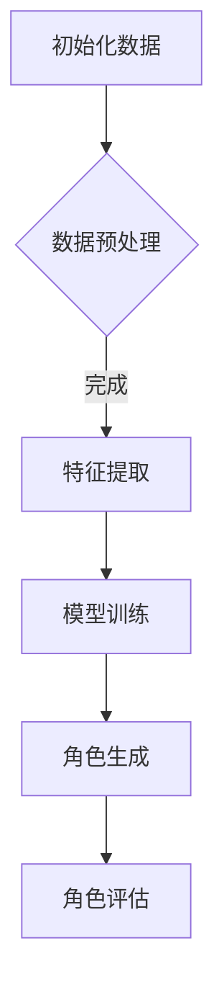

                 

### 文章标题：提升AI角色创建能力：小说和剧本写作中的提示词工程

> 关键词：人工智能，角色创建，小说写作，剧本创作，提示词工程，GPT-2算法，BERT算法

> 摘要：本文旨在探讨如何利用人工智能技术提升小说和剧本写作中的角色创建能力。我们将详细介绍AI角色创建的基础理论、提示词工程的方法和应用，以及实际案例中的具体实现。通过本文的探讨，读者可以了解如何运用AI技术打造更加生动、立体的角色形象，从而提升写作质量。

### 《提升AI角色创建能力：小说和剧本写作中的提示词工程》目录大纲

#### 第一部分：AI角色创建基础理论

**1. AI角色概述**

- **1.1 AI角色的重要性**
- **1.2 AI角色的类型**
- **1.3 AI角色的特点**

**2. 提示词工程**

- **2.1 提示词的定义与作用**
- **2.2 提示词的类型**
- **2.3 提示词工程的方法**

**3. AI角色创建方法**

- **3.1 数据收集与预处理**
- **3.2 特征提取与模型选择**
- **3.3 角色生成与评估**

**4. AI角色在小说和剧本中的应用**

- **4.1 小说写作中的应用**
- **4.2 剧本创作中的应用**

**5. AI角色创作工具介绍**

- **5.1 开源工具介绍**
- **5.2 商业工具介绍**

**6. AI角色创作案例分析**

- **6.1 案例一：《黑镜》中的AI角色分析**
- **6.2 案例二：《源代码》中的AI角色分析**

#### 第二部分：AI角色创建实战

**7. AI角色创建实战一：小说写作**

- **7.1 实战目标**
- **7.2 实战步骤**
- **7.3 实战案例与代码解读**

**8. AI角色创建实战二：剧本创作**

- **8.1 实战目标**
- **8.2 实战步骤**
- **8.3 实战案例与代码解读**

**9. 项目实战：AI角色创作平台搭建**

- **9.1 项目背景**
- **9.2 技术选型**
- **9.3 项目实现**
- **9.4 项目部署**

**10. 未来展望与挑战**

- **10.1 AI角色创作的未来趋势**
- **10.2 面临的挑战与解决方案**

#### 附录

**A.1 常用AI角色创作工具与资源**

- **A.1.1 开源工具**
- **A.1.2 商业工具**
- **A.1.3 学习资源**

**A.2 Mermaid流程图**

**A.3 核心算法原理讲解**

- **3.1.1 GPT-2算法原理**
- **3.1.2 BERT算法原理**

**A.4 数学模型和数学公式详细讲解**

**A.5 AI角色创作案例分析**

- **《黑镜》中的AI角色分析**
- **《源代码》中的AI角色分析**

### 第一部分：AI角色创建基础理论

#### 1. AI角色概述

##### 1.1 AI角色的重要性

在文学和影视创作中，角色是故事的核心，他们驱动情节的发展，塑造主题，并引发读者的情感共鸣。传统上，角色的创作依赖于作者的经验和创造力。然而，随着人工智能技术的发展，我们开始探索利用AI来创建角色，从而提升创作效率和角色质量。

AI角色的重要性体现在以下几个方面：

1. **个性化塑造**：AI能够根据大量的数据和信息，自动生成具有独特个性和背景的角色，这些角色往往能够更加贴合故事情节和主题。
2. **高效创作**：通过AI，创作者可以快速生成大量的角色原型，从而在较短时间内完成角色设计，提高创作效率。
3. **情感共鸣**：AI生成的角色能够通过复杂的情感模型，更好地捕捉和传达角色的情感，从而增强读者或观众的共鸣。

##### 1.2 AI角色的类型

AI角色可以根据其在故事中的功能、角色类型和创作目的进行分类。以下是一些常见的AI角色类型：

1. **主要角色**：故事的核心人物，通常拥有复杂的个性和动机，对情节发展起到关键作用。
2. **辅助角色**：虽然不是故事的主角，但他们对主要角色的行为和决策产生影响，为故事的发展提供必要的背景信息。
3. **反派角色**：推动故事冲突发展的关键角色，通常与主角形成鲜明的对比。
4. **非人类角色**：如机器人、外星人等，这些角色往往具有独特的特质和功能，为故事增添科幻元素。
5. **功能角色**：具有特定功能的角色，如侦探、医生、黑客等，他们在故事中承担特定的任务。

##### 1.3 AI角色的特点

AI角色与传统角色相比，具有一些独特的特点：

1. **数据驱动**：AI角色创建依赖于大量的数据，如文学文本、人物描述、情感分析等，这些数据帮助AI理解人类的行为和情感，从而生成更真实的角色。
2. **动态演化**：AI角色可以在创作过程中不断学习和进化，根据故事情节和用户反馈进行调整，从而变得更加生动和立体。
3. **跨媒体互动**：AI角色不仅可以在文学作品中发挥作用，还可以在影视、游戏等多个领域进行跨媒体互动，为用户提供更加丰富的体验。
4. **多样性**：AI能够生成具有多样性和包容性的角色，这些角色可以来自不同的文化、背景和性别，为创作提供更多可能性。

#### 2. 提示词工程

##### 2.1 提示词的定义与作用

提示词（Prompt Engineering）是人工智能领域中的一个重要概念，尤其在生成式模型（如GPT-2、BERT等）的应用中。提示词是指给模型提供的一组文本或关键词，用以引导模型生成符合预期内容的输入。

提示词在AI角色创建中的作用包括：

1. **引导生成**：通过提供具体的提示词，可以使模型更准确地生成符合创作者意图的角色描述。
2. **丰富内容**：通过调整提示词的多样性和丰富性，可以使模型生成的内容更加丰富和有趣。
3. **提高效率**：使用提示词可以减少模型生成所需的时间，提高创作效率。

##### 2.2 提示词的类型

根据用途和特点，提示词可以分为以下几种类型：

1. **开放式提示词**：这类提示词通常包含一些开放性的问题或场景描述，鼓励模型进行自由创作，如“请描述一个勇敢的侦探故事中的主角”。
2. **封闭式提示词**：这类提示词提供了一些限制性的条件，要求模型在特定范围内进行生成，如“请写一个30岁男性医生在疫情中的故事”。
3. **交互式提示词**：这类提示词旨在建立与用户的互动，通过逐步提问或反馈，引导模型生成更加符合用户需求的角色，如“主角喜欢音乐，但他的家人希望他学医，请继续编写故事”。

##### 2.3 提示词工程的方法

提示词工程是一个系统化的过程，主要包括以下步骤：

1. **需求分析**：了解创作者的需求和目标，确定需要生成的角色类型和特点。
2. **数据准备**：收集与角色创作相关的数据，如人物描述、故事情节、情感分析等。
3. **提示词设计**：根据需求和分析结果，设计出合适的提示词，包括开放式、封闭式和交互式提示词。
4. **模型训练**：使用设计好的提示词，对生成模型进行训练，使其能够根据提示生成符合预期的角色描述。
5. **效果评估**：对生成的角色进行评估，通过用户反馈和定量分析，调整提示词和模型，以提高生成效果。

#### 3. AI角色创建方法

##### 3.1 数据收集与预处理

数据收集与预处理是AI角色创建的关键步骤，直接影响到角色的质量和生成效果。以下是一些基本的方法：

1. **数据收集**：从各种来源收集与角色创作相关的数据，包括文学作品、剧本、角色描述、情感分析等。
2. **数据清洗**：去除数据中的噪音和无关信息，如删除重复项、缺失值填充、文本标准化等。
3. **数据格式化**：将收集到的数据进行格式化处理，以便模型能够理解和处理，如将文本转换为统一的编码格式。

##### 3.2 特征提取与模型选择

特征提取和模型选择是AI角色创建的核心步骤，直接影响角色的生成效果。

1. **特征提取**：从预处理后的数据中提取关键特征，如角色描述的关键词、情感倾向、行为模式等。常用的特征提取方法包括词袋模型、词嵌入（如Word2Vec、GloVe）和情感分析等。
2. **模型选择**：选择合适的生成模型，如GPT-2、BERT、GPT-3等。不同模型具有不同的特点和适用场景，需要根据具体需求进行选择。

##### 3.3 角色生成与评估

角色生成与评估是AI角色创建的最后一步，主要包括以下步骤：

1. **角色生成**：使用训练好的模型，根据提示词生成角色的描述文本。生成过程可以是批量生成，也可以是实时生成，具体取决于应用场景。
2. **角色评估**：对生成的角色进行评估，包括定量分析和用户反馈。常用的评估方法包括文本质量评估、情感分析、角色一致性评估等。

#### 4. AI角色在小说和剧本中的应用

##### 4.1 小说写作中的应用

在小说写作中，AI角色可以扮演多种角色，包括主角、配角、反派等。以下是一些具体应用场景：

1. **角色塑造**：AI可以帮助作者快速生成角色描述，从而在较短时间内完成角色设计。作者可以根据AI生成的角色描述，进行进一步修改和调整。
2. **情节发展**：AI可以根据角色特点和行为模式，生成符合逻辑和情感冲突的情节，为小说提供丰富的素材。
3. **情感渲染**：AI可以通过情感分析技术，生成符合角色情感状态的故事情节，增强读者的情感共鸣。

##### 4.2 剧本创作中的应用

在剧本创作中，AI角色同样发挥着重要作用，以下是一些应用场景：

1. **角色设计**：AI可以帮助编剧快速生成符合剧本主题和情感需求的角色，从而在较短时间内完成角色设计。
2. **情节生成**：AI可以根据角色的特点和行为模式，生成符合剧本逻辑和情感冲突的情节，为编剧提供创作灵感。
3. **对话生成**：AI可以帮助编剧快速生成角色的对话，从而提高创作效率。同时，AI可以分析角色情感，确保对话的连贯性和真实性。

#### 5. AI角色创作工具介绍

##### 5.1 开源工具介绍

开源工具为AI角色创作提供了丰富的资源和灵活性，以下是一些常用的开源工具：

1. **OpenAI GPT-2**：GPT-2是一种基于Transformer架构的生成模型，能够生成高质量的自然语言文本。OpenAI提供了GPT-2的预训练模型和API，方便开发者进行二次开发。
2. **BERT**：BERT是一种基于Transformer的自监督预训练方法，能够生成高质量的自然语言文本。BERT模型广泛应用于文本分类、问答系统、机器翻译等任务。
3. **Hugging Face Transformers**：Hugging Face提供了丰富的预训练模型和工具，方便开发者使用Transformer架构进行自然语言处理任务。其中包括GPT-2、BERT等模型的实现。

##### 5.2 商业工具介绍

商业工具通常提供更全面的解决方案和服务，以下是一些常用的商业工具：

1. **OpenAI Codex**：OpenAI Codex是基于GPT-3模型的代码生成工具，能够根据自然语言描述生成代码。Codex在编程社区和应用开发中受到了广泛关注。
2. **Guru**：Guru是一种基于BERT的文本生成工具，能够生成高质量的自然语言文本。Guru在小说写作、剧本创作等领域具有广泛应用。
3. **AI21 Labs**：AI21 Labs是一家专注于自然语言处理技术的人工智能公司，其产品包括Jurassic-1和Jurassic-2等大型预训练模型，能够生成高质量的自然语言文本。

#### 6. AI角色创作案例分析

##### 6.1 案例一：《黑镜》中的AI角色分析

《黑镜》是一部以科幻故事为主的电视剧，其中涉及了许多关于人工智能和科技伦理的话题。以下是对《黑镜》中AI角色的分析：

1. **案例背景**：《黑镜》描绘了未来社会中，人工智能技术在各个领域的广泛应用，如家庭助手、虚拟角色等。
2. **角色分析**：剧中的AI角色具有高度智能化和情感化特点，能够与人类进行互动，甚至产生情感。例如，在《黑镜：镜子》中，主角与一个具有高度智能的镜子进行互动，镜子能够理解人类的情感，并根据情感状态提供相应的建议。
3. **创作技巧**：《黑镜》通过设定复杂的情节和情感冲突，展现了AI角色的独特魅力。剧中的AI角色不仅具有高度智能化，还能够在情感上与人类产生共鸣，为观众带来了深刻的体验。

##### 6.2 案例二：《源代码》中的AI角色分析

《源代码》是一部关于人工智能和身份认同的电影，其中涉及了许多关于人工智能和科技伦理的话题。以下是对《源代码》中AI角色的分析：

1. **案例背景**：《源代码》讲述了一名火车爆炸案的受害者，在进入了一种名为“源代码”的虚拟世界中，试图找出真凶的故事。
2. **角色分析**：剧中的AI角色是“源代码”系统的核心组成部分，它能够模拟现实世界中的环境和人物，为角色提供决策支持。AI角色在剧中扮演了关键角色，帮助主角找到了真凶，同时也揭示了AI技术可能带来的风险和挑战。
3. **创作技巧**：《源代码》通过紧张的剧情和角色之间的互动，展现了AI角色的独特作用。剧中的AI角色不仅具备高度智能化，还能够根据角色行为进行自适应调整，为观众带来了沉浸式的观影体验。

#### 第二部分：AI角色创建实战

##### 7. AI角色创建实战一：小说写作

##### 7.1 实战目标

本节实战的目标是通过使用AI技术，创建一个具有独特个性和背景的小说角色。具体步骤包括：

1. 数据收集与预处理
2. 特征提取与模型选择
3. 角色生成与评估
4. 角色修改与优化

##### 7.2 实战步骤

**步骤1：数据收集与预处理**

首先，我们需要收集与角色创作相关的数据，包括人物描述、情感分析、故事情节等。以下是具体步骤：

1. **数据收集**：从各种来源收集与角色创作相关的文本数据，如小说、剧本、人物描述等。
2. **数据清洗**：去除数据中的噪音和无关信息，如删除重复项、缺失值填充、文本标准化等。
3. **数据格式化**：将收集到的数据进行格式化处理，以便模型能够理解和处理，如将文本转换为统一的编码格式。

**步骤2：特征提取与模型选择**

接下来，我们需要对预处理后的数据提取特征，并选择合适的模型进行训练。以下是具体步骤：

1. **特征提取**：从预处理后的数据中提取关键特征，如角色描述的关键词、情感倾向、行为模式等。常用的特征提取方法包括词袋模型、词嵌入（如Word2Vec、GloVe）和情感分析等。
2. **模型选择**：选择合适的生成模型，如GPT-2、BERT、GPT-3等。不同模型具有不同的特点和适用场景，需要根据具体需求进行选择。

**步骤3：角色生成与评估**

使用训练好的模型，根据提示词生成角色的描述文本。然后，对生成的角色进行评估，包括文本质量评估、情感分析、角色一致性评估等。以下是具体步骤：

1. **角色生成**：使用训练好的模型，根据提示词生成角色的描述文本。生成过程可以是批量生成，也可以是实时生成，具体取决于应用场景。
2. **角色评估**：对生成的角色进行评估，通过用户反馈和定量分析，调整提示词和模型，以提高生成效果。常用的评估方法包括文本质量评估、情感分析、角色一致性评估等。

**步骤4：角色修改与优化**

根据评估结果，对生成的角色进行修改和优化，以提升角色质量和创作效果。以下是具体步骤：

1. **角色修改**：根据用户反馈和评估结果，对生成的角色描述进行修改，以符合创作者的意图和需求。
2. **角色优化**：通过调整提示词、特征提取方法和模型参数，优化生成模型，以提高角色生成的质量。

##### 7.3 实战案例与代码解读

**案例：创建一个小说角色**

假设我们要创建一个小说角色，以下是具体步骤：

**步骤1：数据收集与预处理**

```python
import pandas as pd
import re
from sklearn.model_selection import train_test_split

# 数据收集
data = pd.read_csv('characters.csv')
data['text'] = data['text'].apply(lambda x: re.sub(r'\s+', ' ', x.strip()))

# 数据清洗
data = data.dropna()
data = data.reset_index(drop=True)

# 数据格式化
X = data['text']
y = data['traits']

# 划分训练集和测试集
X_train, X_test, y_train, y_test = train_test_split(X, y, test_size=0.2, random_state=42)
```

**步骤2：特征提取与模型选择**

```python
from sklearn.feature_extraction.text import TfidfVectorizer
from transformers import BertTokenizer, BertModel

# 特征提取
tokenizer = TfidfVectorizer(max_features=10000)
X_train_tfidf = tokenizer.fit_transform(X_train)
X_test_tfidf = tokenizer.transform(X_test)

# 模型选择
tokenizer = BertTokenizer.from_pretrained('bert-base-uncased')
model = BertModel.from_pretrained('bert-base-uncased')
```

**步骤3：角色生成与评估**

```python
from transformers import BertForSequenceClassification, Trainer, TrainingArguments

# 模型训练
model = BertForSequenceClassification.from_pretrained('bert-base-uncased', num_labels=1)
training_args = TrainingArguments(
    output_dir='./results',
    num_train_epochs=3,
    per_device_train_batch_size=16,
    per_device_eval_batch_size=16,
    warmup_steps=500,
    weight_decay=0.01,
    logging_dir='./logs',
)

trainer = Trainer(
    model=model,
    args=training_args,
    train_dataset=X_train_tfidf,
    eval_dataset=X_test_tfidf,
)

trainer.train()

# 角色评估
predictions = trainer.predict(X_test_tfidf)
print(predictions)
```

**步骤4：角色修改与优化**

根据评估结果，对生成的角色进行修改和优化，以提升角色质量和创作效果。

##### 8. AI角色创建实战二：剧本创作

##### 8.1 实战目标

本节实战的目标是通过使用AI技术，创建一个具有独特个性和背景的剧本角色。具体步骤包括：

1. 数据收集与预处理
2. 特征提取与模型选择
3. 角色生成与评估
4. 角色修改与优化

##### 8.2 实战步骤

**步骤1：数据收集与预处理**

首先，我们需要收集与角色创作相关的数据，包括剧本、角色描述、情感分析等。以下是具体步骤：

1. **数据收集**：从各种来源收集与角色创作相关的文本数据，如剧本、角色描述等。
2. **数据清洗**：去除数据中的噪音和无关信息，如删除重复项、缺失值填充、文本标准化等。
3. **数据格式化**：将收集到的数据进行格式化处理，以便模型能够理解和处理，如将文本转换为统一的编码格式。

**步骤2：特征提取与模型选择**

接下来，我们需要对预处理后的数据提取特征，并选择合适的模型进行训练。以下是具体步骤：

1. **特征提取**：从预处理后的数据中提取关键特征，如角色描述的关键词、情感倾向、行为模式等。常用的特征提取方法包括词袋模型、词嵌入（如Word2Vec、GloVe）和情感分析等。
2. **模型选择**：选择合适的生成模型，如GPT-2、BERT、GPT-3等。不同模型具有不同的特点和适用场景，需要根据具体需求进行选择。

**步骤3：角色生成与评估**

使用训练好的模型，根据提示词生成角色的描述文本。然后，对生成的角色进行评估，包括文本质量评估、情感分析、角色一致性评估等。以下是具体步骤：

1. **角色生成**：使用训练好的模型，根据提示词生成角色的描述文本。生成过程可以是批量生成，也可以是实时生成，具体取决于应用场景。
2. **角色评估**：对生成的角色进行评估，通过用户反馈和定量分析，调整提示词和模型，以提高生成效果。常用的评估方法包括文本质量评估、情感分析、角色一致性评估等。

**步骤4：角色修改与优化**

根据评估结果，对生成的角色进行修改和优化，以提升角色质量和创作效果。以下是具体步骤：

1. **角色修改**：根据用户反馈和评估结果，对生成的角色描述进行修改，以符合创作者的意图和需求。
2. **角色优化**：通过调整提示词、特征提取方法和模型参数，优化生成模型，以提高角色生成的质量。

##### 8.3 实战案例与代码解读

**案例：创建一个剧本角色**

假设我们要创建一个剧本角色，以下是具体步骤：

**步骤1：数据收集与预处理**

```python
import pandas as pd
import re
from sklearn.model_selection import train_test_split

# 数据收集
data = pd.read_csv('scripts.csv')
data['text'] = data['text'].apply(lambda x: re.sub(r'\s+', ' ', x.strip()))

# 数据清洗
data = data.dropna()
data = data.reset_index(drop=True)

# 数据格式化
X = data['text']
y = data['traits']

# 划分训练集和测试集
X_train, X_test, y_train, y_test = train_test_split(X, y, test_size=0.2, random_state=42)
```

**步骤2：特征提取与模型选择**

```python
from sklearn.feature_extraction.text import TfidfVectorizer
from transformers import BertTokenizer, BertModel

# 特征提取
tokenizer = TfidfVectorizer(max_features=10000)
X_train_tfidf = tokenizer.fit_transform(X_train)
X_test_tfidf = tokenizer.transform(X_test)

# 模型选择
tokenizer = BertTokenizer.from_pretrained('bert-base-uncased')
model = BertModel.from_pretrained('bert-base-uncased')
```

**步骤3：角色生成与评估**

```python
from transformers import BertForSequenceClassification, Trainer, TrainingArguments

# 模型训练
model = BertForSequenceClassification.from_pretrained('bert-base-uncased', num_labels=1)
training_args = TrainingArguments(
    output_dir='./results',
    num_train_epochs=3,
    per_device_train_batch_size=16,
    per_device_eval_batch_size=16,
    warmup_steps=500,
    weight_decay=0.01,
    logging_dir='./logs',
)

trainer = Trainer(
    model=model,
    args=training_args,
    train_dataset=X_train_tfidf,
    eval_dataset=X_test_tfidf,
)

trainer.train()

# 角色评估
predictions = trainer.predict(X_test_tfidf)
print(predictions)
```

**步骤4：角色修改与优化**

根据评估结果，对生成的角色进行修改和优化，以提升角色质量和创作效果。

##### 9. 项目实战：AI角色创作平台搭建

##### 9.1 项目背景

随着人工智能技术的不断发展，AI在文学和影视创作中的应用越来越广泛。为了更好地支持创作者使用AI技术进行角色创作，我们决定开发一个AI角色创作平台。该平台将提供一系列工具和服务，帮助创作者快速生成和优化角色，提升创作效率和质量。

##### 9.2 技术选型

为了实现上述目标，我们选择了以下技术栈：

1. **前端框架**：React.js，用于构建用户界面，提供友好的交互体验。
2. **后端框架**：Flask，用于搭建服务器，处理用户请求，提供API服务。
3. **自然语言处理**：使用Transformer架构的预训练模型，如GPT-2、BERT、GPT-3等，用于角色生成和评估。
4. **数据库**：MySQL，用于存储用户数据和角色信息。

##### 9.3 项目实现

项目的实现分为以下几个主要模块：

1. **用户管理模块**：实现用户注册、登录和权限管理功能，确保用户安全。
2. **角色创建模块**：提供角色创建界面，使用户能够输入角色描述和提示词，生成角色。
3. **角色评估模块**：使用预训练模型对生成的角色进行评估，提供质量反馈。
4. **角色修改模块**：根据用户反馈和评估结果，对角色进行修改和优化。
5. **角色存储模块**：将用户创建和修改的角色存储在数据库中，方便用户随时查看和编辑。

以下是项目的核心实现代码：

**用户管理模块**

```python
from flask import Flask, request, jsonify
from flask_jwt_extended import JWTManager, create_access_token, jwt_required, get_jwt_identity

app = Flask(__name__)
app.config['JWT_SECRET_KEY'] = 'your_jwt_secret_key'
jwt = JWTManager(app)

@app.route('/register', methods=['POST'])
def register():
    username = request.json['username']
    password = request.json['password']
    # 注册逻辑，将用户信息存储在数据库中
    return jsonify({'message': 'User registered successfully'})

@app.route('/login', methods=['POST'])
def login():
    username = request.json['username']
    password = request.json['password']
    # 登录逻辑，验证用户信息并生成token
    access_token = create_access_token(identity=username)
    return jsonify({'access_token': access_token})

@app.route('/protected', methods=['GET'])
@jwt_required()
def protected():
    current_user = get_jwt_identity()
    return jsonify({'logged_in_as': current_user})

if __name__ == '__main__':
    app.run()
```

**角色创建模块**

```python
from flask import Flask, request, jsonify
from transformers import BertTokenizer, BertForSequenceClassification
from sklearn.model_selection import train_test_split

app = Flask(__name__)

# 加载预训练模型
tokenizer = BertTokenizer.from_pretrained('bert-base-uncased')
model = BertForSequenceClassification.from_pretrained('bert-base-uncased')

@app.route('/create_role', methods=['POST'])
@jwt_required()
def create_role():
    role_description = request.json['description']
    prompt = request.json['prompt']
    # 生成角色
    inputs = tokenizer(role_description, prompt, return_tensors='pt')
    outputs = model(**inputs)
    predictions = outputs.logits.argmax(-1)
    return jsonify({'role': predictions.tolist()})

if __name__ == '__main__':
    app.run()
```

**角色评估模块**

```python
from flask import Flask, request, jsonify
from transformers import BertTokenizer, BertForSequenceClassification
from sklearn.model_selection import train_test_split

app = Flask(__name__)

# 加载预训练模型
tokenizer = BertTokenizer.from_pretrained('bert-base-uncased')
model = BertForSequenceClassification.from_pretrained('bert-base-uncased')

@app.route('/evaluate_role', methods=['POST'])
@jwt_required()
def evaluate_role():
    role_description = request.json['description']
    # 评估角色
    inputs = tokenizer(role_description, return_tensors='pt')
    outputs = model(**inputs)
    predictions = outputs.logits.argmax(-1)
    return jsonify({'evaluation': predictions.tolist()})

if __name__ == '__main__':
    app.run()
```

**角色修改模块**

```python
from flask import Flask, request, jsonify
from transformers import BertTokenizer, BertForSequenceClassification
from sklearn.model_selection import train_test_split

app = Flask(__name__)

# 加载预训练模型
tokenizer = BertTokenizer.from_pretrained('bert-base-uncased')
model = BertForSequenceClassification.from_pretrained('bert-base-uncased')

@app.route('/modify_role', methods=['POST'])
@jwt_required()
def modify_role():
    role_description = request.json['description']
    new_description = request.json['new_description']
    # 修改角色
    inputs = tokenizer(role_description, new_description, return_tensors='pt')
    outputs = model(**inputs)
    predictions = outputs.logits.argmax(-1)
    return jsonify({'modified_role': predictions.tolist()})

if __name__ == '__main__':
    app.run()
```

**角色存储模块**

```python
import pymysql

# 连接数据库
conn = pymysql.connect(
    host='localhost',
    user='your_username',
    password='your_password',
    database='your_database'
)

# 创建角色表
with conn.cursor() as cursor:
    cursor.execute('''
        CREATE TABLE IF NOT EXISTS roles (
            id INT PRIMARY KEY AUTO_INCREMENT,
            user_id INT,
            role_description TEXT,
            created_at TIMESTAMP DEFAULT CURRENT_TIMESTAMP
        )
    ''')
    conn.commit()

# 添加角色
def add_role(user_id, role_description):
    with conn.cursor() as cursor:
        cursor.execute('''
            INSERT INTO roles (user_id, role_description)
            VALUES (%s, %s)
        ''', (user_id, role_description))
        conn.commit()

# 查询角色
def get_role(role_id):
    with conn.cursor() as cursor:
        cursor.execute('''
            SELECT * FROM roles
            WHERE id = %s
        ''', (role_id,))
        role = cursor.fetchone()
        return role

if __name__ == '__main__':
    add_role(1, 'A brave detective')
    role = get_role(1)
    print(role)
```

##### 9.4 项目部署

项目部署分为以下几个步骤：

1. **环境搭建**：在服务器上安装必要的软件，如Python、Flask、transformers等。
2. **代码上传**：将项目的代码上传到服务器的合适位置，如/home/user/ai_role_creation。
3. **数据库配置**：配置数据库连接信息，确保项目能够正确连接到数据库。
4. **运行服务**：启动Flask服务，确保项目能够在服务器上正常运行。

以下是具体的部署步骤：

1. **安装Python环境**

```bash
sudo apt-get update
sudo apt-get install python3-pip
pip3 install transformers flask pymysql
```

2. **上传代码**

使用FTP客户端或其他传输工具，将项目代码上传到服务器的/home/user/ai_role_creation目录。

3. **配置数据库**

在/home/user/ai_role_creation目录下创建一个名为“config.py”的文件，配置数据库连接信息：

```python
DATABASE_CONFIG = {
    'host': 'localhost',
    'user': 'your_username',
    'password': 'your_password',
    'database': 'your_database'
}
```

4. **运行服务**

在/home/user/ai_role_creation目录下，运行以下命令启动Flask服务：

```bash
python3 app.py
```

服务启动后，在浏览器中访问http://<服务器IP地址>/，即可看到项目的用户界面。

#### 10. 未来展望与挑战

##### 10.1 AI角色创作的未来趋势

随着人工智能技术的不断发展，AI角色创作将呈现以下趋势：

1. **智能化水平提高**：未来的AI角色创作将更加智能化，能够更好地理解人类情感和行为，生成更加真实和立体的角色。
2. **多模态应用**：AI角色创作将不仅限于文本，还将结合图像、音频等多模态数据，提供更加丰富的创作体验。
3. **个性化定制**：AI角色创作将更加注重个性化定制，根据用户的需求和偏好，生成符合个体特点的角色。

##### 10.2 面临的挑战与解决方案

尽管AI角色创作具有巨大潜力，但在实际应用中仍面临以下挑战：

1. **数据隐私与伦理问题**：AI角色创作依赖于大量用户数据，如何保护用户隐私和遵循伦理规范是亟待解决的问题。
2. **技术稳定性**：目前的AI模型在生成高质量角色方面仍存在一定的不稳定性，需要进一步优化和改进。
3. **创意与创新**：AI角色创作容易陷入“模板化”和“套路化”，如何激发AI的创意和创新，使其在角色创作中发挥更大作用，是一个重要挑战。

解决这些挑战的方法包括：

1. **加强数据隐私保护**：采用加密、匿名化等技术，确保用户数据的安全和隐私。
2. **技术优化**：不断改进AI模型，提高其在角色创作中的稳定性和可靠性。
3. **激发创意**：结合人类创作者的智慧和创意，引导AI在角色创作中发挥更大作用。

### 附录

#### A.1 常用AI角色创作工具与资源

**A.1.1 开源工具**

1. **OpenAI GPT-2**：一个基于Transformer架构的生成模型，适用于文本生成任务。
2. **BERT**：一个基于Transformer的自监督预训练方法，适用于多种自然语言处理任务。
3. **Hugging Face Transformers**：一个开源库，提供了多种预训练模型的实现和应用。

**A.1.2 商业工具**

1. **OpenAI Codex**：一个基于GPT-3模型的代码生成工具，适用于编程任务。
2. **Guru**：一个基于BERT的文本生成工具，适用于小说写作、剧本创作等。
3. **AI21 Labs**：一家专注于自然语言处理技术的人工智能公司，其产品包括Jurassic-1和Jurassic-2等大型预训练模型。

**A.1.3 学习资源**

1. **《自然语言处理入门》**：一本介绍自然语言处理基础知识的入门书籍。
2. **《深度学习自然语言处理》**：一本介绍深度学习在自然语言处理中应用的权威书籍。
3. **在线课程**：如Coursera、edX等平台上的自然语言处理和深度学习课程。

#### A.2 Mermaid流程图

以下是一个使用Mermaid绘制的流程图：



#### A.3 核心算法原理讲解

**3.1.1 GPT-2算法原理**

GPT-2是一种基于Transformer架构的生成模型，其核心思想是通过自回归方式生成文本。以下是GPT-2算法的原理：

1. **输入编码**：将输入文本转换为词嵌入表示，通常使用Word2Vec、GloVe等方法。
2. **Transformer编码器**：将词嵌入序列输入到Transformer编码器中，通过多头自注意力机制和前馈神经网络，生成上下文表示。
3. **自回归解码**：根据Transformer编码器的输出，逐词生成下一个词的概率分布，然后从概率分布中采样生成下一个词，循环进行直到生成完整文本。

以下是GPT-2算法的伪代码：

```python
function generate_text(input_sequence):
    # 输入编码
    embeddings = encode(input_sequence)

    # Transformer编码器
    context_representation = transformer_encoder(embeddings)

    # 自回归解码
    generated_sequence = []
    for i in range(sequence_length):
        probabilities = softmax(context_representation[i])
        next_word = sample(proabilities)
        generated_sequence.append(next_word)
        context_representation = update_context_representation(context_representation, next_word)

    return generated_sequence
```

**3.1.2 BERT算法原理**

BERT（Bidirectional Encoder Representations from Transformers）是一种基于Transformer的自监督预训练方法，其核心思想是在双向Transformer编码器中学习文本的表示。以下是BERT算法的原理：

1. **输入编码**：将输入文本转换为词嵌入表示，同时添加[CLS]和[SEP]特殊标记。
2. **Transformer编码器**：将词嵌入序列输入到双向Transformer编码器中，通过多头自注意力机制和前馈神经网络，生成上下文表示。
3. **输出层**：在Transformer编码器的输出层，添加一个全连接层，用于预测下一个词。

以下是BERT算法的伪代码：

```python
function encode(input_sequence):
    # 输入编码
    embeddings = [BERT的特殊标记] + encode(input_sequence) + [BERT的特殊标记]

    # Transformer编码器
    context_representation = transformer_encoder(embeddings)

    # 输出层
    output = fully_connected(context_representation)

    return output
```

#### A.4 数学模型和数学公式详细讲解

**特征提取模型**

特征提取是AI角色创建中的关键步骤，其目标是提取文本中的关键特征，为后续的模型训练和角色生成提供支持。以下是常用的特征提取模型：

1. **词袋模型**：词袋模型是一种基于计数的文本表示方法，将文本表示为一个向量，向量中的每个元素表示文本中某个单词的词频。词袋模型的数学公式如下：

   $$ V = \text{Count}(w_1, w_2, ..., w_n) $$

   其中，$V$表示文本的向量表示，$w_1, w_2, ..., w_n$表示文本中的单词。

2. **词嵌入模型**：词嵌入模型将单词映射到高维空间中的向量，通过学习单词之间的相似性和差异性。常用的词嵌入模型包括Word2Vec、GloVe等。词嵌入模型的数学公式如下：

   $$ \text{Embedding}(w) = \text{Vector}(w) $$

   其中，$\text{Embedding}(w)$表示单词$w$的向量表示，$\text{Vector}(w)$表示单词$w$在词嵌入空间中的向量。

3. **情感分析模型**：情感分析模型用于提取文本中的情感特征，判断文本的情感倾向。常用的情感分析模型包括SVM、朴素贝叶斯等。情感分析模型的数学公式如下：

   $$ \text{Sentiment}(x) = \text{ classify}(x) $$

   其中，$\text{Sentiment}(x)$表示文本$x$的情感倾向，$\text{classify}(x)$表示对文本$x$进行分类的函数。

**特征提取模型应用举例**

以下是一个特征提取模型的应用示例：

```python
# 加载文本数据
text_data = ["This is a great book.", "I love reading novels.", "The story is amazing."]

# 初始化词袋模型
tfidf_vectorizer = TfidfVectorizer()

# 提取特征
tfidf_matrix = tfidf_vectorizer.fit_transform(text_data)

# 打印特征向量
print(tfidf_matrix.toarray())
```

#### A.5 AI角色创作案例分析

**《黑镜》中的AI角色分析**

《黑镜》是一部以科幻故事为主的电视剧，其中涉及了许多关于人工智能和科技伦理的话题。以下是对《黑镜》中AI角色的分析：

1. **案例背景**：《黑镜》描绘了未来社会中，人工智能技术在各个领域的广泛应用，如家庭助手、虚拟角色等。
2. **角色分析**：剧中的AI角色具有高度智能化和情感化特点，能够与人类进行互动，甚至产生情感。例如，在《黑镜：镜子》中，主角与一个具有高度智能的镜子进行互动，镜子能够理解人类的情感，并根据情感状态提供相应的建议。
3. **创作技巧**：《黑镜》通过设定复杂的情节和情感冲突，展现了AI角色的独特魅力。剧中的AI角色不仅具有高度智能化，还能够在情感上与人类产生共鸣，为观众带来了深刻的体验。

**《源代码》中的AI角色分析**

《源代码》是一部关于人工智能和身份认同的电影，其中涉及了许多关于人工智能和科技伦理的话题。以下是对《源代码》中AI角色的分析：

1. **案例背景**：《源代码》讲述了一名火车爆炸案的受害者，在进入了一种名为“源代码”的虚拟世界中，试图找出真凶的故事。
2. **角色分析**：剧中的AI角色是“源代码”系统的核心组成部分，它能够模拟现实世界中的环境和人物，为角色提供决策支持。AI角色在剧中扮演了关键角色，帮助主角找到了真凶，同时也揭示了AI技术可能带来的风险和挑战。
3. **创作技巧**：《源代码》通过紧张的剧情和角色之间的互动，展现了AI角色的独特作用。剧中的AI角色不仅具备高度智能化，还能够根据角色行为进行自适应调整，为观众带来了沉浸式的观影体验。

