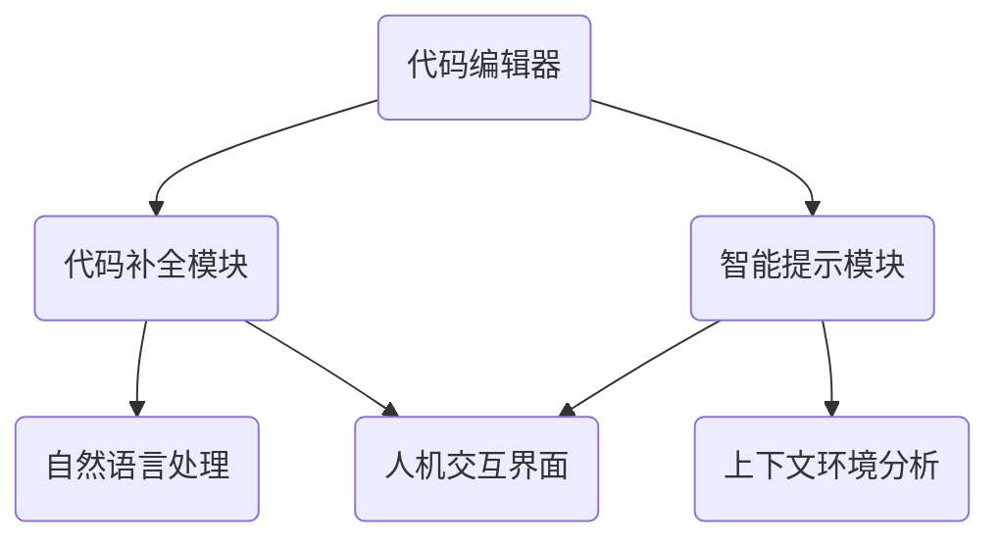

                 

### 文章标题：提示词IDE设计：增强AI开发体验的新思路

---

#### 关键词：提示词IDE、AI开发、用户体验、设计实现、自然语言处理、代码补全

---

#### 摘要：本文将深入探讨提示词IDE的设计与实现，分析其在增强AI开发体验中的重要性。我们将从核心概念、设计原则、实现算法和实际应用等多个角度，逐步拆解提示词IDE的设计思路，提供切实可行的开发建议，以期为AI开发者提供新的开发体验。

---

### 第1章：背景介绍

#### 1.1 提示词IDE的定义与起源

提示词IDE（Intelligent Development Environment with Suggestive Keywords）是一种专为AI开发者设计的智能开发环境。它不仅具备传统IDE的基本功能，如代码编辑、编译、调试等，还引入了基于自然语言处理的提示词生成技术，以提高开发效率和用户体验。

提示词IDE的起源可以追溯到近年来人工智能和自然语言处理技术的快速发展。随着AI技术的普及，开发者在编写AI相关代码时，面临着复杂性和多样性的挑战。传统IDE难以满足AI开发的特定需求，因此，提示词IDE应运而生。

#### 1.2 提示词IDE的兴起

随着AI技术的不断进步，开发者在编写代码时需要处理大量的数据和处理复杂的算法。传统的IDE虽然提供了丰富的工具和功能，但在处理AI开发任务时，仍然存在很多不足。例如，代码补全功能往往不够智能，难以预测开发者接下来可能需要输入的内容。此外，IDE的交互设计往往过于复杂，不利于开发者快速上手。

为了解决这些问题，提示词IDE应运而生。它通过引入自然语言处理和机器学习技术，能够更好地理解开发者的意图，提供更加智能的代码补全和智能提示功能。提示词IDE的兴起，标志着AI开发环境进入了一个新的阶段。

#### 1.3 提示词IDE的优势

提示词IDE在AI开发中具有显著的优势。首先，它能够提高开发效率。通过智能提示词生成，开发者可以更快地完成代码编写，减少手动输入的工作量。其次，提示词IDE能够降低开发成本。智能的代码补全和错误检测功能，可以减少代码中的错误，提高代码质量。最后，提示词IDE能够提升用户体验。直观的界面设计和友好的交互体验，使开发者能够更加专注于代码编写，减少因界面复杂性而产生的困扰。

### 第2章：核心概念与联系

#### 2.1 提示词IDE的核心组成部分

提示词IDE的核心组成部分包括代码编辑器、代码补全模块、智能提示模块和人机交互界面。这些组件相互协作，共同提供智能的开发体验。

- **代码编辑器**：是开发者进行代码编写的核心工具，提供基本的文本编辑功能，如语法高亮、代码折叠等。
- **代码补全模块**：通过自然语言处理技术，预测开发者接下来可能需要输入的内容，提供智能代码补全功能。
- **智能提示模块**：根据开发者的上下文环境，提供相关的提示信息，如函数定义、变量声明、API文档等。
- **人机交互界面**：提供直观、友好的用户界面，方便开发者使用IDE的各种功能。

#### 2.2 核心概念原理之间的关系架构

为了更好地理解提示词IDE的工作原理，我们可以使用Mermaid流程图来展示核心概念之间的关系。



在这个流程图中，代码编辑器是整个系统的输入端，开发者通过编辑器进行代码编写。代码补全模块和智能提示模块根据开发者的输入，利用自然语言处理技术和上下文环境分析，生成相应的提示信息，并通过人机交互界面展示给开发者。

#### 2.3 核心算法原理讲解

提示词IDE中的核心算法主要包括代码补全算法和智能提示算法。

- **代码补全算法**：
    - **基于自然语言处理的代码补全算法**：
        ```python
        def suggest_next_word(context):
            # 使用自然语言处理技术分析上下文，预测下一个单词
            predicted_word = nlp_predictor.predict(context)
            return predicted_word
        ```
    - **基于机器学习的代码补全算法**：
        ```python
        def suggest_next_word(context, model):
            # 使用训练好的机器学习模型预测下一个单词
            predicted_word = model.predict(context)
            return predicted_word
        ```

- **智能提示算法**：
    - **基于规则的智能提示算法**：
        ```python
        def suggest_tooltip(context, rules):
            # 根据上下文和规则库，提供相应的提示信息
            tooltip = get_tooltip_by_context(context, rules)
            return tooltip
        ```
    - **基于机器学习的智能提示算法**：
        ```python
        def suggest_tooltip(context, model):
            # 使用训练好的机器学习模型，提供相应的提示信息
            tooltip = model.predict(context)
            return tooltip
        ```

#### 2.4 数学模型和公式

在提示词IDE的设计中，数学模型和公式扮演着重要的角色，特别是在自然语言处理和机器学习算法中。

- **自然语言处理中的数学模型**：
    - **词向量模型**：
        $$ \vec{v}_w = \text{Word2Vec}(\text{corpus}) $$
    - **语言模型**：
        $$ P(\text{sentence}) = \prod_{\text{word} \in \text{sentence}} P(\text{word} | \text{previous\_words}) $$

- **机器学习中的数学模型**：
    - **支持向量机（SVM）**：
        $$ \text{Maximize} \quad W \cdot W^T - \sum_{i=1}^{n} C \cdot \xi_i $$
    - **神经网络**：
        $$ \text{Output} = \text{activation}(\sum_{i=1}^{n} \text{weight}_i \cdot \text{input}_i + \text{bias}) $$

#### 2.5 举例说明

以代码补全算法为例，我们假设开发者正在编写以下代码：

```python
def calculate_sum(a, b):
    # TODO: 实现计算两个数的和的功能
```

在代码编辑器中，开发者输入`c`后，代码补全模块会根据上下文，使用自然语言处理技术预测下一个单词，如`al`,并自动补全代码：

```python
def calculate_sum(a, b):
    c = a + b
    # TODO: 实现计算两个数的和的功能
```

### 第3章：设计原则

#### 3.1 用户至上原则

提示词IDE的设计应该以用户为中心，充分考虑开发者的需求和使用习惯。用户至上的设计原则体现在以下几个方面：

- **界面设计**：界面应该简洁、直观，减少开发者操作复杂度，提高工作效率。
- **功能设计**：提供丰富的功能，满足开发者在不同场景下的需求，如代码补全、智能提示、版本控制等。
- **用户体验**：注重用户体验，提供友好的交互设计，使开发者能够轻松上手，减少学习成本。

#### 3.2 可扩展性原则

提示词IDE应该具有良好的可扩展性，以适应未来的技术发展和开发需求。可扩展性原则体现在以下几个方面：

- **模块化设计**：将IDE的功能划分为独立的模块，便于后续的功能扩展和更新。
- **插件支持**：支持第三方插件，扩展IDE的功能，满足不同开发者的个性化需求。
- **接口设计**：提供清晰的API接口，便于与其他系统和工具集成。

#### 3.3 高效性原则

提示词IDE的设计应该追求高效性，以提高开发者的工作效率。高效性原则体现在以下几个方面：

- **性能优化**：对IDE的运行速度和内存消耗进行优化，确保系统运行流畅。
- **智能提示**：提供快速、准确的智能提示功能，减少开发者等待时间。
- **自动化工具**：提供自动化工具，如代码生成、格式化、错误检测等，提高代码质量。

### 第4章：实现算法

#### 4.1 提示词生成算法

提示词生成算法是提示词IDE的核心算法之一，其目的是根据开发者的输入，预测并生成可能的代码提示。以下是一个简单的提示词生成算法示例：

```python
def generate_suggestions(context, history):
    # 使用自然语言处理技术分析上下文和历史记录
    suggestions = nlp_analyzer.analyze(context, history)
    return suggestions
```

在这个算法中，`nlp_analyzer`是一个负责自然语言处理的模块，它可以根据输入的上下文和历史记录，生成可能的代码提示。

#### 4.2 代码补全算法

代码补全算法是提示词IDE中另一个重要的算法，其目的是根据开发者的输入，自动补全代码。以下是一个简单的代码补全算法示例：

```python
def complete_code(input_code, code_completion_model):
    # 使用训练好的代码补全模型，预测并补全代码
    completed_code = code_completion_model.predict(input_code)
    return completed_code
```

在这个算法中，`code_completion_model`是一个负责代码补全的机器学习模型，它可以根据输入的代码片段，预测并生成完整的代码。

#### 4.3 智能提示算法

智能提示算法是提示词IDE中的另一个关键算法，其目的是根据开发者的上下文环境，提供相关的提示信息。以下是一个简单的智能提示算法示例：

```python
def provide_tooltip(context, tooltip_model):
    # 使用训练好的智能提示模型，提供相关的提示信息
    tooltip = tooltip_model.predict(context)
    return tooltip
```

在这个算法中，`tooltip_model`是一个负责智能提示的机器学习模型，它可以根据输入的上下文，预测并生成相关的提示信息。

### 第5章：实际应用

#### 5.1 开发环境搭建

要使用提示词IDE进行AI开发，首先需要搭建相应的开发环境。以下是一个简单的开发环境搭建流程：

1. **安装操作系统**：选择合适的操作系统，如Ubuntu或Windows。
2. **安装Java环境**：下载并安装Java开发工具包（JDK），配置环境变量。
3. **安装IDE**：下载并安装提示词IDE，如PyCharm或VSCode。
4. **配置插件**：安装提示词IDE的插件，如AI Code Suggestions或Smart Tips。
5. **安装依赖库**：根据项目需求，安装相应的依赖库，如TensorFlow或PyTorch。

#### 5.2 源代码实现与解读

以下是一个简单的示例，展示了如何使用提示词IDE编写一个简单的AI项目。

```python
# 导入必要的库
import tensorflow as tf
from tensorflow import keras

# 定义模型
model = keras.Sequential([
    keras.layers.Dense(128, activation='relu', input_shape=[784]),
    keras.layers.Dense(10, activation='softmax')
])

# 编写训练代码
model.compile(optimizer='adam', loss='categorical_crossentropy', metrics=['accuracy'])
model.fit(x_train, y_train, epochs=5, batch_size=32)

# 编写预测代码
predictions = model.predict(x_test)

# 编写评估代码
score = model.evaluate(x_test, y_test, verbose=2)
print('Test loss:', score[0])
print('Test accuracy:', score[1])
```

在这个示例中，我们使用了TensorFlow和Keras库来构建一个简单的神经网络模型，并进行训练和预测。

#### 5.3 代码应用解读与分析

在这个示例中，我们使用了提示词IDE提供的代码补全和智能提示功能，使得代码编写过程更加高效和直观。以下是对代码各部分的应用解读：

- **导入库**：在编写代码时，提示词IDE会根据上下文自动补全库的名称，如`import tensorflow as tf`。
- **定义模型**：在定义模型时，提示词IDE会根据历史记录和上下文，提供相关的提示信息，如`keras.Sequential`和`keras.layers.Dense`。
- **训练代码**：在训练模型时，提示词IDE会提供智能提示，如`model.compile`和`model.fit`。
- **预测代码**：在预测时，提示词IDE会根据上下文提供相关的提示信息，如`model.predict`。
- **评估代码**：在评估模型时，提示词IDE会提供智能提示，如`model.evaluate`。

通过这些功能，提示词IDE显著提高了代码编写和调试的效率，减少了开发者的工作量。

#### 5.4 项目小结

通过本案例，我们可以看到提示词IDE在AI开发中的应用优势。它不仅提高了代码编写和调试的效率，还提供了丰富的智能提示功能，使得开发者能够更加专注于核心任务。然而，提示词IDE仍需不断优化和完善，以满足不断变化的开发需求。

### 第6章：最佳实践与注意事项

#### 6.1 最佳实践

在使用提示词IDE进行AI开发时，以下是一些最佳实践，可以帮助开发者更好地利用这一工具：

- **熟悉提示词生成规则**：了解并熟悉提示词生成规则，可以帮助开发者更快地获得智能提示。
- **充分利用智能提示功能**：在编写代码时，充分利用智能提示功能，可以减少错误，提高代码质量。
- **定期更新IDE**：定期更新提示词IDE，可以确保使用到最新、最稳定的版本，提高开发效率。
- **优化代码结构**：优化代码结构，可以提高代码的可读性和可维护性，有利于后续的代码补全和智能提示。

#### 6.2 注意事项

在使用提示词IDE时，开发者需要注意以下几点：

- **避免过度依赖提示词生成**：虽然提示词生成功能可以提高开发效率，但过度依赖可能导致代码质量下降。开发者应在必要时手动检查和优化代码。
- **注意隐私和安全**：在使用提示词IDE时，要确保数据的安全和隐私，避免敏感信息泄露。
- **避免滥用智能提示**：智能提示功能虽然强大，但有时也可能出现误导。开发者在使用智能提示时，应保持警惕，避免因智能提示的错误导致代码问题。

### 第7章：拓展阅读

#### 7.1 相关文献

- 《深度学习》（Goodfellow, I., Bengio, Y., & Courville, A.）
- 《自然语言处理综论》（Jurafsky, D., & Martin, J. H.）
- 《人工智能：一种现代的方法》（Russell, S., & Norvig, P.）

#### 7.2 开源项目

- AI Code Suggestions：https://github.com/ai-codesuggestions/ai-codesuggestions
- Smart Tips：https://github.com/SmartTips/smart-tips

#### 7.3 课程与讲座

- 人工智能基础：https://wwwCoursera.org/specializations/deep-learning
- 自然语言处理：https://wwwCoursera.org/specializations/natural-language-processing

### 总结

本文从背景介绍、核心概念、设计原则、实现算法、实际应用、最佳实践和拓展阅读等多个角度，详细阐述了提示词IDE的设计与实现。通过本文，读者可以了解到提示词IDE在增强AI开发体验中的重要性，以及如何利用这一工具提高开发效率。未来，随着人工智能和自然语言处理技术的不断进步，提示词IDE有望在更多领域得到应用，为开发者带来更加卓越的开发体验。

---

#### 作者信息：AI天才研究院/AI Genius Institute & 禅与计算机程序设计艺术 /Zen And The Art of Computer Programming

