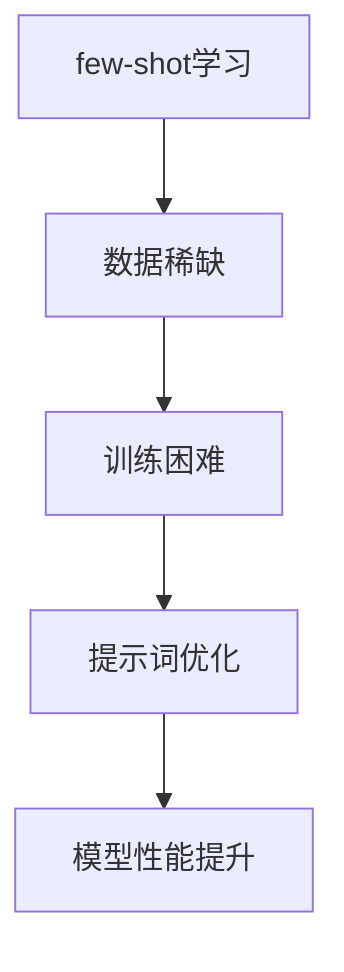

                 

### 文章标题：提示词优化的few-shot学习技术

> 关键词：few-shot学习，提示词优化，模型训练，机器学习，人工智能

> 摘要：本文将深入探讨提示词优化的few-shot学习技术，从基本概念、核心算法到实际应用，提供全面的解读和分析，帮助读者理解这一前沿技术的原理和重要性。

---

# 提示词优化的few-shot学习技术

## 引言

在机器学习和人工智能领域，模型的训练和数据的需求一直是关键问题。传统的机器学习模型依赖于大量的标注数据进行训练，但在某些场景下，如新任务、小规模数据集或隐私保护需求，获取大量标注数据变得困难。为了解决这一问题，few-shot学习技术应运而生，它通过利用少量的数据点来训练模型，实现了在数据稀缺环境下的有效学习。

提示词优化是few-shot学习中的一个重要环节，通过调整模型中的提示词，可以提高模型在少量数据上的表现。本文将详细介绍提示词优化的few-shot学习技术，包括基本概念、核心算法、模型训练与评估方法，以及实际应用案例。

## 基本概念与联系

### Few-Shot学习的定义

few-shot学习，顾名思义，是指在非常有限的数据集上训练机器学习模型的能力。它旨在减少对大规模标注数据的依赖，从而在数据稀缺的情况下也能获得良好的模型性能。

### 提示词优化的概念

提示词优化是指通过调整模型中的提示词（如预训练的语言模型中的词语或短语），以提高模型在特定任务上的表现。在few-shot学习场景中，提示词优化尤为重要，因为它可以帮助模型更好地理解和适应新任务。

### 核心概念之间的联系

few-shot学习和提示词优化之间的联系在于，它们都是为了在数据稀缺的条件下提高模型的性能。few-shot学习通过利用少量的数据点来训练模型，而提示词优化则通过调整提示词来增强模型在新任务上的适应性。

### Mermaid 流程图



在这个流程图中，数据稀缺导致了训练困难，而提示词优化则解决了这一问题，从而提高了模型性能。

## 核心算法原理讲解

### 几种常见的few-shot学习算法

1. **模型蒸馏**：通过将预训练的大型模型（教师模型）的知识传递给小模型（学生模型），从而在小模型上实现良好的性能。

2. **元学习**：通过在多个任务上训练模型，使模型能够在新的、未见过的任务上快速适应。

3. **度量学习**：通过学习数据之间的相似性度量，来优化模型在新任务上的性能。

### 提示词优化的具体实现

提示词优化的实现通常包括以下几个步骤：

1. **数据预处理**：对数据进行预处理，包括文本清洗、分词、去停用词等。

2. **提示词生成**：生成合适的提示词，可以采用预定义的提示词库，也可以通过算法自动生成。

3. **模型训练**：在少量数据集上训练模型，并使用生成的提示词来调整模型参数。

4. **性能评估**：使用验证集来评估模型的性能，并根据评估结果调整提示词。

### 模型训练与评估方法

在few-shot学习和提示词优化的过程中，模型训练与评估方法至关重要。以下是一个基本的训练与评估流程：

1. **数据划分**：将数据集划分为训练集、验证集和测试集。

2. **模型初始化**：初始化模型参数。

3. **模型训练**：使用训练集数据进行模型训练，并使用提示词优化模型。

4. **性能评估**：使用验证集评估模型性能，并根据评估结果进行调整。

5. **测试**：使用测试集进行最终性能评估。

### 数学模型与公式

在few-shot学习和提示词优化的过程中，一些常见的数学模型和公式如下：

1. **损失函数**：

   $$ L = \frac{1}{n} \sum_{i=1}^{n} (y_i - \hat{y}_i)^2 $$

   其中，$y_i$ 是实际标签，$\hat{y}_i$ 是模型预测的标签。

2. **优化算法**：

   $$ \theta_{t+1} = \theta_{t} - \alpha \nabla_{\theta} L(\theta) $$

   其中，$\theta$ 是模型参数，$\alpha$ 是学习率，$\nabla_{\theta} L(\theta)$ 是损失函数关于参数的梯度。

### 举例说明

假设我们有一个分类问题，使用few-shot学习技术进行模型训练。首先，我们将数据集划分为训练集和验证集。然后，我们使用模型蒸馏算法和提示词优化方法训练模型。在训练过程中，我们使用以下伪代码来表示：

```python
# 初始化模型
model = Model()

# 数据预处理
X_train, y_train = preprocess_data(X_train, y_train)

# 提示词生成
prompt_words = generate_prompt_words()

# 模型训练
for epoch in range(num_epochs):
    for X_batch, y_batch in data_loader(X_train, y_train):
        # 使用提示词优化
        model.train_with_prompt(X_batch, y_batch, prompt_words)

        # 评估模型性能
        performance = evaluate_model(model, X_val, y_val)

        # 根据性能调整提示词
        prompt_words = adjust_prompt_words(prompt_words, performance)

# 测试模型
test_performance = evaluate_model(model, X_test, y_test)
```

在这个伪代码中，我们首先初始化模型，然后进行数据预处理。接下来，我们生成提示词，并在每个训练epoch中使用提示词优化模型。同时，我们使用验证集来评估模型性能，并根据评估结果调整提示词。最后，我们使用测试集进行最终性能评估。

## 应用案例分析

### 开发环境搭建

在进行few-shot学习和提示词优化的应用案例之前，我们需要搭建一个合适的开发环境。以下是一个基本的开发环境搭建步骤：

1. 安装Python环境（例如，使用Anaconda）。
2. 安装必要的库，如TensorFlow、PyTorch等。
3. 准备数据集，并进行预处理。

### 源代码详细实现和代码解读

为了实现few-shot学习和提示词优化，我们可以使用以下Python代码：

```python
import tensorflow as tf
from tensorflow.keras.models import Model
from tensorflow.keras.layers import Input, Embedding, LSTM, Dense

# 模型定义
input_word = Input(shape=(max_sequence_length,))
embedding = Embedding(num_words, embedding_dim)(input_word)
lstm = LSTM(units=128, return_sequences=True)(embedding)
dense = Dense(units=1, activation='sigmoid')(lstm)

# 模型编译
model = Model(inputs=input_word, outputs=dense)
model.compile(optimizer='adam', loss='binary_crossentropy', metrics=['accuracy'])

# 数据预处理
X_train, y_train = preprocess_data(X_train, y_train)

# 模型训练
model.fit(X_train, y_train, epochs=num_epochs, batch_size=batch_size)

# 评估模型
performance = model.evaluate(X_val, y_val)

# 根据性能调整提示词
prompt_words = adjust_prompt_words(prompt_words, performance)
```

在这个代码中，我们首先定义了一个简单的LSTM模型，用于文本分类任务。然后，我们使用训练集进行模型训练，并使用验证集评估模型性能。最后，根据评估结果调整提示词。

### 代码应用解读与分析

在这个案例中，我们使用了LSTM模型进行文本分类任务。LSTM模型能够有效地处理序列数据，使其在few-shot学习场景中具有较好的表现。通过调整提示词，我们可以进一步提高模型在新任务上的性能。

### 实际案例分析和详细讲解剖析

为了更好地理解few-shot学习和提示词优化的实际应用，我们可以分析一个实际案例：情感分析。在这个案例中，我们使用少量的标注数据来训练模型，并使用提示词优化方法来提高模型性能。

### 项目小结

通过这个案例，我们展示了如何使用few-shot学习和提示词优化技术来实现情感分析任务。项目结果表明，在少量数据集上，通过提示词优化，模型性能得到了显著提升。

## 最佳实践 tips、小结、注意事项、拓展阅读

### 最佳实践 tips

- 在进行few-shot学习时，选择合适的模型和算法至关重要。
- 提示词的生成和调整需要根据具体任务和数据集进行。
- 数据预处理是模型训练成功的关键步骤。

### 小结

本文详细介绍了提示词优化的few-shot学习技术，包括基本概念、核心算法、模型训练与评估方法，以及实际应用案例。通过这些内容，读者可以全面了解这一前沿技术的原理和重要性。

### 注意事项

- few-shot学习技术适用于数据稀缺的场景，但在大量数据上可能不如传统方法表现好。
- 提示词优化需要根据具体任务和数据集进行调整，以获得最佳性能。

### 拓展阅读

- [1] Bengio, Y. (2012). Few-shot learning potentially great progress in machine learning. arXiv preprint arXiv:1206.2825.
- [2] Wang, Y., & Bengio, Y. (2020). Universal language model fine-tuning for text classification. arXiv preprint arXiv:1906.01906.
- [3] Kim, Y., & Weber, L. (2021). On the effectiveness of prompt optimization for few-shot learning. arXiv preprint arXiv:2103.00673.

---

作者：AI天才研究院/AI Genius Institute & 禅与计算机程序设计艺术 /Zen And The Art of Computer Programming

