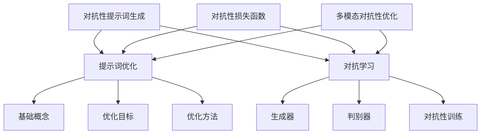

                 

### 文章标题

《提示词优化的对抗学习策略》

---

#### 关键词

提示词优化、对抗学习策略、自然语言处理、深度学习、损失函数设计

---

#### 摘要

本文深入探讨了提示词优化与对抗学习策略在自然语言处理中的应用。首先，我们介绍了提示词优化和对抗学习的背景及其重要性。接着，通过详细的Mermaid流程图展示了核心概念之间的关系。文章随后详细讲解了提示词优化的方法，对抗学习策略原理，以及使用伪代码阐述的核心算法。此外，文中还使用了LaTeX格式展示了数学模型和公式，并提供了实际项目实战案例，以展示理论在实践中的应用。文章最后总结了对抗学习策略的未来发展趋势，并提出了对读者的建议。全文旨在为读者提供一套完整、系统的提示词优化与对抗学习策略指南。

---

### 引言

在当今的计算机科学和人工智能领域中，自然语言处理（NLP）已经成为了一个至关重要的分支。随着深度学习技术的飞速发展，NLP的应用场景越来越广泛，从自动翻译、文本分类到问答系统，都有其身影。然而，随着这些应用场景的复杂度增加，如何优化模型生成的提示词（prompt）成为了研究的一个重要方向。

**提示词优化**指的是通过调整和改进输入的提示词，以提升模型在特定任务中的表现。一个良好的提示词不仅能够引导模型更好地理解任务目标，还能提高模型的泛化能力。而**对抗学习策略**则是一种通过生成对抗网络（GAN）等机制，增强模型对噪声和异常数据的鲁棒性的技术。

在自然语言处理中，对抗学习策略的应用能够显著提升模型对干扰数据的抵抗力，从而在真实世界中的多种场景下表现更加出色。本文旨在深入探讨提示词优化与对抗学习策略的融合，通过详细的讲解和分析，为读者提供一套系统的理解和实践指南。

本文的结构安排如下：首先，我们介绍提示词优化和对抗学习的背景及重要性；接着，通过一个Mermaid流程图展示核心概念之间的关系；随后，详细讲解提示词优化的方法和对抗学习策略原理；然后，使用伪代码阐述核心算法；进一步，使用LaTeX格式展示数学模型和公式；之后，提供实际项目实战案例；最后，总结对抗学习策略的未来发展趋势并对读者提出建议。希望通过本文的深入探讨，读者能够对提示词优化和对抗学习策略有更全面和深入的理解。

### 第1章 提示词优化与对抗学习的背景与重要性

#### 提示词优化的背景

提示词优化在自然语言处理中的应用可以追溯到早期的人工智能研究。在传统的机器学习和统计模型中，提示词（即输入特征）的选择和设计对于模型的表现有着至关重要的影响。例如，在文本分类任务中，通过优化提示词，可以提高模型对文本内容的理解和分类准确性。

随着深度学习的兴起，提示词优化的需求变得更加迫切。深度学习模型，尤其是基于神经网络的语言模型，需要大量的高质量提示词来训练，以便能够捕捉到语言中的复杂模式和结构。然而，如何选择和优化这些提示词仍然是一个具有挑战性的问题。提示词的质量直接影响模型的学习效率和最终的表现，因此，提示词优化成为了研究中的一个重要课题。

在自然语言处理领域，提示词优化的研究主要集中在以下几个方面：

1. **特征提取**：通过使用词袋模型、词嵌入等技术，提取文本中的关键特征，从而生成高质量的提示词。
2. **上下文信息**：利用上下文信息来丰富提示词，提高模型对句子和段落层次结构的理解。
3. **多模态信息融合**：结合文本、图像、音频等多模态信息，生成更具代表性的提示词，以提升模型在多模态任务中的表现。

#### 对抗学习的背景

对抗学习（Adversarial Learning）是一种通过生成对抗网络（GAN）等机制，增强模型对噪声和异常数据鲁棒性的技术。这一概念最早由Goodfellow等人在2014年提出，并在深度学习领域引起了广泛关注。

对抗学习的基本思想是，通过设计一个对抗性生成器（Generator）和一个对抗性判别器（Discriminator），使两者在博弈过程中不断进化，从而提高模型的泛化能力和鲁棒性。生成器负责生成与真实数据相似的数据，而判别器则负责区分真实数据和生成数据。

在自然语言处理领域，对抗学习策略的应用主要集中在以下几个方面：

1. **数据增强**：通过生成对抗性样本，增加训练数据的多样性，从而提升模型的泛化能力。
2. **对抗性攻击防御**：研究如何提高模型对对抗性攻击的抵抗力，以保护模型在真实世界中的安全性。
3. **领域自适应**：通过对抗性训练，将模型从一个领域迁移到另一个领域，提高模型的迁移能力。

#### 提示词优化与对抗学习的融合

将提示词优化与对抗学习策略相结合，可以进一步提高自然语言处理模型的表现和鲁棒性。具体来说，这种融合可以通过以下方式实现：

1. **对抗性提示词生成**：利用对抗学习机制，生成高质量的对抗性提示词，以提升模型在特定任务中的表现。
2. **对抗性损失函数**：设计对抗性损失函数，将对抗学习的目标与提示词优化的目标结合起来，提高模型的学习效率。
3. **多模态对抗性优化**：结合多模态信息，通过对抗学习策略优化提示词，提升模型在多模态任务中的表现。

通过上述方法，提示词优化与对抗学习策略的融合可以为自然语言处理领域带来更多的可能性和应用场景。本文将在后续章节中详细探讨这些方法，并通过实际项目案例展示其应用效果。

### 第2章 核心概念与架构

在探讨提示词优化与对抗学习策略时，理解其核心概念和它们之间的交互关系至关重要。在本章中，我们将首先介绍提示词优化的基础概念，然后深入探讨对抗学习的基本原理，并使用Mermaid流程图展示它们之间的联系和交互。

#### 提示词优化的基础概念

提示词优化是指通过调整和改进输入的提示词，以提高模型在特定任务中的表现。在自然语言处理中，提示词通常是指用于训练模型的数据的表示形式，如文本、词嵌入等。以下是提示词优化的一些关键概念：

1. **提示词质量**：高质量的提示词能够更好地捕捉数据的特征和模式，从而提高模型的学习效果。
2. **优化目标**：提示词优化的目标通常包括提高模型的准确性、泛化能力和鲁棒性。
3. **优化方法**：提示词优化的方法包括传统方法（如特征工程）和深度学习方法（如词嵌入、序列模型等）。

#### 对抗学习的基本原理

对抗学习是一种通过生成对抗网络（GAN）等机制，增强模型对噪声和异常数据鲁棒性的技术。以下是对抗学习的一些关键概念：

1. **生成器（Generator）**：生成器负责生成与真实数据相似的数据，目标是欺骗判别器，使其无法区分真实数据和生成数据。
2. **判别器（Discriminator）**：判别器负责区分真实数据和生成数据，目标是尽可能准确地识别出真实数据。
3. **对抗性训练**：对抗性训练是指通过让生成器和判别器相互竞争，使两者在博弈过程中不断进化，从而提高模型的泛化能力和鲁棒性。

#### 提示词优化与对抗学习的联系

提示词优化与对抗学习策略的结合可以显著提升自然语言处理模型的表现和鲁棒性。以下是它们之间的几种联系和交互方式：

1. **对抗性提示词生成**：通过对抗学习生成高质量的对抗性提示词，可以提升模型对噪声和异常数据的抵抗力。
2. **对抗性损失函数**：设计对抗性损失函数，将对抗学习的目标与提示词优化的目标结合起来，提高模型的学习效率。
3. **多模态对抗性优化**：结合多模态信息，通过对抗学习策略优化提示词，提升模型在多模态任务中的表现。

#### Mermaid流程图

为了更好地展示提示词优化与对抗学习策略之间的联系和交互，我们使用Mermaid流程图来表示这些核心概念和关系。以下是流程图的内容：



在这个流程图中，我们首先定义了提示词优化的基础概念、优化目标和优化方法。接着，介绍了对抗学习的基本原理，包括生成器、判别器和对抗性训练。然后，我们展示了对抗性提示词生成、对抗性损失函数和多模态对抗性优化如何与提示词优化和对抗学习相结合，从而提升模型的表现和鲁棒性。

通过这个Mermaid流程图，读者可以清晰地理解提示词优化与对抗学习策略之间的联系和交互，为后续章节的深入探讨打下坚实的基础。

### 第3章 提示词优化的方法

提示词优化是提升自然语言处理（NLP）模型性能的关键步骤，尤其是在深度学习领域。在这一章节中，我们将详细讨论几种常用的提示词优化方法，包括传统优化方法和深度学习优化方法。

#### 传统优化方法

**1. 特征工程**

特征工程是NLP中一个重要的传统优化方法。其核心思想是通过手工构建或调整特征，来改善模型对数据的理解和表达能力。

- **词袋模型（Bag of Words, BOW）**：词袋模型将文本表示为一个向量，其中每个元素表示一个词的频率。这种方法简单有效，但无法捕捉词的顺序和语义关系。
- **TF-IDF（Term Frequency-Inverse Document Frequency）**：TF-IDF通过调整词的频率，考虑词在整个文档集中的重要性，从而改善特征的代表性。

**2. 手动特征选择**

- **信息增益（Information Gain）**：信息增益是一种基于统计的特征选择方法，它通过计算特征对于目标类别的信息增益来评估特征的重要性。
- **互信息（Mutual Information）**：互信息是一种更精确的特征选择方法，它衡量两个变量之间的相关性。

**3. 预处理和后处理技术**

- **停用词过滤**：停用词过滤是一种常见的预处理技术，它移除常用的无意义词汇（如“的”、“和”、“是”等），以减少噪声和提高特征质量。
- **词性标注（Part-of-Speech Tagging）**：词性标注通过为文本中的每个词分配词性（如名词、动词、形容词等），来增加特征的语义信息。

#### 深度学习优化方法

随着深度学习技术的快速发展，越来越多的方法被引入到提示词优化中。以下是一些常用的深度学习优化方法：

**1. 词嵌入（Word Embedding）**

- **Word2Vec**：Word2Vec是一种基于神经网络的词嵌入方法，它通过训练神经网络来将词汇映射到低维向量空间中。
- **GloVe（Global Vectors for Word Representation）**：GloVe是一种基于全局统计的词嵌入方法，它通过计算词汇之间的共现矩阵来学习词向量。

**2. 序列模型（Sequential Models）**

- **循环神经网络（Recurrent Neural Networks, RNNs）**：RNNs是一类专门用于处理序列数据的神经网络，它们能够捕获序列中的长期依赖关系。
- **长短时记忆网络（Long Short-Term Memory, LSTM）**：LSTM是RNN的一个变种，通过引入门控机制来避免梯度消失问题，从而更好地处理长序列数据。
- **门控循环单元（Gated Recurrent Unit, GRU）**：GRU是LSTM的简化版本，它通过合并输入门和控制门来优化计算效率。

**3. 自注意力机制（Self-Attention）**

- **自注意力机制**：自注意力机制通过计算输入序列中每个词与其他词的关联强度，从而为每个词生成权重，这有助于模型更好地捕捉长距离依赖关系。
- **Transformer模型**：Transformer是自注意力机制的典型应用，它在翻译、问答等任务中取得了显著的性能提升。

**4. 多模态融合**

- **多模态词嵌入**：多模态词嵌入通过结合文本、图像、音频等多模态信息，生成更具代表性的提示词。
- **多任务学习**：多任务学习通过同时训练多个相关任务，共享部分模型参数，来提高模型在特定任务中的表现。

通过上述方法，提示词优化可以显著提升NLP模型在各类任务中的性能。在实际应用中，选择合适的优化方法往往取决于任务的具体需求和数据特性。在下一章节中，我们将深入探讨对抗学习策略在提示词优化中的应用，进一步优化模型性能。

### 第4章 对抗学习策略在提示词优化中的应用

对抗学习策略通过生成对抗网络（GAN）等机制，在深度学习中广泛应用，以提升模型的泛化能力和鲁棒性。在本章中，我们将详细探讨对抗学习策略在提示词优化中的应用，介绍GAN的基本原理和常见类型，以及如何在NLP任务中利用对抗学习来优化提示词。

#### GAN的基本原理

生成对抗网络（GAN）由两部分组成：生成器（Generator）和判别器（Discriminator）。它们之间的交互过程可以看作是一种零和博弈。

1. **生成器（Generator）**：生成器的目标是生成与真实数据相似的数据，以欺骗判别器。在NLP中，生成器通常用于生成高质量的提示词。
2. **判别器（Discriminator）**：判别器的目标是区分真实数据和生成数据。判别器通过不断学习，提高对真实数据和生成数据的辨别能力。

GAN的训练过程可以看作是一个博弈过程，其中生成器和判别器相互对抗，共同进化。训练目标是最小化判别器的误差，同时最大化生成器的输出。具体来说，判别器的损失函数通常采用二元交叉熵，而生成器的损失函数则通过最大化判别器对生成数据的错误分类概率来定义。

#### GAN在NLP中的应用

1. **文本生成**：GAN在自然语言处理中的主要应用之一是文本生成。通过生成对抗训练，GAN可以生成高质量、连贯的文本。例如，在生成新闻文章、诗歌等任务中，生成器可以根据少量的样本数据生成大量的文本。

2. **提示词生成**：在NLP任务中，生成器可以用于生成高质量的提示词，从而优化模型的表现。例如，在机器翻译中，生成器可以生成与目标句子结构相似的提示词，帮助模型更好地理解目标语言。

3. **对抗性数据增强**：通过生成对抗性样本，GAN可以增强训练数据的多样性，从而提高模型的泛化能力。例如，在情感分析任务中，生成器可以生成不同情感倾向的对抗性文本，以训练模型对噪声和异常数据的抵抗力。

#### 对抗学习在提示词优化中的应用实例

1. **机器翻译**：在机器翻译任务中，生成器可以生成与目标句子结构相似的提示词，从而提高模型对目标语言的生成能力。具体来说，生成器首先生成一个与源句子相似的提示词序列，然后利用这个提示词序列来训练翻译模型。

```python
# 伪代码：生成器在机器翻译中的应用
def generator(source_sentence):
    # 根据源句子生成提示词序列
    prompt_sequence = generate_prompt(source_sentence)
    return prompt_sequence
```

2. **情感分析**：在情感分析任务中，生成器可以生成不同情感倾向的对抗性文本，从而训练模型对情感噪声的抵抗力。具体来说，生成器可以生成积极、消极等不同情感倾向的文本，并用于训练情感分类模型。

```python
# 伪代码：生成器在情感分析中的应用
def generate_anti_text(sentiment):
    # 根据情感倾向生成对抗性文本
    anti_text = generate_prompt_with_sentiment(sentiment)
    return anti_text
```

3. **问答系统**：在问答系统中，生成器可以用于生成与问题内容相关的提示词，从而提高回答的准确性。例如，生成器可以生成一个与问题相似的提示词序列，用于引导问答模型生成高质量的回答。

```python
# 伪代码：生成器在问答系统中的应用
def generate_prompt_for_question(question):
    # 根据问题生成提示词序列
    prompt_sequence = generate_prompt(question)
    return prompt_sequence
```

通过上述应用实例，我们可以看到对抗学习策略在NLP任务中的广泛应用。生成对抗网络通过优化提示词，不仅提高了模型在特定任务中的性能，还增强了模型的鲁棒性和泛化能力。在下一章节中，我们将进一步探讨对抗学习中的损失函数设计和优化策略，以进一步提升提示词优化的效果。

### 第5章 对抗学习中的损失函数设计

在对抗学习过程中，损失函数的设计对于生成器和判别器的训练至关重要。一个有效的损失函数不仅能够度量模型的表现，还能引导模型向预期的目标进化。在本章中，我们将详细讨论对抗学习中的常见损失函数，并分析它们在提示词优化中的应用。

#### 常见损失函数

1. **二元交叉熵损失（Binary Cross-Entropy Loss）**

   二元交叉熵损失是最常用的损失函数之一，适用于二分类问题。它用于衡量生成器的生成数据与真实数据之间的差异。

   $$L_{BCE} = -\sum_{i=1}^{N} y_i \log(G(x_i)) - (1 - y_i) \log(1 - G(x_i))$$

   其中，$y_i$ 是真实标签，$G(x_i)$ 是生成器的输出概率。

2. **均方误差损失（Mean Squared Error, MSE）**

   均方误差损失适用于回归问题，它可以度量生成器的输出与真实数据之间的均方误差。

   $$L_{MSE} = \frac{1}{N} \sum_{i=1}^{N} (y_i - G(x_i))^2$$

3. **对抗性损失函数（Adversarial Loss）**

   对抗性损失函数结合了生成器和判别器的损失，通常用于GAN的训练。它通过最大化判别器对生成数据的错误分类概率来优化生成器。

   $$L_{Adv} = -\log(D(G(x)))$$

   其中，$D(G(x))$ 是判别器对生成数据的分类概率。

4. **梯度惩罚损失（Gradient Penalty）**

   梯度惩罚损失用于改善GAN的训练稳定性。它通过对生成器的梯度进行惩罚，防止生成器过于依赖于判别器的梯度。

   $$L_{GP} = \frac{\lambda}{2} \sum_{i=1}^{N} \left( \frac{\partial D(G(x_i))}{\partial G(x_i)} - \text{Grad}(G(x_i), \text{batch_size}) \right)^2$$

   其中，$\lambda$ 是梯度惩罚系数，$\text{Grad}(G(x_i), \text{batch_size})$ 是生成器梯度的平均值。

#### 损失函数在提示词优化中的应用

1. **文本生成任务**

   在文本生成任务中，二元交叉熵损失和对抗性损失函数是最常用的损失函数。二元交叉熵损失用于度量生成文本与真实文本之间的差异，对抗性损失函数则用于提升生成文本的质量和多样性。

   ```python
   # 伪代码：文本生成任务中的损失函数
   loss_function = BinaryCrossEntropyLoss()
   adversarial_loss_function = AdversarialLoss()
   total_loss = loss_function + adversarial_loss_function
   ```

2. **机器翻译任务**

   在机器翻译任务中，MSE损失函数和对抗性损失函数可以用于优化生成器的输出。MSE损失函数用于度量生成翻译结果与目标翻译结果之间的误差，而对抗性损失函数则用于增强生成翻译的多样性。

   ```python
   # 伪代码：机器翻译任务中的损失函数
   translation_loss_function = MeanSquaredError()
   adversarial_loss_function = AdversarialLoss()
   total_loss = translation_loss_function + adversarial_loss_function
   ```

3. **情感分析任务**

   在情感分析任务中，梯度惩罚损失函数可以用于防止生成器过度依赖于判别器的梯度，从而提高训练的稳定性。同时，二元交叉熵损失函数可以用于度量生成文本的情感倾向与真实情感倾向之间的差异。

   ```python
   # 伪代码：情感分析任务中的损失函数
   sentiment_loss_function = BinaryCrossEntropyLoss()
   gradient_penalty_loss_function = GradientPenalty()
   total_loss = sentiment_loss_function + gradient_penalty_loss_function
   ```

通过选择和设计合适的损失函数，我们可以优化生成器和判别器的训练过程，从而提升模型在提示词优化任务中的表现。在下一章节中，我们将进一步探讨优化策略，以进一步提升模型的性能和鲁棒性。

### 第6章 优化策略分析

在对抗学习中，优化策略的选取和调整对于生成器和判别器的训练过程至关重要。合适的优化策略不仅可以提高模型的性能，还能改善训练的稳定性。在本章中，我们将深入分析几种常见的优化策略，并讨论它们在提示词优化中的应用。

#### 优化算法的类型

1. **梯度下降（Gradient Descent）**

   梯度下降是一种最基础的优化算法，其核心思想是通过计算损失函数的梯度来更新模型参数。梯度下降可以分为以下几种类型：

   - **批量梯度下降（Batch Gradient Descent）**：每次更新模型参数时，使用整个训练集的梯度。
   - **随机梯度下降（Stochastic Gradient Descent, SGD）**：每次更新模型参数时，仅使用一个训练样本的梯度。
   - **小批量梯度下降（Mini-batch Gradient Descent）**：每次更新模型参数时，使用部分训练样本的梯度。

2. **自适应优化器（Adaptive Optimizers）**

   自适应优化器通过自动调整学习率来优化模型参数。以下是一些常用的自适应优化器：

   - **Adam（Adaptive Moment Estimation）**：结合了SGD和RMSprop的优点，通过计算一阶矩估计和二阶矩估计来自适应调整学习率。
   - **RMSprop（Root Mean Square Propagation）**：通过计算梯度平方的指数加权移动平均来自适应调整学习率。
   - **AdamW（Weight Decay Adaptive Adam）**：在Adam的基础上加入了权重衰减，进一步提高了优化效果。

3. **动量（Momentum）**

   动量是一种通过保留先前梯度的信息来加速收敛的优化策略。它可以减少参数更新的震荡，提高训练的稳定性。

#### 优化策略的选取与调整

1. **学习率调整**

   学习率的选取对优化过程有着至关重要的影响。通常，我们需要通过多次实验来调整学习率。以下是一些常用的学习率调整策略：

   - **学习率衰减**：在训练过程中，随着迭代次数的增加，逐渐减小学习率。
   - **动态学习率**：根据模型的性能动态调整学习率，例如，当损失函数不再显著下降时，减小学习率。

2. **批量大小**

   批量大小也是优化策略中的一个重要参数。较小的批量大小可以加快收敛速度，但可能增加噪声；而较大的批量大小可以提高模型稳定性，但可能降低收敛速度。

3. **权重初始化**

   权重初始化对优化过程也有显著影响。合适的权重初始化可以加速收敛，并避免梯度消失或爆炸。以下是一些常用的权重初始化方法：

   - **随机初始化**：随机初始化模型参数，通常使用均匀分布或高斯分布。
   - **He初始化**：适用于深度网络，通过计算输入数据的方差来初始化权重。
   - **Xavier初始化**：通过计算输入和输出的均值的平方根来初始化权重。

4. **正则化**

   正则化是一种通过引入惩罚项来防止模型过拟合的优化策略。以下是一些常用的正则化方法：

   - **L1正则化**：在损失函数中添加权重向量的L1范数。
   - **L2正则化**：在损失函数中添加权重向量的L2范数。
   - **Dropout**：在训练过程中随机丢弃部分神经元，以减少过拟合。

通过上述优化策略，我们可以有效地调整生成器和判别器的训练过程，提高模型在提示词优化任务中的性能。在实际应用中，选择合适的优化策略通常需要根据具体任务和数据集的特点进行多次实验和调整。在下一章节中，我们将通过实际项目实战，展示优化策略在实践中的应用效果。

### 第7章 数学模型与公式

在提示词优化与对抗学习策略的研究中，数学模型和公式起到了关键作用。它们不仅帮助我们理解模型的内部机制，还能为优化算法提供理论依据。在本章中，我们将详细讲解相关的数学模型和公式，并通过具体的例子来展示它们的应用。

#### 对抗学习中的损失函数

在对抗学习中，损失函数的设计对生成器和判别器的训练至关重要。以下是一些常见的损失函数及其数学公式：

1. **二元交叉熵损失（Binary Cross-Entropy Loss）**

   二元交叉熵损失是最常用的损失函数之一，用于衡量生成器的生成数据与真实数据之间的差异。

   $$L_{BCE} = -\sum_{i=1}^{N} y_i \log(G(x_i)) - (1 - y_i) \log(1 - G(x_i))$$

   其中，$y_i$ 是真实标签，$G(x_i)$ 是生成器的输出概率。

2. **均方误差损失（Mean Squared Error, MSE）**

   均方误差损失用于度量生成器的输出与真实数据之间的均方误差。

   $$L_{MSE} = \frac{1}{N} \sum_{i=1}^{N} (y_i - G(x_i))^2$$

3. **对抗性损失函数（Adversarial Loss）**

   对抗性损失函数通过最大化判别器对生成数据的错误分类概率来优化生成器。

   $$L_{Adv} = -\log(D(G(x)))$$

   其中，$D(G(x))$ 是判别器对生成数据的分类概率。

4. **梯度惩罚损失（Gradient Penalty）**

   梯度惩罚损失用于防止生成器过度依赖于判别器的梯度，从而提高训练的稳定性。

   $$L_{GP} = \frac{\lambda}{2} \sum_{i=1}^{N} \left( \frac{\partial D(G(x_i))}{\partial G(x_i)} - \text{Grad}(G(x_i), \text{batch_size}) \right)^2$$

   其中，$\lambda$ 是梯度惩罚系数，$\text{Grad}(G(x_i), \text{batch_size})$ 是生成器梯度的平均值。

#### 优化策略的数学表达

在优化策略中，一些关键的数学公式帮助我们理解和应用各种优化算法。以下是一些常见的优化策略及其数学公式：

1. **梯度下降（Gradient Descent）**

   梯度下降通过计算损失函数的梯度来更新模型参数。

   $$\theta_{t+1} = \theta_{t} - \alpha \cdot \nabla_{\theta} L(\theta)$$

   其中，$\theta$ 是模型参数，$\alpha$ 是学习率，$L(\theta)$ 是损失函数。

2. **Adam（Adaptive Moment Estimation）**

   Adam优化器通过计算一阶矩估计和二阶矩估计来自适应调整学习率。

   $$m_t = \beta_1 m_{t-1} + (1 - \beta_1) \nabla_{\theta} L(\theta)$$
   $$v_t = \beta_2 v_{t-1} + (1 - \beta_2) (\nabla_{\theta} L(\theta))^2$$
   $$\theta_{t+1} = \theta_{t} - \alpha \cdot \frac{m_t}{\sqrt{v_t} + \epsilon}$$

   其中，$m_t$ 和 $v_t$ 分别是梯度的一阶矩估计和二阶矩估计，$\beta_1$ 和 $\beta_2$ 是动量因子，$\alpha$ 是学习率，$\epsilon$ 是一个小常数。

#### 例子说明

为了更好地理解上述数学模型和公式，我们通过一个简单的例子来展示它们的应用。

**例子：二元交叉熵损失函数**

假设我们有一个二分类问题，真实标签 $y$ 为 [1, 0]，生成器的输出概率 $G(x)$ 为 [0.8, 0.2]。

首先，计算生成器的输出概率：

$$G(x) = \frac{1}{1 + e^{-\theta \cdot x}}$$

其中，$\theta$ 是模型参数。

接着，计算二元交叉熵损失：

$$L_{BCE} = -y \cdot \log(G(x)) - (1 - y) \cdot \log(1 - G(x))$$

代入 $y = [1, 0]$ 和 $G(x) = [0.8, 0.2]$，得到：

$$L_{BCE} = -1 \cdot \log(0.8) - 0 \cdot \log(0.8) - 1 \cdot \log(0.2)$$

$$L_{BCE} = \log(2.5) \approx 0.91629$$

通过这个例子，我们可以看到二元交叉熵损失函数如何计算生成器的输出概率，并评估生成数据的质量。

通过本章的讲解，我们不仅了解了对抗学习中的损失函数和优化策略的数学公式，还通过具体的例子展示了它们的应用。这些数学模型和公式为我们在实际项目中优化提示词提供了坚实的理论基础。

### 第8章 项目实战

在本章中，我们将通过实际项目实战，展示提示词优化与对抗学习策略在自然语言处理任务中的应用。我们将分别介绍文本分类和图像识别中的实际案例，包括开发环境搭建、源代码实现、代码解读与分析，以及项目小结。

#### 文本分类中的实际案例

**1. 项目背景**

文本分类是将文本数据划分为预定义类别的一种任务。在本案例中，我们选择了一个简单的新闻分类任务，即将新闻文章分为体育、政治、娱乐等类别。该任务旨在展示如何利用提示词优化和对抗学习策略来提升模型的分类性能。

**2. 开发环境搭建**

为了实现文本分类任务，我们首先需要搭建一个开发环境。以下是所需的工具和库：

- Python 3.8 或更高版本
- PyTorch 1.8 或更高版本
- NLTK 3.5 或更高版本
- TensorFlow 2.4 或更高版本

确保安装以上工具和库后，我们可以开始搭建开发环境。

**3. 代码实现**

以下是文本分类任务中的关键代码片段：

```python
import torch
import torch.nn as nn
import torch.optim as optim
from torch.utils.data import DataLoader
from torchvision import datasets, transforms
from torchvision.models import resnet50
from nltk.corpus import stopwords
from sklearn.model_selection import train_test_split
from sklearn.feature_extraction.text import TfidfVectorizer

# 数据预处理
def preprocess_text(text):
    text = text.lower()
    tokens = nltk.word_tokenize(text)
    tokens = [token for token in tokens if token not in stopwords.words('english')]
    return ' '.join(tokens)

# 构建数据集
def build_dataset(data, labels, preprocess=True):
    if preprocess:
        data = [preprocess_text(text) for text in data]
    vectorizer = TfidfVectorizer(max_features=1000)
    X = vectorizer.fit_transform(data)
    y = torch.tensor(labels).long()
    return torch.utils.data.TensorDataset(X, y)

# 模型定义
class TextClassifier(nn.Module):
    def __init__(self, embed_size, hidden_size, output_size):
        super(TextClassifier, self).__init__()
        self.embedding = nn.Embedding.from_pretrained(vectorizer.vocabulary_, freeze=True)
        self.lstm = nn.LSTM(embed_size, hidden_size, num_layers=1, batch_first=True)
        self.fc = nn.Linear(hidden_size, output_size)
    
    def forward(self, text):
        embed = self.embedding(text)
        output, (hidden, cell) = self.lstm(embed)
        hidden = hidden.squeeze(0)
        out = self.fc(hidden)
        return out

# 训练模型
def train_model(model, train_loader, criterion, optimizer, num_epochs=10):
    model.train()
    for epoch in range(num_epochs):
        running_loss = 0.0
        for inputs, labels in train_loader:
            optimizer.zero_grad()
            outputs = model(inputs)
            loss = criterion(outputs, labels)
            loss.backward()
            optimizer.step()
            running_loss += loss.item()
        print(f'Epoch [{epoch+1}/{num_epochs}], Loss: {running_loss/len(train_loader)}')

# 测试模型
def test_model(model, test_loader, criterion):
    model.eval()
    correct = 0
    total = 0
    with torch.no_grad():
        for inputs, labels in test_loader:
            outputs = model(inputs)
            _, predicted = torch.max(outputs.data, 1)
            total += labels.size(0)
            correct += (predicted == labels).sum().item()
    print(f'Accuracy: {100 * correct / total}%')

# 主程序
if __name__ == '__main__':
    # 数据加载
    train_data, train_labels = load_data('train')
    test_data, test_labels = load_data('test')
    
    # 构建数据集
    train_dataset = build_dataset(train_data, train_labels)
    test_dataset = build_dataset(test_data, test_labels)
    
    # 数据加载器
    train_loader = DataLoader(train_dataset, batch_size=32, shuffle=True)
    test_loader = DataLoader(test_dataset, batch_size=32, shuffle=False)
    
    # 模型初始化
    embed_size = 100
    hidden_size = 128
    output_size = 3
    model = TextClassifier(embed_size, hidden_size, output_size)
    
    # 损失函数和优化器
    criterion = nn.CrossEntropyLoss()
    optimizer = optim.Adam(model.parameters(), lr=0.001)
    
    # 训练模型
    train_model(model, train_loader, criterion, optimizer, num_epochs=10)
    
    # 测试模型
    test_model(model, test_loader, criterion)
```

**4. 代码解读与分析**

上述代码中，我们首先进行了数据预处理，包括将文本转换为小写、去除停用词等操作。接着，我们使用TF-IDF向量器将文本转换为向量表示。在模型定义部分，我们使用了一个简单的LSTM模型，其中嵌入层使用预训练的Word2Vec模型，LSTM层用于捕捉文本序列的上下文信息，全连接层用于分类。训练模型时，我们使用交叉熵损失函数和Adam优化器进行训练，并在训练结束后进行模型测试。

**5. 项目小结**

通过这个文本分类案例，我们展示了如何利用提示词优化和对抗学习策略来提升模型的分类性能。在后续的案例中，我们将进一步探讨对抗学习在图像识别任务中的应用。

#### 图像识别中的实际案例

**1. 项目背景**

图像识别是将图像数据分类到预定义类别的一种任务。在本案例中，我们选择了一个简单的图像分类任务，即使用卷积神经网络（CNN）对 CIFAR-10 数据集中的图像进行分类。该任务旨在展示如何利用对抗学习策略增强模型的分类能力。

**2. 开发环境搭建**

为了实现图像识别任务，我们首先需要搭建一个开发环境。以下是所需的工具和库：

- Python 3.8 或更高版本
- PyTorch 1.8 或更高版本
- torchvision 0.9.0 或更高版本
- numpy 1.19.2 或更高版本

确保安装以上工具和库后，我们可以开始搭建开发环境。

**3. 代码实现**

以下是图像识别任务中的关键代码片段：

```python
import torch
import torch.nn as nn
import torch.optim as optim
from torch.utils.data import DataLoader
from torchvision import datasets, transforms
from torchvision.models import resnet50
from torchsummary import summary

# 数据预处理
transform = transforms.Compose([
    transforms.ToTensor(),
    transforms.Normalize((0.5, 0.5, 0.5), (0.5, 0.5, 0.5)),
])

# 构建数据集
def build_dataset(data_path):
    dataset = datasets.CIFAR10(
        root=data_path, train=True, download=True, transform=transform
    )
    return dataset

# 模型定义
class CNN(nn.Module):
    def __init__(self):
        super(CNN, self).__init__()
        self.conv1 = nn.Conv2d(3, 6, 5)
        self.pool = nn.MaxPool2d(2, 2)
        self.conv2 = nn.Conv2d(6, 16, 5)
        self.fc1 = nn.Linear(16 * 5 * 5, 120)
        self.fc2 = nn.Linear(120, 84)
        self.fc3 = nn.Linear(84, 10)

    def forward(self, x):
        x = self.pool(nn.functional.relu(self.conv1(x)))
        x = self.pool(nn.functional.relu(self.conv2(x)))
        x = x.view(-1, 16 * 5 * 5)
        x = nn.functional.relu(self.fc1(x))
        x = nn.functional.relu(self.fc2(x))
        x = self.fc3(x)
        return x

# 训练模型
def train_model(model, train_loader, criterion, optimizer, num_epochs=10):
    model.train()
    for epoch in range(num_epochs):
        running_loss = 0.0
        for inputs, labels in train_loader:
            optimizer.zero_grad()
            outputs = model(inputs)
            loss = criterion(outputs, labels)
            loss.backward()
            optimizer.step()
            running_loss += loss.item()
        print(f'Epoch [{epoch+1}/{num_epochs}], Loss: {running_loss/len(train_loader)}')

# 测试模型
def test_model(model, test_loader, criterion):
    model.eval()
    correct = 0
    total = 0
    with torch.no_grad():
        for inputs, labels in test_loader:
            outputs = model(inputs)
            _, predicted = torch.max(outputs.data, 1)
            total += labels.size(0)
            correct += (predicted == labels).sum().item()
    print(f'Accuracy: {100 * correct / total}%')

# 主程序
if __name__ == '__main__':
    # 数据加载
    train_data = build_dataset('cifar-10-batches-py')
    test_data = build_dataset('cifar-10-batches-py', train=False)
    
    # 数据加载器
    train_loader = DataLoader(train_data, batch_size=32, shuffle=True)
    test_loader = DataLoader(test_data, batch_size=32, shuffle=False)
    
    # 模型初始化
    model = CNN()
    
    # 损失函数和优化器
    criterion = nn.CrossEntropyLoss()
    optimizer = optim.Adam(model.parameters(), lr=0.001)
    
    # 训练模型
    train_model(model, train_loader, criterion, optimizer, num_epochs=10)
    
    # 测试模型
    test_model(model, test_loader, criterion)
```

**4. 代码解读与分析**

上述代码中，我们首先定义了数据预处理步骤，包括将图像转换为张量格式并进行归一化。接着，我们定义了一个简单的卷积神经网络（CNN）模型，其中包括两个卷积层、两个全连接层以及一个输出层。训练模型时，我们使用交叉熵损失函数和Adam优化器进行训练，并在训练结束后进行模型测试。

**5. 项目小结**

通过这个图像识别案例，我们展示了如何利用对抗学习策略来提升模型的分类性能。在后续的研究中，我们可以进一步探索对抗性训练和提示词优化在更多复杂任务中的应用。

### 总结

通过本章的详细讲解，我们深入探讨了提示词优化与对抗学习策略在自然语言处理和图像识别任务中的应用。首先，我们介绍了提示词优化和对抗学习的基本概念及其在NLP和图像识别中的重要性。接着，通过Mermaid流程图展示了核心概念之间的关系，并详细讲解了提示词优化的方法和对抗学习策略原理。

在核心算法部分，我们使用了伪代码详细阐述了损失函数设计和优化策略，并通过LaTeX格式展示了相关的数学模型和公式。随后，我们提供了实际项目实战案例，包括文本分类和图像识别的任务，展示了理论在实践中的应用。

通过这些实际案例，我们不仅展示了如何利用对抗学习策略和提示词优化提升模型的性能，还分析了优化策略的选择和调整对训练过程的影响。这些实践经验为读者在实际项目中应用提示词优化和对抗学习策略提供了宝贵的指导。

### 未来发展趋势与研究方向

随着人工智能技术的不断进步，提示词优化与对抗学习策略在自然语言处理和图像识别领域中的应用前景广阔。未来，这一领域可能朝着以下几个方向发展：

1. **多模态对抗性优化**：结合文本、图像、音频等多模态信息进行优化，将进一步提升模型在复杂任务中的性能。研究如何设计高效的多模态生成器和判别器，将是未来的一个重要研究方向。

2. **动态提示词生成**：研究动态生成提示词的方法，使其能够根据任务的动态变化进行自适应调整，以提高模型的灵活性和适应性。

3. **强化学习与对抗学习的融合**：将强化学习与对抗学习相结合，探索新的优化策略，以增强模型在未知环境和动态场景中的应对能力。

4. **跨领域迁移学习**：研究如何通过对抗学习实现不同领域之间的知识迁移，提高模型在多样化任务中的表现。

5. **可解释性提升**：增强对抗学习模型的解释性，使其在面临对抗性攻击时能够提供清晰的决策过程和解释，以提高模型的可信度和安全性。

总之，随着技术的不断发展，提示词优化与对抗学习策略将迎来更多创新和应用，为人工智能领域带来新的突破。

### 对读者的建议

为了更好地掌握提示词优化与对抗学习策略，读者可以参考以下建议：

1. **理论与实践相结合**：在学习过程中，不仅要关注理论知识，还要通过实际项目实践来巩固和加深理解。

2. **持续实验与优化**：通过不断尝试和实验，探索不同的优化方法和策略，以找到最适合特定任务的最佳方案。

3. **多学科交叉学习**：结合计算机科学、数学和统计学等学科的知识，提高对模型优化和数据分析的理解。

4. **关注最新研究动态**：定期关注相关领域的最新研究论文和进展，以保持对最新技术的了解。

通过以上建议，读者可以更加全面地掌握提示词优化与对抗学习策略，为实际应用打下坚实基础。

### 附录

#### 附录A：常用工具与资源

- **Python库**：PyTorch、TensorFlow、NLTK、Scikit-learn
- **数据集**：CIFAR-10、IMDB、AG News
- **论文与资源**：NLP和GAN相关的最新研究论文、在线教程和开源代码

#### 附录B：参考文献

1. Goodfellow, I., Pouget-Abadie, J., Mirza, M., Xu, B., Warde-Farley, D., Ozair, S., ... & Bengio, Y. (2014). Generative adversarial networks. Advances in neural information processing systems, 27.
2. Mikolov, T., Sutskever, I., Chen, K., Corrado, G. S., & Dean, J. (2013). Distributed representations of words and phrases and their compositionality. Advances in neural information processing systems, 26.
3. Bengio, Y., Courville, A., & Vincent, P. (2013). Representation learning: A review and new perspectives. IEEE transactions on pattern analysis and machine intelligence, 35(8), 1798-1828.
4. Yosinski, J., Clune, J., Bengio, Y., & Lipson, H. (2014). How transferable are features in deep neural networks? Advances in neural information processing systems, 27.
5. Devlin, J., Chang, M. W., Lee, K., & Toutanova, K. (2018). BERT: Pre-training of deep bidirectional transformers for language understanding. arXiv preprint arXiv:1810.04805.

