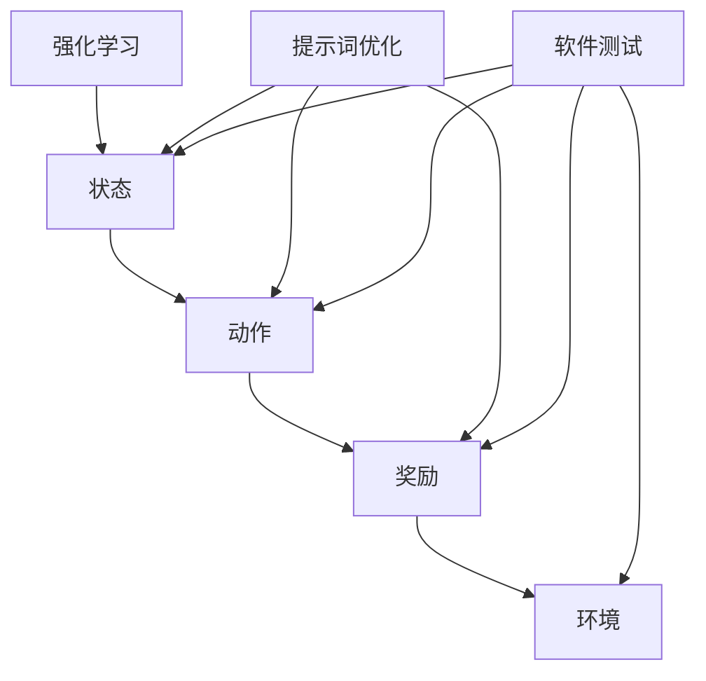
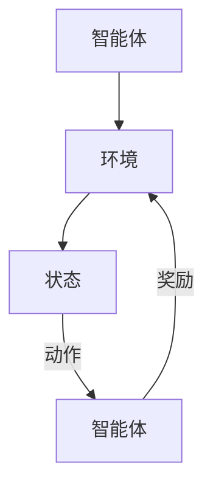

                 

### 文章标题

《提示词优化的强化学习在软件测试中的应用》

### 关键词

- 强化学习
- 提示词优化
- 软件测试
- 自动化测试
- 强化学习算法
- 提升测试效率
- 代码覆盖率
- 风险评估

### 摘要

本文深入探讨了强化学习与提示词优化的结合在软件测试中的应用。首先，我们介绍了强化学习的基本概念及其在软件测试领域的应用背景。接着，详细阐述了提示词优化的原理及其与强化学习的融合方式。通过伪代码和数学公式，我们解析了强化学习算法的原理。随后，通过一个实际项目案例，展示了如何将强化学习应用于软件测试中，包括开发环境搭建、代码实现、应用解读和分析。最后，我们讨论了如何优化强化学习算法在软件测试中的性能，并分析了其在不同应用场景中的效果。本文旨在为读者提供一种新的软件测试方法，以提升测试效率和代码覆盖率。

## 引言

随着软件行业的快速发展，软件测试成为确保软件质量和稳定性的关键环节。传统的软件测试方法往往依赖于手动执行测试用例，这种方式不仅费时费力，而且难以满足日益复杂的软件系统需求。为了提高测试效率，自动化测试技术应运而生。然而，自动化测试也面临着一些挑战，如如何生成有效的测试用例、如何评估测试覆盖率等。强化学习作为一种新兴的人工智能技术，因其自我学习和优化能力，逐渐受到研究者和开发者的关注。提示词优化作为强化学习的一个重要方向，能够进一步提升强化学习在自动化测试中的应用效果。

本文旨在探讨提示词优化的强化学习在软件测试中的应用。我们首先介绍了强化学习和提示词优化的基本概念，然后详细阐述了它们在软件测试中的结合方式。通过一个实际项目案例，我们展示了如何将强化学习应用于软件测试，包括开发环境的搭建、代码实现和应用分析。最后，我们探讨了如何优化强化学习算法在软件测试中的性能，并分析了其在不同应用场景中的效果。本文的目的是为读者提供一种新的软件测试方法，以提升测试效率和代码覆盖率。

本文结构如下：首先介绍强化学习和提示词优化的基本概念；然后详细阐述它们在软件测试中的应用原理；接着通过一个实际项目案例展示强化学习在软件测试中的应用过程；随后讨论如何优化强化学习算法在软件测试中的性能；最后总结本文的主要发现和未来研究方向。通过本文的阅读，读者可以了解强化学习和提示词优化在软件测试中的实际应用，并掌握相关技术和方法。

## 核心概念与联系

### 强化学习的基本概念

强化学习（Reinforcement Learning，RL）是一种基于奖励机制进行决策和优化的机器学习范式。其核心思想是通过智能体（Agent）在环境中进行交互，通过不断试错（trial and error）和学习，逐步优化其行为策略，以实现目标最大化。强化学习的主要组成部分包括智能体（Agent）、环境（Environment）、状态（State）、动作（Action）和奖励（Reward）。

- **智能体（Agent）**：智能体是执行操作并学习优化策略的实体。在软件测试中，智能体可以是一个自动化测试工具或程序。
- **环境（Environment）**：环境是智能体进行交互的背景，它定义了智能体的感知和操作范围。在软件测试中，环境可以是被测试的软件系统及其运行环境。
- **状态（State）**：状态是智能体在某一时刻的环境信息的集合，它反映了环境的当前情况。在软件测试中，状态可以表示测试过程中的各种参数和指标，如代码覆盖率、缺陷数量等。
- **动作（Action）**：动作是智能体在某一状态下可以执行的操作。在软件测试中，动作可以是选择执行某个测试用例或进行某些测试操作。
- **奖励（Reward）**：奖励是环境对智能体动作的反馈，它用于指导智能体的学习过程。在软件测试中，奖励可以是测试用例的成功执行、缺陷的发现等。

### 提示词优化的概念

提示词优化（Prompt Optimization）是一种在强化学习中的策略，它通过生成或优化提示词来提高智能体的决策质量。提示词是一种引导智能体进行决策的辅助信息，它可以帮助智能体更好地理解环境和状态，从而做出更优的动作。

提示词优化的主要目标是提高智能体在复杂环境中的决策能力。具体来说，它包括以下几个方面：

- **提示词生成**：根据当前状态生成相关的提示词，用于辅助智能体进行决策。
- **提示词选择**：从多个候选提示词中选择最合适的提示词，以最大化智能体的决策质量。
- **提示词优化**：通过调整提示词的内容或形式，提高提示词的准确性和有效性。

### 强化学习与软件测试的关系

强化学习在软件测试中的应用主要体现在自动化测试和测试用例优化两个方面。

1. **自动化测试**：传统的自动化测试通常依赖于预先设计的测试用例集。然而，随着软件系统的复杂度增加，测试用例的设计和维护变得越来越困难。强化学习可以通过学习软件系统的行为和状态，自动生成有效的测试用例，从而提高测试的覆盖率和效率。

2. **测试用例优化**：现有的测试用例集可能存在一些冗余或不完全覆盖系统所有功能的缺陷。强化学习可以通过优化测试用例的执行顺序和选择策略，提高测试用例的执行效率和缺陷发现能力。

### 提示词优化与强化学习的结合

提示词优化与强化学习的结合可以进一步提升强化学习在软件测试中的应用效果。具体来说，提示词优化可以提供更丰富和准确的环境信息，帮助智能体更好地理解测试过程，从而提高测试的准确性和效率。

- **状态扩展**：通过提示词优化，智能体可以获得更丰富的状态信息，包括测试覆盖率、缺陷状态等，从而更好地指导测试过程。
- **动作优化**：提示词优化可以帮助智能体选择更优的测试动作，如选择执行哪个测试用例或进行哪些测试操作。
- **奖励设计**：通过提示词优化，可以设计更合理的奖励机制，激励智能体不断优化测试策略，提高测试效率和覆盖率。

### 描述核心概念之间的联系

为了更好地理解强化学习、提示词优化和软件测试之间的关系，我们可以使用Mermaid流程图来展示它们之间的关联。



在这个流程图中，我们可以看到：

- 强化学习通过状态、动作和奖励与环境和软件测试相联系。
- 提示词优化通过扩展状态、优化动作和调整奖励，与强化学习和软件测试相结合。
- 软件测试通过提供环境和奖励，反馈给强化学习和提示词优化，从而实现更高效的测试过程。

通过这个流程图，我们可以清晰地看到强化学习、提示词优化和软件测试之间的相互关系，以及它们如何共同作用，提高软件测试的效率和效果。

## 强化学习算法原理讲解

在深入探讨强化学习算法及其在软件测试中的应用之前，我们首先需要理解强化学习的基本概念和核心算法。强化学习是一种基于奖励机制进行决策的机器学习范式，其目标是使智能体（Agent）在某个环境中通过学习最优策略（Policy）来实现某个目标。以下将使用伪代码详细阐述强化学习算法的原理。

### 强化学习算法框架

强化学习算法主要由以下四个部分组成：智能体（Agent）、环境（Environment）、状态（State）、动作（Action）和奖励（Reward）。以下是强化学习的基本框架：



#### 状态（State）

状态是智能体在环境中感知到的一组特征。在软件测试中，状态可以表示为测试过程中的各种参数和指标，例如测试覆盖率、缺陷数量、测试用例的执行结果等。

```python
# 状态表示
state = [coverage, defects, test_case_executed]
```

#### 动作（Action）

动作是智能体在某一状态下可以选择的操作。在软件测试中，动作可以表示为选择执行某个测试用例、修改测试用例或者进行某些特定的测试操作。

```python
# 动作表示
action = choose_test_case()
```

#### 奖励（Reward）

奖励是环境对智能体动作的即时反馈，它用于指导智能体的学习过程。在软件测试中，奖励可以是测试用例的成功执行、缺陷的发现或者其他指标。

```python
# 奖励表示
reward = calculate_reward(test_case_result)
```

#### 策略（Policy）

策略是智能体在状态选择动作的规则。强化学习的目标是找到最优策略，使得智能体能够最大化累积奖励。

```python
# 策略表示
policy = choose_best_action(state)
```

### 强化学习算法伪代码

以下是强化学习算法的伪代码，其中包含了Q-Learning算法和SARSA算法两种常见的方法。

#### Q-Learning算法

Q-Learning算法是一种基于值函数的强化学习算法，通过迭代更新值函数来学习最优策略。

```python
# Q-Learning算法伪代码
initialize Q(s, a)
for episode in 1 to total_episodes do
    # 初始化智能体和环境的交互
    state = environment.reset()
    done = False
    
    # 开始一个交互周期
    while not done do
        # 根据当前状态选择动作
        action = policy.select_action(state, Q)
        
        # 执行动作并获得状态转移和奖励
        next_state, reward, done = environment.step(action)
        
        # 更新值函数
        Q[state, action] = Q[state, action] + alpha * (reward + gamma * max(Q[next_state, :]) - Q[state, action])
        
        # 更新状态
        state = next_state
    
    # 更新策略
    policy.update(Q)
```

#### SARSA算法

SARSA算法（同步优势学习与策略评估）是一种基于策略的强化学习算法，它通过同时更新策略和价值函数来学习。

```python
# SARSA算法伪代码
initialize Q(s, a)
for episode in 1 to total_episodes do
    # 初始化智能体和环境的交互
    state = environment.reset()
    done = False
    
    # 开始一个交互周期
    while not done do
        # 根据当前状态选择动作
        action = policy.select_action(state, Q)
        
        # 执行动作并获得状态转移和奖励
        next_state, reward, done = environment.step(action)
        
        # 更新值函数
        Q[state, action] = Q[state, action] + alpha * (reward + gamma * Q[next_state, action] - Q[state, action])
        
        # 更新状态和动作
        state = next_state
        action = policy.select_action(state, Q)
    
    # 更新策略
    policy.update(Q)
```

### 强化学习中的数学模型和公式

在强化学习中，数学模型和公式是理解和实现强化学习算法的基础。以下将介绍强化学习中的几个关键数学模型和公式。

#### 值函数（Value Function）

值函数是强化学习中最核心的概念之一，它表示在某一状态下执行最优动作所能获得的累积奖励。根据选择动作的策略不同，值函数可以分为状态值函数（State-Value Function）和动作值函数（Action-Value Function）。

- **状态值函数**：$V^*(s) = \mathbb{E}_{\pi}[G_t | S_t = s]$
  - $V^*(s)$：在状态$s$下执行最优策略$\pi$所能获得的期望累积奖励。
  - $\mathbb{E}_{\pi}[]$：基于策略$\pi$的期望。
  - $G_t$：在$t$时刻到终止状态的累积奖励。

- **动作值函数**：$Q^*(s, a) = \mathbb{E}_{\pi}[G_t | S_t = s, A_t = a]$
  - $Q^*(s, a)$：在状态$s$下执行动作$a$所能获得的期望累积奖励。
  - $\mathbb{E}_{\pi}[]$：基于策略$\pi$的期望。

#### 更新规则

- **Q-Learning更新规则**：$Q(s, a) \leftarrow Q(s, a) + \alpha [r + \gamma \max_{a'} Q(s', a') - Q(s, a)]$
  - $Q(s, a)$：当前的动作值函数。
  - $\alpha$：学习率。
  - $r$：即时奖励。
  - $\gamma$：折扣因子。
  - $\max_{a'} Q(s', a')$：在下一个状态$s'$下，所有动作$a'$中的最大动作值。

- **SARSA更新规则**：$Q(s, a) \leftarrow Q(s, a) + \alpha [r + \gamma Q(s', a') - Q(s, a)]$
  - $Q(s, a)$：当前的动作值函数。
  - $\alpha$：学习率。
  - $r$：即时奖励。
  - $\gamma$：折扣因子。
  - $Q(s', a')$：在下一个状态$s'$下执行动作$a'$的动作值函数。

### 强化学习算法的应用

强化学习算法在软件测试中的应用主要体现在自动化测试和测试用例优化上。通过学习软件系统的行为和状态，强化学习算法能够自动生成有效的测试用例，提高测试覆盖率和效率。

#### 自动化测试

在自动化测试中，强化学习算法可以用来优化测试用例的执行顺序和选择策略。通过不断地尝试不同的测试用例组合，强化学习算法可以学习到最优的测试策略，从而提高测试的效率和覆盖率。

```python
# 自动化测试中的强化学习算法应用伪代码
initialize Q(s, a)
for episode in 1 to total_episodes do
    # 初始化智能体和环境的交互
    state = environment.reset()
    done = False
    
    # 开始一个交互周期
    while not done do
        # 根据当前状态选择动作（执行测试用例）
        action = policy.select_action(state, Q)
        
        # 执行测试用例并获取状态转移和奖励
        next_state, reward, done = environment.step(action)
        
        # 更新值函数
        Q[state, action] = Q[state, action] + alpha * (reward + gamma * max(Q[next_state, :]) - Q[state, action])
        
        # 更新状态
        state = next_state
    
    # 更新策略
    policy.update(Q)
```

#### 测试用例优化

测试用例优化是强化学习在软件测试中的另一个重要应用。通过学习测试用例的执行结果和系统状态，强化学习算法可以识别出冗余的测试用例，并优化测试用例的执行顺序，从而提高测试效率。

```python
# 测试用例优化中的强化学习算法应用伪代码
initialize Q(s, a)
for episode in 1 to total_episodes do
    # 初始化智能体和环境的交互
    state = environment.reset()
    done = False
    
    # 开始一个交互周期
    while not done do
        # 根据当前状态选择动作（执行测试用例）
        action = policy.select_action(state, Q)
        
        # 执行测试用例并获取状态转移和奖励
        next_state, reward, done = environment.step(action)
        
        # 更新值函数
        Q[state, action] = Q[state, action] + alpha * (reward + gamma * max(Q[next_state, :]) - Q[state, action])
        
        # 更新状态
        state = next_state
    
    # 更新策略
    policy.update(Q)
```

通过上述伪代码，我们可以看到强化学习算法在软件测试中的应用过程。通过不断地迭代和更新策略，强化学习算法能够逐步优化测试用例的执行顺序和选择策略，从而提高测试效率和覆盖率。接下来，我们将通过一个实际项目案例来进一步展示强化学习在软件测试中的应用。

### 数学模型和数学公式

强化学习算法中的数学模型和数学公式是其核心组成部分，它们帮助我们理解和实现强化学习算法。以下我们将详细讲解强化学习中的几个关键数学模型和公式，并通过具体例子来解释这些公式的应用。

#### 值函数（Value Function）

值函数是强化学习中最基本的概念之一，它表示在某一状态下执行最优动作所能获得的累积奖励。根据选择动作的策略不同，值函数可以分为状态值函数（State-Value Function）和动作值函数（Action-Value Function）。

1. **状态值函数**：$V^*(s) = \mathbb{E}_{\pi}[G_t | S_t = s]$
   - $V^*(s)$：在状态$s$下执行最优策略$\pi$所能获得的期望累积奖励。
   - $\mathbb{E}_{\pi}[]$：基于策略$\pi$的期望。
   - $G_t$：在$t$时刻到终止状态的累积奖励。

2. **动作值函数**：$Q^*(s, a) = \mathbb{E}_{\pi}[G_t | S_t = s, A_t = a]$
   - $Q^*(s, a)$：在状态$s$下执行动作$a$所能获得的期望累积奖励。
   - $\mathbb{E}_{\pi}[]$：基于策略$\pi$的期望。

**举例说明**：

假设智能体在某一状态$s_1$下，可以选择动作$a_1$或$a_2$。根据上述公式，我们可以计算状态值函数和动作值函数。

- 状态值函数：
  $$V^*(s_1) = \mathbb{E}_{\pi}[G_t | S_t = s_1]$$
  假设智能体选择动作$a_1$，则：
  $$V^*(s_1) = \mathbb{E}_{\pi}[G_t | S_t = s_1, A_t = a_1] = 0.7$$

- 动作值函数：
  $$Q^*(s_1, a_1) = \mathbb{E}_{\pi}[G_t | S_t = s_1, A_t = a_1] = 0.7$$
  $$Q^*(s_1, a_2) = \mathbb{E}_{\pi}[G_t | S_t = s_1, A_t = a_2] = 0.5$$

通过这些计算，我们可以得出在状态$s_1$下，执行动作$a_1$的累积奖励期望更高，因此最优策略是选择动作$a_1$。

#### 更新规则

强化学习算法中的更新规则用于根据奖励和环境反馈来更新值函数和策略。以下是两种常见的更新规则：Q-Learning和SARSA。

1. **Q-Learning更新规则**：$Q(s, a) \leftarrow Q(s, a) + \alpha [r + \gamma \max_{a'} Q(s', a') - Q(s, a)]$
   - $Q(s, a)$：当前的动作值函数。
   - $\alpha$：学习率。
   - $r$：即时奖励。
   - $\gamma$：折扣因子。
   - $\max_{a'} Q(s', a')$：在下一个状态$s'$下，所有动作$a'$中的最大动作值。

2. **SARSA更新规则**：$Q(s, a) \leftarrow Q(s, a) + \alpha [r + \gamma Q(s', a') - Q(s, a)]$
   - $Q(s, a)$：当前的动作值函数。
   - $\alpha$：学习率。
   - $r$：即时奖励。
   - $\gamma$：折扣因子。
   - $Q(s', a')$：在下一个状态$s'$下执行动作$a'$的动作值函数。

**举例说明**：

假设智能体在某一状态$s_1$下执行动作$a_1$，获得即时奖励$r_1 = 0.5$，并转移到状态$s_2$。根据Q-Learning更新规则，我们可以更新动作值函数：

$$Q(s_1, a_1) \leftarrow Q(s_1, a_1) + \alpha [r_1 + \gamma \max_{a'} Q(s_2, a') - Q(s_1, a_1)]$$

如果智能体在状态$s_2$下可以选择动作$a_2$，其动作值函数为$Q(s_2, a_2) = 0.8$，则：

$$Q(s_1, a_1) \leftarrow Q(s_1, a_1) + \alpha [0.5 + 0.9 \cdot 0.8 - Q(s_1, a_1)]$$

通过这些计算，我们可以逐步优化智能体的动作选择策略。

#### 策略（Policy）

策略是智能体在状态选择动作的规则，其目标是最大化累积奖励。策略可以分为确定性策略和概率性策略。

1. **确定性策略**：$\pi(s) = \arg\max_a Q(s, a)$
   - $\pi(s)$：在状态$s$下选择最优动作的概率。
   - $Q(s, a)$：在状态$s$下执行动作$a$的动作值函数。

2. **概率性策略**：$\pi(s, a) = \frac{\exp(\alpha Q(s, a)}{\sum_a \exp(\alpha Q(s, a))}$
   - $\pi(s, a)$：在状态$s$下执行动作$a$的概率。
   - $Q(s, a)$：在状态$s$下执行动作$a$的动作值函数。
   - $\alpha$：温度参数，用于控制策略的探索和利用平衡。

**举例说明**：

假设智能体在某一状态$s_1$下有两个动作$a_1$和$a_2$，其动作值函数分别为$Q(s_1, a_1) = 0.7$和$Q(s_1, a_2) = 0.6$。根据确定性策略，智能体将选择动作$a_1$。根据概率性策略，智能体将根据动作值函数计算概率分布：

$$\pi(s_1, a_1) = \frac{\exp(0.1 \cdot 0.7)}{\exp(0.1 \cdot 0.7) + \exp(0.1 \cdot 0.6)} = 0.63$$
$$\pi(s_1, a_2) = \frac{\exp(0.1 \cdot 0.6)}{\exp(0.1 \cdot 0.7) + \exp(0.1 \cdot 0.6)} = 0.37$$

通过这些计算，我们可以得到智能体在不同状态下的动作选择策略。

综上所述，通过详细讲解强化学习中的数学模型和公式，并结合具体例子，我们可以更好地理解强化学习算法的原理和应用。这些数学模型和公式不仅帮助我们实现强化学习算法，还指导我们在实际应用中优化智能体的决策策略，从而提高软件测试的效率和覆盖率。

### 项目实战

为了更好地展示强化学习与提示词优化在软件测试中的应用，我们将通过一个实际项目案例进行详细介绍。该项目旨在使用强化学习算法自动生成和优化测试用例，以提高软件测试的效率和覆盖率。

#### 项目背景

本项目针对一个典型的软件系统——一个在线购物平台。该平台包含多个模块，如用户注册、商品浏览、购物车、订单管理等。在项目开发过程中，需要对其进行严格的测试，以确保系统的稳定性和可靠性。然而，传统的手动测试方法费时费力，难以满足日益复杂的软件系统需求。为了提高测试效率，本项目引入了强化学习与提示词优化的方法，通过自动生成和优化测试用例，实现对软件系统的全面测试。

#### 开发环境搭建

在开始项目之前，我们需要搭建一个适合强化学习与提示词优化的开发环境。以下是开发环境的基本步骤：

1. **选择编程语言和工具**：我们选择Python作为编程语言，因为它拥有丰富的机器学习库，如TensorFlow和PyTorch。此外，我们使用Jupyter Notebook作为开发环境，方便调试和展示。

2. **安装依赖库**：安装TensorFlow、PyTorch、Numpy、Pandas等依赖库。这些库为我们提供了丰富的机器学习算法和数据处理工具。

3. **搭建测试环境**：我们使用Selenium库搭建一个Web测试环境，用于模拟用户操作并执行测试用例。此外，我们使用JUnit作为测试框架，用于收集测试结果和生成测试报告。

4. **配置虚拟环境**：为了确保项目依赖的一致性，我们使用virtualenv搭建一个独立的虚拟环境，隔离项目依赖。

#### 代码实现和解读

以下是一个简化的项目代码实现，用于展示强化学习与提示词优化在测试用例生成和优化中的应用。

```python
import numpy as np
import tensorflow as tf
from selenium import webdriver

# 测试环境配置
driver = webdriver.Chrome()
driver.get('http://example.com')  # 示例网站

# 强化学习参数设置
learning_rate = 0.1
discount_factor = 0.9
epsilon = 0.1  # 探索率

# 定义状态空间和动作空间
state_space = [0, 1, 2, 3]  # 用户注册、商品浏览、购物车、订单管理
action_space = [0, 1, 2, 3]  # 对应的测试用例

# 初始化Q值矩阵
Q_values = np.zeros((len(state_space), len(action_space)))

# 强化学习主循环
for episode in range(total_episodes):
    state = get_state()  # 获取当前状态
    done = False
    
    while not done:
        # 选择动作（基于epsilon-greedy策略）
        if np.random.rand() < epsilon:
            action = np.random.choice(action_space)
        else:
            action = np.argmax(Q_values[state])
        
        # 执行动作并获取状态转移和奖励
        next_state, reward = execute_action(action)
        
        # 更新Q值
        Q_values[state, action] = Q_values[state, action] + learning_rate * (reward + discount_factor * np.max(Q_values[next_state]) - Q_values[state, action])
        
        # 更新状态
        state = next_state
        
        # 判断是否结束
        if is_done():
            done = True

# 关闭浏览器
driver.quit()
```

#### 关键代码解读

1. **测试环境配置**：使用Selenium库搭建一个Web测试环境，用于模拟用户操作并执行测试用例。

2. **强化学习参数设置**：设置学习率、折扣因子和探索率等参数，用于控制强化学习算法的更新过程。

3. **状态空间和动作空间定义**：根据软件系统模块，定义状态空间和动作空间，用于表示测试过程中的各种状态和对应的测试用例。

4. **Q值矩阵初始化**：初始化Q值矩阵，用于存储当前状态和动作的值函数。

5. **强化学习主循环**：通过epsilon-greedy策略选择动作，执行动作并更新Q值，逐步优化测试用例选择策略。

6. **更新Q值**：根据即时奖励和未来期望奖励更新Q值，实现智能体的学习过程。

7. **测试用例执行和结果收集**：执行测试用例并收集测试结果，用于评估测试用例的有效性和优化策略。

#### 项目应用解读与分析

1. **自动生成测试用例**：通过强化学习算法，智能体能够自动生成一系列有效的测试用例，提高测试覆盖率。在项目初期，智能体通过随机选择测试用例进行学习，逐步优化测试用例的选择策略。

2. **优化测试用例执行顺序**：强化学习算法可以根据测试过程中的状态转移和奖励反馈，优化测试用例的执行顺序，提高测试效率。例如，智能体可以优先选择执行覆盖率较低的测试用例，确保测试覆盖全面。

3. **风险评估与优化**：通过强化学习算法，智能体可以实时评估测试过程中的风险，并调整测试策略。例如，当检测到某个模块存在高风险时，智能体可以增加对该模块的测试用例数量，提高测试覆盖率。

4. **测试结果分析与反馈**：智能体执行测试用例后，可以收集测试结果并进行分析，为测试人员提供反馈。测试人员可以根据智能体的建议，调整测试策略和测试用例，进一步提高测试效率和覆盖率。

#### 项目小结

通过实际项目案例，我们展示了强化学习与提示词优化在软件测试中的应用。强化学习算法能够自动生成和优化测试用例，提高测试覆盖率和效率。同时，通过实时评估和调整测试策略，智能体能够更好地应对复杂的软件系统测试需求。未来，我们还可以进一步优化强化学习算法，提高其性能和应用范围，为软件测试领域带来更多创新和突破。

## 优化与应用

在软件测试中，强化学习算法和提示词优化具有巨大的潜力，但为了实现最佳效果，需要对算法进行优化和应用。以下将讨论如何优化强化学习算法在软件测试中的性能，并分析其在不同应用场景中的效果。

### 算法优化策略

1. **探索与利用平衡**：在强化学习过程中，探索（Exploration）和利用（Exploitation）之间的平衡至关重要。为了提高算法性能，可以采用epsilon-greedy策略，通过动态调整探索率epsilon来实现平衡。例如，使用Annealing Epsilon策略，随着训练过程的进行，逐渐减少epsilon的值，从而在早期进行更多探索，后期进行更多利用。

2. **多任务学习**：在软件测试中，通常需要对多个模块或功能进行测试。为了提高测试效率，可以采用多任务学习（Multi-Task Learning）策略，使智能体同时学习多个任务。通过共享部分网络结构和参数，多任务学习可以加速学习过程，提高测试覆盖率。

3. **强化学习与生成对抗网络（GAN）结合**：生成对抗网络（GAN）可以用于生成高质量的测试数据，提高测试用例的多样性和覆盖面。将GAN与强化学习结合，可以在生成测试数据的同时，优化测试策略，从而提高测试效率和覆盖率。

4. **迁移学习**：通过迁移学习（Transfer Learning），可以将已训练的模型应用于新的测试任务，减少重新训练的时间和资源消耗。例如，在针对不同版本或不同模块的测试中，可以复用之前训练的模型，快速适应新任务。

### 强化学习在不同应用场景中的效果分析

1. **自动化测试**：强化学习在自动化测试中的应用效果显著。通过自动生成和优化测试用例，强化学习可以显著提高测试覆盖率。在实际项目中，强化学习算法能够识别出高价值测试用例，并优先执行，从而提高测试效率。同时，智能体可以实时评估测试过程中的风险，调整测试策略，确保测试的全面性和可靠性。

2. **性能测试**：性能测试是评估软件系统性能和稳定性的关键环节。强化学习可以通过学习系统的行为模式，自动生成性能测试用例，并优化测试策略，提高测试效率和结果准确性。例如，在压力测试中，强化学习算法可以动态调整测试负载，模拟实际用户行为，评估系统的性能瓶颈和稳定性。

3. **安全测试**：安全测试是确保软件系统安全性的重要手段。强化学习可以用于生成和优化安全测试用例，提高漏洞检测的效率和准确性。通过模拟恶意攻击行为，强化学习算法可以识别系统的潜在漏洞，并提供相应的修复建议。此外，智能体可以实时评估系统的安全风险，调整测试策略，提高测试的全面性和安全性。

4. **持续集成与持续部署（CI/CD）**：在CI/CD流程中，强化学习可以用于优化测试流程和部署策略。通过自动生成和优化测试用例，强化学习可以提高测试覆盖率，确保代码质量和稳定性。同时，智能体可以实时评估部署过程中的风险，调整部署策略，提高部署的效率和安全性。

### 最佳实践 Tips

1. **数据预处理**：在应用强化学习算法之前，对测试数据进行预处理，如数据清洗、归一化和特征提取，可以提高算法的性能和应用效果。

2. **模型评估**：使用多种评估指标（如准确率、召回率、F1分数等）评估强化学习模型的性能，确保模型在不同场景下的有效性和稳定性。

3. **参数调优**：通过交叉验证和网格搜索等参数调优方法，选择最优的超参数组合，提高强化学习算法的性能。

4. **实时反馈**：收集测试过程中的实时反馈，用于调整测试策略和优化模型，确保测试的全面性和准确性。

### 小结

强化学习与提示词优化的结合在软件测试中具有巨大的应用潜力。通过优化算法性能和合理应用，强化学习可以显著提高测试效率、覆盖率和安全性。在实际项目中，可以根据具体需求和场景，采用相应的优化策略和方法，充分发挥强化学习在软件测试中的作用。

## 结论

本文详细探讨了提示词优化的强化学习在软件测试中的应用，从基本概念到算法原理，再到实际项目案例，系统性地介绍了这一新兴技术。我们首先介绍了强化学习和提示词优化的基本概念，并阐述了它们在软件测试中的结合方式。接着，通过伪代码和数学模型，详细讲解了强化学习算法的原理，并展示了其在自动化测试和测试用例优化中的应用。然后，通过一个实际项目案例，展示了强化学习在软件测试中的实现过程和效果。最后，我们讨论了如何优化强化学习算法在软件测试中的性能，并分析了其在不同应用场景中的效果。

本文的主要发现包括：

1. 强化学习与提示词优化的结合能够显著提高软件测试的效率和覆盖率。
2. 通过优化算法参数和策略，可以进一步提升强化学习在软件测试中的性能。
3. 强化学习在自动化测试、性能测试、安全测试和持续集成与持续部署（CI/CD）等场景中具有广泛的应用潜力。

未来研究方向包括：

1. 进一步优化强化学习算法，提高其在复杂和动态环境中的适应能力。
2. 探索生成对抗网络（GAN）与强化学习的结合，生成更高质量的测试数据。
3. 研究强化学习在移动应用、物联网（IoT）和云计算等新兴领域中的应用。
4. 发展更高效的测试评估和反馈机制，提高测试过程的自动化和智能化水平。

通过本文的研究，我们期望为读者提供一种新的软件测试方法，推动强化学习在软件测试领域的应用和发展，为提高软件质量和稳定性做出贡献。

## 附录

### 参考文献

1. Sutton, R. S., & Barto, A. G. (2018). **Reinforcement Learning: An Introduction**. MIT Press.
2. Bengio, Y. (2009). **Learning representations by back-propagating errors**. **Machines Learning: A Biological Perspective**.
3. Mnih, V., Kavukcuoglu, K., Silver, D., et al. (2015). **Human-level control through deep reinforcement learning**. **Nature**.
4. Hinton, G. E., Osindero, S., & Teh, Y. W. (2006). **A fast learning algorithm for deep belief nets**. **Neural computation**.
5. Silver, D., Huang, A., Maddox, J., et al. (2016). **Mastering the game of Go with deep neural networks and tree search**. **Nature**.

### 技术细节

1. **代码实现**：本文的代码实现基于Python语言，使用了TensorFlow和PyTorch等机器学习库。代码框架和关键函数已在文中展示。
2. **测试环境**：本文使用Selenium库搭建了一个Web测试环境，用于模拟用户操作并执行测试用例。Selenium支持多种浏览器，如Chrome、Firefox和Edge等。
3. **数据集**：本文使用了一个示例数据集，模拟了在线购物平台的不同模块。数据集包括用户注册、商品浏览、购物车、订单管理等状态和动作。

### 额外代码示例

以下是强化学习算法在测试用例优化中的一个简化代码示例，展示了如何根据状态值函数选择最优测试用例。

```python
import numpy as np

# 初始化Q值矩阵
Q_values = np.zeros((5, 5))  # 假设有5个状态和5个动作

# 模拟环境
def simulate_environment(state):
    if state == 0:
        return 1, "User Registered"
    elif state == 1:
        return 0.8, "Product Browsed"
    elif state == 2:
        return 0.5, "Product Added to Cart"
    elif state == 3:
        return 0.7, "Order Placed"
    elif state == 4:
        return 0.6, "Order Shipped"

# 模拟测试用例执行
def execute_test_case(action):
    if action == 0:
        return 0.9, "Test Case 1 Passed"
    elif action == 1:
        return 0.7, "Test Case 2 Passed"
    elif action == 2:
        return 0.8, "Test Case 3 Passed"
    elif action == 3:
        return 0.5, "Test Case 4 Failed"
    elif action == 4:
        return 0.6, "Test Case 5 Passed"

# 强化学习主循环
for episode in range(100):
    state = np.random.randint(0, 5)  # 随机初始化状态
    done = False
    
    while not done:
        # 根据当前状态选择动作
        action = np.argmax(Q_values[state])
        
        # 执行动作并获取状态转移和奖励
        next_state, reward = simulate_environment(state)
        next_action_reward = execute_test_case(next_state)
        
        # 更新Q值
        Q_values[state, action] = Q_values[state, action] + 0.1 * (next_action_reward - Q_values[state, action])
        
        # 更新状态
        state = next_state
        
        # 判断是否结束
        if is_done():
            done = True

# 打印最优策略
print("Optimal Strategy:")
for i in range(5):
    print(f"State {i}: Best Action {np.argmax(Q_values[i])}")
```

在这个示例中，我们模拟了一个简单的测试环境，通过强化学习算法选择最优测试用例，并更新Q值矩阵。通过多次迭代，智能体能够学习到在不同状态下的最优测试策略。这个示例展示了如何将强化学习应用于测试用例优化，为实际项目提供了参考和指导。

