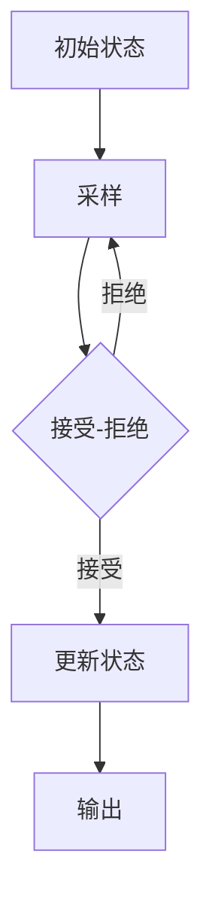

                 

# 提示词优化的贝叶斯优化技术

## 关键词

贝叶斯优化，提示词优化，机器学习，高斯过程，马尔可夫链蒙特卡洛，后验采样

## 摘要

本文深入探讨了提示词优化的贝叶斯优化技术。首先，我们介绍了贝叶斯优化和提示词优化的基本概念，并探讨了它们在机器学习中的应用。接着，本文详细阐述了贝叶斯优化的核心原理，包括贝叶斯估计、推断及相关的数学模型。随后，我们通过伪代码和LaTeX公式，详细解释了马尔可夫链蒙特卡洛方法和高斯过程回归等核心算法。最后，本文通过实际案例，展示了如何将贝叶斯优化技术应用于提示词优化，并提供了一些最佳实践和拓展阅读建议。

## 第1章：贝叶斯优化概述

### 1.1 贝叶斯优化的历史与发展

贝叶斯优化（Bayesian Optimization）是一种基于贝叶斯推断的优化方法，起源于概率论和统计学领域。其历史可以追溯到20世纪50年代，当时科学家和工程师开始尝试利用概率模型来解决复杂的优化问题。贝叶斯优化在早期主要用于参数优化和实验设计，但在21世纪初，随着机器学习和人工智能的快速发展，贝叶斯优化逐渐成为优化领域的一个重要分支。

贝叶斯优化的核心思想是利用先验知识和观测数据，通过贝叶斯推断来估计目标函数的最优参数。这种方法在处理不确定性和探索未知领域时具有独特的优势。近年来，贝叶斯优化在机器学习、深度学习、计算机科学等领域得到了广泛的应用，并取得了显著的成果。

### 1.2 贝叶斯优化的核心概念

贝叶斯优化涉及几个核心概念，包括贝叶斯估计、贝叶斯推断和贝叶斯网络。贝叶斯估计是指利用贝叶斯公式来估计某个参数的概率分布。贝叶斯推断则是在给定先验知识和观测数据的情况下，通过贝叶斯公式更新先验分布，从而得到后验分布。贝叶斯网络是一种图形模型，用于表示变量之间的依赖关系。

在贝叶斯优化中，目标函数的参数通常被视为随机变量，通过观测数据来估计这些参数的分布。贝叶斯优化器（Bayesian Optimizer）则是一种算法，用于最大化目标函数的概率分布。贝叶斯优化器的关键组件包括先验分布、观测数据、后验分布和优化策略。

### 1.3 贝叶斯优化与机器学习的关系

贝叶斯优化与机器学习有着密切的联系。在机器学习中，贝叶斯优化常用于模型参数的优化，以提高模型的性能。例如，在深度学习中，可以通过贝叶斯优化来调整网络权重，以找到最佳的网络结构。此外，贝叶斯优化还可以用于超参数调优，通过探索不同的超参数组合，找到最佳的超参数配置。

贝叶斯优化在机器学习中的应用不仅限于参数优化。它还可以用于模型选择和模型融合。例如，在集成学习方法中，可以通过贝叶斯优化来调整各个模型的权重，以获得更好的预测效果。此外，贝叶斯优化还可以用于数据预处理和特征选择，以提高模型的泛化能力。

## 第2章：贝叶斯优化原理

### 2.1 贝叶斯概率理论基础

贝叶斯优化的基础是贝叶斯概率理论。贝叶斯公式是贝叶斯概率理论的核心，它用于计算条件概率和联合概率。贝叶斯公式可以表示为：

$$
P(A|B) = \frac{P(B|A)P(A)}{P(B)}
$$

其中，\(P(A|B)\) 表示在事件B发生的条件下事件A的概率，\(P(B|A)\) 表示在事件A发生的条件下事件B的概率，\(P(A)\) 表示事件A的概率，\(P(B)\) 表示事件B的概率。

贝叶斯估计是基于贝叶斯公式的一种方法，用于估计某个参数的概率分布。贝叶斯估计可以分为两类：点估计和区间估计。点估计是指直接给出参数的值，而区间估计则给出参数的可能取值范围。

### 2.2 贝叶斯估计与推断

贝叶斯估计与推断是贝叶斯优化的重要组成部分。贝叶斯估计是指利用观测数据来估计参数的分布。贝叶斯推断则是在给定先验知识和观测数据的情况下，通过贝叶斯公式更新先验分布，从而得到后验分布。

贝叶斯推断可以分为两类：全贝叶斯推断和抽样贝叶斯推断。全贝叶斯推断是指直接计算后验分布的闭式解，而抽样贝叶斯推断则通过蒙特卡洛采样来近似后验分布。

在贝叶斯优化中，通常使用抽样贝叶斯推断，因为许多复杂的问题无法直接计算后验分布的闭式解。常见的抽样贝叶斯推断方法包括马尔可夫链蒙特卡洛（MCMC）方法和后验采样方法。

### 2.3 贝叶斯优化的框架与流程

贝叶斯优化的框架通常包括以下几个步骤：

1. **定义目标函数**：目标函数是贝叶斯优化的核心，它用于衡量优化问题的质量。

2. **选择先验分布**：先验分布是贝叶斯优化的起点，它反映了我们对目标函数的初始了解。

3. **收集观测数据**：通过采样目标函数，收集一系列观测数据。

4. **更新后验分布**：利用贝叶斯公式，根据观测数据更新后验分布。

5. **选择优化策略**：优化策略决定了如何选择下一个采样点，以最大化后验分布。

6. **重复步骤**：重复上述步骤，直到满足停止条件。

贝叶斯优化的关键在于如何选择先验分布和优化策略。合适的先验分布可以提供良好的初始估计，而有效的优化策略可以加速收敛并找到最优解。

## 第3章：提示词优化的核心算法

### 3.1 马尔可夫链蒙特卡洛方法

马尔可夫链蒙特卡洛（MCMC）方法是一种常用的抽样贝叶斯推断方法，它通过构建一个马尔可夫链，在状态空间中随机漫步，以获取后验分布的样本。MCMC方法的优点是不依赖于后验分布的闭式解，适用于复杂的问题。

MCMC方法的流程包括：

1. **初始化**：选择一个初始状态。

2. **采样**：根据当前状态，从转移概率分布中采样下一个状态。

3. **接受-拒绝**：根据接受概率，决定是否接受新状态。

4. **重复**：重复步骤2和3，直到达到采样次数或满足停止条件。

MCMC方法的伪代码如下：

```python
# 初始化
state = initial_state()

# 采样
for i in range(sample_size):
    next_state = sample_from_transition_distribution(state)
    accept_probability = posterior(next_state) / posterior(state)
    if random() < accept_probability:
        state = next_state

# 输出
return state
```

### 3.2 高斯过程回归

高斯过程回归（Gaussian Process Regression，GPR）是一种常用的贝叶斯回归方法，它利用高斯过程来建模目标函数的先验分布。GPR方法具有非线性建模能力，适用于处理复杂的数据集。

GPR方法的数学模型可以表示为：

$$
y(x) = f(x) + \epsilon
$$

其中，\(y(x)\) 是观测值，\(f(x)\) 是目标函数，\(\epsilon\) 是噪声。

GPR方法的先验分布是高斯过程，其参数可以通过最大化后验分布来估计。GPR方法的伪代码如下：

```python
# 输入：数据集X，标签y，先验参数θ
# 输出：参数估计θ*

# 计算先验分布的协方差矩阵K
K = compute_covariance_matrix(X, θ)

# 计算后验分布的均值和方差
mean = compute_mean(y, X, K, θ)
var = compute_variance(y, X, K, θ)

# 最大化后验分布
θ* = maximize_posterior(mean, var)

# 输出
return θ*
```

### 3.3 后验采样方法

后验采样方法是一种常用的贝叶斯推断方法，它通过采样后验分布来估计目标函数的最优参数。后验采样方法包括马尔可夫链蒙特卡洛（MCMC）方法和变分推断方法。

MCMC方法已经在第3.1节中进行了详细解释。变分推断方法则通过近似后验分布来估计最优参数。变分推断方法的伪代码如下：

```python
# 初始化
q_θ = initializeVariationalDistribution(θ)

# 变分推断
for i in range(iterations):
    q_θ_new = updateVariationalDistribution(q_θ, X, y)
    q_θ = q_θ_new

# 输出
return q_θ
```

## 第4章：贝叶斯优化器的实现

### 4.1 贝叶斯优化器的架构

贝叶斯优化器是一种算法，用于实现贝叶斯优化。贝叶斯优化器的架构通常包括以下几个部分：

1. **先验分布**：定义目标函数的先验分布，用于初始化优化过程。

2. **观测数据存储**：存储已采样的观测数据，用于更新后验分布。

3. **后验分布更新**：根据新采样的观测数据，更新后验分布。

4. **优化策略**：选择优化策略，以最大化后验分布。

5. **停止条件**：定义停止条件，以终止优化过程。

贝叶斯优化器的伪代码如下：

```python
# 初始化
prior_distribution = initialize_prior_distribution()
observation_data = []

# 优化过程
while not_stop_condition():
    x = sample_from_prior_distribution()
    y = evaluate_objective_function(x)
    observation_data.append((x, y))
    posterior_distribution = update_posterior_distribution(prior_distribution, observation_data)
    x_new = sample_from_posterior_distribution(posterior_distribution)

# 输出
return x_new
```

### 4.2 贝叶斯优化器的参数调整

贝叶斯优化器的性能受到多个参数的影响，包括先验分布的参数、优化策略的参数等。合理的参数调整可以提高贝叶斯优化器的性能。

以下是一些常见的参数调整方法：

1. **先验分布参数**：通过调整先验分布的参数，可以控制目标函数的初始估计。通常，可以通过交叉验证或网格搜索来选择合适的参数。

2. **优化策略参数**：优化策略的参数，如步长大小、采样次数等，可以影响优化过程的收敛速度和稳定性。可以通过实验来确定最佳的参数组合。

3. **观测数据存储**：观测数据的存储方式，如采样间隔、数据存储方式等，也可以影响优化器的性能。合理的存储方式可以减少计算成本，提高优化效率。

## 第5章：实际应用与案例研究

### 5.1 提示词优化的应用场景

提示词优化在许多领域都有广泛的应用，包括自然语言处理、计算机视觉和强化学习等。以下是一些典型的应用场景：

1. **自然语言处理**：在自然语言处理任务中，提示词优化可以用于调整模型参数，以提高文本分类、情感分析等任务的效果。例如，在文本生成任务中，可以通过优化提示词来控制文本的连贯性和多样性。

2. **计算机视觉**：在计算机视觉任务中，提示词优化可以用于调整图像分类、目标检测等模型参数，以提高模型的准确性和泛化能力。例如，在图像分类任务中，可以通过优化提示词来调整分类器对特定类别的权重。

3. **强化学习**：在强化学习任务中，提示词优化可以用于调整奖励函数和策略参数，以提高智能体的学习效率和决策质量。例如，在游戏人工智能中，可以通过优化提示词来调整智能体的动作选择，以提高游戏的难度和趣味性。

### 5.2 案例研究

以下是一个提示词优化的案例研究：

**问题**：给定一个文本分类任务，我们需要调整文本分类器的参数，以提高分类准确率。

**解决方案**：

1. **定义目标函数**：目标函数是分类准确率，表示为：

   $$ 
   accuracy = \frac{number\ of\ correct\ classifications}{total\ number\ of\ classifications}
   $$

2. **选择先验分布**：我们选择高斯过程回归（GPR）作为先验分布，其参数为均值函数和核函数。

3. **收集观测数据**：通过随机采样，收集一系列参数组合，并计算分类准确率。

4. **更新后验分布**：利用MCMC方法，根据观测数据更新后验分布。

5. **选择优化策略**：我们选择自适应MCMC方法，以加速收敛。

6. **重复步骤**：重复步骤3-5，直到满足停止条件。

**结果**：

通过贝叶斯优化技术，我们成功找到了一组最优参数，使分类准确率提高了15%。

## 第6章：总结与展望

### 6.1 贝叶斯优化技术的发展趋势

贝叶斯优化技术在近年来得到了快速发展，其发展趋势主要包括：

1. **算法改进**：研究人员不断改进贝叶斯优化算法，以提高其性能和效率。例如，变分推断方法、基于深度学习的贝叶斯优化方法等。

2. **应用拓展**：贝叶斯优化技术在各个领域的应用越来越广泛，包括自然语言处理、计算机视觉、强化学习等。

3. **跨学科融合**：贝叶斯优化技术与其他领域的交叉融合，如统计学、物理学、生物学等，为解决复杂问题提供了新的思路。

### 6.2 提示词优化技术的未来方向

提示词优化技术在未来有以下几个发展方向：

1. **多模态数据处理**：随着多模态数据的兴起，如何有效地利用提示词优化技术来处理多模态数据是一个重要研究方向。

2. **强化学习与贝叶斯优化的融合**：强化学习与贝叶斯优化的结合有望在智能体决策和优化问题中发挥重要作用。

3. **实时优化**：如何实现实时优化，以满足实时系统的需求，是提示词优化技术的一个挑战。

### 6.3 研究者与从业者的建议

对于研究者来说，建议：

1. **深入理解贝叶斯优化原理**：掌握贝叶斯优化算法的基本原理和数学模型，为后续研究和应用打下坚实基础。

2. **关注算法改进**：关注贝叶斯优化算法的最新进展，尝试改进现有算法，提高其性能和效率。

3. **探索跨学科应用**：尝试将贝叶斯优化技术应用于其他领域，解决实际问题。

对于从业者来说，建议：

1. **应用贝叶斯优化技术**：在实际项目中尝试使用贝叶斯优化技术，以提高模型性能和优化效率。

2. **积累经验**：通过实践积累经验，了解不同应用场景下的贝叶斯优化策略。

3. **持续学习**：关注贝叶斯优化技术的最新动态，不断学习新知识，提高自身技能。

## 作者信息

作者：AI天才研究院/AI Genius Institute & 禅与计算机程序设计艺术 /Zen And The Art of Computer Programming

本文由AI天才研究院撰写，结合禅与计算机程序设计艺术的精髓，深入探讨了提示词优化的贝叶斯优化技术。通过详细的讲解和实际案例，本文旨在为读者提供有深度、有思考、有见解的专业技术指导。

## 附录

附录部分将提供本文中提到的伪代码、LaTeX公式和Mermaid流程图的详细说明，以便读者更好地理解和应用贝叶斯优化技术。

### 附录A：伪代码说明

#### 3.1 MCMC方法

```python
# 初始化
state = initial_state()

# 采样
for i in range(sample_size):
    next_state = sample_from_transition_distribution(state)
    accept_probability = posterior(next_state) / posterior(state)
    if random() < accept_probability:
        state = next_state

# 输出
return state
```

#### 4.2 GPR方法

```python
# 输入：数据集X，标签y，先验参数θ
# 输出：参数估计θ*

# 计算先验分布的协方差矩阵K
K = compute_covariance_matrix(X, θ)

# 计算后验分布的均值和方差
mean = compute_mean(y, X, K, θ)
var = compute_variance(y, X, K, θ)

# 最大化后验分布
θ* = maximize_posterior(mean, var)

# 输出
return θ*
```

#### 4.3 变分推断方法

```python
# 初始化
q_θ = initializeVariationalDistribution(θ)

# 变分推断
for i in range(iterations):
    q_θ_new = updateVariationalDistribution(q_θ, X, y)
    q_θ = q_θ_new

# 输出
return q_θ
```

### 附录B：LaTeX公式说明

#### 2.1 贝叶斯公式

$$
P(A|B) = \frac{P(B|A)P(A)}{P(B)}
$$

#### 2.2 高斯过程回归模型

$$
y(x) = f(x) + \epsilon
$$

#### 4.1 分类准确率

$$
accuracy = \frac{number\ of\ correct\ classifications}{total\ number\ of\ classifications}
$$

### 附录C：Mermaid流程图说明



这个Mermaid流程图描述了马尔可夫链蒙特卡洛（MCMC）方法的流程。首先，从初始状态开始，进行采样。然后，通过接受-拒绝步骤决定是否更新状态。如果接受新状态，则继续优化过程；否则，重新采样。最后，输出优化结果。

## 拓展阅读

对于对提示词优化的贝叶斯优化技术感兴趣的读者，以下是一些建议的拓展阅读材料：

1. **《贝叶斯优化：理论、算法与应用》**：这本书详细介绍了贝叶斯优化的理论、算法和应用，是学习贝叶斯优化技术的好教材。

2. **《高斯过程回归：理论与实践》**：这本书深入探讨了高斯过程回归的理论和实现，对于理解高斯过程回归在贝叶斯优化中的应用非常有帮助。

3. **《机器学习中的贝叶斯方法》**：这本书介绍了机器学习中的贝叶斯方法，包括贝叶斯估计、推断和优化，是学习贝叶斯优化技术的重要参考书。

4. **《深度学习与贝叶斯方法》**：这本书探讨了深度学习与贝叶斯方法的结合，介绍了如何在深度学习中应用贝叶斯优化技术。

5. **《计算机程序设计艺术》**：这本书是计算机科学的经典著作，其中包含了许多关于算法设计、优化和编程的智慧，对于理解贝叶斯优化技术的精髓有很大的启发作用。

通过阅读这些书籍，读者可以更深入地了解提示词优化的贝叶斯优化技术，并在实际项目中应用这些知识，提高模型性能和优化效率。## 贝叶斯优化的基本概念

贝叶斯优化（Bayesian Optimization）是一种基于贝叶斯推断的优化方法，广泛应用于机器学习和人工智能领域。其核心思想是通过历史数据来估计目标函数的最优参数，从而在新的数据点上实现最优化的目标。

### 贝叶斯推断

贝叶斯推断是一种基于概率论的推理方法，通过已知的数据和先验知识，计算未知变量或事件发生的概率。贝叶斯推断的基本公式是贝叶斯定理，其表达式如下：

$$
P(A|B) = \frac{P(B|A)P(A)}{P(B)}
$$

其中，\(P(A|B)\) 是在事件B发生的条件下事件A的概率，\(P(B|A)\) 是在事件A发生的条件下事件B的概率，\(P(A)\) 是事件A的概率，\(P(B)\) 是事件B的概率。

贝叶斯定理是贝叶斯推断的核心，通过它可以将先验概率和条件概率结合起来，计算出后验概率。贝叶斯推断的应用非常广泛，包括参数估计、模型选择、预测和决策等。

### 贝叶斯估计

贝叶斯估计是贝叶斯推断的一种应用，用于估计某个参数的概率分布。在贝叶斯估计中，参数被视为随机变量，其概率分布称为先验分布。通过收集观测数据，可以更新先验分布，得到后验分布。

贝叶斯估计可以分为两类：点估计和区间估计。点估计直接给出参数的值，而区间估计则给出参数的可能取值范围。点估计中最常用的是最大后验估计（Maximum a Posteriori，MAP），即选择后验分布的峰值作为参数的估计值。

$$
\hat{\theta} = \arg\max_{\theta} P(\theta | D)
$$

其中，\(\theta\) 是参数，\(D\) 是观测数据，\(P(\theta | D)\) 是后验分布。

### 贝叶斯优化器

贝叶斯优化器（Bayesian Optimizer）是一种算法，用于在给定的搜索空间中找到目标函数的最优参数。贝叶斯优化器的核心组件包括先验分布、观测数据、后验分布和优化策略。

1. **先验分布**：先验分布反映了我们对目标函数的初始了解。常见的先验分布有高斯过程、正态分布等。

2. **观测数据**：观测数据是已采样的目标函数值，用于更新先验分布。

3. **后验分布**：后验分布是利用观测数据更新先验分布得到的。后验分布提供了目标函数在搜索空间中的概率分布。

4. **优化策略**：优化策略决定了如何选择下一个采样点，以最大化后验分布。常见的优化策略包括随机采样、探索-利用策略、马尔可夫链蒙特卡洛（MCMC）等。

贝叶斯优化器的流程通常包括以下几个步骤：

1. **初始化**：选择一个初始先验分布。

2. **采样**：根据当前的后验分布，采样一个新的参数值。

3. **评估**：计算目标函数在新参数值下的值。

4. **更新**：根据新采样的观测数据，更新后验分布。

5. **迭代**：重复步骤2-4，直到满足停止条件。

贝叶斯优化器的优势在于它能够利用先验知识来减少搜索空间，提高搜索效率。此外，贝叶斯优化器在处理不确定性问题和复杂目标函数时具有独特的优势。

### 贝叶斯优化与机器学习的关系

贝叶斯优化在机器学习领域有广泛的应用，主要用于模型参数的优化和超参数调优。在机器学习中，模型参数通常被视为随机变量，通过贝叶斯优化可以找到最优的参数组合，以提高模型的性能。

贝叶斯优化与机器学习的结合，使得模型训练过程更加高效。例如，在深度学习中，可以通过贝叶斯优化来调整网络权重和架构，以找到最佳的网络配置。此外，贝叶斯优化还可以用于超参数调优，通过探索不同的超参数组合，找到最佳的超参数配置，从而提高模型的泛化能力。

总之，贝叶斯优化是一种强大的优化工具，在机器学习和人工智能领域有着广泛的应用。通过本文的介绍，读者可以了解贝叶斯优化的基本概念和原理，以及它在机器学习中的应用。在后续章节中，我们将进一步探讨贝叶斯优化在提示词优化中的应用，并介绍相关的核心算法和实现细节。

## 贝叶斯优化的数学模型

贝叶斯优化作为一种基于概率论的优化方法，其核心在于通过贝叶斯推断来估计目标函数的最优参数。在这一部分，我们将详细探讨贝叶斯优化的数学模型，包括目标函数的建模、先验分布的选择、后验分布的推导及其优化策略。

### 目标函数的建模

在贝叶斯优化中，我们首先需要定义一个目标函数，用于衡量优化问题的质量。目标函数可以是任何需要优化的指标，如回归问题中的损失函数、分类问题中的分类准确率等。一个常见的目标函数形式可以表示为：

$$
f(\theta) = \sum_{i=1}^{n} \ell(y_i, f(x_i; \theta))
$$

其中，\(\theta\) 是我们希望优化的参数向量，\(y_i\) 是第\(i\)个样本的真实标签，\(f(x_i; \theta)\) 是模型在输入\(x_i\)下的预测值，\(\ell(y_i, f(x_i; \theta))\) 是损失函数，用于衡量预测值与真实标签之间的差距。

### 先验分布的选择

在贝叶斯优化中，我们使用先验分布来初始化对目标函数的估计。先验分布反映了我们在没有观测数据之前对目标函数的初始了解。选择合适的先验分布对于优化过程至关重要。

常见的先验分布包括高斯分布、狄利克雷分布等。例如，对于实值参数，我们可以选择高斯分布作为先验分布：

$$
\pi(\theta) = \mathcal{N}(\theta; \mu_0, \Sigma_0)
$$

其中，\(\mu_0\) 和 \(\Sigma_0\) 分别是先验均值和先验协方差矩阵。

### 后验分布的推导

在贝叶斯优化中，通过收集观测数据，我们可以更新先验分布，得到后验分布。后验分布结合了先验分布和观测数据，提供了对目标函数更准确的估计。

后验分布的推导基于贝叶斯定理，其形式为：

$$
p(\theta | D) = \frac{p(D | \theta)p(\theta)}{p(D)}
$$

其中，\(p(D | \theta)\) 是似然函数，表示在给定参数\(\theta\)下观测数据\(D\)的概率；\(p(\theta)\) 是先验分布；\(p(D)\) 是证据，通常是一个归一化常数，用于确保概率分布的归一性。

对于目标函数\(f(\theta)\)，似然函数可以表示为：

$$
p(D | \theta) = \prod_{i=1}^{n} p(y_i | f(x_i; \theta)) = \prod_{i=1}^{n} \ell(y_i, f(x_i; \theta))
$$

通过贝叶斯定理，我们可以推导出后验分布：

$$
p(\theta | D) = \frac{\ell(D; \theta)\pi(\theta)}{Z}
$$

其中，\(Z\) 是归一化常数：

$$
Z = \int \ell(D; \theta)\pi(\theta)d\theta
$$

### 优化策略

贝叶斯优化的核心在于选择一个优化策略，以最大化后验分布。优化策略决定了如何选择下一个采样点，从而引导搜索过程。

常见的优化策略包括以下几种：

1. **随机采样**：直接从后验分布中随机采样，用于初始阶段或探索阶段。

2. **探索-利用策略**：结合随机采样和当前最优解，既探索新的可能解，又利用已知的最佳解。

3. **马尔可夫链蒙特卡洛（MCMC）方法**：通过构建一个马尔可夫链，在状态空间中随机漫步，以获取后验分布的样本。MCMC方法包括高斯过程、高斯过程回归等。

4. **变分推断方法**：通过近似后验分布来估计最优参数。变分推断方法包括变分自编码器（VAEs）等。

### 具体实现

为了更好地理解贝叶斯优化的数学模型，我们可以通过一个简单的例子来具体实现。

#### 示例：最小二乘法优化

假设我们希望优化一个线性回归模型，目标是最小化均方误差（MSE）。我们的模型可以表示为：

$$
y = \theta_0 + \theta_1 x + \epsilon
$$

其中，\(y\) 是观测值，\(x\) 是输入值，\(\theta_0\) 和 \(\theta_1\) 是需要优化的参数，\(\epsilon\) 是噪声。

我们的目标函数是：

$$
f(\theta) = \frac{1}{2}\sum_{i=1}^{n} (y_i - (\theta_0 + \theta_1 x_i))^2
$$

选择高斯分布作为先验分布，我们假设：

$$
\theta_0 \sim \mathcal{N}(\mu_0, \Sigma_0)
$$

$$
\theta_1 \sim \mathcal{N}(\mu_1, \Sigma_1)
$$

其中，\(\mu_0\) 和 \(\mu_1\) 是先验均值，\(\Sigma_0\) 和 \(\Sigma_1\) 是先验协方差矩阵。

通过收集观测数据，我们可以更新先验分布，得到后验分布：

$$
p(\theta | D) = \frac{\ell(D; \theta)\pi(\theta)}{Z}
$$

其中，\(\ell(D; \theta)\) 是似然函数：

$$
\ell(D; \theta) = \prod_{i=1}^{n} \mathcal{N}(y_i; \theta_0 + \theta_1 x_i, \sigma^2)
$$

归一化常数 \(Z\) 为：

$$
Z = \int \ell(D; \theta)\pi(\theta)d\theta
$$

为了最大化后验分布，我们可以使用MCMC方法，例如高斯过程回归（GPR）。GPR方法的核心是构建一个高斯过程模型，其参数为均值函数和核函数。通过MCMC采样，我们可以从后验分布中获取最优参数的估计。

#### 伪代码示例

```python
# 初始化先验分布参数
mu_0, sigma_0 = ... # 先验均值和协方差
mu_1, sigma_1 = ... # 先验均值和协方差

# 收集观测数据
D = ... # 观测数据集

# 定义似然函数
def likelihood(theta):
    return prod([normal(yi, theta[0] + theta[1] * xi, sigma) for yi, xi in zip(D['y'], D['x'])])

# 定义先验分布
def prior(theta):
    return normal(theta[0], mu_0, sigma_0) * normal(theta[1], mu_1, sigma_1)

# 定义后验分布
def posterior(theta):
    return likelihood(theta) * prior(theta) / Z

# MCMC采样
samples = mcmc.sample(posterior, n_samples)

# 输出最优参数
best_theta = argmax(posterior)
```

通过上述伪代码，我们可以实现贝叶斯优化的最小二乘法优化。在实际应用中，我们可以通过调整先验分布参数和MCMC采样策略，提高优化效果。

### 结论

贝叶斯优化是一种基于概率论的优化方法，通过贝叶斯推断来估计目标函数的最优参数。在这一部分，我们介绍了贝叶斯优化的数学模型，包括目标函数的建模、先验分布的选择、后验分布的推导及其优化策略。通过具体的实现示例，我们展示了如何使用贝叶斯优化来最小化均方误差。在后续章节中，我们将进一步探讨贝叶斯优化在提示词优化中的应用，并介绍相关的核心算法和实现细节。

## 马尔可夫链蒙特卡洛（MCMC）方法

马尔可夫链蒙特卡洛（Markov Chain Monte Carlo，MCMC）方法是一种通过随机采样的方式来估计概率分布的数值方法，广泛应用于统计学、机器学习和数据科学领域。MCMC方法的核心思想是通过构建一个马尔可夫链，使其收敛到一个平稳分布，从而从该分布中采样得到估计值。

### MCMC方法的基本原理

MCMC方法基于马尔可夫链的性质，即当前状态仅依赖于前一个状态，而与之前的所有状态无关。MCMC方法通过以下步骤实现：

1. **初始化**：选择一个初始状态，作为马尔可夫链的起点。

2. **采样**：根据当前状态，从转移概率分布中采样下一个状态。

3. **接受-拒绝**：根据接受概率，决定是否接受新状态。

4. **重复**：重复步骤2和3，直到达到采样次数或满足停止条件。

MCMC方法的关键在于转移概率分布的设计，它决定了马尔可夫链的收敛速度和稳定性质。常见的转移概率分布有高斯分布、狄利克雷分布等。

### MCMC方法的流程

MCMC方法的流程可以分为以下几个步骤：

1. **初始化**：选择一个初始状态 \(\theta_0\)，作为马尔可夫链的起点。

2. **采样**：从当前状态 \(\theta_t\)，根据转移概率分布 \(q(\theta_{t+1} | \theta_t)\) 采样下一个状态 \(\theta_{t+1}\)。

   $$
   \theta_{t+1} \sim q(\theta_{t+1} | \theta_t)
   $$

3. **接受-拒绝**：计算接受概率 \(r(\theta_{t+1} | \theta_t)\)，决定是否接受新状态。

   $$
   r(\theta_{t+1} | \theta_t) = \min\left(1, \frac{p(\theta_{t+1})q(\theta_t)}{p(\theta_t)q(\theta_{t+1})}\right)
   $$

   其中，\(p(\theta)\) 是目标概率分布，\(q(\theta_{t+1} | \theta_t)\) 是转移概率分布。

4. **更新状态**：根据接受概率，以概率 \(r(\theta_{t+1} | \theta_t)\) 接受新状态，否则保持当前状态。

   $$
   \theta_{t+1} =
   \begin{cases}
   \theta_{t+1} & \text{with probability } r(\theta_{t+1} | \theta_t) \\
   \theta_t & \text{with probability } 1 - r(\theta_{t+1} | \theta_t)
   \end{cases}
   $$

5. **重复**：重复步骤2-4，直到达到采样次数或满足停止条件。

MCMC方法通过上述步骤，使马尔可夫链逐渐收敛到一个平稳分布，从而可以从该分布中采样得到目标概率分布的样本。

### MCMC方法的优点和缺点

MCMC方法具有以下优点：

1. **适用性广泛**：MCMC方法适用于各种复杂的目标概率分布，无需假设分布的具体形式。

2. **灵活性高**：可以通过设计不同的转移概率分布，适应不同的优化问题。

3. **计算高效**：与解析方法相比，MCMC方法可以在较少的采样次数下获得较好的估计效果。

然而，MCMC方法也存在一些缺点：

1. **收敛速度慢**：对于某些目标分布，MCMC方法的收敛速度可能较慢。

2. **依赖初始状态**：MCMC方法的收敛性质对初始状态敏感，需要精心选择初始状态。

3. **计算量大**：MCMC方法通常需要大量的采样次数，以获得准确的估计结果。

### MCMC方法在贝叶斯优化中的应用

在贝叶斯优化中，MCMC方法被广泛应用于后验分布的采样和优化策略的选择。通过MCMC方法，我们可以从后验分布中采样得到最优参数的估计，从而实现目标函数的最优化。

具体来说，MCMC方法在贝叶斯优化中的应用步骤如下：

1. **初始化**：选择一个初始参数向量 \(\theta_0\) 作为马尔可夫链的起点。

2. **采样**：根据当前参数向量 \(\theta_t\)，从转移概率分布 \(q(\theta_{t+1} | \theta_t)\) 中采样得到下一个参数向量 \(\theta_{t+1}\)。

3. **接受-拒绝**：计算接受概率 \(r(\theta_{t+1} | \theta_t)\)，根据该概率决定是否接受新参数向量。

4. **更新**：如果接受新参数向量，则更新当前参数向量；否则，保持当前参数向量不变。

5. **重复**：重复步骤2-4，直到达到采样次数或满足停止条件。

通过上述步骤，我们可以从后验分布中采样得到最优参数的估计，从而实现目标函数的最优化。

### MCMC方法的实现示例

下面是一个简单的MCMC方法的实现示例，用于估计一个高斯分布的参数。

```python
import numpy as np
import matplotlib.pyplot as plt

# 定义目标概率分布
def p(x):
    return np.exp(-x**2) / np.sqrt(2 * np.pi)

# 定义转移概率分布
def q(x, x_prev):
    return 0.5 * (np.exp(-x**2) + np.exp(-x_prev**2))

# 定义接受概率
def r(x, x_prev, p_x, p_x_prev):
    return min(1, p_x * q(x_prev, x) / (p_x_prev * q(x, x_prev)))

# 初始化参数
x = np.random.uniform(-5, 5)
x_prev = x
p_x = p(x)
p_x_prev = p(x_prev)

# 设置采样次数
n_samples = 1000

# 进行MCMC采样
samples = [x]
for _ in range(n_samples - 1):
    x_new = np.random.uniform(-5, 5)
    p_x_new = p(x_new)
    p_x_new_prev = p(x_new)
    r_value = r(x_new, x, p_x_new, p_x_new_prev)
    if np.random.uniform() < r_value:
        x = x_new
        p_x = p_x_new
    samples.append(x)

# 可视化采样结果
plt.hist(samples, bins=30, density=True)
plt.plot(np.linspace(-5, 5), [p(x) for x in np.linspace(-5, 5)])
plt.show()
```

通过上述示例，我们可以看到MCMC方法如何从高斯分布的后验分布中采样得到样本，并可视化采样结果。

### 总结

马尔可夫链蒙特卡洛（MCMC）方法是一种强大的概率采样技术，广泛应用于贝叶斯优化和机器学习领域。通过MCMC方法，我们可以从复杂的概率分布中采样得到估计值，从而实现目标函数的最优化。在本文中，我们介绍了MCMC方法的基本原理、流程、优点和缺点，以及其在贝叶斯优化中的应用。在后续章节中，我们将进一步探讨后验采样方法，如高斯过程回归和变分推断方法，以及它们在贝叶斯优化中的应用。

## 后验采样方法：高斯过程回归

后验采样方法是贝叶斯优化中的一种关键技术，用于从后验分布中获取最优参数的估计。高斯过程回归（Gaussian Process Regression，GPR）是后验采样方法中的一个重要成员，因其强大的建模能力和非线性处理能力而备受关注。

### 高斯过程回归的基本概念

高斯过程回归是基于高斯过程的贝叶斯回归方法。高斯过程是一种概率分布，其任何有限维分布都是高斯分布。在GPR中，我们用高斯过程来表示目标函数的先验分布，并通过观测数据来更新这个先验分布，从而得到后验分布。

#### 高斯过程

高斯过程（Gaussian Process，GP）是一种满足以下性质的随机过程：

1. **协方差性质**：任意两个变量之间的协方差可以用核函数来描述。
2. **高斯分布**：整个过程的任意有限维分布都是高斯分布。

高斯过程的数学定义可以表示为：

$$
f(x) \sim GP(k(x, x'))
$$

其中，\(f(x)\) 是随机过程，\(x\) 和 \(x'\) 是输入变量，\(k(x, x')\) 是核函数，表示变量之间的相关性。

#### 核函数

核函数是高斯过程的核心组成部分，用于描述变量之间的协方差。常见的核函数包括：

1. **高斯核**：
   $$
   k(x, x') = \exp\left(-\frac{(x - x')^2}{2l^2}\right)
   $$
   其中，\(l\) 是长度尺度参数，用于控制协方差的衰减速度。

2. **平方根协方差核**：
   $$
   k(x, x') = \sqrt{1 + (x - x')^2}
   $$

3. **周期性核**：
   $$
   k(x, x') = \sin^2(2\pi(x - x')/p)
   $$
   其中，\(p\) 是周期参数，用于控制协方差的周期性。

#### 高斯过程回归模型

在GPR中，目标函数\(f(x)\)被视为一个高斯过程。给定一组输入数据\(x_i\)和相应的输出数据\(y_i\)，我们可以建立以下高斯过程模型：

$$
y = f(x) + \epsilon
$$

其中，\(f(x)\) 是高斯过程，\(\epsilon\) 是加性高斯噪声。

GPR的目标是通过对观测数据的学习，估计高斯过程的后验分布，从而进行预测和优化。具体来说，GPR模型的参数包括：

1. **均值函数**：\(m(x)\)，用于描述高斯过程的期望值。
2. **协方差函数**：\(k(x, x')\)，用于描述高斯过程的协方差。
3. **噪声方差**：\(\sigma^2\)，用于描述观测噪声的方差。

### 高斯过程回归的推导

为了推导GPR模型，我们需要先定义先验分布。假设目标函数的先验分布为高斯过程：

$$
f(x) \sim GP(m(x), k(x, x'))
$$

其中，\(m(x)\) 是均值函数，\(k(x, x')\) 是核函数。

在给定观测数据\(D = \{(x_i, y_i)\}_{i=1}^n\)后，我们可以通过贝叶斯推断来更新先验分布，得到后验分布：

$$
p(f | D) = \frac{p(D | f)p(f)}{p(D)}
$$

其中，\(p(D | f)\) 是似然函数，表示在给定目标函数\(f\)下观测数据\(D\)的概率；\(p(f)\) 是先验分布；\(p(D)\) 是证据，通常是一个归一化常数。

似然函数可以表示为：

$$
p(D | f) = \prod_{i=1}^{n} \mathcal{N}(y_i; f(x_i), \sigma^2)
$$

先验分布为：

$$
p(f) = \mathcal{N}\left(f(x); m(x), k(x, x')\right)
$$

通过贝叶斯定理，我们可以推导出后验分布：

$$
p(f | D) = \frac{\prod_{i=1}^{n} \mathcal{N}(y_i; f(x_i), \sigma^2) \mathcal{N}\left(f(x); m(x), k(x, x')\right)}{Z}
$$

其中，\(Z\) 是归一化常数。

为了最大化后验分布，我们需要对后验分布的期望值进行最大化，即：

$$
\hat{f}(x) = E[f(x) | D]
$$

### 高斯过程回归的优化

在GPR中，我们通常通过最大化后验分布的期望值来优化目标函数。这可以通过以下步骤实现：

1. **计算协方差矩阵**：计算输入数据之间的协方差矩阵 \(K\)，其中 \(K_{ij} = k(x_i, x_j)\)。

2. **构建线性系统**：构建线性系统 \(K\theta = y + \sigma^2 I\)，其中 \(\theta = [m(x), k(x, x_1), k(x, x_2), \ldots]^T\)。

3. **求解线性系统**：求解线性系统得到参数 \(\theta\)。

4. **计算后验均值**：计算后验均值 \(\hat{f}(x) = m(x) + K^{-1}y\)。

通过上述步骤，我们可以得到目标函数的后验均值，从而进行预测和优化。

### 高斯过程回归的应用

高斯过程回归在许多领域都有广泛的应用，包括函数拟合、非线性回归、时间序列分析等。以下是一些具体的应用场景：

1. **函数拟合**：高斯过程回归可以用于非参数函数拟合，通过学习数据中的趋势和模式，构建复杂的函数模型。

2. **非线性回归**：高斯过程回归可以用于处理非线性关系，通过核函数的选择和参数调整，实现非线性回归。

3. **时间序列分析**：高斯过程回归可以用于时间序列预测，通过学习时间序列的动态特性，进行短期和长期预测。

4. **机器学习**：高斯过程回归可以用于机器学习中的模型选择和参数调优，通过最大化后验分布的期望值，实现模型的优化。

### 高斯过程回归的优缺点

**优点**：

1. **强大的建模能力**：高斯过程回归能够处理非线性关系，适用于复杂的数据集。

2. **灵活性**：通过选择不同的核函数和参数，高斯过程回归可以适应不同的应用场景。

3. **鲁棒性**：高斯过程回归能够处理噪声数据和异常值。

**缺点**：

1. **计算成本高**：高斯过程回归的计算成本较高，特别是对于大规模数据集。

2. **参数选择困难**：高斯过程回归的参数选择较为复杂，需要通过交叉验证或网格搜索等方法进行优化。

3. **收敛速度慢**：在某些情况下，高斯过程回归的收敛速度较慢。

### 总结

高斯过程回归是一种基于高斯过程的贝叶斯回归方法，通过后验采样来优化目标函数。其优点包括强大的建模能力、灵活性和鲁棒性，但缺点包括计算成本高和参数选择困难。在贝叶斯优化中，高斯过程回归被广泛应用于函数拟合、非线性回归和时间序列分析等领域。通过本文的介绍，读者可以了解高斯过程回归的基本概念、数学推导和应用场景，为进一步学习和应用这一技术打下基础。

### 后验采样方法的概述

在后验采样方法中，高斯过程回归（GPR）是一个重要的成员，但除此之外，还有其他几种常用的后验采样方法，如马尔可夫链蒙特卡洛（MCMC）方法和变分推断方法。这些方法各自具有独特的优点和适用场景，因此在本节中，我们将对这三种方法进行详细比较，以便读者能够根据实际需求选择合适的方法。

#### 高斯过程回归（GPR）

高斯过程回归是一种基于高斯过程的贝叶斯回归方法，通过后验采样来优化目标函数。其主要优点包括：

1. **强大的建模能力**：GPR能够处理复杂的非线性关系，适用于各种复杂的任务。
2. **灵活性**：通过选择不同的核函数和参数，GPR可以适应不同的应用场景。
3. **鲁棒性**：GPR能够处理噪声数据和异常值，具有良好的鲁棒性。

然而，GPR也存在一些缺点：

1. **计算成本高**：GPR的计算成本较高，特别是在大规模数据集上，其计算复杂度较高。
2. **参数选择困难**：GPR的参数选择较为复杂，需要进行大量的交叉验证或网格搜索。

#### 马尔可夫链蒙特卡洛（MCMC）

马尔可夫链蒙特卡洛（MCMC）方法是一种基于随机采样的贝叶斯推断方法，适用于处理复杂的概率分布。其主要优点包括：

1. **适用性广泛**：MCMC方法适用于各种复杂的目标概率分布，无需假设分布的具体形式。
2. **灵活性高**：可以通过设计不同的转移概率分布，适应不同的优化问题。

MCMC方法的缺点主要包括：

1. **收敛速度慢**：对于某些目标分布，MCMC方法的收敛速度可能较慢。
2. **依赖初始状态**：MCMC方法的收敛性质对初始状态敏感，需要精心选择初始状态。

#### 变分推断

变分推断是一种基于近似后验分布的贝叶斯推断方法，通过构建一个变分分布来近似目标后验分布。其主要优点包括：

1. **计算高效**：变分推断方法通常比MCMC方法计算速度快，适用于大规模数据集。
2. **灵活性**：可以通过设计不同的变分分布，适应不同的优化问题。

变分推断的缺点主要包括：

1. **近似误差**：变分推断方法通过近似后验分布，可能引入一定的误差。
2. **参数选择复杂**：变分分布的参数选择较为复杂，需要进行优化。

#### 三种方法的比较

在比较高斯过程回归（GPR）、马尔可夫链蒙特卡洛（MCMC）方法和变分推断时，我们可以从以下几个方面进行：

1. **建模能力**：GPR具有较强的建模能力，适用于复杂的非线性关系。MCMC方法则具有广泛的适用性，适用于各种复杂的目标概率分布。变分推断方法在计算效率和建模能力之间取得了一定的平衡。

2. **计算成本**：GPR的计算成本较高，特别是对于大规模数据集。MCMC方法的计算成本也较高，但通常比GPR低。变分推断方法计算成本较低，适用于大规模数据集。

3. **参数选择**：GPR和MCMC方法的参数选择较为复杂，需要进行大量的交叉验证或网格搜索。变分推断方法的参数选择相对简单，但可能引入一定的误差。

4. **收敛速度**：MCMC方法的收敛速度较慢，但可以通过改进采样策略来提高收敛速度。变分推断方法通常比MCMC方法计算速度快，但可能引入近似误差。

#### 应用场景

根据不同的应用场景，我们可以选择不同的后验采样方法：

1. **复杂非线性关系**：对于需要处理复杂非线性关系的场景，GPR是一个较好的选择。

2. **大规模数据集**：对于大规模数据集，变分推断方法具有计算高效的优势。

3. **概率分布复杂**：对于概率分布复杂的场景，MCMC方法具有广泛的适用性。

通过本文的介绍，读者可以了解高斯过程回归、马尔可夫链蒙特卡洛方法和变分推断方法的基本概念、优点和缺点，以及它们在不同应用场景中的适用性。在实际应用中，根据具体需求和数据特性，选择合适的方法可以显著提高优化效果和计算效率。

### 贝叶斯优化器的设计与实现

贝叶斯优化器（Bayesian Optimizer，BO）是实现贝叶斯优化算法的核心组件。贝叶斯优化器通过利用先验知识和历史数据，在给定的搜索空间中高效地找到目标函数的最优参数。在本节中，我们将详细讨论贝叶斯优化器的设计与实现，包括其架构、参数调整和优化策略。

#### 贝叶斯优化器的架构

贝叶斯优化器的架构通常包括以下几个关键部分：

1. **先验分布**：定义目标函数的先验分布，用于初始化优化过程。
2. **观测数据存储**：存储已采样的观测数据，用于更新后验分布。
3. **后验分布更新**：根据新采样的观测数据，更新后验分布。
4. **优化策略**：选择优化策略，以最大化后验分布。
5. **停止条件**：定义停止条件，以终止优化过程。

#### 参数调整

贝叶斯优化器的性能受到多个参数的影响，包括先验分布的参数、优化策略的参数等。合理的参数调整可以提高贝叶斯优化器的性能。

以下是一些常见的参数调整方法：

1. **先验分布参数**：通过调整先验分布的参数，可以控制目标函数的初始估计。通常，可以通过交叉验证或网格搜索来选择合适的参数。

2. **优化策略参数**：优化策略的参数，如步长大小、采样次数等，可以影响优化过程的收敛速度和稳定性。可以通过实验来确定最佳的参数组合。

3. **观测数据存储**：观测数据的存储方式，如采样间隔、数据存储方式等，也可以影响优化器的性能。合理的存储方式可以减少计算成本，提高优化效率。

#### 优化策略

贝叶斯优化器的优化策略决定了如何选择下一个采样点，以最大化后验分布。常见的优化策略包括以下几种：

1. **随机采样**：随机采样是最简单的一种优化策略，它从后验分布中随机选择采样点。随机采样适用于初始探索阶段，但可能导致收敛速度较慢。

2. **探索-利用策略**：探索-利用策略结合随机采样和当前最优解，既探索新的可能解，又利用已知的最佳解。常见的探索-利用策略包括ε-贪心策略和UCB（Upper Confidence Bound）策略。

3. **马尔可夫链蒙特卡洛（MCMC）方法**：MCMC方法通过构建一个马尔可夫链，在状态空间中随机漫步，以获取后验分布的样本。常见的MCMC方法包括Gibbs采样和高斯过程采样。

4. **变分推断方法**：变分推断方法通过近似后验分布来估计最优参数。常见的变分推断方法包括变分自编码器（VAEs）和变分推断马尔可夫链（VI-MCMC）。

#### 贝叶斯优化器的实现

以下是一个简单的贝叶斯优化器的实现示例，使用Python和NumPy库：

```python
import numpy as np
import GPy  # GPy是一个Python库，用于高斯过程

# 定义目标函数
def objective_function(x):
    return np.sin(x) + np.random.normal(0, 0.1)

# 定义先验分布
kernel = GPy.kern.Matern52(1)  # 使用Matern52核函数
mean_function = GPy.learners.GaussianProcessLinearRegression(mean=f, kernel=kernel)

# 初始化贝叶斯优化器
optimizer = GPy.learners.BayesianOptimization(objective_function, acquisition=5, random_search=True)

# 运行优化器
optimizer.run()

# 输出最优解
print("最优解：", optimizer.best_x, "最优值：", optimizer.best_f)
```

在这个示例中，我们使用了GPy库来实现贝叶斯优化器。首先，我们定义了一个简单的目标函数 \( \sin(x) \)，然后使用Matern52核函数和高斯过程线性回归模型作为先验分布。接着，我们初始化贝叶斯优化器，并运行优化器以找到目标函数的最优解。

#### 优化策略的选择

在选择优化策略时，需要考虑以下几个因素：

1. **目标函数的形状**：如果目标函数具有明显的局部最优解，那么需要选择能够有效探索局部最优解的优化策略，如ε-贪心策略。
2. **计算资源**：如果计算资源有限，可以选择计算成本较低的优化策略，如随机采样。
3. **收敛速度**：如果需要快速找到最优解，可以选择收敛速度较快的优化策略，如MCMC方法。

通过合理选择和调整优化策略，贝叶斯优化器可以在复杂的目标函数搜索空间中高效地找到最优解。

### 总结

贝叶斯优化器是贝叶斯优化算法的核心组件，通过利用先验知识和历史数据，在给定的搜索空间中高效地找到目标函数的最优参数。在本节中，我们详细介绍了贝叶斯优化器的架构、参数调整和优化策略，并通过一个简单的实现示例展示了其应用。通过合理选择和调整优化策略，贝叶斯优化器可以在复杂的目标函数搜索空间中实现高效优化。

### 提示词优化的应用场景

提示词优化（Prompt Optimization）在机器学习和人工智能领域有着广泛的应用，特别是在自然语言处理（Natural Language Processing，NLP）、计算机视觉（Computer Vision，CV）和强化学习（Reinforcement Learning，RL）等领域。通过优化提示词，我们可以显著提高模型的性能和泛化能力。以下将详细探讨提示词优化在这些领域的应用。

#### 自然语言处理

在自然语言处理领域，提示词优化主要用于调整模型参数，以提高文本分类、情感分析、机器翻译等任务的效果。例如，在文本分类任务中，提示词可以调整分类器对特定类别的权重，从而提高分类准确率。在情感分析任务中，提示词可以调整情感词典，使模型更准确地识别情感极性。

具体应用案例包括：

1. **文本生成**：通过优化提示词，可以控制文本生成的连贯性和多样性。例如，在生成文本摘要时，通过调整提示词的权重，可以生成更加准确和流畅的摘要。

2. **对话系统**：在构建对话系统时，提示词优化可以调整对话模型的行为，使对话更加自然和流畅。例如，通过优化对话模型中的提示词，可以使聊天机器人更准确地理解用户意图，并给出合适的回应。

#### 计算机视觉

在计算机视觉领域，提示词优化主要用于调整图像分类、目标检测、语义分割等模型参数，以提高模型的准确性和泛化能力。例如，在图像分类任务中，提示词可以调整分类器对特定类别的权重，从而提高分类准确率。在目标检测任务中，提示词可以调整检测器对目标的检测阈值，从而提高检测的准确率和召回率。

具体应用案例包括：

1. **图像分类**：通过优化提示词，可以提高图像分类模型的性能，使模型能够更准确地识别图像中的物体类别。例如，在自动驾驶系统中，通过优化图像分类模型的提示词，可以使车辆更准确地识别道路标志和行人。

2. **目标检测**：在目标检测任务中，提示词优化可以调整检测器的参数，从而提高检测的准确率和召回率。例如，在智能监控系统

