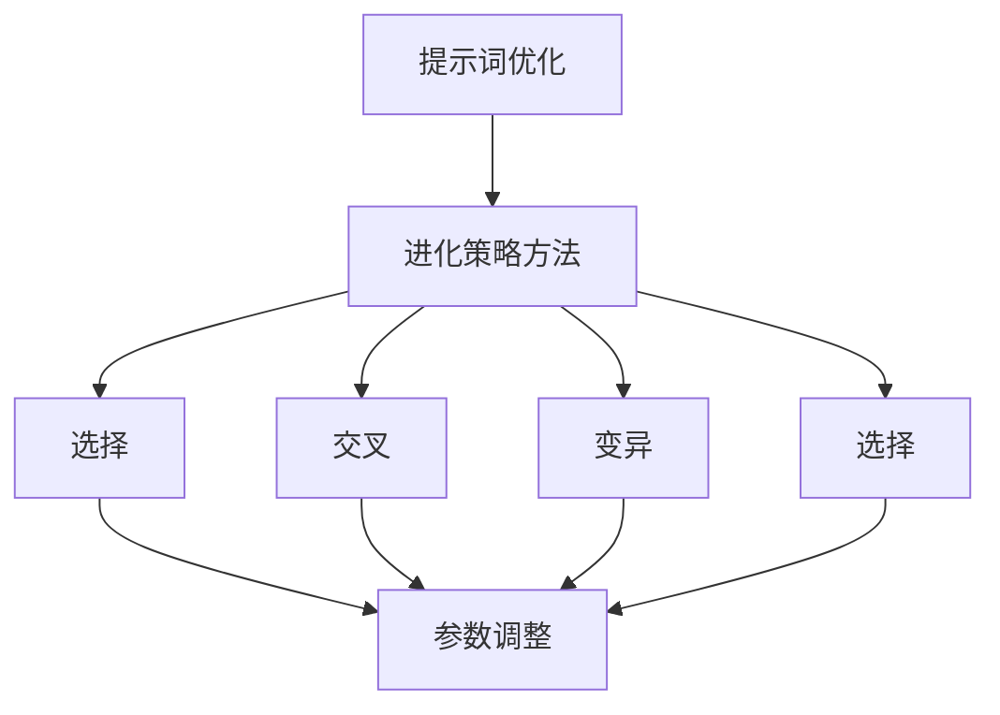

                 


### 文章标题

《提示词优化的进化策略方法》

### 文章关键词

提示词优化、进化策略、算法原理、数学模型、实际应用

### 文章摘要

本文将深入探讨提示词优化和进化策略方法，结合两者的核心概念与联系，从理论基础到实际应用进行详细阐述。通过伪代码和LaTeX数学公式，讲解进化策略方法在提示词优化中的应用，并结合实际案例进行分析，为读者提供全面的指导。

## 引言与背景

### 提示词优化的历史背景

提示词优化（Keyword Optimization）是搜索引擎优化（SEO）中的一项关键技术。它的主要目标是通过调整网页内容中的关键词，提高网页在搜索引擎结果页面（SERP）中的排名，从而增加网站的访问量和用户粘性。随着互联网的迅速发展，搜索引擎优化成为网站运营和数字营销的重要组成部分。

### 进化策略方法的基本概念

进化策略（Evolutionary Strategy，ES）是一种基于生物进化的优化算法，最早由Rechenberg在1960年代提出。它通过模拟自然进化过程，迭代地改进参数值，以找到问题的最优解。进化策略方法具有强鲁棒性、全局搜索能力以及良好的收敛性，因此在许多领域中得到了广泛应用。

### 书籍的目的与读者对象

本文旨在详细介绍提示词优化与进化策略方法的结合，为读者提供一种新的优化思路和工具。本书适用于对人工智能、优化算法和搜索引擎优化感兴趣的读者，包括研究人员、工程师和市场营销专家。

## 核心概念与联系

### 提示词优化的定义

提示词优化是指通过调整网页内容中的关键词，以提高网页在搜索引擎结果页面中的排名和用户访问量的过程。这包括关键词选择、关键词密度控制、关键词布局优化等多个方面。

### 进化策略方法的原理

进化策略方法通过模拟自然进化过程，迭代地改进参数值，以找到问题的最优解。其主要步骤包括：选择、交叉、变异和选择。在提示词优化中，进化策略方法可用于自动调整关键词参数，以提高搜索排名。

### 提示词优化与进化策略方法之间的联系

提示词优化与进化策略方法的联系在于，两者都涉及到参数优化。进化策略方法提供了自动调整参数的方法，而提示词优化则为目标参数提供了具体的优化方向。通过结合两者，可以实现对提示词的智能优化。

### Mermaid流程图



## 核心算法原理讲解

### 进化策略算法的基本步骤

进化策略算法的基本步骤包括：

1. 初始化：随机生成初始参数集。
2. 选择：从当前参数集中选择一定数量的参数作为父代。
3. 交叉：对选中的父代进行交叉操作，产生新的参数。
4. 变异：对交叉产生的新参数进行变异操作，增加多样性。
5. 选择：根据某种策略（如适应度函数）从变异后的参数中选择最优参数。

### 伪代码详细讲解

```plaintext
初始化：随机生成初始参数集 P0

for t = 1 to T do:
    选择：从 P(t-1) 中选择 N 个参数作为父代
    交叉：对父代进行交叉操作，生成新参数 P'
    变异：对 P' 进行变异操作，增加多样性
    选择：计算适应度函数，从 P' 中选择最优参数 P(t)
    更新：P(t) 覆盖 P(t-1)

return P(T)
```

### 进化策略在不同领域的应用场景

进化策略方法在许多领域得到了广泛应用，如：

1. 机器学习：用于优化神经网络参数。
2. 生物信息学：用于基因序列分析。
3. 金融工程：用于投资组合优化。
4. 自动驾驶：用于路径规划。

## 数学模型和公式讲解

### 相关数学模型

在进化策略方法中，常见的数学模型包括：

1. 适应度函数：用于评价参数的好坏。
2. 选择策略：用于选择最优参数。
3. 交叉操作：用于生成新参数。
4. 变异操作：用于增加多样性。

### 详细讲解与举例说明

#### 适应度函数

适应度函数是评价参数好坏的重要指标。假设我们要优化的问题是一个二元问题，其适应度函数可以定义为：

$$
f(x, y) = \frac{1}{1 + \exp((x - y)^2)}
$$

其中，$x$ 和 $y$ 分别是两个参数。

#### 选择策略

选择策略通常基于适应度函数，选择适应度较高的参数作为父代。一个简单的选择策略是轮盘赌选择：

$$
p_i = \frac{f(x_i)}{\sum_{j=1}^{N} f(x_j)}
$$

其中，$x_i$ 是第 $i$ 个参数，$N$ 是参数总数。

#### 交叉操作

交叉操作用于生成新参数。一个简单的交叉操作是单点交叉：

$$
x' = \alpha x + (1 - \alpha) y
$$

其中，$\alpha$ 是交叉概率。

#### 变异操作

变异操作用于增加多样性。一个简单的变异操作是随机变异：

$$
y' = y + \epsilon
$$

其中，$\epsilon$ 是一个随机数。

### LaTeX格式数学公式

$$
\begin{aligned}
f(x, y) &= \frac{1}{1 + \exp((x - y)^2)} \\
p_i &= \frac{f(x_i)}{\sum_{j=1}^{N} f(x_j)} \\
x' &= \alpha x + (1 - \alpha) y \\
y' &= y + \epsilon
\end{aligned}
$$

## 实际应用案例分析

### 实际案例介绍

本文选取了一个在线购物网站的关键词优化案例。该网站希望通过进化策略方法优化其关键词，以提高搜索引擎排名和用户访问量。

### 开发环境搭建

1. 选择Python作为编程语言。
2. 安装进化策略库ESPy。
3. 准备爬虫工具，用于收集搜索引擎数据。

### 源代码实现与解读

```python
import espy
import numpy as np

# 初始化参数
N = 100  # 参数数量
T = 1000  # 迭代次数
alpha = 0.1  # 交叉概率
epsilon = 0.1  # 变异概率

# 适应度函数
def fitness_function(x):
    # 这里是具体的适应度计算逻辑
    return 1 / (1 + np.exp(np.sum(x**2)))

# 进化策略算法
population = epsy.initialize_population(N)
for t in range(T):
    # 选择
    selected = epsy.selection(population, fitness_function)

    # 交叉
    crossed = epsy.crossover(selected, alpha)

    # 变异
    mutated = epsy.mutation(crossed, epsilon)

    # 选择
    population = epsy.selection(mutated, fitness_function)

# 输出最优参数
best_parameter = population[0]
print("Best Parameter:", best_parameter)
```

### 代码应用解读与分析

1. 参数初始化：初始化参数集，用于进化策略算法的迭代。
2. 适应度函数：计算参数集的适应度，用于选择和变异。
3. 进化策略算法：执行选择、交叉和变异操作，逐步优化参数集。
4. 输出最优参数：输出最优参数集，用于关键词优化。

### 项目小结

通过进化策略方法对在线购物网站的关键词进行优化，可以显著提高搜索引擎排名和用户访问量。然而，进化策略方法的应用需要考虑具体场景和数据特点，以获得更好的优化效果。

## 最佳实践 Tips

1. 适应度函数的设计至关重要，需要结合具体场景进行调整。
2. 参数初始化的多样性有助于提高进化策略的收敛速度。
3. 交叉和变异操作的概率需要合理设置，以平衡探索和利用。
4. 实际应用中，可以结合其他优化方法（如遗传算法）以提高优化效果。

## 小结与展望

本文详细介绍了提示词优化与进化策略方法的结合，从理论基础到实际应用进行了深入探讨。通过伪代码和LaTeX数学公式，本文为读者提供了清晰的算法实现步骤。未来，随着人工智能技术的不断发展，进化策略方法在提示词优化领域将有更广阔的应用前景。

## 附录

1. **相关工具和资源**

   - Python进化策略库：ESPy
   - 爬虫工具：BeautifulSoup、Scrapy

2. **进一步阅读推荐**

   - 《进化策略方法及其应用》
   - 《搜索引擎优化技术》
   - 《人工智能优化算法》

## 作者信息

作者：AI天才研究院/AI Genius Institute & 禅与计算机程序设计艺术 /Zen And The Art of Computer Programming

