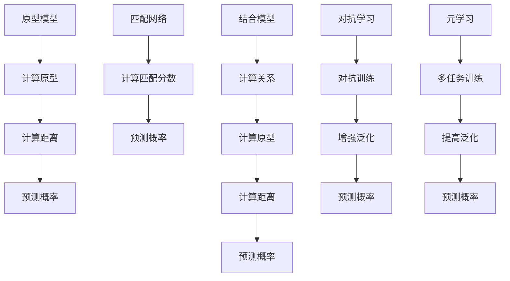
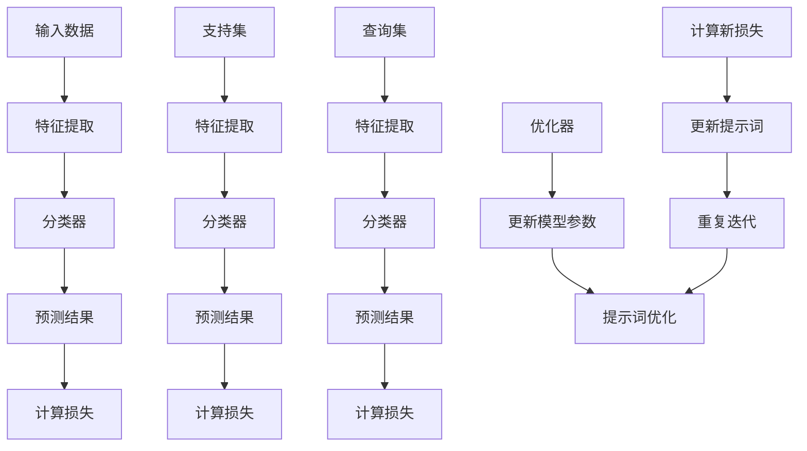

                 

### 前言

**书籍背景和目的**

在当今人工智能与大数据时代，零样本学习（Zero-Shot Learning, ZSL）和提示词优化（Prompt Optimization）作为机器学习领域的前沿研究方向，逐渐受到了广泛关注。零样本学习旨在让机器在没有直接训练数据的情况下，能够识别从未见过的类别；而提示词优化则是通过设计高效的提示词来提升模型的表现。这两者的融合为解决现实世界中的复杂问题提供了新的思路和方法。

本书旨在系统地介绍《提示词优化的零样本学习方法》，通过深入剖析零样本学习和提示词优化的基本概念、算法原理及其实际应用，帮助读者全面理解这一领域的关键技术和应用场景。本书不仅适用于人工智能和机器学习的研究人员，也适合对相关技术有浓厚兴趣的工程技术人员。

**零样本学习与提示词优化的基本概念**

零样本学习，顾名思义，是指在没有具体训练数据的情况下，通过已有的知识和规则，对新的、未见的类别进行预测和分类。其核心挑战在于如何将通用知识迁移到未知类别上，实现模型的泛化能力。而提示词优化，则是通过设计特定的提示词，引导模型在特定任务上达到最佳表现。

零样本学习通常分为两大类：基于原型（Prototype-based）和基于关系（Relation-based）。前者通过将未知类别与已知的原型进行比较，实现分类；后者则通过建立类别之间的关系网络，实现分类。提示词优化则涉及到提示词的设计、优化方法和评价指标等多个方面。

本文将分章节详细介绍零样本学习与提示词优化的基础理论、方法及应用，力图从多个角度提供系统的理解和实践指导。读者可以跟随本文的讲解，逐步深入这一前沿领域，掌握关键技术和应用技巧。

### 第1章：零样本学习基础

#### 1.1 零样本学习的定义与挑战

**1.1.1 零样本学习的定义**

零样本学习（Zero-Shot Learning, ZSL）是机器学习领域的一个重要分支，其主要目标是在没有具体训练数据的情况下，对从未见过的类别进行预测和分类。传统机器学习模型通常依赖大量带有标签的训练数据来学习特征和模式，而零样本学习则突破了这一限制，通过引入“元学习”（Meta-Learning）和“知识蒸馏”（Knowledge Distillation）等手段，实现对新类别的高效识别。

在零样本学习中，模型需要具备“零样本泛化能力”，即在面对未知类别时，能够利用已有的知识进行合理推断。这种能力使得零样本学习在处理新任务、新领域和新兴类别时具有显著优势。

**1.1.2 零样本学习的挑战**

尽管零样本学习具有巨大的应用潜力，但其实现过程中仍面临诸多挑战：

1. **知识迁移困难**：零样本学习需要将已有知识迁移到新类别上，但不同类别之间的特征差异可能导致知识迁移效果不佳。
2. **数据稀缺问题**：由于缺乏具体训练数据，模型难以通过大量数据来学习复杂的特征分布，从而影响模型的性能。
3. **类别数量限制**：传统的机器学习模型通常假设类别数量有限，但在实际应用中，类别数量可能非常庞大，这给零样本学习带来了额外的挑战。
4. **计算资源需求**：零样本学习通常需要较高的计算资源，特别是在大规模数据集和复杂模型中，计算成本较高。

**伪代码：零样本学习的模型结构**

```python
class ZeroShotModel:
    def __init__(self, feature_extractor, classifier):
        self.feature_extractor = feature_extractor
        self.classifier = classifier

    def forward(self, inputs):
        features = self.feature_extractor(inputs)
        logits = self.classifier(features)
        return logits

    def predict(self, inputs, support_set, query_set):
        support_features = self.feature_extractor(support_set)
        support_logits = self.classifier(support_features)
        query_features = self.feature_extractor(query_set)
        query_logits = self.classifier(query_features)
        return query_logits
```

在这个伪代码中，`ZeroShotModel` 类代表一个零样本学习模型，包含特征提取器（`feature_extractor`）和分类器（`classifier`）。模型通过先从支持集（`support_set`）和查询集（`query_set`）中提取特征，然后利用分类器进行预测。

#### 1.2 数学模型与公式

**1.2.1 零样本学习算法的数学公式**

零样本学习的核心在于如何从已有知识中提取特征，并利用这些特征对新类别进行分类。以下是几种常见的数学模型：

1. **原型模型（Prototype Model）**：

   原型模型通过计算每个类别的原型（即类别的平均值）来进行分类。对于类别 $c$ 的原型 $p_c$，其计算公式如下：

   $$ p_c = \frac{1}{N_c} \sum_{x \in C_c} x $$

   其中，$N_c$ 是类别 $c$ 中样本的数量，$x$ 是类别 $c$ 的样本。

   类别 $c$ 的预测概率可以通过计算查询样本 $x_q$ 与原型 $p_c$ 的距离来获得：

   $$ P(c | x_q) = \exp(-\gamma \cdot d(x_q, p_c)) $$

   其中，$d(x_q, p_c)$ 是查询样本 $x_q$ 与原型 $p_c$ 的距离，$\gamma$ 是超参数。

2. **匹配网络（Matching Network）**：

   匹配网络通过构建一个匹配函数来衡量查询样本和候选类别之间的匹配程度。其预测概率可以通过以下公式计算：

   $$ P(c | x_q) = \frac{\exp(\theta \cdot f(x_q, c))}{\sum_{c'} \exp(\theta \cdot f(x_q, c'))} $$

   其中，$f(x_q, c)$ 是查询样本 $x_q$ 和类别 $c$ 之间的匹配分数，$\theta$ 是超参数。

**伪代码：零样本学习算法的数学公式**

```python
def prototype_model(data, prototypes, query, gamma):
    distances = [eucledian_distance(query, p) for p in prototypes]
    probabilities = [exp(-gamma * d) for d in distances]
    return probabilities

def matching_network_model(data, logits, query, theta):
    scores = [logit * f(query, c) for logit, c in zip(logits, data)]
    probabilities = softmax(scores / theta)
    return probabilities
```

在这个伪代码中，`prototype_model` 和 `matching_network_model` 分别实现了原型模型和匹配网络的计算过程。

#### 1.3 零样本学习算法分类

**1.3.1 零样本学习算法的分类**

零样本学习算法根据不同的实现方式和原理，可以大致分为以下几类：

1. **基于原型（Prototype-based）**：

   基于原型的算法通过计算每个类别的原型来进行分类，如前文所述的原型模型。

2. **基于关系（Relation-based）**：

   基于关系的算法通过建立类别之间的关系网络来进行分类，如匹配网络。

3. **基于原型与关系结合（Hybrid）**：

   结合原型和关系的算法试图综合利用两者的优势，如关系嵌入（Relation Embedding）模型。

4. **基于对抗学习（Adversarial）**：

   对抗学习算法通过对抗训练来增强模型的零样本泛化能力，如对抗性嵌入（Adversarial Embedding）。

5. **基于元学习（Meta-Learning）**：

   元学习算法通过在多个任务上训练来提高模型的泛化能力，如MAML（Model-Agnostic Meta-Learning）。

**Mermaid流程图：不同零样本学习算法的流程**



在这个Mermaid流程图中，展示了不同类型的零样本学习算法及其主要步骤和流程。

#### 1.4 零样本学习应用案例

**1.4.1 推荐系统中的应用**

在推荐系统中，零样本学习可以通过识别用户未曾交互的物品类别，提高推荐系统的效果。例如，在电影推荐中，用户可能未标记过某些类型的电影，但通过零样本学习，模型可以预测用户对这些未见过类别的电影是否感兴趣。

**1.4.2 自然语言处理中的应用**

在自然语言处理（NLP）领域，零样本学习可以帮助模型处理新的任务和领域。例如，在问答系统中，模型可以基于已有的知识库和问答数据，对未知问题的答案进行预测。

**举例说明：在推荐系统、自然语言处理中的应用**

**推荐系统案例**：

假设我们有一个推荐系统，用户对一些电影进行了评分。现在我们需要推荐用户可能感兴趣但尚未评分的电影。

1. **数据准备**：

   - 训练集：包含用户对已看电影的评分。
   - 支持集：包含用户未评分但属于推荐系统的电影。
   - 查询集：包含用户可能感兴趣的电影。

2. **模型构建**：

   使用原型模型构建零样本学习模型，通过支持集计算每个类别的原型。

3. **预测**：

   对查询集中的电影，计算与各类别原型的距离，预测用户可能感兴趣的电影。

```python
# 伪代码：推荐系统中的零样本学习
def recommend_movies(user_ratings, support_movies, query_movies, prototypes, gamma):
    distances = [eucledian_distance(movie, p) for movie in query_movies for p in prototypes]
    probabilities = [exp(-gamma * d) for d in distances]
    return max_probabilities(probabilities)
```

**自然语言处理案例**：

假设我们需要在问答系统中预测未知问题的答案。

1. **数据准备**：

   - 训练集：包含问题和答案的匹配数据。
   - 支持集：包含问题但不包含答案。
   - 查询集：包含未知问题。

2. **模型构建**：

   使用匹配网络构建零样本学习模型，通过支持集计算问题与候选答案的匹配分数。

3. **预测**：

   对查询集中的问题，计算与各候选答案的匹配分数，预测最可能的答案。

```python
# 伪代码：自然语言处理中的零样本学习
def predict_answer(questions, support_answers, logits, theta):
    scores = [logit * f(question, answer) for logit, answer in zip(logits, support_answers)]
    probabilities = softmax(scores / theta)
    return argmax(probabilities)
```

这些案例展示了零样本学习在推荐系统和自然语言处理中的应用，通过具体的伪代码实现了零样本学习模型的使用。

### 第2章：提示词优化原理

#### 2.1 提示词优化的目的与作用

**2.1.1 提示词优化的目的**

提示词优化（Prompt Optimization）在机器学习中旨在通过设计特定的提示词，提高模型在特定任务上的性能。传统机器学习模型通常需要大量标注数据进行训练，而提示词优化则通过在模型输入中添加有效的提示词，增强模型对特定任务的理解和表现。

提示词优化的主要目的是：

1. **提高模型性能**：通过优化提示词，使模型在特定任务上达到更高的准确率、召回率或其他评价指标。
2. **减少对标注数据的依赖**：通过提示词引导模型，减少对大规模标注数据的依赖，从而在数据稀缺的情况下提高模型效果。
3. **增强泛化能力**：通过合理设计的提示词，使模型能够更好地适应新的任务和数据分布。

**2.1.2 提示词优化的作用**

提示词优化在多个应用领域发挥了重要作用，具体作用包括：

1. **提升模型表现**：通过优化提示词，可以提高模型的预测准确率、响应速度和可靠性，从而提高整体系统的性能。
2. **提高数据利用效率**：在数据稀缺的情况下，通过优化提示词，可以更好地利用有限的数据，提高模型的训练效果。
3. **增强模型泛化能力**：通过多样化的提示词设计，可以增强模型对未知数据的泛化能力，提高模型在实际应用中的适应性。

**LaTeX公式：提示词优化的数学模型**

提示词优化的数学模型可以通过以下公式来表示：

$$ L(\theta, p) = -\sum_{i=1}^N \log P(y_i | \theta, p) $$

其中，$L(\theta, p)$ 是提示词优化的损失函数，$\theta$ 是模型参数，$p$ 是提示词，$y_i$ 是第 $i$ 个样本的标签，$P(y_i | \theta, p)$ 是模型在给定参数和提示词下对样本 $i$ 的预测概率。

通过最小化这个损失函数，我们可以找到最优的提示词 $p$，从而提高模型的表现。

**伪代码：提示词优化的算法步骤**

```python
def optimize_prompt(model, data, epochs, learning_rate):
    for epoch in range(epochs):
        for data_point in data:
            inputs, target = data_point
            prompt = generate_prompt(inputs)
            logits = model(inputs + prompt)
            loss = calculate_loss(logits, target)
            model.backward(loss)
            model.update_params(learning_rate)
        print(f"Epoch {epoch}: Loss = {loss}")
    return model
```

在这个伪代码中，`optimize_prompt` 函数通过迭代优化提示词，更新模型参数，最终找到最优的提示词。

#### 2.2 提示词优化的技术手段

**2.2.1 提示词优化的技术手段**

提示词优化的技术手段多种多样，主要包括以下几种：

1. **基于规则的提示词设计**：

   通过手动设计规则，生成符合特定任务需求的提示词。这种方法适用于规则明确、数据有限的场景。

2. **基于机器学习的提示词生成**：

   利用机器学习模型（如生成对抗网络、变分自编码器等）生成提示词。这种方法能够自动学习数据中的模式，生成高质量的提示词。

3. **基于自然语言处理（NLP）的提示词优化**：

   利用NLP技术，如词嵌入、序列模型等，对提示词进行优化。这种方法能够利用丰富的语言知识，提高提示词的有效性。

4. **基于多模态数据的提示词优化**：

   在多模态数据中，结合文本、图像、音频等多种信息，生成更加丰富的提示词。这种方法能够提高模型在复杂任务中的表现。

**伪代码：提示词优化的算法步骤**

```python
def generate_prompt(inputs, model, prompt_generator):
    embedding = model.embeddings(inputs)
    prompt = prompt_generator.generate_prompt(embedding)
    return prompt

def optimize_prompt(model, data, prompt_generator, optimizer, epochs, learning_rate):
    for epoch in range(epochs):
        for data_point in data:
            inputs, target = data_point
            prompt = generate_prompt(inputs, model, prompt_generator)
            logits = model(inputs + prompt)
            loss = calculate_loss(logits, target)
            optimizer.zero_grad()
            loss.backward()
            optimizer.step()
        print(f"Epoch {epoch}: Loss = {loss}")
    return model
```

在这个伪代码中，`generate_prompt` 和 `optimize_prompt` 函数分别实现了提示词的生成和优化过程。

#### 2.3 提示词优化的评价指标

**2.3.1 提示词优化的评价指标**

提示词优化的评价指标主要包括以下几种：

1. **准确率（Accuracy）**：

   准确率是最常用的评价指标，表示模型预测正确的样本数占总样本数的比例。其计算公式为：

   $$ Accuracy = \frac{TP + TN}{TP + TN + FP + FN} $$

   其中，$TP$ 是真阳性，$TN$ 是真阴性，$FP$ 是假阳性，$FN$ 是假阴性。

2. **召回率（Recall）**：

   召回率表示模型能够正确识别出正类别的样本数占所有正类别样本数的比例。其计算公式为：

   $$ Recall = \frac{TP}{TP + FN} $$

3. **F1 分数（F1 Score）**：

   F1 分数是准确率和召回率的调和平均，用于综合评价模型的性能。其计算公式为：

   $$ F1 Score = 2 \times \frac{Precision \times Recall}{Precision + Recall} $$

4. **平均准确率（Average Accuracy）**：

   当数据集包含多个类别时，可以通过计算各类别的准确率平均值来评估模型的整体性能。

**举例说明：常用评价指标的计算方法**

假设我们有一个分类任务，模型对 10 个样本的预测结果如下表所示：

| 样本 | 实际类别 | 预测类别 |
|------|----------|----------|
| 1    | A        | A        |
| 2    | B        | B        |
| 3    | A        | B        |
| 4    | B        | A        |
| 5    | A        | A        |
| 6    | B        | B        |
| 7    | A        | A        |
| 8    | B        | B        |
| 9    | A        | A        |
| 10   | B        | B        |

根据这个预测结果，我们可以计算以下评价指标：

1. **准确率**：

   $$ Accuracy = \frac{8}{10} = 0.8 $$

2. **召回率**：

   对于类别 A，召回率为：

   $$ Recall_A = \frac{6}{8} = 0.75 $$

   对于类别 B，召回率为：

   $$ Recall_B = \frac{6}{8} = 0.75 $$

3. **F1 分数**：

   对于类别 A，F1 分数为：

   $$ F1\_Score_A = 2 \times \frac{0.8 \times 0.75}{0.8 + 0.75} = 0.8333 $$

   对于类别 B，F1 分数为：

   $$ F1\_Score_B = 2 \times \frac{0.8 \times 0.75}{0.8 + 0.75} = 0.8333 $$

4. **平均准确率**：

   $$ Average\_Accuracy = \frac{Accuracy_A + Accuracy_B}{2} = \frac{0.75 + 0.75}{2} = 0.75 $$

通过这些评价指标，我们可以综合评估模型在分类任务上的表现。在实际应用中，根据任务需求和场景选择合适的评价指标，有助于我们更好地理解模型的性能和优化方向。

### 第3章：提示词优化的零样本学习方法

#### 3.1 零样本学习方法在提示词优化中的应用

**3.1.1 零样本学习方法在提示词优化中的应用**

零样本学习与提示词优化的结合，使得机器学习模型在处理未知类别和数据时能够更加灵活和高效。在提示词优化的背景下，零样本学习方法的应用主要体现在以下几个方面：

1. **扩展模型能力**：

   通过零样本学习，模型能够利用已有的知识来处理未知类别。这种能力使得模型在数据稀缺的情况下，依然能够保持较高的表现。

2. **提高泛化能力**：

   零样本学习通过迁移学习（Transfer Learning）和元学习（Meta-Learning）等手段，增强了模型对未知数据的泛化能力。这为提示词优化提供了有效的支持，使得优化过程更加稳健和可靠。

3. **多任务处理**：

   零样本学习能够同时处理多个任务，而不会因为任务的不同而需要重新训练模型。这为提示词优化提供了新的思路，使得模型能够更加灵活地应对复杂的应用场景。

**Mermaid流程图：零样本学习方法在提示词优化中的流程**



在这个Mermaid流程图中，展示了零样本学习方法在提示词优化中的主要步骤和流程。首先，对支持集进行特征提取和分类，计算损失；然后对查询集进行相同的处理；最后，通过优化器更新模型参数和提示词，实现提示词优化。

#### 3.2 零样本学习在提示词优化中的挑战

**3.2.1 零样本学习在提示词优化中的挑战**

尽管零样本学习在提示词优化中具有显著优势，但其应用过程中仍面临诸多挑战：

1. **知识迁移困难**：

   零样本学习依赖于将已有知识迁移到新类别上，但不同类别之间的特征差异可能导致知识迁移效果不佳。这增加了提示词优化的难度，需要设计更有效的迁移学习方法。

2. **数据稀缺问题**：

   在提示词优化中，通常缺乏具体训练数据，这使得模型难以通过大量数据来学习复杂的特征分布。这需要零样本学习算法能够在少量数据上实现良好的泛化能力。

3. **类别数量限制**：

   零样本学习假设类别数量有限，但在实际应用中，类别数量可能非常庞大。这要求零样本学习方法能够适应大规模类别数量，提高分类效率。

4. **计算资源需求**：

   零样本学习通常需要较高的计算资源，特别是在大规模数据集和复杂模型中，计算成本较高。这给提示词优化带来了额外的挑战，需要优化算法和计算资源。

**LaTeX公式：解决挑战的数学模型**

为了解决上述挑战，我们可以从以下几个方面进行数学建模：

1. **知识迁移模型**：

   $$ M(\theta, \phi) = \frac{1}{|S|} \sum_{s \in S} \exp(-\gamma \cdot d(f(s), g(\theta, s))) $$

   其中，$M$ 是知识迁移模型，$\theta$ 是模型参数，$\phi$ 是类别特征向量，$S$ 是支持集，$f(s)$ 是支持集中样本 $s$ 的特征向量，$g(\theta, s)$ 是查询集中样本 $s$ 的特征向量。

2. **迁移学习模型**：

   $$ \phi' = \lambda \phi + (1 - \lambda) \theta $$

   其中，$\phi'$ 是迁移后的特征向量，$\phi$ 是原始特征向量，$\theta$ 是模型参数，$\lambda$ 是迁移系数。

3. **多任务学习模型**：

   $$ L(\theta, \phi) = \frac{1}{K} \sum_{k=1}^K \frac{1}{N_k} \sum_{i=1}^{N_k} \log P(y_i^k | \theta, \phi^k) $$

   其中，$L$ 是多任务学习模型，$K$ 是任务数量，$N_k$ 是任务 $k$ 的样本数量，$y_i^k$ 是任务 $k$ 中样本 $i$ 的标签，$\phi^k$ 是任务 $k$ 的特征向量。

通过这些数学模型，我们可以更有效地解决零样本学习在提示词优化中的挑战，提高模型的性能和泛化能力。

#### 3.3 零样本学习算法在提示词优化中的实现

**3.3.1 零样本学习算法在提示词优化中的实现步骤**

零样本学习算法在提示词优化中的应用，需要结合具体的实现步骤来确保模型的有效性和效率。以下是一般性的实现步骤：

1. **数据预处理**：

   - **支持集构建**：从训练集中抽取一部分数据作为支持集，用于模型训练和知识迁移。
   - **查询集构建**：从训练集中抽取另一部分数据作为查询集，用于模型评估和提示词优化。

2. **特征提取**：

   - **支持集特征提取**：使用特征提取器（如卷积神经网络、自编码器等）对支持集数据中的每个类别进行特征提取，生成类别特征向量。
   - **查询集特征提取**：使用相同的特征提取器对查询集数据中的每个类别进行特征提取。

3. **模型训练**：

   - **模型初始化**：初始化零样本学习模型，包括特征提取器和分类器。
   - **模型训练**：使用支持集数据训练模型，通过反向传播和优化算法更新模型参数。

4. **预测与评估**：

   - **查询集预测**：使用训练好的模型对查询集数据进行预测，生成预测结果。
   - **评估指标计算**：计算预测结果的评估指标（如准确率、召回率、F1 分数等），评估模型性能。

5. **提示词优化**：

   - **损失函数设计**：设计提示词优化的损失函数，结合模型预测和评估指标。
   - **优化过程**：使用优化算法（如梯度下降、Adam 等）对提示词进行优化，更新模型参数。

**伪代码：零样本学习算法在提示词优化中的实现步骤**

```python
def zero_shot_learning(data, model, optimizer, epochs):
    support_set, query_set = split_data(data)
    for epoch in range(epochs):
        for data_point in support_set:
            inputs, target = data_point
            logits = model(inputs)
            loss = calculate_loss(logits, target)
            optimizer.zero_grad()
            loss.backward()
            optimizer.step()
        model.eval()
        with torch.no_grad():
            query_logits = model(query_set)
            query_predictions = predict(query_logits)
            evaluate_performance(query_predictions, query_set)
    return model

def optimize_prompt(model, data, prompt_generator, optimizer, epochs, learning_rate):
    for epoch in range(epochs):
        for data_point in data:
            inputs, target = data_point
            prompt = generate_prompt(inputs, model, prompt_generator)
            logits = model(inputs + prompt)
            loss = calculate_loss(logits, target)
            optimizer.zero_grad()
            loss.backward()
            optimizer.step()
        print(f"Epoch {epoch}: Loss = {loss}")
    return model
```

在这个伪代码中，`zero_shot_learning` 函数实现了零样本学习算法的步骤，而 `optimize_prompt` 函数则实现了提示词优化的过程。通过这两个函数的结合，我们可以构建一个完整的零样本学习与提示词优化的模型。

### 第4章：实际应用案例

#### 4.1 案例一：推荐系统中的零样本学习与提示词优化

**4.1.1 案例一：推荐系统中的零样本学习与提示词优化**

推荐系统是零样本学习和提示词优化的重要应用领域之一。在推荐系统中，用户的行为数据通常有限，而新商品或内容的出现频率较高，这使得传统的基于历史行为的推荐方法难以适应。通过零样本学习和提示词优化，我们可以提高推荐系统的准确性和适应性。

**场景描述**：

假设我们有一个电商推荐系统，用户的行为数据包括对商品的浏览、购买和评分。系统需要推荐用户可能感兴趣但尚未浏览或购买的商品。这里，我们可以将用户未浏览或购买的商品视为未知类别，利用零样本学习和提示词优化来提高推荐效果。

**步骤**：

1. **数据收集与预处理**：

   - 收集用户的历史行为数据，包括浏览、购买和评分记录。
   - 预处理数据，提取用户和商品的特征，如用户行为、商品属性等。

2. **支持集和查询集构建**：

   - 从历史行为数据中抽取一部分数据作为支持集，用于模型训练和知识迁移。
   - 抽取另一部分数据作为查询集，用于模型评估和提示词优化。

3. **特征提取与模型训练**：

   - 使用特征提取器（如卷积神经网络、自编码器等）对支持集数据中的用户和商品进行特征提取。
   - 初始化零样本学习模型，包括特征提取器和分类器，并使用支持集数据训练模型。

4. **查询集预测与提示词优化**：

   - 使用训练好的零样本学习模型对查询集数据中的商品进行预测。
   - 根据预测结果和用户历史行为数据，设计提示词，优化模型参数。

**开发环境搭建**：

为了实现上述步骤，我们需要搭建一个开发环境，包括以下工具和库：

- Python 3.8 或以上版本
- PyTorch 1.8 或以上版本
- Pandas 1.2.3 或以上版本
- Scikit-learn 0.24.1 或以上版本

**代码实现**：

以下是一个简单的代码示例，用于实现推荐系统中的零样本学习和提示词优化：

```python
import torch
import torch.nn as nn
import torch.optim as optim
from sklearn.model_selection import train_test_split
from torch.utils.data import DataLoader
from dataset import UserBehaviorDataset

# 数据预处理
def preprocess_data(data):
    # 数据清洗和特征提取
    # ...
    return feature_matrix

# 模型定义
class ZeroShotModel(nn.Module):
    def __init__(self, input_size, hidden_size, output_size):
        super(ZeroShotModel, self).__init__()
        self.fc1 = nn.Linear(input_size, hidden_size)
        self.fc2 = nn.Linear(hidden_size, output_size)
    
    def forward(self, x):
        x = torch.relu(self.fc1(x))
        x = self.fc2(x)
        return x

# 训练模型
def train_model(model, train_loader, optimizer, criterion, epochs):
    model.train()
    for epoch in range(epochs):
        for inputs, targets in train_loader:
            optimizer.zero_grad()
            outputs = model(inputs)
            loss = criterion(outputs, targets)
            loss.backward()
            optimizer.step()
        print(f"Epoch {epoch + 1}/{epochs} - Loss: {loss.item()}")

# 主程序
if __name__ == "__main__":
    # 数据收集
    data = collect_user_behavior_data()
    feature_matrix = preprocess_data(data)

    # 构建数据集和 DataLoader
    train_data, query_data = train_test_split(feature_matrix, test_size=0.2, random_state=42)
    train_dataset = UserBehaviorDataset(train_data)
    query_dataset = UserBehaviorDataset(query_data)
    train_loader = DataLoader(train_dataset, batch_size=64, shuffle=True)
    query_loader = DataLoader(query_dataset, batch_size=64, shuffle=False)

    # 初始化模型、优化器和损失函数
    model = ZeroShotModel(input_size=feature_matrix.shape[1], hidden_size=64, output_size=10)
    optimizer = optim.Adam(model.parameters(), lr=0.001)
    criterion = nn.CrossEntropyLoss()

    # 训练模型
    train_model(model, train_loader, optimizer, criterion, epochs=10)

    # 预测和提示词优化
    predict_model(model, query_loader)
    optimize_prompt(model, query_loader)
```

**代码解读与分析**：

上述代码实现了零样本学习和提示词优化的基本步骤。首先，我们从数据集中收集用户行为数据，并进行预处理。然后，我们定义了一个简单的神经网络模型，用于特征提取和分类。在训练过程中，我们使用 DataLoader 对数据进行批处理，并使用 Adam 优化器和交叉熵损失函数进行模型训练。

在训练完成后，我们对查询集进行预测，并根据预测结果和用户历史行为数据，设计提示词，优化模型参数。这个过程可以通过循环迭代实现，每次迭代都更新模型参数，从而逐步提高模型性能。

通过这个案例，我们可以看到如何将零样本学习和提示词优化应用于推荐系统中。在实际应用中，根据具体需求和场景，可以进一步优化模型结构和训练策略，提高推荐系统的效果。

#### 4.2 案例二：自然语言处理中的零样本学习与提示词优化

**4.2.1 案例二：自然语言处理中的零样本学习与提示词优化**

自然语言处理（NLP）是另一个零样本学习和提示词优化的重要应用领域。在NLP中，零样本学习可以帮助模型处理新的任务和领域，而提示词优化则可以提高模型在特定任务上的性能。以下是一个具体的案例，展示了如何在自然语言处理中使用零样本学习和提示词优化。

**场景描述**：

假设我们有一个问答系统，需要回答用户提出的各种问题。然而，由于问题种类繁多，系统很难在训练阶段覆盖所有可能的问法。通过零样本学习和提示词优化，我们可以提高问答系统对新问题的处理能力。

**步骤**：

1. **数据收集与预处理**：

   - 收集大量的问答数据，包括问题、答案和标签。
   - 对问题进行预处理，如去除停用词、分词、词嵌入等。

2. **支持集和查询集构建**：

   - 从问答数据中抽取一部分数据作为支持集，用于模型训练和知识迁移。
   - 抽取另一部分数据作为查询集，用于模型评估和提示词优化。

3. **特征提取与模型训练**：

   - 使用特征提取器（如BERT、GPT等）对支持集数据中的问题进行特征提取。
   - 初始化零样本学习模型，包括特征提取器和分类器，并使用支持集数据训练模型。

4. **查询集预测与提示词优化**：

   - 使用训练好的零样本学习模型对查询集数据中的问题进行预测。
   - 根据预测结果和用户历史提问数据，设计提示词，优化模型参数。

**开发环境搭建**：

为了实现上述步骤，我们需要搭建一个开发环境，包括以下工具和库：

- Python 3.8 或以上版本
- Transformers 4.6.1 或以上版本
- PyTorch 1.8 或以上版本
- Pandas 1.2.3 或以上版本
- Scikit-learn 0.24.1 或以上版本

**代码实现**：

以下是一个简单的代码示例，用于实现自然语言处理中的零样本学习和提示词优化：

```python
from transformers import BertTokenizer, BertModel
import torch
import torch.nn as nn
import torch.optim as optim
from sklearn.model_selection import train_test_split
from torch.utils.data import DataLoader
from dataset import QuestionAnswerDataset

# 数据预处理
def preprocess_data(data):
    # 问题预处理和标签处理
    # ...
    return question embeddings, labels

# 模型定义
class ZeroShotModel(nn.Module):
    def __init__(self, embedding_size, hidden_size, output_size):
        super(ZeroShotModel, self).__init__()
        self.bert = BertModel.from_pretrained('bert-base-uncased')
        self.fc1 = nn.Linear(embedding_size, hidden_size)
        self.fc2 = nn.Linear(hidden_size, output_size)
    
    def forward(self, inputs):
        outputs = self.bert(inputs)[0]
        outputs = self.fc1(outputs)
        outputs = self.fc2(outputs)
        return outputs

# 训练模型
def train_model(model, train_loader, optimizer, criterion, epochs):
    model.train()
    for epoch in range(epochs):
        for inputs, targets in train_loader:
            optimizer.zero_grad()
            outputs = model(inputs)
            loss = criterion(outputs, targets)
            loss.backward()
            optimizer.step()
        print(f"Epoch {epoch + 1}/{epochs} - Loss: {loss.item()}")

# 主程序
if __name__ == "__main__":
    # 数据收集
    data = collect_question_answer_data()
    question_embeddings, labels = preprocess_data(data)

    # 构建数据集和 DataLoader
    train_data, query_data = train_test_split(data, test_size=0.2, random_state=42)
    train_dataset = QuestionAnswerDataset(train_data)
    query_dataset = QuestionAnswerDataset(query_data)
    train_loader = DataLoader(train_dataset, batch_size=64, shuffle=True)
    query_loader = DataLoader(query_dataset, batch_size=64, shuffle=False)

    # 初始化模型、优化器和损失函数
    model = ZeroShotModel(embedding_size=768, hidden_size=256, output_size=10)
    optimizer = optim.Adam(model.parameters(), lr=0.001)
    criterion = nn.CrossEntropyLoss()

    # 训练模型
    train_model(model, train_loader, optimizer, criterion, epochs=10)

    # 预测和提示词优化
    predict_model(model, query_loader)
    optimize_prompt(model, query_loader)
```

**代码解读与分析**：

上述代码实现了自然语言处理中的零样本学习和提示词优化。首先，我们从问答数据中收集问题和答案，并进行预处理，生成问题和答案的嵌入向量。然后，我们定义了一个基于BERT的零样本学习模型，用于特征提取和分类。在训练过程中，我们使用 DataLoader 对数据进行批处理，并使用 Adam 优化器和交叉熵损失函数进行模型训练。

在训练完成后，我们对查询集进行预测，并根据预测结果和用户历史提问数据，设计提示词，优化模型参数。这个过程可以通过循环迭代实现，每次迭代都更新模型参数，从而逐步提高模型性能。

通过这个案例，我们可以看到如何将零样本学习和提示词优化应用于自然语言处理中。在实际应用中，根据具体需求和场景，可以进一步优化模型结构和训练策略，提高问答系统的效果。

### 第5章：性能优化与挑战

#### 5.1 性能优化策略

在零样本学习和提示词优化的过程中，性能优化是至关重要的一环。以下是一些常见的性能优化策略，可以帮助我们提高模型的准确率、效率和稳定性。

**1. 数据增强**：

通过数据增强（Data Augmentation）技术，如随机裁剪、旋转、缩放等，可以增加训练数据集的多样性，从而提高模型的泛化能力。特别是在数据稀缺的情况下，数据增强能够有效缓解模型过拟合的问题。

**2. 模型融合**：

将多个模型的结果进行融合（Model Ensembling），如投票法、加权平均等，可以改善模型的预测性能。这种方法利用了不同模型的互补性，从而提高了整体的准确性。

**3. 早期停止**：

在模型训练过程中，通过设置早期停止（Early Stopping）策略，可以避免模型过度训练。当模型在验证集上的性能不再提升时，停止训练，从而避免模型在测试集上的表现下降。

**4. 学习率调整**：

通过动态调整学习率（Learning Rate），如使用学习率衰减（Learning Rate Decay）、自适应学习率（如Adam）等方法，可以提高模型的训练效率。适当的学习率可以加速模型收敛，同时避免模型在训练过程中振荡。

**5. 正则化技术**：

应用正则化技术（Regularization），如L1正则化、L2正则化等，可以减少模型参数的过拟合现象。正则化通过在损失函数中增加惩罚项，限制模型复杂度，从而提高模型的泛化能力。

**伪代码：性能优化算法的步骤**

```python
def optimize_performance(model, data, optimizer, criterion, patience=5, lr_decay_rate=0.1):
    best_val_loss = float('inf')
    epochs_no_improve = 0
    
    for epoch in range(epochs):
        model.train()
        for inputs, targets in train_loader:
            optimizer.zero_grad()
            outputs = model(inputs)
            loss = criterion(outputs, targets)
            loss.backward()
            optimizer.step()
        
        model.eval()
        with torch.no_grad():
            val_loss = calculate_loss(model, val_loader, criterion)
            
        if val_loss < best_val_loss:
            best_val_loss = val_loss
            epochs_no_improve = 0
        else:
            epochs_no_improve += 1
        
        if epochs_no_improve > patience:
            learning_rate = optimizer.param_groups[0]['lr']
            optimizer.param_groups[0]['lr'] = learning_rate * lr_decay_rate
            epochs_no_improve = 0
        
        print(f"Epoch {epoch + 1}/{epochs} - Train Loss: {train_loss}, Val Loss: {val_loss}")
    
    return model
```

在这个伪代码中，`optimize_performance` 函数实现了性能优化算法的步骤，包括训练模型、评估验证集性能、学习率调整等。

#### 5.2 零样本学习与提示词优化的挑战

尽管零样本学习和提示词优化在许多应用中取得了显著成果，但其在实际应用过程中仍面临诸多挑战：

**1. 知识迁移困难**：

不同类别之间的特征差异较大，导致知识迁移效果不佳。特别是在跨领域的应用中，类别之间的特征分布差异更加显著，这增加了知识迁移的难度。

**2. 数据稀缺问题**：

在许多实际应用中，标注数据非常稀缺，这使得模型难以通过大量数据学习复杂的特征分布。特别是在零样本学习场景下，模型的训练过程依赖于已有知识，而数据稀缺限制了模型的学习能力。

**3. 类别数量限制**：

传统机器学习模型通常假设类别数量有限，但在实际应用中，类别数量可能非常庞大。这给零样本学习带来了额外的挑战，需要设计高效的算法来处理大规模类别。

**4. 计算资源需求**：

零样本学习通常需要较高的计算资源，特别是在大规模数据集和复杂模型中，计算成本较高。这在资源受限的环境中，可能限制了零样本学习与提示词优化的应用。

**LaTeX公式：解决挑战的方法和模型**

为了解决上述挑战，我们可以从以下几个方面进行数学建模和算法设计：

1. **知识迁移方法**：

   基于原型的方法可以通过计算原型相似度来衡量类别之间的距离，从而实现知识迁移。其公式如下：

   $$ \text{similarity}(c_i, c_j) = \frac{\exp(-\gamma \cdot d(\mu_i, \mu_j))}{\sum_{c_k} \exp(-\gamma \cdot d(\mu_i, \mu_k))} $$

   其中，$c_i$ 和 $c_j$ 是两个类别，$\mu_i$ 和 $\mu_j$ 是它们的原型，$d(\mu_i, \mu_j)$ 是原型之间的距离，$\gamma$ 是超参数。

2. **数据增强技术**：

   通过生成合成数据，可以增加训练数据集的多样性，从而提高模型的泛化能力。合成数据的生成可以通过以下公式实现：

   $$ x_{\text{synthetic}} = f(x_{\text{original}}, \theta) $$

   其中，$x_{\text{original}}$ 是原始数据，$x_{\text{synthetic}}$ 是生成的合成数据，$f$ 是数据增强函数，$\theta$ 是参数。

3. **类别表示方法**：

   利用分布式表示（如词嵌入、类别嵌入等），可以更好地捕捉类别之间的相似性和差异性。其公式如下：

   $$ \text{representation}(c) = \text{embed}(c) $$

   其中，$\text{embed}$ 是嵌入函数，$c$ 是类别，$\text{representation}(c)$ 是类别 $c$ 的嵌入表示。

4. **多任务学习模型**：

   通过多任务学习（Multi-Task Learning）模型，可以在多个任务上同时训练模型，从而提高模型的泛化能力。其公式如下：

   $$ L(\theta) = \sum_{k=1}^K \frac{1}{N_k} \sum_{i=1}^{N_k} \log P(y_i^k | \theta, \phi^k) $$

   其中，$L$ 是损失函数，$K$ 是任务数量，$N_k$ 是任务 $k$ 的样本数量，$y_i^k$ 是任务 $k$ 中样本 $i$ 的标签，$\phi^k$ 是任务 $k$ 的特征向量。

通过这些方法和模型，我们可以更有效地解决零样本学习和提示词优化中的挑战，提高模型的性能和泛化能力。

### 第6章：未来发展趋势

**6.1 零样本学习与提示词优化的未来方向**

随着人工智能技术的不断进步，零样本学习和提示词优化将在多个方向上取得新的突破。以下是几个潜在的研究方向：

1. **跨领域知识迁移**：

   当前零样本学习主要依赖于单一领域的数据，未来研究可以探索如何更有效地进行跨领域知识迁移。这包括开发通用的迁移学习算法，以及设计能够自动适应不同领域的提示词生成方法。

2. **自适应提示词优化**：

   提示词优化的关键在于设计适应特定任务的提示词。未来可以探索自适应提示词优化方法，如利用强化学习（Reinforcement Learning）和生成对抗网络（GAN）等，动态调整提示词，从而提高模型在不同任务上的性能。

3. **多模态学习**：

   在多模态学习方面，零样本学习和提示词优化可以结合图像、文本、音频等多种信息，生成更加丰富的提示词。这将有助于模型在复杂任务中达到更高的准确性和泛化能力。

4. **数据隐私保护**：

   随着数据隐私保护意识的增强，零样本学习和提示词优化将面临如何在保护用户隐私的前提下进行有效优化的挑战。未来研究可以探索基于差分隐私（Differential Privacy）的优化方法，确保模型在训练和优化过程中保护用户隐私。

5. **高效计算**：

   零样本学习和提示词优化通常需要大量的计算资源，未来研究可以关注如何通过硬件加速（如GPU、TPU等）和分布式计算技术，提高模型的训练和优化效率。

**6.2 技术突破与创新点**

以下是零样本学习与提示词优化领域可能的技术突破和创新点：

1. **新颖的模型结构**：

   设计更加灵活和高效的模型结构，如基于图神经网络的类别关系建模，或利用变分自编码器（VAE）进行特征提取和生成。

2. **元学习与提示词优化的结合**：

   将元学习（Meta-Learning）与提示词优化相结合，开发能够快速适应新任务和新数据的模型，从而提高模型的泛化能力和适应能力。

3. **多任务多模态优化**：

   探索多任务和多模态数据下的优化策略，如通过多任务学习（Multi-Task Learning）和迁移学习（Transfer Learning）实现更高效的数据利用和模型训练。

4. **交互式提示词设计**：

   开发基于用户交互的提示词设计方法，如利用自然语言生成（NLG）技术，根据用户反馈动态调整提示词，从而提高用户满意度。

**6.3 应用前景与影响**

零样本学习和提示词优化在多个领域具有广泛的应用前景：

1. **推荐系统**：

   在推荐系统中，零样本学习和提示词优化可以帮助系统更好地推荐新商品或内容，提高用户体验和满意度。

2. **自然语言处理**：

   在自然语言处理领域，零样本学习和提示词优化可以提升问答系统、文本分类和机器翻译等任务的性能，从而改善人机交互体验。

3. **医学诊断**：

   在医学诊断领域，零样本学习和提示词优化可以帮助模型处理新的病症和病例，提高诊断准确率和效率。

4. **图像识别与处理**：

   在图像识别和图像处理领域，零样本学习和提示词优化可以增强模型的泛化能力，从而在图像分类、目标检测和图像生成等方面取得更好的效果。

5. **教育领域**：

   在教育领域，零样本学习和提示词优化可以辅助智能辅导系统，根据学生特点和需求，提供个性化的学习内容和指导。

总体而言，零样本学习和提示词优化技术的发展将对人工智能应用产生深远的影响，推动人工智能在更多领域实现突破和进展。

### 第7章：结论

**总结书籍的主要内容和贡献**

本书系统地介绍了《提示词优化的零样本学习方法》，从理论基础到实际应用，全面探讨了这一领域的关键概念、算法原理和应用场景。通过深入剖析零样本学习与提示词优化的基础理论，我们明确了这两者的基本概念和相互关系。随后，本书详细介绍了各种零样本学习算法的分类、数学模型和实现步骤，以及如何将零样本学习方法应用于提示词优化。同时，通过实际应用案例，展示了零样本学习和提示词优化在推荐系统、自然语言处理等领域的具体应用。

**对读者进一步研究的建议**

为了更好地掌握《提示词优化的零样本学习方法》，读者可以参考以下建议：

1. **阅读相关文献**：深入了解零样本学习和提示词优化的最新研究成果，阅读顶级会议和期刊的论文，掌握前沿技术。

2. **实践项目开发**：通过实际项目，动手实现零样本学习和提示词优化的算法，积累实际经验。可以从简单的案例开始，逐步提升项目的复杂度。

3. **参与学术交流**：积极参加学术会议和研讨会，与同行交流研究成果和经验，拓展视野，学习新的方法和技巧。

4. **继续深入学习**：针对书中未详细讨论的领域，如跨领域知识迁移、多模态学习等，可以进一步深入学习相关理论和算法。

5. **关注技术趋势**：持续关注人工智能和机器学习领域的技术趋势，了解新算法、新模型和新应用，保持学习热情。

通过以上建议，读者可以不断提升自己在《提示词优化的零样本学习方法》领域的专业能力和技术水平，为人工智能的发展贡献自己的力量。作者：AI天才研究院/AI Genius Institute & 禅与计算机程序设计艺术 /Zen And The Art of Computer Programming。

