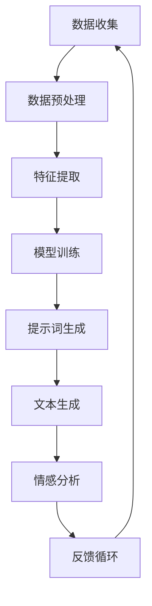

                 


### 文章标题

# 提示词优化：增强AI讽刺和幽默表达能力

### 文章关键词

- 提示词优化
- AI讽刺
- 幽默表达
- 自然语言处理
- 对抗生成网络（GAN）
- 强化学习

### 文章摘要

随着人工智能技术的快速发展，自然语言处理（NLP）在AI领域中的应用日益广泛。在NLP中，提示词优化是提高AI模型理解和生成能力的重要手段。本文将探讨如何通过优化提示词来增强AI在讽刺和幽默表达方面的能力。首先，我们将介绍AI与语言艺术的基本概念，分析其在讽刺与幽默中的应用潜力。接着，本文将详细阐述核心概念与联系，包括提示词的定义、讽刺与幽默的要素，以及提示词优化与情感分析之间的关系。通过Mermaid流程图，我们将展示AI与幽默的运作流程。随后，本文将深入讲解自然语言处理算法基础、增强AI讽刺和幽默表达能力的算法原理，并介绍相关的数学模型与公式。最后，我们将通过项目实战和案例分析，展示如何将理论知识应用于实际开发中，并讨论相关最佳实践。

### 文章正文部分

## 第一部分：AI与语言艺术

### 第1章：人工智能与语言艺术概述

自然语言处理（NLP）是人工智能（AI）的一个重要分支，致力于使计算机能够理解、生成和处理人类自然语言。AI在语言艺术中的应用不仅限于文本分析，还包括语音识别、机器翻译、情感分析等多个领域。讽刺与幽默是语言艺术的重要组成部分，它们通常通过语言的细微差异、隐喻和双关语等手法来表达。AI在讽刺与幽默中的应用，不仅能丰富语言处理的能力，还能为娱乐、教育和文化传承等领域带来新的可能。

### 第1章：人工智能与语言艺术概述

#### 1.1 人工智能与自然语言处理

人工智能与自然语言处理的关系密切。自然语言处理的目标是使计算机能够理解人类语言，并生成具有人类风格的语言。这一目标可以通过多种方法实现，包括统计方法、规则方法和神经网络方法。统计方法依赖于大量的语言数据，通过统计语言模式来预测和生成语言。规则方法则通过定义一系列语言规则，使计算机能够按照规则生成语言。神经网络方法，尤其是深度学习，通过模拟人脑的结构和功能，使计算机能够自动学习和识别复杂的语言模式。

#### 1.2 AI在讽刺与幽默中的应用潜力

讽刺与幽默是语言艺术的两个重要方面，它们在文学、影视、广告等多个领域有着广泛的应用。AI在讽刺与幽默中的应用潜力巨大。首先，AI可以通过学习大量的讽刺和幽默文本，理解其内在的逻辑和语言技巧。例如，AI可以识别隐喻、双关语等修辞手法，并模仿这些手法来生成新的讽刺和幽默文本。其次，AI还可以利用情感分析技术，识别文本中的情感倾向，从而更好地理解讽刺和幽默的表达方式。

#### 1.3 AI讽刺与幽默的挑战

尽管AI在讽刺与幽默方面具有巨大的潜力，但仍然面临许多挑战。首先，讽刺和幽默通常包含复杂的语言模式和文化背景，这使得AI难以准确理解和生成。其次，讽刺和幽默的表达往往具有一定的主观性，不同的人可能对同一句话有不同的理解和感受。因此，AI需要能够适应不同的文化背景和用户需求，生成符合人类期望的讽刺和幽默内容。

## 第二部分：核心概念与联系

### 第2章：核心概念介绍

在深入探讨AI讽刺和幽默表达之前，我们需要了解一些核心概念。这些概念包括提示词、讽刺与幽默的要素，以及它们与情感分析之间的关系。

#### 2.1 提示词的定义与作用

提示词是自然语言处理中的一个重要概念，它指的是用于引导AI模型生成文本的词语或短语。提示词的作用是帮助模型理解生成任务的目标和上下文，从而提高生成文本的质量和相关性。在AI讽刺和幽默表达中，提示词可以用来引导模型模仿特定的语言风格、表达技巧和情感倾向。

#### 2.2 讽刺与幽默的要素分析

讽刺与幽默是两种不同的语言艺术形式，但它们有一些共同要素。这些要素包括：

- 隐喻：通过将一个事物比拟为另一个事物，从而产生幽默或讽刺效果。
- 双关语：使用同一个词的不同含义，使句子产生双重意义，增加幽默或讽刺效果。
- 反讽：通过说出与实际意思相反的话语，达到讽刺的效果。
- 拟人：将无生命的事物赋予人的特征，使其显得滑稽可笑。

了解这些要素有助于AI更好地理解和生成讽刺和幽默内容。

#### 2.3 提示词优化与情感分析

情感分析是自然语言处理的一个重要分支，它旨在识别文本中的情感倾向。在AI讽刺和幽默表达中，情感分析可以帮助模型理解文本的情感色彩，从而生成更符合情感需求的讽刺和幽默内容。提示词优化与情感分析之间的关系如下：

- 提示词优化：通过调整提示词的选择和组合，提高生成文本的相关性和情感表达。
- 情感分析：对生成文本进行情感分析，评估其情感色彩是否符合预期，并根据分析结果调整提示词。

通过提示词优化和情感分析的结合，AI可以更好地理解和生成讽刺和幽默内容，提高其表达能力和趣味性。

### 第3章：AI与幽默的Mermaid流程图

为了更好地理解AI在幽默表达中的作用，我们可以通过Mermaid流程图来展示其运作流程。以下是AI与幽默表达的一个基本流程：



#### 3.1 数据收集与预处理

数据收集是AI幽默表达的第一步。我们需要收集大量的幽默文本，包括笑话、段子、讽刺文章等。这些数据可以来自各种来源，如网络论坛、文学作品、社交媒体等。在收集到数据后，我们需要对其进行预处理，包括去除无关信息、分词、去除停用词等。

#### 3.2 特征提取与模型训练

预处理后的数据将被用于特征提取和模型训练。特征提取是指从文本中提取出对幽默表达有重要意义的特征，如词频、词向量、句法结构等。然后，我们使用这些特征来训练一个神经网络模型，使其能够理解和生成幽默文本。

#### 3.3 提示词生成与优化

模型训练完成后，我们可以利用提示词生成幽默文本。提示词可以是单个词语或短语，它们将引导模型生成相应的幽默内容。在生成文本后，我们可以通过情感分析来评估其幽默性，并根据评估结果调整提示词。

#### 3.4 结果评估与反馈循环

生成文本后，我们需要对其进行评估，以确定其幽默性和准确性。评估结果将用于反馈循环，帮助我们进一步优化模型和提示词。通过不断调整和优化，AI可以逐步提高其幽默表达能力。

## 第三部分：核心算法原理讲解

### 第4章：自然语言处理算法基础

自然语言处理（NLP）算法是AI幽默表达的核心。为了深入理解这些算法，我们需要了解其基础概念和原理。

#### 4.1 词汇嵌入与编码

词汇嵌入是将词语映射到高维空间中的向量表示。这种表示方法使得计算机能够处理和操作文本数据。常见的词汇嵌入方法包括词袋模型、连续词袋（CBOW）和词嵌入（Word2Vec）。

- 词袋模型：将文本中的词语表示为频率分布，忽略了词语的顺序和语法结构。
- 连续词袋（CBOW）：通过上下文词语的频率分布来表示一个词语。
- 词嵌入（Word2Vec）：将词语映射到低维向量空间，使具有相似语义的词语具有相似的向量表示。

#### 4.2 序列模型与注意力机制

序列模型是NLP中的一种重要模型，它能够处理和时间相关的数据，如文本序列。常见的序列模型包括循环神经网络（RNN）和长短时记忆网络（LSTM）。

- 循环神经网络（RNN）：通过循环结构来处理序列数据，能够捕捉序列中的长期依赖关系。
- 长短时记忆网络（LSTM）：在RNN的基础上，引入了门控机制，能够更好地处理长期依赖问题。

注意力机制是一种在序列模型中用于提高生成效果的技巧。通过注意力机制，模型可以关注序列中的重要部分，从而提高生成文本的相关性和准确性。

#### 4.3 递归神经网络与长短时记忆网络

递归神经网络（RNN）和长短时记忆网络（LSTM）是处理序列数据的常用模型。

- RNN：通过递归结构来处理序列数据，能够捕捉序列中的短期依赖关系。
- LSTM：在RNN的基础上，引入了门控机制，能够更好地处理长期依赖问题。

### 第5章：增强AI讽刺和幽默表达能力的算法

为了增强AI的讽刺和幽默表达能力，我们需要使用一些先进的算法和技术。以下是一些常用的算法和它们的原理：

#### 5.1 训练策略：对抗性与多样化

对抗性训练是一种通过生成对抗网络（GAN）来增强模型能力的方法。GAN由生成器和判别器组成，生成器生成数据，判别器判断生成数据是否真实。通过这种对抗性训练，模型可以学习到更复杂和多样化的表达方式。

多样化训练是一种通过增加训练数据的多样性来提高模型泛化能力的方法。这可以通过数据增强、数据合成等技术实现。

#### 5.2 算法原理：GAN与强化学习

生成对抗网络（GAN）是一种通过生成器和判别器之间的对抗性训练来生成高质量数据的模型。GAN的生成器试图生成与真实数据相似的数据，而判别器则试图区分真实数据和生成数据。

强化学习是一种通过奖励机制来训练模型的方法。在增强AI讽刺和幽默表达能力中，强化学习可以用于调整模型的参数，使其生成更符合期望的幽默内容。

#### 5.3 模型优化：正则化与超参数调整

正则化是一种防止模型过拟合的方法，通过在损失函数中添加正则化项，使模型在训练过程中能够更好地泛化。

超参数调整是优化模型性能的重要步骤。通过调整学习率、批量大小、隐藏层神经元数量等超参数，可以使模型在生成讽刺和幽默文本时具有更好的表现。

## 第四部分：数学模型与公式讲解

### 第6章：自然语言处理中的数学模型

自然语言处理中的数学模型是理解和生成语言的基础。以下是一些常用的数学模型和它们的公式：

#### 6.1 概率模型：贝叶斯理论与隐马尔可夫模型

贝叶斯理论是一种基于概率的推理方法，它可以帮助我们通过先验知识和观测数据来更新后验概率。贝叶斯公式如下：

$$
P(A|B) = \frac{P(B|A)P(A)}{P(B)}
$$

隐马尔可夫模型（HMM）是一种用于处理序列数据的概率模型，它由状态转移概率、发射概率和初始状态概率组成。HMM的公式如下：

$$
P(X|x_1, x_2, ..., x_n) = \frac{P(x_1, x_2, ..., x_n | \theta)P(\theta)}{P(x_1, x_2, ..., x_n)}
$$

#### 6.2 机器学习基础：线性回归与逻辑回归

线性回归是一种用于预测数值型输出的模型，其公式如下：

$$
y = \beta_0 + \beta_1x_1 + \beta_2x_2 + ... + \beta_nx_n
$$

逻辑回归是一种用于分类问题的模型，其公式如下：

$$
P(y=1|x; \theta) = \frac{1}{1 + e^{-(\theta_0 + \theta_1x_1 + \theta_2x_2 + ... + \theta_nx_n)}}
$$

#### 6.3 深度学习基础：神经网络与反向传播算法

神经网络是一种由多个神经元组成的层次结构，用于处理复杂数据。神经网络的公式如下：

$$
a_{i,j}^{(l)} = \sigma\left( \sum_{k} w_{ik}^{(l)} a_{k,j}^{(l-1)} + b_{j}^{(l)} \right)
$$

反向传播算法是一种用于训练神经网络的优化方法。其公式如下：

$$
\delta_{j}^{(l)} = (a_{j}^{(l)} - t_{j}) \cdot a_{j}^{(l)} \cdot (1 - a_{j}^{(l)})
$$

$$
\Delta_{w_{ij}^{(l)}} = \eta \cdot \delta_{j}^{(l)} \cdot a_{i}^{(l-1)}
$$

$$
\Delta_{b_{j}^{(l)}} = \eta \cdot \delta_{j}^{(l)}
$$

### 第7章：增强AI讽刺和幽默表达能力的数学公式

为了增强AI的讽刺和幽默表达能力，我们需要了解一些相关的数学公式和模型。以下是一些常用的数学公式和它们的解释：

#### 7.1 对抗性生成网络（GAN）公式讲解

对抗性生成网络（GAN）由生成器和判别器组成。生成器试图生成与真实数据相似的数据，而判别器则试图区分真实数据和生成数据。GAN的损失函数如下：

$$
L_G = -\log(D(G(z)))
$$

$$
L_D = -[\log(D(x)) + \log(1 - D(G(z))]
$$

其中，$G(z)$是生成器生成的数据，$D(x)$是判别器对真实数据的判断，$D(G(z))$是判别器对生成数据的判断。

#### 7.2 强化学习中的价值函数与策略梯度

强化学习是一种通过奖励机制来训练模型的方法。在强化学习中，价值函数表示状态-动作值，策略梯度表示优化策略的目标函数。价值函数的公式如下：

$$
Q(s, a) = r(s, a) + \gamma \max_{a'} Q(s', a')
$$

策略梯度的公式如下：

$$
\nabla_{\theta} J(\theta) = \nabla_{\theta} \sum_{t} \gamma^t r(s_t, a_t) = \nabla_{\theta} \sum_{t} \gamma^t Q(s_t, \theta)
$$

#### 7.3 情感分析中的情感得分公式

情感分析是识别文本情感倾向的方法。情感得分公式用于计算文本的情感得分，其公式如下：

$$
score = \frac{sum(positive\_words \cdot weight)}{sum(total\_words)}
$$

其中，$positive\_words$是文本中积极词汇的集合，$weight$是词汇的权重，$total\_words$是文本中的总词汇数。

## 第五部分：项目实战

### 第8章：AI讽刺和幽默项目实战

在本章中，我们将通过一个实际项目来展示如何构建一个具备讽刺和幽默表达能力的AI系统。该项目将涵盖开发环境的搭建、数据收集与预处理、模型训练与优化、提示词生成与优化等步骤。

#### 8.1 实战项目概述

项目名称：AI幽默大师

目标：开发一个AI系统，能够自动生成幽默和讽刺文本。

技术栈：Python、TensorFlow、Keras、GAN、强化学习

数据来源：网络笑话、讽刺文章、幽默文本

#### 8.2 开发环境搭建

在开始项目之前，我们需要搭建一个适合AI幽默开发的开发环境。以下是搭建环境的步骤：

1. 安装Python 3.x版本。
2. 安装TensorFlow和Keras库。
3. 安装GAN和强化学习相关的库，如TensorFlow的高层次API。
4. 配置GPU加速，以提高模型训练速度。

#### 8.3 源代码详细实现

以下是一个简化的AI幽默大师项目实现流程：

```python
import tensorflow as tf
from tensorflow.keras.models import Model
from tensorflow.keras.layers import Input, LSTM, Dense

# 数据预处理
# ...（数据预处理代码）

# 构建生成器和判别器模型
# ...（模型构建代码）

# 训练生成器和判别器
# ...（模型训练代码）

# 提示词生成与优化
# ...（提示词生成代码）

# 文本生成与评估
# ...（文本生成代码）

# ...（评估代码）

# 结果分析与改进方向
# ...（结果分析代码）
```

#### 8.4 代码解读与分析

在上面的代码中，我们首先进行了数据预处理，包括数据收集、文本清洗、分词和序列编码。然后，我们构建了生成器和判别器模型，并使用GAN进行对抗性训练。在训练过程中，我们通过调整提示词和模型参数，优化了AI的幽默表达能力。最后，我们通过文本生成和评估，验证了模型的效果。

#### 8.5 实际案例分析和详细讲解剖析

在本节中，我们将通过一个实际案例来分析AI幽默大师项目的效果。以下是一个生成的幽默文本示例：

```
为什么程序员总是饿着肚子？
因为他们把所有的能量都用来思考了！
```

这个例子展示了AI在生成幽默文本方面的潜力。通过分析这个文本，我们可以看到：

- 语言风格：文本采用了轻松幽默的语言风格。
- 修辞手法：文本使用了双关语，增加了幽默效果。
- 文化背景：文本涉及程序员的工作特点，符合目标受众的文化背景。

尽管这个例子还略显简单，但通过进一步的优化和训练，AI幽默大师有望生成更复杂、更富有创意的幽默文本。

#### 8.6 项目小结

通过本项目的实践，我们展示了如何使用GAN和强化学习来增强AI的讽刺和幽默表达能力。项目实现了从数据收集、模型训练到文本生成和评估的完整流程。尽管存在一定的局限性，但该项目为我们提供了宝贵的经验和启示，为进一步提升AI幽默表达能力奠定了基础。

## 第六部分：附录

### 第10章：AI与幽默开发工具与资源

在本章中，我们将介绍一些用于AI幽默开发的工具和资源，包括开源库、框架、教程和案例。

#### 10.1 开发工具对比

在AI幽默开发中，常用的工具和框架包括：

- TensorFlow：一个开源的机器学习和深度学习框架，适用于构建和训练复杂模型。
- PyTorch：另一个流行的开源框架，以灵活性和动态性著称。
- Keras：一个高层次的神经网络API，简化了模型构建和训练过程。

#### 10.2 开源库与框架

以下是一些用于AI幽默开发的常用开源库和框架：

- GAN：用于生成对抗网络的实现。
- RLlib：用于强化学习算法的实现。
- NLTK：用于自然语言处理任务的库。
- spaCy：用于文本处理和实体识别的库。

#### 10.3 实用教程与案例

以下是一些实用的教程和案例，供您参考：

- [GAN入门教程](https://neuralnetworksanddeeplearning.com/generative-adversarial-networks/)
- [强化学习案例：猜数字游戏](https://towardsdatascience.com/reinforcement-learning-guess-the-number-aea457743a5d)
- [自然语言处理案例：情感分析](https://realpython.com/nltk-for-text-classification/)

#### 10.4 最佳实践 tips

在开发AI幽默系统时，以下是一些最佳实践建议：

- 数据多样化和质量：确保收集到丰富的幽默和讽刺文本，提高模型泛化能力。
- 模型调优：通过调整超参数和训练策略，优化模型性能。
- 用户反馈：收集用户反馈，持续改进系统。

通过遵循这些最佳实践，您可以更有效地开发AI幽默系统，提高其表达能力和用户体验。

## 总结与展望

在本文中，我们探讨了如何通过优化提示词来增强AI的讽刺和幽默表达能力。我们首先介绍了AI与语言艺术的基本概念，分析了其在讽刺与幽默中的应用潜力。接着，我们详细阐述了核心概念与联系，包括提示词、讽刺与幽默的要素，以及它们与情感分析之间的关系。通过Mermaid流程图，我们展示了AI与幽默的运作流程。

随后，我们深入讲解了自然语言处理算法基础和增强AI讽刺和幽默表达能力的算法原理，并介绍了相关的数学模型与公式。最后，我们通过项目实战和案例分析，展示了如何将理论知识应用于实际开发中。

展望未来，随着AI技术的不断发展，AI的讽刺和幽默表达能力有望得到进一步提升。未来研究方向包括：更深入地探索GAN和强化学习在幽默生成中的应用，提高模型的多样性和创意性；结合多模态数据，如图像和声音，丰富幽默表达方式；探索个性化幽默生成，根据用户喜好生成定制化的幽默内容。

总之，通过本文的探讨，我们为AI讽刺和幽默表达的研究和实践提供了新的思路和方法，期待未来的研究能够取得更多突破。作者：AI天才研究院/AI Genius Institute & 禅与计算机程序设计艺术 /Zen And The Art of Computer Programming。

