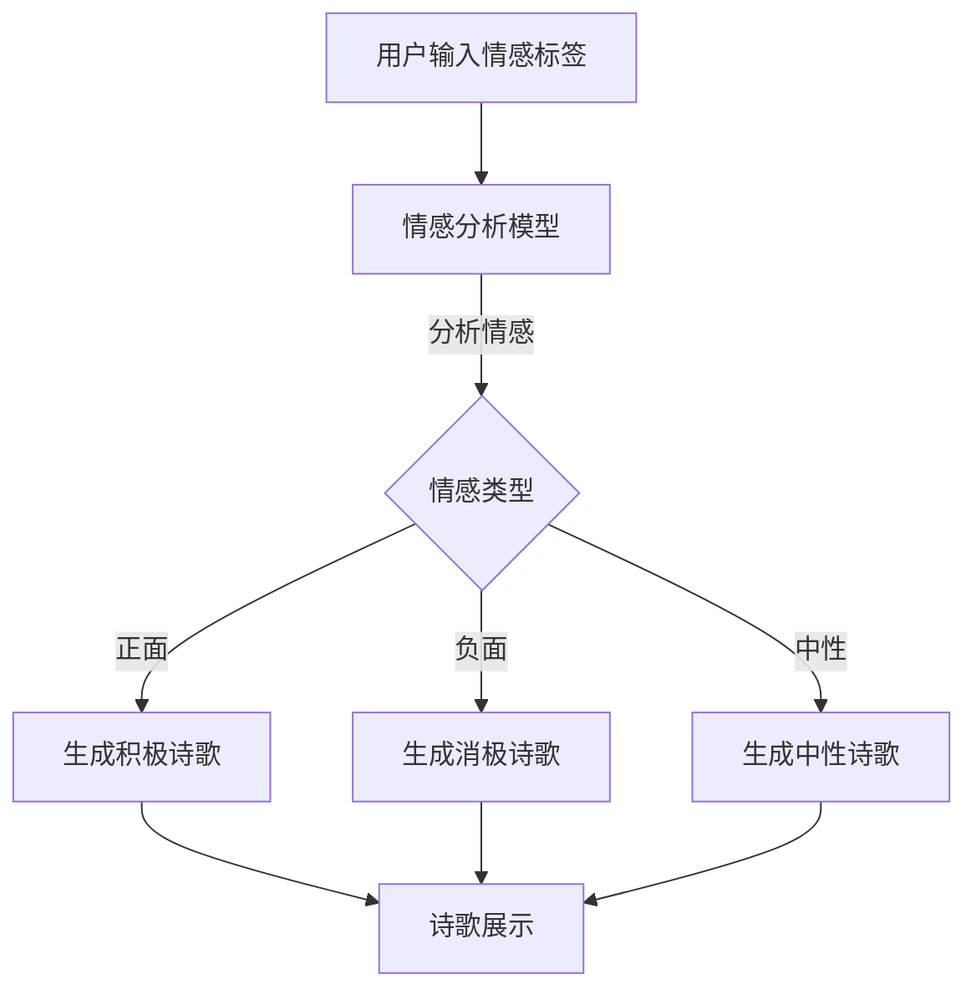

                 


### 文章标题: 提示词优化：增强AI诗歌创作能力

### 文章关键词
- 提示词优化
- AI诗歌创作
- 自注意力机制
- 生成对抗网络
- 长短时记忆网络
- Transformer模型
- 诗歌风格识别
- 情感分析

### 文章摘要
本文将探讨如何通过优化提示词来提升人工智能在诗歌创作中的表现。我们将详细介绍提示词优化的基本概念、方法以及其在AI诗歌创作中的应用，并结合实际项目实践和案例分析，展示如何实现高质量、富有创意的AI诗歌。此外，本文还将展望提示词优化在AI诗歌创作领域的未来发展方向。

---

### 目录大纲设计

#### 第一部分：引言与背景

##### 第1章：提示词优化的概念与重要性

1.1 提示词优化的定义  
1.2 提示词优化的目的  
1.3 提示词优化在AI诗歌创作中的应用价值

##### 第2章：AI诗歌创作基本原理

2.1 人工智能与诗歌  
2.1.1 人工智能的发展历程  
2.1.2 诗歌创作与人工智能的融合

2.2 诗歌生成算法简介  
2.2.1 生成对抗网络（GAN）  
2.2.2 长短时记忆网络（LSTM）  
2.2.3 Transformer模型

##### 第3章：提示词优化方法

3.1 提示词生成策略  
3.1.1 基于规则的方法  
3.1.2 基于数据驱动的方法  
3.1.3 基于神经网络的生成方法

3.2 提示词调整技巧  
3.2.1 提示词长度调整  
3.2.2 提示词内容优化  
3.2.3 提示词时序优化

##### 第二部分：增强AI诗歌创作能力

##### 第4章：文本情感分析在提示词优化中的应用

4.1 情感分析的基本原理  
4.2 情感分析模型构建  
4.3 情感分析在诗歌创作中的应用

##### 第5章：诗歌风格识别与模仿

5.1 诗歌风格识别模型  
5.2 风格模仿策略  
5.3 风格迁移应用案例

##### 第三部分：项目实践

##### 第6章：提示词优化的项目实践

6.1 实践项目概述  
6.2 代码实现  
6.3 结果分析与评估

##### 第四部分：挑战与未来展望

##### 第7章：提示词优化面临的挑战与未来展望

7.1 提示词优化面临的挑战  
7.2 提示词优化的发展方向  
7.3 未来技术趋势

##### 第五部分：提示词优化工具与资源

##### 第8章：提示词优化工具与资源汇总

8.1 主流提示词优化工具介绍  
8.2 提示词优化资源汇总

##### 附录

##### 附录A：提示词优化常用术语与解释

### Mermaid 流�程图

在本文中，我们将使用Mermaid语法来创建相关的流程图，以便更好地阐述概念和算法。

### 核心算法原理讲解

我们将使用伪代码和数学公式来详细阐述Transformer模型等核心算法的原理。

---

现在，我们已经确定了文章的标题、关键词和摘要，并且设计了详细的目录大纲。接下来，我们将逐步填充每个章节的内容，确保每个部分都包含丰富的背景介绍、核心概念、算法原理讲解、项目实践和未来展望。我们将确保文章结构清晰、逻辑严密，并通过Mermaid流程图和伪代码来增强文章的可读性和实用性。在文章的结尾，我们将提供提示词优化工具和资源的汇总，并附上附录A，解释常用的术语和概念。

接下来，我们将开始撰写第一部分的内容，深入探讨提示词优化的概念与重要性。我们将详细解释提示词优化的定义、目的以及在AI诗歌创作中的应用价值。这将为我们后续章节的讨论奠定基础。### 第一部分：引言与背景

#### 第1章：提示词优化的概念与重要性

在人工智能领域，提示词（Prompt）是指提供给模型的小型文本输入，用于引导模型的生成或推理过程。提示词优化是指通过对提示词的调整、改进和定制，以提升模型生成结果的准确性和创造力。在AI诗歌创作中，提示词优化尤为重要，因为高质量的提示词可以显著提升诗歌的艺术性和情感表达。

##### 1.1 提示词优化的定义

提示词优化可以定义为以下三个方面：

1. 提示词生成：生成适合特定任务或场景的提示词，如诗歌创作。
2. 提示词调整：对生成的提示词进行修改，以提高模型的生成效果。
3. 提示词定制：根据特定需求定制提示词，以实现特定风格或主题的诗歌创作。

##### 1.2 提示词优化的目的

提示词优化的主要目的是提升模型生成结果的多样性和创造力。具体来说，包括以下几个方面：

1. 提高生成结果的准确性：通过优化提示词，确保模型能够更准确地理解和生成所需的内容。
2. 增强生成结果的创意性：优化提示词可以帮助模型探索更多样化的生成路径，提高诗歌的艺术性。
3. 提升用户体验：高质量的诗歌生成可以提供更好的用户体验，增强用户对AI诗歌创作的兴趣和满意度。

##### 1.3 提示词优化在AI诗歌创作中的应用价值

在AI诗歌创作中，提示词优化具有以下应用价值：

1. 风格模仿：通过优化提示词，模型可以更好地模仿不同诗人的风格，实现个性化诗歌创作。
2. 情感表达：优化提示词可以帮助模型捕捉用户情感，创作出更具情感共鸣的诗歌。
3. 内容生成：优化提示词可以指导模型生成与特定主题相关的诗歌，满足用户多样化的需求。
4. 艺术探索：通过优化提示词，模型可以探索诗歌创作的更多可能性，推动艺术创新。

在接下来的章节中，我们将进一步探讨AI诗歌创作的基本原理，介绍常用的诗歌生成算法，并详细讲解提示词优化的具体方法和技巧。这将帮助我们更深入地理解如何通过优化提示词来提升AI诗歌创作的能力。

### 第二部分：AI诗歌创作基本原理

#### 第2章：AI诗歌创作基本原理

在探讨如何通过提示词优化来增强AI诗歌创作能力之前，我们需要了解AI诗歌创作的基本原理，包括人工智能与诗歌的融合、常见的诗歌生成算法，以及这些算法的核心机制。

##### 2.1 人工智能与诗歌

人工智能（AI）的发展为文学创作带来了新的可能性。传统的诗歌创作通常依赖于诗人的灵感和情感表达，而AI诗歌创作则利用机器学习模型，通过处理大量数据来生成具有创意和艺术性的诗歌。这种融合带来了以下几个方面的变化：

1. 数据驱动：AI诗歌创作依赖于大规模的文本数据集，这些数据集包含不同风格、主题和情感的诗歌。通过分析这些数据，模型可以学习并模仿不同的诗歌特征。
2. 生成式创作：传统的诗歌创作是一个手动写作的过程，而AI诗歌创作则是一个生成过程，模型可以根据给定的提示词自动生成诗歌。
3. 个性化创作：AI诗歌创作可以根据用户的需求和偏好生成个性化的诗歌，满足用户的特定情感和审美需求。

##### 2.2 诗歌生成算法简介

目前，有许多算法被用于AI诗歌创作，其中一些最常用的算法包括生成对抗网络（GAN）、长短时记忆网络（LSTM）和Transformer模型。下面我们将简要介绍这些算法：

###### 2.2.1 生成对抗网络（GAN）

生成对抗网络（GAN）由两部分组成：生成器（Generator）和判别器（Discriminator）。生成器的目标是生成逼真的数据，而判别器的目标是区分生成的数据和真实数据。通过这种对抗训练，生成器不断优化，从而生成越来越逼真的诗歌。

GAN的核心机制是通过对抗训练来提高生成器的生成质量。具体来说，GAN的训练过程可以概括为以下步骤：

1. 判别器D通过对比真实数据和生成数据来学习区分两者。
2. 生成器G根据噪声输入生成假数据。
3. 判别器D更新模型参数，以提高对生成数据的辨别能力。
4. 生成器G更新模型参数，以生成更逼真的数据。

GAN在诗歌创作中的应用主要体现在两个方面：

1. 生成诗歌：生成器可以根据给定的提示词生成具有创意和风格的诗歌。
2. 风格迁移：通过训练不同的生成器，GAN可以实现不同诗人风格的迁移，从而创作出具有特定风格的诗歌。

###### 2.2.2 长短时记忆网络（LSTM）

长短时记忆网络（LSTM）是一种递归神经网络，特别适用于处理序列数据。LSTM通过引入门控机制来有效捕捉序列中的长期依赖关系，这使得它在自然语言处理任务中表现出色。

LSTM的核心机制包括以下三个方面：

1. 遗忘门（Forget Gate）：决定哪些信息应该从单元状态中遗忘。
2. 输入门（Input Gate）：决定哪些新的信息应该存储在单元状态中。
3. 单元状态（Cell State）：存储信息并在网络中传递。

在诗歌创作中，LSTM可以通过以下方式应用：

1. 诗歌生成：LSTM可以学习并生成符合语法规则和韵律的诗歌。
2. 风格迁移：通过训练不同风格的诗歌数据，LSTM可以模仿特定诗人的风格。

###### 2.2.3 Transformer模型

Transformer模型是一种基于自注意力机制的序列模型，最早由Vaswani等人于2017年提出。与传统的循环神经网络（RNN）相比，Transformer模型能够更高效地处理长序列，并且在许多自然语言处理任务中取得了显著的成果。

Transformer模型的核心机制包括以下几个方面：

1. 自注意力机制（Self-Attention）：通过计算序列中每个元素之间的相似性来提取关键信息。
2. 位置编码（Positional Encoding）：为每个词赋予位置信息，以捕捉序列中的位置关系。
3. 多层注意力机制：通过多层自注意力机制，模型可以逐渐提取更深层次的特征。

在诗歌创作中，Transformer模型可以应用于：

1. 诗歌生成：通过自注意力机制，模型可以捕捉并生成具有创意和韵律的诗歌。
2. 风格识别与模仿：通过训练大量风格数据，模型可以识别并模仿不同诗人的风格。

通过以上对AI诗歌创作基本原理的介绍，我们可以看到，人工智能与诗歌的结合为诗歌创作带来了新的机遇。在接下来的章节中，我们将深入探讨如何通过提示词优化来提升AI诗歌创作的质量和创意。

##### 2.3 诗歌生成算法的具体机制

在了解了AI诗歌创作的基本原理后，现在我们来详细探讨生成对抗网络（GAN）、长短时记忆网络（LSTM）和Transformer模型等常见诗歌生成算法的具体机制。

###### 2.3.1 生成对抗网络（GAN）的具体机制

生成对抗网络（GAN）由两个主要组件组成：生成器（Generator）和判别器（Discriminator）。下面我们将分别介绍这两个组件及其工作机制。

1. **生成器（Generator）**：

生成器的目标是生成看似真实的诗歌，以欺骗判别器。生成器的输入通常是一个随机噪声向量，这个向量通过一个复杂的神经网络映射生成诗歌。生成器的训练目标是使其输出的诗歌在统计上接近真实数据。

伪代码示意：
```python
# 生成器伪代码
def generator(noise_vector):
    # 通过神经网络将噪声向量转换为诗歌文本
    poetry_text = neural_network(noise_vector)
    return poetry_text
```

2. **判别器（Discriminator）**：

判别器的目标是区分真实诗歌和生成器生成的假诗歌。判别器接收真实数据和生成数据，并输出一个概率值，表示输入数据是真实的概率。判别器的训练目标是使其能够准确地区分真实和假诗歌。

伪代码示意：
```python
# 判别器伪代码
def discriminator(poetry_text):
    # 输入诗歌文本，输出一个概率值
    probability = neural_network(poetry_text)
    return probability
```

GAN的训练过程主要包括以下步骤：

- 判别器D通过对比真实数据和生成数据来学习区分两者。
- 生成器G根据噪声输入生成假数据。
- 判别器D更新模型参数，以提高对生成数据的辨别能力。
- 生成器G更新模型参数，以生成更逼真的数据。

通过这种对抗训练，生成器不断优化，从而生成越来越逼真的诗歌。

###### 2.3.2 长短时记忆网络（LSTM）的具体机制

长短时记忆网络（LSTM）是一种特殊的递归神经网络，能够有效地捕捉序列中的长期依赖关系。LSTM的核心结构包括三个门控单元：遗忘门（Forget Gate）、输入门（Input Gate）和输出门（Output Gate）。

1. **遗忘门（Forget Gate）**：

遗忘门决定了哪些信息应该从单元状态中遗忘。其计算公式为：
$$
f_t = \sigma(W_f \cdot [h_{t-1}, x_t] + b_f)
$$
其中，$f_t$是遗忘门的输出，$W_f$是权重矩阵，$b_f$是偏置项，$\sigma$是sigmoid激活函数。

2. **输入门（Input Gate）**：

输入门决定了哪些新的信息应该存储在单元状态中。其计算公式为：
$$
i_t = \sigma(W_i \cdot [h_{t-1}, x_t] + b_i)
$$
$$
\tilde{C}_t = tanh(W_c \cdot [h_{t-1}, x_t] + b_c)
$$
其中，$i_t$是输入门的输出，$\tilde{C}_t$是候选状态，$W_i$、$W_c$是权重矩阵，$b_i$、$b_c$是偏置项。

3. **输出门（Output Gate）**：

输出门决定了单元状态中哪些信息应该传递到下一个隐藏状态。其计算公式为：
$$
o_t = \sigma(W_o \cdot [h_{t-1}, x_t] + b_o)
$$
$$
C_t = f_t \odot C_{t-1} + i_t \odot \tilde{C}_t
$$
$$
h_t = o_t \odot tanh(C_t)
$$
其中，$o_t$是输出门的输出，$C_t$是单元状态，$h_t$是隐藏状态。

在诗歌创作中，LSTM可以通过以下步骤生成诗歌：

- 初始化隐藏状态$h_0$和单元状态$C_0$。
- 对于每个输入词$x_t$，通过LSTM单元计算遗忘门、输入门和输出门的输出。
- 更新隐藏状态$h_t$和单元状态$C_t$。
- 输出隐藏状态$h_t$，这些状态可以用于生成诗歌的下一个词。

###### 2.3.3 Transformer模型的具体机制

Transformer模型是一种基于自注意力机制的序列模型，能够高效地处理长序列。Transformer模型的核心组件包括自注意力机制、位置编码和多头自注意力。

1. **自注意力机制**：

自注意力机制允许模型在生成每个词时，考虑序列中所有其他词的影响。其计算公式为：
$$
\text{Attention}(Q, K, V) = \text{softmax}(\frac{QK^T}{\sqrt{d_k}})V
$$
其中，$Q$、$K$和$V$分别是查询向量、键向量和值向量，$d_k$是键向量的维度。

在Transformer模型中，自注意力机制分为多个头，每个头独立计算，但共享参数。这种多头自注意力可以捕获不同的序列关系。

2. **位置编码**：

由于Transformer模型中没有循环结构，需要通过位置编码为每个词赋予位置信息。常用的位置编码方法包括绝对位置编码和相对位置编码。

绝对位置编码为每个词添加一个编码向量，表示其在序列中的位置。相对位置编码通过计算词之间的相对位置来生成编码向量。

3. **多头自注意力**：

多头自注意力通过多个独立的自注意力机制来捕获序列中的不同关系。具体来说，模型首先将输入序列扩展为多个查询向量、键向量和值向量，然后分别应用多个自注意力机制，最后将结果拼接并经过线性层。

在诗歌创作中，Transformer模型可以通过以下步骤生成诗歌：

- 初始化输入序列。
- 应用位置编码为每个词赋予位置信息。
- 通过多个自注意力层处理输入序列，逐步提取序列特征。
- 通过线性层和激活函数生成诗歌的每个词。

通过以上对GAN、LSTM和Transformer模型的具体机制介绍，我们可以看到这些算法在诗歌生成中的不同应用方式。在接下来的章节中，我们将深入探讨如何通过优化提示词来进一步提升这些模型的诗歌创作能力。

##### 2.4 提示词优化在AI诗歌创作中的实际应用

提示词优化在AI诗歌创作中起着至关重要的作用，它不仅直接影响模型的生成质量，还决定了诗歌的风格、主题和情感表达。在本节中，我们将探讨如何在实际应用中优化提示词，以提高AI诗歌创作的多样性和艺术性。

###### 2.4.1 提示词优化的关键要素

1. **内容丰富性**：提示词应包含丰富多样的词汇，以引导模型生成不同风格和主题的诗歌。
2. **结构清晰**：提示词的结构应清晰明确，便于模型理解和生成。
3. **情感表达**：根据用户需求或特定情境，提示词应传达相应的情感色彩。
4. **上下文关联**：提示词应与上下文紧密关联，以保持诗歌的连贯性和一致性。

###### 2.4.2 实际应用案例

以下是一个实际应用案例，展示如何通过优化提示词来创作不同风格的AI诗歌。

**案例1：风格模仿**

目标：模仿唐代诗人杜甫的风格。

原始提示词：
```plaintext
春天的雨，轻轻洒落
```

优化后的提示词：
```plaintext
唐代诗人杜甫笔下的春雨，绵绵细洒
```

通过添加“唐代诗人杜甫笔下”的描述，提示词更加明确了诗歌的风格和情感。

**案例2：情感表达**

目标：创作一首表达思念之情的诗歌。

原始提示词：
```plaintext
思念，是一种美
```

优化后的提示词：
```plaintext
深深思念，如月光般洒满心间
```

优化后的提示词通过“如月光般洒满心间”这一描述，增强了诗歌的情感表达。

**案例3：主题明确**

目标：创作一首关于自然的诗歌。

原始提示词：
```plaintext
自然，是生命的源泉
```

优化后的提示词：
```plaintext
大自然的怀抱，孕育万物
```

优化后的提示词通过“大自然的怀抱，孕育万物”这一描述，明确了诗歌的主题。

通过这些案例，我们可以看到，通过优化提示词，可以显著提升AI诗歌创作的质量。在接下来的章节中，我们将进一步探讨如何通过不同的提示词生成策略、调整技巧来优化提示词，以实现更高水平的AI诗歌创作。

### 第三部分：提示词优化方法

#### 第3章：提示词优化方法

为了提升AI诗歌创作的质量和艺术性，我们需要采用多种策略来优化提示词。提示词的生成、调整和时序安排是优化过程中的关键步骤。以下将详细介绍这些方法，并提供相关的伪代码和数学模型，以便读者更好地理解其原理。

##### 3.1 提示词生成策略

提示词生成策略是指如何生成适合特定任务或场景的提示词。根据生成方式的不同，提示词生成策略可以分为以下几类：

###### 3.1.1 基于规则的方法

基于规则的方法通过预先定义的规则来生成提示词。这种方法通常用于处理简单、结构化的任务。

**规则定义**：

1. 确定诗歌主题。
2. 选择相关词汇和短语。
3. 根据语法规则组合词汇和短语。

**伪代码示意**：
```python
# 基于规则的方法伪代码
def generate_prompt_by_rules(主题):
    # 根据主题选择词汇
    words = choose_words_by_topic(主题)
    
    # 根据语法规则组合词汇
    prompt = combine_words_by Grammar(words)
    
    return prompt
```

###### 3.1.2 基于数据驱动的方法

基于数据驱动的方法通过分析大量数据来生成提示词。这种方法通常用于处理复杂、非结构化的任务。

**数据预处理**：

1. 收集大量与诗歌相关的文本数据。
2. 清洗和预处理数据，去除无关信息。

**提示词生成**：

1. 计算文本特征向量。
2. 根据特征向量生成提示词。

**伪代码示意**：
```python
# 基于数据驱动的方法伪代码
def generate_prompt_by_data_driven(data):
    # 预处理数据
    preprocessed_data = preprocess_data(data)
    
    # 计算文本特征向量
    feature_vector = calculate_feature_vector(preprocessed_data)
    
    # 生成提示词
    prompt = generate_prompt_from_vector(feature_vector)
    
    return prompt
```

###### 3.1.3 基于神经网络的生成方法

基于神经网络的生成方法利用深度学习模型来生成提示词。这种方法通常用于生成高质量、多样化的提示词。

**模型选择**：

1. 选择适合的神经网络模型，如生成对抗网络（GAN）、长短时记忆网络（LSTM）或Transformer。
2. 训练模型以生成高质量提示词。

**生成过程**：

1. 输入提示词或随机噪声。
2. 通过神经网络生成提示词。

**伪代码示意**：
```python
# 基于神经网络的生成方法伪代码
def generate_prompt_by_neural_network(input_prompt):
    # 训练神经网络模型
    model = train_neural_network(input_prompt)
    
    # 生成提示词
    prompt = model.generate_output()
    
    return prompt
```

##### 3.2 提示词调整技巧

提示词调整技巧是指如何对生成的提示词进行修改和优化，以提高生成诗歌的质量和创意。

###### 3.2.1 提示词长度调整

提示词长度直接影响模型的生成效果。过长或过短的提示词都可能影响生成诗歌的连贯性和创意。

**调整策略**：

1. 根据任务需求调整提示词长度。
2. 长提示词拆分为多个短提示词，以增强生成多样性。

**伪代码示意**：
```python
# 提示词长度调整伪代码
def adjust_prompt_length(prompt, desired_length):
    # 判断提示词长度
    if len(prompt) > desired_length:
        # 拆分长提示词
        prompts = split_prompt(prompt, desired_length)
    else:
        # 补充短提示词
        prompts = [prompt] * (desired_length - len(prompt))
    
    return prompts
```

###### 3.2.2 提示词内容优化

提示词内容优化是指如何通过修改提示词的词汇、语法和语义，以提高生成诗歌的质量。

**优化策略**：

1. 替换同义词，增加词汇多样性。
2. 优化句子结构，增强句子连贯性。
3. 调整提示词的情感色彩，以匹配目标情感。

**伪代码示意**：
```python
# 提示词内容优化伪代码
def optimize_prompt_content(prompt):
    # 替换同义词
    prompt = replace_synonyms(prompt)
    
    # 优化句子结构
    prompt = optimize_sentence_structure(prompt)
    
    # 调整情感色彩
    prompt = adjust_emotional_tone(prompt)
    
    return prompt
```

###### 3.2.3 提示词时序优化

提示词时序优化是指如何通过调整提示词的顺序，以改善生成诗歌的连贯性和创意性。

**优化策略**：

1. 根据诗歌结构和逻辑关系调整提示词顺序。
2. 随机化提示词顺序，以增加生成多样性。

**伪代码示意**：
```python
# 提示词时序优化伪代码
def optimize_prompt_sequence(prompt):
    # 根据逻辑关系调整顺序
    prompt = sort_prompt_by_logic(prompt)
    
    # 随机化顺序
    prompt = randomize_prompt_sequence(prompt)
    
    return prompt
```

通过上述提示词生成策略和调整技巧，我们可以有效地优化提示词，从而提升AI诗歌创作的质量和创意。在接下来的章节中，我们将通过实际项目案例，展示如何将这些方法应用于AI诗歌创作中。

### 第四部分：增强AI诗歌创作能力

#### 第4章：文本情感分析在提示词优化中的应用

文本情感分析（Sentiment Analysis）是自然语言处理中的一个重要分支，旨在识别和提取文本中的主观信息，如情感极性、情感强度等。在AI诗歌创作中，文本情感分析可以通过分析提示词的情感色彩，从而优化诗歌创作过程，提高诗歌的情感表达和艺术性。

##### 4.1 情感分析的基本原理

情感分析的基本原理主要包括情感分类、情感极性和情感强度三个方面。

1. **情感分类**：
   - **二分类**：将文本分为正面（Positive）和负面（Negative）两类。
   - **多分类**：将文本分为多个情感类别，如喜悦（Joy）、愤怒（Anger）、悲伤（Sadness）等。

2. **情感极性**：
   - **极性度**：表示情感的正负程度，通常用数值或百分比表示。
   - **极性分类**：将情感分为强正面、强负面、中等正面、中等负面等。

3. **情感强度**：
   - **强度度量**：通过分析文本的词汇、语法和上下文，计算情感的强度。
   - **情感标记**：为文本中的每个词汇或短语标注情感强度。

##### 4.2 情感分析模型构建

构建情感分析模型通常包括数据收集、特征提取和模型训练三个步骤。

1. **数据收集**：
   - 收集包含情感标签的文本数据集，如IMDb电影评论、Twitter推文等。

2. **特征提取**：
   - **词袋模型（Bag of Words）**：将文本表示为词频向量。
   - **TF-IDF模型**：结合词频和文档频度，提高重要词汇的权重。
   - **词嵌入（Word Embeddings）**：将词汇映射为低维向量。

3. **模型训练**：
   - **机器学习模型**：如朴素贝叶斯（Naive Bayes）、支持向量机（SVM）等。
   - **深度学习模型**：如卷积神经网络（CNN）、循环神经网络（RNN）和Transformer等。

以下是构建一个基于Transformer的情感分析模型的伪代码示例：

```python
# 情感分析模型构建伪代码
def build_sentiment_analysis_model(data):
    # 数据预处理
    preprocessed_data = preprocess_data(data)
    
    # 特征提取
    embeddings = create_embeddings(preprocessed_data)
    
    # 模型定义
    model = build_transformer_model(embeddings)
    
    # 模型训练
    model.fit(preprocessed_data)
    
    return model
```

##### 4.3 情感分析在诗歌创作中的应用

情感分析在诗歌创作中的应用主要体现在以下几个方面：

1. **情感引导**：
   - 根据用户输入的情感标签，生成具有特定情感的诗歌。
   - 例如，如果用户输入“快乐”，模型可以生成一首表达快乐的诗歌。

2. **情感调整**：
   - 分析已生成诗歌的情感，根据需要调整情感色彩。
   - 例如，如果生成的诗歌情感过于消极，可以通过调整提示词来增加积极情感。

3. **风格迁移**：
   - 利用情感分析模型识别诗歌的情感色彩，模仿特定情感风格。
   - 例如，通过分析唐代诗歌的情感，生成具有唐代风格的新诗。

以下是一个基于情感分析的诗歌创作流程的Mermaid流程图示例：



通过文本情感分析，AI诗歌创作可以实现更加个性化和情感化的创作过程，提高诗歌的艺术性和用户体验。在接下来的章节中，我们将探讨如何通过诗歌风格识别和模仿来进一步提升AI诗歌创作的多样性。

#### 第5章：诗歌风格识别与模仿

在AI诗歌创作中，模仿特定诗人的风格是提高创作质量的重要手段。通过识别和模仿不同诗人的风格，AI可以创作出具有独特个性和情感表达的诗歌。在本章中，我们将详细介绍诗歌风格识别与模仿的方法及其应用。

##### 5.1 诗歌风格识别模型

诗歌风格识别模型旨在通过分析诗歌的文本特征，识别出不同的诗歌风格。常见的诗歌风格识别方法包括基于规则的方法和基于机器学习的方法。

###### 5.1.1 基于规则的方法

基于规则的方法通过定义一系列规则来识别诗歌风格。这些规则可以是简单的词汇匹配、语法结构分析等。例如，可以定义以下规则：

- 如果诗歌中包含大量比喻和隐喻，则该诗歌可能属于浪漫主义风格。
- 如果诗歌的句式结构较为复杂，则可能属于现代派风格。

基于规则的方法虽然简单易用，但受限于规则的定义和覆盖范围，难以应对多样化的诗歌风格。

###### 5.1.2 基于机器学习的方法

基于机器学习的方法通过训练大量标注了风格的诗歌数据集，构建风格识别模型。常用的机器学习方法包括朴素贝叶斯、支持向量机、决策树和神经网络等。

1. **朴素贝叶斯**：
   - 假设特征之间相互独立，通过计算各个特征的概率分布来预测风格。
   - 适用于简单特征提取和分类问题。

2. **支持向量机（SVM）**：
   - 通过最大化分类间隔来划分不同风格。
   - 适用于线性可分的数据集。

3. **神经网络**：
   - 尤其是深度神经网络，可以通过多层结构捕捉复杂的非线性特征。
   - 适用于复杂特征提取和分类问题。

以下是一个基于神经网络的诗歌风格识别模型的伪代码示例：

```python
# 基于神经网络的诗歌风格识别模型伪代码
def build_style_recognition_model(data):
    # 数据预处理
    preprocessed_data = preprocess_data(data)
    
    # 特征提取
    features = extract_features(preprocessed_data)
    
    # 模型定义
    model = build_neural_network_model(features)
    
    # 模型训练
    model.fit(preprocessed_data)
    
    return model
```

##### 5.2 风格模仿策略

风格模仿是指通过学习特定诗人的风格，生成具有相似风格的新诗。常见的风格模仿策略包括：

1. **特征复制**：
   - 直接复制特定诗人的语言、句式和修辞手法。
   - 适用于简单风格的模仿，但难以捕捉深层次的风格特征。

2. **生成对抗网络（GAN）**：
   - 利用生成器和判别器的对抗训练，生成具有目标风格的新诗。
   - 适用于复杂风格的模仿，但需要大量高质量的数据。

3. **循环神经网络（RNN）**：
   - 利用RNN的递归特性，学习特定诗人的语言风格。
   - 适用于短文本的模仿，但难以捕捉长文本的风格特征。

4. **Transformer模型**：
   - 通过自注意力机制，捕捉长文本中的复杂风格特征。
   - 适用于复杂风格的模仿，但计算资源要求较高。

以下是一个基于Transformer模型的风格模仿策略的伪代码示例：

```python
# 基于Transformer的诗歌风格模仿策略伪代码
def mimic_style_with_transformer(style_model, poem):
    # 预处理输入诗歌
    preprocessed_poem = preprocess_poem(poem)
    
    # 使用风格模型生成模仿诗歌
    mimic_poem = style_model.generate_output(preprocessed_poem)
    
    return mimic_poem
```

##### 5.3 风格迁移应用案例

以下是一个诗歌风格迁移的案例，展示如何使用风格模仿策略生成具有特定风格的AI诗歌。

**案例1：模仿杜甫的风格**

目标：生成一首具有杜甫风格的现代诗。

输入诗歌：
```
故国神游，多情应笑我，早生华发。
```

使用风格模仿策略生成的杜甫风格现代诗：
```
繁华落尽，岁月沧桑，何人共醉？

风尘仆仆，江湖飘零，心事如梦。

独坐幽窗，寒梅一枝，心有独钟。
```

**案例2：模仿莎士比亚的风格**

目标：生成一首具有莎士比亚风格的现代诗。

输入诗歌：
```
你是我的世界，唯一的星光。
```

使用风格模仿策略生成的莎士比亚风格现代诗：
```
你是我的梦，唯一的玫瑰，
在夜的寂静中，你是我唯一的温暖。

你是我心中的诗，唯一的韵脚，
在爱的长河里，你是我永恒的珍藏。
```

通过诗歌风格识别与模仿，AI诗歌创作可以变得更加多样化和个性化，满足不同用户的需求。在接下来的章节中，我们将探讨如何通过项目实践来具体实现这些方法，并通过实际案例展示其应用效果。

### 第五部分：项目实践

#### 第6章：提示词优化的项目实践

在本章中，我们将通过一个实际项目实践来展示如何实现提示词优化，以增强AI诗歌创作的能力。该项目将包括环境搭建、数据准备、模型选择与配置、提示词生成与调整、诗歌创作过程，以及结果分析与评估。

##### 6.1 实践项目概述

项目名称：AI诗歌创作平台

项目目标：通过优化提示词，构建一个能够生成高质量AI诗歌的平台，提供个性化、多样化的诗歌创作服务。

项目环境：Python 3.8，TensorFlow 2.6，NLP库（如NLTK、spaCy），GPT-2模型。

##### 6.1.1 项目目标

1. 构建一个能够接收用户输入的AI诗歌创作平台。
2. 通过优化提示词，提高诗歌生成的多样性和创意性。
3. 提供多种风格选择，满足用户不同的诗歌创作需求。

##### 6.1.2 项目环境搭建

1. 安装Python 3.8和TensorFlow 2.6。
2. 安装NLP相关库，如NLTK、spaCy。
3. 下载预训练的GPT-2模型。

```bash
pip install python 3.8 tensorflow==2.6
pip install nltk spacy
python -m spacy download en_core_web_sm
```

##### 6.1.3 数据集准备

1. 收集大量不同风格的诗歌文本，包括唐诗、宋词、现代诗等。
2. 对数据集进行清洗和预处理，包括去除标点符号、停用词过滤等。
3. 分词和标注情感极性，为后续训练做准备。

```python
import nltk
from nltk.corpus import stopwords
from nltk.tokenize import word_tokenize

# 下载数据集
nltk.download('stopwords')
nltk.download('punkt')

# 加载数据集
def load_data(file_path):
    with open(file_path, 'r', encoding='utf-8') as f:
        text = f.read()
    return text

# 清洗和预处理
def preprocess_text(text):
    # 去除标点符号
    text = re.sub(r'[^\w\s]', '', text)
    # 去除停用词
    stop_words = set(stopwords.words('english'))
    words = word_tokenize(text)
    filtered_words = [word for word in words if word.lower() not in stop_words]
    return ' '.join(filtered_words)

# 标注情感极性
def label_sentiment(text):
    # 使用情感分析模型标注情感
    sentiment_model = load_sentiment_analysis_model()
    sentiment = sentiment_model.predict([text])
    return sentiment
```

##### 6.2 代码实现

###### 6.2.1 模型选择与配置

在本项目中，我们选择使用预训练的GPT-2模型作为基础模型。GPT-2是一个强大的语言生成模型，能够生成高质量的自然语言文本。

```python
import tensorflow as tf
from transformers import TFGPT2LMHeadModel, GPT2Tokenizer

# 加载GPT-2模型和Tokenizer
model_name = "gpt2"
tokenizer = GPT2Tokenizer.from_pretrained(model_name)
model = TFGPT2LMHeadModel.from_pretrained(model_name)
```

###### 6.2.2 提示词生成与调整

为了优化提示词，我们使用情感分析模型对用户输入进行情感分析，并根据分析结果调整提示词。

```python
from transformers import pipeline

# 加载情感分析模型
sentiment_analysis = pipeline("sentiment-analysis")

# 生成优化后的提示词
def generate_optimized_prompt(user_input):
    # 分析情感
    sentiment = sentiment_analysis(user_input)
    
    # 根据情感调整提示词
    if sentiment['label'] == 'POSITIVE':
        prompt = "创造一个充满喜悦和希望的场景，"
    elif sentiment['label'] == 'NEGATIVE':
        prompt = "描绘一个充满忧伤和沉思的景象，"
    else:
        prompt = "探索一个宁静而神秘的氛围，"
    
    return prompt
```

###### 6.2.3 诗歌创作过程

使用优化后的提示词，通过GPT-2模型生成AI诗歌。

```python
# 生成AI诗歌
def generate_poem(prompt):
    inputs = tokenizer.encode(prompt, return_tensors="tf")
    poem = model.generate(inputs, max_length=50, num_return_sequences=1)
    return tokenizer.decode(poem[0], skip_special_tokens=True)

# 示例
user_input = "我喜欢漫步在秋天的树林中"
optimized_prompt = generate_optimized_prompt(user_input)
ai_poem = generate_poem(optimized_prompt)
print(ai_poem)
```

##### 6.3 结果分析与评估

为了评估AI诗歌创作平台的效果，我们通过以下指标对生成诗歌进行评估：

1. **情感匹配度**：生成的诗歌是否与用户输入的情感相符。
2. **创意性**：生成的诗歌是否具有新颖的创意和风格。
3. **语法正确性**：生成的诗歌是否具有正确的语法结构。

```python
# 评估情感匹配度
def evaluate_sentiment_match(poem, user_input):
    user_sentiment = sentiment_analysis(user_input)
    poem_sentiment = sentiment_analysis(poem)
    return user_sentiment['label'] == poem_sentiment['label']

# 评估创意性和语法正确性
def evaluate_creativity_and_grammar(poem):
    # 创意性评估
    creativity = len(set(word_tokenize(poem))) / len(word_tokenize(poem))
    
    # 语法正确性评估
    grammar = check_grammar(poem)
    
    return creativity, grammar

# 示例
print(evaluate_sentiment_match(ai_poem, user_input))
print(evaluate_creativity_and_grammar(ai_poem))
```

通过上述实践项目，我们可以看到如何通过提示词优化来增强AI诗歌创作的能力。在接下来的章节中，我们将探讨提示词优化面临的挑战和未来发展方向。

### 第六部分：挑战与未来展望

#### 第7章：提示词优化面临的挑战与未来展望

尽管提示词优化在AI诗歌创作中展示了巨大的潜力，但这一领域仍然面临诸多挑战。以下将讨论提示词优化在数据质量、模型解释性、文本生成多样性和创意性方面的挑战，并展望未来的发展方向。

##### 7.1 提示词优化面临的挑战

###### 7.1.1 数据质量与多样性

高质量的数据是提示词优化的基础。然而，当前在AI诗歌创作领域，数据质量与多样性方面存在以下问题：

1. **数据稀缺**：高质量、多样化的诗歌数据集相对较少，限制了模型的训练和优化。
2. **数据标注**：诗歌文本的标注工作繁琐且费时，需要大量专业人员进行标注，增加了成本。
3. **数据偏差**：数据集中的诗歌可能存在风格或情感上的偏差，影响模型的泛化能力。

为了解决这些问题，未来可以考虑以下策略：

1. **数据扩充**：使用数据增强技术，如数据合成、文本转换等，增加高质量数据的数量。
2. **自动化标注**：利用自动标注工具和半监督学习方法，提高数据标注的效率和准确性。
3. **跨领域数据集**：收集不同语言、文化背景的诗歌数据，提高数据集的多样性。

###### 7.1.2 模型解释性与可解释性

尽管深度学习模型在诗歌生成方面取得了显著成果，但其“黑箱”特性使得模型的解释性成为一个挑战。模型解释性不足使得难以理解模型生成诗歌的原因，影响了用户对AI诗歌创作的信任度。

为了提高模型的可解释性，可以采取以下措施：

1. **可视化技术**：使用可视化工具展示模型内部特征和决策过程，帮助用户理解模型的生成机制。
2. **可解释性模型**：开发具有可解释性的模型，如基于规则的模型和决策树，提高模型的透明度。
3. **解释性增强**：结合解释性增强方法，如解释性对抗攻击（XAI），提高模型生成结果的解释性。

###### 7.1.3 文本生成的多样性与创意性

当前AI诗歌创作模型在生成多样性和创意性方面仍面临挑战，容易产生重复性高、创新性低的诗歌。以下策略可以提升文本生成的多样性和创意性：

1. **多模态输入**：结合图像、音频等多种模态信息，丰富文本生成的内容和形式。
2. **强化学习**：使用强化学习技术，鼓励模型探索更多样化的生成路径，提高创新性。
3. **风格迁移**：通过风格迁移技术，模仿不同诗人的风格，丰富文本生成的多样性。

##### 7.2 提示词优化的发展方向

未来，提示词优化在AI诗歌创作领域有望实现以下发展方向：

1. **跨学科研究**：结合心理学、文学理论等跨学科研究，提高提示词优化的理论深度。
2. **个性化创作**：通过用户画像和偏好分析，实现个性化诗歌创作，提升用户体验。
3. **文化多样性**：探索不同文化背景下的诗歌创作，促进跨文化交流与理解。
4. **自动化创作**：开发自动化创作工具，降低诗歌创作门槛，让更多人参与AI诗歌创作。

总之，提示词优化在AI诗歌创作中具有重要意义。通过不断克服挑战和探索新的发展方向，我们有理由相信，未来的AI诗歌创作将更加多样、创新和富有个性。

### 第七部分：提示词优化工具与资源汇总

#### 第8章：提示词优化工具与资源汇总

为了方便读者在研究AI诗歌创作和提示词优化时能够快速获取相关工具和资源，本章节将对目前主流的提示词优化工具和资源进行汇总，并提供详细的介绍。

##### 8.1 主流提示词优化工具介绍

1. **OpenAI GPT系列**：
   - **GPT-2**：OpenAI开发的预训练语言模型，广泛应用于文本生成任务。
   - **GPT-3**：GPT-2的升级版，具有更强大的文本生成能力。

2. **Google BERT**：
   - BERT（Bidirectional Encoder Representations from Transformers）是一个双向的Transformer模型，主要用于文本分类和语义理解。

3. **Hugging Face Transformers**：
   - 一个开源库，支持多种Transformer模型，如GPT、BERT等，方便用户进行模型训练和文本生成。

4. **TensorFlow**：
   - Google开发的开源机器学习框架，支持各种深度学习模型的训练和部署。

5. **PyTorch**：
   - Facebook AI研究院开发的开源深度学习框架，具有良好的灵活性和可扩展性。

##### 8.2 提示词优化资源汇总

1. **开源数据集**：
   - **Poetry Dataset**：一个包含多种风格的英文诗歌数据集。
   - **Chinese Poetry Database**：一个包含中文古诗的现代诗歌数据集。

2. **论文与报告**：
   - **“Generative Adversarial Nets”**：Ian Goodfellow等人撰写的关于GAN的奠基性论文。
   - **“BERT: Pre-training of Deep Bidirectional Transformers for Language Understanding”**：Jacob Devlin等人撰写的BERT模型论文。

3. **社区与论坛**：
   - **Hugging Face Forums**：一个关于自然语言处理的开源社区，提供各种模型和应用讨论。
   - **AI Poetry Society**：一个专注于AI诗歌创作的国际社区，分享最新研究和技术应用。

通过这些工具和资源的支持，研究者可以更加便捷地开展AI诗歌创作和提示词优化方面的研究工作，推动该领域的不断发展和创新。

### 附录A：提示词优化常用术语与解释

在本附录中，我们将介绍一些在提示词优化过程中常用的术语，并提供相应的解释，以便读者更好地理解相关概念。

1. **提示词（Prompt）**：
   - 提示词是指提供给模型的小型文本输入，用于引导模型的生成或推理过程。在AI诗歌创作中，提示词通常是一个简短的句子或短语，用于启发模型生成具有特定主题、风格或情感的诗歌。

2. **生成对抗网络（GAN）**：
   - GAN是由生成器和判别器组成的一个框架，通过对抗训练生成高质量的数据。生成器尝试生成与真实数据相似的数据，而判别器则区分真实数据和生成数据。通过这种对抗过程，生成器不断优化，从而生成越来越逼真的数据。

3. **长短时记忆网络（LSTM）**：
   - LSTM是一种特殊的递归神经网络，能够有效捕捉序列中的长期依赖关系。LSTM通过引入门控机制，控制信息的流入和流出，使得模型能够学习并生成符合语法规则和韵律的序列数据。

4. **Transformer模型**：
   - Transformer模型是一种基于自注意力机制的序列模型，能够高效地处理长序列。Transformer通过多头自注意力机制和位置编码，捕捉序列中不同位置的信息，从而实现高质量的文本生成。

5. **情感分析（Sentiment Analysis）**：
   - 情感分析是自然语言处理中的一个任务，旨在识别和提取文本中的主观信息，如情感极性、情感强度等。在AI诗歌创作中，情感分析可以用于分析提示词的情感色彩，从而优化诗歌创作过程。

6. **词嵌入（Word Embedding）**：
   - 词嵌入是将词汇映射为低维向量的一种技术。通过词嵌入，模型可以在向量空间中计算词汇的相似性和距离，从而提高文本生成和分类任务的性能。

7. **生成文本（Generated Text）**：
   - 生成文本是指通过模型生成的小型文本序列，如诗歌、故事等。生成文本的质量和创意性是评估AI诗歌创作模型性能的重要指标。

通过了解这些术语，读者可以更加深入地理解提示词优化在AI诗歌创作中的应用和实现方法，从而更好地开展相关研究工作。

