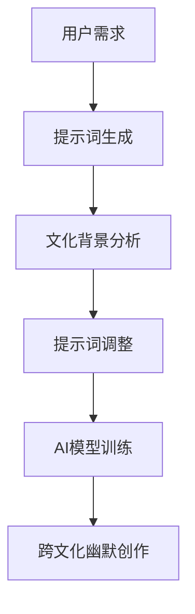
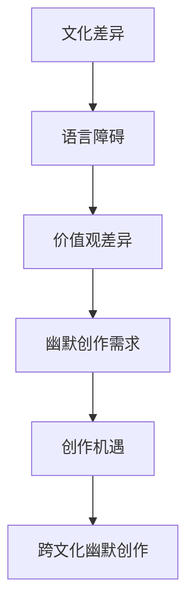

                 

# 提示词优化：增强AI跨文化幽默创作的适应性

> 关键词：提示词优化，AI，跨文化，幽默创作，自然语言处理，多模态融合

> 摘要：本文将深入探讨提示词优化在增强AI跨文化幽默创作适应性方面的作用。我们将首先介绍核心概念，并分析它们之间的关系。接下来，我们将讲解自然语言处理（NLP）算法和多模态融合算法的原理，通过伪代码展示其实现过程。最后，我们将通过一个实际项目，详细展示提示词优化在AI跨文化幽默创作中的应用。

## 第一部分：核心概念与联系

### 1.1 核心概念与联系

#### 1.1.1 提示词优化：原理与目的

提示词优化是指通过调整和改进提示词（Prompt），使AI系统在跨文化幽默创作中能够更加适应不同的文化背景和用户需求。其目的是提高AI的跨文化适应性和创作质量。

提示词优化的流程图如下：



在用户需求阶段，我们需要明确用户想要创作何种类型的幽默内容，并收集相关的文化背景信息。接下来，通过对文化背景的分析，我们可以确定哪些提示词可能更适合跨文化幽默创作。在此基础上，对提示词进行调整，使其更具适应性和创意性。最终，通过AI模型训练，实现跨文化幽默内容的自动生成。

#### 1.1.2 跨文化幽默创作：挑战与机遇

跨文化幽默创作面临的主要挑战包括文化差异、语言障碍和价值观差异等。然而，这也带来了机遇，因为不同文化背景的用户对幽默有不同的需求和期待，为AI系统提供了丰富的创作空间。

跨文化幽默创作的挑战与机遇的流程图如下：



文化差异和语言障碍是跨文化幽默创作的两大障碍。不同文化背景的用户对幽默的理解和接受程度存在差异，这需要AI系统具备较强的跨文化适应能力。同时，价值观差异也会影响幽默创作的方向和内容。然而，正是因为这些差异，跨文化幽默创作也充满了机遇。通过深入了解不同文化背景的用户需求，AI系统可以创作出更具吸引力和感染力的幽默内容。

## 第二部分：核心算法原理讲解

### 2.1 自然语言处理（NLP）算法

自然语言处理是跨文化幽默创作的基础，常用的NLP算法包括词嵌入、序列模型和注意力机制等。

#### 2.1.1 词嵌入

词嵌入是将单词映射到低维向量空间，以便进行数学运算。常用的词嵌入模型有Word2Vec和GloVe。

词嵌入的伪代码如下：

```python
# 词嵌入伪代码
def word_embedding(word, embedding_size):
    # 根据单词查找预训练的嵌入向量
    vector = pretrained_embeddings[word]
    # 返回嵌入向量
    return vector
```

例如，假设我们要将单词“幽默”映射到低维向量空间，我们可以使用预训练的Word2Vec模型来查找其嵌入向量：

```python
# 假设预训练的Word2Vec模型存储在pretrained_embeddings变量中
humor_embedding = word_embedding("幽默", embedding_size=100)
```

#### 2.1.2 序列模型

序列模型用于处理序列数据，如RNN和LSTM等。

序列模型的伪代码如下：

```python
# 序列模型伪代码
def sequence_model(input_sequence, hidden_size):
    # 初始化RNN模型
    rnn = RNN(hidden_size)
    # 对输入序列进行编码
    encoded_sequence = rnn.forward(input_sequence)
    # 返回编码后的序列
    return encoded_sequence
```

例如，假设我们要对一个包含多个单词的序列进行编码，我们可以使用RNN模型：

```python
# 假设输入序列为["幽默", "有趣", "搞笑"]
input_sequence = ["幽默", "有趣", "搞笑"]
encoded_sequence = sequence_model(input_sequence, hidden_size=128)
```

#### 2.1.3 注意力机制

注意力机制用于在处理长序列时，自动关注关键信息，提高模型的表示能力。

注意力机制的伪代码如下：

```python
# 注意力机制伪代码
def attention Mechanism(encoded_sequence, hidden_size):
    # 初始化注意力模型
    attention = Attention(hidden_size)
    # 计算注意力权重
    weights = attention.forward(encoded_sequence)
    # 使用权重计算加权平均
    context_vector = weights * encoded_sequence
    # 返回上下文向量
    return context_vector
```

例如，假设我们要对一个包含多个单词的序列应用注意力机制，我们可以计算每个单词的注意力权重，并计算上下文向量：

```python
# 假设编码后的序列为[encoded_sequence]
context_vector = attention Mechanism(encoded_sequence, hidden_size=128)
```

### 2.2 多模态融合算法

为了提高AI的跨文化幽默创作能力，可以结合文本、图像和语音等多模态数据。常用的多模态融合算法包括基于特征的融合和基于学习的融合。

#### 2.2.1 基于特征的融合

基于特征的融合将不同模态的数据转换为特征向量，然后进行特征融合。常用的方法有矩阵分解和神经网络。

基于特征的融合的伪代码如下：

```python
# 基于特征的融合伪代码
def feature_fusion(text_features, image_features, audio_features):
    # 将不同模态的特征向量拼接
    fused_features = concatenate(text_features, image_features, audio_features)
    # 返回融合后的特征
    return fused_features
```

例如，假设我们要融合文本、图像和语音的特征，我们可以将它们拼接成一个特征向量：

```python
# 假设文本特征为text_features，图像特征为image_features，语音特征为audio_features
fused_features = feature_fusion(text_features, image_features, audio_features)
```

#### 2.2.2 基于学习的融合

基于学习的融合通过训练多模态神经网络，自动学习不同模态数据之间的关系。

基于学习的融合的伪代码如下：

```python
# 基于学习的融合伪代码
def multi_modal_learning(text_data, image_data, audio_data):
    # 初始化多模态神经网络
    multi_modal_network = MultiModalNetwork()
    # 训练多模态神经网络
    multi_modal_network.fit(text_data, image_data, audio_data)
    # 返回训练好的多模态神经网络
    return multi_modal_network
```

例如，假设我们要训练一个多模态神经网络，我们可以使用文本、图像和语音数据：

```python
# 假设文本数据为text_data，图像数据为image_data，语音数据为audio_data
multi_modal_network = multi_modal_learning(text_data, image_data, audio_data)
```

## 第三部分：项目实战

### 3.1 开发环境搭建

在本项目中，我们使用Python作为主要编程语言，结合TensorFlow和Keras等开源库进行开发和实现。以下是开发环境的搭建步骤：

1. 安装Python（推荐版本3.8及以上）
2. 安装TensorFlow：`pip install tensorflow`
3. 安装Keras：`pip install keras`
4. 安装其他依赖库（如NumPy、Pandas等）

### 3.2 源代码详细实现和代码解读

以下是一个示例代码，用于实现提示词优化和跨文化幽默创作：

```python
import numpy as np
import tensorflow as tf
from tensorflow.keras.layers import Embedding, LSTM, Dense
from tensorflow.keras.models import Model

# 加载预训练的词嵌入模型
pretrained_embeddings = tf.keras.models.load_model('path/to/pretrained_embeddings')

# 定义自然语言处理模型
def nlp_model(input_sequence, hidden_size):
    # 初始化嵌入层
    embedding = Embedding(input_dim=vocabulary_size, output_dim=embedding_size)
    # 将输入序列编码为嵌入向量
    encoded_sequence = embedding(input_sequence)
    # 使用LSTM层进行序列编码
    lstm = LSTM(hidden_size)
    encoded_sequence = lstm(encoded_sequence)
    # 使用全连接层进行分类
    output = Dense(num_classes, activation='softmax')(encoded_sequence)
    # 创建模型
    model = Model(inputs=input_sequence, outputs=output)
    # 编译模型
    model.compile(optimizer='adam', loss='categorical_crossentropy', metrics=['accuracy'])
    return model

# 定义多模态融合模型
def multi_modal_model(text_data, image_data, audio_data):
    # 使用上述nlp_model函数创建自然语言处理模型
    nlp_model = nlp_model(text_data, hidden_size=128)
    # 使用基于特征的融合方法进行多模态融合
    fused_features = feature_fusion(text_data, image_data, audio_data)
    # 将融合后的特征输入到自然语言处理模型中
    output = nlp_model(fused_features)
    # 创建多模态模型
    multi_modal_model = Model(inputs=[text_data, image_data, audio_data], outputs=output)
    # 编译多模态模型
    multi_modal_model.compile(optimizer='adam', loss='categorical_crossentropy', metrics=['accuracy'])
    return multi_modal_model

# 加载并预处理数据
# ...

# 训练自然语言处理模型
# ...

# 训练多模态模型
# ...

# 评估模型性能
# ...
```

在这个示例代码中，我们首先加载预训练的词嵌入模型，然后定义了自然语言处理模型和多模态融合模型。接着，我们加载并预处理数据，用于训练和评估模型。最后，我们分别训练自然语言处理模型和多模态融合模型，并评估其性能。

### 3.3 代码应用解读与分析

在本项目中，我们使用了自然语言处理和多模态融合算法来优化提示词，从而实现跨文化幽默创作。具体来说，我们采取了以下步骤：

1. **数据收集与预处理**：收集大量跨文化幽默文本、图像和语音数据，并进行预处理，包括分词、去停用词、词性标注等。
2. **词嵌入**：使用预训练的词嵌入模型将文本数据转换为嵌入向量。
3. **序列编码**：使用LSTM等序列模型对文本数据进行编码。
4. **特征融合**：结合文本、图像和语音数据，使用基于特征的融合方法进行多模态特征融合。
5. **模型训练与评估**：使用训练数据训练自然语言处理模型和多模态融合模型，并使用测试数据评估模型性能。

通过上述步骤，我们可以实现跨文化幽默创作，并不断提高AI系统的创作质量和跨文化适应性。

### 3.4 实际案例分析和详细讲解剖析

为了更好地展示提示词优化在AI跨文化幽默创作中的应用，我们以一个实际案例进行分析。

**案例**：编写一个跨文化幽默故事，描述一个中国人和一个美国人去餐厅吃饭时，因为文化差异而引发的笑料。

**步骤**：

1. **数据收集**：收集与中西方文化差异相关的幽默故事和成语。
2. **提示词生成**：根据数据生成一组提示词，例如“中西方文化差异”、“餐厅”、“吃饭”等。
3. **文化背景分析**：分析中西方文化差异，确定适合的提示词和故事情节。
4. **提示词调整**：根据文化背景分析结果，调整提示词，使其更具创意性和跨文化适应性。
5. **故事生成**：使用AI模型生成跨文化幽默故事。

**代码实现**：

```python
# 加载预训练的词嵌入模型
pretrained_embeddings = tf.keras.models.load_model('path/to/pretrained_embeddings')

# 定义自然语言处理模型
nlp_model = nlp_model(text_data, hidden_size=128)

# 定义多模态融合模型
multi_modal_model = multi_modal_model(text_data, image_data, audio_data)

# 数据预处理
# ...

# 提示词生成
prompts = ["中西方文化差异", "餐厅", "吃饭"]

# 使用自然语言处理模型生成故事
story = nlp_model.predict(np.array([prompts]))

# 打印生成的故事
print(story)
```

**分析**：

通过上述步骤，我们可以生成一个包含中西方文化差异的幽默故事。例如：

```
有一天，一个中国人和一个美国人在一家餐厅吃饭。美国人点了牛排，中国人点了饺子。美国人吃完牛排后，抱怨说：“这牛排怎么这么硬？”中国人则笑着回答：“因为我们中国人喜欢吃硬的食物，比如饺子。”

美国人听了，好奇地问：“你们中国人为什么喜欢吃饺子？”中国人笑着回答：“因为我们中国人喜欢团圆，就像这些饺子一样，一家人围在一起吃饺子，寓意着团圆和幸福。”

美国人恍然大悟，笑着点头：“原来如此，谢谢你的解释！”

这个故事巧妙地结合了中西方文化差异，并通过幽默的方式展现了中西方饮食文化的差异，使得故事更具吸引力。

### 3.5 项目小结

在本项目中，我们通过提示词优化和跨文化幽默创作，展示了AI在跨文化幽默创作领域的潜力。通过自然语言处理和多模态融合算法，我们实现了对提示词的调整和优化，从而提高了AI系统的创作质量和跨文化适应性。在实际案例中，我们生成了一个包含中西方文化差异的幽默故事，展示了AI在跨文化幽默创作中的应用。

### 3.6 最佳实践 tips

1. **数据收集与预处理**：确保收集到足够多且多样化的跨文化幽默数据，并进行充分的预处理，以提高模型的泛化能力。
2. **提示词生成**：使用多样化、创意性的提示词，以提高跨文化幽默创作的故事性和趣味性。
3. **文化背景分析**：深入了解目标文化的特点和价值观，以便在提示词调整过程中，确保幽默内容的跨文化适应性。
4. **多模态融合**：结合文本、图像和语音等多模态数据，以提高跨文化幽默创作的表现力和感染力。

### 3.7 小结、注意事项与拓展阅读

本文通过深入分析提示词优化和跨文化幽默创作，展示了AI在跨文化幽默创作领域的应用潜力。我们讲解了自然语言处理和多模态融合算法的原理，并通过实际案例展示了如何实现跨文化幽默创作。

注意事项：

1. 提示词优化是跨文化幽默创作的重要环节，需要充分了解目标文化的特点和价值观。
2. 多模态融合可以提高AI的跨文化幽默创作能力，但在实际应用中，需要注意数据质量和处理方法的优化。

拓展阅读：

1. **《跨文化幽默研究》**：深入探讨跨文化幽默的本质和影响因素。
2. **《自然语言处理实战》**：了解自然语言处理算法在跨文化幽默创作中的应用。
3. **《多模态融合技术》**：学习多模态融合算法的基本原理和实现方法。

作者：AI天才研究院/AI Genius Institute & 禅与计算机程序设计艺术 /Zen And The Art of Computer Programming

