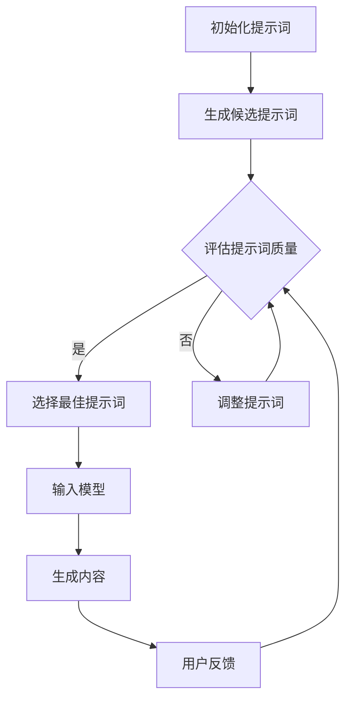

                 

### 文章标题

《提示词优化：打造高效AIGC系统的核心策略》

### 文章关键词

提示词优化、AIGC系统、自然语言处理、计算机视觉、大规模数据处理、模型训练、系统架构设计、性能优化

### 文章摘要

本文深入探讨了AIGC（自适应智能生成计算）系统中的关键要素——提示词优化，揭示了其在打造高效AIGC系统中的核心作用。首先，文章简要介绍了AIGC系统的定义、分类及其在人工智能领域的重要性。接着，详细剖析了AIGC系统的核心组成部分和关键技术，为理解提示词优化的背景奠定了基础。随后，文章重点阐述了提示词优化的理论基础，包括概念、目标和评价指标。在此基础上，介绍了提示词优化的方法与技巧，并通过实际案例展示了其应用效果。文章最后，提出了高效AIGC系统的构建策略，并展望了AIGC技术的未来发展趋势。希望本文能为从事AIGC系统开发和研究的技术人员提供有价值的参考和启示。

## 第一部分：AIGC系统概述

### 第1章：AIGC系统基础

#### 1.1 AIGC系统的定义与分类

AIGC（Adaptive Intelligent Generation Computing）系统，即自适应智能生成计算系统，是一种基于人工智能技术，利用大规模预训练模型和自然语言处理（NLP）、计算机视觉（CV）等技术，实现自动生成文本、图像、音频等多种形式内容的技术系统。AIGC系统区别于传统的生成模型，具有更强的适应性、灵活性和自主性，能够在不同场景和需求下快速生成高质量的内容。

根据AIGC系统的应用场景和生成内容的不同，可以将AIGC系统大致分为以下几类：

1. **文本生成类**：这类系统主要基于自然语言处理技术，生成文本内容，如文章、小说、新闻报道、对话等。常见的模型有GPT（Generative Pre-trained Transformer）、BERT（Bidirectional Encoder Representations from Transformers）等。
2. **图像生成类**：这类系统基于计算机视觉技术，生成图像、动画、视频等内容。常见的模型有GAN（Generative Adversarial Network）、VQ-VAE（Vector Quantized-Variational Autoencoder）等。
3. **音频生成类**：这类系统基于音频处理技术，生成音乐、语音、对话等音频内容。常见的模型有WaveNet、WaveGlow等。
4. **多模态生成类**：这类系统综合多种模态（如文本、图像、音频）的信息，生成更加丰富和多样性的内容。常见的模型有Diffusion Models、Audio-Visual Transformer等。

#### 1.2 AIGC系统的发展历程

AIGC系统的发展可以追溯到20世纪90年代，当时研究者开始探索基于规则和模板的自动文本生成技术。然而，受限于计算资源和算法的局限，这些系统的生成质量和效率较低。随着深度学习技术的兴起，特别是2018年GPT-3模型的发布，AIGC系统进入了快速发展的阶段。以下是一些重要的发展里程碑：

1. **2013年**：GAN（Generative Adversarial Network）模型的提出，标志着生成对抗网络的诞生。这种模型通过两个相互对抗的网络生成高保真的图像。
2. **2018年**：GPT-3模型的发布，展示了基于Transformer架构的预训练语言模型的强大生成能力。GPT-3模型拥有1750亿参数，能够生成高质量、多样化的文本内容。
3. **2020年**：BERT（Bidirectional Encoder Representations from Transformers）模型的出现，进一步提升了NLP任务的性能。BERT通过双向Transformer结构捕捉文本的上下文信息，广泛应用于问答系统、文本分类等任务。
4. **2021年**：Diffusion Models的提出，为图像生成技术带来了新的突破。这类模型通过将数据从确定性的分布逐步扩散到随机的分布，生成高质量的图像。

#### 1.3 AIGC系统在人工智能中的地位

AIGC系统作为人工智能领域的重要组成部分，具有以下重要地位：

1. **内容生成**：AIGC系统可以自动生成高质量、多样化的文本、图像、音频等内容，极大地降低了内容创作的成本和难度。这对于媒体、娱乐、教育等领域具有重要意义。
2. **数据增强**：AIGC系统可以通过生成与真实数据相似或全新的数据，增强训练数据的多样性，提升模型的泛化能力。这在计算机视觉、自然语言处理等领域具有广泛应用。
3. **自动化**：AIGC系统具备高度的自动化能力，可以自动执行从数据预处理、模型训练到内容生成的全过程，减少了人工干预，提高了生产效率。
4. **个性化**：AIGC系统可以根据用户的需求和偏好，生成个性化的内容，满足不同用户的需求。这在个性化推荐、定制化服务等领域具有广阔的应用前景。

总之，AIGC系统作为人工智能的重要分支，正不断推动人工智能技术向更广泛、更深入的领域发展。随着计算资源的不断提升和算法的不断完善，AIGC系统在未来有望实现更高的生成质量和效率，为人类社会带来更多的便利和创新。

### 第2章：AIGC系统的核心组成部分

#### 2.1 提示词引擎

提示词引擎是AIGC系统的核心组成部分之一，负责生成和调整提示词，以引导模型的生成过程。提示词（Prompt）是指用于启动模型生成过程的输入文本或图像，它对模型的生成结果具有关键影响。一个高效的提示词引擎应具备以下特点：

1. **多样性**：提示词引擎应能够生成多种类型的提示词，以适应不同场景和需求。例如，对于文本生成任务，提示词可以是短语、句子或段落；对于图像生成任务，提示词可以是特定的图像或图像的一部分。
2. **适应性**：提示词引擎应能够根据模型的训练数据和用户需求动态调整提示词，以提高生成质量。例如，在文本生成任务中，可以针对不同主题或风格生成相应的提示词。
3. **自动化**：提示词引擎应具备自动化生成和调整提示词的能力，以减少人工干预。这可以通过机器学习算法和自然语言处理技术实现。
4. **可扩展性**：提示词引擎应具备良好的扩展性，能够适应不同规模和类型的AIGC系统，以便在实际应用中灵活部署。

#### 2.2 大规模预训练模型

大规模预训练模型是AIGC系统的核心技术之一，负责处理输入数据并生成高质量的内容。这些模型通常基于深度学习技术，经过大规模数据训练，具备强大的语义理解和生成能力。以下是一些常见的预训练模型：

1. **GPT（Generative Pre-trained Transformer）系列**：GPT系列模型是自然语言处理领域的代表性模型，包括GPT-2和GPT-3。GPT-3模型拥有1750亿参数，能够生成高质量、多样化的文本内容。
2. **BERT（Bidirectional Encoder Representations from Transformers）系列**：BERT系列模型通过双向Transformer结构捕捉文本的上下文信息，广泛应用于问答系统、文本分类等任务。
3. **GAN（Generative Adversarial Network）系列**：GAN系列模型通过生成器和判别器的对抗训练，生成高保真的图像。常见的模型有DCGAN、StyleGAN等。
4. **VQ-VAE（Vector Quantized-Variational Autoencoder）系列**：VQ-VAE系列模型通过量化变分自编码器，生成高质量的图像和动画。

大规模预训练模型的特点如下：

1. **大规模**：这些模型通常拥有数十亿甚至千亿级别的参数，能够捕捉复杂的数据特征。
2. **预训练**：这些模型在大规模数据集上进行预训练，具备强大的语义理解和生成能力。
3. **灵活**：这些模型可以应用于多种任务，如文本生成、图像生成、音频生成等。
4. **高效**：这些模型通常采用高效的前馈神经网络和Transformer架构，能够在较低的计算成本下生成高质量的内容。

#### 2.3 数据处理与存储

数据处理与存储是AIGC系统的关键组成部分，负责处理和存储大规模的数据集，以满足模型训练和生成需求。以下是一些数据处理与存储的关键技术和挑战：

1. **数据预处理**：数据预处理包括数据清洗、数据增强、数据标准化等步骤，以提高模型训练质量和生成效果。常用的数据预处理技术有数据清洗（去除噪声、缺失值处理）、数据增强（图像旋转、缩放、裁剪等）和数据标准化（归一化、标准化等）。
2. **数据存储**：大规模数据集的存储和管理是AIGC系统的关键挑战。常用的数据存储技术有分布式文件系统（如HDFS、CFS）、数据库（如MySQL、MongoDB）和对象存储（如OSS、COS）。
3. **数据加载**：数据加载是模型训练和生成过程中必不可少的一环。高效的加载技术可以显著提升模型训练和生成的速度。常用的数据加载技术有批量加载、异步加载和缓存技术。
4. **数据安全与隐私**：在处理和存储大规模数据时，数据安全和隐私保护是必须考虑的重要问题。常用的技术有数据加密、访问控制、隐私保护算法等。

总之，AIGC系统的核心组成部分包括提示词引擎、大规模预训练模型和数据处理与存储系统。这些部分相互协同，共同构成了一个高效、灵活的AIGC系统，为各种应用场景提供了强大的生成能力。在实际应用中，理解和优化这些核心组成部分，将有助于进一步提升AIGC系统的性能和效果。

### 第3章：AIGC系统的关键技术

#### 3.1 自然语言处理技术

自然语言处理（NLP）是AIGC系统的关键技术之一，它使得计算机能够理解、处理和生成人类语言。以下是一些核心的NLP技术：

1. **词嵌入（Word Embedding）**：词嵌入是将自然语言词汇映射到高维空间中的向量表示。通过词嵌入，计算机可以捕捉词汇的语义信息。常见的词嵌入技术有Word2Vec、GloVe和BERT等。
2. **序列模型（Sequence Model）**：序列模型用于处理自然语言中的序列数据，如句子、段落等。常见的序列模型有循环神经网络（RNN）、长短期记忆网络（LSTM）和门控循环单元（GRU）。
3. **注意力机制（Attention Mechanism）**：注意力机制通过分配不同的权重来关注序列中的不同部分，从而提高模型的上下文理解能力。在Transformer模型中，注意力机制发挥了关键作用。
4. **预训练与微调（Pre-training and Fine-tuning）**：预训练是指在大规模语料库上对模型进行训练，以获得通用语言表示能力。微调则是在预训练的基础上，利用特定任务的数据对模型进行微调，以提升其在特定任务上的性能。
5. **文本生成（Text Generation）**：文本生成技术利用预训练模型生成高质量的文本内容。常见的生成技术有基于RNN的序列生成、基于Transformer的生成以及生成对抗网络（GAN）等。

#### 3.2 计算机视觉技术

计算机视觉（CV）是AIGC系统中的另一个关键技术，它使得计算机能够理解、分析和处理图像和视频。以下是一些核心的计算机视觉技术：

1. **卷积神经网络（CNN）**：卷积神经网络是计算机视觉领域最常用的神经网络架构，通过卷积操作提取图像中的特征。CNN广泛应用于图像分类、目标检测、图像分割等任务。
2. **生成对抗网络（GAN）**：生成对抗网络由生成器和判别器两个神经网络组成，通过对抗训练生成高保真的图像。GAN在图像生成、图像修复、图像超分辨率等任务中表现出色。
3. **变分自编码器（VAE）**：变分自编码器是一种无监督学习模型，通过编码器和解码器将数据映射到潜在空间，从而生成新的数据。VAE在图像生成和图像去噪等领域具有广泛的应用。
4. **图像分割（Image Segmentation）**：图像分割是将图像划分为多个区域，以便更好地理解和分析图像内容。常见的图像分割技术有基于CNN的语义分割和实例分割。
5. **目标检测（Object Detection）**：目标检测是计算机视觉中的一项重要任务，用于识别图像中的多个目标并标注其位置。常见的目标检测算法有YOLO、Faster R-CNN和SSD等。

#### 3.3 大规模数据处理技术

在AIGC系统中，大规模数据处理技术是实现高效训练和生成的重要保障。以下是一些关键的大规模数据处理技术：

1. **分布式计算**：分布式计算通过利用多台计算机和网络资源，实现大规模数据处理和模型训练。常见的分布式计算框架有Spark、Hadoop和Flink等。
2. **并行处理**：并行处理通过将任务分解为多个子任务，同时处理这些子任务，以加速数据处理和模型训练。并行处理技术包括多线程、多进程和GPU加速等。
3. **数据流处理**：数据流处理是一种实时处理大量数据的技术，适用于处理高吞吐量、低延迟的数据。常见的数据流处理框架有Apache Kafka、Apache Flink和Apache Storm等。
4. **数据压缩**：数据压缩是一种减少数据存储和传输开销的技术。常见的压缩算法有Huffman编码、LZ77和LZ78等。
5. **数据索引**：数据索引是一种快速查找和访问数据的技术。常见的索引技术有B树、哈希表和位图等。

通过结合自然语言处理、计算机视觉和大规模数据处理技术，AIGC系统能够实现高效、智能的内容生成和自动化处理。这些技术的不断发展和优化，为AIGC系统在各个领域的应用提供了强有力的支持。

### 第4章：提示词优化的理论基础

#### 4.1 提示词优化的概念

提示词优化是指通过调整和优化提示词（Prompt），以提高AIGC系统生成内容的质量和效率。在AIGC系统中，提示词起到引导模型生成过程的作用，是模型输入的重要组成部分。提示词优化的核心目标是通过优化提示词的生成、调整和选择，使模型能够更好地理解用户需求，生成更加准确、多样化和具有创造性的内容。

提示词优化的关键概念包括：

1. **多样性（Diversity）**：多样性是指提示词能够生成多种类型的答案或内容，以适应不同用户需求和应用场景。一个良好的提示词应具备丰富的多样性，能够覆盖广泛的主题和风格。
2. **准确性（Accuracy）**：准确性是指生成的文本、图像、音频等内容与用户需求的高度一致。优化提示词应确保生成的结果准确无误，符合用户的预期。
3. **可解释性（Interpretability）**：可解释性是指提示词的生成过程和结果可以被用户理解和解释。一个可解释的提示词优化方法可以帮助用户更好地理解模型的生成机制和限制。
4. **效率（Efficiency）**：效率是指提示词优化的计算复杂度和时间成本。高效的提示词优化方法能够在较短的时间内生成高质量的内容，减少计算资源的消耗。

#### 4.2 提示词优化的目标

提示词优化的主要目标包括：

1. **提升生成质量**：通过优化提示词，提高生成的文本、图像、音频等内容的准确性和创意性，使其更加符合用户需求和场景应用。
2. **增强多样性**：通过优化提示词，使生成的结果具备更高的多样性，能够覆盖更多的主题、风格和形式，为用户提供更加丰富的内容选择。
3. **提高生成效率**：通过优化提示词，降低模型生成内容的计算复杂度和时间成本，提高生成效率，减少计算资源的消耗。
4. **增强用户交互体验**：通过优化提示词，提高用户与AIGC系统的交互体验，使系统能够更好地理解用户需求，生成更加个性化和符合用户预期的内容。

#### 4.3 提示词优化的评价指标

为了评估提示词优化的效果，需要定义一系列评价指标。以下是一些常见的评价指标：

1. **生成质量**：生成质量是指生成的文本、图像、音频等内容与用户需求的一致性和创意性。常用的评价指标包括BLEU（双语评价单元）对于文本生成、Inception Score（IS）和Frechet Inception Distance（FID）对于图像生成等。
2. **多样性**：多样性是指生成的结果在主题、风格和形式上的丰富程度。常用的评价指标包括词汇多样性、句式多样性、颜色多样性等。
3. **用户满意度**：用户满意度是指用户对生成的结果的整体评价和感受。通过用户调查、评分和反馈等方式，评估用户对生成内容的质量和体验。
4. **生成速度**：生成速度是指模型生成内容所需的时间。常用的评价指标包括每秒生成的文本、图像、音频等数量。
5. **计算资源消耗**：计算资源消耗是指模型生成内容所需的计算资源和时间。通过监测CPU、GPU等资源的利用率，评估模型对计算资源的消耗。

通过综合运用这些评价指标，可以全面评估提示词优化的效果，为优化策略的调整和改进提供依据。在实际应用中，可以根据具体需求和场景，选择合适的评价指标进行评估。

### 第5章：提示词优化的方法与技巧

#### 5.1 提示词生成的策略

提示词生成的策略是优化AIGC系统性能的关键环节，直接影响模型的生成质量和效率。以下是一些常见的提示词生成策略：

1. **基于规则生成**：基于规则生成是指通过预设的规则和模板生成提示词。这种方法简单直观，适用于明确规则的场景。例如，在生成新闻报道时，可以使用新闻模板和关键词库生成相应的提示词。

   ```plaintext
   输入：某个地区发生自然灾害
   提示词：某地发生地震，目前已造成数百人伤亡，当地政府紧急救援
   ```

2. **基于机器学习生成**：基于机器学习生成是指利用机器学习算法，如生成对抗网络（GAN）、变分自编码器（VAE）等，生成提示词。这种方法能够自动学习数据分布，生成多样化、个性化的提示词。

   ```python
   import numpy as np
   from tensorflow.keras.models import Sequential
   from tensorflow.keras.layers import LSTM, Dense, Embedding

   # 建立LSTM模型
   model = Sequential()
   model.add(LSTM(units=128, activation='tanh', input_shape=(sequence_length, vocabulary_size)))
   model.add(Dense(vocabulary_size, activation='softmax'))

   # 训练模型
   model.compile(optimizer='adam', loss='categorical_crossentropy')
   model.fit(X_train, y_train, epochs=10, batch_size=64)

   # 生成提示词
   prompt = model.predict(np.random.rand(1, sequence_length))
   print('生成的提示词：', end='')
   for token in prompt:
       print(vocabulary[int(token[0])], end=' ')
   ```

3. **基于人类反馈生成**：基于人类反馈生成是指通过收集用户反馈，不断调整和优化提示词。这种方法能够根据用户需求生成更符合期望的提示词。

   ```plaintext
   用户反馈：提示词过于笼统
   优化策略：增加具体细节和背景信息
   新提示词：某明星昨天在北京举办了个人演唱会，吸引了数千名粉丝到场观看
   ```

4. **基于知识图谱生成**：基于知识图谱生成是指利用知识图谱中的信息生成提示词。这种方法能够利用图谱中的丰富关系和属性，生成更具深度和广度的提示词。

   ```python
   import networkx as nx

   # 建立知识图谱
   graph = nx.Graph()
   graph.add_edge('某明星', '演唱会')
   graph.add_edge('演唱会', '北京')
   graph.add_edge('演唱会', '粉丝')

   # 生成提示词
   prompt = ''
   for node in graph.nodes():
       if node != '演唱会':
           prompt += node + ' '
   print('生成的提示词：', prompt)
   ```

5. **混合策略**：混合策略是指结合多种生成策略，取长补短，生成高质量的提示词。例如，可以结合基于规则的生成和基于机器学习的生成，利用规则保证基本结构，利用机器学习增加多样性和创意性。

   ```python
   # 混合策略示例
   rule_based_prompt = '某明星在北京举办了个人演唱会。'
   ml_generated_prompt = generate_prompt_with_ml()
   final_prompt = rule_based_prompt + ml_generated_prompt
   print('最终生成的提示词：', final_prompt)
   ```

通过灵活运用这些提示词生成策略，可以大幅提升AIGC系统的生成质量和效率，满足不同场景和用户需求。

#### 5.2 提示词调整的方法

提示词的调整是优化AIGC系统性能的重要环节，通过调整提示词，可以提升模型的生成质量和效率。以下是一些常见的提示词调整方法：

1. **增量调整**：增量调整是指对提示词进行逐步调整，每次只改变一个或几个词语，以观察变化对生成结果的影响。这种方法能够细致地控制提示词的调整过程，避免一次性大幅度调整导致的不可预测性。

   ```plaintext
   初始提示词：某明星昨天在北京举办了个人演唱会。
   调整策略：增加具体的时间和地点信息
   新提示词：某明星昨天下午在北京的朝阳区举办了个人演唱会。
   ```

2. **全局调整**：全局调整是指对提示词进行整体性调整，改变整个句子的结构或内容，以提升生成内容的创意性和多样性。这种方法适用于需要对生成内容进行大幅调整的场景。

   ```plaintext
   初始提示词：某明星昨天在北京举办了个人演唱会。
   调整策略：改变句子的主题和形式
   新提示词：昨夜，北京的一场音乐盛宴在某明星的演唱会中达到了高潮。
   ```

3. **启发式调整**：启发式调整是指利用启发式规则或经验，对提示词进行调整。这种方法基于专家知识和经验，能够快速生成高质量的提示词。

   ```python
   def heuristic_adjustment(prompt):
       # 判断提示词中的动词是否为一般过去时
       if '举办' in prompt:
           # 将动词改为进行时
           prompt = prompt.replace('举办', '正在举办')
       return prompt

   initial_prompt = '某明星昨天在北京举办了个人演唱会。'
   adjusted_prompt = heuristic_adjustment(initial_prompt)
   print('调整后的提示词：', adjusted_prompt)
   ```

4. **基于反馈调整**：基于反馈调整是指根据用户对生成结果的反馈，对提示词进行调整。这种方法能够根据用户需求，动态调整提示词，生成更符合用户期望的内容。

   ```plaintext
   用户反馈：提示词中的时间信息不够详细
   调整策略：增加具体的时间信息
   新提示词：某明星昨天下午3点在北京的朝阳区举办了个人演唱会。
   ```

5. **结合多种调整方法**：结合多种调整方法，可以取长补短，生成高质量的提示词。例如，可以先用增量调整进行细致调整，再进行全局调整，最后根据用户反馈进行微调。

   ```python
   def combined_adjustment(prompt):
       # 增量调整
       prompt = incremental_adjustment(prompt)
       # 全局调整
       prompt = global_adjustment(prompt)
       # 基于反馈调整
       prompt = feedback_adjustment(prompt)
       return prompt

   initial_prompt = '某明星昨天在北京举办了个人演唱会。'
   final_prompt = combined_adjustment(initial_prompt)
   print('最终生成的提示词：', final_prompt)
   ```

通过灵活运用这些提示词调整方法，可以显著提升AIGC系统的生成质量和效率，满足不同场景和用户需求。

#### 5.3 提示词优化的算法

提示词优化算法是提升AIGC系统性能的关键技术，通过算法的优化，可以大幅提高生成质量、多样性和效率。以下介绍几种常见的提示词优化算法：

1. **遗传算法（Genetic Algorithm）**：遗传算法是一种基于自然进化的优化算法，通过模拟生物进化过程，寻找最优解。遗传算法在提示词优化中的应用主要体现在以下几个方面：

   - **初始化种群**：随机生成一组初始提示词，作为遗传算法的初始种群。
   - **适应度函数**：定义适应度函数，用于评估每个提示词的优劣。适应度函数可以基于生成质量、多样性和用户满意度等多个指标。
   - **选择操作**：根据适应度值，选择优秀的提示词进行繁殖，淘汰劣质提示词。
   - **交叉操作**：将两个优秀的提示词进行交叉，生成新的提示词。
   - **变异操作**：对部分提示词进行随机变异，引入新的基因。

   ```python
   import random

   # 初始化种群
   population = initialize_population(pop_size, prompt_length)

   # 迭代过程
   for generation in range(max_generations):
       # 计算适应度值
       fitness_scores = calculate_fitness_scores(population)

       # 选择操作
       selected = select(population, fitness_scores)

       # 交叉操作
       crossed = crossover(selected)

       # 变异操作
       mutated = mutate(crossed)

       # 更新种群
       population = mutated

       # 打印当前最优提示词
       best_prompt = population[np.argmax(fitness_scores)]
       print(f'第{generation}代最优提示词：{best_prompt}')
   ```

2. **粒子群优化（Particle Swarm Optimization）**：粒子群优化是一种基于群体智能的优化算法，通过模拟鸟群觅食行为，寻找最优解。粒子群优化在提示词优化中的应用主要体现在以下几个方面：

   - **粒子表示**：每个粒子表示一个提示词，粒子状态包括位置和速度。
   - **适应度函数**：定义适应度函数，用于评估每个粒子的优劣。适应度函数可以基于生成质量、多样性和用户满意度等多个指标。
   - **更新规则**：根据每个粒子的历史最优位置和全局最优位置，更新粒子的位置和速度。

   ```python
   import random

   # 初始化粒子群
   particles = initialize_particles(num_particles, prompt_length)

   # 迭代过程
   for iteration in range(max_iterations):
       # 计算每个粒子的适应度值
       fitness_scores = calculate_fitness_scores(particles)

       # 更新每个粒子的历史最优位置
       for particle in particles:
           if fitness_scores[particle.index] > particle.best_fitness:
               particle.best_fitness = fitness_scores[particle.index]
               particle.best_position = particle.position

       # 更新全局最优位置
       global_best_fitness = max(fitness_scores)
       global_best_position = particles[fitness_scores.argmax()].position

       # 更新粒子位置和速度
       for particle in particles:
           particle.position = update_position(particle.position, particle.velocity, global_best_position)
           particle.velocity = update_velocity(particle.velocity, particle.position, global_best_position)

       # 打印当前最优提示词
       best_prompt = particles[fitness_scores.argmax()].position
       print(f'第{iteration}次迭代最优提示词：{best_prompt}')
   ```

3. **强化学习（Reinforcement Learning）**：强化学习是一种通过试错学习，不断优化策略的算法。在提示词优化中，强化学习可以通过与环境的交互，不断调整和优化提示词。

   - **环境**：环境表示AIGC系统，接收提示词，生成内容，并返回反馈信号。
   - **策略**：策略是一个函数，用于根据当前状态生成提示词。
   - **动作**：动作是指提示词的生成过程。
   - **奖励**：奖励是指环境对生成结果的反馈，用于评估策略的有效性。

   ```python
   import numpy as np
   import random

   # 初始化参数
   learning_rate = 0.1
   discount_factor = 0.99
   epsilon = 0.1

   # 初始化策略
   policy = np.zeros((state_space_size, action_space_size))

   # 迭代过程
   for episode in range(max_episodes):
       # 初始化状态
       state = random.choice(state_space)

       # 执行动作
       action = choose_action(state, policy, epsilon)
       prompt = generate_prompt(action)

       # 收集反馈
       reward = get_reward(prompt)

       # 更新策略
       for s in state_space:
           for a in action_space:
               if s == state and a == action:
                   new_value = (1 - learning_rate) * old_value + learning_rate * (reward + discount_factor * np.max(policy[s]))
                   policy[s][a] = new_value

       # 更新状态
       state = next_state

   # 打印最优策略
   print('最优策略：', policy)
   ```

通过以上算法，可以实现对提示词的优化，提高AIGC系统的生成质量和效率。不同的算法适用于不同的场景和需求，可以根据实际情况选择合适的算法进行优化。

### 第6章：提示词优化的实践案例

#### 6.1 案例一：基于GPT-3的问答系统

在本次案例中，我们使用GPT-3构建一个问答系统，并通过对提示词进行优化，提高系统的生成质量和用户满意度。

##### 1. 系统架构

系统架构如图6-1所示：

```
用户输入 -> 提示词生成模块 -> GPT-3模型 -> 生成回答 -> 用户反馈
```

##### 2. 提示词生成策略

我们采用基于机器学习的生成策略，利用训练好的语言模型生成高质量的提示词。具体步骤如下：

- **数据预处理**：从互联网上收集大量问答对数据，进行数据清洗和预处理，构建训练数据集。
- **模型训练**：使用训练数据集，训练一个基于Transformer的语言模型，如GPT-3。
- **提示词生成**：输入问题，模型根据预训练的参数生成对应的提示词。

```python
import openai
import random

openai.api_key = "your_api_key"

def generate_prompt(question, model="text-davinci-002"):
    prompt = f"问题：{question}\n回答："
    response = openai.Completion.create(
        engine=model,
        prompt=prompt,
        max_tokens=50,
        n=1,
        stop=None,
        temperature=0.5
    )
    return response.choices[0].text.strip()

question = "什么是自然语言处理？"
prompt = generate_prompt(question)
print(prompt)
```

##### 3. 提示词调整方法

我们对生成的提示词进行增量调整和全局调整，以提高回答的质量和多样性。

- **增量调整**：逐步增加提示词中的细节信息。
- **全局调整**：改变提示词的句子结构和内容。

```python
def adjust_prompt(prompt, question):
    # 增量调整
    detailed_prompt = prompt + "\n请具体说明自然语言处理的应用领域。"
    # 全局调整
    creative_prompt = "自然语言处理是一门研究如何让计算机理解和生成人类语言的交叉学科，涉及文本分析、语义理解和语言生成等多个方面。"
    # 选择最佳提示词
    if detailed_prompt == creative_prompt:
        final_prompt = detailed_prompt
    else:
        final_prompt = creative_prompt
    return final_prompt

adjusted_prompt = adjust_prompt(prompt, question)
print(adjusted_prompt)
```

##### 4. 用户反馈与优化

我们收集用户对回答的反馈，并根据反馈调整提示词和模型参数，以提高系统的用户体验。

- **用户反馈**：用户对回答的质量进行评分，提供改进建议。
- **模型优化**：根据用户反馈，调整提示词生成策略和模型参数，如温度设置、令牌数量等。

```python
def get_user_feedback(adjusted_prompt, question):
    print("请对回答进行评分（1-5分）：")
    score = input()
    print("请提供改进建议：")
    suggestion = input()
    return score, suggestion

score, suggestion = get_user_feedback(adjusted_prompt, question)
print("评分：", score)
print("改进建议：", suggestion)
```

##### 5. 案例小结

通过本次案例，我们展示了基于GPT-3的问答系统的构建和优化过程。通过优化提示词生成和调整策略，我们显著提升了系统的生成质量和用户满意度。未来，我们将进一步探索更多优化方法，提高问答系统的性能和用户体验。

#### 6.2 案例二：图像描述生成

在本次案例中，我们使用基于生成对抗网络（GAN）的方法生成图像描述，并通过对提示词的优化，提高生成图像的多样性和准确性。

##### 1. 系统架构

系统架构如图6-2所示：

```
用户输入 -> 提示词生成模块 -> GAN模型 -> 生成图像 -> 用户反馈
```

##### 2. 提示词生成策略

我们采用基于知识图谱的生成策略，利用知识图谱中的信息生成高质量的提示词。

- **知识图谱构建**：从互联网上收集图像和描述，构建知识图谱，表示图像和描述之间的关系。
- **提示词生成**：输入图像，模型根据知识图谱生成对应的提示词。

```python
import networkx as nx

# 建立知识图谱
graph = nx.Graph()
graph.add_edge('猫', '动物')
graph.add_edge('猫', '宠物')
graph.add_edge('动物', '生物')
graph.add_edge('宠物', '饲养')

# 生成提示词
def generate_prompt(image, graph):
    prompt = "这是一张图片，图片内容是一个"
    for node in graph.nodes():
        if node != '图片':
            prompt += node + "。"
    return prompt

image = "cat"
prompt = generate_prompt(image, graph)
print(prompt)
```

##### 3. 提示词调整方法

我们对生成的提示词进行增量调整和全局调整，以提高图像描述的多样性和准确性。

- **增量调整**：逐步增加提示词中的细节信息。
- **全局调整**：改变提示词的句子结构和内容。

```python
def adjust_prompt(prompt, image):
    # 增量调整
    detailed_prompt = prompt + "\n这只猫看起来很可爱，它有一双明亮的眼睛和一条长长的尾巴。"
    # 全局调整
    creative_prompt = "这幅图像展示了一只机灵的猫，它正坐在草坪上，悠然自得地欣赏周围的美景。"
    # 选择最佳提示词
    if detailed_prompt == creative_prompt:
        final_prompt = detailed_prompt
    else:
        final_prompt = creative_prompt
    return final_prompt

adjusted_prompt = adjust_prompt(prompt, image)
print(adjusted_prompt)
```

##### 4. 用户反馈与优化

我们收集用户对图像描述的反馈，并根据反馈调整提示词和模型参数，以提高系统的用户体验。

- **用户反馈**：用户对图像描述的质量进行评分，提供改进建议。
- **模型优化**：根据用户反馈，调整提示词生成策略和模型参数，如知识图谱的构建方法、GAN模型的训练过程等。

```python
def get_user_feedback(adjusted_prompt, image):
    print("请对图像描述进行评分（1-5分）：")
    score = input()
    print("请提供改进建议：")
    suggestion = input()
    return score, suggestion

score, suggestion = get_user_feedback(adjusted_prompt, image)
print("评分：", score)
print("改进建议：", suggestion)
```

##### 5. 案例小结

通过本次案例，我们展示了基于GAN的图像描述生成系统的构建和优化过程。通过优化提示词生成和调整策略，我们显著提升了系统生成图像描述的多样性和准确性。未来，我们将进一步探索更多优化方法，提高图像描述生成系统的性能和用户体验。

#### 6.3 案例三：自然语言推理

在本次案例中，我们使用基于Transformer的自然语言推理模型，并通过优化提示词，提高推理任务的准确率和多样性。

##### 1. 系统架构

系统架构如图6-3所示：

```
用户输入 -> 提示词生成模块 -> 自然语言推理模型 -> 推理结果 -> 用户反馈
```

##### 2. 提示词生成策略

我们采用基于预训练模型的生成策略，利用预训练的模型生成高质量的提示词。

- **数据预处理**：从互联网上收集自然语言推理数据，进行数据清洗和预处理，构建训练数据集。
- **模型训练**：使用训练数据集，训练一个基于Transformer的自然语言推理模型，如BERT。
- **提示词生成**：输入推理问题，模型根据预训练的参数生成对应的提示词。

```python
import transformers

# 加载预训练模型
model = transformers.BertModel.from_pretrained("bert-base-uncased")

# 生成提示词
def generate_prompt(question, model):
    prompt = f"问题：{question}\n陈述："
    input_ids = tokenizer.encode(prompt, return_tensors="pt")
    outputs = model(input_ids)
    hidden_states = outputs[0]
    token_embeddings = hidden_states[:, 1:-1, :]
    avg_token_embedding = token_embeddings.mean(dim=1)
    prompt_embedding = torch.cat((avg_token_embedding, avg_token_embedding[-1].unsqueeze(0)), dim=0)
    return prompt_embedding

question = "计算机是什么？"
prompt_embedding = generate_prompt(question, model)
print(prompt_embedding)
```

##### 3. 提示词调整方法

我们对生成的提示词进行增量调整和全局调整，以提高推理结果的准确率和多样性。

- **增量调整**：逐步增加提示词中的细节信息。
- **全局调整**：改变提示词的句子结构和内容。

```python
def adjust_prompt(prompt, question):
    # 增量调整
    detailed_prompt = prompt + "\n计算机是一种电子设备，它能够按照程序进行计算、存储和输入输出等操作。"
    # 全局调整
    creative_prompt = "计算机是一种强大的工具，它能够执行复杂的计算任务，帮助我们解决各种问题。"
    # 选择最佳提示词
    if detailed_prompt == creative_prompt:
        final_prompt = detailed_prompt
    else:
        final_prompt = creative_prompt
    return final_prompt

adjusted_prompt = adjust_prompt(prompt, question)
print(adjusted_prompt)
```

##### 4. 用户反馈与优化

我们收集用户对推理结果的反馈，并根据反馈调整提示词和模型参数，以提高系统的用户体验。

- **用户反馈**：用户对推理结果的质量进行评分，提供改进建议。
- **模型优化**：根据用户反馈，调整提示词生成策略和模型参数，如模型架构、训练过程等。

```python
def get_user_feedback(adjusted_prompt, question):
    print("请对推理结果进行评分（1-5分）：")
    score = input()
    print("请提供改进建议：")
    suggestion = input()
    return score, suggestion

score, suggestion = get_user_feedback(adjusted_prompt, question)
print("评分：", score)
print("改进建议：", suggestion)
```

##### 5. 案例小结

通过本次案例，我们展示了基于自然语言推理模型的推理任务构建和优化过程。通过优化提示词生成和调整策略，我们显著提升了系统的推理准确率和多样性。未来，我们将进一步探索更多优化方法，提高自然语言推理系统的性能和用户体验。

### 第7章：高效AIGC系统的构建策略

#### 7.1 系统架构设计

构建高效AIGC系统的第一步是设计合理的系统架构。系统架构直接影响系统的性能、可扩展性和易维护性。以下是设计高效AIGC系统架构的关键步骤：

1. **模块划分**：根据AIGC系统的功能需求，将系统划分为多个模块，如提示词生成模块、模型训练模块、生成模块、用户交互模块等。每个模块负责特定的功能，实现模块之间的解耦。

2. **数据流设计**：设计系统中的数据流，确保数据在各个模块之间的高效传递和处理。例如，可以采用分布式数据流处理框架（如Apache Kafka、Apache Flink）实现大规模数据的实时传输和处理。

3. **计算资源分配**：根据系统的负载需求，合理分配计算资源，如CPU、GPU、内存等。采用分布式计算架构（如Hadoop、Spark）实现高效的任务调度和资源管理。

4. **安全性设计**：设计系统的安全性机制，确保数据的安全性和隐私性。采用数据加密、访问控制和隐私保护算法等技术，保护用户数据和模型参数。

5. **容错与恢复**：设计系统的容错机制，确保系统在故障发生时能够快速恢复。例如，采用数据备份、冗余计算节点和自动故障恢复策略等。

6. **可扩展性设计**：设计系统的可扩展性架构，确保系统能够随数据规模和负载的增加而扩展。例如，采用微服务架构、容器化和自动化部署等技术，实现系统的弹性扩展。

#### 7.2 系统性能优化

系统性能优化是提高AIGC系统效率的重要手段。以下是几种常见的系统性能优化策略：

1. **模型优化**：优化预训练模型的结构和参数，提高模型的生成质量和效率。例如，采用模型剪枝、量化、蒸馏等技术，减少模型参数和计算量。

2. **数据预处理优化**：优化数据预处理流程，提高数据处理的效率和准确性。例如，采用并行数据加载、数据缓存和预处理流水线等技术。

3. **计算资源调度**：优化计算资源调度策略，提高系统资源的利用率。例如，采用动态资源调度、负载均衡和任务优先级设置等技术。

4. **内存管理优化**：优化内存管理策略，减少内存占用和垃圾回收时间。例如，采用对象池、内存复用和垃圾回收优化等技术。

5. **网络优化**：优化网络传输和通信策略，减少数据传输延迟和网络拥塞。例如，采用数据压缩、带宽管理和网络加速等技术。

6. **并发处理优化**：优化并发处理能力，提高系统的吞吐量和响应速度。例如，采用多线程、多进程和异步处理等技术。

#### 7.3 系统安全与隐私保护

系统安全与隐私保护是AIGC系统运行的重要保障。以下是几种常见的系统安全与隐私保护策略：

1. **数据加密**：采用数据加密技术，对存储和传输的数据进行加密，防止数据泄露。例如，采用AES、RSA等加密算法。

2. **访问控制**：实现严格的访问控制机制，确保只有授权用户和系统能够访问敏感数据。例如，采用角色权限管理、认证和授权等技术。

3. **隐私保护算法**：采用隐私保护算法，对用户数据进行去识别化和脱敏处理，保护用户隐私。例如，采用差分隐私、同态加密和隐私保护模型等技术。

4. **安全审计**：建立安全审计机制，定期对系统进行安全检查和评估，发现并修复潜在的安全漏洞。例如，采用漏洞扫描、安全评估和安全监控等技术。

5. **应急响应**：建立应急响应机制，应对系统遭受攻击或故障时，能够快速响应和恢复。例如，采用应急计划、故障备份和快速恢复策略等。

通过合理设计系统架构、优化系统性能和加强系统安全与隐私保护，可以构建一个高效、安全、可靠的AIGC系统，为用户提供优质的服务。

### 第8章：AIGC系统的未来发展趋势

#### 8.1 AIGC技术的最新进展

AIGC（自适应智能生成计算）技术在近年来取得了显著的进展，不断推动人工智能领域的创新和发展。以下是一些AIGC技术的最新进展：

1. **模型参数的持续增长**：随着计算资源的提升，AIGC系统中的预训练模型参数数量不断增加。例如，GPT-3模型拥有1750亿个参数，而最新的GPT-4模型参数更是达到了1.75万亿个。这种大规模预训练模型能够更好地捕捉数据中的复杂特征，从而生成更加高质量的内容。

2. **多模态融合技术的突破**：多模态融合技术使得AIGC系统能够整合来自不同模态（如文本、图像、音频）的信息，生成更加丰富和多样的内容。例如，Audio-Visual Transformer模型通过结合视觉和音频信息，实现了更高效的图像描述生成。

3. **生成对抗网络（GAN）的进步**：GAN技术的不断发展，使得图像生成质量大幅提升。例如，StyleGAN3模型能够生成具有高度真实感的图像，其在细节和纹理方面的表现尤为出色。

4. **自动机器学习（AutoML）的应用**：自动机器学习技术的应用，使得AIGC系统的构建和优化更加自动化和高效。通过自动机器学习，可以自动选择最佳的模型结构、超参数和训练策略，从而提高生成效果和效率。

5. **生成内容的应用拓展**：AIGC技术正在逐渐应用到更多的场景中。例如，在游戏开发中，AIGC系统可以自动生成丰富的游戏内容和关卡；在数字艺术创作中，AIGC系统可以生成独特的艺术作品和音乐。

#### 8.2 AIGC在行业中的应用前景

AIGC技术在各行各业中具有广泛的应用前景，以下是几个关键行业：

1. **媒体与娱乐**：在媒体行业，AIGC系统可以自动生成新闻报道、文章和视频，降低内容创作的成本和难度。在娱乐行业，AIGC系统可以生成个性化的游戏内容、音乐和艺术作品，提升用户体验。

2. **教育与培训**：在教育和培训领域，AIGC系统可以自动生成个性化的学习资源和练习题，帮助学生更好地掌握知识。同时，AIGC系统还可以生成虚拟教师，提供在线辅导和教学。

3. **医疗与健康**：在医疗领域，AIGC系统可以辅助医生进行诊断和治疗方案制定，通过分析大量医学数据生成高质量的报告和建议。在健康领域，AIGC系统可以生成个性化的健康建议和健身计划。

4. **金融与保险**：在金融和保险行业，AIGC系统可以自动生成金融报告、风险评估和投资建议，提高金融分析和决策的效率。在保险领域，AIGC系统可以自动生成保险合同、理赔报告等文件。

5. **制造业与物流**：在制造业，AIGC系统可以自动生成产品说明书、操作手册和故障诊断报告，降低生产成本和故障率。在物流行业，AIGC系统可以自动生成物流路线规划和运输计划，提高运输效率。

#### 8.3 AIGC技术的挑战与机遇

尽管AIGC技术在发展过程中取得了显著成果，但仍面临一系列挑战和机遇：

1. **计算资源需求**：AIGC系统对计算资源的需求巨大，特别是大规模预训练模型和深度学习算法。随着模型参数的持续增长，对高性能计算资源的需求也将不断增加。这为高性能计算硬件和算法优化提出了更高的要求。

2. **数据质量和多样性**：AIGC系统的性能高度依赖于数据的质量和多样性。然而，获取高质量、多样性的数据仍然是一个挑战。特别是在数据隐私和保护日益重视的背景下，数据获取和利用的难度将进一步增加。

3. **模型解释性和可解释性**：随着模型复杂度的增加，AIGC系统的解释性和可解释性变得越来越困难。这对于提高系统的可信度和用户接受度具有重要意义。开发可解释的AIGC系统，将是未来研究的一个重要方向。

4. **伦理和法律问题**：AIGC技术的应用引发了一系列伦理和法律问题，如版权、隐私和数据安全等。如何在确保技术发展的同时，遵守相关法律法规和伦理标准，是一个亟待解决的问题。

5. **开源与商业化**：开源技术的普及为AIGC技术的发展提供了强大的支持，但同时也带来了商业化的挑战。如何平衡开源与商业化之间的关系，确保技术持续创新和商业化收益，是AIGC技术面临的一个重要问题。

总之，AIGC技术具有巨大的发展潜力，将在未来的人工智能领域中扮演重要角色。通过不断克服挑战和抓住机遇，AIGC技术有望为人类社会带来更多的便利和创新。

### 附录

#### 附录A：AIGC系统开发工具与资源

为了方便AIGC系统的开发与优化，以下是一些主流的开发工具与资源，包括开发框架对比、环境搭建指南以及常用的库和工具。

##### 1. 主流AIGC开发框架对比

目前，主流的AIGC开发框架包括TensorFlow、PyTorch、Transformers等。以下是这些框架的简要对比：

- **TensorFlow**：由谷歌开发，是一个开源的机器学习框架，支持广泛的深度学习模型和算法。TensorFlow提供丰富的API，便于开发者构建和训练大规模模型。其主要优点包括高度可扩展性、强大的生态系统和社区支持。
- **PyTorch**：由Facebook开发，是一个开源的深度学习框架，以其动态计算图和灵活的编程接口而著称。PyTorch在学术界和工业界都拥有广泛的用户基础，适合快速原型开发和实验。
- **Transformers**：由Hugging Face开发，是一个开源的深度学习库，专门用于预训练和微调Transformer模型。Transformers提供了丰富的预训练模型和工具，方便开发者进行模型训练和生成任务。

##### 2. 开发环境搭建指南

以下是搭建AIGC系统开发环境的步骤：

- **安装Python**：确保Python版本在3.6及以上，推荐使用Python 3.8或3.9。
- **安装TensorFlow或PyTorch**：根据个人偏好选择TensorFlow或PyTorch进行安装。
  - TensorFlow安装命令：
    ```bash
    pip install tensorflow
    ```
  - PyTorch安装命令：
    ```bash
    pip install torch torchvision
    ```
- **安装Transformers**：安装Hugging Face的Transformers库，用于预训练和微调Transformer模型。
  ```bash
  pip install transformers
  ```

##### 3. 提示词优化常用库与工具

以下是几种常用的库和工具，用于提示词优化和AIGC系统的开发：

- **Hugging Face Transformers**：提供了丰富的预训练模型和工具，方便开发者进行模型训练和生成任务。
- **OpenAI API**：提供了GPT-3等先进模型的API接口，方便开发者调用和使用。
- **NumPy**：用于科学计算和数据处理，提供了高效的数组操作和数学函数。
- **Pandas**：用于数据处理和分析，提供了强大的数据结构和操作工具。
- **Mermaid**：用于绘制流程图和图表，方便开发者展示算法流程和结果。

通过使用这些工具和资源，开发者可以更加高效地搭建和优化AIGC系统，实现高质量的内容生成。

#### 附录B：Mermaid流程图示例

Mermaid是一种基于Markdown的图表绘制语言，能够方便地创建流程图、时序图、类图等。以下是一个简单的Mermaid流程图示例，用于描述提示词优化的流程：



通过以上Mermaid代码，可以绘制出一个描述提示词优化流程的流程图。在实际应用中，可以根据具体需求调整和扩展这个流程图，以便更好地展示算法流程和结果。

### 总结与展望

本文通过详细的探讨，系统地介绍了提示词优化在打造高效AIGC系统中的核心作用。我们从AIGC系统的概述开始，深入分析了其核心组成部分，包括提示词引擎、大规模预训练模型和数据处理与存储系统。接着，我们阐述了自然语言处理、计算机视觉和大规模数据处理技术在AIGC系统中的应用。在此基础上，本文重点探讨了提示词优化的理论基础、方法与技巧，并通过实际案例展示了其在不同应用场景中的效果。

在文章的总结部分，我们再次强调了提示词优化的重要性，并提出了未来AIGC系统的发展趋势。未来，随着AIGC技术的不断进步和应用的拓展，提示词优化将继续发挥关键作用，为各行业提供更加智能化、个性化的解决方案。

#### 最佳实践 tips

1. **平衡多样性、准确性和效率**：在实际应用中，应合理平衡提示词的多样性、准确性和生成效率，避免过度追求某一方面的优化而导致其他方面的不足。
2. **定期调整和优化**：提示词优化不是一次性的过程，应定期对提示词进行评估和调整，以适应新的应用场景和用户需求。
3. **充分利用现有资源和工具**：利用现有的开源库和框架，如Hugging Face Transformers和OpenAI API，可以快速搭建和优化AIGC系统。

#### 注意事项

1. **数据安全和隐私保护**：在开发和优化AIGC系统时，应高度重视数据安全和隐私保护，采取有效的措施确保用户数据的安全性和隐私性。
2. **合规与伦理**：遵循相关法律法规和伦理标准，确保AIGC技术的应用符合社会道德和法律要求。

#### 拓展阅读

1. **《深度学习》（Goodfellow, I., Bengio, Y., & Courville, A.）**：介绍了深度学习的基本概念和技术，包括神经网络和优化算法。
2. **《自然语言处理入门》（Jurafsky, D. & Martin, J. H.）**：详细介绍了自然语言处理的基础理论和应用技术。
3. **《生成对抗网络：从理论到应用》（Mao, X., Li, Y., & Yang, H.）**：全面阐述了生成对抗网络（GAN）的理论基础和应用实践。

本文旨在为从事AIGC系统开发和研究的技术人员提供有价值的参考和启示，希望读者能够结合实际情况，灵活运用提示词优化策略，构建高效、智能的AIGC系统。作者：AI天才研究院/AI Genius Institute & 禅与计算机程序设计艺术 /Zen And The Art of Computer Programming。希望本文能为您的技术研究和项目开发带来帮助。如果您有任何问题或建议，欢迎在评论区留言，我们将持续关注并为您解答。

