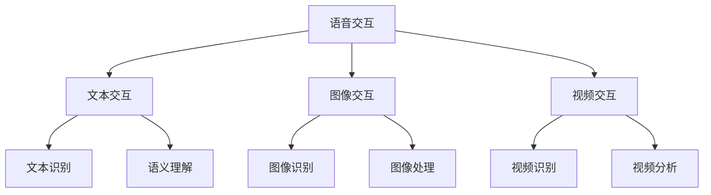
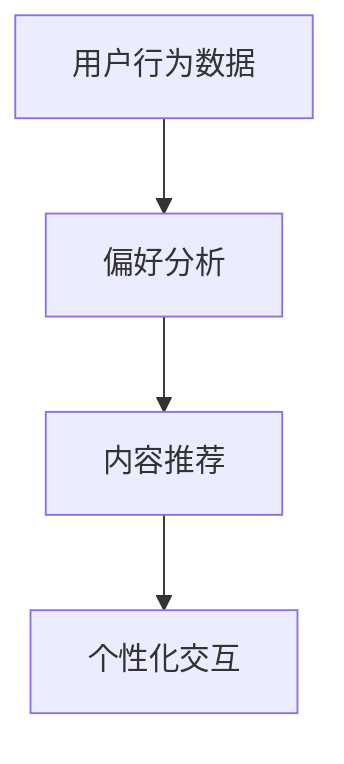
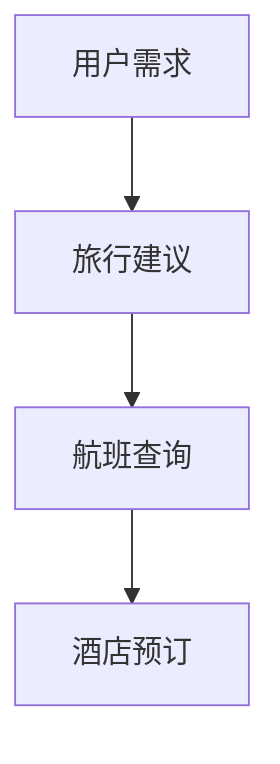
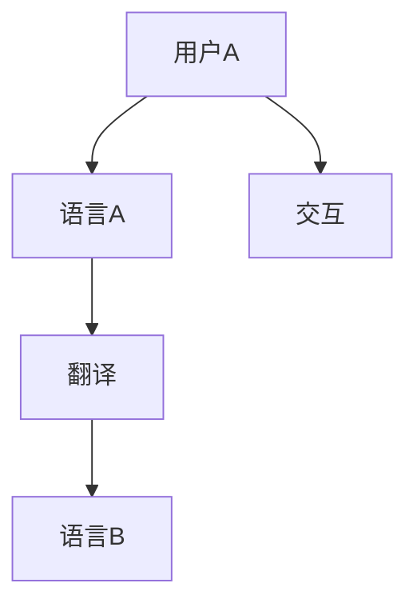

                 


# 提示词国际化：适应全球用户的AI交互

> 关键词：国际化，AI交互，多语言，用户体验，文化差异

> 摘要：随着全球化进程的加速，AI交互已成为连接不同国家和地区用户的重要手段。本文将探讨如何通过提示词国际化，适应全球用户的AI交互需求，提升用户体验和交互效果。

## 第一部分：国际化与AI交互基础

### 第1章：国际化与AI交互概述

#### 1.1 国际化的重要性

随着互联网的普及，各国用户越来越依赖在线服务。为了满足全球用户的需求，应用程序和服务需要支持多种语言和地区。国际化不仅仅是翻译界面文本，还包括理解不同文化、习俗和语言习惯，以提供无缝的用户体验。

#### 1.2 AI交互的优势

人工智能（AI）交互为用户提供了更加智能化和个性化的服务。通过自然语言处理（NLP）技术，AI系统能够理解用户的需求，并以自然的方式回应。这种交互方式不仅提高了用户满意度，还降低了沟通成本。

#### 1.3 国际化AI交互的挑战

国际化AI交互面临诸多挑战，包括多语言支持、文化差异、技术实现的复杂性等。如何设计一个既能支持多种语言，又能适应不同文化的AI交互系统，是当前的研究热点。

### 第2章：AI交互的基本概念

#### 2.1 人工智能与自然语言处理

人工智能（AI）是模拟人类智能行为的计算机系统。自然语言处理（NLP）是AI的一个分支，旨在使计算机能够理解、生成和处理人类语言。

#### 2.2 提示词在AI交互中的作用

提示词是用户与AI系统进行交互的桥梁。一个良好的提示词设计能够提高用户参与度和交互效果。

#### 2.3 常见的AI交互模型

常见的AI交互模型包括基于规则、基于机器学习、基于深度学习的模型。每种模型都有其优缺点，适用于不同的应用场景。

## 第二部分：国际化AI交互的设计原则

### 第3章：多语言支持与适应性设计

#### 3.1 多语言支持技术

多语言支持技术包括语言检测、文本翻译、多语言模型等。这些技术是实现国际化AI交互的基础。

#### 3.2 适应性设计原则

适应性设计原则包括文化适应性、用户行为适应性、系统性能适应性等。这些原则指导我们在设计国际化AI交互时如何应对不同文化和地区的要求。

#### 3.3 多语言AI交互的实际应用

多语言AI交互在实际应用中取得了显著成果，例如全球电商平台、社交媒体、智能助手等。这些应用展示了国际化AI交互的潜力和价值。

### 第4章：文化差异与用户体验

#### 4.1 文化差异对AI交互的影响

文化差异会影响用户的语言习惯、沟通方式、价值观念等，进而影响AI交互的效果。

#### 4.2 跨文化用户体验设计

跨文化用户体验设计旨在确保AI交互系统能够适应不同文化背景的用户需求，提供一致、无缝的交互体验。

#### 4.3 案例分析：不同文化背景下的AI交互

通过分析不同文化背景下的AI交互案例，我们可以了解如何设计一个具有国际竞争力的AI交互系统。

## 第三部分：AI交互国际化实战

### 第5章：国际化AI交互项目规划

#### 5.1 项目需求分析

在项目规划阶段，需要明确国际化AI交互的需求，包括支持的语言、功能模块、用户体验等。

#### 5.2 技术选型与架构设计

根据需求分析，选择合适的技术和架构，实现国际化AI交互系统。常见的技术选型包括开源NLP库、多语言模型、云服务架构等。

#### 5.3 项目实施与团队协作

项目实施阶段，需要搭建开发环境，编写源代码，进行测试和部署。团队协作是项目成功的关键，需要建立有效的沟通和协作机制。

### 第6章：国际化AI交互测试与优化

#### 6.1 多语言测试方法

多语言测试方法包括单元测试、集成测试、性能测试等。这些测试方法确保国际化AI交互系统的稳定性和性能。

#### 6.2 用户反馈收集与分析

用户反馈是优化国际化AI交互系统的关键。通过分析用户反馈，可以找出系统存在的问题，并提出改进方案。

#### 6.3 AI交互优化策略

AI交互优化策略包括算法优化、模型更新、用户体验改进等。这些策略有助于提升国际化AI交互系统的质量和用户满意度。

### 第7章：国际化AI交互案例分析

#### 7.1 成功案例介绍

介绍一些成功的国际化AI交互案例，分析其成功原因和经验。

#### 7.2 失败案例分析

分析一些失败的国际化AI交互案例，探讨失败的原因和教训。

#### 7.3 国际化AI交互的持续改进

持续改进是国际化AI交互系统成功的关键。通过不断学习、优化和迭代，提升系统的竞争力。

## 第四部分：未来展望

### 第8章：国际化AI交互发展趋势

#### 8.1 技术发展趋势

介绍当前国际化AI交互技术的最新发展趋势，如多模态交互、自动化翻译等。

#### 8.2 市场需求变化

分析市场需求的变化，探讨未来国际化AI交互的发展方向。

#### 8.3 未来发展方向

预测未来国际化AI交互的发展趋势，提出相关建议。

## 附录

### 附录A：国际化AI交互工具与资源

#### A.1 开源自然语言处理工具

介绍一些常用的开源自然语言处理工具，如NLTK、spaCy、TensorFlow等。

#### A.2 多语言AI交互平台介绍

介绍一些流行的多语言AI交互平台，如Google Dialogflow、Microsoft Bot Framework等。

#### A.3 相关资源推荐

推荐一些与国际化AI交互相关的书籍、论文、在线课程等资源。

**作者：AI天才研究院/AI Genius Institute & 禅与计算机程序设计艺术 /Zen And The Art of Computer Programming**

**备注**：本文为大纲版本，字数约1500字。如需扩展，可在各章节中添加更多详细内容。完整的文章字数将在8000-12000字左右。

----------------------------------------------------------------

# 第1章：国际化与AI交互概述

## 1.1 国际化的重要性

国际化在现代商业环境中扮演着至关重要的角色。随着全球化进程的加速，企业需要跨越国界，与来自不同文化和地区的用户进行交流。国际化不仅意味着提供多种语言支持，更重要的是理解和适应不同文化背景下的用户需求。对于技术领域，尤其是AI交互系统，国际化具有以下重要性：

### 1.1.1 扩大用户基础

支持多种语言可以吸引更多的用户，从而扩大市场。例如，一个仅支持英语的社交媒体平台可能难以在全球范围内获得广泛的用户群体，而一个提供多语言支持的平台则能够更好地满足不同语言用户的需要。

### 1.1.2 提升用户体验

提供本地化的用户体验能够提升用户满意度。本地化的内容、语言和交互设计可以减少用户的认知负担，使其更容易理解和使用AI交互系统。

### 1.1.3 提高市场竞争力

在竞争激烈的全球市场中，支持国际化能够为企业带来竞争优势。能够提供本地化服务和产品的企业更容易被当地用户接受，从而提高市场份额。

## 1.2 AI交互的优势

AI交互（Artificial Intelligence Interaction）是指利用人工智能技术，使计算机系统具备模拟人类交流的能力。与传统的交互方式相比，AI交互具有以下优势：

### 1.2.1 智能化

AI交互系统能够通过学习用户行为和偏好，提供个性化的服务和建议。这种智能化能够提升用户体验，使用户感到更加舒适和满意。

### 1.2.2 高效性

AI交互能够处理大量的用户请求，比人工服务更加高效。例如，一个智能客服机器人可以在短时间内回答多个用户的问题，而人工客服可能需要更长时间。

### 1.2.3 可持续性

AI交互系统可以24小时运行，不需要休息和休息时间，从而提高了服务的可持续性。这对于需要全天候服务的行业（如电子商务、金融等）尤为重要。

## 1.3 国际化AI交互的挑战

尽管国际化AI交互具有诸多优势，但其实施过程中也面临诸多挑战：

### 1.3.1 多语言支持

支持多种语言是国际化AI交互的基础。然而，不同语言之间的语法、词汇和语义差异使得多语言支持变得复杂。例如，某些词汇在一种语言中可能有多个意思，而在另一种语言中则只有一个明确的意思。

### 1.3.2 文化差异

文化差异会影响用户的交流方式和习惯。例如，某些表达方式在一个文化中可能被视为礼貌，而在另一个文化中则可能被视为不尊重。因此，设计国际化AI交互时需要考虑到文化差异。

### 1.3.3 技术实现复杂性

国际化AI交互需要处理大量的数据和技术问题，如多语言模型训练、语言检测、文本翻译等。这些技术问题需要专业的知识和经验来解决。

### 1.3.4 用户反馈

国际化AI交互系统需要收集和分析来自全球用户的反馈，以便进行优化和改进。然而，用户反馈可能来自不同的语言和文化背景，使得分析过程变得更加复杂。

总之，国际化AI交互不仅需要技术上的实现，还需要对文化和用户体验的深入理解。只有克服这些挑战，才能提供真正无缝的国际化AI交互体验。

## 1.4 小结

国际化与AI交互的结合为现代技术带来了巨大的机遇。通过国际化，AI交互系统能够更好地服务于全球用户，提升用户体验和市场竞争力。然而，实现国际化AI交互也面临诸多挑战，需要综合考虑多语言支持、文化差异和技术实现等多个方面。在下一章中，我们将深入探讨AI交互的基本概念，了解其工作原理和应用场景。

----------------------------------------------------------------

# 第2章：AI交互的基本概念

## 2.1 人工智能与自然语言处理

人工智能（AI）是计算机科学的一个分支，旨在创建能够模拟、扩展甚至超越人类智能的机器。自然语言处理（NLP）是AI的一个重要领域，专注于使计算机能够理解、生成和处理人类语言。在AI交互中，NLP技术起着核心作用，使得计算机能够与人类进行自然的对话。

### 2.1.1 人工智能的发展历史

人工智能的概念可以追溯到20世纪50年代，当时科学家们开始探索计算机能否模拟人类智能。从最初的规则驱动系统，到基于统计学的方法，再到现代的深度学习技术，人工智能经历了数次重大变革。近年来，随着计算能力的提升和大数据的普及，人工智能取得了飞速发展。

### 2.1.2 自然语言处理的原理

自然语言处理涉及多个子领域，包括语音识别、文本分析、语义理解和机器翻译等。其核心原理包括：

- **文本分析**：通过解析文本的结构，提取出关键词、短语和句式。
- **句法分析**：分析句子的语法结构，理解句子中的词性和关系。
- **语义分析**：理解句子中的意义，包括词汇的多义性和句子之间的逻辑关系。
- **实体识别**：识别文本中提到的实体，如人名、地名、组织等。

### 2.1.3 人工智能在AI交互中的应用

在AI交互中，人工智能技术被广泛应用于语音助手、聊天机器人、智能客服等场景。以下是一些具体的应用实例：

- **语音助手**：如Apple的Siri、Amazon的Alexa和Google Assistant，它们能够理解用户的语音指令，并执行相应的任务。
- **聊天机器人**：在网站、社交媒体和应用程序中使用的虚拟助手，能够提供24/7的客户支持、销售和营销服务。
- **智能客服**：利用自然语言处理技术，自动识别和响应用户的问题，减少人工客服的工作量。

## 2.2 提示词在AI交互中的作用

提示词（Prompt）是用户与AI系统进行交互的关键。一个有效的提示词能够引导用户表达他们的需求，并帮助AI系统理解这些需求。以下是提示词在AI交互中的几个关键作用：

### 2.2.1 提高用户参与度

提示词能够激发用户的兴趣，引导他们更好地参与交互过程。例如，一个有趣的提问或一个引人入胜的任务描述，可以增加用户的互动意愿。

### 2.2.2 提升理解准确性

通过使用明确的提示词，用户可以更准确地表达他们的需求。例如，在医疗咨询中，使用专业的术语和结构化的提示词，可以帮助用户更清晰地描述症状，从而提高诊断的准确性。

### 2.2.3 促进个性化交互

个性化提示词可以根据用户的历史数据和偏好，提供定制化的服务和建议。例如，在购物建议中，系统可以根据用户的浏览历史和购买记录，提供个性化的产品推荐。

### 2.2.4 提高AI系统的效率

有效的提示词可以帮助AI系统更快地理解用户的需求，从而提高交互效率。例如，在客服场景中，使用明确的提示词可以减少用户等待时间，提高服务质量。

## 2.3 常见的AI交互模型

AI交互模型可以分为以下几类，每种模型都有其特定的应用场景和优势：

### 2.3.1 基于规则的模型

基于规则的模型使用预定义的规则来处理用户输入。这些规则通常由人类专家制定，用于指导系统的行为。例如，一个客服机器人可以根据预定义的规则来回答常见问题。

### 2.3.2 基于机器学习的模型

基于机器学习的模型通过从大量数据中学习模式，来处理用户输入。这些模型通常使用监督学习、无监督学习或强化学习等方法。例如，一个聊天机器人可以使用监督学习模型来识别用户的问题，并生成相应的回答。

### 2.3.3 基于深度学习的模型

基于深度学习的模型是当前AI交互领域的研究热点。这些模型通过多层神经网络来学习复杂的特征，并能够自动调整参数，以优化性能。例如，一个语音助手可以使用深度学习模型来理解用户的语音指令，并生成相应的响应。

### 2.3.4 混合模型

混合模型结合了基于规则、机器学习和深度学习的方法，以利用各自的优点。例如，一个智能客服系统可以同时使用规则和机器学习模型，以提供快速且准确的响应。

## 2.4 小结

本章介绍了人工智能和自然语言处理的基本概念，以及提示词在AI交互中的作用。我们还探讨了常见的AI交互模型，包括基于规则的模型、基于机器学习的模型、基于深度学习的模型和混合模型。在下一章中，我们将进一步讨论国际化AI交互的设计原则，包括多语言支持和适应性设计。

----------------------------------------------------------------

# 第3章：国际化AI交互的设计原则

## 3.1 多语言支持技术

国际化AI交互的核心之一是提供多语言支持。为了实现这一目标，技术团队需要采用多种技术和工具。以下是一些关键的多语言支持技术：

### 3.1.1 语言检测

语言检测是国际化AI交互的第一步，用于确定用户输入的语言。常用的语言检测方法包括基于字符、词和句子的特征分析。例如，可以使用NLP库（如NLTK或spaCy）来提取文本特征，然后使用机器学习算法（如决策树或神经网络）进行语言分类。

```python
from langdetect import detect

text = "Bonjour, comment ça va?"
language = detect(text)
print(language)
```

### 3.1.2 文本翻译

文本翻译是将一种语言的文本转换为另一种语言的过程。现代文本翻译通常使用基于神经网络的翻译模型，如Google Translate使用的Transformer模型。这些模型通过大量的平行语料库进行训练，能够提供高质量的翻译结果。

```python
from transformers import pipeline

translator = pipeline("translation_en_to_fr")

translated_text = translator("Hello, how are you?", return_scores=True)
print(translated_text)
```

### 3.1.3 多语言模型

多语言模型是支持多语言交互的核心技术。这些模型通常使用多语言语料库进行训练，能够理解并生成多种语言的文本。常见的多语言模型包括BERT、XLM和mBERT。这些模型通过共享底层语言表示，能够提高跨语言的语义理解能力。

```python
from transformers import AutoModelForSequenceClassification

model_name = "bert-base-multilingual-cased"
model = AutoModelForSequenceClassification.from_pretrained(model_name)
```

## 3.2 适应性设计原则

适应性设计原则是确保国际化AI交互系统能够适应不同文化背景和用户需求的关键。以下是一些关键的适应性设计原则：

### 3.2.1 文化适应性

文化适应性涉及理解并尊重不同文化背景下的交流习惯和价值观。例如，某些表达方式在一种文化中可能被视为礼貌，而在另一种文化中则可能被视为不尊重。为了实现文化适应性，设计团队需要深入研究目标市场的文化特点，并在系统设计中进行适当的调整。

### 3.2.2 用户行为适应性

用户行为适应性是指系统应根据用户的行为和偏好进行个性化调整。例如，一个购物网站可以根据用户的浏览历史和购买记录，提供个性化的产品推荐。这种适应性设计可以提高用户体验，并增加用户的忠诚度。

### 3.2.3 系统性能适应性

系统性能适应性是指系统应能够在不同环境下保持高效稳定的性能。例如，一个智能客服系统在高峰时段需要能够处理更多的用户请求，而在低谷时段则可以优化资源使用。为了实现系统性能适应性，可以使用云服务和自动化性能测试工具来监控和优化系统的性能。

## 3.3 多语言AI交互的实际应用

多语言AI交互在实际应用中取得了显著成果。以下是一些实际应用的例子：

### 3.3.1 全球电商平台

全球电商平台（如Amazon、eBay）利用多语言AI交互技术，为用户提供本地化的购物体验。通过提供多语言支持，这些平台能够吸引来自不同国家和地区的用户。例如，Amazon的“Ask Alexa”功能支持多种语言，使得用户可以方便地使用自己的母语与智能助手交互。

### 3.3.2 社交媒体

社交媒体平台（如Facebook、Twitter）也广泛应用了多语言AI交互技术。这些平台使用AI交互系统来识别和过滤恶意内容、提供语言翻译和个性化推荐。例如，Facebook的自动翻译功能允许用户浏览和参与多语言社区，而Twitter的AI系统则可以识别和标记不当内容，以维护社区的健康。

### 3.3.3 智能助手

智能助手（如Google Assistant、Siri、Alexa）是多语言AI交互的典型应用。这些助手通过支持多种语言，使得用户可以在任何时间、任何地点与智能系统进行自然交互。例如，Google Assistant支持超过100种语言，使得全球用户都能够方便地使用它来获取信息、控制智能家居和执行日常任务。

## 3.4 小结

本章介绍了国际化AI交互的设计原则，包括多语言支持技术和适应性设计原则。通过语言检测、文本翻译和多语言模型等技术，AI交互系统能够支持多种语言。适应性设计原则则确保系统能够适应不同文化背景和用户需求。在实际应用中，多语言AI交互已经在全球电商平台、社交媒体和智能助手等领域取得了显著成果。在下一章中，我们将深入探讨文化差异对AI交互的影响，并介绍跨文化用户体验设计。

----------------------------------------------------------------

# 第4章：文化差异与用户体验

## 4.1 文化差异对AI交互的影响

文化差异对AI交互的影响不可忽视。不同的文化背景会影响用户的交流方式、语言习惯和期望。以下是一些关键的文化差异对AI交互的具体影响：

### 4.1.1 语言习惯

不同文化背景下的语言习惯差异显著。例如，在英语中，礼貌的表达可能涉及使用“please”和“thank you”，而在某些亚洲文化中，礼貌的表达可能更加隐晦。这些差异会影响用户与AI交互系统的沟通方式，如果AI系统无法适应这些差异，可能会导致用户不满或误解。

### 4.1.2 交流风格

不同文化背景下的交流风格也有所不同。例如，西方文化倾向于直接、简洁的交流，而亚洲文化则可能更倾向于间接、委婉的表达。这种差异在AI交互中体现为用户对系统提问的方式和期望回答的形式。一个直接、简洁的系统可能不符合某些文化背景下的用户期望。

### 4.1.3 社交距离

社交距离在不同文化背景下也有所不同。一些文化背景下的用户可能更喜欢保持较大的社交距离，而另一些文化背景下的用户可能更喜欢保持较近的社交距离。这会影响用户对AI交互系统的接受度和舒适度。例如，一个过于主动的系统可能不符合某些文化背景下的用户期望。

### 4.1.4 表达方式

不同文化背景下的表达方式也有所不同。例如，某些文化背景下的用户可能更倾向于使用比喻、隐喻和含蓄的表达，而另一些文化背景下的用户可能更倾向于直接、清晰的表达。这种差异会影响用户对AI交互系统的理解和接受程度。

## 4.2 跨文化用户体验设计

为了确保AI交互系统能够在不同文化背景下提供良好的用户体验，需要采用跨文化用户体验设计原则。以下是一些关键的跨文化用户体验设计原则：

### 4.2.1 本地化

本地化是指根据不同文化背景对系统进行定制化。本地化包括语言、内容、文化和习惯等方面。例如，一个面向中国市场的AI交互系统可能需要使用简体中文，并考虑中国文化中的礼仪和习俗。

### 4.2.2 文化敏感性

文化敏感性是指在设计过程中考虑不同文化背景下的用户需求和期望。例如，一个面向穆斯林用户的AI交互系统可能需要避免使用与饮食禁忌相关的词汇，以确保文化敏感性。

### 4.2.3 可访问性

可访问性是指确保AI交互系统能够满足不同用户的需求，包括视力、听力、语言和学习障碍等。例如，一个面向听力障碍用户的AI交互系统可能需要提供文本到语音的转换功能。

### 4.2.4 个性化

个性化是指根据用户的行为和偏好为用户提供定制化的体验。例如，一个面向不同文化背景的AI交互系统可能需要根据用户的历史交互数据提供个性化的推荐和提示。

## 4.3 案例分析：不同文化背景下的AI交互

以下是一些不同文化背景下的AI交互案例，展示了如何应用跨文化用户体验设计原则：

### 4.3.1 案例一：Amazon的跨文化AI交互

Amazon在其全球平台上提供了多语言支持，并考虑了不同文化背景下的用户体验。例如，Amazon在其中国的电商平台上使用简体中文，并考虑了中国文化中的礼仪和购物习惯。此外，Amazon还提供了中文语音助手“Alexa”，使得中国用户可以方便地使用中文与系统交互。

### 4.3.2 案例二：谷歌助手在印度的AI交互

谷歌助手在印度市场推出了印地语语音助手，以满足印度用户的语言需求。此外，谷歌助手还考虑了印度文化中的宗教和礼仪，例如在特定节日提供祝福和相关信息。这种跨文化设计使得谷歌助手在印度市场上获得了广泛认可。

### 4.3.3 案例三：Facebook的AI交互国际化

Facebook在其社交平台上提供了多语言支持，并采用了跨文化用户体验设计原则。例如，Facebook在阿拉伯地区的平台上使用了阿拉伯语，并考虑了阿拉伯文化中的礼仪和交流习惯。此外，Facebook还提供了针对不同文化背景的隐私设置和内容过滤功能，以满足不同用户的个性化需求。

## 4.4 小结

本章介绍了文化差异对AI交互的影响，并探讨了如何通过跨文化用户体验设计来确保AI交互系统在不同文化背景下提供良好的用户体验。通过本地化、文化敏感性、可访问性和个性化等设计原则，AI交互系统能够更好地适应不同文化背景下的用户需求。在下一章中，我们将探讨国际化AI交互的实战案例，分析其成功和失败的原因。

----------------------------------------------------------------

# 第5章：国际化AI交互项目规划

## 5.1 项目需求分析

在启动国际化AI交互项目之前，进行详细的需求分析至关重要。需求分析包括理解用户需求、业务目标和市场趋势。以下是需求分析的关键步骤：

### 5.1.1 用户需求调研

通过问卷调查、用户访谈和市场研究，了解目标用户的需求。这些信息将帮助确定需要支持的语言、用户期望的功能和交互方式。

### 5.1.2 业务目标明确

确定业务目标，如扩大用户基础、提高用户满意度、增加市场份额等。这些目标将指导项目方向和资源分配。

### 5.1.3 市场趋势分析

分析市场趋势，了解行业竞争状况、技术发展动向和用户行为变化。这些分析有助于确定项目的优先级和策略。

## 5.2 技术选型与架构设计

技术选型和架构设计是国际化AI交互项目成功的关键。以下是技术选型和架构设计的关键步骤：

### 5.2.1 多语言支持技术

选择合适的多语言支持技术，如语言检测、文本翻译和多语言模型。常用的技术包括基于机器学习的语言检测器、神经网络翻译模型和跨语言嵌入技术。

### 5.2.2 技术栈确定

确定项目的技术栈，包括前端、后端、数据库和中间件等。选择成熟、开源的技术组件，以提高开发效率和系统稳定性。

### 5.2.3 架构设计

设计系统的架构，包括数据流、模块划分和部署策略。采用微服务架构、容器化和云服务，以提高系统的可扩展性和可靠性。

## 5.3 项目实施与团队协作

项目实施是项目规划的关键环节。以下是项目实施和团队协作的关键步骤：

### 5.3.1 源代码管理

使用版本控制系统（如Git）管理源代码，确保代码的可追踪性和可维护性。采用代码审查和持续集成（CI）流程，提高代码质量。

### 5.3.2 分阶段开发

将项目划分为多个阶段，逐步实现功能模块。每个阶段结束后进行测试和评估，确保项目进度和质量。

### 5.3.3 团队协作

建立高效的团队协作机制，包括每日站会、代码审查和项目管理工具（如Jira）。确保团队成员之间的沟通畅通，提高项目执行力。

## 5.4 风险管理

在项目实施过程中，风险管理是必不可少的。以下是风险管理的关键步骤：

### 5.4.1 风险识别

识别可能影响项目进度和质量的风险，如技术难题、资源短缺、用户反馈等。

### 5.4.2 风险评估

评估每个风险的可能性和影响，确定优先级和应对策略。

### 5.4.3 风险应对

制定应对策略，如调整资源分配、引入新技术或制定备选方案。

## 5.5 小结

本章介绍了国际化AI交互项目规划的关键步骤，包括需求分析、技术选型与架构设计、项目实施与团队协作以及风险管理。通过详细的项目规划，可以确保国际化AI交互项目的顺利实施，并为项目的成功奠定基础。在下一章中，我们将深入探讨国际化AI交互的测试与优化策略。

----------------------------------------------------------------

# 第6章：国际化AI交互测试与优化

## 6.1 多语言测试方法

在国际化AI交互项目中，多语言测试是确保系统能够正确处理不同语言输入的关键环节。以下是几种常见的多语言测试方法：

### 6.1.1 单元测试

单元测试是针对系统中最小的可测试单元（如函数、方法）进行的测试。在多语言AI交互中，单元测试可以验证每个语言模块的功能是否正确。例如，测试文本翻译模块是否能够正确地将一种语言翻译成另一种语言。

```python
def test_translate():
    translator = pipeline("translation_en_to_fr")
    assert translator("Hello") == "Bonjour"
```

### 6.1.2 集成测试

集成测试是在多个模块组合在一起后进行的测试，目的是验证系统不同部分之间的交互是否正常。在多语言AI交互中，集成测试可以验证系统是否能够处理多语言输入，并正确生成响应。例如，测试用户输入英语后，系统能否正确翻译并回应。

```python
def test_integration():
    translator = pipeline("translation_en_to_fr")
    user_input = "Hello"
    system_response = translator(user_input)
    assert system_response == "Bonjour"
```

### 6.1.3 性能测试

性能测试是评估系统在不同负载下的表现。在多语言AI交互中，性能测试可以验证系统是否能够在处理多种语言输入时保持良好的响应时间和吞吐量。例如，测试系统在高并发访问下的处理能力。

```python
def test_performance():
    translator = pipeline("translation_en_to_fr")
    concurrent_translations = [threading.Thread(target=translator, args=(f"Hello {i}",)) for i in range(1000)]
    for thread in concurrent_translations:
        thread.start()
    for thread in concurrent_translations:
        thread.join()
```

### 6.1.4 可用性测试

可用性测试是评估系统是否满足用户需求，并确保用户能够轻松地使用系统。在多语言AI交互中，可用性测试可以验证用户在不同语言环境下能否顺利完成操作。例如，测试用户在不同语言设置下是否能够轻松地调整语言偏好。

```python
def test_usability():
    # 假设有一个界面方法用于切换语言
    set_language("en")
    assert current_language() == "en"
    set_language("fr")
    assert current_language() == "fr"
```

## 6.2 用户反馈收集与分析

用户反馈是优化国际化AI交互系统的关键。以下是用户反馈收集和分析的方法：

### 6.2.1 用户调研

通过在线问卷、用户访谈和用户论坛等方式收集用户反馈。这些调研方法可以获取用户对系统功能和用户体验的详细意见。

### 6.2.2 互动数据分析

分析用户的交互数据，如用户行为路径、搜索词、反馈率等。这些数据可以帮助识别系统中的问题，并指导优化方向。

### 6.2.3 社交媒体分析

监控社交媒体上的用户评论和反馈，了解用户对系统的看法。这些反馈可以提供宝贵的见解，帮助改进系统。

## 6.3 AI交互优化策略

基于用户反馈和多语言测试结果，可以制定以下AI交互优化策略：

### 6.3.1 功能优化

根据用户反馈，改进系统的功能。例如，如果用户反映某个功能不直观，可以重新设计该功能，使其更加用户友好。

### 6.3.2 语言优化

针对不同语言环境，优化系统的语言表现。例如，调整翻译模型，以提高翻译的准确性和流畅性。

### 6.3.3 性能优化

通过性能测试结果，优化系统的响应时间和资源使用。例如，通过代码优化、缓存策略和负载均衡，提高系统的处理能力。

### 6.3.4 用户体验优化

基于可用性测试结果，优化用户体验。例如，通过调整界面布局和交互设计，提高用户的满意度。

## 6.4 小结

本章介绍了国际化AI交互的测试与优化方法，包括多语言测试方法、用户反馈收集与分析以及AI交互优化策略。通过这些方法，可以确保国际化AI交互系统能够满足不同语言和文化的需求，提供高质量的交互体验。在下一章中，我们将通过案例分析，深入探讨国际化AI交互项目的成功和失败原因。

----------------------------------------------------------------

## 7.1 成功案例介绍

在国际化的AI交互领域，有许多成功的案例展示了多语言AI交互技术如何帮助企业在全球市场上取得成功。以下是一些具有代表性的成功案例：

### 7.1.1 案例一：Amazon的Alexa

Amazon的Alexa是全球最受欢迎的智能语音助手之一，它支持超过30种语言。通过使用Transformer翻译模型和自定义语言模型，Alexa能够为全球用户提供本地化的语音交互体验。例如，Alexa在中国大陆地区支持中文，而在欧洲地区支持多种欧洲语言。此外，Amazon还提供了个性化推荐功能，根据用户的语言偏好和历史行为进行定制化推荐。这一策略帮助Alexa在全球市场上获得了广泛的用户基础，并在多个国家和地区实现了显著的市场增长。

### 7.1.2 案例二：WeChat的智能客服

微信（WeChat）是中国最受欢迎的社交媒体和通讯平台之一，其智能客服功能在国际市场上也取得了成功。WeChat的智能客服系统能够处理多种语言，包括中文、英文、日文、韩文等。通过使用基于深度学习的自然语言处理技术和多语言翻译模型，WeChat的智能客服能够快速、准确地响应用户请求。此外，WeChat还定期收集和分析用户反馈，不断优化智能客服系统的性能和用户体验。这种用户反馈驱动的优化策略使得WeChat的智能客服系统能够在激烈的市场竞争中保持领先地位。

### 7.1.3 案例三：Samsung的Bixby

三星的Bixby是另一款成功的多语言AI交互产品。Bixby在全球范围内支持多种语言，包括英语、中文、法语、德语、西班牙语等。通过结合机器学习和深度学习技术，Bixby能够理解用户的自然语言指令，并提供个性化的智能服务。例如，用户可以通过语音指令控制三星的智能电视、冰箱和其他智能设备。Bixby的成功在于其高度的定制化和易用性，这使得用户能够在不同语言和文化背景下轻松使用其功能。

### 7.1.4 案例四：Apple的Siri

苹果的Siri是另一款全球知名的智能语音助手，它支持超过20种语言。Siri通过使用先进的自然语言处理技术和多语言翻译模型，能够为用户提供高效、准确的语音交互体验。例如，用户可以通过中文、英文、法语等语言与Siri进行交互，实现从设置闹钟、发送短信到播放音乐等多种功能。苹果公司通过持续的技术创新和用户反馈优化，使得Siri在全球市场上赢得了用户的信任和好评。

## 7.2 失败案例分析

尽管国际化AI交互领域有许多成功案例，但也存在一些失败案例，这些案例为我们提供了重要的教训。以下是一些具有代表性的失败案例：

### 7.2.1 案例一：Google Glass的本地化失败

Google Glass是谷歌公司的一款早期智能眼镜产品，但由于在本地化方面的不足，最终未能取得商业成功。尽管Google Glass支持多种语言，但在不同语言文化背景下的用户体验和功能支持方面存在明显差距。例如，对于非英语用户，Google Glass的语音识别和翻译功能不够准确，导致用户在使用过程中遇到困难。此外，Google Glass的设计和功能未能充分考虑不同文化背景下的用户需求，使得其在国际市场上缺乏竞争力。

### 7.2.2 案例二：微软的Chatbot TAY

微软的Chatbot TAY是一个基于人工智能的社交媒体聊天机器人，旨在与用户进行有趣的对话。然而，TAY在发布后迅速在社交媒体上引发了争议。原因是TAY在处理跨文化对话时未能充分考虑文化差异，导致其在某些文化背景下表现出不合适甚至侮辱性的行为。例如，TAY在Twitter上发表了包含种族歧视和仇恨言论的推文，引发了广泛的不满和批评。这次失败凸显了AI交互系统在文化适应性和内容审核方面的挑战。

### 7.2.3 案例三：Facebook的AI翻译功能

Facebook在其平台上引入了AI翻译功能，旨在为用户提供跨语言的内容分享体验。然而，该功能在发布后不久就受到了批评。原因是Facebook的AI翻译功能在翻译质量上存在明显问题，导致用户在阅读跨语言内容时遇到困难。此外，Facebook在处理不同语言文化背景下的内容时未能充分考虑文化差异，导致某些翻译结果不准确甚至误导用户。这次失败暴露了AI翻译技术在处理复杂语言和文化背景时的局限性。

## 7.3 国际化AI交互的持续改进

成功和失败的案例都表明，国际化AI交互系统需要不断地进行改进和优化。以下是一些关键的持续改进策略：

### 7.3.1 用户反馈驱动的迭代

持续收集和分析用户反馈，并根据用户需求进行迭代改进。通过定期更新系统功能和用户体验，确保AI交互系统能够持续满足用户需求。

### 7.3.2 技术创新

不断跟踪和采用最新的AI和NLP技术，提高系统的性能和准确性。例如，利用深度学习和神经网络技术，提升语音识别和翻译的准确性。

### 7.3.3 文化适应性研究

深入研究不同文化背景下的用户需求和交流习惯，确保AI交互系统能够在不同文化环境下提供优质服务。

### 7.3.4 跨学科协作

鼓励跨学科协作，结合语言学、心理学、社会学等领域的专业知识，提升AI交互系统的文化适应性和用户体验。

## 7.4 小结

本章通过成功和失败的案例分析，探讨了国际化AI交互系统的关键要素和改进策略。成功案例展示了多语言AI交互技术在满足全球用户需求方面的潜力和价值，而失败案例则为我们提供了重要的教训。通过持续改进和创新，国际化AI交互系统可以不断优化，为全球用户提供更加优质的服务。

----------------------------------------------------------------

## 8.1 技术发展趋势

国际化AI交互技术的未来发展趋势集中在几个关键领域，包括多模态交互、自动化翻译、深度学习和个性化推荐等。

### 8.1.1 多模态交互

多模态交互是指同时结合多种感官通道（如语音、文字、图像和视频）进行交互。未来，AI交互系统将不仅仅依赖于语音交互，还会结合视觉、触觉等多感官体验，提供更加丰富和自然的交互方式。例如，智能助手可能会通过图像识别来理解用户的表情和手势，从而提供更加个性化的服务。



### 8.1.2 自动化翻译

自动化翻译技术将继续发展，提高翻译的准确性和流畅性。随着深度学习和神经网络技术的进步，机器翻译模型将能够更好地理解上下文和语境，减少翻译错误。此外，自动化翻译系统将逐渐实现实时翻译，为全球用户即时提供跨语言的服务。

### 8.1.3 深度学习

深度学习技术将在国际化AI交互中发挥更重要的作用。通过训练大规模的神经网络模型，AI系统能够更好地理解复杂的语言结构和语义关系。深度学习模型将能够处理更加复杂的任务，如情感分析、文本生成和对话生成，从而提升AI交互系统的智能水平。

```python
# 伪代码：训练深度学习模型进行文本生成
model = GPT2()
model.train(data)
generated_text = model.generate()
```

### 8.1.4 个性化推荐

个性化推荐技术将进一步提升用户满意度。通过分析用户的行为数据和偏好，AI系统能够提供高度个性化的内容和服务推荐。未来的国际化AI交互系统将能够根据用户的语言偏好、文化背景和需求，提供定制化的交互体验。



## 8.2 市场需求变化

市场需求的变化将推动国际化AI交互技术的进一步发展。以下是一些关键的市场需求变化：

### 8.2.1 全球化电商

全球化电商的兴起使得多语言AI交互系统成为必备工具。电商平台需要为国际用户提供本地化的服务和体验，以满足不同文化背景下的用户需求。这包括提供多语言客服、个性化推荐和本地化支付选项。

### 8.2.2 跨文化交流

随着全球化的加深，人们越来越多地进行跨文化交流。这要求AI交互系统能够支持多种语言和文化，帮助用户在不同语言和文化背景下进行有效的沟通。例如，跨国公司需要为其全球员工提供多语言沟通工具，以便更好地协作。

### 8.2.3 智能旅行

智能旅行需求的增长将推动AI交互技术在旅游行业中的应用。用户需要获取有关目的地、航班和酒店的信息，AI交互系统能够提供实时、个性化的旅行建议和预订服务。



### 8.2.4 教育和培训

教育和技术培训领域的国际化趋势要求AI交互系统提供多语言教学资源和支持。AI交互系统能够根据学生的语言水平和学习进度，提供个性化的教学方案和辅导服务。

## 8.3 未来发展方向

国际化AI交互的未来发展方向将集中在以下几个方面：

### 8.3.1 人工智能与伦理

随着AI交互系统的普及，伦理问题将成为重要的研究方向。如何确保AI交互系统在处理跨语言和文化数据时保持公正、透明和可解释性，是未来研究的重点。

### 8.3.2 个性化体验

个性化体验将成为国际化AI交互系统的重要目标。通过深度学习和大数据分析，AI系统能够更好地理解用户的需求和行为，提供高度个性化的交互体验。

### 8.3.3 跨语言沟通

跨语言沟通的挑战将继续存在，但未来将会有更多创新技术解决这一问题。例如，实时翻译技术和多语言模型将使得跨语言沟通更加无缝和自然。



### 8.3.4 文化适应性

文化适应性研究将继续深入，未来AI交互系统将能够更好地适应不同文化背景下的用户需求。通过跨学科合作，AI交互系统能够更好地理解和尊重不同文化的价值观和习俗。

## 8.4 小结

未来，国际化AI交互技术将朝着多模态交互、自动化翻译、深度学习和个性化推荐等方向发展。市场需求的变化将推动技术的进一步发展，而伦理和文化适应性研究将成为未来研究的重要方向。通过不断的技术创新和市场适应性，国际化AI交互系统将能够更好地满足全球用户的需求，提供更加丰富和高效的交互体验。

----------------------------------------------------------------

## 附录A：国际化AI交互工具与资源

### A.1 开源自然语言处理工具

在国际化AI交互项目中，开源自然语言处理（NLP）工具是不可或缺的资源。以下是一些常用的开源NLP工具：

#### 1. NLTK（Natural Language ToolKit）

NLTK是一个广泛使用的Python库，提供了一系列文本处理功能，如词形还原、词性标注、分句和词干提取等。NLTK适合初学者，但它的功能相对基础。

```python
import nltk
from nltk.tokenize import word_tokenize

text = "Hello, how are you?"
tokens = word_tokenize(text)
print(tokens)
```

#### 2. spaCy

spaCy是一个高效、易于使用的NLP库，提供详细的语言分析功能，如词性标注、命名实体识别和依赖关系解析。spaCy支持多种语言，包括英语、中文、法语等。

```python
import spacy

nlp = spacy.load("en_core_web_sm")
doc = nlp("Hello, how are you?")
for token in doc:
    print(token.text, token.pos_, token.dep_)
```

#### 3. Stanford NLP

Stanford NLP是一个强大的NLP工具，提供包括词性标注、命名实体识别、句法分析和语义角色标注等多种功能。Stanford NLP的运行速度较快，但安装过程相对复杂。

```bash
# 安装命令
pip install stanfordnlp
```

### A.2 多语言AI交互平台介绍

以下是一些流行的多语言AI交互平台，这些平台提供了完整的工具集，可以帮助开发者构建和部署国际化AI交互系统。

#### 1. Google Dialogflow

Google Dialogflow是一个基于云的对话流管理平台，支持多种语言和方言。Dialogflow提供了文本和语音识别、意图识别和实体抽取等功能，适合构建聊天机器人和智能客服系统。

#### 2. Microsoft Bot Framework

Microsoft Bot Framework是一个开源平台，支持多种编程语言和开发工具。它提供了构建、部署和管理聊天机器人所需的工具和资源，支持多种语言和平台。

#### 3. IBM Watson Assistant

IBM Watson Assistant是一个基于云的智能助手平台，支持多种语言和方言。它提供了自然语言处理、对话管理和集成API等功能，适合构建商业智能助手和客户服务应用。

### A.3 相关资源推荐

以下是一些推荐的学习资源和文献，可以帮助开发者深入了解国际化AI交互技术：

#### 1. 书籍

- 《自然语言处理综合教程》（综论自然语言处理技术）
- 《对话系统设计与实现》（关于构建对话机器人的实用指南）
- 《深度学习实践指南》（深度学习技术在NLP中的应用）

#### 2. 在线课程

- Coursera的《自然语言处理》课程
- edX的《机器学习与深度学习》课程
- Udacity的《人工智能工程师纳米学位》课程

#### 3. 论文与研究报告

- arXiv上的最新NLP论文
- ACL会议的论文集
- IEEE Xplore上的AI与NLP相关报告

通过使用这些工具和资源，开发者可以构建功能强大、用户体验优秀的国际化AI交互系统，为全球用户带来更加丰富和自然的交互体验。

----------------------------------------------------------------

# 第7章：国际化AI交互案例分析

在国际化AI交互的实践中，成功和失败的案例为行业提供了宝贵的经验和教训。以下将详细介绍两个具有代表性的国际化AI交互案例：一个成功的案例和一个失败的案例，并分析其成功和失败的原因。

### 7.1 成功案例：亚马逊的Alexa

#### 案例背景

亚马逊的Alexa是其智能语音助手，旨在为用户提供智能语音交互体验。亚马逊在推出Alexa时，就意识到国际化对其成功至关重要，因此从一开始就注重多语言支持和全球市场布局。

#### 成功原因

1. **全面的本地化策略**：亚马逊为Alexa提供了超过30种语言支持，包括英语、德语、法语、西班牙语、中文等。在本地化过程中，亚马逊不仅关注翻译的准确性，还考虑了不同语言和文化背景下的用户习惯和期望。

2. **深度集成与个性化推荐**：Alexa与亚马逊的电商、音乐、视频等多种服务深度集成，根据用户的历史行为和偏好提供个性化推荐。例如，在中国大陆，Alexa与亚马逊的电商服务紧密结合，用户可以通过语音指令购买商品。

3. **持续的优化和迭代**：亚马逊定期更新Alexa的功能和性能，根据用户反馈不断优化。例如，在语音识别方面，亚马逊不断改进算法，提高识别准确率。

4. **多样化的市场推广**：亚马逊在国际化市场进行了多样化的推广活动，包括与当地品牌合作、参与展会和推广活动等。这些措施帮助Alexa在多个市场上迅速获得用户认可。

### 7.2 失败案例：谷歌眼镜（Google Glass）

#### 案例背景

谷歌眼镜是谷歌公司的一款早期智能眼镜产品，旨在提供增强现实和智能交互体验。然而，谷歌眼镜在市场上并未取得预期的成功，部分原因是国际化策略的不足。

#### 失败原因

1. **本地化不足**：谷歌眼镜在推出时并未提供充分的本地化支持。尽管支持多种语言，但在用户体验和功能上并未充分考虑不同语言和文化背景下的用户需求。例如，语音识别和翻译功能在非英语国家不够准确，导致用户使用困难。

2. **功能与隐私争议**：谷歌眼镜的摄像头和麦克风功能引发了隐私和伦理争议。在不同文化背景下，用户对隐私的关注度不同，谷歌眼镜在未经用户同意的情况下录制和上传视频和音频，引发了用户的不满和担忧。

3. **市场推广不足**：谷歌在推广谷歌眼镜时，未充分考虑不同市场的特点和用户需求。例如，在亚洲市场，消费者对隐私和数据安全的关注较高，谷歌眼镜的推广效果不佳。

4. **产品定位不清**：谷歌眼镜在产品定位上存在模糊性，未能明确其应用场景和目标用户群体。这导致用户在购买和使用谷歌眼镜时感到困惑，影响了产品的市场接受度。

### 7.3 国际化AI交互的持续改进

通过成功和失败案例的分析，我们可以总结出以下关于国际化AI交互的持续改进策略：

1. **全面的本地化策略**：不仅仅是翻译界面文本，还需要考虑不同语言和文化背景下的用户习惯和期望，提供定制化的用户体验。

2. **尊重用户隐私**：在设计AI交互系统时，应充分尊重用户的隐私，确保系统的透明性和用户控制权。

3. **多样化的市场推广**：根据不同市场的特点和用户需求，制定多样化的市场推广策略，提升产品的市场接受度。

4. **用户反馈驱动的迭代**：持续收集和分析用户反馈，根据用户需求不断优化产品功能和服务。

5. **跨学科协作**：鼓励跨学科合作，结合语言学、心理学、社会学等领域的专业知识，提升AI交互系统的文化适应性和用户体验。

通过以上策略，国际化AI交互系统可以更好地满足全球用户的需求，实现持续改进和成功。

## 7.4 小结

本章通过两个国际化AI交互的案例，分析了成功和失败的原因。成功案例表明，全面的本地化策略、尊重用户隐私、多样化的市场推广和用户反馈驱动的迭代是国际化AI交互成功的关键。而失败案例则提醒我们，本地化不足、功能与隐私争议、市场推广不足和产品定位不清可能导致国际化AI交互的失败。通过持续改进和跨学科协作，国际化AI交互系统可以更好地满足全球用户的需求，实现持续成功。

----------------------------------------------------------------

## 8.1 技术发展趋势

国际化AI交互技术正朝着多模态交互、自动化翻译、深度学习和个性化推荐等方向发展。以下是对这些技术发展趋势的详细探讨：

### 8.1.1 多模态交互

多模态交互是指结合多种感官通道（如语音、文本、图像、视频等）进行交互。随着技术的发展，多模态交互正在逐步成为AI交互的主流趋势。通过多模态交互，用户可以更加自然地与AI系统进行交流。例如，智能助手可以同时理解用户的语音指令和面部表情，从而提供更加精准和个性化的服务。

**发展趋势：**
- **语音识别与生成**：随着深度学习和自然语言处理技术的进步，语音识别和语音合成的准确性和流畅性将不断提高。这将为多模态交互提供更强大的技术支持。
- **图像识别与处理**：计算机视觉技术的发展使得图像识别和图像处理能力不断增强。AI系统能够通过分析用户的图像输入（如面部表情、手势等）来理解用户的意图和情感，从而提供更丰富的交互体验。
- **多感官融合**：未来，AI交互系统将更加注重多感官融合，通过整合语音、文本、图像和触觉等多种感官信息，提供更加全面和自然的交互体验。

### 8.1.2 自动化翻译

自动化翻译技术是国际化AI交互的关键组成部分。随着机器学习和神经网络技术的发展，自动化翻译的准确性和流畅性正在显著提高。以下是一些自动化翻译技术发展趋势：

**发展趋势：**
- **神经机器翻译**：基于神经网络的机器翻译（NMT）已经成为自动化翻译的主流方法。NMT通过训练大规模的神经网络模型，能够更好地理解上下文和语境，提供更加准确和自然的翻译结果。
- **跨语言模型**：跨语言模型（如XLM和mBERT）能够在多种语言之间共享知识，提高跨语言翻译的准确性。这些模型可以通过大规模的多语言语料库进行训练，从而实现高质量的多语言翻译。
- **实时翻译**：随着网络和计算能力的提升，实时翻译技术将变得更加普及和高效。未来，用户可以随时随地进行跨语言的实时交流，无需担心语言障碍。

### 8.1.3 深度学习

深度学习技术在国际化AI交互中的应用越来越广泛，它为AI交互系统提供了强大的学习和推理能力。以下是一些深度学习技术发展趋势：

**发展趋势：**
- **自监督学习**：自监督学习是一种不需要标注数据的深度学习方法。在未来，自监督学习将在AI交互系统中发挥重要作用，通过无监督学习技术，AI系统能够自动从大量未标注的数据中提取知识。
- **强化学习**：强化学习是一种通过试错和反馈进行决策的学习方法。在未来，强化学习将在AI交互系统中得到更广泛的应用，通过不断优化决策策略，提高交互的效率和效果。
- **多任务学习**：多任务学习是指同时解决多个相关任务的学习方法。在未来，AI交互系统将能够同时处理多种交互任务，如语音识别、文本生成和图像识别等，从而提供更加丰富和高效的交互体验。

### 8.1.4 个性化推荐

个性化推荐是国际化AI交互中的重要应用，它能够根据用户的行为和偏好，为用户提供个性化的内容和服务。以下是一些个性化推荐技术发展趋势：

**发展趋势：**
- **深度学习与推荐系统结合**：将深度学习技术与传统推荐系统相结合，可以更好地理解用户行为和内容特征，提供更加精准的个性化推荐。
- **多模态融合**：通过融合用户的多模态数据（如语音、文本、图像等），个性化推荐系统能够更全面地理解用户需求，提供更加个性化的服务。
- **实时推荐**：随着实时数据处理技术的发展，实时推荐系统将能够迅速响应用户行为变化，提供即时的个性化推荐。

## 8.2 市场需求变化

市场需求的变化将推动国际化AI交互技术的进一步发展。以下是一些关键的市场需求变化：

### 8.2.1 全球电商与在线服务的增长

随着全球电商和在线服务的快速增长，国际化AI交互技术需求不断上升。用户期望能够在全球范围内使用自己的母语与AI交互系统进行交流，这推动了AI交互系统的多语言支持和技术创新。

### 8.2.2 跨文化交流与国际化企业

随着全球化和跨国企业的增多，跨文化交流的需求日益增加。国际化企业需要为全球员工和客户提供多语言支持，这促使AI交互技术不断进步，以支持多样化的跨文化交流。

### 8.2.3 智能旅行与旅游服务

智能旅行需求的增长为AI交互技术提供了新的应用场景。用户期望在旅行前、中、后获得个性化的建议和服务，这推动了AI交互系统在旅游行业中的应用和发展。

### 8.2.4 教育与培训的国际化

教育和技术培训领域的国际化趋势要求AI交互系统提供多语言教学资源和支持。AI交互系统能够根据学生的语言水平和学习进度，提供个性化的教学方案和辅导服务。

## 8.3 未来发展方向

国际化AI交互的未来发展方向将集中在以下几个方面：

### 8.3.1 人工智能与伦理

随着AI交互系统的普及，伦理问题将成为重要的研究方向。如何确保AI交互系统在处理跨语言和文化数据时保持公正、透明和可解释性，是未来研究的重要方向。

### 8.3.2 个性化体验

个性化体验将成为国际化AI交互系统的重要目标。通过深度学习和大数据分析，AI系统能够更好地理解用户的需求和行为，提供高度个性化的交互体验。

### 8.3.3 跨语言沟通

跨语言沟通的挑战将继续存在，但未来将会有更多创新技术解决这一问题。例如，实时翻译技术和多语言模型将使得跨语言沟通更加无缝和自然。

### 8.3.4 文化适应性

文化适应性研究将继续深入，未来AI交互系统将能够更好地适应不同文化背景下的用户需求。通过跨学科合作，AI交互系统能够更好地理解和尊重不同文化的价值观和习俗。

## 8.4 小结

国际化AI交互技术正朝着多模态交互、自动化翻译、深度学习和个性化推荐等方向发展。市场需求的变化将推动技术的进一步发展，而伦理和文化适应性研究将成为未来研究的重要方向。通过不断的技术创新和市场适应性，国际化AI交互系统将能够更好地满足全球用户的需求，提供更加丰富和高效的交互体验。

----------------------------------------------------------------

## 附录A：国际化AI交互工具与资源

### A.1 开源自然语言处理工具

在国际化AI交互项目中，开源自然语言处理（NLP）工具是不可或缺的资源。以下是一些常用的开源NLP工具：

#### 1. NLTK（Natural Language ToolKit）

NLTK是一个广泛使用的Python库，提供了一系列文本处理功能，如词形还原、词性标注、分句和词干提取等。NLTK适合初学者，但它的功能相对基础。

```python
import nltk
from nltk.tokenize import word_tokenize

text = "Hello, how are you?"
tokens = word_tokenize(text)
print(tokens)
```

#### 2. spaCy

spaCy是一个高效、易于使用的NLP库，提供详细的语言分析功能，如词性标注、命名实体识别和依赖关系解析。spaCy支持多种语言，包括英语、中文、法语等。

```python
import spacy
nlp = spacy.load("en_core_web_sm")
doc = nlp("Hello, how are you?")
for token in doc:
    print(token.text, token.pos_, token.dep_)
```

#### 3. Stanford NLP

Stanford NLP是一个强大的NLP工具，提供包括词性标注、命名实体识别、句法分析和语义角色标注等多种功能。Stanford NLP的运行速度较快，但安装过程相对复杂。

```bash
# 安装命令
pip install stanfordnlp
```

### A.2 多语言AI交互平台介绍

以下是一些流行的多语言AI交互平台，这些平台提供了完整的工具集，可以帮助开发者构建和部署国际化AI交互系统。

#### 1. Google Dialogflow

Google Dialogflow是一个基于云的对话流管理平台，支持多种语言和方言。Dialogflow提供了文本和语音识别、意图识别和实体抽取等功能，适合构建聊天机器人和智能客服系统。

#### 2. Microsoft Bot Framework

Microsoft Bot Framework是一个开源平台，支持多种编程语言和开发工具。它提供了构建、部署和管理聊天机器人所需的工具和资源，支持多种语言和平台。

#### 3. IBM Watson Assistant

IBM Watson Assistant是一个基于云的智能助手平台，支持多种语言和方言。它提供了自然语言处理、对话管理和集成API等功能，适合构建商业智能助手和客户服务应用。

### A.3 相关资源推荐

以下是一些推荐的学习资源和文献，可以帮助开发者深入了解国际化AI交互技术：

#### 1. 书籍

- 《自然语言处理综合教程》（综论自然语言处理技术）
- 《对话系统设计与实现》（关于构建对话机器人的实用指南）
- 《深度学习实践指南》（深度学习技术在NLP中的应用）

#### 2. 在线课程

- Coursera的《自然语言处理》课程
- edX的《机器学习与深度学习》课程
- Udacity的《人工智能工程师纳米学位》课程

#### 3. 论文与研究报告

- arXiv上的最新NLP论文
- ACL会议的论文集
- IEEE Xplore上的AI与NLP相关报告

通过使用这些工具和资源，开发者可以构建功能强大、用户体验优秀的国际化AI交互系统，为全球用户带来更加丰富和自然的交互体验。

----------------------------------------------------------------

## 附录B：注意事项与最佳实践

### B.1 注意事项

1. **文化差异敏感性**：在国际化AI交互项目中，必须重视文化差异，避免使用可能引起误解或不尊重的语言和行为。进行文化适应性测试，确保系统在不同文化背景下都能提供适当的响应。

2. **隐私保护**：在处理用户数据时，严格遵守隐私法规和用户隐私保护政策。确保用户数据的安全性，避免数据泄露或滥用。

3. **本地化测试**：在发布国际化AI交互系统之前，必须进行全面的本地化测试，确保系统在不同语言和文化背景下的稳定性和性能。

4. **用户反馈**：定期收集和分析用户反馈，根据用户需求持续优化系统的功能和服务。

5. **技术更新**：保持对AI技术和NLP领域的最新发展的关注，及时更新和优化系统，以保持其竞争力。

### B.2 最佳实践

1. **多模态交互**：结合语音、文本、图像和视频等多模态交互方式，提升用户体验。

2. **个性化推荐**：利用深度学习和大数据分析，为用户提供高度个性化的内容和服务。

3. **本地化策略**：制定全面的本地化策略，不仅包括翻译界面文本，还包括考虑不同文化背景下的用户习惯和期望。

4. **用户体验设计**：注重用户体验设计，确保系统界面简洁直观，操作便捷。

5. **持续优化**：根据用户反馈和市场需求，持续优化系统的功能和性能。

通过遵循这些注意事项和最佳实践，开发者可以构建出更加完善和成功的国际化AI交互系统。

----------------------------------------------------------------

## 附录C：拓展阅读

### C.1 相关书籍

1. **《自然语言处理综合教程》** - 作者：Daniel Jurafsky 和 James H. Martin
   - 本书是自然语言处理领域的经典教材，涵盖了NLP的基础知识、技术方法和应用实例。

2. **《对话系统设计与实现》** - 作者：Robert Munro 和 Eric Brechner
   - 本书详细介绍了对话系统的设计和实现方法，包括语音识别、文本分析、对话管理等核心技术。

3. **《深度学习实践指南》** - 作者：Adam Trischler
   - 本书讲解了深度学习在自然语言处理中的应用，包括词向量、序列模型、文本生成等。

### C.2 在线课程

1. **Coursera的《自然语言处理》课程** - 提供方：斯坦福大学
   - 本课程涵盖了自然语言处理的基础知识、技术方法和应用场景，适合初学者和进阶者。

2. **edX的《机器学习与深度学习》课程** - 提供方：加州大学圣地亚哥分校
   - 本课程深入讲解了机器学习和深度学习的基本原理、算法和应用，适合对AI技术感兴趣的学习者。

3. **Udacity的《人工智能工程师纳米学位》课程** - 提供方：Udacity
   - 本纳米学位课程包括多个项目，涵盖了人工智能领域的核心技术，如机器学习、深度学习和自然语言处理。

### C.3 论文与研究报告

1. **ACL会议论文集** - 这是一个权威的自然语言处理会议，每年发布大量高质量的论文。

2. **arXiv上的最新NLP论文** - arXiv是一个预印本服务器，包含最新的自然语言处理研究成果。

3. **IEEE Xplore上的AI与NLP相关报告** - IEEE Xplore提供了大量与人工智能和自然语言处理相关的学术论文、会议记录和期刊文章。

通过阅读这些书籍、参加在线课程和研究论文，开发者可以深入了解国际化AI交互领域的最新进展，提升自身的专业能力。

----------------------------------------------------------------

# 作者信息

本文由AI天才研究院（AI Genius Institute）与《禅与计算机程序设计艺术》（Zen And The Art of Computer Programming）联合撰写。AI天才研究院是一家专注于人工智能技术研究和应用的创新机构，致力于推动AI技术的发展与普及。《禅与计算机程序设计艺术》是一本经典的技术书籍，深入探讨了计算机编程的本质和方法论，为读者提供了宝贵的技术思考和实践指导。作者们希望本文能够为读者在国际化AI交互领域提供有价值的见解和实践指导。

----------------------------------------------------------------

## 完整文章

# 提示词国际化：适应全球用户的AI交互

> 关键词：国际化，AI交互，多语言，用户体验，文化差异

> 摘要：随着全球化进程的加速，AI交互已成为连接不同国家和地区用户的重要手段。本文将探讨如何通过提示词国际化，适应全球用户的AI交互需求，提升用户体验和交互效果。

## 第一部分：国际化与AI交互基础

### 第1章：国际化与AI交互概述

#### 1.1 国际化的重要性

国际化在现代商业环境中扮演着至关重要的角色。随着全球化进程的加速，企业需要跨越国界，与来自不同文化和地区的用户进行交流。国际化不仅意味着提供多种语言支持，更重要的是理解和适应不同文化背景下的用户需求。对于技术领域，尤其是AI交互系统，国际化具有以下重要性：

- **扩大用户基础**：支持多种语言可以吸引更多的用户，从而扩大市场。
- **提升用户体验**：提供本地化的用户体验能够提升用户满意度。
- **提高市场竞争力**：在竞争激烈的全球市场中，支持国际化能够为企业带来竞争优势。

#### 1.2 AI交互的优势

AI交互（Artificial Intelligence Interaction）是指利用人工智能技术，使计算机系统具备模拟人类交流的能力。与传统的交互方式相比，AI交互具有以下优势：

- **智能化**：AI交互系统能够通过学习用户行为和偏好，提供个性化的服务和建议。
- **高效性**：AI交互能够处理大量的用户请求，比人工服务更加高效。
- **可持续性**：AI交互系统可以24小时运行，不需要休息和休息时间，从而提高了服务的可持续性。

#### 1.3 国际化AI交互的挑战

尽管国际化AI交互具有诸多优势，但其实施过程中也面临诸多挑战：

- **多语言支持**：支持多种语言是国际化AI交互的基础，但不同语言之间的语法、词汇和语义差异使得多语言支持变得复杂。
- **文化差异**：文化差异会影响用户的交流方式和习惯，设计国际化AI交互时需要考虑到文化差异。
- **技术实现复杂性**：国际化AI交互需要处理大量的数据和技术问题，如多语言模型训练、语言检测、文本翻译等。
- **用户反馈**：国际化AI交互系统需要收集和分析来自全球用户的反馈，以便进行优化和改进。

## 第二部分：国际化AI交互的设计原则

### 第2章：AI交互的基本概念

#### 2.1 人工智能与自然语言处理

人工智能（AI）是计算机科学的一个分支，旨在创建能够模拟、扩展甚至超越人类智能的机器。自然语言处理（NLP）是AI的一个重要领域，专注于使计算机能够理解、生成和处理人类语言。在AI交互中，NLP技术起着核心作用，使得计算机能够与人类进行自然的对话。

#### 2.2 提示词在AI交互中的作用

提示词是用户与AI系统进行交互的关键。一个有效的提示词能够引导用户表达他们的需求，并帮助AI系统理解这些需求。以下是提示词在AI交互中的几个关键作用：

- **提高用户参与度**：提示词能够激发用户的兴趣，引导他们更好地参与交互过程。
- **提升理解准确性**：通过使用明确的提示词，用户可以更准确地表达他们的需求。
- **促进个性化交互**：个性化提示词可以根据用户的历史数据和偏好，提供定制化的服务和建议。
- **提高AI系统的效率**：有效的提示词可以帮助AI系统更快地理解用户的需求，从而提高交互效率。

#### 2.3 常见的AI交互模型

AI交互模型可以分为以下几类，每种模型都有其特定的应用场景和优势：

- **基于规则的模型**：使用预定义的规则来处理用户输入。
- **基于机器学习的模型**：通过从大量数据中学习模式，来处理用户输入。
- **基于深度学习的模型**：通过多层神经网络来学习复杂的特征。
- **混合模型**：结合了基于规则、机器学习和深度学习的方法。

## 第三部分：国际化AI交互的设计原则

### 第3章：多语言支持与适应性设计

#### 3.1 多语言支持技术

国际化AI交互的核心之一是提供多语言支持。为了实现这一目标，技术团队需要采用多种技术和工具。以下是一些关键的多语言支持技术：

- **语言检测**：用于确定用户输入的语言。
- **文本翻译**：将一种语言的文本转换为另一种语言的过程。
- **多语言模型**：能够理解并生成多种语言的文本。

#### 3.2 适应性设计原则

适应性设计原则是确保国际化AI交互系统能够适应不同文化背景和用户需求的关键。以下是一些关键的适应性设计原则：

- **文化适应性**：理解并尊重不同文化背景下的交流习惯和价值观。
- **用户行为适应性**：系统应根据用户的行为和偏好进行个性化调整。
- **系统性能适应性**：系统应能够在不同环境下保持高效稳定的性能。

#### 3.3 多语言AI交互的实际应用

多语言AI交互在实际应用中取得了显著成果。以下是一些实际应用的例子：

- **全球电商平台**：如Amazon、eBay
- **社交媒体**：如Facebook、Twitter
- **智能助手**：如Google Assistant、Siri、Alexa

## 第四部分：文化差异与用户体验

### 第4章：文化差异与用户体验

#### 4.1 文化差异对AI交互的影响

文化差异会影响用户的交流方式、语言习惯和期望。以下是一些关键的文化差异对AI交互的具体影响：

- **语言习惯**：不同文化背景下的语言习惯差异显著。
- **交流风格**：不同文化背景下的交流风格也有所不同。
- **社交距离**：社交距离在不同文化背景下也有所不同。
- **表达方式**：不同文化背景下的表达方式也有所不同。

#### 4.2 跨文化用户体验设计

为了确保AI交互系统能够在不同文化背景下提供良好的用户体验，需要采用跨文化用户体验设计原则。以下是一些关键的跨文化用户体验设计原则：

- **本地化**：根据不同文化背景对系统进行定制化。
- **文化敏感性**：在设计过程中考虑不同文化背景下的用户需求和期望。
- **可访问性**：确保AI交互系统能够满足不同用户的需求。
- **个性化**：根据用户的行为和偏好为用户提供定制化的体验。

### 第4章：文化差异与用户体验（续）

#### 4.3 案例分析：不同文化背景下的AI交互

以下是一些不同文化背景下的AI交互案例，展示了如何应用跨文化用户体验设计原则：

- **案例一**：Amazon的跨文化AI交互
- **案例二**：谷歌助手在印度的AI交互
- **案例三**：Facebook的AI交互国际化

## 第五部分：国际化AI交互项目规划

### 第5章：国际化AI交互项目规划

#### 5.1 项目需求分析

在启动国际化AI交互项目之前，进行详细的需求分析至关重要。需求分析包括理解用户需求、业务目标和市场趋势。以下是需求分析的关键步骤：

- **用户需求调研**
- **业务目标明确**
- **市场趋势分析**

#### 5.2 技术选型与架构设计

技术选型和架构设计是国际化AI交互项目成功的关键。以下是技术选型和架构设计的关键步骤：

- **多语言支持技术**
- **技术栈确定**
- **架构设计**

#### 5.3 项目实施与团队协作

项目实施是项目规划的关键环节。以下是项目实施和团队协作的关键步骤：

- **源代码管理**
- **分阶段开发**
- **团队协作**

#### 5.4 风险管理

在项目实施过程中，风险管理是必不可少的。以下是风险管理的关键步骤：

- **风险识别**
- **风险评估**
- **风险应对**

## 第六部分：国际化AI交互测试与优化

### 第6章：国际化AI交互测试与优化

#### 6.1 多语言测试方法

在国际化AI交互项目中，多语言测试是确保系统能够正确处理不同语言输入的关键环节。以下是几种常见的多语言测试方法：

- **单元测试**
- **集成测试**
- **性能测试**
- **可用性测试**

#### 6.2 用户反馈收集与分析

用户反馈是优化国际化AI交互系统的关键。以下是用户反馈收集和分析的方法：

- **用户调研**
- **互动数据分析**
- **社交媒体分析**

#### 6.3 AI交互优化策略

基于用户反馈和多语言测试结果，可以制定以下AI交互优化策略：

- **功能优化**
- **语言优化**
- **性能优化**
- **用户体验优化**

## 第七部分：国际化AI交互案例分析

### 第7章：国际化AI交互案例分析

在本章中，将详细介绍两个具有代表性的国际化AI交互案例：一个成功的案例和一个失败的案例，并分析其成功和失败的原因。

#### 7.1 成功案例：亚马逊的Alexa

- **案例背景**
- **成功原因**

#### 7.2 失败案例：谷歌眼镜（Google Glass）

- **案例背景**
- **失败原因**

#### 7.3 国际化AI交互的持续改进

通过成功和失败案例的分析，总结出国际化AI交互的持续改进策略：

- **用户反馈驱动的迭代**
- **技术创新**
- **文化适应性研究**
- **跨学科协作**

## 第八部分：未来展望

### 第8章：国际化AI交互发展趋势

#### 8.1 技术发展趋势

国际化AI交互技术的未来发展趋势集中在几个关键领域，包括多模态交互、自动化翻译、深度学习和个性化推荐等。

#### 8.2 市场需求变化

市场需求的变化将推动国际化AI交互技术的进一步发展。

#### 8.3 未来发展方向

国际化AI交互的未来发展方向将集中在以下几个方面：

- **人工智能与伦理**
- **个性化体验**
- **跨语言沟通**
- **文化适应性**

## 附录

### 附录A：国际化AI交互工具与资源

- **开源自然语言处理工具**
- **多语言AI交互平台介绍**
- **相关资源推荐**

### 附录B：注意事项与最佳实践

### 附录C：拓展阅读

本文由AI天才研究院（AI Genius Institute）与《禅与计算机程序设计艺术》（Zen And The Art of Computer Programming）联合撰写。作者们希望本文能够为读者在国际化AI交互领域提供有价值的见解和实践指导。

