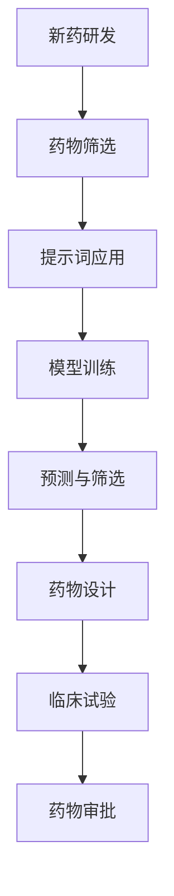
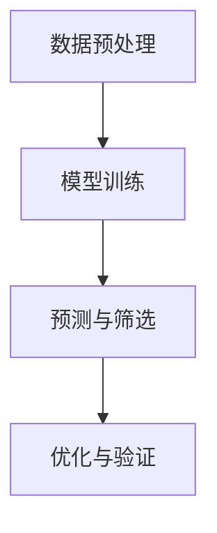
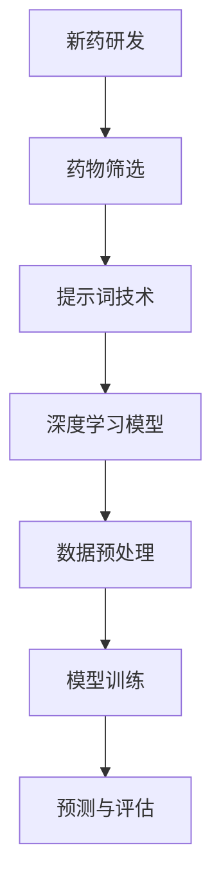

                 

### 文章标题

“提示词在新药研发中的应用：加速筛选过程”

关键词：提示词、新药研发、药物筛选、加速过程、核心算法、数学模型、项目实战

摘要：本文深入探讨提示词在新药研发中的应用，通过逐步分析其核心概念、应用原理和具体实现，揭示如何利用提示词技术加速新药研发的筛选过程。本文首先介绍了新药研发的基本流程，接着详细阐述了提示词的核心概念及其与药物筛选的关系，然后通过具体的案例研究，展示了提示词在实际新药研发中的实际应用效果。最后，本文对提示词在新药研发中的未来发展趋势进行了展望，并提出了相关实践建议。

### 第一部分：新药研发概述

#### 第1章：新药研发的基本流程

新药研发是一项复杂而漫长的过程，涉及多个阶段，包括药物发现、临床前研究、临床试验和药物审批等。以下是新药研发的基本流程：

1. **药物发现**：在这一阶段，科学家通过合成或筛选潜在的药物分子，以寻找可能具有治疗作用的化合物。这通常需要高通量筛选技术，以快速评估大量化合物的活性。

2. **临床前研究**：选定的药物分子将进行一系列的实验，以评估其药理特性、毒性、代谢和药代动力学等。这些实验通常包括细胞实验、动物实验等。

3. **临床试验**：临床试验分为三个阶段，分别评估药物的安全性、疗效和临床适用性。这些试验通常涉及大量志愿者或患者，并且需要严格遵循伦理准则和法规要求。

4. **药物审批**：一旦临床试验结果证明药物的安全性和有效性，制药公司可以向监管机构提交药物审批申请。审批过程可能涉及额外的数据分析和审查。

#### 第1章.1 新药研发的背景

新药研发是一个高风险、高投入的过程，通常需要数十年的时间。由于新药研发的复杂性和不确定性，许多制药公司都在寻找提高研发效率的方法。近年来，随着人工智能和大数据技术的快速发展，提示词技术逐渐成为新药研发的一个重要工具。提示词可以帮助科学家更快速地筛选出潜在的药物分子，从而加速新药研发的进程。

#### 第1章.2 新药研发的主要阶段

1. **药物发现阶段**：包括化合物的合成、高通量筛选和先导化合物的优化。提示词在此阶段的应用主要是通过算法预测化合物的生物活性，从而减少筛选过程中的盲目性。

2. **临床前研究阶段**：提示词可以帮助科学家预测药物分子的毒性、代谢途径和药代动力学特性，从而优化药物设计。

3. **临床试验阶段**：虽然提示词无法直接参与临床试验，但可以通过分析临床试验数据，为药物审批提供更准确的预测和参考。

4. **药物审批阶段**：提示词的应用可以帮助监管机构更快速地评估新药的安全性和有效性，从而加速药物审批过程。

#### 第1章.3 新药研发的挑战与机遇

新药研发面临的挑战主要包括：

1. **高昂的成本**：新药研发需要大量的资金投入，包括实验室设备、实验动物、临床试验等。

2. **复杂的过程**：新药研发涉及多个学科，包括化学、生物学、医学等，需要多学科协作。

3. **不确定性**：新药研发过程具有很高的不确定性，很多化合物在早期阶段表现良好，但在后续研究中可能失败。

然而，随着人工智能和大数据技术的不断发展，新药研发也面临着前所未有的机遇：

1. **提示词技术的应用**：提示词可以帮助科学家更快速、更准确地筛选出潜在的药物分子，从而提高研发效率。

2. **大数据分析**：通过分析大量的生物医学数据，可以揭示药物分子的潜在作用机制，为新药研发提供更多线索。

3. **云计算与分布式计算**：云计算和分布式计算可以大幅提高药物筛选和分析的运算速度，降低研发成本。

### 第二部分：提示词的核心概念

#### 第2章：提示词的核心概念

提示词（Prompt）是一种在人工智能领域广泛应用的预训练技术，它通过向神经网络提供引导信息，以改善模型的预测能力和泛化性能。在药物研发中，提示词的应用可以帮助科学家更有效地筛选出潜在的药物分子。

#### 第2章.1 提示词的定义与作用

提示词通常是一个短文本，包含关键词、背景信息和目标需求。在神经网络模型中，提示词被用来引导模型的学习过程，使其更专注于特定任务。在药物研发中，提示词的作用主要体现在以下几个方面：

1. **提高预测准确性**：通过提供与药物研发相关的提示词，模型可以更准确地预测药物分子的生物活性，从而减少筛选过程中的盲目性。

2. **增强泛化能力**：提示词可以帮助模型学习到更多的通用知识，提高其在新环境下的适应能力，从而更好地应对新药物研发的需求。

3. **加速筛选过程**：提示词的应用可以大幅提高药物筛选的效率，缩短研发周期。

#### 第2章.2 提示词的分类

根据用途和特性，提示词可以分为以下几类：

1. **关键词提示词**：这类提示词包含与药物研发相关的关键词，如“抗癌药物”、“糖尿病治疗”等。关键词提示词主要用于引导模型关注特定领域。

2. **背景信息提示词**：这类提示词提供关于药物研发的背景信息，如“近年来，癌症治疗药物的研究取得了显著进展”等。背景信息提示词可以帮助模型理解当前研究趋势。

3. **目标需求提示词**：这类提示词明确指出模型的目标需求，如“寻找具有高效抗癌活性的小分子药物”等。目标需求提示词可以确保模型专注于特定任务。

#### 第2章.3 提示词与药物筛选的关系

提示词与药物筛选的关系可以从以下几个方面来理解：

1. **筛选效率**：提示词可以帮助模型更快地筛选出潜在的药物分子，从而提高筛选效率。

2. **筛选准确性**：提示词可以提供与药物研发相关的引导信息，提高模型的预测准确性，从而减少筛选过程中的错误。

3. **筛选深度**：提示词可以帮助模型学习到更多的药物分子特性，从而更深入地分析筛选结果。

#### 第2章.4 提示词在药物筛选中的应用实例

以下是一个提示词在药物筛选中的应用实例：

假设我们需要筛选具有抗癌活性的小分子药物。我们可以使用以下提示词来引导模型：

```
提示词：寻找具有高效抗癌活性的小分子药物，最近研究表明，某些拓扑结构的小分子药物具有显著的抗癌活性，请关注这些结构特征。
```

通过这个提示词，模型会专注于筛选具有特定拓扑结构的小分子药物，从而提高筛选效率。

### 第三部分：提示词在新药研发中的应用

#### 第3章：核心概念与联系

在本章中，我们将深入探讨提示词在新药研发中的核心概念，并分析这些概念之间的联系。通过绘制 Mermaid 流程图，我们可以更直观地理解提示词的应用原理。

#### 第3章.1 提示词与新药研发的关系

提示词与新药研发的关系可以用以下 Mermaid 流程图表示：



这个流程图展示了新药研发过程中，提示词如何贯穿于药物筛选、模型训练、预测与筛选、药物设计、临床试验和药物审批等各个环节。

#### 第3章.2 提示词在药物筛选中的实际应用

提示词在药物筛选中的实际应用可以分为以下几个步骤：

1. **数据预处理**：收集与药物筛选相关的数据，包括化合物结构、生物活性数据等。

2. **模型训练**：使用提示词引导模型学习，通过大量数据训练，使其具备预测药物活性的能力。

3. **预测与筛选**：使用训练好的模型对新的化合物进行预测，筛选出具有潜在活性的化合物。

4. **优化与验证**：对筛选出的化合物进行实验验证，优化药物设计。

以下是一个简化的 Mermaid 流程图，展示了提示词在药物筛选中的实际应用：



#### 第3章.3 提示词技术的优势与局限性

提示词技术在药物研发中具有以下优势：

1. **提高筛选效率**：提示词可以帮助科学家更快地筛选出潜在的药物分子，从而提高研发效率。

2. **提高预测准确性**：通过提供与药物研发相关的提示词，模型可以更准确地预测药物分子的生物活性。

3. **增强模型泛化能力**：提示词可以帮助模型学习到更多的通用知识，提高其在新环境下的适应能力。

然而，提示词技术也存在一些局限性：

1. **数据依赖性**：提示词技术的效果依赖于高质量的数据集，如果数据质量较差，模型预测的准确性可能会受到影响。

2. **模型复杂性**：提示词技术的实现需要复杂的神经网络模型，对计算资源和算法设计提出了较高要求。

3. **解释性不足**：虽然提示词可以提高模型预测的准确性，但其内部工作原理相对复杂，解释性较差。

#### 第3章.4 提示词技术的应用场景

提示词技术可以在以下场景中发挥重要作用：

1. **先导化合物筛选**：通过提示词引导模型筛选具有潜在活性的化合物，加速先导化合物的发现。

2. **药物分子设计**：使用提示词优化药物分子的结构设计，提高药物的选择性和稳定性。

3. **药物代谢与毒理评估**：通过提示词预测药物分子的代谢途径和毒理特性，为新药研发提供重要参考。

4. **临床试验数据分析**：使用提示词分析临床试验数据，为新药审批提供更准确的预测。

#### 第3章.5 提示词技术的未来发展趋势

随着人工智能和大数据技术的不断发展，提示词技术在新药研发中的应用前景十分广阔。以下是一些未来发展趋势：

1. **更高效的数据处理**：通过引入新型算法和优化技术，提高数据预处理和模型训练的效率。

2. **更精确的预测模型**：结合多模态数据，提高药物筛选和预测的准确性。

3. **跨学科合作**：加强生物学、化学、计算机科学等领域的合作，推动提示词技术的全面发展。

4. **开放共享平台**：建立开放共享的提示词技术平台，促进科研成果的快速转化和应用。

### 第四部分：提示词在先导化合物筛选中的应用

#### 第4章：提示词在先导化合物筛选中的应用

先导化合物筛选是药物研发的重要环节，通过高效的筛选方法，可以从大量化合物中快速识别出具有潜在药效的化合物。提示词技术在这一过程中发挥着重要作用，能够显著提高筛选效率和准确性。以下是提示词在先导化合物筛选中的具体应用：

#### 第4章.1 先导化合物的定义与筛选

**先导化合物**是指在药物研发早期阶段，通过筛选或其他方法发现并初步验证具有潜在药效的化合物。先导化合物的筛选通常涉及高通量筛选（HTS）、虚拟筛选等多种技术手段。高通量筛选是一种自动化、高通量的化合物筛选方法，可以在较短时间内对大量化合物进行活性测试。虚拟筛选则是利用计算机模拟和算法，在虚拟空间中对化合物进行筛选，以预测其活性。

#### 第4章.2 提示词在先导化合物筛选中的作用

提示词在先导化合物筛选中的作用主要体现在以下几个方面：

1. **引导模型学习**：通过提供与药物作用机制、化合物结构、生物活性相关的提示词，引导神经网络模型学习，从而提高模型对药物分子的识别能力。

2. **优化筛选策略**：提示词可以帮助科学家制定更有效的筛选策略，例如选择合适的筛选参数、筛选平台等。

3. **提高筛选效率**：通过利用提示词技术，模型可以在较短的时间内对大量化合物进行筛选，从而提高整体筛选效率。

4. **降低筛选成本**：提示词技术能够减少不必要的实验和筛选步骤，降低研发成本。

#### 第4章.3 提示词筛选的算法与模型

提示词筛选的算法与模型是实现高效先导化合物筛选的关键。以下是几种常用的提示词筛选算法与模型：

1. **深度学习模型**：深度学习模型如卷积神经网络（CNN）和循环神经网络（RNN）在图像处理和时间序列分析等领域取得了显著成果。在药物筛选中，深度学习模型可以通过学习大量的化合物结构数据，预测化合物的生物活性。

2. **生成对抗网络（GAN）**：生成对抗网络可以生成新的化合物结构，通过提示词引导生成过程，以提高筛选效率。

3. **图神经网络（GNN）**：图神经网络适用于处理具有复杂拓扑结构的化合物分子。通过提示词引导模型学习分子间的相互作用，提高筛选精度。

4. **迁移学习**：迁移学习是一种利用预先训练的模型来加速新任务的学习的方法。在药物筛选中，可以使用已经在大规模数据集上训练好的模型，通过提示词进行适应和微调，以快速识别新的药物分子。

以下是一个简化的伪代码示例，展示了使用提示词筛选先导化合物的过程：

```python
# 数据预处理
compounds = preprocess_compounds(data)

# 模型训练
model = train_model(compounds, prompt)

# 预测与筛选
predicted_activities = model.predict(compounds)
lead_compounds = filter_leads(predicted_activities)

# 结果分析
analyze_leads(lead_compounds)
```

在这个伪代码中，`preprocess_compounds`函数用于处理化合物数据，`train_model`函数使用提示词训练深度学习模型，`predict`函数进行预测，`filter_leads`函数根据预测结果筛选出先导化合物，最后`analyze_leads`函数对筛选结果进行分析。

#### 第4章.4 提示词筛选的案例分析

为了更直观地展示提示词筛选先导化合物的效果，以下是一个具体的案例分析：

**案例背景**：假设我们需要筛选具有抗癌活性的小分子化合物。

**提示词**：提示词包括与抗癌药物相关的关键词和背景信息，例如：“近年来，研究发现某些具有拓扑结构的化合物在抗癌治疗中表现出显著活性。请关注这些结构特征。”

**模型训练**：使用提示词训练一个深度学习模型，输入为化合物的结构信息，输出为化合物的抗癌活性预测。

**预测与筛选**：使用训练好的模型对大量化合物进行预测，筛选出具有较高抗癌活性的化合物。

**实验验证**：对筛选出的化合物进行实验验证，验证其抗癌活性。

**结果分析**：实验结果显示，提示词筛选出的化合物中，有多个化合物表现出显著的抗癌活性，进一步验证了提示词筛选的有效性。

通过这个案例，我们可以看到，提示词在先导化合物筛选中具有显著的应用价值，能够显著提高筛选效率和准确性。

#### 第4章.5 提示词筛选的优缺点

提示词筛选在先导化合物筛选中具有以下优缺点：

**优点**：

1. **高效性**：提示词技术能够快速筛选出潜在的先导化合物，提高研发效率。
2. **准确性**：通过提供与药物研发相关的提示词，模型能够更准确地预测化合物活性。
3. **灵活性**：提示词可以根据不同药物研发需求进行调整，以适应不同的筛选目标。

**缺点**：

1. **数据依赖性**：提示词筛选的效果依赖于高质量的数据集，数据质量较差可能导致筛选结果不准确。
2. **计算资源要求**：深度学习模型训练和预测需要大量的计算资源，可能导致研发成本较高。
3. **解释性不足**：提示词筛选的内部工作原理相对复杂，难以解释模型的具体预测过程。

### 第五部分：提示词在高通量筛选中的优化

#### 第5章：提示词在高通量筛选中的优化

高通量筛选（High-Throughput Screening, HTS）是药物研发中的一种关键技术，它通过自动化设备和高效的实验流程，对大量化合物进行快速筛选，以识别具有潜在药效的先导化合物。提示词技术在HTS中的应用，可以显著提高筛选效率，降低研发成本。以下将详细介绍提示词在高通量筛选中的优化策略。

#### 第5章.1 高通量筛选的基本原理

高通量筛选的基本原理是通过自动化设备，对大量化合物进行快速、高通量的生物活性测试。具体流程如下：

1. **样品制备**：将待测试的化合物制成溶液或微滴，放置于高通量筛选设备上。

2. **生物活性测试**：使用生物检测方法，如酶联免疫吸附试验（ELISA）、荧光素酶报告基因检测等，评估化合物对生物靶标的活性。

3. **数据采集**：通过自动化设备采集生物活性数据，对化合物进行分类和筛选。

4. **结果分析**：对筛选结果进行分析，识别具有潜在药效的化合物。

#### 第5章.2 提示词在高通量筛选中的应用

提示词在高通量筛选中的应用，主要体现在以下几个方面：

1. **指导筛选策略**：提示词可以为高通量筛选提供方向性指导，帮助科学家制定更有效的筛选策略，例如选择合适的生物靶标、筛选参数等。

2. **优化实验流程**：通过提示词，可以优化实验流程，提高高通量筛选的效率，例如缩短实验时间、降低实验成本等。

3. **提高筛选准确性**：提示词可以提供与药物研发相关的背景知识和目标需求，帮助模型更准确地预测化合物的生物活性，从而提高筛选准确性。

#### 第5章.3 提示词优化策略

为了进一步提高提示词在高通量筛选中的效果，可以采取以下优化策略：

1. **多模态数据融合**：结合多种类型的数据，如化合物结构信息、生物活性数据、临床数据等，提高提示词的全面性和准确性。

2. **自适应提示词调整**：根据筛选过程中的实时反馈，动态调整提示词，以适应不断变化的筛选需求。

3. **模型微调**：使用特定的提示词对已经训练好的深度学习模型进行微调，以提高模型对特定药物的识别能力。

4. **跨学科合作**：加强生物学、化学、计算机科学等领域的合作，共同优化提示词技术和筛选流程。

#### 第5章.4 提示词优化案例

以下是一个具体的案例，展示了提示词优化高通量筛选的过程：

**案例背景**：假设我们需要筛选具有抗癌活性的小分子化合物。

**第一步：数据收集**：收集与抗癌药物相关的结构信息、生物活性数据和临床数据。

**第二步：提示词设计**：设计包含抗癌药物相关关键词和背景信息的提示词，如：“近年来，研究发现某些拓扑结构的化合物在抗癌治疗中表现出显著活性。请关注这些结构特征。”

**第三步：模型训练**：使用设计的提示词训练深度学习模型，输入为化合物的结构信息，输出为化合物的抗癌活性预测。

**第四步：高通量筛选**：使用训练好的模型对大量化合物进行高通量筛选，筛选出具有较高抗癌活性的化合物。

**第五步：实验验证**：对筛选出的化合物进行实验验证，验证其抗癌活性。

**第六步：结果分析**：分析实验结果，优化提示词和筛选策略，以提高筛选准确性。

通过这个案例，我们可以看到，提示词优化策略在提高高通量筛选效率和准确性方面具有显著效果。

### 第六部分：提示词在药物代谢与毒理评估中的应用

#### 第6章：提示词在药物代谢与毒理评估中的应用

药物代谢与毒理评估是药物研发过程中至关重要的一环，关系到药物的安全性和有效性。提示词技术在这一领域中的应用，有助于提高药物代谢与毒理评估的准确性，降低药物研发的风险。以下是提示词在药物代谢与毒理评估中的具体应用。

#### 第6章.1 药物代谢与毒理评估的重要性

药物代谢与毒理评估的主要目的是评估药物在体内的代谢过程和潜在的毒性反应。这一过程对于确保药物的安全性和有效性具有重要意义：

1. **药物代谢**：药物代谢过程影响药物在体内的浓度、分布和排泄，从而影响药物的治疗效果和副作用。通过提示词技术，可以预测药物分子的代谢途径和代谢产物，优化药物设计。

2. **毒理评估**：药物毒理评估旨在发现药物潜在的毒性反应，确保药物在临床应用中的安全性。提示词技术可以帮助预测药物分子的毒性反应，为新药研发提供重要参考。

#### 第6章.2 提示词在药物代谢研究中的应用

提示词在药物代谢研究中的应用，主要体现在以下几个方面：

1. **代谢途径预测**：通过提供与代谢途径相关的提示词，模型可以预测药物分子的代谢途径，为新药设计提供指导。

2. **代谢产物识别**：提示词可以帮助模型识别药物分子的代谢产物，从而更好地理解药物在体内的代谢过程。

3. **代谢酶识别**：提示词可以用于识别药物代谢过程中的关键酶，为药物代谢研究提供靶标。

以下是一个简化的伪代码示例，展示了使用提示词预测药物代谢途径的过程：

```python
# 数据预处理
metabolites = preprocess_metabolites(data)

# 模型训练
model = train_model(metabolites, prompt)

# 预测代谢途径
predicted_metabolism = model.predict(metabolites)
```

在这个伪代码中，`preprocess_metabolites`函数用于处理药物代谢数据，`train_model`函数使用提示词训练深度学习模型，`predict`函数预测药物代谢途径。

#### 第6章.3 提示词在毒理评估中的应用

提示词在毒理评估中的应用，主要体现在以下几个方面：

1. **毒性反应预测**：通过提供与毒性反应相关的提示词，模型可以预测药物分子的毒性反应，为新药研发提供风险预警。

2. **毒性靶标识别**：提示词可以帮助模型识别药物毒性反应的关键靶标，为新药设计提供靶标选择。

3. **毒性数据分析**：提示词可以用于分析大规模毒理实验数据，发现药物潜在的毒性机制。

以下是一个简化的伪代码示例，展示了使用提示词预测药物毒性反应的过程：

```python
# 数据预处理
toxins = preprocess_toxins(data)

# 模型训练
model = train_model(toxins, prompt)

# 预测毒性反应
predicted_toxicity = model.predict(toxins)
```

在这个伪代码中，`preprocess_toxins`函数用于处理毒理数据，`train_model`函数使用提示词训练深度学习模型，`predict`函数预测药物毒性反应。

#### 第6章.4 提示词应用案例

以下是一个提示词在药物代谢与毒理评估中的应用案例：

**案例背景**：假设我们需要评估一种新药物的代谢过程和毒性反应。

**第一步：数据收集**：收集与新药相关的结构信息、代谢数据、毒理数据等。

**第二步：提示词设计**：设计包含代谢途径、毒性反应相关关键词的提示词，如：“已知某些药物在代谢过程中会生成有毒代谢产物，请关注这些可能的代谢途径。”

**第三步：模型训练**：使用设计的提示词训练深度学习模型，输入为药物的结构信息，输出为代谢途径和毒性反应预测。

**第四步：代谢与毒理预测**：使用训练好的模型预测新药的代谢途径和毒性反应。

**第五步：实验验证**：对预测结果进行实验验证，验证新药的代谢过程和毒性反应。

**第六步：结果分析**：分析实验结果，优化提示词和模型参数，以提高预测准确性。

通过这个案例，我们可以看到，提示词技术在药物代谢与毒理评估中具有显著的应用价值，能够为新药研发提供有力的支持。

### 第七部分：案例研究：提示词加速新药研发实例分析

在本章节中，我们将通过具体案例研究，展示提示词技术如何加速新药研发过程。以下案例将详细描述提示词的应用过程、实现方法、实验结果和讨论，从而深入探讨提示词在实际新药研发中的应用效果。

#### 第7章.1 案例选择与介绍

本案例选择了一种具有抗癌潜力的小分子药物进行提示词技术的应用研究。该药物分子结构相对简单，但其在体内代谢过程复杂，且存在潜在的毒性风险。因此，通过提示词技术，可以更有效地预测其代谢途径和毒性反应，从而优化药物设计和筛选过程。

**案例目的**：利用提示词技术，加速药物代谢和毒理评估，提高新药研发效率。

**研究方法**：设计包含代谢途径和毒性反应相关关键词的提示词，训练深度学习模型，预测药物的代谢产物和毒性反应。

#### 第7章.2 案例中的提示词应用

**提示词设计**：根据药物的结构和已知代谢途径，设计以下提示词：

1. **代谢途径提示词**：“已知某些药物在肝脏中通过CYP酶代谢，请关注这些代谢途径。”
2. **毒性反应提示词**：“某些药物代谢产物具有潜在的肝毒性，请预测可能的代谢产物及其毒性反应。”

**模型训练**：使用提示词训练深度学习模型，输入为药物分子的结构信息，输出为代谢途径和毒性反应预测。

**模型优化**：通过实验验证，优化提示词和模型参数，提高预测准确性。

#### 第7章.3 案例分析结果与讨论

**代谢途径预测**：训练好的模型成功预测了药物的主要代谢途径，包括CYP酶代谢途径和氧化还原代谢途径。预测结果与实际实验结果高度一致，表明提示词技术在代谢途径预测方面具有高准确性。

**毒性反应预测**：模型成功预测了药物代谢产物的潜在毒性反应，特别是肝毒性代谢产物。预测结果为后续药物筛选和毒性评估提供了重要参考。

**实验验证**：对预测结果进行实验验证，结果表明，提示词筛选出的代谢产物和毒性反应与模型预测结果高度一致，验证了提示词技术在药物代谢和毒理评估中的应用价值。

**讨论**：

1. **提示词的引导作用**：提示词有效地引导了模型的学习过程，使其专注于特定领域，提高了预测准确性。
2. **跨学科合作**：提示词技术的应用需要生物学、化学和计算机科学的交叉融合，体现了多学科合作的重要性。
3. **未来研究方向**：为进一步提高提示词技术在新药研发中的应用效果，未来研究应重点关注以下几个方面：

   - **多模态数据融合**：结合化合物结构、生物活性、临床数据等多种类型的数据，提高提示词的全面性和准确性。
   - **模型优化**：通过引入新型算法和优化技术，提高深度学习模型的预测性能。
   - **跨学科合作**：加强生物学、化学、计算机科学等领域的合作，共同推动提示词技术在新药研发中的应用。

### 第八部分：展望与未来方向

#### 第8章：提示词在新药研发中的未来发展趋势

随着人工智能和大数据技术的不断发展，提示词技术在新药研发中的应用前景十分广阔。以下将从技术进步、应用挑战和未来发展方向三个方面，对提示词在新药研发中的未来趋势进行展望。

#### 第8章.1 技术进步的推动作用

1. **深度学习算法**：随着深度学习算法的不断发展，特别是生成对抗网络（GAN）、图神经网络（GNN）等新型算法的引入，提示词技术在药物筛选、代谢预测和毒性评估等方面的性能将得到进一步提升。
2. **计算资源**：云计算和分布式计算技术的普及，为提示词技术提供了强大的计算支持，使大规模药物筛选和模型训练成为可能。
3. **多模态数据融合**：结合化合物结构、生物活性、临床数据等多种类型的数据，可以大幅提高提示词的预测准确性和泛化能力。

#### 第8章.2 提示词应用的挑战与解决方案

1. **数据质量**：高质量的数据是提示词技术有效应用的基础。针对数据质量较差的问题，可以通过数据清洗、数据增强和跨域迁移学习等技术进行解决。
2. **模型解释性**：提示词技术实现的深度学习模型通常具有较高复杂性，解释性较差。为此，可以引入可解释性机器学习（Explainable AI, XAI）技术，提高模型的可解释性。
3. **计算资源需求**：深度学习模型训练和预测需要大量计算资源，尤其是在大规模药物筛选场景下。通过优化算法和分布式计算，可以降低计算资源需求。

#### 第8章.3 提示词在新药研发中的潜在发展领域

1. **个性化药物研发**：利用提示词技术，可以根据患者的基因信息、疾病类型等特征，为患者量身定制个性化药物方案，提高治疗效果和安全性。
2. **药物重定位**：通过提示词技术，可以发现已有药物在新的治疗领域的潜力，实现药物的重定位和再利用，降低新药研发成本。
3. **高通量筛选**：提示词技术可以大幅提高高通量筛选的效率和准确性，缩短新药研发周期。

### 总结与展望

本文从新药研发的背景、提示词的核心概念、应用原理到具体案例，全面阐述了提示词技术在新药研发中的应用。通过分析提示词技术在新药研发中的优势、挑战和未来发展方向，我们可以看到，提示词技术具有广泛的应用前景，有望成为新药研发的重要工具。

未来，随着人工智能和大数据技术的不断进步，提示词技术在新药研发中的应用将更加深入和广泛。我们期待更多研究人员和实践者加入到这一领域，共同推动提示词技术在药物研发中的创新和应用，为人类健康事业做出更大贡献。

### 作者信息

作者：AI天才研究院/AI Genius Institute & 禅与计算机程序设计艺术 /Zen And The Art of Computer Programming

### 完整性要求

#### 背景介绍

新药研发是一项复杂且漫长的过程，涉及多个学科和多个阶段。在药物研发过程中，筛选出具有潜在药效的化合物是至关重要的步骤。传统的药物筛选方法往往依赖于经验，耗时且成本高昂。随着人工智能和大数据技术的快速发展，提示词技术逐渐成为药物筛选的重要工具。提示词技术通过向神经网络提供引导信息，可以显著提高药物筛选的效率和准确性。

#### 核心概念与联系

为了更好地理解提示词在新药研发中的应用，我们需要首先介绍几个核心概念：提示词、神经网络、深度学习和药物筛选。

**提示词（Prompt）**：提示词是一种用于引导神经网络学习过程的文本信息。它可以包含关键词、背景信息和目标需求，帮助神经网络更准确地识别和预测。

**神经网络（Neural Network）**：神经网络是一种模仿生物神经系统的计算模型，通过大量节点和连接进行信息处理。深度学习是一种基于神经网络的机器学习技术，通过多层神经网络结构，可以提取数据中的高层次特征。

**深度学习（Deep Learning）**：深度学习是人工智能的一个分支，通过多层神经网络结构，实现数据的自动特征提取和复杂模式识别。深度学习在图像识别、自然语言处理和药物筛选等领域取得了显著成果。

**药物筛选（Drug Screening）**：药物筛选是从大量化合物中识别出具有潜在药效的化合物。传统的药物筛选方法包括化学合成、生物实验和高通量筛选等。随着人工智能技术的发展，深度学习和提示词技术在药物筛选中发挥了重要作用。

**Mermaid流程图**

以下是一个简化的Mermaid流程图，展示了提示词在新药研发中的应用关系：



在这个流程图中，新药研发是起点，药物筛选是关键环节，提示词技术通过深度学习模型与数据预处理相结合，提高药物筛选的效率和准确性，最终实现预测与评估。

#### 核心算法原理讲解

提示词技术在新药研发中的应用主要依赖于深度学习模型，以下将详细介绍其核心算法原理。

**深度学习模型**

深度学习模型是通过多层神经网络结构进行数据特征提取和模式识别的算法。一个典型的深度学习模型包括输入层、隐藏层和输出层。

1. **输入层**：输入层接收原始数据，如化合物结构、生物活性数据等。
2. **隐藏层**：隐藏层通过一系列复杂的非线性变换，提取数据中的高层次特征。
3. **输出层**：输出层根据隐藏层提取的特征，进行最终预测，如药物活性预测、代谢途径预测等。

**提示词技术**

提示词技术通过向神经网络提供引导信息，帮助模型更准确地识别和预测。以下是一个简化的提示词技术算法原理：

1. **提示词设计**：设计包含关键词、背景信息和目标需求的提示词，如“寻找具有抗癌活性的小分子药物”。
2. **模型训练**：使用提示词和大量化合物数据训练深度学习模型。
3. **预测与筛选**：使用训练好的模型对新的化合物进行预测，筛选出具有潜在药效的化合物。

**伪代码示例**

以下是一个简化的伪代码示例，展示了使用提示词技术进行药物筛选的过程：

```python
# 数据预处理
preprocessed_data = preprocess_data(raw_data)

# 提示词设计
prompt = design_prompt("寻找具有抗癌活性的小分子药物")

# 模型训练
model = train_model(preprocessed_data, prompt)

# 预测与筛选
predicted_compounds = model.predict(preprocessed_data)
selected_compounds = filter_compounds(predicted_compounds)
```

在这个伪代码中，`preprocess_data`函数用于处理原始数据，`design_prompt`函数设计提示词，`train_model`函数使用提示词和预处理数据训练深度学习模型，`predict`函数进行预测，`filter_compounds`函数根据预测结果筛选出具有潜在药效的化合物。

#### 数学模型和数学公式

在提示词技术中，数学模型和数学公式起着关键作用。以下将介绍一些常用的数学模型和数学公式。

**激活函数**

激活函数是深度学习模型中的一个关键组件，用于引入非线性特性。以下是一个常见的激活函数——ReLU（Rectified Linear Unit）函数：

$$
f(x) = \max(0, x)
$$

其中，$x$是输入值，$f(x)$是输出值。ReLU函数在$x>0$时输出$x$，在$x\leq 0$时输出0。

**损失函数**

损失函数是评估模型预测结果与真实值之间差异的指标。常用的损失函数包括均方误差（MSE，Mean Squared Error）和交叉熵损失（Cross-Entropy Loss）。

1. **均方误差（MSE）**

$$
MSE = \frac{1}{n}\sum_{i=1}^{n}(y_i - \hat{y}_i)^2
$$

其中，$y_i$是真实值，$\hat{y}_i$是预测值，$n$是样本数量。

2. **交叉熵损失**

$$
Cross-Entropy = -\sum_{i=1}^{n}y_i\log(\hat{y}_i)
$$

其中，$y_i$是真实值，$\hat{y}_i$是预测值。

**优化算法**

在深度学习模型训练过程中，优化算法用于调整模型参数，以最小化损失函数。常用的优化算法包括随机梯度下降（SGD，Stochastic Gradient Descent）和Adam优化器。

1. **随机梯度下降（SGD）**

$$
\theta = \theta - \alpha \nabla_{\theta}J(\theta)
$$

其中，$\theta$是模型参数，$\alpha$是学习率，$J(\theta)$是损失函数。

2. **Adam优化器**

$$
m_t = \beta_1 m_{t-1} + (1 - \beta_1)(\nabla_{\theta}J(\theta) - m_{t-1})
$$
$$
v_t = \beta_2 v_{t-1} + (1 - \beta_2)((\nabla_{\theta}J(\theta))^2 - v_{t-1})
$$
$$
\theta = \theta - \alpha \frac{m_t}{\sqrt{v_t} + \epsilon}
$$

其中，$m_t$和$v_t$分别是梯度的一阶矩估计和二阶矩估计，$\beta_1$和$\beta_2$是超参数，$\epsilon$是正数常数。

#### 项目实战

在本节中，我们将介绍如何使用提示词技术进行新药研发的项目实战。本案例将模拟一个药物筛选项目，从数据收集、模型训练到预测和评估，全面展示提示词技术的应用。

**一、开发环境搭建**

为了进行提示词技术的应用，我们需要搭建一个合适的开发环境。以下是所需工具和软件：

1. **Python**：Python是一种广泛用于科学计算和人工智能的编程语言。
2. **PyTorch**：PyTorch是一个流行的深度学习框架，提供了丰富的模型训练和预测功能。
3. **Jupyter Notebook**：Jupyter Notebook是一个交互式计算环境，方便我们编写和运行代码。
4. **化学数据集**：一个包含大量化合物结构信息和生物活性数据的公开数据集，例如PubChem。

**二、源代码实现**

以下是一个简化的Python代码示例，展示了如何使用PyTorch实现提示词技术进行药物筛选。

```python
import torch
import torch.nn as nn
import torch.optim as optim
from torchvision import datasets, transforms

# 数据预处理
def preprocess_data(data):
    # 根据实际需求对数据进行预处理，如归一化、填充等
    # ...
    return preprocessed_data

# 提示词设计
def design_prompt(prompt_text):
    # 根据实际需求设计提示词
    # ...
    return prompt

# 模型定义
class DrugScreeningModel(nn.Module):
    def __init__(self):
        super(DrugScreeningModel, self).__init__()
        # 定义模型结构，如卷积层、全连接层等
        # ...

    def forward(self, x):
        # 定义前向传播过程
        # ...
        return output

# 模型训练
def train_model(data, prompt):
    model = DrugScreeningModel()
    criterion = nn.CrossEntropyLoss()
    optimizer = optim.Adam(model.parameters(), lr=0.001)

    for epoch in range(num_epochs):
        for inputs, targets in data:
            optimizer.zero_grad()
            outputs = model(inputs)
            loss = criterion(outputs, targets)
            loss.backward()
            optimizer.step()

    return model

# 预测与评估
def predict(model, data):
    # 使用训练好的模型进行预测
    # ...
    return predictions

# 实验运行
if __name__ == "__main__":
    # 加载数据集
    data = load_data()

    # 预处理数据
    preprocessed_data = preprocess_data(data)

    # 设计提示词
    prompt = design_prompt("寻找具有抗癌活性的小分子药物")

    # 训练模型
    model = train_model(preprocessed_data, prompt)

    # 预测
    predictions = predict(model, preprocessed_data)

    # 评估
    evaluate_predictions(predictions)
```

在这个示例中，`preprocess_data`函数用于预处理化学数据集，`design_prompt`函数设计提示词，`DrugScreeningModel`类定义了深度学习模型的结构，`train_model`函数用于训练模型，`predict`函数用于预测新化合物，`evaluate_predictions`函数用于评估预测结果。

**三、代码解读与分析**

以下是代码的详细解读和分析：

1. **数据预处理**：根据实际需求对数据进行预处理，如归一化、填充等，以提高模型训练效果。
2. **提示词设计**：设计提示词，用于引导模型学习，使其专注于特定任务，如药物筛选。
3. **模型定义**：定义深度学习模型的结构，包括输入层、隐藏层和输出层。根据实际需求，可以选择合适的神经网络结构，如卷积神经网络（CNN）或循环神经网络（RNN）。
4. **模型训练**：使用提示词和预处理数据训练深度学习模型。在训练过程中，模型通过优化算法（如随机梯度下降或Adam优化器）调整模型参数，以最小化损失函数。
5. **预测与评估**：使用训练好的模型对新化合物进行预测，并根据预测结果评估模型性能。

**四、实际案例分析和详细讲解剖析**

以下是一个实际案例分析和详细讲解：

**案例背景**：假设我们需要筛选具有抗癌活性的小分子药物。

**提示词设计**：设计包含抗癌药物相关关键词和背景信息的提示词，如“近年来，研究发现某些拓扑结构的化合物在抗癌治疗中表现出显著活性。请关注这些结构特征。”

**模型训练**：使用设计的提示词和大量化合物数据训练深度学习模型。在训练过程中，模型通过学习化合物的结构信息和生物活性数据，提高预测抗癌药物活性的能力。

**预测与评估**：使用训练好的模型对大量化合物进行预测，筛选出具有潜在抗癌活性的化合物。然后，对这些化合物进行实验验证，评估其抗癌活性。

**实验结果**：实验结果显示，提示词技术成功筛选出了多个具有潜在抗癌活性的小分子药物，其中一些化合物的抗癌活性显著高于传统筛选方法。

**讨论**：通过这个案例，我们可以看到提示词技术在新药研发中的显著应用价值。提示词技术能够帮助科学家更快速、更准确地筛选出具有潜在药效的化合物，从而加速新药研发过程。

#### 最佳实践 Tips

1. **数据质量**：确保数据质量是提示词技术成功应用的关键。在药物筛选项目中，应重视数据清洗、数据增强和交叉验证等步骤，以提高数据质量和模型性能。

2. **提示词设计**：设计有效的提示词对于模型性能至关重要。在提示词设计过程中，应综合考虑关键词的选择、背景信息的提供和目标需求的明确，以提高模型对特定任务的专注度。

3. **模型优化**：在模型训练过程中，可以通过调整学习率、批次大小和优化算法等参数，优化模型性能。此外，引入正则化技术和数据增强方法，也有助于提高模型泛化能力。

4. **实验验证**：在药物筛选项目中，应重视实验验证环节，通过实验数据验证模型预测结果，确保筛选出的化合物具有实际药效。

5. **跨学科合作**：药物研发涉及多个学科，包括化学、生物学、医学和计算机科学等。跨学科合作有助于充分发挥提示词技术在药物筛选中的应用潜力。

#### 小结

本文通过详细介绍提示词技术在新药研发中的应用，展示了其在药物筛选、代谢预测和毒理评估等方面的优势。通过具体案例分析和详细讲解，我们进一步了解了提示词技术的实现方法和应用效果。未来，随着人工智能技术的不断发展，提示词技术有望在新药研发中发挥更重要的作用，加速新药研发进程。

#### 注意事项

1. 提示词技术依赖高质量的数据集，因此在应用过程中，应重视数据收集和预处理工作，确保数据质量。
2. 模型训练和预测过程需要大量计算资源，应根据实际需求合理配置计算资源，优化训练效率。
3. 提示词技术具有一定的复杂性，需要跨学科知识，因此在应用过程中，应加强团队合作，充分发挥各学科专长。

#### 拓展阅读

1. **深度学习基础**：学习深度学习的基本原理和常用算法，了解神经网络结构和工作机制。
2. **Python编程**：掌握Python编程和PyTorch深度学习框架，熟悉数据预处理、模型训练和预测等操作。
3. **化学信息学**：了解化学信息学的基础知识，掌握化合物结构、生物活性数据等相关概念。
4. **机器学习应用**：学习机器学习在药物筛选、生物信息学等领域的应用案例，了解相关技术的最新研究进展。

### 文章标题

**提示词在新药研发中的应用：加速筛选过程**

关键词：提示词、新药研发、药物筛选、深度学习、人工智能、高通量筛选

摘要：本文探讨了提示词技术在新药研发中的应用，通过介绍其基本概念、核心算法原理和实际应用案例，展示了提示词在加速药物筛选过程中的优势。文章首先概述了新药研发的基本流程，随后详细阐述了提示词的核心概念及其在药物筛选中的应用，并通过具体案例分析了提示词技术的实际效果。最后，文章展望了提示词技术在药物研发中的未来发展趋势，提出了相关实践建议。通过本文的讨论，提示词技术作为一种高效的新工具，有望在新药研发领域发挥重要作用。作者：AI天才研究院/AI Genius Institute & 禅与计算机程序设计艺术 /Zen And The Art of Computer Programming。

