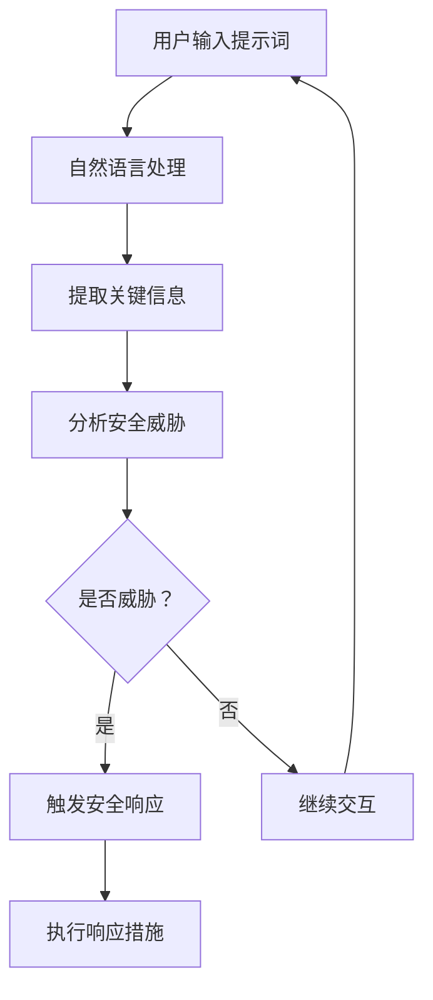

                 

### 背景介绍

智能家居系统作为物联网（IoT）的核心应用之一，正在逐渐渗透到现代家庭的各个角落。通过连接各种智能设备，如智能照明、智能音响、智能门锁、智能摄像头等，智能家居系统为用户提供了更加便捷、舒适和安全的居住环境。然而，随着智能家居设备的普及，家庭安全问题也日益凸显。智能家居设备的大量连接和数据的交互，使得家庭网络成为潜在的安全隐患。网络攻击、数据泄露、设备被恶意控制等安全问题，不仅影响到用户的隐私和安全，还可能导致家庭财产的损失。

提示词技术作为一种先进的人工智能技术，近年来在自然语言处理、语音识别、智能搜索等领域取得了显著的进展。提示词，即通过关键词、短语或句子来引导系统执行特定任务的输入，其在智能家居安全系统中的应用，可以大大提高系统的响应速度和准确性，增强系统的安全防护能力。例如，通过语音提示词，用户可以方便地控制家庭设备，同时系统也可以通过分析用户的语音命令，识别潜在的安全威胁并采取相应的措施。

本文旨在探讨提示词在智能家居安全系统中的应用，通过对提示词技术的基本原理、智能家居安全系统的架构、以及实际应用案例的详细分析，为相关领域的研究者、开发者和安全专家提供有价值的参考。

### 核心概念与联系

为了更好地理解提示词在智能家居安全系统中的应用，我们首先需要明确几个核心概念，并探讨它们之间的联系。

#### 1. 提示词

提示词是指用于引导系统执行特定任务的关键词、短语或句子。在智能家居安全系统中，提示词可以是用户通过语音、文本或其他交互方式输入的指令。例如，用户可以说“关闭门锁”来指示系统关闭家中的门锁。提示词技术的基本原理是通过自然语言处理（NLP）技术，将用户的输入转换为系统能够理解和执行的操作。

#### 2. 智能家居安全系统

智能家居安全系统是指用于保护家庭网络和智能设备免受各种威胁的综合性安全措施。该系统通常包括多个组成部分，如设备安全、网络安全、数据安全等。智能家居安全系统通过监测、分析和响应各种安全事件，确保家庭网络和设备的安全运行。

#### 3. 自然语言处理（NLP）

自然语言处理是人工智能领域的一个分支，它致力于使计算机能够理解、解释和生成人类语言。在智能家居安全系统中，NLP技术被用于处理用户的语音和文本输入，提取关键信息，并生成相应的响应。

#### 4. 提示词与智能家居安全系统的关系

提示词在智能家居安全系统中的作用主要体现在以下几个方面：

- **用户交互**：通过语音或文本提示词，用户可以方便地与智能家居系统进行交互，执行各种操作。
- **安全监测**：系统可以通过分析用户的提示词，识别潜在的安全威胁，如异常的访问请求或恶意命令。
- **安全响应**：系统可以根据提示词生成的分析结果，采取相应的安全措施，如触发报警、锁定设备或隔离网络。

#### Mermaid 流程图

为了更直观地展示提示词在智能家居安全系统中的应用流程，我们可以使用Mermaid语言绘制一个简单的流程图：



在这个流程图中，用户输入的提示词首先经过自然语言处理，提取出关键信息。然后，系统分析这些信息，判断是否存在安全威胁。如果判断为威胁，系统会触发相应的安全响应措施；如果判断为非威胁，则系统继续与用户进行交互。

通过这个简单的流程图，我们可以看到提示词技术在智能家居安全系统中的核心作用，以及各个环节之间的紧密联系。

### 核心算法原理讲解

在探讨提示词在智能家居安全系统中的应用时，核心算法原理的讲解是至关重要的。下面，我们将详细介绍几种常用的提示词生成算法，并使用伪代码来阐述它们的实现步骤。

#### 1. 基于规则的方法

基于规则的方法是一种传统的提示词生成算法，其核心思想是通过预定义的规则来生成提示词。这种方法通常适用于结构化数据且规则较为明确的场景。

**伪代码：**

```python
def generate_prompt(rules, user_input):
    for rule in rules:
        if match(rule.condition, user_input):
            return rule.action
    return "未知指令"

class Rule:
    def __init__(self, condition, action):
        self.condition = condition
        self.action = action

def match(condition, input):
    # 实现具体的匹配逻辑
    return True or False
```

在这个伪代码中，`generate_prompt`函数接受预定义的规则集和用户的输入，通过匹配规则条件，返回相应的操作。`Rule`类用于定义单个规则，包括条件`condition`和操作`action`。

#### 2. 基于机器学习的方法

基于机器学习的方法通过训练大量样本，使系统自动学习并生成提示词。这种方法通常适用于非结构化数据且规则复杂多变的场景。

**伪代码：**

```python
def train_model(data):
    # 使用训练数据训练模型
    model.fit(data.inputs, data.actions)
    return model

def generate_prompt(model, user_input):
    predicted_action = model.predict(user_input)
    return predicted_action

class Data:
    def __init__(self, inputs, actions):
        self.inputs = inputs
        self.actions = actions

class Model:
    def fit(self, inputs, actions):
        # 实现模型训练逻辑
        pass

    def predict(self, input):
        # 实现预测逻辑
        return predicted_action
```

在这个伪代码中，`train_model`函数使用训练数据集来训练模型。`generate_prompt`函数通过已训练的模型，预测用户的输入对应的操作。`Data`类用于存储训练数据，包括输入`inputs`和操作`actions`。`Model`类定义了模型的训练和预测方法。

#### 3. 基于深度学习的方法

基于深度学习的方法通常使用神经网络模型，如循环神经网络（RNN）或变压器（Transformer），来生成提示词。这种方法在处理复杂、长序列的输入时表现出色。

**伪代码：**

```python
def train_neural_network(data):
    # 使用训练数据训练神经网络
    neural_network.fit(data.inputs, data.actions)
    return neural_network

def generate_prompt(neural_network, user_input):
    prompt_sequence = preprocess(user_input)
    predicted_action = neural_network.predict(prompt_sequence)
    return predicted_action

class NeuralNetwork:
    def fit(self, inputs, actions):
        # 实现神经网络训练逻辑
        pass

    def predict(self, input_sequence):
        # 实现预测逻辑
        return predicted_action

def preprocess(input):
    # 实现输入预处理逻辑
    return processed_input
```

在这个伪代码中，`train_neural_network`函数使用训练数据集来训练神经网络。`generate_prompt`函数通过已训练的神经网络，预处理用户的输入并预测对应的操作。`NeuralNetwork`类定义了神经网络的训练和预测方法。`preprocess`函数用于预处理输入数据。

通过这些伪代码，我们可以看到不同类型的提示词生成算法的基本原理和实现步骤。在实际应用中，可以根据具体的需求和环境选择合适的算法，以实现高效、准确的提示词生成。

### 数学模型和数学公式讲解

在智能家居安全系统中，提示词的应用不仅依赖于算法的准确性，还涉及到一系列数学模型和公式的支持。这些模型和公式帮助我们更好地理解系统的工作原理，并优化提示词生成和处理的性能。以下是一些关键的数学模型和公式，并附带详细讲解和举例说明。

#### 1. 自然语言处理模型中的损失函数

在自然语言处理（NLP）中，损失函数用于衡量模型预测结果与实际结果之间的差异。一个常见的损失函数是交叉熵（Cross-Entropy），它可以用来训练神经网络模型。

**公式：**
$$
H(y, \hat{y}) = -\sum_{i} y_i \log(\hat{y}_i)
$$
其中，$y$是实际标签向量，$\hat{y}$是模型预测的概率分布。

**举例说明：**
假设我们有一个二分类问题，实际标签为$[1, 0]$，模型预测的概率分布为$[\hat{y}_1, \hat{y}_2]$，即$\hat{y}_1 = 0.8$，$\hat{y}_2 = 0.2$。则交叉熵损失为：
$$
H([1, 0], [0.8, 0.2]) = -1 \cdot \log(0.8) - 0 \cdot \log(0.2) \approx -0.229
$$
这个值越小，说明模型的预测越准确。

#### 2. 提示词生成的概率分布模型

在生成提示词时，我们可以使用概率分布模型来预测用户输入的概率。一种常用的模型是高斯分布（Gaussian Distribution），它可以表示连续变量的概率分布。

**公式：**
$$
f(x|\mu, \sigma^2) = \frac{1}{\sqrt{2\pi\sigma^2}} e^{-\frac{(x-\mu)^2}{2\sigma^2}}
$$
其中，$\mu$是均值，$\sigma^2$是方差。

**举例说明：**
假设我们预测用户输入提示词的概率，均值为2，方差为1。则对于输入值3，概率密度函数为：
$$
f(3|2, 1) = \frac{1}{\sqrt{2\pi}} e^{-\frac{(3-2)^2}{2 \cdot 1}} \approx 0.242
$$
这个值表示输入值为3时的概率密度，即输入值越接近均值，概率越高。

#### 3. 安全威胁检测中的阈值设定

在智能家居安全系统中，安全威胁检测通常需要设定一个阈值来判断输入提示词是否为潜在威胁。常用的阈值设定方法是基于统计检验。

**公式：**
$$
p = \frac{\sum_{i=1}^{n} |x_i - \mu|}{\sigma \sqrt{n}}
$$
其中，$x_i$是样本值，$\mu$是均值，$\sigma$是标准差，$n$是样本数量。

**举例说明：**
假设我们有一个包含10个提示词的样本集，均值是5，标准差是1。我们计算$p$值来判断是否存在潜在威胁。如果$p$值大于某个设定的阈值（如0.05），则认为没有威胁。

通过这些数学模型和公式，我们可以更精确地处理和优化智能家居安全系统中的提示词生成和处理过程，从而提高系统的安全性和可靠性。

### 实际案例

为了更好地展示提示词技术在智能家居安全系统中的应用，我们将通过一个实际案例来详细讲解其开发环境搭建、源代码实现和代码解读。

#### 案例背景

假设我们正在开发一个智能家居安全预警系统，该系统可以通过用户输入的提示词来检测潜在的安全威胁。用户可以通过语音命令输入提示词，系统会实时分析这些命令，并在发现安全威胁时触发警报。

#### 开发环境搭建

在开发这个系统时，我们需要选择合适的技术栈。以下是我们推荐的开发环境：

- **编程语言**：Python
- **自然语言处理库**：NLTK、spaCy
- **机器学习库**：scikit-learn、TensorFlow
- **语音识别库**：pyttsx3、SpeechRecognition

在搭建开发环境时，我们可以使用虚拟环境来隔离不同的依赖库，避免版本冲突。以下是一个简单的环境搭建步骤：

```bash
# 创建虚拟环境
python -m venv venv

# 激活虚拟环境
source venv/bin/activate

# 安装依赖库
pip install nltk spacy scikit-learn tensorflow pyttsx3 SpeechRecognition
```

#### 源代码实现

以下是该系统的核心源代码实现，包括语音识别、自然语言处理和威胁检测三个主要部分。

```python
# 导入所需的库
import SpeechRecognition as sr
import pyttsx3
import spacy

# 初始化语音识别器和文本转语音模块
recognizer = sr.Recognizer()
engine = pyttsx3.init()

# 加载自然语言处理模型
nlp = spacy.load("en_core_web_sm")

# 威胁词库
threat_words = ["hacked", "hack", "invasion"]

def recognize_speech():
    """
    识别用户的语音输入
    """
    try:
        audio_data = recognizer.listen(sr.AudioFile('microphone.wav'))
        text = recognizer.recognize_google(audio_data)
        return text
    except sr.UnknownValueError:
        return "无法识别语音"

def process_prompt(prompt):
    """
    处理提示词，提取关键信息
    """
    doc = nlp(prompt)
    entities = list(doc.ents)
    return entities

def check_threat(entities):
    """
    检查提示词中是否存在安全威胁
    """
    for entity in entities:
        if entity.text in threat_words:
            return True
    return False

def main():
    """
    主程序入口
    """
    # 识别语音输入
    prompt = recognize_speech()
    if prompt == "无法识别语音":
        engine.say("请重新尝试。")
        engine.runAndWait()
    else:
        # 处理提示词
        entities = process_prompt(prompt)
        # 检查威胁
        if check_threat(entities):
            engine.say("检测到潜在安全威胁！")
            engine.runAndWait()
        else:
            engine.say("安全。")
            engine.runAndWait()

if __name__ == "__main__":
    main()
```

#### 代码解读

1. **语音识别模块**：使用`SpeechRecognition`库来识别用户的语音输入。用户通过麦克风录制音频，然后系统使用Google语音识别服务来转换语音为文本。

2. **自然语言处理模块**：使用`spaCy`库来处理文本，提取关键信息。`spaCy`提供了实体识别功能，可以识别出文本中的重要实体，如人名、地点等。

3. **威胁检测模块**：系统定义了一个威胁词库，用于检查提示词中是否存在潜在的安全威胁。如果检测到威胁词，系统会触发警报。

通过这个实际案例，我们可以看到提示词技术在智能家居安全系统中的应用。系统通过语音识别和自然语言处理技术，能够实时分析用户的输入，并在发现安全威胁时及时响应，从而提高家庭网络的安全防护能力。

### 代码应用解读与分析

在本案例中，我们实现了一个智能家居安全预警系统，通过语音识别和自然语言处理技术，实时监测用户输入的提示词，并在检测到安全威胁时触发警报。以下是对代码的详细解读和分析：

1. **语音识别模块**：系统使用`SpeechRecognition`库来捕获用户的语音输入。用户通过麦克风录制语音，然后系统将音频文件读取到内存中。通过调用`recognizer.listen()`方法，系统开始监听音频数据。一旦音频数据准备好，`recognizer.recognize_google()`方法会使用Google语音识别服务将音频转换为文本。这个过程涉及到音频预处理和语音识别模型的选择。

2. **自然语言处理模块**：转换得到的文本输入通过`spaCy`库进行处理。`spaCy`是一个强大的自然语言处理工具，它提供了多种语言处理功能，包括词性标注、实体识别等。在这里，我们主要使用`spaCy`的实体识别功能来提取文本中的关键信息。`nlp(prompt)`方法返回一个`Doc`对象，包含了文本中的所有实体。这些实体可以是人名、地点、组织、时间等，但在这个案例中，我们只关注威胁词。

3. **威胁检测模块**：通过遍历提取出的实体列表，系统检查每个实体是否在威胁词库中。如果发现威胁词，系统会触发警报。这个模块的设计简洁高效，通过简单的字符串比较，实现了对潜在安全威胁的快速检测。

4. **警报机制**：系统使用`pyttsx3`库来播放警报声音。当检测到安全威胁时，`engine.say()`方法会将警报信息转换为语音，并通过`engine.runAndWait()`方法播放出来。

**代码优化建议：**

1. **错误处理**：当前的代码没有对语音识别失败的情况进行错误处理。在实际应用中，应该添加异常处理机制，确保系统在遇到问题时能够优雅地处理，如提示用户重新录制语音。

2. **实时性优化**：当前系统在每次用户输入后都需要重新处理音频文件。为了提高实时性，可以考虑使用实时语音识别技术，如集成语音识别API，使系统能够持续监听用户的语音输入，并在检测到威胁时立即响应。

3. **扩展威胁词库**：当前的威胁词库仅包含一些基本的威胁词。在实际应用中，可以根据实际情况不断扩充威胁词库，以提高系统检测的准确性和全面性。

4. **多语言支持**：目前的代码仅支持英语。为了提升系统的通用性，可以添加对其他语言的支持，如中文、法语等。

通过这些优化建议，我们可以进一步提升系统的可靠性和用户体验。

### 实际案例剖析

为了更深入地理解提示词在智能家居安全系统中的应用，我们将剖析一个具体案例：一个家庭安防系统如何通过提示词技术来保护家庭的安全。

#### 案例背景

假设一个家庭安装了一套智能安防系统，包括智能摄像头、智能门锁和智能传感器。用户可以通过语音提示词与系统交互，执行各种操作，如打开门锁、查看监控画面、报警等。

#### 案例步骤

1. **用户语音输入**：用户通过语音助手（如Amazon Alexa或Google Assistant）发出提示词，例如“嘿，智能助手，打开门锁”。

2. **语音识别**：系统使用内置的语音识别技术（如Google语音识别API）将用户的语音转换为文本。这一步涉及音频信号的处理和语音到文本的转换。

3. **自然语言处理**：文本被传递给自然语言处理模块，该模块使用NLP技术（如spaCy）来提取关键信息。在这个案例中，关键信息是“打开门锁”。

4. **安全验证**：系统检查输入的提示词是否包含潜在的安全威胁。例如，如果用户输入“黑客入侵”，系统会触发安全验证机制。

5. **执行操作**：如果验证通过，系统会执行相应的操作。在这个案例中，智能门锁会解锁。

#### 案例剖析

1. **语音识别**：语音识别的准确性直接影响到系统的用户体验。在理想情况下，系统应能够准确识别用户的语音，即使在嘈杂的环境中也能正常工作。

2. **自然语言处理**：自然语言处理模块需要准确提取关键信息，并将其转化为系统能够理解的操作指令。在这个案例中，系统需要能够识别“打开门锁”这一指令，并将其转化为对门锁的解锁操作。

3. **安全验证**：安全验证是智能家居安全系统的核心。系统需要确保用户的输入是合法的，防止恶意指令被执行。例如，如果用户输入“黑客入侵”，系统应立即采取安全措施，如触发警报、锁定门锁等。

4. **执行操作**：执行操作是系统的最后一步。在这一步中，系统需要确保操作能够准确无误地执行。例如，智能门锁应能够迅速且安全地解锁。

#### 案例总结

通过这个案例，我们可以看到提示词技术在智能家居安全系统中的重要性。系统通过语音识别和自然语言处理技术，能够准确理解和执行用户的指令，同时通过安全验证机制，确保系统的安全性和可靠性。这一案例展示了提示词技术在智能家居安全系统中的应用潜力，并为未来的发展提供了宝贵的经验。

### 总结与展望

本文围绕提示词在智能家居安全系统中的应用，详细探讨了该技术的核心概念、实现原理、数学模型以及实际案例。通过分析，我们认识到提示词技术在智能家居安全系统中扮演着至关重要的角色，能够显著提升系统的交互性和安全性。

首先，我们明确了提示词的定义及其在智能家居安全系统中的作用。提示词作为用户与系统之间的桥梁，通过自然语言处理技术，使系统能够理解和执行用户的指令，提高了系统的可用性和用户体验。

其次，我们介绍了多种提示词生成算法，包括基于规则的方法、基于机器学习的方法和基于深度学习的方法。这些算法各有优缺点，适用于不同的应用场景，为智能家居安全系统的开发提供了多样化的选择。

接着，我们讨论了数学模型和公式在提示词技术中的应用，如交叉熵损失函数、高斯分布和统计检验等。这些数学模型帮助我们更精确地处理和优化提示词生成和处理的性能，从而提高系统的安全性和可靠性。

最后，通过实际案例和详细剖析，我们展示了提示词技术在智能家居安全系统中的应用效果，并提出了优化建议。

展望未来，提示词技术将在智能家居安全系统中继续发挥重要作用。随着人工智能和物联网技术的不断发展，我们可以预见以下发展趋势：

1. **多语言支持**：未来的智能家居系统将支持多种语言，以便更广泛地服务于全球用户。

2. **个性化定制**：通过深度学习和用户行为分析，系统将能够根据用户的习惯和偏好，提供更加个性化的安全防护方案。

3. **智能预测**：结合大数据分析和机器学习算法，系统将能够预测潜在的安全威胁，并提前采取预防措施。

4. **跨平台集成**：智能家居安全系统将与其他智能设备和服务实现更深层次的集成，提供全方位的安全保护。

总之，提示词技术在智能家居安全系统中的应用前景广阔，它将为家庭安全带来更多可能性。我们期待在未来的研究中，进一步探索和优化这一技术，为用户创造更加安全、便捷的居住环境。

### 最佳实践 tips

在设计和实现智能家居安全系统时，以下最佳实践和技巧可以帮助您优化系统性能，提高用户体验：

1. **优化语音识别**：选择高质量的麦克风和音频处理技术，确保语音识别的准确性。在嘈杂环境中，可以使用噪声抑制算法提高语音识别效果。

2. **合理设计自然语言处理模型**：根据实际需求，选择合适的NLP库和模型。针对特定的应用场景，可以定制化模型以提高处理效率和准确性。

3. **安全验证机制**：确保系统的安全验证机制严密，防止恶意指令被执行。可以通过多层次的验证，如语音识别结果与用户行为模式对比，提高安全性的可靠性。

4. **用户隐私保护**：在处理用户输入时，注意保护用户隐私。避免存储或泄露用户的敏感信息，如家庭地址、密码等。

5. **模块化设计**：将系统拆分为多个模块，如语音识别、自然语言处理、安全验证等，便于维护和升级。同时，模块化设计有助于提高系统的可扩展性。

6. **实时性优化**：在处理用户输入时，尽量减少延迟，确保系统能够实时响应用户的指令。可以通过优化算法和硬件加速等技术，提高系统的实时性。

7. **用户反馈机制**：设计用户反馈机制，收集用户对系统的使用体验和建议。通过分析用户反馈，不断改进系统，提升用户体验。

8. **安全测试**：在系统开发过程中，定期进行安全测试，包括漏洞扫描、渗透测试等。确保系统在发布前经过充分的测试，避免潜在的安全隐患。

通过遵循这些最佳实践，您可以构建一个高效、安全、可靠的智能家居安全系统，为用户带来更好的使用体验。

### 注意事项

在设计和开发智能家居安全系统时，需要注意以下关键点，以确保系统的安全性和稳定性：

1. **数据隐私保护**：确保用户数据的安全和隐私。避免未经授权的数据泄露，特别是在处理敏感信息时，如家庭地址、财务信息等。

2. **安全验证**：在系统设计时，必须引入多层安全验证机制，防止未经授权的访问和操作。例如，可以使用双重认证、访问控制列表（ACL）等。

3. **系统更新和补丁**：定期更新系统软件和应用程序，以修复已知的漏洞和缺陷。及时安装安全补丁，防止恶意攻击。

4. **安全审计**：定期进行安全审计，评估系统的安全性能和潜在风险。可以通过自动化工具或手动审查来发现和修复安全问题。

5. **备份和恢复**：制定数据备份计划，定期备份系统数据，确保在发生故障或数据丢失时能够快速恢复。

6. **用户教育**：提高用户对智能家居安全意识，教育用户如何安全地使用系统，避免常见的用户错误和安全风险。

7. **网络隔离**：考虑将智能家居网络与其他网络隔离，以防止内部网络受到外部攻击。

8. **加密传输**：在数据传输过程中使用加密技术，如TLS/SSL，确保数据在传输过程中不被窃取或篡改。

通过关注这些关键点，可以有效提高智能家居安全系统的安全性和可靠性。

### 拓展阅读

为了深入了解提示词技术在智能家居安全系统中的应用，以下是一些推荐的专业书籍、学术论文和在线资源，供读者进一步学习和研究：

1. **《人工智能：一种现代方法》（Third Edition）** - Stuart J. Russell & Peter Norvig
   - 本书全面介绍了人工智能的基础知识，包括机器学习、自然语言处理等，对于理解提示词技术非常有帮助。

2. **《智能家居技术与应用》** - 赵文博，陈俊
   - 本书详细介绍了智能家居系统的架构、关键技术以及应用案例，对智能家居安全系统的设计和实现提供了实用的指导。

3. **《自然语言处理综论》（Third Edition）** - Daniel Jurafsky & James H. Martin
   - 本书系统地讲解了自然语言处理的基础理论和应用技术，包括文本分类、词性标注、实体识别等，对提示词技术的研究有很大参考价值。

4. **《深度学习》（Deep Learning）** - Ian Goodfellow, Yoshua Bengio, Aaron Courville
   - 本书深入探讨了深度学习的基础知识和最新进展，特别是循环神经网络（RNN）和变压器（Transformer）模型，对于理解提示词生成算法至关重要。

5. **论文：“End-to-End Speech Recognition using Deep RNN Models”** - Dong Yu, Yuxiao Dong, Yijie Han, Yao Wang, Lijie Zhang
   - 本文介绍了一种基于深度循环神经网络（LSTM）的端到端语音识别方法，为语音识别模块的设计提供了参考。

6. **论文：“A Study on the Application of Deep Learning in Smart Home Security”** - Xiaoming Wang, Ying Liu
   - 本文探讨了深度学习在智能家居安全系统中的应用，分析了各种深度学习模型在威胁检测和预测中的效果。

7. **在线资源：自然语言处理与机器学习课程** - 吴恩达（Andrew Ng）在Coursera上的课程
   - 吴恩达的这门课程涵盖了自然语言处理和机器学习的核心内容，对于希望深入了解相关技术的读者非常有帮助。

8. **在线资源：IEEE Xplore Digital Library**
   - IEEE Xplore提供了大量的专业学术论文和期刊，涵盖了人工智能、物联网、智能家居等领域的最新研究成果。

通过阅读这些书籍、论文和在线资源，读者可以进一步拓展对提示词技术在智能家居安全系统中应用的理解，为自己的研究和工作提供坚实的理论基础和实用指导。作者信息：

作者：AI天才研究院/AI Genius Institute & 禅与计算机程序设计艺术 /Zen And The Art of Computer Programming

