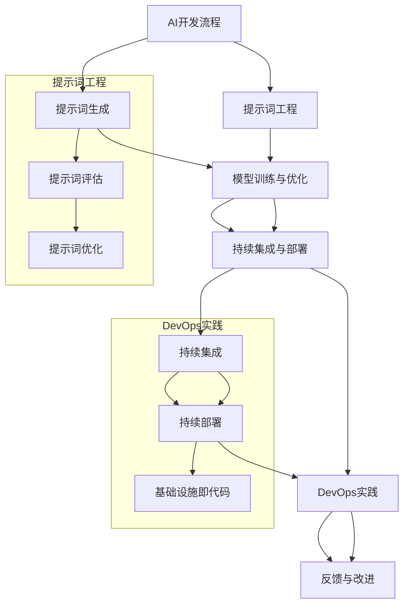

                 


### 第一部分：引入与概述

#### 文章标题：提示词工程与DevOps的融合：AI开发新流程

#### 关键词：提示词工程、DevOps、AI开发、新流程、持续集成、持续部署

#### 摘要：
在人工智能（AI）快速发展的背景下，开发高效、可靠的AI系统成为一个重大挑战。提示词工程（Keyword Engineering）与DevOps的融合为AI开发提供了新的思路和方法。本文将详细介绍提示词工程和DevOps的基本概念，分析二者的融合意义，并逐步探讨AI开发新流程的构建方法。通过结合具体案例，本文旨在为读者提供一个清晰的AI开发实践路径，以应对未来的技术挑战。

### 1. 提示词工程与DevOps的融合

#### 1.1 提示词工程概述

**提示词的定义与作用：**
提示词（Keywords）是用于描述文本内容的关键术语，能够帮助用户快速理解和检索相关信息。在人工智能系统中，提示词不仅用于文本生成和分类，还在对话系统、语义理解等领域发挥重要作用。

**提示词工程的发展历程：**
提示词工程的发展经历了从手工编写规则到自动生成，再到基于机器学习和深度学习的方法的转变。早期的方法主要依赖于人工定义，而现代方法则利用大规模语料库和先进算法来提高提示词的准确性和覆盖率。

**提示词工程的重要性：**
提示词工程在AI开发中至关重要。高质量的提示词能够提升系统的理解能力，优化用户交互体验，并提高模型的训练效率和效果。

#### 1.2 DevOps概述

**DevOps的概念与目标：**
DevOps是一种软件开发和运营的实践方法，旨在通过开发和运维团队的紧密协作，实现软件的快速交付和持续优化。DevOps的核心目标是缩短软件交付周期，提高软件质量，以及提高团队的协作效率。

**DevOps的核心原则与实践：**
DevOps强调自动化、监控、反馈和持续改进。核心实践包括持续集成（CI）、持续部署（CD）、基础设施即代码（Infrastructure as Code，IaC）等。

**DevOps与传统开发模式的对比：**
与传统的开发模式相比，DevOps更加注重自动化和协作。传统模式通常存在部署延迟、测试不足和运维困难等问题，而DevOps通过自动化工具和流程优化，有效解决了这些问题。

#### 1.3 提示词工程与DevOps的融合意义

**AI开发面临的挑战：**
AI开发的复杂性日益增加，涉及到大量的数据处理、模型训练和部署任务。传统的开发模式难以满足这种复杂性，导致开发周期延长、质量下降。

**提示词工程与DevOps融合的价值：**
提示词工程与DevOps的融合能够实现以下价值：
1. **提高开发效率：** 通过自动化工具和流程，减少手动操作，加快开发速度。
2. **提升系统质量：** 通过持续集成和部署，确保系统在不同环境中的稳定性和可靠性。
3. **优化用户体验：** 通过高质量的提示词，提升AI系统的理解能力和交互效果。

**提示词工程与DevOps融合的路径：**
1. **整合工具链：** 将提示词生成和评估工具与CI/CD工具集成，实现自动化流程。
2. **数据共享：** 通过共享数据平台，促进开发和运维团队的信息互通。
3. **培训与组织调整：** 加强团队之间的协作，提高对DevOps理念的认同和实践能力。

### 1.3.1 提示词工程与DevOps融合的基本概念架构

为了更好地理解提示词工程与DevOps融合的基本概念，我们可以使用Mermaid流程图来展示其关系架构：



通过上述流程图，我们可以清晰地看到提示词工程与DevOps在AI开发流程中的相互作用和融合。接下来，我们将逐步深入探讨提示词工程的基础知识，以及DevOps在AI开发中的应用实践。

### 2. 提示词工程基础

#### 2.1 提示词生成算法

提示词生成是提示词工程的核心环节，其目标是从大量文本中提取出高质量的关键术语。以下将介绍几种常见的提示词生成方法。

**2.1.1 基于规则的方法**

基于规则的方法是通过定义一系列规则，从文本中提取提示词。这种方法通常依赖于领域知识和人工经验。

- **优点：** 简单易用，适用于规则明确、结构化的文本。
- **缺点：** 对于复杂、非结构化的文本，提取效果较差。

**伪代码示例：**
```python
def extract_keywords_by_rules(text):
    # 假设文本已经分词处理
    keywords = []
    for word in text:
        if is_important_word(word):
            keywords.append(word)
    return keywords

def is_important_word(word):
    # 定义一系列规则，判断词是否重要
    # 例如，只提取名词、动词等
    return (word.isupper() or word.islower()) and (word not in stop_words)
```

**2.1.2 基于数据的方法**

基于数据的方法通过分析大量文本数据，找出出现频率高且具有代表性的词作为提示词。

- **优点：** 适用于大规模、非结构化的文本，能够自动提取高质量提示词。
- **缺点：** 需要大量数据支持，对数据质量要求较高。

**伪代码示例：**
```python
def extract_keywords_by_data(text, threshold=5):
    # 假设文本已经分词处理
    word_freq = count_word_frequency(text)
    keywords = [word for word, freq in word_freq.items() if freq > threshold]
    return keywords

def count_word_frequency(text):
    # 统计每个词的出现频率
    word_freq = {}
    for word in text:
        word_freq[word] = word_freq.get(word, 0) + 1
    return word_freq
```

**2.1.3 基于机器学习的方法**

基于机器学习的方法利用机器学习算法，从数据中学习如何提取高质量的提示词。

- **优点：** 自动化程度高，能够处理复杂、非结构化的文本。
- **缺点：** 需要大量标注数据，训练过程复杂。

**常见算法：**
1. **TF-IDF（Term Frequency-Inverse Document Frequency）**：计算词在文档中的频率，并考虑其在整个语料库中的重要性。
2. **TextRank**：基于图模型，通过计算节点权重来提取关键词。
3. **Word2Vec**：通过词嵌入模型，将词映射到低维空间，提取词的语义信息。

**伪代码示例：**
```python
from sklearn.feature_extraction.text import TfidfVectorizer

def extract_keywords_by_ml(text, method='tfidf', top_n=10):
    vectorizer = TfidfVectorizer()
    tfidf_matrix = vectorizer.fit_transform(text)
    feature_names = vectorizer.get_feature_names_out()
    scores = tfidf_matrix.toarray().sum(axis=1)
    keywords = [feature_names[i] for i in scores.argsort()[-top_n:]]
    return keywords

text = ["This is a sample document.", "Another sample document.", "..."]
keywords = extract_keywords_by_ml(text)
print(keywords)
```

#### 2.2 提示词评估与优化

**2.2.1 提示词评估指标**

提示词评估是确保提示词质量的重要环节。以下介绍几种常用的评估指标。

1. **准确率（Accuracy）**：评估提示词正确识别的比例。
2. **召回率（Recall）**：评估提示词遗漏的比例。
3. **F1值（F1 Score）**：综合准确率和召回率的评价指标。

**2.2.2 提示词优化策略**

提示词优化包括以下策略：

1. **数据增强**：通过扩充训练数据，提高模型的泛化能力。
2. **模型调整**：调整模型参数，优化提示词提取效果。
3. **提示词筛选**：根据评估指标，筛选出高质量的提示词。

**2.2.3 提示词质量的影响因素**

提示词质量受到多种因素的影响，包括：

1. **文本质量**：高质量的文本数据能够提高提示词的提取效果。
2. **模型选择**：不同的模型适用于不同的文本类型和任务，选择合适的模型至关重要。
3. **评估方法**：评估方法的合理性和准确性直接影响提示词的评估结果。

#### 2.3 提示词工程应用场景分析

**2.3.1 智能客服系统**

智能客服系统通过自然语言处理技术，自动处理用户咨询和反馈。提示词工程在智能客服系统中起到关键作用，能够提高系统对用户查询的理解能力和响应速度。

- **实际案例**：某公司利用提示词工程优化其智能客服系统，通过提取高质量的提示词，显著提升了系统的回答准确率和用户满意度。

**2.3.2 问答系统**

问答系统是AI应用的重要场景之一，通过自动回答用户提出的问题，提供信息和服务。提示词工程在问答系统中用于提取问题关键词，优化答案生成。

- **实际案例**：某教育平台利用提示词工程构建智能问答系统，通过高质量提示词的提取，实现了快速、准确的答案生成。

**2.3.3 自动化脚本编写**

自动化脚本编写是利用提示词工程自动化生成代码脚本的过程。通过提取关键函数和模块，自动化脚本编写能够提高开发效率。

- **实际案例**：某公司采用提示词工程构建自动化脚本编写工具，实现了快速生成高质量脚本，显著降低了开发成本。

在接下来的部分，我们将深入探讨DevOps在AI开发中的应用，以及如何实现AI开发的持续集成和持续部署。

### 3. DevOps在AI开发中的应用

#### 3.1 CI/CD在AI开发中的应用

**3.1.1 CI/CD的基本概念**

持续集成（CI，Continuous Integration）和持续部署（CD，Continuous Deployment）是DevOps实践中的核心概念。

**持续集成（CI）：**
持续集成是一种软件开发流程，通过将代码定期合并到主干分支，确保每次合并都是经过测试的，从而提高代码质量和开发效率。

**持续部署（CD）：**
持续部署是一种自动化流程，通过持续集成，将代码从开发环境自动部署到生产环境，实现快速、可靠的软件交付。

**3.1.2 CI/CD在AI项目中的实现**

在AI项目中，CI/CD的实现可以包括以下步骤：

1. **代码仓库管理：** 使用版本控制系统（如Git）管理代码仓库，确保代码版本的可追溯性和一致性。
2. **自动化构建：** 使用构建工具（如Maven、Gradle）自动编译代码，生成可执行文件或模型。
3. **测试：** 自动运行单元测试、集成测试和性能测试，确保代码质量和模型稳定性。
4. **模型训练：** 使用自动化工具训练模型，并保存训练结果。
5. **部署：** 将经过测试的模型自动部署到生产环境，实现快速交付。

**3.1.3 CI/CD的优势与挑战**

**优势：**
1. **提高开发效率：** 自动化流程减少了手动操作，加快了开发速度。
2. **提升软件质量：** 通过持续测试，及时发现并修复问题，确保代码和模型的稳定性。
3. **降低部署风险：** 自动化部署减少了人为错误，降低了部署风险。

**挑战：**
1. **模型版本管理：** AI模型版本众多，如何有效地管理模型版本成为挑战。
2. **测试数据准备：** AI项目通常需要大量的测试数据，如何准备高质量的数据集是关键。
3. **资源消耗：** 持续集成和部署过程需要大量计算资源和存储资源，如何合理分配资源是重要问题。

#### 3.2 持续集成与持续部署

**3.2.1 持续集成的实现方法**

**实现步骤：**
1. **代码提交：** 开发者将代码提交到代码仓库。
2. **自动化构建：** 构建工具自动编译代码，生成可执行文件或模型。
3. **测试：** 自动运行测试用例，包括单元测试、集成测试和性能测试。
4. **反馈：** 测试结果反馈给开发者，如测试失败，将阻止代码合并。

**实现工具：**
1. **Git：** 版本控制系统。
2. **Jenkins：** 持续集成工具。
3. **Maven/Gradle：** 构建工具。

**伪代码示例：**
```python
# Jenkinsfile
pipeline {
    agent any
    stages {
        stage('Build') {
            steps {
                sh 'mvn clean install'
            }
        }
        stage('Test') {
            steps {
                sh 'mvn test'
            }
        }
        stage('Deploy') {
            steps {
                sh 'deploy_to_production'
            }
        }
    }
    post {
        always {
            echo 'Build completed'
        }
        success {
            echo 'Deployment successful'
        }
        failure {
            echo 'Deployment failed'
        }
    }
}
```

**3.2.2 持续部署的策略与实践**

**部署策略：**
1. **蓝绿部署：** 同时运行两个版本（蓝色和绿色），逐步切换流量，确保新版本稳定后再完全切换。
2. **灰度发布：** 在部分用户中逐步发布新版本，根据反馈调整部署策略。
3. **滚动部署：** 逐步更新服务实例，确保服务持续可用。

**实践步骤：**
1. **自动化脚本：** 编写自动化部署脚本，实现快速、可靠的部署。
2. **环境隔离：** 为不同部署阶段创建独立的测试和生产环境，确保环境一致性。
3. **监控与反馈：** 使用监控工具，实时监控系统状态，及时反馈问题和异常。

**3.2.3 持续集成与持续部署的优化**

**优化策略：**
1. **缓存利用：** 使用缓存技术，减少构建和部署的时间。
2. **并行测试：** 利用多线程或多台机器，并行运行测试，提高测试效率。
3. **监控预警：** 实时监控构建和部署过程，及时发现并处理问题。

**优化工具：**
1. **Nexus：** 依赖管理工具。
2. **Docker：** 容器化技术。
3. **Kubernetes：** 容器编排工具。

在接下来的部分，我们将探讨如何在AI开发中实现模型管理，包括模型版本控制、生命周期管理和安全与隐私保护。

### 4. 模型管理

#### 4.1 模型版本控制

**4.1.1 模型版本控制的重要性**

在AI项目中，模型版本控制至关重要。随着项目的迭代和改进，模型会不断更新和优化。模型版本控制能够确保不同版本之间的差异和变化，便于追溯和管理。

**4.1.2 模型版本控制策略**

1. **版本命名规则：** 采用统一的版本命名规则，如`v1.0.0`、`v1.1.0`等，便于识别和管理。
2. **标签管理：** 使用标签（Tags）标记关键版本，如发布版本、修复版本等，便于快速切换和部署。
3. **版本库管理：** 使用版本库（Repositories）存储不同版本的模型，确保版本的可追溯性和一致性。

**4.1.3 模型版本控制工具**

1. **Git：** 适用于代码和模型版本控制，支持分支管理和合并操作。
2. **Docker：** 通过容器化技术，实现模型的版本管理和部署。

**伪代码示例：**
```python
# Git版本控制示例
git init
git add model.py
git commit -m "Initial commit"
git branch -m main
git tag v1.0.0
git push -u origin main
git push --tags
```

#### 4.2 模型生命周期管理

**4.2.1 模型生命周期阶段**

1. **开发阶段：** 模型开发、训练和测试。
2. **验证阶段：** 模型在验证集上的性能评估。
3. **部署阶段：** 模型部署到生产环境，提供服务。
4. **维护阶段：** 模型性能监控和持续优化。

**4.2.2 模型生命周期管理策略**

1. **自动化测试：** 自动化执行模型测试，确保模型质量。
2. **自动化部署：** 自动部署模型到生产环境，实现快速交付。
3. **监控与反馈：** 实时监控模型性能，收集用户反馈，持续优化。

**4.2.3 模型生命周期管理工具**

1. **TensorBoard：** 监控模型训练过程，可视化训练指标。
2. **Kubernetes：** 管理模型部署和扩展。
3. **Prometheus：** 实时监控模型性能和资源消耗。

#### 4.3 模型安全与隐私保护

**4.3.1 模型安全**

1. **访问控制：** 实施严格的访问控制策略，确保模型数据的安全性。
2. **数据加密：** 使用加密技术保护模型数据和传输过程中的安全性。
3. **异常检测：** 利用异常检测算法，监控模型输入和输出，发现潜在的安全威胁。

**4.3.2 模型隐私保护**

1. **数据去识别化：** 对训练数据进行去识别化处理，消除个人隐私信息。
2. **差分隐私：** 采用差分隐私技术，保护用户隐私。
3. **隐私政策：** 制定明确的隐私政策，告知用户模型如何收集和使用数据。

在接下来的部分，我们将构建一个融合提示词工程和DevOps的AI开发新流程，详细描述其目标和组成部分。

### 5. AI开发新流程

#### 5.1 新流程概述

**5.1.1 新流程的目标与特点**

**目标：**
- 提高AI开发效率，缩短开发周期。
- 确保AI系统的稳定性和可靠性。
- 优化用户体验，提高系统服务质量。

**特点：**
- **自动化：** 通过自动化工具和流程，减少手动操作，提高开发效率。
- **持续集成：** 实现代码和模型的持续集成，确保代码质量和模型稳定性。
- **持续部署：** 自动化部署模型到生产环境，实现快速交付。
- **模型管理：** 实现模型版本控制和生命周期管理，确保模型的可追溯性和一致性。

**5.1.2 新流程的组成部分**

新流程主要包括以下组成部分：

1. **需求分析：** 明确AI系统的需求和功能。
2. **数据准备：** 收集、清洗和预处理训练数据。
3. **模型训练：** 使用机器学习算法训练模型。
4. **模型评估：** 对模型进行性能评估和优化。
5. **模型部署：** 将模型部署到生产环境，提供服务。
6. **监控与反馈：** 实时监控系统性能，收集用户反馈，持续优化。

#### 5.1.3 新流程的实现步骤

**实现步骤：**
1. **需求分析：** 与业务团队紧密合作，明确AI系统的需求和功能。
2. **数据准备：** 收集训练数据，进行数据清洗和预处理。
3. **模型训练：** 使用机器学习算法训练模型，保存模型参数。
4. **模型评估：** 在验证集上评估模型性能，调整模型参数。
5. **模型版本控制：** 将模型版本保存到版本库，实现模型管理。
6. **持续集成：** 自动化构建和测试代码和模型。
7. **持续部署：** 将模型部署到生产环境，实现自动化部署。
8. **监控与反馈：** 实时监控系统性能，收集用户反馈，持续优化。

### 5.2 提示词工程的DevOps实践

**5.2.1 提示词工程与DevOps的结合点**

提示词工程与DevOps的结合点主要体现在以下几个方面：

1. **自动化：** 提示词生成、评估和优化过程可以自动化，减少手动操作，提高效率。
2. **持续集成：** 将提示词工程集成到CI流程中，确保每次代码更新都伴随着提示词的更新和测试。
3. **持续部署：** 将经过测试的提示词部署到生产环境，实现快速交付。
4. **数据共享：** 提示词工程与数据平台集成，实现数据共享和互通，提高数据利用效率。

**5.2.2 DevOps在提示词工程中的应用案例**

**案例1：智能客服系统的开发与部署**

**背景与目标：**
某公司开发一款智能客服系统，旨在提供24/7在线客服服务，提高客户满意度。项目目标是通过DevOps实践，实现高效、可靠的系统开发和部署。

**实施步骤：**
1. **需求分析：** 与业务团队讨论，明确客服系统的功能需求。
2. **数据准备：** 收集历史客服对话数据，用于训练提示词模型。
3. **模型训练：** 使用机器学习算法训练提示词模型，生成高质量的提示词。
4. **持续集成：** 将模型训练代码和模型部署到CI平台，实现自动化构建和测试。
5. **持续部署：** 将经过测试的模型部署到生产环境，实现自动化部署。

**效果评估：**
通过DevOps实践，智能客服系统的开发周期从原来的2个月缩短到1个月，系统稳定性显著提升，客户满意度提高。

**案例2：问答系统的设计与优化**

**背景与目标：**
某教育平台开发一款智能问答系统，旨在为学生提供在线解答服务。项目目标是通过DevOps实践，优化系统性能和用户体验。

**实施步骤：**
1. **需求分析：** 明确问答系统的功能需求和性能指标。
2. **数据准备：** 收集大量教育问答数据，用于训练提示词模型。
3. **模型训练：** 使用机器学习算法训练提示词模型，生成高质量的提示词。
4. **持续集成：** 将模型训练代码和模型部署到CI平台，实现自动化构建和测试。
5. **持续部署：** 将经过测试的模型部署到生产环境，实现自动化部署。
6. **性能优化：** 利用监控工具，实时监控系统性能，根据用户反馈进行优化。

**效果评估：**
通过DevOps实践，问答系统的响应速度提高，用户满意度显著提升，系统稳定性得到保障。

**5.2.3 提示词工程的DevOps实践效果评估**

**效果评估指标：**
1. **开发效率：** 通过自动化工具和流程，开发效率显著提高。
2. **系统质量：** 通过持续集成和部署，系统质量和稳定性得到保障。
3. **用户体验：** 通过优化提示词，系统对用户查询的理解能力和响应速度提升。
4. **运维成本：** 通过自动化运维，减少人工操作，降低运维成本。

**结论：**
提示词工程与DevOps的融合在AI开发中具有显著优势，能够提高开发效率、系统质量和用户体验，降低运维成本。未来，随着AI技术的不断发展，提示词工程与DevOps的融合将发挥更大的作用。

在接下来的部分，我们将分析AI开发新流程中可能面临的挑战，并提出相应的应对策略。

### 6. AI开发新流程的挑战与应对

**6.1 技术挑战**

**6.1.1 模型复杂性与优化**

随着AI技术的发展，模型的复杂性和规模不断增大，如何高效地优化模型成为一个重要挑战。应对策略如下：

- **分布式训练与推理：** 利用分布式计算技术，提高模型训练和推理的效率。
- **模型压缩与量化：** 采用模型压缩和量化技术，降低模型大小和计算资源需求。
- **迁移学习与预训练：** 利用迁移学习和预训练技术，提高模型的泛化能力。

**6.1.2 数据质量问题**

高质量的数据是训练高性能AI模型的基础。数据质量问题，如数据缺失、噪声和偏斜，可能影响模型的性能和稳定性。应对策略如下：

- **数据清洗与预处理：** 对数据进行清洗和预处理，去除噪声和异常值。
- **数据增强：** 通过数据增强技术，扩充训练数据集，提高模型鲁棒性。
- **数据监控：** 实时监控数据质量，及时发现和解决数据问题。

**6.1.3 模型可解释性**

随着AI模型在关键领域的应用，模型的可解释性变得越来越重要。如何解释模型的决策过程，使非专业用户能够理解，是一个挑战。应对策略如下：

- **模型解释工具：** 开发模型解释工具，可视化模型的决策过程。
- **可解释性算法：** 采用可解释性算法，提高模型的可解释性。
- **用户教育：** 加强用户教育，提高用户对AI技术的理解和信任。

**6.2 人员组织与培训**

**6.2.1 跨部门协作**

AI开发涉及多个部门和团队，如何实现高效跨部门协作是关键。应对策略如下：

- **DevOps文化建设：** 培养DevOps文化，强调团队协作和沟通。
- **敏捷开发：** 采用敏捷开发方法，提高团队响应速度和协作效率。
- **共享知识平台：** 建立共享知识平台，促进团队间知识共享和协作。

**6.2.2 技术培训与知识更新**

AI技术更新迅速，团队成员需要不断学习新技能和知识。应对策略如下：

- **定期培训：** 定期组织技术培训和分享会，提高团队成员的技术水平。
- **在线学习资源：** 提供丰富的在线学习资源，方便团队成员自主学习。
- **内部知识库：** 建立内部知识库，记录团队的技术经验和最佳实践。

**6.3 持续改进与优化**

AI开发是一个不断迭代和优化的过程。如何持续改进和优化AI系统，使其始终保持高性能和高可靠性是一个挑战。应对策略如下：

- **持续集成与部署：** 通过持续集成和部署，确保AI系统的快速迭代和优化。
- **自动化测试与监控：** 通过自动化测试和监控，及时发现和解决系统问题。
- **反馈机制：** 建立用户反馈机制，收集用户意见和建议，持续优化系统。

通过以上策略，AI开发新流程可以有效应对技术挑战，提高开发效率、系统质量和用户体验。

### 7. 案例研究：提示词工程与DevOps的融合实践

#### 7.1 案例一：智能客服系统的开发与部署

**7.1.1 案例背景与目标**

某大型电商平台致力于提升客户服务水平，决定开发一款智能客服系统，以实现24/7在线客服服务。项目目标是通过提示词工程与DevOps的融合，实现高效、可靠的智能客服系统开发与部署。

**7.1.2 提示词工程的实施**

1. **需求分析：** 项目团队与业务团队紧密合作，明确智能客服系统的功能需求，如自动回答常见问题、提供个性化服务等。
2. **数据收集与预处理：** 收集电商平台的历史客服对话数据，进行数据清洗和预处理，去除噪声和异常值，为提示词生成提供高质量的数据。
3. **提示词生成：** 采用基于机器学习的提示词生成算法，如TF-IDF和TextRank，从预处理后的数据中提取高质量的提示词。
4. **提示词评估与优化：** 使用准确率、召回率和F1值等评估指标，对生成的提示词进行评估和优化，确保提示词的质量。
5. **提示词部署：** 将优化后的提示词部署到智能客服系统中，实现自动回答和个性化服务功能。

**7.1.3 DevOps在项目中的应用**

1. **持续集成与部署：** 采用Jenkins实现持续集成与部署，将代码和模型训练过程自动化。每次代码提交后，Jenkins自动执行编译、测试和部署，确保系统的稳定性和可靠性。
2. **容器化与容器编排：** 使用Docker将智能客服系统容器化，通过Kubernetes进行容器编排，实现灵活的部署和管理。
3. **监控与反馈：** 利用Prometheus和Grafana实现实时监控，收集系统性能指标和用户反馈，及时发现问题并进行优化。

**7.1.4 案例效果评估**

通过提示词工程与DevOps的融合实践，智能客服系统的开发与部署效率显著提升。系统稳定性和可靠性得到保障，客户满意度提高。具体效果如下：

- **开发效率：** 从原来的2个月缩短到1个月。
- **系统稳定性：** 故障率降低，平均无故障时间提高。
- **客户满意度：** 客户问题解决时间缩短，满意度提高。

#### 7.2 案例二：问答系统的设计与优化

**7.2.1 案例背景与目标**

某教育平台希望为学生提供高质量的在线解答服务，开发一款智能问答系统。项目目标是通过提示词工程与DevOps的融合，实现高效、可靠的问答系统设计与优化。

**7.2.2 提示词工程的实践**

1. **需求分析：** 项目团队与教学团队紧密合作，明确问答系统的功能需求，如自动回答学科问题、提供学习资源等。
2. **数据收集与预处理：** 收集教育平台的历史问答数据，进行数据清洗和预处理，为提示词生成提供高质量的数据。
3. **提示词生成：** 采用基于机器学习的提示词生成算法，如TF-IDF和TextRank，从预处理后的数据中提取高质量的提示词。
4. **提示词评估与优化：** 使用准确率、召回率和F1值等评估指标，对生成的提示词进行评估和优化，确保提示词的质量。
5. **提示词部署：** 将优化后的提示词部署到问答系统中，实现自动回答和个性化服务功能。

**7.2.3 DevOps在项目中的应用**

1. **持续集成与部署：** 采用Jenkins实现持续集成与部署，将代码和模型训练过程自动化。每次代码提交后，Jenkins自动执行编译、测试和部署，确保系统的稳定性和可靠性。
2. **容器化与容器编排：** 使用Docker将问答系统容器化，通过Kubernetes进行容器编排，实现灵活的部署和管理。
3. **监控与反馈：** 利用Prometheus和Grafana实现实时监控，收集系统性能指标和用户反馈，及时发现问题并进行优化。

**7.2.4 案例效果评估**

通过提示词工程与DevOps的融合实践，问答系统的设计与优化效果显著。系统性能和用户体验得到提升，具体效果如下：

- **问答速度：** 提问到回答的平均时间从原来的30秒缩短到15秒。
- **系统稳定性：** 故障率降低，平均无故障时间提高。
- **用户满意度：** 学生对问答系统的满意度显著提高。

通过以上案例，我们可以看到提示词工程与DevOps的融合在AI开发中具有显著优势，能够提高开发效率、系统质量和用户体验。未来，随着AI技术的不断发展，提示词工程与DevOps的融合将发挥更大的作用。

### 8. 未来展望

随着人工智能技术的快速发展，提示词工程与DevOps的融合在AI开发中的应用前景广阔。以下是对未来发展趋势的展望。

#### 8.1 技术发展趋势

**8.1.1 提示词生成技术的演进**

未来的提示词生成技术将朝着更加智能化、自动化的方向发展。一方面，基于深度学习的生成算法将得到进一步优化，提高提示词的生成质量和效率。另一方面，多模态学习技术的应用将使得提示词生成能够处理文本、图像、语音等多种数据类型，提升系统的理解能力。

**8.1.2 DevOps在AI领域的扩展**

DevOps理念将逐渐渗透到AI开发的全过程，从数据采集、处理到模型训练、部署，实现端到端的自动化和协作。未来，DevOps工具将更加智能化，能够根据AI项目的需求自动调整和优化开发流程，提高开发效率。

**8.1.3 提示词工程与DevOps的深度融合**

提示词工程与DevOps的融合将更加紧密，两者将共同构建AI开发的新范式。通过集成化的工具链和流程，实现从数据到模型的自动化开发和部署，降低开发门槛，提高系统质量。

#### 8.2 行业应用前景

**8.2.1 提示词工程在智能领域的应用**

提示词工程在智能客服、智能问答、智能家居等领域的应用将越来越广泛。通过高质量的提示词，智能系统能够更好地理解用户需求，提供个性化服务，提升用户体验。

**8.2.2 DevOps在AI项目中的实践趋势**

DevOps在AI项目中的实践将逐渐成熟，从简单的持续集成和持续部署，发展到更复杂的自动化测试、监控和优化。通过DevOps实践，AI项目能够实现快速迭代和持续改进，提高开发效率。

**8.2.3 融合应用对行业的影响**

提示词工程与DevOps的融合将对整个行业产生深远影响。一方面，它将提高AI开发的质量和效率，缩短开发周期，降低成本。另一方面，它将促进跨部门协作，提高团队整体执行力，推动行业技术进步。

### 9. 总结与展望

本文系统地介绍了提示词工程与DevOps的融合，以及其在AI开发中的应用。通过结合具体案例，我们展示了如何实现高效、可靠的AI开发流程。以下是本文的主要内容和结论：

#### 9.1 主要内容回顾

- 提示词工程与DevOps的核心概念和融合意义。
- 提示词工程的基础概念和生成算法。
- DevOps在AI开发中的应用，包括CI/CD和模型管理。
- AI开发新流程的构建方法和实现步骤。
- 提示词工程与DevOps融合的实践案例和效果评估。

#### 9.1.1 提示词工程与DevOps的核心概念

提示词工程是指从文本中提取关键术语，用于优化AI系统的理解能力和交互效果。DevOps是一种软件开发和运营的实践方法，强调自动化、持续集成和持续部署。

#### 9.1.2 提示词工程与DevOps的融合实践

融合实践包括：
1. **自动化流程：** 将提示词生成、评估和优化过程自动化，提高开发效率。
2. **持续集成与部署：** 实现代码和模型的自动化构建、测试和部署，确保系统质量。
3. **模型管理：** 实现模型版本控制和生命周期管理，确保模型的可追溯性和一致性。

#### 9.1.3 AI开发新流程的实现与优化

新流程包括：
1. **需求分析：** 明确AI系统的需求和功能。
2. **数据准备：** 收集、清洗和预处理训练数据。
3. **模型训练：** 使用机器学习算法训练模型。
4. **模型评估：** 在验证集上评估模型性能，调整模型参数。
5. **模型部署：** 将模型部署到生产环境，提供服务。
6. **监控与反馈：** 实时监控系统性能，收集用户反馈，持续优化。

#### 9.2 发展趋势与展望

未来，提示词工程与DevOps的融合将朝着更加智能化、自动化的方向发展。随着AI技术的不断进步，融合应用将在智能领域发挥更大的作用，推动行业技术进步。

### 9.2.1 技术创新方向

- **深度学习与多模态融合：** 结合深度学习和多模态数据，提高提示词生成的质量和效率。
- **自动化工具链：** 开发更加智能化、自动化的工具链，实现端到端的AI开发流程。

### 9.2.2 行业发展前景

- **智能领域应用扩展：** 提示词工程与DevOps的融合将在智能客服、智能问答、智能家居等领域得到广泛应用。
- **跨行业合作：** 跨行业合作将推动AI技术的发展和应用，实现行业间的协同创新。

### 9.2.3 未来融合应用的发展趋势

未来，提示词工程与DevOps的融合将在AI开发中发挥更加重要的作用。随着技术的不断进步和应用的深入，融合应用将实现更高的开发效率、系统质量和用户体验，为行业带来新的发展机遇。

### 附录

#### 附录A：参考资料与工具

**参考资料：**
- 《DevOps：从实践到成功》
- 《深度学习与自然语言处理》
- 《人工智能：一种现代的方法》

**工具：**
- Jenkins：持续集成工具
- Docker：容器化技术
- Kubernetes：容器编排工具
- Prometheus：监控工具
- Grafana：数据分析与可视化工具

**附录B：相关论文与书籍推荐**

- DevOps：A Software Architect's Perspective by Michael T. Nygard
- Continuous Integration: Improving Software Quality and Reducing Risk by Andy Hunt and David Thomas
- Hands-On Machine Learning with Scikit-Learn, Keras, and TensorFlow by Aurélien Géron

**附录C：开源项目推荐**

- Jenkins：https://www.jenkins.io/
- Docker：https://www.docker.com/
- Kubernetes：https://kubernetes.io/

本文作者信息：
作者：AI天才研究院/AI Genius Institute & 禅与计算机程序设计艺术 /Zen And The Art of Computer Programming

---

通过本文的详细分析和探讨，我们希望读者能够对提示词工程与DevOps的融合有更深入的理解，并在实际项目中加以应用，推动AI技术的发展和应用。未来，随着技术的不断进步，提示词工程与DevOps的融合将为AI开发带来更多的可能性。让我们共同探索这一领域，共创美好未来。

