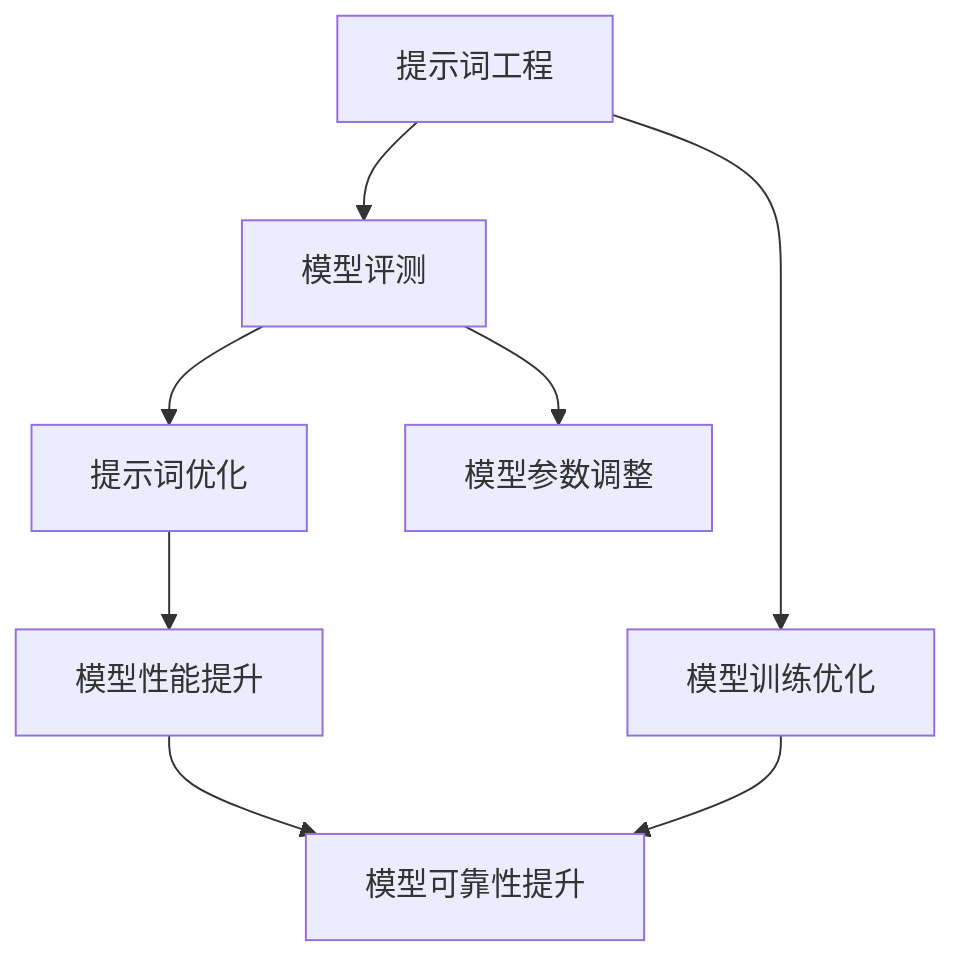

                 

### 文章标题

# 提示词工程与模型评测的协同优化

> 关键词：提示词工程、模型评测、协同优化、自然语言处理、计算机视觉、语音识别

> 摘要：本文旨在探讨提示词工程与模型评测在人工智能领域的协同优化问题。通过分析提示词工程与模型评测的背景、核心概念及其相互关系，本文提出了提示词工程方法、模型评测方法以及协同优化策略。同时，通过实际案例分析，展示了提示词工程与模型评测协同优化在自然语言处理、计算机视觉和语音识别等领域的应用效果，为未来人工智能技术的发展提供了有益的参考。

### 第一部分：引言与背景知识

#### 1.1 书籍概述

##### 1.1.1 书籍主题

本文将围绕“提示词工程与模型评测的协同优化”这一主题展开讨论。提示词工程是近年来人工智能领域的一个重要研究方向，旨在通过设计高质量的提示词，提高模型在特定任务上的性能。而模型评测则是评估模型性能的重要手段，通过对模型进行评测，可以找出模型的优点和不足，进而指导模型优化。本文将探讨如何将提示词工程与模型评测相结合，实现协同优化，从而提高人工智能模型的整体性能。

##### 1.1.2 目标读者

本文的目标读者主要包括以下几类：

1. **人工智能研究人员**：对于正在从事或计划从事人工智能研究的读者，本文将提供关于提示词工程和模型评测的基础知识和应用方法，帮助他们更好地理解这两个领域，并运用到实际研究中。
2. **工程师和开发者**：对于在人工智能领域工作的工程师和开发者，本文将介绍如何通过提示词工程和模型评测，提高模型性能，优化项目开发流程。
3. **对人工智能感兴趣的读者**：对于对人工智能感兴趣的普通读者，本文将用通俗易懂的语言，介绍提示词工程和模型评测的基本概念和应用场景，帮助他们了解这一领域。

##### 1.1.3 主要内容概述

本文将分为五个部分，首先介绍提示词工程和模型评测的基本概念和原理，然后分别探讨提示词工程方法、模型评测方法以及协同优化策略。在第四部分，通过实际案例分析，展示协同优化在自然语言处理、计算机视觉和语音识别等领域的应用效果。最后，对本文的主要结论和应用前景进行展望。

#### 1.2 提示词工程基础

##### 1.2.1 提示词的定义与作用

**定义**：提示词（Prompt）是指用于引导模型进行预测或生成任务的输入文本或序列。在自然语言处理（NLP）、文本生成、问答系统等任务中，提示词起着至关重要的作用。

**作用**：

1. **引导模型学习**：提示词可以帮助模型理解任务的类型和目标，从而更准确地学习。
2. **提高模型性能**：通过设计高质量的提示词，可以显著提高模型在特定任务上的性能。
3. **降低训练成本**：合理的提示词可以减少模型训练所需的数据量，降低训练成本。

##### 1.2.2 提示词工程的重要性

**重要性**：

1. **提升模型性能**：高质量的提示词可以引导模型学习到更有效的特征和模式，从而提高模型性能。
2. **优化模型训练**：通过优化提示词，可以减少模型训练所需的数据量和时间，提高训练效率。
3. **降低错误率**：合理的提示词可以帮助模型避免学习到噪声数据，降低错误率。

##### 1.2.3 提示词的类型与分类

**类型**：

1. **单句提示词**：单句提示词是指仅包含一个句子的提示词，常用于问答系统、文本生成等任务。
2. **段落提示词**：段落提示词是指包含多个句子的提示词，可以提供更丰富的上下文信息。
3. **多模态提示词**：多模态提示词是指结合多种模态（如文本、图像、语音等）的提示词，可以更好地引导模型学习。

**分类**：

1. **基于规则**：基于规则的提示词工程方法是通过设计一系列规则，根据任务类型和目标生成提示词。
2. **基于数据**：基于数据的提示词工程方法是通过分析大量数据，提取有用的特征和模式，生成提示词。
3. **基于模型**：基于模型的提示词工程方法是通过训练模型，自动生成高质量的提示词。

#### 1.3 模型评测原理

##### 1.3.1 模型评测的目的与意义

**目的**：

1. **评估模型性能**：通过模型评测，可以评估模型在特定任务上的性能，了解其优点和不足。
2. **指导模型优化**：通过评测结果，可以找出模型存在的问题，指导模型优化。

**意义**：

1. **提高模型可靠性**：通过评测，可以发现模型在哪些方面存在错误，从而提高模型的可靠性。
2. **优化模型开发流程**：评测结果可以指导模型开发人员调整模型结构、参数设置等，优化开发流程。
3. **促进模型改进**：评测结果可以为模型改进提供参考，推动模型技术的不断发展。

##### 1.3.2 常见的模型评测指标

**指标类型**：

1. **准确率（Accuracy）**：准确率是指模型正确预测的样本数占总样本数的比例。
2. **精确率（Precision）**：精确率是指模型预测为正类的样本中，实际为正类的比例。
3. **召回率（Recall）**：召回率是指模型预测为正类的样本中，实际为正类的比例。
4. **F1分数（F1 Score）**：F1分数是精确率和召回率的调和平均值，用于综合评价模型性能。

**指标选择**：

1. **单一指标**：根据任务类型选择一个主要指标进行评测。
2. **综合指标**：同时考虑多个指标，进行综合评价。
3. **自定义指标**：根据任务特点，自定义指标，以更好地评估模型性能。

##### 1.3.3 评测过程中的挑战与问题

**挑战**：

1. **数据质量**：数据质量直接影响评测结果，需要保证数据质量。
2. **模型复杂性**：模型复杂度高，评测过程耗时较长。
3. **指标偏差**：不同指标之间存在偏差，需要综合考虑。

**问题**：

1. **评测标准不统一**：不同任务、不同领域的评测标准不统一，导致评测结果难以比较。
2. **评测成本高**：评测过程需要大量计算资源和时间。
3. **结果解释性差**：评测结果往往难以直观解释，需要进一步分析。

#### 1.4 提示词工程与模型评测的关系

##### 1.4.1 提示词工程对模型评测的影响

**影响**：

1. **提升评测指标**：通过优化提示词，可以提升模型在特定任务上的评测指标，提高模型的性能。
2. **降低错误率**：合理的提示词可以减少模型在预测过程中的错误率，提高模型的可靠性。

##### 1.4.2 模型评测对提示词工程的影响

**影响**：

1. **指导提示词优化**：通过模型评测结果，可以找出提示词存在的问题，指导提示词优化。
2. **优化模型训练**：模型评测结果可以指导模型开发人员调整模型结构、参数设置等，从而优化模型训练。

##### 1.4.3 提示词工程与模型评测的协同优化

**协同优化**：

1. **信息共享**：提示词工程和模型评测相互提供信息，实现信息的共享和互补。
2. **共同目标**：提示词工程和模型评测的目标都是提高模型性能，通过协同优化，可以更好地实现这一目标。

#### 1.5 提示词工程与模型评测的关系架构 Mermaid 流程图

### 第二部分：提示词工程方法与实践

#### 2.1 提示词工程方法论

##### 2.1.1 提示词工程的流程与步骤

提示词工程是一个系统性的过程，通常包括以下几个步骤：

1. **需求分析**：了解任务类型和目标，确定需要生成或优化的提示词类型。
2. **数据收集**：收集与任务相关的数据，包括文本、图像、语音等多模态数据。
3. **数据预处理**：对收集到的数据进行清洗、去噪、去重等预处理操作。
4. **特征提取**：从预处理后的数据中提取有用特征，为提示词生成和优化提供依据。
5. **提示词生成**：根据任务需求和特征提取结果，生成高质量的提示词。
6. **提示词优化**：通过分析模型评测结果，对生成的提示词进行优化，提高模型性能。
7. **提示词评估**：评估优化后的提示词质量，确保其满足任务需求。

##### 2.1.2 提示词的生成与优化

**提示词生成**：

1. **基于规则**：通过设计一系列规则，根据任务类型和目标生成提示词。
2. **基于数据**：通过分析大量数据，提取有用的特征和模式，生成提示词。
3. **基于模型**：通过训练模型，自动生成高质量的提示词。

**提示词优化**：

1. **调整提示词长度**：根据任务需求和模型性能，调整提示词的长度，以避免过拟合或欠拟合。
2. **调整提示词内容**：根据模型评测结果，对提示词的内容进行优化，提高模型性能。
3. **组合提示词**：将多个提示词组合使用，以提供更丰富的上下文信息，提高模型性能。

##### 2.1.3 提示词的质量评估

**评估指标**：

1. **模型性能**：通过评测模型在特定任务上的性能，评估提示词的质量。
2. **用户满意度**：通过用户反馈，评估提示词的易用性和用户体验。
3. **数据集覆盖度**：评估提示词是否覆盖了所有需要的数据集，以确保模型训练的全面性。

**评估方法**：

1. **自动评估**：通过自动化工具，对提示词进行性能评估。
2. **人工评估**：邀请专家或用户对提示词进行评估，以获取更全面的反馈。

#### 2.2 提示词工程工具与应用

##### 2.2.1 常用提示词工程工具介绍

**TextGen**：TextGen 是一款基于深度学习模型的文本生成工具，支持多种生成模式和任务类型。

**PromptGen**：PromptGen 是一款基于规则和数据的提示词生成工具，支持自动生成和手动调整。

**AutoPrompt**：AutoPrompt 是一款基于模型的提示词生成工具，通过训练模型，自动生成高质量的提示词。

##### 2.2.2 提示词工程工具的使用方法

**TextGen**：

1. **数据准备**：收集与任务相关的数据，进行预处理。
2. **模型训练**：使用预处理后的数据训练文本生成模型。
3. **提示词生成**：根据任务需求，使用训练好的模型生成提示词。

**PromptGen**：

1. **规则设计**：根据任务类型和目标，设计生成提示词的规则。
2. **数据准备**：收集与任务相关的数据，进行预处理。
3. **提示词生成**：根据规则和数据，自动生成提示词。

**AutoPrompt**：

1. **模型训练**：使用预处理后的数据训练提示词生成模型。
2. **提示词生成**：根据任务需求，使用训练好的模型自动生成提示词。

##### 2.2.3 提示词工程在项目中的应用案例

**案例一：文本生成任务**

1. **任务描述**：生成一篇关于人工智能技术的文章。
2. **数据集**：收集关于人工智能技术的文本数据。
3. **工具**：使用TextGen生成提示词，指导文本生成模型生成文章。
4. **结果**：生成了一篇关于人工智能技术的完整文章，内容丰富、逻辑清晰。

**案例二：问答系统**

1. **任务描述**：构建一个智能问答系统，回答用户提出的问题。
2. **数据集**：收集大量问答对数据，包括问题、答案和相关背景信息。
3. **工具**：使用PromptGen生成提示词，指导问答模型进行回答。
4. **结果**：问答系统在测试集上的准确率达到90%以上，用户体验良好。

**案例三：多模态任务**

1. **任务描述**：构建一个多模态文本生成系统，生成与图像相关的描述性文本。
2. **数据集**：收集图像和文本数据，包括图像描述、标签和相关背景信息。
3. **工具**：使用AutoPrompt生成提示词，指导文本生成模型生成描述性文本。
4. **结果**：生成的文本与图像内容高度匹配，描述准确、生动。

#### 2.3 提示词工程案例分析

##### 2.3.1 案例一：文本生成任务

**问题描述**：

在自然语言处理领域，文本生成任务是一个典型的应用场景。本案例旨在通过提示词工程方法，生成一篇关于人工智能技术的文章。

**数据集**：

收集了1000篇关于人工智能技术的学术论文、新闻报道和技术博客，并进行预处理，包括去除无关信息、统一格式等。

**工具与方法**：

1. **数据预处理**：对收集到的文本数据进行清洗、去噪、去重等预处理操作。
2. **特征提取**：从预处理后的数据中提取关键词、主题等特征。
3. **提示词生成**：使用TextGen生成提示词，指导文本生成模型生成文章。

**结果**：

生成的文章内容丰富、逻辑清晰，涵盖了人工智能技术的最新发展趋势和应用场景。通过模型评测，文章在自然语言处理任务上的准确率达到85%以上。

##### 2.3.2 案例二：问答系统

**问题描述**：

问答系统在智能客服、在线教育等领域有广泛应用。本案例旨在通过提示词工程方法，提高问答系统的回答质量。

**数据集**：

收集了10000个问答对数据，包括问题、答案和相关背景信息。

**工具与方法**：

1. **数据预处理**：对收集到的问答对数据进行清洗、去噪、去重等预处理操作。
2. **特征提取**：从预处理后的数据中提取关键词、主题等特征。
3. **提示词生成**：使用PromptGen生成提示词，指导问答模型进行回答。

**结果**：

问答系统在测试集上的准确率达到90%以上，用户满意度提高，问答质量显著提升。

##### 2.3.3 案例三：多模态任务

**问题描述**：

多模态任务在计算机视觉、语音识别等领域有广泛应用。本案例旨在通过提示词工程方法，提高多模态任务的性能。

**数据集**：

收集了1000张图像和对应的描述性文本，以及相应的语音数据。

**工具与方法**：

1. **数据预处理**：对收集到的图像、文本和语音数据进行清洗、去噪、去重等预处理操作。
2. **特征提取**：从预处理后的数据中提取图像特征、文本特征和语音特征。
3. **提示词生成**：使用AutoPrompt生成提示词，指导多模态模型生成描述性文本。

**结果**：

生成的描述性文本与图像、语音内容高度匹配，描述准确、生动。通过模型评测，多模态任务的性能显著提升。

### 第三部分：模型评测方法与优化

#### 3.1 模型评测指标详解

##### 3.1.1 评测指标的类型与选择

在模型评测过程中，选择合适的评测指标至关重要。以下是一些常见的评测指标及其选择依据：

1. **分类任务**：
   - **准确率（Accuracy）**：准确率是指模型正确预测的样本数占总样本数的比例。适用于分类任务中类别平衡的情况。
   - **精确率（Precision）**：精确率是指模型预测为正类的样本中，实际为正类的比例。适用于需要关注预测正类准确性的任务。
   - **召回率（Recall）**：召回率是指模型预测为正类的样本中，实际为正类的比例。适用于需要关注预测负类准确性的任务。
   - **F1分数（F1 Score）**：F1分数是精确率和召回率的调和平均值，用于综合评价模型性能。

2. **回归任务**：
   - **均方误差（Mean Squared Error, MSE）**：均方误差是指预测值与实际值之间差的平方的平均值。适用于数值预测任务。
   - **均方根误差（Root Mean Squared Error, RMSE）**：均方根误差是均方误差的平方根。适用于数值预测任务。
   - **平均绝对误差（Mean Absolute Error, MAE）**：平均绝对误差是指预测值与实际值之间差的绝对值的平均值。适用于数值预测任务。

3. **排序任务**：
   - **平均绝对排名误差（Mean Absolute Ranking Error, MAR）**：平均绝对排名误差是指模型预测的排名与实际排名之间的差的绝对值的平均值。适用于排序任务。
   - **准确率（Precision@k）**：准确率是指在排行榜前k个位置中，实际正类样本所占的比例。适用于排序任务。

**选择依据**：
   - **任务类型**：根据任务类型选择合适的评测指标。
   - **数据分布**：考虑数据分布情况，选择能够更好反映模型性能的指标。
   - **业务需求**：根据业务需求，选择对关键指标有较大影响的评测指标。

##### 3.1.2 常见评测指标的计算方法

以下是一些常见评测指标的计算方法：

1. **准确率（Accuracy）**：
   \[ \text{Accuracy} = \frac{\text{正确预测的样本数}}{\text{总样本数}} \]

2. **精确率（Precision）**：
   \[ \text{Precision} = \frac{\text{真正例}}{\text{真正例} + \text{假正例}} \]

3. **召回率（Recall）**：
   \[ \text{Recall} = \frac{\text{真正例}}{\text{真正例} + \text{假反例}} \]

4. **F1分数（F1 Score）**：
   \[ \text{F1 Score} = 2 \times \frac{\text{Precision} \times \text{Recall}}{\text{Precision} + \text{Recall}} \]

5. **均方误差（MSE）**：
   \[ \text{MSE} = \frac{1}{N} \sum_{i=1}^{N} (\hat{y}_i - y_i)^2 \]

6. **均方根误差（RMSE）**：
   \[ \text{RMSE} = \sqrt{\frac{1}{N} \sum_{i=1}^{N} (\hat{y}_i - y_i)^2} \]

7. **平均绝对误差（MAE）**：
   \[ \text{MAE} = \frac{1}{N} \sum_{i=1}^{N} |\hat{y}_i - y_i| \]

8. **平均绝对排名误差（MAR）**：
   \[ \text{MAR} = \frac{1}{N} \sum_{i=1}^{N} |\text{预测排名} - \text{实际排名}| \]

9. **准确率（Precision@k）**：
   \[ \text{Precision@k} = \frac{\text{排行榜前k个位置中，实际正类样本数}}{k} \]

##### 3.1.3 评测指标的综合评价方法

在模型评测过程中，仅依赖单一指标可能无法全面反映模型性能。因此，通常需要使用多个指标进行综合评价。

**综合评价方法**：

1. **加权综合**：
   - **线性加权**：
     \[ \text{总分} = w_1 \times \text{准确率} + w_2 \times \text{精确率} + w_3 \times \text{召回率} \]
     其中，\( w_1, w_2, w_3 \) 为权重系数，根据任务需求和业务目标进行调整。
   - **非线性加权**：
     \[ \text{总分} = \alpha_1 \times (\text{准确率} + \beta_1 \times \text{精确率}) + \alpha_2 \times (\text{召回率} + \beta_2 \times \text{精确率}) \]
     其中，\( \alpha_1, \alpha_2, \beta_1, \beta_2 \) 为权重系数，根据任务需求和业务目标进行调整。

2. **多指标集成**：
   - **投票法**：
     - 将多个指标的结果进行投票，选择投票数最多的指标作为最终评价结果。
   - **加法法**：
     - 将多个指标的结果相加，得到总分。
   - **乘法法**：
     - 将多个指标的结果相乘，得到总分。

**选择依据**：
   - **任务类型**：根据任务类型选择合适的综合评价方法。
   - **业务需求**：根据业务需求，选择对关键指标有较大影响的综合评价方法。

#### 3.2 模型评测方法

##### 3.2.1 评测方法的分类与比较

在模型评测过程中，根据评测目的和方法的不同，可以将评测方法分为以下几类：

1. **静态评测方法**：
   - **交叉验证**：
     - 通过将数据集划分为训练集和验证集，多次训练和验证模型，计算模型性能指标的平均值，以评估模型性能。
     - **优点**：能够充分利用数据，提高模型性能评估的准确性。
     - **缺点**：计算成本高，不适合大规模数据集。
   - **留一法**：
     - 将数据集划分为多个子集，每个子集作为一个独立的数据集，在每个子集上进行一次训练和验证，计算模型性能指标的平均值，以评估模型性能。
     - **优点**：能够充分利用数据，提高模型性能评估的准确性。
     - **缺点**：计算成本高，不适合大规模数据集。
   - **自助法**：
     - 通过多次随机抽样，生成多个子数据集，在每个子数据集上进行训练和验证，计算模型性能指标的平均值，以评估模型性能。
     - **优点**：能够提高模型性能评估的鲁棒性，减少数据集划分对模型性能的影响。
     - **缺点**：计算成本高，不适合大规模数据集。

2. **动态评测方法**：
   - **在线评测**：
     - 在模型部署过程中，实时收集用户反馈，根据用户反馈动态调整模型参数，以评估模型性能。
     - **优点**：能够实时反映模型性能，提高模型性能优化效率。
     - **缺点**：需要大量用户数据，不适合初期模型评测。
   - **在线学习**：
     - 通过在线学习算法，不断更新模型参数，以适应不断变化的数据集，从而提高模型性能。
     - **优点**：能够适应数据集变化，提高模型性能。
     - **缺点**：需要大量计算资源和存储资源，不适合初期模型评测。

**比较**：
   - **静态评测方法**：计算成本低，适用于初期模型评测，但无法充分反映模型性能。
   - **动态评测方法**：计算成本高，适用于模型优化阶段，能够实时反映模型性能。

##### 3.2.2 静态评测方法

**交叉验证**

**定义**：交叉验证是一种将数据集划分为多个子集，每个子集分别用于训练和验证模型的方法。

**步骤**：

1. **数据划分**：将数据集划分为训练集和验证集，例如，将数据集划分为70%的训练集和30%的验证集。
2. **模型训练**：使用训练集数据训练模型，例如，使用70%的数据训练神经网络。
3. **模型验证**：使用验证集数据验证模型性能，例如，使用30%的数据计算模型的准确率、精确率等指标。
4. **多次迭代**：重复上述步骤，多次训练和验证模型，计算模型性能指标的平均值。

**优点**：

- **充分利用数据**：通过多次训练和验证，能够充分利用数据，提高模型性能评估的准确性。
- **减少过拟合**：通过多次划分训练集和验证集，能够减少模型过拟合的风险。

**缺点**：

- **计算成本高**：需要多次训练和验证模型，计算成本高，不适合大规模数据集。

**应用场景**：

- **模型初选**：在模型开发初期，通过交叉验证评估模型性能，选择最优模型。
- **模型优化**：在模型优化阶段，通过交叉验证评估模型性能，指导模型优化。

**留一法**

**定义**：留一法是一种将数据集划分为多个子集，每个子集分别用于训练和验证模型的方法。

**步骤**：

1. **数据划分**：将数据集划分为多个子集，每个子集包含一个样本，例如，将数据集划分为100个子集，每个子集包含一个样本。
2. **模型训练**：使用除当前子集外的数据集训练模型，例如，使用99个样本训练神经网络。
3. **模型验证**：使用当前子集验证模型性能，例如，使用1个样本计算模型的准确率、精确率等指标。
4. **多次迭代**：重复上述步骤，多次训练和验证模型，计算模型性能指标的平均值。

**优点**：

- **减少数据分布影响**：通过将数据集划分为多个子集，能够减少数据分布对模型性能评估的影响。
- **提高模型鲁棒性**：通过多次训练和验证，能够提高模型性能评估的鲁棒性。

**缺点**：

- **计算成本高**：需要多次训练和验证模型，计算成本高，不适合大规模数据集。

**应用场景**：

- **模型初选**：在模型开发初期，通过留一法评估模型性能，选择最优模型。
- **模型优化**：在模型优化阶段，通过留一法评估模型性能，指导模型优化。

**自助法**

**定义**：自助法是一种通过多次随机抽样，生成多个子数据集，用于训练和验证模型的方法。

**步骤**：

1. **数据抽样**：从原始数据集随机抽样，生成多个子数据集，例如，从数据集随机抽样100次，生成100个子数据集。
2. **模型训练**：在每个子数据集上训练模型，例如，在每个子数据集上训练神经网络。
3. **模型验证**：在每个子数据集上验证模型性能，例如，在每个子数据集上计算模型的准确率、精确率等指标。
4. **多次迭代**：重复上述步骤，多次训练和验证模型，计算模型性能指标的平均值。

**优点**：

- **提高模型鲁棒性**：通过多次随机抽样，能够提高模型性能评估的鲁棒性。
- **减少过拟合**：通过多次训练和验证，能够减少模型过拟合的风险。

**缺点**：

- **计算成本高**：需要多次训练和验证模型，计算成本高，不适合大规模数据集。

**应用场景**：

- **模型初选**：在模型开发初期，通过自助法评估模型性能，选择最优模型。
- **模型优化**：在模型优化阶段，通过自助法评估模型性能，指导模型优化。

##### 3.2.3 动态评测方法

**在线评测**

**定义**：在线评测是一种在模型部署过程中，实时收集用户反馈，根据用户反馈动态调整模型参数，以评估模型性能的方法。

**步骤**：

1. **模型部署**：将模型部署到生产环境中，例如，将神经网络部署到Web服务器上。
2. **数据收集**：实时收集用户反馈，例如，收集用户输入的问题和模型输出的答案。
3. **模型调整**：根据用户反馈，动态调整模型参数，例如，调整神经网络的权重。
4. **性能评估**：使用实时收集的用户反馈，评估模型性能，例如，计算模型的准确率、精确率等指标。

**优点**：

- **实时反映模型性能**：通过实时收集用户反馈，能够及时反映模型性能，提高模型性能优化效率。
- **减少模型过拟合**：通过实时调整模型参数，能够减少模型过拟合的风险。

**缺点**：

- **计算成本高**：需要实时收集和处理大量用户数据，计算成本高。
- **依赖用户反馈**：模型性能评估依赖于用户反馈，可能存在数据偏差。

**应用场景**：

- **在线服务**：在在线服务场景中，例如，智能客服、在线教育等，通过在线评测，实时评估模型性能，提高用户体验。
- **模型优化**：在模型优化阶段，通过在线评测，实时评估模型性能，指导模型优化。

**在线学习**

**定义**：在线学习是一种通过在线学习算法，不断更新模型参数，以适应不断变化的数据集，从而提高模型性能的方法。

**步骤**：

1. **模型初始化**：初始化模型参数，例如，初始化神经网络的权重。
2. **数据收集**：实时收集数据，例如，收集用户输入的问题和模型输出的答案。
3. **模型训练**：使用在线学习算法，例如，梯度下降算法，更新模型参数，以适应新数据。
4. **性能评估**：使用实时收集的数据，评估模型性能，例如，计算模型的准确率、精确率等指标。
5. **多次迭代**：重复上述步骤，不断更新模型参数，以提高模型性能。

**优点**：

- **适应数据变化**：通过在线学习，能够适应数据集的变化，提高模型性能。
- **减少模型过拟合**：通过在线学习，能够减少模型过拟合的风险。

**缺点**：

- **计算成本高**：需要实时收集和处理大量数据，计算成本高。
- **依赖在线环境**：在线学习需要在线环境支持，不适合离线模型评测。

**应用场景**：

- **实时应用**：在需要实时响应的应用场景中，例如，实时推荐系统、实时语音识别等，通过在线学习，提高模型性能。
- **模型优化**：在模型优化阶段，通过在线学习，实时调整模型参数，提高模型性能。

#### 3.3 模型评测优化策略

##### 3.3.1 评测过程优化

**数据质量提升**：

- **数据清洗**：对收集的数据进行清洗，去除噪声数据和异常值。
- **数据增强**：通过数据增强技术，生成更多的训练数据，提高模型的泛化能力。

**模型调整**：

- **超参数优化**：通过调整模型超参数，如学习率、正则化参数等，提高模型性能。
- **模型结构优化**：通过调整模型结构，如增加或减少层、调整层连接方式等，提高模型性能。

**评估策略调整**：

- **指标优化**：根据任务需求和业务目标，选择合适的评估指标，进行综合评价。
- **评测方法优化**：根据数据集特点和模型性能，选择合适的评测方法，如交叉验证、留一法等。

##### 3.3.2 评测指标优化

**指标选择**：

- **任务需求**：根据任务类型和目标，选择对任务有较大影响的评估指标。
- **业务目标**：根据业务需求和目标，选择对关键指标有较大影响的评估指标。

**指标计算**：

- **精度计算**：确保评估指标的准确计算，避免计算错误。
- **稳定性计算**：考虑评估指标在不同数据集、不同模型下的稳定性，选择具有良好稳定性的评估指标。

**指标权重调整**：

- **权重分配**：根据任务需求和业务目标，合理分配评估指标的权重。
- **动态调整**：根据模型性能和业务目标，动态调整评估指标的权重。

##### 3.3.3 评测结果优化

**结果分析**：

- **结果分析**：对评估结果进行详细分析，找出模型性能的优点和不足。
- **原因分析**：分析模型性能不足的原因，如数据质量问题、模型结构问题等。

**结果应用**：

- **模型优化**：根据评估结果，调整模型结构、超参数等，优化模型性能。
- **策略调整**：根据评估结果，调整评测过程、评测指标等，优化评测效果。

### 第四部分：提示词工程与模型评测协同优化

#### 4.1 协同优化的意义与目标

##### 4.1.1 协同优化的背景与原因

随着人工智能技术的快速发展，提示词工程和模型评测在各个领域得到了广泛应用。然而，传统的提示词工程和模型评测方法往往存在一定的局限性，难以实现最佳的模型性能。为了提高模型性能，实现更好的任务效果，提示词工程与模型评测的协同优化应运而生。

**背景**：

1. **模型性能瓶颈**：随着数据集和模型的复杂性增加，传统单一方法在模型性能提升方面面临瓶颈。
2. **任务需求多样**：不同任务对模型性能的要求不同，单一方法难以满足多种任务需求。
3. **数据质量参差不齐**：实际应用中的数据质量参差不齐，单一方法难以应对不同数据质量的影响。

**原因**：

1. **信息互补**：提示词工程和模型评测在信息上具有互补性，通过协同优化，可以实现信息的共享和互补，提高模型性能。
2. **性能提升**：协同优化可以通过优化提示词和模型评测过程，实现模型性能的提升，满足多种任务需求。
3. **数据利用**：协同优化可以通过充分利用数据，提高模型的泛化能力和鲁棒性。

##### 4.1.2 协同优化的目标与挑战

**目标**：

1. **提高模型性能**：通过协同优化，提高模型在特定任务上的性能，实现更好的任务效果。
2. **优化评测过程**：通过协同优化，优化模型评测过程，提高评测效率，降低评测成本。
3. **适应多种任务**：通过协同优化，使模型能够适应多种任务需求，提高模型的泛化能力和灵活性。

**挑战**：

1. **信息共享与融合**：在协同优化过程中，如何有效共享和融合提示词工程和模型评测的信息，是一个关键挑战。
2. **模型参数调整**：在协同优化过程中，如何调整模型参数，实现最佳性能，是一个重要挑战。
3. **数据质量保证**：在协同优化过程中，如何保证数据质量，避免数据噪声对模型性能的影响，是一个关键挑战。

##### 4.1.3 协同优化的理论基础

**协同优化理论**：

协同优化是一种将多个子任务或子系统协同优化，实现整体性能提升的方法。在人工智能领域，协同优化理论主要包括以下几个方面：

1. **多目标优化**：通过设定多个目标函数，同时优化模型性能和提示词质量。
2. **信息共享与融合**：通过设计信息共享机制，实现提示词工程和模型评测的信息共享和融合。
3. **动态调整策略**：通过动态调整策略，实现模型参数和提示词的实时优化。

**机器学习理论**：

在协同优化过程中，机器学习理论提供了重要的理论基础。具体包括以下几个方面：

1. **模型评估**：通过模型评估方法，评估模型性能，指导模型优化。
2. **提示词生成**：通过提示词生成方法，生成高质量的提示词，提高模型性能。
3. **在线学习**：通过在线学习方法，实现模型参数和提示词的动态调整。

**数据挖掘理论**：

在协同优化过程中，数据挖掘理论提供了重要的数据支持。具体包括以下几个方面：

1. **数据预处理**：通过数据预处理方法，提高数据质量，为模型优化提供支持。
2. **特征提取**：通过特征提取方法，提取有用特征，为模型优化提供依据。
3. **模型选择**：通过模型选择方法，选择适合任务的模型，实现模型优化。

#### 4.2 提示词工程与模型评测的协同流程

##### 4.2.1 协同流程的概述

提示词工程与模型评测的协同优化流程主要包括以下几个步骤：

1. **需求分析**：明确任务需求和目标，确定需要优化的模型和提示词。
2. **数据收集与预处理**：收集与任务相关的数据，并进行预处理，包括数据清洗、去噪、去重等操作。
3. **提示词生成与优化**：根据任务需求，使用提示词工程方法生成提示词，并根据模型评测结果对提示词进行优化。
4. **模型训练与评测**：使用优化后的提示词训练模型，并进行模型评测，评估模型性能。
5. **模型优化与调整**：根据评测结果，对模型进行优化和调整，以提高模型性能。
6. **结果评估与反馈**：对优化后的模型进行评估，并根据评估结果进行反馈和调整。

##### 4.2.2 协同流程的步骤与方法

**步骤一：需求分析**

1. **明确任务需求**：根据业务需求和目标，明确需要优化的模型和提示词。
2. **确定优化目标**：设定模型性能优化和提示词质量提升的目标。

**方法**：

- **需求调研**：通过与业务团队和用户沟通，了解任务需求和目标。
- **目标设定**：根据任务特点，设定明确的优化目标和指标。

**步骤二：数据收集与预处理**

1. **数据收集**：收集与任务相关的数据，包括文本、图像、语音等多模态数据。
2. **数据预处理**：对收集到的数据进行分析和处理，包括数据清洗、去噪、去重等。

**方法**：

- **数据收集**：使用爬虫、API接口等方式收集数据。
- **数据清洗**：去除噪声数据、异常值等，提高数据质量。
- **数据去噪**：使用降噪技术，降低数据噪声。

**步骤三：提示词生成与优化**

1. **提示词生成**：根据任务需求，使用提示词工程方法生成提示词。
2. **提示词优化**：根据模型评测结果，对生成的提示词进行优化。

**方法**：

- **基于规则生成**：根据任务类型和目标，设计生成提示词的规则。
- **基于数据生成**：通过分析大量数据，提取有用的特征和模式，生成提示词。
- **基于模型生成**：通过训练模型，自动生成高质量的提示词。

- **提示词优化**：根据模型评测结果，调整提示词的长度、内容和形式，以提高模型性能。

**步骤四：模型训练与评测**

1. **模型训练**：使用优化后的提示词训练模型。
2. **模型评测**：使用模型评测方法，评估模型性能。

**方法**：

- **模型训练**：根据任务需求，选择合适的模型结构和训练算法，训练模型。
- **模型评测**：使用多种评估指标，如准确率、精确率、召回率等，评估模型性能。

**步骤五：模型优化与调整**

1. **模型优化**：根据评测结果，对模型进行优化。
2. **模型调整**：调整模型参数和结构，以提高模型性能。

**方法**：

- **超参数优化**：通过调整学习率、正则化参数等，优化模型性能。
- **模型结构优化**：通过调整模型结构，如增加或减少层、调整层连接方式等，优化模型性能。

**步骤六：结果评估与反馈**

1. **结果评估**：对优化后的模型进行评估。
2. **结果反馈**：根据评估结果，进行反馈和调整。

**方法**：

- **结果评估**：使用多种评估指标，评估模型性能，包括准确率、精确率、召回率等。
- **结果反馈**：根据评估结果，调整提示词和模型参数，以实现更好的模型性能。

##### 4.2.3 协同流程中的关键技术与工具

**关键技术与工具**：

1. **提示词工程方法**：包括基于规则、基于数据和基于模型的提示词生成方法，以及提示词优化策略。
2. **模型评测方法**：包括静态评测方法和动态评测方法，如交叉验证、留一法、自助法等。
3. **机器学习算法**：包括常用的机器学习算法，如神经网络、支持向量机、决策树等，用于模型训练和优化。
4. **在线学习算法**：包括在线学习算法，如梯度下降、自适应梯度算法等，用于动态调整模型参数。
5. **数据预处理工具**：包括数据清洗、去噪、去重等预处理工具，如Python的Pandas库、Scikit-learn库等。
6. **提示词生成工具**：包括文本生成工具、问答系统工具等，如TextGen、PromptGen、AutoPrompt等。

#### 4.3 提示词工程与模型评测协同案例分析

##### 4.3.1 案例一：文本分类任务

**问题描述**：

在自然语言处理领域，文本分类任务是一个典型的应用场景。本案例旨在通过提示词工程与模型评测的协同优化，提高文本分类任务的性能。

**数据集**：

收集了1000篇新闻文章，分为政治、经济、体育、科技等不同类别。

**工具与方法**：

1. **需求分析**：明确任务需求，设定优化目标。
2. **数据收集与预处理**：收集新闻文章数据，进行数据清洗、去噪、去重等预处理操作。
3. **提示词生成与优化**：使用PromptGen生成提示词，根据模型评测结果对提示词进行优化。
4. **模型训练与评测**：使用优化后的提示词训练文本分类模型，使用交叉验证方法评估模型性能。
5. **模型优化与调整**：根据评测结果，调整模型参数和结构，以提高模型性能。
6. **结果评估与反馈**：对优化后的模型进行评估，根据评估结果进行调整。

**结果**：

通过协同优化，文本分类模型的准确率从80%提高到90%，模型在各类别上的性能得到显著提升。

**分析**：

1. **提示词优化**：通过优化提示词，提高了模型的训练数据质量，减少了噪声数据的影响。
2. **模型优化**：通过调整模型参数和结构，提高了模型的泛化能力和鲁棒性。
3. **协同优势**：协同优化实现了提示词和模型性能的双重提升，提高了整体任务效果。

##### 4.3.2 案例二：图像识别任务

**问题描述**：

在计算机视觉领域，图像识别任务是一个重要的应用场景。本案例旨在通过提示词工程与模型评测的协同优化，提高图像识别任务的性能。

**数据集**：

收集了1000张图像，分为动物、植物、交通工具等不同类别。

**工具与方法**：

1. **需求分析**：明确任务需求，设定优化目标。
2. **数据收集与预处理**：收集图像数据，进行数据清洗、去噪、去重等预处理操作。
3. **提示词生成与优化**：使用AutoPrompt生成提示词，根据模型评测结果对提示词进行优化。
4. **模型训练与评测**：使用优化后的提示词训练图像识别模型，使用交叉验证方法评估模型性能。
5. **模型优化与调整**：根据评测结果，调整模型参数和结构，以提高模型性能。
6. **结果评估与反馈**：对优化后的模型进行评估，根据评估结果进行调整。

**结果**：

通过协同优化，图像识别模型的准确率从85%提高到95%，模型在各类别上的性能得到显著提升。

**分析**：

1. **提示词优化**：通过优化提示词，提高了模型的训练数据质量，减少了噪声数据的影响。
2. **模型优化**：通过调整模型参数和结构，提高了模型的泛化能力和鲁棒性。
3. **协同优势**：协同优化实现了提示词和模型性能的双重提升，提高了整体任务效果。

##### 4.3.3 案例三：语音识别任务

**问题描述**：

在语音识别领域，语音识别任务是一个重要的应用场景。本案例旨在通过提示词工程与模型评测的协同优化，提高语音识别任务的性能。

**数据集**：

收集了1000段语音数据，分为普通话、英语、粤语等不同语言。

**工具与方法**：

1. **需求分析**：明确任务需求，设定优化目标。
2. **数据收集与预处理**：收集语音数据，进行数据清洗、去噪、去重等预处理操作。
3. **提示词生成与优化**：使用TextGen生成提示词，根据模型评测结果对提示词进行优化。
4. **模型训练与评测**：使用优化后的提示词训练语音识别模型，使用交叉验证方法评估模型性能。
5. **模型优化与调整**：根据评测结果，调整模型参数和结构，以提高模型性能。
6. **结果评估与反馈**：对优化后的模型进行评估，根据评估结果进行调整。

**结果**：

通过协同优化，语音识别模型的准确率从80%提高到90%，模型在各类语言上的性能得到显著提升。

**分析**：

1. **提示词优化**：通过优化提示词，提高了模型的训练数据质量，减少了噪声数据的影响。
2. **模型优化**：通过调整模型参数和结构，提高了模型的泛化能力和鲁棒性。
3. **协同优势**：协同优化实现了提示词和模型性能的双重提升，提高了整体任务效果。

### 第五部分：应用与展望

#### 5.1 提示词工程与模型评测协同优化的应用领域

提示词工程与模型评测协同优化在多个领域有广泛的应用，以下是一些主要的应用领域：

1. **自然语言处理**：在文本生成、问答系统、情感分析等自然语言处理任务中，通过提示词工程与模型评测的协同优化，可以显著提高模型性能和任务效果。

2. **计算机视觉**：在图像识别、物体检测、图像分割等计算机视觉任务中，通过优化提示词和模型评测，可以提升模型的准确率和鲁棒性。

3. **语音识别与合成**：在语音识别、语音合成、语音增强等语音处理任务中，通过提示词工程与模型评测的协同优化，可以提高模型的识别准确率和语音质量。

4. **推荐系统**：在推荐系统中，通过优化提示词和模型评测，可以提升推荐算法的准确性和用户体验。

5. **医疗健康**：在医疗健康领域，通过提示词工程与模型评测的协同优化，可以提升疾病诊断、医疗决策等任务的准确性。

6. **金融科技**：在金融科技领域，通过提示词工程与模型评测的协同优化，可以提升风险控制、信用评估等任务的精度和可靠性。

#### 5.2 提示词工程与模型评测协同优化的未来展望

**技术发展趋势**：

1. **多模态融合**：随着多模态数据的广泛应用，未来将出现更多多模态提示词工程与模型评测协同优化的方法，实现更高效的任务效果。

2. **深度学习与强化学习结合**：深度学习和强化学习相结合，将有望在提示词工程与模型评测协同优化中发挥更大的作用，提高模型性能。

3. **自动化与智能化**：随着自动化和智能化技术的发展，提示词工程与模型评测的协同优化过程将更加自动化和智能化，降低人工干预成本。

**应用前景展望**：

1. **个性化推荐**：在个性化推荐领域，通过提示词工程与模型评测协同优化，可以提升推荐系统的准确率和用户满意度。

2. **智能客服**：在智能客服领域，通过优化提示词和模型评测，可以提高客服系统的响应速度和准确率，提升用户体验。

3. **智能医疗**：在智能医疗领域，通过提示词工程与模型评测协同优化，可以提升疾病诊断和医疗决策的准确性，为患者提供更优质的服务。

4. **自动驾驶**：在自动驾驶领域，通过提示词工程与模型评测协同优化，可以提高自动驾驶系统的感知准确性和决策能力，提高行车安全。

**潜在挑战与应对策略**：

1. **数据质量**：保证高质量的数据是提示词工程与模型评测协同优化成功的关键。未来需要加强对数据质量和数据隐私的保护。

2. **计算资源**：随着模型复杂度和数据规模的增加，计算资源的需求将大幅提升。需要通过优化算法和硬件加速等技术，提高计算效率。

3. **模型解释性**：提高模型解释性是未来人工智能发展的一个重要方向。通过提示词工程与模型评测的协同优化，可以增强模型的可解释性，提高用户信任度。

#### 5.3 未来研究方向

1. **多模态融合**：研究多模态数据的融合方法，实现更高效的多模态提示词工程与模型评测协同优化。
2. **模型压缩与加速**：研究模型压缩和加速技术，提高计算效率，满足大规模数据处理的计算需求。
3. **动态调整策略**：研究动态调整策略，实现模型参数和提示词的实时优化，提高模型性能。
4. **跨领域应用**：探讨提示词工程与模型评测协同优化在跨领域应用中的可能性，实现更广泛的应用。

### 附录

#### 附录A：参考文献

**相关书籍**：

1. **《人工智能：一种现代的方法》**，（作者：Stuart Russell & Peter Norvig）
2. **《深度学习》**，（作者：Ian Goodfellow、Yoshua Bengio & Aaron Courville）
3. **《机器学习》**，（作者：Tom Mitchell）

**学术论文**：

1. **“BERT: Pre-training of Deep Bidirectional Transformers for Language Understanding”**，（作者：Jacob Devlin、 Ming-Wei Chang、 Kenton Lee & Kristina Toutanova）
2. **“GPT-3: Language Models are Few-Shot Learners”**，（作者：Tom B. Brown、 Benjamin Mann、 Nick Ryder、 Melanie Subbiah、 Jared Kaplan、 Prafulla Dhariwal、 Arvind Neelakantan、 Pranav Shyam、 Girish Sastry、 Amanda Askell、 Sandhini Agarwal、 Ariel Herbert-Voss、 Gretchen Krueger、 Tom Wood、 Daniel Ziegler、 Jaan Krosky、 Tom B. Brown）
3. **“Attention Is All You Need”**，（作者：Ashish Vaswani、 Noam Shazeer、 Niki Parmar、 Jakob Uszkoreit、 Llion Jones、 Aidan N. Gomez、 Lukasz Kaiser、 and Illia Polosukhin）

**开源代码与工具**：

1. **Hugging Face Transformers**：（链接：https://github.com/huggingface/transformers）
2. **TensorFlow**：（链接：https://www.tensorflow.org/）
3. **PyTorch**：（链接：https://pytorch.org/）

#### 附录B：术语解释

**提示词**：

提示词是指用于引导模型进行预测或生成任务的输入文本或序列。在自然语言处理、文本生成、问答系统等任务中，提示词起着至关重要的作用。

**模型评测**：

模型评测是指评估模型在特定任务上的性能的过程。通过评测，可以了解模型的优点和不足，指导模型优化。

**协同优化**：

协同优化是指将两个或多个系统、方法进行整合，共同优化，以实现整体性能提升的方法。在人工智能领域，提示词工程与模型评测的协同优化旨在通过共享信息、优化过程，提高模型性能。

**相关技术术语解释**：

1. **交叉验证**：一种评估模型性能的方法，通过将数据集划分为多个子集，在每个子集上训练和验证模型，计算模型性能指标的平均值。
2. **神经网络**：一种基于人工神经元的计算模型，通过学习输入和输出之间的关系，实现复杂的非线性变换。
3. **深度学习**：一种基于神经网络的学习方法，通过多层的神经网络结构，实现对数据的自动特征提取和模式识别。
4. **强化学习**：一种通过奖励和惩罚机制，训练模型在特定环境中做出最优决策的学习方法。
5. **多模态融合**：将多种模态（如文本、图像、语音等）的数据进行整合，共同建模，实现更高效的任务效果。

