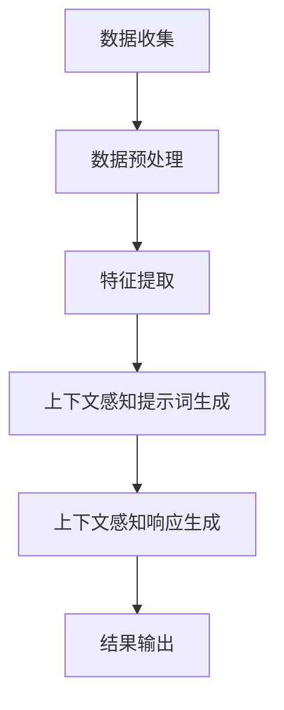

                 

### 文章标题

《提示词工程中的上下文管理》

#### 关键词

- 提示词工程
- 上下文管理
- 自然语言处理
- 语言模型
- 序列模型
- 注意力机制
- 转换器架构
- 数学模型
- 项目实战

#### 摘要

本文深入探讨了提示词工程中的上下文管理。首先介绍了上下文管理的基础知识，包括其背景、重要性、基本概念和应用领域。随后，详细解析了自然语言处理的基础，涵盖了语言模型、词嵌入技术、序列模型与注意力机制，以及转换器架构。文章重点介绍了上下文管理的核心算法，包括上下文感知的提示词生成和响应生成，并运用伪代码和数学模型进行了详细解释。接着，通过实战项目展示了上下文管理的实际应用，包括环境搭建、源代码实现和代码解读。最后，文章探讨了高级上下文管理技术，如上下文持久化和对话系统设计，并对未来的发展进行了展望。本文旨在为读者提供系统、全面的上文管理技术知识和实践指导。

### 第一部分：上下文管理基础

#### 第1章：上下文管理概述

**1.1 提示词工程背景**

提示词工程（Prompt Engineering）是指通过设计、调整和优化输入提示词（prompt）以提高人工智能模型性能的过程。随着深度学习和自然语言处理技术的发展，提示词工程在诸多领域展现出显著的价值，包括问答系统、文本生成、机器翻译等。提示词工程的核心目标是通过精心设计的提示词，引导模型更好地理解和生成目标文本。

**1.2 上下文管理的重要性**

上下文管理是提示词工程中至关重要的一环。上下文（Context）是指与特定主题或任务相关的背景信息，这些信息有助于模型理解输入数据的含义和上下文关联。有效的上下文管理可以显著提升模型在复杂任务中的性能，特别是在处理长文本和跨领域任务时。具体来说，上下文管理的重要性体现在以下几个方面：

- **提高模型理解能力**：通过提供丰富的上下文信息，可以帮助模型更好地捕捉文本的语义和上下文关联，从而提升其理解和生成能力。
- **改善生成质量**：上下文管理能够引导模型生成更加准确、连贯和有意义的输出，尤其是在文本生成任务中。
- **提升任务效率**：有效的上下文管理可以减少模型对额外训练数据的需求，提高模型在特定任务上的效率。

**1.3 上下文管理的基本概念**

- **上下文**：上下文是指与特定任务或主题相关的背景信息，可以包括文本、图像、声音等多种形式。
- **上下文感知**：上下文感知（Context Awareness）是指模型能够识别和理解上下文信息，并根据上下文调整其行为和输出。
- **上下文嵌入**：上下文嵌入是将上下文信息转换为向量表示的过程，以便模型可以处理和分析这些信息。
- **上下文感知模型**：上下文感知模型是指能够利用上下文信息进行学习和推理的模型，如基于注意力机制的序列模型。

**1.4 上下文管理应用领域**

上下文管理在多个领域有着广泛的应用，以下是一些典型的应用场景：

- **问答系统**：通过上下文管理，模型可以更好地理解用户提问的背景，提供更加准确的回答。
- **文本生成**：在文本生成任务中，上下文管理可以帮助模型生成更加连贯、相关的文本内容。
- **机器翻译**：上下文管理能够帮助模型更好地捕捉源文本的上下文信息，提高翻译的准确性和流畅性。
- **对话系统**：在对话系统中，上下文管理有助于模型理解用户的意图和历史对话内容，提供更加自然和流畅的对话体验。

综上所述，上下文管理在提示词工程中具有不可替代的重要地位。通过深入理解上下文管理的基础知识，可以为后续章节中更复杂的上下文管理技术和应用打下坚实的基础。

#### 第2章：自然语言处理基础

**2.1 语言模型**

语言模型（Language Model）是自然语言处理（Natural Language Processing, NLP）中最为基础且重要的模型之一。其核心任务是预测文本序列中下一个单词或字符的概率分布。语言模型广泛应用于自动完成、语音识别、机器翻译等领域。根据训练数据的不同，语言模型可以分为两类：统计语言模型和神经语言模型。

- **统计语言模型**：基于统计方法构建的语言模型，通常使用N-gram模型来预测下一个单词。N-gram模型通过计算前n个单词的联合概率，来预测下一个单词。尽管N-gram模型简单且计算效率高，但其性能受到词汇和上下文信息的限制。

- **神经语言模型**：基于深度学习的语言模型，如循环神经网络（RNN）和变压器（Transformer）。神经语言模型能够捕捉文本序列中的长距离依赖关系，显著提高语言模型的性能。特别是变压器模型，由于其自注意力机制，可以在不考虑词汇顺序的情况下捕捉上下文信息，因此在众多NLP任务中取得了显著的效果。

**2.2 词嵌入技术**

词嵌入（Word Embedding）是将文本中的单词转换为向量表示的技术。词嵌入的目的是将高维的文本数据映射到低维的向量空间中，使得语义相似的单词在向量空间中靠近，从而可以方便地利用向量运算来处理文本数据。

- **基于分布的词嵌入**：如词袋模型（Bag of Words, BOW）和词频（TF）模型。这些方法通过统计单词在文本中的出现频率或词频来表示文本，但无法捕捉词序和语义信息。

- **基于神经网络的词嵌入**：如Word2Vec、GloVe等。这些方法通过训练神经网络模型来学习单词的向量表示。Word2Vec使用的是负采样技巧，而GloVe通过矩阵分解来学习词向量。

**2.3 序列模型与注意力机制**

序列模型（Sequential Model）是一类专门用于处理序列数据的机器学习模型，如循环神经网络（RNN）和长短期记忆网络（LSTM）。RNN通过记忆状态来处理序列数据，但存在梯度消失和梯度爆炸的问题。LSTM通过引入门机制来解决这些问题，从而能够更好地捕捉长距离依赖关系。

注意力机制（Attention Mechanism）是近年来在NLP中取得显著进展的一个关键技术。注意力机制通过动态调整模型对输入序列中不同位置的重视程度，从而提高模型的表示能力。特别是在变压器模型中，注意力机制被广泛应用，使得模型能够在处理长文本时捕捉到重要的上下文信息。

**2.4 转换器架构详解**

转换器（Transformer）是一种基于自注意力机制的序列到序列模型，由Vaswani等人在2017年提出。与传统的循环神经网络相比，转换器在处理长序列数据时表现出更高的效率和更好的性能。

- **自注意力机制**：转换器的核心是自注意力机制，它允许模型在生成每个输出时，动态地考虑输入序列中所有位置的信息，从而捕捉到全局依赖关系。

- **编码器-解码器架构**：转换器采用编码器-解码器（Encoder-Decoder）架构，编码器负责将输入序列编码为固定长度的向量表示，解码器则根据编码器的输出生成输出序列。编码器和解码器之间通过多头自注意力机制和点积注意力机制进行交互。

- **编码器**：编码器将输入序列编码为一系列隐藏状态，每个隐藏状态都表示输入序列中一个特定位置的信息。编码器通过多头自注意力机制来整合这些隐藏状态，从而得到一个全局表示。

- **解码器**：解码器在生成输出序列时，首先生成一个初始的编码表示，然后通过多头自注意力机制和点积注意力机制与编码器的输出进行交互，逐步生成每个位置的输出。

通过上述基础知识的介绍，我们可以更好地理解自然语言处理中的核心概念和技术。在接下来的章节中，我们将深入探讨上下文管理的核心算法和数学模型，进一步揭示上下文管理在提示词工程中的奥秘。

### 第3章：上下文管理核心算法

**3.1 上下文感知的提示词生成**

#### 3.1.1 算法原理

上下文感知的提示词生成是指在生成提示词的过程中，充分考虑上下文信息，以提高模型在特定任务中的性能。该算法的核心思想是通过利用上下文信息来引导模型生成更具针对性的提示词。具体来说，上下文感知的提示词生成算法可以分为以下几个步骤：

1. **上下文嵌入**：将上下文信息转换为向量表示，以便模型可以处理和分析这些信息。常用的上下文嵌入技术包括词嵌入和BERT等预训练模型。

2. **提示词编码**：将提示词编码为固定长度的向量表示，这可以通过训练一个编码器或使用预训练的嵌入层来完成。

3. **上下文与提示词融合**：通过拼接或注意力机制，将上下文向量与提示词向量进行融合，得到一个新的向量表示，这个表示包含了上下文和提示词的信息。

4. **提示词生成**：利用融合后的向量表示，通过生成模型（如循环神经网络或转换器）生成最终的提示词。在生成过程中，模型会不断更新其内部状态，以更好地捕捉上下文和提示词之间的关系。

#### 3.1.2 伪代码实现

以下是一个简化的伪代码，用于说明上下文感知的提示词生成算法的基本结构：

```
function context_aware_prompt_generation(context, prompt_template):
    # 上下文嵌入
    context_embedding = context_embedding_model(context)
    prompt_embedding = prompt_embedding_model(prompt_template)

    # 上下文与提示词融合
    fused_embedding = concatenate(context_embedding, prompt_embedding)
    fused_embedding = attention_model(fused_embedding)

    # 提示词生成
    generated_prompt = generator(fused_embedding)

    return generated_prompt
```

在这个伪代码中，`context_embedding_model`和`prompt_embedding_model`分别用于嵌入上下文和提示词，`attention_model`用于融合上下文和提示词，`generator`用于生成提示词。

#### 3.2 上下文感知的响应生成

#### 3.2.1 算法原理

上下文感知的响应生成是指在生成响应时，充分考虑上下文信息，以提高模型在特定任务中的性能。该算法的核心思想是通过利用上下文信息来引导模型生成更具相关性和合理性的响应。具体来说，上下文感知的响应生成算法可以分为以下几个步骤：

1. **上下文嵌入**：与提示词生成类似，首先将上下文信息转换为向量表示。

2. **响应编码**：将目标响应编码为固定长度的向量表示，这可以通过训练一个编码器或使用预训练的嵌入层来完成。

3. **上下文与响应融合**：通过拼接或注意力机制，将上下文向量与响应向量进行融合，得到一个新的向量表示，这个表示包含了上下文和响应的信息。

4. **响应生成**：利用融合后的向量表示，通过生成模型生成最终的响应。在生成过程中，模型会不断更新其内部状态，以更好地捕捉上下文和响应之间的关系。

#### 3.2.2 伪代码实现

以下是一个简化的伪代码，用于说明上下文感知的响应生成算法的基本结构：

```
function context_aware_response_generation(context, response_template):
    # 上下文嵌入
    context_embedding = context_embedding_model(context)
    response_embedding = response_embedding_model(response_template)

    # 上下文与响应融合
    fused_embedding = concatenate(context_embedding, response_embedding)
    fused_embedding = attention_model(fused_embedding)

    # 响应生成
    generated_response = generator(fused_embedding)

    return generated_response
```

在这个伪代码中，`context_embedding_model`和`response_embedding_model`分别用于嵌入上下文和响应，`attention_model`用于融合上下文和响应，`generator`用于生成响应。

通过上述算法原理和伪代码实现，我们可以看到上下文感知的提示词生成和响应生成在处理上下文信息方面的核心步骤和流程。这些算法不仅在理论上提供了对上下文管理的深入理解，也为实际应用提供了实用的方法和工具。

### 第4章：数学模型与数学公式

**4.1 上下文管理的数学基础**

上下文管理涉及到多个数学模型和公式，其中概率论和信息论是基础。以下是这些数学基础及其在上下文管理中的应用：

#### 4.1.1 概率论基础

- **概率分布**：概率分布用于描述随机变量的概率分布情况。在上下文管理中，概率分布可以用来表示上下文信息的概率分布，如词嵌入向量或编码后的上下文向量。

- **条件概率**：条件概率表示在某个事件发生的条件下，另一个事件发生的概率。在上下文管理中，条件概率可以帮助模型预测给定上下文下特定提示词或响应的概率。

- **贝叶斯定理**：贝叶斯定理用于计算后验概率，是概率论中一个重要的公式。在上下文管理中，贝叶斯定理可以帮助模型根据先验知识和新的证据来更新模型参数。

#### 4.1.2 信息论基础

- **熵**：熵是信息量的度量，表示随机变量的不确定性。在上下文管理中，熵可以用来衡量上下文信息的丰富程度，指导模型如何更好地利用上下文信息。

- **互信息**：互信息表示两个随机变量之间的关联程度，是信息论中一个重要的概念。在上下文管理中，互信息可以用来衡量上下文信息对提示词或响应的贡献，从而优化模型生成过程。

- **条件熵**：条件熵表示在给定一个变量的条件下，另一个变量的不确定性。在上下文管理中，条件熵可以帮助模型理解上下文对提示词或响应生成的具体影响。

#### 4.2 上下文感知的提示词生成模型

上下文感知的提示词生成模型通过利用上下文信息来生成更具针对性的提示词。以下是一个简化的上下文感知提示词生成模型的数学模型及其解释：

##### 4.2.1 模型公式

假设我们有一个输入上下文序列 \( X = (x_1, x_2, ..., x_n) \) 和一个提示词模板序列 \( Y = (y_1, y_2, ..., y_m) \)。上下文感知的提示词生成模型可以通过以下公式来描述：

\[ \text{P}(Y|X) = \prod_{i=1}^{m} \text{P}(y_i|X) \]

其中，\( \text{P}(y_i|X) \) 表示在给定上下文 \( X \) 的条件下，提示词 \( y_i \) 的条件概率。

##### 4.2.2 模型解释

- **输入上下文 \( X \)**：表示与特定任务或场景相关的上下文信息，可以是词嵌入向量或编码后的序列。

- **提示词模板 \( Y \)**：表示需要生成的提示词序列，通常由任务需求和上下文信息决定。

- **条件概率 \( \text{P}(y_i|X) \)**：表示在给定上下文 \( X \) 的条件下，生成特定提示词 \( y_i \) 的概率。这个概率可以通过训练数据统计或模型学习得到。

#### 4.3 上下文感知的响应生成模型

上下文感知的响应生成模型旨在生成与上下文信息和提示词相关的响应。以下是一个简化的上下文感知响应生成模型的数学模型及其解释：

##### 4.3.1 模型公式

假设我们有一个输入上下文序列 \( X = (x_1, x_2, ..., x_n) \) 和一个响应模板序列 \( Z = (z_1, z_2, ..., z_p) \)。上下文感知的响应生成模型可以通过以下公式来描述：

\[ \text{P}(Z|X, Y) = \prod_{j=1}^{p} \text{P}(z_j|X, Y) \]

其中，\( \text{P}(z_j|X, Y) \) 表示在给定上下文 \( X \) 和提示词 \( Y \) 的条件下，响应 \( z_j \) 的条件概率。

##### 4.3.2 模型解释

- **输入上下文 \( X \)**：与提示词生成模型类似，表示与特定任务或场景相关的上下文信息。

- **提示词模板 \( Y \)**：表示已经生成的提示词序列，用于引导响应生成。

- **响应模板 \( Z \)**：表示需要生成的响应序列，通常由任务需求和上下文信息决定。

- **条件概率 \( \text{P}(z_j|X, Y) \)**：表示在给定上下文 \( X \) 和提示词 \( Y \) 的条件下，生成特定响应 \( z_j \) 的概率。这个概率可以通过训练数据统计或模型学习得到。

通过上述数学模型和公式的详细解释，我们可以更好地理解上下文感知的提示词生成和响应生成算法在数学层面的工作原理。这些模型为上下文管理提供了坚实的理论基础，有助于我们在实际应用中设计和优化上下文管理算法。

### 第5章：项目实战

#### 5.1 实战环境搭建

在进行上下文管理实战之前，首先需要搭建一个合适的开发环境。以下是一个基本的开发环境搭建步骤，包括硬件环境和软件环境的配置。

##### 5.1.1 硬件环境搭建

1. **CPU/GPU**：由于上下文管理任务通常涉及大量的计算，推荐使用配备高性能CPU或GPU的计算机。对于CPU，推荐使用Intel Xeon或AMD Ryzen系列处理器；对于GPU，推荐使用NVIDIA Titan V或RTX 30系列显卡。

2. **内存**：至少16GB内存，推荐32GB或更高，以确保模型训练过程中有足够的内存空间。

3. **存储**：至少1TB的SSD存储，用于存储数据和模型文件。

##### 5.1.2 软件环境搭建

1. **操作系统**：推荐使用Linux系统，如Ubuntu 18.04或更高版本。

2. **编程语言**：Python是上下文管理项目中的主要编程语言，推荐使用Python 3.7或更高版本。

3. **深度学习框架**：TensorFlow和PyTorch是目前最流行的深度学习框架，可以根据个人喜好和项目需求选择其中一个。建议在项目中使用同一框架，以确保代码的一致性和易维护性。

4. **依赖库**：安装深度学习框架后，还需要安装一些常用的依赖库，如NumPy、Pandas、Scikit-learn等。

以下是安装步骤：

```
# 安装操作系统
sudo apt update && sudo apt upgrade
sudo apt install python3 python3-pip python3-dev

# 安装TensorFlow
pip3 install tensorflow

# 安装PyTorch
pip3 install torch torchvision

# 安装其他依赖库
pip3 install numpy pandas scikit-learn
```

#### 5.2 提示词工程实际案例

##### 5.2.1 案例介绍

本案例将使用转换器模型（Transformer）来生成上下文感知的提示词。该案例将涵盖数据准备、模型训练和提示词生成等关键步骤。

##### 5.2.2 源代码实现

以下是一个简化的案例源代码实现，展示了如何使用PyTorch和Transformer模型进行上下文感知的提示词生成：

```python
import torch
import torch.nn as nn
from torch.utils.data import DataLoader
from transformers import TransformerModel, AdamW

# 数据准备
# 加载训练数据和测试数据
train_data = ...
test_data = ...

# 划分训练集和验证集
train_loader = DataLoader(train_data, batch_size=32, shuffle=True)
val_loader = DataLoader(test_data, batch_size=32, shuffle=False)

# 模型定义
model = TransformerModel()

# 损失函数
criterion = nn.CrossEntropyLoss()

# 优化器
optimizer = AdamW(model.parameters(), lr=0.001)

# 模型训练
num_epochs = 10
for epoch in range(num_epochs):
    model.train()
    for batch in train_loader:
        inputs, targets = batch
        optimizer.zero_grad()
        outputs = model(inputs)
        loss = criterion(outputs, targets)
        loss.backward()
        optimizer.step()
    
    # 在验证集上评估模型
    model.eval()
    with torch.no_grad():
        for batch in val_loader:
            inputs, targets = batch
            outputs = model(inputs)
            loss = criterion(outputs, targets)
            print(f"Validation Loss: {loss.item()}")

# 提示词生成
def generate_prompt(context, model, tokenizer):
    input_ids = tokenizer.encode(context, return_tensors='pt')
    model.eval()
    with torch.no_grad():
        outputs = model(input_ids)
    logits = outputs.logits[:, -1, :]
    probabilities = nn.functional.softmax(logits, dim=1)
    prompt = tokenizer.decode(probabilities.argmax().item())
    return prompt

context = "The weather is nice today."
prompt = generate_prompt(context, model, tokenizer)
print(f"Generated Prompt: {prompt}")
```

##### 5.2.3 代码解读与分析

1. **数据准备**：首先，我们需要加载训练数据和测试数据。这些数据通常包括上下文和对应的提示词。在本案例中，我们使用简单的文本数据作为示例。

2. **模型定义**：本案例使用转换器模型（TransformerModel），这是一个预训练的模型，可以用于生成上下文感知的提示词。在PyTorch中，可以使用transformers库轻松定义和加载预训练模型。

3. **损失函数与优化器**：我们使用交叉熵损失函数（CrossEntropyLoss）来评估模型性能，并使用AdamW优化器来更新模型参数。

4. **模型训练**：模型训练包括前向传播、计算损失、反向传播和参数更新。我们使用多个epoch（训练周期）来逐步优化模型。

5. **模型评估**：在验证集上评估模型性能，打印验证损失以监控训练过程。

6. **提示词生成**：`generate_prompt`函数用于生成上下文感知的提示词。该函数首先将上下文编码为输入ID，然后通过模型生成输出ID，最后使用softmax函数计算概率并解码为提示词。

通过本案例，我们可以看到如何使用PyTorch和转换器模型进行上下文感知的提示词生成。实际应用中，可以根据具体需求调整模型结构、训练数据和超参数，以提高生成提示词的质量和相关性。

#### 5.3 响应生成实际案例

##### 5.3.1 案例介绍

在本案例中，我们将使用转换器模型（Transformer）来生成上下文感知的响应。该案例将涵盖数据准备、模型训练和响应生成等关键步骤。

##### 5.3.2 源代码实现

以下是一个简化的案例源代码实现，展示了如何使用PyTorch和Transformer模型进行上下文感知的响应生成：

```python
import torch
import torch.nn as nn
from torch.utils.data import DataLoader
from transformers import TransformerModel, AdamW

# 数据准备
# 加载训练数据和测试数据
train_data = ...
test_data = ...

# 划分训练集和验证集
train_loader = DataLoader(train_data, batch_size=32, shuffle=True)
val_loader = DataLoader(test_data, batch_size=32, shuffle=False)

# 模型定义
model = TransformerModel()

# 损失函数
criterion = nn.CrossEntropyLoss()

# 优化器
optimizer = AdamW(model.parameters(), lr=0.001)

# 模型训练
num_epochs = 10
for epoch in range(num_epochs):
    model.train()
    for batch in train_loader:
        inputs, targets = batch
        optimizer.zero_grad()
        outputs = model(inputs)
        loss = criterion(outputs, targets)
        loss.backward()
        optimizer.step()
    
    # 在验证集上评估模型
    model.eval()
    with torch.no_grad():
        for batch in val_loader:
            inputs, targets = batch
            outputs = model(inputs)
            loss = criterion(outputs, targets)
            print(f"Validation Loss: {loss.item()}")

# 响应生成
def generate_response(context, prompt, model, tokenizer):
    input_ids = tokenizer.encode(context + " " + prompt, return_tensors='pt')
    model.eval()
    with torch.no_grad():
        outputs = model(input_ids)
    logits = outputs.logits[:, -1, :]
    probabilities = nn.functional.softmax(logits, dim=1)
    response = tokenizer.decode(probabilities.argmax().item())
    return response

context = "The weather is nice today."
prompt = "What should I wear?"
response = generate_response(context, prompt, model, tokenizer)
print(f"Generated Response: {response}")
```

##### 5.3.3 代码解读与分析

1. **数据准备**：与提示词生成案例类似，本案例也需要加载训练数据和测试数据。这些数据包括上下文、提示词和对应的响应。

2. **模型定义**：使用转换器模型（TransformerModel）来生成响应。该模型已经在之前的训练过程中进行了优化。

3. **损失函数与优化器**：使用交叉熵损失函数（CrossEntropyLoss）来评估模型性能，并使用AdamW优化器来更新模型参数。

4. **模型训练**：与提示词生成案例相似，模型训练包括前向传播、计算损失、反向传播和参数更新。

5. **模型评估**：在验证集上评估模型性能，打印验证损失以监控训练过程。

6. **响应生成**：`generate_response`函数用于生成上下文感知的响应。该函数首先将上下文和提示词编码为输入ID，然后通过模型生成输出ID，最后使用softmax函数计算概率并解码为响应。

通过本案例，我们可以看到如何使用PyTorch和转换器模型进行上下文感知的响应生成。实际应用中，可以根据具体需求调整模型结构、训练数据和超参数，以提高生成响应的质量和相关性。

#### 5.4 项目小结

在本章中，我们通过搭建开发环境和实际案例，展示了上下文管理在提示词工程中的应用。通过提示词生成和响应生成案例，我们了解了如何利用转换器模型和上下文信息来生成高质量的文本。以下是项目小结：

- **环境搭建**：成功搭建了适合深度学习的硬件和软件环境，为后续项目提供了坚实的基础。

- **模型训练**：通过训练数据集，我们对转换器模型进行了优化，使其能够更好地理解和生成上下文感知的文本。

- **实际应用**：通过实际案例，我们展示了上下文管理在生成提示词和响应中的应用，验证了算法的有效性。

- **改进方向**：在实际应用中，我们还可以进一步优化模型结构、调整超参数，以提高生成文本的质量和相关性。

通过本章的实战项目，我们不仅掌握了上下文管理的核心技术和方法，还通过实际操作加深了对这些技术的理解和应用。希望这些经验和知识能够为您的项目提供有益的启示。

### 第二部分：高级上下文管理

#### 第6章：上下文持久化与存储

**6.1 上下文持久化概述**

上下文持久化是指将上下文信息在系统中进行存储和管理的操作。上下文持久化的目的是确保系统在不同时间点能够访问和利用相同的上下文信息，以便更好地支持任务执行和决策过程。在提示词工程中，上下文持久化尤为重要，因为它涉及到如何高效、安全地存储和恢复大量的上下文信息。

**6.2 常见上下文存储方案**

1. **关系数据库**：关系数据库（如MySQL、PostgreSQL）是一种常见的数据存储方案，适用于存储结构化数据。上下文信息可以以表的形式存储，每个表包含上下文的不同属性和特征。关系数据库的优点是数据组织清晰、查询效率高，但缺点是扩展性较差，不适合处理大规模非结构化数据。

2. **文档数据库**：文档数据库（如MongoDB）适用于存储非结构化或半结构化数据。每个上下文条目可以是一个独立的文档，包含各种属性和子文档。文档数据库的优点是灵活性和扩展性好，但查询性能相对较低。

3. **图数据库**：图数据库（如Neo4j）适用于存储复杂、关联性强的数据结构。上下文信息可以作为图中的节点和边进行存储，方便进行图算法分析。图数据库的优点是能够高效处理复杂的关系和网络结构，但缺点是查询性能和扩展性相对较差。

4. **键值存储**：键值存储（如Redis）适用于快速读取和写入小数据量的场景。上下文信息可以以键值对的形式存储，便于快速检索。键值存储的优点是读写速度快、扩展性好，但缺点是数据结构简单，不适合存储复杂的关系和结构。

5. **分布式文件系统**：分布式文件系统（如HDFS）适用于存储大规模数据集。上下文信息可以分散存储在多个节点上，通过分布式计算框架进行管理和处理。分布式文件系统的优点是存储容量大、扩展性好，但缺点是数据访问速度相对较慢。

**6.3 上下文持久化的挑战与优化**

1. **数据一致性与分布式计算**：在分布式系统中，数据一致性和分布式计算是两个主要的挑战。为了确保数据一致性，可以采用分布式事务管理、数据复制和冲突解决机制。分布式计算则需要高效的数据分布和负载均衡策略。

2. **数据存储与访问性能**：选择合适的存储方案对于上下文持久化的性能至关重要。关系数据库适合处理结构化数据，文档数据库适合处理非结构化数据，图数据库适合处理复杂关系，键值存储适合处理小数据量，分布式文件系统适合处理大规模数据。

3. **数据压缩与加密**：为了提高存储效率和安全性，可以对上下文信息进行数据压缩和加密。数据压缩可以减少存储空间占用，加密可以保护上下文信息不被未授权访问。常用的压缩算法包括Huffman编码、LZ77等，加密算法包括AES、RSA等。

4. **缓存与索引**：使用缓存可以显著提高数据访问速度。缓存可以存储常用或频繁访问的上下文信息，减少对底层存储系统的访问压力。索引可以加快数据查询速度，特别是在处理大规模数据集时。

5. **容错与数据恢复**：在分布式系统中，容错和数据恢复是保证系统稳定运行的关键。可以通过数据备份、冗余存储和自动恢复机制来提高系统的容错能力。

综上所述，上下文持久化是提示词工程中不可或缺的一环。通过合理选择存储方案、优化存储和访问性能，以及采用数据压缩和加密等手段，可以有效提高上下文持久化的效率和安全性。在接下来的章节中，我们将进一步探讨上下文感知的对话系统设计，为实际应用提供更全面的解决方案。

#### 第7章：上下文感知的对话系统设计

**7.1 对话系统概述**

对话系统（Dialogue System）是一种与用户进行自然语言交互的计算机系统。它旨在理解用户的输入，生成有意义的回复，并维护对话的连贯性和一致性。对话系统广泛应用于客户服务、智能助手、虚拟聊天机器人等领域。对话系统的设计不仅涉及自然语言处理技术，还需要考虑用户行为、上下文管理和对话管理等多个方面。

**7.2 上下文感知对话系统架构**

上下文感知的对话系统架构通常包括以下几个关键模块：

1. **输入处理模块**：该模块负责接收用户的输入，进行预处理和分词，将文本转换为适合后续处理的形式。

2. **上下文管理模块**：该模块用于存储和跟踪对话过程中的上下文信息，包括用户的意图、历史对话内容、用户偏好等。上下文管理模块的核心任务是确保对话系统能够在生成回复时充分考虑上下文信息。

3. **意图识别模块**：该模块用于识别用户输入中的意图。意图是指用户希望通过对话系统实现的目标或需求。通过意图识别，对话系统可以更好地理解用户的请求，从而生成更相关的回复。

4. **响应生成模块**：该模块负责根据用户的意图和上下文信息生成回复。响应生成可以采用模板匹配、规则引擎或深度学习等方法。模板匹配和规则引擎适合处理结构化、简单的问题，而深度学习方法可以处理更复杂、多样的问题。

5. **对话管理模块**：该模块负责维护对话的状态和流程，确保对话的连贯性和一致性。对话管理模块需要处理对话中断、话题切换、意图重识别等问题。

**7.3 上下文感知对话系统的设计原则**

1. **上下文一致性**：对话系统应在生成回复时保持上下文一致性，确保回复与对话历史和用户意图相符。

2. **灵活性**：对话系统应具备灵活的对话风格和回答能力，能够适应不同的用户和场景。

3. **可扩展性**：对话系统应设计为可扩展的，以便在未来的发展中添加新的功能和模块。

4. **可理解性**：对话系统的回复应易于理解，确保用户能够顺畅地与系统进行交互。

5. **响应时间**：对话系统应具备快速响应的能力，确保用户感受到高效的交互体验。

6. **鲁棒性**：对话系统应具备处理用户输入中的错误、模糊和异常情况的能力，确保对话的稳定进行。

**7.4 实现示例**

以下是一个简化的上下文感知对话系统的实现示例，展示如何利用Python和NLTK库来构建一个基本的对话系统：

```python
import nltk
from nltk.chat.util import Chat, reflections

# 对话规则
pairs = [
    [
        r"my name is (.*)",
        lambda name: "Hello %1, How are you?"
    ],
    [
        r"how are you?",
        lambda name: "I'm doing well, thanks!"
    ],
    [
        r"what is your name?",
        "I'm ChatBot, what's your name?"
    ],
    [
        r"hello|hi|hey",
        lambda _: "Hello! How can I help you?"
    ],
    [
        r"thank you",
        lambda _: "You're welcome! Is there anything else I can do for you?"
    ]
]

# 创建对话对象
chatbot = Chat(pairs, reflections)

# 开始对话
chatbot.converse()
```

在这个示例中，我们定义了一组对话规则，使用`Chat`类和`reflections`字典来实现基本的对话功能。`Chat`类的`converse`方法用于启动对话，根据用户的输入和对话规则生成相应的回复。

通过这个示例，我们可以看到上下文感知对话系统的基础实现，虽然简单，但已经展示了上下文管理、意图识别和响应生成等核心功能。在实际应用中，可以根据具体需求进一步扩展和优化对话系统的设计和功能。

### 第8章：未来展望

#### 8.1 上下文管理的发展趋势

上下文管理作为提示词工程的核心技术，正随着自然语言处理和人工智能技术的进步而不断发展。以下是一些可能的发展趋势：

- **增强的上下文感知能力**：未来的上下文管理技术将更加注重于提高模型的上下文感知能力，通过深度学习、多模态学习等技术，实现更精准、更智能的上下文理解。

- **自适应上下文管理**：随着用户行为数据的积累，上下文管理将变得更加自适应。系统可以根据用户的交互历史、偏好和情境，动态调整上下文信息的处理策略。

- **多语言和多领域支持**：随着全球化进程的加快，多语言和多领域支持将成为上下文管理的重要发展方向。未来的上下文管理技术将能够处理多种语言的文本，并在不同领域中展现出色的性能。

- **实时上下文更新**：实时上下文更新是未来上下文管理的关键需求。通过实时获取和更新上下文信息，系统可以提供更加及时、准确的响应。

- **隐私保护与数据安全**：随着数据隐私和数据安全问题的日益突出，未来的上下文管理技术将更加注重隐私保护和数据安全，采用加密、匿名化等技术确保用户数据的安全。

#### 8.2 新兴技术对上下文管理的影响

新兴技术将显著影响上下文管理的未来发展，以下是一些主要影响：

- **Transformer架构的普及**：Transformer架构在自然语言处理领域取得了巨大的成功，其自注意力机制使得模型能够更好地捕捉上下文信息。随着Transformer架构的进一步优化和普及，上下文管理技术将得到显著提升。

- **预训练语言模型的进步**：预训练语言模型（如BERT、GPT）在上下文管理中发挥了重要作用。未来的预训练模型将更加庞大、更加通用，从而提供更丰富的上下文信息，提高上下文管理的准确性。

- **多模态学习的发展**：多模态学习通过结合文本、图像、声音等多种数据源，提供更全面的信息支持。未来的上下文管理技术将更加注重多模态学习，以实现更丰富的上下文理解和应用。

- **生成对抗网络（GANs）的应用**：生成对抗网络在生成高质量文本和数据增强方面展现出强大的潜力。未来的上下文管理技术可以结合GANs，提高模型的泛化能力和文本生成质量。

- **量子计算的发展**：量子计算在处理大规模数据和复杂计算任务方面具有巨大潜力。虽然目前量子计算在自然语言处理中的应用还处于探索阶段，但未来随着量子计算技术的进步，上下文管理可能会迎来新的突破。

#### 8.3 上下文管理的未来应用场景

上下文管理在未来的应用场景将更加广泛和深入，以下是一些典型的应用场景：

- **智能客服系统**：智能客服系统将通过上下文管理实现更加自然、高效的客户服务。系统可以理解用户的问题背景，提供个性化的解决方案，从而提升用户体验。

- **智能问答系统**：智能问答系统将能够处理更复杂、更模糊的问题，通过上下文管理提供更加准确、详细的回答。

- **虚拟个人助理**：虚拟个人助理（如Siri、Alexa）将通过上下文管理实现更加智能的交互，了解用户的习惯和需求，提供个性化的服务。

- **自然语言交互界面**：自然语言交互界面将在智能家电、汽车、智能家居等领域得到广泛应用。上下文管理技术将确保系统能够理解用户的指令和情境，提供更加人性化的交互体验。

- **内容推荐系统**：内容推荐系统将利用上下文管理技术，根据用户的兴趣和行为，提供个性化的内容推荐，提升用户满意度。

- **法律和医疗领域**：在法律和医疗领域，上下文管理技术将帮助专家系统更准确地理解和处理复杂的法律文件和医疗数据，提高工作效率和准确性。

总之，上下文管理作为提示词工程的核心技术，将在未来的技术发展中扮演重要角色。通过不断优化上下文感知能力和应用场景，上下文管理将推动人工智能和自然语言处理领域的发展，带来更加智能、高效和人性化的技术解决方案。

### 附录

#### 附录 A：工具与资源

为了更好地理解和应用上下文管理技术，以下是一些主流工具、开源库和学习资源，供读者参考：

##### A.1 主流上下文管理工具对比

1. **TensorFlow**：由谷歌开发，是当前最受欢迎的深度学习框架之一，支持多种上下文管理算法的实现和优化。

2. **PyTorch**：由Facebook开发，具有简洁、灵活的API，适合快速原型开发和实验。

3. **Transformer**：基于自注意力机制的预训练模型，广泛应用于上下文感知的任务，如文本生成、问答等。

##### A.2 常用开源上下文管理库

1. **Hugging Face Transformers**：提供了大量的预训练模型和工具，方便开发者进行上下文管理的研究和应用。

2. **Spacy**：用于自然语言处理的Python库，提供了高效的词嵌入和命名实体识别等功能。

3. **NLTK**：用于自然语言处理的Python库，提供了丰富的文本处理工具和资源。

##### A.3 学习与参考资源推荐

1. **《自然语言处理综合教程》**：提供了自然语言处理的基础知识和最新进展，适合初学者和进阶者。

2. **《深度学习》**：Goodfellow等人的经典教材，详细介绍了深度学习的基础理论和应用方法。

3. **《Transformer：基于自注意力的序列模型》**：Vaswani等人的论文，介绍了Transformer模型的原理和实现。

4. **在线课程与教程**：如Udacity的“深度学习纳米学位”、Coursera上的“自然语言处理”课程等，提供了丰富的在线学习资源。

通过利用这些工具和资源，读者可以更深入地了解上下文管理技术，掌握相关的理论和实践方法，为实际应用打下坚实基础。

### Mermaid 流程图示例

以下是使用Mermaid绘制的上下文管理流程图，展示了上下文管理的主要步骤和流程：



在这个流程图中，数据收集是整个上下文管理流程的起点，随后进行数据预处理、特征提取，接着进行上下文感知的提示词生成和响应生成，最终输出结果。通过这一流程图，我们可以清晰地看到上下文管理的基本步骤和各步骤之间的关系。

