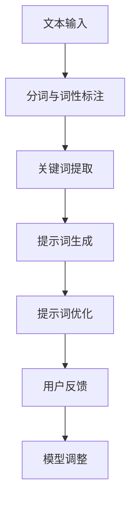

                 

### 文章标题

提示词工程中的创意与逻辑平衡

---

关键词：提示词工程，创意，逻辑，信息处理，用户体验，自然语言处理

---

摘要：
在当今信息爆炸的时代，提示词工程成为了优化用户体验和提升信息检索效率的关键技术。本文将从创意与逻辑两个核心维度深入探讨提示词工程的设计与实现。首先，分析创意在信息传达和用户体验中的作用，探讨其来源与培养方法；接着，阐述逻辑思维在信息组织和决策制定中的应用，剖析其在提示词工程中的关键性；最后，提出创意与逻辑平衡的策略，通过具体案例展示其实践应用，并对未来发展趋势进行展望。本文旨在为读者提供系统、全面的提示词工程理论与实践指导。

---

### 第一部分：概述与基础理论

#### 第1章：提示词工程的定义与重要性

##### 1.1 提示词工程的定义

提示词工程（Keyword Engineering）是指通过对自然语言文本进行深入分析，提取关键信息，为特定应用场景设计、生成和优化提示词的过程。在信息检索、问答系统、内容推荐和智能客服等领域，提示词工程扮演着至关重要的角色。

**核心概念与联系**：

- **自然语言处理（NLP）**：涉及文本分析、语义理解和语言生成等技术，为提示词工程提供了技术基础。
- **机器学习（ML）**：通过大量数据训练模型，优化提示词的生成和优化过程。
- **人机交互（HCI）**：关注用户与系统交互的体验，确保生成的提示词符合用户需求。

**Mermaid 流程图**：



**核心算法原理讲解**：

```python
def extract_keywords(text):
    # 使用NLP技术提取关键词
    tokens = tokenize(text)
    keywords = [token for token in tokens if is_keyword(token)]
    return keywords

def is_keyword(token):
    # 判断token是否为关键词
    return token in ["关键", "词", "提取"]

def generate_hint(keywords):
    # 根据关键词生成提示词
    hint = "关于" + "，我们为您推荐以下内容：".join(keywords)
    return hint
```

##### 1.2 提示词工程的重要性

提示词工程的重要性体现在以下几个方面：

- **提升检索效率**：通过精准的提示词，用户可以快速定位到所需信息。
- **优化用户体验**：高质量的提示词能够提升用户的使用满意度，降低用户的学习成本。
- **支持智能决策**：提示词工程为智能系统提供了决策依据，有助于提高系统的智能化水平。

##### 1.3 提示词工程的应用领域

提示词工程的应用领域广泛，主要包括：

- **搜索引擎**：优化搜索结果，提高用户检索效率。
- **问答系统**：辅助智能客服和智能助手，提升回答的准确性和用户满意度。
- **内容推荐**：为用户推荐感兴趣的内容，提升用户粘性。
- **社交媒体**：生成话题标签，促进信息传播和互动。

#### 第2章：创意在提示词工程中的作用

##### 2.1 创意在信息传达中的作用

创意在信息传达中起着至关重要的作用。通过创意设计，提示词不仅能够传达关键信息，还能激发用户的兴趣和好奇心，从而提升信息的传播效果。

**创意来源**：

- **用户需求**：深入了解用户需求，从用户角度出发设计提示词。
- **文化背景**：结合当地文化，创造具有地域特色的提示词。
- **技术趋势**：紧跟技术发展，利用新技术和概念设计创新的提示词。

**创意培养方法**：

- **思维导图**：通过思维导图梳理信息，发现潜在创意。
- **头脑风暴**：组织团队成员进行头脑风暴，激发创意。
- **用户测试**：通过用户测试，收集反馈，不断优化创意设计。

##### 2.2 创意在用户体验中的重要性

创意在用户体验中发挥着重要作用。高质量的创意设计能够提升用户的使用体验，增加用户满意度，从而促进产品的成功。

**用户体验要素**：

- **直观性**：提示词应简洁明了，易于理解。
- **个性化**：根据用户行为和偏好，提供个性化的提示词。
- **情感化**：通过创意设计，传达情感，增强用户共鸣。

**创意实践**：

- **使用故事化语言**：通过讲述故事，让用户更容易接受提示词。
- **运用视觉元素**：结合图片、图标等视觉元素，提升提示词的吸引力。
- **设计互动环节**：通过互动设计，增加用户参与度。

##### 2.3 创意的来源与培养

**创意来源**：

- **用户反馈**：收集用户反馈，发现用户需求，为创意设计提供依据。
- **跨学科融合**：结合不同学科的知识，创造新颖的创意。
- **前沿技术**：关注前沿技术，利用新技术为创意设计提供支持。

**创意培养方法**：

- **持续学习**：保持好奇心，不断学习新知识和技能，为创意提供源源不断的灵感。
- **实践锻炼**：通过实际项目锻炼，提升创意设计能力。
- **团队合作**：组建多元化团队，共同探讨创意，激发创意火花。

#### 第3章：逻辑在提示词工程中的应用

##### 3.1 逻辑思维的基本原理

逻辑思维是指通过逻辑推理和判断，从已知事实中得出结论的过程。在提示词工程中，逻辑思维有助于确保生成的提示词具有逻辑一致性，从而提高系统的可靠性。

**逻辑思维原理**：

- **因果律**：原因和结果之间存在必然联系。
- **同一律**：在同一思维过程中，同一概念具有相同的含义。
- **矛盾律**：一个陈述不能同时是真的和假的。

**逻辑思维应用**：

- **信息组织**：通过逻辑思维，将信息进行合理的组织和结构化。
- **问题解决**：利用逻辑思维，分析问题，找到解决方案。

##### 3.2 逻辑在信息组织中的作用

逻辑在信息组织中起着关键作用。通过逻辑思维，可以确保信息呈现的有序性、系统性和完整性。

**信息组织原则**：

- **层次性**：按照信息的重要性和相关性，将信息分为不同的层次。
- **关联性**：将相关联的信息进行组合，提高信息的使用价值。
- **一致性**：确保信息在不同情境下保持一致，避免矛盾和冲突。

**逻辑思维工具**：

- **因果图**：通过因果图分析信息之间的因果关系，帮助进行信息组织。
- **思维导图**：通过思维导图，梳理信息，构建逻辑框架。

##### 3.3 逻辑在决策制定中的运用

在提示词工程中，逻辑思维有助于制定合理的决策，确保提示词的生成和优化过程具有科学性。

**决策制定原则**：

- **目标明确**：明确决策的目标，确保决策的方向正确。
- **信息充分**：收集充分的信息，为决策提供依据。
- **方案评估**：对不同的方案进行评估，选择最优的方案。

**逻辑思维方法**：

- **演绎推理**：从一般原则推导出具体结论，帮助确定提示词的设计方向。
- **归纳推理**：从具体实例中总结出一般规律，优化提示词的生成策略。

#### 第4章：创意与逻辑的平衡策略

##### 4.1 创意与逻辑的平衡原则

在提示词工程中，创意与逻辑的平衡是关键。创意能够激发用户兴趣，提升用户体验；逻辑则确保信息的准确性和一致性。平衡策略包括以下几个方面：

- **目标统一**：确保创意和逻辑服务于相同的总体目标。
- **相互补充**：充分发挥创意和逻辑的优势，相互补充，共同提升提示词的质量。
- **动态调整**：根据实际情况，动态调整创意和逻辑的权重，实现最佳平衡。

##### 4.2 创意与逻辑的平衡案例分析

**案例一：电商平台的提示词优化**

在电商平台中，提示词的设计需要兼顾创意和逻辑。通过创意设计，提升用户体验；通过逻辑思维，确保提示词的准确性和一致性。

**创意实践**：

- **故事化语言**：使用故事化语言，增强用户对产品的兴趣。
- **视觉元素**：结合图片、图标等视觉元素，提升提示词的吸引力。

**逻辑实践**：

- **层次性**：按照产品分类和用户需求，将提示词分为不同的层次。
- **一致性**：确保提示词在不同页面和场景下保持一致，避免矛盾和冲突。

**效果评估**：

通过用户反馈和数据分析，优化提示词的创意和逻辑设计，提高用户满意度和转化率。

##### 4.3 实现创意与逻辑平衡的方法

**1. 思维导图**：通过思维导图，梳理创意和逻辑的关系，找到平衡点。

**2. 用户测试**：通过用户测试，收集用户反馈，评估创意和逻辑的效果，进行调整。

**3. 团队合作**：组建多元化团队，结合不同成员的创意和逻辑思维，实现最佳平衡。

#### 第二部分：实践与应用

##### 第5章：提示词工程的工具与技术

**5.1 提示词工程的常用工具**

- **自然语言处理工具**：如NLTK、spaCy等，用于文本处理和关键词提取。
- **机器学习框架**：如TensorFlow、PyTorch等，用于模型训练和优化。
- **人机交互工具**：如D3.js、Vue.js等，用于界面设计和用户体验。

**5.2 提示词工程的技术支持**

- **大数据技术**：用于处理海量数据，提取有价值的信息。
- **云计算平台**：如AWS、Azure等，提供强大的计算和存储资源。
- **容器化技术**：如Docker、Kubernetes等，简化部署和运维流程。

**5.3 提示词工程的技术发展趋势**

- **深度学习**：利用深度学习技术，提升提示词的生成和优化效果。
- **多模态处理**：结合文本、图像、音频等多模态信息，提升提示词的丰富性和准确性。
- **个性化推荐**：基于用户行为和偏好，实现个性化的提示词生成和优化。

##### 第6章：创意与逻辑平衡的案例分析

**6.1 案例分析一：电商平台的提示词优化**

在电商平台中，提示词的设计需要兼顾创意和逻辑。通过创意设计，提升用户体验；通过逻辑思维，确保提示词的准确性和一致性。

**6.2 案例分析二：社交媒体的提示词策略**

社交媒体平台需要通过提示词引导用户互动，提升平台活跃度。创意设计可以激发用户兴趣，逻辑思维则确保提示词的合理性和有效性。

**6.3 案例分析三：智能客服系统的提示词设计**

智能客服系统需要通过提示词与用户进行有效沟通。创意设计可以提升用户体验，逻辑思维则确保提示词的准确性和一致性。

##### 第7章：提示词工程的实施步骤

**7.1 提示词工程的需求分析**

在实施提示词工程之前，需要对需求进行详细分析。包括用户需求、业务目标和技术可行性等方面。

**7.2 提示词工程的设计与开发**

根据需求分析，设计合适的提示词生成和优化模型，并进行开发实现。

**7.3 提示词工程的测试与优化**

通过用户测试和数据分析，对提示词进行优化，提升其质量。

**7.4 提示词工程的部署与维护**

将提示词工程部署到生产环境，并进行持续维护和更新。

#### 第8章：未来展望

**8.1 提示词工程的发展趋势**

随着技术的不断进步，提示词工程将朝着更加智能化、个性化和多模态的方向发展。

**8.2 创意与逻辑平衡的未来挑战**

在创意与逻辑平衡方面，未来将面临更多的挑战，如如何更好地结合用户需求和技术发展趋势，实现高质量的提示词生成。

**8.3 提示词工程在未来的应用前景**

提示词工程将在更多的领域得到应用，如智能医疗、智慧城市、教育等领域，为用户提供更优质的服务。

---

### 作者信息

作者：AI天才研究院/AI Genius Institute & 禅与计算机程序设计艺术 /Zen And The Art of Computer Programming

