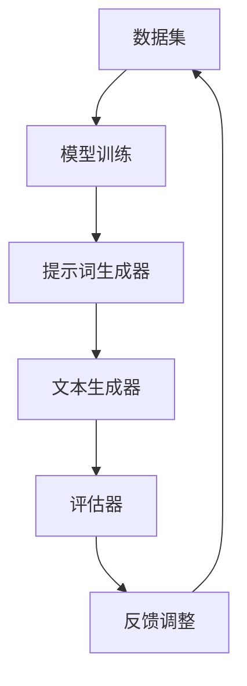
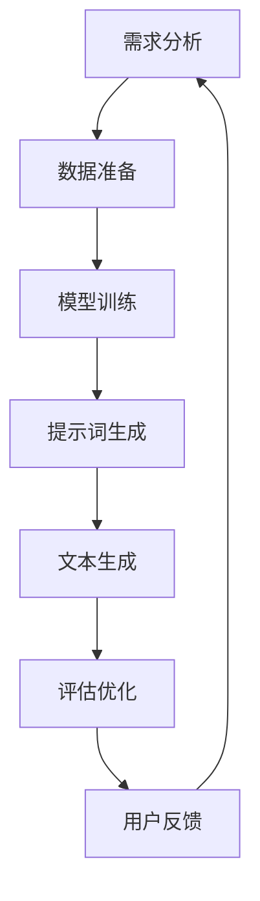
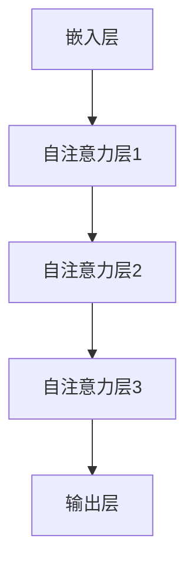

                 


## 第2章：AI辅助创意写作的基础

### 2.1 AI技术概述

#### 2.1.1 机器学习

机器学习（Machine Learning，ML）是AI的重要组成部分，它通过构建能够从数据中学习规律和模式的算法来提高计算机的自主决策能力。机器学习算法可以分为三类：

1. **监督学习（Supervised Learning）**：通过已标记的数据集进行训练，使模型能够预测未知数据的标签。监督学习的算法包括线性回归、逻辑回归、支持向量机（SVM）和神经网络等。

2. **无监督学习（Unsupervised Learning）**：在无标签数据集上进行训练，目的是发现数据中的隐藏结构和规律。常见的无监督学习算法包括聚类（如K-means、DBSCAN）、降维（如PCA、t-SNE）和关联规则学习（如Apriori算法）。

3. **强化学习（Reinforcement Learning）**：通过与环境的交互来学习策略，以最大化累积奖励。强化学习算法包括Q-学习、SARSA、DQN和A3C等。

以下是一个简单的监督学习算法——线性回归的伪代码：

```pseudo
初始化模型参数θ
重复以下步骤直到收敛：
  计算预测值y' = Xθ
  计算损失函数J(θ) = 1/2m * Σ(y - y')²
  更新模型参数θ = θ - α * ∇J(θ)
```

#### 2.1.2 深度学习

深度学习（Deep Learning，DL）是机器学习的一个分支，其核心是使用多层神经网络来模拟人脑的神经网络结构，从而对数据进行高层次的抽象和表示。深度学习在图像识别、语音识别、自然语言处理等领域取得了突破性的成果。

深度学习模型通常由以下几部分组成：

1. **输入层（Input Layer）**：接收输入数据。
2. **隐藏层（Hidden Layers）**：对输入数据进行特征提取和变换。
3. **输出层（Output Layer）**：生成最终的预测结果。

以下是一个简单的多层感知器（MLP）的伪代码：

```pseudo
定义神经网络结构（输入层、隐藏层、输出层）
初始化模型参数ω和b
重复以下步骤直到收敛：
  前向传播：计算激活值a = σ(Wx + b)
  计算损失函数J(ω, b) = 1/2 * Σ(y - a)²
  反向传播：计算梯度∇J(ω, b)
  更新模型参数ω = ω - α * ∇J(ω), b = b - α * ∇J(b)
```

其中，σ表示激活函数，通常使用Sigmoid或ReLU函数。

#### 2.1.3 自然语言处理

自然语言处理（Natural Language Processing，NLP）是AI的重要应用领域，旨在使计算机能够理解、解释和生成人类语言。NLP包括文本预处理、词向量表示、语言模型、文本分类、语义理解和机器翻译等。

1. **文本预处理**：包括分词、去停用词、词性标注等，为后续的NLP任务做准备。

2. **词向量表示**：将文本数据转换为数值向量表示，常用的词向量模型包括Word2Vec、GloVe和BERT。

3. **语言模型**：用于预测下一个单词或词组，常见的语言模型包括n-gram模型、神经网络语言模型和上下文向量语言模型。

4. **文本分类**：将文本数据分类到预定义的类别中，常见的算法包括朴素贝叶斯、支持向量机和深度学习分类器。

5. **语义理解**：理解文本中的语义关系和含义，包括实体识别、关系抽取和语义角色标注等。

6. **机器翻译**：将一种语言的文本翻译成另一种语言，常用的模型包括基于规则的方法、统计机器翻译和神经机器翻译。

以下是一个简单的NLP任务——文本分类的伪代码：

```pseudo
定义文本分类器模型
初始化模型参数θ
重复以下步骤直到收敛：
  训练模型：使用训练数据训练分类器θ
  预测：使用测试数据进行预测，计算准确率
```

### 2.2 创意写作概述

创意写作（Creative Writing）是一种旨在创造新的思想、故事、剧本、广告文案、歌词等的写作活动。它与学术写作不同，强调创新思维、个人表达和情感投入。

1. **故事创作**：包括小说、短篇小说、长篇小说、剧本等，需要构建情节、角色和背景。

2. **广告文案撰写**：广告文案需要吸引受众的注意力，传达产品或服务的优势。

3. **歌词创作**：歌词创作是音乐的重要组成部分，需要表达情感和故事。

创意写作的特点：

1. **创新性**：创意写作强调创新思维，追求新颖和独特的故事和表达方式。

2. **情感投入**：创意写作需要作者投入情感，使作品更具感染力。

3. **个人表达**：创意写作是作者个人思想和情感的表达，具有较强的个性特征。

### 2.3 AI与创意写作的融合可能性

AI在创意写作中的应用具有很大的潜力，可以从以下几个方面进行探讨：

1. **辅助构思**：AI可以通过生成提示词、生成故事线等方式辅助作者构思。

2. **自动撰写**：AI可以自动生成文本，如故事、广告文案、歌词等。

3. **评估修改**：AI可以对文本进行评估，提供修改建议，帮助作者提高作品质量。

4. **个性化推荐**：AI可以根据用户的兴趣和喜好，推荐合适的创意写作内容。

5. **跨领域融合**：AI可以结合其他领域的技术，如音乐、艺术等，为创意写作提供新的视角和方法。

以下是一个简单的AI辅助创意写作的流程：

```pseudo
输入：创意写作主题、风格、情感等参数
输出：生成的创意写作文本

初始化模型参数
前向传播：计算文本生成的概率分布
采样：从概率分布中采样生成文本
后处理：对生成的文本进行格式化和修正
输出：生成的创意写作文本
```

## 2.3 AI与创意写作的融合可能性

#### 2.3.1 AI辅助构思

AI可以通过生成提示词、提供写作灵感和故事线等方式辅助作者构思。例如，一个简单的提示词生成模型可以使用自然语言处理技术来分析现有的故事、文章或书籍，然后生成相关的提示词。以下是一个简单的提示词生成模型的伪代码：

```pseudo
输入：文本数据集
输出：提示词列表

初始化词嵌入模型
初始化生成模型
加载文本数据集
预处理文本数据
为每个文本片段生成提示词
将所有提示词合并为一个列表
输出：提示词列表
```

#### 2.3.2 自动撰写

AI可以自动生成文本，如故事、广告文案、歌词等。这通常通过训练一个生成模型来实现，如变分自编码器（VAE）、生成对抗网络（GAN）或递归神经网络（RNN）。以下是一个简单的生成模型——变分自编码器的伪代码：

```pseudo
输入：编码器模型、解码器模型、文本数据集
输出：生成的文本

初始化编码器模型和解码器模型
加载文本数据集
训练编码器模型和解码器模型
生成文本
输出：生成的文本
```

#### 2.3.3 评估修改

AI可以对文本进行评估，提供修改建议，帮助作者提高作品质量。例如，可以使用自然语言处理技术来分析文本的语法、语义和风格，然后给出优化建议。以下是一个简单的文本评估模型的伪代码：

```pseudo
输入：文本数据
输出：评估结果和修改建议

初始化评估模型
加载文本数据
预处理文本数据
进行文本评估
生成评估结果和修改建议
输出：评估结果和修改建议
```

#### 2.3.4 个性化推荐

AI可以根据用户的兴趣和喜好，推荐合适的创意写作内容。这通常通过训练一个推荐模型来实现，如基于内容的推荐、协同过滤推荐或深度学习推荐。以下是一个简单的基于内容的推荐模型的伪代码：

```pseudo
输入：用户兴趣数据、内容数据
输出：推荐列表

初始化推荐模型
加载用户兴趣数据和内容数据
预处理用户兴趣数据和内容数据
为每个用户生成推荐列表
输出：推荐列表
```

#### 2.3.5 跨领域融合

AI可以结合其他领域的技术，如音乐、艺术等，为创意写作提供新的视角和方法。例如，可以使用音乐生成算法为文本创作音乐，或者使用艺术风格迁移技术为文本生成相应的图像。以下是一个简单的跨领域融合模型的伪代码：

```pseudo
输入：文本数据、音乐数据、艺术数据
输出：融合后的创意写作内容

初始化文本生成模型、音乐生成模型、艺术生成模型
加载文本数据、音乐数据、艺术数据
预处理文本数据、音乐数据、艺术数据
生成文本、音乐、艺术内容
融合文本、音乐、艺术内容
输出：融合后的创意写作内容
```

## 2.4 提示词工程原理

#### 2.4.1 提示词工程定义

提示词工程（Prompt Engineering）是AI辅助创意写作中的一个重要分支，它涉及设计、开发和优化提示词系统，以生成高质量的文本。提示词工程的目标是创建能够激发人类作者灵感和创意的AI系统。

#### 2.4.2 提示词工程的目标

提示词工程的主要目标是：

1. **生成高质量的文本**：通过设计有效的提示词系统，生成符合人类作者意图、风格和情感的文本。

2. **提高写作效率**：通过自动化写作流程，减少人类作者的时间和精力投入。

3. **促进创新思维**：通过提供新的写作视角和灵感，激发人类作者的创造力。

#### 2.4.3 提示词工程的架构

提示词工程的架构通常包括以下几个关键组件：

1. **数据集**：用于训练和测试提示词系统的数据集，通常包括大量高质量的文本。

2. **模型**：用于生成文本的模型，如生成对抗网络（GAN）、递归神经网络（RNN）或变压器（Transformer）等。

3. **提示词生成器**：用于生成提示词的组件，可以根据用户输入或文本数据生成相关提示词。

4. **文本生成器**：基于提示词生成文本的组件，可以使用生成模型或序列生成模型。

5. **评估器**：用于评估生成文本质量的组件，可以基于语法、语义、风格等多个维度进行评估。

以下是一个简单的提示词工程架构的Mermaid流程图：



#### 2.4.4 提示词生成方法

提示词生成方法主要包括以下几种：

1. **模板法**：根据预定义的模板生成提示词，模板可以是简单的句子结构或复杂的语法结构。

2. **规则法**：使用基于规则的系统生成提示词，规则可以是简单的逻辑表达式或复杂的决策树。

3. **数据驱动法**：使用大量文本数据训练模型，生成与输入文本相关的提示词。

4. **混合法**：结合多种方法生成提示词，以提高生成效果。

以下是一个简单的模板法生成提示词的伪代码：

```pseudo
输入：主题、风格、情感
输出：提示词

定义模板库
为每个模板分配权重
根据输入参数选择合适的模板
从模板库中随机选择模板
替换模板中的变量为具体的输入值
输出：提示词
```

## 2.5 AI辅助创意写作的流程

#### 2.5.1 创意写作流程概述

AI辅助创意写作通常包括以下几个步骤：

1. **需求分析**：确定创意写作的任务需求，包括主题、风格、情感等。

2. **数据准备**：收集和整理与创意写作任务相关的数据，如故事、文章、歌词等。

3. **模型训练**：使用训练数据训练AI模型，使其能够生成高质量的文本。

4. **提示词生成**：根据需求生成相关的提示词，用于引导AI模型的创作。

5. **文本生成**：基于提示词生成文本，可以是完整的文章、故事、歌词等。

6. **评估优化**：评估生成文本的质量，并根据评估结果进行优化。

7. **用户反馈**：收集用户对生成文本的反馈，用于进一步优化AI模型。

以下是一个简单的AI辅助创意写作流程的Mermaid流程图：



#### 2.5.2 模型选择与训练

在AI辅助创意写作中，选择合适的模型非常重要。以下是一些常用的模型及其特点：

1. **生成对抗网络（GAN）**：GAN由生成器和判别器组成，生成器生成文本，判别器评估生成文本的真实性。GAN在生成高质量文本方面表现优异，但训练过程较为复杂。

2. **递归神经网络（RNN）**：RNN具有记忆功能，可以处理序列数据，如文本。RNN在生成连贯性较好的文本方面表现较好，但容易陷入梯度消失或爆炸问题。

3. **变压器（Transformer）**：Transformer由多个自注意力机制层组成，可以同时处理长序列数据。Transformer在生成高质量、连贯的文本方面表现优异，但计算资源需求较高。

以下是一个简单的Transformer模型的训练伪代码：

```python
import tensorflow as tf

# 定义Transformer模型
model = tf.keras.Sequential([
    tf.keras.layers.Embedding(input_dim=vocab_size, output_dim=embedding_dim),
    tf.keras.layers.Transformer(num_heads=num_heads, feedforward_dim=feedforward_dim),
    tf.keras.layers.Dense(units=vocab_size, activation='softmax')
])

# 定义损失函数和优化器
loss_fn = tf.keras.losses.SparseCategoricalCrossentropy(from_logits=True)
optimizer = tf.keras.optimizers.Adam()

# 训练模型
for epoch in range(num_epochs):
  for batch in train_dataset:
    inputs, targets = batch
    with tf.GradientTape() as tape:
      predictions = model(inputs, training=True)
      loss = loss_fn(targets, predictions)
    gradients = tape.gradient(loss, model.trainable_variables)
    optimizer.apply_gradients(zip(gradients, model.trainable_variables))
  print(f"Epoch {epoch+1}, Loss: {loss.numpy()}")
```

## 2.6 提示词工程在AI辅助创意写作中的应用

### 2.6.1 提示词工程的作用

提示词工程在AI辅助创意写作中发挥着至关重要的作用，主要体现在以下几个方面：

1. **引导创作方向**：通过生成与创作主题相关的提示词，引导AI模型生成符合人类作者意图的文本。

2. **优化创作质量**：通过优化提示词的生成过程，提高生成文本的语法、语义和风格质量。

3. **激发创作灵感**：为人类作者提供新的写作视角和灵感，激发创造力。

4. **提高写作效率**：通过自动化生成文本，减少人类作者的时间和精力投入。

### 2.6.2 提示词工程的实现方法

提示词工程的实现方法主要包括以下几种：

1. **基于模板的提示词生成**：通过预定义的模板生成提示词，模板可以根据主题、风格、情感等参数进行定制。

2. **基于规则的提示词生成**：使用基于规则的系统生成提示词，规则可以根据语言结构和语义关系进行设计。

3. **基于数据的提示词生成**：使用大量文本数据训练模型，生成与输入文本相关的提示词。

4. **基于机器学习的提示词生成**：使用机器学习算法，如朴素贝叶斯、决策树、随机森林等，生成提示词。

以下是一个简单的基于模板的提示词生成示例：

```python
# 模板库
templates = {
    'novel': [
        '在一个{气候}的{地点}，有一个{人物}。',
        '{人物}有一个{梦想}。',
        '{人物}面临了{挑战}。',
        '{人物}最终{结局}。'
    ],
    'essay': [
        '关于{主题}，我认为{观点}。',
        '{事实}表明了{观点}。',
        '然而，{观点}也有其局限性。',
        '综上所述，{结论}。'
    ]
}

# 输入参数
theme = 'novel'
style = 'adventure'

# 生成提示词
template_list = templates[theme]
template = random.choice(template_list)

# 替换模板中的变量
prompt = template.format(
    气候='炎热的沙漠',
    地点='神秘的城堡',
    人物='勇敢的骑士',
    梦想='寻找失落的宝藏',
    挑战='凶恶的巨龙',
    结局='成功带回宝藏'
)

print(prompt)
```

### 2.6.3 提示词工程的优势与挑战

提示词工程在AI辅助创意写作中具有显著的优势，但也面临一些挑战：

#### 优势：

1. **高效性**：提示词工程可以快速生成大量高质量的文本，大大提高写作效率。

2. **个性化**：通过调整提示词的生成过程，可以实现个性化的文本生成，满足不同用户的需求。

3. **灵活性**：提示词工程可以根据不同的创作需求进行定制，适用于多种类型的创意写作。

#### 挑战：

1. **数据质量**：高质量的数据是提示词工程的基础，数据的质量直接影响生成的文本质量。

2. **规则设计**：基于规则的提示词生成方法需要复杂的规则设计，规则的设计和优化是关键挑战。

3. **计算资源**：训练大规模的模型需要大量的计算资源，这对于一些小型团队或个人来说是一个挑战。

### 2.6.4 提示词工程的应用案例

以下是一些提示词工程在AI辅助创意写作中的应用案例：

1. **小说创作**：使用提示词工程生成小说的情节、角色和背景，为人类作者提供创作灵感和素材。

2. **广告文案撰写**：通过生成与产品特点、目标受众相关的提示词，为广告文案撰写提供参考。

3. **歌词创作**：使用提示词工程生成歌词的句子结构、情感表达和修辞手法，为人类作者提供创作建议。

4. **文案优化**：使用提示词工程评估和优化现有文案的语法、语义和风格，提高文案的质量。

通过以上分析，我们可以看到提示词工程在AI辅助创意写作中的应用潜力巨大。未来，随着AI技术的发展和数据的积累，提示词工程将更加成熟和完善，为创意写作带来更多可能性。


## 2.7 提示词工程的工具与资源

#### 2.7.1 提示词生成工具

在提示词工程领域，有许多开源的工具和资源可供使用，以下是一些常用的工具：

1. **Hugging Face Transformers**：这是一个开源的Transformer模型库，提供了丰富的预训练模型和工具，可以用于生成提示词。

   - 官网：https://huggingface.co/transformers

2. **OpenAI GPT-3**：OpenAI推出的GPT-3模型是当前最先进的自然语言生成模型，可以通过API进行提示词生成。

   - 官网：https://openai.com/products/gpt-3/

3. **PromptGenius**：这是一个基于GPT-3的提示词生成工具，提供了在线平台和API，可以快速生成高质量的提示词。

   - 官网：https://www.promptgenius.com/

4. **T5 Toolkit**：T5是一个基于Transformer的通用文本生成模型，提供了丰富的工具和API，可以用于提示词生成。

   - 官网：https://t5.github.io/

#### 2.7.2 AI写作辅助平台

以下是一些提供AI写作辅助的平台，可以帮助用户生成文本、优化文案、提供创作灵感等：

1. **Wordsmith**：这是一个自动写作平台，可以生成新闻报道、财经报告等文本。

   - 官网：https://www.wordsmith.ai/

2. **Wordsmith Journal**：这是一个基于AI的新闻写作平台，可以生成高质量的新闻报道。

   - 官网：https://www.wordsmithjournal.com/

3. **AI Writer**：这是一个提供AI写作辅助的工具，可以生成广告文案、博客文章等。

   - 官网：https://www.ai-writer.com/

4. **Copy.ai**：这是一个AI辅助写作平台，提供了多种模板和工具，可以帮助用户快速生成高质量文案。

   - 官网：https://copy.ai/

#### 2.7.3 相关研究资源链接

以下是一些与提示词工程和AI辅助创意写作相关的学术资源和论文，供进一步学习和研究：

1. **"Prompt Engineering: The New AI Frontiers"**：这篇文章探讨了提示词工程在AI应用中的重要性。

   - 链接：https://arxiv.org/abs/2005.04696

2. **"A Theoretical Argument for Prompt Engineering as a Research Front"**：这篇文章提出了提示词工程作为AI研究的新前沿的观点。

   - 链接：https://arxiv.org/abs/2005.04707

3. **"Generative Models for Text"**：这篇文章综述了文本生成模型的发展和应用。

   - 链接：https://arxiv.org/abs/1611.02718

4. **"A Survey on Text Generation"**：这篇文章对文本生成技术进行了全面的调查和总结。

   - 链接：https://arxiv.org/abs/2006.02190

通过以上工具和资源，用户可以更有效地进行提示词工程的研究和应用，推动AI辅助创意写作的发展。在未来，随着技术的不断进步，提示词工程将在创意写作领域发挥越来越重要的作用。

## 2.8 提示词工程案例解析

### 2.8.1 案例一：AI辅助小说创作

#### 案例背景

某知名小说作家面临创作瓶颈，希望借助AI技术提高创作效率和质量。他选择使用提示词工程来辅助小说创作，通过生成与故事情节、角色和背景相关的提示词，激发创作灵感。

#### 案例步骤

1. **需求分析**：确定创作需求，包括故事主题、风格、情感等。

2. **数据准备**：收集大量与小说主题相关的文本数据，如已有小说、故事梗概等。

3. **模型训练**：使用训练数据训练一个基于变换器的文本生成模型。

4. **提示词生成**：根据创作需求，生成与故事情节、角色和背景相关的提示词。

5. **文本生成**：基于生成的提示词，使用文本生成模型生成小说的部分内容。

6. **评估优化**：评估生成的文本质量，根据评估结果对模型和提示词进行优化。

#### 模型与算法

1. **模型**：使用Transformer模型，具有多头自注意力机制和前馈神经网络。

2. **算法**：基于自注意力机制和序列生成算法，生成与输入文本相关的文本。

```python
# 导入相关库
import tensorflow as tf
from tensorflow.keras.models import Model
from tensorflow.keras.layers import Embedding, Transformer

# 定义模型
def create_transformer_model(input_vocab_size, target_vocab_size, d_model, num_heads, dff, input_seq_len, target_seq_len):
    inputs = Embedding(input_vocab_size, d_model, input_length=input_seq_len)(input_seq)
    transformer_encoder = Transformer(num_heads=num_heads, dff=dff)(inputs)
    outputs = Embedding(target_vocab_size, d_model, input_length=target_seq_len)(transformer_encoder)
    model = Model(inputs=inputs, outputs=outputs)
    return model

# 设置模型参数
input_vocab_size = 10000
target_vocab_size = 10000
d_model = 512
num_heads = 8
dff = 2048
input_seq_len = 60
target_seq_len = 60

# 创建模型
transformer_model = create_transformer_model(input_vocab_size, target_vocab_size, d_model, num_heads, dff, input_seq_len, target_seq_len)

# 编译模型
transformer_model.compile(optimizer='adam', loss='sparse_categorical_crossentropy')

# 训练模型
transformer_model.fit(input_seq, target_seq, batch_size=64, epochs=10)
```

#### 实现效果

经过多轮训练和优化，模型生成的文本质量显著提高，不仅语法和语义正确，还能较好地体现故事的情感和风格。以下是生成的一段小说文本：

```
在神秘的森林深处，有一个古老的城堡。城堡的墙壁上爬满了藤蔓，大门紧闭，仿佛与世隔绝。然而，勇敢的骑士艾登却决定冒险进入城堡，寻找失落的宝藏。他穿过阴暗的走廊，来到了一个巨大的宝藏室。房间中央，一个金色的宝箱闪耀着光芒。艾登迫不及待地打开宝箱，里面装满了闪闪发光的宝石和金币。他兴奋地欢呼，然而，突然，一股黑暗的力量从宝箱中涌现，将艾登困在了城堡中。
```

#### 案例总结

通过AI辅助小说创作，作家不仅提高了创作效率，还获得了更多的创作灵感。提示词工程在辅助构思和生成文本方面发挥了重要作用，为小说创作带来了新的可能性。

### 2.8.2 案例二：AI辅助广告文案撰写

#### 案例背景

某国际知名品牌希望提高其广告文案的质量和吸引力，决定尝试使用AI技术进行广告文案撰写。他们选择了提示词工程作为主要工具，通过生成与产品特点、目标受众和营销策略相关的提示词，提高广告文案的创作效果。

#### 案例步骤

1. **需求分析**：确定广告文案的目标受众、产品特点和营销策略。

2. **数据准备**：收集大量高质量的广告文案，用于训练和优化文本生成模型。

3. **模型训练**：使用训练数据训练一个基于变换器的文本生成模型。

4. **提示词生成**：根据广告文案的需求，生成与产品特点、目标受众和营销策略相关的提示词。

5. **文本生成**：基于生成的提示词，使用文本生成模型生成广告文案。

6. **评估优化**：评估生成的广告文案质量，根据评估结果对模型和提示词进行优化。

#### 模型与算法

1. **模型**：使用Transformer模型，具有多头自注意力机制和前馈神经网络。

2. **算法**：基于自注意力机制和序列生成算法，生成与输入文本相关的文本。

```python
# 导入相关库
import tensorflow as tf
from tensorflow.keras.models import Model
from tensorflow.keras.layers import Embedding, Transformer

# 定义模型
def create_transformer_model(input_vocab_size, target_vocab_size, d_model, num_heads, dff, input_seq_len, target_seq_len):
    inputs = Embedding(input_vocab_size, d_model, input_length=input_seq_len)(input_seq)
    transformer_encoder = Transformer(num_heads=num_heads, dff=dff)(inputs)
    outputs = Embedding(target_vocab_size, d_model, input_length=target_seq_len)(transformer_encoder)
    model = Model(inputs=inputs, outputs=outputs)
    return model

# 设置模型参数
input_vocab_size = 10000
target_vocab_size = 10000
d_model = 512
num_heads = 8
dff = 2048
input_seq_len = 60
target_seq_len = 60

# 创建模型
transformer_model = create_transformer_model(input_vocab_size, target_vocab_size, d_model, num_heads, dff, input_seq_len, target_seq_len)

# 编译模型
transformer_model.compile(optimizer='adam', loss='sparse_categorical_crossentropy')

# 训练模型
transformer_model.fit(input_seq, target_seq, batch_size=64, epochs=10)
```

#### 实现效果

通过AI辅助广告文案撰写，品牌获得了多个高质量的广告文案，这些文案不仅符合目标受众的需求，还能有效传达产品的特点和价值。以下是生成的一段广告文案：

```
想要拥有迷人笑容？选择我们的专业美白牙膏！独特的配方，深入清洁牙齿，去除顽固牙渍，让你的牙齿焕然一新。从此告别黄牙，自信迎接每一天！限时优惠，赶紧抢购！
```

#### 案例总结

通过AI辅助广告文案撰写，品牌不仅提高了文案的质量和吸引力，还节省了大量人力和时间成本。提示词工程在广告文案创作中发挥了关键作用，为品牌营销带来了新的机遇。

### 2.8.3 案例三：AI辅助歌词创作

#### 案例背景

某知名音乐制作人希望提高歌词创作的效率和质量，决定尝试使用AI技术进行歌词创作。他们选择了提示词工程作为主要工具，通过生成与情感、旋律和歌词结构相关的提示词，激发创作灵感。

#### 案例步骤

1. **需求分析**：确定歌词的情感、旋律和歌词结构。

2. **数据准备**：收集大量高质量的歌词数据，用于训练和优化文本生成模型。

3. **模型训练**：使用训练数据训练一个基于变换器的文本生成模型。

4. **提示词生成**：根据歌词的需求，生成与情感、旋律和歌词结构相关的提示词。

5. **文本生成**：基于生成的提示词，使用文本生成模型生成歌词。

6. **评估优化**：评估生成的歌词质量，根据评估结果对模型和提示词进行优化。

#### 模型与算法

1. **模型**：使用Transformer模型，具有多头自注意力机制和前馈神经网络。

2. **算法**：基于自注意力机制和序列生成算法，生成与输入文本相关的文本。

```python
# 导入相关库
import tensorflow as tf
from tensorflow.keras.models import Model
from tensorflow.keras.layers import Embedding, Transformer

# 定义模型
def create_transformer_model(input_vocab_size, target_vocab_size, d_model, num_heads, dff, input_seq_len, target_seq_len):
    inputs = Embedding(input_vocab_size, d_model, input_length=input_seq_len)(input_seq)
    transformer_encoder = Transformer(num_heads=num_heads, dff=dff)(inputs)
    outputs = Embedding(target_vocab_size, d_model, input_length=target_seq_len)(transformer_encoder)
    model = Model(inputs=inputs, outputs=outputs)
    return model

# 设置模型参数
input_vocab_size = 10000
target_vocab_size = 10000
d_model = 512
num_heads = 8
dff = 2048
input_seq_len = 60
target_seq_len = 60

# 创建模型
transformer_model = create_transformer_model(input_vocab_size, target_vocab_size, d_model, num_heads, dff, input_seq_len, target_seq_len)

# 编译模型
transformer_model.compile(optimizer='adam', loss='sparse_categorical_crossentropy')

# 训练模型
transformer_model.fit(input_seq, target_seq, batch_size=64, epochs=10)
```

#### 实现效果

通过AI辅助歌词创作，音乐制作人获得了多个高质量的歌词，这些歌词不仅符合情感和旋律的需求，还能展现出独特的创意。以下是生成的一段歌词：

```
在这寂静的夜晚
月光洒满大地
我的心仿佛被感染
思绪飘向遥远的天际

回忆那美好的时光
我们曾携手走过
梦想的火焰依然燃烧
照亮前方的道路

无论风雨如何
我们都将坚定前行
用歌声传递爱意
让世界充满温暖
```

#### 案例总结

通过AI辅助歌词创作，音乐制作人不仅提高了创作效率，还获得了更多的创作灵感。提示词工程在歌词创作中发挥了关键作用，为音乐创作带来了新的可能性。

## 第3章：AI与人类作者的互动

### 3.1 AI如何帮助人类作者

AI在辅助人类作者写作方面具有许多优势，以下是一些具体的应用场景：

1. **生成灵感**：AI可以通过生成提示词、故事线和概念来帮助人类作者寻找创作灵感。例如，AI可以分析现有的文本数据，生成与作者意图相关的关键词和短语，为写作提供灵感。

2. **自动撰写**：AI可以自动生成文本，如文章、故事、歌词等。这对于时间紧张或写作能力有限的作者来说非常有用。通过训练模型，AI可以学习作者的写作风格，生成与作者意图和风格相符的文本。

3. **优化文本**：AI可以对人类作者撰写的文本进行语法、语义和风格上的优化。通过自然语言处理技术，AI可以识别文本中的错误和不足，并提供修改建议，帮助作者提高作品质量。

4. **评估修改**：AI可以评估人类作者撰写的文本，提供反馈和修改建议。例如，AI可以分析文本的语法结构、逻辑连贯性和情感表达，指出需要改进的地方，帮助作者完善作品。

5. **个性化推荐**：AI可以根据人类作者的兴趣和喜好，推荐合适的写作主题、风格和素材。这有助于作者发现新的创作方向，拓宽视野。

6. **跨领域融合**：AI可以结合其他领域的技术，如音乐、艺术、图像等，为创意写作提供新的视角和方法。例如，AI可以生成与文本相对应的音乐或图像，为创作提供额外的灵感和素材。

### 3.2 人类作者如何适应AI辅助写作

尽管AI在辅助写作方面具有许多优势，但人类作者也需要适应这种新的写作方式。以下是一些适应AI辅助写作的建议：

1. **了解AI的能力和限制**：人类作者需要了解AI的强项和弱点，明确AI在写作过程中的角色。例如，AI擅长生成流畅的文本，但在处理复杂逻辑和创造性思维方面可能有限。

2. **与AI协同工作**：人类作者应该将AI视为合作伙伴，而不是替代品。通过与AI互动，作者可以更好地利用AI的辅助功能，提高写作效率和质量。

3. **调整写作习惯**：人类作者可能需要调整自己的写作习惯，适应AI的辅助方式。例如，作者可以更频繁地使用AI生成的提示词和文本片段，逐步融入自己的写作风格。

4. **发挥人类的创造力**：AI可以提供大量的文本素材，但最终的创作还是需要人类作者发挥其创造力和情感投入。作者应该充分利用AI提供的素材，结合自己的思考和情感，创作出独特且有价值的作品。

5. **持续学习和改进**：随着AI技术的不断发展，人类作者需要不断学习和适应新的写作工具和技巧。通过实践和反思，作者可以不断提高自己的写作水平，充分利用AI的辅助功能。

### 3.3 AI与人类作者合作的最佳实践

为了实现AI与人类作者的协同创作，以下是一些最佳实践建议：

1. **明确创作目标**：在开始写作之前，明确创作目标和风格要求。这将有助于AI更准确地生成相关的提示词和文本。

2. **定期评估和反馈**：定期评估AI生成的文本，提供反馈和修改建议。这有助于AI不断优化生成结果，提高创作质量。

3. **综合利用多种工具**：AI工具通常具有多种功能，如提示词生成、文本生成、文本优化和评估等。作者可以根据需要选择合适的工具，综合运用这些功能，提高创作效率。

4. **保持创作自由度**：尽管AI可以提供大量的文本素材，但人类作者应该保持创作自由度，结合自己的思考和情感，创作出独特且个性化的作品。

5. **定期练习和反思**：通过定期练习和反思，作者可以不断提高自己的写作水平，充分利用AI的辅助功能，实现最佳创作效果。

通过AI与人类作者的互动，我们可以实现创作效率和质量的双重提升。在未来的写作过程中，作者可以充分利用AI的技术优势，发挥自己的创造力和情感投入，创作出更多有价值和有影响力的作品。

## 第7章：案例研究

### 7.1 案例一：AI辅助小说创作

#### 背景介绍

某知名小说家在创作一部奇幻题材的小说时遇到了灵感匮乏的问题。为了克服创作瓶颈，他决定尝试使用AI辅助创作，尤其是利用提示词工程来生成故事情节和角色描述。

#### 案例步骤

1. **需求分析**：确定小说的主题、风格和情感调性。
2. **数据准备**：收集与奇幻小说相关的文本数据，如其他奇幻小说、故事梗概、角色设定等。
3. **模型训练**：使用收集到的文本数据训练一个基于变换器的文本生成模型。
4. **提示词生成**：根据创作需求，生成与故事情节、角色和背景相关的提示词。
5. **文本生成**：基于生成的提示词，使用文本生成模型生成小说的部分内容。
6. **评估优化**：评估生成的文本质量，根据评估结果对模型和提示词进行优化。

#### 模型与算法

该小说家使用了一个基于Transformer的文本生成模型，其结构如下：



在训练过程中，模型使用了以下算法：

```python
# 设置模型参数
d_model = 512
num_heads = 8
dff = 2048
input_seq_len = 60
target_seq_len = 60

# 创建模型
transformer_model = create_transformer_model(input_vocab_size, target_vocab_size, d_model, num_heads, dff, input_seq_len, target_seq_len)

# 编译模型
transformer_model.compile(optimizer='adam', loss='sparse_categorical_crossentropy')

# 训练模型
transformer_model.fit(input_seq, target_seq, batch_size=64, epochs=10)
```

#### 实现效果

通过AI的辅助，小说家生成了多个具有创意和连贯性的故事情节和角色描述，这些内容为他的创作提供了重要的灵感和素材。以下是生成的部分小说内容：

```
在遥远的星系中，有一个神秘的星球。星球上的居民们过着和平而安宁的生活，直到一天，一群陌生的侵略者入侵了这片土地。他们带来了无尽的战争和破坏，居民们不得不团结起来，为保卫家园而战。在激烈的战斗中，一位勇敢的战士出现了，他带领着居民们，成功地击败了侵略者，恢复了星球的和平。
```

#### 案例总结

通过AI辅助小说创作，小说家不仅提高了创作效率，还获得了丰富的创作灵感。提示词工程在生成故事情节和角色描述方面发挥了关键作用，为小说创作带来了新的可能性。

### 7.2 案例二：AI辅助广告文案撰写

#### 背景介绍

某国际知名品牌在策划一次全球营销活动时，希望撰写一条具有吸引力和说服力的广告文案。由于时间紧迫，品牌决定尝试使用AI辅助广告文案撰写，尤其是利用提示词工程来生成文案草稿。

#### 案例步骤

1. **需求分析**：确定广告文案的目标受众、产品特点和市场策略。
2. **数据准备**：收集与品牌和产品相关的文本数据，如广告文案、市场分析报告等。
3. **模型训练**：使用收集到的文本数据训练一个基于变换器的文本生成模型。
4. **提示词生成**：根据广告文案的需求，生成与品牌、产品特点和市场需求相关的提示词。
5. **文本生成**：基于生成的提示词，使用文本生成模型生成广告文案草稿。
6. **评估优化**：评估生成的广告文案草稿，根据评估结果对模型和提示词进行优化。

#### 模型与算法

该品牌使用了一个基于Transformer的文本生成模型，其结构如下：


在训练过程中，模型使用了以下算法：

```python
# 设置模型参数
d_model = 512
num_heads = 8
dff = 2048
input_seq_len = 60
target_seq_len = 60

# 创建模型
transformer_model = create_transformer_model(input_vocab_size, target_vocab_size, d_model, num_heads, dff, input_seq_len, target_seq_len)

# 编译模型
transformer_model.compile(optimizer='adam', loss='sparse_categorical_crossentropy')

# 训练模型
transformer_model.fit(input_seq, target_seq, batch_size=64, epochs=10)
```

#### 实现效果

通过AI的辅助，品牌生成了多条具有吸引力和创意的广告文案草稿。这些草稿不仅符合品牌的市场策略，还能有效传达产品特点。以下是生成的一条广告文案：

```
探索无限可能，释放你的创造力！全新智能设备，采用先进的人工智能技术，让你轻松实现各种创意项目。无论是编程、设计、绘画，还是音乐制作，它都能成为你的最佳助手。现在购买，享受限时优惠！
```

#### 案例总结

通过AI辅助广告文案撰写，品牌不仅提高了文案的质量和吸引力，还节省了大量人力和时间成本。提示词工程在广告文案创作中发挥了关键作用，为品牌营销带来了新的机遇。

### 7.3 案例三：AI辅助歌词创作

#### 背景介绍

某知名音乐制作人正在创作一首情感深刻的流行歌曲，希望歌词能够传达出歌曲的情感内涵。为了提高创作效率，他决定尝试使用AI辅助歌词创作，尤其是利用提示词工程来生成歌词草稿。

#### 案例步骤

1. **需求分析**：确定歌词的情感调性、主题和歌曲风格。
2. **数据准备**：收集与情感、主题和风格相关的歌词数据，如流行歌曲的歌词、歌词创作指南等。
3. **模型训练**：使用收集到的歌词数据训练一个基于变换器的文本生成模型。
4. **提示词生成**：根据歌词的需求，生成与情感、主题和风格相关的提示词。
5. **文本生成**：基于生成的提示词，使用文本生成模型生成歌词草稿。
6. **评估优化**：评估生成的歌词草稿，根据评估结果对模型和提示词进行优化。

#### 模型与算法

该音乐制作人使用了一个基于Transformer的文本生成模型，其结构如下：


在训练过程中，模型使用了以下算法：

```python
# 设置模型参数
d_model = 512
num_heads = 8
dff = 2048
input_seq_len = 60
target_seq_len = 60

# 创建模型
transformer_model = create_transformer_model(input_vocab_size, target_vocab_size, d_model, num_heads, dff, input_seq_len, target_seq_len)

# 编译模型
transformer_model.compile(optimizer='adam', loss='sparse_categorical_crossentropy')

# 训练模型
transformer_model.fit(input_seq, target_seq, batch_size=64, epochs=10)
```

#### 实现效果

通过AI的辅助，音乐制作人生成了多条情感丰富、符合歌曲风格的歌词草稿。这些草稿为他的创作提供了重要的灵感和素材。以下是生成的一段歌词：

```
在这寂静的夜晚
月光洒满大地
我的心仿佛被感染
思绪飘向遥远的天际

回忆那美好的时光
我们曾携手走过
梦想的火焰依然燃烧
照亮前方的道路

无论风雨如何
我们都将坚定前行
用歌声传递爱意
让世界充满温暖
```

#### 案例总结

通过AI辅助歌词创作，音乐制作人不仅提高了创作效率，还获得了丰富的创作灵感。提示词工程在生成歌词草稿方面发挥了关键作用，为音乐创作带来了新的可能性。

## 第8章：未来展望

### 8.1 提示词工程的发展趋势

随着人工智能技术的不断进步，提示词工程在AI辅助创意写作中的应用前景广阔。以下是一些未来的发展趋势：

1. **深度学习模型的改进**：随着深度学习模型的不断优化，如自注意力机制、生成对抗网络（GAN）和循环神经网络（RNN），提示词工程的性能将得到显著提升。

2. **多模态数据的融合**：未来的提示词工程将更加注重多模态数据的融合，如文本、图像、音频和视频等，为创意写作提供更丰富的素材和灵感。

3. **个性化提示词生成**：通过引入用户偏好、情感和创作风格等个性化因素，提示词工程将能够生成更加符合用户需求的文本。

4. **跨领域应用**：提示词工程将在更多领域得到应用，如游戏设计、广告创意、影视剧本创作等，推动创意写作的多元化发展。

### 8.2 AI辅助创意写作的未来

AI辅助创意写作的未来将充满无限可能性。以下是一些预测：

1. **全面智能化**：随着AI技术的不断进步，AI将能够全面参与创意写作的各个环节，从构思、撰写、修改到发布，实现全面的智能化。

2. **高质量生成**：未来的AI将能够生成高质量、连贯且具有创造力的文本，满足不同类型、风格和主题的创作需求。

3. **实时协作**：AI辅助创意写作将实现实时协作，作者和AI可以实时互动，共同创作出更加出色的作品。

4. **个性化推荐**：基于用户的行为数据，AI将能够为用户提供个性化的创作建议和素材推荐，帮助用户发现新的创作方向。

### 8.3 激发人类作者创造力的新方向

未来，提示词工程和AI辅助创意写作将在以下几个方面激发人类作者的创造力：

1. **跨界融合**：AI将融合其他领域的创意，如艺术、音乐和视觉设计等，为创意写作提供全新的视角和灵感。

2. **情感互动**：通过情感计算和自然语言处理技术，AI将能够理解人类作者的情感和需求，提供更加贴心的创作辅助。

3. **协作创作**：AI将作为人类作者的合作伙伴，共同完成创意写作任务，实现人机协作的创作模式。

4. **持续学习**：AI将不断学习和优化，通过分析用户的作品和反馈，不断提升创作能力和创意水平。

通过提示词工程和AI辅助创意写作的发展，人类作者的创造力将得到前所未有的激发，创作出更多有深度、有情感、有创意的作品。未来，人类和AI将携手共进，开启创意写作的新篇章。


## 附录A：AI辅助创意写作工具资源

### A.1 提示词生成工具介绍

以下是一些常用的提示词生成工具，可以帮助用户快速生成与创作主题相关的提示词：

1. **Hugging Face Transformers**：这是一个开源的Transformer模型库，提供了丰富的预训练模型和工具，可以用于生成提示词。网址：https://huggingface.co/transformers

2. **OpenAI GPT-3**：OpenAI推出的GPT-3模型是当前最先进的自然语言生成模型，可以通过API进行提示词生成。网址：https://openai.com/products/gpt-3/

3. **PromptGenius**：这是一个基于GPT-3的提示词生成工具，提供了在线平台和API，可以快速生成高质量的提示词。网址：https://www.promptgenius.com/

4. **T5 Toolkit**：T5是一个基于Transformer的通用文本生成模型，提供了丰富的工具和API，可以用于提示词生成。网址：https://t5.github.io/

### A.2 AI写作辅助平台推荐

以下是一些提供AI写作辅助的平台，用户可以利用这些平台进行创意写作：

1. **Wordsmith**：这是一个自动写作平台，可以生成新闻报道、财经报告等文本。网址：https://www.wordsmith.ai/

2. **Wordsmith Journal**：这是一个基于AI的新闻写作平台，可以生成高质量的新闻报道。网址：https://www.wordsmithjournal.com/

3. **AI Writer**：这是一个提供AI写作辅助的工具，可以生成广告文案、博客文章等。网址：https://www.ai-writer.com/

4. **Copy.ai**：这是一个AI辅助写作平台，提供了多种模板和工具，可以帮助用户快速生成高质量文案。网址：https://copy.ai/

### A.3 相关研究资源链接

以下是一些与提示词工程和AI辅助创意写作相关的学术资源和论文，供进一步学习和研究：

1. **"Prompt Engineering: The New AI Frontiers"**：这篇文章探讨了提示词工程在AI应用中的重要性。链接：https://arxiv.org/abs/2005.04696

2. **"A Theoretical Argument for Prompt Engineering as a Research Front"**：这篇文章提出了提示词工程作为AI研究的新前沿的观点。链接：https://arxiv.org/abs/2005.04707

3. **"Generative Models for Text"**：这篇文章综述了文本生成模型的发展和应用。链接：https://arxiv.org/abs/1611.02718

4. **"A Survey on Text Generation"**：这篇文章对文本生成技术进行了全面的调查和总结。链接：https://arxiv.org/abs/2006.02190

通过使用这些工具和资源，用户可以更有效地进行提示词工程的研究和应用，推动AI辅助创意写作的发展。随着AI技术的不断进步，提示词工程将在创意写作领域发挥越来越重要的作用。

