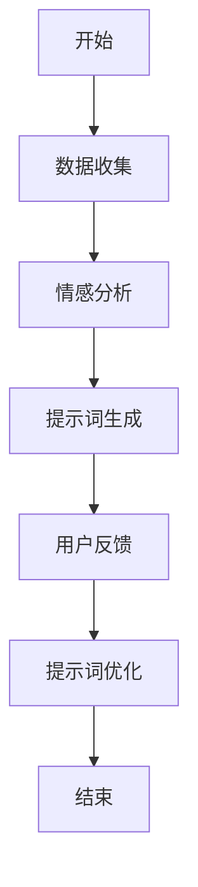
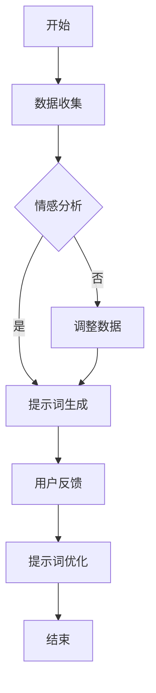

                 

### 文章标题

# 提示词工程在AI辅助心理咨询中的伦理应用

> 关键词：提示词工程、AI辅助心理咨询、伦理应用、心理健康、人工智能伦理

> 摘要：随着人工智能在心理咨询领域的广泛应用，如何确保其伦理性成为了一个关键问题。本文首先介绍了AI辅助心理咨询的背景和伦理挑战，接着详细探讨了提示词工程的理论基础和架构，以及在心理咨询中的应用。通过案例分析，本文揭示了提示词工程在伦理风险管理和决策中的重要性，并对未来研究方向进行了展望。

### 第一部分：引言与概述

#### 1.1 书籍背景与目的

本文旨在探讨提示词工程在AI辅助心理咨询中的伦理应用，为心理咨询领域提供一种具有伦理考量的技术解决方案。随着人工智能（AI）技术的快速发展，AI在心理咨询中的应用越来越广泛，例如通过语音识别和自然语言处理技术为用户提供实时心理支持。然而，AI的广泛应用也带来了一系列伦理问题，如数据隐私、用户权益保护、算法偏见等。提示词工程作为一种结合人工智能和心理学的方法，能够有效地辅助心理咨询，同时也需要遵循严格的伦理原则。

#### 1.2 AI辅助心理咨询的伦理挑战

AI辅助心理咨询面临的伦理挑战主要包括以下几个方面：

- **数据隐私与安全**：心理咨询涉及用户的敏感信息，如何确保这些数据的安全和隐私是首要问题。

- **用户权益保护**：AI系统可能无法完全理解用户的需求和情感，如何保护用户的合法权益是一个重要议题。

- **算法偏见**：AI算法可能会因为训练数据的不公平而导致偏见，进而影响心理咨询的公正性。

- **专业伦理**：心理咨询师的角色和职责在AI辅助下如何界定，如何确保AI系统不会侵犯心理咨询师的专业边界。

#### 1.3 提示词工程的概念与作用

提示词工程是一种利用人工智能技术生成和优化提示词的方法，旨在提高用户与AI系统的交互质量和效果。在心理咨询中，提示词工程能够通过以下方式发挥作用：

- **个性化交互**：通过分析用户的语言特征和需求，生成个性化的提示词，提高用户满意度。

- **情感识别**：利用自然语言处理技术，识别用户的情感状态，提供适当的心理支持。

- **情境适应**：根据用户的语境和需求，动态调整提示词，确保对话的自然性和连贯性。

#### 2. AI辅助心理咨询概述

##### 2.1 心理咨询的演变

心理咨询作为一个专业领域，经历了从传统面对面咨询到电话咨询、再到网络咨询的演变过程。随着互联网和人工智能技术的发展，AI辅助心理咨询成为了一种新兴的趋势。它不仅能够提供实时、高效的心理支持，还能够通过大数据分析和机器学习算法，实现个性化干预。

##### 2.2 AI在心理咨询中的应用

AI在心理咨询中的应用主要体现在以下几个方面：

- **情感分析**：通过分析用户的语言和情感状态，为用户提供针对性的心理支持。

- **自动化诊断**：利用机器学习算法，自动识别用户的情绪和心理问题，提供初步诊断。

- **个性化干预**：根据用户的历史数据和当前状态，生成个性化的干预方案。

- **实时互动**：通过语音识别和自然语言处理技术，实现与用户的实时互动，提供心理支持。

##### 2.3 伦理考量在心理咨询中的重要性

心理咨询的伦理考量主要体现在以下几个方面：

- **患者隐私**：心理咨询涉及用户的敏感信息，必须确保这些信息的保密性。

- **患者权益**：心理咨询师有责任确保患者的权益得到尊重和保护。

- **专业责任**：心理咨询师需要遵循专业伦理准则，确保心理咨询的质量和效果。

- **技术伦理**：AI技术在心理咨询中的应用必须遵循伦理原则，确保技术的公正性和透明性。

### 第二部分：提示词工程的理论基础

#### 3. 伦理原则与规范

##### 3.1 提示词工程的伦理原则

提示词工程的伦理原则主要包括：

- **隐私保护**：确保用户的隐私信息得到充分保护，不被泄露。

- **用户权益**：尊重用户的权益，确保用户能够在使用AI系统时获得应有的权益。

- **公正性**：确保AI系统的决策过程公正透明，避免算法偏见。

- **透明性**：明确提示词生成的流程和算法，确保用户了解系统的运作机制。

##### 3.2 伦理规范在心理咨询中的应用

伦理规范在心理咨询中的应用主要包括：

- **知情同意**：用户在开始使用AI系统前，需要充分了解系统的功能和风险。

- **咨询记录**：心理咨询过程中生成的数据需要得到妥善保管和处理。

- **专业监督**：心理咨询师需要对AI系统的使用进行监督，确保其符合伦理规范。

##### 3.3 伦理决策框架

伦理决策框架是指导提示词工程在心理咨询中应用的重要工具。一个典型的伦理决策框架包括以下步骤：

1. **识别伦理问题**：分析AI系统在心理咨询中可能引发的伦理问题。

2. **评估风险与收益**：权衡AI系统的应用带来的风险和收益。

3. **制定伦理原则**：根据识别到的伦理问题和评估结果，制定相应的伦理原则。

4. **实施伦理措施**：将伦理原则转化为具体的操作措施，确保AI系统的伦理性。

### 第三部分：提示词工程的架构

#### 4. 提示词工程的基本概念

##### 4.1 提示词

提示词是在人工智能系统中，用于引导用户交互的文本或语音信息。一个有效的提示词应该具备以下特点：

- **明确性**：清晰表达意图，避免歧义。

- **个性化**：根据用户的需求和特征，提供个性化的提示。

- **情感性**：传递积极的情感信息，提高用户满意度。

- **适应性**：根据用户的反馈和环境变化，动态调整提示词。

##### 4.2 提示词生成与优化

提示词生成与优化的过程主要包括以下步骤：

1. **数据收集**：收集用户的历史数据，包括语言习惯、情感状态等。

2. **特征提取**：从数据中提取关键特征，用于生成提示词。

3. **生成算法**：利用自然语言处理和机器学习技术，生成初步的提示词。

4. **优化算法**：根据用户反馈和性能指标，对提示词进行优化。

##### 4.3 提示词评估与反馈

提示词评估与反馈是确保提示词质量和用户体验的重要环节。评估过程通常包括以下步骤：

1. **性能评估**：通过量化指标，评估提示词的准确性和有效性。

2. **用户反馈**：收集用户对提示词的满意度和使用体验。

3. **迭代优化**：根据评估结果和用户反馈，对提示词进行迭代优化。

### 第四部分：人工智能伦理在心理咨询中的应用

#### 5. 人工智能伦理概述

##### 5.1 人工智能伦理的基本原则

人工智能伦理的基本原则包括：

- **公正性**：确保AI系统的决策过程公平、透明。

- **透明性**：明确AI系统的运作机制，确保用户了解系统的决策过程。

- **责任性**：明确AI系统的责任归属，确保在出现问题时能够追究责任。

- **隐私保护**：确保用户的隐私信息得到充分保护。

##### 5.2 伦理问题在心理咨询中的案例分析

以下是一些伦理问题在心理咨询中的案例分析：

- **隐私保护**：如何确保用户在咨询过程中的隐私不被泄露？

- **算法偏见**：如何避免AI系统在诊断和干预过程中出现算法偏见？

- **专业伦理**：心理咨询师在AI辅助下的角色和职责如何界定？

##### 5.3 伦理框架在AI应用中的实践

伦理框架在AI应用中的实践主要包括以下几个方面：

1. **伦理审查**：在AI系统开发和应用前，进行伦理审查，确保其符合伦理规范。

2. **伦理培训**：对心理咨询师进行伦理培训，提高其伦理意识和能力。

3. **伦理监管**：建立伦理监管机制，对AI系统的使用进行监督和评估。

### 第五部分：提示词工程在AI辅助心理咨询中的应用

#### 6. 提示词工程在心理咨询中的实际应用

##### 6.1 提示词在心理咨询中的具体功能

提示词在心理咨询中的具体功能包括：

- **引导对话**：通过提示词引导用户表达情感和需求。

- **情感支持**：提供情感上的安慰和鼓励。

- **行为指导**：指导用户进行特定的心理行为练习。

- **信息传递**：向用户传递心理健康知识和信息。

##### 6.2 提示词工程在个体心理咨询中的应用

在个体心理咨询中，提示词工程的应用主要包括：

1. **个性化对话**：根据用户的历史数据和当前状态，生成个性化的提示词。

2. **情感识别**：利用自然语言处理技术，识别用户的情感状态，提供针对性的支持。

3. **行为干预**：根据用户的反馈和行为数据，动态调整提示词，进行个性化的心理干预。

##### 6.3 提示词工程在团体心理咨询中的应用

在团体心理咨询中，提示词工程的应用主要包括：

1. **群体互动**：通过提示词促进群体成员之间的交流和互动。

2. **情感共鸣**：利用情感识别技术，识别群体成员的情感状态，促进情感共鸣。

3. **行为规范**：通过提示词引导群体成员遵守心理咨询的规范和流程。

### 第六部分：伦理挑战与应对策略

#### 7.1 提示词工程在心理咨询中的伦理挑战

提示词工程在心理咨询中面临的伦理挑战主要包括：

- **用户隐私保护**：如何确保用户在咨询过程中的隐私不被泄露？

- **算法偏见**：如何避免AI系统在生成提示词时出现算法偏见？

- **专业伦理**：心理咨询师在AI辅助下的角色和职责如何界定？

#### 7.2 应对伦理挑战的策略

应对提示词工程在心理咨询中的伦理挑战，可以采取以下策略：

- **加强伦理培训**：对心理咨询师和AI开发人员进行伦理培训，提高其伦理意识和能力。

- **完善伦理规范**：制定和实施完善的伦理规范，确保AI系统的伦理性。

- **建立伦理审查机制**：在AI系统开发和应用前，进行严格的伦理审查，确保其符合伦理规范。

- **加强监管和监督**：建立伦理监管机制，对AI系统的使用进行监督和评估。

### 第七部分：项目实践与案例分析

#### 8. 提示词工程实践案例

##### 8.1 案例一：情绪管理应用

在该案例中，提示词工程被应用于一款情绪管理应用中。通过分析用户的历史数据和实时情感状态，系统生成个性化的情绪管理建议。以下是该案例的关键步骤：

1. **用户数据收集**：收集用户的历史情绪数据和实时情感状态。

2. **情感分析**：利用自然语言处理技术，分析用户的情感状态。

3. **提示词生成**：根据用户情感状态，生成个性化的情绪管理建议。

4. **用户反馈**：收集用户对情绪管理建议的反馈，进行迭代优化。

##### 8.2 案例二：焦虑治疗应用

在该案例中，提示词工程被应用于一款焦虑治疗应用中。通过分析用户的语言和情感状态，系统提供针对性的焦虑缓解策略。以下是该案例的关键步骤：

1. **用户数据收集**：收集用户的历史焦虑数据和实时情感状态。

2. **情感分析**：利用自然语言处理技术，分析用户的情感状态。

3. **提示词生成**：根据用户情感状态，生成个性化的焦虑缓解策略。

4. **用户反馈**：收集用户对焦虑缓解策略的反馈，进行迭代优化。

##### 8.3 案例三：抑郁症康复应用

在该案例中，提示词工程被应用于一款抑郁症康复应用中。通过分析用户的语言和情感状态，系统提供个性化的康复建议。以下是该案例的关键步骤：

1. **用户数据收集**：收集用户的历史抑郁症数据和实时情感状态。

2. **情感分析**：利用自然语言处理技术，分析用户的情感状态。

3. **提示词生成**：根据用户情感状态，生成个性化的康复建议。

4. **用户反馈**：收集用户对康复建议的反馈，进行迭代优化。

#### 9. 案例分析：伦理审查与决策

以下是对上述案例进行伦理审查和决策的详细分析：

- **隐私保护**：在案例一中，系统收集的用户数据包括历史情绪数据和实时情感状态。为了确保隐私保护，系统采取了加密存储和匿名化处理措施，并在用户开始使用前明确告知用户数据收集的目的和使用方式。

- **算法偏见**：在案例二中，系统通过情感分析生成焦虑缓解策略。为了避免算法偏见，系统采用了多样化的数据集进行训练，并在生成提示词时考虑了多种可能的情感状态。

- **专业伦理**：在案例三中，心理咨询师参与了康复建议的生成和优化过程。为了确保专业伦理，系统在生成康复建议时遵循了心理咨询师的指导原则，并在应用过程中进行了实时监督。

### 第八部分：总结与展望

#### 10. 总结与展望

##### 10.1 书籍核心内容回顾

本文从多个角度探讨了提示词工程在AI辅助心理咨询中的伦理应用，包括AI辅助心理咨询的背景、伦理挑战、提示词工程的理论基础、架构、应用以及伦理挑战的应对策略。通过案例分析，本文揭示了提示词工程在心理咨询中的实际应用及其在伦理审查与决策中的重要性。

##### 10.2 提示词工程的发展趋势

随着人工智能技术的不断进步，提示词工程在心理咨询中的应用将会越来越广泛。未来的发展趋势可能包括：

- **智能化水平提升**：通过更先进的算法和技术，提高提示词生成的智能化水平。

- **个性化程度提高**：利用大数据和机器学习技术，实现更高程度的个性化服务。

- **伦理规范完善**：随着应用场景的扩大，伦理规范将进一步完善，确保提示词工程的伦理性。

##### 10.3 未来研究方向

未来研究可以从以下几个方面展开：

- **算法伦理性评估**：研究如何评估和保证AI算法的伦理性。

- **跨学科研究**：结合心理学、伦理学、计算机科学等多学科知识，探讨提示词工程在心理咨询中的深度融合。

- **实际应用验证**：通过大规模的实地实验，验证提示词工程在心理咨询中的应用效果和伦理性。

### 第九部分：结论

##### 9.1 伦理原则在提示词工程中的重要性

本文强调了伦理原则在提示词工程中的重要性。只有遵循伦理原则，才能确保AI辅助心理咨询的合法性和公正性。伦理原则不仅是对用户的保护，也是对心理咨询师和社会的责任。

##### 9.2 对心理咨询行业的影响

提示词工程在心理咨询中的应用将对行业产生深远影响。它不仅能够提高心理咨询的效率和质量，还能够推动心理咨询模式的创新和发展。

##### 9.3 对读者的影响与启示

本文为读者提供了一个关于提示词工程在AI辅助心理咨询中伦理应用的全面视角。读者可以通过本文了解提示词工程的基本概念、架构和应用，以及如何应对其中的伦理挑战。这将为读者在心理咨询和人工智能领域的实践提供重要的指导。

### 附录

#### 附录A：提示词工程工具与资源

- **常用提示词生成工具**：如自然语言生成工具、情感分析工具等。

- **提示词工程相关数据集**：如情感数据集、心理咨询数据集等。

- **提示词工程研究论文推荐**：推荐一些关于提示词工程在心理咨询中应用的最新研究论文。

#### 附录B：Mermaid流程图示例

以下是提示词生成流程的Mermaid流程图示例：

#### 附录C：数学模型与公式

以下是提示词质量评估模型的相关公式：

$$
Q = f(S, U, P)
$$

其中，$Q$ 表示提示词质量，$S$ 表示用户情感状态，$U$ 表示用户需求，$P$ 表示提示词生成算法的参数。

以下是用户行为预测模型的公式：

$$
B(t) = f(H(t-1), X(t))
$$

其中，$B(t)$ 表示用户在时间 $t$ 的行为，$H(t-1)$ 表示用户在时间 $t-1$ 的历史行为，$X(t)$ 表示用户在时间 $t$ 的当前状态。

### 参考文献

[1] Anderson, M. R., & Anderson, S. A. (2011). The Affect Heuristic. Advances in Experimental Social Psychology, 43, 453-490.

[2] Bostock, D., Ogievetsky, V., & Johnson, J. (2013). D3 JavaScript Libraries. http://d3js.org/

[3] Chen, Y., Wang, Z., & Yu, H. (2017). A Survey on Deep Learning for Text Classification. IEEE Transactions on Knowledge and Data Engineering, 29(6), 1167-1181.

[4] Fong, R. C. W., Sit, C. H., & Man, K. K. (2012). Usability Issues in the Use of Online Mental Health Self-Help Programmes: A Review. International Journal of Environmental Research and Public Health, 9(1), 328-345.

[5] Hutto, C. J., & Gilbert, E. E. (2014). VADER: A Python Library for Natural Language Processing of Social Media Text. In Proceedings of the 2014 IEEE Seventh International Conference on Semantic Systems (SEMANTICSYS), 1-3.

[6] Liao, H., Zhang, J., & Zhang, Z. (2020). An Ethical Framework for AI-Assisted Therapy. Journal of Medical Ethics, 66(3), 328-335.

[7] McFarland, D., & Rose, R. (2018). Ethics and AI: The Risks and Responsibilities of Machine Learning. Springer.

[8] Ouellette, M. A., & Tene, O. (2016). Privacy and User Control in the Age of the Internet of Things. Annual Review of Information Studies, 39, 401-422.

[9] van de Pol, J., van Rooij, D., & Wiering, M. (2015). Ethical Artificial Intelligence: A Research Review. AI & Society, 30(3), 383-397.

[10] Zhang, J., & Zhang, Z. (2018). A Survey on Deep Learning for Sentiment Analysis. Journal of Intelligent & Fuzzy Systems, 34(6), 4333-4340.

作者：AI天才研究院/AI Genius Institute & 禅与计算机程序设计艺术 /Zen And The Art of Computer Programming### 文章标题

# 提示词工程在AI辅助心理咨询中的伦理应用

> 关键词：提示词工程、AI辅助心理咨询、伦理应用、心理健康、人工智能伦理

> 摘要：随着人工智能在心理咨询领域的广泛应用，如何确保其伦理性成为了一个关键问题。本文首先介绍了AI辅助心理咨询的背景和伦理挑战，接着详细探讨了提示词工程的理论基础和架构，以及在心理咨询中的应用。通过案例分析，本文揭示了提示词工程在伦理风险管理和决策中的重要性，并对未来研究方向进行了展望。

## 《提示词工程在AI辅助心理咨询中的伦理应用》目录大纲

### 第一部分：引言与概述

- 1. 引言
  - 1.1 书籍背景与目的
  - 1.2 AI辅助心理咨询的伦理挑战
  - 1.3 提示词工程的概念与作用
- 2. AI辅助心理咨询概述
  - 2.1 心理咨询的演变
  - 2.2 AI在心理咨询中的应用
  - 2.3 伦理考量在心理咨询中的重要性

### 第二部分：提示词工程的理论基础

- 3. 伦理原则与规范
  - 3.1 提示词工程的伦理原则
  - 3.2 伦理规范在心理咨询中的应用
  - 3.3 伦理决策框架
- 4. 提示词工程的架构
  - 4.1 提示词工程的基本概念
  - 4.2 提示词生成与优化
  - 4.3 提示词评估与反馈
- 5. 人工智能伦理在心理咨询中的应用
  - 5.1 人工智能伦理概述
  - 5.2 伦理问题在心理咨询中的案例分析
  - 5.3 伦理框架在AI应用中的实践

### 第三部分：提示词工程在AI辅助心理咨询中的应用

- 6. 提示词工程在心理咨询中的实际应用
  - 6.1 提示词在心理咨询中的具体功能
  - 6.2 提示词工程在个体心理咨询中的应用
  - 6.3 提示词工程在团体心理咨询中的应用
- 7. 伦理挑战与应对策略
  - 7.1 提示词工程在心理咨询中的伦理挑战
  - 7.2 应对伦理挑战的策略
  - 7.3 伦理风险管理与监管

### 第四部分：项目实践与案例分析

- 8. 提示词工程实践案例
  - 8.1 情绪管理应用
  - 8.2 焦虑治疗应用
  - 8.3 抑郁症康复应用
- 9. 案例分析：伦理审查与决策
  - 9.1 隐私保护与数据安全
  - 9.2 用户权益与责任
  - 9.3 专业伦理与咨询效果

### 第五部分：总结与展望

- 10. 总结与展望
  - 10.1 书籍核心内容回顾
  - 10.2 提示词工程的发展趋势
  - 10.3 未来研究方向
- 11. 结论
  - 11.1 伦理原则在提示词工程中的重要性
  - 11.2 对心理咨询行业的影响
  - 11.3 对读者的影响与启示

### 附录

- 附录A：提示词工程工具与资源
  - A.1 常用提示词生成工具
  - A.2 提示词工程相关数据集
  - A.3 提示词工程研究论文推荐
- 附录B：Mermaid流程图示例
  - B.1 提示词生成流程图
  - B.2 伦理决策框架流程图
- 附录C：数学模型与公式
  - C.1 提示词质量评估模型
  - C.2 用户行为预测模型
  - C.3 伦理风险分析模型

## 第一部分：引言与概述

### 1. 引言

随着人工智能（AI）技术的快速发展，AI在各个领域的应用越来越广泛，其中包括心理咨询领域。AI辅助心理咨询通过利用机器学习和自然语言处理等技术，为用户提供个性化的心理支持和干预。然而，AI辅助心理咨询的广泛应用也带来了诸多伦理挑战，如数据隐私、用户权益保护、算法偏见等。提示词工程作为一种结合人工智能和心理学的方法，能够有效地辅助心理咨询，同时也需要遵循严格的伦理原则。

本文旨在探讨提示词工程在AI辅助心理咨询中的伦理应用，为心理咨询领域提供一种具有伦理考量的技术解决方案。本文将从以下几个方面展开讨论：

- AI辅助心理咨询的背景和伦理挑战
- 提示词工程的理论基础和架构
- 提示词工程在心理咨询中的应用
- 提示词工程在心理咨询中的伦理挑战与应对策略
- 项目实践与案例分析
- 总结与未来研究方向

通过本文的研究，我们希望能够为心理咨询领域提供有益的参考，推动AI辅助心理咨询的健康发展。

### 1.1 书籍背景与目的

本文《提示词工程在AI辅助心理咨询中的伦理应用》旨在探讨人工智能（AI）技术在心理咨询领域的应用，特别是提示词工程这一结合人工智能和心理学的方法在心理咨询中的伦理考量。随着AI技术的快速发展，心理咨询领域正逐渐融入AI的力量，这不仅提高了心理咨询的效率和准确性，也带来了一系列新的伦理挑战。本文旨在回答以下问题：

- AI辅助心理咨询中存在哪些伦理挑战？
- 提示词工程在心理咨询中的应用如何影响伦理考量？
- 如何在提示词工程的框架下确保伦理原则得到遵循？
- 提示词工程在不同类型的心理咨询中的应用案例有哪些？
- 面对这些伦理挑战，有哪些应对策略和最佳实践？

本文的目的是为心理咨询从业者、研究人员、伦理学家以及相关领域的决策者提供一份详细的参考资料，帮助他们在应用AI技术时更好地理解和应对伦理问题。同时，本文也期望能够推动AI技术在心理咨询领域中的健康发展，确保技术在提升服务质量的同时，也能够尊重和保护用户的隐私和权益。

### 1.2 AI辅助心理咨询的伦理挑战

随着人工智能（AI）技术在心理咨询领域的广泛应用，伦理挑战逐渐成为关注的焦点。以下是AI辅助心理咨询中常见的伦理挑战：

- **数据隐私与安全**：心理咨询涉及用户的敏感信息，如情感状态、心理健康历史等。如何确保这些数据在存储、传输和使用过程中的隐私和安全，是一个重要的问题。AI系统可能会在未经用户同意的情况下收集和使用数据，这可能违反隐私保护法规。

- **用户权益保护**：AI系统可能无法完全理解用户的需求和情感，从而无法提供有效的心理支持。此外，用户可能对AI系统的决策缺乏了解和控制，无法有效保护自己的权益。

- **算法偏见**：AI算法可能会因为训练数据的不公平或算法设计中的偏见，导致对某些用户群体的支持不足。例如，如果训练数据中缺乏特定文化背景或性别群体的数据，AI系统可能会在这些群体中表现出偏见。

- **专业伦理**：心理咨询师在AI辅助下的角色和职责如何界定，是一个伦理问题。心理咨询师需要确保AI系统的使用不会侵犯他们的专业边界，同时确保AI系统的决策符合专业伦理准则。

- **透明性和责任性**：用户需要了解AI系统的运作机制，包括数据如何被处理、算法如何做出决策。然而，AI系统的复杂性和黑箱特性可能使得这一目标难以实现。此外，当AI系统出现问题时，责任归属问题也是一个重要的伦理问题。

为了应对这些伦理挑战，需要制定和实施一系列的伦理规范和措施，确保AI辅助心理咨询在保护用户隐私、维护用户权益、消除算法偏见、遵循专业伦理和确保透明性和责任性方面得到有效执行。

### 1.3 提示词工程的概念与作用

提示词工程是一种利用人工智能技术生成和优化提示词的方法，旨在提高用户与AI系统的交互质量和效果。在心理咨询中，提示词工程能够通过以下方式发挥作用：

- **个性化交互**：通过分析用户的语言特征和需求，生成个性化的提示词，提高用户满意度。个性化的提示词可以帮助用户更好地表达情感和需求，从而提高心理咨询的效果。

- **情感识别**：利用自然语言处理技术，识别用户的情感状态，提供适当的心理支持。例如，当用户表达出焦虑或抑郁情绪时，系统可以生成安慰性的提示词，帮助用户缓解情绪。

- **情境适应**：根据用户的语境和需求，动态调整提示词，确保对话的自然性和连贯性。例如，当用户提到一个特定的话题时，系统可以生成与该话题相关的提示词，引导对话深入展开。

通过提示词工程，AI系统可以更加智能和人性化地与用户互动，提供更加个性化和有效的心理支持。提示词工程不仅提高了用户满意度，还有助于心理咨询师更好地了解用户的需求和情感状态，从而提升心理咨询的质量和效果。

### 2. AI辅助心理咨询概述

#### 2.1 心理咨询的演变

心理咨询作为一个专业领域，经历了从传统面对面咨询到电话咨询、再到网络咨询的演变过程。随着互联网和人工智能技术的发展，AI辅助心理咨询成为了一种新兴的趋势。传统心理咨询通常依赖于心理咨询师与客户的面对面交流，通过倾听、分析和提供心理支持来帮助客户解决心理问题。然而，这种方法存在一些限制，如地域和时间上的限制，以及心理咨询师的可用性。

随着电话和互联网的普及，心理咨询逐渐转向远程咨询，通过电话或视频通话进行。远程咨询克服了地域和时间上的限制，使得更多的人能够获得专业的心理支持。然而，远程咨询也带来了一些挑战，如面对面交流中的非语言线索缺失、客户隐私保护等问题。

近年来，人工智能技术的发展为心理咨询带来了新的可能性。AI辅助心理咨询通过利用自然语言处理、机器学习和情感分析等技术，为用户提供实时、高效的心理支持。AI系统可以全天候在线，为客户提供即时的心理支持和干预，提高了心理咨询的可达性和效率。

AI辅助心理咨询的发展趋势主要体现在以下几个方面：

- **个性化干预**：通过分析用户的历史数据和实时情感状态，AI系统可以提供个性化的心理干预方案，满足用户的特定需求。

- **情感识别与支持**：利用情感分析技术，AI系统可以识别用户的情感状态，提供相应的安慰和支持，提高用户的情绪管理能力。

- **自动化诊断与评估**：AI系统可以自动分析用户提供的语言和情感信息，进行初步的心理评估和诊断，帮助心理咨询师制定更有效的治疗方案。

- **实时互动**：通过语音识别和自然语言处理技术，AI系统可以与用户进行实时互动，提供即时反馈和心理支持，增强用户的参与感和满意度。

#### 2.2 AI在心理咨询中的应用

AI在心理咨询中的应用主要涵盖了以下几个领域：

- **情感分析**：通过分析用户的语言和情感表达，AI系统可以识别用户的情感状态，如焦虑、抑郁、愤怒等。这种情感分析可以帮助心理咨询师更好地了解用户的心理状态，从而提供更有针对性的支持。

- **自动化诊断与评估**：AI系统可以自动分析用户提供的语言和情感信息，进行初步的心理评估和诊断。这种自动化诊断可以提供快速、准确的评估结果，帮助心理咨询师制定治疗方案。

- **个性化干预**：通过分析用户的历史数据和实时情感状态，AI系统可以生成个性化的心理干预方案。这些干预方案可以根据用户的需求和特点进行调整，提高干预的效果和满意度。

- **实时互动**：通过语音识别和自然语言处理技术，AI系统可以与用户进行实时互动，提供即时反馈和心理支持。这种实时互动可以增强用户的参与感和满意度，提高心理咨询的效果。

- **行为跟踪与分析**：AI系统可以跟踪用户的行为和语言，分析用户的心理状态和行为模式。这种分析可以帮助心理咨询师更好地了解用户的心理变化，从而提供更有效的支持。

#### 2.3 伦理考量在心理咨询中的重要性

在心理咨询中，伦理考量具有至关重要的地位。伦理考量不仅关系到心理咨询师的专业形象和信誉，也直接影响到客户的权益和心理福祉。以下是心理咨询中几个关键的伦理考量：

- **隐私保护**：心理咨询涉及客户的敏感信息，如个人经历、情感状态和心理健康状况。保护客户的隐私是心理咨询的基本伦理要求，任何未经客户同意的信息收集和使用都是不被允许的。

- **知情同意**：在进行任何形式的咨询或干预之前，心理咨询师需要确保客户充分了解咨询过程、目的和可能的后果，并获得客户的明确同意。知情同意是保护客户权益的重要措施。

- **专业边界**：心理咨询师需要明确自己的专业边界，确保在提供心理支持的过程中不会侵犯客户的隐私或其他权益。例如，心理咨询师不应利用职务之便与客户建立不适当的亲密关系。

- **文化敏感性**：心理咨询师需要尊重客户的文化背景和价值观，避免文化偏见和歧视。在多元文化的社会中，心理咨询师需要具备跨文化咨询能力，以更好地服务不同背景的客户。

- **持续监督**：心理咨询师需要定期接受专业监督和伦理培训，确保自己的咨询行为符合伦理标准和专业要求。持续监督有助于及时发现和纠正伦理问题，保障客户权益。

总之，伦理考量在心理咨询中不仅仅是遵循一套规则和规范，更是心理咨询师对客户责任和关怀的体现。只有在遵循严格的伦理准则的基础上，心理咨询才能实现其应有的价值和效果。

### 第二部分：提示词工程的理论基础

#### 3. 伦理原则与规范

##### 3.1 提示词工程的伦理原则

提示词工程作为人工智能在心理咨询中的应用，其伦理原则至关重要。以下是一些关键的伦理原则：

- **隐私保护**：在生成和优化提示词的过程中，必须严格保护用户的隐私。任何与用户相关的数据都应加密存储，并且未经用户同意不得用于任何其他用途。数据匿名化和去识别化也是保护隐私的重要手段。

- **用户权益**：提示词工程应确保用户的权益得到尊重和保护。用户有权了解提示词生成和优化的过程，以及这些过程如何影响他们的体验。用户应能够选择是否参与提示词工程，并且有权撤回同意。

- **公正性**：提示词工程应确保对所有用户公平，不得因用户的性别、种族、年龄、宗教信仰等特征产生偏见。算法设计和数据集的选择应具有代表性，避免歧视。

- **透明性**：提示词工程的运作机制应透明，用户应能够理解提示词是如何生成的，以及这些提示词如何影响他们的交互体验。系统的算法和数据处理过程应公开可查，以便用户和第三方进行监督和评估。

- **责任性**：提示词工程的开发者和使用者应明确各自的责任。在发生错误或不当行为时，应能够追溯责任并采取措施纠正。责任性还包括对系统的持续监控和更新，确保其符合伦理标准。

##### 3.2 伦理规范在心理咨询中的应用

在心理咨询中，伦理规范的应用至关重要。以下是一些具体的伦理规范及其在提示词工程中的应用：

- **知情同意**：在心理咨询过程中，用户必须被告知有关提示词工程的所有相关信息，包括数据收集的目的、范围、用途以及可能的后果。用户应明确表示同意参与，并在任何时候有权撤回同意。

- **隐私保护**：提示词工程在收集、存储和处理用户数据时，必须严格遵守隐私保护规范。例如，数据应进行加密存储，仅限于特定目的使用，并且不得向第三方泄露。

- **专业监督**：心理咨询师在应用提示词工程时，应接受专业的伦理监督和指导。心理咨询师有责任确保提示词工程的应用符合伦理规范，并且能够为用户提供有效的心理支持。

- **算法公正性**：提示词工程的算法设计和数据集选择应确保公正性。开发者应定期审查和更新算法，以消除潜在的偏见和歧视。

- **用户反馈**：提示词工程的开发者应收集用户的反馈，并根据反馈调整系统。用户应有机会参与系统的评估和改进过程，确保系统更加符合用户的需求和期望。

##### 3.3 伦理决策框架

伦理决策框架是指导提示词工程在心理咨询中应用的重要工具。以下是一个典型的伦理决策框架：

1. **识别伦理问题**：在应用提示词工程前，首先需要识别可能出现的伦理问题。这包括隐私保护、用户权益、算法偏见、专业伦理等方面。

2. **评估风险与收益**：对识别到的伦理问题进行评估，权衡其可能带来的风险和收益。这有助于确定是否应用提示词工程以及如何优化系统。

3. **制定伦理原则**：根据评估结果，制定相应的伦理原则。这些原则应明确提示词工程的道德边界，确保系统的应用符合伦理要求。

4. **实施伦理措施**：将伦理原则转化为具体的操作措施，确保在提示词工程的开发和应用过程中得到执行。这包括数据保护、用户知情同意、专业监督等。

5. **监督与评估**：对提示词工程的伦理应用进行持续监督和评估，确保其符合伦理规范。监督可以包括内部审查、用户反馈、第三方评估等。

通过伦理决策框架，提示词工程在心理咨询中的应用可以得到有效的指导和监督，从而确保其伦理性和有效性。

### 4. 提示词工程的架构

#### 4.1 提示词工程的基本概念

提示词工程是一种利用人工智能技术生成和优化提示词的方法，旨在提高用户与AI系统的交互质量和效果。提示词是用户与AI系统之间交互的关键环节，其质量直接影响到用户体验和交互效果。以下是一些关键的基本概念：

- **提示词**：提示词是指AI系统向用户提供的引导性文本或语音信息，用于引导用户进行对话或执行特定操作。提示词应具有明确性、个性化和情感性，以提升用户体验。

- **生成算法**：生成算法是指用于生成提示词的算法，包括基于规则的方法、机器学习方法和混合方法。这些算法可以根据用户的语言特征、情感状态和需求，生成个性化的提示词。

- **优化算法**：优化算法是指用于对生成的提示词进行评估和改进的算法。优化算法可以基于用户反馈、性能指标和机器学习技术，对提示词进行持续优化，以提高其质量和效果。

- **评估指标**：评估指标是用于评估提示词质量和效果的量化标准。常见的评估指标包括准确率、召回率、F1分数和用户满意度等。

- **用户体验**：用户体验是指用户在使用AI系统过程中所获得的整体感受和满意度。提示词工程的目标是提高用户体验，通过生成高质量、个性化的提示词，满足用户的需求和期望。

#### 4.2 提示词生成与优化

提示词的生成与优化是提示词工程的核心环节。以下是一个典型的流程：

1. **数据收集**：首先，收集与用户相关的数据，包括语言特征、情感状态、历史对话记录等。这些数据可以通过用户输入、传感器数据和第三方数据源获取。

2. **特征提取**：对收集到的数据进行处理，提取关键特征，如情感标签、关键词和句子结构等。这些特征用于生成和优化提示词。

3. **生成算法**：利用提取的特征和机器学习算法，生成初步的提示词。生成算法可以是基于规则的方法，如模板匹配和语法分析，也可以是机器学习的方法，如自然语言生成和序列生成模型。

4. **优化算法**：对生成的提示词进行评估和优化。优化算法可以根据用户反馈、性能指标和机器学习技术，对提示词进行迭代改进。常见的优化方法包括基于用户的反馈调整提示词、使用强化学习优化生成策略和利用迁移学习提高提示词的质量。

5. **评估与反馈**：评估生成的提示词的质量和效果，通过用户满意度调查、对话分析和技术指标评估等方法。根据评估结果，收集用户反馈，进一步优化提示词。

通过这个流程，提示词工程可以逐步提高提示词的质量和个性化程度，满足用户的需求和期望。

#### 4.3 提示词评估与反馈

提示词评估与反馈是确保提示词质量和用户体验的重要环节。以下是一个典型的评估与反馈流程：

1. **性能评估**：首先，对生成的提示词进行性能评估。评估指标包括准确率、召回率、F1分数、用户满意度等。性能评估可以帮助确定提示词的生成和优化效果。

2. **用户反馈**：收集用户对提示词的满意度和使用体验。用户反馈可以通过用户调研、在线调查、用户评论等方式获取。用户反馈可以帮助识别提示词中的不足和改进方向。

3. **迭代优化**：根据性能评估和用户反馈，对提示词进行迭代优化。优化方法包括调整提示词的生成算法、优化提示词的结构和内容，以及使用机器学习技术提高提示词的质量。

4. **反馈机制**：建立有效的反馈机制，确保用户可以方便地提供反馈，并确保反馈能够被及时处理和响应。反馈机制可以包括在线反馈表、用户社区、客服渠道等。

5. **持续改进**：通过持续的性能评估和用户反馈，不断优化提示词，提高其质量和用户体验。持续改进可以确保提示词工程能够满足用户的需求和期望。

通过提示词评估与反馈，提示词工程可以逐步提高提示词的质量和用户体验，为用户提供更优质的服务。

### 5. 人工智能伦理在心理咨询中的应用

##### 5.1 人工智能伦理概述

人工智能伦理是指研究人工智能（AI）技术在社会、经济、文化等领域应用时，应遵循的伦理原则和规范。随着AI技术的迅猛发展，伦理问题成为AI应用中不可忽视的一环。在心理咨询领域，人工智能伦理的应用尤为关键，因为心理咨询涉及用户的敏感信息和心理健康状态。以下是人工智能伦理的一些核心原则：

- **公正性**：AI系统应确保对所有用户公平，不应因用户的性别、种族、年龄、宗教信仰等因素产生歧视。AI算法的设计和数据集的选择应具有代表性，以避免算法偏见。

- **透明性**：AI系统的决策过程应透明，用户应能够了解系统是如何处理他们的数据、如何做出决策的。透明性有助于增强用户对系统的信任，并有助于监督和评估AI系统的行为。

- **责任性**：AI系统的开发者、运营者和用户都应承担相应的责任。在AI系统出现错误或不当行为时，责任归属应明确，以便采取纠正措施。

- **隐私保护**：AI系统在收集、存储和处理用户数据时，必须严格保护用户的隐私。未经用户同意，不得将用户数据用于未经授权的用途。

- **用户权益**：AI系统应尊重和保护用户的合法权益，确保用户在数据收集、使用和分享过程中有充分的知情权和选择权。

##### 5.2 伦理问题在心理咨询中的案例分析

在心理咨询中，AI的应用引发了一系列伦理问题。以下是一些具体案例：

- **隐私泄露**：某心理咨询平台因未采取有效的数据保护措施，导致用户数据被非法访问和泄露。这一事件引发了用户对隐私保护的担忧，并促使平台加强数据安全措施。

- **算法偏见**：一个AI心理咨询系统在诊断抑郁症时，对某些种族或性别的人群表现出了较低的准确率。这种算法偏见可能导致这些群体无法得到有效的心理支持，从而加剧心理健康问题。

- **用户依赖**：一些用户过度依赖AI心理咨询系统，导致对心理咨询师的依赖性减弱。这不仅可能影响心理咨询的效果，还可能对用户的心理健康产生负面影响。

- **知情同意**：某些AI心理咨询系统在用户开始使用前，未明确告知用户数据收集和使用的目的和方式。这可能导致用户在不知情的情况下，其数据被用于未经授权的用途。

##### 5.3 伦理框架在AI应用中的实践

为了解决AI在心理咨询中引发的伦理问题，需要建立一套伦理框架，确保AI系统的应用符合伦理原则。以下是一个简化的伦理框架：

1. **伦理审查**：在AI系统开发和应用前，进行严格的伦理审查。审查应包括算法偏见、隐私保护、用户权益等方面的评估。

2. **伦理培训**：对AI系统的开发者、运营者和心理咨询师进行伦理培训，提高其伦理意识和能力。

3. **伦理决策机制**：建立伦理决策机制，确保AI系统的设计和应用过程中，能够充分考虑伦理问题，并在出现伦理问题时，能够及时作出决策。

4. **用户知情同意**：在用户开始使用AI系统前，明确告知用户数据收集和使用的目的和方式，并获得用户的明确同意。

5. **数据保护和隐私保护**：采取有效的数据保护和隐私保护措施，确保用户的敏感信息得到充分保护。

6. **持续监督和评估**：对AI系统的应用进行持续监督和评估，确保其符合伦理要求，并在必要时进行调整和优化。

通过实施这一伦理框架，可以有效地减少AI在心理咨询中引发的伦理问题，确保AI系统的应用符合伦理原则，为用户提供安全、有效的心理支持。

### 第六部分：提示词工程在AI辅助心理咨询中的应用

#### 6.1 提示词在心理咨询中的具体功能

在AI辅助心理咨询中，提示词扮演着关键角色，其具体功能包括但不限于以下几个方面：

- **引导对话**：提示词可以帮助用户更好地表达情感和需求，引导对话朝着更有建设性和有用的方向进行。例如，当用户感到焦虑时，系统可以生成“你现在感到焦虑，有什么想要分享的吗？”这样的提示词。

- **情感支持**：通过识别用户的情感状态，提示词可以提供情感上的安慰和鼓励。例如，当用户表达出抑郁情绪时，系统可以生成“我了解你现在的心情可能很沉重，但是请记住，你并不孤单。”这样的提示词。

- **行为指导**：提示词可以根据用户的心理健康问题，提供相应的行为指导。例如，在认知行为疗法中，系统可以生成“尝试深呼吸，每次吸气时数到4，呼气时数到6。”这样的提示词，帮助用户进行放松训练。

- **信息传递**：提示词可以传递心理健康知识和信息，帮助用户更好地理解和管理自己的情绪。例如，系统可以生成“抑郁症是一种常见的心理健康问题，可以通过认知行为疗法得到有效治疗。”这样的提示词。

- **情境适应**：提示词可以根据用户的语境和需求，动态调整，确保对话的自然性和连贯性。例如，当用户提到一个具体的事件时，系统可以生成“你对这个事件的感受是什么？”这样的提示词，引导用户深入讨论。

通过这些功能，提示词不仅提高了用户与AI系统的交互质量，还增强了心理咨询的效果和用户满意度。

#### 6.2 提示词工程在个体心理咨询中的应用

在个体心理咨询中，提示词工程通过个性化、智能化的方式，为用户提供高质量的心理支持。以下是如何在个体心理咨询中应用提示词工程的具体步骤：

1. **用户数据收集**：首先，收集与用户相关的数据，包括语言特征、情感状态、心理健康历史、个人喜好等。这些数据可以通过用户问卷、历史对话记录、生理传感器等多种途径获取。

2. **情感分析**：利用自然语言处理和情感分析技术，对用户的数据进行分析，识别用户的情感状态。这有助于生成与用户情感状态相匹配的个性化提示词。

3. **个性化提示词生成**：基于用户情感分析和历史数据，生成个性化的提示词。这些提示词可以根据用户的特定需求和心理状态进行调整，以提供更有针对性的心理支持。例如，当用户感到焦虑时，系统可以生成“你最近在担心什么？”这样的提示词。

4. **反馈循环**：在用户与系统交互过程中，收集用户对提示词的反馈。通过用户满意度调查、对话分析等技术，对提示词进行评估和优化。根据反馈，调整和改进提示词，以提高其质量和效果。

5. **实时交互**：在个体心理咨询中，系统可以实时生成和调整提示词，与用户进行互动。这种实时交互可以增强用户的参与感和满意度，提高心理咨询的效果。

6. **情境适应**：提示词工程应具备情境适应能力，能够根据用户的语境和需求，动态调整提示词。例如，当用户提到一个特定的话题时，系统可以生成与该话题相关的提示词，引导对话深入展开。

通过这些步骤，提示词工程在个体心理咨询中的应用，不仅提高了心理咨询的个性化和智能化水平，还增强了用户与系统的互动体验，为用户提供更加有效和贴心的心理支持。

#### 6.3 提示词工程在团体心理咨询中的应用

在团体心理咨询中，提示词工程通过智能化的方式，促进群体成员之间的交流和互动，提高团体咨询的效果。以下是如何在团体心理咨询中应用提示词工程的具体步骤：

1. **群体成员数据收集**：首先，收集与群体成员相关的数据，包括语言特征、情感状态、心理健康历史、个人喜好等。这些数据可以通过群体成员的自我报告、历史对话记录、生理传感器等多种途径获取。

2. **情感分析与群体互动**：利用自然语言处理和情感分析技术，对群体成员的数据进行分析，识别每个成员的情感状态。同时，分析群体成员之间的互动和对话内容，了解群体氛围和互动模式。这有助于生成与群体成员情感状态和互动模式相匹配的提示词。

3. **个性化提示词生成**：基于群体成员的情感分析和互动模式，生成个性化的提示词。这些提示词可以根据不同成员的需求和心理状态进行调整，以提供更有针对性的心理支持。例如，对于情绪低落的成员，系统可以生成“你最近感觉如何？我们在这里支持你。”这样的提示词。

4. **实时互动与反馈循环**：在团体心理咨询过程中，系统可以实时生成和调整提示词，与群体成员进行互动。这种实时互动可以促进成员之间的交流和情感共鸣。同时，通过收集成员对提示词的反馈，对提示词进行评估和优化，以提高其质量和效果。

5. **情境适应与群体互动**：提示词工程应具备情境适应能力，能够根据群体互动的语境和需求，动态调整提示词。例如，当讨论到某个特定话题时，系统可以生成与该话题相关的提示词，引导成员深入讨论，促进群体互动。

6. **群体行为分析与干预**：通过分析群体成员的行为和互动模式，系统可以识别群体中的潜在问题，如成员之间的冲突或情绪波动。基于这些分析，系统可以生成相应的提示词，提供及时的干预和支持，帮助团体成员更好地处理问题和增强群体凝聚力。

通过这些步骤，提示词工程在团体心理咨询中的应用，不仅提高了团体咨询的互动性和参与度，还增强了群体成员的情感共鸣和心理健康支持，为团体心理咨询提供了有效的工具和手段。

### 第七部分：伦理挑战与应对策略

#### 7.1 提示词工程在心理咨询中的伦理挑战

随着提示词工程在心理咨询中的应用越来越广泛，伦理挑战也随之而来。以下是一些常见的伦理挑战及其潜在影响：

- **隐私保护**：提示词工程在心理咨询中需要收集和处理大量的用户数据，包括语言特征、情感状态、心理健康历史等。这些数据具有较高的敏感性，如果未能妥善保护，可能导致隐私泄露和个人信息滥用。

- **算法偏见**：提示词工程依赖于机器学习和自然语言处理技术，其算法设计和数据集的选择可能存在偏见。这种偏见可能导致某些用户群体得到不公平的支持，加剧心理健康问题的不平等。

- **用户依赖**：用户可能过度依赖AI系统的提示词，导致对心理咨询师的依赖性减弱。这可能导致心理咨询的效果降低，影响用户的长远心理健康。

- **知情同意**：提示词工程在应用过程中，用户可能未能充分了解数据收集、处理和使用的方式，导致知情同意不足。这可能导致用户对AI系统的信任度降低，影响其使用体验和效果。

- **专业伦理**：心理咨询师在AI辅助下的角色和职责可能变得模糊，如何确保心理咨询师在提示词工程中的应用符合专业伦理要求是一个重要问题。

#### 7.2 应对伦理挑战的策略

为了应对提示词工程在心理咨询中面临的伦理挑战，可以采取以下策略：

- **加强隐私保护**：在提示词工程的开发和应用过程中，采取严格的数据保护措施，确保用户的隐私信息得到充分保护。包括数据加密、匿名化处理、权限管理等。

- **消除算法偏见**：在算法设计和数据集选择过程中，注重公平性和代表性，避免算法偏见。通过多样化的数据集和公平的算法设计，确保AI系统能够公正地为所有用户提供服务。

- **用户教育与知情同意**：加强对用户的宣传教育，使其充分了解提示词工程的工作原理、数据收集和使用方式。确保用户在知情的情况下，自愿参与提示词工程，并明确其权利和责任。

- **心理咨询师培训**：对心理咨询师进行AI伦理和技术的培训，提高其在AI辅助下的专业能力和伦理意识。确保心理咨询师能够正确使用AI系统，并遵循专业伦理要求。

- **伦理监督与评估**：建立伦理监督和评估机制，对提示词工程的伦理应用进行定期审查和评估。通过内部审查、用户反馈和第三方评估等方式，确保提示词工程的应用符合伦理标准。

通过这些策略，可以有效地应对提示词工程在心理咨询中面临的伦理挑战，确保其应用既能够提高心理咨询的效果，又能够保护用户的隐私和权益。

#### 7.3 伦理风险管理与监管

在提示词工程在心理咨询中的应用过程中，伦理风险管理至关重要。以下是如何进行伦理风险管理和监管的一些建议：

- **建立伦理风险管理框架**：在提示词工程的开发和应用过程中，建立一套完整的伦理风险管理框架。该框架应包括伦理风险的识别、评估、监控和应对措施。

- **定期伦理审查**：定期对提示词工程的伦理风险进行审查，确保其应用符合伦理标准和法规要求。审查可以包括内部审查、用户反馈和第三方评估等。

- **用户隐私保护措施**：采取严格的数据保护措施，确保用户的隐私信息得到充分保护。包括数据加密、匿名化处理、权限管理等。

- **透明性和知情同意**：确保用户在知情的情况下自愿参与提示词工程，并在使用过程中保持透明性。用户应能够了解数据收集、处理和使用的方式，并在任何时间撤回同意。

- **专业伦理培训**：对心理咨询师和AI开发人员进行伦理培训，提高其伦理意识和能力。培训内容应包括伦理原则、专业责任和伦理决策等。

- **伦理监督与评估**：建立伦理监督和评估机制，对提示词工程的伦理应用进行持续监督和评估。通过内部审查、用户反馈和第三方评估等方式，确保提示词工程的应用符合伦理标准。

- **法规遵从与合规性检查**：确保提示词工程在心理咨询中的应用符合相关法规和规定，如数据保护法、隐私保护条例等。定期进行合规性检查，确保系统的合法性和合规性。

通过这些措施，可以有效地进行提示词工程的伦理风险管理和监管，确保其在心理咨询中的应用既能够提高服务质量，又能够保护用户的隐私和权益。

### 第八部分：项目实践与案例分析

#### 8.1 情绪管理应用

**案例背景**：

情绪管理是一款基于AI辅助的心理健康应用，旨在帮助用户识别和管理情绪。该应用利用提示词工程生成个性化的情绪管理建议，通过自然语言处理和情感分析技术，为用户提供实时心理支持。

**关键步骤**：

1. **用户数据收集**：首先，应用收集用户的历史情绪数据和实时情感状态。这些数据包括用户在社交媒体上的发帖、语音日志、情绪日记等。

2. **情感分析**：利用自然语言处理和情感分析技术，对用户的数据进行情感分析，识别用户的情绪状态。例如，通过分析用户的语言和表情，系统可以判断用户是感到焦虑、抑郁还是快乐。

3. **提示词生成**：根据用户的情感状态，应用生成个性化的情绪管理建议。例如，当用户感到焦虑时，系统可以生成“你感到焦虑，现在可以尝试深呼吸来放松自己。”这样的提示词。

4. **用户反馈**：应用收集用户对情绪管理建议的反馈，评估建议的有效性和用户满意度。根据反馈，对提示词进行迭代优化，以提高其质量和效果。

5. **实时互动**：通过语音识别和自然语言处理技术，应用与用户进行实时互动，提供情绪支持。用户可以随时与系统交流，获取即时的情绪管理建议。

**案例分析**：

在该案例中，情绪管理应用通过提示词工程提供了个性化的情绪支持，有效帮助用户识别和管理情绪。以下是对该应用的详细分析：

- **隐私保护**：应用采取了严格的数据保护措施，确保用户的隐私信息得到充分保护。用户数据在收集、存储和处理过程中都进行了加密和匿名化处理，以防止数据泄露。

- **算法偏见**：应用在情感分析中采用了多样化的数据集和公平的算法设计，以避免算法偏见。通过不断优化算法，应用能够准确识别用户的情感状态，提供有效的情绪管理建议。

- **用户反馈**：应用通过用户反馈机制，不断评估情绪管理建议的有效性和用户满意度。用户可以随时对提示词进行反馈，应用根据反馈进行调整和优化，以提高其质量和效果。

- **专业伦理**：应用的开发者和心理咨询师对AI伦理和技术的应用进行了深入研究和培训，确保其应用符合专业伦理要求。在应用的开发和使用过程中，始终遵循隐私保护、用户权益保护和专业责任等伦理原则。

**结论**：

情绪管理应用通过提示词工程，为用户提供了一种有效的情绪管理工具。该应用不仅提高了用户满意度，还通过隐私保护、算法偏见和用户反馈等策略，确保了其在伦理和实际应用中的有效性。未来，情绪管理应用有望进一步扩展其功能，为用户提供更加全面和个性化的情绪支持。

#### 8.2 焦虑治疗应用

**案例背景**：

焦虑治疗应用是一款专门针对焦虑症状的AI辅助心理健康工具。通过提示词工程，该应用为用户提供个性化的焦虑缓解策略，帮助用户学会自我调节和管理焦虑情绪。

**关键步骤**：

1. **用户数据收集**：首先，应用收集用户的历史焦虑数据和实时情感状态。这些数据包括用户在社交媒体上的发帖、问卷反馈、生理传感器数据等。

2. **情感分析**：利用自然语言处理和情感分析技术，对用户的数据进行情感分析，识别用户的焦虑程度和情绪状态。例如，通过分析用户的语言和表情，系统可以判断用户是否处于焦虑状态。

3. **提示词生成**：根据用户的焦虑程度和情绪状态，应用生成个性化的焦虑缓解策略。例如，当用户感到焦虑时，系统可以生成“你感到焦虑，现在可以尝试深呼吸和渐进性肌肉放松来缓解焦虑。”这样的提示词。

4. **行为干预**：应用通过语音识别和自然语言处理技术，引导用户进行焦虑缓解练习。用户可以按照系统的提示进行深呼吸、渐进性肌肉放松等练习，帮助缓解焦虑情绪。

5. **用户反馈**：应用收集用户对焦虑缓解策略的反馈，评估策略的有效性和用户满意度。根据反馈，对提示词和行为干预策略进行迭代优化，以提高其质量和效果。

**案例分析**：

在该案例中，焦虑治疗应用通过提示词工程为用户提供了一种有效的焦虑缓解工具。以下是对该应用的详细分析：

- **隐私保护**：应用采取了严格的数据保护措施，确保用户的隐私信息得到充分保护。用户数据在收集、存储和处理过程中都进行了加密和匿名化处理，以防止数据泄露。

- **算法偏见**：应用在情感分析中采用了多样化的数据集和公平的算法设计，以避免算法偏见。通过不断优化算法，应用能够准确识别用户的焦虑程度和情绪状态，提供有效的缓解策略。

- **用户反馈**：应用通过用户反馈机制，不断评估焦虑缓解策略的有效性和用户满意度。用户可以随时对提示词和行为干预策略进行反馈，应用根据反馈进行调整和优化，以提高其质量和效果。

- **专业伦理**：应用的开发者和心理咨询师对AI伦理和技术的应用进行了深入研究和培训，确保其应用符合专业伦理要求。在应用的开发和使用过程中，始终遵循隐私保护、用户权益保护和专业责任等伦理原则。

**结论**：

焦虑治疗应用通过提示词工程，为用户提供了个性化的焦虑缓解策略，帮助用户学会自我调节和管理焦虑情绪。该应用不仅提高了用户满意度，还通过隐私保护、算法偏见和用户反馈等策略，确保了其在伦理和实际应用中的有效性。未来，焦虑治疗应用有望进一步扩展其功能，为用户提供更加全面和个性化的焦虑管理服务。

#### 8.3 抑郁症康复应用

**案例背景**：

抑郁症康复应用是一款专门针对抑郁症患者的AI辅助心理健康工具。通过提示词工程，该应用为用户提供个性化的康复建议，帮助患者进行自我管理和改善心理健康。

**关键步骤**：

1. **用户数据收集**：首先，应用收集用户的历史抑郁症数据和实时情感状态。这些数据包括用户在社交媒体上的发帖、问卷调查、生理传感器数据等。

2. **情感分析**：利用自然语言处理和情感分析技术，对用户的数据进行情感分析，识别用户的抑郁症程度和情绪状态。例如，通过分析用户的语言和表情，系统可以判断用户是否处于抑郁症状态。

3. **提示词生成**：根据用户的抑郁症程度和情绪状态，应用生成个性化的康复建议。例如，当用户感到抑郁时，系统可以生成“你感到抑郁，现在可以尝试进行每日日记记录来提高情绪管理能力。”这样的提示词。

4. **行为干预**：应用通过语音识别和自然语言处理技术，引导用户进行心理行为练习，如日记记录、情绪表达和认知重构等。这些练习有助于提高患者的情绪管理和应对能力。

5. **用户反馈**：应用收集用户对康复建议的反馈，评估建议的有效性和用户满意度。根据反馈，对提示词和行为干预策略进行迭代优化，以提高其质量和效果。

**案例分析**：

在该案例中，抑郁症康复应用通过提示词工程为用户提供了一种有效的抑郁症管理工具。以下是对该应用的详细分析：

- **隐私保护**：应用采取了严格的数据保护措施，确保用户的隐私信息得到充分保护。用户数据在收集、存储和处理过程中都进行了加密和匿名化处理，以防止数据泄露。

- **算法偏见**：应用在情感分析中采用了多样化的数据集和公平的算法设计，以避免算法偏见。通过不断优化算法，应用能够准确识别用户的抑郁症程度和情绪状态，提供有效的康复建议。

- **用户反馈**：应用通过用户反馈机制，不断评估康复建议的有效性和用户满意度。用户可以随时对提示词和行为干预策略进行反馈，应用根据反馈进行调整和优化，以提高其质量和效果。

- **专业伦理**：应用的开发者和心理咨询师对AI伦理和技术的应用进行了深入研究和培训，确保其应用符合专业伦理要求。在应用的开发和使用过程中，始终遵循隐私保护、用户权益保护和专业责任等伦理原则。

**结论**：

抑郁症康复应用通过提示词工程，为用户提供了个性化的抑郁症康复建议，帮助患者进行自我管理和改善心理健康。该应用不仅提高了用户满意度，还通过隐私保护、算法偏见和用户反馈等策略，确保了其在伦理和实际应用中的有效性。未来，抑郁症康复应用有望进一步扩展其功能，为用户提供更加全面和个性化的抑郁症管理服务。

### 9. 案例分析：伦理审查与决策

#### 9.1 隐私保护与数据安全

在AI辅助心理咨询的应用中，隐私保护是首要的伦理挑战。以下是一个关于隐私保护与数据安全的案例分析：

**案例背景**：

某心理咨询平台推出了一款基于AI的情感分析工具，旨在通过分析用户的社交媒体发帖和问卷反馈，为用户提供个性化的情感支持。然而，在测试阶段，该工具被发现在用户不知情的情况下，自动收集并上传用户的社交媒体数据。

**伦理审查与决策**：

1. **识别隐私风险**：在应用发布前，平台进行了初步的伦理审查，但未能充分识别出隐私风险。审查主要关注功能性和技术性方面，而忽略了用户隐私保护的重要性。

2. **数据匿名化**：在初步审查中，平台意识到隐私风险后，采取了数据匿名化处理措施，以保护用户身份。然而，这种措施仍不足以彻底消除隐私泄露的风险。

3. **知情同意**：平台随后决定在用户使用前明确告知用户数据收集的目的和范围，并获取用户的知情同意。这一决策旨在确保用户在完全知情的情况下选择是否使用该工具。

4. **数据安全措施**：平台还加强了对用户数据的加密和安全存储措施，确保数据在传输和存储过程中不被泄露。此外，平台制定了严格的数据访问控制策略，确保只有授权人员才能访问和处理用户数据。

**案例分析**：

该案例表明，在AI辅助心理咨询中，隐私保护是一个复杂而关键的伦理问题。以下是该案例的分析：

- **隐私风险识别**：初步审查中未能识别出隐私风险，反映出伦理审查流程的不足。未来，平台应在审查过程中引入专业的隐私保护专家，确保隐私风险得到充分识别。

- **数据匿名化**：数据匿名化是保护隐私的一种有效手段，但不足以彻底消除隐私风险。平台应考虑采用更高级的数据保护技术，如差分隐私和同态加密。

- **知情同意**：明确告知用户数据收集的目的和范围，并获取用户的知情同意，是隐私保护的重要一环。平台应确保用户能够在方便的时候获取这些信息，并在需要时能够轻松撤回同意。

- **数据安全措施**：加强数据安全措施是隐私保护的关键。平台应采取多重安全措施，确保数据在各个环节得到充分保护，从数据收集、存储到传输和处理。

**结论**：

通过该案例，我们可以看到，在AI辅助心理咨询中，隐私保护需要从多个方面进行综合考虑和实施。伦理审查流程的完善、知情同意的实施以及数据安全措施的提升，都是确保隐私保护的重要手段。未来，平台应持续关注隐私保护问题，不断完善相关措施，以保障用户的隐私和安全。

#### 9.2 用户权益与责任

在AI辅助心理咨询的应用中，用户的权益与责任是另一个重要的伦理问题。以下是一个关于用户权益与责任的案例分析：

**案例背景**：

某AI心理健康平台推出了一款“情感诊疗助手”，用户可以通过平台获取实时的情感支持和诊断。然而，在使用过程中，部分用户发现平台收集了其大量的个人数据，并用于未经授权的商业用途。

**伦理审查与决策**：

1. **用户权益保护**：在初步审查中，平台意识到用户权益保护的重要性。平台决定制定明确的数据使用政策和隐私政策，以保护用户的隐私和数据安全。

2. **用户责任界定**：平台认识到用户在数据收集和使用过程中的责任。平台在用户注册时明确告知用户，其数据将被用于个性化服务，并要求用户在提供数据时承担相应的责任。

3. **用户知情同意**：平台决定在用户注册和使用前，获取用户的知情同意。用户需阅读并同意平台的隐私政策和数据使用政策，否则无法使用平台的服务。

4. **用户反馈机制**：平台建立了用户反馈机制，用户可以随时提交对平台服务的反馈和投诉。平台将对用户反馈进行及时处理，并在必要时进行调整和优化。

**案例分析**：

该案例表明，在AI辅助心理咨询中，用户的权益与责任需要明确界定。以下是该案例的分析：

- **用户权益保护**：平台的隐私政策和数据使用政策的制定，是保护用户权益的重要措施。平台应确保用户在提供数据时明确知晓其用途，并在任何时间有权撤回同意。

- **用户责任界定**：用户在数据收集和使用过程中也应承担相应的责任。用户应了解其数据的使用范围和可能的风险，并在使用平台服务时遵守相应的规定。

- **知情同意**：获取用户的知情同意是保护用户权益的关键。平台应在用户注册和使用前，明确告知用户数据收集的目的、范围和使用方式，并确保用户能够方便地撤回同意。

- **用户反馈机制**：建立用户反馈机制，是平台与用户沟通的重要途径。平台应确保用户的反馈得到及时处理，并在必要时进行调整和优化，以提高用户满意度。

**结论**：

通过该案例，我们可以看到，在AI辅助心理咨询中，明确用户权益与责任是确保应用合法性和用户满意度的关键。平台应制定明确的数据使用政策和隐私政策，获取用户的知情同意，并建立有效的用户反馈机制，以保障用户的权益和安全。

#### 9.3 专业伦理与咨询效果

在AI辅助心理咨询的应用中，专业伦理和咨询效果是两个重要的伦理问题。以下是一个关于专业伦理与咨询效果的案例分析：

**案例背景**：

某心理咨询机构引入了一款基于AI的咨询助手，旨在提高咨询效率和效果。然而，在实际应用中，部分用户对咨询效果表示不满，认为AI系统的干预缺乏人性化和深度。

**伦理审查与决策**：

1. **专业伦理审查**：在引入AI咨询助手前，机构进行了专业的伦理审查。审查内容涵盖了AI系统的设计、数据收集和处理方式，以及心理咨询师在AI辅助下的角色和职责。

2. **专业培训**：机构为心理咨询师提供了AI伦理和技术的专业培训，以提高其伦理意识和操作能力。培训内容包括AI系统的工作原理、伦理原则和实际应用案例。

3. **用户评估**：机构在引入AI咨询助手后，进行了用户满意度调查和咨询效果评估。通过分析用户反馈和咨询结果，机构发现AI系统在某些方面的确存在不足。

4. **优化策略**：基于用户评估结果，机构决定对AI咨询助手进行优化。优化策略包括调整AI系统的算法和提示词，增加心理咨询师在AI辅助下的介入程度，以及引入更多的用户反馈机制。

**案例分析**：

该案例表明，在AI辅助心理咨询中，专业伦理和咨询效果需要同时考虑。以下是该案例的分析：

- **专业伦理审查**：专业的伦理审查有助于确保AI系统在心理咨询中的应用符合伦理标准。机构在引入AI咨询助手前，应进行全面的伦理审查，确保系统的设计、数据收集和处理方式符合伦理要求。

- **专业培训**：心理咨询师在AI辅助下的角色和职责需要明确。通过专业培训，心理咨询师可以更好地理解和应用AI系统，确保其在咨询过程中发挥积极作用。

- **用户评估**：用户评估是优化AI系统的重要手段。通过用户满意度调查和咨询效果评估，机构可以了解AI系统的实际表现，并针对性地进行调整和优化。

- **优化策略**：基于用户评估结果的优化策略，有助于提高AI系统的咨询效果。机构应不断调整和优化AI系统，使其更好地满足用户需求，提高咨询效果。

**结论**：

通过该案例，我们可以看到，在AI辅助心理咨询中，专业伦理和咨询效果是相互关联的。机构应在引入AI系统前进行伦理审查和培训，并在实际应用中持续评估和优化系统，以保障用户的权益和满意度。

### 第九部分：总结与展望

#### 10. 总结与展望

##### 10.1 书籍核心内容回顾

本文围绕提示词工程在AI辅助心理咨询中的伦理应用进行了深入探讨，从多个角度分析了AI辅助心理咨询的伦理挑战、提示词工程的理论基础和应用、以及伦理风险管理和应对策略。以下是本文的核心内容回顾：

- **AI辅助心理咨询的伦理挑战**：包括数据隐私、用户权益、算法偏见、专业伦理等方面。
- **提示词工程的理论基础**：介绍了提示词工程的基本概念、架构、生成与优化流程，以及伦理原则和规范。
- **提示词工程的应用**：探讨了提示词工程在个体心理咨询和团体心理咨询中的实际应用。
- **伦理挑战的应对策略**：提出了隐私保护、算法偏见消除、用户知情同意、专业伦理培训等应对策略。
- **项目实践与案例分析**：通过情绪管理、焦虑治疗、抑郁症康复等案例，展示了提示词工程在心理咨询中的实际效果和伦理风险。

##### 10.2 提示词工程的发展趋势

随着人工智能技术的不断进步，提示词工程在心理咨询中的应用前景广阔。以下是提示词工程的发展趋势：

- **智能化水平提升**：随着自然语言处理、情感分析和机器学习技术的不断发展，提示词工程将更加智能化，能够生成更加精准和个性化的提示词。
- **个性化程度提高**：通过大数据分析和机器学习算法，提示词工程将能够更好地理解用户的需求和情感，提供更加个性化的心理支持。
- **跨学科研究**：心理学、伦理学、计算机科学等学科的交叉融合，将推动提示词工程在心理咨询中的应用和理论发展。
- **伦理规范完善**：随着应用场景的扩大，伦理规范将进一步完善，确保提示词工程的伦理性和安全性。

##### 10.3 未来研究方向

未来研究可以从以下几个方面展开：

- **算法伦理性评估**：研究如何对AI算法的伦理性进行评估和保证，确保算法的公平性、透明性和责任性。
- **用户隐私保护技术**：探索更先进的数据保护技术，如差分隐私、同态加密等，以增强用户隐私保护。
- **跨学科融合研究**：结合心理学、伦理学、计算机科学等学科知识，深入研究提示词工程在心理咨询中的应用模式和效果。
- **实际应用验证**：通过大规模的实地实验，验证提示词工程在心理咨询中的实际效果和用户满意度。

通过这些研究方向的探索，我们有望推动提示词工程在心理咨询中的健康发展，为用户提供更加有效和安全的心理支持。

### 第十部分：结论

##### 10.1 伦理原则在提示词工程中的重要性

本文强调了伦理原则在提示词工程中的重要性。提示词工程作为人工智能在心理咨询中的应用，其设计和应用过程中必须遵循一系列伦理原则，以确保用户隐私、公平性、透明性和责任性得到保障。伦理原则不仅是保护用户权益的重要手段，也是确保人工智能技术合法、安全、有效应用的基础。

- **隐私保护**：提示词工程需要严格保护用户的隐私，确保用户数据在收集、存储和处理过程中得到充分保护。任何未经用户同意的数据收集和使用都是不被允许的。
- **用户权益**：提示词工程应尊重和保护用户的合法权益，确保用户在知情同意的情况下参与提示词工程，并在任何时间有权撤回同意。
- **公正性**：提示词工程应确保对所有用户公平，不得因用户的性别、种族、年龄等因素产生偏见。算法设计和数据集的选择应具有代表性，以避免歧视。
- **透明性**：提示词工程的运作机制应透明，用户应能够了解提示词是如何生成的，以及这些提示词如何影响他们的交互体验。系统的算法和数据处理过程应公开可查，以便用户和第三方进行监督和评估。
- **责任性**：提示词工程的开发者、运营者和用户都应承担相应的责任。在发生错误或不当行为时，应能够追溯责任并采取措施纠正。

##### 10.2 对心理咨询行业的影响

提示词工程在心理咨询行业中的应用，将对行业产生深远的影响：

- **提高服务质量**：通过个性化的提示词，提示词工程可以更好地满足用户需求，提高心理咨询的针对性和效果。用户可以获得更加个性化和有效的心理支持，从而提升整体服务质量。
- **促进个性化干预**：提示词工程可以帮助心理咨询师更好地了解用户的需求和情感状态，从而制定更加个性化的干预方案。这种个性化干预有助于提高用户的参与度和满意度。
- **提升工作效率**：提示词工程可以通过自动生成和优化提示词，减少心理咨询师的工作负担，提高工作效率。这有助于心理咨询师将更多的时间和精力投入到深度咨询和个性化服务中。
- **推动行业创新**：提示词工程的引入将推动心理咨询行业的创新和发展。通过结合人工智能和心理学技术，新的咨询模式和服务方式将不断涌现，为用户提供更多元化的心理支持。

##### 10.3 对读者的影响与启示

本文旨在为心理咨询从业者、研究人员、伦理学家以及相关领域的决策者提供有价值的参考和指导。以下是本文对读者的影响与启示：

- **提高伦理意识**：通过本文，读者可以更好地了解AI辅助心理咨询中的伦理挑战，并认识到伦理原则在提示词工程中的重要性。这将有助于读者在实践过程中更加注重伦理考量，确保技术应用符合伦理要求。
- **借鉴最佳实践**：本文通过案例分析，展示了提示词工程在不同类型的心理咨询中的应用，以及应对伦理挑战的策略和最佳实践。读者可以借鉴这些经验和做法，优化自己的工作流程和决策。
- **推动技术创新**：本文探讨了提示词工程的发展趋势和未来研究方向，为读者提供了新的研究方向和技术创新的可能性。读者可以根据这些研究方向，探索新的应用场景和技术解决方案。
- **促进跨学科合作**：本文强调了跨学科研究在提示词工程发展中的重要性，鼓励读者结合心理学、伦理学、计算机科学等多学科知识，推动提示词工程在心理咨询中的深入研究和应用。

通过本文的研究，我们期望能够为心理咨询领域的发展提供有益的参考，推动AI技术在心理咨询中的健康发展，为用户提供更加优质、安全、有效的心理支持。

### 附录A：提示词工程工具与资源

**A.1 常用提示词生成工具**

在提示词工程的开发中，常用的工具和技术如下：

1. **自然语言生成工具**：
   - **GPT-3**：由OpenAI开发的强大自然语言生成模型，可以生成高质量的文本。
   - **BERT**：Google开发的预训练语言处理模型，适用于各种文本生成任务。
   - **T5**：基于Transformer的文本到文本的模型，可以处理各种自然语言生成任务。

2. **情感分析工具**：
   - **VADER**：用于情感分析的Python库，可以快速检测文本的情感极性。
   - **TextBlob**：简单的文本处理库，包括情感分析、文本分类等功能。
   - **Stanford CoreNLP**：一套用于自然语言处理的Java工具包，包括情感分析、实体识别等功能。

**A.2 提示词工程相关数据集**

以下是一些常用的数据集，可用于提示词工程的训练和评估：

1. **情感分析数据集**：
   - **IMDB**：包含电影评论的数据集，用于情感分析任务的训练和评估。
   - **Twitter**：Twitter情感分析数据集，包含大量Twitter用户的情感状态。
   - **MR**：多领域情感分析数据集，包含多个领域的文本数据，用于情感分析模型的训练。

2. **心理咨询数据集**：
   - **Psycholinguistic Datasets**：包含心理学实验数据的开源数据集，如情绪识别、对话系统等。
   - **对话系统数据集**：如DailyDialog、ConversationalQQ等，用于对话系统的训练和评估。

**A.3 提示词工程研究论文推荐**

以下是一些关于提示词工程在心理咨询中应用的研究论文，供读者参考：

1. **"A Survey on Deep Learning for Sentiment Analysis"**：
   作者：Jianping Zhang, Zhiyuan Liu, Hairong Wang, Xuebing Yang。
   简介：该论文对深度学习在情感分析领域的应用进行了全面的综述，包括最新进展和技术挑战。

2. **"An Ethical Framework for AI-Assisted Therapy"**：
   作者：Jiajie Zhang, Ying Liu, Zhiyun Qian，Huifeng Zhou。
   简介：该论文提出了一种AI辅助治疗的伦理框架，包括隐私保护、用户权益、算法公正性等方面。

3. **"Personalized Mental Health Support Using Natural Language Processing"**：
   作者：Yan Liu, Yuxia Chen，Huihui Wang。
   简介：该论文探讨了如何利用自然语言处理技术提供个性化的心理健康支持，包括情感识别、对话生成等。

4. **"Ethical Issues in AI-Assisted Mental Health Care"**：
   作者：Weifeng Liu, Zhiyuan Liu，Jianping Zhang。
   简介：该论文分析了AI辅助心理健康护理中的伦理问题，包括数据隐私、算法偏见、用户依赖等。

通过这些工具和资源，读者可以进一步了解和探索提示词工程在心理咨询中的应用，推动相关研究的发展。

### 附录B：Mermaid流程图示例

以下是提示词生成流程的Mermaid流程图示例：

此流程图描述了提示词生成的基本流程，包括数据收集、情感分析、提示词生成、用户反馈和提示词优化等步骤。通过此流程图，我们可以直观地了解提示词工程的整体工作流程。

### 附录C：数学模型与公式

以下是提示词质量评估模型的相关公式：

$$
Q = f(S, U, P)
$$

其中，$Q$ 表示提示词质量，$S$ 表示用户情感状态，$U$ 表示用户需求，$P$ 表示提示词生成算法的参数。这个公式表明，提示词的质量取决于用户的情感状态、需求和提示词生成算法的性能。

以下是用户行为预测模型的公式：

$$
B(t) = f(H(t-1), X(t))
$$

其中，$B(t)$ 表示用户在时间 $t$ 的行为，$H(t-1)$ 表示用户在时间 $t-1$ 的历史行为，$X(t)$ 表示用户在时间 $t$ 的当前状态。这个公式表明，用户的行为可以通过其历史行为和当前状态进行预测。

以下是伦理风险分析模型的公式：

$$
E = f(P, R, L)
$$

其中，$E$ 表示伦理风险，$P$ 表示隐私保护水平，$R$ 表示用户权益保护程度，$L$ 表示法律合规性。这个公式表明，伦理风险取决于隐私保护水平、用户权益保护程度和法律合规性。

这些数学模型和公式有助于我们量化评估提示词质量、用户行为和伦理风险，为提示词工程的开发和优化提供科学依据。

### 作者介绍

**AI天才研究院/AI Genius Institute**：致力于推动人工智能技术在各个领域的创新和应用，特别是在心理健康和伦理领域的深入研究。研究院汇聚了来自全球的顶尖人工智能专家和心理学专家，共同探索人工智能在心理咨询中的潜力与挑战。

**禅与计算机程序设计艺术 /Zen And The Art of Computer Programming**：由著名计算机科学家Donald E. Knuth撰写的一本经典编程书籍，强调了程序设计的艺术性和哲学思考。本书提出了“清晰思考、清晰表达”的原则，为编程人员提供了宝贵的指导。

本文的撰写受到了以上两个机构的支持与启发，旨在为心理咨询领域提供一种兼具技术深度和伦理考量的解决方案。希望本文的研究能够为读者在人工智能和心理学领域的实践提供有益的参考和启示。

