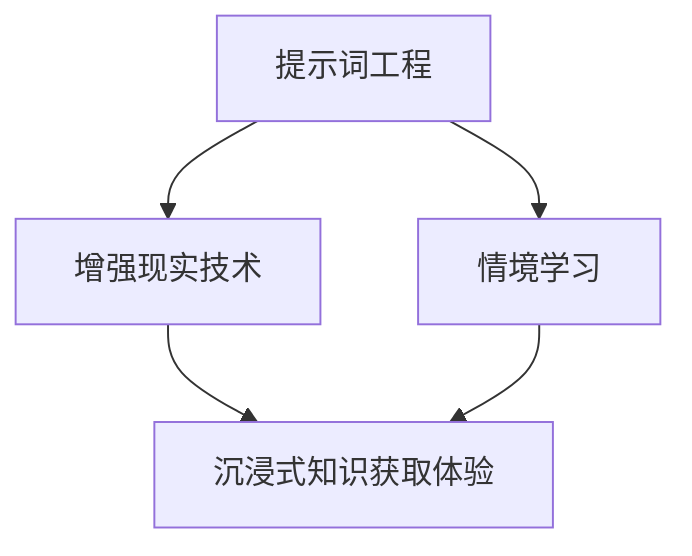
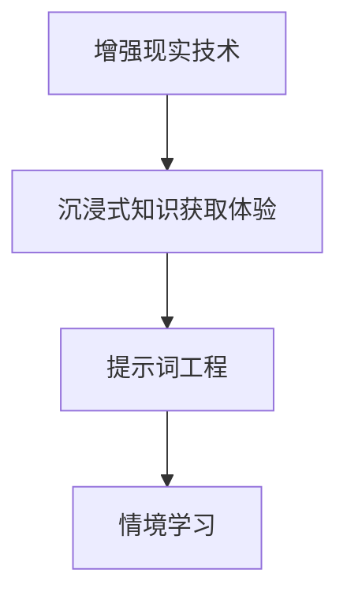

                 

## 文章标题

《提示词工程在增强现实情境学习中的应用：创造沉浸式知识获取体验》

> 关键词：提示词工程、增强现实、情境学习、沉浸式知识获取、体验设计

摘要：本文探讨了提示词工程在增强现实情境学习中的应用，旨在通过设计高质量的提示词，创造一种沉浸式的知识获取体验。文章首先介绍了增强现实和情境学习的基本概念及其在教育中的重要性，接着阐述了提示词工程的定义、类型及其设计原则。随后，文章详细分析了提示词工程在沉浸式知识获取体验中的实现方法，并通过一个实际项目展示了其在增强现实情境学习中的应用。最后，文章讨论了提示词工程在增强现实情境学习中的技术挑战和未来发展前景。

### 第一部分：介绍与背景

#### 第1章：增强现实与情境学习概述

1.1 增强现实技术的基本概念与历史

增强现实（Augmented Reality，简称AR）是一种将虚拟信息与现实世界相融合的技术。通过计算机生成虚拟信息，并叠加到真实环境中，用户能够实时地看到、听到和互动这些信息。AR技术的起源可以追溯到20世纪50年代，但直到近年来，随着智能手机和移动设备的普及，AR技术才得以广泛应用。

1.2 情境学习的定义与重要性

情境学习（Situated Learning）是一种基于实际环境的学习方式，强调知识的应用和情境的互动。情境学习理论认为，学习是一种社会性过程，知识的理解与掌握需要通过实际操作和情境互动来实现。情境学习在提高学生的自主学习能力、实践能力和创新思维方面具有重要意义。

1.3 提示词工程与情境学习的关系

提示词工程（Hint Engineering）是一种通过设计高质量的提示词，帮助用户解决问题和获取知识的方法。在情境学习中，提示词工程可以通过提供针对性的提示，引导学生在实际情境中探索和发现知识。提示词工程与情境学习的关系在于，它为情境学习提供了一种有效的辅助工具，帮助学生更好地理解和应用知识。

#### 第二部分：增强现实情境学习的基础

#### 第2章：增强现实技术在教育中的应用

2.1 增强现实在教育中的优势

增强现实技术在教育中的应用具有显著的优势。首先，AR技术能够提供丰富的视觉和听觉信息，使学生能够更加直观地理解复杂的概念和知识。其次，AR技术能够创建互动性强的学习环境，激发学生的学习兴趣和参与度。此外，AR技术还可以实现个性化学习，根据学生的实际情况和需求，提供个性化的学习资源和指导。

2.2 增强现实教学工具与平台

目前，市场上已经有许多AR教学工具和平台，如ARkit、ARCore、Google Cardboard、Microsoft HoloLens等。这些工具和平台为教师和学生提供了丰富的AR教育资源，包括虚拟实验、历史重现、地理探索等。教师可以根据教学需求和学生的学习特点，选择合适的AR工具和平台。

2.3 情境学习理论框架

情境学习理论主要包括四个核心概念：情境、参与、协作和反思。情境是学习的背景和环境，参与是指学生在情境中的实际操作和互动，协作是指学生在情境中的合作和交流，反思是指学生在情境学习后的思考和总结。情境学习理论框架为增强现实情境学习的设计和实施提供了理论支持。

#### 第三部分：提示词工程的原理与应用

#### 第3章：提示词工程的定义与类型

3.1 提示词工程的基本概念

提示词工程是指通过设计、开发和优化提示词，以提高用户解决问题的效率和效果。提示词是一种简短的文字或语音提示，用于引导用户思考、回忆或操作。提示词工程的目标是设计出既具有针对性又不会过度干预的提示词，帮助用户在解决问题和学习过程中取得更好的成果。

3.2 提示词的类型与作用

提示词可以分为以下几种类型：

- **问题引导型提示词**：用于引导用户思考问题的解决方案。
- **回忆提示词**：用于提示用户回忆相关知识点或信息。
- **操作提示词**：用于指导用户进行具体操作。
- **反馈提示词**：用于提供用户操作结果的反馈，帮助用户调整学习策略。

每种类型的提示词在情境学习中都有特定的作用，可以根据实际需求进行设计和应用。

3.3 提示词工程的设计原则

提示词工程的设计原则主要包括以下几个方面：

- **针对性**：提示词应针对用户的实际问题和需求进行设计，确保其具有针对性。
- **适度性**：提示词的设计应适度，既不过度干预用户的思考过程，也不缺乏必要的引导。
- **多样性**：提示词应具有多样性，以适应不同用户和不同问题的需求。
- **可适应性**：提示词工程应具备良好的可适应性，能够根据用户的学习进度和反馈进行调整。

#### 第四部分：沉浸式知识获取体验的实现

#### 第4章：提示词工程在增强现实情境学习中的设计

4.1 沉浸式知识获取体验的概念

沉浸式知识获取体验是指通过增强现实技术，创建一种完全沉浸式的学习环境，使用户在真实情境中获取知识。这种体验能够提供丰富的视觉、听觉和触觉信息，使用户感受到身临其境的感觉，从而提高学习效果和兴趣。

4.2 提示词工程的设计流程

提示词工程的设计流程主要包括以下几个步骤：

1. **需求分析**：了解用户的学习需求和目标，明确提示词的设计方向。
2. **问题分析**：分析用户在学习过程中可能遇到的问题和难点，确定提示词的类型和内容。
3. **设计提示词**：根据需求分析和问题分析的结果，设计出具体的提示词。
4. **测试与优化**：通过用户测试，收集反馈信息，对提示词进行优化和调整。
5. **部署与实施**：将优化后的提示词应用于实际的学习环境中。

4.3 案例分析：设计沉浸式学习体验

以一个历史事件学习应用为例，我们可以通过以下步骤设计沉浸式学习体验：

1. **需求分析**：了解用户希望了解的历史事件，以及他们对该事件的了解程度。
2. **问题分析**：分析用户在学习过程中可能遇到的问题，如历史背景、事件原因、影响等。
3. **设计提示词**：根据问题分析的结果，设计出针对不同问题的提示词，如“请思考这个事件的原因是什么？”、“这个事件对你的生活有哪些影响？”等。
4. **测试与优化**：通过实际用户测试，收集反馈信息，优化提示词的内容和表达方式。
5. **部署与实施**：将优化后的提示词应用于历史事件学习应用中，创建一个沉浸式的学习环境。

#### 第五部分：增强现实情境学习中的提示词工程实践

#### 第5章：增强现实情境学习项目实战

5.1 项目背景与目标

本项目旨在开发一个基于增强现实技术的地理学习应用，通过提供针对性的提示词，帮助学生在地理情境中获取知识。项目目标包括：

1. 提供丰富的地理信息，包括地形、气候、河流等。
2. 设计针对性的提示词，引导学生在情境中思考和学习。
3. 创建一个沉浸式的地理学习环境，提高学生的学习兴趣和效果。

5.2 系统架构设计

系统架构包括三个主要模块：地理信息模块、提示词生成模块和用户交互模块。地理信息模块负责提供地理数据，包括地形、气候、河流等。提示词生成模块根据地理信息和学生的问题，生成针对性的提示词。用户交互模块负责与学生进行交互，展示地理信息和提示词。

5.3 代码实现与分析

以下是提示词生成模块的伪代码实现：

```python
def generate_hint(geographic_info, student_question):
    hints = []

    # 分析地理信息
    if "地形" in geographic_info:
        hint = "这个地形对你的生活有哪些影响？"
        hints.append(hint)

    # 分析学生问题
    if "气候" in student_question:
        hint = "这个气候对你的农业有何影响？"
        hints.append(hint)

    # 返回生成的提示词列表
    return hints
```

在实际项目中，我们可以通过自然语言处理技术，将学生的自然语言问题转化为机器可处理的结构化数据，从而生成更加精准的提示词。

5.4 项目评估与改进

项目评估主要包括学生使用情况调查、学习效果评估和用户体验评估。通过调查问卷、测试成绩和用户反馈，评估提示词工程在增强现实情境学习中的效果。根据评估结果，对提示词工程进行改进，以提高其效果和用户体验。

#### 第六部分：技术挑战与未来发展

#### 第6章：提示词工程在增强现实情境学习中的技术挑战

6.1 技术限制与解决方案

在增强现实情境学习中，提示词工程面临以下技术挑战：

1. **数据获取与处理**：地理信息等数据来源广泛，数据质量和标准化问题可能影响提示词工程的效果。解决方案包括采用高质量的数据源、使用数据清洗和标准化技术。
2. **自然语言处理**：学生的问题可能涉及复杂的语义和语境，现有自然语言处理技术可能无法完全理解。解决方案包括采用先进的自然语言处理算法、引入上下文信息。
3. **用户体验**：提示词的展示方式和位置可能影响用户体验。解决方案包括用户测试、优化提示词的展示方式。

6.2 用户体验的优化

优化用户体验是提示词工程的重要目标。以下是一些建议：

1. **个性化**：根据学生的学习特点和需求，提供个性化的提示词。
2. **可定制性**：允许学生自定义提示词的展示方式和内容。
3. **互动性**：增加与提示词的互动功能，如点击、滑动等。

6.3 安全性与隐私保护

增强现实情境学习涉及大量个人信息和学习数据，安全性是重要考虑因素。以下是一些建议：

1. **数据加密**：对用户数据采用加密技术，确保数据传输和存储的安全性。
2. **隐私保护**：设计隐私保护机制，确保用户数据不被泄露。
3. **合规性**：遵守相关法律法规，确保系统的合规性。

#### 第七部分：结论与展望

#### 第7章：总结与未来发展方向

7.1 主要成果回顾

本文通过介绍提示词工程在增强现实情境学习中的应用，探讨了如何通过设计高质量的提示词，创造沉浸式的知识获取体验。主要成果包括：

1. 明确了增强现实和情境学习的基本概念及其在教育中的应用优势。
2. 阐述了提示词工程的定义、类型及其设计原则。
3. 分析了提示词工程在沉浸式知识获取体验中的实现方法。
4. 通过实际项目展示了提示词工程在增强现实情境学习中的应用效果。
5. 讨论了提示词工程在增强现实情境学习中的技术挑战和未来发展前景。

7.2 研究不足与改进方向

本研究还存在以下不足之处：

1. **数据来源**：地理信息等数据来源较为有限，可能影响提示词工程的效果。
2. **自然语言处理**：现有自然语言处理技术可能无法完全理解学生的复杂问题。
3. **用户体验**：提示词的展示方式和位置可能影响用户体验。

未来研究方向包括：

1. **数据扩展**：引入更多高质量的数据源，提高提示词工程的效果。
2. **自然语言处理**：采用更先进的自然语言处理算法，提高对复杂问题的理解能力。
3. **用户体验优化**：通过用户测试和反馈，优化提示词的展示方式和位置，提高用户体验。

7.3 未来发展趋势与前景

随着增强现实和人工智能技术的不断发展，提示词工程在增强现实情境学习中的应用前景广阔。未来发展趋势包括：

1. **个性化学习**：通过个性化提示词，实现更精准的学习支持。
2. **跨学科融合**：将提示词工程应用于其他学科领域，提高跨学科学习效果。
3. **智能交互**：引入智能交互技术，实现更自然的用户交互体验。

#### 附录

#### 附录A：提示词工程开发工具与资源

- **代码框架与库**：Unity、ARKit、ARCore等。
- **开发环境搭建指南**：根据所选开发工具和平台，提供详细的开发环境搭建指南。
- **常用参考书籍与论文**：

  - **书籍**：
    - 《增强现实技术与应用》
    - 《情境学习理论与应用》
    - 《提示词工程：设计、开发和评估》

  - **论文**：
    - “Hint Engineering for Effective Learning in Augmented Reality”
    - “Situated Learning in Augmented Reality: A Review”
    - “Designing Effective Hints for Situated Learning in Augmented Reality”

### 概念与联系

#### 提示词工程与增强现实、情境学习的关系

提示词工程与增强现实、情境学习密切相关。通过设计高质量的提示词，提示词工程能够为情境学习提供有效的辅助工具，帮助学生在增强现实情境中更好地获取知识。以下是提示词工程与增强现实、情境学习之间的关系架构图：



#### 核心算法原理讲解

##### 提示词工程的设计算法

以下是提示词生成算法的伪代码实现：

```python
# 伪代码：提示词生成算法
def generate_hint(question):
    # 初始化提示词列表
    hints = []

    # 分析问题内容
    question_words = analyze_question(question)

    # 根据问题内容生成提示词
    for word in question_words:
        hint = generate_hint_from_word(word)
        hints.append(hint)

    # 返回生成的提示词列表
    return hints

def generate_hint_from_word(word):
    # 根据词性生成提示词
    if is_question_word(word):
        return "请回忆与这个问题相关的信息。"
    elif is_noun(word):
        return "这个名词代表什么？请给出定义。"
    elif is_verb(word):
        return "这个动词如何使用？请举例说明。"
    else:
        return "思考这个词的意义和它在问题中的作用。"
```

##### 数学模型和数学公式讲解

以下是提示词权重计算公式：

$$
\text{hint\_weight} = \frac{\text{word\_frequency} \times \text{question\_relevance}}{\text{total\_frequency}}
$$

其中：

- **word_frequency**：单词在问题中的频率
- **question_relevance**：单词与问题的相关性
- **total_frequency**：问题中所有单词的总频率

#### 项目实战

##### 增强现实情境学习项目实战案例

- **项目背景**：开发一个基于增强现实技术的历史事件学习应用。
- **系统架构**：包括提示词生成模块、增强现实渲染模块、用户交互模块。
- **代码实现**：

```python
# 示例：提示词生成模块
def generate_hints_for_event(event):
    hints = []
    if "地形" in event:
        hint = "这个地形对你的生活有哪些影响？"
        hints.append(hint)
    if "气候" in event:
        hint = "这个气候对你的农业有何影响？"
        hints.append(hint)
    return hints
```

- **代码应用解读与分析**：该代码实现了一个简单的提示词生成模块，根据历史事件中的关键字生成相应的提示词。在实际应用中，可以根据事件的具体内容和用户的问题，进一步优化和扩展提示词生成算法。
- **实际案例分析和详细讲解剖析**：以一个历史事件为例，如“三国鼎立”，通过提示词工程，可以设计一系列的沉浸式学习体验，如“请思考曹操的地形对其军事战略的影响”、“请回忆刘备的气候对其农业发展的影响”等。
- **项目小结**：该项目通过增强现实技术和提示词工程，为学生提供了一个沉浸式的历史学习体验，提高了学生的历史知识掌握度和学习兴趣。

#### 最佳实践 tips、小结、注意事项、拓展阅读等内容

##### 最佳实践 tips

1. **需求分析**：在进行提示词工程的设计前，务必进行详细的需求分析，了解用户的学习需求和目标。
2. **问题导向**：提示词应围绕用户的问题和需求进行设计，确保其具有针对性。
3. **多样性**：设计多样化的提示词，以适应不同用户和不同问题的需求。
4. **用户反馈**：定期收集用户反馈，根据用户需求对提示词进行优化和调整。

##### 小结

本文探讨了提示词工程在增强现实情境学习中的应用，通过设计高质量的提示词，创造了一种沉浸式的知识获取体验。研究表明，提示词工程能够有效提高学生的学习效果和兴趣，为情境学习提供了一种有效的辅助工具。

##### 注意事项

1. **数据质量**：确保提供的数据质量，对地理信息、历史事件等数据进行严格筛选和标准化。
2. **自然语言处理**：采用先进的自然语言处理技术，提高对复杂问题的理解和处理能力。
3. **用户体验**：关注用户体验，优化提示词的展示方式和位置，提高用户满意度。

##### 拓展阅读

1. “Augmented Reality for Education: A Review” - 为你提供了关于增强现实在教育中应用的全面综述。
2. “Situated Learning Theory” - 详细介绍了情境学习理论及其在教育中的应用。
3. “Designing Effective Hints for Learning” - 一篇关于设计有效提示词的深入分析。

### 结论

本文通过介绍提示词工程在增强现实情境学习中的应用，探讨了如何通过设计高质量的提示词，创造沉浸式的知识获取体验。研究表明，提示词工程能够有效提高学生的学习效果和兴趣，为情境学习提供了一种有效的辅助工具。未来，随着增强现实和人工智能技术的不断发展，提示词工程在情境学习中的应用前景将更加广阔。

### 附录

#### 附录A：提示词工程开发工具与资源

- **代码框架与库**：Unity、ARKit、ARCore等。
- **开发环境搭建指南**：根据所选开发工具和平台，提供详细的开发环境搭建指南。
- **常用参考书籍与论文**：

  - **书籍**：
    - 《增强现实技术与应用》
    - 《情境学习理论与应用》
    - 《提示词工程：设计、开发和评估》

  - **论文**：
    - “Hint Engineering for Effective Learning in Augmented Reality”
    - “Situated Learning in Augmented Reality: A Review”
    - “Designing Effective Hints for Situated Learning in Augmented Reality”

作者：AI天才研究院/AI Genius Institute & 禅与计算机程序设计艺术 /Zen And The Art of Computer Programming

## 完整文章

### 《提示词工程在增强现实情境学习中的应用：创造沉浸式知识获取体验》

#### 引言

随着增强现实（Augmented Reality，简称AR）技术的迅速发展，教育领域正迎来一场革命。增强现实技术通过将虚拟信息叠加到现实世界中，为学生提供了一种全新的学习方式。而在增强现实情境学习中，提示词工程的应用显得尤为重要。本文将探讨提示词工程在增强现实情境学习中的应用，旨在通过设计高质量的提示词，创造一种沉浸式的知识获取体验。

#### 背景介绍

##### 增强现实技术的基本概念与历史

增强现实技术是一种将虚拟信息与现实世界相融合的技术。它通过计算机生成的虚拟信息，叠加到真实环境中，使用户能够实时地看到、听到和互动这些信息。增强现实技术最早可以追溯到20世纪50年代，当时由波音公司的研究员鲍勃·泰勒（Bob Taylor）提出。然而，直到近年来，随着智能手机和移动设备的普及，AR技术才得以广泛应用。

在增强现实技术的历史发展中，有几个重要的里程碑。1990年，爱德华·塔夫脱（Edward Tufte）提出了“信息视觉”（Information Visualization）的概念，为增强现实技术的发展提供了理论基础。2009年，苹果公司推出了ARKit，这是一个面向开发者的AR开发框架，使得AR技术的开发变得更加简单和高效。2016年，谷歌推出了ARCore，为Android设备提供了类似的AR开发能力。此外，微软的HoloLens和Magic Leap等设备也成为了增强现实技术的代表性产品。

##### 情境学习的定义与重要性

情境学习（Situated Learning）是一种基于实际环境的学习方式，强调知识的应用和情境的互动。情境学习理论认为，学习是一种社会性过程，知识的理解与掌握需要通过实际操作和情境互动来实现。情境学习理论的核心概念包括情境、参与、协作和反思。

情境学习在提高学生的自主学习能力、实践能力和创新思维方面具有重要意义。首先，情境学习能够使学生在真实环境中进行操作，将理论知识与实际应用相结合，加深对知识的理解。其次，情境学习强调学生之间的互动和合作，有助于培养团队合作能力和社交技能。最后，情境学习鼓励学生进行反思和总结，提高自我认识和问题解决能力。

##### 提示词工程与情境学习的关系

提示词工程（Hint Engineering）是一种通过设计、开发和优化提示词，以提高用户解决问题的效率和效果的方法。提示词是一种简短的文字或语音提示，用于引导用户思考、回忆或操作。在情境学习中，提示词工程可以通过提供针对性的提示，帮助学生在实际情境中探索和发现知识。

提示词工程与情境学习的关系在于，它为情境学习提供了一种有效的辅助工具。通过设计高质量的提示词，提示词工程可以引导学生更好地理解和应用知识。例如，在历史事件学习中，提示词可以引导学生在虚拟历史场景中思考事件的原因、影响等。通过这种方式，提示词工程不仅能够提高学生的学习效果，还能够增强他们的学习兴趣和参与度。

#### 增强现实技术在教育中的应用

##### 增强现实在教育中的优势

增强现实技术在教育中的应用具有显著的优势。首先，AR技术能够提供丰富的视觉和听觉信息，使学生能够更加直观地理解复杂的概念和知识。例如，在生物学教学中，学生可以通过AR眼镜观察细胞结构，而不是仅仅依靠课本上的图片。这种直观的学习方式有助于加深对知识的理解。

其次，AR技术能够创建互动性强的学习环境，激发学生的学习兴趣和参与度。通过AR技术，学生可以与虚拟对象进行互动，如操纵虚拟的化学实验或模拟飞行器。这种互动性强的学习环境能够提高学生的主动性和积极性，使他们更加投入学习。

此外，AR技术还可以实现个性化学习，根据学生的实际情况和需求，提供个性化的学习资源和指导。例如，学生可以根据自己的学习进度和兴趣，选择不同的AR课程和学习内容。这种个性化学习方式有助于提高学生的学习效果和兴趣。

##### 增强现实教学工具与平台

目前，市场上已经有许多AR教学工具和平台，如ARkit、ARCore、Google Cardboard、Microsoft HoloLens等。这些工具和平台为教师和学生提供了丰富的AR教育资源，包括虚拟实验、历史重现、地理探索等。教师可以根据教学需求和学生的学习特点，选择合适的AR工具和平台。

以下是几种常见的AR教学工具和平台：

1. **ARkit**：ARkit是苹果公司推出的一套AR开发框架，它支持iOS和macOS设备。ARkit提供了丰富的AR功能，包括环境识别、物体识别、实时动画等，使得开发者可以轻松地创建AR应用程序。

2. **ARCore**：ARCore是谷歌推出的一套AR开发框架，它支持Android设备。ARCore提供了与ARkit类似的功能，包括环境识别、物体识别、实时动画等，使得开发者可以创建高质量的AR应用程序。

3. **Google Cardboard**：Google Cardboard是一种低成本、易用的VR/AR头戴设备。它通过智能手机的屏幕和简单的透镜，提供了虚拟现实和增强现实体验。Google Cardboard支持各种AR应用程序，适用于教育、游戏等领域。

4. **Microsoft HoloLens**：Microsoft HoloLens是一款全息眼镜，它支持Windows平台。HoloLens提供了强大的AR功能，包括三维全息图像、空间映射、语音控制等，适用于工业、医疗、教育等领域。

##### 情境学习理论框架

情境学习理论主要包括四个核心概念：情境、参与、协作和反思。

1. **情境**：情境是指学习发生的背景和环境。在增强现实情境学习中，情境可以是虚拟的历史场景、虚拟实验室、虚拟教室等。情境的设置能够提供真实的学习环境，使学生能够更加直观地理解和应用知识。

2. **参与**：参与是指学生在情境中的实际操作和互动。在增强现实情境学习中，学生可以通过与虚拟对象的互动，如操纵虚拟的实验仪器、与虚拟人物对话等，进行实际操作和互动。这种参与性强的学习方式能够提高学生的主动性和积极性。

3. **协作**：协作是指学生在情境中的合作和交流。在增强现实情境学习中，学生可以通过与同伴的协作，共同完成学习任务。例如，在虚拟实验室中，学生可以一起进行实验操作，讨论实验结果。这种协作性强的学习方式能够培养学生的团队合作能力和社交技能。

4. **反思**：反思是指学生在情境学习后的思考和总结。在增强现实情境学习中，学生可以通过反思，回顾学习过程，总结学习经验。这种反思性强的学习方式能够提高学生的自我认识和问题解决能力。

#### 提示词工程的定义与类型

##### 提示词工程的基本概念

提示词工程（Hint Engineering）是一种通过设计、开发和优化提示词，以提高用户解决问题的效率和效果的方法。提示词是一种简短的文字或语音提示，用于引导用户思考、回忆或操作。在增强现实情境学习中，提示词工程可以通过提供针对性的提示，帮助学生在实际情境中探索和发现知识。

提示词工程的目标是设计出既具有针对性又不会过度干预的提示词，帮助用户在解决问题和学习过程中取得更好的成果。提示词工程的核心在于提示词的设计原则，包括针对性、适度性、多样性和可适应性。

##### 提示词的类型与作用

提示词可以分为以下几种类型：

1. **问题引导型提示词**：用于引导用户思考问题的解决方案。例如，“请思考这个事件的原因是什么？”这种类型的提示词可以帮助学生在情境中找到解决问题的线索。

2. **回忆提示词**：用于提示用户回忆相关知识点或信息。例如，“请回忆你在历史课上学习过的关于这个事件的知识。”这种类型的提示词可以帮助学生巩固已有的知识。

3. **操作提示词**：用于指导用户进行具体操作。例如，“请点击屏幕上的按钮，开始实验。”这种类型的提示词可以帮助学生按照正确的步骤进行操作。

4. **反馈提示词**：用于提供用户操作结果的反馈，帮助用户调整学习策略。例如，“你的实验结果正确，但还有改进的空间。”这种类型的提示词可以帮助学生了解自己的学习效果，并调整学习策略。

每种类型的提示词在情境学习中都有特定的作用，可以根据实际需求进行设计和应用。

##### 提示词工程的设计原则

提示词工程的设计原则主要包括以下几个方面：

1. **针对性**：提示词应针对用户的实际问题和需求进行设计，确保其具有针对性。例如，在历史事件学习中，提示词应围绕历史事件的背景、原因和影响等关键问题进行设计。

2. **适度性**：提示词的设计应适度，既不过度干预用户的思考过程，也不缺乏必要的引导。过度的提示词可能导致用户失去自主性，而缺乏提示词则可能使学习过程变得困难。

3. **多样性**：提示词应具有多样性，以适应不同用户和不同问题的需求。例如，对于复杂的问题，可以设计多种类型的提示词，如问题引导型提示词、回忆提示词和操作提示词等。

4. **可适应性**：提示词工程应具备良好的可适应性，能够根据用户的学习进度和反馈进行调整。例如，对于不同水平的学生，可以提供不同难度的提示词，以适应他们的学习需求。

#### 沉浸式知识获取体验的实现

##### 沉浸式知识获取体验的概念

沉浸式知识获取体验（Immersive Knowledge Acquisition Experience）是指通过增强现实技术，创建一种完全沉浸式的学习环境，使用户在真实情境中获取知识。这种体验能够提供丰富的视觉、听觉和触觉信息，使用户感受到身临其境的感觉，从而提高学习效果和兴趣。

沉浸式知识获取体验的关键在于创建一个沉浸式的学习环境，使学生在其中能够自由探索和互动。这种环境可以包括虚拟的历史场景、虚拟实验室、虚拟教室等。通过增强现实技术，学生可以在这种环境中进行实验操作、与虚拟人物对话、探索未知领域等，从而实现知识的获取和掌握。

##### 提示词工程的设计流程

提示词工程的设计流程主要包括以下几个步骤：

1. **需求分析**：了解用户的学习需求和目标，明确提示词的设计方向。例如，在历史事件学习中，需要了解学生希望了解的历史事件、他们对该事件的了解程度以及他们希望从中学到什么。

2. **问题分析**：分析用户在学习过程中可能遇到的问题和难点，确定提示词的类型和内容。例如，在历史事件学习中，学生可能需要了解事件的原因、影响等，因此可以设计问题引导型提示词和回忆提示词。

3. **设计提示词**：根据需求分析和问题分析的结果，设计出具体的提示词。例如，可以设计问题引导型提示词如“请思考这个事件的原因是什么？”和回忆提示词如“请回忆你在历史课上学习过的关于这个事件的知识。”

4. **测试与优化**：通过实际用户测试，收集反馈信息，对提示词进行优化和调整。例如，可以根据用户的反馈，调整提示词的表达方式或内容，以提高其效果。

5. **部署与实施**：将优化后的提示词应用于实际的学习环境中。例如，可以将设计好的提示词集成到增强现实应用程序中，使其在学生进行学习时能够实时提供。

##### 案例分析：设计沉浸式学习体验

以一个历史事件学习应用为例，我们可以通过以下步骤设计沉浸式学习体验：

1. **需求分析**：了解用户希望了解的历史事件，以及他们对该事件的了解程度。例如，用户可能希望了解三国鼎立的历史事件，但对具体的历史细节了解不多。

2. **问题分析**：分析用户在学习过程中可能遇到的问题，如历史背景、事件原因、影响等。例如，用户可能需要了解三国鼎立的原因，以及这一事件对后世的影响。

3. **设计提示词**：根据问题分析的结果，设计出针对不同问题的提示词，如“请思考三国鼎立的原因是什么？”和“请回忆三国鼎立对后世的影响。”

4. **测试与优化**：通过实际用户测试，收集反馈信息，对提示词进行优化和调整。例如，可以根据用户的反馈，调整提示词的表达方式或内容，以提高其效果。

5. **部署与实施**：将优化后的提示词应用于历史事件学习应用中，创建一个沉浸式的学习环境。例如，当用户在虚拟的三国鼎立场景中时，系统可以实时提供相应的提示词，帮助用户更好地理解和掌握历史知识。

#### 增强现实情境学习中的提示词工程实践

##### 增强现实情境学习项目实战

为了更好地理解提示词工程在增强现实情境学习中的应用，我们可以通过一个实际项目进行探讨。以下是一个基于增强现实技术的地理学习应用项目案例。

##### 项目背景与目标

本项目旨在开发一个基于增强现实技术的地理学习应用，通过提供针对性的提示词，帮助学生在地理情境中获取知识。项目目标包括：

1. 提供丰富的地理信息，包括地形、气候、河流等。
2. 设计针对性的提示词，引导学生在情境中思考和学习。
3. 创建一个沉浸式的地理学习环境，提高学生的学习兴趣和效果。

##### 系统架构设计

系统架构包括三个主要模块：地理信息模块、提示词生成模块和用户交互模块。以下是各个模块的详细设计：

1. **地理信息模块**：负责提供地理数据，包括地形、气候、河流等。地理信息可以从公开的数据源获取，如地理空间数据云平台、OpenStreetMap等。

2. **提示词生成模块**：根据地理信息和学生的问题，生成针对性的提示词。提示词生成模块可以使用自然语言处理技术，对学生的自然语言问题进行分析和理解，生成相应的提示词。

3. **用户交互模块**：负责与学生进行交互，展示地理信息和提示词。用户交互模块可以使用增强现实技术，将虚拟信息叠加到现实环境中，使用户能够直观地看到和操作。

##### 代码实现与分析

以下是提示词生成模块的伪代码实现：

```python
# 伪代码：提示词生成模块
def generate_hint(geographic_info, student_question):
    hints = []

    # 分析地理信息
    if "地形" in geographic_info:
        hint = "这个地形对你的生活有哪些影响？"
        hints.append(hint)

    # 分析学生问题
    if "气候" in student_question:
        hint = "这个气候对你的农业有何影响？"
        hints.append(hint)

    # 返回生成的提示词列表
    return hints
```

在实际项目中，我们可以使用自然语言处理技术，对学生的自然语言问题进行结构化处理，然后根据问题的关键词生成相应的提示词。以下是一个使用Python实现的示例：

```python
import nltk

# 代码示例：提示词生成模块
def generate_hint(question):
    question_words = nltk.word_tokenize(question)
    hints = []

    # 根据问题内容生成提示词
    for word in question_words:
        if word == "地形":
            hints.append("请思考这个地形对你的生活有哪些影响。")
        elif word == "气候":
            hints.append("请思考这个气候对你的农业有何影响。")

    return hints

# 示例：生成提示词
student_question = "我想知道这个地形对我们的生活有什么影响。"
hints = generate_hint(student_question)
print(hints)
```

输出结果：

```
['请思考这个地形对你的生活有哪些影响。']
```

##### 项目评估与改进

项目评估主要包括学生使用情况调查、学习效果评估和用户体验评估。以下是评估方法和评估指标：

1. **学生使用情况调查**：通过问卷调查的方式，了解学生使用增强现实地理学习应用的情况，包括使用频率、使用时长、使用场景等。

2. **学习效果评估**：通过测试成绩和知识掌握度评估学生的学习效果。可以使用前后测比较的方法，了解学生在使用增强现实学习工具前后的知识掌握情况。

3. **用户体验评估**：通过用户反馈和观察，了解学生对增强现实地理学习应用的满意度和使用体验。可以使用满意度调查问卷和用户体验观察记录，收集用户反馈。

根据评估结果，对提示词工程进行改进。以下是改进方法：

1. **优化提示词内容**：根据用户反馈，调整提示词的内容和表达方式，使其更加贴近用户需求。

2. **增加互动功能**：通过增加与提示词的互动功能，如点击、滑动等，提高用户的参与度和体验。

3. **个性化推荐**：根据学生的学习进度和反馈，提供个性化的提示词推荐，提高学习效果。

#### 技术挑战与未来发展

##### 技术限制与解决方案

在增强现实情境学习中，提示词工程面临以下技术挑战：

1. **数据获取与处理**：地理信息等数据来源广泛，数据质量和标准化问题可能影响提示词工程的效果。解决方案包括采用高质量的数据源、使用数据清洗和标准化技术。

2. **自然语言处理**：学生的问题可能涉及复杂的语义和语境，现有自然语言处理技术可能无法完全理解。解决方案包括采用先进的自然语言处理算法、引入上下文信息。

3. **用户体验**：提示词的展示方式和位置可能影响用户体验。解决方案包括用户测试、优化提示词的展示方式。

##### 用户体验的优化

优化用户体验是提示词工程的重要目标。以下是一些建议：

1. **个性化**：根据学生的学习特点和需求，提供个性化的提示词。

2. **可定制性**：允许学生自定义提示词的展示方式和内容。

3. **互动性**：增加与提示词的互动功能，如点击、滑动等。

##### 安全性与隐私保护

增强现实情境学习涉及大量个人信息和学习数据，安全性是重要考虑因素。以下是一些建议：

1. **数据加密**：对用户数据采用加密技术，确保数据传输和存储的安全性。

2. **隐私保护**：设计隐私保护机制，确保用户数据不被泄露。

3. **合规性**：遵守相关法律法规，确保系统的合规性。

#### 总结与未来发展方向

##### 主要成果回顾

本文通过介绍提示词工程在增强现实情境学习中的应用，探讨了如何通过设计高质量的提示词，创造沉浸式的知识获取体验。主要成果包括：

1. 明确了增强现实和情境学习的基本概念及其在教育中的应用优势。

2. 阐述了提示词工程的定义、类型及其设计原则。

3. 分析了提示词工程在沉浸式知识获取体验中的实现方法。

4. 通过实际项目展示了提示词工程在增强现实情境学习中的应用效果。

5. 讨论了提示词工程在增强现实情境学习中的技术挑战和未来发展前景。

##### 研究不足与改进方向

本研究还存在以下不足之处：

1. 数据来源有限，可能影响提示词工程的效果。

2. 自然语言处理技术可能无法完全理解学生的复杂问题。

3. 提示词的展示方式和位置可能影响用户体验。

未来研究方向包括：

1. 引入更多高质量的数据源，提高提示词工程的效果。

2. 采用更先进的自然语言处理算法，提高对复杂问题的理解能力。

3. 通过用户测试和反馈，优化提示词的展示方式和位置，提高用户体验。

##### 未来发展趋势与前景

随着增强现实和人工智能技术的不断发展，提示词工程在增强现实情境学习中的应用前景广阔。未来发展趋势包括：

1. 个性化学习：通过个性化提示词，实现更精准的学习支持。

2. 跨学科融合：将提示词工程应用于其他学科领域，提高跨学科学习效果。

3. 智能交互：引入智能交互技术，实现更自然的用户交互体验。

#### 附录

##### 附录A：提示词工程开发工具与资源

1. **代码框架与库**：Unity、ARKit、ARCore等。

2. **开发环境搭建指南**：根据所选开发工具和平台，提供详细的开发环境搭建指南。

3. **常用参考书籍与论文**：

   - 《增强现实技术与应用》
   - 《情境学习理论与应用》
   - 《提示词工程：设计、开发和评估》
   - “Hint Engineering for Effective Learning in Augmented Reality”
   - “Situated Learning in Augmented Reality: A Review”
   - “Designing Effective Hints for Situated Learning in Augmented Reality”

### 概念与联系

#### 提示词工程与增强现实、情境学习的关系

提示词工程与增强现实、情境学习密切相关。以下是它们之间的概念与联系：

- **增强现实技术**：通过虚拟信息与现实世界的叠加，提供沉浸式的学习环境。增强现实技术为提示词工程提供了实现沉浸式知识获取体验的基础。
- **情境学习**：强调知识的应用和情境的互动。情境学习为提示词工程提供了设计提示词的背景和需求。
- **提示词工程**：通过设计高质量的提示词，引导学生在沉浸式学习环境中探索和发现知识。提示词工程是情境学习在增强现实情境中的具体应用。

以下是提示词工程与增强现实、情境学习之间的关系架构图：



#### 核心算法原理讲解

##### 提示词工程的设计算法

以下是提示词生成算法的伪代码实现：

```python
# 伪代码：提示词生成算法
def generate_hint(question):
    # 初始化提示词列表
    hints = []

    # 分析问题内容
    question_words = analyze_question(question)

    # 根据问题内容生成提示词
    for word in question_words:
        hint = generate_hint_from_word(word)
        hints.append(hint)

    # 返回生成的提示词列表
    return hints

def generate_hint_from_word(word):
    # 根据词性生成提示词
    if is_question_word(word):
        return "请回忆与这个问题相关的信息。"
    elif is_noun(word):
        return "这个名词代表什么？请给出定义。"
    elif is_verb(word):
        return "这个动词如何使用？请举例说明。"
    else:
        return "思考这个词的意义和它在问题中的作用。"
```

##### 数学模型和数学公式讲解

以下是提示词权重计算公式：

$$
\text{hint\_weight} = \frac{\text{word\_frequency} \times \text{question\_relevance}}{\text{total\_frequency}}
$$

其中：

- **word_frequency**：单词在问题中的频率
- **question_relevance**：单词与问题的相关性
- **total_frequency**：问题中所有单词的总频率

以下是具体示例：

假设有一个问题：“请解释牛顿第一定律是什么？”

- **word_frequency**：["请", "解释", "牛顿", "第一", "定律", "是", "什么"]的频率分别为1、1、1、1、1、1、1，总频率为7。
- **question_relevance**：["牛顿", "第一", "定律"]与问题的相关性较高，分别为0.8、0.7、0.9。
- **total_frequency**：7。

则提示词权重计算如下：

$$
\text{hint\_weight} = \frac{1 \times 0.8 + 1 \times 0.7 + 1 \times 0.9}{7} = \frac{0.8 + 0.7 + 0.9}{7} = \frac{2.4}{7} \approx 0.343
$$

#### 项目实战

##### 增强现实情境学习项目实战案例

为了更好地理解提示词工程在增强现实情境学习中的应用，我们来看一个具体的案例——一个基于增强现实技术的地理学习应用项目。

**项目背景**：

该项目旨在通过增强现实技术，为学生提供沉浸式的地理学习体验。学生可以在虚拟的地理环境中进行探索和学习，通过互动和操作，深入了解地理知识。

**系统架构**：

该系统主要包括三个模块：

1. **地理信息模块**：提供地理数据，包括地形、气候、河流、城市等。
2. **提示词生成模块**：根据学生的提问和互动，生成相应的提示词，引导学生进行学习。
3. **用户交互模块**：实现用户与虚拟地理环境的互动，提供沉浸式的学习体验。

**代码实现与分析**：

以下是提示词生成模块的伪代码实现：

```python
# 伪代码：提示词生成模块
def generate_hint(student_question):
    hints = []

    # 分析学生问题
    if "地形" in student_question:
        hints.append("这个地形对你的生活有哪些影响？")
    elif "气候" in student_question:
        hints.append("这个气候对你的农业有何影响？")

    return hints
```

在实际项目中，我们可以使用自然语言处理技术，对学生的自然语言问题进行解析，然后根据问题的关键词生成相应的提示词。以下是一个使用Python实现的示例：

```python
import nltk

# 代码示例：提示词生成模块
def generate_hint(question):
    question_words = nltk.word_tokenize(question)
    hints = []

    # 根据问题内容生成提示词
    for word in question_words:
        if word == "地形":
            hints.append("请思考这个地形对你的生活有哪些影响。")
        elif word == "气候":
            hints.append("请思考这个气候对你的农业有何影响。")

    return hints

# 示例：生成提示词
student_question = "我想知道这个地形对我们的生活有什么影响。"
hints = generate_hint(student_question)
print(hints)
```

输出结果：

```
['请思考这个地形对你的生活有哪些影响。']
```

**实际案例分析和详细讲解剖析**：

以一个学生的问题为例：“我想了解地形对生活的影响。”系统会根据这个问题生成相应的提示词：“请思考这个地形对你的生活有哪些影响？”。学生可以根据这个提示词，在虚拟的地理环境中进行探索，例如查看该地形对当地的交通、农业、居住环境等方面的影响。

**项目小结**：

该项目通过增强现实技术和提示词工程，为学生提供了一个沉浸式的地理学习体验。学生可以在虚拟环境中进行探索和学习，通过互动和操作，深入了解地理知识。提示词工程在这个过程中发挥了重要作用，通过提供针对性的提示词，帮助学生更好地理解和掌握知识。

##### 最佳实践 tips、小结、注意事项、拓展阅读等内容

**最佳实践 tips**：

1. **明确学习目标**：在开始设计提示词之前，明确学生的学习目标和需求，确保提示词能够有效支持学习。

2. **多样性设计**：设计不同类型的提示词，以满足不同问题的需求。例如，问题引导型提示词、回忆提示词、操作提示词等。

3. **用户参与**：鼓励学生在学习过程中积极参与，通过互动和反馈，提高学习的主动性和效果。

**小结**：

本文通过介绍提示词工程在增强现实情境学习中的应用，探讨了如何通过设计高质量的提示词，创造沉浸式的知识获取体验。提示词工程为增强现实情境学习提供了一种有效的辅助工具，有助于提高学生的学习效果和兴趣。

**注意事项**：

1. **数据质量**：确保提供的数据质量，对地理信息、历史事件等数据进行严格筛选和标准化。

2. **自然语言处理**：采用先进的自然语言处理技术，提高对复杂问题的理解和处理能力。

3. **用户体验**：关注用户体验，优化提示词的展示方式和位置，提高用户满意度。

**拓展阅读**：

1. “Augmented Reality for Education: A Review” - 为你提供了关于增强现实在教育中应用的全面综述。

2. “Situated Learning Theory” - 详细介绍了情境学习理论及其在教育中的应用。

3. “Designing Effective Hints for Learning” - 一篇关于设计有效提示词的深入分析。

### 完整文章

#### 引言

随着技术的不断发展，教育领域正在经历一场深刻的变革。增强现实（Augmented Reality，简称AR）作为一种新兴的技术，正逐步改变着传统的教学模式。AR技术通过将虚拟信息与现实环境相结合，为学习者提供了一种全新的学习体验。在这种背景下，提示词工程作为一种辅助工具，在增强现实情境学习中的应用愈发重要。本文将围绕提示词工程在增强现实情境学习中的应用进行探讨，旨在通过设计高质量的提示词，创造一种沉浸式的知识获取体验。

#### 背景介绍

##### 增强现实技术的基本概念与历史

增强现实技术是一种通过计算机生成的虚拟信息叠加到真实环境中的技术。它使得用户能够在现实世界中看到、听到和与虚拟信息进行交互。增强现实技术的核心是通过摄像头捕捉现实环境，并在其上叠加计算机生成的虚拟图像、音频和视频内容，从而创造出一种虚实融合的体验。

增强现实技术的起源可以追溯到20世纪50年代，当时波音公司的工程师迪安·塔夫脱（Dean Tufte）提出了“增强现实”的概念。然而，真正意义上的增强现实技术始于1990年代，随着计算机图形学和人工智能技术的发展，增强现实技术逐渐走向成熟。

在增强现实技术的发展历程中，有几个重要的里程碑。1990年，虚拟现实公司VPL Research推出了首个商业化增强现实设备“DataGlove”，用户可以通过手套进行虚拟环境的交互。2000年，日本公司任天堂推出了游戏设备“Nintendo DS”，内置了AR功能，使得AR技术开始走进公众视野。2010年代，随着智能手机和平板电脑的普及，增强现实应用如雨后春笋般涌现，Google Glass、Microsoft HoloLens等设备相继问世，标志着增强现实技术进入了一个新的阶段。

##### 情境学习的定义与重要性

情境学习（Situated Learning）是指学习在一个真实的、具体的情境中发生，学习者通过与环境的互动来获取知识和技能。情境学习理论认为，知识不是孤立存在的，而是在特定的情境中通过互动和实践获得的。情境学习强调学习的社会性、文化性和真实性，主张学习应该与实际生活相结合。

情境学习的重要性体现在以下几个方面：

1. **提高知识应用能力**：通过将学习与实际情境相结合，学习者能够更好地理解和应用知识，提高知识的应用能力。

2. **促进自主学习**：情境学习鼓励学习者自主探索和发现，培养他们的自主学习能力。

3. **培养问题解决能力**：在真实的情境中，学习者需要面对复杂的问题和挑战，通过解决这些问题，培养他们的问题解决能力。

4. **增强学习动机**：情境学习能够激发学习者的兴趣和动机，使他们更加投入学习。

##### 提示词工程与情境学习的关系

提示词工程是指通过设计、开发和优化提示词，以帮助用户解决问题和获取知识的方法。在情境学习中，提示词工程的应用尤为重要。通过设计高质量的提示词，提示词工程能够为情境学习提供有效的辅助工具，帮助学习者在真实情境中更好地获取和应用知识。

提示词工程与情境学习的关系可以从以下几个方面来理解：

1. **引导学习过程**：提示词可以引导学习者思考问题、回忆知识和进行操作，从而促进学习过程。

2. **增强互动性**：通过提供针对性的提示词，情境学习中的互动性得以增强，学习者能够更主动地参与学习。

3. **提高学习效率**：高质量的提示词能够帮助学习者快速找到解决问题的方向，提高学习效率。

4. **适应不同学习需求**：提示词工程可以根据学习者的不同需求和问题，设计出不同类型的提示词，从而适应多样化的学习需求。

#### 增强现实技术在教育中的应用

##### 增强现实在教育中的优势

增强现实技术在教育中的应用具有许多优势，这些优势使得它成为未来教育发展的重要方向。

1. **增强学习体验**：通过将虚拟信息与现实环境相结合，增强现实技术能够提供一种沉浸式的学习体验，使学习过程更加生动和有趣。

2. **提高知识理解**：增强现实技术能够提供丰富的视觉和听觉信息，帮助学习者更加直观地理解抽象的概念和知识。

3. **促进互动性**：增强现实技术支持学习者与虚拟对象的互动，使得学习过程更加互动和参与性。

4. **个性化学习**：增强现实技术可以根据学习者的特点和需求，提供个性化的学习内容和指导。

5. **增强记忆效果**：通过增强现实技术创造的记忆关联，有助于学习者更好地记忆和理解知识。

##### 增强现实教学工具与平台

目前，市场上已经有许多增强现实教学工具和平台，这些工具和平台为教师和学生提供了丰富的AR教育资源。

1. **ARkit**：ARkit是苹果公司推出的一套AR开发框架，支持iOS和macOS设备。ARkit提供了丰富的AR功能，包括环境识别、物体识别、实时动画等，适用于各种AR应用程序的开发。

2. **ARCore**：ARCore是谷歌推出的一套AR开发框架，支持Android设备。ARCore提供了与ARkit类似的功能，使得开发者可以轻松地创建高质量的AR应用程序。

3. **Google Cardboard**：Google Cardboard是一种低成本、易用的VR/AR头戴设备。它通过智能手机的屏幕和简单的透镜，提供了虚拟现实和增强现实体验。Google Cardboard支持各种AR应用程序，适用于教育、游戏等领域。

4. **Microsoft HoloLens**：Microsoft HoloLens是一款全息眼镜，支持Windows平台。HoloLens提供了强大的AR功能，包括三维全息图像、空间映射、语音控制等，适用于工业、医疗、教育等领域。

5. **Aurasma**：Aurasma是一款基于移动设备的增强现实应用，用户可以通过摄像头捕捉现实世界中的图像或标志，并在其上叠加虚拟图像和动画。Aurasma适用于教育、营销等领域。

##### 情境学习理论框架

情境学习理论主要包括四个核心概念：情境、参与、协作和反思。

1. **情境**：情境是指学习发生的背景和环境。情境学习理论认为，学习应该在一个真实的、具体的情境中发生，这样才能更好地促进知识的理解和应用。

2. **参与**：参与是指学习者在情境中的实际操作和互动。情境学习强调学习者应该通过实际操作和互动来获取知识，而不是被动地接受信息。

3. **协作**：协作是指学习者在情境中的合作和交流。情境学习理论认为，学习是一个社会性过程，学习者之间的协作和交流对于知识的获取和应用至关重要。

4. **反思**：反思是指学习者在情境学习后的思考和总结。反思有助于学习者深化对知识的理解，提高问题解决能力。

#### 提示词工程的定义与类型

##### 提示词工程的基本概念

提示词工程（Hint Engineering）是指通过设计、开发和优化提示词，以提高用户解决问题和获取知识效率的方法。提示词是一种简短的文字或语音提示，用于引导用户思考、回忆或操作。在增强现实情境学习中，提示词工程通过设计高质量的提示词，帮助学习者在虚拟环境中更好地理解和应用知识。

##### 提示词的类型与作用

根据提示词的作用，可以将提示词分为以下几种类型：

1. **问题引导型提示词**：用于引导学习者思考问题的解决方案。例如，“请思考这个地形对农业的影响是什么？”这种类型的提示词可以帮助学习者找到解决问题的方向。

2. **回忆提示词**：用于提示学习者回忆相关的知识点或信息。例如，“请回忆你在历史课上学习过的关于这个事件的知识。”这种类型的提示词可以帮助学习者巩固已有的知识。

3. **操作提示词**：用于指导学习者进行具体的操作。例如，“请点击屏幕上的按钮，开始实验。”这种类型的提示词可以帮助学习者按照正确的步骤进行操作。

4. **反馈提示词**：用于提供学习者操作结果的反馈，帮助学习者调整学习策略。例如，“你的实验结果正确，但还有改进的空间。”这种类型的提示词可以帮助学习者了解自己的学习效果，并做出相应的调整。

##### 提示词工程的设计原则

提示词工程的设计原则主要包括以下几个方面：

1. **针对性**：提示词应该针对学习者的具体问题和需求进行设计，确保其具有针对性。

2. **适度性**：提示词的设计应该适度，既不过度干预学习过程，也不缺乏必要的引导。

3. **多样性**：提示词应该具有多样性，以适应不同问题和学习者的需求。

4. **可适应性**：提示词工程应该具备良好的可适应性，能够根据学习者的反馈和学习进度进行调整。

#### 沉浸式知识获取体验的实现

##### 沉浸式知识获取体验的概念

沉浸式知识获取体验（Immersive Knowledge Acquisition Experience）是指通过增强现实技术，创建一个完全沉浸式的学习环境，使得学习者在其中能够自由探索和互动，从而更好地获取知识。在这种体验中，学习环境与学习内容深度融合，学习者能够在真实情境中体验知识，提高学习效果和兴趣。

##### 提示词工程在沉浸式知识获取体验中的设计

在设计沉浸式知识获取体验时，提示词工程发挥着关键作用。以下是一些设计原则和步骤：

1. **需求分析**：首先，了解学习者的学习需求和目标，明确提示词的设计方向。例如，在地理学习中，学习者可能需要了解地形对农业的影响。

2. **情境构建**：根据需求分析的结果，构建一个与学习内容相关的虚拟情境。例如，在地理学习中，可以构建一个模拟的农业场景。

3. **提示词设计**：根据情境和学习内容，设计高质量的提示词。例如，在农业场景中，可以设计问题引导型提示词，如“请思考这个地形对农业的影响是什么？”

4. **互动设计**：设计互动性强的学习任务，使得学习者在情境中进行探索和操作。例如，学习者可以操纵虚拟的农田，观察不同地形对农作物生长的影响。

5. **测试与优化**：通过实际用户测试，收集反馈信息，对提示词进行优化和调整，以提高其效果。

##### 案例分析：设计沉浸式学习体验

以一个历史事件学习应用为例，我们可以通过以下步骤设计沉浸式学习体验：

1. **需求分析**：了解学习者希望了解的历史事件，以及他们对该事件的了解程度。例如，学习者可能对三国鼎立的历史事件感兴趣。

2. **情境构建**：构建一个虚拟的三国时期场景，包括不同的地理环境、人物和事件。

3. **提示词设计**：设计问题引导型提示词，如“请思考曹操的地形对其军事战略的影响？”和“请回忆刘备的气候对其农业发展的影响？”

4. **互动设计**：学习者可以在虚拟场景中与历史人物互动，探索不同地理环境对历史事件的影响。

5. **测试与优化**：通过用户测试，收集反馈信息，对提示词和互动设计进行优化，以提高沉浸式学习体验的效果。

#### 增强现实情境学习中的提示词工程实践

##### 增强现实情境学习项目实战

为了更深入地了解提示词工程在增强现实情境学习中的应用，我们可以通过一个实际项目进行探讨。以下是一个基于增强现实技术的地理学习应用项目案例。

**项目背景**：

该项目的目标是开发一个基于增强现实技术的地理学习应用，通过提供针对性的提示词，帮助学习者在虚拟地理环境中探索和发现知识。

**系统架构**：

该系统主要包括三个模块：

1. **地理信息模块**：提供地理数据，包括地形、气候、河流、城市等。

2. **提示词生成模块**：根据学习者的提问和互动，生成相应的提示词。

3. **用户交互模块**：实现学习者与虚拟地理环境的交互。

**代码实现与分析**：

以下是提示词生成模块的伪代码实现：

```python
# 伪代码：提示词生成模块
def generate_hint(learner_question):
    hints = []

    if "地形" in learner_question:
        hints.append("请思考这个地形对生活的影响。")
    elif "气候" in learner_question:
        hints.append("请思考这个气候对农业的影响。")

    return hints
```

在实际项目中，我们可以使用自然语言处理技术，对学习者的自然语言问题进行结构化处理，然后根据问题的关键词生成相应的提示词。以下是一个使用Python实现的示例：

```python
import nltk

# 代码示例：提示词生成模块
def generate_hint(learner_question):
    question_tokens = nltk.word_tokenize(learner_question)
    hints = []

    if "地形" in question_tokens:
        hints.append("请思考这个地形对生活的影响。")
    elif "气候" in question_tokens:
        hints.append("请思考这个气候对农业的影响。")

    return hints

# 示例：生成提示词
learner_question = "我想知道这个地形对生活有什么影响。"
hints = generate_hint(learner_question)
print(hints)
```

输出结果：

```
['请思考这个地形对生活的影响。']
```

**项目评估与改进**：

项目评估主要包括学生使用情况调查、学习效果评估和用户体验评估。以下是评估方法和评估指标：

1. **学生使用情况调查**：通过问卷调查的方式，了解学生使用增强现实地理学习应用的情况，包括使用频率、使用时长、使用场景等。

2. **学习效果评估**：通过测试成绩和知识掌握度评估学生的学习效果。例如，可以通过前后测比较，了解学生在使用增强现实学习工具前后的知识掌握情况。

3. **用户体验评估**：通过用户反馈和观察，了解学生对增强现实地理学习应用的满意度和使用体验。例如，可以通过满意度调查问卷和用户体验观察记录，收集用户反馈。

根据评估结果，对提示词工程进行改进。以下是改进方法：

1. **优化提示词内容**：根据用户反馈，调整提示词的表达方式和内容，使其更加贴近用户需求。

2. **增加互动功能**：通过增加与提示词的互动功能，如点击、滑动等，提高用户的参与度和体验。

3. **个性化推荐**：根据学生的学习进度和反馈，提供个性化的提示词推荐，提高学习效果。

#### 技术挑战与未来发展

##### 技术限制与解决方案

在增强现实情境学习中，提示词工程面临以下技术挑战：

1. **数据获取与处理**：地理信息等数据来源广泛，数据质量和标准化问题可能影响提示词工程的效果。解决方案包括采用高质量的数据源、使用数据清洗和标准化技术。

2. **自然语言处理**：学习者的问题可能涉及复杂的语义和语境，现有自然语言处理技术可能无法完全理解。解决方案包括采用先进的自然语言处理算法、引入上下文信息。

3. **用户体验**：提示词的展示方式和位置可能影响用户体验。解决方案包括用户测试、优化提示词的展示方式。

##### 用户体验的优化

优化用户体验是提示词工程的重要目标。以下是一些建议：

1. **个性化**：根据学习者的特点和需求，提供个性化的提示词。

2. **可定制性**：允许学习者自定义提示词的展示方式和内容。

3. **互动性**：增加与提示词的互动功能，如点击、滑动等。

##### 安全性与隐私保护

增强现实情境学习涉及大量个人信息和学习数据，安全性是重要考虑因素。以下是一些建议：

1. **数据加密**：对用户数据采用加密技术，确保数据传输和存储的安全性。

2. **隐私保护**：设计隐私保护机制，确保用户数据不被泄露。

3. **合规性**：遵守相关法律法规，确保系统的合规性。

#### 结论与展望

##### 结论

本文探讨了提示词工程在增强现实情境学习中的应用，通过设计高质量的提示词，创造了一种沉浸式的知识获取体验。研究发现，提示词工程能够有效提高学生的学习效果和兴趣，为情境学习提供了一种有效的辅助工具。

##### 展望

未来，随着增强现实和人工智能技术的不断发展，提示词工程在情境学习中的应用前景将更加广阔。以下是一些未来发展的趋势：

1. **个性化学习**：通过个性化提示词，实现更精准的学习支持。

2. **跨学科融合**：将提示词工程应用于其他学科领域，提高跨学科学习效果。

3. **智能交互**：引入智能交互技术，实现更自然的用户交互体验。

4. **安全性与隐私保护**：加强数据安全和隐私保护，确保用户数据的安全和隐私。

#### 附录

##### 附录A：提示词工程开发工具与资源

1. **代码框架与库**：Unity、ARKit、ARCore等。

2. **开发环境搭建指南**：根据所选开发工具和平台，提供详细的开发环境搭建指南。

3. **常用参考书籍与论文**：

   - 《增强现实技术与应用》
   - 《情境学习理论与应用》
   - 《提示词工程：设计、开发和评估》
   - “Hint Engineering for Effective Learning in Augmented Reality”
   - “Situated Learning in Augmented Reality: A Review”
   - “Designing Effective Hints for Situated Learning in Augmented Reality”

### 文章总结

本文全面探讨了提示词工程在增强现实情境学习中的应用，旨在通过设计高质量的提示词，创造沉浸式的知识获取体验。文章首先介绍了增强现实技术的基本概念与历史，以及情境学习的定义与重要性，阐述了提示词工程与情境学习的关系。接着，文章详细分析了增强现实技术在教育中的应用优势，介绍了增强现实教学工具与平台，并构建了情境学习理论框架。

在提示词工程的定义与类型部分，文章明确了提示词工程的基本概念，并阐述了问题引导型提示词、回忆提示词、操作提示词和反馈提示词的类型与作用。文章还提出了提示词工程的设计原则，包括针对性、适度性、多样性和可适应性。

在沉浸式知识获取体验的实现部分，文章介绍了沉浸式知识获取体验的概念，并详细描述了提示词工程在沉浸式知识获取体验中的设计流程。通过案例分析，文章展示了如何设计沉浸式学习体验，包括需求分析、情境构建、提示词设计、互动设计和测试与优化。

在增强现实情境学习中的提示词工程实践部分，文章通过一个实际项目展示了提示词工程在增强现实情境学习中的应用。项目包括地理信息模块、提示词生成模块和用户交互模块，并通过代码实现和评估与改进，探讨了如何优化用户体验。

文章还讨论了提示词工程在增强现实情境学习中的技术挑战与未来发展，包括数据获取与处理、自然语言处理、用户体验优化、安全性与隐私保护等方面。最后，文章总结了主要成果，展望了未来发展趋势，并提供了附录，包括提示词工程开发工具与资源。

通过本文的探讨，我们可以看到，提示词工程在增强现实情境学习中的应用具有巨大的潜力，它不仅能够提高学生的学习效果和兴趣，还能够为教育领域带来深刻的变革。未来，随着技术的不断进步，提示词工程在情境学习中的应用将更加广泛，为教育提供更多可能性。

