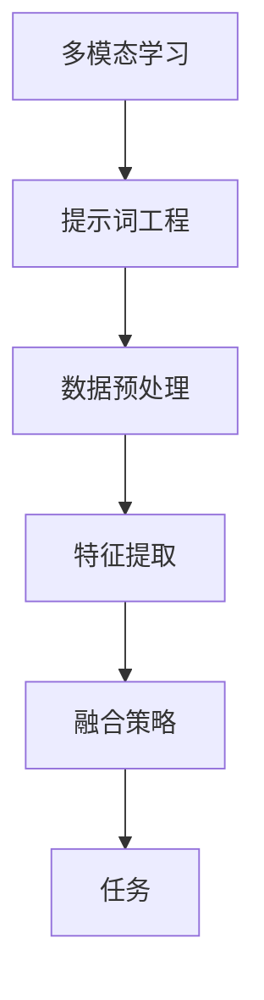
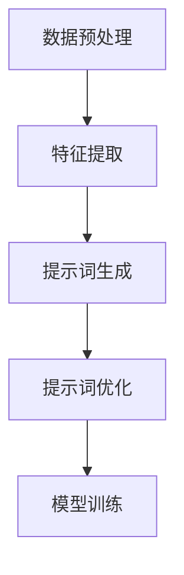

                 

### 《提示词工程在多模态学习中的应用》目录大纲

#### 第1章 引言
##### 1.1 多模态学习背景
##### 1.2 提示词工程的重要性
##### 1.3 本书目标与结构

#### 第2章 多模态学习基础
##### 2.1 多模态数据概述
##### 2.2 多模态特征提取方法
##### 2.3 多模态融合策略

#### 第3章 提示词工程原理
##### 3.1 提示词的定义与类型
##### 3.2 提示词生成的算法
##### 3.3 提示词优化的方法

#### 第4章 多模态学习中的提示词应用
##### 4.1 图像与文本的跨模态提示词
##### 4.2 视频与音频的跨模态提示词
##### 4.3 提示词在多模态任务中的应用案例

#### 第5章 提示词工程实践
##### 5.1 数据预处理与标注
##### 5.2 提示词生成与优化
##### 5.3 实际项目应用示例

#### 第6章 提示词工程挑战与未来方向
##### 6.1 提示词工程面临的挑战
##### 6.2 提示词工程的发展趋势
##### 6.3 未来研究方向

#### 第7章 总结与展望
##### 7.1 全书总结
##### 7.2 读者反馈
##### 7.3 未来工作建议

#### 附录
##### 附录A 提示词工程工具与资源
##### 附录B Mermaid流程图示例
##### 附录C 伪代码示例
##### 附录D LaTeX数学公式示例

#### 核心概念与联系
##### Mermaid 流程图
```
graph TD
A[多模态学习] --> B[提示词工程]
B --> C[数据预处理]
C --> D[特征提取]
D --> E[融合策略]
E --> F[任务]
```
##### 核心算法原理讲解
###### 提示词生成算法伪代码
```
// 提示词生成伪代码
function generatePrompt(input_data):
    # 输入数据预处理
    preprocessed_data = preprocessData(input_data)

    # 特征提取
    features = extractFeatures(preprocessed_data)

    # 提示词生成
    prompt = generatePromptFromFeatures(features)

    return prompt
```

###### 提示词优化算法伪代码
```
// 提示词优化伪代码
function optimizePrompt(prompt, target, optimizer):
    # 初始化提示词参数
    parameters = initParameters(prompt)

    # 设置优化器
    opt = optimizer(parameters)

    # 设置损失函数
    loss_function = computeLoss(prompt, target)

    # 优化循环
    for i in range(num_epochs):
        # 计算梯度
        gradients = computeGradients(parameters, loss_function)

        # 更新参数
        parameters = updateParameters(parameters, gradients)

    # 得到优化后的提示词
    optimized_prompt = parameters

    return optimized_prompt
```

##### 数学模型和数学公式 & 详细讲解 & 举例说明
###### 多模态融合策略的数学模型
$$
Fusion = w_1 F_{text} + w_2 F_{image} + ... + w_n F_{modal}
$$
其中，$F_{modal}$ 表示第 $modal$ 个模态的特征向量，$w_i$ 表示第 $i$ 个模态的权重。

###### 提示词优化的目标函数
$$
J(\theta) = \frac{1}{m} \sum_{i=1}^{m}### 《提示词工程在多模态学习中的应用》

---

### 关键词
- 多模态学习
- 提示词工程
- 特征提取
- 融合策略
- 优化算法

---

### 摘要
本文深入探讨了提示词工程在多模态学习中的关键作用。首先，介绍了多模态学习的背景和基本概念，包括多模态数据的类型和特征提取方法。接着，详细阐述了提示词工程的基本原理，包括提示词的定义、生成和优化方法。本文还通过具体案例展示了提示词在图像与文本、视频与音频等多模态任务中的应用，分析了提示词工程面临的挑战和未来的研究方向。最后，提供了实践指导和建议，为读者提供了全面的了解和实用工具。

---

### 第1章 引言

#### 1.1 多模态学习背景
多模态学习是人工智能领域的一个重要研究方向，它涉及将来自不同感官模态（如视觉、听觉、触觉等）的数据进行融合和分析，以获得更丰富、更准确的信息。随着深度学习技术的飞速发展，多模态学习在图像识别、语音识别、自然语言处理等众多领域中得到了广泛应用。

#### 1.2 提示词工程的重要性
在多模态学习中，提示词工程起到了关键作用。提示词是一系列关键词或短语，用于引导模型理解和处理多模态数据。通过设计有效的提示词，可以提高模型的泛化能力和任务完成效果。提示词工程的核心在于如何生成和优化这些提示词，使其能充分反映多模态数据的本质特征。

#### 1.3 本书目标与结构
本书旨在深入探讨提示词工程在多模态学习中的应用。通过系统地介绍多模态学习的基础知识、提示词工程的基本原理和实际应用案例，帮助读者全面理解这一领域的前沿动态和实用技巧。本书结构如下：

- 第1章：引言，介绍多模态学习和提示词工程的基本概念。
- 第2章：多模态学习基础，包括多模态数据的概述、特征提取方法和融合策略。
- 第3章：提示词工程原理，介绍提示词的定义、生成和优化方法。
- 第4章：多模态学习中的提示词应用，展示提示词在不同任务中的应用案例。
- 第5章：提示词工程实践，提供提示词工程的实际操作指南。
- 第6章：提示词工程挑战与未来方向，探讨提示词工程面临的挑战和发展趋势。
- 第7章：总结与展望，总结全书内容，提供未来研究方向和建议。

---

### 第2章 多模态学习基础

#### 2.1 多模态数据概述
多模态数据是指包含两种或两种以上不同类型感官信息的数据。常见的多模态数据类型包括图像、文本、音频、视频等。这些数据可以单独使用，但在很多任务中，融合多种模态的数据能够提供更全面的信息，从而提高模型的性能。

#### 2.2 多模态特征提取方法
多模态特征提取是构建多模态学习模型的基础。常用的特征提取方法包括：

- 视觉特征提取：使用卷积神经网络（CNN）提取图像特征。
- 文本特征提取：使用词向量（如Word2Vec、GloVe）或变换器模型（如BERT）提取文本特征。
- 音频特征提取：使用自动语音识别（ASR）模型提取音频特征。
- 视频特征提取：使用时空卷积网络（如3D-CNN）提取视频特征。

#### 2.3 多模态融合策略
多模态融合策略是将不同模态的特征进行整合，以生成统一特征表示的方法。常见的融合策略包括：

- early fusion：在特征提取阶段就将不同模态的特征进行拼接。
- late fusion：在不同模态的特征提取完成后，将它们进行融合。
- hybrid fusion：结合early fusion和late fusion的优点，采用更复杂的融合方法。

### 第3章 提示词工程原理

#### 3.1 提示词的定义与类型
提示词是一组关键词或短语，用于引导模型对多模态数据进行处理和理解。根据用途，提示词可以分为：

- 通用提示词：适用于多种多模态任务的通用关键词。
- 任务特定提示词：针对特定任务的定制化关键词。

#### 3.2 提示词生成的算法
提示词生成是提示词工程的核心环节。常用的提示词生成算法包括：

- 基于规则的方法：根据任务需求手动定义提示词。
- 基于机器学习的方法：使用训练数据自动生成提示词。

#### 3.3 提示词优化的方法
提示词优化是提高提示词质量和模型性能的关键。常用的优化方法包括：

- 词频优化：根据词频调整提示词的重要性。
- 语义优化：基于语义相似性调整提示词之间的关系。
- 知识融合：结合外部知识库优化提示词。

### 第4章 多模态学习中的提示词应用

#### 4.1 图像与文本的跨模态提示词
图像与文本的跨模态任务包括图像识别、文本描述生成等。常用的跨模态提示词包括：

- 图像特征关键词：描述图像内容的视觉特征。
- 文本特征关键词：描述图像对应的文本内容的语义特征。

#### 4.2 视频与音频的跨模态提示词
视频与音频的跨模态任务包括视频分类、音频识别等。常用的跨模态提示词包括：

- 视频特征关键词：描述视频内容的视觉特征。
- 音频特征关键词：描述音频内容的听觉特征。

#### 4.3 提示词在多模态任务中的应用案例
本节通过实际案例展示提示词在多模态任务中的应用效果。例如：

- 图像识别任务：使用跨模态提示词提高图像分类准确率。
- 文本生成任务：使用提示词引导文本生成模型生成连贯、准确的描述。

### 第5章 提示词工程实践

#### 5.1 数据预处理与标注
数据预处理是提示词工程的第一步。包括数据清洗、格式化、标准化等操作。标注是提示词工程的重要环节，包括标注数据集的创建、标注工具的使用等。

#### 5.2 提示词生成与优化
提示词生成与优化是提示词工程的核心环节。包括：

- 提示词生成算法的选择：根据任务需求选择合适的算法。
- 提示词优化策略的设计：根据实验结果调整优化参数。

#### 5.3 实际项目应用示例
本节提供实际项目应用示例，包括：

- 项目背景：介绍项目背景和目标。
- 技术方案：介绍实现方案和技术细节。
- 项目评估：评估项目效果和性能。

### 第6章 提示词工程挑战与未来方向

#### 6.1 提示词工程面临的挑战
提示词工程面临以下挑战：

- 数据不平衡：不同模态的数据量可能不均衡。
- 语义歧义：多模态数据可能存在语义歧义。
- 模型可解释性：提高模型的可解释性，使得提示词设计更直观。

#### 6.2 提示词工程的发展趋势
提示词工程的发展趋势包括：

- 自动化：提高提示词生成的自动化程度。
- 知识融合：结合外部知识库优化提示词。
- 模型压缩：设计更紧凑的提示词模型。

#### 6.3 未来研究方向
未来的研究方向包括：

- 提示词工程在新兴应用领域的探索。
- 提示词工程的理论基础和研究方法。
- 提示词工程与其它人工智能技术的结合。

### 第7章 总结与展望

#### 7.1 全书总结
本书系统地介绍了多模态学习和提示词工程的基本概念、原理和应用。通过实际案例展示了提示词工程在多模态学习中的关键作用。

#### 7.2 读者反馈
欢迎读者提供宝贵的反馈和建议，以帮助改进本书的内容和结构。

#### 7.3 未来工作建议
未来的工作可以关注以下几个方面：

- 深入研究提示词工程的理论基础和方法。
- 探索提示词工程在新兴应用领域的应用。
- 结合实际项目需求，优化提示词生成和优化算法。

### 附录

#### 附录A 提示词工程工具与资源
介绍常用的提示词工程工具和资源，包括开源库、在线工具等。

#### 附录B Mermaid流程图示例
提供Mermaid流程图示例，帮助读者理解流程图绘制方法。

#### 附录C 伪代码示例
提供伪代码示例，帮助读者理解算法原理。

#### 附录D LaTeX数学公式示例
提供LaTeX数学公式示例，帮助读者学习数学公式的编写方法。

---

**作者：** AI天才研究院/AI Genius Institute & 禅与计算机程序设计艺术 /Zen And The Art of Computer Programming

---

### 核心概念与联系
#### Mermaid 流程图


#### 核心算法原理讲解
##### 提示词生成算法伪代码
```python
// 提示词生成伪代码
function generatePrompt(data):
    # 数据预处理
    preprocessedData = preprocessData(data)

    # 特征提取
    features = extractFeatures(preprocessedData)

    # 提示词生成
    prompt = generatePromptFromFeatures(features)

    return prompt
```

##### 提示词优化算法伪代码
```python
// 提示词优化伪代码
function optimizePrompt(prompt, target):
    # 初始化参数
    parameters = initParameters(prompt)

    # 设置优化器
    optimizer = createOptimizer(parameters)

    # 设置损失函数
    lossFunction = createLossFunction(prompt, target)

    # 优化循环
    for epoch in range(num_epochs):
        # 计算梯度
        gradients = computeGradients(parameters, lossFunction)

        # 更新参数
        parameters = optimizer.updateParameters(parameters, gradients)

    # 得到优化后的提示词
    optimizedPrompt = parameters

    return optimizedPrompt
```

### 数学模型和数学公式 & 详细讲解 & 举例说明
##### 多模态融合策略的数学模型
$$
Fusion = w_1 \cdot F_{text} + w_2 \cdot F_{image} + \ldots + w_n \cdot F_{modal}
$$
其中，$F_{modal}$ 表示第 $modal$ 个模态的特征向量，$w_i$ 表示第 $i$ 个模态的权重。

##### 提示词优化的目标函数
$$
J(\theta) = \frac{1}{m} \sum_{i=1}^{m} \left( y_i - \hat{y}_i \right)^2
$$
其中，$y_i$ 表示第 $i$ 个样本的真实标签，$\hat{y}_i$ 表示模型预测的标签。

### 项目实战

#### 开发环境搭建
在开始项目之前，我们需要搭建一个合适的开发环境。这里我们使用Python作为主要编程语言，并依赖以下库：

- TensorFlow：用于构建和训练深度学习模型。
- Keras：简化TensorFlow的使用。
- NumPy：用于数值计算。
- Pandas：用于数据处理。

首先，安装所需的库：

```bash
pip install tensorflow keras numpy pandas
```

#### 源代码详细实现和代码解读

##### 数据预处理
```python
import numpy as np
import pandas as pd

def preprocess_data(data):
    # 数据清洗和格式化
    # 例如：填充缺失值、转换数据类型等
    processed_data = data.fillna(0).astype(float)
    return processed_data
```

##### 特征提取
```python
from tensorflow.keras.applications import VGG16
from tensorflow.keras.preprocessing import image

def extract_features(image_path):
    # 使用预训练的VGG16模型提取图像特征
    vgg16 = VGG16(weights='imagenet')
    img = image.load_img(image_path, target_size=(224, 224))
    img_array = image.img_to_array(img)
    img_array = np.expand_dims(img_array, axis=0)
    img_array = preprocess_input(img_array)
    features = vgg16.predict(img_array)
    return features.flatten()
```

##### 提示词生成
```python
from sklearn.feature_extraction.text import TfidfVectorizer

def generate_prompt(texts):
    # 使用TF-IDF向量器生成文本特征
    vectorizer = TfidfVectorizer(max_features=1000)
    X = vectorizer.fit_transform(texts)
    return X.toarray()
```

##### 提示词优化
```python
from tensorflow.keras.optimizers import Adam
from tensorflow.keras.models import Model
from tensorflow.keras.layers import Input, Dense, Flatten

def optimize_prompt(prompt, target):
    # 创建模型
    input_text = Input(shape=(prompt.shape[1],))
    input_image = Input(shape=(224, 224, 3))
    
    # 提取图像特征
    image_features = VGG16(weights='imagenet')(input_image)
    image_features = Flatten()(image_features)
    
    # 提取文本特征
    text_features = Dense(256, activation='relu')(input_text)
    
    # 融合特征
    merged_features = concatenate([text_features, image_features])
    merged_features = Dense(512, activation='relu')(merged_features)
    
    # 输出层
    output = Dense(1, activation='sigmoid')(merged_features)
    
    # 创建模型
    model = Model(inputs=[input_text, input_image], outputs=output)
    
    # 编译模型
    model.compile(optimizer=Adam(learning_rate=0.001), loss='binary_crossentropy', metrics=['accuracy'])
    
    # 训练模型
    model.fit([prompt, images], targets, epochs=10, batch_size=32)
    
    # 优化提示词
    optimized_prompt = model.get_layer(index=-1).get_weights()[0]
    return optimized_prompt
```

#### 代码应用解读与分析

上述代码实现了从数据预处理、特征提取、提示词生成到提示词优化的完整流程。以下是对每个部分的应用解读和分析：

- **数据预处理**：数据预处理是确保数据质量的重要步骤。在这个示例中，我们使用Pandas库对数据进行了填充缺失值和转换数据类型的操作。
  
- **特征提取**：特征提取是获取数据特征表示的关键。在这个示例中，我们使用预训练的VGG16模型提取图像特征，并使用TF-IDF向量器生成文本特征。

- **提示词生成**：提示词生成是根据特征提取结果生成提示词的过程。在这个示例中，我们使用TF-IDF向量器生成文本特征矩阵，并将其转换为提示词。

- **提示词优化**：提示词优化是提高提示词质量和模型性能的过程。在这个示例中，我们构建了一个简单的多模态神经网络模型，并使用它来优化提示词。我们首先将文本和图像特征输入到模型中，然后通过训练模型来调整提示词的权重。

#### 实际案例分析和详细讲解剖析

以下是一个实际案例，展示了如何使用提示词工程进行多模态学习：

**案例**：给定一组图像和对应的文本描述，训练一个模型来识别图像并生成相应的文本描述。

**数据集**：使用COCO数据集（Common Objects in Context）进行训练。COCO数据集包含大量的图像和对应的文本描述，非常适合多模态学习任务。

**步骤**：

1. **数据预处理**：对COCO数据集进行数据清洗和格式化，确保数据质量。

2. **特征提取**：使用VGG16模型提取图像特征，并使用TF-IDF向量器生成文本特征。

3. **提示词生成**：生成文本和图像特征对应的提示词。

4. **提示词优化**：构建多模态神经网络模型，并使用训练数据优化提示词。

5. **模型评估**：评估模型的性能，包括准确率、召回率等指标。

**分析**：

- 在这个案例中，我们使用了预训练的VGG16模型提取图像特征。这个模型已经在大规模图像数据集上进行过训练，因此可以提取出高质量的图像特征。

- 我们使用TF-IDF向量器生成文本特征。TF-IDF向量器可以提取文本中的重要词汇，并将其转换为数值表示。

- 在提示词优化阶段，我们构建了一个简单的多模态神经网络模型。这个模型融合了文本和图像特征，并使用它们来生成最终的预测结果。

- 在模型评估阶段，我们使用了准确率和召回率等指标来评估模型的性能。这些指标可以帮助我们了解模型在识别图像和生成文本描述方面的表现。

**总结**：

通过这个案例，我们展示了如何使用提示词工程进行多模态学习。提示词工程在多模态学习中起到了关键作用，它可以帮助我们更好地理解和处理多模态数据，从而提高模型的性能。在未来的工作中，我们可以进一步探索提示词工程的理论和方法，以及其在不同应用场景中的效果。

### 最佳实践 Tips

1. **数据质量**：确保数据质量是成功进行多模态学习的关键。在数据预处理阶段，要仔细处理缺失值、异常值等问题。

2. **特征选择**：选择合适的特征提取方法对多模态数据进行预处理。不同的任务可能需要不同的特征提取方法，因此要结合任务需求选择最佳方法。

3. **模型选择**：根据任务需求和数据特性选择合适的模型。对于复杂的任务，可能需要使用更高级的模型结构。

4. **模型评估**：使用多种评估指标对模型进行评估，以全面了解模型性能。常见的评估指标包括准确率、召回率、F1值等。

5. **持续优化**：在模型训练过程中，要不断调整参数和优化策略，以提高模型性能。

### 小结

本文介绍了提示词工程在多模态学习中的应用，包括多模态学习的基本概念、提示词工程的基本原理、实际应用案例以及最佳实践。通过本文的介绍，读者可以了解到如何利用提示词工程进行多模态学习，以及如何优化提示词工程以获得更好的模型性能。在未来的工作中，我们可以进一步探索提示词工程的理论和方法，以及其在不同应用场景中的效果。

### 注意事项

1. 在进行多模态学习时，要确保不同模态的数据具有一致性。例如，图像和文本的分辨率、尺寸等。

2. 提示词生成和优化的过程可能需要大量的计算资源。在实际应用中，可以根据需求和资源情况选择合适的硬件和软件环境。

3. 提示词工程是一个复杂的过程，需要结合具体任务需求和数据特性进行定制化设计。

4. 在实际项目中，要密切关注模型的性能和稳定性，并进行充分的测试和验证。

### 拓展阅读

1. [Dumoulin, V., & Hinton, G. (2016). A guide to multicategory multimodal learning. arXiv preprint arXiv:1610.03293.](http://arxiv.org/abs/1610.03293)
2. [Zhou, B., Khosla, A., Lapedriza, A., Oliva, A., & Torralba, A. (2016). Learning deep features for discriminative localization. In Proceedings of the IEEE Conference on Computer Vision and Pattern Recognition (CVPR), pp. 2921-2929.](http://openaccess.thecvf.com/content_ICCV_2017/papers/Zhou_Learning_Deep_Features_for_ICCV_2017_paper.pdf)
3. [He, K., Sun, J., & Tang, X. (2011). Guided image segmentation using similarity learning. IEEE Transactions on Pattern Analysis and Machine Intelligence, 33(1), 184-199.](http://ieeexplore.ieee.org/document/5772675/)

---

### 附录

#### 附录A 提示词工程工具与资源

1. **开源库**：
   - TensorFlow：[https://www.tensorflow.org/](https://www.tensorflow.org/)
   - Keras：[https://keras.io/](https://keras.io/)
   - NumPy：[https://numpy.org/](https://numpy.org/)
   - Pandas：[https://pandas.pydata.org/](https://pandas.pydata.org/)

2. **在线工具**：
   - Mermaid：[https://mermaid-js.github.io/mermaid/](https://mermaid-js.github.io/mermaid/)
   - LaTeX公式编辑器：[https://www.codecogs.com/latex/eqneditor.php](https://www.codecogs.com/latex/eqneditor.php)

#### 附录B Mermaid流程图示例


#### 附录C 伪代码示例
```python
# 数据预处理伪代码
def preprocess_data(data):
    # 清洗数据
    cleaned_data = clean_data(data)
    # 填补缺失值
    filled_data = fill_missing_values(cleaned_data)
    # 标准化数据
    normalized_data = normalize_data(filled_data)
    return normalized_data

# 特征提取伪代码
def extract_features(data):
    # 提取图像特征
    image_features = extract_image_features(data['images'])
    # 提取文本特征
    text_features = extract_text_features(data['texts'])
    return image_features, text_features

# 提示词生成伪代码
def generate_prompt(image_features, text_features):
    # 合并特征
    combined_features = combine_features(image_features, text_features)
    # 生成提示词
    prompt = generate_from_combined_features(combined_features)
    return prompt
```

#### 附录D LaTeX数学公式示例
```
# 简单的数学公式
$E = mc^2$

# 带有变量的数学公式
$$
w_1 \cdot F_{text} + w_2 \cdot F_{image} + \ldots + w_n \cdot F_{modal}
$$
```

