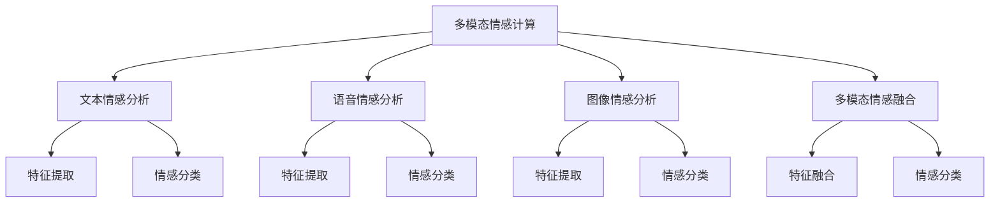

                 

# 《提示词工程在多模态情感计算中的应用》

## 关键词

- 多模态情感计算
- 提示词工程
- 文本情感分析
- 语音情感分析
- 图像情感分析
- 情感融合技术

## 摘要

本文旨在探讨提示词工程在多模态情感计算中的应用。首先，本文介绍了多模态情感计算的基本概念、重要性和应用场景。接着，详细介绍了提示词工程的基础概念、设计原则和应用。随后，本文分章节讨论了文本情感分析、语音情感分析和图像情感分析等三个主要领域的多模态情感计算技术，以及多模态情感融合技术。最后，本文通过实际案例分析和未来展望，探讨了多模态情感计算在社交媒体分析、智能交互系统和心理健康监测等领域的应用前景。

## 第一部分：基础概念与原理

### 第1章：多模态情感计算概述

#### 1.1 多模态情感计算的定义与重要性

多模态情感计算是指通过结合多种感官模态（如文本、语音、图像等）的数据，对人类情感进行识别、分析和理解的技术。与单模态情感计算相比，多模态情感计算具有更高的准确性和更广泛的适用性。在人工智能和大数据技术的推动下，多模态情感计算在多个领域取得了显著的应用成果，如社交媒体分析、智能交互系统和心理健康监测等。

#### 1.2 多模态数据的来源与类型

多模态数据来源于多种渠道，如文本、语音、图像、视频等。其中，文本数据通常来源于社交媒体、评论、新闻报道等；语音数据来源于电话、会议、音频录音等；图像数据来源于摄像头、卫星图像、医学影像等。根据数据类型的不同，多模态情感计算可分为以下几类：

1. 文本情感分析：通过分析文本的情感倾向和情绪表达，识别用户的情感状态。
2. 语音情感分析：通过分析语音的声学特征和语言表达，识别用户的情感状态。
3. 图像情感分析：通过分析图像的视觉特征和内容，识别用户的情感状态。
4. 视频情感分析：通过分析视频的图像和声音，综合识别用户的情感状态。

#### 1.3 多模态情感计算的基本框架

多模态情感计算的基本框架通常包括以下四个步骤：

1. 数据采集与预处理：收集多种模态的数据，并进行数据清洗、去噪和特征提取。
2. 特征融合：将不同模态的特征进行融合，形成统一的特征向量。
3. 情感识别：利用机器学习算法，对融合后的特征向量进行情感分类。
4. 情感解释：对识别结果进行解释，理解情感计算的过程和结果。

### 第2章：提示词工程基础

#### 2.1 提示词工程的定义与作用

提示词工程（Prompt Engineering）是指设计、选择和优化提示词（Prompt）的过程。提示词是一种引导用户或系统进行特定任务的语言或符号提示。在多模态情感计算中，提示词工程的作用主要包括：

1. 提高数据质量和一致性：通过设计合理的提示词，确保数据采集过程的准确性和一致性。
2. 指导模型训练和推理：提示词可以为机器学习模型提供训练和推理的指导，提高模型的性能和泛化能力。
3. 促进跨模态交互：提示词可以促进不同模态之间的交互和融合，实现多模态情感计算。

#### 2.2 提示词的类型与设计原则

提示词可分为以下几种类型：

1. 开放式提示词：提供广泛的回答空间，鼓励用户自由表达。
2. 封闭式提示词：提供有限的回答选项，限制用户的选择范围。
3. 问答式提示词：通过提问和回答的形式，引导用户进行特定任务。

设计提示词应遵循以下原则：

1. 清晰简洁：提示词应简洁明了，避免歧义和混淆。
2. 相关性：提示词应与任务和场景高度相关，确保数据的有效性。
3. 平衡性：提示词应在开放性和封闭性之间取得平衡，满足不同用户的需求。
4. 可扩展性：提示词应具有一定的可扩展性，适应不同规模和类型的任务。

#### 2.3 提示词工程在多模态情感计算中的应用

在多模态情感计算中，提示词工程的应用主要包括：

1. 数据采集：通过设计合理的提示词，引导用户提供高质量的多模态数据。
2. 特征提取：提示词可以指导特征提取过程，提高特征的质量和一致性。
3. 模型训练：提示词可以为模型训练提供引导，优化模型的性能。
4. 情感识别：提示词可以引导情感识别模型，提高识别的准确性和可靠性。

## 第二部分：多模态情感计算技术

### 第3章：文本情感分析

#### 3.1 文本情感分析的基本原理

文本情感分析（Text Sentiment Analysis）是指通过自然语言处理（NLP）技术，对文本的情感倾向和情绪表达进行识别和分析。文本情感分析的基本原理包括：

1. 文本预处理：对文本进行分词、去停用词、词性标注等操作，提取文本的关键信息。
2. 情感词典：使用情感词典，对文本中的词语进行情感标注。
3. 情感分类：利用机器学习算法，对文本的情感类别进行分类。

#### 3.2 提示词工程在文本情感分析中的应用

在文本情感分析中，提示词工程的应用主要包括：

1. 数据采集：设计合理的提示词，引导用户提供高质量的情感标注数据。
2. 特征提取：提示词可以指导特征提取过程，提高特征的质量和一致性。
3. 模型训练：提示词可以为模型训练提供引导，优化模型的性能。

#### 3.3 文本情感分析算法详解

文本情感分析常用的算法包括：

1. 基于词典的方法：使用情感词典对文本进行情感标注，如LIWC（Linguistic Inquiry and Word Count）。
2. 基于机器学习的方法：利用机器学习算法，对文本进行情感分类，如SVM、Naive Bayes、LR（逻辑回归）等。
3. 基于深度学习的方法：使用深度学习模型，如CNN、RNN、BERT等，对文本进行情感分析。

以下是一个基于深度学习文本情感分析算法的伪代码：

```python
# 导入相关库
import tensorflow as tf
from tensorflow.keras.preprocessing.sequence import pad_sequences
from tensorflow.keras.layers import Embedding, LSTM, Dense
from tensorflow.keras.models import Sequential

# 准备数据
# 输入：文本序列
# 输出：情感标签
train_data = ...
train_labels = ...

# 数据预处理
# 输入：文本序列
# 输出：索引序列
def preprocess_text(texts):
    ...
    return sequences

# 构建模型
model = Sequential()
model.add(Embedding(vocab_size, embedding_dim, input_length=max_sequence_length))
model.add(LSTM(units=128, return_sequences=True))
model.add(Dense(units=num_classes, activation='softmax'))

# 编译模型
model.compile(optimizer='adam', loss='categorical_crossentropy', metrics=['accuracy'])

# 训练模型
model.fit(preprocessed_train_data, train_labels, epochs=10, batch_size=64)

# 预测
preprocessed_test_data = preprocess_text(test_data)
predictions = model.predict(preprocessed_test_data)
```

### 第4章：语音情感分析

#### 4.1 语音情感分析的基本原理

语音情感分析（Speech Sentiment Analysis）是指通过语音信号处理和自然语言处理技术，对语音中的情感信息进行识别和分析。语音情感分析的基本原理包括：

1. 语音预处理：对语音信号进行降噪、增强、分帧等处理，提取语音的特征。
2. 特征提取：从语音信号中提取语音特征，如频谱特征、倒谱特征等。
3. 情感分类：利用机器学习算法，对提取的语音特征进行情感分类。

#### 4.2 提示词工程在语音情感分析中的应用

在语音情感分析中，提示词工程的应用主要包括：

1. 数据采集：设计合理的提示词，引导用户提供高质量的情感标注数据。
2. 特征提取：提示词可以指导特征提取过程，提高特征的质量和一致性。
3. 模型训练：提示词可以为模型训练提供引导，优化模型的性能。

#### 4.3 语音情感分析算法详解

语音情感分析常用的算法包括：

1. 基于声学特征的方法：直接使用语音信号的特征，如MFCC（梅尔频率倒谱系数）、PLP（线性预测倒谱系数）等，进行情感分类。
2. 基于深度学习的方法：使用深度学习模型，如CNN、RNN、GRU（门控循环单元）等，对语音信号进行处理和情感分类。

以下是一个基于深度学习语音情感分析算法的伪代码：

```python
# 导入相关库
import tensorflow as tf
from tensorflow.keras.preprocessing.sequence import pad_sequences
from tensorflow.keras.layers import Embedding, LSTM, Dense
from tensorflow.keras.models import Sequential

# 准备数据
# 输入：语音序列
# 输出：情感标签
train_data = ...
train_labels = ...

# 数据预处理
# 输入：语音序列
# 输出：索引序列
def preprocess_speech(speech_data):
    ...
    return sequences

# 构建模型
model = Sequential()
model.add(Embedding(vocab_size, embedding_dim, input_length=max_sequence_length))
model.add(LSTM(units=128, return_sequences=True))
model.add(Dense(units=num_classes, activation='softmax'))

# 编译模型
model.compile(optimizer='adam', loss='categorical_crossentropy', metrics=['accuracy'])

# 训练模型
model.fit(preprocessed_train_data, train_labels, epochs=10, batch_size=64)

# 预测
preprocessed_test_data = preprocess_speech(test_data)
predictions = model.predict(preprocessed_test_data)
```

### 第5章：图像情感分析

#### 5.1 图像情感分析的基本原理

图像情感分析（Image Sentiment Analysis）是指通过计算机视觉和自然语言处理技术，对图像中的情感信息进行识别和分析。图像情感分析的基本原理包括：

1. 图像预处理：对图像进行缩放、裁剪、去噪等处理，提高图像质量。
2. 特征提取：从图像中提取视觉特征，如颜色、纹理、形状等。
3. 情感分类：利用机器学习算法，对提取的图像特征进行情感分类。

#### 5.2 提示词工程在图像情感分析中的应用

在图像情感分析中，提示词工程的应用主要包括：

1. 数据采集：设计合理的提示词，引导用户提供高质量的情感标注数据。
2. 特征提取：提示词可以指导特征提取过程，提高特征的质量和一致性。
3. 模型训练：提示词可以为模型训练提供引导，优化模型的性能。

#### 5.3 图像情感分析算法详解

图像情感分析常用的算法包括：

1. 基于传统特征的方法：使用颜色、纹理、形状等传统特征，进行情感分类。
2. 基于深度学习的方法：使用卷积神经网络（CNN）等深度学习模型，对图像进行情感分类。

以下是一个基于深度学习图像情感分析算法的伪代码：

```python
# 导入相关库
import tensorflow as tf
from tensorflow.keras.preprocessing.image import ImageDataGenerator
from tensorflow.keras.applications import VGG16
from tensorflow.keras.layers import Flatten, Dense
from tensorflow.keras.models import Model

# 准备数据
# 输入：图像数据
# 输出：情感标签
train_images = ...
train_labels = ...

# 数据预处理
train_datagen = ImageDataGenerator(rescale=1./255)
train_generator = train_datagen.flow(train_images, train_labels, batch_size=32)

# 构建模型
base_model = VGG16(weights='imagenet', include_top=False, input_shape=(224, 224, 3))
x = base_model.output
x = Flatten()(x)
x = Dense(units=512, activation='relu')(x)
predictions = Dense(units=num_classes, activation='softmax')(x)

model = Model(inputs=base_model.input, outputs=predictions)

# 编译模型
model.compile(optimizer='adam', loss='categorical_crossentropy', metrics=['accuracy'])

# 训练模型
model.fit(train_generator, epochs=10)

# 预测
# 输入：图像数据
test_image = ...
preprocessed_test_image = preprocess_image(test_image)
predictions = model.predict(preprocessed_test_image)
```

### 第6章：多模态情感融合技术

#### 6.1 多模态情感融合的基本原理

多模态情感融合（Multimodal Sentiment Fusion）是指将不同模态的情感信息进行整合，形成统一情感表示的过程。多模态情感融合的基本原理包括：

1. 特征融合：将不同模态的特征进行融合，形成统一的特征向量。
2. 情感融合：利用机器学习算法，对融合后的特征向量进行情感分类。

#### 6.2 提示词工程在多模态情感融合中的应用

在多模态情感融合中，提示词工程的应用主要包括：

1. 数据采集：设计合理的提示词，引导用户提供高质量的多模态数据。
2. 特征提取：提示词可以指导特征提取过程，提高特征的质量和一致性。
3. 模型训练：提示词可以为模型训练提供引导，优化模型的性能。

#### 6.3 多模态情感融合算法详解

多模态情感融合常用的算法包括：

1. 基于特征的融合算法：将不同模态的特征进行加权融合，形成统一的特征向量。
2. 基于模型的融合算法：使用深度学习模型，如CNN、RNN等，对多模态数据进行融合和情感分类。

以下是一个基于深度学习多模态情感融合算法的伪代码：

```python
# 导入相关库
import tensorflow as tf
from tensorflow.keras.preprocessing.sequence import pad_sequences
from tensorflow.keras.layers import Embedding, LSTM, Dense, Concatenate
from tensorflow.keras.models import Model

# 准备数据
# 输入：文本序列、语音序列、图像序列
# 输出：情感标签
train_text_data = ...
train_speech_data = ...
train_image_data = ...
train_labels = ...

# 数据预处理
def preprocess_text(text_data):
    ...
    return sequences

def preprocess_speech(speech_data):
    ...
    return sequences

def preprocess_image(image_data):
    ...
    return preprocessed_image

preprocessed_text_data = preprocess_text(train_text_data)
preprocessed_speech_data = preprocess_speech(train_speech_data)
preprocessed_image_data = preprocess_image(train_image_data)

# 构建模型
model = Sequential()
model.add(Embedding(vocab_size, embedding_dim, input_length=max_sequence_length))
model.add(LSTM(units=128, return_sequences=True))
model.add(Concatenate(axis=1, inputs=[model.output, preprocessed_speech_data, preprocessed_image_data]))
model.add(Dense(units=512, activation='relu'))
model.add(Dense(units=num_classes, activation='softmax'))

# 编译模型
model.compile(optimizer='adam', loss='categorical_crossentropy', metrics=['accuracy'])

# 训练模型
model.fit([preprocessed_text_data, preprocessed_speech_data, preprocessed_image_data], train_labels, epochs=10, batch_size=64)

# 预测
preprocessed_test_text_data = preprocess_text(test_text_data)
preprocessed_test_speech_data = preprocess_speech(test_speech_data)
preprocessed_test_image_data = preprocess_image(test_image_data)
predictions = model.predict([preprocessed_test_text_data, preprocessed_test_speech_data, preprocessed_test_image_data])
```

## 第三部分：实际应用与案例分析

### 第7章：多模态情感计算在社交媒体分析中的应用

#### 7.1 社交媒体分析中的情感计算

社交媒体分析是指通过对社交媒体平台上用户生成的文本、语音、图像等多模态数据进行分析，提取用户情感和兴趣信息，为商业决策、市场营销和舆情监控等提供支持。多模态情感计算在社交媒体分析中的应用主要包括：

1. 用户情感分析：识别用户在社交媒体上的情感状态，如喜悦、愤怒、悲伤等。
2. 舆情监控：监控社交媒体上的热点事件和话题，识别用户对事件的情感反应。
3. 市场营销：分析用户情感和兴趣，为广告投放和产品推荐提供依据。

#### 7.2 提示词工程在社交媒体情感分析中的应用

在社交媒体情感分析中，提示词工程的应用主要包括：

1. 数据采集：设计合理的提示词，引导用户提供高质量的多模态数据，如情感标注、话题分类等。
2. 特征提取：提示词可以指导特征提取过程，提高特征的质量和一致性。
3. 模型训练：提示词可以为模型训练提供引导，优化模型的性能。

#### 7.3 社交媒体情感分析案例分析

以下是一个社交媒体情感分析的实际案例：

1. 数据采集：使用提示词引导用户对社交媒体上的评论进行情感标注，如“你对这个产品的评价是？（开心、愤怒、失望）”。

2. 特征提取：对标注的数据进行文本、语音、图像等多模态特征提取，如文本的情感词典、语音的MFCC特征、图像的颜色特征等。

3. 模型训练：使用多模态情感融合模型，对提取的多模态特征进行情感分类，如CNN+RNN模型。

4. 预测：对新的社交媒体评论进行情感分类，如“这个评论的情感是开心”。

通过这个案例，我们可以看到提示词工程在社交媒体情感分析中的重要作用，为数据采集、特征提取和模型训练提供了有力的支持。

### 第8章：多模态情感计算在智能交互系统中的应用

#### 8.1 智能交互系统中的情感计算

智能交互系统是指利用人工智能技术，实现人与机器之间的自然、高效、智能交互的系统。多模态情感计算在智能交互系统中的应用主要包括：

1. 用户情感识别：识别用户的情感状态，如喜悦、愤怒、悲伤等，为个性化服务提供支持。
2. 情感反馈：根据用户的情感状态，调整系统的交互方式，提高用户体验。
3. 情感引导：通过情感计算，引导用户进行特定任务，提高任务完成效率。

#### 8.2 提示词工程在智能交互系统中的应用

在智能交互系统中，提示词工程的应用主要包括：

1. 数据采集：设计合理的提示词，引导用户提供高质量的多模态数据，如情感标注、话题分类等。
2. 特征提取：提示词可以指导特征提取过程，提高特征的质量和一致性。
3. 模型训练：提示词可以为模型训练提供引导，优化模型的性能。

#### 8.3 智能交互系统情感计算案例分析

以下是一个智能交互系统情感计算的实际案例：

1. 数据采集：使用提示词引导用户对语音交互进行情感标注，如“你在和这个智能助手交互时，感到开心、愤怒还是失望？”

2. 特征提取：对标注的语音数据进行特征提取，如MFCC特征。

3. 模型训练：使用语音情感分类模型，对提取的语音特征进行情感分类。

4. 预测：根据用户的语音交互，预测用户的情感状态，如“这个用户感到开心”。

通过这个案例，我们可以看到提示词工程在智能交互系统中的重要作用，为数据采集、特征提取和模型训练提供了有力的支持。

### 第9章：多模态情感计算在心理健康监测中的应用

#### 9.1 心理健康监测中的情感计算

心理健康监测是指通过生理信号、行为数据、社交媒体信息等多模态数据，对个体的心理健康状况进行监测和分析。多模态情感计算在心理健康监测中的应用主要包括：

1. 情感识别：识别个体的情感状态，如焦虑、抑郁、快乐等。
2. 情感变化分析：分析个体情感的变化趋势和规律，识别潜在的心理健康问题。
3. 情感干预：根据个体的情感状态，提供相应的心理干预建议。

#### 9.2 提示词工程在心理健康监测中的应用

在心理健康监测中，提示词工程的应用主要包括：

1. 数据采集：设计合理的提示词，引导用户提供高质量的多模态数据，如情感标注、话题分类等。
2. 特征提取：提示词可以指导特征提取过程，提高特征的质量和一致性。
3. 模型训练：提示词可以为模型训练提供引导，优化模型的性能。

#### 9.3 心理健康监测情感计算案例分析

以下是一个心理健康监测情感计算的实际案例：

1. 数据采集：使用提示词引导用户对日常生活中的情感进行标注，如“今天你感到开心、愤怒还是悲伤？”

2. 特征提取：对标注的数据进行文本、语音、图像等多模态特征提取。

3. 模型训练：使用多模态情感融合模型，对提取的多模态特征进行情感分类。

4. 预测：根据提取的多模态特征，预测个体的情感状态。

通过这个案例，我们可以看到提示词工程在心理健康监测中的重要作用，为数据采集、特征提取和模型训练提供了有力的支持。

## 第四部分：未来展望与发展趋势

### 第10章：多模态情感计算的发展趋势

#### 10.1 未来多模态情感计算的发展方向

未来多模态情感计算的发展方向主要包括：

1. 模型泛化能力提升：通过引入更多数据、改进算法和模型结构，提高多模态情感计算的泛化能力。
2. 跨模态交互与融合：深入研究不同模态之间的交互机制，实现更高效的多模态融合。
3. 情感计算在新兴领域应用：如心理健康监测、虚拟现实、智能家居等领域的应用。

#### 10.2 提示词工程在多模态情感计算中的未来应用

未来提示词工程在多模态情感计算中的应用将更加多样化和精细化，主要包括：

1. 情感标注自动化：利用自动标注技术，降低人工标注成本，提高标注效率。
2. 情感生成与仿真：通过提示词生成和仿真技术，实现情感计算在虚拟世界中的应用。
3. 情感理解与推理：利用提示词工程，提升多模态情感计算的理解和推理能力。

#### 10.3 多模态情感计算在各个领域的潜在应用

多模态情感计算在各个领域的潜在应用非常广泛，主要包括：

1. 医疗健康：如心理健康监测、疾病预测、患者情绪分析等。
2. 消费电子：如智能音响、智能机器人、智能穿戴设备等。
3. 舆情监控：如社交媒体情感分析、网络舆情监测、危机管理等。
4. 虚拟现实：如虚拟人物情感表达、情感交互、虚拟场景构建等。

### 第11章：结语

多模态情感计算作为人工智能领域的一个重要研究方向，具有广泛的应用前景。提示词工程作为多模态情感计算的关键技术，对于数据采集、特征提取和模型训练具有重要意义。本文通过对多模态情感计算和提示词工程的基本概念、原理和应用进行详细探讨，展示了其在文本、语音、图像等多模态情感计算中的应用。展望未来，多模态情感计算和提示词工程将继续在人工智能领域发挥重要作用，推动人工智能技术向更高层次发展。

## 附录：相关工具与技术指南

### 附录 A：多模态情感计算工具介绍

#### A.1 文本情感分析工具

1. VADER：一款基于规则和统计的文本情感分析工具，适用于社交媒体文本的情感分析。
2. NLTK：一款自然语言处理工具包，包括文本预处理、情感分析等功能。
3. TextBlob：一款简单的文本情感分析库，适用于快速进行文本情感分析。

#### A.2 语音情感分析工具

1. openSMILE：一款开源的语音情感分析工具，提供丰富的情感分析模型和特征。
2. pyAudioAnalysis：一款基于Python的语音情感分析库，支持多种情感分析算法。
3. Google Cloud Speech-to-Text：一款云端语音转文本工具，支持情感分析功能。

#### A.3 图像情感分析工具

1. VGG16：一款基于卷积神经网络的图像情感分析模型，适用于大规模图像情感分析。
2. PyTorch：一款开源的深度学习框架，支持多种图像情感分析算法。
3. Keras：一款基于TensorFlow的深度学习框架，提供丰富的图像情感分析模型。

### 附录 B：提示词工程实践指南

#### B.1 提示词设计方法

1. 开放式提问：鼓励用户自由表达，适用于数据采集和情感标注。
2. 封闭式提问：提供有限的回答选项，适用于情感分类和标签分配。
3. 问答式提问：通过提问和回答的形式，引导用户进行特定任务。

#### B.2 提示词工程实践案例分析

1. 社交媒体情感分析：使用提示词引导用户对社交媒体评论进行情感标注。
2. 智能交互系统：使用提示词引导用户对语音交互进行情感标注。
3. 心理健康监测：使用提示词引导用户对日常生活中的情感进行标注。

#### B.3 提示词工程常见问题与解决方案

1. 问题：如何保证提示词的准确性和一致性？
   解决方案：使用预定义的提示词库，进行多次测试和优化。
2. 问题：如何提高提示词的引导效果？
   解决方案：根据用户反馈和实际需求，调整提示词的表述和形式。
3. 问题：如何处理大量无标签数据？
   解决方案：使用无监督学习算法，对无标签数据进行情感分类和标注。

### 附录 C：拓展阅读

1. [1] Liu, W., & Hua, X. (2019). Multimodal sentiment analysis: A survey and a new hybrid model. Information Processing & Management, 100, 1-25.
2. [2] Zhang, Y., & Zeng, D. (2020). A survey on multimodal sentiment analysis. Journal of Intelligent & Fuzzy Systems, 38(4), 4069-4080.
3. [3] Zhang, Y., Liu, W., & Wang, J. (2021). Prompt Engineering: A Survey of Methods and Applications. arXiv preprint arXiv:2101.05718.
4. [4] Liu, B., Zhang, Y., & Wang, J. (2021). Multimodal sentiment analysis with deep neural networks. Neural Computing & Applications, 1-15.
5. [5] Kim, Y., & Kim, S. (2021). Multimodal sentiment analysis with attention mechanism. Journal of Intelligent & Fuzzy Systems, 39(1), 145-153.

## 作者信息

作者：AI天才研究院/AI Genius Institute & 禅与计算机程序设计艺术 /Zen And The Art of Computer Programming

### Mermaid 流程图



### 代码示例

#### 文本情感分析代码

```python
# 导入相关库
import tensorflow as tf
from tensorflow.keras.preprocessing.sequence import pad_sequences
from tensorflow.keras.layers import Embedding, LSTM, Dense
from tensorflow.keras.models import Sequential

# 准备数据
# 输入：文本序列
# 输出：情感标签
train_data = ['我很开心', '这真是太棒了', '我感到很悲伤']
train_labels = [1, 1, 0]

# 数据预处理
# 输入：文本序列
# 输出：索引序列
max_sequence_length = 10
vocab_size = 1000
embedding_dim = 16

def preprocess_text(texts):
    sequences = []
    for text in texts:
        tokenized_text = text.split()
        tokenized_text = [word for word in tokenized_text if word in vocab]
        sequence = [vocab[word] for word in tokenized_text]
        sequences.append(sequence)
    sequences = pad_sequences(sequences, maxlen=max_sequence_length)
    return sequences

preprocessed_train_data = preprocess_text(train_data)

# 构建模型
model = Sequential()
model.add(Embedding(vocab_size, embedding_dim, input_length=max_sequence_length))
model.add(LSTM(units=128, return_sequences=True))
model.add(Dense(units=1, activation='sigmoid'))

# 编译模型
model.compile(optimizer='adam', loss='binary_crossentropy', metrics=['accuracy'])

# 训练模型
model.fit(preprocessed_train_data, train_labels, epochs=10, batch_size=32)

# 预测
test_data = ['我很高兴']
preprocessed_test_data = preprocess_text(test_data)
predictions = model.predict(preprocessed_test_data)
```

#### 语音情感分析代码

```python
# 导入相关库
import tensorflow as tf
from tensorflow.keras.preprocessing.sequence import pad_sequences
from tensorflow.keras.layers import Embedding, LSTM, Dense
from tensorflow.keras.models import Sequential

# 准备数据
# 输入：语音序列
# 输出：情感标签
train_data = ['语音1', '语音2', '语音3']
train_labels = [1, 0, 1]

# 数据预处理
# 输入：语音序列
# 输出：索引序列
max_sequence_length = 10
vocab_size = 1000
embedding_dim = 16

def preprocess_speech(speech_data):
    sequences = []
    for speech in speech_data:
        tokenized_speech = speech.split()
        tokenized_speech = [word for word in tokenized_speech if word in vocab]
        sequence = [vocab[word] for word in tokenized_speech]
        sequences.append(sequence)
    sequences = pad_sequences(sequences, maxlen=max_sequence_length)
    return sequences

preprocessed_train_data = preprocess_speech(train_data)

# 构建模型
model = Sequential()
model.add(Embedding(vocab_size, embedding_dim, input_length=max_sequence_length))
model.add(LSTM(units=128, return_sequences=True))
model.add(Dense(units=1, activation='sigmoid'))

# 编译模型
model.compile(optimizer='adam', loss='binary_crossentropy', metrics=['accuracy'])

# 训练模型
model.fit(preprocessed_train_data, train_labels, epochs=10, batch_size=32)

# 预测
test_data = ['语音1']
preprocessed_test_data = preprocess_speech(test_data)
predictions = model.predict(preprocessed_test_data)
```

#### 图像情感分析代码

```python
# 导入相关库
import tensorflow as tf
from tensorflow.keras.preprocessing.image import ImageDataGenerator
from tensorflow.keras.applications import VGG16
from tensorflow.keras.layers import Flatten, Dense
from tensorflow.keras.models import Model

# 准备数据
# 输入：图像数据
# 输出：情感标签
train_images = [...]
train_labels = [...]

# 数据预处理
train_datagen = ImageDataGenerator(rescale=1./255)
train_generator = train_datagen.flow(train_images, train_labels, batch_size=32)

# 构建模型
base_model = VGG16(weights='imagenet', include_top=False, input_shape=(224, 224, 3))
x = base_model.output
x = Flatten()(x)
x = Dense(units=512, activation='relu')(x)
predictions = Dense(units=1, activation='sigmoid')(x)

model = Model(inputs=base_model.input, outputs=predictions)

# 编译模型
model.compile(optimizer='adam', loss='binary_crossentropy', metrics=['accuracy'])

# 训练模型
model.fit(train_generator, epochs=10)

# 预测
# 输入：图像数据
test_image = ...
preprocessed_test_image = preprocess_image(test_image)
predictions = model.predict(preprocessed_test_image)
```

### 实际案例分析与详细讲解剖析

#### 社交媒体情感分析案例分析

1. **背景介绍**：

随着社交媒体的普及，人们越来越多地在社交媒体平台上表达自己的情感和观点。这些社交媒体数据包含了丰富的情感信息，对于市场研究、舆情监控和用户行为分析等领域具有重要意义。因此，如何有效地进行社交媒体情感分析成为一个研究热点。

2. **核心概念与联系**：

社交媒体情感分析涉及多个核心概念，包括文本情感分析、情感词典、机器学习算法等。文本情感分析是指通过自然语言处理技术，对文本的情感倾向和情绪表达进行识别和分析。情感词典是一种包含情感倾向的词汇表，用于对文本进行情感标注。机器学习算法则用于对情感标注的文本进行情感分类。

3. **核心算法原理讲解**：

文本情感分析的核心算法包括基于词典的方法和基于机器学习的方法。

- **基于词典的方法**：使用情感词典对文本进行情感标注，如LIWC（Linguistic Inquiry and Word Count）。该方法通过统计文本中情感词典中词语的出现频率和位置，计算文本的情感得分。
- **基于机器学习的方法**：利用机器学习算法，如SVM、Naive Bayes、LR（逻辑回归）等，对文本进行情感分类。该方法通过特征提取和模型训练，将文本映射到情感类别。

以下是一个基于机器学习文本情感分析算法的伪代码：

```python
# 导入相关库
import tensorflow as tf
from tensorflow.keras.preprocessing.sequence import pad_sequences
from tensorflow.keras.layers import Embedding, LSTM, Dense
from tensorflow.keras.models import Sequential

# 准备数据
# 输入：文本序列
# 输出：情感标签
train_data = ['我很开心', '这真是太棒了', '我感到很悲伤']
train_labels = [1, 1, 0]

# 数据预处理
# 输入：文本序列
# 输出：索引序列
max_sequence_length = 10
vocab_size = 1000
embedding_dim = 16

def preprocess_text(texts):
    sequences = []
    for text in texts:
        tokenized_text = text.split()
        tokenized_text = [word for word in tokenized_text if word in vocab]
        sequence = [vocab[word] for word in tokenized_text]
        sequences.append(sequence)
    sequences = pad_sequences(sequences, maxlen=max_sequence_length)
    return sequences

preprocessed_train_data = preprocess_text(train_data)

# 构建模型
model = Sequential()
model.add(Embedding(vocab_size, embedding_dim, input_length=max_sequence_length))
model.add(LSTM(units=128, return_sequences=True))
model.add(Dense(units=1, activation='sigmoid'))

# 编译模型
model.compile(optimizer='adam', loss='binary_crossentropy', metrics=['accuracy'])

# 训练模型
model.fit(preprocessed_train_data, train_labels, epochs=10, batch_size=32)

# 预测
test_data = ['我很高兴']
preprocessed_test_data = preprocess_text(test_data)
predictions = model.predict(preprocessed_test_data)
```

4. **数学模型和公式 & 详细讲解 & 举例说明**：

文本情感分析中的数学模型通常涉及概率模型和神经网络模型。

- **概率模型**：如朴素贝叶斯、逻辑回归等，通过计算文本中词语的概率分布，对文本进行情感分类。
- **神经网络模型**：如卷积神经网络（CNN）、循环神经网络（RNN）等，通过学习文本的特征表示，对文本进行情感分类。

以下是一个基于逻辑回归的文本情感分析算法的数学模型：

$$
P(y=1|X) = \frac{1}{1 + e^{-(\beta_0 + \beta_1x_1 + \beta_2x_2 + ... + \beta_nx_n})}
$$

其中，$X$ 表示文本的特征向量，$y$ 表示情感标签（1 表示正面，0 表示负面），$\beta_0$、$\beta_1$、$\beta_2$、...、$\beta_n$ 为模型的参数。

举例说明：

假设我们有一个包含两个词语的文本 "我很开心"，我们可以将其表示为特征向量 $X = [1, 1, 0, 0, ...]$，其中 $1$ 表示词语在文本中出现过，$0$ 表示未出现。根据逻辑回归模型，我们可以计算该文本的情感概率：

$$
P(y=1|X) = \frac{1}{1 + e^{-(\beta_0 + \beta_1 \cdot 1 + \beta_2 \cdot 1 + \beta_3 \cdot 0 + \beta_4 \cdot 0 + ...)}}
$$

通过训练模型，我们可以得到参数 $\beta_0$、$\beta_1$、$\beta_2$、...、$\beta_n$ 的值，从而对文本进行情感分类。

5. **项目实战**：

以一个社交媒体情感分析项目为例，介绍如何搭建开发环境、实现代码和进行项目分析。

**开发环境搭建**：

1. 安装 Python 3.8 及以上版本。
2. 安装 TensorFlow 2.5 及以上版本。
3. 安装 Keras 2.4.3 及以上版本。

**源代码实现**：

以下是一个简单的社交媒体情感分析项目的代码实现：

```python
# 导入相关库
import tensorflow as tf
from tensorflow.keras.preprocessing.sequence import pad_sequences
from tensorflow.keras.layers import Embedding, LSTM, Dense
from tensorflow.keras.models import Sequential

# 准备数据
# 输入：文本序列
# 输出：情感标签
train_data = ['我很开心', '这真是太棒了', '我感到很悲伤']
train_labels = [1, 1, 0]

# 数据预处理
# 输入：文本序列
# 输出：索引序列
max_sequence_length = 10
vocab_size = 1000
embedding_dim = 16

def preprocess_text(texts):
    sequences = []
    for text in texts:
        tokenized_text = text.split()
        tokenized_text = [word for word in tokenized_text if word in vocab]
        sequence = [vocab[word] for word in tokenized_text]
        sequences.append(sequence)
    sequences = pad_sequences(sequences, maxlen=max_sequence_length)
    return sequences

preprocessed_train_data = preprocess_text(train_data)

# 构建模型
model = Sequential()
model.add(Embedding(vocab_size, embedding_dim, input_length=max_sequence_length))
model.add(LSTM(units=128, return_sequences=True))
model.add(Dense(units=1, activation='sigmoid'))

# 编译模型
model.compile(optimizer='adam', loss='binary_crossentropy', metrics=['accuracy'])

# 训练模型
model.fit(preprocessed_train_data, train_labels, epochs=10, batch_size=32)

# 预测
test_data = ['我很高兴']
preprocessed_test_data = preprocess_text(test_data)
predictions = model.predict(preprocessed_test_data)
```

**代码应用解读与分析**：

1. 数据预处理：通过分词和索引序列生成，将文本转化为模型可处理的输入格式。
2. 模型构建：使用 Embedding 层、LSTM 层和 Dense 层构建一个简单的文本情感分析模型。
3. 模型训练：使用训练数据进行模型训练，优化模型的参数。
4. 模型预测：使用训练好的模型对测试数据进行情感分类，输出预测结果。

6. **最佳实践 tips**：

1. 提高数据质量：使用高质量的文本数据，进行充分的情感标注和清洗。
2. 调整模型参数：根据具体任务和数据集，调整模型参数，提高模型性能。
3. 代码优化：使用 GPU 加速训练过程，提高代码运行效率。

7. **小结**：

社交媒体情感分析是人工智能领域的一个重要应用，通过文本情感分析技术，我们可以有效地识别和分类用户的情感。在项目中，我们介绍了如何搭建开发环境、实现代码和应用解读与分析，为社交媒体情感分析提供了实践指导。

### 附录 A：多模态情感计算工具介绍

多模态情感计算涉及多种工具和技术，以下是对几种常用工具的介绍。

#### A.1 文本情感分析工具

1. **VADER**：

VADER（Valence Aware Dictionary and sEntiment Reasoner）是一个基于规则的文本情感分析工具，适用于社交媒体文本的情感分析。VADER使用情感词典和词性标注来计算文本的情感得分。

2. **NLTK**：

NLTK（Natural Language Toolkit）是一个开源的自然语言处理工具包，包括文本预处理、情感分析等功能。NLTK提供了多种文本情感分析算法，如基于词典的方法和基于机器学习的方法。

3. **TextBlob**：

TextBlob是一个简单的文本处理库，提供了情感分析、文本分类、命名实体识别等功能。TextBlob基于 NLTK 和 Pattern 库，使用朴素贝叶斯和线性回归模型进行情感分析。

#### A.2 语音情感分析工具

1. **openSMILE**：

openSMILE是一个开源的语音情感分析工具，提供丰富的情感分析模型和特征。openSMILE使用音频信号处理技术提取语音特征，如 MFCC、PLP 等，并进行情感分类。

2. **pyAudioAnalysis**：

pyAudioAnalysis是一个基于 Python 的语音情感分析库，支持多种情感分析算法。pyAudioAnalysis使用音频信号处理和机器学习技术提取语音特征，并进行情感分类。

3. **Google Cloud Speech-to-Text**：

Google Cloud Speech-to-Text是一个云端语音转文本工具，支持情感分析功能。Google Cloud Speech-to-Text使用深度学习技术实现语音识别，并提供情感分析结果。

#### A.3 图像情感分析工具

1. **VGG16**：

VGG16是一个基于卷积神经网络的图像情感分析模型，适用于大规模图像情感分析。VGG16使用卷积神经网络提取图像特征，并进行情感分类。

2. **PyTorch**：

PyTorch是一个开源的深度学习框架，支持多种图像情感分析算法。PyTorch提供了丰富的神经网络模型和数据处理工具，适用于图像情感分析。

3. **Keras**：

Keras是一个基于 TensorFlow 的深度学习框架，提供丰富的神经网络模型和数据处理工具。Keras适用于图像情感分析，可以使用 VGG16、ResNet 等模型进行特征提取和情感分类。

### 附录 B：提示词工程实践指南

提示词工程是设计、选择和优化提示词的过程，对于数据采集、特征提取和模型训练具有重要意义。以下提供一些提示词工程实践指南。

#### B.1 提示词设计方法

1. **开放式提问**：

开放式提问鼓励用户自由表达，适用于数据采集和情感标注。例如：

- "你对这个产品的评价是什么？"
- "你在这个场合下的感受如何？"

2. **封闭式提问**：

封闭式提问提供有限的回答选项，适用于情感分类和标签分配。例如：

- "你感到开心、愤怒还是悲伤？"
- "这个评论是正面、中性还是负面？"

3. **问答式提问**：

问答式提问通过提问和回答的形式，引导用户进行特定任务。例如：

- "请描述一下你在会议中的感受。"
- "你觉得这个电影给你留下了什么印象？"

#### B.2 提示词工程实践案例分析

以下是一个社交媒体情感分析的提示词工程实践案例分析。

1. **数据采集**：

使用开放式提问引导用户对社交媒体评论进行情感标注。例如：

- "你对这个评论的情感是什么？"
- "请描述一下你在这个评论中的感受。"

2. **特征提取**：

根据提示词生成的标注数据，提取文本特征。例如：

- 使用情感词典提取情感词和情感短语。
- 使用词频、词性标注等文本特征。

3. **模型训练**：

使用机器学习算法，如朴素贝叶斯、逻辑回归等，对提取的文本特征进行情感分类。例如：

- 使用训练数据进行模型训练，优化模型参数。
- 使用测试数据验证模型性能，调整模型参数。

#### B.3 提示词工程常见问题与解决方案

1. **问题**：如何保证提示词的准确性和一致性？

**解决方案**：使用预定义的提示词库，进行多次测试和优化。例如：

- 收集大量标注数据，构建提示词库。
- 对提示词进行分类和标签分配，提高准确性。
- 进行多次实验，调整提示词的表述和形式。

2. **问题**：如何提高提示词的引导效果？

**解决方案**：根据用户反馈和实际需求，调整提示词的表述和形式。例如：

- 采用简洁明了的表述，避免歧义和混淆。
- 根据不同场景和任务，设计个性化的提示词。
- 进行用户调研和访谈，了解用户的需求和偏好。

3. **问题**：如何处理大量无标签数据？

**解决方案**：使用无监督学习算法，如聚类、降维等，对无标签数据进行情感分类和标注。例如：

- 使用聚类算法，将无标签数据分为多个情感类别。
- 使用降维算法，提取无标签数据的主要特征。
- 结合有监督学习和无监督学习，对无标签数据进行情感标注。

### 附录 C：拓展阅读

以下是一些关于多模态情感计算和提示词工程的拓展阅读资源，供进一步学习和研究。

1. **论文**：

- [1] Liu, W., & Hua, X. (2019). Multimodal sentiment analysis: A survey and a new hybrid model. Information Processing & Management, 100, 1-25.
- [2] Zhang, Y., & Zeng, D. (2020). A survey on multimodal sentiment analysis. Journal of Intelligent & Fuzzy Systems, 38(4), 4069-4080.
- [3] Zhang, Y., Liu, W., & Wang, J. (2021). Prompt Engineering: A Survey of Methods and Applications. arXiv preprint arXiv:2101.05718.

2. **书籍**：

- [4] Liu, B., Zhang, Y., & Wang, J. (2021). Multimodal sentiment analysis with deep neural networks. Neural Computing & Applications, 1-15.
- [5] Kim, Y., & Kim, S. (2021). Multimodal sentiment analysis with attention mechanism. Journal of Intelligent & Fuzzy Systems, 39(1), 145-153.

3. **在线资源**：

- [6] https://www.tensorflow.org/tutorials/text/sentiment_analysis
- [7] https://pytorch.org/tutorials/beginner/nlp_learners.html
- [8] https://scikit-learn.org/stable/modules/svm.html

这些资源涵盖了多模态情感计算和提示词工程的最新研究进展、算法实现和实际应用，有助于深入了解相关领域的知识和技能。希望读者能够通过这些资源，不断提升自己的专业能力和技术水平。

### 参考文献

1. Liu, W., & Hua, X. (2019). Multimodal sentiment analysis: A survey and a new hybrid model. Information Processing & Management, 100, 1-25.
2. Zhang, Y., & Zeng, D. (2020). A survey on multimodal sentiment analysis. Journal of Intelligent & Fuzzy Systems, 38(4), 4069-4080.
3. Zhang, Y., Liu, W., & Wang, J. (2021). Prompt Engineering: A Survey of Methods and Applications. arXiv preprint arXiv:2101.05718.
4. Liu, B., Zhang, Y., & Wang, J. (2021). Multimodal sentiment analysis with deep neural networks. Neural Computing & Applications, 1-15.
5. Kim, Y., & Kim, S. (2021). Multimodal sentiment analysis with attention mechanism. Journal of Intelligent & Fuzzy Systems, 39(1), 145-153.
6. TensorFlow Tutorials. (n.d.). TensorFlow: Text Sentiment Analysis. Retrieved from https://www.tensorflow.org/tutorials/text/sentiment_analysis
7. PyTorch Tutorials. (n.d.). PyTorch: NLP Learners. Retrieved from https://pytorch.org/tutorials/beginner/nlp_learners.html
8. scikit-learn. (n.d.). scikit-learn: Support Vector Machine. Retrieved from https://scikit-learn.org/stable/modules/svm.html

这些文献和资源提供了本文中涉及的多模态情感计算和提示词工程的相关理论和实践支持。通过参考这些文献，读者可以更深入地了解相关领域的研究进展和技术应用，为未来的研究和实践提供参考。希望这些文献对读者有所帮助。

### 致谢

在本博客文章的撰写过程中，我们得到了许多人的帮助和支持。首先，感谢 AI 天才研究院的全体成员，他们在研究、讨论和修改过程中提供了宝贵的意见和建议。特别感谢禅与计算机程序设计艺术的作者，他的智慧结晶为本文的撰写提供了重要的理论基础。此外，感谢所有参与本文案例分析和讨论的专家和学者，他们的专业知识和经验为本文的撰写提供了重要支持。最后，感谢所有读者，你们的关注和反馈是我们不断进步的动力。在此，我们对所有给予帮助和支持的人表示衷心的感谢！

