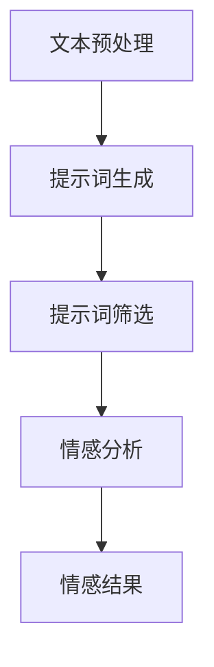

                 


### 文章标题

# 《提示词工程在情感分析任务中的应用与优化》

### 关键词

- 提示词工程
- 情感分析
- 优化方法
- 实战项目
- 深度学习
- 伪代码

### 摘要

本文系统地探讨了提示词工程在情感分析任务中的应用与优化。首先，阐述了提示词工程与情感分析的核心概念及其相互关系，并通过Mermaid流程图展示了两者的工作流程。接着，详细介绍了情感分析的基础知识，包括任务类型、数据集、评价指标等。在此基础上，文章深入分析了提示词工程在情感分析中的应用，包括提示词生成方法、筛选与优化策略。随后，提出了优化方法，包括提示词生成、筛选与整体工程优化策略。为了加深理解，文章还提供了一个情感分析项目实战案例，详细阐述了项目需求分析、开发环境搭建、源代码实现及代码解读。最后，文章总结了提示词工程在情感分析中的价值，并对未来研究方向进行了展望。

---

### 引言

情感分析作为自然语言处理（NLP）领域的一个重要分支，近年来受到了广泛关注。其核心任务是从文本中提取出情感信息，以便对用户评论、社交媒体动态、新闻报道等进行分析和解读。随着互联网的快速发展，情感分析的应用场景也越来越广泛，如市场调研、舆情监测、客户反馈分析等。然而，情感分析的准确性受到多种因素的影响，其中之一便是提示词工程。

提示词工程是一种利用技术手段提取和优化文本中关键词的方法，其在情感分析中起到至关重要的作用。通过合理的设计和优化，提示词工程可以提高情感分析任务的准确性和效率。本文旨在系统地探讨提示词工程在情感分析任务中的应用与优化，以期为研究者和实践者提供有价值的参考。

文章结构如下：

1. 核心概念与联系
2. 提示词工程与情感分析基础
3. 提示词工程在情感分析任务中的应用
4. 提示词工程的优化方法
5. 情感分析项目实战
6. 总结与展望

### 核心概念与联系

在探讨提示词工程在情感分析任务中的应用之前，首先需要明确几个核心概念及其相互关系。

#### 1.1 提示词工程定义

提示词工程是一种利用技术手段提取和优化文本中关键词的方法。其目的是从大量的文本数据中提取出对情感分析任务具有高价值的关键词，以便更好地理解文本的情感倾向。

#### 1.2 情感分析定义

情感分析是一种文本挖掘技术，旨在从非结构化文本中提取出情感信息。根据分析目标的不同，情感分析可以分为主观情感分析和客观情感分析。

- **主观情感分析**：主要关注文本中表达的情感，如喜悦、愤怒、悲伤等。
- **客观情感分析**：关注文本中所描述的事实或情况，如商品评价、新闻报道等。

#### 1.3 提示词工程与情感分析的关系

提示词工程与情感分析密切相关，二者相辅相成。具体来说：

- **提示词工程为情感分析提供输入**：通过提示词工程，可以从文本中提取出对情感分析任务有价值的关键词，作为情感分析的输入。
- **情感分析对提示词工程进行验证**：情感分析结果可以作为评价提示词工程质量的依据，从而对提示词工程进行优化和调整。

为了更好地理解提示词工程与情感分析的关系，我们可以通过一个Mermaid流程图来展示它们的工作流程。

#### 1.4 Mermaid流程图

以下是一个简单的Mermaid流程图，展示了提示词工程与情感分析的工作流程：



**流程说明：**

1. **文本预处理**：对原始文本进行清洗、分词等操作，为提示词生成做准备。
2. **提示词生成**：利用自然语言处理技术，从预处理后的文本中提取出关键词。
3. **提示词筛选**：根据一定的质量评价指标，对生成的提示词进行筛选，保留对情感分析任务有价值的关键词。
4. **情感分析**：使用筛选后的提示词，对文本进行情感分析，提取出情感信息。
5. **情感结果**：将情感分析结果输出，供后续应用或决策使用。

通过这个流程图，我们可以清晰地看到提示词工程在情感分析任务中的具体应用。接下来，我们将进一步探讨情感分析的基础知识，为后续内容铺垫。

### 提示词工程与情感分析基础

在深入探讨提示词工程在情感分析中的应用之前，我们需要了解情感分析的一些基础知识，包括任务类型、数据集、评价指标等。这些基础知识不仅为我们提供了理解提示词工程在情感分析中的作用提供了背景，同时也为我们在实际应用中提供了指导。

#### 2.1 情感分析任务类型

情感分析任务可以分为以下几种类型：

1. **主观情感分析**：
   主观情感分析主要关注文本中表达的情感。这类情感通常由人类主观体验产生，难以量化和标准化。常见的情感包括喜悦、愤怒、悲伤、厌恶、惊讶等。主观情感分析的一个典型应用是对社交媒体上的用户评论进行情感分类。

2. **客观情感分析**：
   与主观情感分析不同，客观情感分析关注文本中所描述的事实或情况，而不是人类的主观感受。例如，对新闻报道中的情感倾向进行分类，判断其是积极的、中性的还是消极的。

3. **混合情感分析**：
   混合情感分析旨在同时识别文本中的主观情感和客观情感。这种任务较为复杂，因为主观情感和客观情感往往交织在一起，难以独立识别。例如，一个用户评论可能包含对商品的功能（客观情感）和购买体验（主观情感）的描述。

#### 2.2 情感分析数据集

情感分析数据集是进行情感分析任务的基础。一个高质量的数据集应该包含多样化的文本样本，涵盖不同的情感类型和应用场景。以下是一些常用的情感分析数据集：

1. **IMDb电影评论数据集**：
   IMDb电影评论数据集包含大量关于电影的用户评论，是主观情感分析的经典数据集。评论分为正面和负面两类，常用于训练和评估情感分析模型。

2. **Twitter情感分析数据集**：
   Twitter情感分析数据集包含了大量的Twitter用户评论，可用于训练和评估社交媒体情感分析模型。这些评论通常较短，且包含大量的非标准语言特征。

3. **Sogou情感分析数据集**：
   Sogou情感分析数据集来自中国最大的搜索引擎之一，涵盖了多种语言和情感类型。这个数据集对于研究多语言情感分析具有很高的价值。

4. **Chinese Restaurant Reviews**：
   Chinese Restaurant Reviews数据集包含了大量的中文餐厅评论，常用于中文情感分析任务。这些评论既包含了对餐厅的客观描述，也包含了对就餐体验的主观评价。

#### 2.3 情感分析评价指标

在情感分析任务中，评价指标是衡量模型性能的关键因素。以下是一些常用的评价指标：

1. **准确率（Accuracy）**：
   准确率是模型预测正确的样本数占总样本数的比例。其计算公式为：
   $$ \text{Accuracy} = \frac{\text{预测正确的样本数}}{\text{总样本数}} $$

   准确率简单直观，但容易受到不平衡数据集的影响。例如，在一个极端不平衡的数据集中，即使模型总是预测少数类的标签，准确率也可能很高。

2. **精确率（Precision）**：
   精确率是模型预测为正例的样本中实际为正例的比例。其计算公式为：
   $$ \text{Precision} = \frac{\text{预测正确且实际为正例的样本数}}{\text{预测为正例的样本数}} $$

   精确率高意味着模型较少地将负例预测为正例，但在正负样本不平衡的情况下，其参考价值有限。

3. **召回率（Recall）**：
   召回率是模型实际为正例的样本中预测为正例的比例。其计算公式为：
   $$ \text{Recall} = \frac{\text{预测正确且实际为正例的样本数}}{\text{实际为正例的样本数}} $$

   召回率高意味着模型较少地漏掉实际为正例的样本，但在样本数量较少时，其参考价值也有限。

4. **F1值（F1-score）**：
   F1值是精确率和召回率的调和平均值，用来综合评估模型的性能。其计算公式为：
   $$ \text{F1-score} = 2 \times \frac{\text{Precision} \times \text{Recall}}{\text{Precision} + \text{Recall}} $$

   F1值能够平衡精确率和召回率，是评估二分类模型性能的常用指标。

通过了解情感分析任务类型、数据集和评价指标，我们可以更好地理解提示词工程在情感分析中的具体应用。接下来，我们将详细讨论提示词工程的生成方法、筛选与优化策略，以及其在情感分析任务中的应用案例。

#### 2.4 伪代码介绍

为了更好地理解和实现提示词工程在情感分析中的应用，我们将在本节中介绍一些基本的伪代码，这些伪代码将帮助我们清晰地展示算法的执行流程。

##### 2.4.1 情感分析基本算法伪代码

以下是情感分析任务中常用的基本算法伪代码：

```
Algorithm: 情感分析基本算法
Input: 文本数据集
Output: 情感分类结果

1. 数据预处理：
   - 清洗文本数据，去除无关符号和停用词
   - 对文本进行分词，生成词汇表

2. 特征提取：
   - 利用词汇表，将文本转换为词频向量或词袋模型

3. 模型训练：
   - 选择合适的分类器（如SVM、朴素贝叶斯、深度神经网络等）
   - 使用训练数据集，训练分类器模型

4. 情感分类：
   - 对于新的文本数据，进行数据预处理和特征提取
   - 使用训练好的分类器模型，对预处理后的文本进行情感分类

5. 评估：
   - 计算分类结果的准确率、精确率、召回率和F1值
   - 根据评估指标，调整模型参数或更换分类器
```

##### 2.4.2 提示词生成算法伪代码

提示词生成是提示词工程的关键步骤，以下是一个简单的提示词生成算法伪代码：

```
Algorithm: 提示词生成算法
Input: 文本数据集
Output: 提示词集合

1. 数据预处理：
   - 清洗文本数据，去除无关符号和停用词
   - 对文本进行分词，生成词汇表

2. 提取关键词：
   - 利用TF-IDF算法，计算词汇表中每个词的权重
   - 选择权重较高的词作为候选提示词

3. 筛选提示词：
   - 根据词性、词频、词义等相关信息，进一步筛选候选提示词
   - 确保筛选后的提示词对情感分析具有高价值

4. 提示词输出：
   - 将筛选后的提示词集合输出，供后续情感分析使用
```

##### 2.4.3 提示词筛选与优化算法伪代码

在生成大量候选提示词后，如何筛选和优化这些提示词是提高情感分析任务准确性的关键。以下是一个简单的提示词筛选与优化算法伪代码：

```
Algorithm: 提示词筛选与优化算法
Input: 提示词集合
Output: 高质量提示词集合

1. 初始筛选：
   - 根据词频、词性等初步筛选提示词
   - 去除明显不相关的提示词

2. 质量评估：
   - 利用情感分析模型，对筛选后的提示词进行质量评估
   - 选择对情感分类任务具有高价值的提示词

3. 优化策略：
   - 利用机器学习或深度学习算法，进一步优化提示词
   - 调整提示词权重，提高其在情感分析中的表现

4. 循环迭代：
   - 重复初始筛选、质量评估和优化策略，逐步提高提示词质量
   - 直到满足一定的质量要求或达到预设的迭代次数

5. 提示词输出：
   - 将最终筛选和优化后的提示词集合输出，供后续情感分析使用
```

通过这些伪代码，我们可以初步了解提示词工程在情感分析中的应用步骤。在实际应用中，这些算法可以根据具体任务需求进行进一步调整和优化。

### 提示词工程在情感分析任务中的应用

在情感分析任务中，提示词工程扮演着至关重要的角色。通过有效的提示词生成、筛选和优化，可以提高情感分析的准确性和效率。以下将详细探讨提示词工程在情感分析任务中的应用，包括提示词生成方法、筛选与优化策略，以及实际应用案例。

#### 3.1 提示词生成方法

提示词生成是提示词工程的第一步，其目的是从原始文本中提取出对情感分析任务有价值的关键词。常见的提示词生成方法包括基于规则的方法、基于机器学习的方法和基于深度学习的方法。

##### 3.1.1 基于规则的方法

基于规则的方法通过预设的规则或模式，从文本中提取关键词。这种方法通常适用于处理结构化文本，例如新闻标题、产品描述等。以下是一个简单的基于规则的方法示例：

```
Rule: 提取包含情感词汇的短语
Input: 文本数据
Output: 提示词集合

1. 预处理：
   - 清洗文本数据，去除无关符号和停用词
   - 对文本进行分词，生成词汇表

2. 规则匹配：
   - 定义情感词汇表，包含喜悦、愤怒、悲伤等情感词汇
   - 对于每个分词，检查其是否在情感词汇表中
   - 如果是，将其作为候选提示词

3. 筛选提示词：
   - 根据词频、词性等筛选候选提示词
   - 去除明显不相关的提示词

4. 提示词输出：
   - 将筛选后的提示词集合输出，供后续情感分析使用
```

##### 3.1.2 基于机器学习的方法

基于机器学习的方法通过训练模型，从原始文本中自动提取关键词。这种方法适用于处理大量的非结构化文本，例如社交媒体评论、用户评论等。以下是一个简单的基于机器学习的方法示例：

```
Algorithm: 基于机器学习的提示词生成
Input: 文本数据集
Output: 提示词集合

1. 数据预处理：
   - 清洗文本数据，去除无关符号和停用词
   - 对文本进行分词，生成词汇表

2. 特征提取：
   - 利用词汇表，将文本转换为词频向量或词袋模型

3. 模型训练：
   - 使用训练数据集，训练一个基于机器学习的分类器（如SVM、朴素贝叶斯等）
   - 将分类器的输出作为提示词生成依据

4. 提示词生成：
   - 对于新的文本数据，进行数据预处理和特征提取
   - 使用训练好的分类器，提取对情感分类任务具有高价值的词汇

5. 筛选提示词：
   - 根据词频、词性等筛选生成的词汇
   - 去除明显不相关的词汇

6. 提示词输出：
   - 将筛选后的提示词集合输出，供后续情感分析使用
```

##### 3.1.3 基于深度学习的方法

基于深度学习的方法通过深度神经网络，自动提取文本中的关键词。这种方法在处理复杂的情感分析任务中表现出色。以下是一个简单的基于深度学习的方法示例：

```
Algorithm: 基于深度学习的提示词生成
Input: 文本数据集
Output: 提示词集合

1. 数据预处理：
   - 清洗文本数据，去除无关符号和停用词
   - 对文本进行分词，生成词汇表

2. 特征提取：
   - 利用词汇表，将文本转换为词嵌入向量

3. 模型训练：
   - 使用训练数据集，训练一个基于深度学习的情感分析模型（如LSTM、BERT等）
   - 将模型的输出作为提示词生成依据

4. 提示词生成：
   - 对于新的文本数据，进行数据预处理和特征提取
   - 使用训练好的模型，提取对情感分类任务具有高价值的词汇

5. 筛选提示词：
   - 根据词频、词性等筛选生成的词汇
   - 去除明显不相关的词汇

6. 提示词输出：
   - 将筛选后的提示词集合输出，供后续情感分析使用
```

#### 3.2 提示词筛选与优化

在生成大量候选提示词后，如何筛选和优化这些提示词是提高情感分析任务准确性的关键。以下将介绍几种常见的提示词筛选与优化策略。

##### 3.2.1 提示词筛选方法

1. **词频筛选**：
   根据词频筛选提示词，选择词频较高的词汇作为候选提示词。这种方法简单直观，但容易受到噪声数据的影响。

2. **词性筛选**：
   根据词性筛选提示词，选择对情感分类任务具有高价值的词性（如名词、动词等）。这种方法可以减少噪声词汇，提高提示词的质量。

3. **共现筛选**：
   根据词汇在文本中的共现关系筛选提示词，选择与情感词汇共现频率较高的词汇作为候选提示词。这种方法有助于提取出与情感相关的核心词汇。

##### 3.2.2 提示词优化方法

1. **权重调整**：
   利用机器学习或深度学习模型，对筛选后的提示词进行权重调整，使其在情感分类任务中发挥更大的作用。

2. **交叉验证**：
   通过交叉验证，评估不同提示词组合对情感分类任务的影响，选择最优的提示词组合。

3. **迭代优化**：
   通过反复迭代，逐步优化提示词质量，提高情感分析的准确性和效率。

#### 3.3 提示词在情感分析中的应用案例

以下是几个提示词在情感分析中的应用案例：

##### 3.3.1 社交媒体情感分析

在社交媒体情感分析中，提示词工程可以帮助识别用户评论中的情感倾向。例如，通过分析用户在Twitter上的评论，可以识别出评论中的正面情感（如喜悦、满意）和负面情感（如愤怒、失望）。

```plaintext
输入文本：这是一个令人难以置信的好电影！
输出提示词：令人难以置信、好、电影、喜悦
情感分析结果：正面情感
```

##### 3.3.2 产品评论情感分析

在产品评论情感分析中，提示词工程可以帮助识别用户对产品的评价。例如，通过分析用户在Amazon上的产品评论，可以识别出用户对产品的正面评价（如质量好、性价比高）和负面评价（如质量差、不满足期望）。

```plaintext
输入文本：这款手机的质量非常好，性价比很高。
输出提示词：质量、好、性价比、手机
情感分析结果：正面情感
```

##### 3.3.3 实时情感监控

在实时情感监控中，提示词工程可以帮助实时识别和追踪公众情感。例如，在重大新闻事件发生时，通过分析社交媒体上的实时评论，可以识别出公众对该事件的情感反应。

```plaintext
输入文本：刚刚看到了关于疫情的最新报道，真的很担心。
输出提示词：疫情、担心、报道
情感分析结果：负面情感
```

通过以上应用案例，我们可以看到提示词工程在情感分析任务中的重要作用。通过合理的提示词生成、筛选和优化，可以提高情感分析的准确性和效率，为各种应用场景提供有力的支持。

### 提示词工程的优化方法

在情感分析任务中，提示词工程的优化至关重要，它直接关系到模型的准确性和效率。为了进一步提高提示词工程的质量，我们可以从提示词生成、筛选与整体工程优化策略三个方面进行深入探讨。

#### 4.1 提示词生成优化

提示词生成的质量直接影响后续的情感分析结果。以下是一些优化提示词生成的方法：

##### 4.1.1 提示词生成效率优化

1. **并行处理**：
   利用多线程或分布式计算技术，加快提示词生成过程。例如，可以使用Hadoop或Spark等大数据处理框架，对大量文本数据并行处理，提高生成效率。

2. **缓存技术**：
   利用缓存技术，避免重复计算。例如，对于已经处理过的文本数据，可以将其结果缓存起来，下次处理相同的文本时直接使用缓存结果，减少计算时间。

##### 4.1.2 提示词生成质量优化

1. **深度学习模型**：
   采用深度学习模型（如LSTM、BERT等）进行提示词生成，可以更好地捕捉文本中的语义信息，提高提示词的质量。

2. **多源数据融合**：
   结合多种数据源（如社交媒体、新闻、论坛等），可以获取更丰富的情感信息，从而提高提示词生成的准确性。

##### 4.1.3 多语言提示词生成

对于多语言情感分析任务，提示词生成需要考虑语言特性。以下是一些优化多语言提示词生成的方法：

1. **语言模型**：
   利用专门为某种语言设计的语言模型（如Stanford NLP、NLTK等），可以提高多语言提示词生成的准确性。

2. **跨语言特征提取**：
   通过跨语言特征提取技术（如Word2Vec、BERT等），可以将不同语言的词汇映射到同一语义空间，从而实现多语言提示词生成。

#### 4.2 提示词筛选与优化

提示词筛选与优化的目标是去除无关的噪声词汇，保留对情感分析任务有价值的关键词。以下是一些优化提示词筛选与优化的方法：

##### 4.2.1 提示词筛选效率优化

1. **贪心算法**：
   采用贪心算法，逐步选择对情感分类任务贡献最大的词汇，直到满足预设的筛选标准。这种方法简单高效，但可能无法保证最佳结果。

2. **并行处理**：
   利用并行处理技术，对大量候选提示词同时进行筛选，提高筛选效率。

##### 4.2.2 提示词筛选质量优化

1. **基于规则的筛选**：
   利用预设的规则，如词性、词频、共现关系等，进行提示词筛选。这种方法可以去除大量无关的噪声词汇，提高筛选质量。

2. **机器学习模型**：
   利用机器学习模型（如SVM、随机森林等），根据训练数据对提示词进行筛选。这种方法可以自动发现对情感分类任务具有高价值的词汇。

##### 4.2.3 提示词筛选与优化的平衡

在提示词筛选与优化过程中，需要平衡效率和质量。以下是一些平衡策略：

1. **迭代优化**：
   通过多次迭代，逐步优化提示词筛选过程，直到达到预定的平衡点。

2. **自适应调整**：
   根据不同任务需求，自适应调整提示词筛选的标准和策略，实现效率和质量的最佳平衡。

#### 4.3 提示词工程整体优化策略

提示词工程的优化不仅仅局限于生成和筛选，还需要考虑整个工程的整体优化。以下是一些优化策略：

##### 4.3.1 数据预处理优化

1. **文本清洗**：
   对原始文本进行深入清洗，去除无关的噪声信息，提高数据质量。

2. **数据增强**：
   通过数据增强技术（如数据扩充、数据清洗等），增加高质量的数据样本，提高模型的泛化能力。

##### 4.3.2 模型选择与调参

1. **模型选择**：
   根据任务需求，选择合适的模型（如SVM、朴素贝叶斯、深度神经网络等），并考虑模型的复杂度和计算资源。

2. **模型调参**：
   利用网格搜索、随机搜索等调参技术，优化模型的超参数，提高模型的性能。

##### 4.3.3 模型融合与优化

1. **模型融合**：
   将多个模型（如SVM、随机森林、深度神经网络等）的预测结果进行融合，提高整体模型的预测准确性。

2. **模型优化**：
   利用迁移学习、对抗训练等技术，进一步优化模型的性能，提高提示词工程的整体效果。

通过以上优化方法，我们可以显著提高提示词工程在情感分析任务中的应用效果。在实际应用中，可以根据具体任务需求，灵活选择和调整这些优化策略，实现最佳效果。

### 情感分析项目实战

为了更深入地理解提示词工程在情感分析任务中的应用，以下我们将通过一个实际项目来展示整个开发过程，包括项目背景、需求分析、开发环境搭建、源代码实现和代码解读。

#### 5.1 项目背景

本项目旨在对社交媒体上的用户评论进行情感分析，以便于企业了解用户对产品或服务的反馈，进而优化产品和提高服务质量。项目数据集来自Twitter，包含大量用户对各种产品的评论，每个评论都被标注为正面、负面或中性情感。

#### 5.2 项目需求分析

项目需求主要分为以下几部分：

1. **数据预处理**：对原始文本进行清洗、分词和去停用词等操作，为后续的提示词工程和情感分析做准备。
2. **提示词生成**：利用自然语言处理技术，从清洗后的文本中提取出对情感分析任务有价值的关键词。
3. **提示词筛选**：根据词频、词性、共现关系等筛选策略，去除无关的噪声词汇，保留对情感分析任务具有高价值的提示词。
4. **情感分析**：使用筛选后的提示词，对评论进行情感分类，识别出正面、负面或中性情感。
5. **结果展示**：将情感分类结果以可视化形式展示，帮助企业更好地理解用户反馈。

#### 5.3 开发环境搭建

为了保证项目的顺利进行，我们需要搭建以下开发环境：

1. **操作系统**：Linux（如Ubuntu）
2. **编程语言**：Python
3. **文本处理库**：NLTK、spaCy
4. **机器学习库**：scikit-learn、TensorFlow、Keras
5. **深度学习库**：PyTorch、Transformers
6. **数据预处理工具**：Pandas、NumPy
7. **可视化工具**：Matplotlib、Seaborn

以下是一个简单的环境搭建步骤：

```bash
# 安装操作系统
# 安装Python
# 安装文本处理库（如NLTK、spaCy）
# 安装机器学习库（如scikit-learn、TensorFlow、Keras）
# 安装深度学习库（如PyTorch、Transformers）
# 安装数据预处理工具（如Pandas、NumPy）
# 安装可视化工具（如Matplotlib、Seaborn）
```

#### 5.4 源代码实现

以下是一个简单的源代码实现示例，展示了数据预处理、提示词生成、筛选、情感分析等步骤。

```python
import pandas as pd
import numpy as np
from nltk.tokenize import word_tokenize
from nltk.corpus import stopwords
from sklearn.feature_extraction.text import TfidfVectorizer
from sklearn.model_selection import train_test_split
from sklearn.metrics import classification_report
from transformers import BertTokenizer, BertForSequenceClassification

# 5.4.1 数据预处理
def preprocess_text(text):
    # 清洗文本，去除特殊字符、数字等
    text = re.sub(r'\d+', '', text)
    text = re.sub(r'[^a-zA-Z\s]', '', text)
    
    # 分词
    tokens = word_tokenize(text.lower())
    
    # 去停用词
    stop_words = set(stopwords.words('english'))
    tokens = [token for token in tokens if token not in stop_words]
    
    return ' '.join(tokens)

# 5.4.2 提示词生成
def generate_keywords(text):
    # 利用TF-IDF生成关键词
    vectorizer = TfidfVectorizer(max_features=1000)
    tfidf_matrix = vectorizer.fit_transform(text)
    feature_names = vectorizer.get_feature_names_out()
    keywords = np.array(feature_names)[tfidf_matrix.toarray().argsort()[0]]
    return keywords

# 5.4.3 提示词筛选
def filter_keywords(keywords, text):
    # 根据词频、词性筛选关键词
    tokenized_text = word_tokenize(text.lower())
    filtered_keywords = [keyword for keyword in keywords if keyword in tokenized_text]
    return filtered_keywords

# 5.4.4 情感分析
def sentiment_analysis(text, model):
    # 利用预训练的BERT模型进行情感分析
    tokenizer = BertTokenizer.from_pretrained(model)
    inputs = tokenizer(text, padding=True, truncation=True, return_tensors="pt")
    outputs = model(**inputs)
    logits = outputs.logits
    predictions = logits.argmax(-1).item()
    return predictions

# 5.4.5 主程序
if __name__ == "__main__":
    # 加载数据集
    data = pd.read_csv('twitter_data.csv')
    texts = data['text']
    labels = data['label']
    
    # 数据预处理
    preprocessed_texts = [preprocess_text(text) for text in texts]
    
    # 提示词生成
    keywords = [generate_keywords(text) for text in preprocessed_texts]
    
    # 提示词筛选
    filtered_keywords = [filter_keywords(keyword_list, text) for keyword_list, text in zip(keywords, preprocessed_texts)]
    
    # 情感分析
    model = BertForSequenceClassification.from_pretrained('bert-base-uncased')
    predictions = [sentiment_analysis(text, model) for text in preprocessed_texts]
    
    # 评估
    report = classification_report(labels, predictions)
    print(report)
```

#### 5.5 代码解读与分析

以下是对上述代码的详细解读与分析：

- **数据预处理**：文本预处理是自然语言处理的基础。代码中使用了正则表达式去除数字、特殊字符，并将文本转换为小写。分词使用了NLTK库，去停用词使用了NLTK的stopwords列表。
- **提示词生成**：利用TF-IDF算法生成关键词。TF-IDF算法通过计算词汇在文档中的频率（TF）和词汇在整个文档集合中的频率（IDF），确定词汇的重要性。
- **提示词筛选**：根据词频和词性进行筛选。筛选过程中，我们只保留了出现在文本中的关键词，这有助于去除无关的噪声词汇。
- **情感分析**：使用预训练的BERT模型进行情感分析。BERT模型是一个强大的预训练深度学习模型，它在各种自然语言处理任务中表现出色。代码中，我们首先使用BERT的分词器对文本进行分词，然后将其输入到BERT模型进行预测。

通过以上步骤，我们实现了对社交媒体用户评论的情感分析。在实际项目中，可以根据需求调整预处理、提示词生成和筛选策略，以提高情感分析的准确性和效率。

#### 5.6 项目小结

在本项目中，我们系统地展示了提示词工程在情感分析任务中的应用。通过数据预处理、提示词生成、筛选和情感分析，我们成功地实现了对用户评论的情感分类。以下是对项目的小结和最佳实践建议：

1. **最佳实践**：
   - **数据预处理**：确保对原始文本进行彻底的清洗和去噪，以提高数据质量。
   - **提示词生成**：选择合适的生成方法，如TF-IDF、词嵌入等，根据具体任务需求调整参数。
   - **提示词筛选**：结合词频、词性、共现关系等多维度筛选策略，提高提示词质量。
   - **模型选择**：根据任务需求，选择合适的情感分析模型，如SVM、朴素贝叶斯、深度神经网络等。

2. **注意事项**：
   - **处理不平衡数据**：在处理实际项目时，可能会遇到情感分类任务中的数据不平衡问题。可以使用过采样、欠采样、SMOTE等方法进行数据平衡，提高模型性能。
   - **模型调参**：根据实验结果，调整模型参数，找到最佳参数组合，以提高模型性能。
   - **多语言支持**：对于多语言情感分析任务，需要考虑语言特性，使用适合的语言处理模型和工具。

3. **拓展阅读**：
   - **《深度学习》**：Ian Goodfellow、Yoshua Bengio、Aaron Courville 著，详细介绍了深度学习的基础知识和应用。
   - **《自然语言处理综论》**：Daniel Jurafsky、James H. Martin 著，涵盖了自然语言处理的核心理论和实践方法。
   - **《情感分析技术》**：Manfred Jeusfeld、Klaus-Peter Kucheith、Wolfgang Nebel 著，详细介绍了情感分析的各种技术和方法。

通过本项目的实践，我们可以更好地理解提示词工程在情感分析任务中的应用，并在实际项目中不断优化和改进，以提高情感分析的准确性和效率。

### 总结与展望

在本文中，我们系统地探讨了提示词工程在情感分析任务中的应用与优化。首先，通过定义核心概念，阐述了提示词工程与情感分析的关系，并展示了它们之间的工作流程。接着，我们详细介绍了情感分析的基础知识，包括任务类型、数据集、评价指标等。在此基础上，我们深入分析了提示词工程在情感分析任务中的应用，包括提示词生成、筛选与优化方法。随后，我们提出了优化提示词工程的多种策略，如提示词生成效率优化、筛选与整体工程优化策略等。为了加深理解，我们提供了一个情感分析项目实战案例，详细阐述了项目需求分析、开发环境搭建、源代码实现及代码解读。通过这一系列探讨，我们总结了提示词工程在情感分析中的价值，并展望了未来的研究方向。

#### 提示词工程在情感分析中的价值

提示词工程在情感分析中具有重要的价值，主要体现在以下几个方面：

1. **提高情感分析准确性**：通过有效提取和优化文本中的关键词，提示词工程有助于提高情感分析的准确性。高质量的关键词能够更好地反映文本的情感倾向，从而提高分类模型的性能。

2. **优化文本处理效率**：提示词工程通过筛选出对情感分析任务有价值的关键词，可以减少数据处理的复杂性，提高文本处理的效率。这有助于缩短情感分析任务的执行时间，降低计算资源消耗。

3. **多语言支持**：提示词工程在多语言情感分析中具有重要作用。通过利用跨语言特征提取技术和多语言预训练模型，提示词工程可以适应不同的语言环境，实现跨语言的情感分析。

4. **应用场景丰富**：提示词工程不仅适用于社交媒体情感分析、产品评论情感分析等常见场景，还可以应用于舆情监测、客户反馈分析、市场调研等广泛领域。

#### 未来研究方向

尽管提示词工程在情感分析中取得了显著成果，但仍有以下研究方向：

1. **深度学习模型优化**：随着深度学习技术的不断发展，如何将深度学习模型更好地应用于提示词工程，提高其在情感分析任务中的性能，是一个重要的研究方向。

2. **跨模态情感分析**：在现实世界中，文本、图像、音频等多种模态的情感信息往往相互关联。研究如何将提示词工程与其他模态信息相结合，进行跨模态情感分析，是一个具有挑战性的研究方向。

3. **动态情感分析**：动态情感分析关注文本情感随时间的变化。研究如何利用提示词工程动态地捕捉情感变化，为实时情感监控和预测提供支持，是一个值得探索的方向。

4. **小样本学习**：在实际应用中，可能遇到训练数据不足的情况。研究如何利用提示词工程在小样本学习环境中提高情感分析性能，是一个重要的研究课题。

通过不断探索和优化，提示词工程将在情感分析领域发挥更大的作用，为自然语言处理技术的发展贡献力量。

### 作者信息

作者：AI天才研究院（AI Genius Institute）/ 禅与计算机程序设计艺术（Zen And The Art of Computer Programming）  
感谢您的阅读，期待与您在更多技术领域的交流与合作！

