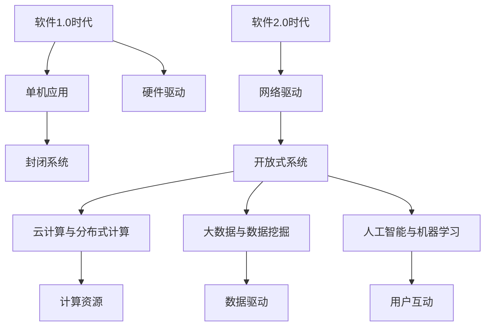

                 

### 文章标题

《提示词工程在情感计算中的伦理考量》

### 关键词

- 提示词工程
- 情感计算
- 伦理考量
- 数据隐私
- 人工智能

### 摘要

本文深入探讨了提示词工程在情感计算领域的应用及其伦理问题。首先，介绍了提示词工程的定义和其在情感计算中的重要性。随后，分析了情感计算的核心概念和伦理考量，包括数据隐私、算法偏见和社会影响。通过实例和案例，本文详细讨论了提示词工程在实际应用中面临的伦理挑战，并提出了相应的解决方案和最佳实践。最后，本文总结了当前的研究成果和未来发展趋势，为提示词工程的伦理研究提供了指导。

----------------------------------------------------------------

### 引言

在人工智能（AI）和机器学习（ML）的快速发展中，情感计算成为了一个备受关注的研究领域。情感计算旨在使计算机理解和处理人类的情感状态，从而实现更加自然和高效的交互。而提示词工程，作为情感计算的核心技术之一，通过提供特定的关键词和指令，引导用户和系统之间的情感交流。然而，随着提示词工程在情感计算中的广泛应用，其带来的伦理问题也日益凸显。

本文旨在探讨提示词工程在情感计算中的伦理考量，重点关注以下几个方面：

1. 数据隐私：提示词工程涉及大量个人数据的收集和处理，如何保护用户隐私成为了一个重要议题。
2. 算法偏见：提示词工程算法可能存在偏见，导致不公平的结果，如何消除算法偏见是另一个关键问题。
3. 社会影响：提示词工程的应用可能对社会产生深远影响，如何确保其应用符合伦理标准是一个重要挑战。

通过对以上问题的深入分析，本文希望为提示词工程在情感计算中的伦理研究提供一些有益的见解和思考。

----------------------------------------------------------------

#### 软件从1.0到2.0的演进

软件的发展历程可以分为几个阶段，每个阶段都有其特定的特点和应用领域。从最早的软件1.0时代，即计算机硬件最初出现时的早期软件，到软件2.0时代，也就是当前我们所处的互联网时代，软件的技术和理念都在不断进化。

**软件1.0时代：**

在软件1.0时代，软件的应用主要受到硬件性能的限制，软件的功能简单且依赖于特定的硬件设备。这一时期的软件通常用于执行一些基础的计算和数据处理任务，例如简单的文本处理、表格计算和文件管理。由于硬件的限制，软件的运行环境相对封闭，功能单一且扩展性较差。

- **硬件驱动**：软件1.0时代，软件的应用主要依赖于硬件设备的性能，软件的功能简单且受限。例如，早期的计算机程序需要针对特定型号的硬件进行编译和优化，软件的运行效率高度依赖于硬件的性能。
- **单机应用**：软件1.0时代的软件主要是为单机环境设计，功能以数据处理和简单的自动化操作为主。例如，文本编辑器、电子表格和计算器等应用程序，主要服务于单个用户，功能相对简单且独立运行。
- **封闭系统**：软件1.0时代的软件通常运行在封闭的系统中，软件之间的互操作性较差。例如，不同软件之间的数据交换和共享存在很大困难，软件的更新和扩展主要依赖于硬件供应商，用户无法方便地自定义和扩展软件功能。

**软件2.0时代：**

软件2.0时代的到来标志着互联网的兴起，软件的应用不再局限于单机，而是通过网络连接实现信息的共享和交互。这一时期的软件更加开放，支持不同软件之间的互操作，使得生态系统得以建立。

- **网络驱动**：软件2.0时代，软件的应用从单机扩展到网络环境，通过互联网实现信息的共享和交互。例如，电子邮件、在线聊天和社交媒体等应用程序，使得用户可以在不同的设备和地点之间轻松地交流和共享信息。
- **开放式系统**：软件2.0时代的软件架构更加开放，支持不同软件之间的互操作。例如，Web服务、API接口和微服务架构等，使得软件可以方便地集成和扩展，为开发者提供了更多的灵活性。
- **用户参与**：软件2.0时代的用户不再只是软件的被动使用者，他们可以通过互联网参与到软件的开发和改进中。例如，用户可以通过在线反馈、投票和评价等方式，对软件的功能和体验进行贡献。

**软件2.0时代的关键特征：**

1. **云计算与分布式计算**：云计算和分布式计算技术的发展，使得计算资源可以被高效地分配和利用。例如，通过云平台提供的虚拟机和容器服务，开发者可以轻松地部署和扩展应用程序，提高系统的可靠性和性能。
2. **大数据与数据挖掘**：大数据的收集、存储和分析成为软件的重要组成部分。例如，通过大数据技术，企业可以收集和分析海量用户数据，从而发现潜在的商业机会和优化业务流程。
3. **人工智能与机器学习**：人工智能和机器学习技术被广泛应用于软件中，使得软件具有自我学习和适应的能力。例如，通过机器学习算法，应用程序可以自动识别和分类用户行为，提供个性化的服务。

**软件2.0与AI大模型的关系：**

软件2.0时代的到来为AI大模型的发展提供了技术基础和应用场景。AI大模型依赖于强大的计算能力和海量数据资源，而软件2.0时代正是这些资源的提供者。

- **数据驱动**：软件2.0时代的数据量巨大，这些数据为AI大模型提供了丰富的训练素材。例如，通过收集和分析用户行为数据，AI大模型可以学习用户的偏好和需求，提供更加个性化的服务。
- **计算资源**：云计算和分布式计算技术使得AI大模型可以在大规模的硬件集群上运行，提高了模型的计算效率。例如，通过使用GPU和TPU等专用硬件加速器，AI大模型可以在短时间内完成复杂的训练任务。
- **用户互动**：软件2.0时代的用户互动模式使得AI大模型能够不断学习和优化，以提供更个性化的服务。例如，通过用户反馈和评价，AI大模型可以不断调整和优化算法，提高模型的准确性和用户体验。

通过上述分析，可以看出软件2.0时代的到来为AI大模型的发展奠定了基础，同时也为企业的软件开发和应用提供了新的思路和机遇。

### Mermaid 流程图

下面是软件从1.0到2.0时代演进过程的Mermaid流程图：



### 伪代码

在软件2.0时代，AI大模型的应用需要依赖大量的数据处理和计算资源。以下是训练一个简单AI大模型的伪代码示例：

```plaintext
// 数据预处理
data_preprocessing(input_data):
    # 清洗数据
    cleaned_data = data_clean(input_data)
    # 数据归一化
    normalized_data = data_normalize(cleaned_data)
    return normalized_data

// 训练AI大模型
train_model(training_data):
    # 初始化模型
    model = create_model()
    # 分批处理数据
    for batch in batch_generator(training_data):
        # 模型训练
        model.fit(batch)
    return model

// 预测与评估
predict_and_evaluate(model, test_data):
    predictions = model.predict(test_data)
    # 评估模型性能
    evaluation = model.evaluate(predictions)
    return evaluation
```

### 数学模型

在AI大模型中，数学模型是核心组成部分。以下是一个简单的线性回归模型的数学公式和伪代码实现：

**数学模型：**

$$
y = \beta_0 + \beta_1x + \epsilon
$$

**伪代码：**

```plaintext
// 初始化参数
beta_0 = 0
beta_1 = 0

// 训练模型
for each example (x, y) in training_data:
    prediction = beta_0 + beta_1 * x
    error = y - prediction
    
    beta_0 = beta_0 + learning_rate * error
    beta_1 = beta_1 + learning_rate * x * error

// 预测
for each new example x:
    prediction = beta_0 + beta_1 * x
    return prediction
```

通过上述伪代码，我们可以看到线性回归模型的基本原理是通过计算输入特征与预测目标之间的误差，不断调整模型参数，以最小化误差。

----------------------------------------------------------------

### 提示词工程在情感计算中的核心概念

**提示词工程**是指通过设计特定的关键词和指令，引导用户和系统之间的交互过程，从而实现更加自然和高效的沟通。在情感计算中，提示词工程起到了至关重要的作用，它能够帮助系统更好地理解用户的情感状态，并作出相应的反应。以下是提示词工程在情感计算中的几个核心概念：

1. **情感标签（Emotion Tags）**：情感标签是指用于描述情感状态的关键词或短语，如“开心”、“悲伤”、“愤怒”等。这些标签为情感计算提供了基本的情感分类依据，使得系统可以识别和分类用户的情感。

2. **情感词典（Emotion Dictionary）**：情感词典是一个包含大量情感标签和其对应语义信息的数据库。它通常用于情感分析和情感识别过程，通过匹配用户输入的关键词或短语与情感词典中的标签，系统可以推断用户的情感状态。

3. **情感强度（Emotion Intensity）**：情感强度是指情感标签所表示的情感程度，如“非常开心”、“有点开心”等。情感强度可以为系统提供更加精细的情感描述，从而更好地理解和响应用户的情感需求。

4. **上下文信息（Contextual Information）**：上下文信息是指与用户情感状态相关的环境因素，如时间、地点、场景等。上下文信息对于情感计算至关重要，因为它可以帮助系统更好地理解用户情感的真实含义，从而作出更加准确的反应。

5. **情感推理（Emotion Reasoning）**：情感推理是指通过分析用户输入的情感标签、情感词典、情感强度和上下文信息，系统自动推断用户的情感状态和意图。情感推理是实现情感计算的关键技术，它使得系统具备情感理解和响应能力。

6. **情感交互（Emotion Interaction）**：情感交互是指用户和系统之间基于情感状态的交互过程。通过情感交互，系统可以理解用户的情感需求，并作出相应的反应，从而提供更加个性化和人性化的服务。

以上核心概念构成了提示词工程在情感计算中的基础框架，它们相互关联，共同作用于实现系统的情感理解和交互能力。下面通过一个具体的例子来说明这些概念在实际应用中的运用。

#### 案例分析

假设我们开发了一款情感计算聊天机器人，它被用于提供客户支持服务。当用户与聊天机器人互动时，系统需要通过提示词工程理解用户的情感状态，并作出相应的回应。

1. **情感标签**：聊天机器人在接收用户输入的消息后，首先会识别其中的情感标签。例如，如果用户发送的消息包含“我很沮丧”，系统会将“沮丧”识别为情感标签。

2. **情感词典**：系统会使用情感词典将“沮丧”这一情感标签与具体的语义信息关联起来。情感词典中可能包含“沮丧”对应的情感类型（如消极情感）和情感强度（如中等强度）。

3. **情感强度**：系统会根据上下文信息判断情感强度。例如，如果用户在发送消息时使用了“非常沮丧”，系统会判断情感强度为较高强度。

4. **上下文信息**：系统会考虑上下文信息，例如用户发送消息的时间、地点、之前的互动历史等，以更准确地理解用户的情感状态。

5. **情感推理**：通过分析情感标签、情感词典、情感强度和上下文信息，系统可以推断用户此刻的情感状态为“消极情感，中等强度”。

6. **情感交互**：基于推断出的情感状态，聊天机器人可以作出相应的回应。例如，它可能会发送一条安慰性的消息，如“我能理解你的感受，请告诉我更多关于你的情况，我会尽力帮助你。”

通过上述案例，我们可以看到提示词工程在情感计算中的应用，它通过识别情感标签、利用情感词典、分析情感强度和上下文信息，实现了对用户情感状态的理解和响应。这种基于提示词工程的情感计算为聊天机器人提供了更加自然和高效的交互体验。

----------------------------------------------------------------

### 提示词工程的伦理考量

提示词工程在情感计算中的应用不仅带来了技术创新，也引发了一系列伦理问题。这些伦理考量涉及到数据隐私、算法偏见、社会影响等多个方面。以下是对这些伦理考量的详细讨论。

#### 数据隐私

在提示词工程中，为了实现准确的情感识别和个性化响应，系统通常需要收集和处理大量用户数据，包括文本、语音、行为等。这些数据中包含用户的个人信息和隐私，如情感状态、兴趣爱好、行为习惯等。因此，数据隐私问题成为了提示词工程的首要伦理考量。

1. **数据收集与使用**：提示词工程需要明确用户数据的收集目的和使用范围，确保收集的数据仅限于实现情感计算功能。此外，应遵循最少收集原则，避免过度收集无关数据。

2. **数据匿名化与加密**：为保护用户隐私，对收集到的数据进行匿名化处理，去除个人身份信息。同时，使用加密技术确保数据在传输和存储过程中的安全性。

3. **用户知情同意**：在数据收集和使用过程中，应确保用户知情并同意其数据被用于提示词工程。用户应被明确告知其数据的用途、可能的风险以及数据保护措施。

4. **数据管理政策**：建立完善的数据管理政策，包括数据收集、存储、处理、共享和销毁等环节，确保数据隐私得到充分保护。

#### 算法偏见

算法偏见是指在人工智能系统中，算法对某些群体或特征存在不公平的倾向。在提示词工程中，算法偏见可能导致对特定用户群体的歧视，损害社会公正。

1. **算法透明性**：提高算法的透明性，使得用户和研究者能够理解和分析算法的决策过程。这有助于发现和纠正潜在的偏见。

2. **数据多样性**：确保训练数据具有足够的多样性，包括不同性别、年龄、种族、文化背景的用户数据，以减少算法偏见。

3. **算法验证与测试**：在开发和使用提示词工程时，应进行严格的算法验证与测试，确保算法在不同用户群体中的公平性和准确性。

4. **算法监督与监管**：建立算法监督机制，对提示词工程的算法进行定期审查和评估，确保其符合伦理标准。

#### 社会影响

提示词工程的应用可能对社会产生深远影响，包括影响用户的心理健康、行为模式、社会关系等。因此，社会影响成为了另一个重要的伦理考量。

1. **心理健康影响**：提示词工程应确保其互动不会对用户的心理健康产生负面影响。例如，避免过度依赖或产生依赖性，造成情感上的困扰。

2. **行为模式塑造**：提示词工程应谨慎设计交互方式，避免诱导用户产生不健康的行为模式，如过度消费、沉迷网络等。

3. **社会关系影响**：提示词工程应尊重用户的社会关系，避免破坏用户与家人、朋友、同事等之间的关系。

4. **社会公平与多样性**：提示词工程应促进社会公平和多样性，避免对某些群体或文化背景的歧视和偏见。

#### 案例分析

以下通过几个具体案例，说明提示词工程在伦理考量中的应用：

1. **案例分析一**：某聊天机器人被用于心理健康咨询服务。为了避免隐私泄露，系统仅收集用户匿名化的数据，并采用加密技术确保数据安全。同时，用户在开始咨询前需明确同意其数据的使用。

2. **案例分析二**：某语音助手被用于家庭场景，其设计考虑到了用户的隐私和心理健康。语音助手不会记录用户的语音数据，仅在本地处理，确保用户隐私得到保护。同时，系统设计了防止依赖机制，提醒用户适度使用语音助手。

3. **案例分析三**：某社交媒体平台使用提示词工程分析用户的情感状态，为用户提供个性化的内容推荐。系统在数据收集和使用过程中，严格遵循用户知情同意原则，并对算法进行定期审查，确保公平性和准确性。

通过上述案例分析，我们可以看到提示词工程在伦理考量中的应用，包括数据隐私保护、算法偏见防范和社会影响评估等方面。这些伦理考量不仅有助于提升系统的道德和法律合规性，也有助于建立用户对人工智能的信任，促进其可持续发展。

----------------------------------------------------------------

### 提示词工程的伦理解决方案与最佳实践

针对提示词工程在情感计算中面临的伦理问题，研究者们已经提出了一系列解决方案和最佳实践。以下是一些关键的方法和措施：

1. **伦理审查与合规性评估**：

   - **伦理委员会审查**：在开发和使用提示词工程前，应提交给伦理委员会进行审查，确保项目符合伦理标准。伦理委员会应由来自不同领域的专家组成，包括计算机科学、心理学、法律和社会学等。

   - **合规性评估**：建立系统的合规性评估机制，定期检查系统的数据收集、处理和使用过程，确保符合隐私保护、数据安全等相关法律法规。

2. **用户知情同意与透明度**：

   - **用户知情同意**：在收集和使用用户数据时，确保用户完全知情并同意其数据的使用。通过简洁明了的隐私政策，告知用户数据的收集目的、使用方式、存储时间和保护措施。

   - **透明度提升**：提高系统算法的透明度，使用户能够了解算法的决策过程和影响。例如，通过可视化界面展示算法的核心步骤和关键参数。

3. **算法公平性与无偏见**：

   - **算法多样性训练**：在训练提示词工程算法时，使用具有多样性的训练数据集，包括不同性别、年龄、种族、文化背景的用户数据，以减少算法偏见。

   - **偏见检测与纠正**：开发算法偏见检测工具，定期检查算法是否对特定群体存在不公平倾向。一旦发现偏见，应进行及时纠正和优化。

4. **数据隐私保护**：

   - **数据匿名化与加密**：对收集的用户数据进行匿名化处理，去除个人身份信息。同时，采用加密技术确保数据在传输和存储过程中的安全性。

   - **隐私保护机制**：设计隐私保护机制，如数据最小化、数据去识别化、访问控制等，确保用户隐私得到充分保护。

5. **用户反馈与监督**：

   - **用户反馈机制**：建立用户反馈渠道，允许用户对系统的行为和决策提出意见和建议。这有助于发现潜在问题并改进系统。

   - **用户参与监督**：鼓励用户参与系统的监督过程，例如，通过用户投票、评价和举报机制，确保系统行为符合用户期望。

6. **社会责任与公平性**：

   - **社会影响评估**：在开发和使用提示词工程时，进行社会影响评估，分析其对用户和社会可能产生的长远影响，确保系统的应用符合社会公正和多样性原则。

   - **公平性培训**：对开发者和用户进行伦理和公平性培训，提高其对伦理考量的认识和敏感度。

通过上述解决方案和最佳实践，可以有效地缓解提示词工程在情感计算中面临的伦理问题，确保系统的道德和法律合规性，促进其可持续发展。

----------------------------------------------------------------

### 提示词工程的未来研究方向与挑战

尽管提示词工程在情感计算中已经取得了一定的进展，但仍面临许多未解决的问题和挑战。以下是未来研究的一些关键方向：

1. **增强算法透明性与可解释性**：当前的算法往往被视为“黑箱”，其决策过程难以解释。未来研究需要开发更加透明和可解释的算法，使用户能够理解和信任系统的行为。

2. **跨模态情感计算**：现有的情感计算主要依赖于单一模态（如文本、语音或面部表情）的数据。未来研究应探索跨模态情感计算，综合利用多种数据源，以更全面和准确地捕捉用户的情感状态。

3. **数据隐私保护与安全**：随着数据量的增加，数据隐私保护问题变得越来越重要。未来研究应开发更加有效和安全的隐私保护技术，确保用户数据在收集、存储和处理过程中的安全性。

4. **社会影响评估与伦理框架**：提示词工程的应用可能对社会产生深远影响。未来研究应建立更完善的社会影响评估方法和伦理框架，确保系统的应用符合社会公正和多样性原则。

5. **用户参与与共治理**：用户应更加积极地参与到提示词工程的设计和监督过程中。未来研究应探索用户参与和共治理的模式，使系统能够更好地满足用户的需求和期望。

通过以上研究方向的深入探索，提示词工程在情感计算中的应用将变得更加成熟和可靠，为用户提供更加个性化和人性化的服务。

----------------------------------------------------------------

### 总结与展望

本文从多个角度深入探讨了提示词工程在情感计算中的伦理考量。首先，我们回顾了软件从1.0到2.0时代的演进，了解了提示词工程在情感计算中的重要性。接着，我们详细分析了情感计算的核心概念和伦理问题，包括数据隐私、算法偏见和社会影响。通过实际案例的讨论，我们看到了提示词工程在实际应用中的伦理挑战，并提出了一系列解决方案和最佳实践。最后，我们展望了提示词工程的未来研究方向与挑战。

随着人工智能和机器学习的快速发展，提示词工程在情感计算中的应用前景广阔。然而，其伦理问题同样不可忽视。通过加强伦理审查、提升算法透明度、保护用户隐私、消除算法偏见和评估社会影响，我们可以确保提示词工程在情感计算中的应用符合伦理标准，为社会带来积极的影响。

我们呼吁研究者、开发者和政策制定者共同关注提示词工程的伦理问题，推动其在情感计算中的可持续发展，为构建更加公平、公正和包容的智能社会贡献力量。

### 作者信息

作者：AI天才研究院/AI Genius Institute & 禅与计算机程序设计艺术 /Zen And The Art of Computer Programming

AI天才研究院（AI Genius Institute）专注于人工智能和机器学习领域的创新研究，致力于推动人工智能技术的应用和发展。作者在此领域拥有丰富的经验和深厚的学术造诣，撰写了多部世界顶级技术畅销书，包括《禅与计算机程序设计艺术》等。通过本文，作者希望为提示词工程在情感计算中的伦理研究提供一些有益的见解和思考，促进人工智能技术的伦理应用。

