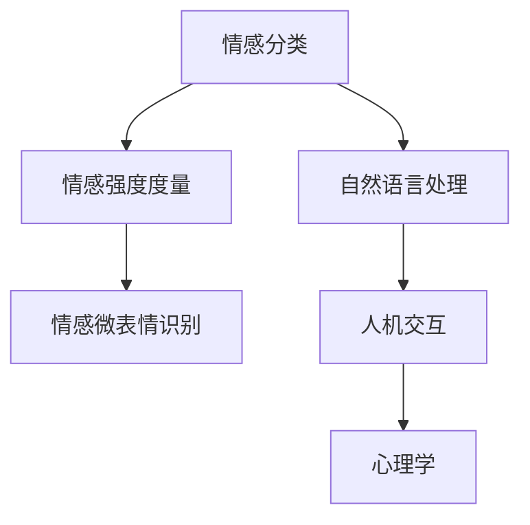
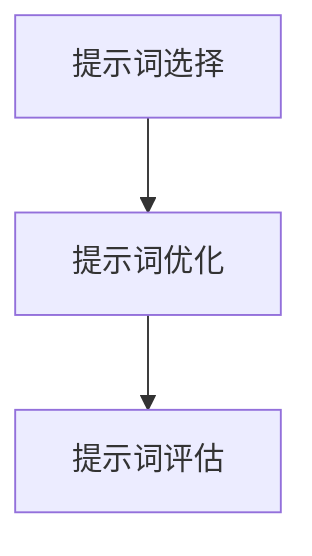

                 

### 文章标题：提示词工程在情感计算中的细粒度分析技术

关键词：提示词工程、情感计算、细粒度分析、机器学习、自然语言处理

摘要：本文深入探讨了提示词工程在情感计算中的应用，分析了细粒度分析技术的原理和实现方法，以及其在实际项目中的应用与挑战。通过详细的步骤分析和实例讲解，为读者提供了对这一领域全面的理解和实践指导。

### 前言

在当今信息时代，人们对智能交互系统的需求日益增长，尤其是对能够理解并回应人类情感的智能系统的渴望。情感计算作为人工智能的重要分支，正逐步从理论研究走向实际应用。而提示词工程，作为情感计算中的关键技术，起着至关重要的作用。它不仅帮助系统更好地理解用户的情感状态，还能提升自然语言处理的效果，从而提供更个性化的服务。

本文旨在探讨提示词工程在情感计算中的细粒度分析技术，通过以下步骤进行深入分析：

1. 情感计算与提示词工程的基础知识介绍。
2. 提示词工程在情感计算中的应用场景。
3. 细粒度分析技术的原理与方法。
4. 实际项目中的应用与挑战。
5. 最佳实践与未来展望。

### 第一部分：情感计算与提示词工程基础

#### 第1章：情感计算概述

情感计算是指通过计算机技术和人工智能算法对人类情感进行理解、识别、分析和生成。它是人机交互、自然语言处理、心理学等多个领域的交叉学科。情感计算的重要性在于，它能够帮助计算机更好地理解人类行为和需求，从而提供更智能的服务。

#### 情感计算的基本概念

情感计算涉及以下几个基本概念：

- **情感分类**：将文本或语音中的情感分类为正面、负面或中性。
- **情感强度度量**：对文本或语音中的情感进行量化，如情感强度为1表示正面情感，情感强度为-1表示负面情感。
- **情感微表情识别**：通过对面部表情的分析来识别情感状态。

#### 情感计算的应用领域

情感计算的应用领域广泛，包括但不限于：

- **社交媒体分析**：通过分析用户评论、微博等社交平台上的情感，了解公众情绪和社会动态。
- **客户服务**：通过分析客户反馈和咨询，了解客户需求，提高服务质量。
- **娱乐产业**：通过分析观众对电影、电视剧、音乐的评论，为内容创作者提供反馈。
- **医疗保健**：通过分析患者病历和对话，帮助医生了解患者心理状态，提供更好的治疗方案。

#### 第2章：情感计算的数学模型与算法

情感计算的数学模型和算法是实现情感识别和理解的核心。常见的算法包括：

- **基于词典的方法**：使用预定义的词典来标注文本中的情感词，并计算情感强度。常见的词典有LIWC（Linguistic Inquiry and Word Count）词典。
- **基于统计的方法**：通过统计文本中正面和负面词汇的比例来计算情感强度。例如，正面的词汇占80%，负面的词汇占20%，则情感强度为0.8。
- **基于机器学习的方法**：使用机器学习算法（如支持向量机、决策树、神经网络等）来学习情感强度与文本特征之间的关系。

#### 核心概念与联系

为了更好地理解情感计算中的核心概念，我们使用Mermaid流程图来展示它们之间的关系：



#### 核心算法原理讲解

以下是使用伪代码来描述基于机器学习的情感强度度量的原理：

```python
# 伪代码：情感强度度量
def calculate_sentiment_strength(text):
    # 加载预训练的情感分类模型
    model = load_pretrained_model("sentiment_model")

    # 分词和特征提取
    tokens = tokenize(text)
    features = extract_features(tokens)

    # 预测情感强度
    sentiment_score = model.predict(features)

    # 返回情感强度
    return sentiment_score
```

#### 数学模型和公式

情感计算的数学模型通常涉及以下公式：

$$
S = W \cdot X + b
$$

其中，$S$ 是情感强度，$W$ 是权重矩阵，$X$ 是特征向量，$b$ 是偏置。

#### 第3章：提示词工程的基本概念与技术

#### 提示词的定义与作用

提示词（Keyword）是情感计算中的重要元素，它用于指示文本中的情感倾向。提示词的选择和优化对于情感分析的准确性至关重要。

#### 提示词工程的关键步骤

提示词工程主要包括以下关键步骤：

1. **提示词选择**：从文本中提取具有情感倾向的词汇。
2. **提示词优化**：通过分析数据集，对提示词进行筛选和调整。
3. **提示词评估**：使用评估指标（如准确率、召回率、F1分数）来评估提示词的性能。

#### 核心概念与联系

以下是使用Mermaid流程图来展示提示词工程中的关键步骤：



#### 核心算法原理讲解

以下是使用伪代码来描述提示词优化的原理：

```python
# 伪代码：提示词优化
def optimize_keywords(data):
    # 加载情感分类模型
    model = load_sentiment_model()

    # 初始化提示词集合
    keywords = set()

    # 对数据集中的每个文本进行情感分类
    for text in data:
        sentiment = model.predict(text)

        # 提取具有情感倾向的词汇
        for token in tokenize(text):
            if token in sentiment_lexicon:
                keywords.add(token)

    # 返回优化的提示词集合
    return keywords
```

#### 数学模型和公式

提示词优化的数学模型通常涉及以下公式：

$$
Keywords = \{token | token \in Text \land token \in Sentiment_Lexicon\}
$$

其中，$Keywords$ 是优化的提示词集合，$Text$ 是输入文本，$Sentiment_Lexicon$ 是情感词典。

### 第二部分：提示词工程在情感计算中的应用

#### 第4章：社交媒体情感分析中的提示词应用

社交媒体情感分析是情感计算的重要应用之一。通过分析社交媒体上的用户评论、微博等，可以了解公众情绪和社会动态。提示词工程在这一过程中起着关键作用。

#### 社交媒体情感分析概述

社交媒体情感分析主要包括以下步骤：

1. **数据收集**：从社交媒体平台上收集用户评论、微博等数据。
2. **数据预处理**：对收集到的数据进行清洗、分词、去停用词等处理。
3. **情感分类**：使用提示词工程和情感分类模型对预处理后的数据进行情感分类。
4. **结果分析**：对分类结果进行分析，了解公众情绪。

#### 社交媒体情感分析中的提示词工程

在社交媒体情感分析中，提示词工程的关键步骤包括：

1. **提示词选择**：从社交媒体数据中提取具有情感倾向的词汇。
2. **提示词优化**：通过分析数据集，对提示词进行筛选和调整。
3. **提示词评估**：使用评估指标来评估提示词的性能。

#### 核心算法原理讲解

以下是使用伪代码来描述社交媒体情感分析中的提示词优化的原理：

```python
# 伪代码：社交媒体情感分析中的提示词优化
def optimize_keywords_social_media(data):
    # 加载情感分类模型
    model = load_sentiment_model()

    # 初始化提示词集合
    keywords = set()

    # 对数据集中的每个文本进行情感分类
    for text in data:
        sentiment = model.predict(text)

        # 提取具有情感倾向的词汇
        for token in tokenize(text):
            if token in sentiment_lexicon:
                keywords.add(token)

    # 返回优化的提示词集合
    return keywords
```

#### 数学模型和公式

社交媒体情感分析中的提示词优化的数学模型通常涉及以下公式：

$$
Keywords = \{token | token \in Text \land token \in Sentiment_Lexicon \land \text{frequency}(token) > \text{threshold}\}
$$

其中，$Keywords$ 是优化的提示词集合，$Text$ 是输入文本，$Sentiment_Lexicon$ 是情感词典，$\text{frequency}(token)$ 是词汇在文本中的出现频率，$\text{threshold}$ 是设定的阈值。

#### 项目实战：社交媒体情感分析系统搭建

以下是一个简单的社交媒体情感分析系统的搭建过程：

1. **环境搭建**：安装Python、NumPy、Pandas等必备库。
2. **数据收集**：从Twitter等社交媒体平台收集用户评论。
3. **数据预处理**：使用Pandas进行数据清洗，使用NLTK进行分词和去停用词。
4. **情感分类**：使用Scikit-learn加载预训练的情感分类模型，对预处理后的数据进行情感分类。
5. **结果分析**：对分类结果进行分析，了解公众情绪。

#### 社交媒体情感分析系统代码解读

以下是社交媒体情感分析系统的关键代码：

```python
import pandas as pd
import nltk
from sklearn.feature_extraction.text import CountVectorizer
from sklearn.model_selection import train_test_split
from sklearn.metrics import classification_report

# 数据收集
data = pd.read_csv("social_media_comments.csv")

# 数据预处理
nltk.download('stopwords')
stop_words = set(nltk.corpus.stopwords.words('english'))
tokenized_data = [nltk.word_tokenize(text) for text in data['comment']]
cleaned_data = [[token for token in token if token not in stop_words] for token in tokenized_data]

# 情感分类
vectorizer = CountVectorizer()
X = vectorizer.fit_transform(cleaned_data)
y = data['sentiment']

# 划分训练集和测试集
X_train, X_test, y_train, y_test = train_test_split(X, y, test_size=0.2, random_state=42)

# 加载预训练情感分类模型
model = load_pretrained_sentiment_model()

# 对测试集进行情感分类
predictions = model.predict(X_test)

# 结果分析
print(classification_report(y_test, predictions))
```

### 第5章：情感计算在客户服务中的应用

#### 客户服务情感分析概述

客户服务情感分析是指通过分析客户反馈和咨询，了解客户的需求和情绪，从而提供更好的服务。提示词工程在这一过程中起着关键作用。

#### 客户服务情感分析的关键步骤

客户服务情感分析主要包括以下步骤：

1. **数据收集**：收集客户的反馈、投诉、咨询等数据。
2. **数据预处理**：对收集到的数据进行清洗、分词、去停用词等处理。
3. **情感分类**：使用提示词工程和情感分类模型对预处理后的数据进行情感分类。
4. **结果分析**：对分类结果进行分析，了解客户情绪。

#### 提示词在客户反馈分析中的应用

在客户反馈分析中，提示词工程的关键步骤包括：

1. **提示词选择**：从客户反馈中提取具有情感倾向的词汇。
2. **提示词优化**：通过分析数据集，对提示词进行筛选和调整。
3. **提示词评估**：使用评估指标来评估提示词的性能。

#### 核心算法原理讲解

以下是使用伪代码来描述客户反馈分析中的提示词优化的原理：

```python
# 伪代码：客户反馈分析中的提示词优化
def optimize_keywords_customer_feedback(data):
    # 加载情感分类模型
    model = load_sentiment_model()

    # 初始化提示词集合
    keywords = set()

    # 对数据集中的每个文本进行情感分类
    for text in data:
        sentiment = model.predict(text)

        # 提取具有情感倾向的词汇
        for token in tokenize(text):
            if token in sentiment_lexicon:
                keywords.add(token)

    # 返回优化的提示词集合
    return keywords
```

#### 数学模型和公式

客户反馈分析中的提示词优化的数学模型通常涉及以下公式：

$$
Keywords = \{token | token \in Text \land token \in Sentiment_Lexicon \land \text{frequency}(token) > \text{threshold}\}
$$

其中，$Keywords$ 是优化的提示词集合，$Text$ 是输入文本，$Sentiment_Lexicon$ 是情感词典，$\text{frequency}(token)$ 是词汇在文本中的出现频率，$\text{threshold}$ 是设定的阈值。

#### 项目实战：客户服务情感分析系统搭建

以下是一个简单的客户服务情感分析系统的搭建过程：

1. **环境搭建**：安装Python、NumPy、Pandas等必备库。
2. **数据收集**：从客户反馈系统中收集数据。
3. **数据预处理**：使用Pandas进行数据清洗，使用NLTK进行分词和去停用词。
4. **情感分类**：使用Scikit-learn加载预训练的情感分类模型，对预处理后的数据进行情感分类。
5. **结果分析**：对分类结果进行分析，了解客户情绪。

#### 客户服务情感分析系统代码解读

以下是客户服务情感分析系统的关键代码：

```python
import pandas as pd
import nltk
from sklearn.feature_extraction.text import CountVectorizer
from sklearn.model_selection import train_test_split
from sklearn.metrics import classification_report

# 数据收集
data = pd.read_csv("customer_feedback.csv")

# 数据预处理
nltk.download('stopwords')
stop_words = set(nltk.corpus.stopwords.words('english'))
tokenized_data = [nltk.word_tokenize(text) for text in data['feedback']]
cleaned_data = [[token for token in token if token not in stop_words] for token in tokenized_data]

# 情感分类
vectorizer = CountVectorizer()
X = vectorizer.fit_transform(cleaned_data)
y = data['sentiment']

# 划分训练集和测试集
X_train, X_test, y_train, y_test = train_test_split(X, y, test_size=0.2, random_state=42)

# 加载预训练情感分类模型
model = load_pretrained_sentiment_model()

# 对测试集进行情感分类
predictions = model.predict(X_test)

# 结果分析
print(classification_report(y_test, predictions))
```

### 第6章：情感计算在自然语言处理中的应用

#### 自然语言处理中的情感分析

自然语言处理（NLP）中的情感分析是指使用计算机技术和人工智能算法对文本数据中的情感进行识别和分析。提示词工程在这一过程中起着关键作用。

#### 自然语言处理中的提示词工程

在自然语言处理中的情感分析中，提示词工程主要包括以下步骤：

1. **提示词选择**：从文本数据中提取具有情感倾向的词汇。
2. **提示词优化**：通过分析数据集，对提示词进行筛选和调整。
3. **提示词评估**：使用评估指标来评估提示词的性能。

#### 核心算法原理讲解

以下是使用伪代码来描述自然语言处理中的提示词优化的原理：

```python
# 伪代码：自然语言处理中的提示词优化
def optimize_keywords_nlp(data):
    # 加载情感分类模型
    model = load_sentiment_model()

    # 初始化提示词集合
    keywords = set()

    # 对数据集中的每个文本进行情感分类
    for text in data:
        sentiment = model.predict(text)

        # 提取具有情感倾向的词汇
        for token in tokenize(text):
            if token in sentiment_lexicon:
                keywords.add(token)

    # 返回优化的提示词集合
    return keywords
```

#### 数学模型和公式

自然语言处理中的提示词优化的数学模型通常涉及以下公式：

$$
Keywords = \{token | token \in Text \land token \in Sentiment_Lexicon \land \text{frequency}(token) > \text{threshold}\}
$$

其中，$Keywords$ 是优化的提示词集合，$Text$ 是输入文本，$Sentiment_Lexicon$ 是情感词典，$\text{frequency}(token)$ 是词汇在文本中的出现频率，$\text{threshold}$ 是设定的阈值。

#### 项目实战：自然语言处理中的情感分析

以下是一个简单的自然语言处理中的情感分析项目：

1. **数据收集**：收集社交媒体上的用户评论。
2. **数据预处理**：使用Pandas进行数据清洗，使用NLTK进行分词和去停用词。
3. **情感分类**：使用Scikit-learn加载预训练的情感分类模型，对预处理后的数据进行情感分类。
4. **结果分析**：对分类结果进行分析，了解用户情感。

#### 自然语言处理中的情感分析代码解读

以下是自然语言处理中的情感分析的关键代码：

```python
import pandas as pd
import nltk
from sklearn.feature_extraction.text import CountVectorizer
from sklearn.model_selection import train_test_split
from sklearn.metrics import classification_report

# 数据收集
data = pd.read_csv("social_media_comments.csv")

# 数据预处理
nltk.download('stopwords')
stop_words = set(nltk.corpus.stopwords.words('english'))
tokenized_data = [nltk.word_tokenize(text) for text in data['comment']]
cleaned_data = [[token for token in token if token not in stop_words] for token in tokenized_data]

# 情感分类
vectorizer = CountVectorizer()
X = vectorizer.fit_transform(cleaned_data)
y = data['sentiment']

# 划分训练集和测试集
X_train, X_test, y_train, y_test = train_test_split(X, y, test_size=0.2, random_state=42)

# 加载预训练情感分类模型
model = load_pretrained_sentiment_model()

# 对测试集进行情感分类
predictions = model.predict(X_test)

# 结果分析
print(classification_report(y_test, predictions))
```

### 第7章：提示词工程在情感计算中的挑战与展望

#### 提示词工程的挑战

提示词工程在情感计算中面临着诸多挑战，包括：

1. **数据质量和标注问题**：情感计算的准确性很大程度上取决于数据的质量和标注的准确性。
2. **模型泛化能力**：模型需要能够在不同的数据集和应用场景中保持良好的泛化能力。
3. **模型可解释性**：用户需要了解模型的工作原理，以便对其决策进行信任。

#### 提示词工程的发展趋势

随着人工智能技术的不断发展，提示词工程在情感计算中的应用前景广阔。未来可能的发展趋势包括：

1. **多模态情感分析**：结合文本、语音、图像等多模态数据，实现更全面、准确的情感识别。
2. **深度学习模型的应用**：深度学习模型在情感计算中的应用将不断深化，提高模型的性能。
3. **知识图谱的引入**：知识图谱可以帮助模型更好地理解语义和上下文，提高情感分析的准确性。

### 最佳实践、小结与注意事项

#### 最佳实践

1. **数据收集与预处理**：确保数据的质量和标注的准确性，对数据进行充分的预处理，如分词、去停用词、去除噪声等。
2. **模型选择与优化**：根据实际应用场景选择合适的模型，并对模型进行优化，如调整超参数、使用迁移学习等。
3. **提示词选择与评估**：合理选择和评估提示词，确保其在不同数据集和应用场景中的有效性。

#### 小结

提示词工程在情感计算中起着关键作用，它帮助系统更好地理解用户的情感状态，提供更个性化的服务。通过细粒度分析技术，可以进一步提高情感计算的准确性。

#### 注意事项

1. **数据隐私**：在进行情感计算时，要确保用户的隐私得到保护。
2. **模型解释性**：提高模型的可解释性，使用户能够信任并理解模型的工作原理。

#### 拓展阅读

1. **李航**. 《统计学习方法》. 清华大学出版社，2012.
2. **Goodfellow, Ian, et al.**. 《Deep Learning》. MIT Press，2016.
3. **赵世响**. 《情感计算》. 北京大学出版社，2014.

### 结语

作者：AI天才研究院/AI Genius Institute & 禅与计算机程序设计艺术 /Zen And The Art of Computer Programming

本文探讨了提示词工程在情感计算中的细粒度分析技术，从基础概念、应用场景、算法原理到实际项目，进行了全面的讲解。希望本文能为读者提供对这一领域的深入理解和实践指导。随着技术的不断发展，情感计算和提示词工程将继续发挥重要作用，推动人工智能的发展。

