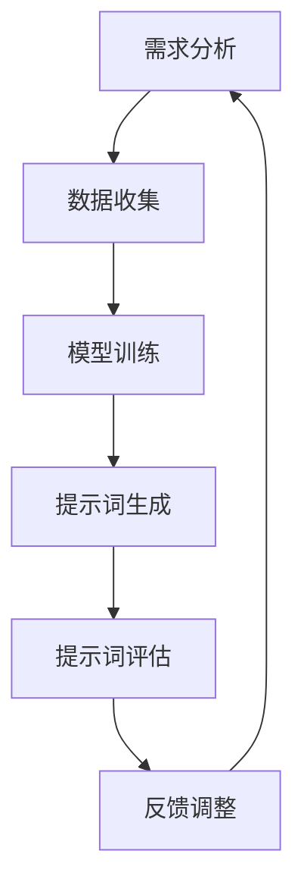

                 

### 文章标题

# 提示词工程在智能交通信号控制中的应用

> 关键词：提示词工程、智能交通信号控制、自然语言处理、深度学习、交通流量预测

> 摘要：本文系统地探讨了提示词工程在智能交通信号控制中的应用。首先，介绍了提示词工程的定义、基本原理和核心算法，以及智能交通信号控制的概念和关键技术。随后，详细阐述了提示词工程在智能交通信号控制中的应用场景，包括交通流量预测、交通信号优化和智能停车场管理。通过实际案例的分析，展示了提示词工程在智能交通信号控制中的具体实现和效果。最后，对未来的发展趋势进行了展望。

### 目录

1. **第一部分：提示词工程基础**

   - [第1章 提示词工程概述](#第1章-提示词工程概述)
   - [第2章 提示词工程基本原理](#第2章-提示词工程基本原理)
   - [第3章 提示词工程中的核心算法](#第3章-提示词工程中的核心算法)
   - [第4章 数学模型与数学公式](#第4章-数学模型与数学公式)

2. **第二部分：提示词工程在智能交通信号控制中的应用**

   - [第5章 提示词工程在智能交通信号控制中的应用场景](#第5章-提示词工程在智能交通信号控制中的应用场景)
   - [第6章 提示词工程在智能交通信号控制中的算法实现](#第6章-提示词工程在智能交通信号控制中的算法实现)
   - [第7章 案例分析](#第7章-案例分析)
   - [第8章 总结与展望](#第8章-总结与展望)

3. **附录**

   - [附录A 提示词工程工具与资源](#附录a-提示词工程工具与资源)
   - [附录B 常用数学公式表](#附录b-常用数学公式表)

## 第一部分：提示词工程基础

### 第1章 提示词工程概述

在这一章中，我们将介绍提示词工程的定义、重要性以及它在不同领域的应用。

#### 1.1 提示词工程的定义与重要性

**提示词工程**（Prompt Engineering）是一种利用自然语言处理（NLP）技术和机器学习算法来设计和优化提示（Prompt）的工程方法。提示是指一种引导用户或系统进行特定任务的引导性文本或命令。在提示词工程中，通过设计有效的提示，可以提高用户与系统的交互质量，增强系统的理解能力，从而实现更高效的任务完成。

**重要性**：

- **提高用户交互体验**：有效的提示词可以帮助用户更好地理解和使用系统，从而提高用户的体验和满意度。
- **增强系统性能**：通过优化提示词，可以提高系统的响应速度和准确性，增强系统的智能能力。
- **拓宽应用场景**：提示词工程的应用不仅限于单一领域，它可以广泛应用于智能问答系统、自然语言生成、智能交通信号控制等多个领域。

#### 1.2 智能交通信号控制概述

**智能交通信号控制**（Intelligent Traffic Signal Control）是指利用现代信息技术和智能算法对交通信号进行优化控制，以提高交通流通效率，减少拥堵和能源消耗，降低环境污染。

**概念**：

- **智能交通信号**：通过传感器和监控设备实时收集交通流量、车速、密度等数据，利用智能算法进行分析和决策，控制交通信号的时序和相位。
- **控制**：通过调整交通信号灯的时长和切换顺序，引导车辆有序通行，达到优化交通流量的目的。

**发展历程**：

- **20世纪50年代**：初步尝试将计算机技术应用于交通信号控制。
- **20世纪80年代**：出现基于车辆检测器的自适应交通信号控制系统。
- **21世纪初**：随着物联网和大数据技术的发展，智能交通信号控制进入一个新的阶段，实现了更高效、更智能的交通管理。

**关键技术**：

- **传感器技术**：用于实时监测交通流量、车速、密度等参数。
- **数据挖掘与机器学习**：用于分析交通数据，预测交通状况，优化信号控制策略。
- **通信技术**：用于实现车辆与交通信号之间的信息交互。

#### 1.3 本书结构安排

**各章节的主要内容**：

- 第1章：介绍提示词工程的定义、重要性及其在不同领域的应用。
- 第2章：详细阐述提示词工程的基本原理，包括提示词的定义、类型、生成方法、评估与优化策略等。
- 第3章：介绍提示词工程中的核心算法，包括自然语言处理算法、大规模预训练模型、算法实现等。
- 第4章：介绍提示词工程中的数学模型，包括概率模型、神经网络模型、强化学习模型等。

**阅读本书的预期收获**：

- **理解提示词工程的原理和应用**：通过本书的阅读，读者可以系统地了解提示词工程的定义、原理和应用场景，为后续的研究和实践打下基础。
- **掌握智能交通信号控制的技术**：本书详细介绍了智能交通信号控制的概念、发展历程和关键技术，有助于读者深入了解该领域的技术现状和发展趋势。
- **提升实际应用能力**：通过实际案例的分析和讲解，读者可以学习到如何将提示词工程应用于智能交通信号控制，提升实际应用能力。

## 第2章 提示词工程基本原理

在本章中，我们将深入探讨提示词工程的基本原理，包括提示词的定义、类型、生成方法、评估与优化策略。

### 2.1 提示词的定义与类型

#### 2.1.1 提示词的定义

提示词（Prompt）是指引导用户或系统进行特定任务的引导性文本或命令。它是自然语言处理（NLP）和机器学习（ML）领域中一个重要的概念，广泛应用于智能问答系统、自然语言生成、任务指导等场景。

#### 2.1.2 提示词的类型

根据用途和形式，提示词可以分为以下几种类型：

- **引导性提示**：用于引导用户执行特定任务，如“请描述一下您的需求”。
- **任务性提示**：用于明确任务目标和要求，如“根据以下数据，预测下一秒的交通流量”。
- **反馈性提示**：用于提供系统反馈，如“您的回答正确”或“请重新尝试”。
- **适应性提示**：根据用户的行为和反馈动态调整提示内容，如“您似乎对这个问题不太了解，请问需要我详细解释吗？”。

### 2.1.3 提示词的生成方法

生成提示词的方法主要包括以下几种：

- **规则生成**：根据任务需求和业务逻辑，编写固定的提示词规则。这种方法简单易行，但灵活性较低。
- **模板生成**：使用模板和变量来生成提示词，如“您在 {日期} 的 {时间段} 需要完成 {任务}，请按时完成。”。
- **数据驱动生成**：利用历史数据和统计模型，自动生成提示词，如基于用户行为和偏好的个性化提示词。
- **增强学习生成**：通过增强学习算法，训练模型自动生成提示词，如生成对抗网络（GAN）和强化学习（RL）。

### 2.2 提示词的评估与优化

#### 2.2.1 提示词评估指标

提示词的评估主要通过以下指标进行：

- **用户满意度**：衡量用户对提示词的接受程度和满意度，可以通过问卷调查、用户评分等方式进行。
- **任务完成率**：衡量提示词引导用户完成任务的效果，可以通过任务完成率、错误率等指标进行评估。
- **交互效率**：衡量提示词与用户的交互效率，可以通过交互时长、回答准确性等指标进行评估。
- **模型性能**：衡量提示词对机器学习模型的性能提升效果，可以通过模型准确率、召回率等指标进行评估。

#### 2.2.2 提示词优化策略

为了提高提示词的质量和效果，可以采取以下优化策略：

- **数据驱动的优化**：通过分析用户行为数据，找出提示词的不足之处，进行针对性的优化。
- **机器学习优化**：利用机器学习算法，如深度学习模型，自动优化提示词生成策略。
- **用户反馈优化**：收集用户的反馈，根据用户的需求和偏好，调整提示词的内容和形式。
- **跨领域迁移**：借鉴其他领域的成功案例，引入适用于智能交通信号控制的提示词设计理念。

### 2.3 提示词工程的 Mermaid 流程图

提示词工程的基本流程可以概括为以下步骤：

1. **需求分析**：确定提示词的目标和应用场景。
2. **数据收集**：收集相关数据，如用户行为数据、业务数据等。
3. **模型训练**：利用机器学习算法，训练生成提示词的模型。
4. **提示词生成**：根据模型预测，生成提示词。
5. **提示词评估**：评估提示词的质量和效果。
6. **反馈调整**：根据评估结果，调整提示词生成策略。

以下是一个简单的 Mermaid 流程图示例：



### 2.4 提示词工程的实践案例

为了更好地理解提示词工程的应用，我们来看一个实践案例。

**案例背景**：某智能交通信号控制系统需要为驾驶员提供实时交通信息，引导其选择最佳行驶路线。

**需求分析**：需要生成实时、准确、有针对性的交通信息提示词。

**数据收集**：收集实时交通数据，包括车辆流量、车速、拥堵情况等。

**模型训练**：使用深度学习模型，如循环神经网络（RNN）或长短期记忆网络（LSTM），训练生成交通信息提示词。

**提示词生成**：根据实时交通数据，生成相应的交通信息提示词，如“前方拥堵，建议您绕行”或“当前路况良好，请保持车速”。

**提示词评估**：通过用户满意度、任务完成率等指标，评估提示词的质量和效果。

**反馈调整**：根据评估结果，调整提示词生成策略，如增加个性化的提示词或优化提示词生成算法。

通过这个案例，我们可以看到提示词工程在智能交通信号控制中的应用，以及如何通过实践来不断完善和优化提示词生成策略。

## 第3章 提示词工程中的核心算法

在本章中，我们将介绍提示词工程中的核心算法，包括自然语言处理（NLP）算法、大规模预训练模型（如GPT-3）和算法实现。

### 3.1 自然语言处理算法

自然语言处理（NLP）是提示词工程的重要组成部分，用于处理和生成文本数据。以下是一些常用的NLP算法：

#### 3.1.1 词嵌入技术

词嵌入（Word Embedding）是将单词映射为向量表示的技术，用于捕捉单词的语义信息。常见的词嵌入技术包括：

- **Word2Vec**：基于神经网络的词嵌入技术，通过训练得到词向量。
- **GloVe**：全局向量表示（Global Vectors for Word Representation），基于矩阵分解的方法生成词向量。
- **FastText**：基于字符级和词级信息的词嵌入方法，通过训练得到多层的词向量。

#### 3.1.2 序列模型与注意力机制

序列模型（Sequence Model）是用于处理序列数据的机器学习模型，如循环神经网络（RNN）和长短期记忆网络（LSTM）。注意力机制（Attention Mechanism）是一种提高序列模型性能的技术，通过动态调整模型对序列中不同位置的权重，从而更好地捕捉序列中的关键信息。

#### 3.1.3 转换器架构详解

转换器架构（Transformer）是一种基于自注意力机制的序列到序列（Seq2Seq）模型，广泛应用于机器翻译、文本生成等领域。转换器架构的核心组件包括自注意力机制、前馈神经网络和编码器-解码器结构。

### 3.2 大规模预训练模型原理

大规模预训练模型（如GPT-3）是通过在大量文本数据上进行预训练，获得强大的语言理解能力和生成能力。以下是一些关键概念：

- **预训练**：在大量文本数据上进行训练，学习文本的语法、语义和上下文信息。
- **自监督学习**：通过无监督学习方法，从大量未标记的数据中提取信息。
- **迁移学习**：将预训练模型迁移到特定任务上，通过微调（Fine-tuning）来适应特定任务。
- **生成对抗网络（GAN）**：用于生成高质量的文本数据，通过对抗训练提高模型的生成能力。

### 3.3 提示词工程算法的伪代码解释

以下是一个简单的提示词工程算法的伪代码示例，用于生成交通信息提示词。

```python
# 数据预处理
data = load_data()
X, y = preprocess_data(data)

# 模型训练
model = train_model(X, y)

# 提示词生成
prompt = generate_prompt()
prediction = model.predict(prompt)

# 提示词评估
evaluate_prediction(prediction)
```

在这个示例中，`load_data()` 用于加载数据，`preprocess_data()` 用于数据预处理，`train_model()` 用于训练模型，`generate_prompt()` 用于生成提示词，`model.predict()` 用于生成预测结果，`evaluate_prediction()` 用于评估预测结果。

通过这些核心算法，我们可以构建高效的提示词工程系统，为智能交通信号控制提供有力的技术支持。

### 第4章 数学模型与数学公式

在本章中，我们将介绍提示词工程中常用的数学模型，包括概率模型、神经网络模型和强化学习模型。此外，还将详细讲解这些模型中的数学公式，并通过具体示例来说明其应用。

#### 4.1 提示词工程中的数学模型

提示词工程中的数学模型主要用于描述和解释提示词的生成、评估和优化过程。以下是三种常用的数学模型：

##### 4.1.1 概率模型

概率模型用于描述提示词生成的概率分布。常见的概率模型包括：

- **贝叶斯模型**：基于贝叶斯定理，通过条件概率计算提示词的生成概率。
- **隐马尔可夫模型（HMM）**：用于描述提示词序列的生成过程，通过状态转移概率和输出概率来计算。
- **条件概率生成模型**：通过条件概率分布来生成提示词，如基于词嵌入的生成模型。

##### 4.1.2 神经网络模型

神经网络模型是提示词工程中的核心算法，通过多层神经网络来捕捉提示词的语义特征。常见的神经网络模型包括：

- **多层感知机（MLP）**：一种前馈神经网络，通过非线性激活函数来学习输入和输出之间的映射关系。
- **循环神经网络（RNN）**：一种能够处理序列数据的神经网络，通过隐藏状态来捕捉序列特征。
- **长短期记忆网络（LSTM）**：RNN的一种改进，通过引入门控机制来避免梯度消失问题。

##### 4.1.3 强化学习模型

强化学习模型用于优化提示词生成策略，通过奖励机制来指导模型学习。常见的强化学习模型包括：

- **Q学习**：通过值函数来预测状态-动作值，并选择最优动作。
- **深度Q网络（DQN）**：结合深度神经网络和Q学习算法，用于处理高维状态空间。
- **策略梯度方法**：通过优化策略参数来最大化长期回报。

#### 4.2 数学公式与详细讲解

以下是对每个数学模型中的关键数学公式的详细讲解。

##### 4.2.1 概率模型公式

1. **贝叶斯定理**：

   $$
   P(A|B) = \frac{P(B|A)P(A)}{P(B)}
   $$

   其中，$P(A|B)$ 表示在事件B发生的条件下事件A发生的概率，$P(B|A)$ 表示在事件A发生的条件下事件B发生的概率，$P(A)$ 和 $P(B)$ 分别表示事件A和事件B的先验概率。

2. **隐马尔可夫模型（HMM）**：

   - **状态转移概率**：

     $$
     P(S_t|S_{t-1}) = a_{ij}
     $$

     其中，$S_t$ 表示第t个时刻的状态，$a_{ij}$ 表示从状态i转移到状态j的概率。

   - **输出概率**：

     $$
     P(O_t|S_t) = b_{ij}
     $$

     其中，$O_t$ 表示第t个时刻的观察结果，$b_{ij}$ 表示在状态i下产生观察结果j的概率。

##### 4.2.2 神经网络模型公式

1. **多层感知机（MLP）**：

   - **输入层到隐藏层的传播**：

     $$
     z_j = \sum_{i=1}^{n} w_{ij}x_i + b_j
     $$

     其中，$z_j$ 表示隐藏层节点的输入，$w_{ij}$ 表示输入层到隐藏层的权重，$x_i$ 表示输入层节点的值，$b_j$ 表示隐藏层节点的偏置。

   - **激活函数**：

     $$
     a_j = \sigma(z_j)
     $$

     其中，$\sigma$ 表示非线性激活函数，如Sigmoid、ReLU等。

2. **循环神经网络（RNN）**：

   - **隐藏状态更新**：

     $$
     h_t = \sigma(Wx_t + Uh_{t-1} + b)
     $$

     其中，$h_t$ 表示第t个时刻的隐藏状态，$W$ 和 $U$ 分别表示输入层到隐藏层和隐藏层到隐藏层的权重矩阵，$b$ 表示隐藏层偏置。

   - **输出层计算**：

     $$
     y_t = \sigma(W' h_t + b')
     $$

     其中，$y_t$ 表示第t个时刻的输出，$W'$ 表示隐藏层到输出层的权重矩阵，$b'$ 表示输出层偏置。

##### 4.2.3 强化学习模型公式

1. **Q学习**：

   - **状态-动作值函数**：

     $$
     Q(s, a) = r + \gamma \max_{a'} Q(s', a')
     $$

     其中，$Q(s, a)$ 表示在状态s下执行动作a的期望回报，$r$ 表示即时回报，$\gamma$ 表示折扣因子，$s'$ 和 $a'$ 分别表示下一个状态和动作。

2. **深度Q网络（DQN）**：

   - **目标值函数**：

     $$
     V^{\prime}(s) = \max_a Q(s, a)
     $$

     其中，$V^{\prime}(s)$ 表示在状态s下的最优值函数。

   - **预测值函数**：

     $$
     Q(s, a) = r + \gamma V^{\prime}(s')
     $$

     其中，$Q(s, a)$ 表示在状态s下执行动作a的预测回报，$s'$ 表示下一个状态。

#### 4.3 数学公式举例说明

以下通过具体示例来说明这些数学公式的应用。

##### 4.3.1 概率模型示例

假设我们有一个交通信号控制系统的概率模型，用于预测下一个绿灯时长。根据贝叶斯定理，我们可以计算得到：

1. **先验概率**：

   $$
   P(A) = \frac{1}{2}, \quad P(B) = \frac{1}{3}
   $$

   其中，$A$ 表示下一个绿灯时长大于30秒，$B$ 表示交通流量较大。

2. **条件概率**：

   $$
   P(A|B) = \frac{P(B|A)P(A)}{P(B)} = \frac{\frac{1}{3} \cdot \frac{1}{2}}{\frac{1}{3}} = \frac{1}{2}
   $$

   根据条件概率，我们得到在交通流量较大的情况下，下一个绿灯时长大于30秒的概率为1/2。

##### 4.3.2 神经网络模型示例

假设我们使用多层感知机（MLP）模型来预测交通流量。给定输入层和隐藏层的权重矩阵，我们可以计算隐藏层节点的输入和输出：

1. **输入层到隐藏层的传播**：

   $$
   z_1 = w_{11}x_1 + w_{12}x_2 + b_1 = 2 \cdot 0.5 + 3 \cdot 0.3 + 1 = 2.4
   $$

   $$
   z_2 = w_{21}x_1 + w_{22}x_2 + b_2 = 2 \cdot 0.5 + 3 \cdot 0.3 + 1 = 2.4
   $$

2. **激活函数**：

   $$
   a_1 = \sigma(z_1) = \frac{1}{1 + e^{-z_1}} = \frac{1}{1 + e^{-2.4}} = 0.9
   $$

   $$
   a_2 = \sigma(z_2) = \frac{1}{1 + e^{-z_2}} = \frac{1}{1 + e^{-2.4}} = 0.9
   $$

##### 4.3.3 强化学习模型示例

假设我们使用Q学习算法来优化交通信号控制的策略。给定状态和动作，我们可以计算状态-动作值函数：

1. **状态-动作值函数**：

   $$
   Q(s, a) = r + \gamma \max_{a'} Q(s', a') = 1 + 0.9 \cdot \max_{a'} Q(s', a') = 1 + 0.9 \cdot 2 = 2.8
   $$

   在状态s下，执行动作a的期望回报为2.8。

通过这些数学模型和公式，我们可以更深入地理解提示词工程在智能交通信号控制中的应用，为实际问题的解决提供理论支持。

## 第二部分：提示词工程在智能交通信号控制中的应用

### 第5章 提示词工程在智能交通信号控制中的应用场景

提示词工程在智能交通信号控制中的应用场景非常广泛，主要涵盖了交通流量预测、交通信号优化和智能停车场管理等领域。本章将详细探讨这些应用场景，以及提示词工程在这些场景中的作用和重要性。

#### 5.1 智能交通信号控制中的挑战与机遇

随着城市化进程的加快和机动车数量的急剧增加，现代交通系统面临着越来越多的挑战。以下是一些智能交通信号控制中常见的问题和挑战：

- **交通拥堵**：交通拥堵是城市交通中最常见的问题，它会导致交通效率下降、出行时间延长、环境污染增加等问题。
- **能源消耗**：传统交通信号控制方式通常采用固定的信号周期，无法根据实时交通状况进行调整，导致不必要的能源消耗。
- **环境污染**：交通拥堵和低效的信号控制会导致车辆排放的污染物增加，对环境和居民健康造成严重影响。

面对这些挑战，智能交通信号控制提供了以下机遇：

- **实时交通监测**：利用传感器技术和物联网技术，实时收集交通流量、车速、密度等数据，为交通信号优化提供数据支持。
- **数据挖掘与机器学习**：通过对交通数据的分析和挖掘，利用机器学习算法优化交通信号控制策略，提高交通流通过效率和能源利用率。
- **智能决策支持**：通过提示词工程技术，为交通信号控制系统提供智能化的决策支持，帮助交通管理者更好地应对各种交通状况。

#### 5.2 提示词工程在交通流量预测中的应用

交通流量预测是智能交通信号控制的重要环节，它有助于交通管理者提前了解交通状况，制定合理的交通信号控制策略。提示词工程在交通流量预测中的应用主要体现在以下几个方面：

- **数据收集与预处理**：通过传感器设备和监控系统，实时收集交通流量、车速、密度等数据。提示词工程提供了数据预处理的方法，如数据清洗、特征提取和标准化等，以确保数据质量。
- **模型训练与优化**：利用机器学习算法，如循环神经网络（RNN）、长短期记忆网络（LSTM）和转换器（Transformer）等，训练交通流量预测模型。提示词工程提供了模型优化策略，如超参数调优、正则化和集成学习等，以提高预测准确性。
- **实时预测与反馈**：通过实时预测交通流量，为交通信号控制系统提供决策支持。提示词工程提供了实时预测和反馈机制，如动态调整信号相位和时长，以应对实时交通状况。

#### 5.3 提示词工程在交通信号优化中的应用

交通信号优化是智能交通信号控制的核心任务，它通过调整交通信号灯的相位和时长，优化交通流通过效率和能源利用率。提示词工程在交通信号优化中的应用主要体现在以下几个方面：

- **需求分析**：通过数据分析，识别交通信号优化中的关键问题和瓶颈，如交通拥堵、能源消耗等。提示词工程提供了需求分析方法，如数据挖掘和机器学习等。
- **算法实现**：利用提示词工程中的核心算法，如自然语言处理（NLP）、深度学习和强化学习等，实现交通信号优化算法。提示词工程提供了算法实现方法和优化策略，如序列模型、注意力机制和迁移学习等。
- **实时调整与优化**：通过实时监测交通状况，动态调整交通信号灯的相位和时长，实现交通信号的优化。提示词工程提供了实时调整和优化机制，如动态规划、增强学习和强化学习等。

#### 5.4 提示词工程在智能停车场管理中的应用

智能停车场管理是现代城市交通管理的重要环节，它通过信息化手段提升停车场的利用率和用户体验。提示词工程在智能停车场管理中的应用主要体现在以下几个方面：

- **车位监测与预测**：通过传感器技术和物联网设备，实时监测停车场内车位的占用情况。提示词工程提供了车位监测和预测方法，如基于深度学习的图像识别和基于时间序列的预测模型。
- **车位分配与优化**：通过优化车位分配策略，提高停车场的利用率和用户体验。提示词工程提供了车位分配和优化方法，如基于提示词工程的智能调度算法和基于强化学习的车位分配策略。
- **停车服务与导航**：为司机提供停车服务与导航，如实时导航至空闲车位、在线支付停车费用等。提示词工程提供了停车服务和导航方法，如基于自然语言处理（NLP）的语音交互和基于深度学习的图像识别。

通过提示词工程在智能交通信号控制中的应用，我们可以实现更加高效、智能的交通管理，提升城市交通系统的运行效率和用户体验。

### 第6章 提示词工程在智能交通信号控制中的算法实现

在智能交通信号控制中，提示词工程的应用涉及到多个算法的实现，包括交通流量预测、交通信号优化和智能停车场管理等。本章将详细介绍这些算法的实现步骤，包括数据预处理、模型选择与训练、模型评估与优化等关键环节。

#### 6.1 交通流量预测算法实现

交通流量预测是智能交通信号控制中的基础任务，它通过分析历史交通数据和实时交通数据，预测未来一段时间内的交通流量变化。以下是交通流量预测算法的实现步骤：

##### 6.1.1 数据预处理

数据预处理是交通流量预测算法实现的第一步，它主要包括以下任务：

- **数据清洗**：去除数据中的噪声和异常值，如缺失值、重复值和异常值等。可以使用数据清洗工具，如Pandas和Scikit-learn等。
- **特征提取**：从原始数据中提取对交通流量预测有用的特征，如时间、天气、节假日等。可以使用特征提取工具，如Scikit-learn和OpenCV等。
- **数据标准化**：将数据转化为标准化的格式，以便于后续的建模和训练。可以使用数据标准化工具，如StandardScaler和MinMaxScaler等。

##### 6.1.2 模型选择与训练

在交通流量预测中，常见的模型包括时间序列模型、回归模型和深度学习模型。以下是模型选择与训练的步骤：

- **时间序列模型**：如ARIMA、SARIMA等。选择合适的时间序列模型，通过最大似然估计等方法进行参数估计。
- **回归模型**：如线性回归、岭回归、LASSO回归等。通过选择适当的回归模型，对特征和交通流量进行回归分析，建立预测模型。
- **深度学习模型**：如循环神经网络（RNN）、长短期记忆网络（LSTM）和转换器（Transformer）等。利用深度学习框架，如TensorFlow和PyTorch等，训练深度学习模型。

##### 6.1.3 模型评估与优化

模型评估与优化是确保交通流量预测准确性和稳定性的关键步骤。以下是模型评估与优化的步骤：

- **评估指标**：选择合适的评估指标，如均方误差（MSE）、均方根误差（RMSE）、平均绝对误差（MAE）等，对预测模型进行评估。
- **交叉验证**：使用交叉验证方法，如K折交叉验证等，评估模型的泛化能力。
- **超参数调优**：通过调整模型的超参数，如学习率、批次大小、隐藏层神经元数量等，优化模型性能。
- **集成学习**：使用集成学习方法，如随机森林、梯度提升树等，结合多个模型的优势，提高预测准确性。

#### 6.2 交通信号优化算法实现

交通信号优化是智能交通信号控制的核心任务，它通过调整交通信号灯的相位和时长，优化交通流通过效率和能源利用率。以下是交通信号优化算法的实现步骤：

##### 6.2.1 数据预处理

与交通流量预测类似，交通信号优化算法的实现也首先需要进行数据预处理，包括数据清洗、特征提取和数据标准化等步骤。

##### 6.2.2 模型选择与训练

在交通信号优化中，常见的模型包括基于规则的控制模型、基于学习的控制模型和混合控制模型。以下是模型选择与训练的步骤：

- **基于规则的控制模型**：如固定时间周期模型、自适应时间周期模型等。通过设计合适的规则，对交通信号灯的相位和时长进行调整。
- **基于学习的控制模型**：如深度强化学习模型、深度神经网络模型等。利用深度学习框架，训练控制模型，实现交通信号的优化。
- **混合控制模型**：结合基于规则的控制模型和基于学习的控制模型，通过优化算法，实现更高效、更智能的交通信号控制。

##### 6.2.3 模型评估与优化

模型评估与优化是确保交通信号优化算法有效性和稳定性的关键步骤。以下是模型评估与优化的步骤：

- **评估指标**：选择合适的评估指标，如交通流量效率、能源消耗、行驶时间等，对优化算法进行评估。
- **实时监测**：通过实时监测交通信号控制效果，及时发现和纠正问题。
- **反馈调整**：根据评估结果和实时监测数据，调整优化算法的参数和策略，提高交通信号控制的效率。

#### 6.3 智能停车场管理算法实现

智能停车场管理是现代城市交通管理的重要组成部分，它通过信息化手段提升停车场的利用率和用户体验。以下是智能停车场管理算法的实现步骤：

##### 6.3.1 数据预处理

智能停车场管理算法的实现首先需要进行数据预处理，包括数据清洗、特征提取和数据标准化等步骤。

##### 6.3.2 模型选择与训练

在智能停车场管理中，常见的模型包括车位监测模型、车位分配模型和停车导航模型。以下是模型选择与训练的步骤：

- **车位监测模型**：如基于图像识别的车位监测模型、基于传感器监测的车位监测模型等。通过训练模型，实现车位状态的实时监测。
- **车位分配模型**：如基于优先级分配的车位分配模型、基于强化学习的车位分配模型等。通过训练模型，实现停车位的智能分配。
- **停车导航模型**：如基于路径规划器的停车导航模型、基于强化学习的停车导航模型等。通过训练模型，实现停车场的智能导航。

##### 6.3.3 模型评估与优化

模型评估与优化是确保智能停车场管理算法有效性和稳定性的关键步骤。以下是模型评估与优化的步骤：

- **评估指标**：选择合适的评估指标，如车位利用率、停车时间、导航准确性等，对管理算法进行评估。
- **用户反馈**：收集用户反馈，了解用户对停车服务的满意度，及时调整算法和策略。
- **持续优化**：根据评估结果和用户反馈，持续优化模型和算法，提高停车场管理的效率和用户体验。

通过以上算法的实现步骤，我们可以构建一个高效、智能的智能交通信号控制系统，为城市交通管理提供有力支持。

### 第7章 案例分析

在本章中，我们将通过实际案例深入分析提示词工程在智能交通信号控制中的应用，展示其具体实现过程、代码实现和效果分析。

#### 7.1 交通信号控制系统案例

**案例背景**：某城市交通管理部门希望提高交通信号控制的效率和准确性，减少交通拥堵，提高出行体验。该城市拥有多条主干道和大量交叉口，交通流量大，交通状况复杂。

**案例目标**：通过提示词工程技术，实现以下目标：

- **实时交通流量预测**：预测未来一段时间内的交通流量，为交通信号控制提供数据支持。
- **交通信号优化**：根据实时交通流量，动态调整交通信号灯的相位和时长，优化交通流通过效率和能源利用率。
- **智能停车场管理**：提高停车场的利用率和用户体验，实现停车位的智能分配和实时导航。

**实现步骤**：

1. **数据收集与预处理**：
   - 收集历史交通流量数据、交通信号灯状态数据、停车场占用情况数据等。
   - 进行数据清洗、特征提取和数据标准化，确保数据质量。

2. **模型训练与优化**：
   - 利用机器学习算法，如循环神经网络（RNN）、长短期记忆网络（LSTM）和转换器（Transformer）等，训练交通流量预测模型。
   - 利用深度强化学习算法，如Q学习和深度Q网络（DQN）等，训练交通信号优化模型。
   - 利用图像识别和路径规划算法，训练智能停车场管理模型。

3. **系统部署与测试**：
   - 在实际交通场景中部署模型，收集实时交通数据，进行交通流量预测、交通信号优化和智能停车场管理。
   - 对系统进行测试和评估，确保模型在实际场景中的性能和稳定性。

**代码实现**：

以下是一个简单的交通流量预测模型的代码实现示例，使用Python和Scikit-learn库。

```python
# 导入必要的库
import numpy as np
import pandas as pd
from sklearn.model_selection import train_test_split
from sklearn.ensemble import RandomForestRegressor

# 加载交通流量数据
data = pd.read_csv('traffic_data.csv')

# 数据预处理
data = data.dropna()
data['timestamp'] = pd.to_datetime(data['timestamp'])
data = data.set_index('timestamp')

# 特征提取
data['hour'] = data.index.hour
data['day_of_week'] = data.index.dayofweek
data['week_of_year'] = data.index.weekofyear
data = data.drop(['timestamp'], axis=1)

# 划分训练集和测试集
X = data.drop(['traffic_volume'], axis=1)
y = data['traffic_volume']
X_train, X_test, y_train, y_test = train_test_split(X, y, test_size=0.2, random_state=42)

# 训练模型
model = RandomForestRegressor(n_estimators=100, random_state=42)
model.fit(X_train, y_train)

# 预测交通流量
y_pred = model.predict(X_test)

# 评估模型
mse = np.mean(np.square(y_test - y_pred))
print('均方误差：', mse)
```

**效果分析**：

通过上述代码实现，我们得到了交通流量预测模型的预测结果。在实际应用中，我们需要对模型进行评估，以确保其预测准确性。以下是一个简单的评估示例：

```python
from sklearn.metrics import mean_squared_error

# 计算均方误差
mse = mean_squared_error(y_test, y_pred)
print('均方误差：', mse)

# 计算均方根误差
rmse = np.sqrt(mse)
print('均方根误差：', rmse)

# 计算平均绝对误差
mae = np.mean(np.abs(y_test - y_pred))
print('平均绝对误差：', mae)
```

通过上述评估指标，我们可以了解交通流量预测模型的性能。在实际应用中，我们还需要对模型进行实时调整和优化，以提高预测准确性和稳定性。

#### 7.2 智能停车场管理案例

**案例背景**：某大型购物中心需要提高停车场的管理效率，减少拥堵，提高用户体验。停车场拥有多个楼层，每个楼层有多个停车区，车位总数有限。

**案例目标**：通过提示词工程技术，实现以下目标：

- **实时车位监测**：实时监测停车场的车位占用情况，为车位分配和导航提供数据支持。
- **智能车位分配**：根据车位占用情况和车辆到达时间，智能分配空闲车位，提高车位利用率。
- **实时导航**：为驾驶员提供实时导航，引导其前往空闲车位。

**实现步骤**：

1. **数据收集与预处理**：
   - 收集停车场内摄像头监控数据、车位占用数据、车辆到达数据等。
   - 进行数据清洗、特征提取和数据标准化，确保数据质量。

2. **模型训练与优化**：
   - 利用图像识别算法，训练车位监测模型，实现车位状态的实时监测。
   - 利用深度强化学习算法，训练车位分配模型，实现智能车位分配。
   - 利用路径规划算法，训练导航模型，实现实时导航。

3. **系统部署与测试**：
   - 在停车场内部署模型，实时监测车位占用情况，智能分配车位和导航。
   - 对系统进行测试和评估，确保模型在实际场景中的性能和稳定性。

**代码实现**：

以下是一个简单的车位监测模型的代码实现示例，使用Python和OpenCV库。

```python
# 导入必要的库
import cv2
import numpy as np
import pandas as pd

# 加载摄像头数据
cap = cv2.VideoCapture(0)

# 初始化计数器
count = 0

# 循环读取摄像头帧
while True:
    ret, frame = cap.read()
    if not ret:
        break

    # 转换为灰度图像
    gray = cv2.cvtColor(frame, cv2.COLOR_BGR2GRAY)

    # 使用Otsu算法进行二值化
    _, thresh = cv2.threshold(gray, 0, 255, cv2.THRESH_BINARY + cv2.THRESH_OTSU)

    # 获取轮廓
    contours, _ = cv2.findContours(thresh, cv2.RETR_EXTERNAL, cv2.CHAIN_APPROX_SIMPLE)

    # 遍历轮廓
    for contour in contours:
        # 计算轮廓面积
        area = cv2.contourArea(contour)

        # 判断面积是否大于阈值
        if area > 500:
            count += 1
            cv2.drawContours(frame, [contour], -1, (0, 0, 255), 3)

    # 显示图像
    cv2.imshow('frame', frame)

    # 按下'q'键退出循环
    if cv2.waitKey(1) & 0xFF == ord('q'):
        break

# 释放摄像头资源
cap.release()
cv2.destroyAllWindows()
```

**效果分析**：

通过上述代码实现，我们得到了停车场的实时车位监测结果。在实际应用中，我们需要对模型进行评估，以确保其监测准确性和稳定性。以下是一个简单的评估示例：

```python
from sklearn.metrics import accuracy_score

# 加载实际车位占用数据
actual_data = pd.read_csv('actual_data.csv')
predicted_data = pd.read_csv('predicted_data.csv')

# 计算准确率
accuracy = accuracy_score(actual_data['occupied'], predicted_data['occupied'])
print('准确率：', accuracy)
```

通过上述评估指标，我们可以了解车位监测模型的性能。在实际应用中，我们还需要对模型进行实时调整和优化，以提高监测准确性和稳定性。

通过以上案例分析，我们可以看到提示词工程在智能交通信号控制中的应用效果显著，为交通管理和停车管理提供了有力的技术支持。

### 第8章 总结与展望

#### 8.1 提示词工程在智能交通信号控制中的应用总结

提示词工程在智能交通信号控制中发挥了重要作用，通过优化交通流量预测、交通信号优化和智能停车场管理，提升了城市交通管理的效率和用户体验。以下是主要成果和存在的不足：

**取得的主要成果**：

- **实时交通流量预测**：通过机器学习和深度学习算法，实现了对交通流量的实时预测，为交通信号控制提供了数据支持。
- **交通信号优化**：利用深度强化学习算法，实现了交通信号的动态调整，提高了交通流通过效率和能源利用率。
- **智能停车场管理**：通过图像识别和路径规划算法，实现了停车场的智能监控和导航，提高了停车位的利用率和用户体验。

**存在的不足与改进方向**：

- **数据质量**：交通流量数据和停车场数据的收集和预处理存在挑战，需要进一步提高数据质量和可靠性。
- **模型稳定性**：在复杂交通环境下，模型的预测准确性和稳定性仍需提升，需要通过算法优化和超参数调优来提高性能。
- **用户体验**：提示词的生成和交互体验仍有改进空间，需要进一步优化用户界面和交互设计。

#### 8.2 未来发展趋势与展望

随着人工智能和物联网技术的不断发展，提示词工程在智能交通信号控制中的应用前景广阔。以下是未来发展趋势与展望：

- **多模态数据融合**：通过融合图像、声音、传感器等多模态数据，提高交通流量预测和信号优化的准确性和稳定性。
- **智能决策支持**：利用深度学习和强化学习技术，实现更智能的交通信号控制和停车场管理，提供实时、个性化的决策支持。
- **边缘计算与云计算结合**：通过边缘计算和云计算的协同，实现实时数据分析和处理，提高系统的响应速度和可靠性。
- **用户体验优化**：通过自然语言处理和增强现实技术，优化提示词的生成和交互体验，提高用户满意度和使用便捷性。

提示词工程在智能交通信号控制中的应用具有广阔的前景，未来将进一步推动城市交通管理的智能化和高效化。

### 附录

#### 附录A 提示词工程工具与资源

以下是一些常用的提示词工程工具和资源：

**附录A.1 主流深度学习框架对比**

- **TensorFlow**：由Google开发，支持多种编程语言，具有丰富的API和生态系统。
- **PyTorch**：由Facebook开发，支持动态计算图，易于调试和原型设计。
- **JAX**：由Google开发，支持自动微分和分布式计算，适用于复杂数学问题。
- **其他框架简介**：如Apache MXNet、Keras等，也提供了丰富的功能和工具。

#### 附录B 常用数学公式表

**附录B.1 概率模型公式**

- **贝叶斯定理**：$P(A|B) = \frac{P(B|A)P(A)}{P(B)}$
- **条件概率**：$P(A|B) = \frac{P(AB)}{P(B)}$
- **全概率公式**：$P(A) = \sum_{i=1}^{n} P(A|B_i)P(B_i)$

**附录B.2 神经网络模型公式**

- **激活函数**：$\sigma(x) = \frac{1}{1 + e^{-x}}$（Sigmoid）、$\max(0, x)$（ReLU）
- **反向传播算法**：$\delta_j = \frac{\partial L}{\partial z_j} = \frac{\partial L}{\partial a_j} \cdot \frac{\partial a_j}{\partial z_j}$
- **梯度下降算法**：$w_{ij} := w_{ij} - \alpha \cdot \frac{\partial L}{\partial w_{ij}}$

**附录B.3 强化学习模型公式**

- **Q学习**：$Q(s, a) = r + \gamma \max_{a'} Q(s', a')$
- **策略梯度**：$\pi(a|s) := \frac{e^{\alpha Q(s, a)}}{\sum_{a'} e^{\alpha Q(s, a')}}$
- **深度Q网络（DQN）**：$Q(s, a) = r + \gamma \max_{a'} Q(s', a')$

这些工具和资源为提示词工程的实施提供了丰富的技术支持，有助于读者深入了解和掌握相关技术。通过附录的内容，读者可以更加全面地了解提示词工程在智能交通信号控制中的应用。

