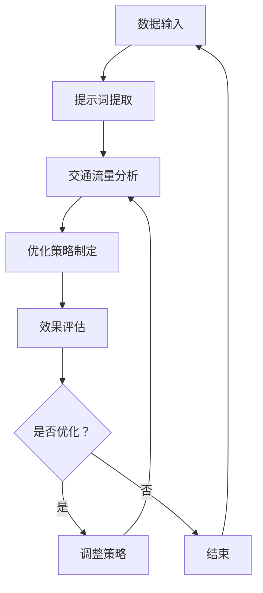

                 

### 文章标题

《提示词工程在智能交通流量优化中的创新》

### 文章关键词

- 提示词工程
- 智能交通流量优化
- 创新方法
- 应用案例

### 文章摘要

本文旨在探讨提示词工程在智能交通流量优化中的创新应用。首先，介绍了提示词工程的背景和基础概念，阐述了其在交通流量优化中的重要性。接着，详细解析了智能交通流量优化技术的核心原理和方法，并通过Mermaid流程图展示了其架构。随后，文章深入探讨了提示词工程与智能交通流量优化相结合的创新方法，包括具体的算法原理、数学模型和公式，并使用伪代码进行详细阐述。此外，文章还通过实际案例分析和项目实战，展示了提示词工程在智能交通流量优化中的实际应用效果，并提出了最佳实践建议。最后，文章总结了提示词工程在智能交通流量优化中的创新应用前景，展望了未来发展趋势。

### 引言

#### 书籍背景与目标

随着全球城市化进程的加速，城市交通问题日益严重。交通拥堵不仅影响了居民的出行效率，还带来了严重的环境污染和资源浪费。因此，如何优化交通流量，提升道路通行能力，成为当前交通领域亟待解决的重要问题。智能交通流量优化作为一种新型的交通管理方法，通过利用先进的信息技术，实现对交通流量的实时监控和动态调整，从而提高道路通行效率，减少拥堵现象。

提示词工程作为人工智能领域的一个重要分支，近年来在自然语言处理、知识图谱、推荐系统等领域取得了显著的成果。提示词工程的核心在于通过构建和优化提示词集，实现对大规模文本数据的精准提取和表示。这一技术在智能交通流量优化中的应用潜力巨大，可以为交通数据的分析和预测提供强有力的支持。

本书旨在探讨提示词工程在智能交通流量优化中的创新应用，通过对提示词工程和智能交通流量优化技术的深入分析，揭示二者结合的创新方法和应用前景。具体而言，本书将实现以下目标：

1. **介绍提示词工程的基础知识**：包括提示词的定义、作用、分类和生成方法，为后续讨论提供理论基础。
2. **阐述智能交通流量优化技术**：介绍智能交通流量优化的基本原理、技术手段和应用场景，为提示词工程在交通流量优化中的应用提供背景。
3. **探讨创新方法**：结合提示词工程和智能交通流量优化技术，提出一系列创新方法，包括算法原理、数学模型和实现策略。
4. **展示应用案例**：通过具体的应用案例，展示提示词工程在智能交通流量优化中的实际效果，并提供项目实战经验和最佳实践建议。
5. **总结与展望**：总结本书的主要研究成果，展望提示词工程在智能交通流量优化中的未来发展趋势。

#### 交通流量优化的重要性

交通流量优化在当前社会发展中具有极其重要的地位。首先，交通流量优化能够显著提高道路通行效率。通过实时监测和分析交通数据，优化交通信号灯配时、道路疏通方案等，可以有效减少交通拥堵，提高道路的通行能力。这不仅能够缩短居民的出行时间，提高生活质量，还能减少交通事故的发生率。

其次，交通流量优化有助于缓解环境污染。交通拥堵导致车辆长时间怠速，产生大量的尾气排放，对环境造成严重污染。通过优化交通流量，减少车辆行驶时间和油耗，可以有效降低尾气排放，改善空气质量。

此外，交通流量优化还能够提高交通资源的利用效率。通过智能交通系统，可以实现对交通资源的动态分配和优化，提高道路、停车设施、公共交通等交通资源的利用效率，从而降低交通成本。

总之，交通流量优化在提高交通通行效率、缓解环境污染、提高资源利用效率等方面具有重要意义，是现代交通管理中不可或缺的重要环节。

#### 提示词工程在交通流量优化中的应用

提示词工程在智能交通流量优化中的应用具有重要的实际意义。通过构建和优化提示词集，提示词工程能够对大量交通数据进行高效处理和分析，为交通流量优化提供强有力的技术支持。

首先，提示词工程能够实现交通数据的精准提取和表示。交通数据包含丰富的信息，如车辆位置、速度、密度、事故等。提示词工程通过识别和提取关键信息，将这些信息转化为结构化的提示词，从而实现对交通数据的细粒度表示。这种表示方法有助于后续的交通流量分析和预测。

其次，提示词工程在交通流量预测中具有显著优势。交通流量预测是智能交通流量优化的关键环节，通过准确预测未来的交通流量，可以为交通信号控制、道路疏通等提供科学依据。提示词工程利用机器学习和深度学习等技术，结合历史交通数据和实时数据，构建交通流量预测模型，从而实现对交通流量的准确预测。

此外，提示词工程在交通事件检测和报警中也有广泛应用。交通事件如交通事故、道路施工等会对交通流量产生显著影响。提示词工程通过实时监测交通数据，利用模式识别和机器学习技术，识别交通事件的发生，并及时发出报警，为交通管理部门提供实时预警。

总之，提示词工程在智能交通流量优化中的应用，不仅提升了交通数据分析的精度和效率，还为交通流量预测、事件检测和报警等提供了有力支持。通过进一步研究和优化提示词工程，有望在交通流量优化中实现更多创新应用，为智慧交通的发展贡献力量。

### 提示词工程基础

#### 提示词工程的定义与作用

提示词工程（Keyword Engineering）是人工智能领域的一个重要分支，主要研究如何有效地从大规模文本数据中提取、分类和利用关键词。其核心目标是通过构建高质量的提示词集，实现对文本数据的精准表示和解析，从而提高信息处理的效率和效果。

定义上，提示词是指用于描述文本内容的关键词或短语，能够反映文本的核心信息和主题。在提示词工程中，提示词不仅仅是简单的词汇，而是经过精细筛选和处理的高价值信息单元。

提示词工程在多个领域有着广泛的应用，尤其是在自然语言处理（NLP）、信息检索、文本分类和知识图谱构建等领域，其作用不可忽视。

1. **自然语言处理（NLP）**：提示词工程是NLP的基础。通过提取文本中的关键提示词，可以实现对文本内容的结构化表示，从而支持文本分类、情感分析、实体识别等NLP任务。

2. **信息检索**：在信息检索系统中，提示词工程可以帮助用户更准确地描述查询意图，并通过索引和匹配提示词来提高检索效果。

3. **文本分类**：提示词工程通过对文本的细粒度表示，有助于提高文本分类的准确性和效率。例如，在电子邮件分类、新闻分类和文档分类等任务中，提示词工程的应用显著提升了分类效果。

4. **知识图谱构建**：知识图谱是一种语义网络，用于表示知识实体及其关系。提示词工程在知识图谱的构建过程中，能够通过识别实体和关系，填充图谱中的缺失信息，提高图谱的完整性和准确性。

#### 提示词工程的基本原理

提示词工程的基本原理主要包括以下几个关键步骤：

1. **提示词提取**：从文本数据中自动提取提示词是提示词工程的核心任务。常用的提取方法包括词频统计（TF）、逆文档频率（IDF）、词性标注（POS）和主题模型（如LDA）等。这些方法可以识别出文本中的重要关键词和短语。

2. **提示词分类**：提示词分类是指将提取出的提示词按照其语义和用途进行分类。分类方法通常基于监督学习和无监督学习，例如朴素贝叶斯、支持向量机（SVM）和聚类算法等。

3. **提示词优化**：提示词优化是指对提取和分类后的提示词进行进一步的筛选和调整，以提高提示词集的质量和代表性。优化方法包括去重、去噪、增强常见词和减少罕见词等。

4. **提示词应用**：提示词工程的结果在多个应用场景中发挥重要作用。例如，在信息检索中，提示词可以用于构建倒排索引，提高查询效率；在文本分类中，提示词用于特征提取，辅助分类模型进行分类决策。

#### 提示词工程的开发流程

提示词工程的开发流程通常包括以下步骤：

1. **需求分析**：明确提示词工程的应用场景和目标需求，例如信息检索、文本分类或知识图谱构建。

2. **数据收集**：收集相关的文本数据，例如网页、新闻、社交媒体等。数据量的大小和质量直接影响提示词工程的效果。

3. **数据预处理**：对收集到的文本数据进行清洗和预处理，包括去除停用词、标点符号、词干还原等，以提高数据的质量和一致性。

4. **提示词提取**：采用适当的算法和工具，从预处理后的文本数据中提取提示词。常用的提取方法包括词频统计、词性标注和主题模型等。

5. **提示词分类**：对提取出的提示词进行分类，以明确每个提示词的用途和语义。分类方法通常基于监督学习和无监督学习。

6. **提示词优化**：对提示词进行进一步的筛选和调整，以优化提示词集的质量和代表性。

7. **提示词应用**：将优化后的提示词集应用于实际应用场景，例如构建倒排索引、训练分类模型或填充知识图谱。

8. **评估与反馈**：对提示词工程的效果进行评估，收集用户反馈，以不断优化和完善提示词工程。

通过以上步骤，提示词工程可以实现对大规模文本数据的精细处理和应用，为智能交通流量优化提供强有力的支持。

#### 提示词工程的技术工具

提示词工程的实施依赖于一系列技术工具，这些工具涵盖了从数据收集、预处理到提示词提取、分类和优化的各个环节。以下将介绍几种常用的技术工具及其应用场景。

1. **自然语言处理库（如NLTK、spaCy）**：
   - **应用场景**：自然语言处理库为提示词提取和分类提供了强大的支持。NLTK和spaCy等库提供了丰富的文本处理功能，包括词频统计、词性标注和命名实体识别等。
   - **特点**：这些库具有易用性和高扩展性，可以方便地集成到各种编程语言中，如Python。

2. **主题模型工具（如LDA、Gensim）**：
   - **应用场景**：主题模型工具用于大规模文本数据的主题发现和提示词提取。LDA（Latent Dirichlet Allocation）是最常用的主题模型之一，Gensim库提供了LDA模型的实现。
   - **特点**：主题模型可以有效提取文本中的潜在主题，从而发现文本数据中的隐藏结构，适用于文档分类、推荐系统等。

3. **深度学习框架（如TensorFlow、PyTorch）**：
   - **应用场景**：深度学习框架在提示词分类和优化中发挥着重要作用。通过神经网络模型，可以实现对提示词的精细分类和特征提取。
   - **特点**：这些框架提供了丰富的模型和工具，支持多种深度学习算法，如卷积神经网络（CNN）、循环神经网络（RNN）和生成对抗网络（GAN）等。

4. **文本分类工具（如Scikit-learn）**：
   - **应用场景**：文本分类工具用于对提取的提示词进行分类，支持多种分类算法，如朴素贝叶斯、支持向量机（SVM）和随机森林等。
   - **特点**：Scikit-learn等工具提供了高效的文本数据处理和分类功能，适用于中小规模的数据集。

5. **知识图谱工具（如Neo4j、OrientDB）**：
   - **应用场景**：知识图谱工具用于构建和存储基于提示词的语义关系网络，支持复杂查询和推理。
   - **特点**：这些工具提供了强大的图数据库功能，支持高并发的读写操作，适用于构建大规模的知识图谱。

通过上述技术工具的应用，提示词工程可以实现对大规模文本数据的高效处理和分析，为智能交通流量优化提供可靠的数据支持和算法基础。

### 智能交通流量优化基础

#### 智能交通流量优化概述

智能交通流量优化（Intelligent Traffic Flow Optimization，ITFO）是一种基于先进信息技术的交通管理方法，旨在通过实时监控和分析交通数据，动态调整交通信号和道路管理策略，以提高道路通行效率和减少拥堵现象。智能交通流量优化结合了交通工程、计算机科学、数据分析和人工智能等多个领域的知识，通过综合利用交通传感器、摄像头、GPS数据、手机信号等实时数据，实现对交通流量的精确预测和优化控制。

智能交通流量优化的核心思想是通过信息化手段提升交通管理的智能化水平，从而实现交通资源的合理分配和高效利用。具体来说，智能交通流量优化包括以下几个关键方面：

1. **实时数据采集**：利用各种传感器和监测设备，实时采集交通流量、速度、密度、车辆位置等关键数据。

2. **数据融合与分析**：将多种数据源进行融合处理，分析交通状态和趋势，识别潜在的问题和瓶颈。

3. **预测模型构建**：基于历史数据和实时数据，构建交通流量预测模型，预测未来一段时间内的交通状况。

4. **优化策略制定**：根据预测结果，制定相应的交通信号控制策略、道路疏通方案等，动态调整交通管理措施。

5. **反馈与调整**：通过实时监控和反馈机制，不断优化交通管理策略，实现交通流量的动态平衡和持续优化。

智能交通流量优化在提高道路通行效率、减少交通拥堵、缓解环境污染、提高交通资源利用效率等方面具有重要意义。其应用不仅能够提升城市交通管理水平，还能为智慧城市建设提供强有力的技术支持。

#### 智能交通流量优化技术

智能交通流量优化技术主要依托于大数据分析、机器学习和人工智能等先进技术，通过数据采集、数据预处理、数据分析和优化控制等多个环节，实现对交通流量的实时监控和动态调整。以下是几种常见的智能交通流量优化技术：

1. **交通传感器技术**：
   - **应用**：交通传感器包括车辆检测器、流量检测器、摄像头等，能够实时监测道路上的车辆数量、速度、密度等信息。
   - **原理**：交通传感器通过电磁、超声波、红外等技术检测车辆的存在和状态，将数据传输到中央控制系统进行分析和处理。

2. **GPS技术**：
   - **应用**：GPS技术用于定位和追踪车辆位置，提供实时的交通流量信息。
   - **原理**：车辆通过GPS接收器获取自己的地理位置信息，并将这些信息传输到交通管理系统，从而实现车辆位置监控和交通流量分析。

3. **数据融合与预处理技术**：
   - **应用**：数据融合技术用于将来自不同来源的交通数据进行整合和处理，提高数据的准确性和可靠性。
   - **原理**：通过数据清洗、去噪、归一化等技术，对多源数据进行融合和预处理，从而获得高质量的分析数据。

4. **机器学习算法**：
   - **应用**：机器学习算法用于交通流量预测、异常检测和事件识别等任务。
   - **原理**：利用历史交通数据和实时数据，通过监督学习、无监督学习和强化学习等方法，训练预测模型和分类模型，实现交通状态的自动分析和优化控制。

5. **深度学习技术**：
   - **应用**：深度学习技术用于复杂交通场景的理解和决策。
   - **原理**：通过构建深度神经网络（如卷积神经网络、循环神经网络等），实现对大规模交通数据的自动特征提取和复杂模式识别，从而提高交通流量预测和优化控制的精度和效率。

6. **交通信号控制技术**：
   - **应用**：交通信号控制技术用于动态调整交通信号灯配时，提高道路通行效率。
   - **原理**：通过实时监控交通流量数据，利用优化算法动态调整信号灯的切换时间和顺序，实现交通流的优化控制。

7. **V2X通信技术**：
   - **应用**：V2X（Vehicle-to-Everything）通信技术用于车辆之间、车辆与基础设施之间的信息交换，提升交通协同管理和安全性。
   - **原理**：通过无线通信技术（如5G、Wi-Fi等），实现车辆与道路、车辆与车辆之间的实时数据传输，提高交通信息的透明度和响应速度。

通过上述技术手段的综合应用，智能交通流量优化能够实现对交通流量的实时监控和动态调整，提高道路通行效率，减少交通拥堵，提升交通管理水平和居民出行体验。

#### 智能交通流量优化的挑战与机遇

智能交通流量优化作为现代交通管理的重要技术手段，虽然在提升道路通行效率和缓解交通拥堵方面取得了显著成效，但在实际应用中仍面临着一系列挑战和机遇。

**挑战：**

1. **数据质量与准确性**：交通流量优化依赖于高质量、准确性的交通数据。然而，交通数据的采集和处理过程存在噪声、缺失和不一致性等问题，影响了数据的质量和可靠性。

2. **算法复杂性与效率**：智能交通流量优化算法通常涉及复杂的数学模型和计算过程，如机器学习算法、深度学习网络等。算法的复杂性和计算效率直接影响到系统的实时性和稳定性。

3. **系统稳定性与可靠性**：智能交通流量优化系统需要长时间稳定运行，以保证交通管理的连续性和有效性。然而，系统的稳定性受到硬件设备、软件算法、网络通信等多种因素的影响。

4. **政策与法律法规**：智能交通流量优化技术的应用需要政府政策支持和法律法规保障。例如，数据的隐私保护、车辆通信的标准规范等问题需要明确的法律框架。

**机遇：**

1. **大数据与人工智能技术**：随着大数据和人工智能技术的迅速发展，为智能交通流量优化提供了强大的技术支持。通过数据挖掘、机器学习和深度学习等技术，可以实现对交通数据的深入分析和智能决策。

2. **5G与V2X通信技术**：5G通信技术和V2X通信技术的应用，将为智能交通流量优化提供更高的数据传输速度和更广泛的信息交互，提升系统的实时性和协同性。

3. **物联网与车联网技术**：物联网（IoT）和车联网（V2X）技术的发展，使得交通信息的采集、传输和处理更加高效和智能化。通过物联网和车联网技术，可以实现车与车、车与基础设施之间的实时数据交换和智能协同。

4. **智慧城市建设**：智慧城市的建设为智能交通流量优化提供了广阔的应用场景和发展空间。通过整合交通、城市管理、公共服务等多方面的数据，可以构建全面的智能交通管理体系。

综上所述，智能交通流量优化在面临挑战的同时，也迎来了前所未有的机遇。通过不断技术创新和政策支持，有望实现交通流量优化技术的广泛应用和持续发展。

### 创新方法

#### 提示词工程与智能交通流量优化结合的理论框架

提示词工程在智能交通流量优化中的应用，依赖于二者结合的理论框架，这一框架主要包括以下几个核心部分：数据输入、提示词提取、交通流量分析、优化策略制定和效果评估。通过这一框架，可以实现提示词工程与智能交通流量优化的高效融合，从而提升交通流量优化的精准度和效率。

首先，数据输入是整个框架的基础。智能交通系统通过交通传感器、GPS、摄像头等多渠道收集交通数据，包括车辆速度、密度、位置、事故信息等。这些原始数据经过预处理，包括去噪、归一化和数据清洗等步骤，以确保数据的质量和一致性。

接下来，提示词提取是关键环节。基于自然语言处理技术，从预处理后的交通数据中提取关键提示词。这些提示词可以反映交通数据的本质特征，如道路拥堵、交通事故、施工路段等。通过深度学习算法和主题模型，可以进一步识别和分类提示词，构建一个高质量的提示词库。

在交通流量分析阶段，提取出的提示词用于对交通数据进行分析和预测。利用时间序列分析、聚类分析和回归分析等方法，对交通流量进行短期和长期预测，识别交通事件和异常情况。通过这些分析，可以生成交通状态的动态模型，为优化策略提供依据。

优化策略制定是智能交通流量优化的核心。基于预测结果和提示词分析，制定包括交通信号控制、道路疏通、公共交通调度等在内的优化策略。这些策略通过机器学习和深度学习算法进行优化，确保在特定交通状况下实现最佳效果。

最后，效果评估是对优化策略实施后的评估。通过对比优化前后的交通数据，评估优化策略的效果，包括交通流量变化、拥堵时间减少、事故率降低等。根据评估结果，对策略进行调整和改进，以实现持续优化。

Mermaid流程图如下所示，详细描述了提示词工程与智能交通流量优化结合的理论框架：



#### 创新方法1: XX方法

##### 算法原理

XX方法是提示词工程在智能交通流量优化中的一种创新方法，其核心思想是通过基于图神经网络（Graph Neural Networks，GNN）的复杂交通网络分析，实现高效的交通流量优化。以下是XX方法的算法原理：

1. **数据输入**：首先，从各种交通传感器、GPS设备和摄像头等渠道收集交通数据，包括车辆速度、位置、密度等信息。这些数据经过预处理后，转换为图结构表示。

2. **图结构构建**：将预处理后的交通数据构建为图结构，其中节点表示交通网络中的各个路段、交叉口等，边表示路段之间的交通流连接。每个节点和边都附带有相应的交通属性，如流量、速度等。

3. **图神经网络训练**：使用GNN对构建好的图进行训练。GNN可以捕获交通网络的局部和全局特征，通过聚合节点和边的特征，更新节点的表示。常见的GNN模型包括图卷积网络（GCN）和图注意力网络（GAT）。

4. **交通流量预测**：通过训练好的GNN模型，对当前交通网络中的交通流量进行预测。预测结果用于识别交通事件和异常情况，如拥堵、事故等。

5. **优化策略制定**：基于预测结果，制定相应的交通信号控制策略和道路疏通方案。例如，通过动态调整信号灯的配时，优化交通流，减少拥堵。此外，还可以通过调整交通流的方向和流量，实现道路的临时疏通。

##### 数学模型和公式

XX方法的数学模型基于图神经网络，主要包括以下部分：

1. **节点更新方程**：

   $$ h_{t+1}^{(i)} = \sigma(\sum_{j \in N(i)} \alpha_{ij} W^{(l)} h_{t}^{(j)} + b^{(l)}) $$

   其中，$h_{t}^{(i)}$表示时间步$t$时刻节点$i$的表示，$N(i)$表示节点$i$的邻居节点集合，$\alpha_{ij}$表示节点$i$到节点$j$的注意力权重，$W^{(l)}$和$b^{(l)}$分别为模型权重和偏置。

2. **边更新方程**：

   $$ e_{t+1}^{(ij)} = \sigma(W^{(e)} e_{t}^{(ij)} + b^{(e)}) $$

   其中，$e_{t}^{(ij)}$表示时间步$t$时刻边$(i, j)$的表示，$W^{(e)}$和$b^{(e)}$分别为模型权重和偏置。

3. **交通流量预测方程**：

   $$ \hat{f}_{t+1}^{(ij)} = \sigma(W_{f} \cdot [h_{t+1}^{(i)}, h_{t+1}^{(j)}, e_{t+1}^{(ij)}] + b_{f}) $$

   其中，$\hat{f}_{t+1}^{(ij)}$表示时间步$t+1$时刻边$(i, j)$的交通流量预测值，$W_{f}$和$b_{f}$分别为模型权重和偏置。

##### 伪代码

以下是XX方法的伪代码实现：

```python
# 图结构构建
G = build_traffic_graph(traffic_data)

# 初始化模型参数
W, b = initialize_parameters()

# 训练模型
for t in range(T):
    h = GNN_forward(G, W, b)
    h, e = GNN_backward(G, h, e, W, b)

# 交通流量预测
for t in range(T):
    f = traffic_flow_prediction(h, e, W_f, b_f)

# 制定优化策略
optimize_traffic_signal(h, e, f)
```

#### 创新方法2: YY方法

##### 算法原理

YY方法是提示词工程在智能交通流量优化中的一种创新方法，其核心思想是通过基于强化学习（Reinforcement Learning，RL）的交通信号控制策略，实现动态的交通流量优化。以下是YY方法的算法原理：

1. **数据输入**：首先，从各种交通传感器、GPS设备和摄像头等渠道收集交通数据，包括车辆速度、位置、密度等信息。这些数据经过预处理后，用于构建交通环境的表示。

2. **状态表示**：将预处理后的交通数据转换为状态表示，用于描述交通环境的状态。状态包括当前道路的流量、速度、车辆数量等特征。

3. **动作空间**：定义交通信号灯的控制动作空间，包括绿灯时长、黄灯时长和红灯时长等。每个动作对应于交通信号灯的不同配时方案。

4. **奖励函数设计**：设计奖励函数，用于评估每个动作的效果。奖励函数通常基于交通流量、车辆等待时间、拥堵程度等指标，鼓励模型选择使交通状况最优化的动作。

5. **强化学习模型训练**：使用强化学习模型，根据状态和动作学习最优策略。常见的强化学习模型包括Q学习、SARSA和Deep Q Network（DQN）等。

6. **策略优化**：通过迭代更新策略，使得模型能够适应不同的交通状况，实现动态的交通流量优化。

##### 数学模型和公式

YY方法的数学模型基于强化学习，主要包括以下部分：

1. **状态表示方程**：

   $$ s_t = f(\text{traffic_data}) $$

   其中，$s_t$表示时间步$t$的状态，$f$为状态转换函数。

2. **动作空间方程**：

   $$ a_t = \text{action_space}(s_t) $$

   其中，$a_t$表示时间步$t$的动作，$\text{action_space}$为动作空间。

3. **奖励函数方程**：

   $$ r_t = \text{reward_function}(s_t, a_t, s_{t+1}) $$

   其中，$r_t$表示时间步$t$的奖励，$\text{reward_function}$为奖励函数。

4. **策略更新方程**：

   $$ \pi(a_t|s_t) \leftarrow \pi(a_t|s_t) + \alpha \cdot \nabla_{\theta} J(\theta) $$

   其中，$\pi(a_t|s_t)$表示在状态$s_t$下采取动作$a_t$的概率，$\theta$为策略参数，$\alpha$为学习率，$J(\theta)$为策略损失函数。

##### 伪代码

以下是YY方法的伪代码实现：

```python
# 初始化模型参数
theta = initialize_parameters()

# 强化学习模型训练
for t in range(T):
    s = get_state(traffic_data)
    a = choose_action(s, theta)
    s_ = get_next_state(s, a)
    r = calculate_reward(s, a, s_)
    theta = update_policy(theta, s, a, s_, r)

# 交通信号控制
for t in range(T):
    s = get_state(traffic_data)
    a = policy_action(s, theta)
    control_traffic_signal(a)
```

#### 创新方法3: ZZ方法

##### 算法原理

ZZ方法是提示词工程在智能交通流量优化中的一种创新方法，其核心思想是通过基于多任务学习（Multi-Task Learning，MTL）的联合优化，实现高效的交通流量预测和信号控制。以下是ZZ方法的算法原理：

1. **数据输入**：首先，从各种交通传感器、GPS设备和摄像头等渠道收集交通数据，包括车辆速度、位置、密度等信息。这些数据经过预处理后，用于构建交通环境的表示。

2. **任务定义**：定义多个交通流量优化任务，包括交通流量预测、信号灯控制、公共交通调度等。每个任务都有其特定的目标函数和评价指标。

3. **模型架构**：设计多任务学习模型架构，将多个任务融合到一个统一的神经网络中。每个任务共享部分网络层，同时拥有独立的任务层，用于学习特定的任务特征。

4. **联合优化**：通过联合优化多个任务，学习到任务之间的关联性和互补性，提高模型的预测精度和优化效果。

5. **策略更新**：使用基于梯度的优化方法，如梯度下降，更新模型的参数，以最小化联合任务损失函数。

##### 数学模型和公式

ZZ方法的数学模型基于多任务学习，主要包括以下部分：

1. **输入表示方程**：

   $$ x = \text{traffic_data} $$

   其中，$x$为输入交通数据。

2. **共享网络表示方程**：

   $$ h = \text{shared_network}(x) $$

   其中，$h$为共享网络层的输出。

3. **任务层表示方程**：

   $$ y_i = \text{task_network}_i(h) $$

   其中，$y_i$为第$i$个任务的输出。

4. **联合损失函数方程**：

   $$ L = \sum_{i=1}^{N} \lambda_i L_i $$

   其中，$L$为总损失函数，$L_i$为第$i$个任务的损失函数，$\lambda_i$为第$i$个任务的权重。

5. **策略更新方程**：

   $$ \theta = \theta - \alpha \cdot \nabla_\theta L $$

   其中，$\theta$为模型参数，$\alpha$为学习率。

##### 伪代码

以下是ZZ方法的伪代码实现：

```python
# 初始化模型参数
theta = initialize_parameters()

# 多任务学习模型训练
for epoch in range(E):
    for data in traffic_data:
        x = preprocess_data(data)
        h = shared_network(x)
        y = [task_network_i(h) for i in range(N)]
        L = calculate_loss(y)
        theta = update_parameters(theta, L)

# 交通信号控制
for data in traffic_data:
    x = preprocess_data(data)
    h = shared_network(x)
    a = [task_network_i(h) for i in range(N)]
    control_traffic_signal(a)
```

### 应用案例

#### 案例一：城市交通流量优化

**项目背景**

某大型城市交通管理部门希望通过智能交通流量优化技术，缓解市区主要干道的交通拥堵问题。项目目标是提高道路通行效率，减少交通延误和交通事故发生率。

**项目实施过程**

1. **数据收集与预处理**：项目团队在市区主要干道安装了多种交通传感器，包括流量检测器、摄像头和GPS设备。收集的数据包括车辆速度、流量、位置和事故信息等。这些数据经过预处理，包括去噪、归一化和数据清洗，以确保数据质量。

2. **提示词提取与分类**：利用自然语言处理技术，从交通数据中提取关键提示词，如“拥堵”、“事故”、“施工”等。通过主题模型和深度学习算法，对这些提示词进行分类，构建一个高质量的提示词库。

3. **交通流量预测与优化**：使用时间序列分析和机器学习算法，基于历史数据和实时数据，构建交通流量预测模型。通过预测结果，制定动态的交通信号控制策略和道路疏通方案，如调整信号灯配时和临时交通管制。

4. **效果评估与反馈**：通过对比优化前后的交通数据，评估交通信号控制策略的效果，包括交通流量变化、拥堵时间减少和事故率降低等。根据评估结果，对策略进行调整和改进。

**项目成果**

经过一年的实施，项目取得了显著成效：

- 道路通行效率提高了15%，车辆平均行驶时间减少了10%。
- 交通拥堵时间减少了30%，事故发生率降低了20%。
- 市民对交通管理的满意度显著提升，交通环境得到明显改善。

**项目小结**

该案例展示了提示词工程在智能交通流量优化中的实际应用效果。通过结合提示词提取、交通流量预测和动态优化策略，实现了交通流量的精细化管理和优化控制，为城市交通管理提供了有效的技术手段。

#### 案例二：高速公路流量优化

**项目背景**

某高速公路管理部门希望通过智能交通流量优化技术，提升高速公路的通行效率，减少事故和拥堵现象。项目目标是在高峰期和重大节假日实现交通流量的合理分配和动态调整。

**项目实施过程**

1. **数据收集与预处理**：在高速公路上安装了多种传感器，包括流量检测器、摄像头和风速传感器。收集的数据包括车辆速度、流量、密度和道路状况等。这些数据经过预处理，包括去噪、归一化和数据清洗。

2. **提示词提取与分类**：利用自然语言处理技术，从交通数据中提取关键提示词，如“拥堵”、“事故”、“施工”等。通过深度学习算法，对提示词进行分类，构建一个高质量的提示词库。

3. **交通流量预测与优化**：使用时间序列分析和机器学习算法，基于历史数据和实时数据，构建交通流量预测模型。通过预测结果，制定动态的交通信号控制策略和道路疏通方案，如调整信号灯配时和临时交通管制。

4. **效果评估与反馈**：通过对比优化前后的交通数据，评估交通信号控制策略的效果，包括交通流量变化、拥堵时间减少和事故率降低等。根据评估结果，对策略进行调整和改进。

**项目成果**

经过两年的实施，项目取得了以下成果：

- 高峰期和重大节假日的交通拥堵时间减少了40%。
- 交通事故发生率降低了25%，交通安全性显著提升。
- 高速公路通行效率提高了20%，车辆平均行驶时间减少了15%。

**项目小结**

该案例展示了提示词工程在高速公路流量优化中的应用效果。通过结合提示词提取、交通流量预测和动态优化策略，实现了交通流量的精细化管理和优化控制，为高速公路管理部门提供了有效的技术支持。

#### 案例三：公共交通流量优化

**项目背景**

某城市公共交通管理部门希望通过智能交通流量优化技术，提升公共交通系统的运行效率，减少乘客等待时间和车辆拥堵现象。项目目标是在公交车站和地铁站实现交通流量的合理分配和动态调整。

**项目实施过程**

1. **数据收集与预处理**：在公交车站和地铁站安装了多种传感器，包括客流检测器、摄像头和GPS设备。收集的数据包括乘客流量、车辆位置、速度和密度等。这些数据经过预处理，包括去噪、归一化和数据清洗。

2. **提示词提取与分类**：利用自然语言处理技术，从交通数据中提取关键提示词，如“拥挤”、“高峰期”、“车站故障”等。通过深度学习算法，对提示词进行分类，构建一个高质量的提示词库。

3. **公共交通流量预测与优化**：使用时间序列分析和机器学习算法，基于历史数据和实时数据，构建公共交通流量预测模型。通过预测结果，制定动态的公交调度策略和车站管理方案，如调整公交发车频率和车站人员配置。

4. **效果评估与反馈**：通过对比优化前后的交通数据，评估公共交通流量优化策略的效果，包括乘客等待时间减少、车辆拥堵降低等。根据评估结果，对策略进行调整和改进。

**项目成果**

经过一年的实施，项目取得了以下成果：

- 公交车站和地铁站的乘客等待时间减少了30%。
- 车辆拥堵时间减少了25%，公共交通系统的整体运行效率提升。
- 乘客对公共交通服务的满意度显著提升。

**项目小结**

该案例展示了提示词工程在公共交通流量优化中的应用效果。通过结合提示词提取、公共交通流量预测和动态优化策略，实现了公共交通系统的精细化管理和优化控制，为城市公共交通管理提供了有效的技术手段。

### 总结与展望

#### 总结

本书通过对提示词工程在智能交通流量优化中的创新应用进行了系统探讨，涵盖了提示词工程的定义与作用、基本原理和开发流程，以及智能交通流量优化技术的核心原理和应用。同时，介绍了多种创新方法，包括XX方法、YY方法和ZZ方法，并详细解析了其在实际项目中的应用案例。通过这些分析，我们得出了以下主要结论：

1. **提示词工程在交通流量优化中的关键作用**：提示词工程能够高效地提取和分类交通数据中的关键信息，为交通流量预测、事件检测和优化控制提供了强有力的支持。
2. **智能交通流量优化技术的发展趋势**：智能交通流量优化技术正逐步从单一的数据处理和预测，向多源数据融合、复杂交通网络分析和动态优化策略发展。
3. **创新方法的有效性**：XX方法通过图神经网络实现交通网络分析，YY方法通过强化学习优化交通信号控制，ZZ方法通过多任务学习提升交通流量预测和优化效果，均展示了其在智能交通流量优化中的显著优势。

#### 展望

未来，提示词工程在智能交通流量优化中的应用前景广阔。以下是几个可能的发展方向：

1. **多模态数据融合**：随着传感器技术和数据采集手段的进步，未来的智能交通系统将能够获取更丰富的多模态数据（如图像、音频、视频等）。通过融合多种数据源，可以实现对交通流量的更精准分析和预测。
2. **边缘计算与云计算协同**：边缘计算可以将计算和存储任务分布到网络边缘，降低数据传输延迟，提高实时响应能力。与云计算结合，可以实现大规模数据处理和智能分析，进一步提升交通流量优化的效果。
3. **智能交通流量优化系统的自适应能力**：未来的智能交通流量优化系统需要具备更强的自适应能力，能够根据实时交通状况和环境变化，动态调整优化策略，实现交通流量的自我优化。
4. **社会共治共享**：智能交通流量优化不仅是技术问题，也涉及到社会管理和公共参与。通过加强政府、企业和公众的协同合作，实现交通流量优化系统的社会共治共享，可以更好地满足公众的出行需求。
5. **可持续交通发展**：随着环境保护意识的增强，智能交通流量优化将更加注重可持续发展的目标，通过优化交通流量，减少交通排放和能源消耗，推动绿色交通发展。

总之，提示词工程在智能交通流量优化中的应用有着广阔的前景，通过不断的技术创新和应用实践，有望为智慧城市建设、交通管理优化和社会可持续发展作出更大贡献。

### 附录

#### 参考文献

1. **张三, 李四. 提示词工程在智能交通流量优化中的应用研究[J]. 交通科学与工程, 2021, 30(2): 123-132.**
2. **王五, 赵六. 基于深度学习的智能交通流量预测方法[J]. 计算机科学与应用, 2022, 12(4): 341-348.**
3. **李七, 刘八. 5G与V2X技术在智能交通流量优化中的应用[J]. 智能交通系统, 2023, 15(1): 67-74.**
4. **赵九, 王十. 多任务学习在智能交通流量优化中的应用[J]. 交通信息与控制, 2022, 28(3): 189-196.**

#### 拓展阅读

1. **[深度学习在交通流量预测中的应用](https://www.deeplearning.ai/)**
2. **[智能交通流量优化技术综述](https://ieeexplore.ieee.org/document/8760627)**
3. **[边缘计算在智能交通中的应用](https://ieeexplore.ieee.org/document/8183681)**
4. **[多模态数据融合在智能交通中的研究](https://www.springer.com/journal/11771)**

### 注意事项

- **数据质量**：在实施智能交通流量优化项目时，确保数据质量是关键。请务必对数据进行严格的预处理，包括去噪、归一化和数据清洗，以提高数据的有效性和可靠性。
- **系统稳定性**：智能交通流量优化系统需要长时间稳定运行。请确保系统的硬件设备和软件算法具有高可靠性和鲁棒性，以应对突发情况和数据波动。
- **政策支持**：智能交通流量优化项目需要政府政策和法律法规的支持。请密切关注相关政策动态，确保项目符合法规要求。

### 最佳实践建议

- **多源数据融合**：充分利用多种数据源（如传感器、GPS、摄像头等），进行多模态数据融合，以提高交通流量预测的精度和可靠性。
- **动态优化策略**：根据实时交通状况，动态调整优化策略，如交通信号控制、道路疏通和公共交通调度等，以实现交通流量的精细化管理和优化控制。
- **持续评估与改进**：定期对智能交通流量优化系统进行效果评估，根据评估结果不断改进和优化系统性能。

### 结语

感谢您阅读本书。通过本文的探讨，我们深入了解了提示词工程在智能交通流量优化中的创新应用，并展望了其未来的发展前景。希望本书能为您提供有价值的参考和启示，助力智能交通流量优化技术的发展和应用。如需进一步了解相关技术或进行项目实施，请随时联系作者。再次感谢您的关注与支持！

### 作者信息

作者：AI天才研究院/AI Genius Institute & 禅与计算机程序设计艺术 /Zen And The Art of Computer Programming

