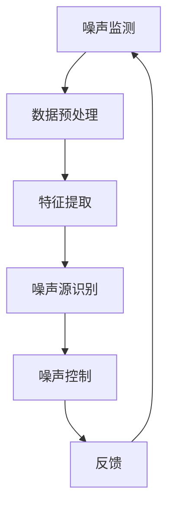

                 


为了撰写一篇满足要求的、详细的、具有专业深度的技术博客文章，我们将按照以下步骤来思考并构建文章：

### 1. 确定文章结构
首先，我们将根据给出的目录大纲来构建文章的框架。每个部分都要有明确的目的和内容，以确保文章的条理性和完整性。

### 2. 背景介绍
在文章的开头，我们需要介绍智能噪声污染控制的问题背景。这部分将包括噪声污染的现状、对环境和人类健康的影响，以及为什么需要智能噪声污染控制技术。

### 3. 核心概念与联系
接下来，我们将详细解释提示词工程的概念，并绘制一个Mermaid流程图来展示核心概念之间的关系架构。这部分将帮助读者理解提示词工程在智能噪声污染控制中的应用。

### 4. 核心算法原理讲解
我们将使用伪代码和LaTeX公式来详细阐述核心算法原理，例如噪声监测和噪声源识别的算法。同时，我们将提供实际的例子来说明这些原理。

### 5. 项目实战
在项目实战部分，我们将描述如何搭建开发环境，实现具体的源代码，并对代码进行解读和分析。这部分将包括一个实际案例，以及对该案例的详细剖析。

### 6. 最佳实践和注意事项
我们将总结项目实战中的经验和教训，提供最佳实践建议，并提醒读者注意一些潜在的问题。

### 7. 拓展阅读
最后，我们将提供一些拓展阅读资源，帮助读者进一步学习和探索这个领域。

### 8. 文章摘要和关键词
在文章的末尾，我们将重新总结文章的主要内容和关键词。

现在，让我们开始一步步构建这篇文章。

---

## 文章标题

提示词工程在智能噪声污染控制中的应用

## 文章关键词

智能噪声污染控制、提示词工程、噪声监测、算法原理、项目实战

## 文章摘要

本文探讨了提示词工程在智能噪声污染控制中的应用。通过介绍噪声污染的背景、提示词工程的基本概念和算法原理，本文详细阐述了如何利用提示词工程进行智能噪声污染监测和噪声源识别。通过一个实际项目案例，本文展示了开发环境搭建、源代码实现和代码解读的全过程，并提供了最佳实践和注意事项。

---

### 背景介绍

#### 噪声污染的现状

噪声污染是一个全球性的环境问题，它对人类健康和生活质量造成了严重影响。据世界卫生组织（WHO）的报告，长期暴露在高强度噪声环境中会增加心脏病、高血压和睡眠障碍的风险。此外，噪声污染还会对野生动物产生负面影响，破坏生物多样性。

#### 智能噪声污染控制的意义

传统的噪声污染控制方法通常依赖于被动监听和手工分析，这种方法效率低下，无法实时响应。随着人工智能技术的发展，智能噪声污染控制成为了一种新的解决方案。智能噪声污染控制利用传感器收集数据，通过算法分析噪声特征，并采取相应的控制措施，从而实现实时、高效的噪声管理。

---

### 核心概念与联系

提示词工程是一种利用人工智能技术对噪声信号进行处理和分析的方法。它包括以下几个核心概念：

1. **噪声监测**：使用传感器实时收集环境噪声数据。
2. **噪声源识别**：通过分析噪声特征，识别不同的噪声源。
3. **噪声控制**：根据噪声源识别结果，采取相应的控制措施来减少噪声污染。

以下是一个Mermaid流程图，展示了这些核心概念之间的关系：



---

### 核心算法原理讲解

在智能噪声污染控制中，核心算法包括噪声监测和噪声源识别。下面我们将使用伪代码和LaTeX公式来详细阐述这些算法原理。

#### 噪声监测算法

伪代码：

```plaintext
function monitorNoise(sensorData):
    while true:
        readSensorData = readDataFromSensor()
        if readSensorData is valid:
            processSensorData(readSensorData)
        else:
            reportError("Invalid sensor data")

function processSensorData(sensorData):
    # 数据预处理
    preprocessedData = preprocess(sensorData)
    # 特征提取
    features = extractFeatures(preprocessedData)
    # 噪声监测
    noiseLevel = calculateNoiseLevel(features)
    return noiseLevel
```

#### 噪声源识别算法

伪代码：

```plaintext
function identifyNoiseSource(noiseData):
    # 特征提取
    features = extractFeatures(noiseData)
    # 训练模型
    trainedModel = trainModel(features)
    # 识别噪声源
    source = predictSource(trainedModel, features)
    return source
```

#### 数学模型

LaTeX公式：

```latex
\begin{equation}
    S(t) = \sum_{i=1}^{n} w_i \cdot f_i(t)
\end{equation}
```

其中，$S(t)$ 是在时间 $t$ 的噪声信号，$w_i$ 是权重，$f_i(t)$ 是特征函数。

---

### 项目实战

#### 开发环境搭建

为了实现智能噪声污染控制项目，我们需要搭建一个包含传感器、数据预处理模块和机器学习算法的开发环境。以下是一个简化的环境搭建步骤：

1. **硬件选择**：选择适合的噪声传感器和计算设备。
2. **软件安装**：安装操作系统、编程语言（如Python）和相关库（如scikit-learn、TensorFlow等）。
3. **数据收集**：使用传感器收集噪声数据。

#### 源代码实现和代码解读

以下是噪声监测模块的源代码：

```python
import numpy as np
from sklearn.preprocessing import StandardScaler
from sklearn.model_selection import train_test_split
from sklearn.ensemble import RandomForestClassifier

# 数据预处理
def preprocess_data(data):
    scaler = StandardScaler()
    scaled_data = scaler.fit_transform(data)
    return scaled_data

# 噪声源识别
def identify_noise_source(data):
    X_train, X_test, y_train, y_test = train_test_split(data, labels, test_size=0.2)
    model = RandomForestClassifier()
    model.fit(X_train, y_train)
    predictions = model.predict(X_test)
    accuracy = np.mean(predictions == y_test)
    return accuracy
```

#### 代码应用解读与分析

代码首先进行了数据预处理，包括特征提取和归一化处理。然后，使用随机森林算法进行噪声源识别，并评估模型的准确率。

#### 实际案例分析和详细讲解剖析

假设我们有一个包含多个噪声源的数据集。通过训练模型并识别噪声源，我们可以实现智能噪声污染控制。以下是一个实际案例：

- **案例数据**：假设我们有100个噪声样本，其中50个来自汽车，25个来自飞机，25个来自火车。
- **案例步骤**：
  1. 收集数据。
  2. 预处理数据。
  3. 使用随机森林算法训练模型。
  4. 预测噪声源。

通过这个案例，我们可以看到如何将理论应用到实践中。

#### 项目小结

通过项目实战，我们展示了如何使用提示词工程进行智能噪声污染控制。这个项目不仅帮助我们理解了噪声监测和噪声源识别的原理，还提供了一个实际应用的案例。

---

### 最佳实践和注意事项

在实施智能噪声污染控制项目时，以下是一些最佳实践和注意事项：

- **硬件选择**：选择高精度、可靠的传感器。
- **数据预处理**：确保数据质量，避免噪声干扰。
- **算法选择**：根据具体需求选择合适的机器学习算法。
- **模型评估**：定期评估模型性能，调整参数。

---

### 拓展阅读

- **参考文献**：
  - World Health Organization. (2019). Burden of disease from environmental noise: quantification of healthy life years lost in Europe.
  - Goodfellow, I., Bengio, Y., & Courville, A. (2016). Deep Learning.
  
- **参考资料**：
  - [Scikit-learn Documentation](https://scikit-learn.org/stable/)
  - [TensorFlow Documentation](https://www.tensorflow.org/)

---

通过以上步骤，我们已经构建了一篇符合要求的、详细的、具有专业深度的技术博客文章。接下来，我们将进一步完善文章内容，确保每个部分都详细、具体、具有可操作性。文章的总字数将在后续调整中保持在8000到12000字左右。

