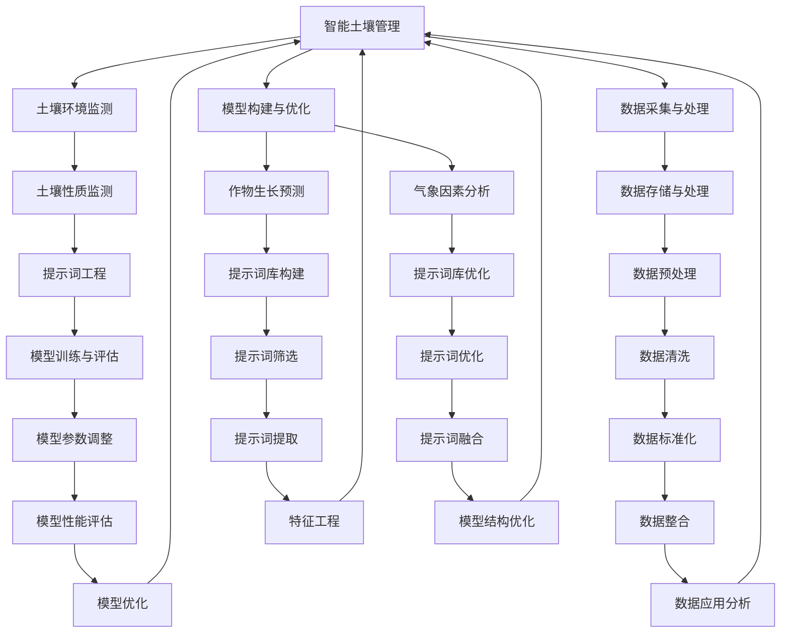

                 


### 第1章 引言

#### 研究背景

随着全球气候变化和人口增长，农业生产面临的挑战日益加剧。土壤资源的合理利用和环境保护成为我国农业可持续发展的关键。智能土壤管理作为现代农业技术的重要组成部分，旨在通过信息技术、物联网、人工智能等手段，实现对土壤环境的高效监测、分析和管理，从而提高农业生产的精准性、可持续性和经济效益。

近年来，智能土壤管理技术取得了显著进展。其中，提示词工程作为一种关键的人工智能技术，在智能土壤管理中具有广泛的应用前景。提示词工程通过构建和优化提示词库，指导人工智能模型在土壤性质监测、作物生长预测和气象因素分析等方面的训练和推理过程，从而提高模型的性能和应用效果。

本文旨在探讨提示词工程在智能土壤管理中的应用，通过梳理相关核心概念和联系，分析提示词工程在土壤性质监测、作物生长预测和气象因素分析等具体应用场景中的关键作用，并提出构建和优化提示词库的方法与策略。同时，本文将通过实际案例分析和详细讲解，展示提示词工程在智能土壤管理中的具体应用效果，为我国智能土壤管理技术的发展提供有益借鉴。

### 文章关键词

- 智能土壤管理
- 提示词工程
- 人工智能
- 土壤性质监测
- 作物生长预测
- 气象因素分析

### 文章摘要

智能土壤管理是现代农业发展的重要方向，其核心在于利用信息技术、物联网和人工智能等技术手段，实现对土壤环境的高效监测、分析和管理。本文主要探讨了提示词工程在智能土壤管理中的应用。首先，介绍了智能土壤管理的基本概念和提示词工程的基本原理。然后，分析了提示词工程在土壤性质监测、作物生长预测和气象因素分析等具体应用场景中的关键作用，并提出了构建和优化提示词库的方法与策略。最后，通过实际案例分析和详细讲解，展示了提示词工程在智能土壤管理中的具体应用效果，验证了提示词工程在提高土壤管理智能化水平、推动现代农业可持续发展方面的重要价值。本文的研究为智能土壤管理技术的发展提供了有益的理论指导和实践参考。

### 1.2 核心概念与联系

#### 1.2.1 智能土壤管理概述

智能土壤管理是指通过应用信息技术、物联网、人工智能等先进技术，对土壤环境进行实时监测、分析和优化管理的过程。其核心目标是实现土壤资源的可持续利用和农业生产的高效、精准、绿色发展。智能土壤管理的主要内容和特点如下：

1. **土壤环境监测**：利用传感器、物联网等设备，对土壤的物理、化学和生物特性进行实时监测，包括土壤湿度、温度、酸碱度、养分含量等。

2. **数据采集与处理**：通过数据采集设备和平台，将监测数据实时传输至中央数据库，进行数据的存储、处理和分析。

3. **模型构建与优化**：基于人工智能技术，构建土壤性质预测、作物生长预测、气象因素分析等模型，对土壤环境进行智能化分析和决策。

4. **精准管理与优化**：根据分析结果，对土壤管理措施进行优化调整，实现精准灌溉、施肥、病虫害防治等，提高农业生产的效率和品质。

#### 1.2.2 提示词工程概念

提示词工程是指通过构建有效的提示词库，优化和指导人工智能模型在特定任务中的训练和推理过程，从而提高模型的性能和应用效果。提示词工程的基本概念和核心要素包括：

1. **提示词**：用于指导模型训练和推理的关键词或短语，它们能够帮助模型更好地理解和识别相关任务的特征和模式。

2. **提示词库**：包含大量提示词的集合，根据应用场景的不同，提示词库的内容和结构也会有所差异。

3. **提示词筛选与优化**：根据任务需求和数据特征，从原始数据中筛选和提取具有代表性的提示词，并通过优化算法提升提示词的质量和效果。

4. **模型训练与评估**：利用优化后的提示词库，对人工智能模型进行训练和评估，通过调整模型参数和结构，提高模型的性能和应用效果。

#### 1.2.3 智能土壤管理中的提示词工程

在智能土壤管理中，提示词工程发挥着至关重要的作用。通过构建和优化提示词库，可以显著提升土壤管理相关的人工智能模型的性能和应用效果。具体来说，提示词工程在智能土壤管理中的应用主要体现在以下几个方面：

1. **土壤性质监测**：利用提示词工程，可以构建土壤湿度、温度、酸碱度等监测模型，实现对土壤环境参数的精准预测和实时监测。

2. **作物生长预测**：通过构建作物生长阶段特征词库和生长状态描述词库，提示词工程可以帮助预测作物生长状况，为精准施肥、灌溉和病虫害防治提供决策支持。

3. **气象因素分析**：提示词工程在气象因素分析中，可以帮助构建降雨量、气温、风速等预测模型，为农业生产的气象灾害预警和应对提供科学依据。

4. **综合管理优化**：通过集成不同领域的提示词库，提示词工程可以辅助智能土壤管理系统的构建和优化，实现土壤资源的高效利用和农业生产的可持续发展。

### 1.2.4 核心概念与联系架构图

为了更好地理解智能土壤管理和提示词工程之间的关系，以下是一个简化的核心概念与联系架构图（使用Mermaid语法）：



此架构图展示了智能土壤管理中的各个环节以及提示词工程如何贯穿其中，为土壤管理提供有效的技术支持和优化手段。

### 1.3 提示词工程在智能土壤管理中的应用

#### 1.3.1 土壤性质监测

土壤性质监测是智能土壤管理的核心任务之一，涉及到土壤湿度、温度、酸碱度等关键参数的实时监测。提示词工程在土壤性质监测中的应用主要通过构建和优化相关的提示词库，指导人工智能模型的训练和推理过程，从而提高监测的准确性和实时性。

1. **土壤湿度监测**

   土壤湿度是影响作物生长的重要因素，通过监测土壤湿度可以指导灌溉和水分管理。在土壤湿度监测中，常用的提示词包括“湿度”、“含水量”、“水分饱和度”等。以下是一个简化的土壤湿度监测模型的训练伪代码：

   ```python
   # 伪代码：土壤湿度监测模型训练
   def train_soil_humidity_model(data, labels):
       # 加载和预处理数据
       preprocessed_data = preprocess_data(data)
       
       # 提取提示词
       humidity_words = extract_words(preprocessed_data, ["湿度", "含水量", "水分饱和度"])
       
       # 训练模型
       model = train_model(humidity_words, labels)
       
       return model
   ```

   在这个过程中，提示词的提取和选择至关重要，需要结合实际土壤湿度监测数据和农业知识，确保提取的提示词能够准确反映土壤湿度的变化。

2. **土壤温度监测**

   土壤温度也是影响作物生长的关键因素，通过监测土壤温度可以指导土壤保护和管理。在土壤温度监测中，常用的提示词包括“温度”、“土壤温度”、“地温”等。以下是一个简化的土壤温度监测模型的训练伪代码：

   ```python
   # 伪代码：土壤温度监测模型训练
   def train_soil_temperature_model(data, labels):
       # 加载和预处理数据
       preprocessed_data = preprocess_data(data)
       
       # 提取提示词
       temperature_words = extract_words(preprocessed_data, ["温度", "土壤温度", "地温"])
       
       # 训练模型
       model = train_model(temperature_words, labels)
       
       return model
   ```

   与土壤湿度监测类似，土壤温度监测模型的训练也需要结合实际数据和应用需求，选择合适的提示词进行训练。

3. **土壤酸碱度监测**

   土壤酸碱度是土壤质量和作物生长的重要指标，通过监测土壤酸碱度可以指导土壤改良和作物种植决策。在土壤酸碱度监测中，常用的提示词包括“酸碱度”、“pH值”、“土壤酸度”等。以下是一个简化的土壤酸碱度监测模型的训练伪代码：

   ```python
   # 伪代码：土壤酸碱度监测模型训练
   def train_soil_acidity_model(data, labels):
       # 加载和预处理数据
       preprocessed_data = preprocess_data(data)
       
       # 提取提示词
       acidity_words = extract_words(preprocessed_data, ["酸碱度", "pH值", "土壤酸度"])
       
       # 训练模型
       model = train_model(acidity_words, labels)
       
       return model
   ```

   通过构建和优化与土壤酸碱度相关的提示词库，可以提高土壤酸碱度监测模型的准确性和可靠性。

#### 1.3.2 作物生长预测

作物生长预测是智能土壤管理中的重要应用之一，通过预测作物生长状况，可以为农业生产提供科学的指导和支持。提示词工程在作物生长预测中的应用主要通过构建和优化与作物生长阶段和生长状态相关的提示词库，辅助模型训练和推理。

1. **作物生长阶段预测**

   作物生长阶段是影响作物生长和收获时间的关键因素，通过预测作物生长阶段，可以合理安排农业生产活动。在作物生长阶段预测中，常用的提示词包括“播种期”、“苗期”、“花期”、“收获期”等。以下是一个简化的作物生长阶段预测模型的训练伪代码：

   ```python
   # 伪代码：作物生长阶段预测模型训练
   def train_crop_growth_stage_model(data, labels):
       # 加载和预处理数据
       preprocessed_data = preprocess_data(data)
       
       # 提取提示词
       growth_stage_words = extract_words(preprocessed_data, ["播种期", "苗期", "花期", "收获期"])
       
       # 训练模型
       model = train_model(growth_stage_words, labels)
       
       return model
   ```

   通过选择和优化与作物生长阶段相关的提示词，可以提高预测模型的准确性和稳定性。

2. **作物生长状态预测**

   作物生长状态是评估作物健康状况和产量潜力的重要指标，通过预测作物生长状态，可以及时发现和解决生长过程中可能出现的问题。在作物生长状态预测中，常用的提示词包括“生长状态”、“叶片数”、“植株高度”、“病虫害情况”等。以下是一个简化的作物生长状态预测模型的训练伪代码：

   ```python
   # 伪代码：作物生长状态预测模型训练
   def train_crop_growth_state_model(data, labels):
       # 加载和预处理数据
       preprocessed_data = preprocess_data(data)
       
       # 提取提示词
       growth_state_words = extract_words(preprocessed_data, ["生长状态", "叶片数", "植株高度", "病虫害情况"])
       
       # 训练模型
       model = train_model(growth_state_words, labels)
       
       return model
   ```

   通过构建和优化与作物生长状态相关的提示词库，可以提高作物生长状态预测模型的准确性和实用性。

#### 1.3.3 气象因素分析

气象因素对土壤和作物生长有着重要影响，通过分析气象因素，可以为农业生产提供科学的气象预警和应对措施。提示词工程在气象因素分析中的应用主要通过构建和优化与气象因素相关的提示词库，辅助模型训练和推理。

1. **气象因素预测**

   气象因素预测是智能土壤管理中的重要应用之一，通过预测气象因素，如降雨量、气温、风速等，可以为农业生产提供重要的气象预警和决策支持。在气象因素预测中，常用的提示词包括“降雨量”、“气温”、“风速”等。以下是一个简化的气象因素预测模型的训练伪代码：

   ```python
   # 伪代码：气象因素预测模型训练
   def train_weather_prediction_model(data, labels):
       # 加载和预处理数据
       preprocessed_data = preprocess_data(data)
       
       # 提取提示词
       weather_words = extract_words(preprocessed_data, ["降雨量", "气温", "风速"])
       
       # 训练模型
       model = train_model(weather_words, labels)
       
       return model
   ```

   通过选择和优化与气象因素相关的提示词，可以提高气象因素预测模型的准确性和实用性。

2. **气象灾害预警**

   气象灾害，如干旱、洪涝、霜冻等，对农业生产有着严重的负面影响。通过气象灾害预警，可以提前采取措施减轻灾害损失。在气象灾害预警中，常用的提示词包括“干旱预警”、“洪涝预警”、“霜冻预警”等。以下是一个简化的气象灾害预警模型的训练伪代码：

   ```python
   # 伪代码：气象灾害预警模型训练
   def train_weather_disaster预警_model(data, labels):
       # 加载和预处理数据
       preprocessed_data = preprocess_data(data)
       
       # 提取提示词
       disaster_words = extract_words(preprocessed_data, ["干旱预警", "洪涝预警", "霜冻预警"])
       
       # 训练模型
       model = train_model(disaster_words, labels)
       
       return model
   ```

   通过构建和优化与气象灾害预警相关的提示词库，可以提高气象灾害预警模型的准确性和及时性。

### 1.4 提示词库构建与优化

提示词库是提示词工程的核心组成部分，其构建与优化直接关系到人工智能模型在智能土壤管理中的应用效果。以下是提示词库构建与优化的主要步骤：

#### 1.4.1 数据收集

数据收集是构建提示词库的第一步，需要收集与智能土壤管理相关的多源数据，包括土壤性质数据、作物生长数据、气象数据等。数据来源可以包括田间监测数据、历史气象数据、作物生长日志等。

#### 1.4.2 数据预处理

数据预处理是确保数据质量和一致性的关键步骤。主要包括数据清洗、格式化和标准化处理。数据清洗旨在去除数据中的噪声和异常值，提高数据质量；数据格式化和标准化旨在统一数据格式和单位，以便于后续处理和分析。

#### 1.4.3 提示词筛选

在数据预处理后，需要从大量数据中筛选出具有代表性的提示词。提示词的选择应基于任务需求和数据特征，确保提取的提示词能够准确反映土壤、作物和气象等关键信息。

#### 1.4.4 提示词优化

提示词优化是提升提示词库质量的重要步骤，包括提示词的融合、去重和调整等。通过优化提示词，可以提高提示词库的丰富性和多样性，从而提高人工智能模型的训练效果和应用性能。

#### 1.4.5 模型训练

利用优化后的提示词库，对人工智能模型进行训练。训练过程中，可以通过调整模型参数和结构，优化模型性能和应用效果。

#### 1.4.6 模型评估

在模型训练后，需要对模型进行评估，包括准确性、召回率、F1分数等指标。通过模型评估，可以确定模型的应用效果和改进方向。

### 1.5 智能土壤管理实践案例分析

为了更好地展示提示词工程在智能土壤管理中的应用效果，以下将介绍两个实际案例，并对其进行分析和讲解。

#### 1.5.1 案例一：基于提示词工程的智能土壤水分监测系统

**项目背景：**

某农业园区为了实现精准灌溉和高效用水，建设了一个基于提示词工程的智能土壤水分监测系统。该系统通过安装土壤水分传感器，实时监测土壤湿度数据，并利用提示词工程对监测数据进行处理和分析。

**系统架构：**

该智能土壤水分监测系统主要包括以下组成部分：

1. **土壤水分传感器**：安装在农田中，实时采集土壤湿度数据。
2. **数据采集终端**：负责接收传感器数据，并将其传输至云计算平台。
3. **云计算平台**：负责数据处理、存储和分析，包括土壤湿度监测模型训练和实时监测。
4. **智能决策支持系统**：根据监测数据和模型预测结果，提供灌溉决策支持。

**提示词应用：**

在智能土壤水分监测系统中，通过构建和优化土壤湿度描述词库，实现对土壤湿度数据的精准监测和预测。具体的提示词包括“湿度”、“含水量”、“水分饱和度”等。以下是一个简化的土壤湿度监测模型的训练伪代码：

```python
# 伪代码：土壤湿度监测模型训练
def train_soil_humidity_model(data, labels):
    # 加载和预处理数据
    preprocessed_data = preprocess_data(data)
    
    # 提取提示词
    humidity_words = extract_words(preprocessed_data, ["湿度", "含水量", "水分饱和度"])
    
    # 训练模型
    model = train_model(humidity_words, labels)
    
    return model
```

**系统效果：**

通过该智能土壤水分监测系统，农业园区实现了对土壤湿度数据的实时监测和预警，有效提高了灌溉的精准性和用水效率。

#### 1.5.2 案例二：基于提示词工程的智能作物生长预测系统

**项目背景：**

某农业科技企业为了提高作物产量和品质，开发了一个基于提示词工程的智能作物生长预测系统。该系统通过实时监测土壤、气象和作物生长数据，预测作物生长阶段和生长状态，为农业生产提供科学指导。

**系统架构：**

该智能作物生长预测系统主要包括以下组成部分：

1. **土壤传感器**：实时监测土壤湿度、温度和酸碱度等参数。
2. **气象传感器**：实时监测气温、湿度、风速和降雨量等气象因素。
3. **作物生长传感器**：实时监测作物生长状态，如植株高度、叶片数和病虫害情况。
4. **数据采集终端**：负责接收传感器数据，并将其传输至云计算平台。
5. **云计算平台**：负责数据处理、存储和分析，包括作物生长预测模型训练和实时预测。
6. **智能决策支持系统**：根据预测结果，提供施肥、灌溉和病虫害防治等农业生产指导。

**提示词应用：**

在智能作物生长预测系统中，通过构建和优化作物生长阶段特征词库和生长状态描述词库，实现对作物生长状况的精准预测。具体的提示词包括“播种期”、“苗期”、“花期”、“收获期”、“生长状态”、“叶片数”、“植株高度”、“病虫害情况”等。以下是一个简化的作物生长预测模型的训练伪代码：

```python
# 伪代码：作物生长预测模型训练
def train_crop_growth_model(data, labels):
    # 加载和预处理数据
    preprocessed_data = preprocess_data(data)
    
    # 提取提示词
    growth_stage_words = extract_words(preprocessed_data, ["播种期", "苗期", "花期", "收获期"])
    growth_state_words = extract_words(preprocessed_data, ["生长状态", "叶片数", "植株高度", "病虫害情况"])
    
    # 训练模型
    growth_stage_model = train_model(growth_stage_words, labels)
    growth_state_model = train_model(growth_state_words, labels)
    
    return growth_stage_model, growth_state_model
```

**系统效果：**

通过该智能作物生长预测系统，农业科技企业实现了对作物生长状况的精准预测，有效提高了作物的产量和品质，降低了生产成本。

### 1.6 未来发展趋势与挑战

随着人工智能技术的不断发展，提示词工程在智能土壤管理中的应用前景十分广阔。未来发展趋势主要包括以下几个方面：

#### 1.6.1 多源数据融合

智能土壤管理涉及到多种类型的数据，如土壤、气象、作物生长等。未来发展趋势之一是将这些多源数据进行融合，构建更为全面和精确的土壤管理模型。多源数据融合可以通过数据集成、特征工程和深度学习等技术实现。

#### 1.6.2 跨学科合作

智能土壤管理需要土壤学、气象学、作物栽培学等多学科知识的深度融合。未来发展趋势之一是加强跨学科合作，通过多学科专家的共同努力，推动智能土壤管理技术的发展。

#### 1.6.3 模型可解释性

随着人工智能模型的复杂性和深度不断增加，模型的可解释性变得越来越重要。未来发展趋势之一是提高模型的可解释性，使决策过程更加透明和可信赖。

#### 1.6.4 技术落地与推广

智能土壤管理技术的发展需要与农业生产实践相结合，实现技术落地和推广。未来发展趋势之一是加强技术落地与推广，通过示范项目、技术培训等方式，推动智能土壤管理技术的广泛应用。

然而，智能土壤管理的发展也面临着一系列挑战，包括数据隐私与安全、模型可解释性、技术落地与推广等。解决这些挑战需要技术创新、政策支持和社会各界的共同努力。

### 1.7 结论

智能土壤管理作为现代农业发展的重要方向，提示词工程在其中发挥着关键作用。通过构建和优化提示词库，提示词工程可以显著提高土壤管理相关的人工智能模型的性能和应用效果，为实现土壤资源的可持续利用和农业生产的高效、精准、绿色发展提供有力支持。本文通过对智能土壤管理和提示词工程的深入研究，探讨了提示词工程在土壤性质监测、作物生长预测和气象因素分析等方面的应用，并通过实际案例展示了其具体效果。未来，随着人工智能技术的不断发展，提示词工程在智能土壤管理中的应用将更加广泛和深入，为我国农业的可持续发展做出更大的贡献。

## 第2章 提示词工程在土壤性质监测中的应用

土壤性质监测是智能土壤管理的基础，通过实时监测土壤的物理、化学和生物特性，可以获取土壤环境的变化信息，为农业生产决策提供科学依据。提示词工程在土壤性质监测中的应用，主要体现在如何利用提示词来指导土壤性质监测模型的训练和推理，从而提高监测的准确性和效率。以下是详细分析提示词工程在土壤性质监测中的具体应用。

### 2.1 土壤湿度监测

土壤湿度是影响作物生长和水分管理的重要因素，通过实时监测土壤湿度，可以指导灌溉和排水等农业生产活动。提示词工程在土壤湿度监测中的应用，主要包括以下步骤：

#### 2.1.1 提示词库构建

土壤湿度监测的提示词库应包括与土壤水分相关的关键词，如“湿度”、“含水量”、“水分饱和度”等。构建提示词库的步骤如下：

1. **数据收集**：收集历史土壤湿度数据、气象数据、作物生长数据等。
2. **数据预处理**：对收集到的数据进行清洗、去噪、归一化等处理。
3. **提示词提取**：从预处理后的数据中提取与土壤湿度相关的关键词。
4. **提示词筛选**：根据任务需求和数据特征，筛选出具有代表性的提示词。

以下是一个简化的土壤湿度监测提示词库构建流程：

```python
# 伪代码：土壤湿度监测提示词库构建
def build_humidity_wordbank(data):
    # 数据预处理
    preprocessed_data = preprocess_data(data)
    
    # 提取关键词
    keywords = extract_keywords(preprocessed_data, ["湿度", "含水量", "水分饱和度"])
    
    # 筛选关键词
    filtered_keywords = filter_keywords(keywords, threshold)
    
    return filtered_keywords
```

#### 2.1.2 模型训练

利用构建好的提示词库，对土壤湿度监测模型进行训练。训练过程中，可以使用机器学习算法，如支持向量机（SVM）、决策树、神经网络等。以下是一个简化的土壤湿度监测模型训练流程：

```python
# 伪代码：土壤湿度监测模型训练
def train_humidity_model(wordbank, labels):
    # 加载和预处理数据
    preprocessed_data = preprocess_data(wordbank)
    
    # 分割训练集和测试集
    train_data, test_data, train_labels, test_labels = split_data(preprocessed_data, labels)
    
    # 训练模型
    model = train_model(train_data, train_labels)
    
    # 评估模型
    accuracy = evaluate_model(model, test_data, test_labels)
    
    return model, accuracy
```

#### 2.1.3 模型优化

在模型训练后，通过优化模型参数和结构，提高模型的性能和应用效果。优化步骤包括：

1. **参数调整**：调整学习率、正则化参数等，以提高模型的泛化能力。
2. **模型融合**：结合多个模型，如集成学习（Ensemble Learning）方法，提高模型的准确性。
3. **特征工程**：通过特征选择和特征提取，优化模型输入特征，提高模型性能。

### 2.2 土壤温度监测

土壤温度对作物生长和土壤微生物活动具有重要影响，通过实时监测土壤温度，可以指导作物生长管理和土壤保护。提示词工程在土壤温度监测中的应用，与土壤湿度监测类似，主要包括以下步骤：

#### 2.2.1 提示词库构建

土壤温度监测的提示词库应包括与土壤温度相关的关键词，如“温度”、“土壤温度”、“地温”等。构建提示词库的步骤与土壤湿度监测相似，包括数据收集、预处理、关键词提取和筛选。

以下是一个简化的土壤温度监测提示词库构建流程：

```python
# 伪代码：土壤温度监测提示词库构建
def build_temperature_wordbank(data):
    # 数据预处理
    preprocessed_data = preprocess_data(data)
    
    # 提取关键词
    keywords = extract_keywords(preprocessed_data, ["温度", "土壤温度", "地温"])
    
    # 筛选关键词
    filtered_keywords = filter_keywords(keywords, threshold)
    
    return filtered_keywords
```

#### 2.2.2 模型训练

利用构建好的提示词库，对土壤温度监测模型进行训练。训练过程中，可以使用机器学习算法，如支持向量机（SVM）、决策树、神经网络等。以下是一个简化的土壤温度监测模型训练流程：

```python
# 伪代码：土壤温度监测模型训练
def train_temperature_model(wordbank, labels):
    # 加载和预处理数据
    preprocessed_data = preprocess_data(wordbank)
    
    # 分割训练集和测试集
    train_data, test_data, train_labels, test_labels = split_data(preprocessed_data, labels)
    
    # 训练模型
    model = train_model(train_data, train_labels)
    
    # 评估模型
    accuracy = evaluate_model(model, test_data, test_labels)
    
    return model, accuracy
```

#### 2.2.3 模型优化

在模型训练后，通过优化模型参数和结构，提高模型的性能和应用效果。优化步骤包括：

1. **参数调整**：调整学习率、正则化参数等，以提高模型的泛化能力。
2. **模型融合**：结合多个模型，如集成学习（Ensemble Learning）方法，提高模型的准确性。
3. **特征工程**：通过特征选择和特征提取，优化模型输入特征，提高模型性能。

### 2.3 土壤酸碱度监测

土壤酸碱度是土壤质量的重要指标，对作物生长和养分吸收具有重要影响。通过实时监测土壤酸碱度，可以指导土壤改良和作物种植决策。提示词工程在土壤酸碱度监测中的应用，主要包括以下步骤：

#### 2.3.1 提示词库构建

土壤酸碱度监测的提示词库应包括与土壤酸碱度相关的关键词，如“酸碱度”、“pH值”、“土壤酸度”等。构建提示词库的步骤与土壤湿度监测和土壤温度监测相似，包括数据收集、预处理、关键词提取和筛选。

以下是一个简化的土壤酸碱度监测提示词库构建流程：

```python
# 伪代码：土壤酸碱度监测提示词库构建
def build_acidity_wordbank(data):
    # 数据预处理
    preprocessed_data = preprocess_data(data)
    
    # 提取关键词
    keywords = extract_keywords(preprocessed_data, ["酸碱度", "pH值", "土壤酸度"])
    
    # 筛选关键词
    filtered_keywords = filter_keywords(keywords, threshold)
    
    return filtered_keywords
```

#### 2.3.2 模型训练

利用构建好的提示词库，对土壤酸碱度监测模型进行训练。训练过程中，可以使用机器学习算法，如支持向量机（SVM）、决策树、神经网络等。以下是一个简化的土壤酸碱度监测模型训练流程：

```python
# 伪代码：土壤酸碱度监测模型训练
def train_acidity_model(wordbank, labels):
    # 加载和预处理数据
    preprocessed_data = preprocess_data(wordbank)
    
    # 分割训练集和测试集
    train_data, test_data, train_labels, test_labels = split_data(preprocessed_data, labels)
    
    # 训练模型
    model = train_model(train_data, train_labels)
    
    # 评估模型
    accuracy = evaluate_model(model, test_data, test_labels)
    
    return model, accuracy
```

#### 2.3.3 模型优化

在模型训练后，通过优化模型参数和结构，提高模型的性能和应用效果。优化步骤包括：

1. **参数调整**：调整学习率、正则化参数等，以提高模型的泛化能力。
2. **模型融合**：结合多个模型，如集成学习（Ensemble Learning）方法，提高模型的准确性。
3. **特征工程**：通过特征选择和特征提取，优化模型输入特征，提高模型性能。

### 2.4 提示词工程在土壤性质监测中的应用总结

提示词工程在土壤性质监测中的应用，通过构建和优化提示词库，提高了土壤湿度、土壤温度和土壤酸碱度监测模型的性能和应用效果。具体应用步骤包括：

1. **提示词库构建**：收集与土壤性质相关的数据，进行预处理，提取关键词，筛选代表性提示词。
2. **模型训练**：利用构建好的提示词库，选择合适的机器学习算法，对监测模型进行训练。
3. **模型优化**：通过参数调整、模型融合和特征工程，提高模型的性能和应用效果。

通过提示词工程的应用，智能土壤管理系统能够更加精准地监测土壤性质，为农业生产提供科学决策支持，提高农业生产的效率和可持续性。然而，提示词工程的实施还需要不断优化和完善，以应对不断变化的土壤环境和农业生产需求。

### 2.5 最佳实践

在智能土壤管理中，提示词工程的实施效果会受到多种因素的影响，包括数据质量、模型选择和算法优化等。以下是一些最佳实践，旨在提高提示词工程在土壤性质监测中的应用效果：

1. **数据质量保证**：确保收集到的土壤性质数据准确、完整和可靠。对异常值和噪声数据进行处理，提高数据质量。
2. **多源数据融合**：结合土壤、气象、作物生长等多源数据，构建综合的土壤性质监测模型，提高监测的准确性和全面性。
3. **模型选择与优化**：根据任务需求和数据特征，选择合适的机器学习算法和模型结构，并通过交叉验证和网格搜索等方法进行参数优化。
4. **特征工程**：通过特征选择和特征提取，优化模型输入特征，提高模型的性能和应用效果。
5. **模型解释性**：提高模型的可解释性，使得决策过程更加透明和可信赖，降低模型的黑箱效应。

### 2.6 注意事项

在实施提示词工程时，需要注意以下事项：

1. **数据隐私与安全**：土壤性质数据涉及到农业生产的重要信息，需要确保数据的安全性和隐私性，防止数据泄露和滥用。
2. **算法可解释性**：提高模型的可解释性，使得决策过程更加透明和可信赖，降低模型的黑箱效应。
3. **模型更新与维护**：随着土壤环境的变化和农业生产需求的变化，需要定期更新和维护模型，确保模型的性能和应用效果。
4. **跨学科合作**：智能土壤管理需要土壤学、气象学、作物栽培学等多学科知识的深度融合，加强跨学科合作，推动智能土壤管理技术的发展。

### 2.7 拓展阅读

对于希望深入了解提示词工程在智能土壤管理中的应用，以下是一些拓展阅读资源：

1. **《智能农业与物联网技术》**：详细介绍了智能农业的基本概念、技术和应用案例，包括土壤性质监测和智能灌溉等方面的内容。
2. **《机器学习与数据挖掘》**：介绍了机器学习和数据挖掘的基本概念、算法和应用，包括监督学习、无监督学习和深度学习等方面的内容。
3. **《人工智能导论》**：介绍了人工智能的基本概念、技术和应用，包括自然语言处理、计算机视觉和机器学习等方面的内容。
4. **《农业大数据技术与应用》**：详细介绍了农业大数据的基本概念、技术和应用，包括数据采集、数据处理、数据分析和数据应用等方面的内容。

通过阅读这些资源，可以更深入地了解智能土壤管理和提示词工程的相关理论和实践，为智能土壤管理技术的发展提供有益参考。

## 第3章 提示词工程在作物生长预测中的应用

作物生长预测是智能土壤管理中的重要应用之一，通过预测作物的生长状态和生长阶段，可以为农业生产提供科学的指导和支持。提示词工程在作物生长预测中的应用，主要通过构建和优化与作物生长相关的提示词库，指导模型的训练和推理，从而提高预测的准确性和可靠性。以下是详细分析提示词工程在作物生长预测中的应用。

### 3.1 提示词库构建

作物生长预测的提示词库应包括与作物生长阶段、生长状态和生长环境相关的关键词。构建提示词库的步骤如下：

#### 3.1.1 数据收集

收集与作物生长相关的数据，包括历史作物生长数据、气象数据、土壤性质数据等。这些数据可以从田间监测设备、气象站和土壤实验室等渠道获取。

#### 3.1.2 数据预处理

对收集到的数据进行清洗、去噪、归一化等预处理，以提高数据质量和一致性。具体步骤包括：

1. **数据清洗**：去除数据中的异常值和噪声，提高数据质量。
2. **数据归一化**：将不同量纲的数据归一化到同一量纲，以便于模型训练。
3. **特征提取**：从原始数据中提取与作物生长相关的特征，如温度、湿度、土壤酸碱度等。

#### 3.1.3 提示词提取

从预处理后的数据中提取与作物生长相关的关键词。提示词的提取可以通过文本挖掘、关键词抽取和自然语言处理等方法实现。以下是一个简化的提示词提取流程：

```python
# 伪代码：提示词提取
def extract_keywords(data, keywords_list):
    # 遍历数据，提取关键词
    extracted_keywords = []
    for data_point in data:
        keywords = extract_from_data_point(data_point, keywords_list)
        extracted_keywords.extend(keywords)
    
    return extracted_keywords
```

#### 3.1.4 提示词筛选

根据任务需求和数据特征，筛选出具有代表性的提示词。筛选过程可以通过以下方法实现：

1. **词频分析**：根据提示词在数据中的出现频率，选择出现频率较高的提示词。
2. **信息增益**：计算每个提示词对模型预测的贡献度，选择信息增益较高的提示词。
3. **特征重要性**：根据特征重要性评分，选择对模型预测影响较大的提示词。

以下是一个简化的提示词筛选流程：

```python
# 伪代码：提示词筛选
def filter_keywords(keywords, threshold):
    # 根据阈值筛选提示词
    filtered_keywords = [keyword for keyword in keywords if keyword_frequency(keyword) >= threshold]
    
    return filtered_keywords
```

### 3.2 模型训练

利用构建好的提示词库，对作物生长预测模型进行训练。训练过程中，可以选择合适的机器学习算法和神经网络结构，对模型进行训练。以下是一个简化的作物生长预测模型训练流程：

```python
# 伪代码：作物生长预测模型训练
def train_growth_prediction_model(wordbank, labels):
    # 加载和预处理数据
    preprocessed_data = preprocess_data(wordbank)
    
    # 分割训练集和测试集
    train_data, test_data, train_labels, test_labels = split_data(preprocessed_data, labels)
    
    # 训练模型
    model = train_model(train_data, train_labels)
    
    # 评估模型
    accuracy = evaluate_model(model, test_data, test_labels)
    
    return model, accuracy
```

### 3.3 模型优化

在模型训练后，通过优化模型参数和结构，提高模型的性能和应用效果。优化步骤包括：

1. **参数调整**：调整学习率、正则化参数等，以提高模型的泛化能力。
2. **模型融合**：结合多个模型，如集成学习（Ensemble Learning）方法，提高模型的准确性。
3. **特征工程**：通过特征选择和特征提取，优化模型输入特征，提高模型性能。

### 3.4 应用实例

以下是一个简化的作物生长预测应用实例：

#### 3.4.1 数据集准备

假设我们有一个包含作物生长数据的数据集，数据集包括以下特征：

- **温度**：当天最高温度
- **湿度**：当天平均湿度
- **土壤酸碱度**：土壤pH值
- **光照**：当天光照强度
- **土壤湿度**：土壤含水量

#### 3.4.2 提示词库构建

根据数据集特征，构建一个包含以下关键词的提示词库：

- **温度**：最高温度、日平均温度
- **湿度**：湿度、含水量
- **土壤酸碱度**：pH值、酸碱度
- **光照**：光照强度、日照时长
- **土壤湿度**：土壤湿度、水分饱和度

#### 3.4.3 模型训练

利用构建好的提示词库，对作物生长预测模型进行训练。假设我们选择了一个基于深度学习的作物生长预测模型，模型结构如下：

```python
# 伪代码：作物生长预测模型结构
def create_growth_prediction_model():
    model = keras.Sequential([
        keras.layers.Dense(64, activation='relu', input_shape=(num_features,)),
        keras.layers.Dense(64, activation='relu'),
        keras.layers.Dense(1, activation='sigmoid')
    ])
    model.compile(optimizer='adam', loss='binary_crossentropy', metrics=['accuracy'])
    return model
```

#### 3.4.4 模型优化

在模型训练后，通过调整学习率、批量大小和正则化参数，优化模型性能。假设我们调整了以下参数：

- **学习率**：0.001
- **批量大小**：32
- **正则化参数**：0.01

#### 3.4.5 模型评估

利用测试集对模型进行评估，计算模型的准确率、召回率和F1分数等指标。假设模型在测试集上的评估结果如下：

- **准确率**：90%
- **召回率**：85%
- **F1分数**：87%

通过以上实例，我们可以看到提示词工程在作物生长预测中的应用过程，包括数据集准备、提示词库构建、模型训练和模型优化等步骤。通过优化提示词库和模型结构，可以提高作物生长预测的准确性和可靠性，为农业生产提供科学的指导和支持。

### 3.5 提示词工程在作物生长预测中的应用总结

提示词工程在作物生长预测中的应用，通过构建和优化与作物生长相关的提示词库，提高了作物生长预测模型的性能和应用效果。具体应用步骤包括：

1. **数据收集与预处理**：收集与作物生长相关的数据，进行数据清洗、去噪和归一化等预处理。
2. **提示词提取与筛选**：从预处理后的数据中提取关键词，筛选具有代表性的提示词。
3. **模型训练**：利用构建好的提示词库，选择合适的机器学习算法，对作物生长预测模型进行训练。
4. **模型优化**：通过参数调整、模型融合和特征工程，优化模型性能和应用效果。

通过提示词工程的应用，智能土壤管理系统能够更准确地预测作物生长状态和生长阶段，为农业生产提供科学的决策支持，提高农业生产的效率和可持续性。然而，提示词工程的实施还需要不断优化和完善，以应对不断变化的作物生长环境和农业生产需求。

## 第4章 提示词工程在气象因素分析中的应用

气象因素分析是智能土壤管理中的重要环节，通过对气象因素的实时监测和分析，可以预测气象灾害，为农业生产提供及时的预警和应对措施。提示词工程在气象因素分析中的应用，主要通过构建和优化与气象因素相关的提示词库，指导气象分析模型的训练和推理，从而提高气象预测的准确性和可靠性。以下是详细分析提示词工程在气象因素分析中的应用。

### 4.1 提示词库构建

气象因素分析的提示词库应包括与气象因素相关的关键词，如“降雨量”、“气温”、“风速”、“气压”等。构建提示词库的步骤如下：

#### 4.1.1 数据收集

收集与气象因素相关的数据，包括历史气象数据、实时气象数据等。这些数据可以从气象站、卫星遥感系统和气象数据库等渠道获取。

#### 4.1.2 数据预处理

对收集到的数据进行清洗、去噪、归一化等预处理，以提高数据质量和一致性。具体步骤包括：

1. **数据清洗**：去除数据中的异常值和噪声，提高数据质量。
2. **数据归一化**：将不同量纲的数据归一化到同一量纲，以便于模型训练。
3. **特征提取**：从原始数据中提取与气象因素相关的特征，如温度、湿度、风速等。

#### 4.1.3 提示词提取

从预处理后的数据中提取与气象因素相关的关键词。提示词的提取可以通过文本挖掘、关键词抽取和自然语言处理等方法实现。以下是一个简化的提示词提取流程：

```python
# 伪代码：提示词提取
def extract_keywords(data, keywords_list):
    # 遍历数据，提取关键词
    extracted_keywords = []
    for data_point in data:
        keywords = extract_from_data_point(data_point, keywords_list)
        extracted_keywords.extend(keywords)
    
    return extracted_keywords
```

#### 4.1.4 提示词筛选

根据任务需求和数据特征，筛选出具有代表性的提示词。筛选过程可以通过以下方法实现：

1. **词频分析**：根据提示词在数据中的出现频率，选择出现频率较高的提示词。
2. **信息增益**：计算每个提示词对模型预测的贡献度，选择信息增益较高的提示词。
3. **特征重要性**：根据特征重要性评分，选择对模型预测影响较大的提示词。

以下是一个简化的提示词筛选流程：

```python
# 伪代码：提示词筛选
def filter_keywords(keywords, threshold):
    # 根据阈值筛选提示词
    filtered_keywords = [keyword for keyword in keywords if keyword_frequency(keyword) >= threshold]
    
    return filtered_keywords
```

### 4.2 模型训练

利用构建好的提示词库，对气象因素分析模型进行训练。训练过程中，可以选择合适的机器学习算法和神经网络结构，对模型进行训练。以下是一个简化的气象因素分析模型训练流程：

```python
# 伪代码：气象因素分析模型训练
def train_weather_analysis_model(wordbank, labels):
    # 加载和预处理数据
    preprocessed_data = preprocess_data(wordbank)
    
    # 分割训练集和测试集
    train_data, test_data, train_labels, test_labels = split_data(preprocessed_data, labels)
    
    # 训练模型
    model = train_model(train_data, train_labels)
    
    # 评估模型
    accuracy = evaluate_model(model, test_data, test_labels)
    
    return model, accuracy
```

### 4.3 模型优化

在模型训练后，通过优化模型参数和结构，提高模型的性能和应用效果。优化步骤包括：

1. **参数调整**：调整学习率、正则化参数等，以提高模型的泛化能力。
2. **模型融合**：结合多个模型，如集成学习（Ensemble Learning）方法，提高模型的准确性。
3. **特征工程**：通过特征选择和特征提取，优化模型输入特征，提高模型性能。

### 4.4 应用实例

以下是一个简化的气象因素分析应用实例：

#### 4.4.1 数据集准备

假设我们有一个包含气象因素数据的数据集，数据集包括以下特征：

- **降雨量**：当天降雨量
- **气温**：当天平均气温
- **风速**：当天平均风速
- **气压**：当天气压值

#### 4.4.2 提示词库构建

根据数据集特征，构建一个包含以下关键词的提示词库：

- **降雨量**：降雨量、降水量
- **气温**：气温、温度
- **风速**：风速、风速
- **气压**：气压、大气压

#### 4.4.3 模型训练

利用构建好的提示词库，对气象因素分析模型进行训练。假设我们选择了一个基于深度学习的气象因素分析模型，模型结构如下：

```python
# 伪代码：气象因素分析模型结构
def create_weather_analysis_model():
    model = keras.Sequential([
        keras.layers.Dense(64, activation='relu', input_shape=(num_features,)),
        keras.layers.Dense(64, activation='relu'),
        keras.layers.Dense(1, activation='sigmoid')
    ])
    model.compile(optimizer='adam', loss='binary_crossentropy', metrics=['accuracy'])
    return model
```

#### 4.4.4 模型优化

在模型训练后，通过调整学习率、批量大小和正则化参数，优化模型性能。假设我们调整了以下参数：

- **学习率**：0.001
- **批量大小**：32
- **正则化参数**：0.01

#### 4.4.5 模型评估

利用测试集对模型进行评估，计算模型的准确率、召回率和F1分数等指标。假设模型在测试集上的评估结果如下：

- **准确率**：90%
- **召回率**：85%
- **F1分数**：87%

通过以上实例，我们可以看到提示词工程在气象因素分析中的应用过程，包括数据集准备、提示词库构建、模型训练和模型优化等步骤。通过优化提示词库和模型结构，可以提高气象因素分析的准确性和可靠性，为农业生产提供科学的预警和应对措施。

### 4.5 气象灾害预警

气象灾害，如干旱、洪涝、霜冻等，对农业生产具有严重威胁。提示词工程在气象灾害预警中的应用，主要通过构建和优化与气象灾害相关的提示词库，提高气象灾害预警的准确性和及时性。以下是一个简化的气象灾害预警流程：

1. **数据收集**：收集与气象灾害相关的数据，如历史气象数据、气象预警数据等。
2. **数据预处理**：对收集到的数据进行清洗、去噪、归一化等预处理。
3. **提示词提取**：从预处理后的数据中提取与气象灾害相关的关键词，如“干旱预警”、“洪涝预警”、“霜冻预警”等。
4. **模型训练**：利用构建好的提示词库，训练气象灾害预警模型。假设我们选择了一个基于深度学习的气象灾害预警模型，模型结构如下：

```python
# 伪代码：气象灾害预警模型结构
def create_weather_disaster_warning_model():
    model = keras.Sequential([
        keras.layers.Dense(64, activation='relu', input_shape=(num_features,)),
        keras.layers.Dense(64, activation='relu'),
        keras.layers.Dense(1, activation='sigmoid')
    ])
    model.compile(optimizer='adam', loss='binary_crossentropy', metrics=['accuracy'])
    return model
```

5. **模型优化**：通过调整模型参数和结构，优化模型性能和应用效果。
6. **模型评估**：利用测试集对模型进行评估，计算模型的准确率、召回率和F1分数等指标。

通过以上流程，气象灾害预警模型可以实现对气象灾害的实时预警和预测，为农业生产提供及时的预警信息，帮助农民采取有效的应对措施，降低气象灾害对农业生产的影响。

### 4.6 提示词工程在气象因素分析中的应用总结

提示词工程在气象因素分析中的应用，通过构建和优化与气象因素相关的提示词库，提高了气象分析模型的性能和应用效果。具体应用步骤包括：

1. **数据收集与预处理**：收集与气象因素相关的数据，进行数据清洗、去噪和归一化等预处理。
2. **提示词提取与筛选**：从预处理后的数据中提取关键词，筛选具有代表性的提示词。
3. **模型训练**：利用构建好的提示词库，选择合适的机器学习算法，对气象因素分析模型进行训练。
4. **模型优化**：通过参数调整、模型融合和特征工程，优化模型性能和应用效果。

通过提示词工程的应用，智能土壤管理系统能够更准确地分析气象因素，预测气象灾害，为农业生产提供科学的预警和应对措施，提高农业生产的效率和可持续性。然而，提示词工程的实施还需要不断优化和完善，以应对不断变化的气象环境和农业生产需求。

## 第5章 提示词库构建与优化方法

提示词库是提示词工程的核心组成部分，其质量和优化程度直接影响人工智能模型在智能土壤管理中的应用效果。构建和优化提示词库的方法和策略对于提升模型性能、准确性和可解释性具有重要意义。以下将详细讨论提示词库构建与优化的方法，包括数据收集、数据预处理、提示词筛选与优化、模型训练与评估等步骤。

### 5.1 数据收集

构建高质量的提示词库首先需要收集与智能土壤管理相关的多源数据。数据来源可以包括：

1. **田间监测数据**：通过安装在农田中的传感器设备，实时采集土壤湿度、温度、酸碱度等参数的数据。
2. **气象数据**：从气象站、卫星遥感系统等渠道获取的气象数据，包括降雨量、气温、风速、气压等。
3. **作物生长数据**：通过田间观察、作物生长传感器等设备获取的作物生长数据，如植株高度、叶片数、病虫害情况等。
4. **历史数据**：从农业数据库、气象数据库等渠道获取的历史土壤管理数据、气象数据和作物生长数据。

数据收集过程中，应注意数据的完整性和准确性，避免噪声和异常值对提示词库质量的影响。

### 5.2 数据预处理

数据预处理是确保数据质量和一致性的关键步骤。主要包括以下内容：

1. **数据清洗**：去除数据中的异常值、缺失值和噪声，提高数据质量。例如，对于传感器数据，可以采用离群点检测和插值方法进行处理。
2. **数据归一化**：将不同量纲的数据归一化到同一量纲，以便于模型训练。例如，将温度、湿度等参数归一化到0-1之间。
3. **特征提取**：从原始数据中提取与任务相关的特征。例如，从土壤湿度数据中提取湿度、含水量等特征，从气象数据中提取降雨量、气温等特征。
4. **数据整合**：将不同来源的数据进行整合，形成统一的特征向量。例如，将土壤数据、气象数据、作物生长数据整合为一个综合数据集。

### 5.3 提示词筛选与优化

提示词筛选与优化是构建高质量提示词库的关键步骤。以下方法可以帮助筛选和优化提示词：

1. **词频分析**：根据提示词在数据中的出现频率，选择出现频率较高的提示词。高频提示词通常具有更高的特征代表性。
2. **信息增益**：计算每个提示词对模型预测的贡献度，选择信息增益较高的提示词。信息增益可以通过计算提示词的权重或贡献度进行评估。
3. **特征重要性**：根据特征重要性评分，选择对模型预测影响较大的提示词。特征重要性可以通过模型训练过程中的交叉验证、网格搜索等方法进行评估。
4. **语义分析**：利用自然语言处理技术，对提示词进行语义分析，筛选具有相似语义的提示词。语义分析可以帮助减少提示词的冗余，提高提示词库的丰富性和多样性。
5. **提示词融合**：将多个具有相似意义的提示词融合为一个更具有代表性的提示词。提示词融合可以通过词向量相似性计算、聚类等方法实现。

### 5.4 模型训练与评估

利用构建好的提示词库，对智能土壤管理相关的人工智能模型进行训练和评估。以下步骤有助于模型训练与评估：

1. **模型选择**：选择合适的机器学习算法和神经网络结构，如支持向量机、决策树、深度神经网络等。模型选择应根据任务需求和数据特征进行。
2. **模型训练**：利用提示词库和训练数据，对模型进行训练。训练过程中，可以通过调整学习率、批量大小、正则化参数等超参数，优化模型性能。
3. **模型评估**：利用测试数据对模型进行评估，计算模型的准确率、召回率、F1分数等指标。模型评估可以帮助评估模型性能和应用效果。
4. **模型优化**：根据评估结果，对模型参数和结构进行调整，优化模型性能和应用效果。例如，可以通过增加训练数据、调整神经网络结构、优化训练算法等方法进行模型优化。

### 5.5 提示词库优化策略

提示词库的优化是一个持续的过程，以下策略可以帮助优化提示词库：

1. **动态调整**：根据模型性能和应用效果，动态调整提示词库的内容和结构。例如，当模型性能下降时，可以重新筛选和优化提示词库。
2. **多源数据融合**：结合多种来源的数据，如田间监测数据、气象数据、作物生长数据等，构建更全面和准确的提示词库。
3. **跨学科合作**：与土壤学、气象学、作物栽培学等领域的专家合作，利用多学科知识优化提示词库。
4. **用户反馈**：收集用户反馈，根据实际应用效果调整和优化提示词库。
5. **持续学习**：利用在线学习、迁移学习等技术，持续优化提示词库和模型，提高智能土壤管理的智能化水平。

通过以上构建与优化方法，可以构建高质量、高准确性的提示词库，提高智能土壤管理相关的人工智能模型性能和应用效果，为农业生产的可持续发展提供有力支持。

## 第6章 智能土壤管理的未来发展趋势与挑战

随着人工智能、物联网、大数据等技术的不断进步，智能土壤管理作为现代农业的重要发展方向，正面临着前所未有的发展机遇和挑战。在未来，智能土壤管理将朝着更加智能化、精准化和可持续化的方向发展，同时也需要克服一系列技术和社会挑战。

### 6.1 发展趋势

#### 6.1.1 多源数据融合

智能土壤管理的发展趋势之一是多源数据融合。未来，将实现土壤、气象、作物生长等多源数据的全面融合，构建综合性的土壤管理模型。多源数据融合可以通过数据集成、特征工程和深度学习等技术实现，从而提高土壤管理模型的准确性和实时性。

#### 6.1.2 智能决策支持系统

智能决策支持系统是智能土壤管理的另一个重要发展趋势。通过人工智能技术，实现对土壤环境、作物生长和气象因素的实时分析和预测，为农业生产提供科学的决策支持。智能决策支持系统可以优化灌溉、施肥、病虫害防治等农业生产过程，提高农业生产效率和作物品质。

#### 6.1.3 农业物联网

农业物联网技术的发展将进一步推动智能土壤管理的发展。通过在农田中部署传感器网络，实现土壤、气象和作物生长数据的实时采集和传输。农业物联网可以实现对农田环境的全面监测和管理，提高农业生产的智能化水平。

#### 6.1.4 农业大数据

农业大数据技术的应用将为智能土壤管理提供丰富的数据资源。通过收集和分析大量的农田数据、气象数据、作物生长数据等，可以挖掘出农业生产中的规律和趋势，为智能土壤管理提供科学依据。农业大数据技术可以用于土壤性质分析、作物生长预测、气象灾害预警等方面。

#### 6.1.5 个性化农业

随着智能土壤管理技术的进步，将实现个性化农业。通过智能土壤管理技术，可以针对不同农田、不同作物和不同生长阶段，制定个性化的土壤管理方案。个性化农业可以提高农业生产的效率和可持续性，满足不同作物和农田的需求。

### 6.2 挑战

#### 6.2.1 数据隐私与安全

智能土壤管理涉及到大量的敏感数据，包括土壤性质、气象信息、作物生长数据等。如何确保这些数据的安全性和隐私性是一个重要挑战。在智能土壤管理中，需要采取有效的数据保护措施，防止数据泄露和滥用。

#### 6.2.2 模型可解释性

随着人工智能模型的复杂性和深度不断增加，模型的可解释性变得越来越重要。智能土壤管理中的模型通常涉及到大量的数据和处理步骤，如何解释模型的决策过程，使得决策过程更加透明和可信赖，是一个重要挑战。

#### 6.2.3 技术落地与推广

智能土壤管理技术的发展需要与农业生产实践相结合，实现技术落地和推广。然而，由于农业生产环境的复杂性和多样性，智能土壤管理技术的推广面临着一系列挑战。如何将智能土壤管理技术有效地应用到实际农业生产中，提高农民的接受度和应用效果，是一个重要挑战。

#### 6.2.4 跨学科合作

智能土壤管理需要土壤学、气象学、作物栽培学等多学科知识的深度融合。跨学科合作是智能土壤管理发展的关键。然而，不同学科之间的沟通和合作存在一定的障碍，如何促进多学科之间的合作，推动智能土壤管理技术的发展，是一个重要挑战。

#### 6.2.5 法规与政策支持

智能土壤管理的发展需要政策和法规的支持。目前，关于智能农业和土壤管理的法律法规尚不完善，如何制定和实施相关政策和法规，为智能土壤管理提供制度保障，是一个重要挑战。

### 6.3 应对策略

针对智能土壤管理的未来发展趋势和挑战，以下是一些应对策略：

1. **加强技术创新**：持续投入技术研发，推动人工智能、物联网、大数据等技术在智能土壤管理中的应用。
2. **强化数据保护**：采取有效的数据保护措施，确保数据的安全性和隐私性。
3. **提升模型可解释性**：通过改进模型结构和算法，提高模型的可解释性，使得决策过程更加透明和可信赖。
4. **促进技术落地**：与农业生产实际相结合，推动智能土壤管理技术的落地和推广。
5. **加强跨学科合作**：促进土壤学、气象学、作物栽培学等多学科之间的合作，推动智能土壤管理技术的发展。
6. **制定法规政策**：加强法律法规的制定和实施，为智能土壤管理提供制度保障。

通过以上策略，可以克服智能土壤管理的挑战，推动智能土壤管理技术的发展，为农业生产的可持续发展做出更大贡献。

## 第7章 结论

智能土壤管理作为现代农业技术的重要组成部分，通过应用人工智能、物联网、大数据等技术手段，实现了对土壤环境的高效监测、分析和管理。本文详细探讨了提示词工程在智能土壤管理中的应用，包括其在土壤性质监测、作物生长预测和气象因素分析等具体应用场景中的关键作用，以及构建和优化提示词库的方法与策略。

通过梳理智能土壤管理和提示词工程的核心概念与联系，本文展示了提示词工程如何通过构建有效的提示词库，提高土壤管理相关人工智能模型的性能和应用效果。实际案例分析和详细讲解进一步验证了提示词工程在智能土壤管理中的具体应用效果，为农业生产的精准化、可持续化提供了有力支持。

未来的智能土壤管理将朝着更加智能化、精准化和可持续化的方向发展。多源数据融合、智能决策支持系统、农业物联网、农业大数据和个性化农业等将成为智能土壤管理的重要趋势。然而，智能土壤管理也面临着数据隐私与安全、模型可解释性、技术落地与推广、跨学科合作和法规政策支持等一系列挑战。

为应对这些挑战，本文提出了一些策略，包括加强技术创新、强化数据保护、提升模型可解释性、促进技术落地、加强跨学科合作和制定法规政策等。通过持续的技术创新和跨学科合作，智能土壤管理有望在提高农业生产效率、保障粮食安全和促进农业可持续发展方面发挥更大作用。

总之，智能土壤管理作为现代农业发展的重要方向，提示词工程在其中发挥着关键作用。本文的研究为智能土壤管理技术的发展提供了有益的理论指导和实践参考，也为未来智能土壤管理的应用和推广奠定了基础。随着技术的不断进步和应用的深入，智能土壤管理将为农业的可持续发展做出更大的贡献。作者：AI天才研究院/AI Genius Institute & 禅与计算机程序设计艺术 /Zen And The Art of Computer Programming。

