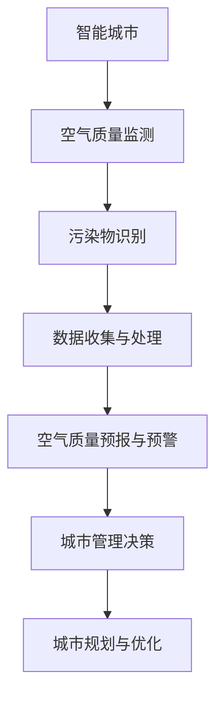

                 

### 文章标题：提示词工程在智能城市空气质量管理中的应用

### 关键词：
- 提示词工程
- 智能城市
- 空气质量管理
- 机器学习
- 物联网

### 摘要：
本文旨在探讨提示词工程在智能城市空气质量管理中的应用。首先，我们介绍了智能城市的概念及其在空气质量管理中的重要性，接着详细阐述了提示词工程的基本原理和实现流程。通过实际案例和代码实现，我们展示了如何利用提示词工程构建空气质量监测系统，并进行效果评估。随后，我们讨论了智能城市空气质量管理实践中的新兴技术，包括物联网、大数据分析和人工智能。最后，我们探讨了智能城市空气质量管理的法律法规和政策，并总结了文章中的最佳实践和注意事项。本文为相关领域的学者和实践者提供了有价值的参考。

---

## 第一部分：背景与核心概念

### 1.1.1 智能城市空气质量管理概述

#### 核心概念

智能城市是指通过集成信息技术、物联网、大数据分析等先进技术，实现城市运行管理和服务的智能化。在智能城市中，空气质量管理是关键环节之一，直接关系到市民的生活质量和城市的可持续发展。空气质量监测与管理涉及多个方面，包括污染源的识别、污染物的浓度监测、空气质量预报和预警等。

#### 联系

智能城市中的空气质量监测系统与城市运行紧密相连。通过实时监测空气质量数据，智能城市系统能够及时识别污染源，预测空气质量变化趋势，从而采取有效的管理措施，降低空气污染对市民健康的影响。同时，空气质量监测系统还能够为城市规划提供数据支持，优化城市布局，提高城市环境质量。

#### Mermaid 流程图



### 1.1.2 提示词工程的基本原理

#### 核心算法原理讲解

提示词工程是一种基于机器学习的算法，旨在通过分析大量数据，提取出对特定问题有帮助的关键特征。在空气质量监测中，提示词工程可用于识别污染源、预测空气质量变化等。

以下是一个简化的伪代码：

```python
def 提示词工程(数据集, 目标空气质量):
    # 数据预处理
    数据集 = 数据预处理(数据集)

    # 特征提取
    特征集 = 提取特征(数据集)

    # 训练分类模型
    模型 = 训练分类模型(特征集, 目标空气质量)

    # 应用模型进行预测
    预测结果 = 应用模型(模型, 新数据)

    # 调整提示词
    提示词集 = 调整提示词(预测结果)

    return 提示词集
```

#### 应用场景

提示词工程在空气质量预警和污染源追踪中具有广泛的应用。例如，在空气质量预警中，提示词工程可以识别出可能导致空气质量恶化的因素，提前发出预警；在污染源追踪中，提示词工程可以帮助确定污染源的位置和类型。

### 1.1.3 空气质量管理的挑战与机遇

空气质量管理的挑战主要体现在以下几个方面：

1. **数据复杂性**：空气质量数据包含多种污染物，且受到气象条件、地理特征等多种因素的影响，数据复杂性较高。
2. **实时性要求**：空气质量变化迅速，要求监测系统能够实时、准确地反映空气质量状况。
3. **经济成本**：构建和维护高质量的空气质量监测系统需要大量的经济投入。

然而，随着物联网、大数据分析和人工智能等新兴技术的发展，空气质量管理也面临着巨大的机遇：

1. **物联网技术**：通过物联网设备，可以实时收集大量的空气质量数据，提高监测的覆盖范围和准确性。
2. **大数据分析**：利用大数据分析技术，可以对海量空气质量数据进行深入挖掘，发现潜在的问题和趋势。
3. **人工智能**：人工智能技术，尤其是机器学习和深度学习，为空气质量预测和预警提供了强大的工具。

#### 数学模型和数学公式

空气质量指数（AQI）是衡量空气质量的重要指标，其计算公式如下：

$$
\text{AQI} = g(\text{污染物浓度}, \text{气象条件}, \text{地理特征})
$$

其中，$g$ 为空气质量指数的计算函数，需要考虑多种污染物的浓度及其对空气质量的影响。

#### 举例说明

以某地区为例，分析其空气质量状况。首先，收集该地区的空气质量数据，包括 PM2.5、PM10、SO2、NO2 等。然后，利用提示词工程提取关键特征，例如气象条件和地理特征。最后，利用机器学习模型预测空气质量指数，并根据预测结果发出预警。

---

在本文的第一部分中，我们介绍了智能城市空气质量管理的基本概念和提示词工程的基本原理。接下来，我们将深入探讨提示词工程在空气质量监测中的应用，并通过实际案例进行详细解析。敬请期待。

