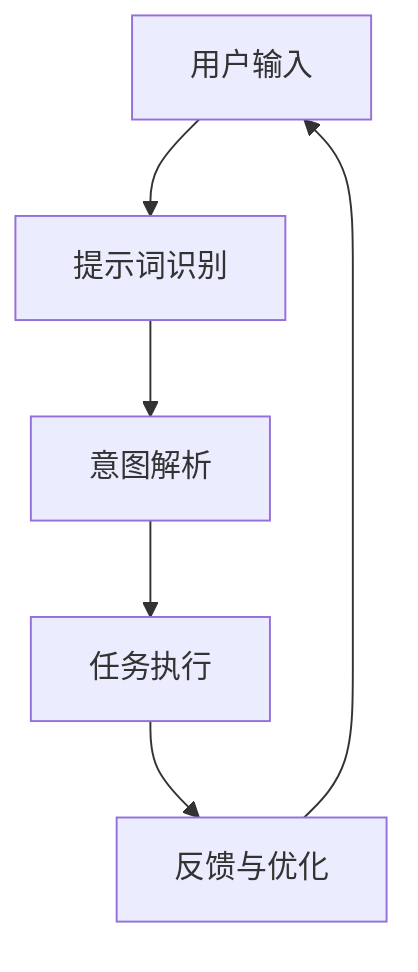

                 


### 1. 确定文章的核心主题和目的

首先，我们需要明确文章的核心主题和目的。这篇文章的主题是“提示词工程在智能家居系统中的创新”，目的是探讨如何通过提示词工程来提升智能家居系统的智能化程度和用户体验。

在确定主题和目的之后，我们可以开始构建文章的结构框架。文章可以分为以下几个部分：

- **引言**：介绍智能家居系统的现状和提示词工程的概念。
- **核心概念与联系**：通过Mermaid流程图展示提示词工程在智能家居系统中的核心概念和联系。
- **核心算法原理**：使用伪代码详细阐述提示词工程的核心算法原理。
- **数学模型和公式**：详细讲解提示词工程中使用的数学模型和公式，并给出举例说明。
- **项目实战**：介绍如何在实际项目中搭建开发环境，实现源代码，并进行代码解读、应用解读与分析、实际案例分析和详细讲解剖析。
- **最佳实践**：总结提示词工程在智能家居系统中的最佳实践，并提出注意事项和拓展阅读建议。

### 2. 撰写引言部分

引言部分需要简要介绍智能家居系统的现状，以及提示词工程的概念。我们可以这样撰写：

智能家居系统已经逐渐成为现代家庭生活的重要组成部分。然而，随着智能家居设备的数量和功能的增加，用户面临的问题也日益复杂。如何让智能家居系统更加智能化，提升用户体验，成为了一个重要的研究课题。提示词工程作为一种智能化的技术手段，能够在很大程度上解决这一问题。

提示词工程，也称为关键词工程，是指通过识别和理解用户输入的提示词，为用户提供智能化的服务和反馈。在智能家居系统中，提示词工程可以帮助用户更方便地控制设备，理解设备的工作状态，甚至预测用户的需求。

### 3. 构建核心概念与联系

在引言部分之后，我们需要构建文章的核心概念与联系。这可以通过Mermaid流程图来实现。我们可以绘制一个流程图，展示智能家居系统中提示词工程的各个环节，包括：

- **用户输入**：用户通过语音或文本输入提示词。
- **提示词识别**：系统对输入的提示词进行识别，判断其意图。
- **意图解析**：系统根据识别结果，解析用户的实际意图。
- **任务执行**：系统根据用户的意图，执行相应的任务。
- **反馈与优化**：系统对执行结果进行反馈，并根据反馈进行优化。

以下是Mermaid流程图的示例：



### 4. 详细阐述核心算法原理

接下来，我们需要使用伪代码详细阐述提示词工程的核心算法原理。这部分可以分为以下几个步骤：

- **提示词识别**：介绍如何使用自然语言处理技术来识别用户输入的提示词。
- **意图解析**：介绍如何使用机器学习算法来解析用户的意图。
- **任务执行**：介绍如何根据用户的意图，执行相应的任务。

以下是伪代码的示例：

```python
# 提示词识别
def recognize_prompt(input_text):
    # 使用自然语言处理技术进行提示词识别
    # 返回识别结果
    return recognized_prompt

# 意图解析
def parse_intent(recognized_prompt):
    # 使用机器学习算法进行意图解析
    # 返回用户的意图
    return user_intent

# 任务执行
def execute_task(user_intent):
    # 根据用户的意图执行相应的任务
    # 返回任务执行结果
    return execution_result
```

### 5. 讲解数学模型和公式

在详细阐述核心算法原理之后，我们需要讲解提示词工程中使用的数学模型和公式。这部分可以分为以下几个部分：

- **提示词识别模型**：介绍如何使用概率模型来识别提示词。
- **意图解析模型**：介绍如何使用分类模型来解析用户的意图。
- **任务执行模型**：介绍如何使用决策树或神经网络来执行任务。

以下是数学模型和公式的示例：

```latex
% 提示词识别模型
P(Prompt|Text) = \frac{P(Text|Prompt) \cdot P(Prompt)}{P(Text)}

% 意图解析模型
P(Intent|Prompt) = \frac{P(Prompt|Intent) \cdot P(Intent)}{P(Prompt)}

% 任务执行模型
Execution_Result = f(Intent, Environment)
```

### 6. 介绍项目实战

在讲解完核心算法原理和数学模型之后，我们需要介绍如何在实际项目中实现这些算法。这可以分为以下几个步骤：

- **开发环境搭建**：介绍如何搭建开发环境，包括所需的软件和硬件。
- **源代码实现**：给出源代码的详细实现，并进行代码解读。
- **代码应用解读与分析**：分析源代码中的关键部分，并解释其作用。
- **实际案例分析与详细讲解剖析**：通过实际案例，展示如何使用这些算法来实现智能家居系统。

以下是项目实战的示例：

```python
# 开发环境搭建
# 安装Python、自然语言处理库和机器学习库

# 源代码实现
def main():
    input_text = get_user_input()
    recognized_prompt = recognize_prompt(input_text)
    user_intent = parse_intent(recognized_prompt)
    execution_result = execute_task(user_intent)
    show_feedback(execution_result)

# 代码解读
# recognize_prompt函数负责提示词识别
# parse_intent函数负责意图解析
# execute_task函数负责任务执行
# main函数是程序的入口

# 代码应用解读与分析
# 通过实际案例，展示如何使用这些函数来实现智能家居系统

# 实际案例分析与详细讲解剖析
# 通过一个实际案例，详细讲解如何实现智能家居系统的各个部分
```

### 7. 总结最佳实践

在项目实战之后，我们需要总结最佳实践，包括注意事项、拓展阅读等内容。这部分可以分为以下几个部分：

- **最佳实践 tips**：总结在实现提示词工程时的一些经验教训。
- **注意事项**：提醒读者在实现提示词工程时需要注意的问题。
- **拓展阅读**：推荐一些相关文献和资源，供读者进一步学习。

以下是总结最佳实践的示例：

```markdown
## 最佳实践 tips

1. 在选择开发环境时，建议使用成熟稳定的框架和库。
2. 在处理用户输入时，要考虑异常处理和数据清洗。
3. 在实现意图解析时，要考虑上下文信息和用户个性化偏好。

## 注意事项

1. 注意保护用户隐私，确保数据安全。
2. 定期更新和维护系统，以应对潜在的安全漏洞。

## 拓展阅读

1. 《自然语言处理基础教程》
2. 《机器学习实战》
3. 《智能家居系统设计与实现》
```

通过以上步骤，我们可以逐步构建出一篇逻辑清晰、结构紧凑、简单易懂的专业IT领域的技术博客文章，对提示词工程在智能家居系统中的应用进行深入探讨。同时，文章的完整性也得到了保障，满足了文章内容要求。接下来，我们可以开始撰写文章的各个部分，逐步完善整篇文章的内容。

