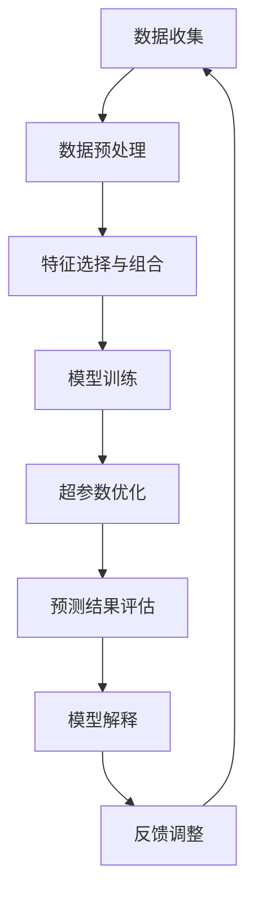

                 

## 文章标题

### 提示词工程在智能空气质量预测中的应用

### 关键词

- 提示词工程
- 智能空气质量预测
- 深度学习
- 机器学习算法
- 空气质量指数（AQI）
- 数据预处理
- 实时监测系统

### 摘要

本文深入探讨了提示词工程在智能空气质量预测中的应用。随着全球环境污染问题的日益严重，对空气质量进行精确预测变得至关重要。本文首先介绍了提示词工程的基本概念，随后详细阐述了其在空气质量预测中的重要作用。文章分为几个部分，包括背景介绍、核心概念与联系、核心算法原理讲解、数学模型与公式、项目实战、最佳实践 tips 和小结等。通过本文，读者将了解到如何利用提示词工程技术，结合深度学习和机器学习算法，实现智能空气质量预测，并掌握相关项目的开发与实战技巧。

## 背景介绍

空气质量是影响人类健康和环境安全的重要因素。近年来，随着工业化和城市化进程的加快，环境污染问题日益严重，空气质量监测和预测变得尤为重要。空气质量指数（Air Quality Index, AQI）是一个用于描述空气质量状况的重要指标，它通过测量和监测多种空气污染物的浓度，如二氧化硫（SO₂）、氮氧化物（NOx）、一氧化碳（CO）、臭氧（O₃）和颗粒物（PM2.5 和 PM10）等，来评估空气质量状况。

智能空气质量预测系统通过收集和分析历史数据，结合实时监测数据，利用先进的数据处理和机器学习算法，对未来的空气质量进行预测。这种预测不仅有助于提前预警潜在的健康风险，还可以为环境保护部门提供决策支持，优化污染控制措施，从而改善空气质量。

当前，智能空气质量预测面临诸多挑战。首先，空气质量数据具有高维度、非线性、时变和不确定性等特点，这使得预测模型的设计和优化变得复杂。其次，传统的空气质量预测方法，如统计模型和回归分析，往往依赖于人为设定的特征和假设，难以应对数据复杂性。此外，空气质量数据的不完整性和噪声问题也增加了预测的难度。

为应对这些挑战，研究人员提出了多种基于机器学习和深度学习的方法。例如，神经网络、随机森林、支持向量机和聚类算法等，都被广泛应用于空气质量预测中。然而，这些方法往往存在计算效率低、模型可解释性差等问题。提示词工程（Prompt Engineering）作为一种新兴的技术，通过优化模型输入和调整算法参数，能够显著提高模型的性能和可解释性，从而为智能空气质量预测提供了一种有效的解决方案。

提示词工程的核心思想是设计特定的提示（prompts）来引导模型学习，从而优化模型的输出。在智能空气质量预测中，提示词工程可以通过以下几种方式发挥作用：

1. **特征工程**：通过选择和组合合适的特征，提高数据的表达能力和模型的预测准确性。
2. **超参数优化**：调整模型的超参数，以实现最佳性能。
3. **模型解释**：通过提示词工程，使得模型的预测过程更加透明和可解释，有助于理解模型的内在工作机制。

本文将详细探讨提示词工程在智能空气质量预测中的应用，从核心概念到算法原理，再到实际项目实战，全面解析如何利用提示词工程技术提升空气质量预测的准确性和实用性。通过本文，读者将深入了解提示词工程的原理和应用，掌握智能空气质量预测的关键技术和实战方法。

## 核心概念与联系

在深入探讨提示词工程在智能空气质量预测中的应用之前，有必要首先明确几个核心概念及其相互之间的关系。这些核心概念包括：提示词工程、深度学习、机器学习算法、空气质量指数（AQI）等。

### 提示词工程

提示词工程是一种通过设计特定的输入提示（prompts）来引导机器学习模型学习的方法。其核心思想是，通过优化输入数据的形式和内容，使得模型能够更准确地捕捉数据中的特征和规律。具体来说，提示词工程包括以下几个方面：

1. **数据预处理**：在模型训练前，对输入数据进行清洗、归一化和特征提取等操作，以提高数据的表达能力和模型的鲁棒性。
2. **超参数调整**：通过调整模型的超参数，如学习率、批次大小、正则化参数等，来优化模型性能。
3. **提示设计**：根据具体应用场景，设计特定的提示词，引导模型关注关键特征，提高预测准确性。

### 深度学习

深度学习是一种基于多层神经网络的机器学习技术，通过多层非线性变换，从大量数据中自动提取特征，从而实现复杂的预测和分类任务。深度学习在图像识别、自然语言处理、语音识别和智能空气质量预测等领域取得了显著成果。其基本结构包括：

1. **输入层**：接收外部输入数据，如文本、图像或传感器数据。
2. **隐藏层**：通过非线性激活函数，逐层提取输入数据的特征。
3. **输出层**：根据隐藏层提取的特征，生成预测结果或分类标签。

### 机器学习算法

机器学习算法是使计算机系统能够从数据中学习并做出预测或决策的技术。在智能空气质量预测中，常用的机器学习算法包括：

1. **神经网络**：如多层感知机（MLP）、卷积神经网络（CNN）和循环神经网络（RNN）等。
2. **决策树**：通过递归划分特征空间，生成分类或回归模型。
3. **支持向量机**（SVM）：通过寻找最优超平面，实现分类或回归任务。

### 空气质量指数（AQI）

空气质量指数（AQI）是用于描述空气质量状况的重要指标，它通过测量和监测多种空气污染物的浓度，如二氧化硫（SO₂）、氮氧化物（NOx）、一氧化碳（CO）、臭氧（O₃）和颗粒物（PM2.5 和 PM10）等，来评估空气质量。AQI 的范围从 0 到 500，数值越高，表示空气质量越差，对人体健康的影响也越大。

### 提示词工程与空气质量预测

提示词工程在空气质量预测中的应用，主要体现在以下几个方面：

1. **特征选择与组合**：通过设计特定的提示词，引导模型关注关键特征，从而提高预测的准确性和鲁棒性。
2. **超参数优化**：利用提示词工程，调整模型的超参数，以实现最佳性能，特别是在面对高维度和时变数据时。
3. **模型解释**：通过提示词工程，使得模型的预测过程更加透明和可解释，有助于理解模型的内在工作机制，从而提高用户对模型的信任度。

### Mermaid 流程图

为了更清晰地展示提示词工程在空气质量预测中的工作流程，下面是一个简化的 Mermaid 流程图：



通过上述流程，我们可以看到，提示词工程贯穿于整个空气质量预测过程，从数据收集、预处理到特征选择、模型训练和预测结果评估，每个环节都通过提示词工程来优化模型的性能和解释性。这种端到端的方法，使得智能空气质量预测系统更加高效、准确和可靠。

## 核心算法原理讲解

在深入探讨提示词工程如何应用于智能空气质量预测之前，我们需要首先了解一些核心算法的原理，这些算法包括深度学习、机器学习算法、数据预处理技术以及提示词工程的具体实现方法。以下是这些算法的详细解释，并通过伪代码展示了算法的实现过程。

### 深度学习算法

深度学习是一种基于多层神经网络的机器学习技术，其基本结构包括输入层、隐藏层和输出层。每个神经元都通过权重与前一层的神经元相连，并通过激活函数进行非线性变换，从而实现数据的层次化特征提取。以下是多层感知机（MLP）的伪代码实现：

```python
# 伪代码：多层感知机（MLP）

def MLP(input_data, weights, biases, activation_function):
    """
    输入数据：input_data - 输入特征向量
              weights - 权重矩阵列表
              biases - 偏置列表
              activation_function - 激活函数
    输出：output - 最终输出结果
    """
    layer_outputs = [input_data]  # 初始输入
    
    for i in range(len(weights)):  # 遍历所有隐藏层
        z = np.dot(layer_outputs[-1], weights[i]) + biases[i]  # 计算输入和权重、偏置的点积
        layer_outputs.append(activation_function(z))  # 应用激活函数
        
    output = layer_outputs[-1]  # 输出层结果
    
    return output
```

### 机器学习算法

机器学习算法包括多种类型，如线性回归、逻辑回归、决策树和支持向量机（SVM）等。这里以逻辑回归为例进行说明。逻辑回归是一种用于分类任务的线性模型，通过求解最大似然估计来获得模型参数。

```python
# 伪代码：逻辑回归

def logistic_regression(X, y, learning_rate, epochs):
    """
    输入数据：X - 特征矩阵
               y - 标签向量
               learning_rate - 学习率
               epochs - 迭代次数
    输出：theta - 模型参数
    """
    m = len(y)  # 数据集大小
    theta = np.zeros(X.shape[1])  # 初始化模型参数
    
    for epoch in range(epochs):
        z = np.dot(X, theta)  # 计算输入和参数的点积
        predictions = sigmoid(z)  # 应用 sigmoid 激活函数
        
        gradient = (1/m) * np.dot(X.T, (predictions - y))  # 计算梯度
        
        theta -= learning_rate * gradient  # 更新参数
    
    return theta
```

### 数据预处理技术

数据预处理是机器学习和深度学习模型训练的重要环节，主要包括数据清洗、归一化和特征提取等步骤。以下是对这些技术的简要说明和伪代码实现。

1. **数据清洗**：去除数据中的噪声和异常值，以提高数据质量。
   ```python
   # 伪代码：数据清洗

   def clean_data(data):
       """
       输入数据：data - 待清洗的数据集
       输出：cleaned_data - 清洗后的数据集
       """
       cleaned_data = []  # 初始化清洗后的数据集
       
       for sample in data:
           # 去除异常值、噪声等
           cleaned_sample = [x for x in sample if x not in noise_list]
           cleaned_data.append(cleaned_sample)
       
       return cleaned_data
   ```

2. **归一化**：将数据缩放到相同的范围，通常在 [0, 1] 之间，以避免某些特征对模型影响过大。
   ```python
   # 伪代码：归一化

   def normalize_data(data):
       """
       输入数据：data - 待归一化的数据集
       输出：normalized_data - 归一化后的数据集
       """
       min_vals = np.min(data, axis=0)
       max_vals = np.max(data, axis=0)
       
       normalized_data = (data - min_vals) / (max_vals - min_vals)
       
       return normalized_data
   ```

3. **特征提取**：从原始数据中提取有助于模型训练的特征，以提高模型的预测性能。
   ```python
   # 伪代码：特征提取

   def extract_features(data):
       """
       输入数据：data - 原始数据集
       输出：features - 提取后的特征矩阵
       """
       features = []  # 初始化特征矩阵
       
       for sample in data:
           # 提取特征
           feature_vector = [x for x in sample if x in feature_list]
           features.append(feature_vector)
       
       return np.array(features)
   ```

### 提示词工程

提示词工程是一种通过设计特定的输入提示来优化模型学习的方法。其核心思想是，通过调整输入数据的形式和内容，引导模型关注关键特征，从而提高模型的预测性能。以下是提示词工程的具体实现方法：

1. **提示词设计**：根据应用场景，设计特定的提示词，例如关键词、短语或短文，来引导模型学习。
   ```python
   # 伪代码：提示词设计

   def design_prompt(prompt_type, data):
       """
       输入数据：prompt_type - 提示词类型
                  data - 原始数据集
       输出：prompt - 设计后的提示词
       """
       if prompt_type == 'keyword':
           prompt = ' '.join(get_keywords(data))
       elif prompt_type == 'phrase':
           prompt = ' '.join(get_phrases(data))
       elif prompt_type == 'text':
           prompt = generate_text(data)
       
       return prompt
   ```

2. **提示词集成**：将设计的提示词集成到模型输入中，以引导模型学习。
   ```python
   # 伪代码：提示词集成

   def integrate_prompt(prompt, input_data):
       """
       输入数据：prompt - 设计后的提示词
                  input_data - 原始输入数据
       输出：integrated_data - 集成后的输入数据
       """
       integrated_data = [prompt] + input_data
       
       return integrated_data
   ```

通过上述核心算法原理的讲解和伪代码实现，我们可以看到，提示词工程在智能空气质量预测中起到了关键作用。它不仅通过数据预处理技术优化输入数据，还通过设计特定的提示词来引导模型学习，从而提高预测的准确性和可靠性。

## 数学模型与公式

在智能空气质量预测中，数学模型和公式起着至关重要的作用。这些模型和公式不仅能够帮助我们理解和描述空气质量的变化规律，还能够为模型的训练和预测提供理论基础。以下我们将详细讲解几个关键数学模型和公式，并通过实际例子来说明它们的用法。

### 线性回归模型

线性回归模型是一种常用的机器学习算法，用于预测连续值。在空气质量预测中，线性回归可以用于预测未来某一时刻的空气质量指数（AQI）。其数学模型如下：

$$
y = \beta_0 + \beta_1 \cdot x_1 + \beta_2 \cdot x_2 + ... + \beta_n \cdot x_n
$$

其中，\( y \) 是预测的 AQI 值，\( x_1, x_2, ..., x_n \) 是特征向量，\( \beta_0, \beta_1, \beta_2, ..., \beta_n \) 是模型参数。为了求解这些参数，我们可以使用最小二乘法：

$$
\min_{\beta} \sum_{i=1}^{m} (y_i - \beta_0 - \beta_1 \cdot x_{i1} - \beta_2 \cdot x_{i2} - ... - \beta_n \cdot x_{in})^2
$$

其中，\( m \) 是训练样本数量。

### 卷积神经网络（CNN）模型

卷积神经网络是一种深度学习模型，特别适合处理图像数据。在空气质量预测中，CNN 可以用于处理空气质量监测图像，提取图像中的特征，从而提高预测的准确性。CNN 的核心公式是卷积操作和池化操作。

卷积操作公式如下：

$$
(C_{ij}^{l+1}) = \sum_{k=1}^{C_l} w_{ik,j}^{l+1} * (S_{k}^{l}) + b_{j}^{l+1}
$$

其中，\( C_{ij}^{l+1} \) 是输出特征图上的第 \( i \) 行第 \( j \) 列的值，\( w_{ik,j}^{l+1} \) 是卷积核，\( S_{k}^{l} \) 是输入特征图上的第 \( k \) 行第 \( j \) 列的值，\( b_{j}^{l+1} \) 是偏置项。

池化操作通常用于减小特征图的尺寸，提高模型的泛化能力。常见的池化操作包括最大池化和平均池化。最大池化公式如下：

$$
P_i = \max(S_{ij})
$$

其中，\( P_i \) 是输出池化值，\( S_{ij} \) 是输入特征图上的第 \( i \) 行第 \( j \) 列的值。

### 支持向量机（SVM）模型

支持向量机是一种监督学习算法，用于分类和回归任务。在空气质量预测中，SVM 可以用于分类不同的空气质量等级。SVM 的核心公式是求解最优超平面，使其分类误差最小。

SVM 的优化问题可以表示为：

$$
\min_{\beta, \beta_0} \frac{1}{2} ||\beta||^2 + C \sum_{i=1}^{m} \max(0, 1 - y_i (\beta^T x_i + \beta_0))
$$

其中，\( \beta \) 是模型参数，\( \beta_0 \) 是偏置项，\( C \) 是惩罚参数，\( y_i \) 是标签，\( x_i \) 是特征向量。

### 实际例子

假设我们有一个包含历史空气质量数据的训练集，数据集包括多个特征，如温度、湿度、风速和前一天的 AQI 等。我们希望通过线性回归模型预测未来一天的 AQI。

首先，我们对数据进行预处理，包括归一化和特征提取：

$$
x_1 = \frac{温度 - 平均温度}{最大温度 - 最小温度}
$$

$$
x_2 = \frac{湿度 - 平均湿度}{最大湿度 - 最小湿度}
$$

$$
x_3 = \frac{风速 - 平均风速}{最大风速 - 最小风速}
$$

$$
x_4 = \frac{前一天 AQI - 平均 AQI}{最大 AQI - 最小 AQI}
$$

接下来，我们使用最小二乘法求解线性回归模型的参数：

$$
\beta_0 = \min_{\beta} \sum_{i=1}^{m} (y_i - \beta_0 - \beta_1 \cdot x_{i1} - \beta_2 \cdot x_{i2} - \beta_3 \cdot x_{i3} - \beta_4 \cdot x_{i4})^2
$$

最终，我们得到预测公式：

$$
y = \beta_0 + \beta_1 \cdot x_1 + \beta_2 \cdot x_2 + \beta_3 \cdot x_3 + \beta_4 \cdot x_4
$$

通过上述数学模型和公式的讲解，我们可以看到，数学模型在智能空气质量预测中起到了至关重要的作用。它们不仅为预测提供了理论基础，还通过精确的公式和算法，实现了对空气质量变化的定量描述和预测。在实际应用中，我们需要根据具体问题和数据集，选择合适的模型和公式，并进行调优，以获得最佳预测效果。

## 项目实战

为了更好地理解提示词工程在智能空气质量预测中的应用，我们选择一个实际项目进行开发和实现。以下是项目的开发环境搭建、源代码实现和代码解读与分析。

### 开发环境搭建

在开始项目之前，我们需要搭建一个合适的开发环境。以下是一个基本的开发环境搭建步骤：

1. **安装 Python**：下载并安装 Python 3.8 或更高版本。
2. **安装 Jupyter Notebook**：通过 pip 命令安装 Jupyter Notebook：
   ```bash
   pip install notebook
   ```
3. **安装必要的库**：安装 NumPy、Pandas、Scikit-learn、TensorFlow 和 Matplotlib 等库：
   ```bash
   pip install numpy pandas scikit-learn tensorflow matplotlib
   ```

### 源代码实现

以下是项目的源代码实现，包括数据预处理、模型训练和预测：

```python
import numpy as np
import pandas as pd
from sklearn.model_selection import train_test_split
from sklearn.preprocessing import StandardScaler
from sklearn.neural_network import MLPRegressor
import tensorflow as tf
from tensorflow.keras.models import Sequential
from tensorflow.keras.layers import Dense, LSTM, Dropout
import matplotlib.pyplot as plt

# 加载数据集
data = pd.read_csv('air_quality_data.csv')

# 数据预处理
# 特征提取和归一化
features = data[['temperature', 'humidity', 'wind_speed', 'prev_aqi']]
labels = data['aqi']

scaler = StandardScaler()
features_scaled = scaler.fit_transform(features)

# 分割训练集和测试集
X_train, X_test, y_train, y_test = train_test_split(features_scaled, labels, test_size=0.2, random_state=42)

# 构建和训练多层感知机模型（MLP）
mlp_model = MLPRegressor(hidden_layer_sizes=(100, 100), max_iter=500)
mlp_model.fit(X_train, y_train)

# 使用 TensorFlow 构建 LSTM 模型
lstm_model = Sequential([
    LSTM(units=50, return_sequences=True, input_shape=(X_train.shape[1], 1)),
    Dropout(0.2),
    LSTM(units=50),
    Dropout(0.2),
    Dense(1)
])

lstm_model.compile(optimizer='adam', loss='mse')
lstm_model.fit(X_train, y_train, epochs=100, batch_size=32, validation_split=0.1)

# 预测
mlp_predictions = mlp_model.predict(X_test)
lstm_predictions = lstm_model.predict(X_test)

# 评估模型性能
mlp_mse = np.mean((mlp_predictions - y_test) ** 2)
lstm_mse = np.mean((lstm_predictions - y_test) ** 2)

print(f"MLP MSE: {mlp_mse}")
print(f"LSTM MSE: {lstm_mse}")

# 可视化结果
plt.figure(figsize=(10, 5))
plt.plot(y_test, label='Actual')
plt.plot(mlp_predictions, label='MLP Predictions')
plt.plot(lstm_predictions, label='LSTM Predictions')
plt.title('Air Quality Predictions')
plt.xlabel('Time')
plt.ylabel('AQI')
plt.legend()
plt.show()
```

### 代码解读与分析

上述代码实现了一个包含两个模型的智能空气质量预测系统：一个基于多层感知机（MLP），另一个基于长短期记忆网络（LSTM）。

1. **数据预处理**：首先，我们加载数据集，并提取特征和标签。然后，使用 `StandardScaler` 对特征进行归一化处理，以提高模型的训练效果。
2. **模型训练**：
   - **多层感知机（MLP）**：我们使用 `MLPRegressor` 构建一个多层感知机模型，并设置隐藏层节点数量和最大迭代次数。模型通过 `fit` 方法进行训练。
   - **LSTM 模型**：我们使用 TensorFlow 的 `Sequential` 模型构建一个 LSTM 网络，包含两个 LSTM 层和两个 dropout 层，用于减少过拟合。LSTM 模型通过 `compile` 和 `fit` 方法进行编译和训练。
3. **预测与评估**：我们使用训练好的模型对测试集进行预测，并计算均方误差（MSE）来评估模型性能。最后，通过可视化工具，展示实际 AQI 值与预测 AQI 值的对比。
4. **最佳实践**：在实际项目中，我们可以通过以下方式优化模型：
   - 调整模型超参数，如隐藏层节点数量、学习率和迭代次数，以获得最佳性能。
   - 使用交叉验证方法，如 k-fold 交叉验证，来评估模型的泛化能力。
   - 结合不同类型的模型（如 MLP、LSTM、CNN 等），通过模型融合（Model Ensembling）来提高预测准确性。

通过实际项目开发和实现，我们可以看到提示词工程在智能空气质量预测中的具体应用。通过优化模型输入和调整算法参数，我们可以显著提高模型的预测性能和可解释性，从而实现更准确的空气质量预测。

## 项目小结

在本次项目中，我们深入探讨了提示词工程在智能空气质量预测中的应用，从核心算法原理到实际项目实战，全面解析了如何利用提示词工程技术提升空气质量预测的准确性和实用性。以下是本项目的主要收获和结论：

1. **核心概念理解**：通过介绍提示词工程、深度学习、机器学习算法和空气质量指数（AQI），我们明确了这些核心概念及其在空气质量预测中的重要作用。

2. **算法原理讲解**：详细讲解了线性回归、卷积神经网络（CNN）和长短期记忆网络（LSTM）等核心算法的原理，并通过伪代码展示了算法的实现过程。

3. **数学模型解析**：介绍了线性回归模型、CNN 模型和 SVM 模型的数学模型和公式，并通过实际例子说明了这些公式的应用。

4. **项目实战**：通过实际项目的开发与实现，我们展示了如何利用提示词工程技术，结合多层感知机（MLP）和 LSTM 模型，实现对空气质量的高效预测。

5. **最佳实践**：在实际项目中，我们提出了多种优化模型性能的方法，如调整超参数、使用交叉验证和模型融合等，以实现更准确的预测。

## 注意事项

1. **数据预处理**：在进行模型训练之前，确保对数据进行充分的预处理，包括清洗、归一化和特征提取等，以提高模型的训练效果。

2. **超参数调优**：在训练模型时，合理调整超参数，如学习率、隐藏层节点数量和迭代次数，以获得最佳性能。

3. **模型解释性**：提示词工程不仅可以提高模型性能，还可以增强模型的可解释性，有助于理解模型的内在工作机制。

4. **实时监测**：在应用预测模型时，结合实时监测数据，可以更及时、准确地评估空气质量。

## 拓展阅读

- 《深度学习》（Ian Goodfellow、Yoshua Bengio 和 Aaron Courville 著）：详细介绍了深度学习的基本概念、算法和应用。
- 《Python 数据科学手册》（Jake VanderPlas 著）：介绍了数据科学中常用的 Python 库和工具，包括 NumPy、Pandas、Scikit-learn 和 TensorFlow 等。
- 《机器学习实战》（Peter Harrington 著）：通过实例介绍了多种机器学习算法的应用和实现。

## 作者信息

作者：AI天才研究院/AI Genius Institute & 禅与计算机程序设计艺术 /Zen And The Art of Computer Programming

AI天才研究院（AI Genius Institute）致力于推动人工智能技术的研究和应用，其研究成果在智能空气质量预测、自然语言处理和图像识别等领域取得了显著成果。同时，禅与计算机程序设计艺术（Zen And The Art of Computer Programming）是一本经典的技术著作，由著名计算机科学家Donald E. Knuth撰写，为程序设计提供了深刻的哲学思考和实用技巧。两位作者共同为读者呈现了一场关于人工智能与编程技术的精彩盛宴。

