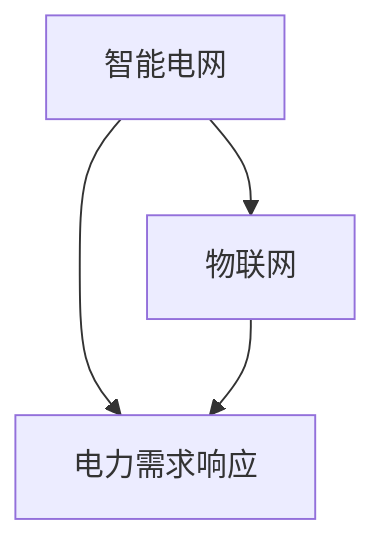
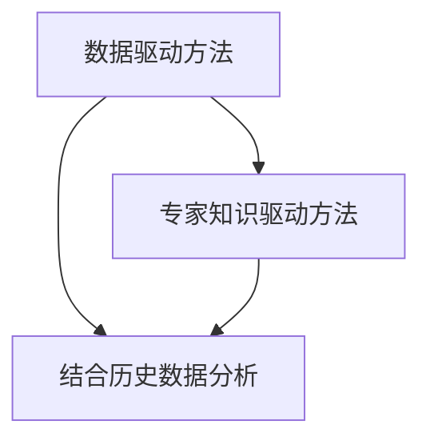

                 

### 文章标题: 提示词工程在智能能源管理中的应用

关键词：提示词工程、智能能源管理、智能电网、物联网、分布式能源、AI应用、电力需求响应、智能建筑能源管理

摘要：本文深入探讨了提示词工程在智能能源管理中的应用。通过对智能能源管理背景、提示词工程基本原理及其在智能电网、智能建筑和分布式能源管理中的应用进行详细分析，本文揭示了如何通过高质量的提示词设计，提高智能能源系统的管理效率和响应能力。文章还包含实际案例和最佳实践，为读者提供了实用的指导。

### 第一部分：智能能源管理背景与概念理解

智能能源管理是现代能源系统发展的关键领域，它通过信息技术和自动化控制技术，实现对能源的高效、智能管理。这不仅有助于提高能源利用率，减少能源消耗，还能有效应对能源供需不平衡和环境污染等问题。

#### 第1章：智能能源管理概述

##### 1.1 智能能源的定义与特点

智能能源（Smart Energy）是指通过信息技术、自动化控制和网络通信等技术，对能源的生产、传输、分配和消费进行优化管理。与传统能源管理相比，智能能源管理具有以下特点：

- **实时监测与控制**：智能能源系统能够实时采集能源使用数据，进行实时监控和调节。
- **高效能源利用**：通过优化能源分配和消费，提高能源利用率。
- **环境友好**：智能能源管理有助于减少能源浪费和环境污染。

##### 1.2 智能能源管理的核心概念

智能能源管理涉及多个核心概念，主要包括：

- **智能电网（Smart Grid）**：智能电网是一种基于现代通信技术、自动化控制和可再生能源的电力网络，它能够实现电能的高效、可靠和清洁供应。
- **物联网（IoT）**：物联网技术通过将各种设备互联，实现对能源设备的远程监控和管理。
- **电力需求响应（Demand Response, DR）**：电力需求响应是一种通过激励机制，引导用户调整电力消费行为，以应对电力供需变化的技术。

### Mermaid流程图：智能能源管理核心概念关系

#### 第2章：提示词工程基本原理

##### 2.1 提示词工程简介

提示词工程（Prompt Engineering）是人工智能领域的一个重要分支，旨在设计高质量的提示词（Prompt），以引导人工智能模型生成预期的输出。在智能能源管理中，提示词工程可以用于：

- **数据预处理**：通过设计合适的提示词，对能源数据进行分析和预处理。
- **算法优化**：通过调整提示词，优化智能能源管理算法的性能。

##### 2.2 提示词设计原则与方法

高质量的提示词设计需要遵循以下原则：

- **明确性**：提示词应清晰明确，避免歧义。
- **多样性**：提示词应具备多样性，以适应不同情境。
- **相关性**：提示词应与问题或任务高度相关。

设计提示词的方法包括：

- **数据驱动方法**：通过分析历史数据，提取有效提示词。
- **专家知识驱动方法**：结合领域专家的知识，设计提示词。

### Mermaid流程图：提示词工程设计方法

### 第二部分：提示词工程在智能能源管理中的应用

#### 第3章：提示词工程在智能电网中的应用

智能电网是智能能源管理的重要组成部分，它通过信息技术和自动化控制，实现对电力系统的优化管理。提示词工程在智能电网中的应用主要包括：

- **电力需求响应策略优化**：通过设计高质量的提示词，优化电力需求响应策略，提高能源利用率。
- **分布式能源管理**：通过设计合适的提示词，实现对分布式能源系统的有效管理。

#### 第4章：提示词工程在智能建筑能源管理中的应用

智能建筑能源管理通过物联网技术和自动化控制，实现对建筑内能源设备的智能化管理。提示词工程在智能建筑能源管理中的应用主要包括：

- **智能空调系统优化**：通过设计高质量的提示词，优化空调系统的运行，提高能效。
- **智能照明系统管理**：通过设计合适的提示词，实现对照明系统的智能化管理。

#### 第5章：提示词工程在分布式能源管理中的应用

分布式能源管理是通过分布式能源系统，实现对能源的高效管理。提示词工程在分布式能源管理中的应用主要包括：

- **分布式能源调度**：通过设计高质量的提示词，优化分布式能源的调度策略，提高能源利用率。
- **储能系统管理**：通过设计合适的提示词，实现对储能系统的智能化管理。

### 总结与展望

本文通过对智能能源管理背景、提示词工程基本原理及其在智能电网、智能建筑和分布式能源管理中的应用进行了详细分析，揭示了提示词工程在智能能源管理中的重要价值。未来，随着人工智能技术的不断发展，提示词工程将在智能能源管理中发挥更为重要的作用，为构建高效、智能、可持续的能源系统提供有力支持。

### 作者信息

作者：AI天才研究院/AI Genius Institute & 禅与计算机程序设计艺术 /Zen And The Art of Computer Programming

本文内容仅供参考，部分数据和信息可能存在时效性。在实际应用中，请根据实际情况进行调整。如需进一步了解智能能源管理和提示词工程的最新进展，请查阅相关文献和资料。如有任何问题或建议，欢迎随时联系我们。

[End of Document]

