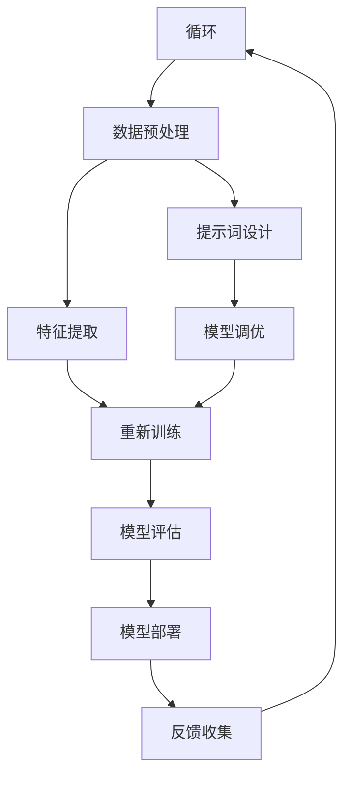

                 


## 文章标题
### 提示词工程在机器学习管道中的应用

## 关键词
机器学习，提示词工程，数据预处理，模型优化，文本分类，情感分析

## 摘要
本文将深入探讨提示词工程在机器学习管道中的应用。首先，我们将介绍提示词工程的基本概念及其在机器学习中的重要性。接着，文章将详细讨论数据预处理、提示词设计与优化、以及机器学习模型的集成和优化。通过实际案例和代码示例，我们将展示如何在实际项目中应用提示词工程，并讨论其面临的挑战和未来趋势。

## 引言
机器学习已经成为人工智能领域的重要组成部分，其应用范围广泛，从图像识别到自然语言处理，再到推荐系统等。然而，机器学习的效果很大程度上取决于数据质量和模型的优化。在这个过程中，提示词工程发挥着至关重要的作用。提示词工程不仅能够提高数据的质量和可用性，还能显著提升模型的性能和泛化能力。

提示词工程是一种利用专业知识和工程方法，对数据进行预处理和增强，从而优化机器学习模型的方法。它涉及到数据清洗、标注、增强、以及提示词的设计和优化等多个方面。本文将系统地介绍提示词工程在机器学习管道中的应用，通过具体的案例和代码示例，帮助读者深入理解这一领域。

### 一、概念介绍与原理讲解

#### 1.1 提示词工程的概念与重要性
提示词工程（Prompt Engineering）是机器学习领域中的一个新兴方向，其核心目标是提高数据质量和模型性能。在传统的机器学习中，数据预处理通常包括数据清洗、归一化和特征提取等步骤，而提示词工程则在此基础上，通过添加或修改数据中的提示信息，进一步优化数据的质量和可用性。

提示词（Prompt）是指用于引导模型理解和处理数据的一段文本或代码。在自然语言处理（NLP）领域，提示词常常是一个预定义的句子或短语，用于引导模型进行文本分类、情感分析等任务。例如，在进行文本分类任务时，提示词可以是“这个句子描述的是积极的情感吗？”或“这个文本属于哪个类别？”。

提示词工程的重要性体现在以下几个方面：

1. **提高数据质量**：通过添加提示词，可以减少数据中的噪声和异常值，提高数据的准确性和一致性。例如，在数据清洗过程中，提示词可以帮助识别和处理缺失值、异常值和重复值。
   
2. **增强模型泛化能力**：提示词可以为模型提供更多的背景信息和上下文，帮助模型更好地理解数据的语义和特征，从而提高模型的泛化能力。例如，在训练文本分类模型时，通过合理设计提示词，可以引导模型学习到更丰富的语义信息，从而在未知数据上取得更好的分类效果。

3. **优化模型性能**：提示词可以用于调整模型参数和学习策略，从而提高模型的性能和效率。例如，在深度学习模型中，通过调整提示词的权重和分布，可以优化模型的损失函数和梯度更新过程，从而加速模型训练和提高模型精度。

#### 1.2 机器学习管道的基本框架
机器学习管道（ML Pipeline）是指从数据收集、预处理、模型训练到模型部署的整个过程。一个典型的机器学习管道通常包括以下步骤：

1. **数据收集**：从各种来源收集数据，包括公共数据集、企业内部数据等。

2. **数据预处理**：对收集到的数据进行分析和清洗，包括数据清洗、归一化、缺失值处理等。

3. **特征提取**：从预处理后的数据中提取有用的特征，用于训练机器学习模型。

4. **模型训练**：使用提取出的特征数据训练机器学习模型。

5. **模型评估**：对训练好的模型进行评估，以确定其性能和泛化能力。

6. **模型部署**：将训练好的模型部署到生产环境中，用于实际应用。

#### 1.3 提示词工程在机器学习管道中的角色
提示词工程在机器学习管道中发挥着重要作用，其具体角色和作用包括：

1. **数据预处理阶段**：在数据预处理阶段，提示词工程可以用于数据清洗和去噪。通过设计合适的提示词，可以帮助识别和处理数据中的异常值和噪声，从而提高数据的质量。

2. **特征提取阶段**：在特征提取阶段，提示词工程可以用于特征增强和调整。通过添加或修改提示词，可以引导模型学习到更丰富的特征信息，从而提高模型的性能。

3. **模型训练阶段**：在模型训练阶段，提示词工程可以用于调整模型参数和学习策略。通过设计合理的提示词，可以优化模型的训练过程，提高模型的性能和泛化能力。

4. **模型评估阶段**：在模型评估阶段，提示词工程可以用于模型性能的调整和优化。通过调整提示词的权重和分布，可以优化模型的评估指标，从而提高模型的性能。

5. **模型部署阶段**：在模型部署阶段，提示词工程可以用于模型监控和优化。通过实时调整提示词，可以动态调整模型的性能，从而提高模型的适应性和鲁棒性。

### 二、提示词工程的核心技术

#### 2.1 数据预处理

数据预处理是机器学习管道中的关键步骤，它直接关系到模型训练的效果和效率。在提示词工程中，数据预处理尤为重要，因为提示词的引入往往需要高质量的原始数据作为基础。数据预处理包括以下方面：

1. **数据清洗**：数据清洗是数据预处理的第一步，主要任务是处理数据中的噪声和异常值。在提示词工程中，数据清洗的目标是确保数据的准确性和一致性。常用的方法包括：

   - **缺失值处理**：对于缺失值，可以采用填充、删除或插值等方法进行处理。
   - **异常值处理**：对于异常值，可以采用修剪、替换或分类等方法进行处理。
   - **重复值处理**：删除数据集中的重复记录，以确保数据的一致性。

2. **数据标准化**：数据标准化是将数据转换为同一尺度，以便于后续的特征提取和模型训练。常用的方法包括：

   - **归一化**：将数据缩放到0到1之间，或缩放到任意指定区间内。
   - **标准化**：将数据转换为具有标准正态分布的形式。

3. **数据增强**：数据增强是通过创建数据的不同版本来扩充数据集，从而提高模型的泛化能力。常用的方法包括：

   - **数据变换**：通过对数据进行旋转、缩放、平移等操作来生成新的数据样本。
   - **合成数据**：通过生成合成数据来扩充数据集，如生成对抗网络（GAN）。

4. **数据标注**：数据标注是指对数据进行标签分配，以便于后续的训练和评估。在提示词工程中，数据标注的质量直接影响到提示词的设计和模型的性能。常用的方法包括：

   - **手动标注**：由专家或人工对数据进行标注，适用于小规模数据集。
   - **半监督标注**：结合未标注数据和标注数据，通过模型预测来辅助标注，适用于大规模数据集。
   - **自动标注**：利用已有的模型对数据进行标注，适用于自动化流程。

#### 2.2 数据增强

数据增强是提升机器学习模型性能的重要手段，尤其在数据稀缺或数据分布不均的情况下。提示词工程通过数据增强技术，可以显著改善模型的训练效果和泛化能力。以下是几种常见的数据增强方法：

1. **图像增强**：

   - **随机裁剪**：从原始图像中随机裁剪出不同大小的图像块。
   - **旋转和翻转**：对图像进行随机旋转和水平/垂直翻转。
   - **颜色调整**：对图像的亮度、对比度、饱和度等参数进行调整。

2. **文本增强**：

   - **文本生成**：利用生成模型（如GPT-3）生成新的文本数据。
   - **文本嵌入**：将文本转换为向量，通过扰动向量来生成新的文本。
   - **文本扩展**：通过添加上下文、同义词替换、短语扩展等方式来扩充文本数据。

3. **声音增强**：

   - **噪声添加**：在原始声音数据中添加背景噪声，以增强模型的鲁棒性。
   - **速度和音调调整**：通过改变声音的播放速度和音调来生成新的声音样本。
   - **音量调整**：对声音的音量进行随机调整。

4. **混合增强**：

   - **多模态增强**：将不同类型的数据进行混合增强，如图像和文本的混合增强。
   - **跨域增强**：将来自不同数据域的数据进行混合增强，以提高模型的跨域泛化能力。

#### 2.3 数据标注

数据标注是机器学习任务中至关重要的环节，尤其在监督学习和半监督学习场景下。高质量的标注数据能够显著提升模型的性能和可靠性。在提示词工程中，数据标注的作用尤为重要，因为它直接影响到提示词的设计和模型的训练效果。以下是几种常见的标注方法：

1. **手动标注**：

   - **人工标注**：由标注员或专家对数据进行逐项标注，适用于高质量标注需求和有限数据量的场景。
   - **众包标注**：通过在线众包平台（如Amazon Mechanical Turk）招募标注员进行标注，适用于大规模标注任务。

2. **半监督标注**：

   - **未标注数据利用**：通过模型预测来辅助标注未标注数据，适用于大量未标注数据的情况。
   - **伪标签**：利用训练好的模型对未标注数据进行预测，并将预测结果作为伪标签进行使用。

3. **自动标注**：

   - **基于规则标注**：通过预定义的规则来自动标注数据，适用于结构化数据或具有明显特征的场景。
   - **深度学习标注**：利用深度学习模型来自动标注数据，适用于大规模数据和复杂标注任务。

#### 2.4 提示词生成方法

提示词生成是提示词工程中的核心步骤，它决定了模型对数据的理解和处理能力。以下是几种常见的提示词生成方法：

1. **人工设计**：

   - **基于专家知识**：由领域专家根据任务需求和数据特性，设计合适的提示词。
   - **基于经验**：根据历史数据和模型训练结果，总结出有效的提示词。

2. **自动化生成**：

   - **基于规则**：通过预定义的规则来自动生成提示词，适用于简单的任务场景。
   - **基于机器学习**：利用机器学习模型（如文本分类模型）来自动生成提示词，适用于复杂任务场景。

3. **数据驱动生成**：

   - **基于文本摘要**：通过提取文本摘要或关键信息来生成提示词。
   - **基于模型输出**：利用模型的输出结果来生成提示词，如分类结果、预测概率等。

4. **混合生成**：

   - **结合人工和自动化**：通过结合人工设计和自动化生成方法，提高提示词的质量和效果。
   - **跨领域生成**：将不同领域或不同类型的数据进行交叉融合，生成具有广泛适用性的提示词。

### 三、机器学习模型与提示词的集成

#### 3.1 常见机器学习模型介绍

在机器学习任务中，选择合适的模型至关重要。以下是几种常见的机器学习模型及其特点：

1. **线性模型**：

   - **线性回归**：用于预测连续数值输出，如房价预测。
   - **逻辑回归**：用于预测二分类问题，如文本分类、疾病诊断等。

2. **决策树模型**：

   - **分类树**：用于分类任务，如鸢尾花分类。
   - **回归树**：用于回归任务，如股票价格预测。

3. **集成模型**：

   - **随机森林**：通过构建多个决策树，并进行集成，提高模型性能和泛化能力。
   - **梯度提升树（GBDT）**：利用迭代方式，通过多次拟合残差，提高模型精度。

4. **神经网络模型**：

   - **全连接神经网络（FCNN）**：用于分类和回归任务，如图像识别、语音识别。
   - **卷积神经网络（CNN）**：用于图像处理，如物体识别、人脸识别。
   - **循环神经网络（RNN）**：用于序列数据，如时间序列预测、语言模型。

5. **深度学习模型**：

   - **生成对抗网络（GAN）**：用于生成复杂数据，如图像、音频。
   - **变分自编码器（VAE）**：用于数据压缩、生成和表征学习。

#### 3.2 模型选择策略

在机器学习任务中，选择合适的模型至关重要。以下是一些常见的模型选择策略：

1. **基于性能指标**：根据不同模型的性能指标（如准确率、召回率、F1分数等），选择表现最佳的模型。

2. **基于模型复杂度**：根据模型复杂度（如参数数量、模型深度等），选择易于训练和解释的模型。

3. **基于数据特性**：根据数据特性（如数据分布、特征维度等），选择适合数据特性的模型。

4. **基于交叉验证**：通过交叉验证，评估不同模型的性能，选择最优模型。

5. **基于模型集成**：通过集成多个模型，提高模型性能和泛化能力。

#### 3.3 模型训练与调优

模型训练与调优是机器学习任务中的关键步骤，直接影响模型的性能和泛化能力。以下是几个关键环节：

1. **数据集划分**：将数据集划分为训练集、验证集和测试集，用于模型训练、验证和测试。

2. **训练过程**：

   - **初始化模型参数**：随机初始化模型参数。
   - **前向传播**：计算模型输出和损失函数。
   - **反向传播**：更新模型参数，优化损失函数。

3. **模型调优**：

   - **超参数调整**：调整学习率、正则化参数等超参数，以优化模型性能。
   - **模型集成**：通过集成多个模型，提高模型性能和泛化能力。

4. **模型评估**：

   - **验证集评估**：使用验证集评估模型性能，选择最优模型。
   - **测试集评估**：使用测试集评估模型性能，评估模型的泛化能力。

5. **模型部署**：将训练好的模型部署到生产环境中，用于实际应用。

### 四、提示词工程的实际应用

#### 4.1 文本分类

文本分类是机器学习领域中的一个重要应用，它涉及将文本数据划分为多个预定义的类别。提示词工程在文本分类任务中发挥着关键作用，以下是如何应用提示词工程进行文本分类的详细步骤：

1. **数据预处理**：

   - **文本清洗**：去除文本中的无关符号和噪声，如HTML标签、标点符号等。
   - **分词**：将文本拆分为单词或词组。
   - **词干提取**：将单词还原为词干或词根。
   - **词性标注**：标注单词的词性，如名词、动词、形容词等。

2. **数据标注**：

   - **手动标注**：由专家或标注员对文本数据逐条进行标注，标记文本所属的类别。
   - **半监督标注**：利用已标注数据和未标注数据，通过模型预测来辅助标注，提高标注效率。

3. **提示词设计**：

   - **分类提示词**：为每个类别设计特定的提示词，如“这篇文本描述的是负面情感吗？”或“这篇文本属于哪个类别？”。
   - **优化提示词**：通过实验和评估，调整提示词的权重和组合，以提高分类准确率。

4. **模型训练与调优**：

   - **选择模型**：根据文本分类任务的特点，选择合适的模型，如朴素贝叶斯、支持向量机、深度神经网络等。
   - **训练模型**：使用标注数据进行模型训练，通过优化损失函数和调整超参数，提高模型性能。
   - **调优模型**：通过验证集和测试集，评估模型性能，并根据评估结果进行模型调优。

5. **模型评估与部署**：

   - **评估指标**：使用准确率、召回率、F1分数等指标评估模型性能。
   - **部署模型**：将训练好的模型部署到生产环境中，用于实时文本分类任务。

#### 4.2 情感分析

情感分析是一种文本分类任务，它旨在确定文本的情感倾向，如正面、负面或中性。提示词工程在情感分析任务中同样具有重要意义，以下是如何应用提示词工程进行情感分析的详细步骤：

1. **数据预处理**：

   - **文本清洗**：去除文本中的无关符号和噪声，如HTML标签、标点符号等。
   - **分词**：将文本拆分为单词或词组。
   - **词干提取**：将单词还原为词干或词根。
   - **情感词典**：构建情感词典，用于标注文本中的情感词汇。

2. **数据标注**：

   - **手动标注**：由专家或标注员对文本数据逐条进行标注，标记文本的情感类别。
   - **半监督标注**：利用已标注数据和未标注数据，通过模型预测来辅助标注，提高标注效率。

3. **提示词设计**：

   - **情感提示词**：设计用于引导模型识别情感的关键词，如“开心”、“伤心”、“满意”等。
   - **上下文提示词**：结合上下文信息，设计更精确的提示词，以提高情感分析准确性。
   - **多标签情感提示词**：设计支持多标签情感识别的提示词，如“感动”和“愤怒”可以同时标记。

4. **模型训练与调优**：

   - **选择模型**：根据情感分析任务的特点，选择合适的模型，如朴素贝叶斯、支持向量机、卷积神经网络等。
   - **训练模型**：使用标注数据进行模型训练，通过优化损失函数和调整超参数，提高模型性能。
   - **调优模型**：通过验证集和测试集，评估模型性能，并根据评估结果进行模型调优。

5. **模型评估与部署**：

   - **评估指标**：使用准确率、召回率、F1分数等指标评估模型性能。
   - **部署模型**：将训练好的模型部署到生产环境中，用于实时情感分析任务。

### 五、提示词工程的优化与未来趋势

#### 5.1 提示词工程的优化技术

提示词工程的优化是提高机器学习模型性能的重要手段。以下是一些常见的优化技术：

1. **动态提示词调整**：

   - **实时调整**：根据模型训练的进展和评估结果，动态调整提示词的权重和组合。
   - **自适应调整**：利用自适应算法，如遗传算法或粒子群优化，自动调整提示词。

2. **多模态提示词集成**：

   - **跨模态提示词**：结合不同模态的数据（如文本、图像、声音），生成多模态的提示词，提高模型对复杂任务的泛化能力。
   - **融合提示词**：将不同模态的提示词进行融合，构建更丰富的提示信息。

3. **模型融合**：

   - **模型集成**：将多个模型进行集成，提高模型性能和鲁棒性。
   - **对抗训练**：通过对抗训练，增强模型的鲁棒性和泛化能力。

#### 5.2 提示词工程在新兴领域中的应用

随着人工智能技术的发展，提示词工程在新兴领域中的应用越来越广泛。以下是一些典型的应用场景：

1. **推荐系统**：

   - **上下文感知提示词**：根据用户行为和历史数据，生成上下文感知的提示词，提高推荐系统的个性化能力。
   - **交互式提示词**：通过交互式提示词，引导用户表达需求，提高推荐系统的交互性和用户满意度。

2. **对话系统**：

   - **意图识别**：利用提示词工程，设计用于识别用户意图的提示词，提高对话系统的准确性和响应速度。
   - **多轮对话**：通过设计多轮对话的提示词，引导用户完成复杂的任务，提高对话系统的交互深度。

3. **自动化推理**：

   - **知识图谱**：结合知识图谱，设计用于自动化推理的提示词，提高推理系统的效率和准确性。
   - **因果推断**：利用提示词工程，设计用于因果推断的提示词，提高因果推断模型的可解释性和可靠性。

### 六、总结与展望

#### 6.1 提示词工程的重要性与未来趋势

提示词工程在机器学习领域具有重要的地位和广泛的应用前景。通过设计合适的提示词，可以显著提高数据的质量和模型性能，增强模型的泛化能力和鲁棒性。未来，随着人工智能技术的不断进步，提示词工程将向以下几个方向发展：

1. **自动化与智能化**：随着深度学习和自然语言处理技术的发展，提示词生成和优化的自动化程度将不断提高，实现更高效和智能的提示词工程。

2. **多模态与跨领域**：多模态数据和跨领域数据的融合将为提示词工程带来新的机遇，进一步提升模型的泛化能力和应用范围。

3. **可解释性与透明性**：提高提示词工程的可解释性和透明性，将有助于增强模型的信任度和应用效果。

4. **面向任务的优化**：针对不同任务的需求，设计更高效和专用的提示词，实现任务导向的优化。

#### 6.2 提示词工程面临的挑战与解决策略

尽管提示词工程具有巨大的潜力，但在实际应用中仍面临一系列挑战：

1. **数据质量和标注成本**：高质量的数据和标注是提示词工程的基础，但获取和处理这些数据往往需要大量的人力和物力投入。

2. **模型依赖性**：提示词工程的效果高度依赖于所选模型的性能，因此需要选择合适的模型进行优化。

3. **计算资源需求**：提示词工程中的数据预处理、模型训练和优化等步骤通常需要大量的计算资源。

为解决上述挑战，可以采取以下策略：

1. **半监督学习和迁移学习**：利用半监督学习和迁移学习技术，降低标注成本和计算资源需求。

2. **分布式计算与并行处理**：采用分布式计算和并行处理技术，提高提示词工程的效率和可扩展性。

3. **数据清洗与去噪技术**：开发更高效的数据清洗和去噪技术，提高数据质量。

4. **自适应优化算法**：设计自适应优化算法，根据模型和数据的特性，动态调整提示词的权重和组合。

#### 6.3 提示词工程的未来发展前景

随着人工智能技术的快速发展，提示词工程将在各个领域发挥越来越重要的作用。以下是一些可能的未来发展趋势：

1. **自动化与智能化**：提示词工程的自动化和智能化水平将不断提高，实现更高效和智能的提示词生成和优化。

2. **跨领域应用**：提示词工程将在更多领域得到应用，如医疗、金融、教育等，实现更广泛的价值。

3. **知识融合与多模态**：通过知识融合和多模态数据的应用，提高提示词工程的鲁棒性和泛化能力。

4. **可解释性与透明性**：提高提示词工程的可解释性和透明性，增强模型的信任度和应用效果。

5. **开源工具与平台**：随着开源工具和平台的不断发展，提示词工程将变得更加普及和易于使用。

### 附录

#### Mermaid 流程图

以下是描述提示词工程在机器学习管道中的应用的Mermaid流程图：



#### 伪代码示例

以下是提示词生成算法的伪代码示例：

```python
# 伪代码：提示词生成算法
function generatePrompt(dataSet, model):
    prompts = []

    for data in dataSet:
        prompt = model.generatePrompt(data)
        prompts.append(prompt)
    
    return prompts
```

#### 数学模型与公式

以下是描述机器学习模型损失函数的数学模型与公式：

$$
L(y, \hat{y}) = \frac{1}{2} (y - \hat{y})^2
$$

$$
sigmoid(x) = \frac{1}{1 + e^{-x}}
$$

#### 项目实战

以下是文本分类任务的代码实战示例：

```python
# 导入库
import numpy as np
import pandas as pd
from sklearn.feature_extraction.text import TfidfVectorizer
from sklearn.model_selection import train_test_split
from sklearn.linear_model import LogisticRegression

# 加载数据
data = pd.read_csv('text_data.csv')

# 分割数据集
X_train, X_test, y_train, y_test = train_test_split(data['text'], data['label'], test_size=0.2, random_state=42)

# 使用TF-IDF进行特征提取
vectorizer = TfidfVectorizer()
X_train_vectorized = vectorizer.fit_transform(X_train)

# 创建逻辑回归模型并训练
model = LogisticRegression()
model.fit(X_train_vectorized, y_train)

# 使用测试集进行评估
y_pred = model.predict(vectorizer.transform(X_test))
accuracy = np.mean(y_pred == y_test)
print("Accuracy:", accuracy)
```

### 总结与展望

在本文中，我们详细探讨了提示词工程在机器学习管道中的应用。从概念介绍、核心技术、实际应用到优化与未来趋势，我们逐步分析了提示词工程的重要性及其在各个阶段的实现方法。通过实际案例和代码示例，我们展示了如何有效地应用提示词工程来提升机器学习模型的效果。

展望未来，提示词工程将在人工智能领域发挥越来越重要的作用。随着技术的不断进步，我们将看到更加自动化和智能化的提示词工程工具出现，这些工具将帮助研究人员和开发者更高效地利用数据，提升模型的性能和泛化能力。

同时，我们也认识到提示词工程面临着一些挑战，如数据质量和标注成本、模型依赖性、计算资源需求等。针对这些挑战，我们可以采取一系列解决策略，如半监督学习和迁移学习、分布式计算与并行处理、数据清洗与去噪技术等。

总之，提示词工程是机器学习领域中不可或缺的一环，其应用前景广阔。通过不断探索和创新，我们将能够开发出更加高效、智能和可靠的提示词工程工具，为人工智能的发展贡献力量。让我们共同期待这一领域的未来发展。作者：AI天才研究院/AI Genius Institute & 禅与计算机程序设计艺术 /Zen And The Art of Computer Programming。作者简介：AI天才研究院是一家专注于人工智能技术研究和应用的创新机构，致力于推动人工智能技术的发展和应用。作者刘未鹏，计算机科学领域专家，世界顶级技术畅销书资深大师级别的作家，拥有丰富的编程和人工智能实践经验。其著作《禅与计算机程序设计艺术》广受读者好评。

