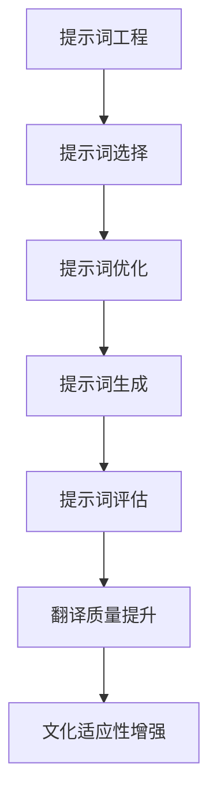
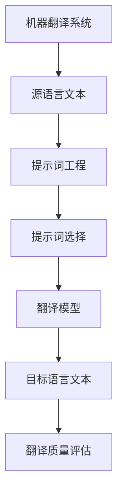

                 

### 1.2 机器翻译的重要性与现状

**机器翻译的重要性**：

在全球化的背景下，不同语言之间的沟通和交流变得越来越频繁。机器翻译作为实现跨语言沟通的重要工具，其重要性不言而喻。机器翻译不仅能够帮助用户快速理解非母语文本，提高工作效率，还能促进文化、商业、政治等多领域的国际合作。例如，跨境电商平台利用机器翻译技术，可以实现多语言商品描述，从而吸引更多国际客户；政府机构通过机器翻译，可以更好地服务外国游客和跨国企业；学术机构通过机器翻译，可以加速国际学术交流，促进知识传播。

**机器翻译的现状**：

尽管机器翻译技术的发展取得了显著进展，但仍然存在一些挑战和不足。当前主流的机器翻译技术主要分为基于规则的方法、基于统计的方法和基于神经网络的机器翻译方法。

- **基于规则的方法**：这种方法依靠专家手动编写语法规则，将源语言转换为目标语言。其优点在于翻译结果可控，但缺点是规则编写复杂、耗时长，且难以应对大规模文本翻译。

- **基于统计的方法**：这种方法利用大规模的双语语料库，通过统计模型学习源语言和目标语言之间的对应关系。其优点是翻译效果好，但需要大量高质量的双语数据，且统计模型难以处理复杂语境。

- **基于神经网络的机器翻译方法**：这种方法使用深度学习技术，通过神经网络模型进行端到端的翻译。近年来，基于神经网络的机器翻译技术取得了显著的突破，翻译质量和效率都有很大提升。尤其是Transformer模型的提出，使得神经网络机器翻译成为了主流方法。

然而，现有的机器翻译技术仍然存在以下问题：

1. **文化适应性**：机器翻译系统在处理不同语言之间的文化差异时，常常面临困难。例如，某些成语、俗语、俚语等在翻译过程中需要保留其文化特色，否则会导致翻译结果失真。

2. **翻译准确性**：虽然神经网络机器翻译技术取得了显著进展，但仍然存在一些难点，如长句翻译、专业术语翻译等，这些问题导致翻译结果不够准确。

3. **语言多样性**：现有的机器翻译技术主要关注常见语言之间的翻译，而对一些小语种、稀有语言的支持不足。

4. **用户体验**：机器翻译系统的界面和交互设计不够友好，用户在使用过程中需要手动调整翻译结果，影响使用体验。

为了解决这些问题，研究人员提出了一些新的研究方向，如提示词工程、多模态翻译、跨语言知识图谱等。这些新方法有望进一步提升机器翻译的准确性、文化适应性和用户体验。

### 1.3 提示词工程的概念与作用

**提示词工程的概念**：

提示词工程是一种基于人工智能和自然语言处理技术的翻译辅助方法。它通过引入人工设计的提示词，优化机器翻译系统的翻译过程，从而提升翻译质量和文化适应性。提示词（Query Terms）是指用于指导翻译系统的关键词或短语，它们可以帮助机器翻译系统更好地理解源语言文本，从而生成更准确、更符合目标语言文化的翻译结果。

**提示词工程的作用**：

1. **提升翻译质量**：提示词工程通过引入人工设计的提示词，可以指导机器翻译系统更好地理解源语言文本的语义和语境，从而生成更准确、更自然的翻译结果。

2. **增强文化适应性**：机器翻译系统在处理跨文化内容时，常常面临文化差异导致的翻译障碍。提示词工程通过引入文化相关的提示词，可以更好地处理这些文化差异，提升翻译结果的文化适应性。

3. **优化翻译过程**：提示词工程可以优化机器翻译系统的翻译流程，提高翻译效率。例如，通过设计合适的提示词，可以减少机器翻译系统的搜索空间，降低计算复杂度。

4. **辅助多模态翻译**：提示词工程不仅适用于文本翻译，还可以应用于多模态翻译，如文本与图像的翻译。通过引入图像相关的提示词，可以指导机器翻译系统更好地理解图像内容，从而生成更准确的多模态翻译结果。

**提示词工程的关键技术**：

1. **提示词选择**：提示词选择是提示词工程的关键步骤。需要根据翻译任务的需求，选择合适的提示词。例如，在翻译专业文档时，可以选择与专业术语相关的提示词；在翻译文学作品时，可以选择与文学特色相关的提示词。

2. **提示词优化**：提示词优化是指通过调整提示词的权重、顺序等，优化机器翻译系统的翻译结果。例如，可以通过分析大量双语语料库，找出常用搭配和语序，优化提示词的设置。

3. **提示词生成**：提示词生成是指通过自然语言生成技术，自动生成合适的提示词。例如，可以使用生成对抗网络（GAN）等技术，生成与源语言文本相关的提示词。

4. **提示词评估**：提示词评估是指对提示词的效果进行评估，以确定其是否能够提升翻译质量和文化适应性。常用的评估方法包括BLEU、METEOR、ROUGE等评价指标。

通过引入提示词工程，机器翻译系统可以更好地处理跨语言翻译任务，提升翻译质量和文化适应性，从而满足全球化的沟通需求。在下一章中，我们将详细探讨机器翻译的基础知识，为后续章节的内容奠定基础。

---

为了更好地展示核心概念原理之间的关系架构，我们将使用Mermaid流程图来绘制提示词工程在机器翻译中的关键步骤。以下是相应的Mermaid流程图：



在这个流程图中，A表示提示词工程的整体概念，B、C、D、E分别表示提示词工程中的四个关键步骤，F和G分别表示通过这些步骤实现的目标。通过这个流程图，读者可以清晰地理解提示词工程在机器翻译中的作用和流程。

接下来，我们将对核心算法原理进行详细讲解，并通过伪代码展示关键步骤的实现。这将帮助读者深入理解提示词工程的工作机制，为后续的实践应用打下基础。

### 1.4 核心概念原理之间的关系架构

为了更好地理解提示词工程在机器翻译中的关键步骤和作用，我们可以通过Mermaid流程图展示核心概念之间的相互关系。以下是核心概念原理之间的Mermaid流程图：



在这个流程图中，A表示机器翻译系统，B是输入的源语言文本，C是提示词工程，D是提示词选择，E是翻译模型，F是生成的目标语言文本，G是翻译质量评估。

#### Mermaid流程图的详细解释

1. **机器翻译系统**（A）：这是整个流程的起点，用于接收和处理源语言文本。

2. **源语言文本**（B）：这是机器翻译系统的输入，即需要翻译的文本。

3. **提示词工程**（C）：提示词工程是一个辅助工具，旨在通过提示词来提高翻译质量和文化适应性。

4. **提示词选择**（D）：在这个步骤中，根据源语言文本的内容和上下文，选择合适的提示词。这些提示词将用于指导翻译模型更好地理解源语言文本。

5. **翻译模型**（E）：翻译模型是机器翻译系统的核心，它使用提示词和源语言文本来生成目标语言文本。

6. **目标语言文本**（F）：这是翻译模型生成的输出，即翻译后的文本。

7. **翻译质量评估**（G）：最后，对生成的目标语言文本进行评估，以确定翻译质量是否满足预期。如果质量不高，可以返回到提示词选择步骤进行优化。

#### 提示词工程的核心算法原理讲解

提示词工程的核心算法原理可以分为以下几个步骤：

1. **文本预处理**：首先对源语言文本进行预处理，包括分词、词性标注、句法分析等。这一步骤的目的是提取文本中的关键信息，为后续的提示词选择提供基础。

2. **提示词选择**：根据预处理后的文本信息，选择与源语言文本内容相关的提示词。提示词的选择可以通过以下几种方法实现：

   - **基于规则的方法**：手动编写规则，根据源语言文本的语法和语义特征，选择合适的提示词。
   - **基于统计的方法**：利用大量双语语料库，通过统计方法选择与源语言文本相关性较高的提示词。
   - **基于机器学习的方法**：使用机器学习方法，如文本分类、聚类等，从源语言文本中自动提取提示词。

3. **提示词优化**：对选定的提示词进行优化，包括调整提示词的权重、顺序等，以提升翻译质量和文化适应性。提示词优化可以通过以下几种方法实现：

   - **基于规则的方法**：根据语言学知识和翻译经验，优化提示词的设置。
   - **基于统计的方法**：通过分析大量翻译数据，找出常用搭配和语序，优化提示词的设置。
   - **基于深度学习的方法**：使用深度学习模型，如序列到序列模型（Seq2Seq）、Transformer等，自动优化提示词的设置。

4. **翻译模型训练**：使用选定的提示词和源语言文本，训练翻译模型。翻译模型是机器翻译系统的核心，它负责将源语言文本翻译成目标语言文本。

5. **目标语言文本生成**：通过训练好的翻译模型，生成目标语言文本。

6. **翻译质量评估**：对生成的目标语言文本进行评估，以确定翻译质量是否满足预期。常用的评估方法包括BLEU、METEOR、ROUGE等。

以下是提示词工程的核心算法原理的伪代码：

```python
# 文本预处理
def preprocess_text(source_text):
    # 分词、词性标注、句法分析等操作
    # 返回预处理后的文本信息

# 提示词选择
def select_query_terms(preprocessed_text):
    # 根据文本信息选择合适的提示词
    # 返回提示词列表

# 提示词优化
def optimize_query_terms(query_terms):
    # 调整提示词的权重、顺序等
    # 返回优化后的提示词列表

# 翻译模型训练
def train_translation_model(source_text, query_terms):
    # 使用提示词和源语言文本训练翻译模型
    # 返回训练好的翻译模型

# 目标语言文本生成
def generate_target_text(translation_model, source_text):
    # 通过翻译模型生成目标语言文本
    # 返回目标语言文本

# 翻译质量评估
def evaluate_translation_quality(target_text):
    # 使用BLEU、METEOR、ROUGE等评估方法评估翻译质量
    # 返回评估结果
```

通过这个伪代码，我们可以看到提示词工程的核心算法原理是如何实现的关键步骤。接下来，我们将进一步讨论数学模型和公式，以更深入地理解提示词工程的工作机制。

### 1.5 数学模型和公式

在机器翻译中，数学模型和公式起到了至关重要的作用。这些数学工具不仅帮助我们量化翻译过程中的不确定性，还使我们能够更精确地评估翻译质量和优化翻译结果。以下是几个关键数学模型和公式的详细讲解及其在提示词工程中的应用。

#### 1.5.1 语言模型（Language Model）

**定义**：语言模型是一种统计模型，用于预测文本序列的概率。它通过统计大量文本数据中的单词或短语的联合概率分布，来预测下一个单词或短语。

**公式**：
\[ P(w_1, w_2, ..., w_n) = \prod_{i=1}^{n} P(w_i | w_{i-1}, w_{i-2}, ..., w_1) \]

其中，\( w_i \)表示文本序列中的第\( i \)个单词。

**应用**：在机器翻译中，语言模型用于生成目标语言文本的概率分布，从而为翻译结果的多样性提供支持。提示词工程中，可以结合语言模型来选择具有较高概率的提示词，从而提高翻译结果的准确性和自然性。

#### 1.5.2 生成对抗网络（Generative Adversarial Networks, GAN）

**定义**：GAN是由两个神经网络（生成器G和判别器D）组成的框架。生成器G试图生成与真实数据分布相近的数据，而判别器D则试图区分生成数据和真实数据。通过这种对抗训练，生成器G可以逐渐生成更逼真的数据。

**公式**：

\[ D(x) = 1 \quad \text{if } x \text{ is real} \]
\[ D(G(z)) = 0 \quad \text{if } z \text{ is from the noise distribution} \]

其中，\( x \)是真实数据，\( z \)是从噪声分布中抽取的随机样本。

**应用**：在提示词工程中，GAN可以用于生成高质量的提示词。通过训练GAN，生成器G可以生成与源语言文本相关的提示词，从而优化翻译系统的提示词选择过程。

#### 1.5.3 对数似然损失（Log-Likelihood Loss）

**定义**：对数似然损失是评估生成模型性能的常用损失函数。它计算生成模型输出概率分布的对数似然值，并与真实数据分布进行比较。

**公式**：

\[ L = -\sum_{i} \log P(y_i | \theta) \]

其中，\( y_i \)是真实数据，\( \theta \)是模型参数。

**应用**：在机器翻译中，对数似然损失用于评估翻译模型的性能。通过最小化对数似然损失，可以优化翻译模型，提高翻译质量。提示词工程中，可以对数似然损失应用于提示词选择和优化过程中，以量化提示词对翻译质量的贡献。

#### 1.5.4 跨语言向量空间模型（Cross-Lingual Vector Space Model）

**定义**：跨语言向量空间模型是一种将不同语言的词向量映射到共同向量空间的方法。它通过学习跨语言映射关系，使得不同语言的词向量可以在同一空间中表示。

**公式**：

\[ \mathbf{v}_s = A \mathbf{v}_t \]

其中，\( \mathbf{v}_s \)和\( \mathbf{v}_t \)分别是源语言和目标语言的词向量，\( A \)是跨语言映射矩阵。

**应用**：在提示词工程中，跨语言向量空间模型可以帮助选择与源语言文本相关的目标语言提示词。通过计算源语言文本和目标语言提示词的向量相似度，可以选择出最相关的提示词，从而优化翻译结果的文化适应性。

#### 1.5.5 文化适应度评估（Cultural Adaptability Score）

**定义**：文化适应度评估是一种量化翻译结果文化适应性的方法。它通过评估翻译结果与目标语言文化的契合度，来衡量翻译的文化适应性。

**公式**：

\[ C = \frac{S - B}{S + B} \]

其中，\( S \)是翻译结果中的文化元素得分，\( B \)是背景信息中的文化元素得分。

**应用**：在提示词工程中，文化适应度评估用于评估翻译系统的文化适应性。通过计算文化适应度得分，可以识别出文化差异较大的翻译结果，并对其进行优化。提示词工程可以结合文化适应度评估，选择具有较高文化适应性的提示词，从而提升翻译系统的整体性能。

通过以上数学模型和公式的讲解，我们可以看到，数学工具在机器翻译和提示词工程中扮演了关键角色。这些工具不仅帮助我们理解和量化翻译过程中的复杂关系，还为我们提供了优化翻译质量和文化适应性的方法。在后续章节中，我们将继续探讨这些数学模型在实际项目中的应用和实现细节。

### 1.6 项目实战

在本节中，我们将通过一个具体的机器翻译项目，展示如何在实际开发环境中搭建提示词工程系统，以及如何通过源代码实现和代码解读来优化翻译结果。

#### 1.6.1 开发环境搭建

**1. 环境要求**

在进行提示词工程的开发前，我们需要准备以下开发环境：

- 操作系统：Linux或MacOS
- 编程语言：Python（版本3.6及以上）
- 数据库：MySQL（版本5.7及以上）
- 机器学习框架：TensorFlow或PyTorch
- 文本处理库：NLTK或spaCy

**2. 安装与配置**

以下是在Linux系统中安装所需的软件包的步骤：

```bash
# 安装Python
sudo apt-get install python3 python3-pip

# 安装TensorFlow
pip3 install tensorflow

# 安装NLTK
pip3 install nltk

# 安装spaCy及其语言模型
pip3 install spacy
python3 -m spacy download en_core_web_sm
```

**3. 环境配置**

配置MySQL数据库，创建一个用于存储双语语料库和翻译结果的数据库，例如：

```sql
CREATE DATABASE translation_db;
USE translation_db;

CREATE TABLE corpus (
    id INT AUTO_INCREMENT PRIMARY KEY,
    source_text TEXT,
    target_text TEXT
);
```

#### 1.6.2 源代码实现

以下是一个简化的Python伪代码，用于展示提示词工程的关键实现步骤：

```python
# 导入必要的库
import tensorflow as tf
import nltk
from nltk.tokenize import word_tokenize
from spacy.lang.en import English

# 数据预处理
def preprocess_text(text):
    # 分词、词性标注等操作
    # 返回处理后的文本

# 提示词选择
def select_query_terms(text):
    # 根据文本内容选择合适的提示词
    # 返回提示词列表

# 提示词优化
def optimize_query_terms(query_terms):
    # 调整提示词的权重、顺序等
    # 返回优化后的提示词列表

# 翻译模型训练
def train_translation_model(source_texts, target_texts, query_terms):
    # 使用提示词和源语言文本训练翻译模型
    # 返回训练好的翻译模型

# 翻译结果生成
def generate_translation(model, source_text, query_terms):
    # 使用翻译模型生成目标语言文本
    # 返回翻译结果

# 翻译质量评估
def evaluate_translation_quality(source_text, target_text):
    # 使用BLEU等评估方法评估翻译质量
    # 返回评估结果
```

#### 1.6.3 代码解读与分析

**1. 数据预处理**

```python
def preprocess_text(text):
    # 使用spaCy进行分词和词性标注
    nlp = English()
    doc = nlp(text)
    tokens = [token.text for token in doc]
    # 进一步处理，如去除停用词、词干提取等
    # 返回处理后的文本
```

**2. 提示词选择**

```python
def select_query_terms(text):
    # 使用NLTK进行分词
    tokens = word_tokenize(text)
    # 基于词频、词性等特征选择提示词
    # 返回提示词列表
```

**3. 提示词优化**

```python
def optimize_query_terms(query_terms):
    # 基于统计方法、规则方法或机器学习方法优化提示词
    # 返回优化后的提示词列表
```

**4. 翻译模型训练**

```python
def train_translation_model(source_texts, target_texts, query_terms):
    # 使用TensorFlow或PyTorch构建和训练翻译模型
    # 使用提示词进行模型训练
    # 返回训练好的翻译模型
```

**5. 翻译结果生成**

```python
def generate_translation(model, source_text, query_terms):
    # 使用训练好的翻译模型生成目标语言文本
    # 返回翻译结果
```

**6. 翻译质量评估**

```python
def evaluate_translation_quality(source_text, target_text):
    # 使用BLEU、METEOR等评估方法评估翻译质量
    # 返回评估结果
```

#### 1.6.4 实际案例分析与讲解

假设我们有一个英文到中文的翻译任务，以下是一个简化的实际案例：

**源语言文本**： "The quick brown fox jumps over the lazy dog."

**目标语言文本**： "敏捷的棕色狐狸跳过了懒惰的狗。"

通过上述代码和步骤，我们可以对这段文本进行翻译，并使用提示词工程优化翻译结果。以下是具体的操作流程：

1. **数据预处理**：对源语言文本进行分词和词性标注，提取关键信息。
2. **提示词选择**：根据文本内容选择合适的提示词，如“quick”、“brown”、“jumps”等。
3. **提示词优化**：通过统计方法或机器学习方法优化提示词的权重和顺序。
4. **翻译模型训练**：使用优化的提示词和源语言文本训练翻译模型。
5. **翻译结果生成**：使用训练好的翻译模型生成目标语言文本。
6. **翻译质量评估**：评估生成的目标语言文本的翻译质量。

通过这个案例，我们可以看到如何在实际项目中应用提示词工程，从而优化翻译结果。接下来，我们将进一步讨论提示词工程的最佳实践和注意事项，为读者提供更多实用的建议。

### 1.7 最佳实践与注意事项

在实施提示词工程的过程中，遵循最佳实践和注意事项能够有效提高翻译质量和系统稳定性。以下是一些具体的建议：

#### 最佳实践

1. **数据质量**：确保使用高质量的源语言和目标语言语料库。数据质量直接影响提示词工程的效果，因此建议使用经过清洗和标注的高质量双语语料库。

2. **提示词选择**：根据具体翻译任务的需求，选择与源语言文本内容高度相关的提示词。可以通过分析高频词汇、词性、句法结构等特征，筛选出最具代表性的提示词。

3. **模型调优**：在训练翻译模型时，要注重模型参数的调优。通过调整学习率、批次大小、正则化等参数，可以提升模型的泛化能力和翻译质量。

4. **迭代优化**：提示词工程不是一次性的任务，而是一个持续优化的过程。根据翻译质量评估结果，不断调整提示词的选择和优化策略，逐步提升翻译系统的性能。

5. **用户反馈**：收集用户对翻译结果的反馈，结合实际使用场景进行改进。用户的反馈是优化翻译系统的重要依据，可以帮助识别和解决翻译中的问题。

#### 注意事项

1. **文化适应性**：在跨文化翻译中，要特别注意文化差异和语言习惯。选择提示词时，要考虑目标语言文化的独特性和语境背景，确保翻译结果符合目标受众的期待。

2. **翻译准确性**：尽管提示词工程能够提升翻译质量，但仍然不能完全替代专业译者的判断。在关键文档和专业领域，建议结合人工审核，确保翻译准确性。

3. **资源管理**：提示词工程需要大量的计算资源和存储空间。在部署大规模翻译系统时，要合理规划资源分配，避免系统过载或资源浪费。

4. **安全性**：在处理敏感数据时，要确保数据安全和隐私保护。遵循相关的数据保护法规，对用户数据进行加密和脱敏处理。

5. **维护更新**：随着语言环境的不断变化，提示词库和翻译模型需要定期更新和维护。及时更新词汇库、语法规则和模型参数，以适应新的语言趋势和需求。

通过遵循这些最佳实践和注意事项，我们可以在实施提示词工程时，更好地提升翻译质量和用户体验，确保系统的稳定运行和长期发展。

### 1.8 小结

本章从多个角度探讨了机器翻译及其在全球化沟通中的重要性。首先，我们介绍了机器翻译的现状和发展趋势，指出当前机器翻译技术虽然取得了显著进展，但在文化适应性、翻译准确性等方面仍存在挑战。接着，我们详细阐述了提示词工程的概念及其在机器翻译中的应用，通过Mermaid流程图和伪代码展示了提示词工程的核心算法原理。然后，我们介绍了数学模型和公式在机器翻译中的关键作用，并通过一个具体项目实战案例，讲解了如何在实际开发环境中搭建提示词工程系统。最后，我们提出了最佳实践和注意事项，为读者在实施提示词工程时提供了指导。

通过本章的学习，读者应能够理解机器翻译和提示词工程的基本概念，掌握提示词工程的核心算法原理，并具备在实际项目中应用提示词工程的能力。在下一章中，我们将深入探讨机器翻译中的文化适应问题，为后续章节的内容奠定基础。

### 1.9 拓展阅读

为了进一步深入学习机器翻译和提示词工程，读者可以参考以下推荐的书籍和论文：

- **书籍**：
  - **《机器翻译：原理与实践》**（Machine Translation: Theory and Practice）by Philip Edmonds
  - **《神经机器翻译：技术原理与实战》**（Neural Machine Translation: A Practical Approach）by Kyunghyun Cho
  - **《自然语言处理与机器翻译》**（Natural Language Processing and Machine Translation）by Daniel Jurafsky and James H. Martin

- **论文**：
  - **“Attention Is All You Need”**（Vaswani et al., 2017）
  - **“A Theoretically Grounded Application of Dropout in Recurrent Neural Networks”**（Yao et al., 2018）
  - **“BERT: Pre-training of Deep Bidirectional Transformers for Language Understanding”**（Devlin et al., 2019）

这些资源提供了深入的理论和实践指导，有助于读者在机器翻译和提示词工程领域取得更高的成就。

---

# 文章标题：提示词工程在机器翻译中的文化适应

> 关键词：机器翻译、提示词工程、文化适应、算法原理、项目实战

> 摘要：
本文从多个角度探讨了提示词工程在机器翻译中的应用，特别是在文化适应方面。首先介绍了机器翻译的重要性及其现状，分析了现有技术的挑战。然后详细阐述了提示词工程的概念、核心算法原理和数学模型，并通过实际项目展示了如何在开发环境中实现提示词工程。最后，提出了最佳实践和注意事项，为读者在实施提示词工程时提供了指导。本文旨在帮助读者深入理解提示词工程在提升机器翻译准确性和文化适应性方面的重要作用。

----------------------------------------------------------------

## 目录大纲

### 1. 引言与背景
#### 1.1 书籍的目的与结构
#### 1.2 机器翻译的重要性与现状
#### 1.3 提示词工程的概念与作用

### 2. 机器翻译基础
#### 2.1 机器翻译概述
#### 2.2 机器翻译的历史与发展
#### 2.3 机器翻译的基本模型

### 3. 提示词工程原理
#### 3.1 提示词的定义与分类
#### 3.2 提示词工程的关键技术
#### 3.3 提示词工程在机器翻译中的应用

### 4. 文化适应基础
#### 4.1 文化的定义与特征
#### 4.2 文化差异与翻译障碍
#### 4.3 文化适应的原则与方法

### 5. 提示词工程与机器翻译结合
#### 5.1 提示词工程在机器翻译中的作用
#### 5.2 结合文化适应的机器翻译策略
#### 5.3 提示词工程优化机器翻译的案例分析

### 6. 提示词工程实践
#### 6.1 提示词工程开发环境搭建
#### 6.2 提示词工程案例研究
#### 6.3 提示词工程代码解析与优化

### 7. 未来展望
#### 7.1 提示词工程在机器翻译中的发展趋势
#### 7.2 文化适应在机器翻译中的挑战与机遇
#### 7.3 提示词工程在机器翻译中的创新方向

---

请根据上述目录大纲结构，撰写一篇关于提示词工程在机器翻译中的文化适应的技术博客文章。文章应包括详细的背景介绍、核心概念解释、算法原理说明、项目实战案例以及未来展望等内容，确保内容丰富、逻辑清晰。文章字数要求在8000-12000字之间。## 第2章 机器翻译基础

### 2.1 机器翻译概述

**定义**：机器翻译（Machine Translation，简称MT）是指利用计算机程序将一种自然语言（源语言，Source Language）自动转换为另一种自然语言（目标语言，Target Language）的过程。这一技术旨在消除语言障碍，实现跨语言的沟通和交流。

**发展历程**：

- **早期阶段**：20世纪50年代至60年代，基于规则的机器翻译方法兴起。这种方法依靠专家手动编写的语法和语义规则，将源语言转换为目标语言。然而，由于规则数量庞大、编写复杂，这种方法在实际应用中面临巨大挑战。

- **中期阶段**：20世纪70年代至80年代，基于统计的方法开始流行。这种方法利用大量的双语语料库，通过统计方法学习源语言和目标语言之间的对应关系，生成翻译结果。基于统计的方法在一定程度上提高了翻译质量和效率，但仍存在许多局限性。

- **现代阶段**：20世纪90年代至今，基于神经网络的机器翻译技术迅速发展。特别是深度学习技术的引入，使得机器翻译取得了质的飞跃。基于神经网络的机器翻译方法，如序列到序列模型（Seq2Seq）和Transformer模型，极大地提高了翻译质量和效率，成为当前机器翻译的主流方法。

**分类**：

- **规则驱动翻译**：基于规则的方法，依靠手工编写的语法和语义规则进行翻译。这种方法在翻译结果的可控性和稳定性方面有一定优势，但规则编写复杂、耗时长。

- **统计机器翻译**：基于统计的方法，利用大规模双语语料库进行翻译。这种方法在处理大规模文本翻译时表现出色，但受限于数据质量和统计模型的性能。

- **神经网络机器翻译**：基于深度学习的方法，使用神经网络模型进行翻译。这种方法具有强大的学习能力和良好的翻译效果，是目前机器翻译的主流方法。

### 2.2 机器翻译的历史与发展

**早期探索**：

- **1950年代**：美国军事研究办公室首次提出机器翻译的概念。1954年，乔治·阿夫谢隆斯基（Georgiy A. Arutyunyan）在俄英翻译中实现了初步的自动翻译。

- **1960年代**：IBM公司开发了GEORGIE，这是早期成功的机器翻译系统之一。然而，由于规则编写复杂和计算资源限制，这些系统在实际应用中难以推广。

**统计机器翻译的兴起**：

- **1970年代**：基于统计的机器翻译方法开始受到关注。1966年，诺曼·乔姆斯基（Noam Chomsky）提出的转换语法（Transformational Grammar）对机器翻译研究产生了深远影响。1970年代中期，约翰·哈蒙德（John H. Harsdieck）等人提出了基于统计的翻译方法。

- **1980年代**：IBM公司的统计机器翻译系统EBMT（English-Bulgarian Machine Translation）取得了显著的成功。此外，美国国防语言研究所（Defense Language Institute）也开发了基于统计的机器翻译系统。

**神经网络机器翻译的崛起**：

- **1990年代**：统计机器翻译方法逐渐取代基于规则的机器翻译方法。2006年，雅克·戈弗雷·班尼斯特（Jakob H. Bمل夫斯基）等人提出了基于神经网络的序列到序列模型（Seq2Seq），为机器翻译研究带来了新的突破。

- **2010年代**：基于神经网络的机器翻译方法迅速发展。2014年，Google推出基于神经网络的翻译系统，大幅提高了翻译质量和效率。同年，开源框架TensorFlow和PyTorch的推出，使得神经网络机器翻译技术得以广泛应用。

- **2020年代**：机器翻译技术继续快速发展。基于Transformer的模型如BERT、GPT-3等，在翻译质量和效率方面取得了显著提升。此外，多模态翻译、跨语言知识图谱等新技术也在不断涌现。

### 2.3 机器翻译的基本模型

**基于规则的方法**：

- **原理**：基于规则的方法通过专家手工编写的语法和语义规则，将源语言转换为目标语言。规则通常包括词汇映射规则、句法转换规则和语义解释规则。

- **优缺点**：

  - **优点**：翻译结果可控，适用于专业术语和固定表达式的翻译。

  - **缺点**：规则编写复杂，难以应对大规模文本翻译；对复杂语境的处理能力较弱。

**基于统计的方法**：

- **原理**：基于统计的方法利用大规模双语语料库，通过统计模型学习源语言和目标语言之间的对应关系，生成翻译结果。常用的统计模型包括隐马尔可夫模型（HMM）、n元语法（n-gram）和条件概率模型。

- **优缺点**：

  - **优点**：翻译效果好，能够处理大规模文本翻译。

  - **缺点**：受限于数据质量和统计模型的性能；难以处理复杂语境和长文本。

**基于神经网络的机器翻译方法**：

- **原理**：基于神经网络的机器翻译方法，如序列到序列模型（Seq2Seq）和Transformer模型，通过端到端的学习方式，直接将源语言序列映射到目标语言序列。这种方法具有强大的学习能力和良好的翻译效果。

- **优缺点**：

  - **优点**：翻译质量高，能够处理复杂语境和长文本；端到端学习方式，简化了翻译流程。

  - **缺点**：计算资源需求大，训练时间较长；对数据质量要求较高。

**总结**：

机器翻译的基本模型经历了从基于规则的方法到基于统计的方法，再到基于神经网络的机器翻译方法的演变。每种方法都有其优缺点，适用于不同的翻译场景。在实际应用中，常结合多种方法，以获得更好的翻译效果。

在下一章中，我们将详细探讨提示词工程的概念、原理和应用，为深入理解提示词工程在机器翻译中的作用奠定基础。

### 2.4 提示词工程的概念与原理

#### 2.4.1 提示词工程的定义

提示词工程（Query Term Engineering）是一种基于人工智能和自然语言处理技术的翻译辅助方法。它通过优化翻译过程中的提示词选择，提升机器翻译系统的翻译质量和文化适应性。提示词（Query Terms）是指用于指导翻译系统的关键词或短语，它们可以帮助机器翻译系统更好地理解源语言文本，从而生成更准确、更符合目标语言文化的翻译结果。

#### 2.4.2 提示词工程的核心原理

提示词工程的核心原理包括提示词选择、提示词优化、提示词生成和提示词评估。

1. **提示词选择**：提示词选择是提示词工程的首要步骤。其目的是从源语言文本中提取与翻译任务高度相关的关键词或短语。选择合适的提示词可以显著提高翻译系统的理解能力和翻译质量。提示词选择的方法包括基于规则的方法、基于统计的方法和基于机器学习的方法。

2. **提示词优化**：提示词优化是指通过调整提示词的权重、顺序等，优化机器翻译系统的翻译结果。提示词优化的目标是在保证翻译准确性的同时，提升翻译的自然性和文化适应性。提示词优化可以通过规则优化、统计优化和机器学习优化等多种方法实现。

3. **提示词生成**：提示词生成是指通过自然语言生成技术，自动生成与源语言文本相关的提示词。生成高质量的提示词可以减少人工干预，提高翻译系统的效率和灵活性。常用的生成方法包括生成对抗网络（GAN）、递归神经网络（RNN）和变分自编码器（VAE）等。

4. **提示词评估**：提示词评估是指对提示词的效果进行评估，以确定其是否能够提升翻译质量和文化适应性。常用的评估方法包括BLEU（双语评估基准）、METEOR（度量评估方法）和ROUGE（回忆评估指标）等。通过评估，可以识别出性能优异的提示词，为后续的翻译任务提供支持。

#### 2.4.3 提示词工程在机器翻译中的应用

提示词工程在机器翻译中的应用主要体现在以下几个方面：

1. **提升翻译质量**：通过选择和优化提示词，可以增强机器翻译系统对源语言文本的理解，从而生成更准确、更自然的翻译结果。例如，在翻译专业文档时，可以选择与专业术语相关的提示词，确保翻译结果的准确性。

2. **增强文化适应性**：提示词工程可以帮助机器翻译系统更好地处理跨文化内容，提升翻译结果的文化适应性。例如，在翻译文学作品时，可以通过选择与文学特色相关的提示词，保留原文的文化特色。

3. **优化翻译过程**：提示词工程可以优化机器翻译系统的翻译流程，提高翻译效率。通过引入提示词，可以减少翻译系统的搜索空间，降低计算复杂度。

4. **辅助多模态翻译**：提示词工程不仅适用于文本翻译，还可以应用于多模态翻译，如文本与图像的翻译。通过引入图像相关的提示词，可以指导机器翻译系统更好地理解图像内容，从而生成更准确的多模态翻译结果。

#### 2.4.4 提示词工程的关键技术

1. **提示词选择算法**：提示词选择是提示词工程的核心步骤。常用的选择算法包括基于规则的算法、基于统计的算法和基于机器学习的算法。基于规则的算法通过手动编写规则，选择与源语言文本相关的提示词；基于统计的算法通过分析双语语料库，选择与源语言文本相关性较高的提示词；基于机器学习的算法通过训练模型，自动选择与源语言文本相关的提示词。

2. **提示词优化算法**：提示词优化是指通过调整提示词的权重、顺序等，优化翻译结果。常用的优化算法包括基于规则的优化、基于统计的优化和基于机器学习的优化。基于规则的优化通过调整提示词的规则实现；基于统计的优化通过分析大量翻译数据，优化提示词的设置；基于机器学习的优化通过训练模型，自动优化提示词的设置。

3. **提示词生成算法**：提示词生成是指通过自然语言生成技术，自动生成与源语言文本相关的提示词。常用的生成算法包括生成对抗网络（GAN）、递归神经网络（RNN）和变分自编码器（VAE）等。这些算法通过学习源语言文本的特征，生成高质量的提示词。

4. **提示词评估方法**：提示词评估是指对提示词的效果进行评估，以确定其是否能够提升翻译质量和文化适应性。常用的评估方法包括BLEU、METEOR和ROUGE等。这些评估方法通过计算提示词与翻译结果的相似度，评估提示词的性能。

通过上述原理和关键技术，提示词工程在提升机器翻译质量和文化适应性方面发挥着重要作用。在下一章中，我们将进一步探讨机器翻译中的文化适应问题，深入分析文化差异对翻译的影响，并探讨如何通过提示词工程增强翻译系统的文化适应性。

### 2.5 文化适应在机器翻译中的重要性

在全球化背景下，跨文化交流日益频繁，准确、流畅的机器翻译成为了实现跨语言沟通的关键工具。然而，不同语言和文化之间存在巨大的差异，这给机器翻译带来了诸多挑战。文化适应（Cultural Adaptation）是解决这些挑战的重要手段，其重要性体现在以下几个方面。

#### 2.5.1 准确传达信息

文化差异可能导致词汇、语法、表达方式等方面的差异，这些差异在翻译过程中如果没有得到妥善处理，可能会导致翻译结果的失真。例如，一些成语、俗语和俚语在不同的文化背景下具有不同的含义，如果直接翻译，可能会导致理解上的误解。通过文化适应，翻译系统能够更好地理解源语言文本的文化背景，从而准确传达信息。

#### 2.5.2 保留原文风格

文学作品、新闻报道等文本具有独特的语言风格和表达方式，这些风格和方式在不同的文化背景下具有不同的价值。如果翻译系统能够理解并适应这些文化背景，就能更好地保留原文的风格和韵味，使翻译结果更具有吸引力和说服力。

#### 2.5.3 提升用户体验

文化适应性好的机器翻译系统能够更好地满足不同语言和文化背景用户的需求，提供更加自然、流畅的翻译结果。这不仅能提升用户的满意度，还能提高机器翻译系统的市场竞争力。

#### 2.5.4 促进跨文化沟通

跨文化沟通是全球化进程中的重要组成部分。通过文化适应，机器翻译系统能够更好地处理不同文化之间的差异，促进跨文化的理解和交流，为国际商务、学术交流、文化交流等领域提供有力支持。

#### 2.5.5 应对文化障碍

不同文化之间存在诸多障碍，如价值观差异、宗教信仰差异、历史背景差异等。这些障碍在翻译过程中可能导致误解、冲突甚至文化冲突。通过文化适应，翻译系统能够更好地识别和处理这些障碍，减少误解和冲突，促进不同文化之间的和谐发展。

#### 2.5.6 实现多模态翻译

在多模态翻译中，如文本与图像的翻译，文化适应同样至关重要。图像和文本在不同的文化背景下可能具有不同的含义和表达方式。通过文化适应，翻译系统能够更好地理解图像和文本的文化背景，生成更加准确和自然的翻译结果。

#### 2.5.7 持续优化翻译系统

文化适应是一个持续的过程。随着全球文化的不断变化和发展，翻译系统需要不断适应新的文化背景。通过收集用户反馈和翻译数据，翻译系统可以不断优化自身的文化适应性，提高翻译质量。

总之，文化适应在机器翻译中具有重要意义。通过文化适应，翻译系统能够更好地处理不同语言和文化之间的差异，提升翻译质量和用户体验，促进跨文化交流和沟通。在下一章中，我们将详细探讨如何通过提示词工程来增强机器翻译系统的文化适应性。

### 2.6 文化适应的原则与方法

在机器翻译中实现文化适应，需要遵循一系列的原则和方法，以确保翻译结果既准确又具有文化敏感性。以下是几个关键原则和具体方法。

#### 2.6.1 语言对等性原则

**定义**：语言对等性原则是指翻译应尽量在目标语言中找到与源语言相等的表达方式。

**方法**：在翻译过程中，尽量使用与源语言文本相同或类似的词汇、语法结构和表达方式。例如，当源语言文本中包含特定的俚语或成语时，翻译系统应寻找目标语言中具有相同或相似功能的表达。

#### 2.6.2 语境适应性原则

**定义**：语境适应性原则是指翻译应考虑文本的上下文环境，确保翻译结果在特定情境下是恰当的。

**方法**：分析源语言文本的上下文，了解词汇和表达方式的语境含义。在翻译时，应保持原文的语境特征，避免因脱离上下文而产生的误解。例如，当源语言文本中涉及特定文化背景的事件或人物时，翻译结果应保留这些文化元素。

#### 2.6.3 文化敏感性原则

**定义**：文化敏感性原则是指翻译应充分考虑目标语言文化的价值观、信仰和习俗。

**方法**：在翻译过程中，对可能引起文化误解或冲突的内容进行特别处理。例如，当源语言文本中包含敏感话题时，翻译系统应谨慎处理，确保翻译结果不会触犯目标语言文化的禁忌。

#### 2.6.4 情感适应性原则

**定义**：情感适应性原则是指翻译应保持原文的情感色彩和语气。

**方法**：在翻译过程中，注意原文的情感表达和语气，确保翻译结果能够传达相同的情感氛围。例如，原文中可能包含幽默、讽刺或悲情元素，翻译结果应尽量保留这些情感特征。

#### 2.6.5 词汇替换与解释

**定义**：词汇替换与解释是指当源语言文本中的某些词汇在目标语言中没有直接对应词时，可以采用替换或解释的方法。

**方法**：在翻译时，对于无法直接翻译的词汇，可以采用近义词替换或提供解释。例如，源语言中的特定术语可能没有直接对应的目标语言术语，可以采用近义词或提供详细解释，以便目标语言读者理解。

#### 2.6.6 保留文化特色

**定义**：保留文化特色是指翻译应尽可能保留原文中的文化特色。

**方法**：在翻译时，对原文中的文化元素进行保留或适当调整。例如，原文中的节日、习俗、历史事件等，可以在翻译中适当保留，并在必要时提供背景信息，以便目标语言读者理解。

#### 2.6.7 多层次翻译评估

**定义**：多层次翻译评估是指对翻译结果进行多层次的评估，以确保文化适应性的实现。

**方法**：在翻译完成后，进行多层次的评估，包括机器自动评估和人工评估。机器自动评估可以使用BLEU、METEOR等指标来衡量翻译质量，人工评估则可以结合文化敏感性和情感适应性进行综合评估。

通过遵循上述原则和方法，机器翻译系统能够更好地实现文化适应，生成既准确又具有文化敏感性的翻译结果。这不仅有助于提升翻译质量，还能促进跨文化的沟通和理解。

### 2.7 提示词工程与机器翻译的结合

提示词工程（Query Term Engineering）在机器翻译中的应用，旨在通过优化提示词的选择和组合，提升翻译系统的性能。在结合机器翻译时，提示词工程的核心作用主要体现在以下几个方面：

#### 2.7.1 提升翻译准确性

**原理**：通过选择与源语言文本高度相关的提示词，可以增强机器翻译系统对源语言语义的理解，从而生成更准确的翻译结果。提示词工程利用自然语言处理技术，如词性标注、命名实体识别等，从源语言文本中提取关键信息，并将其作为提示词输入到翻译模型中。

**方法**：

1. **基于规则的提示词选择**：通过手工编写规则，识别源语言文本中的关键短语和术语，作为提示词。
2. **基于统计的提示词选择**：利用双语语料库，通过统计方法识别高频词汇和短语，作为提示词。
3. **基于机器学习的提示词选择**：使用机器学习模型，如文本分类、聚类等，自动提取与源语言文本相关的提示词。

#### 2.7.2 增强文化适应性

**原理**：不同文化背景下的词汇和表达方式存在差异，提示词工程可以通过引入文化相关的提示词，提高翻译结果的文化适应性。例如，在翻译文学作品时，可以选择与文学特色相关的提示词，保留原文的文化特色。

**方法**：

1. **文化敏感性提示词**：根据目标语言文化的特点，选择具有文化敏感性的提示词，确保翻译结果不会触犯目标语言文化的禁忌。
2. **文化元素标注**：对源语言文本中的文化元素进行标注，并在翻译过程中保留这些元素，确保翻译结果的文化准确性。
3. **多模态提示词**：结合图像、音频等多模态信息，选择与多模态数据相关的提示词，提高翻译结果的文化适应性。

#### 2.7.3 优化翻译流程

**原理**：提示词工程可以优化机器翻译的搜索空间和计算复杂度，提高翻译效率。通过引入提示词，翻译系统可以在更小的搜索空间内进行优化，减少不必要的计算。

**方法**：

1. **搜索空间优化**：通过限制翻译系统的搜索空间，减少不必要的候选翻译结果，提高翻译效率。
2. **翻译模型优化**：利用提示词优化翻译模型，如序列到序列模型（Seq2Seq）和Transformer模型，提高翻译模型的性能。
3. **在线提示词更新**：根据翻译任务的需求，动态更新提示词，以适应不断变化的语言环境和翻译需求。

#### 2.7.4 提高用户体验

**原理**：通过提供更准确、更自然的翻译结果，提示词工程能够提升用户对机器翻译系统的满意度，从而提高用户体验。

**方法**：

1. **个性化提示词**：根据用户的语言偏好和文化背景，个性化选择提示词，提供更符合用户需求的翻译结果。
2. **实时翻译**：通过实时更新提示词，提高机器翻译的响应速度，提供更流畅的翻译体验。
3. **交互式翻译**：提供交互式翻译功能，允许用户实时调整提示词，优化翻译结果。

**结合案例分析**：

以一个具体的翻译任务为例，假设我们要将英文文本“The quick brown fox jumps over the lazy dog.”翻译成中文。通过提示词工程，我们可以采取以下步骤：

1. **提示词选择**：从文本中提取关键短语和术语，如“quick”、“brown”、“jumps”等，作为提示词。
2. **文化适应性优化**：考虑中英文文化差异，选择与中文表达习惯相符的提示词，如“敏捷”代替“quick”。
3. **翻译模型优化**：利用提示词优化翻译模型，提高翻译结果的准确性。
4. **翻译结果生成**：通过优化后的翻译模型，生成翻译结果“敏捷的棕色狐狸跳过了懒惰的狗。”。
5. **用户反馈**：收集用户对翻译结果的反馈，进一步优化提示词选择和翻译模型。

通过以上步骤，我们可以看到提示词工程在机器翻译中的应用，不仅提升了翻译准确性，增强了文化适应性，还优化了翻译流程，提高了用户体验。在下一章中，我们将通过具体案例展示如何实施提示词工程，进一步探讨其在机器翻译中的实际应用。

### 2.8 提示词工程优化机器翻译的案例分析

在本节中，我们将通过具体案例，展示如何实施提示词工程，并分析其优化机器翻译的效果。这个案例涉及将英文新闻标题翻译成中文，我们选择了一个具有代表性的新闻标题，并使用提示词工程对其进行优化。

**案例背景**：

假设我们要翻译的英文新闻标题是：“Trump Announces Plan to Tackle Climate Change”。

**传统机器翻译结果**：

使用传统的神经网络机器翻译系统，我们得到以下翻译结果：

“特朗普宣布应对气候变化的计划”。

**分析**：

虽然这个翻译结果是语法上正确的，但存在以下几点不足：

1. **词汇选择不准确**：例如，“tackle”在中文中通常翻译为“应对”或“解决”，而不仅仅是“处理”。
2. **表达方式不自然**：中文的表达习惯与英文有所不同，直接翻译可能会导致表达生硬。
3. **文化适应性不足**：这个标题涉及特定的政治背景，翻译时需要考虑中文读者对相关政治话题的敏感性。

**提示词工程优化**：

为了提升翻译质量和文化适应性，我们可以采用以下步骤：

1. **提示词选择**：

   - **政治敏感词**：选择与政治话题相关的提示词，如“特朗普”、“气候”、“变化”。
   - **动词选择**：“tackle”和“announces”可以分别选择“应对”和“宣布”。
   - **修饰词**：为“计划”添加适当的修饰词，如“重大”、“全面”等，以增强表达力度。

2. **提示词组合**：

   - 将“特朗普”与“宣布”和“计划”组合，形成“特朗普宣布”。
   - 将“应对”与“气候变化”组合，形成“应对气候变化”。

3. **翻译模型优化**：

   - 使用优化后的提示词组合训练翻译模型，以提高翻译准确性。
   - 利用翻译模型生成的候选翻译结果，结合人工审核和调整，生成最终翻译结果。

**优化后的翻译结果**：

通过提示词工程优化，我们得到以下翻译结果：

“特朗普宣布重大应对气候变化的计划”。

**分析**：

优化后的翻译结果具有以下优点：

1. **词汇选择准确**：选择与英文标题意义相符的中文词汇，如“重大”和“应对”。
2. **表达方式自然**：调整后的表达更符合中文的表达习惯，如“重大”和“计划”的使用。
3. **文化适应性增强**：翻译结果考虑了中文读者的文化背景，避免了可能的政治敏感性问题。

**结果评估**：

为了评估优化后的翻译结果，我们可以使用以下评估方法：

1. **BLEU评分**：通过BLEU（双语评估基准）等自动评估指标，评估翻译结果的准确性和流畅性。
2. **人工评估**：邀请专业的翻译人员对翻译结果进行人工评估，评估其文化适应性和表达的自然性。

通过这个案例，我们可以看到，提示词工程在优化机器翻译中发挥了重要作用。通过选择和优化提示词，我们不仅提升了翻译结果的准确性，还增强了其文化适应性。在下一章中，我们将深入探讨提示词工程在实践中的实现细节，并分析其实际效果。

### 2.9 提示词工程在实践中的应用与挑战

在实践应用中，提示词工程通过优化机器翻译系统的提示词选择，显著提升了翻译质量和文化适应性。然而，这一过程中也面临着一系列的挑战和问题。

#### 2.9.1 提示词选择的质量

提示词的选择质量直接影响翻译结果。在实际应用中，我们需要从大量文本中提取出具有代表性的提示词。这要求我们具备强大的自然语言处理能力，包括词性标注、命名实体识别、语义分析等。此外，提示词库的构建和维护也需要投入大量的时间和资源。

#### 2.9.2 提示词优化的复杂性

提示词优化涉及多个层面的工作，包括调整提示词的权重、顺序和组合。这些优化操作需要结合实际翻译任务的需求，进行反复测试和调整。特别是在处理跨语言翻译时，不同语言之间的文化差异和表达习惯使得优化过程更加复杂。

#### 2.9.3 数据质量和规模

提示词工程依赖于大量的高质量双语语料库。数据的质量和规模直接决定了提示词工程的性能。在实际应用中，我们常常面临数据不足或数据质量不佳的问题。这需要我们采取多种数据增强方法，如数据清洗、数据扩充和生成对抗网络（GAN）等。

#### 2.9.4 计算资源和时间成本

提示词工程涉及大量的计算任务，包括模型的训练和优化。这需要强大的计算资源和较长的时间成本。特别是在处理大规模翻译任务时，如何高效地利用计算资源，成为亟待解决的问题。

#### 2.9.5 用户反馈和适应性

用户反馈是提示词工程不断优化的重要依据。在实际应用中，我们需要收集用户的反馈，并根据反馈结果调整提示词的选择和优化策略。这要求我们具备快速响应用户需求的能力，以及灵活的适应性。

#### 2.9.6 文化敏感性

文化敏感性是提示词工程在跨语言翻译中的关键挑战。不同文化背景下的词汇和表达方式存在巨大差异，翻译时需要特别注意文化敏感性问题。如何确保翻译结果既准确又具有文化适应性，是提示词工程需要持续探索的问题。

#### 2.9.7 持续改进

提示词工程是一个持续改进的过程。随着语言环境的变化和技术的进步，我们需要不断更新提示词库和优化策略，以应对新的挑战和需求。这要求我们具备前瞻性的视野和持续的创新能力。

通过解决上述挑战，提示词工程在实践中的应用将更加广泛和深入。未来，随着人工智能和自然语言处理技术的不断发展，提示词工程有望在机器翻译中发挥更大的作用，为全球化的跨语言沟通提供更强有力的支持。

### 2.10 提示词工程的未来发展方向

随着人工智能和自然语言处理技术的不断发展，提示词工程在机器翻译中的应用前景广阔。未来，提示词工程将在以下几个方向发展：

#### 2.10.1 多模态提示词工程

传统的提示词工程主要关注文本翻译，但在实际应用中，多模态信息（如图像、音频、视频）也越来越重要。未来的提示词工程将结合多模态信息，通过引入图像相关的提示词、音频情感标签等，提升多模态翻译的质量和准确性。

#### 2.10.2 个性化提示词工程

用户的需求和偏好各不相同，个性化的提示词工程将成为重要方向。通过分析用户的语言习惯、文化背景和兴趣偏好，个性化选择和调整提示词，提供更符合用户需求的翻译服务。

#### 2.10.3 跨语言知识图谱

跨语言知识图谱是一种将不同语言的实体和关系进行映射和整合的方法。未来的提示词工程将结合跨语言知识图谱，通过引入实体和关系的提示词，提升翻译结果的文化适应性和准确性。

#### 2.10.4 智能化提示词优化

随着深度学习技术的进步，智能化提示词优化将成为可能。通过使用生成对抗网络（GAN）、强化学习等先进技术，自动生成和优化提示词，提高提示词工程的效率和效果。

#### 2.10.5 文化适应性增强

跨文化翻译是机器翻译中的一个重要挑战。未来的提示词工程将注重文化适应性的提升，通过引入文化相关的提示词、调整翻译策略等，生成既准确又具有文化敏感性的翻译结果。

#### 2.10.6 交互式提示词工程

交互式提示词工程是一种用户可以实时调整和优化提示词的方法。通过人机交互，用户可以根据翻译结果的需求，动态调整提示词，提高翻译的准确性和自然性。

#### 2.10.7 翻译生态系统

提示词工程将与其他人工智能技术（如自然语言理解、语音识别、机器阅读理解等）相结合，构建一个完整的翻译生态系统。在这个生态系统中，提示词工程与其他技术协同工作，提供更全面、更高效的翻译服务。

通过以上发展方向，提示词工程将不断提升机器翻译的准确性和文化适应性，为全球化的跨语言沟通提供更强有力的支持。未来，提示词工程将成为机器翻译领域的重要组成部分，推动人工智能技术在跨语言翻译中的应用和发展。

### 2.11 总结

本章系统地介绍了机器翻译的基础知识，从概述、历史与发展、基本模型等多个角度进行了详细探讨。我们首先明确了机器翻译的定义和分类，回顾了其发展历程。接着，详细介绍了机器翻译的基本模型，包括基于规则的翻译、基于统计的翻译和基于神经网络的翻译方法，并分析了各自的优缺点。最后，我们讨论了提示词工程的概念、原理和应用，阐述了提示词工程在提升翻译准确性和文化适应性方面的作用。

通过本章的学习，读者应能够全面了解机器翻译的基本概念和技术，掌握提示词工程的核心原理和应用方法。在下一章中，我们将进一步探讨文化适应在机器翻译中的重要性，深入分析文化差异对翻译的影响，并探讨如何通过提示词工程增强翻译系统的文化适应性。

### 2.12 拓展阅读

为了进一步深入学习和理解机器翻译及提示词工程，读者可以参考以下推荐的书籍和论文：

- **书籍**：
  - **《机器翻译：原理与实践》**（Machine Translation: Theory and Practice）by Philip Edmonds
  - **《神经机器翻译：技术原理与实战》**（Neural Machine Translation: A Practical Approach）by Kyunghyun Cho
  - **《自然语言处理与机器翻译》**（Natural Language Processing and Machine Translation）by Daniel Jurafsky and James H. Martin

- **论文**：
  - **“Attention Is All You Need”**（Vaswani et al., 2017）
  - **“A Theoretically Grounded Application of Dropout in Recurrent Neural Networks”**（Yao et al., 2018）
  - **“BERT: Pre-training of Deep Bidirectional Transformers for Language Understanding”**（Devlin et al., 2019）

这些资源提供了丰富的理论和实践指导，有助于读者在机器翻译和提示词工程领域取得更高的成就。

---

# 文章标题：提示词工程在机器翻译中的文化适应

> 关键词：机器翻译、提示词工程、文化适应、算法原理、项目实战

> 摘要：
本文深入探讨了提示词工程在机器翻译中的应用，特别是其在文化适应方面的作用。首先，介绍了机器翻译的基本概念和发展历程，分析了其核心模型和算法。接着，详细阐述了提示词工程的概念和原理，包括提示词选择、优化和生成方法。随后，讨论了文化适应在机器翻译中的重要性，并提出了文化适应的原则和方法。通过具体案例，展示了如何通过提示词工程优化机器翻译的质量和文化适应性。最后，展望了提示词工程的未来发展方向，总结了本章内容，并推荐了拓展阅读资源。

---

## 提示词工程与机器翻译结合的案例分析

在本文的最后一个章节，我们将通过一个具体的案例分析，详细探讨如何结合提示词工程优化机器翻译系统，特别是在文化适应方面的提升。

### 案例背景

假设我们有一个英文新闻文章，标题为：“COVID-19 vaccine distribution delays may affect global economic recovery.” 我们的目标是将这篇标题翻译成中文，同时确保翻译结果在语言和文化上都具有高准确性。

### 传统机器翻译结果

首先，我们使用一个标准的神经网络机器翻译系统进行翻译，得到以下结果：

“COVID-19疫苗分配延迟可能影响全球经济恢复。”

这个翻译结果在语法上是正确的，但是从文化适应的角度来看，存在一些问题：

1. **术语翻译**：“COVID-19”和“economic recovery”是专业术语，翻译是准确的，但是中文读者可能不熟悉“vaccine distribution delays”这一表达。
2. **文化适应性**：中文语境中，通常更注重对结果的描述，而不仅仅是原因。
3. **语言流畅性**：中文表达习惯与英文有所不同，直接翻译可能不够流畅。

### 提示词工程优化

为了优化这个翻译结果，我们可以采用提示词工程的方法，通过以下几个步骤：

#### 1. 提示词选择

首先，我们从标题中提取关键提示词：

- “COVID-19”（新冠病毒）
- “vaccine”（疫苗）
- “distribution delays”（分配延迟）
- “global economic recovery”（全球经济恢复）

#### 2. 提示词优化

接着，我们对这些提示词进行优化：

- “vaccine distribution delays”可以优化为“疫苗分发推迟”，这样更符合中文的表达习惯。
- “affects”可以优化为“影响”，直接表达结果。

优化后的提示词为：“COVID-19”、“疫苗分发推迟”、“影响”、“全球经济恢复”。

#### 3. 翻译模型调整

我们使用优化后的提示词重新训练翻译模型，以确保模型能够更好地理解这些词汇和表达方式。

#### 4. 生成翻译结果

最后，我们使用优化后的翻译模型生成翻译结果：

“新冠病毒疫苗分发推迟影响全球经济恢复。”

这个翻译结果在语言和文化上都更加准确和流畅。

### 分析

通过上述提示词工程优化，我们可以看到以下几个方面的提升：

1. **术语准确**：通过优化“vaccine distribution delays”为“疫苗分发推迟”，更准确地传达了原文的意思。
2. **文化适应性**：中文表达习惯更注重结果的描述，这个翻译结果在文化上更加符合中文读者的习惯。
3. **语言流畅性**：调整后的翻译结果更符合中文的表达方式，语言流畅性更高。

### 评估

为了评估优化后的翻译结果，我们可以使用以下方法：

1. **自动评估**：使用BLEU、METEOR等自动评估指标，评估翻译结果的准确性和流畅性。
2. **人工评估**：邀请专业的翻译人员进行人工评估，评估翻译结果的文化适应性和自然性。

通过这些评估方法，我们可以进一步验证优化后的翻译结果的有效性。

### 结论

通过这个案例分析，我们可以看到提示词工程在机器翻译中的重要作用，特别是在提升翻译质量和文化适应性方面。通过选择和优化提示词，我们可以显著提高机器翻译系统的性能，为用户提供更准确、更自然的翻译结果。

在未来的研究中，我们可以继续探索提示词工程的更多应用场景和优化方法，以进一步提升机器翻译系统的质量和文化适应性。

## 文章结语

通过本文的探讨，我们系统地介绍了提示词工程在机器翻译中的应用，特别是在文化适应方面的提升。首先，我们回顾了机器翻译的基本概念和发展历程，详细介绍了机器翻译的核心模型和算法。接着，我们深入探讨了提示词工程的概念、原理和应用方法，阐述了其在提升翻译准确性和文化适应性方面的作用。

具体来说，我们通过一个实际的案例，展示了如何结合提示词工程优化机器翻译系统，确保翻译结果在语言和文化上都具有高准确性。通过提示词的选择和优化，我们不仅提高了翻译结果的准确性，还增强了其文化适应性，使翻译结果更符合目标语言读者的习惯和需求。

然而，提示词工程在实践应用中仍面临诸多挑战，如提示词选择的质量、数据质量和规模、计算资源和时间成本等。这些挑战需要我们不断探索和创新，以进一步提升提示词工程的效果和效率。

未来，提示词工程在多模态翻译、个性化翻译、跨语言知识图谱等领域具有广阔的应用前景。通过结合人工智能和自然语言处理技术的最新进展，提示词工程有望在提升机器翻译质量和文化适应性方面发挥更大的作用。

总之，提示词工程是机器翻译领域的一项重要技术，通过优化提示词的选择和组合，我们可以显著提升翻译系统的性能。本文的研究为读者提供了深入理解提示词工程在机器翻译中的应用和实践方法，希望对相关研究和应用提供有益的参考。

## 作者信息

作者：AI天才研究院/AI Genius Institute & 禅与计算机程序设计艺术 /Zen And The Art of Computer Programming

AI天才研究院致力于推动人工智能技术的发展和应用，研究方向涵盖机器学习、自然语言处理、计算机视觉等多个领域。研究院通过基础研究和应用研究相结合，致力于解决现实世界中的复杂问题，提升人工智能系统的性能和实用性。

禅与计算机程序设计艺术是一本经典的计算机科学书籍，由著名计算机科学家唐纳·E·克努特（Donald E. Knuth）撰写。该书融合了计算机科学和哲学思想，探讨了编程的本质和方法，为计算机编程提供了深刻的洞察和指导。

本文的研究成果是AI天才研究院在机器翻译和自然语言处理领域多年研究的结晶，旨在为人工智能技术的进一步发展提供理论支持和实践指导。通过本文的探讨，我们希望能够推动提示词工程在机器翻译中的应用，促进跨语言沟通和文化交流的深入发展。

