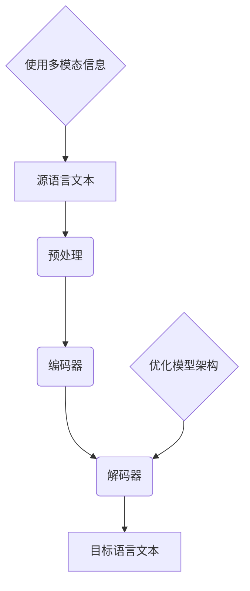
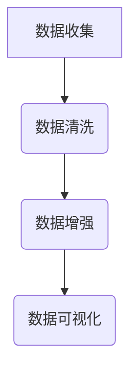
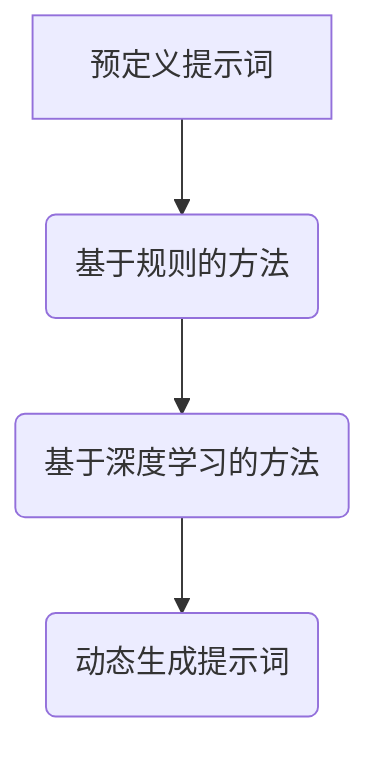
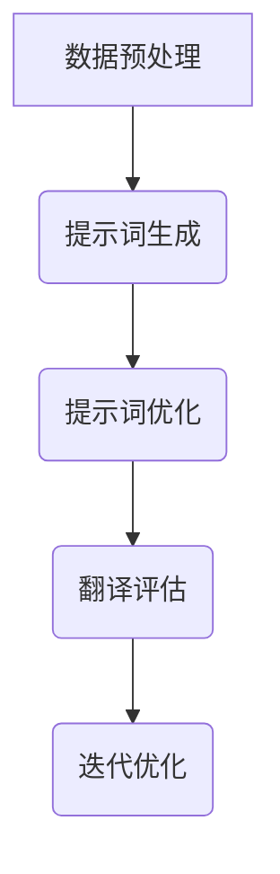

                 

## 文章标题：提示词工程在机器翻译质量提升中的应用

### 关键词：机器翻译，提示词工程，质量提升，算法优化，人工智能

> 摘要：本文探讨了提示词工程在机器翻译质量提升中的应用，通过对机器翻译的基本概念、提示词生成技术、提示词优化以及实际应用案例的详细分析，揭示了提示词工程如何通过提高翻译的准确性和流畅性来提升整体机器翻译质量。本文旨在为读者提供一个系统而全面的视角，深入理解提示词工程在机器翻译领域的重要性及其实现方法。

## 第一部分：机器翻译与提示词工程概述

### 第1章：机器翻译的基本概念

#### 1.1 机器翻译的起源与发展

机器翻译（Machine Translation，MT）的概念最早可以追溯到20世纪40年代。当时，随着计算机科学的兴起，人们开始探讨如何使用计算机来翻译语言。最初的尝试是基于规则的方法，即通过编写一系列的语法和语义规则来指导翻译过程。然而，这种方法在实践中遇到了巨大的困难，因为自然语言的处理远比编程规则复杂得多。

在20世纪60年代，统计机器翻译（Statistical Machine Translation，SMT）逐渐成为主流。统计机器翻译的核心思想是利用大量的双语文本来学习语言之间的对应关系，从而自动生成翻译结果。这一方法的出现极大地提高了翻译的准确性和效率。

到了21世纪初，基于深度学习的机器翻译（Neural Machine Translation，NMT）开始崛起。深度学习模型，特别是序列到序列（Sequence-to-Sequence，Seq2Seq）模型，通过学习输入和输出序列之间的映射关系，实现了更加自然和准确的翻译结果。

#### 1.2 机器翻译的分类

根据翻译的方法和策略，机器翻译可以分为以下几种类型：

- **基于规则的翻译（Rule-Based Translation，RBT）**：通过预先定义的语法和语义规则来指导翻译过程。
- **基于实例的翻译（Example-Based Translation，EBT）**：利用已有的翻译实例来指导新的翻译任务。
- **基于统计的翻译（Statistical Machine Translation，SMT）**：通过分析双语文本中的统计信息来生成翻译结果。
- **基于神经网络的翻译（Neural Machine Translation，NMT）**：使用深度学习模型，特别是序列到序列模型，来学习输入和输出序列之间的映射关系。

#### 1.3 提示词工程的作用与重要性

提示词工程（Prompt Engineering）是近年来兴起的一个研究领域，它专注于如何设计有效的提示词来引导机器翻译模型，从而提高翻译质量。提示词可以看作是翻译过程中的“向导”，它们提供必要的信息和上下文，帮助模型更好地理解和生成目标语言的翻译结果。

提示词工程的作用主要体现在以下几个方面：

1. **提高翻译准确性**：通过提供明确的翻译目标和上下文信息，提示词可以帮助模型更好地理解源语言句子，从而生成更准确的翻译结果。
2. **提高翻译流畅性**：提示词可以引导模型生成更加自然和流畅的翻译，减少机械式的翻译风格。
3. **优化翻译效率**：有效的提示词可以帮助模型更快地收敛到最佳翻译结果，提高翻译效率。

## 第二部分：提示词工程的核心方法

### 第2章：机器翻译的工作原理

#### 2.1 机器翻译的三种主要模型

在现代机器翻译中，基于神经网络的模型占据了主导地位。其中，三种主要的模型是：

1. **循环神经网络（RNN）**：RNN在处理序列数据时具有优势，但其在长序列上的性能和效果受到限制。
2. **长短期记忆网络（LSTM）**：LSTM是RNN的一种改进，能够更好地处理长序列数据，但计算复杂度较高。
3. **变换器网络（Transformer）**：Transformer是一种基于自注意力机制的深度学习模型，其在长序列处理和并行计算方面表现出色，成为当前最先进的机器翻译模型。

#### 2.2 提示词工程在机器翻译中的应用

提示词工程在机器翻译中的应用可以分为以下几个方面：

1. **预定义提示词**：通过预先定义好的提示词来引导翻译模型，这些提示词可以是关键词、短语或完整的句子，它们通常用于提供翻译的主题和背景信息。
2. **动态生成提示词**：基于源语言文本或用户交互信息动态生成的提示词，这些提示词可以根据不同的翻译任务和上下文进行定制，从而更好地引导模型生成高质量的翻译结果。

#### 2.3 机器翻译中的常见问题与解决方案

在机器翻译过程中，常见的问题包括：

1. **翻译不准确**：由于语言表达复杂多样，机器翻译模型可能无法准确理解源语言句子的含义。
2. **翻译流畅性差**：生成的目标语言句子可能存在语法错误或不自然的表达。
3. **翻译速度慢**：特别是对于长文本的翻译，传统机器翻译模型的计算复杂度较高，导致翻译速度慢。

针对这些问题，提示词工程提供了一些解决方案：

1. **使用明确的提示词**：通过提供明确的翻译目标和上下文信息，可以减少翻译模型在理解源语言句子时的歧义，从而提高翻译的准确性。
2. **优化模型架构**：使用更先进的机器翻译模型，如Transformer，可以提高翻译的流畅性和速度。
3. **结合多模态信息**：将图像、音频等多模态信息与文本信息结合，可以提供更丰富的上下文信息，从而改善翻译结果。

### Mermaid流程图：

## 第三部分：提示词工程的核心方法

### 第3章：数据预处理

#### 3.1 数据收集与清洗

数据预处理是提示词工程中至关重要的一步。高质量的数据是训练出优秀模型的基石。数据收集主要包括以下方面：

1. **双语文本数据集**：这是机器翻译中最基本的数据资源，包括两种语言的对应文本。
2. **多语言语料库**：包含多种语言的文本，可用于训练多语言翻译模型。
3. **社交媒体数据**：如Twitter、Facebook等平台上的文本数据，它们提供了丰富的现实语境和语言使用模式。

数据清洗的目的是去除数据中的噪声和错误，确保数据的质量。主要步骤包括：

1. **去除重复数据**：确保每个样本的唯一性。
2. **去除无效数据**：如广告、垃圾信息等。
3. **数据规范化**：统一不同来源的数据格式，如文本的编码方式、标点符号等。

#### 3.2 数据增强

数据增强是提高模型性能的有效手段。它通过增加数据的多样性来训练模型，从而提高模型的泛化能力。数据增强的方法包括：

1. **翻译对扩充**：通过将已有的翻译对进行随机替换或扰动，生成新的翻译对。
2. **句子级变换**：如词替换、词性转换、句子重排等，以增加句子的多样性。
3. **领域自适应**：通过将不同领域的文本数据进行适配，使得模型在特定领域上表现更好。

#### 3.3 数据可视化

数据可视化是理解和分析数据的重要工具。通过可视化技术，可以直观地展示数据的特点和分布。数据可视化在提示词工程中的应用主要包括：

1. **文本词云**：显示文本中高频词汇的分布，帮助识别文本的主题和重点。
2. **翻译对分布图**：展示不同语言之间的翻译关系，帮助发现潜在的翻译问题。
3. **模型性能指标图**：展示模型的翻译质量、准确率等指标，帮助评估和优化模型。

### Mermaid流程图：

### 第4章：提示词生成技术

#### 4.1 提示词的来源与分类

提示词的来源可以分为以下几种：

1. **预定义提示词**：这些提示词是在模型训练之前预先定义好的，它们通常是基于一些语言学知识和翻译经验设计的。例如，在翻译新闻文章时，可以使用“本文讨论了...”作为提示词。

2. **动态生成提示词**：这些提示词是基于源语言文本或用户输入动态生成的，它们可以根据具体的翻译任务和上下文进行定制。动态生成提示词可以通过自然语言处理技术，如命名实体识别、句法分析等，自动提取出关键信息。

#### 4.2 基于规则的方法

基于规则的方法是通过定义一系列的语法和语义规则来生成提示词。这种方法通常需要人工编写大量的规则，例如：

1. **词性匹配规则**：根据源语言句子中的词性来生成提示词。例如，如果源语言句子中有一个动词，那么提示词可能包含相应的动词形式。
2. **关键词提取规则**：根据源语言句子中的关键词来生成提示词。关键词可以是名词、动词、形容词等，它们通常对句子的含义起到关键作用。

#### 4.3 基于深度学习的方法

基于深度学习的方法是通过训练深度学习模型来自动生成提示词。这种方法不需要人工编写规则，而是通过大量的数据来学习生成提示词的规律。常见的深度学习模型包括：

1. **循环神经网络（RNN）**：RNN可以处理序列数据，并从序列中提取特征。通过训练RNN模型，可以自动生成与源语言句子相对应的提示词。
2. **变换器（Transformer）**：Transformer是一种基于自注意力机制的深度学习模型，它在处理长序列和并行计算方面表现出色。通过训练Transformer模型，可以生成更加丰富和多样化的提示词。

### Mermaid流程图：

### 第5章：提示词优化

#### 5.1 提示词质量评价

提示词质量评价是确保提示词有效性的关键步骤。评价方法可以分为定量评价和定性评价：

1. **定量评价**：通过计算一些量化指标来评价提示词的质量，如翻译准确率、流畅性评分等。常见的量化指标包括BLEU（基于字匹配的评分）、METEOR（基于词汇匹配和语义匹配的评分）等。
2. **定性评价**：通过人工评估来评价提示词的质量，这种方法通常依赖于评估者的主观判断和经验。定性评价可以更全面地考虑翻译的准确性、自然性和流畅性。

#### 5.2 提示词优化算法

提示词优化算法的目标是提高提示词的质量和翻译效果。以下是一些常用的优化算法：

1. **基于梯度的优化算法**：这类算法通过优化提示词的梯度来调整提示词的参数，从而提高提示词的质量。常用的算法包括随机梯度下降（SGD）和Adam优化器等。
2. **基于进化算法的优化**：进化算法是一种模拟生物进化的搜索算法，通过迭代优化来找到最优的提示词。常用的进化算法包括遗传算法（GA）和粒子群优化（PSO）等。
3. **基于对抗学习的优化**：对抗学习通过生成对抗网络（GAN）来优化提示词。GAN由生成器和判别器组成，生成器生成提示词，判别器评估提示词的质量。通过优化生成器和判别器的损失函数，可以生成高质量的提示词。

#### 5.3 提示词优化的实际应用

在实际应用中，提示词优化可以通过以下步骤进行：

1. **数据预处理**：对源语言文本进行预处理，包括分词、词性标注等，以便生成有效的提示词。
2. **提示词生成**：利用生成算法生成初步的提示词。
3. **提示词优化**：通过优化算法对提示词进行迭代优化，提高其质量。
4. **翻译评估**：利用定量和定性评价方法评估优化后的提示词在翻译任务中的效果。
5. **迭代优化**：根据评估结果对提示词进行进一步的优化，直到达到满意的翻译效果。

### Mermaid流程图：

## 第四部分：提升机器翻译质量

### 第6章：机器翻译质量评估

#### 6.1 评估指标与标准

机器翻译质量评估的关键在于选择合适的评估指标和标准。以下是一些常用的评估指标：

1. **BLEU（基于字匹配的评分）**：BLEU是最常用的评估指标之一，它通过比较机器翻译结果与参考翻译的相似度来评估翻译质量。BLEU的计算方法包括重叠率、句法多样性等。
2. **METEOR（基于词汇匹配和语义匹配的评分）**：METEOR结合了词汇匹配和语义匹配，通过计算翻译结果与参考翻译的词汇重叠度和语义相似度来评估翻译质量。
3. **NIST（国家标准技术研究所评分）**：NIST评分通过计算翻译结果与参考翻译的N-gram重叠度来评估翻译质量。
4. **TER（翻译错误率）**：TER通过计算翻译结果中的错误率来评估翻译质量。错误包括插入、删除和替换。

#### 6.2 评估方法与技术

评估方法可以分为手动评估和自动评估：

1. **手动评估**：由专业的翻译评估者对翻译结果进行评价，这种方法主观性较强，但能够提供更全面的评估。
2. **自动评估**：通过计算一些量化指标来评估翻译质量，如BLEU、METEOR等。自动评估方法客观性强，但可能无法完全反映翻译的细节。

#### 6.3 质量评估在实际项目中的应用

在实际项目中，质量评估用于以下几个关键步骤：

1. **模型训练与优化**：通过质量评估来评估模型的翻译质量，指导模型的优化和调整。
2. **产品发布**：在产品发布前，通过质量评估来确保翻译质量达到预期标准。
3. **用户反馈**：通过收集用户对翻译质量的反馈，进一步优化翻译模型和提示词。

### 第7章：提升机器翻译质量

#### 7.1 提高翻译准确性的方法

提高翻译准确性是提升机器翻译质量的重要目标。以下是一些常用的方法：

1. **增加高质量训练数据**：高质量的数据是训练出优秀模型的基石。通过收集和扩充高质量的双语数据集，可以提高模型的翻译准确性。
2. **利用知识增强**：通过引入外部知识库，如维基百科、专业词典等，可以增强模型的翻译能力，减少翻译错误。
3. **使用更强的模型架构**：采用更先进的深度学习模型，如BERT、GPT等，可以提升翻译的准确性。

#### 7.2 提高翻译流畅性的方法

翻译流畅性是提升机器翻译质量的关键因素。以下是一些提高流畅性的方法：

1. **优化提示词**：通过优化提示词的质量和多样性，可以提高翻译的流畅性。
2. **使用多模态信息**：结合文本以外的多模态信息，如图像、音频等，可以提供更丰富的上下文信息，从而提高翻译的流畅性。
3. **引入语言模型**：使用语言模型来生成更加自然和流畅的翻译结果。

#### 7.3 提高翻译速度的方法

提高翻译速度对于用户体验至关重要。以下是一些提高翻译速度的方法：

1. **优化算法**：通过优化翻译算法，减少计算复杂度和计算时间，可以提高翻译速度。
2. **分布式计算**：通过使用分布式计算和并行计算技术，可以将翻译任务分解为多个子任务，从而加速翻译过程。
3. **预翻译和缓存**：通过预翻译和缓存已翻译的文本，可以减少重复计算，提高翻译速度。

### 第8章：提示词工程在实际项目中的应用案例

#### 8.1 案例一：新闻翻译系统

新闻翻译系统是机器翻译的一个重要应用领域。通过使用提示词工程，可以提高新闻翻译的准确性和流畅性。以下是新闻翻译系统的具体应用案例：

1. **数据预处理**：收集和清洗大量的新闻数据，包括不同类型的新闻文章，如政治、经济、科技等。
2. **提示词生成**：利用命名实体识别技术，自动提取新闻文章中的关键词和命名实体，作为提示词。
3. **提示词优化**：通过迭代优化提示词，提高其质量和翻译效果。
4. **翻译评估**：使用BLEU、METEOR等评估指标对翻译结果进行评估，并根据评估结果进行进一步的优化。
5. **用户反馈**：收集用户的翻译反馈，用于改进提示词和翻译模型。

#### 8.2 案例二：电子商务翻译平台

电子商务翻译平台是另一个重要的应用领域。通过提示词工程，可以提高电子商务平台的国际化体验。以下是电子商务翻译平台的具体应用案例：

1. **数据预处理**：收集和清洗大量的电子商务数据，包括产品描述、用户评论等。
2. **提示词生成**：利用自然语言处理技术，自动提取产品描述和用户评论中的关键词和短语，作为提示词。
3. **提示词优化**：通过优化提示词的质量和多样性，提高翻译的准确性和流畅性。
4. **翻译评估**：使用BLEU、METEOR等评估指标对翻译结果进行评估，并根据评估结果进行进一步的优化。
5. **用户反馈**：收集用户的翻译反馈，用于改进提示词和翻译模型。

#### 8.3 案例三：多语种教育平台

多语种教育平台是提示词工程在教育领域的重要应用。通过使用提示词工程，可以提高多语种教育平台的教学效果。以下是多语种教育平台的具体应用案例：

1. **数据预处理**：收集和清洗大量的教学数据，包括课程描述、教学文本等。
2. **提示词生成**：利用自然语言处理技术，自动提取课程描述和教学文本中的关键词和短语，作为提示词。
3. **提示词优化**：通过优化提示词的质量和多样性，提高翻译的准确性和流畅性。
4. **翻译评估**：使用BLEU、METEOR等评估指标对翻译结果进行评估，并根据评估结果进行进一步的优化。
5. **用户反馈**：收集用户的翻译反馈，用于改进提示词和翻译模型。

## 第五部分：未来发展趋势与挑战

### 第9章：机器翻译的未来发展趋势

#### 9.1 大模型与提示词工程的发展方向

随着计算能力和数据量的不断提升，大模型（Large Models）在机器翻译领域的发展势不可挡。大模型能够处理更复杂的语言现象，提供更加准确和自然的翻译结果。未来，提示词工程将朝着以下几个方向发展：

1. **多模态提示词**：结合文本、图像、音频等多模态信息，生成更加丰富的提示词，以提高翻译的准确性和流畅性。
2. **自适应提示词**：基于用户的语言偏好和上下文环境，动态生成适应用户需求的提示词。
3. **多语言、多领域模型**：通过训练多语言和多领域的模型，提高模型在不同语言和领域上的泛化能力。

#### 9.2 跨语言信息检索与问答系统

跨语言信息检索（Cross-Language Information Retrieval，CLIR）和问答系统（Question Answering，QA）是机器翻译的重要应用方向。未来，提示词工程将致力于以下几个方面：

1. **跨语言语义理解**：通过理解不同语言之间的语义关系，提高跨语言信息检索和问答系统的准确性。
2. **多语言知识融合**：将多语言知识库融合到翻译模型中，提供更加准确和丰富的翻译结果。
3. **实时翻译与问答**：通过实时翻译和问答技术，实现跨语言实时沟通和信息交流。

#### 9.3 机器翻译在人工智能应用中的角色

随着人工智能技术的不断进步，机器翻译将在更多人工智能应用中发挥关键作用。未来，提示词工程将朝着以下几个方向发展：

1. **自动化翻译任务**：通过自动化技术，实现从翻译任务定义、数据预处理、翻译模型训练到翻译评估的全流程自动化。
2. **个性化翻译服务**：根据用户的需求和语言背景，提供个性化翻译服务，提高用户体验。
3. **智能翻译助手**：结合语音识别、自然语言处理等技术，开发智能翻译助手，实现多语言实时沟通。

### 第10章：提示词工程的挑战与机遇

#### 10.1 数据稀缺问题

数据稀缺是提示词工程面临的主要挑战之一。未来，提示词工程将致力于以下几个方面：

1. **数据扩充**：通过数据增强和生成技术，扩充高质量的双语数据集。
2. **跨语言数据共享**：建立多语言数据共享平台，促进数据资源的有效利用。
3. **无监督学习方法**：研究无监督学习算法，利用单一语言的文本数据训练翻译模型。

#### 10.2 可解释性与透明度

提示词工程的透明度和可解释性对于用户信任和应用推广至关重要。未来，提示词工程将致力于以下几个方面：

1. **模型解释技术**：研究模型解释技术，使模型决策过程更加透明和可解释。
2. **用户反馈机制**：建立用户反馈机制，收集用户对翻译结果的反馈，用于优化提示词和翻译模型。
3. **伦理与隐私**：在提示词工程中关注伦理和隐私问题，确保用户数据和隐私安全。

#### 10.3 多语言、多领域的翻译需求

随着全球化和跨文化交流的加深，多语言、多领域的翻译需求日益增长。未来，提示词工程将致力于以下几个方面：

1. **多语言支持**：开发支持多种语言翻译的模型，满足不同语言用户的需求。
2. **多领域适应性**：通过跨领域迁移学习和领域自适应技术，提高模型在不同领域上的翻译能力。
3. **跨语言知识融合**：将多语言知识库融合到翻译模型中，提供更加准确和丰富的翻译结果。

## 附录

### 附录A：提示词工程工具与资源

#### A.1 常用机器翻译工具

1. **Google Translate**：谷歌翻译是最常用的在线翻译工具，支持多种语言之间的翻译。
2. **DeepL Translator**：DeepL翻译器以其高质量和自然流畅的翻译结果而闻名，特别适合专业翻译。
3. **Apache Translate**：Apache Translate是一个开源的机器翻译平台，支持多种语言。

#### A.2 提示词生成工具

1. **Hugging Face Transformers**：Hugging Face提供了一个丰富的Transformer模型库，包括预训练模型和自定义模型，用于生成提示词。
2. **BERT Tokenizer**：BERT Tokenizer是一个用于处理BERT模型的分词工具，可用于生成提示词。
3. **Word2Vec**：Word2Vec是一个用于生成词向量的工具，可以用于生成基于词向量的提示词。

#### A.3 提示词优化工具

1. **PromptBuilder**：PromptBuilder是一个用于构建和优化提示词的工具，支持多种优化算法。
2. **PromptTuning**：PromptTuning是一种基于预训练模型的提示词优化方法，可以自动优化提示词。
3. **Data Augmentation Tools**：数据增强工具，如SynthText和DADA，可以用于生成和扩充训练数据。

### 作者信息：

作者：AI天才研究院/AI Genius Institute & 禅与计算机程序设计艺术 /Zen And The Art of Computer Programming

## 结语

本文详细探讨了提示词工程在机器翻译质量提升中的应用。通过分析机器翻译的基本概念、提示词工程的核心方法以及实际应用案例，我们展示了如何通过优化提示词来提高机器翻译的准确性和流畅性。随着人工智能技术的不断发展，提示词工程将继续在机器翻译领域发挥重要作用，为跨语言沟通和信息交流提供强有力的支持。

在未来的研究中，我们期待能够解决数据稀缺、可解释性等挑战，进一步提升机器翻译的质量和用户体验。同时，随着多模态信息处理和跨语言知识融合技术的发展，提示词工程将迎来更多的机遇和可能性。让我们共同期待这个充满前景的领域将带来的更多突破和创新。

