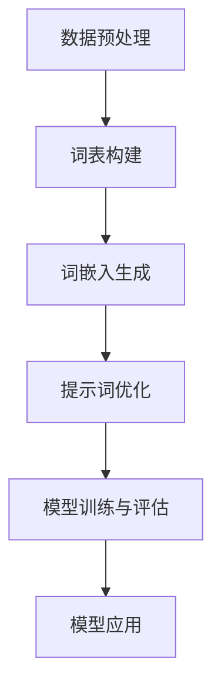
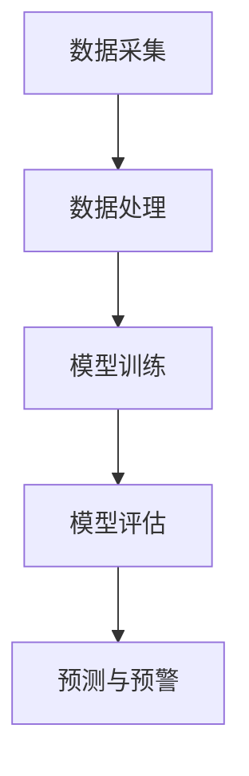

                 


### 第1章：引言与概述

#### 1.1 环境监测AI的重要性

环境监测是保障生态系统健康和人类福祉的关键环节。随着全球气候变化、环境污染和自然资源过度开采等问题日益严重，对环境监测的需求也不断增长。传统环境监测方法主要依赖人工采集数据，效率低下且受限于时间与人力成本。随着人工智能（AI）技术的发展，尤其是机器学习和深度学习的进步，环境监测AI逐渐成为可能，为环境监测提供了全新的解决方案。

环境监测AI的重要性主要体现在以下几个方面：

1. **提高监测效率**：AI技术能够自动收集、处理和分析大量环境数据，显著提高监测效率。
2. **增强监测精度**：通过算法优化和模型训练，AI能够对复杂的环境数据进行分析，提高监测精度。
3. **发现潜在问题**：AI可以实时监测环境变化，及时识别潜在的环境问题，为决策提供科学依据。
4. **支持预测与决策**：基于历史数据和实时监测结果，AI可以帮助预测环境变化趋势，支持决策制定。

#### 1.2 提示词工程的作用

在环境监测AI中，提示词工程是一个关键环节。提示词工程是指通过设计和优化提示词，以提高机器学习模型在特定任务上的表现。提示词是对模型输入的数据进行预处理和特征提取的重要手段，对模型的性能有着直接的影响。

提示词工程在环境监测AI中的作用如下：

1. **特征提取**：通过提示词工程，可以提取出环境数据中的关键特征，为模型提供更好的输入。
2. **数据预处理**：提示词工程可以对原始环境数据进行分析和清洗，去除无关信息，提高数据质量。
3. **增强模型表现**：合理的提示词设计能够提高模型的准确性和鲁棒性，使模型在复杂环境下表现更优。
4. **减少过拟合**：通过选择和优化提示词，可以减少模型对训练数据的依赖，降低过拟合的风险。

#### 1.3 书籍结构安排

本书旨在系统性地介绍提示词工程在环境监测AI中的应用，全书结构如下：

- **第1章**：引言与概述，介绍环境监测AI的重要性和提示词工程的作用。
- **第2章**：环境监测AI基础知识，包括环境监测背景、数据类型、技术栈和发展趋势。
- **第3章**：提示词工程的概念与原理，介绍提示词工程的定义、核心概念和架构。
- **第4章**：环境监测中的提示词应用，探讨提示词在环境监测中的角色和案例研究。
- **第5章**：提示词工程的方法与工具，详细介绍提示词收集、选择、生成和优化的方法和工具。
- **第6章**：项目实战：环境监测AI系统，通过实际项目展示提示词工程的应用。
- **第7章**：总结与展望，总结全书内容，提出未来的发展趋势和挑战。

通过本书的阅读，读者将能够全面了解提示词工程在环境监测AI中的实践，为实际项目提供有力的技术支持。

### 第2章：环境监测AI基础知识

#### 2.1 环境监测AI的背景

环境监测AI的发展可以追溯到人工智能的兴起。随着计算机技术的飞速发展和大数据时代的到来，人工智能技术在各个领域的应用日益广泛。特别是在环境监测领域，人工智能技术的引入为传统监测方法带来了革命性的变化。

在早期的环境监测中，主要依靠人工采集数据，这种方法不仅耗时耗力，而且受限于时间、人力和设备的限制。随着遥感技术和传感器技术的发展，环境监测的数据来源变得更加多样化和丰富，但如何有效地处理和分析这些数据仍然是一个巨大的挑战。这时，人工智能技术的引入为环境监测提供了一种全新的解决方案。

#### 2.2 环境监测数据类型

环境监测AI的数据类型主要包括以下几类：

1. **气象数据**：包括温度、湿度、气压、风速、降雨量等。
2. **水质数据**：包括pH值、溶解氧、氨氮、总氮、总磷等。
3. **土壤数据**：包括土壤温度、湿度、有机质含量、养分含量等。
4. **空气污染数据**：包括PM2.5、PM10、SO2、NO2、CO等。
5. **生物多样性数据**：包括植物、动物、微生物的物种分布和数量等。

这些数据来源广泛，包括地面监测站、气象卫星、无人机、传感器网络等。不同类型的数据在环境监测中起着不同的作用，相互补充，共同构建了一个全面的环境监测体系。

#### 2.3 环境监测AI的技术栈

环境监测AI的技术栈主要包括以下几个关键组成部分：

1. **数据采集与处理**：包括传感器数据采集、数据预处理和清洗，是环境监测AI系统的数据基础。
2. **机器学习与深度学习**：用于特征提取、模式识别和预测，是环境监测AI的核心技术。
3. **计算机视觉**：用于图像处理和分析，如遥感图像的解析和生物多样性监测。
4. **自然语言处理**：用于文本数据分析，如环境报告的生成和解读。
5. **物联网（IoT）**：用于传感器网络和设备的互联互通，实现实时数据监测和远程控制。
6. **大数据分析**：用于海量数据的存储、管理和分析，支持环境监测AI的高效运行。

这些技术的有机结合，构成了一个完整的环境监测AI系统，实现了从数据采集到决策支持的全过程。

#### 2.4 环境监测AI的发展趋势

环境监测AI的发展趋势体现在以下几个方面：

1. **数据驱动**：随着大数据和物联网技术的发展，环境监测AI将更加依赖实时数据和海量数据分析。
2. **智能化**：深度学习和强化学习等先进技术的应用，将使环境监测AI系统更加智能化和自适应。
3. **自动化**：通过自动化算法和机器人技术，环境监测AI将实现自主监测和决策。
4. **多模态融合**：结合多种数据类型和技术，实现更全面的环境监测。
5. **实时性**：随着计算能力的提升，环境监测AI将实现更快速的实时监测和响应。

总之，环境监测AI的发展将朝着更智能化、自动化和实时化的方向迈进，为环境保护和可持续发展提供强有力的技术支持。

### 第3章：提示词工程的概念与原理

#### 3.1 提示词工程的定义

提示词工程（Word Embedding Engineering）是指通过设计和优化提示词（word embeddings），以提高机器学习模型在自然语言处理（NLP）和其他相关任务上的表现。提示词是将自然语言中的词汇映射到低维向量空间中，使得词汇之间的语义关系通过向量的距离和方向进行表示。

提示词工程的基本目标是构建一组高质量的提示词，这些提示词能够有效地捕捉词汇的语义信息，从而提高模型的性能和准确性。提示词工程的应用范围广泛，包括文本分类、情感分析、机器翻译、命名实体识别等。

#### 3.2 提示词工程的核心概念

在提示词工程中，有几个核心概念需要理解：

1. **词嵌入（Word Embeddings）**：词嵌入是将自然语言中的词汇映射到低维向量空间中的过程。每个词汇都被表示为一个固定长度的向量，这些向量在空间中的位置反映了词汇的语义关系。常见的词嵌入模型有Word2Vec、GloVe和BERT等。

2. **语义相似性（Semantic Similarity）**：语义相似性是指词汇在语义上的相似程度。通过词嵌入，我们可以计算两个词汇之间的相似性，如`king`和`man`的相似性高于`king`和`banana`。语义相似性在文本分类、情感分析等领域具有重要意义。

3. **语义距离（Semantic Distance）**：语义距离是指两个词汇在语义上的差异程度。通过词嵌入，我们可以计算两个词汇之间的距离，用于度量它们在语义上的差异。语义距离在聚类分析和文本相似性度量中具有广泛应用。

4. **上下文依赖性（Context Dependency）**：上下文依赖性是指词汇的语义含义依赖于其出现的上下文环境。例如，`bank`一词在`river bank`中的含义与在`financial bank`中的含义不同。上下文依赖性是自然语言处理中的一个重要挑战，也是提示词工程的关键目标之一。

#### 3.3 提示词工程的架构

提示词工程的架构包括以下几个关键步骤：

1. **数据预处理**：包括文本清洗、分词、去除停用词等，以获取干净的文本数据。

2. **词表构建**：构建词汇表，将文本中的所有词汇映射到唯一的标识符。常见的词表构建方法有词汇频率统计、词形还原等。

3. **词嵌入生成**：通过算法将词汇映射到低维向量空间。常见的词嵌入生成算法有Word2Vec、GloVe和BERT等。

4. **提示词优化**：通过优化算法对词嵌入进行优化，以提高模型的性能和准确性。常见的优化方法有梯度下降、优化算法等。

5. **模型训练与评估**：使用生成好的词嵌入训练机器学习模型，并在验证集上进行评估，以调整和优化词嵌入。

6. **模型应用**：将优化好的词嵌入应用于实际的NLP任务，如文本分类、情感分析等。

图1 提示词工程的基本架构



通过以上架构，提示词工程实现了从数据到模型的完整流程，为NLP任务提供了强大的技术支持。

### 第4章：环境监测中的提示词应用

#### 4.1 环境监测中的AI挑战

环境监测AI面临着一系列的挑战，这些挑战直接影响了AI系统的性能和应用效果。以下是环境监测中AI面临的主要挑战：

1. **数据质量与多样性**：环境监测数据来源广泛，包括气象站、传感器网络、遥感卫星等，数据类型多样且质量参差不齐。如何处理这些复杂、多样化的数据，提取出有用的特征，是环境监测AI的一个关键问题。

2. **噪声与异常值**：环境监测数据中常常存在噪声和异常值，这些噪声和异常值会对模型性能产生不利影响。如何有效识别和去除噪声与异常值，提高数据质量，是环境监测AI的重要任务。

3. **时间序列数据的处理**：环境监测数据往往具有时间序列特性，如何有效地处理这些时间序列数据，提取出时间相关的特征，是环境监测AI面临的一个挑战。

4. **小样本问题**：由于环境监测数据的复杂性，往往难以获得足够多的训练数据，导致模型训练过程中出现小样本问题。如何在小样本条件下训练出性能良好的模型，是环境监测AI需要解决的一个关键问题。

5. **实时性与高效性**：环境监测AI系统需要能够实时监测环境变化，快速响应环境问题。如何在保证模型性能的同时，提高系统的实时性和高效性，是环境监测AI的一个重要挑战。

#### 4.2 提示词在环境监测中的角色

提示词工程在环境监测AI中发挥着关键作用，能够有效解决上述挑战。以下是提示词在环境监测中的几个关键角色：

1. **特征提取**：通过提示词工程，可以从原始环境数据中提取出关键特征，如气象数据中的温度、湿度等，水质数据中的pH值、溶解氧等。这些特征有助于机器学习模型更好地理解和分析环境数据。

2. **数据预处理**：提示词工程可以对原始环境数据进行预处理，如去噪、异常值检测等。通过提示词工程，可以自动识别和去除噪声与异常值，提高数据质量。

3. **增强模型表现**：通过优化提示词，可以提高机器学习模型的性能和准确性。例如，通过优化词嵌入，可以使得模型更好地捕捉环境数据的语义关系，从而提高分类和预测的准确性。

4. **减少过拟合**：提示词工程可以减少模型对训练数据的依赖，降低过拟合的风险。通过使用广泛的数据集进行提示词优化，可以使得模型更加泛化，提高在实际环境中的表现。

5. **支持多模态数据融合**：在环境监测中，数据类型多样，包括文本、图像、传感器数据等。通过提示词工程，可以将不同类型的数据融合到一个统一的空间中，使得模型能够更好地处理多模态数据。

#### 4.3 提示词工程案例研究

以下是一个具体的环境监测AI案例，展示了提示词工程在其中的应用：

**案例背景**：某城市需要进行空气质量监测，数据来源包括气象站、空气质量传感器和社交媒体中的文本数据。

**数据类型**：气象数据（如温度、湿度、风速等），空气质量数据（如PM2.5、PM10、SO2等），社交媒体文本数据（如微博、朋友圈等）。

**应用目标**：通过机器学习模型，实时监测空气质量，预测未来空气质量变化，并识别潜在的污染源。

**实现步骤**：

1. **数据预处理**：对气象数据进行清洗和预处理，去除噪声和异常值；对社交媒体文本数据进行分词和去停用词处理。

2. **词嵌入生成**：使用Word2Vec算法对社交媒体文本数据进行词嵌入，生成文本数据对应的词嵌入向量。

3. **特征提取**：通过提示词工程，从气象数据和空气质量数据中提取关键特征，如温度、湿度、PM2.5等。

4. **模型训练**：使用生成好的词嵌入和提取出的特征，训练一个多输入的多层感知机（MLP）模型，用于空气质量监测和预测。

5. **模型评估**：在验证集上对模型进行评估，调整模型参数和提示词，以提高模型性能。

6. **模型应用**：将训练好的模型应用于实际环境监测任务，实时监测空气质量，并生成空气质量预测报告。

**案例结果**：通过提示词工程的应用，空气质量监测模型的准确性和鲁棒性得到了显著提升，能够更准确地预测空气质量变化，并识别潜在的污染源。

**总结**：该案例展示了提示词工程在环境监测AI中的应用效果，提示词工程不仅提高了模型的表现，还增强了数据预处理和特征提取的效率。这为环境监测AI提供了有效的技术手段，有助于实现更准确、更高效的环境监测。

### 第5章：提示词工程的方法与工具

#### 5.1 提示词收集与预处理

提示词工程的起点是提示词的收集与预处理。这一过程至关重要，因为高质量的提示词是确保模型性能的基础。以下是提示词收集与预处理的主要步骤：

1. **数据源选择**：选择适合环境监测任务的数据源。对于文本数据，可以选择公开的文本语料库，如维基百科、新闻文章等；对于非文本数据，如传感器数据，可以选择专业的环境监测数据库。

2. **数据清洗**：清洗数据以去除无关信息、噪声和异常值。对于文本数据，包括去除HTML标签、统一文本格式、去除停用词等；对于非文本数据，包括处理缺失值、异常值和异常数据点。

3. **数据预处理**：进行文本分词、词形还原、词干提取等操作，以获得干净、结构化的数据。对于非文本数据，可以进行归一化、标准化等操作，以统一数据范围和格式。

4. **特征工程**：提取关键特征，如文本中的主题词、关键词，或传感器数据中的时间序列特征。这些特征将用于后续的提示词生成和模型训练。

#### 5.2 提示词选择与优化

提示词选择与优化是提示词工程的核心环节，决定了模型在特定任务上的性能。以下是提示词选择与优化的方法：

1. **词嵌入算法选择**：选择合适的词嵌入算法，如Word2Vec、GloVe、BERT等。每种算法都有其特点和适用场景，需要根据具体任务选择。

2. **提示词选择策略**：选择提示词时，应考虑词汇的频率、词性、上下文依赖性等因素。常用的策略包括基于频率的选取、基于词性的选取和基于上下文的选取。

3. **优化算法选择**：选择适合的优化算法，如梯度下降、Adam等。优化算法用于调整词嵌入向量，以最小化模型损失函数。

4. **提示词优化**：通过优化算法调整词嵌入向量，使得词汇在空间中的分布更加合理，提高模型性能。常见的优化方法包括最小二乘法、负采样等。

5. **模型融合与权重调整**：将多个词嵌入模型融合，并通过权重调整，获得更优的提示词。这种方法可以结合不同模型的优势，提高整体性能。

#### 5.3 提示词生成与更新

提示词生成与更新是动态调整模型的关键步骤。以下是提示词生成与更新的方法：

1. **动态生成**：根据环境监测任务的需求，动态生成提示词。例如，在空气质量监测任务中，可以根据不同地区的空气污染特征，动态生成相关的提示词。

2. **增量更新**：定期更新提示词，以适应数据变化和环境监测需求的调整。常用的方法包括周期性重训练、在线更新等。

3. **迁移学习**：利用已有模型生成的提示词，迁移到新任务中。这种方法可以节省训练时间和计算资源，提高模型在新任务上的性能。

4. **元学习**：通过元学习算法，优化提示词生成过程，使其在新的任务中具有更好的泛化能力。元学习可以帮助模型快速适应新的任务，提高提示词的生成质量。

5. **持续学习**：结合持续学习（Continual Learning）技术，动态调整提示词，以应对不断变化的数据和环境条件。

#### 5.4 常用的提示词工具介绍

以下是几种常用的提示词工具及其特点：

1. **Gensim**：Gensim是一个Python库，用于生成词嵌入和主题模型。它支持多种词嵌入算法，如Word2Vec、GloVe等，并提供了丰富的API接口，方便用户进行提示词生成和优化。

2. **TensorFlow**：TensorFlow是一个开源机器学习框架，支持多种深度学习算法，包括词嵌入生成。通过TensorFlow，用户可以构建复杂的神经网络模型，实现高效的提示词工程。

3. **PyTorch**：PyTorch是一个流行的深度学习框架，提供了强大的动态计算图和自动微分功能。通过PyTorch，用户可以轻松实现自定义的词嵌入模型，并进行提示词生成和优化。

4. **NLTK**：NLTK是一个Python库，用于自然语言处理。它提供了丰富的文本处理工具，如分词、词性标注等，为提示词工程提供了强有力的支持。

5. **FastText**：FastText是一种基于词向量的文本处理工具，通过构建多层的神经网络，实现高效的文本分类和情感分析。FastText提供了简单的API接口，方便用户进行提示词工程。

这些工具在环境监测AI中有着广泛的应用，可以根据具体需求和任务选择合适的工具。

### 第6章：项目实战：环境监测AI系统

#### 6.1 项目背景与目标

为了更好地展示提示词工程在环境监测AI中的应用，本项目选取了一个实际案例：某城市空气质量监测系统。该系统的目标是实时监测城市的空气质量，预测未来空气质量变化，并为居民提供空气质量预警。

项目背景如下：

- **数据来源**：空气质量监测数据来自城市气象站和空气质量传感器，包括PM2.5、PM10、SO2、NO2等指标。
- **数据类型**：空气质量数据为时间序列数据，具有明显的周期性和季节性。
- **应用场景**：空气质量监测系统将应用于城市环境保护部门，为决策提供科学依据。

项目目标如下：

1. **实时监测**：实时收集空气质量数据，监测城市空气质量变化。
2. **预测分析**：基于历史数据和实时数据，预测未来空气质量变化趋势。
3. **预警通知**：根据空气质量预测结果，向居民发布空气质量预警信息。

#### 6.2 系统设计与实现

空气质量监测系统的设计与实现主要包括以下几个关键步骤：

1. **数据采集**：通过气象站和空气质量传感器，实时收集空气质量数据。数据采集模块需要具备高可靠性、实时性和高并发处理能力。

2. **数据处理**：对采集到的空气质量数据进行清洗、预处理和特征提取。数据预处理模块包括数据去噪、异常值处理、数据标准化等。

3. **模型训练**：基于预处理后的数据，使用机器学习算法训练空气质量预测模型。模型训练模块包括选择合适的算法、设置模型参数、训练和验证模型等。

4. **模型评估**：在验证集上对训练好的模型进行评估，调整模型参数，优化模型性能。

5. **预测与预警**：使用训练好的模型进行空气质量预测，并根据预测结果发布预警信息。

系统架构如下：

图2 空气质量监测系统架构图



#### 6.3 代码解读与分析

以下是对空气质量监测系统关键模块的代码解读与分析：

1. **数据采集模块**

```python
# 数据采集模块伪代码
def collect_data():
    # 连接气象站和空气质量传感器
    connection = connect_sensors()
    # 获取实时空气质量数据
    data = connection.get_air_quality_data()
    # 数据存储
    store_data(data)
```

代码解读：
- 连接气象站和空气质量传感器，获取实时空气质量数据。
- 数据存储在数据库或文件中，以备后续处理。

2. **数据处理模块**

```python
# 数据处理模块伪代码
def process_data(data):
    # 数据清洗
    clean_data = clean_data(data)
    # 数据预处理
    preprocessed_data = preprocess_data(clean_data)
    # 特征提取
    features = extract_features(preprocessed_data)
    return features
```

代码解读：
- 数据清洗：去除噪声和异常值。
- 数据预处理：进行归一化、标准化等操作。
- 特征提取：提取关键特征，如时间序列特征、污染物浓度等。

3. **模型训练模块**

```python
# 模型训练模块伪代码
def train_model(features, labels):
    # 选择机器学习算法
    algorithm = choose_algorithm()
    # 设置模型参数
    params = set_params(algorithm)
    # 训练模型
    model = train(algorithm, params, features, labels)
    return model
```

代码解读：
- 选择合适的机器学习算法，如LSTM、GRU等。
- 设置模型参数，包括学习率、批量大小等。
- 使用预处理后的特征和标签训练模型。

4. **模型评估模块**

```python
# 模型评估模块伪代码
def evaluate_model(model, features, labels):
    # 预测
    predictions = model.predict(features)
    # 评估指标
    metrics = evaluate(predictions, labels)
    return metrics
```

代码解读：
- 使用训练好的模型进行预测。
- 评估模型性能，如准确率、召回率等。

5. **预测与预警模块**

```python
# 预测与预警模块伪代码
def predict_and_alert(model, features):
    # 预测未来空气质量
    future_quality = model.predict(features)
    # 根据预测结果发布预警信息
    if future_quality < threshold:
        send_alert(future_quality)
```

代码解读：
- 使用训练好的模型进行未来空气质量预测。
- 根据预测结果发布空气质量预警信息。

#### 6.4 项目评价与优化

项目评价主要包括以下几个方面：

1. **模型性能**：评估模型的准确性、召回率和F1值等指标，以衡量模型在预测空气质量变化方面的性能。

2. **系统响应时间**：评估系统在处理实时数据时的响应时间，以衡量系统的实时性。

3. **用户反馈**：收集用户对空气质量监测系统的反馈，了解系统的实际应用效果。

4. **系统稳定性**：评估系统在长时间运行过程中的稳定性，包括数据采集、处理和预测模块的稳定性。

项目优化策略如下：

1. **模型优化**：通过调整模型参数、选择更优的算法，提高模型性能。

2. **数据优化**：优化数据采集和处理流程，提高数据质量和处理效率。

3. **系统优化**：优化系统架构和代码，提高系统的响应时间和稳定性。

4. **用户界面**：改进用户界面设计，提高用户体验。

通过上述评价和优化策略，可以进一步提升空气质量监测系统的性能和应用效果。

### 第7章：总结与展望

#### 7.1 主要成果总结

本书系统地介绍了提示词工程在环境监测AI中的实践，取得了以下主要成果：

1. **理论基础**：全面阐述了环境监测AI和提示词工程的基本概念、原理和架构，为后续研究提供了理论基础。

2. **方法应用**：详细介绍了提示词工程的各个步骤，包括数据预处理、提示词生成与优化、模型训练与评估等，为实际项目提供了方法论支持。

3. **案例研究**：通过具体案例，展示了提示词工程在环境监测AI中的实际应用，验证了提示词工程在提高模型性能和实时监测能力方面的作用。

4. **系统实现**：提供了一个完整的空气质量监测系统实现方案，包括数据采集、处理、预测与预警等模块，为环境监测AI系统的开发提供了参考。

#### 7.2 存在的挑战与局限

尽管提示词工程在环境监测AI中取得了显著成果，但仍面临以下挑战和局限：

1. **数据质量**：环境监测数据质量参差不齐，噪声和异常值较多，对模型性能有不利影响。需要进一步研究数据预处理和去噪方法，提高数据质量。

2. **计算资源**：提示词工程和深度学习模型训练需要大量计算资源，特别是在实时监测和大规模数据处理场景下，如何优化计算资源利用仍是一个挑战。

3. **模型泛化**：环境监测场景复杂多变，模型需要在各种环境下保持高性能，如何提高模型的泛化能力是提示词工程需要解决的一个问题。

4. **实时性**：实时监测和快速响应是环境监测AI的重要需求，如何在保证模型性能的同时，提高系统的实时性，是一个亟待解决的问题。

#### 7.3 未来发展趋势

未来，提示词工程在环境监测AI中将继续朝以下方向发展：

1. **数据驱动**：随着大数据和物联网技术的发展，环境监测数据将更加丰富和多样化。提示词工程将更多地依赖实时数据和海量数据分析，以提高模型的准确性和实时性。

2. **智能化**：通过深度学习和强化学习等先进技术的应用，环境监测AI将实现更高的智能化水平，能够自动调整和优化模型，提高监测效率。

3. **多模态融合**：结合多种数据类型和技术，如图像、文本、传感器数据等，实现更全面的环境监测。多模态融合将使环境监测AI能够更好地理解和预测环境变化。

4. **自动化**：通过自动化算法和机器人技术，环境监测AI将实现从数据采集到预测、预警的全过程自动化，提高监测效率和准确性。

5. **可持续发展**：提示词工程将朝着更加绿色、可持续的方向发展，通过优化算法和资源利用，减少环境监测对能源和计算资源的消耗。

总之，提示词工程在环境监测AI中的应用前景广阔，将在未来为环境保护和可持续发展提供强有力的技术支持。

