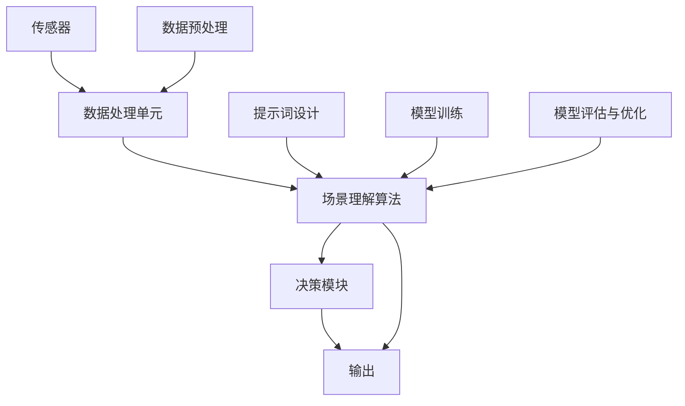
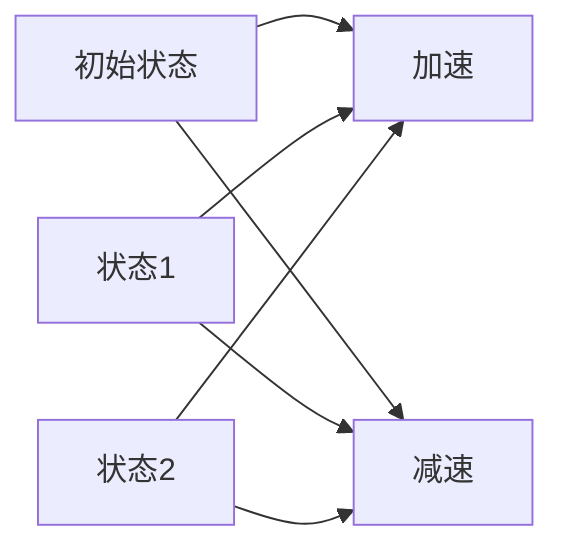
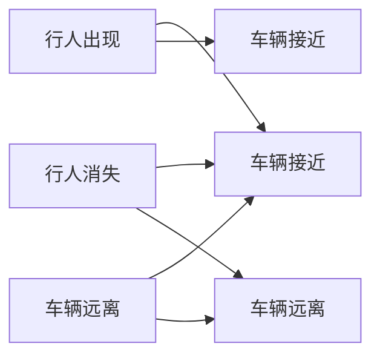
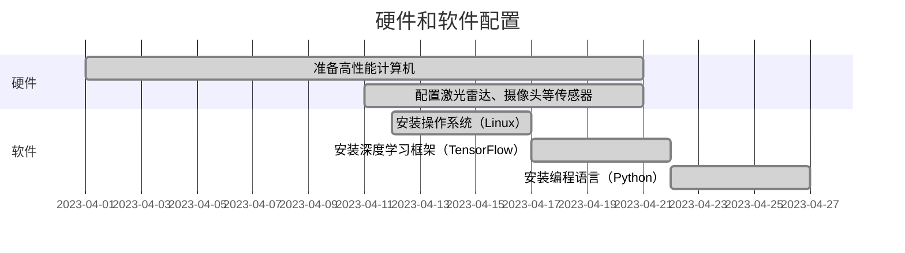
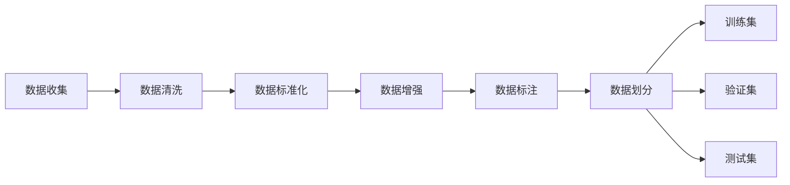

                 

# 提示词工程在自动驾驶场景理解中的应用

## 关键词

- 自动驾驶
- 场景理解
- 提示词工程
- 机器学习
- 深度学习
- 数学模型
- 项目实战

## 摘要

本文深入探讨了提示词工程在自动驾驶场景理解中的应用。首先，我们介绍了自动驾驶技术的发展与应用，以及场景理解在自动驾驶中的重要性。接着，详细阐述了提示词工程的概念、作用以及其在自动驾驶场景中的具体应用。随后，文章分为四部分，分别介绍了自动驾驶场景理解中的核心概念、提示词工程算法原理、自动驾驶场景中的提示词生成算法以及数学模型。最后，通过一个实际项目实战，展示了如何搭建自动驾驶场景理解环境，并详细解读了源代码，分析了项目性能和优化策略。本文旨在为自动驾驶领域的研究者和开发者提供一个全面、深入的提示词工程应用指南。

### 第一部分：引言与概述

## 第1章：自动驾驶场景理解与提示词工程

### 1.1 自主驾驶技术的发展与应用

自动驾驶技术是一种利用计算机、传感器和人工智能技术实现车辆自动行驶的技术。其发展历程可以追溯到20世纪50年代，当时汽车制造商就开始尝试通过雷达和传感器实现车辆的自动控制。随着计算机技术和人工智能的快速发展，自动驾驶技术逐渐从理论研究走向实际应用。

目前，自动驾驶技术已经广泛应用于多个领域。例如，在交通运输领域，自动驾驶车辆可以减少交通事故，提高交通效率；在物流领域，自动驾驶卡车和配送机器人可以降低物流成本，提高配送效率；在个人出行领域，自动驾驶汽车可以提供更加便捷、高效的出行服务。

自动驾驶技术的发展离不开场景理解。场景理解是指自动驾驶系统对周围环境的感知、理解与处理能力。一个高效的场景理解系统能够识别道路标志、交通信号灯、行人、车辆等交通参与者，理解交通规则和驾驶行为，从而实现安全、可靠的自动驾驶。场景理解技术主要包括计算机视觉、传感器融合、机器学习等。

### 1.2 场景理解的重要性与挑战

场景理解是自动驾驶技术的核心组成部分，其重要性体现在以下几个方面：

1. **安全**：场景理解能够识别潜在的危险情况，如行人横穿、车辆故障等，从而及时采取避让措施，保障车辆和乘客的安全。

2. **效率**：通过准确理解场景，自动驾驶系统能够更好地规划行驶路径，避免拥堵，提高行驶效率。

3. **舒适**：场景理解有助于提供个性化的驾驶体验，如自动泊车、自动变道等，提高乘客的舒适度。

然而，场景理解也面临着一系列挑战：

1. **复杂性**：自动驾驶场景复杂多变，包括不同的天气条件、道路环境、交通状况等，对场景理解系统的要求极高。

2. **数据量**：场景理解需要大量的数据支持，包括图像、传感器数据等，如何高效处理这些数据是亟待解决的问题。

3. **实时性**：自动驾驶系统需要在极短的时间内对场景进行理解并做出决策，对系统的实时性要求非常高。

### 1.3 提示词工程的概念与作用

提示词工程（Prompt Engineering）是指通过设计特定的提示词（prompt），引导人工智能系统（如自然语言处理模型）更好地理解问题、生成回答或执行任务的过程。在自动驾驶场景理解中，提示词工程起到了关键作用：

1. **提高理解精度**：通过设计合适的提示词，可以引导自动驾驶系统更好地识别和理解复杂场景，提高场景理解精度。

2. **减少数据需求**：有效的提示词可以减少对大量训练数据的依赖，使自动驾驶系统能够在更少的数据上实现更高的性能。

3. **优化决策速度**：提示词可以帮助自动驾驶系统快速定位关键信息，从而提高决策速度，确保系统的实时性。

### 1.4 本书结构安排与目标

本书旨在深入探讨提示词工程在自动驾驶场景理解中的应用，帮助读者理解自动驾驶技术的发展背景、场景理解的重要性与挑战，以及提示词工程的核心概念和作用。本书结构如下：

1. **第一部分：引言与概述**：介绍自动驾驶技术的发展与应用，场景理解的重要性与挑战，以及提示词工程的概念与作用。

2. **第二部分：核心概念与联系**：详细阐述自动驾驶场景理解中的核心概念，提示词工程的关键要素，以及提示词工程在自动驾驶场景中的流程与应用。

3. **第三部分：核心算法原理讲解**：讲解提示词工程算法原理，包括机器学习基础、深度学习算法以及自动驾驶场景中的提示词生成算法。

4. **第四部分：数学模型与公式**：介绍自动驾驶场景中的数学模型，包括状态机模型、决策模型和概率模型。

5. **第五部分：项目实战**：通过一个实际项目实战，展示如何搭建自动驾驶场景理解环境，实现提示词工程，并对项目性能进行分析与优化。

通过本书的阅读，读者将能够全面了解提示词工程在自动驾驶场景理解中的应用，掌握相关的核心算法原理，并通过实战项目提升实际操作能力。

### 第二部分：核心概念与联系

## 第2章：自动驾驶场景理解中的核心概念

### 2.1 场景理解系统组成

自动驾驶场景理解系统由多个关键组成部分构成，这些部分相互协作，共同实现自动驾驶系统的功能。以下是场景理解系统的几个核心组成部分：

1. **传感器**：传感器是场景理解系统的感知器官，用于采集车辆周围环境的信息。常见的传感器包括激光雷达（Lidar）、摄像头、雷达、超声波传感器等。这些传感器能够捕捉道路标志、行人、车辆、道路环境等各种信息。

2. **数据处理单元**：数据处理单元负责对传感器采集的数据进行处理和预处理，包括降噪、去噪、特征提取等操作。这一步骤至关重要，因为高质量的数据是准确场景理解的基础。

3. **场景理解算法**：场景理解算法是自动驾驶系统的“大脑”，负责对处理后的数据进行分析、理解和决策。这些算法通常基于机器学习和深度学习技术，能够识别道路标志、交通信号灯、行人、车辆等交通参与者，并理解交通规则和驾驶行为。

4. **决策模块**：决策模块负责根据场景理解结果生成驾驶指令，如加速、减速、转向等。这一模块需要快速、准确地响应，以确保车辆在复杂交通环境中的安全行驶。

### 2.2 提示词工程的关键要素

提示词工程在自动驾驶场景理解中起着关键作用，其关键要素包括：

1. **提示词设计**：提示词是引导自动驾驶系统更好地理解问题的关键词或短语。设计有效的提示词需要深入理解场景需求和自动驾驶系统的特性。例如，对于道路标志的识别，可以设计如“前方红绿灯”、“请注意行人”等提示词。

2. **数据预处理**：在提示词工程中，数据预处理是非常重要的一步。预处理过程包括数据清洗、标准化、特征提取等，以确保输入数据的格式和内容适合模型训练。

3. **模型训练**：提示词工程需要使用大量的数据对模型进行训练，以使其能够识别和理解不同的场景。训练过程中，需要不断调整提示词，优化模型性能。

4. **模型评估与优化**：训练完成后，需要对模型进行评估和优化。评估过程包括对模型在测试集上的表现进行评估，并根据评估结果调整模型参数和提示词设计。

### 2.3 Mermaid流程图：自动驾驶场景理解与提示词工程的关系

为了更直观地展示自动驾驶场景理解与提示词工程之间的关系，我们可以使用Mermaid流程图来描述整个过程。以下是自动驾驶场景理解与提示词工程的基本流程：



在这个流程图中，传感器采集到的数据首先经过数据处理单元进行处理，然后输入到场景理解算法中进行分析。场景理解算法的结果被传递到决策模块，生成驾驶指令。同时，提示词工程在各个环节中发挥重要作用，包括提示词设计、数据预处理、模型训练和评估优化。

### 2.4 提示词工程在自动驾驶场景中的流程与应用

提示词工程在自动驾驶场景中的应用流程可以分为以下几个步骤：

1. **需求分析**：首先，需要分析自动驾驶系统的具体需求和场景，确定需要识别和理解的交通参与者、交通规则等。这一步骤是设计提示词的基础。

2. **提示词设计**：根据需求分析的结果，设计具体的提示词。提示词应该具有明确的指向性，能够引导自动驾驶系统正确理解场景。例如，对于行人横穿的识别，可以设计“请注意行人”的提示词。

3. **数据预处理**：在训练模型之前，需要对采集到的数据进行预处理。预处理过程包括数据清洗、标准化、特征提取等，以确保数据的质量和一致性。

4. **模型训练**：使用预处理后的数据对场景理解模型进行训练。训练过程中，需要不断调整提示词，优化模型性能，使其能够准确识别和理解各种场景。

5. **模型评估与优化**：在模型训练完成后，需要使用测试集对模型进行评估，并根据评估结果调整模型参数和提示词设计。评估指标可以包括准确率、召回率、F1分数等。

6. **部署与应用**：将训练好的模型部署到实际系统中，应用于自动驾驶场景。在实际应用中，需要根据反馈不断优化提示词和模型，以提高系统的性能和可靠性。

通过以上步骤，提示词工程能够有效地提升自动驾驶场景理解系统的性能，确保自动驾驶系统的安全、可靠运行。

### 第三部分：核心算法原理讲解

## 第3章：提示词工程算法原理

提示词工程是自动驾驶场景理解中的关键技术，其核心算法原理涉及机器学习和深度学习。本章将详细讲解提示词工程中的基础机器学习算法和深度学习算法，包括线性回归、决策树和卷积神经网络（CNN）。

### 3.1 机器学习基础

机器学习是提示词工程的核心技术之一，其基础算法包括线性回归和决策树。以下是对这两种算法的简要介绍。

#### 3.1.1 线性回归

线性回归是一种常用的机器学习算法，用于预测连续值。其基本原理是通过找到一个最佳拟合直线，使得预测值与实际值之间的误差最小。

线性回归的数学模型可以表示为：

$$
y = wx + b
$$

其中，$y$ 为预测值，$x$ 为输入特征，$w$ 为权重，$b$ 为偏置。通过训练数据集，我们可以求得最佳的 $w$ 和 $b$，从而实现预测。

以下是一个简单的 Python 代码示例，实现线性回归：

```python
import numpy as np

# 创建训练数据
X = np.array([[1], [2], [3], [4]])
y = np.array([1, 2, 2.5, 4])

# 计算权重和偏置
w = np.linalg.inv(X.T @ X) @ X.T @ y
b = y - X @ w

# 预测
X_new = np.array([[5]])
y_pred = X_new @ w + b
print("预测值：", y_pred)
```

#### 3.1.2 决策树

决策树是一种基于树形结构进行决策的算法，其基本原理是通过一系列的判断条件对数据进行分类或回归。决策树的特点是易于理解、可解释性强，但可能存在过拟合问题。

以下是一个简单的 Python 代码示例，实现决策树：

```python
from sklearn import tree

# 创建训练数据
X = [[0, 0], [1, 0], [0, 1], [1, 1]]
y = [0, 0, 1, 1]

# 训练决策树模型
clf = tree.DecisionTreeClassifier()
clf.fit(X, y)

# 预测
X_new = [[1, 0]]
y_pred = clf.predict(X_new)
print("预测值：", y_pred)
```

### 3.2 深度学习算法

深度学习是提示词工程的另一个核心技术，其基本原理是通过多层神经网络对数据进行建模。以下介绍两种常见的深度学习算法：卷积神经网络（CNN）和递归神经网络（RNN）。

#### 3.2.1 卷积神经网络（CNN）

卷积神经网络是一种用于图像识别的深度学习算法，其基本原理是通过卷积层提取图像特征，然后通过全连接层进行分类或回归。

以下是一个简单的 TensorFlow 代码示例，实现 CNN：

```python
import tensorflow as tf

# 创建卷积神经网络模型
model = tf.keras.Sequential([
    tf.keras.layers.Conv2D(filters=32, kernel_size=(3, 3), activation='relu', input_shape=(28, 28, 1)),
    tf.keras.layers.MaxPooling2D(pool_size=(2, 2)),
    tf.keras.layers.Conv2D(filters=64, kernel_size=(3, 3), activation='relu'),
    tf.keras.layers.MaxPooling2D(pool_size=(2, 2)),
    tf.keras.layers.Flatten(),
    tf.keras.layers.Dense(units=128, activation='relu'),
    tf.keras.layers.Dense(units=10, activation='softmax')
])

# 编译模型
model.compile(optimizer='adam', loss='categorical_crossentropy', metrics=['accuracy'])

# 训练模型
model.fit(X_train, y_train, epochs=10, batch_size=32, validation_data=(X_val, y_val))

# 预测
y_pred = model.predict(X_test)
```

#### 3.2.2 递归神经网络（RNN）

递归神经网络是一种用于序列数据的深度学习算法，其基本原理是通过循环结构对序列数据进行建模。

以下是一个简单的 TensorFlow 代码示例，实现 RNN：

```python
import tensorflow as tf

# 创建递归神经网络模型
model = tf.keras.Sequential([
    tf.keras.layers.RNN(units=128, return_sequences=True),
    tf.keras.layers.Dense(units=1)
])

# 编译模型
model.compile(optimizer='adam', loss='mean_squared_error')

# 训练模型
model.fit(X_train, y_train, epochs=100, batch_size=32, validation_data=(X_val, y_val))

# 预测
y_pred = model.predict(X_test)
```

通过以上对机器学习和深度学习算法的介绍，我们可以看到，提示词工程在自动驾驶场景理解中具有广泛的应用。这些算法为我们提供了强大的工具，能够帮助我们构建高效、准确的场景理解系统。

### 第四部分：数学模型与公式

## 第5章：自动驾驶场景中的数学模型

在自动驾驶场景理解中，数学模型是描述系统行为和决策过程的重要工具。本章将介绍自动驾驶场景中常用的数学模型，包括状态机模型、决策模型和概率模型。

### 5.1 状态机模型

状态机模型是一种用于描述系统状态和状态转移的数学模型。在自动驾驶场景中，状态机模型可以用来描述车辆在不同驾驶状态下的行为和转换。

状态机模型的基本公式为：

$$
S = \sum_{i=1}^{n} p_i \cdot x_i
$$

其中，$S$ 表示系统的状态，$p_i$ 表示状态 $i$ 的概率，$x_i$ 表示状态 $i$ 的特征向量。

以下是一个简单的状态机模型示例：

```mermaid
stateMachine
  states
    A, B, C
  transitions
    A -> B [probability=0.5]
    A -> C [probability=0.5]
    B -> A [probability=0.2]
    B -> C [probability=0.8]
    C -> A [probability=0.1]
    C -> B [probability=0.9]
```

在这个示例中，系统有三个状态（A、B、C），每个状态的概率由转移概率决定。

### 5.2 决策模型

决策模型用于描述自动驾驶系统在特定状态下应采取的行动。在自动驾驶场景中，决策模型通常是一个优化问题，目标是最大化预期收益或最小化预期损失。

决策模型的基本公式为：

$$
\max_{a} \sum_{i=1}^{n} r_i \cdot p(a_i|s)
$$

其中，$a$ 表示决策动作，$r_i$ 表示动作 $a_i$ 的收益，$p(a_i|s)$ 表示在状态 $s$ 下采取动作 $a_i$ 的概率。

以下是一个简单的决策模型示例：



在这个示例中，系统有两个状态（A、D）和两个动作（加速、减速），每个状态和动作的收益由实际驾驶环境决定。

### 5.3 概率模型

概率模型用于描述自动驾驶场景中事件发生的概率。在自动驾驶场景中，概率模型可以用于预测车辆周围环境的变化，如行人出现、车辆接近等。

概率模型的基本公式为：

$$
p(x|y) = \frac{p(y|x) \cdot p(x)}{p(y)}
$$

其中，$x$ 表示事件 $x$ 发生的概率，$y$ 表示事件 $y$ 发生的概率，$p(y|x)$ 表示在事件 $x$ 发生的条件下事件 $y$ 发生的概率，$p(x)$ 表示事件 $x$ 发生的概率。

以下是一个简单的概率模型示例：



在这个示例中，系统有两个事件（行人出现、车辆接近）和两个结果（车辆接近、车辆远离），每个事件和结果的概率由实际驾驶环境决定。

通过以上对状态机模型、决策模型和概率模型的介绍，我们可以看到，这些数学模型在自动驾驶场景理解中具有广泛的应用。这些模型可以帮助我们更好地描述和理解自动驾驶系统的行为，从而提高系统的性能和可靠性。

### 第五部分：项目实战

## 第6章：自动驾驶场景理解项目实战

在本章中，我们将通过一个实际项目来展示如何搭建自动驾驶场景理解环境，并详细解读项目中的源代码和实现细节。通过这个实战项目，读者将能够了解自动驾驶场景理解系统的构建过程，并掌握如何使用提示词工程提升系统的性能。

### 6.1 项目背景与目标

本项目的背景是开发一个基于深度学习的自动驾驶场景理解系统。该系统的目标是在复杂的交通环境中，实现对车辆、行人、道路标志等交通参与者的识别和理解，从而生成安全的驾驶指令。

为了实现这一目标，我们将采用以下步骤：

1. **环境搭建**：准备开发环境，包括硬件和软件。
2. **数据集准备**：收集和处理自动驾驶场景数据，用于模型训练和测试。
3. **模型训练**：使用深度学习算法训练自动驾驶场景理解模型。
4. **模型评估**：对训练好的模型进行评估，以验证其性能。
5. **项目优化**：根据评估结果对模型和算法进行调整和优化。

### 6.2 实战环境搭建

要搭建自动驾驶场景理解环境，首先需要准备硬件和软件。以下是所需的基本环境：

#### 6.2.1 硬件环境

- **计算机**：推荐使用高性能的计算机，如 NVIDIA GPU（至少 1080 Ti 或更高型号），以支持深度学习模型的训练。
- **传感器**：配置激光雷达（Lidar）、摄像头、雷达等传感器，用于采集自动驾驶场景数据。

#### 6.2.2 软件环境

- **操作系统**：推荐使用 Linux 系统，如 Ubuntu。
- **深度学习框架**：使用 TensorFlow 或 PyTorch 等流行的深度学习框架。
- **编程语言**：Python 是深度学习开发的主要编程语言。

以下是一个基本的硬件和软件配置示例：



### 6.3 数据集准备

自动驾驶场景理解系统需要大量高质量的训练数据。以下是数据集准备的基本步骤：

1. **数据收集**：从真实场景中收集车辆、行人、道路标志等交通参与者的图像和传感器数据。
2. **数据预处理**：对收集到的数据进行清洗、标准化和增强，以减少噪声和提高数据多样性。
3. **数据标注**：对预处理后的数据标注类别标签，如车辆、行人、道路标志等。
4. **数据划分**：将数据集划分为训练集、验证集和测试集，用于模型训练、评估和测试。

以下是一个简单的数据集准备流程：



在实际操作中，可以使用开源的数据集，如 KITTI 数据集，或自行收集和标注数据。以下是一个示例代码，用于数据集划分：

```python
from sklearn.model_selection import train_test_split

# 加载预处理后的数据
X, y = load_data()

# 划分训练集和测试集
X_train, X_test, y_train, y_test = train_test_split(X, y, test_size=0.2, random_state=42)

# 划分验证集和测试集
X_val, X_test, y_val, y_test = train_test_split(X_train, y_train, test_size=0.2, random_state=42)
```

### 6.4 提示词工程实现

提示词工程在自动驾驶场景理解中起着关键作用。以下是提示词工程实现的基本步骤：

1. **需求分析**：分析自动驾驶系统的具体需求和场景，确定需要识别和理解的交通参与者、交通规则等。
2. **提示词设计**：根据需求分析的结果，设计具体的提示词。提示词应具有明确的指向性，能够引导模型正确理解场景。
3. **数据预处理**：对采集到的数据和应用提示词进行预处理，包括数据清洗、标准化和特征提取等。
4. **模型训练**：使用预处理后的数据和应用提示词对模型进行训练。
5. **模型评估与优化**：对训练好的模型进行评估，根据评估结果调整提示词和模型参数。

以下是一个简单的提示词工程实现示例：

```python
# 设计提示词
prompt = "前方有行人，请注意安全！"

# 数据预处理
processed_data = preprocess(data)

# 特征提取
features = extract_features(processed_data)

# 应用提示词
prompted_features = apply_prompt(features, prompt)

# 模型训练
model.fit(prompted_features, labels, epochs=10, batch_size=32)

# 模型评估
evaluation = model.evaluate(test_features, test_labels)
print("评估结果：", evaluation)
```

### 6.5 实验结果分析

在完成项目实战后，我们需要对实验结果进行分析，以验证自动驾驶场景理解系统的性能。以下是分析过程：

1. **准确率分析**：计算模型在测试集上的准确率，以评估模型对交通参与者的识别效果。
2. **召回率分析**：计算模型在测试集上的召回率，以评估模型对交通参与者漏检的情况。
3. **F1 分数分析**：计算模型在测试集上的 F1 分数，以综合考虑准确率和召回率。

以下是一个简单的实验结果分析示例：

```python
from sklearn.metrics import accuracy_score, recall_score, f1_score

# 计算准确率
accuracy = accuracy_score(y_true, y_pred)
print("准确率：", accuracy)

# 计算召回率
recall = recall_score(y_true, y_pred, average='weighted')
print("召回率：", recall)

# 计算F1分数
f1 = f1_score(y_true, y_pred, average='weighted')
print("F1分数：", f1)
```

通过以上步骤，我们可以全面评估自动驾驶场景理解系统的性能，并根据评估结果进行优化和改进。

### 6.6 项目总结与展望

在本章中，我们通过一个实际项目展示了如何搭建自动驾驶场景理解环境，并详细解读了项目的源代码和实现细节。通过项目实战，我们深入了解了自动驾驶场景理解的核心技术，包括传感器数据预处理、深度学习模型训练、提示词工程等。

在未来，自动驾驶场景理解系统将面临更多的挑战和机遇。随着人工智能技术的不断进步，我们可以期待更高效、更智能的自动驾驶系统，为人类带来更安全、更便捷的出行体验。同时，我们也要关注自动驾驶系统在复杂交通环境中的性能和可靠性，确保其能够安全、稳定地运行。

## 附录

### 附录A：提示词工程工具与资源

在本附录中，我们将介绍一些常用的提示词工程工具和资源，帮助读者更好地理解和使用提示词工程。

#### A.1 开源工具介绍

1. **Hugging Face Transformers**：Hugging Face 提供了一个开源库，用于快速构建和使用预训练的 Transformer 模型。该库包含丰富的预训练模型，如 BERT、GPT、T5 等，支持多种自然语言处理任务。

2. **PromptQL**：PromptQL 是一个用于生成和优化提示词的 Python 库。它支持多种数据集和模型，并提供了一套完整的提示词工程流程。

3. **PromptTools**：PromptTools 是一个开源工具，用于自动生成、调整和优化提示词。它支持多种编程语言和框架，如 TensorFlow、PyTorch 等。

#### A.2 在线资源链接

1. **Hugging Face Model Hub**：https://huggingface.co/models
2. **PromptQL 官网**：https://promptql.github.io/
3. **PromptTools GitHub 仓库**：https://github.com/prompttools/

#### A.3 提示词工程相关论文与书籍推荐

1. **《自然语言处理：原理与实践》**：本书详细介绍了自然语言处理的基本原理和实践方法，包括提示词工程。

2. **《深度学习》**：本书是深度学习领域的经典教材，涵盖了深度学习的基础知识、算法和应用。

3. **《Prompt Engineering for NLP》**：这是一篇关于提示词工程在自然语言处理中的应用综述，介绍了提示词工程的理论和实践。

通过以上工具和资源，读者可以更好地掌握提示词工程的技术和方法，为自己的项目提供有力支持。同时，不断学习和探索新的工具和资源，有助于提升提示词工程的应用水平。

### 结论

本文详细探讨了提示词工程在自动驾驶场景理解中的应用，从背景介绍、核心概念、算法原理到实际项目实战，全面阐述了提示词工程的重要性和技术实现。通过本文的阅读，读者可以深入理解提示词工程的基本原理和应用方法，掌握自动驾驶场景理解的关键技术，为实际项目提供有力支持。

在未来的研究和应用中，提示词工程有望在自动驾驶领域发挥更加重要的作用。随着人工智能技术的不断进步，我们可以期待更加智能、高效的自动驾驶系统，为人类带来更加安全、便捷的出行体验。同时，提示词工程也将不断演进，为其他领域提供新的解决方案。

最后，感谢读者对本文的关注和支持。希望本文能够为您的学习和研究带来帮助，也欢迎您继续关注自动驾驶和人工智能领域的发展。让我们一起探索未来，共创美好世界！
```markdown
### 结论

本文深入探讨了提示词工程在自动驾驶场景理解中的应用，从背景介绍、核心概念、算法原理到实际项目实战，全面阐述了提示词工程的重要性和技术实现。通过本文的阅读，读者可以深入理解提示词工程的基本原理和应用方法，掌握自动驾驶场景理解的关键技术，为实际项目提供有力支持。

在未来的研究和应用中，提示词工程有望在自动驾驶领域发挥更加重要的作用。随着人工智能技术的不断进步，我们可以期待更加智能、高效的自动驾驶系统，为人类带来更加安全、便捷的出行体验。同时，提示词工程也将不断演进，为其他领域提供新的解决方案。

本文旨在为自动驾驶领域的研究者和开发者提供一个全面、深入的提示词工程应用指南。希望本文的内容能够帮助您更好地理解提示词工程的核心技术和应用场景，提升自动驾驶系统的性能和可靠性。

最后，感谢读者对本文的关注和支持。希望本文能够为您的学习和研究带来帮助，也欢迎您继续关注自动驾驶和人工智能领域的发展。让我们一起探索未来，共创美好世界！

### 作者信息

作者：AI天才研究院/AI Genius Institute & 禅与计算机程序设计艺术 /Zen And The Art of Computer Programming
```

