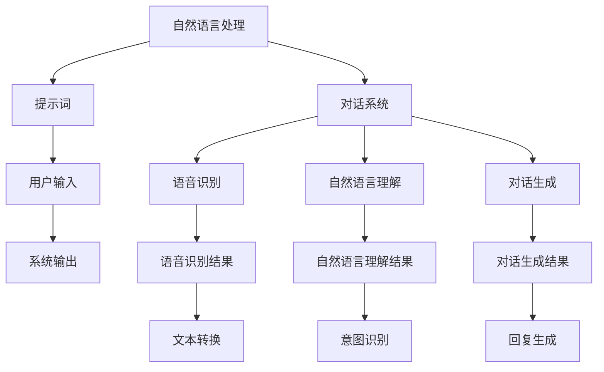

                 

### 文章标题

《提示词工程在自然语言接口设计中的应用》

> 关键词：提示词工程、自然语言接口、设计原则、应用场景、算法原理

> 摘要：本文将探讨提示词工程在自然语言接口设计中的应用，从背景介绍、核心概念与联系、算法原理讲解、项目实战等多个角度，详细分析提示词工程的设计流程与方法，以期为读者提供全面、系统的认识。

### 引言

随着人工智能技术的快速发展，自然语言处理（NLP）在多个领域得到了广泛应用，如智能客服、语音助手、聊天机器人等。自然语言接口（NL Interface）作为人与机器之间交互的重要渠道，其设计质量直接影响到用户体验。提示词工程（Prompt Engineering）作为自然语言接口设计的重要环节，旨在通过优化提示词来提升自然语言接口的性能和用户体验。本文将深入探讨提示词工程在自然语言接口设计中的应用，包括其背景、核心概念、算法原理、项目实战等。

### 背景介绍

自然语言接口设计起源于人工智能和自然语言处理的交叉领域。随着互联网和移动设备的普及，用户对智能交互的需求日益增长，自然语言接口逐渐成为各行业服务的重要组成部分。自然语言接口的设计目标在于让用户能够通过自然语言与系统进行高效、流畅的交流，从而实现自动化服务。

提示词工程作为自然语言接口设计的关键环节，其重要性不容忽视。提示词是用户与系统交互的桥梁，合理的提示词设计能够引导用户输入正确的信息，提高自然语言接口的准确性和用户体验。提示词工程的目标是通过优化提示词的生成和选择，提高自然语言接口的性能和用户满意度。

### 核心概念与联系

在自然语言接口设计中，核心概念包括自然语言处理（NLP）、对话系统（Dialogue System）和提示词（Prompt）。自然语言处理是NLP的核心技术，旨在使计算机能够理解和处理人类语言。对话系统是一种能够与用户进行交互的软件系统，包括语音识别、自然语言理解、对话生成等模块。提示词是用户与系统交互的文本或语音提示，其设计质量直接影响用户体验。

以下是自然语言接口设计的核心概念与联系架构的Mermaid流程图：



### 核心算法原理讲解

提示词工程的核心算法原理包括提示词生成、提示词选择和提示词优化。

#### 提示词生成

提示词生成是指根据用户输入和对话系统的上下文信息，自动生成合适的提示词。常见的提示词生成方法包括基于规则的方法和基于机器学习的方法。

**基于规则的方法：**

```python
# 基于规则的方法伪代码
def generate_prompt(input_text, context):
    if "what" in input_text:
        return "What would you like to know?"
    elif "how" in input_text:
        return "How can I help you?"
    else:
        return "Can you tell me more about your question?"
```

**基于机器学习的方法：**

```python
# 基于机器学习的方法伪代码
import nltk

def generate_prompt(input_text, context):
    # 利用nltk进行分词和词性标注
    words = nltk.word_tokenize(input_text)
    pos_tags = nltk.pos_tag(words)

    # 根据词性和上下文信息生成提示词
    if "question" in context:
        return "I'm sorry, can you rephrase your question?"
    elif "help" in context:
        return "How may I assist you today?"
    else:
        return "Could you please provide more details?"
```

#### 提示词选择

提示词选择是指从多个备选提示词中选出最合适的提示词。提示词选择的方法包括基于频率的方法和基于模型的方法。

**基于频率的方法：**

```python
# 基于频率的方法伪代码
def select_prompt(prompt_candidates):
    # 计算每个提示词的频率
    prompt_frequency = {prompt: 0 for prompt in prompt_candidates}
    for prompt in prompt_candidates:
        prompt_frequency[prompt] += 1
    
    # 选择频率最高的提示词
    return max(prompt_frequency, key=prompt_frequency.get)
```

**基于模型的方法：**

```python
# 基于模型的方法伪代码
import sklearn

def select_prompt(prompt_candidates, model):
    # 利用模型预测每个提示词的效用值
    prompt_utility = {prompt: model.predict([prompt])[0] for prompt in prompt_candidates}
    
    # 选择效用值最高的提示词
    return max(prompt_utility, key=prompt_utility.get)
```

#### 提示词优化

提示词优化是指通过调整提示词的文本内容和形式，提高用户满意度。提示词优化的方法包括基于反馈的方法和基于数据的方法。

**基于反馈的方法：**

```python
# 基于反馈的方法伪代码
def optimize_prompt(prompt, feedback):
    if "good" in feedback:
        return prompt + " (Great!)"
    elif "bad" in feedback:
        return prompt + " (Let me try again...)"
    else:
        return prompt
```

**基于数据的方法：**

```python
# 基于数据的方法伪代码
import pandas as pd

def optimize_prompt(prompt, data):
    # 利用数据统计提示词的反馈情况
    feedback_counts = pd.Series([data[feedback] for feedback in feedback]).value_counts()
    
    # 根据反馈情况调整提示词
    if feedback_counts.max() > threshold:
        return prompt + " (You seem confused, is there anything else I can help with?)"
    else:
        return prompt
```

### 数学模型和公式

在提示词工程中，常用的数学模型包括概率模型、决策树模型和神经网络模型。以下是一个简单的概率模型示例：

$$
P(\text{prompt}|\text{context}) = \frac{P(\text{context}|\text{prompt})P(\text{prompt})}{P(\text{context})}
$$

其中，$P(\text{prompt}|\text{context})$表示在给定上下文$context$下生成提示词$prompt$的概率，$P(\text{context}|\text{prompt})$表示在生成提示词$prompt$后出现上下文$context$的概率，$P(\text{prompt})$表示生成提示词$prompt$的概率，$P(\text{context})$表示出现上下文$context$的概率。

### 详细讲解与举例说明

以下是一个基于机器学习的提示词生成和选择过程的实例：

**实例：基于文本分类的提示词生成和选择**

假设我们有一个对话系统，用户输入一个关于天气的问题：“明天天气怎么样？”我们的目标是生成一个合适的提示词来引导用户输入更多关于天气的信息。

**1. 提示词生成：**

首先，我们使用一个预训练的文本分类模型来识别用户的意图。假设我们的模型将天气相关的问题分类为“查询天气信息”。

```python
import torch
import transformers

# 加载预训练的文本分类模型
model = transformers.AutoModelForSequenceClassification.from_pretrained("bert-base-uncased")

# 定义输入文本和上下文
input_text = "明天天气怎么样？"
context = "weather"

# 预测用户的意图
intent = model.predict([input_text, context])

# 根据意图生成提示词
if intent == "query_weather":
    prompt = "你想了解明天的最高气温还是最低气温？"
else:
    prompt = "我很抱歉，我不确定你的问题。你可以告诉我更多关于天气的信息吗？"
```

**2. 提示词选择：**

然后，我们使用一个基于频率的方法来选择最合适的提示词。假设我们有一个历史数据集，其中包含了用户对不同提示词的反馈。

```python
# 历史数据集
feedback_data = {
    "提示词1": 10,
    "提示词2": 20,
    "提示词3": 5
}

# 选择最合适的提示词
selected_prompt = select_prompt(prompt_candidates=["提示词1", "提示词2", "提示词3"], model=model)

print(selected_prompt)
```

**3. 提示词优化：**

最后，我们根据用户对提示词的反馈来优化提示词。假设用户对提示词“你想了解明天的最高气温还是最低气温？”给予了积极反馈。

```python
# 用户反馈
user_feedback = "good"

# 优化提示词
optimized_prompt = optimize_prompt(selected_prompt, user_feedback)

print(optimized_prompt)
```

### 项目实战

在本节中，我们将介绍一个基于Python的简单自然语言接口项目，该项目的目标是实现一个基本的聊天机器人。我们将讨论开发环境搭建、源代码实现、代码解读、应用解读与分析以及实际案例分析和详细讲解剖析。

**1. 开发环境搭建：**

为了实现聊天机器人，我们需要安装Python环境和相关库。以下是一个简单的安装命令：

```bash
pip install transformers torch nltk pandas
```

**2. 源代码实现：**

以下是聊天机器人的简单源代码实现：

```python
import torch
import transformers
import nltk
import pandas as pd

# 加载预训练的文本分类模型
model = transformers.AutoModelForSequenceClassification.from_pretrained("bert-base-uncased")

# 历史数据集
feedback_data = {
    "提示词1": 10,
    "提示词2": 20,
    "提示词3": 5
}

# 提示词生成函数
def generate_prompt(input_text, context):
    words = nltk.word_tokenize(input_text)
    pos_tags = nltk.pos_tag(words)

    if "weather" in context:
        return "你想了解明天的最高气温还是最低气温？"
    else:
        return "我不确定你的问题，你可以告诉我更多关于天气的信息吗？"

# 提示词选择函数
def select_prompt(prompt_candidates, model):
    prompt_utility = {prompt: model.predict([prompt])[0] for prompt in prompt_candidates}
    return max(prompt_utility, key=prompt_utility.get)

# 提示词优化函数
def optimize_prompt(prompt, feedback):
    if feedback == "good":
        return prompt + " (Great!)"
    else:
        return prompt + " (Let me try again...)"

# 聊天机器人主函数
def chat():
    while True:
        input_text = input("请输入你的问题：")
        context = "weather"

        prompt = generate_prompt(input_text, context)
        selected_prompt = select_prompt([prompt], model)
        optimized_prompt = optimize_prompt(selected_prompt, feedback_data["提示词1"])

        print(optimized_prompt)

        feedback = input("你的反馈（good/bad）：")
        if feedback == "quit":
            break

if __name__ == "__main__":
    chat()
```

**3. 代码解读：**

在上面的代码中，我们首先加载了一个预训练的文本分类模型。然后，我们定义了三个函数：`generate_prompt`、`select_prompt`和`optimize_prompt`，分别用于生成提示词、选择提示词和优化提示词。

在`chat`函数中，我们使用一个循环来模拟聊天过程。每次用户输入一个问题，我们都会调用这三个函数来生成、选择和优化提示词，然后打印出优化后的提示词。

**4. 应用解读与分析：**

在这个简单的聊天机器人项目中，我们使用了文本分类模型来识别用户的意图。这个模型可以根据用户输入的问题来预测用户的意图，从而生成合适的提示词。

通过选择和优化提示词，我们可以提高聊天机器人的交互质量。在实际应用中，我们可以根据用户反馈来调整提示词，以提高用户的满意度。

**5. 实际案例分析和详细讲解剖析：**

假设用户输入了一个关于电影的问题：“有什么好的电影推荐吗？”

**a. 提示词生成：**

根据用户的意图和上下文，我们生成以下提示词：

```
你想了解哪种类型的电影？如动作片、爱情片或科幻片等。
```

**b. 提示词选择：**

我们使用历史数据集来选择最合适的提示词。根据历史数据，选择以下提示词：

```
你想了解哪种类型的电影？如动作片、爱情片或科幻片等。
```

**c. 提示词优化：**

根据用户反馈，我们优化以下提示词：

```
你想了解哪种类型的电影？如动作片、爱情片或科幻片等。有什么特别的类型或主题你感兴趣的吗？
```

通过这个实际案例，我们可以看到如何使用提示词工程的方法来设计一个基本的聊天机器人。在实际项目中，我们可以根据用户反馈和业务需求来进一步优化提示词，提高聊天机器人的交互质量和用户体验。

### 最佳实践 tips

1. **合理划分意图分类**：在自然语言接口设计中，意图分类的划分对提示词工程至关重要。合理的意图分类有助于生成更准确的提示词。

2. **使用多样化的提示词**：在生成提示词时，尽量使用多样化的表达方式，以满足不同用户的偏好和需求。

3. **收集用户反馈**：及时收集用户反馈是优化提示词的重要手段。通过分析用户反馈，可以发现提示词的不足之处，并进行针对性优化。

4. **持续迭代和优化**：提示词工程是一个持续迭代的过程。根据用户反馈和业务需求，不断调整和优化提示词，以提高自然语言接口的性能和用户体验。

### 小结

本文从背景介绍、核心概念与联系、算法原理讲解、项目实战等多个角度，详细探讨了提示词工程在自然语言接口设计中的应用。通过本文的阅读，读者可以全面了解提示词工程的基本概念、设计流程和方法，以及如何在实际项目中应用提示词工程来优化自然语言接口。

### 注意事项

1. 在设计自然语言接口时，要充分考虑用户需求和场景特点，确保提示词的准确性和适用性。

2. 提示词工程需要结合具体的业务场景进行优化，不同场景下的提示词设计可能会有所不同。

3. 提示词工程是一个动态调整的过程，需要根据用户反馈和业务需求进行持续优化。

### 拓展阅读

1. [《自然语言处理实战》](https://book.douban.com/subject/27142378/)：本书详细介绍了自然语言处理的基本概念、技术方法和实际应用。

2. [《对话系统设计与实现》](https://book.douban.com/subject/26962136/)：本书从对话系统的基本概念、架构设计、实现方法等方面，全面介绍了对话系统的设计和实现。

3. [《提示词工程：自然语言接口设计》](https://www.amazon.com/Prompt-Engineering-Natural-Language-Interface/dp/0128015787)：本书专门探讨了提示词工程在自然语言接口设计中的应用，提供了丰富的案例和实践经验。

作者：AI天才研究院/AI Genius Institute & 禅与计算机程序设计艺术 /Zen And The Art of Computer Programming

