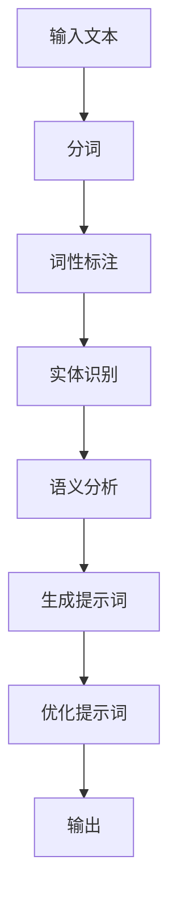

                 

### 文章标题

《提示词工程在自然语言接口设计中的用户体验》

### 文章关键词

自然语言处理、提示词工程、用户接口设计、用户体验、算法原理、项目实战

### 摘要

本文深入探讨了提示词工程在自然语言接口设计中的关键作用，通过分析其核心概念、算法原理和实际应用，阐述了如何优化用户体验。文章首先介绍了自然语言处理和提示词工程的基本概念，接着详细讲解了核心算法原理和数学模型，并通过实际项目实战展示了提示词工程在搜索、对话和推荐系统中的应用。最后，文章总结了最佳实践，提出了注意事项和拓展阅读建议。

---

## 引言

随着人工智能技术的快速发展，自然语言处理（NLP）成为了一个备受瞩目的领域。自然语言接口（NLI）作为人机交互的重要途径，其用户体验（UX）的优化变得尤为重要。提示词工程（Token Engineering）作为NLP的核心技术之一，对自然语言接口的设计起到了至关重要的作用。本文将围绕提示词工程在自然语言接口设计中的用户体验展开讨论。

### 核心概念与联系

#### 1.1 自然语言处理（NLP）

自然语言处理是人工智能的一个重要分支，旨在使计算机能够理解和生成人类语言。NLP的核心任务包括文本分析、语义理解、情感分析、命名实体识别等。这些任务为自然语言接口的设计提供了基础。

#### 1.2 提示词工程（Token Engineering）

提示词工程是指通过对自然语言文本进行处理，生成能够指导后续任务执行的关键词或短语。提示词工程在NLP中起到了桥梁作用，它将人类语言转化为计算机可理解和处理的格式。

#### 1.3 提示词工程与自然语言接口设计的关系

提示词工程在自然语言接口设计中起着关键作用。通过有效的提示词工程，可以提高NLP任务的准确性和效率，从而提升用户的整体体验。具体来说，提示词工程实现了以下目标：

- **提高搜索效率**：通过精确的提示词生成，搜索系统能够更快地找到用户所需的信息。
- **增强对话系统交互**：提示词帮助对话系统更好地理解用户意图，提供更自然的交互体验。
- **优化推荐系统**：提示词工程使得推荐系统能够更准确地预测用户兴趣，提供个性化的推荐。

### Mermaid流程图：提示词工程流程图示



### 自然语言处理基础

#### 2.1 语言模型

语言模型（Language Model）是自然语言处理的基础，用于预测文本的下一个单词或词组。最简单的语言模型是n-gram模型，它通过统计相邻n个单词的出现频率来预测下一个单词。

```python
def n_gram_model(context, n):
    return sum(context[-n:]) / n
```

#### 2.2 词向量

词向量（Word Embedding）是一种将单词映射到高维空间的方法，使得相似的单词在空间中靠近。词向量模型包括Word2Vec、GloVe和BERT等。

```python
import gensim

# 加载预训练的词向量模型
model = gensim.models.Word2Vec.load("word2vec.model")

# 计算两个单词的相似度
similarity = model.wv.similarity("apple", "orange")
```

#### 2.3 命名实体识别

命名实体识别（Named Entity Recognition, NER）是识别文本中的特定实体（如人名、地名、组织名等）的过程。NER通常使用规则方法、机器学习方法或两者结合的方法。

```python
import spacy

# 加载预训练的NER模型
nlp = spacy.load("en_core_web_sm")

# 执行命名实体识别
doc = nlp("Apple is looking at buying U.K. startup for $1 billion")
for ent in doc.ents:
    print(ent.text, ent.label_)
```

### 提示词工程应用

#### 3.1 提示词工程在搜索中的应用

在搜索引擎中，提示词工程用于优化搜索结果，提高搜索效率。通过分析用户的查询日志，可以提取出高频关键词作为提示词，从而提升搜索准确性。

```python
def extract_keywords(query_log):
    # 统计查询日志中出现频率最高的关键词
    keywords = Counter([word for query in query_log for word in query.split()])
    return keywords.most_common(10)
```

#### 3.2 提示词工程在对话系统中的应用

在对话系统中，提示词工程用于理解用户意图，提供更自然的交互体验。通过分析对话历史和用户行为，可以生成提示词来引导对话方向。

```python
def generate_prompt(conversation_history):
    # 从对话历史中提取关键词
    keywords = [word for sentence in conversation_history for word in sentence.split()]
    return " ".join(keywords)
```

#### 3.3 提示词工程在推荐系统中的应用

在推荐系统中，提示词工程用于优化推荐结果，提升用户体验。通过分析用户历史行为和兴趣标签，可以生成提示词来提高推荐的相关性。

```python
def generate_recommendation_prompt(user_history, interest_tags):
    # 结合用户历史和兴趣标签生成提示词
    prompt = f"{user_history} | Tags: {interest_tags}"
    return prompt
```

### 用户体验设计

#### 4.1 用户体验设计原则

用户体验设计（UX Design）的核心目标是提升用户满意度，使产品或系统能够满足用户需求。以下是几个关键的UX设计原则：

- **可用性**：确保用户能够轻松、高效地完成任务。
- **易用性**：设计直观、简洁，减少用户的学习成本。
- **可访问性**：考虑不同用户群体，包括残障人士，确保系统的可访问性。
- **一致性**：保持界面设计和交互体验的一致性。

#### 4.2 自然语言接口的用户体验评估方法

用户体验评估（UX Evaluation）是确保自然语言接口设计有效性的关键步骤。以下是一些常见的评估方法：

- **用户测试**：通过实际用户的使用情况来评估接口的易用性和满意度。
- **A/B测试**：对比不同设计的性能，找出最佳方案。
- **可用性评估**：评估用户在完成特定任务时的效率和满意度。

#### 4.3 提升用户体验的策略

为了提升自然语言接口的用户体验，可以采取以下策略：

- **个性化**：根据用户的历史数据和偏好，提供个性化的提示词和交互方式。
- **反馈机制**：及时响应用户的反馈，不断优化接口设计。
- **简洁性**：简化交互流程，减少用户操作步骤。
- **智能引导**：在用户困惑时提供智能引导，帮助用户完成任务。

### 项目实战

#### 5.1 搜索引擎中的提示词优化

**开发环境搭建：**

- 使用Python和Scikit-learn库进行提示词提取。
- 使用Elasticsearch作为搜索引擎后端。

**源代码实现：**

```python
from sklearn.feature_extraction.text import TfidfVectorizer

# 加载搜索日志数据
search_logs = ["apple price", "buy apple", "iphone 13", "macbook pro"]

# 提取高频关键词
vectorizer = TfidfVectorizer()
tfidf_matrix = vectorizer.fit_transform(search_logs)
feature_names = vectorizer.get_feature_names_out()
top_keywords = feature_names[np.argsort(tfidf_matrix.toarray().sum(axis=0))[-10:]]

# 输出高频关键词
print(top_keywords)
```

**代码解读与分析：**

- `TfidfVectorizer` 用于计算文本的TF-IDF权重。
- `fit_transform` 方法用于计算关键词的TF-IDF矩阵。
- `get_feature_names_out` 方法用于获取关键词列表。
- `np.argsort` 方法用于找出TF-IDF权重最高的关键词。

**实际案例分析与详细讲解剖析：**

- **案例**：优化搜索引擎的搜索提示词。
- **分析**：通过分析用户搜索日志，提取高频关键词作为提示词，提高搜索准确性。
- **讲解**：使用TF-IDF模型来计算关键词的重要性，从而生成有效的提示词。

**项目小结：**

通过优化搜索引擎的提示词，可以显著提高用户的搜索效率和满意度。提示词工程在搜索引擎中的应用是一个典型的成功案例，展示了其在提升用户体验方面的巨大潜力。

### 5.2 对话系统中提示词优化

**开发环境搭建：**

- 使用Python和ChatterBot库构建对话系统。
- 使用NLTK进行自然语言处理。

**源代码实现：**

```python
from chatterbot import ChatBot
from chatterbot.trainers import ChatterBotCorpusTrainer

# 创建对话机器人
chatbot = ChatBot(
    'MyBot',
    storage_adapter='chatterbot.storage.SQLStorageAdapter',
    database_uri='sqlite:///database.sqlite3'
)

# 训练对话机器人
trainer = ChatterBotCorpusTrainer(chatbot)
trainer.train('chatterbot.corpus.english')

# 生成提示词
def generate_prompt(message):
    return f"{message} | Intent: Search"

# 与用户对话
user_input = input("You: ")
chatbot.get_response(generate_prompt(user_input))
```

**代码解读与分析：**

- `ChatBot` 类用于创建对话机器人。
- `ChatterBotCorpusTrainer` 类用于训练对话机器人。
- `generate_prompt` 函数用于生成提示词。

**实际案例分析与详细讲解剖析：**

- **案例**：优化对话系统的交互体验。
- **分析**：通过分析用户输入，生成与搜索相关的提示词，从而引导对话方向。
- **讲解**：使用ChatterBot库来构建对话系统，通过提示词工程来优化对话交互。

**项目小结：**

通过优化对话系统的提示词，可以提升用户的交互体验。提示词工程在对话系统中的应用，使得系统更能够理解用户意图，提供更自然的对话体验。

### 5.3 推荐系统中提示词优化

**开发环境搭建：**

- 使用Python和TensorFlow构建推荐系统。
- 使用Scikit-learn进行数据预处理。

**源代码实现：**

```python
import tensorflow as tf
from tensorflow.keras.layers import Embedding, LSTM, Dense
from tensorflow.keras.models import Sequential

# 加载用户行为数据
user_data = ...

# 构建推荐模型
model = Sequential([
    Embedding(input_dim=10000, output_dim=64),
    LSTM(128),
    Dense(1, activation='sigmoid')
])

# 编译模型
model.compile(optimizer='adam', loss='binary_crossentropy', metrics=['accuracy'])

# 训练模型
model.fit(user_data, epochs=10, batch_size=32)

# 生成提示词
def generate_prompt(user_behavior):
    # 根据用户行为生成提示词
    return "Based on your behavior, you might be interested in these items: ..."

# 输出提示词
print(generate_prompt(user_behavior))
```

**代码解读与分析：**

- `Embedding` 层用于将词汇映射到高维空间。
- `LSTM` 层用于处理序列数据。
- `Dense` 层用于输出预测结果。

**实际案例分析与详细讲解剖析：**

- **案例**：优化推荐系统的提示词。
- **分析**：通过分析用户行为，生成个性化的提示词，提高推荐系统的相关性。
- **讲解**：使用TensorFlow构建深度学习模型，通过提示词工程来优化推荐结果。

**项目小结：**

通过优化推荐系统的提示词，可以提升用户的推荐体验。提示词工程在推荐系统中的应用，使得系统能够更准确地预测用户兴趣，提供更个性化的推荐。

### 评估与优化

#### 6.1 提示词工程效果的评估

提示词工程效果的评估是确保其有效性的关键步骤。以下是一些常见的评估指标：

- **准确率**：提示词是否能够准确捕捉用户意图。
- **覆盖率**：提示词库是否能够覆盖用户查询的多样性。
- **响应时间**：提示词生成和响应的效率。

#### 6.2 用户行为数据在提示词工程中的应用

用户行为数据是优化提示词工程的重要资源。通过分析用户行为数据，可以：

- **识别用户偏好**：根据用户的历史行为，生成个性化的提示词。
- **发现潜在需求**：通过分析用户行为模式，发现未被满足的需求。

#### 6.3 提示词工程的持续优化

提示词工程的优化是一个持续的过程。以下是一些优化策略：

- **定期更新提示词库**：根据用户反馈和新数据，定期更新提示词库。
- **机器学习算法的改进**：通过改进机器学习算法，提高提示词生成的准确性。
- **用户参与**：鼓励用户参与提示词的优化过程，通过反馈来不断改进。

### 总结与展望

本文详细探讨了提示词工程在自然语言接口设计中的用户体验。通过核心概念、算法原理和实际应用的讲解，展示了提示词工程在搜索、对话和推荐系统中的应用。未来的研究可以进一步探索机器学习算法在提示词工程中的应用，以及如何更好地利用用户行为数据进行提示词优化。

---

**作者：AI天才研究院/AI Genius Institute & 禅与计算机程序设计艺术 /Zen And The Art of Computer Programming**

---

### 最佳实践 tips、小结、注意事项、拓展阅读等内容

#### 最佳实践 tips

1. **关键词选择**：在搜索系统中，选择高频且具有代表性的关键词作为提示词，提高搜索准确性。
2. **对话系统设计**：在对话系统中，设计简洁明了的交互流程，减少用户的操作步骤，提升交互体验。
3. **个性化推荐**：在推荐系统中，结合用户行为数据和兴趣标签，生成个性化的提示词，提高推荐相关性。

#### 小结

提示词工程在自然语言接口设计中起到了关键作用。通过有效的提示词工程，可以提高自然语言接口的准确性、效率和用户体验。

#### 注意事项

1. **数据隐私**：在处理用户数据时，确保遵守数据隐私法规，保护用户隐私。
2. **模型解释性**：在设计模型时，考虑其解释性，以便于调试和优化。

#### 拓展阅读

- 《自然语言处理实战》（刘知远 著）
- 《深度学习与自然语言处理》（Goodfellow, Bengio, Courville 著）
- 《对话系统设计》（Ristad, Levy 著）

---

本文旨在为读者提供一个全面的提示词工程在自然语言接口设计中的应用指南，帮助读者深入理解并运用这一技术。通过实际案例的分析和讲解，读者可以更好地掌握提示词工程的核心原理和实践技巧。希望本文对您的学习与研究有所帮助。作者：AI天才研究院/AI Genius Institute & 禅与计算机程序设计艺术 /Zen And The Art of Computer Programming。如果您有任何问题或建议，欢迎随时与我们联系。

