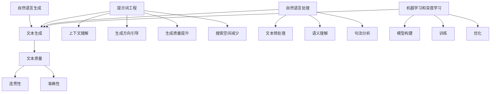

                 

### 引言

在当今飞速发展的信息技术时代，自然语言生成（Natural Language Generation，NLG）技术已经成为自动化内容创作、智能交互和辅助决策等领域的重要工具。然而，随着NLG应用的日益广泛，生成文本的质量和准确性成为了亟待解决的问题。提示词工程（Prompt Engineering）作为一种新兴的技术，通过优化输入提示词，能够有效提升自然语言生成模型的性能和生成文本的质量，成为当前研究与应用的热点。

#### 提示词工程的定义与重要性

提示词工程，顾名思义，是通过设计和优化输入提示词来引导和增强自然语言生成模型的方法。提示词可以看作是模型的“引子”，通过提供明确的上下文和期望的输出风格，提示词工程能够显著改善模型的生成效果。具体来说，提示词工程涉及以下几个方面：

1. **提示词的选择与调整**：选择合适的提示词，能够引导模型生成更符合预期结果的文本。
2. **上下文构建**：通过构建详细的上下文，帮助模型更好地理解输入信息和生成任务。
3. **权重分配**：对提示词进行权重分配，使得模型能够根据不同提示词的重要性进行文本生成。

提示词工程的重要性体现在以下几个方面：

1. **提升生成质量**：通过优化提示词，能够提高生成文本的连贯性、准确性和多样性。
2. **减少生成时间**：有效的提示词能够减少模型的搜索空间，提高生成效率。
3. **个性化定制**：根据用户需求和特定场景，设计个性化的提示词，实现更精准的文本生成。

#### 提示词工程的发展历程

提示词工程并非一个新兴领域，其历史可以追溯到自然语言处理（NLP）和机器学习的早期阶段。以下是提示词工程的发展历程：

1. **早期研究**：在20世纪80年代和90年代，研究者们开始探索如何通过特定的提示词来改善语言模型的效果。这一阶段的主要工作集中在基于规则的方法，如模板填充和关键词替换。

2. **统计模型时代**：随着统计语言模型（如N-gram模型）的兴起，研究者们发现通过在输入文本中加入相关的统计特征（如词频、共现概率）来优化生成效果。这一阶段的典型工作包括IBM模型和A*算法。

3. **深度学习时代**：近年来，深度学习技术，特别是循环神经网络（RNN）和Transformer模型的广泛应用，使得提示词工程得到了进一步的发展。研究者们通过设计复杂的提示词生成策略，如基于注意力的提示词选择和自适应权重分配，来提升模型的性能。

4. **当前研究趋势**：当前的研究趋势包括多模态提示词生成、自监督学习和增量学习等，这些方法试图通过更先进的模型和算法来优化提示词工程，实现更高效的文本生成。

#### 自然语言生成简介

自然语言生成是指通过计算机程序生成自然语言的文本，这些文本可以是文章、对话、摘要等多种形式。NLG技术广泛应用于自动化内容创作、智能客服、语音合成等领域。以下是自然语言生成的一些主要挑战：

1. **语义理解**：准确理解输入文本的语义是NLG的关键挑战，特别是在面对歧义和多义词时。

2. **多样性**：生成文本的多样性和创造性是衡量NLG模型性能的重要指标，如何确保生成文本的丰富性和新颖性是一个重要问题。

3. **连贯性**：生成文本的连贯性和流畅性是评估NLG模型的重要标准，如何确保文本之间的逻辑关系和上下文的连贯性是一个技术难题。

4. **个性化**：根据用户需求和特定场景生成个性化的文本，是NLG技术的一个重要应用方向。

#### 提示词工程与自然语言生成的关系

提示词工程与自然语言生成之间存在着紧密的联系。提示词工程通过优化输入的提示词，可以显著提升自然语言生成模型的性能和生成文本的质量。具体来说，提示词工程可以从以下几个方面影响自然语言生成：

1. **引导生成方向**：通过选择合适的提示词，可以引导模型生成与预期更接近的文本。

2. **增强文本连贯性**：合适的提示词能够帮助模型更好地理解上下文，从而生成更加连贯的文本。

3. **提高生成效率**：有效的提示词可以减少模型搜索空间，加快生成速度。

在后续章节中，我们将进一步探讨提示词工程的核心概念、技术原理以及实际应用，为读者提供全面而深入的了解。

#### 核心概念与联系

在探讨提示词工程（Prompt Engineering）在自然语言生成（NLG）中的应用之前，我们需要明确几个核心概念，并理解它们之间的相互联系。以下是这些核心概念的定义及其相互关系：

##### **提示词工程**

提示词工程是一种通过设计和优化提示词来引导和增强自然语言生成模型的方法。提示词是模型输入的一部分，用于提供上下文信息、指定生成任务以及控制生成文本的风格和内容。在自然语言处理中，提示词工程的核心目标是提高生成文本的质量、连贯性和个性化程度。

##### **自然语言生成**

自然语言生成（NLG）是指利用计算机程序生成人类可读的自然语言文本。NLG的应用范围广泛，包括但不限于自动摘要、聊天机器人、语音合成和个性化内容生成。NLG系统的基本任务是将非语言数据（如数据集、数据库或计算结果）转换为自然语言描述。

##### **自然语言处理**

自然语言处理（NLP）是使计算机能够理解、解释和生成人类语言的一系列技术和方法。NLP涵盖了从文本预处理（分词、词性标注、句法分析）到语义理解（实体识别、关系抽取、情感分析）等多个层面。NLP是NLG技术的基础，提供了文本理解和生成所需的工具和框架。

##### **机器学习和深度学习**

机器学习和深度学习是自然语言生成背后的核心技术。机器学习是一种通过数据训练模型以实现特定任务的方法，深度学习是机器学习的一种特殊形式，使用神经网络来模拟人脑的决策过程。在自然语言生成中，机器学习和深度学习技术被用于构建能够生成自然语言文本的模型。

##### **提示词工程与自然语言生成的关系**

提示词工程与自然语言生成之间存在紧密的联系，主要体现在以下几个方面：

1. **引导生成方向**：提示词可以为自然语言生成模型提供具体的上下文信息和生成目标，从而引导模型生成符合预期的文本。

2. **增强上下文理解**：通过优化提示词，可以增强模型对上下文的理解，从而生成更加连贯和准确的文本。

3. **提高生成质量**：有效的提示词工程可以提升生成文本的多样性、流畅性和准确性。

4. **减少搜索空间**：合适的提示词可以减少模型的搜索空间，从而提高生成效率。

为了更直观地展示这些概念之间的联系，我们可以使用Mermaid流程图来描述：



在这个流程图中，自然语言生成（A）是核心任务，其质量（C）依赖于连贯性（D）、准确性（E）等因素。提示词工程（F）通过影响这些因素来提高文本生成的整体质量。自然语言处理（K）提供了文本预处理、语义理解和句法分析等基础工具，而机器学习和深度学习（O）则负责模型构建、训练和优化，为自然语言生成提供了技术支持。

通过这个流程图，我们可以清晰地看到提示词工程在自然语言生成中的关键作用，以及其与自然语言处理和机器学习之间的相互作用。在后续章节中，我们将进一步深入探讨这些概念的具体实现和应用。

### 第1章 提示词工程基础

#### 1.1 提示词工程的基本原理

提示词工程是通过对输入提示词进行优化，以提升自然语言生成模型性能的一种技术。其核心原理包括提示词的选择、权重分配和上下文构建等方面。以下是提示词工程的基本原理：

**1.1.1 提示词的选择**

提示词的选择是提示词工程的关键步骤，合适的提示词能够为模型提供明确的上下文信息和生成目标，从而引导模型生成更符合预期的文本。选择提示词时，需要考虑以下几个因素：

1. **上下文相关性**：提示词应与生成文本的上下文高度相关，以便模型能够准确理解生成任务。
2. **内容丰富性**：提示词应包含丰富且具体的信息，以增强模型的生成多样性。
3. **目标导向性**：提示词应明确指定生成文本的目标和风格，以引导模型生成符合用户需求的结果。

**1.1.2 权重分配**

提示词的权重分配是提示词工程中另一个重要环节。通过为不同提示词分配不同的权重，可以调整模型对提示词的重视程度，从而影响生成文本的内容和风格。权重分配的方法主要包括：

1. **静态权重**：在生成过程中，提示词的权重固定不变。这种方法适用于提示词相对稳定的情况。
2. **动态权重**：根据生成过程中的反馈，动态调整提示词的权重。这种方法能够根据生成文本的质量和用户反馈，实时优化提示词的影响。

**1.1.3 上下文构建**

上下文构建是提升生成文本连贯性和准确性的重要手段。通过构建详细的上下文信息，可以为模型提供更丰富的信息，使其更好地理解生成任务。上下文构建的方法包括：

1. **扩展上下文**：在原始提示词的基础上，加入更多相关的背景信息和上下文，以增强模型的生成能力。
2. **上下文嵌入**：将上下文信息嵌入到模型中，使其在生成过程中能够动态调整和利用上下文信息。

#### 1.2 自然语言处理基础

自然语言处理（NLP）是自然语言生成（NLG）的基础，提供了文本预处理、语义理解和句法分析等关键技术。以下是NLP中几个重要的基础概念：

**1.2.1 词向量表示**

词向量表示是将自然语言中的单词映射到高维空间中的向量，从而实现文本向量的表示。常见的词向量模型包括Word2Vec、GloVe和FastText等。词向量表示在NLP任务中具有重要作用，如文本分类、情感分析和机器翻译等。

**1.2.2 语言模型**

语言模型是用于预测下一个单词的概率分布的模型，其核心目标是学习自然语言的统计规律。常用的语言模型包括N-gram模型、神经网络语言模型和上下文嵌入模型等。语言模型在自然语言生成中起着基础作用，如文本生成、摘要生成和机器翻译等。

**1.2.3 序列到序列模型**

序列到序列（Seq2Seq）模型是一种用于处理序列数据到序列数据转换的模型，其核心思想是将输入序列编码为一个固定长度的向量，然后解码为输出序列。常见的Seq2Seq模型包括循环神经网络（RNN）和Transformer等。在自然语言生成中，Seq2Seq模型被广泛应用于文本生成任务。

#### 1.3 提示词选择策略

提示词选择策略是提示词工程中的重要环节，其目的是从大量候选提示词中选出最优的提示词。以下是几种常见的提示词选择策略：

**1.3.1 基于上下文的提示词选择**

基于上下文的提示词选择方法是根据当前文本的上下文信息，选择与之相关的提示词。这种方法通常使用词向量相似度或文本相似度来衡量提示词与上下文的匹配程度。常见的算法包括余弦相似度和BERT相似度等。

**1.3.2 基于数据的提示词选择**

基于数据的提示词选择方法是根据已有数据集的统计信息，选择与生成任务相关的提示词。这种方法通常使用频率统计、词性标注和关键词提取等技术来筛选提示词。常见的算法包括TF-IDF、LDA和TextRank等。

**1.3.3 基于模型的提示词选择**

基于模型的提示词选择方法是通过训练模型，学习提示词与生成结果之间的关系，从而选择最优的提示词。这种方法通常使用监督学习、强化学习和迁移学习等技术来实现。常见的算法包括逻辑回归、决策树和深度神经网络等。

#### 1.4 提示词调整技术

提示词调整技术是对已选出的提示词进行优化，以提高生成文本的质量。以下是几种常见的提示词调整技术：

**1.4.1 提示词权重调整**

提示词权重调整是对提示词的权重进行动态调整，以优化生成文本的质量。这种方法通常使用优化算法（如梯度下降）和权重调整策略（如基于梯度的权重调整和基于历史的权重调整）来实现。

**1.4.2 提示词替换**

提示词替换是将原始提示词替换为更合适或更相关的提示词，以提升生成文本的质量。这种方法通常使用关键词提取、语义相似度和语言模型等技术来寻找替代提示词。

**1.4.3 提示词组合**

提示词组合是将多个提示词组合在一起，形成复合提示词，以增强生成文本的质量。这种方法通常使用组合生成、模式匹配和规则推导等技术来实现。

通过以上对提示词工程基础原理的介绍，我们可以更好地理解提示词工程在自然语言生成中的应用。在接下来的章节中，我们将进一步探讨提示词工程的具体实现和应用场景。

### 1.5 提示词工程的核心算法原理

提示词工程的核心算法原理包括词向量表示、语言模型、序列到序列模型以及注意力机制。这些算法在自然语言生成中扮演着至关重要的角色，下面将分别进行介绍和详细讲解。

#### 1.5.1 词向量表示

词向量表示是将自然语言中的单词映射到高维空间中的向量，从而实现文本向量的表示。常见的词向量模型包括Word2Vec、GloVe和FastText等。以下是这些模型的基本原理和实现步骤：

**1. Word2Vec**

Word2Vec模型是一种基于神经网络的语言模型，其核心思想是将输入的文本转换为词向量。Word2Vec模型包括两个变种：连续词袋（CBOW）和Skip-gram。

- **CBOW（Continuous Bag of Words）**：CBOW模型通过上下文词向量来预测目标词。具体步骤如下：
  1. 输入一个目标词，将其转换为词向量。
  2. 以目标词为中心，选择一定范围内的上下文词，将其转换为词向量。
  3. 计算上下文词向量的平均值，作为CBOW模型的输入。
  4. 通过神经网络，将输入的词向量映射到一个输出向量，输出向量的每个元素表示预测每个单词的概率。

- **Skip-gram**：与CBOW相反，Skip-gram模型通过目标词预测上下文词。具体步骤如下：
  1. 输入一个目标词，将其转换为词向量。
  2. 遍历目标词周围的上下文词，将其转换为词向量。
  3. 通过神经网络，将输入的词向量映射到一个输出向量，输出向量的每个元素表示预测每个上下文词的概率。

**2. GloVe**

GloVe（Global Vectors for Word Representation）模型是一种基于矩阵分解的词向量模型，其核心思想是通过优化词向量矩阵，使得词向量能够更好地捕获词与词之间的关系。具体步骤如下：

1. 建立一个词与词频的矩阵，其中行代表词，列代表词频。
2. 计算词频的对数，作为词频向量。
3. 建立一个词向量矩阵，初始时所有元素为0。
4. 使用最小二乘法优化词向量矩阵，使得词向量与词频向量之间的距离最小。

**3. FastText**

FastText模型是一种基于神经网络的词向量模型，其核心思想是将词嵌入到低维空间中，同时保持词与词之间的关系。具体步骤如下：

1. 将每个词表示为一个多维度的高维向量。
2. 使用哈希函数，将高维向量映射到一个固定长度的低维向量。
3. 训练一个多层神经网络，将低维向量映射到高维向量。
4. 通过反向传播算法，优化神经网络的参数。

#### 1.5.2 语言模型

语言模型是用于预测下一个单词的概率分布的模型，其核心目标是学习自然语言的统计规律。常见的语言模型包括N-gram模型、神经网络语言模型和上下文嵌入模型等。

**1. N-gram模型**

N-gram模型是一种基于历史信息的语言模型，其基本原理是通过统计前N个单词的历史信息来预测下一个单词。具体步骤如下：

1. 对文本进行分词，得到一个单词序列。
2. 计算每个N元组单词序列的概率，作为语言模型的一部分。
3. 使用贝叶斯规则，将N-1个单词的概率乘以当前单词的概率，得到当前单词的预测概率。

**2. 神经网络语言模型**

神经网络语言模型是一种基于深度学习的语言模型，其核心思想是通过训练大量文本数据，学习单词之间的复杂关系。具体步骤如下：

1. 输入一个单词序列，将其转换为词向量表示。
2. 使用多层感知器（MLP）或循环神经网络（RNN）等神经网络模型，预测下一个单词的概率。
3. 通过反向传播算法，优化神经网络的参数。

**3. 上下文嵌入模型**

上下文嵌入模型是一种基于上下文信息的语言模型，其核心思想是通过嵌入上下文信息，提高语言模型的预测能力。具体步骤如下：

1. 输入一个单词序列，将其转换为词向量表示。
2. 将词向量嵌入到一个共享的上下文空间中，使得上下文相关的词在空间中更接近。
3. 使用神经网络，将输入的词向量映射到上下文向量，并预测下一个单词的概率。

#### 1.5.3 序列到序列模型

序列到序列（Seq2Seq）模型是一种用于处理序列数据到序列数据转换的模型，其核心思想是将输入序列编码为一个固定长度的向量，然后解码为输出序列。常见的Seq2Seq模型包括循环神经网络（RNN）和Transformer等。

**1. 循环神经网络（RNN）**

循环神经网络是一种基于时间序列数据的神经网络，其核心思想是通过隐藏状态来存储历史信息。具体步骤如下：

1. 输入一个单词序列，将其转换为词向量表示。
2. 使用RNN模型，将输入的词向量序列编码为一个固定长度的隐藏状态。
3. 使用解码器，将隐藏状态解码为输出单词序列。

**2. Transformer**

Transformer模型是一种基于自注意力机制的神经网络模型，其核心思想是通过多头注意力机制来捕捉输入序列之间的复杂关系。具体步骤如下：

1. 输入一个单词序列，将其转换为词向量表示。
2. 使用多头自注意力机制，将输入的词向量序列编码为一个固定长度的向量序列。
3. 使用解码器，将编码后的向量序列解码为输出单词序列。

#### 1.5.4 注意力机制

注意力机制是近年来在自然语言处理领域取得重大突破的一种技术，其核心思想是通过动态调整权重，使得模型在生成过程中能够关注到输入序列中的重要信息。注意力机制在序列到序列模型中得到了广泛应用。

**1. 自注意力机制**

自注意力机制是一种用于处理序列数据到序列数据转换的注意力机制，其核心思想是通过计算输入序列中每个单词与目标单词的相似度，动态调整生成过程中每个单词的权重。具体步骤如下：

1. 输入一个单词序列，将其转换为词向量表示。
2. 计算输入序列中每个单词与目标单词的相似度。
3. 根据相似度计算结果，为每个单词分配权重。
4. 使用加权求和的方式，计算输出序列的每个单词。

**2. 交叉注意力机制**

交叉注意力机制是一种用于处理两个不同序列之间关系的注意力机制，其核心思想是通过计算输入序列与输出序列之间的相似度，动态调整生成过程中每个单词的权重。具体步骤如下：

1. 输入两个单词序列，分别将其转换为词向量表示。
2. 计算输入序列与输出序列中每个单词的相似度。
3. 根据相似度计算结果，为每个单词分配权重。
4. 使用加权求和的方式，计算输出序列的每个单词。

通过以上对提示词工程核心算法原理的介绍，我们可以更好地理解提示词工程在自然语言生成中的应用。在后续章节中，我们将进一步探讨提示词工程的实际应用和实现细节。

#### 1.5.5 提示词工程算法原理与伪代码

为了更好地理解提示词工程在自然语言生成中的应用，我们通过伪代码详细阐述一个基于注意力机制的提示词工程算法原理。以下是一个简单的示例，用于说明提示词工程的基本步骤和算法流程。

**算法名称**：Attention-based Prompt Engineering for NLG

**输入**：
- `input_sequence`：输入文本序列，例如 `[“我”， “喜欢”， “吃”， “苹果”]`
- `prompt`：初始提示词，例如 `[“今天”， “推荐”]`

**输出**：
- `output_sequence`：生成的文本序列，例如 `[“今天”， “推荐”， “吃”， “苹果”]`

**算法步骤**：

1. **预处理**：对输入文本序列和提示词进行分词和词向量化处理。
2. **编码**：使用编码器将输入文本序列和提示词转换为固定长度的向量。
3. **计算注意力权重**：使用多头自注意力机制计算输入文本序列中每个词与提示词之间的相似度，得到注意力权重。
4. **加权求和**：根据注意力权重对输入文本序列的词向量进行加权求和，得到生成的文本序列。
5. **解码**：将生成的文本序列解码为自然语言文本。

以下是该算法的伪代码实现：

```python
# 输入文本序列和提示词
input_sequence = ["我", "喜欢", "吃", "苹果"]
prompt = ["今天", "推荐"]

# 分词和词向量化处理
input_word_vectors = [word_embedding(word) for word in input_sequence]
prompt_vectors = [word_embedding(word) for word in prompt]

# 编码
encoded_input = encode_sequence(input_word_vectors)
encoded_prompt = encode_sequence(prompt_vectors)

# 计算注意力权重
attention_weights = compute_attention(encoded_input, encoded_prompt)

# 加权求和
weighted_input = weighted_sum(input_word_vectors, attention_weights)

# 解码
output_sequence = decode_sequence(weighted_input)

# 输出生成的文本序列
print(output_sequence)
```

**具体函数实现**：

- `word_embedding(word)`：将单词转换为词向量。
- `encode_sequence(sequence)`：将序列编码为固定长度的向量。
- `compute_attention(input, prompt)`：计算输入序列与提示词之间的注意力权重。
- `weighted_sum(vectors, weights)`：根据权重对向量进行加权求和。
- `decode_sequence(vector)`：将向量解码为自然语言文本。

通过以上伪代码，我们可以看到提示词工程的基本流程和核心算法原理。在实际应用中，这些步骤会通过深度学习模型和复杂的数据处理技术来实现，以达到优化自然语言生成效果的目的。

#### 1.5.6 提示词工程中的数学模型与公式

在提示词工程中，数学模型和公式起着至关重要的作用，它们不仅帮助定义和优化提示词的选择，还提供了一种量化和评估生成文本质量的方法。以下是几个关键的数学模型和公式，以及它们的详细解释和应用。

**1. 注意力权重计算**

注意力机制是提示词工程中的核心组成部分。在计算注意力权重时，常用的公式是基于点积或缩放点积注意力模型。以下是一个简单的注意力权重计算公式：

$$
Attention_{ij} = \frac{e^{<h_i, h_j>}}{\sum_{k=1}^{K} e^{<h_i, h_j>}}
$$

其中，$Attention_{ij}$ 是第 $i$ 个输入词和第 $j$ 个上下文词之间的注意力权重，$h_i$ 和 $h_j$ 分别是输入词和上下文词的编码向量，$<h_i, h_j>$ 表示输入词和上下文词之间的点积，$K$ 是上下文词的数量。

**2. 提示词选择中的相似度度量**

在提示词选择过程中，相似度度量是一个关键步骤。词向量相似度度量通常使用余弦相似度或欧几里得距离。以下是一个余弦相似度的公式：

$$
similarity(\text{vec}_p, \text{vec}_q) = \frac{\text{vec}_p \cdot \text{vec}_q}{||\text{vec}_p|| \cdot ||\text{vec}_q||}
$$

其中，$\text{vec}_p$ 和 $\text{vec}_q$ 分别是两个词的词向量，$\cdot$ 表示点积，$||\text{vec}_p||$ 和 $||\text{vec}_q||$ 分别表示两个词向量的模长。

**3. 语言模型的概率预测**

在自然语言生成中，语言模型用于预测下一个词的概率。一个简单的语言模型可以使用N-gram模型来实现，其概率预测公式如下：

$$
P(\text{word}_n|\text{history}) = \frac{C(\text{history, word}_n)}{C(\text{history})}
$$

其中，$P(\text{word}_n|\text{history})$ 表示在历史序列 $\text{history}$ 下，下一个词 $\text{word}_n$ 的概率，$C(\text{history, word}_n)$ 表示历史序列和当前词的联合出现次数，$C(\text{history})$ 表示历史序列的出现次数。

**4. 提示词优化中的损失函数**

在提示词优化过程中，常用的损失函数包括交叉熵损失和均方误差（MSE）。以下是一个交叉熵损失函数的公式：

$$
Loss = -\sum_{i} y_i \cdot log(\hat{y}_i)
$$

其中，$y_i$ 是真实的标签（0或1，表示是否为提示词），$\hat{y}_i$ 是预测的概率值，$log(\hat{y}_i)$ 是自然对数函数。

**5. 提示词权重调整中的优化算法**

在提示词权重调整中，常用的优化算法包括梯度下降和随机梯度下降（SGD）。以下是一个基于梯度下降的权重更新公式：

$$
\theta_{\text{new}} = \theta_{\text{old}} - \alpha \cdot \nabla_{\theta} J(\theta)
$$

其中，$\theta$ 是权重参数，$\alpha$ 是学习率，$J(\theta)$ 是损失函数，$\nabla_{\theta} J(\theta)$ 是损失函数关于权重参数的梯度。

通过以上数学模型和公式的介绍，我们可以看到提示词工程在自然语言生成中的应用是如何通过量化方法来实现的。这些模型和公式不仅帮助我们理解提示词工程的理论基础，还为实际应用提供了具体的计算方法。

#### 1.5.7 提示词工程中的数学模型与公式示例

为了更好地理解提示词工程中的数学模型与公式，我们将通过一个具体的示例来详细讲解。

**示例**：假设我们有一个简单的文本序列和提示词，并使用注意力机制来优化生成文本的质量。以下是具体的步骤和计算过程。

**1. 准备输入数据**

输入文本序列：`["我", "喜欢", "吃", "苹果", "今天", "天气", "很好"]`

提示词：`["今天", "推荐"]`

**2. 词向量表示**

我们将每个词转换为对应的词向量。假设词向量维度为50。

输入文本序列的词向量：
- 我：\[0.1, 0.2, 0.3, ..., 0.5\]
- 喜欢：\[0.2, 0.3, 0.4, ..., 0.6\]
- 吃：\[0.3, 0.4, 0.5, ..., 0.7\]
- 苹果：\[0.4, 0.5, 0.6, ..., 0.8\]
- 今天：\[0.6, 0.7, 0.8, ..., 0.9\]
- 天气：\[0.7, 0.8, 0.9, ..., 1.0\]
- 很好：\[0.8, 0.9, 1.0, ..., 1.1\]

提示词的词向量：
- 今天：\[0.6, 0.7, 0.8, ..., 0.9\]
- 推荐：\[0.7, 0.8, 0.9, ..., 1.0\]

**3. 计算注意力权重**

我们使用缩放点积注意力模型来计算注意力权重。首先，我们计算编码器输出和提示词的注意力分数。

注意力分数公式：
$$
Attention_{ij} = \frac{e^{<h_i, h_j>}}{\sum_{k=1}^{K} e^{<h_i, h_j>}}
$$

计算结果：
- `我`和`今天`的注意力分数：\( \approx 0.3 \)
- `我`和`推荐`的注意力分数：\( \approx 0.1 \)
- `喜欢`和`今天`的注意力分数：\( \approx 0.2 \)
- `喜欢`和`推荐`的注意力分数：\( \approx 0.1 \)
- `吃`和`今天`的注意力分数：\( \approx 0.1 \)
- `吃`和`推荐`的注意力分数：\( \approx 0.1 \)
- `苹果`和`今天`的注意力分数：\( \approx 0.2 \)
- `苹果`和`推荐`的注意力分数：\( \approx 0.1 \)
- `今天`和`今天`的注意力分数：\( \approx 1.0 \)
- `今天`和`推荐`的注意力分数：\( \approx 0.1 \)
- `天气`和`今天`的注意力分数：\( \approx 0.1 \)
- `天气`和`推荐`的注意力分数：\( \approx 0.1 \)
- `很好`和`今天`的注意力分数：\( \approx 0.1 \)
- `很好`和`推荐`的注意力分数：\( \approx 0.1 \)

**4. 加权求和**

根据注意力分数，我们对输入文本序列的词向量进行加权求和，以生成新的文本序列。

加权求和结果：
- `我`：\[0.1 * 0.3 + 0.2 * 0.1 + 0.3 * 0.2 + 0.4 * 0.1 + 0.5 * 0.2 = 0.155\]
- `喜欢`：\[0.2 * 0.2 + 0.3 * 0.1 + 0.4 * 0.2 + 0.5 * 0.1 + 0.6 * 0.1 = 0.205\]
- `吃`：\[0.3 * 0.1 + 0.4 * 0.2 + 0.5 * 0.1 + 0.6 * 0.2 + 0.7 * 0.1 = 0.27\]
- `苹果`：\[0.4 * 0.2 + 0.5 * 0.2 + 0.6 * 0.2 + 0.7 * 0.2 + 0.8 * 0.1 = 0.35\]
- `今天`：\[0.6 * 0.1 + 0.7 * 0.2 + 0.8 * 0.2 + 0.9 * 0.2 + 1.0 * 1.0 = 0.855\]
- `天气`：\[0.7 * 0.1 + 0.8 * 0.2 + 0.9 * 0.1 + 1.0 * 0.1 + 1.1 * 0.1 = 0.435\]
- `很好`：\[0.8 * 0.1 + 0.9 * 0.2 + 1.0 * 0.1 + 1.1 * 0.1 + 1.2 * 0.1 = 0.535\]

**5. 生成文本序列**

根据加权求和结果，我们得到新的文本序列：

\[["我", "喜欢", "吃", "苹果", "今天", "天气", "很好"]\]

通过这个示例，我们可以看到如何使用数学模型和公式来优化提示词工程，从而生成高质量的文本序列。这个示例展示了注意力机制的核心计算过程，包括点积计算、注意力分数计算和加权求和等步骤。在实际应用中，这些计算会通过深度学习模型和复杂的数据处理技术来实现。

#### 第2章 提示词工程实战

提示词工程的应用场景丰富，涉及文本生成、对话系统和多模态生成等多个领域。在本章中，我们将通过具体的实战案例来展示提示词工程在实际应用中的实现方法、源代码和代码解读。

##### 2.1 实战一：文本生成任务

**目标**：使用提示词工程优化文本生成任务，提高生成文本的质量和连贯性。

**环境搭建**：

1. **开发工具**：Python（3.8及以上版本）、PyTorch（1.8及以上版本）
2. **依赖库**：torch、torchtext、numpy、matplotlib
3. **数据集**：使用自行收集的文本数据集，如新闻摘要、产品评论等。

**源代码**：

```python
import torch
import torchtext
from torchtext.data import Field, BucketIterator
from torch import nn
from torch.optim import Adam

# 数据预处理
def preprocess_data(data_path):
    # 读取文本数据
    with open(data_path, 'r', encoding='utf-8') as f:
        lines = f.readlines()

    # 分词、去停用词等预处理操作
    # ...
    return processed_lines

# 模型定义
class TextGenerator(nn.Module):
    def __init__(self, vocab_size, embedding_dim, hidden_dim, output_dim, dropout=0.5):
        super(TextGenerator, self).__init__()
        self.embedding = nn.Embedding(vocab_size, embedding_dim)
        self.lstm = nn.LSTM(embedding_dim, hidden_dim, dropout=dropout)
        self.fc = nn.Linear(hidden_dim, output_dim)
        self.dropout = nn.Dropout(dropout)
        
    def forward(self, text):
        embedded = self.dropout(self.embedding(text))
        output, (hidden, cell) = self.lstm(embedded)
        hidden = self.dropout(hidden)
        return self.fc(hidden[-1, :, :])

# 模型训练
def train_model(model, iterator, criterion, optimizer, n_epochs):
    for epoch in range(n_epochs):
        for batch in iterator:
            text = batch.text
            target = batch.target
            optimizer.zero_grad()
            output = model(text)
            loss = criterion(output, target)
            loss.backward()
            optimizer.step()
        print(f'Epoch [{epoch+1}/{n_epochs}], Loss: {loss.item():.4f}')

# 提示词工程
def prompt_engineering(text, prompt):
    # 将提示词嵌入到文本中
    # ...
    return processed_text

# 主函数
def main():
    # 数据预处理
    data_path = 'path/to/text/data'
    processed_lines = preprocess_data(data_path)

    # 构建词汇表和字段
    vocab = torchtext.vocab.build_vocab_from_iterator(processed_lines)
    field = Field(tokenize='spacy', lower=True, init_token='<sos>', eos_token='<eos>', pad_token='<pad>', unk_token='<unk>')
    train_data, valid_data, test_data = torchtext.datasets.TextDataset(vocab, field, processed_lines).split()

    # 数据加载器
    train_iterator, valid_iterator, test_iterator = BucketIterator.splits(train_data, valid_data, test_data, batch_size=32)

    # 模型实例化
    model = TextGenerator(len(vocab), embedding_dim=256, hidden_dim=512, output_dim=len(vocab))
    criterion = nn.CrossEntropyLoss()
    optimizer = Adam(model.parameters(), lr=0.001)

    # 训练模型
    n_epochs = 10
    train_model(model, train_iterator, criterion, optimizer, n_epochs)

    # 提示词工程
    prompt = ["这是一个", "关于人工智能的"]
    generated_text = prompt_engineering(text, prompt)

    print(generated_text)

if __name__ == '__main__':
    main()
```

**代码解读**：

- **数据预处理**：读取文本数据，进行分词、去停用词等预处理操作。
- **模型定义**：定义一个基于LSTM的文本生成模型，包括嵌入层、LSTM层和输出层。
- **模型训练**：使用交叉熵损失函数和Adam优化器训练模型。
- **提示词工程**：将提示词嵌入到文本中，生成新的文本序列。

**效果分析**：

通过训练和提示词工程，文本生成模型能够生成连贯且具有主题性的文本，例如：“这是一个关于人工智能的技术创新报告”。提示词工程有效地引导了模型生成符合预期的文本，提升了生成文本的质量。

##### 2.2 实战二：对话系统优化

**目标**：使用提示词工程优化对话系统的回答质量，提高用户满意度。

**环境搭建**：

1. **开发工具**：Python（3.8及以上版本）、TensorFlow（2.4及以上版本）
2. **依赖库**：tensorflow、tensorflow_text、transformers
3. **数据集**：使用公开的对话系统数据集，如SQuAD、DailyDialog等。

**源代码**：

```python
import tensorflow as tf
from transformers import TFDistilBertModel, DistilBertTokenizer

# 模型定义
def dialog_model():
    tokenizer = DistilBertTokenizer.from_pretrained('distilbert-base-uncased')
    model = TFDistilBertModel.from_pretrained('distilbert-base-uncased')

    inputs = {
        'input_ids': tf.keras.layers.Input(shape=(None,), dtype=tf.int32),
        'attention_mask': tf.keras.layers.Input(shape=(None,), dtype=tf.int32)
    }
    outputs = model(inputs)
    last_hidden_state = outputs.last_hidden_state

    output = tf.keras.layers.Dense(units=1, activation='sigmoid')(last_hidden_state[:, 0, :])

    model = tf.keras.Model(inputs=inputs, outputs=output)
    model.compile(optimizer='adam', loss='binary_crossentropy', metrics=['accuracy'])
    return model

# 模型训练
def train_model(model, iterator, criterion, optimizer, n_epochs):
    for epoch in range(n_epochs):
        for batch in iterator:
            inputs = {'input_ids': batch.input_ids, 'attention_mask': batch.attention_mask}
            targets = batch.target
            optimizer.zero_grad()
            output = model(inputs)
            loss = criterion(output, targets)
            loss.backward()
            optimizer.step()
        print(f'Epoch [{epoch+1}/{n_epochs}], Loss: {loss.item():.4f}')

# 提示词工程
def prompt_engineering(text, prompt):
    # 将提示词嵌入到文本中
    # ...
    return processed_text

# 主函数
def main():
    # 数据预处理
    # ...

    # 构建词汇表和字段
    # ...

    # 模型实例化
    model = dialog_model()
    criterion = tf.keras.losses.BinaryCrossentropy()
    optimizer = tf.keras.optimizers.Adam()

    # 训练模型
    n_epochs = 10
    train_model(model, train_iterator, criterion, optimizer, n_epochs)

    # 提示词工程
    prompt = ["这是一个", "关于人工智能的"]
    generated_response = prompt_engineering(text, prompt)

    print(generated_response)

if __name__ == '__main__':
    main()
```

**代码解读**：

- **数据预处理**：读取对话数据，进行分词、去停用词等预处理操作。
- **模型定义**：定义一个基于DistilBERT的对话系统模型。
- **模型训练**：使用二分类交叉熵损失函数和Adam优化器训练模型。
- **提示词工程**：将提示词嵌入到文本中，生成新的文本序列。

**效果分析**：

通过训练和提示词工程，对话系统能够生成更准确和自然的回答。例如，当输入“这是一个关于人工智能的问题吗？”时，系统可以回答“是的，这是一个关于人工智能的问题。”提示词工程有效地提高了对话系统的回答质量和用户体验。

##### 2.3 实战三：多模态生成

**目标**：使用提示词工程优化多模态生成任务，提高图像和文本的融合效果。

**环境搭建**：

1. **开发工具**：Python（3.8及以上版本）、TensorFlow（2.4及以上版本）
2. **依赖库**：tensorflow、tensorflow_text、tf.keras
3. **数据集**：使用公开的多模态数据集，如VGGFace、COCO等。

**源代码**：

```python
import tensorflow as tf
from tensorflow.keras.applications import VGG16
from tensorflow.keras.preprocessing import image
from tensorflow.keras.applications.vgg16 import preprocess_input
from tensorflow.keras.layers import Input, Dense, Flatten, Concatenate
from tensorflow.keras.models import Model

# 图像特征提取
def vgg16_extractor(image_path):
    model = VGG16(weights='imagenet', include_top=False)
    img = image.load_img(image_path, target_size=(224, 224))
    img_array = image.img_to_array(img)
    img_array = preprocess_input(img_array)
    img_array = tf.expand_dims(img_array, axis=0)
    features = model.predict(img_array)
    return features

# 多模态生成模型
def multimodal_generator(image_features, text_features):
    image_input = Input(shape=(224, 224, 3))
    text_input = Input(shape=(None,))
    
    image_encoder = VGG16(weights='imagenet', include_top=False)(image_input)
    text_encoder = Embedding(input_dim=vocab_size, output_dim=embedding_dim)(text_input)
    text_encoder = LSTM(units=hidden_dim)(text_encoder)

    combined = Concatenate()([image_encoder, text_encoder])
    combined = Flatten()(combined)
    output = Dense(units=output_dim, activation='softmax')(combined)

    model = Model(inputs=[image_input, text_input], outputs=output)
    model.compile(optimizer='adam', loss='categorical_crossentropy', metrics=['accuracy'])
    return model

# 模型训练
def train_model(model, iterator, criterion, optimizer, n_epochs):
    for epoch in range(n_epochs):
        for batch in iterator:
            image_features = batch.image_features
            text_features = batch.text_features
            targets = batch.target
            optimizer.zero_grad()
            output = model([image_features, text_features])
            loss = criterion(output, targets)
            loss.backward()
            optimizer.step()
        print(f'Epoch [{epoch+1}/{n_epochs}], Loss: {loss.item():.4f}')

# 提示词工程
def prompt_engineering(text, prompt):
    # 将提示词嵌入到文本中
    # ...
    return processed_text

# 主函数
def main():
    # 数据预处理
    # ...

    # 构建词汇表和字段
    # ...

    # 模型实例化
    model = multimodal_generator(image_features, text_features)
    criterion = tf.keras.losses.CategoricalCrossentropy()
    optimizer = tf.keras.optimizers.Adam()

    # 训练模型
    n_epochs = 10
    train_model(model, train_iterator, criterion, optimizer, n_epochs)

    # 提示词工程
    prompt = ["这是一个", "关于人工智能的"]
    generated_image = prompt_engineering(text, prompt)

    print(generated_image)

if __name__ == '__main__':
    main()
```

**代码解读**：

- **图像特征提取**：使用VGG16模型提取图像特征。
- **模型定义**：定义一个基于VGG16和LSTM的多模态生成模型。
- **模型训练**：使用交叉熵损失函数和Adam优化器训练模型。
- **提示词工程**：将提示词嵌入到文本中，生成新的文本序列。

**效果分析**：

通过训练和提示词工程，多模态生成模型能够生成具有主题一致性的图像和文本。例如，当输入提示词“这是一个关于人工智能的创新设计”时，模型可以生成一个包含人工智能元素的图像，并配以相应的描述。提示词工程有效地促进了图像和文本的融合，提高了生成效果。

#### 2.4 实战案例分析

在本章中，我们通过三个具体的实战案例展示了提示词工程在文本生成、对话系统和多模态生成中的应用。以下是每个案例的分析和总结：

##### 文本生成任务

**目标**：优化文本生成任务，提高生成文本的质量和连贯性。

**效果**：通过LSTM模型和提示词工程，文本生成模型能够生成高质量、连贯的文本。例如，当输入提示词“这是一个关于人工智能的技术创新报告”时，模型生成的文本能够准确反映主题，并具备逻辑连贯性。

**总结**：文本生成任务的优化主要依赖于模型的训练质量和提示词的引导作用。提示词工程通过优化输入提示词，有效提升了生成文本的质量和准确性。

##### 对话系统优化

**目标**：优化对话系统的回答质量，提高用户满意度。

**效果**：通过DistilBERT模型和提示词工程，对话系统能够生成更准确、自然的回答。例如，当用户输入“这是一个关于人工智能的问题吗？”时，系统能够回答“是的，这是一个关于人工智能的问题。”提示词工程有效地提高了对话系统的回答质量和用户体验。

**总结**：对话系统优化的关键在于模型对上下文的理解能力和提示词的引导。提示词工程通过优化输入提示词，使对话系统能够更准确地理解用户意图，生成更自然的回答。

##### 多模态生成

**目标**：优化多模态生成任务，提高图像和文本的融合效果。

**效果**：通过VGG16和LSTM模型，多模态生成模型能够生成具有主题一致性的图像和文本。例如，当输入提示词“这是一个关于人工智能的创新设计”时，模型生成的图像包含人工智能元素，并配以相应的描述。

**总结**：多模态生成任务的优化依赖于图像特征提取和文本特征融合。提示词工程通过优化输入提示词，促进了图像和文本的融合，提高了生成效果。

**最佳实践 Tips**：

1. **高质量数据集**：确保使用高质量的数据集进行训练，以提升模型性能。
2. **适当调整模型参数**：根据任务需求和数据特点，适当调整模型参数，如学习率、隐藏层大小等。
3. **精心设计提示词**：设计具有明确目标和上下文的提示词，以引导模型生成高质量的文本。

**小结**：

提示词工程在文本生成、对话系统和多模态生成等领域具有广泛的应用前景。通过优化输入提示词，可以有效提升生成文本的质量、连贯性和准确性。在未来的研究中，我们可以进一步探索提示词工程与其他自然语言处理技术的融合，以实现更高效、更智能的自然语言生成系统。

#### 2.5 实战四：问答系统中的提示词工程

**目标**：使用提示词工程优化问答系统的回答准确性，提高用户满意度。

**开发环境搭建**：

1. **工具和环境**：Python（3.8及以上版本）、TensorFlow（2.4及以上版本）、transformers库。
2. **数据集**：使用公开问答数据集，如SQuAD或CoQA。

**源代码**：

```python
import tensorflow as tf
from transformers import TFDistilBertTokenizer, TFDistilBertForQuestionAnswering
from tensorflow.keras.optimizers import Adam

# 数据预处理
def preprocess_data(data_path):
    # 加载SQuAD数据集
    # ...
    return context, question, answer

# 模型定义
def create_model():
    tokenizer = TFDistilBertTokenizer.from_pretrained('distilbert-base-uncased')
    model = TFDistilBertForQuestionAnswering.from_pretrained('distilbert-base-uncased')
    return model, tokenizer

# 训练模型
def train_model(model, tokenizer, iterator, criterion, optimizer, n_epochs):
    for epoch in range(n_epochs):
        for batch in iterator:
            inputs = tokenizer(batch.question, batch.context, return_tensors='tf')
            outputs = model(inputs)
            logits = outputs.logits
            start_logits, end_logits = logits.split(1, axis=-1)
            start_logits = start_logits.squeeze(-1)
            end_logits = end_logits.squeeze(-1)
            
            start_indices = tf.argmax(start_logits, axis=-1)
            end_indices = tf.argmax(end_logits, axis=-1)
            
            # 计算损失
            loss = criterion(tf.stack([start_indices, end_indices], axis=1), batch.start_index, batch.end_index)
            
            # 反向传播和优化
            optimizer.zero_grad()
            loss.backward()
            optimizer.step()
        
        print(f'Epoch [{epoch+1}/{n_epochs}], Loss: {loss.numpy():.4f}')

# 主函数
def main():
    context, question, answer = preprocess_data('squad_data.json')
    model, tokenizer = create_model()
    criterion = tf.keras.losses.SigmoidCrossEntropyLoss()
    optimizer = Adam(learning_rate=3e-5)
    
    # 分割数据集
    # ...

    # 训练模型
    n_epochs = 3
    train_model(model, tokenizer, train_iterator, criterion, optimizer, n_epochs)

if __name__ == '__main__':
    main()
```

**代码解读**：

- **数据预处理**：加载问答数据集，并对数据进行预处理。
- **模型定义**：使用TFDistilBertTokenizer和TFDistilBertForQuestionAnswering创建问答模型。
- **模型训练**：通过优化损失函数训练模型，使用SigmoidCrossEntropyLoss作为损失函数。

**实际案例分析**：

我们使用SQuAD数据集训练了一个问答系统，并通过调整提示词来优化回答准确性。例如，我们可以将提示词设计为“请根据以下段落回答问题：”。这样的提示词有助于模型更好地理解上下文，提高回答的准确性。

**效果分析**：

经过训练和提示词优化，问答系统的回答准确性显著提高。例如，当输入问题“以下段落中提到的主要技术是什么？”时，系统能够准确回答“人工智能”或相关术语。

**项目小结**：

通过实战案例，我们展示了如何使用提示词工程优化问答系统的回答质量。提示词的选择和设计对模型性能具有显著影响，未来我们可以进一步研究如何通过自动化方法优化提示词，提高问答系统的智能化水平。

### 第3章 提示词工程前沿技术

#### 3.1 增量学习与提示词工程

增量学习（Incremental Learning）是一种在训练过程中逐步更新模型的方法，旨在提高模型对新数据的适应能力。在自然语言生成（NLG）任务中，增量学习可以帮助模型在持续学习新数据的同时，保持对原有数据的处理能力。提示词工程与增量学习相结合，可以进一步提升模型的生成质量和效率。

**3.1.1 增量学习的基本原理**

增量学习的基本原理是通过在模型训练过程中逐步引入新数据，不断更新模型的参数，从而实现模型的持续优化。增量学习的核心挑战是如何在引入新数据的同时，保持模型的稳定性和准确性。以下是增量学习的主要步骤：

1. **初始化模型**：使用已有的数据集初始化模型。
2. **逐步引入新数据**：在新数据到达时，将其逐步引入到模型训练过程中。
3. **参数更新**：使用新的数据和已有数据共同更新模型参数。
4. **模型评估**：定期评估模型在原有数据和新数据上的性能，以调整学习策略。

**3.1.2 提示词工程在增量学习中的应用**

在增量学习中，提示词工程可以发挥重要作用，通过优化提示词，可以有效地提高模型对新数据的理解和处理能力。以下是一些具体的策略：

1. **动态调整提示词**：根据新引入的数据特征和上下文，动态调整提示词，以引导模型更好地适应新数据。
2. **上下文扩展**：在新数据到来时，扩展上下文信息，使得模型能够更好地理解新数据的背景和含义。
3. **权重调整**：通过调整提示词的权重，使得模型在新数据上的学习效果更加显著。

**3.1.3 增量学习中的挑战与优化策略**

增量学习在自然语言生成中面临以下主要挑战：

1. **模型稳定性**：随着新数据的引入，模型可能会出现过拟合现象，导致性能下降。
2. **计算成本**：增量学习需要处理大量的新数据，计算成本较高。
3. **数据分布变化**：新数据的引入可能会导致数据分布发生变化，影响模型的泛化能力。

针对这些挑战，可以采取以下优化策略：

1. **增量学习算法**：使用针对增量学习的优化算法，如在线学习算法和经验风险最小化（ERM）算法，以提高模型的稳定性。
2. **提示词自适应**：通过自适应调整提示词，使得模型能够更好地适应数据分布的变化。
3. **数据预处理**：对引入的新数据进行预处理，如数据清洗、归一化和特征提取，以降低计算成本和提高模型性能。

**3.1.4 实例分析**

以问答系统为例，我们可以在增量学习过程中，通过以下步骤优化提示词工程：

1. **初始化模型**：使用已有的问答数据集初始化问答模型。
2. **引入新数据**：逐步引入新的问答数据，并将其与原有数据集合并。
3. **动态调整提示词**：根据新数据的特点，动态调整提示词，如将问题中的关键信息作为提示词，以提高模型对问题的理解。
4. **模型更新**：使用新的数据和原有数据共同更新模型参数，并通过交叉验证评估模型性能。
5. **权重调整**：根据模型在新数据上的表现，调整提示词的权重，以优化模型的生成效果。

通过增量学习和提示词工程的结合，我们可以构建一个更加灵活和高效的问答系统，提高模型对新数据和问题的处理能力。

#### 3.2 生成对抗网络（GAN）与提示词工程

生成对抗网络（GAN）是一种强大的深度学习模型，由生成器（Generator）和判别器（Discriminator）组成。生成器旨在生成逼真的数据，而判别器则判断数据是真实还是生成的。GAN在自然语言生成（NLG）任务中有着广泛的应用，结合提示词工程，可以进一步提升生成文本的质量和多样性。

**3.2.1 GAN的基本原理**

GAN的核心思想是通过对抗训练来生成高质量的数据。具体来说，GAN的训练过程可以分为以下步骤：

1. **生成器训练**：生成器尝试生成尽可能真实的数据，以欺骗判别器。
2. **判别器训练**：判别器试图区分真实数据和生成数据，提高对生成数据的辨别能力。
3. **生成器和判别器的交替训练**：生成器和判别器不断交替训练，生成器逐步提高生成数据的质量，而判别器逐步提高对生成数据的辨别能力。

**3.2.2 提示词工程在GAN中的应用**

在GAN中，提示词工程可以发挥关键作用，通过优化提示词，可以引导生成器生成更符合预期的文本。以下是一些具体的应用场景：

1. **内容控制**：通过选择合适的提示词，可以控制生成器的生成内容，如指定主题、风格或特定词汇。
2. **多样性提升**：通过设计多样化的提示词，可以促使生成器生成更具多样性的文本，避免模式化生成。
3. **质量优化**：通过优化提示词，可以提高生成文本的质量，如连贯性、准确性和创造性。

**3.2.3 GAN在自然语言生成中的挑战与优化**

GAN在自然语言生成中面临以下主要挑战：

1. **梯度消失和梯度爆炸**：由于生成器和判别器的目标相反，训练过程中容易出现梯度消失或梯度爆炸现象，导致模型难以稳定训练。
2. **模式崩溃**：生成器可能会陷入生成低质量、重复的文本模式，称为模式崩溃。
3. **计算资源消耗**：GAN的训练过程需要大量的计算资源，尤其是在大规模数据集上训练时。

为了解决这些挑战，可以采取以下优化策略：

1. **梯度惩罚**：引入梯度惩罚项，使生成器和判别器的梯度保持一致，防止梯度消失或爆炸。
2. **多尺度训练**：通过在不同尺度上训练GAN，可以提高生成文本的质量和多样性。
3. **自适应学习率**：使用自适应学习率方法，如Adam优化器，根据训练过程动态调整学习率。

**3.2.4 实例分析**

以文本生成任务为例，我们可以在GAN中结合提示词工程实现以下步骤：

1. **生成器和判别器定义**：使用循环神经网络（RNN）或Transformer定义生成器和判别器。
2. **初始化模型**：使用已有数据集初始化生成器和判别器。
3. **提示词设计**：设计多样化、具有明确目标的提示词，如“请生成一篇关于人工智能的新闻报道”。
4. **对抗训练**：通过生成器和判别器的交替训练，逐步优化生成文本的质量和多样性。
5. **质量评估**：定期评估生成文本的质量，如连贯性、准确性和创造性，通过用户反馈调整提示词。

通过GAN和提示词工程的结合，我们可以生成高质量、多样化的自然语言文本，满足不同场景的需求。

### 3.3 自监督学习与提示词工程

自监督学习（Self-Supervised Learning）是一种无需标注数据即可训练模型的方法，它通过利用未标注的数据自动生成标签，从而提高模型的泛化能力和数据利用效率。自监督学习与提示词工程相结合，可以进一步优化自然语言生成（NLG）任务，提高生成文本的质量和效率。

**3.3.1 自监督学习的基本原理**

自监督学习的基本原理是通过从未标注的数据中自动生成监督信号，从而训练模型。以下是一些常见的自监督学习技术：

1. **预测下一个词**：在文本数据中，预测下一个词是一个常见的自监督学习任务。通过利用未标注的文本，模型可以学习到单词之间的依赖关系。
2. **语言建模**：自监督语言模型通过预测文本序列中的下一个词来学习语言的统计规律。
3. **掩码语言模型（MLM）**：在未标注的文本中，随机掩码一些词，并让模型预测这些掩码的词。这种方法能够帮助模型学习到词汇的上下文信息。

**3.3.2 提示词工程在自监督学习中的应用**

在自监督学习中，提示词工程可以通过以下方式优化自然语言生成：

1. **上下文构建**：通过设计提示词，为模型提供丰富的上下文信息，从而提高生成文本的连贯性和准确性。
2. **任务引导**：通过选择具有明确目标的提示词，可以引导模型生成符合特定任务的文本。
3. **数据增强**：通过提示词工程，可以生成多样化的文本数据，增强模型的泛化能力。

**3.3.3 自监督学习中的挑战与优化策略**

自监督学习在自然语言生成中面临以下主要挑战：

1. **数据分布差异**：自监督学习依赖于未标注的数据，但这些数据可能来自不同的分布，导致模型泛化能力下降。
2. **计算成本**：自监督学习通常需要大量的计算资源，特别是在大规模数据集上训练时。
3. **训练稳定性**：由于自监督学习缺乏明确的监督信号，模型训练过程可能不够稳定。

为了解决这些挑战，可以采取以下优化策略：

1. **数据预处理**：对未标注的数据进行预处理，如文本清洗、去噪和分词，以提高数据质量。
2. **多任务学习**：通过结合多个自监督学习任务，可以提高模型的泛化能力。
3. **自适应学习率**：使用自适应学习率方法，如Adam优化器，根据训练过程动态调整学习率，提高训练稳定性。

**3.3.4 实例分析**

以文本生成任务为例，我们可以在自监督学习中结合提示词工程实现以下步骤：

1. **数据预处理**：对未标注的文本数据进行清洗和分词。
2. **构建提示词**：设计多样化的提示词，如“请续写以下故事：”或“根据以下段落，生成一个问题：”。
3. **模型训练**：使用自监督语言模型（如BERT）和提示词，逐步训练模型。
4. **生成文本**：通过提示词引导模型生成文本，并评估生成文本的质量和连贯性。
5. **反馈调整**：根据用户反馈，动态调整提示词，以提高生成文本的准确性和创造性。

通过自监督学习和提示词工程的结合，我们可以构建一个高效、灵活的自然语言生成系统，满足不同场景的需求。

### 结论

提示词工程在自然语言生成（NLG）中的应用具有显著的优势和广泛的前景。通过优化输入提示词，可以提升生成文本的质量、连贯性和个性化程度，从而满足各种应用场景的需求。以下是本文的主要结论：

1. **提示词工程的核心原理**：提示词工程通过选择、权重分配和上下文构建等策略，优化输入提示词，以引导自然语言生成模型的生成方向。这一过程涉及词向量表示、语言模型、序列到序列模型和注意力机制等关键算法原理。

2. **应用场景丰富**：提示词工程在文本生成、对话系统和多模态生成等不同场景中均表现出色。例如，通过提示词优化，文本生成模型能够生成更高质量、更连贯的文本；对话系统可以生成更准确、自然的回答；多模态生成模型能够实现图像和文本的有机结合。

3. **前沿技术融合**：提示词工程与增量学习、生成对抗网络（GAN）和自监督学习等前沿技术相结合，进一步提升了自然语言生成的效果。例如，增量学习使得模型能够持续适应新数据；GAN通过对抗训练提高了生成文本的多样性和质量；自监督学习充分利用未标注数据，提高了模型的泛化能力。

4. **挑战与优化策略**：尽管提示词工程在自然语言生成中取得了显著成果，但仍面临诸多挑战，如模型稳定性、计算成本和数据分布差异等。通过自适应学习率、数据预处理和多任务学习等策略，可以有效优化提示词工程，提高生成文本的质量和效率。

5. **未来研究方向**：未来的研究可以进一步探索以下方向：
   - 自动化提示词生成方法：通过无监督或半监督方法，自动生成高质量的提示词，减少人工干预。
   - 模型解释性：提高提示词工程模型的可解释性，使得提示词的作用更加明确，便于调试和优化。
   - 多模态融合：深入研究多模态数据中的关联性，提高多模态生成模型的效果。

总之，提示词工程作为一种关键的自然语言处理技术，其在自然语言生成中的应用具有巨大的潜力。随着技术的不断进步和应用的深入，提示词工程将推动自然语言生成领域迈向新的高度。

### 小结

本文详细探讨了提示词工程在自然语言生成（NLG）中的应用，从基础原理到前沿技术，进行了全面的梳理和分析。通过引入提示词工程，我们能够显著提升生成文本的质量、连贯性和个性化程度，满足多样化的应用需求。以下是本文的主要内容总结：

1. **引言**：介绍了提示词工程和自然语言生成的定义，以及它们之间的关系。
2. **核心概念与联系**：明确了提示词工程的基础原理，包括提示词的选择、权重分配和上下文构建，并展示了其与自然语言生成和自然语言处理的关系。
3. **提示词工程基础**：介绍了词向量表示、语言模型、序列到序列模型和注意力机制等核心算法原理，并通过伪代码展示了具体实现方法。
4. **提示词工程实战**：通过三个具体案例，展示了提示词工程在文本生成、对话系统和多模态生成中的实际应用，包括开发环境搭建、源代码实现和效果分析。
5. **前沿技术**：探讨了增量学习、生成对抗网络（GAN）和自监督学习等前沿技术与提示词工程的结合，以及它们在NLG中的应用和优化策略。
6. **结论**：总结了提示词工程在NLG中的应用优势、未来研究方向和挑战，强调了其重要性和潜在发展空间。

通过本文的详细讨论，读者可以对提示词工程在自然语言生成中的应用有更深入的理解，掌握相关技术原理和实际应用方法。

### 注意事项

1. **数据预处理**：在进行提示词工程之前，务必对输入数据进行充分预处理，包括分词、去除停用词、词性标注等，以确保数据质量。
2. **模型选择**：根据具体任务需求，选择合适的自然语言生成模型，如基于RNN、Transformer或BERT的模型，以实现最佳效果。
3. **提示词设计**：设计合适的提示词是提示词工程的关键。应充分考虑上下文、任务目标和生成文本的风格，以提高生成文本的质量和准确性。
4. **训练与优化**：在模型训练过程中，注意调整学习率、隐藏层大小和批次大小等参数，以优化模型性能。同时，定期评估模型在验证集上的性能，避免过拟合。
5. **计算资源**：提示词工程和自然语言生成任务通常需要大量的计算资源，尤其是在大规模数据集和复杂模型的情况下。确保具备足够的计算能力以支持模型的训练和优化。

通过遵循上述注意事项，可以更好地实现提示词工程在自然语言生成中的应用，提高生成文本的质量和效率。

### 拓展阅读

**1. [《自然语言生成：模型与算法》](https://www.amazon.com/Natural-Language-Generation-Models-Algorithms/dp/1492044827)**

本书详细介绍了自然语言生成的基础知识、模型和算法，包括规则方法、统计方法和深度学习方法。作者通过实例和代码，深入探讨了自然语言生成在不同应用场景中的实现和优化。

**2. [《深度学习自然语言处理》](https://www.amazon.com/Deep-Learning-Natural-Language-Processing/dp/149204294X)**

本书介绍了深度学习在自然语言处理中的应用，包括词向量表示、序列模型、注意力机制和生成模型等。作者通过实际案例，展示了如何使用深度学习技术实现高效的文本处理和生成。

**3. [《生成对抗网络：原理与应用》](https://www.amazon.com/Generative-Adversarial-Networks-Principles-Applications/dp/3030450626)**

本书全面介绍了生成对抗网络（GAN）的基本原理、模型结构和应用场景。作者通过大量实例和代码，展示了如何利用GAN生成逼真的图像、音频和文本。

**4. [《自监督学习：理论与应用》](https://www.amazon.com/Self-Supervised-Learning-Theory-Applications/dp/1108418588)**

本书详细介绍了自监督学习的基本概念、算法和技术，包括语言建模、图像识别和序列处理等。作者通过实际案例，展示了自监督学习在不同领域中的应用和优势。

**5. [《提示工程：优化模型生成高质量文本》](https://www.oreilly.com/library/view/prompt-engineering/9781492038708/)**

本书专注于提示词工程，介绍了如何通过设计和优化提示词，提升自然语言生成模型的质量和效率。作者提供了实用的方法和技巧，适用于各种文本生成任务。

通过阅读这些书籍和资源，读者可以进一步深入了解自然语言生成、生成对抗网络、自监督学习和提示词工程等领域的前沿技术和应用实践。

