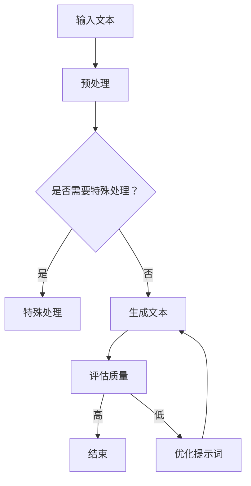

                 

## 文章标题

### 提示词工程在自然语言生成中的质量控制

**关键词：** 提示词工程、自然语言生成、质量控制、提示词优化、质量评估

---

**摘要：** 本文旨在探讨提示词工程在自然语言生成中的关键作用和质量控制方法。首先，我们将回顾自然语言生成的定义和基本概念，接着深入分析提示词工程的原理和设计策略。随后，文章将探讨提示词工程中面临的多个关键问题，包括质量评估、多样性与连贯性，以及隐私与伦理问题。本文还将介绍自然语言生成的质量评估方法和实际应用场景，并通过具体案例研究和未来展望，展望提示词工程的发展趋势和潜在挑战。

---

## 第一部分：提示词工程基础

### 第1章：自然语言生成的概述

#### 1.1 自然语言生成的定义与历史发展

自然语言生成（Natural Language Generation，NLG）是指利用计算机技术生成自然语言的文本内容，使其具备人类语言的自然流畅性和表达力。从历史角度来看，自然语言生成的研究始于20世纪50年代，当时人工智能的兴起推动了自然语言处理（Natural Language Processing，NLP）和自然语言生成技术的发展。

自然语言生成的核心目标是实现从机器语言到自然语言的自动转换，使计算机能够理解和生成人类可读的文本。这一目标在多个领域都具有重要的应用价值，包括但不限于：文本摘要、对话系统、自动新闻编写、机器翻译、文本生成与编辑等。

#### 1.2 自然语言生成的应用场景

自然语言生成的应用场景广泛，涵盖了多种领域。以下是一些典型的应用场景：

- **文本摘要与生成：** 利用自然语言生成技术，可以自动提取长篇文章或文档的主要信息，生成简洁、概括的摘要。这在信息过载的时代尤为重要，可以帮助用户快速获取关键信息。

- **对话系统：** 对话系统能够与用户进行自然语言交互，提供个性化服务。自然语言生成技术是实现对话系统核心功能的关键组件，使系统能够根据用户输入生成合适的响应。

- **自动新闻编写：** 利用自然语言生成技术，可以自动生成新闻报道，提高新闻生产的效率和准确性。这对于新闻机构、金融报告、体育赛事报道等领域具有显著的应用价值。

- **机器翻译：** 机器翻译是自然语言生成的一个重要应用领域，旨在实现不同语言之间的自动翻译。自然语言生成技术通过生成目标语言的文本，提高了翻译的质量和效率。

- **文本生成与编辑：** 自然语言生成技术可以用于生成高质量的文章、报告、论文等文本内容。同时，它还可以用于文本的编辑和修改，提高文本的流畅性和准确性。

#### 1.3 提示词工程的基本概念

提示词工程（Prompt Engineering）是自然语言生成领域中的一个重要分支，它关注如何设计和优化提示词（Prompt），以提升自然语言生成的质量和效果。提示词是一种引导生成模型生成特定内容的关键输入，它通常包含一些关键词、短语或问题，用于引导模型生成相关文本。

提示词工程的核心任务是设计有效的提示词，以引导模型生成高质量、符合预期的文本内容。提示词的质量直接影响自然语言生成的结果，因此提示词工程在自然语言生成中的应用具有重要意义。

### 第2章：提示词设计与生成

#### 2.1 提示词的类型与作用

提示词根据其在自然语言生成中的功能，可以分为以下几类：

- **关键词提示词：** 这类提示词主要用于提供关键词或主题，引导模型生成与特定主题相关的文本。关键词提示词能够帮助模型快速抓住文本的核心内容，提高生成文本的相关性和准确性。

- **问题提示词：** 这类提示词通常包含问题或疑问句，用于引导模型生成回答或解释。问题提示词能够激发模型的思考，生成更具有逻辑性和创造性的文本内容。

- **短语提示词：** 这类提示词包含短语或句子，用于引导模型生成相关联的文本。短语提示词能够提供更丰富的语义信息，帮助模型更好地理解和生成文本。

提示词的作用主要体现在以下几个方面：

- **引导生成方向：** 提示词为模型提供了生成文本的起点和方向，帮助模型在生成过程中保持一致性和连贯性。

- **提高生成质量：** 设计有效的提示词可以引导模型生成高质量、符合预期的文本内容，减少生成过程中的错误和偏差。

- **优化生成速度：** 合理使用提示词可以加快模型生成文本的速度，提高生成效率。

#### 2.2 提示词的生成方法

提示词的生成方法主要包括以下几种：

- **基于关键词的生成方法：** 这种方法通过分析输入文本的关键词，生成与关键词相关的提示词。常见的实现方式包括关键词提取和关键词扩展。

  - **关键词提取：** 利用自然语言处理技术，从输入文本中提取关键词。常见的关键词提取方法包括TF-IDF、LDA等。

  - **关键词扩展：** 在提取关键词的基础上，利用词向量、语义网络等技术，扩展关键词的语义信息，生成更丰富的提示词。

- **基于问题的生成方法：** 这种方法通过生成与输入文本相关的问题，引导模型生成回答。常见的实现方式包括问题生成和问题回答。

  - **问题生成：** 利用自然语言处理技术，从输入文本中生成相关的问题。常见的问题生成方法包括模板匹配、生成对抗网络（GAN）等。

  - **问题回答：** 利用预训练的语言模型（如BERT、GPT等），根据生成的问题生成回答。这种方法能够充分利用模型的语义理解能力，生成高质量的回答。

- **基于短语生成方法：** 这种方法通过生成与输入文本相关的短语或句子，引导模型生成相关文本。常见的实现方式包括短语提取、短语扩展等。

  - **短语提取：** 利用自然语言处理技术，从输入文本中提取短语。常见的方法包括规则提取、基于统计的方法等。

  - **短语扩展：** 在提取短语的基础上，利用词向量、语义网络等技术，扩展短语的语义信息，生成更丰富的提示词。

#### 2.3 提示词的优化策略

提示词的优化是提升自然语言生成质量的关键环节。以下是一些常用的提示词优化策略：

- **多样性优化：** 提高提示词的多样性，避免生成过于重复或单调的文本。常见的多样性优化方法包括：

  - **随机化：** 在生成提示词时，引入随机性，生成多样化的提示词。

  - **词向量扩展：** 利用词向量技术，扩展关键词的语义信息，生成具有多样性的提示词。

- **连贯性优化：** 提高提示词的连贯性，确保生成文本的一致性和流畅性。常见的连贯性优化方法包括：

  - **上下文关联：** 在生成提示词时，考虑上下文信息，确保提示词与上下文关联紧密。

  - **语义匹配：** 利用自然语言处理技术，确保生成的提示词与输入文本在语义上匹配。

- **相关性优化：** 提高提示词的相关性，确保生成文本与输入文本主题一致。常见的相关性优化方法包括：

  - **关键词匹配：** 利用关键词匹配技术，确保生成的提示词与输入文本的关键词相关。

  - **语义匹配：** 利用自然语言处理技术，确保生成的提示词与输入文本在语义上相关。

### 第3章：提示词工程中的关键问题

#### 3.1 提示词的质量评估

提示词的质量直接影响自然语言生成的效果，因此对提示词的质量评估至关重要。以下是一些常见的提示词质量评估方法：

- **定量评估：** 通过计算提示词的相关性、多样性、连贯性等指标，对提示词的质量进行量化评估。

  - **相关性评估：** 利用自然语言处理技术，计算提示词与输入文本的相关性。常见的方法包括TF-IDF、cosine similarity等。

  - **多样性评估：** 通过计算提示词的多样性指标，如词汇丰富度、短语多样性等，评估提示词的多样性。

  - **连贯性评估：** 通过计算提示词之间的连贯性指标，如语义相似度、逻辑一致性等，评估提示词的连贯性。

- **定性评估：** 通过人工评估，对提示词的质量进行主观评价。常见的方法包括问卷调查、专家评审等。

#### 3.2 提示词的多样性与连贯性

提示词的多样性与连贯性是自然语言生成中两个重要的质量指标。以下是一些常见的多样性与连贯性优化方法：

- **多样性优化：**

  - **词汇多样性：** 通过增加不同词汇的使用，提高提示词的词汇多样性。

  - **短语多样性：** 通过使用不同的短语和表达方式，提高提示词的短语多样性。

  - **句式多样性：** 通过使用不同的句式和语法结构，提高提示词的句式多样性。

- **连贯性优化：**

  - **语义连贯性：** 通过确保提示词之间的语义关联，提高提示词的语义连贯性。

  - **逻辑连贯性：** 通过确保提示词之间的逻辑关系合理，提高提示词的逻辑连贯性。

  - **上下文连贯性：** 通过考虑上下文信息，确保提示词与上下文一致，提高提示词的上下文连贯性。

#### 3.3 提示词的隐私与伦理问题

在提示词工程中，隐私与伦理问题不可忽视。以下是一些常见的隐私与伦理问题：

- **数据隐私：** 提示词的生成和使用过程中，可能会涉及用户隐私数据。如何保护用户隐私数据，确保数据安全，是提示词工程中需要关注的重要问题。

- **歧视与偏见：** 提示词的生成和使用可能会导致歧视和偏见。例如，提示词可能包含对特定群体的负面标签，导致生成文本产生歧视性内容。如何避免歧视与偏见，确保生成文本的公正性，是提示词工程中需要重视的问题。

- **透明性与可解释性：** 提示词工程涉及到复杂的技术和算法，用户可能难以理解提示词生成的过程和结果。如何提高透明性和可解释性，让用户了解和信任提示词工程，是提示词工程中需要解决的重要问题。

## 第4章：自然语言生成的质量评估

### 4.1 评价指标与方法

自然语言生成的质量评估是确保生成文本质量的关键环节。以下是一些常见的评价指标和方法：

- **自动评价指标：**

  - **BLEU（BLEU Score）：** BLEU是一种基于记分牌的自动评估方法，通过计算生成文本与参考文本之间的相似度来评估生成文本的质量。

  - **ROUGE（ROUGE Score）：** ROUGE是一种基于记分牌的自动评估方法，通过计算生成文本与参考文本之间的重叠度来评估生成文本的质量。

  - **METEOR（METEOR Score）：** METEOR是一种基于词嵌入的自动评估方法，通过计算生成文本与参考文本之间的词义相似度来评估生成文本的质量。

- **人工评价指标：**

  - **主观评价：** 通过人工评审，对生成文本的质量进行主观评价。常见的方法包括评分量表、问卷调查等。

  - **客观评价：** 通过计算生成文本与参考文本之间的差距，对生成文本的质量进行客观评价。常见的方法包括文本相似度、词汇重叠度等。

### 4.2 质量评估的挑战与解决方案

自然语言生成的质量评估面临着诸多挑战，以下是一些常见的挑战和解决方案：

- **多样性挑战：** 生成文本的多样性难以评估。解决方案包括引入多样性评价指标，如词汇多样性、短语多样性等。

- **连贯性挑战：** 生成文本的连贯性难以评估。解决方案包括引入连贯性评价指标，如语义相似度、逻辑一致性等。

- **主观性挑战：** 人工评价指标存在主观性，难以保证评估结果的客观性。解决方案包括引入自动评价指标，提高评估结果的客观性。

- **复杂性挑战：** 自然语言生成的质量评估方法复杂，难以实现。解决方案包括简化评估方法，提高评估方法的实用性和可操作性。

### 4.3 实际应用中的质量评估

在实际应用中，自然语言生成的质量评估具有重要意义。以下是一些实际应用中的质量评估案例：

- **文本摘要：** 在文本摘要任务中，生成文本的质量直接影响摘要的准确性和可读性。通过质量评估，可以识别和优化生成文本中的问题，提高摘要的质量。

- **对话系统：** 在对话系统中，生成文本的质量直接影响用户体验。通过质量评估，可以确保生成文本的准确性和连贯性，提高对话系统的服务质量。

- **自动新闻编写：** 在自动新闻编写任务中，生成文本的质量直接影响新闻的准确性和可读性。通过质量评估，可以优化生成文本的表达方式，提高新闻的传播效果。

## 第二部分：提示词工程在自然语言生成中的应用

### 第5章：文本摘要与生成

#### 5.1 文本摘要的概述

文本摘要（Text Summarization）是一种重要的自然语言生成任务，旨在从原始文本中提取关键信息，生成简洁、概括的摘要。文本摘要具有广泛的应用场景，如信息检索、文档整理、智能问答等。

文本摘要可以分为两类：提取式摘要（Extractive Summarization）和生成式摘要（Generative Summarization）。

- **提取式摘要：** 提取式摘要从原始文本中直接提取关键句子或段落，作为摘要内容。这种方法简单、高效，但往往无法生成全新的摘要内容。

- **生成式摘要：** 生成式摘要通过自然语言生成技术，生成全新的摘要内容。这种方法能够生成更具创造性和多样性的摘要，但生成质量受到提示词工程的影响。

#### 5.2 文本摘要的生成方法

文本摘要的生成方法主要包括基于规则的方法、基于统计的方法和基于神经网络的方法。

- **基于规则的方法：** 基于规则的方法通过定义一系列规则，从原始文本中提取关键句子或段落。这种方法简单、易于实现，但规则定义复杂，且难以适应复杂的文本结构。

- **基于统计的方法：** 基于统计的方法通过计算文本中的词频、词序列等信息，提取关键句子或段落。这种方法具有较高的准确性和灵活性，但受限于统计模型的局限性。

- **基于神经网络的方法：** 基于神经网络的方法利用深度学习技术，从原始文本中生成摘要。这种方法能够生成高质量、多样化的摘要内容，但模型训练复杂，计算资源需求较高。

#### 5.3 提示词在文本摘要中的作用

提示词在文本摘要中发挥着重要作用，能够显著影响摘要的生成质量和效果。以下是一些提示词在文本摘要中的应用：

- **关键词提取：** 提示词可以通过提取原始文本中的关键词，引导模型生成摘要。关键词提取有助于模型理解文本的主题和结构，提高摘要的准确性。

- **问题引导：** 提示词可以通过生成与文本相关的问题，引导模型生成回答。这种方法有助于模型生成具有逻辑性和创造性的摘要内容。

- **上下文关联：** 提示词可以通过提供上下文信息，引导模型生成与文本相关的内容。上下文关联有助于模型理解文本的背景和语境，提高摘要的连贯性。

### 第6章：对话系统与自然语言生成

#### 6.1 对话系统的概述

对话系统（Dialogue System）是一种能够与用户进行自然语言交互的人工智能系统，旨在提供个性化、智能化的服务。对话系统可以分为两类：任务型对话系统和闲聊型对话系统。

- **任务型对话系统：** 任务型对话系统专注于完成特定任务，如客服、智能助手等。这类对话系统需要理解用户意图，提供准确的响应。

- **闲聊型对话系统：** 闲聊型对话系统旨在与用户进行愉快的闲聊，如聊天机器人、社交机器人等。这类对话系统需要具备良好的对话能力和情感表达能力。

#### 6.2 对话系统的生成方法

对话系统的生成方法主要包括基于规则的方法、基于模板的方法和基于神经网络的方法。

- **基于规则的方法：** 基于规则的方法通过定义一系列规则，根据用户输入生成响应。这种方法简单、易于实现，但灵活性较低，难以应对复杂的对话场景。

- **基于模板的方法：** 基于模板的方法通过定义一系列模板，根据用户输入生成响应。这种方法具有较高的灵活性，但模板定义复杂，且难以适应多样化的对话场景。

- **基于神经网络的方法：** 基于神经网络的方法利用深度学习技术，从大量对话数据中学习生成策略。这种方法能够生成高质量、个性化的对话内容，但模型训练复杂，计算资源需求较高。

#### 6.3 提示词在对话系统中的应用

提示词在对话系统中发挥着重要作用，能够显著影响对话的质量和效果。以下是一些提示词在对话系统中的应用：

- **意图识别：** 提示词可以通过提供关键词或短语，帮助模型识别用户的意图。意图识别是任务型对话系统的核心任务，有效的提示词有助于提高意图识别的准确性。

- **上下文引导：** 提示词可以通过提供上下文信息，帮助模型理解对话的背景和语境。上下文引导有助于模型生成更符合对话场景的响应。

- **情感表达：** 提示词可以通过提供情感相关的关键词，帮助模型生成具有情感表达能力的对话内容。情感表达是闲聊型对话系统的重要特点，有效的提示词有助于提升对话的情感共鸣。

### 第7章：文本生成与编辑

#### 7.1 文本生成的概述

文本生成（Text Generation）是一种利用自然语言生成技术，从输入文本或无监督数据中生成新文本的任务。文本生成具有广泛的应用场景，如文章写作、对话生成、机器翻译等。

文本生成可以分为两类：基于规则的方法和基于神经网络的方法。

- **基于规则的方法：** 基于规则的方法通过定义一系列规则，生成文本内容。这种方法简单、易于实现，但灵活性较低，难以生成高质量、多样化的文本。

- **基于神经网络的方法：** 基于神经网络的方法利用深度学习技术，从大量数据中学习生成策略。这种方法能够生成高质量、多样化的文本，但模型训练复杂，计算资源需求较高。

#### 7.2 文本生成的算法原理

文本生成的算法原理主要包括以下几个步骤：

1. **数据预处理：** 对输入文本进行预处理，如分词、去停用词等，为后续生成过程提供基础数据。

2. **编码器-解码器模型：** 编码器（Encoder）将输入文本编码为向量表示，解码器（Decoder）根据编码器的输出生成文本。常见的编码器-解码器模型包括Seq2Seq模型、Transformer模型等。

3. **生成文本：** 解码器根据编码器的输出，生成新文本。生成过程中，解码器通过预测下一个单词或字符，逐步生成完整文本。

#### 7.3 提示词在文本生成中的应用

提示词在文本生成中发挥着重要作用，能够显著影响生成文本的质量和效果。以下是一些提示词在文本生成中的应用：

- **主题引导：** 提示词可以通过提供关键词或主题，引导模型生成符合特定主题的文本。

- **结构引导：** 提示词可以通过提供文本的结构信息，如段落标题、句子结构等，引导模型生成具有良好结构的文本。

- **情感引导：** 提示词可以通过提供情感相关的关键词，引导模型生成具有情感表达的文本。

### 第8章：多模态自然语言生成

#### 8.1 多模态自然语言生成的概述

多模态自然语言生成（Multimodal Natural Language Generation）是一种结合多种模态（如文本、图像、音频等）的生成技术，旨在生成与多模态数据相关的自然语言描述。多模态自然语言生成具有广泛的应用场景，如图像描述生成、视频摘要、虚拟现实等。

多模态自然语言生成可以分为两类：基于单一模态的方法和基于多模态融合的方法。

- **基于单一模态的方法：** 基于单一模态的方法仅利用单一模态的数据进行生成，如文本描述图像。这种方法简单、易于实现，但生成的文本质量受限于单一模态的数据。

- **基于多模态融合的方法：** 基于多模态融合的方法将多种模态的数据进行融合，生成更具有创意性和多样性的文本。这种方法能够充分利用多种模态的数据，提高生成文本的质量。

#### 8.2 多模态自然语言生成的挑战

多模态自然语言生成面临着诸多挑战，以下是一些常见挑战：

- **模态融合：** 如何有效地融合多种模态的数据，是一个关键挑战。多模态数据之间存在差异和互补关系，如何充分利用这些关系，提高生成文本的质量，是一个重要的研究问题。

- **数据稀缺：** 多模态数据通常较为稀缺，如何从有限的样本中学习有效的生成策略，是一个重要的挑战。

- **多样化生成：** 多模态自然语言生成需要生成具有多样性的文本，以满足不同应用场景的需求。如何在保持高质量的同时，实现多样化生成，是一个重要的研究问题。

#### 8.3 提示词工程的多模态应用

提示词工程在多模态自然语言生成中具有重要意义，能够显著影响生成文本的质量和效果。以下是一些提示词工程的多模态应用：

- **模态选择与融合：** 提示词可以通过提供关键词或短语，引导模型选择和融合合适的模态数据。例如，在图像描述生成中，提示词可以引导模型选择图像特征或文本特征。

- **主题引导：** 提示词可以通过提供关键词或主题，引导模型生成与多模态数据相关的文本描述。例如，在视频摘要中，提示词可以引导模型生成与视频内容相关的文本摘要。

- **情感引导：** 提示词可以通过提供情感相关的关键词，引导模型生成具有情感表达的文本。例如，在音频描述生成中，提示词可以引导模型生成具有情感色彩的音频描述。

### 第9章：案例研究与未来展望

#### 9.1 提示词工程在现实世界中的应用案例

提示词工程在现实世界中具有广泛的应用，以下是一些典型的应用案例：

- **智能客服：** 在智能客服系统中，提示词工程被用于生成与用户提问相关的自动回复。通过设计有效的提示词，系统可以快速识别用户意图，提供准确、自然的回答。

- **自动新闻编写：** 在自动新闻编写系统中，提示词工程被用于生成新闻摘要和标题。通过设计关键词提示词，系统可以快速提取新闻的核心内容，生成简洁、概括的新闻摘要。

- **教育辅助：** 在教育辅助系统中，提示词工程被用于生成教学材料和学习指导。通过设计问题提示词，系统可以引导学生进行思考和探究，提高学习效果。

- **艺术创作：** 在艺术创作中，提示词工程被用于生成诗歌、故事、音乐等艺术作品。通过设计创意提示词，系统可以激发创作灵感，生成新颖、独特的艺术作品。

#### 9.2 提示词工程的未来发展趋势

随着人工智能技术的不断发展，提示词工程在自然语言生成中的应用前景广阔。以下是一些未来发展趋势：

- **多模态融合：** 提示词工程将向多模态融合方向发展，充分利用多种模态的数据，提高生成文本的质量和多样性。

- **个性化生成：** 提示词工程将向个性化生成方向发展，根据用户需求和兴趣，生成定制化的文本内容。

- **知识增强：** 提示词工程将向知识增强方向发展，利用外部知识库和语义网络，提高生成文本的知识性和准确性。

- **跨领域应用：** 提示词工程将在更多领域得到应用，如医疗、金融、法律等，为各行各业提供智能化的文本生成服务。

#### 9.3 提示词工程面临的挑战与解决方案

尽管提示词工程在自然语言生成中取得了显著成果，但仍然面临一些挑战：

- **数据稀缺：** 提示词工程需要大量高质量的训练数据，但在实际应用中，数据往往稀缺。解决方案包括数据增强、迁移学习等。

- **生成质量：** 提示词工程需要提高生成文本的质量，减少生成过程中的错误和偏差。解决方案包括优化提示词设计、引入知识增强等。

- **隐私与伦理：** 提示词工程需要关注隐私和伦理问题，确保生成文本的公正性和透明性。解决方案包括数据隐私保护、伦理审查等。

### 附录

#### 附录A：常见自然语言生成框架介绍

- **深度学习框架：** 如TensorFlow、PyTorch等，提供丰富的工具和库，支持自然语言生成模型的训练和部署。

- **自然语言处理库：** 如NLTK、spaCy、Stanford NLP等，提供丰富的API和工具，支持自然语言处理任务。

- **提示词生成工具：** 如PromptGen、PromptBox等，提供提示词生成和优化的功能，帮助开发者设计有效的提示词。

---

**附录B：Mermaid流程图**

- **自然语言生成的流程：**



**附录C：伪代码示例**

- **文本摘要生成算法：**

```plaintext
function generateAbstract(inputText, context):
    # 对输入文本进行预处理
    preprocessedText = preprocessText(inputText)

    # 根据上下文生成摘要
    summary = generateSummary(preprocessedText, context)

    # 返回生成的摘要
    return summary
```

**附录D：数学公式示例**

- **自然语言生成质量评估公式：**

$$
Q = \frac{1}{N} \sum_{i=1}^{N} relevance_i \times diversity_i
$$

其中：
- $Q$ 是总质量分数；
- $N$ 是文本段落数量；
- $relevance_i$ 是第 $i$ 个段落的主题相关性；
- $diversity_i$ 是第 $i$ 个段落的多样性分数。

---

**附录E：代码解读与分析**

- **一个简单的文本生成模型：**

```python
import tensorflow as tf

# 定义模型
model = tf.keras.Sequential([
    tf.keras.layers.Embedding(input_dim=10000, output_dim=16),
    tf.keras.layers.LSTM(128),
    tf.keras.layers.Dense(1, activation='sigmoid')
])

# 编译模型
model.compile(loss='binary_crossentropy', optimizer='adam', metrics=['accuracy'])

# 训练模型
model.fit(x_train, y_train, epochs=10, batch_size=32)
```

- **代码解读：**

该代码展示了如何使用TensorFlow定义、编译和训练一个简单的文本生成模型。首先，定义了一个序列模型，包含嵌入层（Embedding Layer）、长短期记忆层（LSTM Layer）和全连接层（Dense Layer）。然后，使用编译方法（compile）设置模型的损失函数、优化器和评价指标。最后，使用fit方法（fit）对模型进行训练，输入训练数据和标签，设置训练轮数（epochs）和批量大小（batch_size）。

---

**作者信息：**

- 作者：AI天才研究院/AI Genius Institute & 禅与计算机程序设计艺术 /Zen And The Art of Computer Programming**

