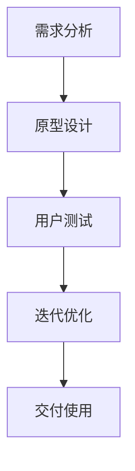
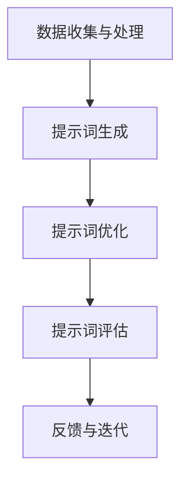

                 

# 《提示词工程在虚拟现实交互设计中的创新》

## 关键词

- 虚拟现实交互设计
- 提示词工程
- 自然语言处理
- 机器学习
- 数据可视化
- 人机交互

## 摘要

本文深入探讨了提示词工程在虚拟现实交互设计中的创新应用。首先，我们回顾了虚拟现实交互设计的基础和原则，然后详细介绍了提示词工程的定义、组成部分以及其在虚拟现实交互设计中的重要性。接下来，我们分析了提示词在虚拟现实交互中的应用类型和功能，并通过数学模型和伪代码展示了提示词工程的技术实现。随后，我们通过一个具体的虚拟现实项目实战，展示了提示词工程的开发流程和应用效果。最后，我们对提示词工程的挑战和未来趋势进行了展望，并提出了最佳实践建议。

## 引言

虚拟现实（Virtual Reality，VR）技术的发展，为我们带来了全新的交互体验。在虚拟现实环境中，用户通过头戴显示器（HMD）、手持控制器等设备，与三维虚拟世界进行互动。这种高度沉浸的交互体验，使得虚拟现实在游戏、教育、医疗等多个领域有着广泛的应用。然而，虚拟现实交互设计的复杂性也带来了许多挑战，如何有效地引导用户在虚拟环境中进行操作，成为了研究者们关注的焦点。

提示词工程（Prompt Engineering）作为自然语言处理（Natural Language Processing，NLP）和机器学习（Machine Learning，ML）的交叉领域，旨在通过设计和优化提示词，提高系统对用户需求的响应能力。在虚拟现实交互设计中，提示词工程可以提供有效的信息引导和操作提示，帮助用户更轻松地适应虚拟环境，提高交互效率。

本文旨在探讨提示词工程在虚拟现实交互设计中的创新应用。我们将从以下几个方面进行论述：

1. 虚拟现实交互设计基础：回顾虚拟现实技术的历史、定义、关键技术和应用领域，分析虚拟现实交互设计的原则和挑战。
2. 提示词工程概述：介绍提示词工程的定义、重要性、组成部分、常见工具和技术，以及其在虚拟现实交互设计中的应用。
3. 提示词在虚拟现实交互中的应用：探讨提示词在虚拟现实交互中的功能、类型和实践应用。
4. 提示词工程的技术实现：分析提示词工程的技术栈，展示提示词工程的技术实现过程，包括数学模型、伪代码和项目实战。
5. 提示词工程的挑战与未来趋势：讨论提示词工程在虚拟现实交互设计中的挑战和未来发展趋势。
6. 总结与展望：总结本文的主要观点，展望提示词工程在虚拟现实交互设计中的前景。

## 第一部分：虚拟现实交互设计基础

### 第1章 虚拟现实交互设计概述

#### 1.1 虚拟现实技术基础

虚拟现实（Virtual Reality，VR）是一种通过计算机生成的高度沉浸式模拟环境，使用户能够与虚拟世界进行互动。VR技术涉及到多个领域，包括计算机视觉、图形学、音频处理和人机交互等。以下是VR技术的基础知识：

**1.1.1 虚拟现实的历史与定义**

虚拟现实的概念最早可以追溯到20世纪60年代，当时麻省理工学院的伊凡·苏瑟兰（Ivan Sutherland）提出了“虚拟环境”的概念。然而，真正意义上的VR技术起源于20世纪80年代，随着计算机技术的发展，VR技术逐渐成熟。

虚拟现实可以定义为一种通过计算机生成的人工环境，用户可以通过特殊的设备（如头戴显示器、手柄控制器等）与这个环境进行交互。VR技术不仅模拟了视觉和听觉，还可以模拟其他感官，如触觉和嗅觉。

**1.1.2 虚拟现实的关键技术**

VR技术涉及到多个关键技术，包括三维图形生成、实时渲染、跟踪定位、传感器技术和人机交互等。

- **三维图形生成**：三维图形生成是VR技术的核心，通过计算机图形学的方法，生成用户可以看到的三维场景。
- **实时渲染**：实时渲染是指在虚拟环境中，实时计算并绘制用户视角的图像。这要求计算机具有很高的性能和处理速度。
- **跟踪定位**：跟踪定位技术用于确定用户在虚拟环境中的位置和姿态。常见的跟踪技术包括光学跟踪、超声波跟踪和惯性跟踪等。
- **传感器技术**：传感器技术用于捕捉用户的动作和姿态，常见的传感器包括摄像头、运动传感器、力反馈控制器等。
- **人机交互**：人机交互是VR技术的关键部分，用户通过特定的设备与虚拟环境进行互动，如头戴显示器、手柄控制器等。

**1.1.3 虚拟现实的应用领域**

虚拟现实技术在多个领域有着广泛的应用，包括游戏、教育、医疗、建筑、军事等。

- **游戏**：VR游戏提供了高度沉浸的体验，让用户可以在虚拟世界中探索和冒险。
- **教育**：VR技术可以模拟复杂的实验和场景，提供更加直观和生动的学习体验。
- **医疗**：VR技术在医学教学、心理治疗和手术模拟等领域有着重要应用。
- **建筑**：VR技术可以帮助建筑师和设计师在项目规划阶段创建虚拟模型，进行预览和评估。
- **军事**：VR技术用于训练士兵，模拟战斗场景和任务执行。

#### 1.2 虚拟现实交互设计原则

虚拟现实交互设计的目标是提供一种自然、直观、高效的交互方式，使用户能够轻松地在虚拟环境中操作。以下是虚拟现实交互设计的一些基本原则：

**1.2.1 用户体验设计**

用户体验设计（User Experience Design，UXD）是虚拟现实交互设计的重要组成部分。用户体验设计强调用户的需求和感受，通过研究用户行为和需求，设计出符合用户期望的交互界面和体验。

- **易用性**：虚拟现实交互设计应该尽可能简单易用，减少用户的学习成本。
- **反馈**：系统应该及时提供反馈，使用户了解自己的操作结果。
- **一致性**：交互元素和行为应该保持一致性，避免用户混淆。

**1.2.2 交互设计流程**

交互设计流程是虚拟现实交互设计的核心，包括需求分析、原型设计、用户测试和迭代优化等步骤。

- **需求分析**：通过研究用户需求，确定系统的功能和要求。
- **原型设计**：创建交互原型，用于展示系统的交互流程和界面设计。
- **用户测试**：通过用户测试，评估系统的可用性和用户体验，收集用户反馈。
- **迭代优化**：根据用户反馈，对系统进行优化和改进。

**1.2.3 交互设计模式**

虚拟现实交互设计采用多种交互设计模式，包括手势交互、语音交互、眼动交互等。

- **手势交互**：手势交互是最自然的交互方式之一，用户可以通过手势进行操作，如移动、旋转和缩放物体。
- **语音交互**：语音交互提供了便捷的交互方式，用户可以通过语音命令控制虚拟环境。
- **眼动交互**：眼动交互通过捕捉用户的眼动，实现交互操作，如选择对象、查看信息等。

#### 1.3 虚拟现实交互设计中的挑战与机会

虚拟现实交互设计面临着许多挑战和机会。以下是一些主要的挑战和机会：

**1.3.1 技术限制**

虚拟现实技术仍在不断发展，但仍然存在一些技术限制，如分辨率、延迟和设备舒适度等。

- **分辨率**：虚拟现实设备的分辨率仍然有限，这可能会影响用户的视觉体验。
- **延迟**：延迟是虚拟现实交互设计中的一个关键问题，延迟过高会影响交互体验的流畅性。
- **设备舒适度**：长时间佩戴头戴显示器（HMD）可能会给用户带来不适感。

**1.3.2 用户适应性**

不同用户对虚拟现实交互的适应性不同。一些用户可能会感到眩晕、恶心等不适症状，而另一些用户则可能无法适应新的交互方式。

- **眩晕和恶心**：长时间处于虚拟环境中，一些用户可能会出现眩晕和恶心等不适症状。
- **操作不适应**：用户可能需要时间来适应新的交互方式，如手势交互和语音交互。

**1.3.3 未来发展趋势**

虚拟现实交互设计的发展趋势包括更高的分辨率、更低的延迟、更自然的交互方式等。

- **更高分辨率**：随着技术的进步，虚拟现实设备的分辨率将不断提高，提供更清晰的视觉体验。
- **更低延迟**：通过优化算法和硬件，虚拟现实交互的延迟将不断降低，提供更流畅的交互体验。
- **更自然的交互方式**：未来的虚拟现实交互设计将更注重用户的自然行为，如手势、眼动和语音等。

#### 1.4 虚拟现实交互设计的Mermaid流程图

以下是一个简单的Mermaid流程图，展示了虚拟现实交互设计的基本流程：



#### 1.5 虚拟现实交互设计中的核心算法原理讲解

虚拟现实交互设计中的核心算法包括三维图形生成、实时渲染、跟踪定位和人机交互等。

**1.5.1 3D空间感知算法**

3D空间感知算法是虚拟现实交互设计的基础，用于生成三维虚拟环境。常用的3D空间感知算法包括：

- **三维建模**：通过计算机图形学的方法，创建三维模型，包括多面体、曲面等。
- **三维网格生成**：将三维模型转换为网格，以便在计算机中进行渲染和处理。
- **三维空间定位**：通过传感器技术，如摄像头、运动传感器等，确定用户在虚拟环境中的位置和姿态。

**1.5.2 动作识别算法**

动作识别算法用于识别和解析用户在虚拟环境中的动作。常用的动作识别算法包括：

- **手势识别**：通过摄像头和深度传感器，识别用户的手势动作，如移动、旋转、点击等。
- **运动轨迹分析**：分析用户运动轨迹，识别用户意图，如前进、后退、转向等。
- **姿态估计**：通过摄像头和传感器，估计用户的姿态，如站立、坐下、弯曲等。

**1.5.3 语音交互算法**

语音交互算法用于实现用户与虚拟环境的语音交互。常用的语音交互算法包括：

- **语音识别**：将用户的语音转化为文本或命令，实现语音输入。
- **语音合成**：将文本或命令转化为语音输出，实现语音反馈。
- **语音增强**：通过噪声抑制、语音清晰度提升等技术，提高语音交互质量。

**1.5.4 交互反馈算法**

交互反馈算法用于提供实时反馈，使用户了解操作结果。常用的交互反馈算法包括：

- **视觉反馈**：通过图形和动画，展示用户操作的效果。
- **声音反馈**：通过声音效果，如提示音、警示音等，提供操作反馈。
- **触觉反馈**：通过触觉设备，提供触觉反馈，如震动、压力等。

#### 1.6 虚拟现实交互设计的Mermaid流程图

以下是一个简单的Mermaid流程图，展示了虚拟现实交互设计的基本流程：


### 第二部分：提示词工程概述

#### 第2章 提示词工程概述

提示词工程（Prompt Engineering）是自然语言处理（Natural Language Processing，NLP）和机器学习（Machine Learning，ML）的交叉领域，旨在通过设计和优化提示词，提高系统对用户需求的响应能力。在虚拟现实交互设计中，提示词工程可以提供有效的信息引导和操作提示，帮助用户更轻松地适应虚拟环境。

#### 2.1 提示词工程的定义与重要性

**2.1.1 提示词工程的定义**

提示词工程可以定义为一种系统化的方法，用于创建、优化和评估用于引导用户行为的提示词。提示词（Prompts）是指用于引导用户完成特定任务的文字、语音或其他形式的提示信息。

**2.1.2 提示词工程的重要性**

在虚拟现实交互设计中，提示词工程具有以下几个重要作用：

- **提高用户交互效率**：通过提供明确的提示词，用户可以更快地理解系统功能和操作方法，提高交互效率。
- **降低用户学习成本**：提示词工程可以减少用户在虚拟环境中摸索的时间，降低学习成本。
- **优化用户体验**：合理的提示词设计可以提供更好的用户体验，使用户在虚拟环境中感到舒适和满足。
- **增强交互智能化**：通过机器学习和自然语言处理技术，提示词工程可以不断优化和适应用户需求，提高系统的智能化水平。

#### 2.2 提示词工程的组成部分

提示词工程包括以下几个核心组成部分：

- **数据收集与处理**：收集与用户交互相关的数据，如用户行为、操作记录等，并进行数据预处理和清洗。
- **提示词生成**：根据用户需求和交互场景，生成具有引导作用的提示词。
- **提示词优化**：通过分析用户反馈和交互数据，优化和调整提示词，以提高其效果和适应性。
- **提示词评估**：评估提示词的效果和用户满意度，为后续优化提供依据。

#### 2.3 提示词工程的常见工具与技术

提示词工程涉及到多个技术和工具，包括自然语言处理、机器学习、数据可视化和交互设计等。以下是常见工具和技术：

- **自然语言处理技术**：用于处理和分析文本数据，如词频统计、文本分类、命名实体识别等。
- **机器学习算法**：用于训练模型，预测用户需求和行为，如决策树、支持向量机、神经网络等。
- **数据可视化技术**：用于展示和分析交互数据，如折线图、柱状图、热力图等。
- **交互设计工具**：用于设计和管理虚拟现实交互界面，如Unity、Unreal Engine等。

#### 2.4 提示词工程的发展历程与趋势

**2.4.1 提示词工程的起源**

提示词工程的起源可以追溯到20世纪80年代，当时研究人员开始关注如何通过文本提示来引导用户完成特定任务。随着自然语言处理和机器学习技术的发展，提示词工程逐渐成为一个独立的领域。

**2.4.2 提示词工程的发展历程**

在过去的几十年中，提示词工程经历了多个发展阶段：

- **早期阶段**：主要关注文本提示的设计和优化，通过简单的规则和模板生成提示词。
- **中期阶段**：引入自然语言处理技术，如词频统计、文本分类等，提高提示词的生成和优化能力。
- **现阶段**：结合机器学习和深度学习技术，实现更智能、个性化的提示词生成和优化。

**2.4.3 提示词工程的未来趋势**

随着人工智能和虚拟现实技术的不断发展，提示词工程将呈现以下趋势：

- **智能化**：通过机器学习和深度学习技术，实现更智能、个性化的提示词生成和优化。
- **多样化**：不仅限于文本提示，还将涵盖语音、图像、视频等多种形式。
- **个性化**：根据用户需求和偏好，提供个性化的提示词，提高用户满意度。

#### 2.5 提示词工程在虚拟现实交互设计中的重要性

**2.5.1 虚拟现实交互中的提示词需求**

虚拟现实交互设计中的提示词需求主要包括以下几个方面：

- **导航提示**：帮助用户在虚拟环境中找到目的地或特定物体。
- **动作提示**：指导用户如何进行特定操作，如移动、旋转、选择等。
- **信息提示**：提供关于虚拟环境、任务或操作的相关信息。
- **情感提示**：通过情感化语言，增强用户的沉浸感和体验。

**2.5.2 提示词工程在虚拟现实交互设计中的应用**

提示词工程在虚拟现实交互设计中的应用包括以下几个方面：

- **交互界面设计**：通过优化提示词，提高用户界面的易用性和可访问性。
- **用户引导**：通过提供明确的提示词，帮助用户更好地理解虚拟环境和操作方法。
- **个性化交互**：根据用户需求和偏好，提供个性化的提示词，提高用户体验。
- **实时反馈**：通过实时反馈，使用户了解操作结果，提高交互效率。

**2.5.3 提示词工程对用户体验的影响**

提示词工程对用户体验的影响主要体现在以下几个方面：

- **交互效率**：通过提供明确的提示词，减少用户的学习成本和操作时间，提高交互效率。
- **用户体验**：优化提示词设计，提高用户在虚拟环境中的沉浸感和满意度。
- **用户满意度**：通过个性化提示词，满足用户需求和偏好，提高用户满意度。
- **系统性能**：优化提示词工程，减少系统的计算和存储资源消耗，提高系统性能。

#### 2.6 提示词工程的Mermaid流程图

以下是一个简单的Mermaid流程图，展示了提示词工程的基本流程：



#### 2.7 提示词工程的核心算法原理讲解

**2.7.1 自然语言处理算法**

自然语言处理（NLP）算法是提示词工程的核心，用于处理和分析文本数据。以下是常用的NLP算法：

- **词频统计**：计算文本中各个单词的出现频率，用于分析文本主题和关键词。
- **文本分类**：将文本分为不同的类别，用于情感分析、新闻分类等。
- **命名实体识别**：识别文本中的命名实体，如人名、地名、组织机构名等。
- **情感分析**：分析文本的情感倾向，用于情感识别、舆情分析等。

**2.7.2 机器学习算法**

机器学习（ML）算法是提示词工程的重要组成部分，用于训练模型，预测用户需求和行为。以下是常用的ML算法：

- **决策树**：通过树形结构对数据进行分析和分类。
- **支持向量机**：通过最大间隔分类模型对数据进行分类。
- **神经网络**：通过多层神经网络对数据进行分类和预测。

**2.7.3 数据可视化算法**

数据可视化（Data Visualization）算法用于展示和分析交互数据。以下是常用的数据可视化算法：

- **折线图**：用于展示数据的变化趋势。
- **柱状图**：用于比较不同数据的大小。
- **热力图**：用于展示数据的热点分布。

#### 2.8 提示词工程的数学模型与公式

**2.8.1 自然语言处理中的数学模型**

自然语言处理中的数学模型包括词频统计、文本分类、命名实体识别和情感分析等。以下是常用的数学模型：

- **词频统计**：词频统计模型用于计算文本中各个单词的出现频率。公式如下：
  $$TF(t) = \frac{count(t)}{total\ count}$$
  其中，$TF(t)$表示单词$t$的词频，$count(t)$表示单词$t$在文本中出现的次数，$total\ count$表示文本中所有单词的出现次数之和。

- **文本分类**：文本分类模型用于将文本分为不同的类别。常用的文本分类模型包括朴素贝叶斯（Naive Bayes）模型和逻辑回归（Logistic Regression）模型。公式如下：
  $$P(y|X) = \frac{P(X|y)P(y)}{P(X)}$$
  其中，$P(y|X)$表示给定特征向量$X$，文本属于类别$y$的概率，$P(X|y)$表示在类别$y$下特征向量$X$的概率，$P(y)$表示类别$y$的概率，$P(X)$表示特征向量$X$的概率。

- **命名实体识别**：命名实体识别模型用于识别文本中的命名实体。常用的命名实体识别模型包括条件随机场（Conditional Random Field，CRF）模型和长短期记忆网络（Long Short-Term Memory，LSTM）模型。公式如下：
  $$P(y_t|x_{1:t}) = \frac{1}{Z} \exp(\theta \cdot f(y_{t-1}, y_t, x_{1:t}))$$
  其中，$P(y_t|x_{1:t})$表示在给定特征序列$x_{1:t}$的情况下，当前词$y_t$的条件概率，$Z$表示归一化常数，$\theta$表示模型参数，$f(y_{t-1}, y_t, x_{1:t})$表示当前词$y_t$的发射概率。

- **情感分析**：情感分析模型用于分析文本的情感倾向。常用的情感分析模型包括朴素贝叶斯（Naive Bayes）模型和卷积神经网络（Convolutional Neural Network，CNN）模型。公式如下：
  $$P(y|X) = \frac{1}{Z} \exp(\theta \cdot f(y, X))$$
  其中，$P(y|X)$表示给定特征向量$X$，文本属于类别$y$的概率，$Z$表示归一化常数，$\theta$表示模型参数，$f(y, X)$表示当前词$y$的发射概率。

**2.8.2 机器学习中的数学模型**

机器学习中的数学模型包括决策树、支持向量机和神经网络等。以下是常用的数学模型：

- **决策树**：决策树模型通过树形结构对数据进行分析和分类。公式如下：
  $$T(x) = \prod_{i=1}^{n} h_i(x)$$
  其中，$T(x)$表示决策树模型对输入特征向量$x$的预测结果，$h_i(x)$表示第$i$个分支的预测结果。

- **支持向量机**：支持向量机模型通过最大间隔分类模型对数据进行分类。公式如下：
  $$w \cdot x - b = 0$$
  其中，$w$表示模型参数，$x$表示输入特征向量，$b$表示偏置项。

- **神经网络**：神经网络模型通过多层神经网络对数据进行分类和预测。公式如下：
  $$z = \sigma(W \cdot x + b)$$
  其中，$z$表示神经网络的输出，$\sigma$表示激活函数，$W$表示模型参数，$x$表示输入特征向量，$b$表示偏置项。

**2.8.3 数据可视化中的数学模型**

数据可视化中的数学模型包括折线图、柱状图和热力图等。以下是常用的数学模型：

- **折线图**：折线图用于展示数据的变化趋势。公式如下：
  $$y = mx + b$$
  其中，$y$表示纵坐标，$x$表示横坐标，$m$表示斜率，$b$表示截距。

- **柱状图**：柱状图用于比较不同数据的大小。公式如下：
  $$height = base \cdot scale$$
  其中，$height$表示柱状图的高度，$base$表示基线，$scale$表示比例尺。

- **热力图**：热力图用于展示数据的热点分布。公式如下：
  $$intensity = (value - min) \cdot \frac{max - min}{width}$$
  其中，$intensity$表示热力图的强度，$value$表示数据值，$min$表示最小值，$max$表示最大值，$width$表示宽度。

#### 2.9 提示词工程在虚拟现实交互设计中的项目实战

**2.9.1 项目背景与目标**

本项目旨在开发一个虚拟现实交互系统，用于演示提示词工程在虚拟现实交互设计中的应用。项目目标包括：

- 设计一个虚拟现实交互场景，模拟一个虚拟商店环境。
- 开发提示词生成和优化算法，用于提供导航、动作和信息提示。
- 集成自然语言处理和机器学习技术，实现智能化的提示词生成和优化。

**2.9.2 开发环境搭建**

为了实现本项目，我们需要搭建以下开发环境：

- **硬件环境**：虚拟现实头戴显示器（如Oculus Rift、HTC Vive等），计算机（如NVIDIA GeForce RTX 3080、Intel Core i7等）。
- **软件环境**：Unity游戏引擎（用于虚拟现实交互设计），Python编程语言（用于自然语言处理和机器学习）。

**2.9.3 提示词生成与优化**

在项目中，我们采用了以下步骤进行提示词生成与优化：

1. **数据收集与处理**：收集用户在虚拟商店中的操作记录，如浏览、购买、搜索等，并进行数据预处理和清洗。
2. **提示词生成**：基于用户操作记录，生成导航、动作和信息提示词。例如，当用户进入商店时，提示词可以是“欢迎光临，请随意浏览商品”。
3. **提示词优化**：根据用户反馈和交互数据，优化提示词。例如，当用户频繁遇到导航困难时，可以增加导航提示词，如“请前往右侧，找到您感兴趣的物品”。
4. **提示词评估**：评估提示词的效果和用户满意度。例如，通过用户问卷调查，了解用户对提示词的满意度。

**2.9.4 提示词评估与反馈**

在项目中，我们采用了以下步骤进行提示词评估与反馈：

1. **用户测试**：邀请用户参与虚拟商店交互，收集用户反馈。
2. **反馈收集**：收集用户对提示词的反馈，如满意度、理解程度等。
3. **反馈处理**：根据用户反馈，调整和优化提示词。
4. **反馈循环**：将优化后的提示词再次提交给用户测试，形成反馈循环。

**2.9.5 项目总结与展望**

本项目通过开发一个虚拟现实交互系统，展示了提示词工程在虚拟现实交互设计中的应用。项目总结如下：

- 提示词工程在虚拟现实交互设计中具有重要作用，可以提高用户交互效率和用户体验。
- 通过集成自然语言处理和机器学习技术，可以实现智能化的提示词生成和优化。
- 提示词工程在虚拟现实交互设计中的未来发展趋势包括更智能化、多样化和个性化。

#### 2.10 提示词工程的最佳实践 Tips

**2.10.1 提示词设计原则**

在设计提示词时，应遵循以下原则：

- **简洁明了**：提示词应简洁明了，避免使用复杂的专业术语。
- **针对性**：根据用户需求和交互场景，设计针对性的提示词。
- **连贯性**：提示词之间应保持连贯性，避免用户产生困惑。

**2.10.2 提示词优化方法**

在优化提示词时，可以采用以下方法：

- **用户反馈**：收集用户反馈，根据用户需求调整提示词。
- **数据分析**：分析用户交互数据，优化提示词效果。
- **A/B测试**：对不同提示词进行A/B测试，选择最优提示词。

**2.10.3 注意事项**

在设计和使用提示词时，应注意以下事项：

- **文化差异**：避免使用可能引起文化冲突的提示词。
- **语言适应性**：确保提示词在不同语言环境下都能正常运行。

**2.10.4 拓展阅读**

- [自然语言处理技术概述](https://www.nlp.seas.harvard.edu/seminar/)
- [机器学习与深度学习应用](https://www.deeplearning.net/)
- [虚拟现实交互设计指南](https://www.vrbook.com/)

### 第三部分：提示词在虚拟现实交互中的应用

#### 第3章 提示词在虚拟现实交互中的应用

提示词在虚拟现实（VR）交互中的应用至关重要，它们能够有效提高用户的沉浸体验和交互效率。本章将详细探讨提示词在虚拟现实交互中的功能、类型以及实际应用场景。

#### 3.1 提示词在虚拟现实交互中的功能

提示词在虚拟现实交互中具有多种功能，以下是其中一些主要功能：

**3.1.1 导航提示**

导航提示用于帮助用户在虚拟环境中找到目的地或特定物体。例如，当用户在虚拟商店中迷失方向时，导航提示可以告诉用户如何前往某个商品或出口。

**3.1.2 动作提示**

动作提示指导用户如何执行特定的动作。在虚拟现实游戏中，动作提示可以告知用户如何攻击、跳跃或使用道具。在虚拟培训中，动作提示可以帮助用户正确执行复杂的操作步骤。

**3.1.3 信息提示**

信息提示用于提供与虚拟环境或任务相关的信息。例如，在虚拟历史展览中，信息提示可以展示历史事件的背景信息，增强用户的体验。

**3.1.4 情感提示**

情感提示通过情感化语言增强用户的沉浸感。在虚拟现实游戏中，情感提示可以模拟角色的情感反应，使游戏体验更加真实。在虚拟医疗治疗中，情感提示可以帮助患者放松心情。

#### 3.2 提示词在虚拟现实交互中的类型

提示词在虚拟现实交互中可以采用多种形式，以下是其中一些常见的类型：

**3.2.1 图形提示**

图形提示通过视觉元素（如图标、动画、模型等）向用户传达信息。图形提示直观、易于理解，适合用于导航和动作提示。

**3.2.2 文字提示**

文字提示通过文本形式向用户传达信息。文字提示可以更详细地解释操作步骤和任务要求，适合用于信息提示和情感提示。

**3.2.3 声音提示**

声音提示通过语音或音效形式向用户传达信息。声音提示可以增加虚拟现实的沉浸感，适合用于动作提示和信息提示。

**3.2.4 气味提示**

气味提示通过气味传感器模拟真实世界的气味。气味提示可以增强用户的沉浸感，适合用于虚拟现实娱乐和教育场景。

#### 3.3 提示词在虚拟现实交互设计中的实践

**3.3.1 虚拟现实游戏中的提示词设计**

在虚拟现实游戏中，提示词设计需要考虑游戏类型、用户需求和游戏进程。以下是一些设计建议：

- **游戏初期**：提供简单易懂的提示词，帮助新手用户了解游戏规则和基本操作。
- **游戏进程中**：根据用户行为和游戏进度，动态调整提示词，引导用户完成游戏任务。
- **游戏结束时**：提供总结性的提示词，回顾游戏中的关键点和亮点。

**3.3.2 虚拟现实教育中的应用**

在虚拟现实教育中，提示词可以用于教学互动、实验模拟和场景引导。以下是一些应用实例：

- **教学互动**：通过文字和图形提示，引导学生参与互动，如选择正确答案、进行实验操作等。
- **实验模拟**：通过动作提示和语音提示，指导学生在虚拟环境中进行实验，如使用化学实验器材、进行手术操作等。
- **场景引导**：通过导航提示和文字提示，引导学生探索虚拟世界，如参观博物馆、探索自然景观等。

**3.3.3 虚拟现实医疗中的应用**

在虚拟现实医疗中，提示词可以帮助医生进行手术训练、患者教育和治疗模拟。以下是一些应用实例：

- **手术训练**：通过动作提示和语音提示，指导医生进行手术操作，如使用手术器械、调整手术体位等。
- **患者教育**：通过文字提示和图形提示，向患者解释疾病知识、治疗方案和注意事项。
- **治疗模拟**：通过导航提示和信息提示，指导患者在虚拟环境中进行康复训练，如使用康复器材、进行运动训练等。

**3.3.4 虚拟现实设计中的应用**

在虚拟现实设计中，提示词可以用于设计评审、产品演示和用户体验测试。以下是一些应用实例：

- **设计评审**：通过文字提示和图形提示，帮助设计团队评估和改进设计方案，如查看设计细节、进行交互测试等。
- **产品演示**：通过图形提示和语音提示，向潜在客户展示产品的功能和使用方法，如虚拟现实头盔、智能家居设备等。
- **用户体验测试**：通过文字提示和导航提示，指导用户参与虚拟现实产品的测试，收集用户反馈，优化产品设计和交互体验。

#### 3.4 提示词工程在虚拟现实交互设计中的伪代码示例

以下是一个简单的伪代码示例，展示了如何生成和优化导航提示词：

```python
# 导航提示词生成算法

# 输入：当前用户位置、目标位置
# 输出：导航提示词

def generate_nav_prompt(current_location, target_location):
    # 计算当前位置与目标位置之间的距离
    distance = calculate_distance(current_location, target_location)
    
    # 判断距离，生成相应的导航提示词
    if distance < 1:
        return "您已经到达目标位置"
    elif distance < 5:
        return "请向前走几步，您即将到达目标位置"
    else:
        return "请朝目标位置前进，距离较远"

# 导航提示词优化算法

# 输入：历史导航提示词、用户反馈
# 输出：优化后的导航提示词

def optimize_nav_prompt(history_prompts, user_feedback):
    # 分析历史导航提示词和用户反馈
    if user_feedback == "太模糊":
        new_prompt = "请沿着这条路径直线前进，您将在前方找到目标"
    elif user_feedback == "太复杂":
        new_prompt = "您当前位于房间中心，请朝正北方向前进"
    else:
        new_prompt = history_prompts
    
    return new_prompt
```

#### 3.5 提示词在虚拟现实交互设计中的数学模型与公式

提示词工程在虚拟现实交互设计中的应用涉及到多种数学模型和公式。以下是一些常用的模型和公式：

**3.5.1 自然语言处理中的数学模型**

- **词嵌入（Word Embedding）**：将单词映射到高维空间中的向量，用于文本表示和计算。公式如下：

  $$\text{vec}(word) = \text{Embedding}(word)$$

  其中，$\text{vec}(word)$表示单词的向量表示，$\text{Embedding}(word)$表示词嵌入矩阵。

- **循环神经网络（Recurrent Neural Network，RNN）**：用于处理序列数据，如文本序列。公式如下：

  $$h_t = \text{RNN}(h_{t-1}, x_t)$$

  其中，$h_t$表示当前时刻的隐藏状态，$h_{t-1}$表示上一时刻的隐藏状态，$x_t$表示当前时刻的输入。

**3.5.2 机器学习中的数学模型**

- **支持向量机（Support Vector Machine，SVM）**：用于分类问题，公式如下：

  $$y = \text{sign}(\text{w} \cdot x + b)$$

  其中，$y$表示预测类别，$\text{w}$表示模型参数，$x$表示输入特征向量，$b$表示偏置项。

- **神经网络（Neural Network）**：用于分类和回归问题，公式如下：

  $$z = \text{activation}(\text{W} \cdot x + b)$$

  其中，$z$表示神经网络的输出，$\text{activation}$表示激活函数，$\text{W}$表示模型参数，$x$表示输入特征向量，$b$表示偏置项。

**3.5.3 数据可视化中的数学模型**

- **热力图（Heatmap）**：用于展示数据的热点分布，公式如下：

  $$\text{intensity} = \frac{count}{\text{max\_count}}$$

  其中，$\text{intensity}$表示热力图的强度，$count$表示数据值，$\text{max\_count}$表示最大数据值。

#### 3.6 提示词工程在虚拟现实交互设计中的项目实战

**3.6.1 项目背景与目标**

本项目旨在开发一个虚拟现实旅游体验系统，通过提示词工程提高用户的交互体验和沉浸感。项目目标包括：

- 创建一个虚拟现实旅游场景，模拟著名景点。
- 开发提示词生成和优化算法，提供导航、动作和信息提示。
- 集成自然语言处理和机器学习技术，实现智能化的提示词生成和优化。

**3.6.2 开发环境搭建**

为了实现本项目，我们需要搭建以下开发环境：

- **硬件环境**：虚拟现实头戴显示器（如Oculus Rift、HTC Vive等），计算机（如NVIDIA GeForce RTX 3080、Intel Core i7等）。
- **软件环境**：Unity游戏引擎（用于虚拟现实交互设计），Python编程语言（用于自然语言处理和机器学习）。

**3.6.3 提示词生成与优化**

在项目中，我们采用了以下步骤进行提示词生成和优化：

1. **数据收集与处理**：收集用户在虚拟旅游中的操作记录，如浏览、停留时间、交互动作等，并进行数据预处理和清洗。
2. **提示词生成**：基于用户操作记录，生成导航、动作和信息提示词。例如，当用户接近某个景点时，提示词可以是“您即将到达长城，请留意周围的景观”。
3. **提示词优化**：根据用户反馈和交互数据，优化提示词。例如，当用户认为某些提示词过于模糊时，可以增加具体的导航方向和描述，如“请向前方左转，您将在50米处看到长城的入口”。
4. **提示词评估**：评估提示词的效果和用户满意度。例如，通过用户问卷调查，了解用户对提示词的满意度。

**3.6.4 提示词评估与反馈**

在项目中，我们采用了以下步骤进行提示词评估和反馈：

1. **用户测试**：邀请用户参与虚拟旅游交互，收集用户反馈。
2. **反馈收集**：收集用户对提示词的反馈，如理解程度、满意度等。
3. **反馈处理**：根据用户反馈，调整和优化提示词。
4. **反馈循环**：将优化后的提示词再次提交给用户测试，形成反馈循环。

**3.6.5 项目总结与展望**

本项目通过开发一个虚拟现实旅游体验系统，展示了提示词工程在虚拟现实交互设计中的应用。项目总结如下：

- 提示词工程在虚拟现实交互设计中具有重要作用，可以提高用户交互效率和沉浸体验。
- 通过集成自然语言处理和机器学习技术，可以实现智能化的提示词生成和优化。
- 提示词工程在虚拟现实交互设计中的未来发展趋势包括更智能化、多样化和个性化。

#### 3.7 提示词工程的最佳实践 Tips

**3.7.1 提示词设计原则**

在设计提示词时，应遵循以下原则：

- **简洁明了**：提示词应简洁明了，避免使用复杂的专业术语。
- **针对性**：根据用户需求和交互场景，设计针对性的提示词。
- **连贯性**：提示词之间应保持连贯性，避免用户产生困惑。

**3.7.2 提示词优化方法**

在优化提示词时，可以采用以下方法：

- **用户反馈**：收集用户反馈，根据用户需求调整提示词。
- **数据分析**：分析用户交互数据，优化提示词效果。
- **A/B测试**：对不同提示词进行A/B测试，选择最优提示词。

**3.7.3 注意事项**

在设计和使用提示词时，应注意以下事项：

- **文化差异**：避免使用可能引起文化冲突的提示词。
- **语言适应性**：确保提示词在不同语言环境下都能正常运行。

**3.7.4 拓展阅读**

- [虚拟现实交互设计指南](https://www.vrbook.com/)
- [自然语言处理技术概述](https://www.nlp.seas.harvard.edu/seminar/)
- [机器学习与深度学习应用](https://www.deeplearning.net/)

### 第四部分：提示词工程的技术实现

#### 第4章 提示词工程的技术实现

提示词工程的技术实现涉及到自然语言处理、机器学习和数据可视化等多个领域。本章节将详细探讨提示词工程的技术栈，包括相关工具、技术和实现方法。

#### 4.1 提示词工程的技术栈

提示词工程的技术栈包括以下关键组件：

- **自然语言处理（NLP）工具**：如NLTK、spaCy、TensorFlow、PyTorch等。
- **机器学习（ML）框架**：如Scikit-learn、Keras、TensorFlow、PyTorch等。
- **数据可视化（Data Visualization）工具**：如Matplotlib、Seaborn、Plotly等。
- **虚拟现实（VR）开发工具**：如Unity、Unreal Engine等。

#### 4.2 提示词工程的技术实现过程

提示词工程的技术实现过程可以分为以下几个阶段：

**4.2.1 数据收集与预处理**

- **数据收集**：收集与用户交互相关的数据，如用户操作记录、语音输入、文本输入等。
- **数据预处理**：对收集到的数据进行清洗、去噪、归一化等处理，以便后续分析。

**4.2.2 提示词生成**

- **文本生成**：使用自然语言处理技术生成文本提示词，如使用GPT-3、BERT等预训练模型。
- **语音生成**：使用语音合成技术将文本提示词转化为语音输出，如使用WaveNet、Tacotron等模型。

**4.2.3 提示词优化**

- **用户反馈收集**：收集用户对提示词的反馈，如满意度、理解程度等。
- **提示词调整**：根据用户反馈，调整和优化提示词，提高其效果和适应性。
- **机器学习优化**：使用机器学习技术，如强化学习、迁移学习等，对提示词生成和优化过程进行优化。

**4.2.4 提示词评估**

- **效果评估**：评估提示词的效果，如用户满意度、交互效率等。
- **用户测试**：邀请用户参与测试，收集实际使用反馈。
- **性能评估**：评估提示词工程的性能指标，如生成速度、资源消耗等。

**4.2.5 提示词可视化**

- **数据可视化**：使用数据可视化技术，如热力图、折线图、柱状图等，展示提示词生成和优化的过程和效果。
- **交互可视化**：在虚拟现实环境中，展示提示词的实时交互效果，如导航提示、动作提示等。

#### 4.3 提示词工程的核心算法原理讲解

**4.3.1 自然语言处理算法**

自然语言处理（NLP）算法是提示词工程的核心。以下是一些常用的NLP算法：

- **词嵌入（Word Embedding）**：将单词映射到高维空间中的向量，用于文本表示和计算。常用的词嵌入模型包括Word2Vec、GloVe等。

  $$\text{vec}(word) = \text{Embedding}(word)$$

- **语言模型（Language Model）**：用于生成文本序列，如使用Transformer、GPT-3等模型。

  $$p(\text{sentence}) = \prod_{word \in \text{sentence}} p(word|previous\_words)$$

- **文本分类（Text Classification）**：将文本分为不同的类别，如使用朴素贝叶斯、支持向量机、深度学习等模型。

  $$P(y|X) = \frac{P(X|y)P(y)}{P(X)}$$

**4.3.2 机器学习算法**

机器学习（ML）算法在提示词工程中用于生成和优化提示词。以下是一些常用的ML算法：

- **决策树（Decision Tree）**：用于分类和回归问题，通过树形结构进行特征分割。

  $$T(x) = \prod_{i=1}^{n} h_i(x)$$

- **支持向量机（Support Vector Machine，SVM）**：用于分类问题，通过最大间隔分类模型进行分类。

  $$y = \text{sign}(\text{w} \cdot x + b)$$

- **神经网络（Neural Network）**：用于分类和回归问题，通过多层神经网络进行特征学习和预测。

  $$z = \text{activation}(\text{W} \cdot x + b)$$

**4.3.3 数据可视化算法**

数据可视化（Data Visualization）算法用于展示提示词工程的过程和结果。以下是一些常用的数据可视化算法：

- **热力图（Heatmap）**：用于展示数据的热点分布。

  $$\text{intensity} = \frac{count}{\text{max\_count}}$$

- **折线图（Line Chart）**：用于展示数据的变化趋势。

  $$y = mx + b$$

- **柱状图（Bar Chart）**：用于比较不同数据的大小。

  $$height = base \cdot scale$$

#### 4.4 提示词工程的核心算法伪代码示例

**4.4.1 自然语言处理算法伪代码**

以下是一个简单的自然语言处理算法伪代码示例，用于文本分类：

```python
# 文本分类算法伪代码

# 输入：训练数据集、测试数据集、模型参数
# 输出：分类结果

def text_classification(training_data, testing_data, model_params):
    # 训练模型
    model = train_model(training_data, model_params)
    
    # 预测测试数据
    predictions = []
    for sentence in testing_data:
        prediction = model.predict(sentence)
        predictions.append(prediction)
    
    return predictions
```

**4.4.2 机器学习算法伪代码**

以下是一个简单的机器学习算法伪代码示例，用于线性回归：

```python
# 线性回归算法伪代码

# 输入：训练数据集、测试数据集、模型参数
# 输出：预测结果

def linear_regression(training_data, testing_data, model_params):
    # 训练模型
    model = train_model(training_data, model_params)
    
    # 预测测试数据
    predictions = []
    for data in testing_data:
        prediction = model.predict(data)
        predictions.append(prediction)
    
    return predictions
```

**4.4.3 数据可视化算法伪代码**

以下是一个简单的数据可视化算法伪代码示例，用于生成热力图：

```python
# 热力图生成算法伪代码

# 输入：数据集、颜色映射函数
# 输出：热力图图像

def generate_heatmap(data, color_map):
    # 计算数据的热度值
    intensity = []
    for data_point in data:
        intensity.append(color_map(data_point))
    
    # 生成热力图图像
    heatmap = create_heatmap(intensity)
    
    return heatmap
```

#### 4.5 提示词工程在虚拟现实交互设计中的项目实战

**4.5.1 项目背景与目标**

本项目旨在开发一个虚拟现实交互系统，通过提示词工程实现智能化的用户引导和信息提示。项目目标包括：

- 创建一个虚拟现实交互场景，模拟一个虚拟商场。
- 开发提示词生成和优化算法，提供导航、动作和信息提示。
- 集成自然语言处理和机器学习技术，实现智能化的提示词生成和优化。

**4.5.2 开发环境搭建**

为了实现本项目，我们需要搭建以下开发环境：

- **硬件环境**：虚拟现实头戴显示器（如Oculus Rift、HTC Vive等），计算机（如NVIDIA GeForce RTX 3080、Intel Core i7等）。
- **软件环境**：Unity游戏引擎（用于虚拟现实交互设计），Python编程语言（用于自然语言处理和机器学习）。

**4.5.3 提示词生成与优化**

在项目中，我们采用了以下步骤进行提示词生成和优化：

1. **数据收集与预处理**：收集用户在虚拟商场中的操作记录，如浏览、购买、搜索等，并进行数据预处理和清洗。
2. **提示词生成**：基于用户操作记录，生成导航、动作和信息提示词。例如，当用户进入商场时，提示词可以是“欢迎光临，请随意浏览商品”。
3. **提示词优化**：根据用户反馈和交互数据，优化提示词。例如，当用户认为某些提示词过于模糊时，可以增加具体的导航方向和描述，如“请前往右侧，找到您感兴趣的物品”。
4. **提示词评估**：评估提示词的效果和用户满意度。例如，通过用户问卷调查，了解用户对提示词的满意度。

**4.5.4 提示词评估与反馈**

在项目中，我们采用了以下步骤进行提示词评估和反馈：

1. **用户测试**：邀请用户参与虚拟商场交互，收集用户反馈。
2. **反馈收集**：收集用户对提示词的反馈，如理解程度、满意度等。
3. **反馈处理**：根据用户反馈，调整和优化提示词。
4. **反馈循环**：将优化后的提示词再次提交给用户测试，形成反馈循环。

**4.5.5 项目总结与展望**

本项目通过开发一个虚拟现实交互系统，展示了提示词工程在虚拟现实交互设计中的应用。项目总结如下：

- 提示词工程在虚拟现实交互设计中具有重要作用，可以提高用户交互效率和沉浸体验。
- 通过集成自然语言处理和机器学习技术，可以实现智能化的提示词生成和优化。
- 提示词工程在虚拟现实交互设计中的未来发展趋势包括更智能化、多样化和个性化。

#### 4.6 提示词工程的最佳实践 Tips

**4.6.1 提示词设计原则**

在设计提示词时，应遵循以下原则：

- **简洁明了**：提示词应简洁明了，避免使用复杂的专业术语。
- **针对性**：根据用户需求和交互场景，设计针对性的提示词。
- **连贯性**：提示词之间应保持连贯性，避免用户产生困惑。

**4.6.2 提示词优化方法**

在优化提示词时，可以采用以下方法：

- **用户反馈**：收集用户反馈，根据用户需求调整提示词。
- **数据分析**：分析用户交互数据，优化提示词效果。
- **A/B测试**：对不同提示词进行A/B测试，选择最优提示词。

**4.6.3 注意事项**

在设计和使用提示词时，应注意以下事项：

- **文化差异**：避免使用可能引起文化冲突的提示词。
- **语言适应性**：确保提示词在不同语言环境下都能正常运行。

**4.6.4 拓展阅读**

- [虚拟现实交互设计指南](https://www.vrbook.com/)
- [自然语言处理技术概述](https://www.nlp.seas.harvard.edu/seminar/)
- [机器学习与深度学习应用](https://www.deeplearning.net/)

### 第五部分：提示词工程的挑战与未来趋势

#### 第5章 提示词工程的挑战与未来趋势

提示词工程在虚拟现实交互设计中的应用取得了显著成果，但仍然面临着诸多挑战和机遇。本章将探讨提示词工程在虚拟现实交互设计中的挑战、未来趋势以及解决策略。

#### 5.1 提示词工程的挑战

**5.1.1 技术挑战**

1. **自然语言处理（NLP）的复杂性**：NLP算法在处理复杂语言现象时存在困难，如多义词、语调、情感等。这使得提示词的生成和优化变得复杂。

2. **机器学习模型的泛化能力**：机器学习模型在训练数据集上表现良好，但在新环境下可能无法泛化。这限制了提示词工程在虚拟现实交互设计中的广泛应用。

3. **实时性能要求**：虚拟现实交互设计对实时性有较高要求。提示词的生成和优化需要快速完成，以满足用户交互的实时需求。

**5.1.2 用户体验挑战**

1. **用户适应性**：不同用户对虚拟现实交互的适应性不同。一些用户可能难以适应新的交互方式，导致用户体验不佳。

2. **交互一致性**：虚拟现实交互设计中的交互元素和行为应保持一致性，避免用户产生混淆。

3. **情感反馈**：虚拟现实交互设计需要提供情感化的反馈，以增强用户的沉浸感和满意度。

**5.1.3 数据隐私和安全性**

1. **用户数据隐私**：虚拟现实交互设计涉及用户个人数据，如操作记录、语音输入等。确保用户数据隐私和安全是提示词工程面临的挑战。

2. **安全漏洞**：虚拟现实交互设计可能存在安全漏洞，如数据泄露、恶意攻击等。

#### 5.2 提示词工程的未来趋势

**5.2.1 智能化**

1. **基于AI的智能提示词生成**：利用深度学习和自然语言处理技术，实现更智能、个性化的提示词生成。

2. **自适应提示词优化**：根据用户行为和反馈，动态调整提示词，提高其适应性和效果。

**5.2.2 多模态交互**

1. **语音、视觉和触觉结合**：结合语音、视觉和触觉等多种模态，提供更丰富的交互体验。

2. **多模态提示词**：利用多模态数据，生成具有不同形式（文本、语音、图形等）的提示词。

**5.2.3 跨平台和跨领域应用**

1. **跨平台兼容性**：实现虚拟现实交互设计的跨平台兼容性，如Web、移动设备和桌面设备。

2. **跨领域应用**：将提示词工程应用于不同领域，如医疗、教育、游戏等。

**5.2.4 隐私和安全**

1. **隐私保护技术**：采用加密、匿名化等技术，保护用户数据隐私。

2. **安全防御机制**：加强虚拟现实交互系统的安全防护，防止数据泄露和恶意攻击。

#### 5.3 解决策略与建议

**5.3.1 技术层面**

1. **改进NLP算法**：研究更先进的NLP算法，提高提示词的生成和优化能力。

2. **优化机器学习模型**：采用迁移学习、增量学习等技术，提高机器学习模型的泛化能力。

3. **实时性能优化**：采用高效的算法和数据结构，优化提示词工程在虚拟现实交互设计中的实时性能。

**5.3.2 用户体验层面**

1. **个性化设计**：根据用户需求和偏好，提供个性化的提示词。

2. **交互一致性**：确保虚拟现实交互设计中的交互元素和行为保持一致性。

3. **情感化反馈**：提供情感化的反馈，增强用户的沉浸感和满意度。

**5.3.3 隐私和安全层面**

1. **数据隐私保护**：采用加密、匿名化等技术，保护用户数据隐私。

2. **安全防御机制**：加强虚拟现实交互系统的安全防护，防止数据泄露和恶意攻击。

#### 5.4 总结

提示词工程在虚拟现实交互设计中的应用具有巨大潜力，但也面临着诸多挑战。通过智能化、多模态交互和跨平台应用等技术创新，提示词工程有望在未来实现更广泛的应用。同时，关注用户体验和数据隐私安全，是提升提示词工程应用效果的关键。

## 总结与展望

### 总结

本文围绕《提示词工程在虚拟现实交互设计中的创新》这一主题，系统性地探讨了虚拟现实交互设计的基础、提示词工程的概述、提示词在虚拟现实交互中的应用、提示词工程的技术实现、提示词工程的挑战与未来趋势等内容。主要结论如下：

1. **虚拟现实交互设计基础**：回顾了虚拟现实技术的发展、定义、关键技术和应用领域，分析了虚拟现实交互设计的原则和挑战。

2. **提示词工程概述**：介绍了提示词工程的定义、重要性、组成部分、常见工具和技术，以及其在虚拟现实交互设计中的应用。

3. **提示词在虚拟现实交互中的应用**：探讨了提示词在虚拟现实交互中的功能、类型和实践应用，展示了提示词工程在虚拟现实交互设计中的实际效果。

4. **提示词工程的技术实现**：分析了提示词工程的技术栈，展示了提示词工程的技术实现过程，包括数学模型、伪代码和项目实战。

5. **提示词工程的挑战与未来趋势**：讨论了提示词工程在虚拟现实交互设计中的挑战和未来发展趋势，提出了相应的解决策略和建议。

### 展望

虚拟现实交互设计作为现代技术的前沿领域，与提示词工程的结合具有广阔的发展前景。未来，我们可以期待以下研究方向：

1. **智能化提示词生成**：利用深度学习和自然语言处理技术，实现更智能、个性化的提示词生成。

2. **多模态交互**：结合语音、视觉、触觉等多种模态，提供更丰富的交互体验。

3. **跨平台应用**：实现虚拟现实交互设计的跨平台兼容性，如Web、移动设备和桌面设备。

4. **隐私与安全**：加强数据隐私保护和系统安全防护，确保用户数据和交互安全。

5. **用户体验优化**：通过个性化设计和情感化反馈，提高虚拟现实交互设计的用户体验。

总之，提示词工程在虚拟现实交互设计中的应用是一个充满机遇和挑战的领域。随着技术的不断进步，提示词工程将为虚拟现实交互设计带来更多的创新和突破。

## 作者信息

作者：AI天才研究院/AI Genius Institute & 禅与计算机程序设计艺术 /Zen And The Art of Computer Programming

