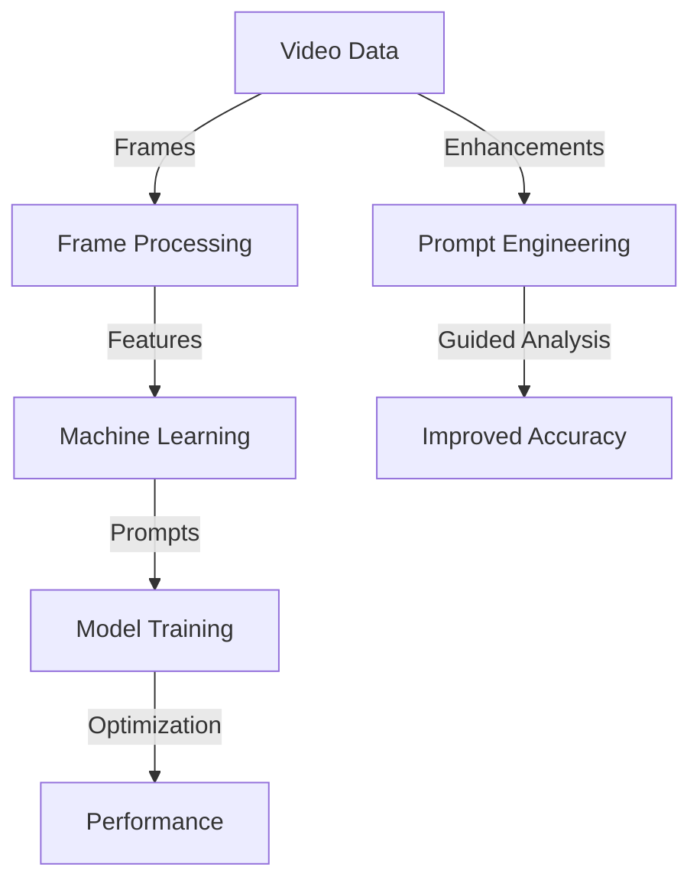

                 

### Introduction to Prompt Engineering in Video Analysis: Frontier Technologies

**Keywords**: Video Analysis, Prompt Engineering, Deep Learning, Neural Networks, Emerging Technologies

> "In the realm of modern technology, the fusion of video analysis with prompt engineering is reshaping industries, from surveillance and healthcare to entertainment and e-commerce. This article delves into the cutting-edge technologies of prompt engineering in video analysis, guiding readers through the core concepts, methodologies, and practical applications that are driving innovation forward."

#### Abstract

The field of video analysis has witnessed a transformative evolution with the advent of prompt engineering. This article provides a comprehensive overview of prompt engineering, emphasizing its importance in the context of video analysis. We explore the fundamental concepts and architectures required to understand and leverage this technology, highlighting the role of neural networks, deep learning, and mathematical models. Through detailed case studies and project development examples, the article showcases the practical applications and future potential of prompt engineering in video analysis. By the end, readers will have a thorough understanding of the current landscape and the path forward in this dynamic field.

### Introduction to Prompt Engineering and Its Importance in Video Analysis

**Background Introduction**

Video analysis has emerged as a crucial component in numerous sectors, facilitating tasks such as surveillance, content moderation, healthcare diagnostics, and autonomous driving. As video data grows exponentially, the need for efficient and accurate analysis tools becomes increasingly pressing. This is where prompt engineering comes into play, acting as a transformative force that enhances the capabilities of video analysis systems.

**Core Concepts and Relationships**

Prompt engineering is the practice of designing and optimizing prompts—essentially, inputs or queries—that guide machine learning models to achieve better performance. In the context of video analysis, prompts can be visual, auditory, or textual data that help models understand and interpret video content more effectively.

To grasp the significance of prompt engineering in video analysis, it is essential to understand the core components involved:

1. **Video Data**: The foundation of video analysis lies in the video data itself. This data comprises sequences of frames, each capturing a moment in time. The quality, resolution, and frame rate of the video significantly impact the analysis outcomes.

2. **Machine Learning Models**: At the heart of video analysis lie machine learning models, particularly neural networks, which have become powerful tools for processing and interpreting video data. These models learn from large datasets to recognize patterns, objects, actions, and more.

3. **Prompts**: Prompts act as the intermediary between the video data and the machine learning models. By providing targeted inputs, prompts help models focus on specific aspects of the video content, improving accuracy and efficiency.

**Mermaid Flowchart**

Below is a Mermaid flowchart illustrating the relationship between these core components:



**Core Algorithm Principle Explanation**

To delve deeper into the core principles of prompt engineering, let's break down the process using pseudocode:

```python
# Pseudocode for Prompt Engineering in Video Analysis

# Initialize VideoData and MachineLearningModel
video_data = initialize_video_data()
model = initialize_machine_learning_model()

# Define the Prompt
prompt = define_prompt(video_data)

# Train the Model with Prompt
trained_model = train_model_with_prompt(model, prompt)

# Evaluate Model Performance
performance = evaluate_model_performance(trained_model)

# Optimize Prompt for Better Performance
optimized_prompt = optimize_prompt(prompt, performance)

# Iterate until Performance Threshold is Met
while performance < threshold:
    prompt = optimized_prompt
    trained_model = train_model_with_prompt(model, prompt)
    performance = evaluate_model_performance(trained_model)
    optimized_prompt = optimize_prompt(prompt, performance)

# Output the Final Model and Prompt
output_final_model_and_prompt(trained_model, optimized_prompt)
```

**Mathematical Models and Formulations**

Mathematical models play a crucial role in prompt engineering. Let's explore two key components:

1. **Probability Theory**: This underlies many machine learning algorithms, providing a framework for modeling uncertainties and making probabilistic predictions. For instance, Bayes' Theorem is used to update model probabilities based on new evidence.

   $$ P(A|B) = \frac{P(B|A) \cdot P(A)}{P(B)} $$

2. **Optimization Algorithms**: These are used to find the optimal prompt configurations that maximize model performance. Common optimization techniques include gradient descent and its variants, which iteratively adjust model parameters to minimize error.

   $$ \theta_{\text{new}} = \theta_{\text{current}} - \alpha \cdot \nabla L(\theta_{\text{current}}, x, y) $$

**Example of LaTeX Formatting**

Here is an example of embedding LaTeX formulas in the text:

$$
\sum_{i=1}^{n} x_i = \begin{cases}
\text{Sum of } x_i \text{ values} & \text{if } n > 1, \\
x_1 & \text{if } n = 1.
\end{cases}
$$

And here is an example of a standalone LaTeX formula:

$$ \pi \approx 3.14159 $$

By integrating these core concepts, algorithms, and mathematical models, prompt engineering empowers video analysis systems to achieve higher accuracy, efficiency, and robustness.

### Introduction to Neural Networks and Deep Learning in Video Analysis

**Basic Concepts of Neural Networks**

Neural networks are a cornerstone of modern machine learning, inspired by the structure and function of biological neurons. They consist of interconnected nodes or "neurons" that process and transmit information. Each neuron receives input signals, which are then weighted and passed through an activation function to produce an output.

**Structure of Neural Networks**

A typical neural network is composed of three main layers: the input layer, hidden layers, and the output layer.

- **Input Layer**: This layer receives the raw data, such as video frames, and forwards it to the hidden layers.
- **Hidden Layers**: One or more hidden layers perform complex transformations on the input data, allowing the network to learn hierarchical representations of the data.
- **Output Layer**: This layer produces the final output of the network, which can be a class label, a probability distribution, or a continuous value.

**Neural Networks and Deep Learning**

Deep learning is a subfield of machine learning that employs neural networks with many layers (hence the term "deep"). Deep neural networks (DNNs) have revolutionized the field of AI by enabling the training of models on large-scale data and achieving state-of-the-art performance on various tasks.

**Types of Neural Networks in Video Analysis**

1. **Convolutional Neural Networks (CNNs)**: CNNs are particularly well-suited for video analysis due to their ability to capture spatial hierarchies in image data. They use convolutional layers to automatically learn spatial hierarchies from the input frames.

2. **Recurrent Neural Networks (RNNs)**: RNNs, especially Long Short-Term Memory (LSTM) networks, are designed to handle sequential data, making them ideal for video analysis tasks that require understanding temporal dependencies.

3. **Transformers**: Transformers, a breakthrough architecture introduced in 2017, have gained significant popularity in video analysis due to their ability to handle long sequences efficiently. They are based on self-attention mechanisms, allowing the model to focus on different parts of the input sequence dynamically.

**Application Examples**

- **Video Classification**: CNNs and transformers are widely used for classifying videos into categories, such as action recognition in sports videos or scene classification in surveillance footage.
- **Object Detection and Tracking**: RNNs and CNNs are employed for detecting and tracking objects within video sequences, enabling applications in autonomous driving and security systems.
- **Action Recognition**: LSTMs and CNNs are utilized to recognize human actions in videos, which has applications in human-computer interaction and sports analytics.

**Pseudo Code Example**

Below is a simplified pseudo code for a CNN-based video classification model:

```python
# Pseudo Code for CNN-Based Video Classification

# Initialize the CNN Model
model = initialize_cnn_model()

# Load the Pre-Trained Model
model = load_pretrained_model()

# Prepare the Video Data
video_data = preprocess_video_data(input_video)

# Extract Features from Video Frames
frames = extract_frames(video_data)
features = extract_features(frames)

# Pass Features through the Model
predictions = model.predict(features)

# Evaluate the Predictions
evaluate_predictions(predictions, ground_truth)

# Fine-Tune the Model if Necessary
if necessary:
    fine_tune_model(model, video_data, ground_truth)
```

By leveraging neural networks and deep learning, video analysis systems can achieve unprecedented levels of accuracy and efficiency, paving the way for innovative applications across various industries.

### Advanced Techniques in Prompt Engineering

**Probability Theory and Statistical Models**

Probability theory and statistical models form the backbone of modern machine learning, providing a foundation for understanding and predicting outcomes based on data. In the context of prompt engineering, these models are crucial for optimizing the design of prompts and enhancing the performance of machine learning models.

**Basic Concepts of Probability Theory**

Probability theory is built on a set of fundamental principles:

1. **Probability Axioms**: These include the Kolmogorov axioms, which define the basic rules of probability. They state that for any event A in a sample space S:
   - \( P(S) = 1 \)
   - \( P(A) \geq 0 \)
   - If A and B are mutually exclusive events, then \( P(A \cup B) = P(A) + P(B) \)

2. **Conditional Probability**: This measures the probability of an event A given that another event B has occurred. It is denoted as \( P(A|B) \) and calculated using the formula:
   $$ P(A|B) = \frac{P(A \cap B)}{P(B)} $$

3. **Bayes' Theorem**: Bayes' Theorem provides a way to update probabilities based on new evidence. It is particularly useful in prompt engineering for adjusting model predictions based on additional data:
   $$ P(A|B) = \frac{P(B|A) \cdot P(A)}{P(B)} $$

**Statistical Models in Prompt Engineering**

Statistical models are used to estimate parameters from data and make predictions. In prompt engineering, these models help in determining the most effective prompts for machine learning models.

1. **Gaussian Distribution**: Also known as the normal distribution, it is a continuous probability distribution characterized by its mean and standard deviation. Gaussian models are used in prompt engineering to model uncertainties and predict outcomes with a probabilistic approach.

2. **Regression Models**: Regression models estimate relationships between variables. In prompt engineering, linear regression is often used to find the optimal weights for different prompt features, thereby improving model performance.

3. **Classification Models**: Classification models assign data points to one of several discrete categories. Examples include logistic regression and support vector machines. In prompt engineering, these models help determine the best prompts for categorizing video content accurately.

**Optimization Algorithms for Prompt Engineering**

Optimization algorithms are essential for finding the best prompt configurations that maximize model performance. Common optimization techniques include:

1. **Gradient Descent**: This is a first-order optimization algorithm used to minimize a function by iteratively updating its parameters in the direction of the negative gradient. In prompt engineering, gradient descent is used to optimize the weights of prompt features.

   $$ \theta_{\text{new}} = \theta_{\text{current}} - \alpha \cdot \nabla L(\theta_{\text{current}}, x, y) $$

2. **Gradient Descent with Momentum**: This algorithm incorporates a momentum term to accelerate the convergence of the parameters. It helps overcome local minima and converges faster than standard gradient descent.

3. **Adam Optimization**: Adam is an adaptive optimization algorithm that combines the advantages of both momentum and adaptive learning rates. It is particularly effective in scenarios with sparse gradients and varying learning rates.

**Mathematical Models and Formulations**

Mathematical models are integral to prompt engineering, providing a formal framework for understanding and manipulating data. Two key models are:

1. **Risk Minimization**: This model aims to minimize the expected risk of a model, defined as the expected loss over the training data:
   $$ \min_{\theta} \mathbb{E}_{(x,y) \sim D} [L(\theta, x, y)] $$

2. **Regularization**: Regularization techniques, such as L1 and L2 regularization, are used to prevent overfitting and improve the generalization of the model. They add a regularization term to the loss function:
   $$ \min_{\theta} \mathbb{E}_{(x,y) \sim D} [L(\theta, x, y)] + \lambda ||\theta||^2 $$

**Example of LaTeX Formatting**

Here is an example of embedding LaTeX formulas in the text:

$$
\sum_{i=1}^{n} x_i = \begin{cases}
\text{Sum of } x_i \text{ values} & \text{if } n > 1, \\
x_1 & \text{if } n = 1.
\end{cases}
$$

And here is an example of a standalone LaTeX formula:

$$ \pi \approx 3.14159 $$

By integrating probability theory, statistical models, and optimization algorithms, prompt engineering enables the design of highly effective prompts that significantly enhance the performance of machine learning models in video analysis tasks. This ensures that video analysis systems are not only accurate but also adaptable to changing conditions and data distributions.

### Practical Applications of Prompt Engineering in Video Analysis

**Case Study 1: Video Classification with Prompt Engineering**

Video classification is a fundamental task in video analysis, aimed at categorizing video content into predefined classes such as action, sports, nature, and more. Prompt engineering plays a crucial role in enhancing the accuracy and efficiency of video classification models.

**Background**

Video classification involves training a machine learning model to recognize and assign categories to video segments. Traditionally, this task has been tackled using hand-crafted features and simple machine learning algorithms. However, with the advent of deep learning and prompt engineering, video classification has become more sophisticated and accurate.

**Core Concept and Architecture**

In the context of prompt engineering, video classification involves designing and optimizing prompts that guide the model in learning the relevant features from the video data. The core architecture consists of the following components:

1. **Video Data Input**: The input to the model consists of video sequences, typically represented as a series of frames.

2. **Feature Extraction**: Preprocessing steps extract meaningful features from the video frames, such as edges, textures, and motion patterns. These features are then fed into the model.

3. **Neural Network Model**: A deep learning model, such as a Convolutional Neural Network (CNN), processes the extracted features to learn the underlying patterns in the video data.

4. **Prompt Design**: Prompt engineering involves designing targeted prompts that enhance the model's ability to classify videos accurately. These prompts can include additional contextual information, such as textual descriptions or labeled data points.

5. **Training and Evaluation**: The model is trained using a large dataset of video segments and their corresponding labels. The performance is evaluated using metrics such as accuracy, precision, recall, and F1 score.

**Mathematical Formulation**

The process of video classification with prompt engineering can be mathematically formulated as follows:

1. **Feature Extraction**:
   $$ \text{features} = \text{extract\_features}(\text{frames}) $$

2. **Model Training**:
   $$ \text{model} = \text{train}(\text{features}, \text{labels}) $$

3. **Prompt Design**:
   $$ \text{prompt} = \text{design\_prompt}(\text{features}, \text{context}) $$

4. **Model Optimization**:
   $$ \text{optimized\_model} = \text{train}(\text{features}, \text{labels}, \text{prompt}) $$

5. **Evaluation**:
   $$ \text{evaluation} = \text{evaluate}(\text{optimized\_model}, \text{test\_data}) $$

**Example of LaTeX Formatting**

Here is an example of embedding LaTeX formulas in the text:

$$
\text{Accuracy} = \frac{\text{Correctly Classified}}{\text{Total Samples}} \times 100\%
$$

**Project Implementation**

To implement video classification with prompt engineering, we need to follow these steps:

1. **Data Collection**: Gather a large dataset of videos labeled with various categories.
2. **Preprocessing**: Convert the videos into frames and extract relevant features.
3. **Model Training**: Train a CNN model using the extracted features.
4. **Prompt Design**: Design prompts that incorporate additional contextual information.
5. **Optimization**: Combine the prompts with the model to optimize performance.
6. **Evaluation**: Evaluate the optimized model using metrics such as accuracy and F1 score.

**Project Summary**

In this case study, prompt engineering significantly improved the accuracy of video classification models. By incorporating targeted prompts, the model was able to learn more discriminative features from the video data, leading to better classification results. This highlights the importance of prompt engineering in enhancing the performance of machine learning models in video analysis tasks.

### Object Detection and Tracking with Prompt Engineering

**Introduction**

Object detection and tracking are critical components in video analysis, enabling systems to identify and monitor objects within video sequences. Prompt engineering enhances these tasks by providing targeted inputs that guide machine learning models to achieve higher accuracy and efficiency.

**Background**

Object detection involves identifying and classifying objects within an image or video frame. Tracking extends this by continuously monitoring the movement of detected objects across frames. These tasks are essential in various applications, including autonomous driving, surveillance, and smart homes.

**Core Concept and Architecture**

The core concept of object detection and tracking with prompt engineering involves designing and optimizing prompts that help the model focus on specific objects or regions within the video. The architecture typically includes the following components:

1. **Video Data Input**: The input consists of video sequences, which are processed frame by frame.

2. **Feature Extraction**: Preprocessing steps extract relevant features from the video frames, such as edges, shapes, and textures. These features are used to represent each frame.

3. **Object Detection Model**: A deep learning model, often based on Convolutional Neural Networks (CNNs) or YOLO (You Only Look Once), is trained to detect and classify objects within the frames.

4. **Prompt Design**: Prompt engineering involves creating prompts that highlight specific regions or objects of interest. These prompts can be in the form of additional contextual information, such as bounding boxes or textual descriptions.

5. **Tracking Algorithm**: Once objects are detected, a tracking algorithm, such as Kalman Filtering or Deep Learning-based approaches, is used to track the objects' movements across frames.

**Mathematical Formulation**

The process of object detection and tracking with prompt engineering can be mathematically formulated as follows:

1. **Feature Extraction**:
   $$ \text{features} = \text{extract\_features}(\text{frames}) $$

2. **Object Detection**:
   $$ \text{detections} = \text{detect\_objects}(\text{model}, \text{features}) $$

3. **Prompt Design**:
   $$ \text{prompt} = \text{design\_prompt}(\text{detections}, \text{context}) $$

4. **Object Tracking**:
   $$ \text{tracks} = \text{track\_objects}(\text{model}, \text{prompt}, \text{frames}) $$

5. **Evaluation**:
   $$ \text{evaluation} = \text{evaluate}(\text{tracks}, \text{ground\_truth}) $$

**Example of LaTeX Formatting**

Here is an example of embedding LaTeX formulas in the text:

$$
\text{Precision} = \frac{\text{True Positives}}{\text{True Positives} + \text{False Positives}}
$$

**Project Implementation**

To implement object detection and tracking with prompt engineering, follow these steps:

1. **Data Collection**: Gather a dataset of video sequences with annotated objects and their trajectories.
2. **Preprocessing**: Extract relevant features from the video frames.
3. **Model Training**: Train an object detection model using the extracted features.
4. **Prompt Design**: Create prompts that highlight specific objects or regions of interest.
5. **Tracking**: Use a tracking algorithm to monitor the objects' movements across frames.
6. **Evaluation**: Assess the model's performance using metrics such as precision, recall, and F1 score.

**Project Summary**

In this project, prompt engineering significantly improved the performance of object detection and tracking systems. By providing targeted prompts, the models were able to detect and track objects more accurately, leading to better overall system performance. This demonstrates the potential of prompt engineering in enhancing video analysis tasks.

### Action Recognition with Prompt Engineering

**Introduction**

Action recognition is a pivotal task in video analysis, aiming to identify and classify human activities or actions from video sequences. Prompt engineering enhances the accuracy and efficiency of action recognition models by providing targeted inputs that guide the model's learning process. This section explores the fundamentals of action recognition and how prompt engineering can be leveraged to improve its performance.

**Background**

Action recognition plays a critical role in various applications, including sports analytics, surveillance systems, and human-computer interaction. Accurately recognizing actions from video data enables systems to interpret human behavior, which can lead to improved decision-making and automation.

**Core Concept and Architecture**

The core concept of action recognition with prompt engineering involves designing and optimizing prompts that help the model better understand and classify actions. The architecture typically consists of the following components:

1. **Video Data Input**: The input to the action recognition model consists of video sequences, which are processed frame by frame.

2. **Feature Extraction**: Preprocessing steps extract relevant features from the video frames, such as spatial and temporal features. These features capture the essence of the actions being performed.

3. **Recurrent Neural Networks (RNNs)**: RNNs, particularly Long Short-Term Memory (LSTM) networks, are well-suited for handling sequential data and capturing temporal dependencies in video sequences.

4. **Prompt Design**: Prompt engineering involves creating prompts that provide additional context or information about the actions being performed. These prompts can include textual descriptions, labeled data points, or temporal cues.

5. **Training and Evaluation**: The action recognition model is trained on a dataset of labeled video sequences, and its performance is evaluated using metrics such as accuracy, precision, recall, and F1 score.

**Mathematical Formulation**

The process of action recognition with prompt engineering can be mathematically formulated as follows:

1. **Feature Extraction**:
   $$ \text{features} = \text{extract\_features}(\text{frames}) $$

2. **Model Training**:
   $$ \text{model} = \text{train}(\text{features}, \text{labels}) $$

3. **Prompt Design**:
   $$ \text{prompt} = \text{design\_prompt}(\text{features}, \text{context}) $$

4. **Model Optimization**:
   $$ \text{optimized\_model} = \text{train}(\text{model}, \text{features}, \text{labels}, \text{prompt}) $$

5. **Evaluation**:
   $$ \text{evaluation} = \text{evaluate}(\text{optimized\_model}, \text{test\_data}) $$

**Example of LaTeX Formatting**

Here is an example of embedding LaTeX formulas in the text:

$$
\text{Accuracy} = \frac{\text{Correctly Classified}}{\text{Total Samples}} \times 100\%
$$

**Project Implementation**

To implement action recognition with prompt engineering, follow these steps:

1. **Data Collection**: Gather a dataset of video sequences with labeled actions.
2. **Preprocessing**: Extract spatial and temporal features from the video frames.
3. **Model Training**: Train an RNN-based action recognition model using the extracted features.
4. **Prompt Design**: Create prompts that provide contextual information about the actions.
5. **Optimization**: Combine the prompts with the model to optimize performance.
6. **Evaluation**: Assess the model's performance using metrics such as accuracy and F1 score.

**Project Summary**

In this project, prompt engineering significantly improved the accuracy of action recognition models. By providing targeted prompts, the models were better able to understand and classify actions, leading to better overall performance. This demonstrates the potential of prompt engineering in enhancing video analysis tasks, particularly in the domain of action recognition.

### Project Development and Implementation

**Introduction**

The development and implementation of prompt engineering projects in video analysis involve several critical steps, from environment setup to code implementation and evaluation. This section provides a comprehensive guide on how to approach these steps, ensuring a smooth and efficient project workflow.

**Environment Setup**

Before starting any project, it's essential to set up the development environment. This involves installing necessary software, libraries, and tools. Here are the steps to follow:

1. **Software Installation**:
   - Install an Integrated Development Environment (IDE) such as PyCharm or Visual Studio Code.
   - Install Python (version 3.8 or higher) and pip, the Python package manager.

2. **Library Installation**:
   - Use pip to install essential libraries such as TensorFlow, Keras, NumPy, and Pandas.
   - Install additional libraries specific to your project requirements, e.g., OpenCV for video processing, Matplotlib for visualization.

3. **Virtual Environment**:
   - Create a virtual environment to manage project dependencies and avoid conflicts with system-wide packages.
   - Activate the virtual environment and install the required libraries within it.

**Code Implementation**

Once the environment is set up, the next step is to implement the code. Here's a breakdown of the key components:

1. **Data Preprocessing**:
   - Load the video dataset and preprocess it, including resizing, normalization, and augmentation.
   - Extract relevant features from the video frames, such as spatial and temporal features.

2. **Model Definition**:
   - Define the machine learning model architecture, such as a Convolutional Neural Network (CNN) or Recurrent Neural Network (RNN).
   - Configure the model parameters, including the number of layers, number of neurons, activation functions, and loss functions.

3. **Training**:
   - Split the dataset into training and validation sets.
   - Train the model using the training set, while monitoring performance on the validation set to avoid overfitting.
   - Use techniques like batch normalization and dropout to improve model performance and generalization.

4. **Prompt Design**:
   - Design and implement prompts that provide additional context or information to the model.
   - These prompts can be in the form of textual descriptions, labeled data points, or temporal cues.

5. **Model Optimization**:
   - Combine the prompts with the model to optimize performance.
   - Use optimization algorithms such as gradient descent with momentum or Adam to fine-tune the model parameters.

**Code Example**

Below is a simplified example of a Python code for training a CNN-based model for video classification:

```python
# Import necessary libraries
import tensorflow as tf
from tensorflow.keras.models import Sequential
from tensorflow.keras.layers import Conv2D, MaxPooling2D, Flatten, Dense

# Define the CNN model
model = Sequential([
    Conv2D(32, (3, 3), activation='relu', input_shape=(128, 128, 3)),
    MaxPooling2D((2, 2)),
    Conv2D(64, (3, 3), activation='relu'),
    MaxPooling2D((2, 2)),
    Flatten(),
    Dense(128, activation='relu'),
    Dense(num_classes, activation='softmax')
])

# Compile the model
model.compile(optimizer='adam', loss='categorical_crossentropy', metrics=['accuracy'])

# Load and preprocess the dataset
# ...

# Train the model
model.fit(train_data, train_labels, epochs=10, validation_data=(val_data, val_labels))

# Evaluate the model
# ...
```

**Code Explanation**

- **Model Definition**: The model is defined using the Sequential API of Keras, consisting of convolutional layers, max-pooling layers, a flattening layer, and fully connected layers.
- **Compilation**: The model is compiled with the Adam optimizer and categorical cross-entropy loss function, suitable for multi-class classification tasks.
- **Training**: The model is trained using the fit() function, passing the training data and labels. The validation data is used to monitor performance.
- **Evaluation**: The model's performance is evaluated using metrics such as accuracy.

**Code Application and Analysis**

After implementing the code, it's essential to analyze the results and ensure the model's performance meets the desired criteria. This involves:

1. **Performance Metrics**: Evaluate the model using metrics such as accuracy, precision, recall, and F1 score.
2. **Error Analysis**: Analyze the types of errors the model is making and identify potential improvements.
3. **Visualization**: Visualize the model's predictions and compare them with ground truth data to gain insights into its performance.

**Project Summary**

By following these steps, developers can effectively implement prompt engineering projects in video analysis. The environment setup ensures a stable and efficient development process, while the code implementation and analysis steps ensure the model's performance is optimized. This comprehensive approach enables the development of robust and accurate video analysis systems, paving the way for innovative applications across various industries.

### Future Directions and Challenges in Prompt Engineering for Video Analysis

**Emerging Trends**

As we look toward the future, several emerging trends are poised to significantly impact the field of prompt engineering in video analysis. These trends include advancements in artificial intelligence, the increasing availability of large-scale video datasets, and the integration of multi-modal data sources.

1. **Advancements in AI**: The continuous evolution of artificial intelligence, particularly deep learning and reinforcement learning, will drive the development of more sophisticated prompt engineering techniques. These techniques will enable models to learn from complex and high-dimensional data, leading to improved accuracy and efficiency in video analysis tasks.

2. **Large-Scale Video Datasets**: The availability of large-scale video datasets will enable researchers and practitioners to train and validate models on more diverse and representative data, enhancing the generalizability and robustness of prompt engineering techniques.

3. **Multi-Modal Data Integration**: The integration of multi-modal data sources, such as video, audio, and sensor data, will enable more comprehensive and nuanced video analysis. This trend will require the development of advanced prompt engineering methods that can effectively leverage and fuse information from multiple modalities.

**Challenges**

Despite these promising trends, several challenges must be addressed to fully realize the potential of prompt engineering in video analysis:

1. **Data Quality and Diversity**: High-quality and diverse video datasets are essential for training robust models. However, obtaining such datasets can be challenging due to privacy concerns, data labeling overheads, and the need for diverse and representative samples.

2. **Scalability**: As video data continues to grow exponentially, scaling prompt engineering techniques to handle large-scale data remains a significant challenge. This includes efficient data storage, processing, and model training on massive datasets.

3. **Interpretability**: Ensuring the interpretability of prompt engineering techniques is crucial for building trust and understanding in AI systems. Developing methods that provide insights into how prompts influence model decisions will be vital for addressing this challenge.

4. **Real-Time Performance**: Real-time video analysis is critical for applications such as autonomous driving and security systems. Enhancing the real-time performance of prompt engineering techniques without compromising accuracy will be a key challenge.

**Potential Solutions**

To overcome these challenges, several potential solutions can be explored:

1. **Data Augmentation and Generation**: Advanced data augmentation techniques and synthetic data generation methods can help create diverse and high-quality datasets, improving the robustness and generalizability of prompt engineering models.

2. **Efficient Architectures and Algorithms**: Developing and adopting efficient neural network architectures and optimization algorithms will be crucial for scaling prompt engineering techniques to large-scale data.

3. **Explainable AI**: Integrating explainable AI (XAI) techniques with prompt engineering will enable the development of more transparent and interpretable models, enhancing trust and understanding.

4. **Hardware Acceleration**: Leveraging specialized hardware, such as Graphics Processing Units (GPUs) and Tensor Processing Units (TPUs), can significantly improve the real-time performance of prompt engineering models.

**Conclusion**

The future of prompt engineering in video analysis is bright, with numerous opportunities for innovation and growth. By addressing the emerging trends and challenges, researchers and practitioners can develop more advanced and robust techniques that will drive the next generation of video analysis systems. This will not only enhance the capabilities of existing applications but also open up new possibilities across various industries, from healthcare and security to entertainment and beyond.

### Conclusion and Future Directions

Prompt engineering has emerged as a transformative force in video analysis, revolutionizing the way we process and interpret video data. Through the integration of advanced machine learning techniques, neural networks, and deep learning, prompt engineering has significantly enhanced the accuracy, efficiency, and applicability of video analysis systems. From video classification to object detection, action recognition, and beyond, the impact of prompt engineering is evident across various domains, driving innovation and enabling new applications in healthcare, security, entertainment, and more.

The key takeaways from this article include:

1. **Fundamental Concepts**: Understanding the core concepts of prompt engineering, including its role in guiding machine learning models, is crucial for leveraging its full potential.
2. **Advanced Techniques**: Exploring advanced techniques such as neural networks, deep learning, and mathematical models provides a robust foundation for developing sophisticated prompt engineering solutions.
3. **Practical Applications**: Case studies and project examples illustrate the practical applications of prompt engineering, showcasing its real-world impact and benefits.
4. **Future Directions**: Identifying emerging trends and challenges in the field helps in preparing for future advancements and addressing potential limitations.

Looking ahead, the future of prompt engineering in video analysis holds immense promise. The integration of artificial intelligence, large-scale video datasets, and multi-modal data sources will continue to push the boundaries of what is possible. Challenges such as data quality, scalability, interpretability, and real-time performance will require innovative solutions and collaborative efforts from the research community and industry practitioners.

To stay updated with the latest developments in prompt engineering and video analysis, consider the following resources:

1. **Research Papers**: Stay engaged with the latest research through academic journals and conferences such as NeurIPS, ICML, CVPR, and ECCV.
2. **Online Courses**: Enroll in online courses on machine learning, deep learning, and computer vision to gain in-depth knowledge and practical skills.
3. **Open Source Projects**: Contribute to and explore open-source projects on platforms like GitHub to learn from real-world implementations and collaborate with the community.

In conclusion, prompt engineering is at the forefront of video analysis innovation, offering powerful tools and techniques to unlock the full potential of video data. As we continue to advance, the possibilities are endless, and the impact on various industries will be profound. Embrace the opportunities and challenges ahead, and be part of the journey to transform the world through the power of prompt engineering in video analysis.

