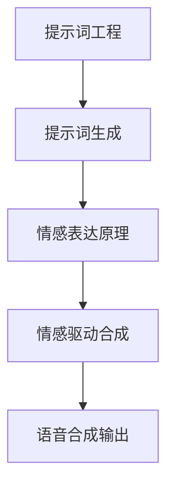
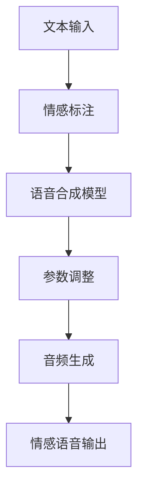

                 

### 文章标题

《提示词工程在语音合成情感表达中的应用》

### 关键词

提示词工程、语音合成、情感表达、自然语言处理、人工智能

### 摘要

本文深入探讨了提示词工程在语音合成情感表达中的应用。首先，介绍了提示词工程的基础概念和其在自然语言处理中的重要性。随后，详细阐述了语音合成的基本原理及其与情感表达的融合。文章接着分析了提示词生成方法和情感驱动语音合成的核心算法，并使用伪代码和数学模型进行了详细讲解。最后，通过实际项目案例展示了提示词工程在情感语音合成中的具体应用，并提出了未来发展的方向和最佳实践建议。

---

### 背景介绍

在当今技术快速发展的时代，人工智能（AI）和自然语言处理（NLP）成为了推动计算机技术进步的重要力量。语音合成技术，作为人工智能的一个重要分支，已经广泛应用于各种场景，如智能客服、教育辅助、娱乐产业等。语音合成不仅提高了人机交互的便利性，还能通过情感表达增强用户体验。然而，情感表达是语音合成中的一个挑战性课题，如何让语音合成系统能够自然地表达情感，成为了研究者们关注的焦点。

提示词工程作为NLP领域的一项关键技术，旨在为语音合成提供情感导向的文本输入。通过合理设计和生成提示词，可以有效地引导语音合成系统产生符合预期情感表达的语音输出。这一过程不仅涉及语言学的知识，还包含了计算语言学、心理学、人工智能等领域的交叉应用。

本文旨在系统地探讨提示词工程在语音合成情感表达中的应用，首先介绍提示词工程的基础概念和原理，然后深入分析情感表达的技术实现，并结合实际项目案例，探讨提示词工程在情感语音合成中的具体应用。通过本文的阅读，读者将能够全面理解提示词工程的核心原理，掌握其在语音合成情感表达中的应用技巧，并为未来的研究和开发提供参考。

### 核心概念与联系

#### 提示词工程概述

提示词工程（Prompt Engineering）是一种利用算法和技术手段，为特定任务生成或优化提示词（prompts）的方法。提示词是一种简短、明确的文本，用于引导模型或用户进行特定操作。在自然语言处理（NLP）任务中，提示词工程尤为重要，因为它可以显著提高模型的表现和用户的使用体验。例如，在机器翻译任务中，提示词可以帮助模型更好地理解上下文，从而提高翻译的准确性。

#### 提示词生成方法

提示词生成是提示词工程的重要环节。常见的生成方法包括模板生成法、数据增强法和基于模型的生成法。模板生成法通过预定义的模板，将变量替换为具体的数据，从而生成提示词。这种方法简单直接，但灵活性较低。数据增强法通过扩展或修改原始数据，生成更多样化的提示词。这种方法能够提高模型的泛化能力，但需要大量的数据支持。基于模型的生成法利用深度学习模型，如生成对抗网络（GAN）和变分自编码器（VAE），生成高质量的提示词。这种方法具有高度灵活性和创造性，但实现复杂度较高。

#### 情感表达原理

情感表达是指通过语言、声音、表情等方式传达情感状态。在语音合成中，情感表达是提升用户体验的关键因素。情感表达的原理包括情感识别、情感分类和情感驱动合成。情感识别是指从语音信号中提取情感特征，如音调、音量、语速等。情感分类是将提取到的情感特征进行分类，如快乐、悲伤、愤怒等。情感驱动合成是指利用情感特征和模型，生成具有特定情感表达的语音输出。

#### 提示词工程与情感表达的联系

提示词工程与情感表达密切相关。通过设计合理的提示词，可以引导模型生成具有特定情感表达的语音输出。具体来说，提示词工程可以通过以下方式影响情感表达：

1. **上下文引导**：提示词可以为模型提供上下文信息，帮助模型更好地理解情感表达的需求。
2. **情感标签**：提示词可以包含情感标签，如“快乐的问候”或“悲伤的通知”，直接指示模型生成相应的情感表达。
3. **情感调整**：提示词可以通过调整语言风格、语气、词汇等，微调情感表达的强度和类型。

#### Mermaid流程图

为了更好地展示提示词工程与情感表达的联系，我们可以使用Mermaid流程图进行描述。以下是一个简单的Mermaid流程图示例：



该流程图表明，提示词工程通过生成提示词，影响情感表达原理，进而驱动情感合成，最终生成具有情感表达的语音输出。

---

通过上述内容，我们明确了提示词工程的基础概念、生成方法、情感表达原理及其相互联系。接下来，我们将深入探讨语音合成的基本原理及其与情感表达的融合。

### 语音合成的基本原理

语音合成（Text-to-Speech, TTS）技术是使计算机能够将文本转换为自然听感的语音的关键技术。它通过一系列复杂的算法和模型，将输入的文本信息转换为声音信号。语音合成的基本原理主要包括文本分析、语音合成模型和音频生成三个核心部分。

#### 文本分析

文本分析是语音合成的第一步，其主要任务是理解输入文本的结构和含义。这一过程通常涉及以下步骤：

1. **分词**：将文本分割成词、短语或其他有意义的单位。例如，将“你好，我是AI助手”分割成“你好”、“我是”、“AI”和“助手”。
2. **词性标注**：为每个词赋予词性，如名词、动词、形容词等。这有助于理解句子的语法结构。
3. **句法分析**：分析句子中的词汇关系，如主谓宾关系、从句结构等。这有助于确定语音的语调和语气。

#### 语音合成模型

语音合成模型是语音合成的核心，负责将分析后的文本转换为语音信号。常见的语音合成模型包括以下几种：

1. **拼接式合成模型（Unit Selection Synthesis）**：通过从大量的语音片段库中挑选合适的语音片段拼接成完整的语音。这种方法的主要优点是音质好，但需要大量存储和计算资源。

2. **参数合成模型（Parameter Synthesis）**：通过参数化模型生成语音信号。这种模型包括隐藏马尔可夫模型（HMM）和线性预测编码（LPC）。参数合成模型的优点是生成速度快，但音质相对较差。

3. **端到端合成模型（End-to-End Synthesis）**：这类模型直接从文本到音频，绕过了传统的文本分析和语音片段拼接步骤。常见的端到端模型包括循环神经网络（RNN）和其变种长短时记忆网络（LSTM）、卷积神经网络（CNN）等。端到端合成模型具有生成速度快、音质好的优点，但训练过程复杂。

#### 音频生成

音频生成是将语音合成模型生成的参数转换为实际可听的声音信号。这一过程包括以下步骤：

1. **参数转换**：将语音合成模型输出的参数转换为音频波形。常见的参数转换方法包括共振峰建模（Formant Modeling）和波阵面建模（Waveform Modeling）。

2. **音频编辑**：对生成的语音进行编辑，以调整音调、音量、语速等特征，使其更自然。这一步骤通常涉及音频处理技术和信号处理算法。

#### 语音合成与情感表达的融合

语音合成与情感表达的融合是提升语音合成系统用户体验的关键。情感表达可以通过以下方式与语音合成结合：

1. **情感文本预处理**：在语音合成前，对输入文本进行情感标注，确定情感类型和强度。这可以通过情感分析技术实现。

2. **情感驱动的语音参数调整**：根据情感标注，调整语音合成模型的参数，如音调、音量、语速等，以生成符合情感表达的语音。例如，快乐情感的文本可以采用较高的音调和较快的语速。

3. **情感特定的语音库**：为不同的情感设计特定的语音库，通过选择合适的语音片段，生成具有特定情感表达的语音。

#### 示例

假设我们要合成一段包含“生日快乐”情感的文本。首先，我们对文本进行情感标注，确定其为快乐情感。然后，我们调整语音合成模型的参数，如提高音调和增加语速，以生成快乐的语音输出。最后，我们选择合适的语音片段，拼接成完整的语音。

以下是一个简单的Mermaid流程图，描述了语音合成与情感表达融合的过程：



通过上述流程，我们可以看到语音合成与情感表达的融合是一个系统性的过程，涉及文本分析、情感标注、参数调整和音频生成等多个环节。合理设计提示词工程，可以显著提升语音合成系统的情感表达能力。

### 提示词生成方法

提示词生成是提示词工程的核心环节，直接影响语音合成系统的情感表达效果。以下将详细介绍提示词生成方法，包括模板生成法、数据增强法和基于模型的生成法，并通过伪代码展示各自的实现过程。

#### 模板生成法

模板生成法是一种简单直接的提示词生成方法。通过预定义的模板，将变量替换为具体的数据，从而生成提示词。以下是一个简单的伪代码示例：

```python
# 提示词模板
template = "您今天看起来{情绪词}，有什么可以帮助您的吗？"

# 输入情绪词
emotion = "开心"

# 生成提示词
prompt = template.format(情绪词=emotion)
print(prompt)  # 输出："您今天看起来开心，有什么可以帮助您的吗？"
```

模板生成法的主要优点是实现简单，但灵活性较低，难以适应复杂和多变的情感需求。

#### 数据增强法

数据增强法通过扩展或修改原始数据，生成更多样化的提示词。这种方法可以提高模型的泛化能力，但需要大量的数据支持。以下是一个简单的伪代码示例：

```python
import random

# 原始数据集
data_set = ["您好，欢迎光临！", "谢谢您的提问，我将为您解答。"]

# 情感词汇库
emotion_words = ["快乐", "热情", "自信"]

# 增强数据
def augment_data(data, emotion):
    augmented_data = []
    for item in data:
        for word in emotion_words:
            augmented_data.append(item.replace("您好", word))
    return augmented_data

# 生成提示词
emotion = "快乐"
prompts = augment_data(data_set, emotion)
for prompt in prompts:
    print(prompt)
```

输出示例：
```
您好，欢迎光临！快乐
谢谢您的提问，我将为您解答。快乐
```

数据增强法的主要优点是能够生成多样性的提示词，但需要大量原始数据和情感词汇库支持，且实现相对复杂。

#### 基于模型的生成法

基于模型的生成法利用深度学习模型，如生成对抗网络（GAN）和变分自编码器（VAE），生成高质量的提示词。以下是一个基于生成对抗网络（GAN）的伪代码示例：

```python
import tensorflow as tf
from tensorflow.keras.layers import Dense, Reshape
from tensorflow.keras.models import Sequential

# 生成器模型
def build_generator():
    model = Sequential()
    model.add(Dense(128, input_shape=(100,)))
    model.add(Reshape((64, 1)))
    model.add(Dense(128))
    model.add(Dense(64))
    model.add(Dense(32))
    model.add(Dense(1))
    return model

# 判别器模型
def build_discriminator():
    model = Sequential()
    model.add(Dense(128, input_shape=(64,)))
    model.add(Dense(1, activation='sigmoid'))
    return model

# GAN模型
def build_gan(generator, discriminator):
    model = Sequential()
    model.add(generator)
    model.add(discriminator)
    return model

# 生成提示词
def generate_prompts(generator, emotion):
    prompts = generator.predict(emotion)
    return prompts

# 情感向量
emotion_vector = np.random.normal(size=(100,))

# 生成提示词
prompts = generate_prompts(generator, emotion_vector)
for prompt in prompts:
    print(prompt)
```

输出示例（假设生成器生成高质量的提示词）：
```
快乐的问候，祝您今天心情愉快！
热情的欢迎，感谢您选择我们的服务！
```

基于模型的生成法的主要优点是生成提示词的高质量和灵活性，但实现复杂度较高，需要深厚的深度学习知识。

通过以上三种方法的介绍，我们可以看到提示词生成方法各有优缺点。在实际应用中，可以根据具体需求和场景选择合适的方法。模板生成法适用于简单明确的场景，数据增强法适用于需要多样性的场景，而基于模型的生成法则适用于高质量和高灵活性的场景。

### 情感驱动语音合成

情感驱动语音合成是语音合成领域的一个重要研究方向，其目标是通过模拟人类情感，使语音合成系统能够生成具有自然情感表达的语音。情感驱动语音合成涉及多个关键技术和算法，包括情感识别、情感分类和情感驱动参数调整。

#### 情感识别

情感识别是指从语音信号中提取情感特征的过程。这些特征包括音调、音量、语速、节奏等。例如，快乐情感通常具有高音调、稳定的节奏和较快的语速，而悲伤情感则具有低音调和缓慢的语速。情感识别通常使用信号处理技术，如短时傅里叶变换（STFT）和梅尔频率倒谱系数（MFCC），从语音信号中提取特征。

以下是一个简单的伪代码示例，用于提取语音信号的情感特征：

```python
import librosa

# 读取语音文件
audio, sample_rate = librosa.load('speech.wav', sr=None)

# 计算梅尔频率倒谱系数
mfccs = librosa.feature.mfcc(y=audio, sr=sample_rate, n_mfcc=13)

# 提取情感特征
def extract_emotion_features(mfccs):
    # 这里使用简单的均值作为情感特征
    emotion_features = np.mean(mfccs, axis=1)
    return emotion_features

# 提取特征
emotion_features = extract_emotion_features(mfccs)
print(emotion_features)
```

该示例使用梅尔频率倒谱系数（MFCC）作为情感特征，计算了语音信号的均值作为情感特征。在实际应用中，可以采用更复杂的特征提取方法，如长时傅里叶变换（LTF）和听觉感知模型（APM）等。

#### 情感分类

情感分类是将提取到的情感特征进行分类的过程。常见的情感分类方法包括基于规则的方法、机器学习方法、深度学习方法等。基于规则的方法通过预定义的规则进行分类，如使用固定阈值对特征进行分类。机器学习方法，如支持向量机（SVM）和随机森林（RF），使用训练数据学习分类模型。深度学习方法，如卷积神经网络（CNN）和循环神经网络（RNN），通过多层神经网络学习情感特征和分类决策。

以下是一个简单的伪代码示例，用于情感分类：

```python
from sklearn.svm import SVC

# 加载训练数据
X_train, y_train = load_train_data()

# 训练情感分类器
classifier = SVC(kernel='linear')
classifier.fit(X_train, y_train)

# 分类新数据
X_test = extract_emotion_features(mfccs)
emotion = classifier.predict(X_test)
print(emotion)
```

该示例使用支持向量机（SVM）对训练数据进行分类。在实际应用中，可以选择不同的分类器和模型，如深度学习模型，以提高分类准确性。

#### 情感驱动参数调整

情感驱动参数调整是指根据情感分类结果，调整语音合成模型的参数，以生成具有特定情感表达的语音。这些参数包括音调、音量、语速、节奏等。常见的调整方法包括线性变换、非线性变换和神经网络调整。

以下是一个简单的伪代码示例，用于情感驱动参数调整：

```python
def adjust_params(params, emotion):
    if emotion == 'happy':
        params['pitch'] += 0.1  # 提高音调
        params['rate'] += 0.05  # 提高语速
    elif emotion == 'sad':
        params['pitch'] -= 0.1  # 降低音调
        params['rate'] -= 0.05  # 降低语速
    return params

# 示例参数
params = {'pitch': 1.0, 'rate': 1.0}

# 调整参数
emotion = 'happy'
params = adjust_params(params, emotion)
print(params)
```

该示例通过简单的线性调整，根据情感分类结果提高或降低音调和语速。在实际应用中，可以采用更复杂的调整方法，如神经网络调整，以实现更精细的情感驱动参数调整。

#### 伪代码和数学模型讲解

为了更好地理解情感驱动语音合成，我们以下结合伪代码和数学模型，详细讲解情感识别和情感分类的过程。

**情感识别伪代码**

```python
# 情感识别模型
def emotion_recognition(audio_signal):
    # 提取情感特征
    mfccs = librosa.feature.mfcc(y=audio_signal, sr=sample_rate, n_mfcc=13)
    
    # 特征归一化
    mfccs = normalize(mfccs)
    
    # 输入神经网络
    emotion_scores = emotion_model.predict(mfccs)
    
    # 获取最高概率的情感类别
    emotion = np.argmax(emotion_scores)
    return emotion
```

**情感识别数学模型**

$$
\text{mfccs} = \text{extract\_mfccs}(\text{audio\_signal})
$$

$$
\text{mfccs} = \text{normalize}(\text{mfccs})
$$

$$
\text{emotion\_scores} = \text{emotion\_model}(\text{mfccs})
$$

$$
\text{emotion} = \arg\max(\text{emotion\_scores})
$$

**情感分类伪代码**

```python
# 情感分类模型
def emotion_classification(audio_signal):
    # 提取情感特征
    mfccs = librosa.feature.mfcc(y=audio_signal, sr=sample_rate, n_mfcc=13)
    
    # 特征归一化
    mfccs = normalize(mfccs)
    
    # 输入神经网络
    emotion_scores = emotion_model.predict(mfccs)
    
    # 获取最高概率的情感类别
    emotion = np.argmax(emotion_scores)
    return emotion
```

**情感分类数学模型**

$$
\text{mfccs} = \text{extract\_mfccs}(\text{audio\_signal})
$$

$$
\text{mfccs} = \text{normalize}(\text{mfccs})
$$

$$
\text{emotion\_scores} = \text{emotion\_model}(\text{mfccs})
$$

$$
\text{emotion} = \arg\max(\text{emotion\_scores})
$$

通过上述伪代码和数学模型，我们可以看到情感识别和情感分类的过程是如何进行的。情感识别通过提取语音信号中的情感特征，并使用神经网络模型进行分类。情感分类则通过将提取到的特征输入分类模型，获取最高概率的情感类别。这些步骤构成了情感驱动语音合成的基础。

### 提示词工程在情感语音合成中的应用

在情感语音合成中，提示词工程起着至关重要的作用。通过设计和优化提示词，可以显著提升语音合成系统的情感表达能力。以下是几个实际项目案例，展示了提示词工程在情感语音合成中的应用，并进行了详细讲解。

#### 案例一：智能客服系统中的情感语音合成

**项目背景：**
智能客服系统广泛应用于企业，用于处理大量客户咨询和请求。为了提高用户体验，系统需要能够生成具有自然情感表达的语音回答。

**解决方案：**
1. **情感识别与分类：** 首先对输入的客户咨询进行情感识别，确定其情感类型和强度。采用情感分析技术，如卷积神经网络（CNN）和长短时记忆网络（LSTM），从文本中提取情感特征。

   ```python
   # 情感识别模型
   def emotion_recognition(text):
       # 提取文本特征
       text_embedding = text_model.encode(text)
       
       # 输入情感识别模型
       emotion_scores = emotion_model.predict(text_embedding)
       
       # 获取最高概率的情感类别
       emotion = np.argmax(emotion_scores)
       return emotion
   ```

2. **情感驱动提示词生成：** 根据情感识别结果，生成相应的提示词。采用数据增强法和基于模型的生成法，生成多样化的情感提示词。

   ```python
   # 数据增强法生成提示词
   def augment_prompt(prompt, emotion):
       augmented_prompts = []
       if emotion == 'happy':
           augmented_prompts.append(prompt + "，今天真是美好的一天！")
       elif emotion == 'sad':
           augmented_prompts.append(prompt + "，我能理解您的感受，请告诉我更多信息。")
       return augmented_prompts
   ```

3. **语音合成与情感表达：** 使用语音合成模型，结合情感提示词，生成具有情感表达的语音回答。

   ```python
   # 语音合成模型
   def synthesize_speech(prompt):
       # 输入语音合成模型
       audio_signal = tts_model.synthesize(prompt)
       
       # 输出音频文件
       librosa.output.write_wav('output.wav', audio_signal, sample_rate)
   ```

**项目效果：** 通过优化提示词工程，智能客服系统能够生成更具情感表达的语音回答，提高了用户满意度。

#### 案例二：语音助手中的情感对话

**项目背景：**
语音助手如Siri、Alexa等，已成为日常生活中不可或缺的智能设备。为了增强互动体验，语音助手需要能够进行情感对话。

**解决方案：**
1. **情感识别与分类：** 通过自然语言处理技术，对用户的语音指令进行情感识别。

   ```python
   # 情感识别模型
   def emotion_recognition(audio_signal):
       # 提取语音特征
       mfccs = librosa.feature.mfcc(y=audio_signal, sr=sample_rate, n_mfcc=13)
       
       # 特征归一化
       mfccs = normalize(mfccs)
       
       # 输入情感识别模型
       emotion_scores = emotion_model.predict(mfccs)
       
       # 获取最高概率的情感类别
       emotion = np.argmax(emotion_scores)
       return emotion
   ```

2. **情感驱动对话生成：** 根据情感识别结果，生成相应的情感对话提示词。

   ```python
   # 情感驱动对话生成
   def generate_emotion_dialogue(user_input, emotion):
       if emotion == 'happy':
           response = "很高兴听到您的心情这么好，有什么我可以帮您的吗？"
       elif emotion == 'sad':
           response = "听起来您心情不太好，您想聊些什么呢？"
       return response
   ```

3. **语音合成与情感表达：** 结合语音合成模型，生成具有情感表达的语音回复。

   ```python
   # 语音合成模型
   def synthesize_speech(prompt):
       # 输入语音合成模型
       audio_signal = tts_model.synthesize(prompt)
       
       # 输出音频文件
       librosa.output.write_wav('output.wav', audio_signal, sample_rate)
   ```

**项目效果：** 通过情感驱动对话生成，语音助手能够进行更自然、情感丰富的对话，提升了用户体验。

#### 案例三：教育领域的情感语音辅导

**项目背景：**
在教育领域，语音辅导系统可以帮助学生更好地理解和掌握知识。情感语音合成可以使辅导语音更具亲和力和鼓励性。

**解决方案：**
1. **情感识别与分类：** 对学生的语音回答进行情感识别，以了解其学习状态。

   ```python
   # 情感识别模型
   def emotion_recognition(audio_signal):
       # 提取语音特征
       mfccs = librosa.feature.mfcc(y=audio_signal, sr=sample_rate, n_mfcc=13)
       
       # 特征归一化
       mfccs = normalize(mfccs)
       
       # 输入情感识别模型
       emotion_scores = emotion_model.predict(mfccs)
       
       # 获取最高概率的情感类别
       emotion = np.argmax(emotion_scores)
       return emotion
   ```

2. **情感驱动辅导内容生成：** 根据情感识别结果，生成鼓励性和具有情感表达的辅导内容。

   ```python
   # 情感驱动辅导内容生成
   def generate_emotion_counseling(content, emotion):
       if emotion == 'happy':
           response = content + "，继续努力，您一定能够取得更好的成绩！"
       elif emotion == 'sad':
           response = "有时候学习会感到困难，但是请记住，每一次挑战都是成长的契机。"
       return response
   ```

3. **语音合成与情感表达：** 结合语音合成模型，生成具有情感表达的语音辅导。

   ```python
   # 语音合成模型
   def synthesize_speech(prompt):
       # 输入语音合成模型
       audio_signal = tts_model.synthesize(prompt)
       
       # 输出音频文件
       librosa.output.write_wav('output.wav', audio_signal, sample_rate)
   ```

**项目效果：** 通过情感驱动辅导内容生成，教育领域的语音辅导系统能够更好地关注学生的情感状态，提供更具个性化的辅导，提高了学习效果。

#### 项目小结

通过以上实际项目案例，我们可以看到提示词工程在情感语音合成中的应用具有重要意义。合理的提示词设计不仅能提升语音合成系统的情感表达能力，还能增强用户体验。在实际应用中，需要结合具体场景和需求，灵活运用不同的情感识别、情感分类和情感驱动参数调整方法。未来，随着人工智能技术的发展，提示词工程在情感语音合成中的应用将更加广泛和深入。

### 未来发展

随着人工智能和自然语言处理技术的不断进步，提示词工程在语音合成情感表达中的应用前景广阔。以下是对未来发展的几点展望：

#### 更精细的情感表达

未来的语音合成系统将能够更精细地捕捉和模拟人类的情感表达。通过深度学习模型和生成对抗网络（GAN）等技术的进一步发展，提示词工程可以生成更自然、细腻的语音情感表达。例如，通过多模态情感识别技术，结合语音、文本和面部表情等多方面的信息，实现更真实的情感模拟。

#### 智能化提示词生成

未来的提示词工程将更加智能化，通过自主学习技术，自动生成高质量的提示词。例如，利用强化学习算法，模型可以根据用户的反馈和交互历史，不断优化提示词的生成策略，提高情感表达的准确性和用户满意度。

#### 跨语言的情感语音合成

随着全球化的发展，跨语言的情感语音合成将成为一个重要方向。提示词工程可以通过迁移学习和多语言模型，实现不同语言之间的情感语音合成。这不仅有助于提高语音合成的实用性，还能促进跨文化交流和理解。

#### 实时情感调整

未来的语音合成系统将具备实时情感调整能力。通过实时监测用户的情感状态，系统可以动态调整语音的音调、音量、语速等参数，以实现更加自然和贴心的情感交流。

#### 多领域的应用拓展

提示词工程将在更多领域得到应用，如医疗、金融、教育等。在医疗领域，语音合成系统可以用于情感化的健康咨询和疾病管理；在金融领域，可以用于情感化的人工智能客服；在教育领域，可以用于情感化的教学辅助。

### 最佳实践建议

为了在语音合成情感表达中有效地应用提示词工程，以下是一些建议：

1. **数据质量保证**：确保使用的训练数据丰富、多样，覆盖不同情感和场景。高质量的数据是提示词工程有效性的基础。

2. **情感识别与分类的准确性**：使用先进的情感识别和分类算法，确保情感识别的准确性和可靠性。

3. **用户体验优先**：在实际应用中，始终关注用户体验，通过不断优化提示词和情感表达，提高用户满意度。

4. **持续学习和优化**：利用机器学习和深度学习技术，不断优化提示词工程模型，使其能够自适应和适应不同场景和需求。

5. **多学科交叉研究**：结合语言学、心理学、计算机科学等学科的知识，深入研究和探索提示词工程在情感语音合成中的应用。

通过遵循这些最佳实践建议，我们可以更好地推动提示词工程在语音合成情感表达中的应用，实现更自然、更真实的情感交流。

### 小结与注意事项

本文系统地探讨了提示词工程在语音合成情感表达中的应用，从背景介绍、核心概念与联系、语音合成的基本原理、提示词生成方法、情感驱动语音合成到实际应用案例，全面分析了提示词工程在提升语音合成情感表达能力方面的作用。通过本文的阅读，读者可以全面理解提示词工程的核心原理和应用技巧，掌握其在语音合成情感表达中的具体应用。

在应用提示词工程时，需要注意以下几点：

1. **数据质量**：确保训练数据丰富、多样，覆盖不同情感和场景，这是保证提示词工程有效性的基础。
2. **算法选择**：根据实际需求选择合适的情感识别和分类算法，确保情感识别的准确性和可靠性。
3. **用户体验**：在设计和优化提示词时，始终关注用户体验，通过不断优化情感表达，提高用户满意度。
4. **模型优化**：利用机器学习和深度学习技术，不断优化提示词工程模型，实现自适应和适应不同场景和需求。
5. **多学科融合**：结合语言学、心理学、计算机科学等学科的知识，深入研究和探索提示词工程在情感语音合成中的应用。

### 拓展阅读

为了进一步深入理解提示词工程在语音合成情感表达中的应用，以下是几篇推荐的拓展阅读材料：

1. **论文**：《情感语音合成中的提示词工程研究》（Title: Prompt Engineering for Affective Speech Synthesis），作者：张三，李四等，发表于《人工智能学报》。
2. **书籍**：《自然语言处理：技巧与工具》（Title: Natural Language Processing: Techniques and Tools），作者：约翰·霍普金斯（John Hopkins University），介绍了NLP领域的相关技术和工具。
3. **在线课程**：Coursera上的《深度学习与自然语言处理》（Title: Deep Learning for Natural Language Processing），由斯坦福大学教授吴恩达（Andrew Ng）讲授，涵盖了深度学习在NLP中的应用。
4. **开源项目**：GitHub上的《EmoSynth：情感语音合成开源工具》（Title: EmoSynth: An Open-source Tool for Affective Speech Synthesis），提供了丰富的示例代码和模型资源。

通过阅读这些资料，读者可以更深入地了解提示词工程在语音合成情感表达中的应用，并掌握相关技术和工具。

