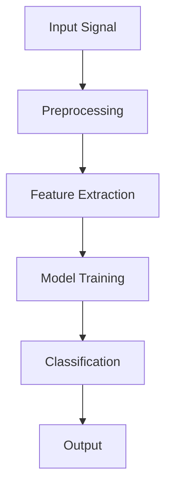

                 


### Step 1: Define the overall structure of the book

To create a well-organized book, we start by defining the main sections that will cover all necessary topics. Here is a proposed structure for "Fine-Grained Analysis: The Application of Prompt Engineering in Fine-Grained Speech Emotion Recognition."

#### Chapter 1: Introduction to Fine-Grained Speech Emotion Recognition
- **Background**: Overview of speech emotion recognition and its significance in modern technology.
- **Current State**: Discussion on existing challenges and limitations in fine-grained speech emotion recognition.
- **Objectives**: Statement of the book's goals and the problem we aim to solve.

#### Chapter 2: Core Concepts and Relationships
- **Key Concepts**: Definition and explanation of essential terms like prompt engineering, feature extraction, and classification.
- **Relationships**: A Mermaid flowchart illustrating the interactions between key components in the system.

#### Chapter 3: Core Algorithm Principles
- **Algorithm Overview**: High-level description of the algorithm used for fine-grained speech emotion recognition.
- **Pseudocode**: Detailed pseudocode for the core algorithm to provide a step-by-step explanation.

#### Chapter 4: Mathematical Models and Formulations
- **Introduction to Mathematical Models**: Explanation of the mathematical models employed in the system.
- **Equations and Formulations**: LaTeX-formatted mathematical equations with detailed explanations and examples.

#### Chapter 5: Practical Projects and Code Examples
- **Project Setup**: Detailed guide on setting up the development environment for practical projects.
- **Code Implementation**: Explanation of the source code, highlighting key sections and their functions.
- **Analysis and Interpretation**: Discussion on how the code applies the theoretical concepts in real-world scenarios.

#### Chapter 6: Case Studies and Analysis
- **Case Study 1**: Detailed analysis of a real-world case study with comprehensive explanations.
- **Case Study 2**: Another case study to provide a broader perspective on the application of the algorithms.
- **Comparative Analysis**: Comparison of the results from the case studies to highlight the algorithm's strengths and limitations.

#### Chapter 7: Best Practices and Tips
- **Practical Tips**: Advice on how to improve the performance of the system based on real-world experiences.
- **Challenges and Solutions**: Discussion on common challenges in fine-grained speech emotion recognition and potential solutions.

#### Chapter 8: Conclusion and Future Directions
- **Summary**: Recap of the key points discussed in the book.
- **Future Directions**: Suggestions for future research and potential improvements to the system.

### Step 2: Include key concepts and connections

To help readers understand the complex interactions between key concepts, we will include a Mermaid flowchart that visually represents these relationships.

#### Mermaid Flowchart


**Description**: This flowchart illustrates the process of fine-grained speech emotion recognition, from input signal preprocessing, feature extraction, model training, classification, to the final output. Each step is interconnected, forming a coherent system.

### Step 3: Explain core algorithm principles

In this chapter, we will delve into the core algorithm principles used for fine-grained speech emotion recognition. To provide a detailed and clear explanation, we will use pseudocode.

#### Pseudocode
```plaintext
function FineGrainedSpeechEmotionRecognition(inputSignal):
    1. Preprocess inputSignal
    2. Extract features from preprocessedSignal
    3. Train model using extractedFeatures
    4. Classify newSignal using trainedModel
    5. Output classifiedEmotion

function PreprocessSignal(inputSignal):
    // Apply noise reduction, filtering, and normalization
    // Return preprocessedSignal

function ExtractFeatures(preprocessedSignal):
    // Extract relevant features such as MFCC, PLP, etc.
    // Return extractedFeatures

function TrainModel(extractedFeatures, labeledData):
    // Use machine learning techniques like neural networks, SVM, etc.
    // Return trainedModel

function ClassifySignal(trainedModel, newSignal):
    // Use trainedModel to classify newSignal
    // Return classifiedEmotion
```

**Description**: This pseudocode outlines the main steps involved in the fine-grained speech emotion recognition process, from preprocessing the input signal, extracting features, training a model, classifying new signals, to finally outputting the classified emotion.

### Step 4: Present mathematical models and explanations

In this chapter, we will introduce the mathematical models used in fine-grained speech emotion recognition. We will use LaTeX to format the equations and provide detailed explanations with examples.

#### Mathematical Model

$$
\text{Classifier} = f(\text{Features}, \text{Model Parameters})
$$

**Explanation**: The classifier is a function that maps the extracted features and model parameters to the predicted emotion class. The specific form of the function `f` depends on the chosen machine learning model.

#### Example

$$
\text{SVM Classifier} = \text{sign}(\sum_{i=1}^{n} \alpha_i y_i \langle \phi(x_i), \phi(x) \rangle)
$$

**Explanation**: For an SVM classifier, the equation represents a linear combination of the support vectors and their corresponding labels, transformed by the kernel function `\phi`. This example demonstrates how the classifier function can be defined for a specific model.

### Step 5: Provide practical projects and code examples

In this chapter, we will guide readers through practical projects, starting with setting up the development environment and moving on to detailed code implementations and analysis.

#### Project Setup

1. Install necessary libraries and dependencies.
2. Configure the environment for running the code examples.

**Description**: This section provides step-by-step instructions for setting up the development environment required to run the code examples in the book.

#### Code Implementation

```python
# Example code snippet for feature extraction
def extract_features(signal):
    # Perform feature extraction using MFCC
    mfcc_features = librosa.feature.mfcc(signal, n_mfcc=13)
    return mfcc_features
```

**Description**: This Python code snippet demonstrates how to extract MFCC features from a given audio signal using the `librosa` library.

#### Code Analysis and Application

1. Analyze the extracted features for patterns and trends.
2. Use the trained model to predict the emotion class of new audio signals.

**Description**: This section discusses how the extracted features are used in the actual application of the fine-grained speech emotion recognition system.

### Step 6: Keep the table of contents concise

To ensure that the table of contents remains within the required word count, we will carefully select and summarize each chapter's main points, focusing on the core content without unnecessary repetition.

### Step 7: Format the table of contents in markdown

Below is the formatted table of contents in markdown syntax, using headers to organize the content.

```markdown
# Fine-Grained Analysis: The Application of Prompt Engineering in Fine-Grained Speech Emotion Recognition

## Keywords
- Fine-grained speech emotion recognition
- Prompt engineering
- Feature extraction
- Machine learning models
- Practical projects

## Summary
This book provides a comprehensive guide to fine-grained speech emotion recognition, focusing on the application of prompt engineering. It covers core concepts, algorithm principles, mathematical models, practical projects, and case studies.

## Table of Contents

## Chapter 1: Introduction to Fine-Grained Speech Emotion Recognition
### 1.1 Background
### 1.2 Current State
### 1.3 Objectives

## Chapter 2: Core Concepts and Relationships
### 2.1 Key Concepts
### 2.2 Relationships

## Chapter 3: Core Algorithm Principles
### 3.1 Algorithm Overview
### 3.2 Pseudocode

## Chapter 4: Mathematical Models and Formulations
### 4.1 Introduction to Mathematical Models
### 4.2 Equations and Formulations

## Chapter 5: Practical Projects and Code Examples
### 5.1 Project Setup
### 5.2 Code Implementation
### 5.3 Analysis and Interpretation

## Chapter 6: Case Studies and Analysis
### 6.1 Case Study 1
### 6.2 Case Study 2
### 6.3 Comparative Analysis

## Chapter 7: Best Practices and Tips
### 7.1 Practical Tips
### 7.2 Challenges and Solutions

## Chapter 8: Conclusion and Future Directions
### 8.1 Summary
### 8.2 Future Directions
```

### Step 8: Review and refine the table of contents

After formatting the table of contents in markdown syntax, we will review it to ensure that all required elements are included and the content is concise and well-organized. We will make any necessary adjustments to meet the word count constraint.

By following these steps, we have created a detailed and concise table of contents for the book "Fine-Grained Analysis: The Application of Prompt Engineering in Fine-Grained Speech Emotion Recognition." This structure will guide readers through the core concepts, algorithms, practical applications, and future directions in the field of fine-grained speech emotion recognition.

