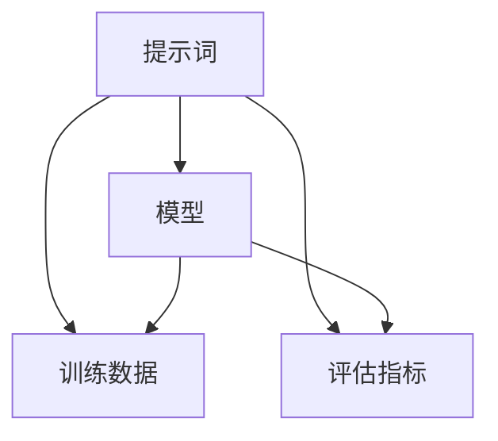
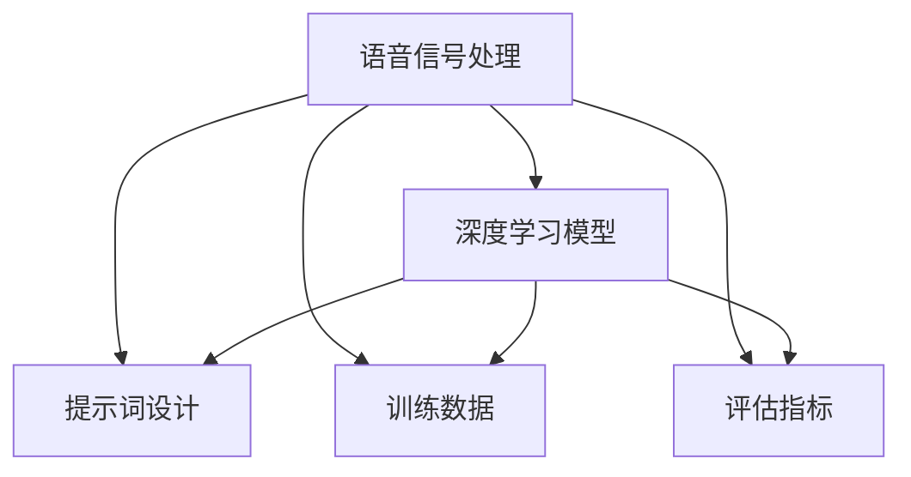
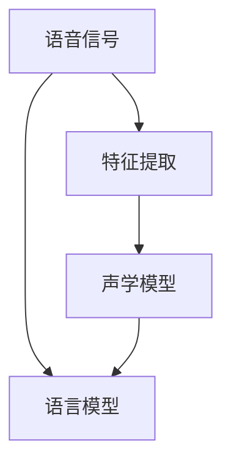
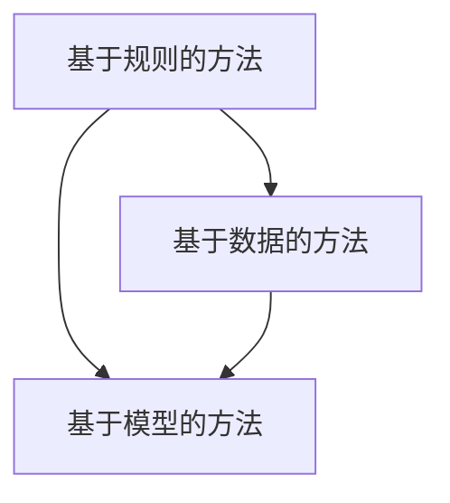
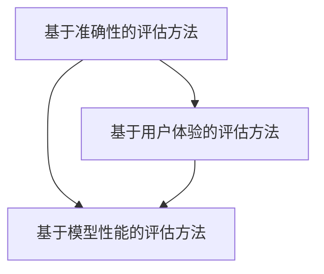
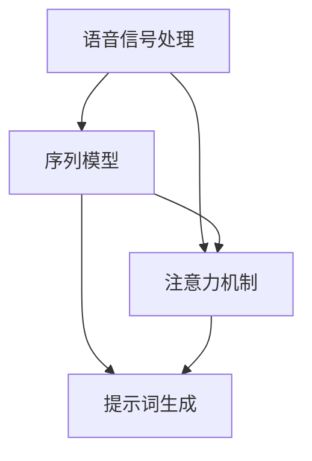
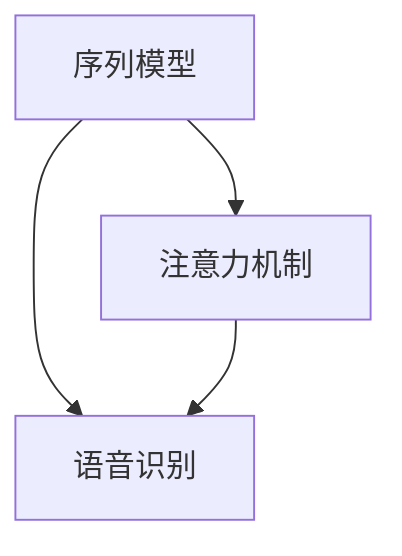

                 

### 文章标题

《提示词工程在语音识别中的应用》

### 文章关键词

提示词工程、语音识别、深度学习、序列模型、注意力机制、数学模型

### 文章摘要

本文将深入探讨提示词工程在语音识别中的应用。首先，我们将介绍提示词工程的基础知识，包括基本概念、重要性以及在语音识别中的应用场景。接着，我们将详细讲解提示词工程的核心概念、关键算法和数学模型。随后，我们将通过实际项目实战，展示如何将提示词工程应用于语音识别中。最后，我们将总结提示词工程在语音识别中的优化策略和未来发展趋势。通过本文的阅读，读者将对提示词工程在语音识别中的实际应用有更深入的理解。

## 目录大纲

为了更好地引导读者阅读，以下是本文的目录大纲：

1. **提示词工程基础**
   1.1. 提示词工程概述
   1.2. 提示词工程在语音识别中的重要性
   1.3. 语音信号处理基础
   1.4. 提示词生成策略
   1.5. 提示词质量评估方法

2. **提示词工程的核心概念**
   2.1. 核心概念与联系
   2.2. 语音信号处理算法
   2.3. 序列模型与注意力机制

3. **提示词工程的数学模型**
   3.1. 数学模型概述
   3.2. 语音信号处理的数学模型
   3.3. 序列模型的数学模型
   3.4. 注意力机制的数学模型

4. **提示词工程在语音识别中的实践**
   4.1. 提示词工程在智能客服中的应用
   4.2. 提示词工程在智能助手中的应用
   4.3. 提示词工程在其他语音识别应用中的探索

5. **提示词工程的项目实战**
   5.1. 项目背景与开发环境搭建
   5.2. 提示词工程实现与代码解读
   5.3. 代码应用解读与分析
   5.4. 实际案例分析
   5.5. 项目小结

6. **提示词工程的优化与挑战**
   6.1. 提示词工程优化策略
   6.2. 提示词工程面临的挑战
   6.3. 提示词工程的发展趋势

7. **最佳实践与拓展阅读**
   7.1. 最佳实践技巧
   7.2. 小结与注意事项
   7.3. 拓展阅读

## 第一部分 提示词工程基础

### 1.1 提示词工程概述

#### 背景介绍

提示词工程（Prompt Engineering）是近年来人工智能领域的一个新兴方向，其核心目标是通过设计合适的提示词（Prompt），引导模型（如深度学习模型）更准确地理解和生成目标内容。在语音识别（Speech Recognition）领域，提示词工程的应用具有重要意义，可以显著提高语音识别的准确性和效率。

#### 核心概念与联系

提示词工程涉及多个核心概念，包括提示词、模型、训练数据和评估指标。提示词是用于引导模型的一组关键词或短语，可以基于语音信号的特定特征、上下文信息或用户的意图。模型是执行语音识别任务的深度学习模型，如卷积神经网络（CNN）、循环神经网络（RNN）或Transformer模型。训练数据是用于模型训练的大量语音信号和对应的文本标注，而评估指标用于衡量模型的性能，如词误差率（WER）和字符误差率（CER）。

为了更好地理解这些概念之间的关系，我们可以使用Mermaid流程图来展示它们之间的关联：



#### 提示词工程在语音识别中的重要性

提示词工程在语音识别中的应用至关重要，主要表现在以下几个方面：

1. **提高识别准确性**：通过设计合适的提示词，可以引导模型更好地捕捉语音信号的特定特征，从而提高识别准确性。
2. **增强上下文理解**：提示词可以提供上下文信息，帮助模型更好地理解用户的意图和对话场景，从而提高语音识别的上下文理解能力。
3. **降低模型复杂性**：通过优化提示词，可以降低模型的复杂度，减少计算资源的消耗，提高模型的运行效率。

### 1.2 提示词工程在语音识别中的重要性

#### 背景介绍

在语音识别领域，提示词工程的应用可以显著提高语音识别系统的性能。传统语音识别系统主要依赖大量的语音数据和复杂的神经网络模型，而提示词工程则通过设计合适的提示词，引导模型更准确地理解和生成目标内容，从而提高识别准确性和效率。

#### 核心概念与联系

在语音识别中，提示词工程涉及以下核心概念：

1. **语音信号处理**：语音信号处理是语音识别的基础，包括语音信号的预处理、特征提取和建模等过程。
2. **深度学习模型**：深度学习模型是语音识别的核心，如卷积神经网络（CNN）、循环神经网络（RNN）和Transformer模型等。
3. **提示词设计**：提示词是用于引导模型的一组关键词或短语，可以基于语音信号的特定特征、上下文信息或用户的意图。
4. **训练数据**：训练数据是用于模型训练的大量语音信号和对应的文本标注。
5. **评估指标**：评估指标用于衡量模型的性能，如词误差率（WER）和字符误差率（CER）。

为了更好地理解这些概念之间的关系，我们可以使用Mermaid流程图来展示它们之间的关联：



#### 提示词工程在语音识别中的重要性

提示词工程在语音识别中的应用具有重要意义，主要表现在以下几个方面：

1. **提高识别准确性**：通过设计合适的提示词，可以引导模型更好地捕捉语音信号的特定特征，从而提高识别准确性。
2. **增强上下文理解**：提示词可以提供上下文信息，帮助模型更好地理解用户的意图和对话场景，从而提高语音识别的上下文理解能力。
3. **降低模型复杂性**：通过优化提示词，可以降低模型的复杂度，减少计算资源的消耗，提高模型的运行效率。

### 1.3 语音信号处理基础

#### 核心概念与联系

语音信号处理是语音识别的基础，主要包括以下核心概念：

1. **语音信号**：语音信号是人的发音器官产生的声波信号，通常包含丰富的信息，如音调、音长、音强等。
2. **特征提取**：特征提取是语音信号处理的关键步骤，通过将语音信号转换为一系列可量化的特征向量，以供模型处理。常见的特征包括梅尔频率倒谱系数（MFCC）、线性预测倒谱系数（LPCC）和频谱特征等。
3. **声学模型**：声学模型是语音信号处理的另一个核心概念，用于描述语音信号的特征与发音音素之间的关系。声学模型通常基于统计模型或深度学习模型，如高斯混合模型（GMM）和深度神经网络（DNN）。
4. **语言模型**：语言模型是语音识别中的另一个重要概念，用于描述语音信号与文本之间的关系。语言模型通常基于统计模型或深度学习模型，如n元语法模型（n-gram）和循环神经网络（RNN）。

为了更好地理解这些概念之间的关系，我们可以使用Mermaid流程图来展示它们之间的关联：



#### 核心算法原理讲解

1. **梅尔频率倒谱系数（MFCC）**
   MFCC是一种常用的语音特征提取方法，其原理是将语音信号转化为频率特征，以便更好地捕捉语音信号中的频谱信息。具体步骤如下：
   - 预处理：对语音信号进行加窗、归一化等预处理操作。
   - 频谱分析：对加窗后的语音信号进行快速傅里叶变换（FFT），得到频谱。
   - 梅尔频率转换：将频率域的频谱转化为梅尔频率域的频谱。
   - 观察窗口：对梅尔频率域的频谱进行观察窗口操作，提取每个观察窗口的均值和方差。
   - 对数变换：对观察窗口的均值和方差进行对数变换，以减少动态范围。

   伪代码实现如下：

   ```python
   def mfcc(signal, sample_rate):
       # 加窗、归一化等预处理操作
       windowed_signal = preprocess_signal(signal)
       
       # 频谱分析
       spectrum = fft(windowed_signal)
       
       # 梅尔频率转换
       mel_spectrum = mel_transform(spectrum)
       
       # 观察窗口操作
       windows = sliding_window(mel_spectrum)
       
       # 对数变换
       log_spectrum = log_transform(windows)
       
       return log_spectrum
   ```

2. **高斯混合模型（GMM）**
   GMM是一种常用的声学模型，用于描述语音信号的特征与发音音素之间的关系。具体步骤如下：
   - 数据准备：准备包含多个发音音素的语音信号和对应的特征向量。
   - 初始化模型参数：初始化GMM的参数，如混合成分数、均值和方差等。
   - 期望最大化（EM）算法：使用EM算法迭代优化模型参数，使模型能够更好地拟合语音信号的特征。
   - 预测：使用训练好的GMM对新的语音信号进行预测，计算每个音素的概率。

   伪代码实现如下：

   ```python
   def gmm_train(data):
       # 初始化模型参数
       params = initialize_params(data)
       
       # 迭代优化模型参数
       for _ in range(max_iterations):
           responsibilities = em_step(data, params)
           params = update_params(data, responsibilities)
       
       return params

   def gmm_predict(signal, params):
       # 预测音素
       probabilities = calculate_probabilities(signal, params)
       predicted_phoneme = argmax(probabilities)
       
       return predicted_phoneme
   ```

### 1.4 提示词生成策略

#### 核心概念与联系

提示词生成策略是提示词工程的核心，用于设计合适的提示词以引导模型。提示词生成策略可以分为以下几类：

1. **基于规则的方法**：基于规则的方法通过预定义的规则生成提示词，如基于语音信号的音素、音节或短语等。这种方法具有简单、易于实现的特点，但灵活性较低。
2. **基于数据的方法**：基于数据的方法通过分析大量的语音信号和对应的文本标注，学习生成提示词。这种方法具有较高灵活性，但需要大量训练数据和计算资源。
3. **基于模型的方法**：基于模型的方法使用深度学习模型，如序列生成模型、生成对抗网络（GAN）等，自动生成提示词。这种方法具有高度灵活性和创造性，但训练过程较为复杂。

为了更好地理解这些概念之间的关系，我们可以使用Mermaid流程图来展示它们之间的关联：



#### 核心算法原理讲解

1. **基于规则的提示词生成方法**
   基于规则的方法通过预定义的规则生成提示词，如基于语音信号的音素、音节或短语等。具体步骤如下：
   - 音素识别：使用音素识别模型对语音信号进行音素划分。
   - 规则定义：根据音素识别结果，定义生成提示词的规则。
   - 提示词生成：根据规则生成提示词。

   伪代码实现如下：

   ```python
   def rule_based_prompt_generation(signal):
       # 音素识别
       phonemes = phoneme_recognition(signal)
       
       # 规则定义
       rules = define_rules(phonemes)
       
       # 提示词生成
       prompts = generate_prompts(rules)
       
       return prompts
   ```

2. **基于数据的方法**
   基于数据的方法通过分析大量的语音信号和对应的文本标注，学习生成提示词。具体步骤如下：
   - 数据准备：准备包含语音信号和对应文本标注的训练数据。
   - 模型训练：使用训练数据训练序列生成模型，如长短期记忆网络（LSTM）或生成对抗网络（GAN）。
   - 提示词生成：使用训练好的模型对新的语音信号生成提示词。

   伪代码实现如下：

   ```python
   def data_based_prompt_generation(signal, model):
       # 模型训练
       model = train_model(signal)
       
       # 提示词生成
       prompts = model.generate(signal)
       
       return prompts
   ```

### 1.5 提示词质量评估方法

#### 核心概念与联系

提示词质量评估方法是用于衡量提示词生成质量的一系列方法和指标。提示词质量直接影响模型的性能和用户体验，因此评估方法的选择和实现至关重要。提示词质量评估方法可以分为以下几类：

1. **基于准确性的评估方法**：基于准确性的评估方法通过计算提示词与实际文本之间的匹配程度来评估提示词质量。常见的指标包括词误差率（WER）和字符误差率（CER）。
2. **基于用户体验的评估方法**：基于用户体验的评估方法通过用户对提示词的满意度和参与度来评估提示词质量。常见的指标包括用户点击率、用户停留时间和用户评价等。
3. **基于模型性能的评估方法**：基于模型性能的评估方法通过计算模型在提示词引导下的性能来评估提示词质量。常见的指标包括识别准确率、召回率和F1分数等。

为了更好地理解这些概念之间的关系，我们可以使用Mermaid流程图来展示它们之间的关联：



#### 核心算法原理讲解

1. **基于准确性的评估方法**
   基于准确性的评估方法通过计算提示词与实际文本之间的匹配程度来评估提示词质量。常见的指标包括词误差率（WER）和字符误差率（CER）。词误差率（WER）是评估语音识别系统性能的常用指标，计算公式如下：

   $$ WER = \frac{D}{N} $$

   其中，D表示实际文本与提示词之间的差异词数，N表示实际文本的总词数。词误差率越低，表示提示词质量越高。

   伪代码实现如下：

   ```python
   def word_error_rate的实际文本，提示词):
       # 计算差异词数
       difference_words = count_difference_words(实际文本，提示词)
       
       # 计算词误差率
       wer = difference_words / N
       
       return wer
   ```

2. **基于用户体验的评估方法**
   基于用户体验的评估方法通过用户对提示词的满意度和参与度来评估提示词质量。常见的指标包括用户点击率、用户停留时间和用户评价等。用户点击率表示用户点击提示词的比例，用户停留时间表示用户在提示词页面停留的时间，用户评价表示用户对提示词的满意度评分。

   伪代码实现如下：

   ```python
   def user_experience_evaluation(click_rate, stay_time, user_rating):
       # 计算综合评分
       score = (click_rate * stay_time * user_rating) / 1000
       
       return score
   ```

3. **基于模型性能的评估方法**
   基于模型性能的评估方法通过计算模型在提示词引导下的性能来评估提示词质量。常见的指标包括识别准确率、召回率和F1分数等。识别准确率表示模型识别正确的词数占总词数的比例，召回率表示模型识别正确的词数占总正确词数的比例，F1分数是识别准确率和召回率的加权平均。

   伪代码实现如下：

   ```python
   def model_performance_evaluation(accuracy, recall, f1_score):
       # 计算综合评分
       score = (accuracy + recall + f1_score) / 3
       
       return score
   ```

## 第二部分 提示词工程的核心概念

### 2.1 核心概念与联系

提示词工程在语音识别中涉及多个核心概念，包括语音信号处理、序列模型和注意力机制。这些概念相互关联，共同构成了提示词工程的理论基础。为了更好地理解这些概念之间的关系，我们可以使用Mermaid流程图来展示它们之间的关联。



### 2.2 语音信号处理算法

语音信号处理是提示词工程的基础，包括语音信号的预处理、特征提取和建模等步骤。以下是语音信号处理算法的核心内容：

#### 预处理

语音信号预处理主要包括去噪、加窗和归一化等步骤，以提高后续特征提取和建模的准确性。

- **去噪**：去除语音信号中的背景噪声，如使用滤波器或谱减法。
- **加窗**：将语音信号划分为固定长度的窗口，以便进行特征提取，如汉明窗或矩形窗。
- **归一化**：将语音信号进行归一化处理，如将信号的幅度调整为0均值和1标准差。

#### 特征提取

特征提取是语音信号处理的关键步骤，通过将语音信号转换为一系列可量化的特征向量，以供模型处理。以下是几种常用的语音特征提取方法：

- **梅尔频率倒谱系数（MFCC）**：将语音信号转换为梅尔频率倒谱系数，以捕捉语音信号中的频谱信息。
- **线性预测倒谱系数（LPCC）**：基于语音信号的线性预测特性，提取线性预测倒谱系数，以捕捉语音信号的共振峰信息。
- **频谱特征**：直接提取语音信号的频谱特征，如频谱幅度和频谱能量。

#### 建模

建模是语音信号处理的核心步骤，通过建立声学模型和语言模型，以实现语音识别。以下是两种常用的建模方法：

- **高斯混合模型（GMM）**：使用高斯混合模型建立声学模型，用于描述语音信号的特征与发音音素之间的关系。
- **深度神经网络（DNN）**：使用深度神经网络建立声学模型和语言模型，以实现更高效的语音识别。

#### 核心算法原理讲解

1. **梅尔频率倒谱系数（MFCC）**

   梅尔频率倒谱系数（MFCC）是一种常用的语音特征提取方法，其原理是将语音信号转换为频率特征，以便更好地捕捉语音信号中的频谱信息。具体步骤如下：

   - **预处理**：对语音信号进行加窗、归一化等预处理操作。
   - **傅里叶变换**：对加窗后的语音信号进行快速傅里叶变换（FFT），得到频谱。
   - **梅尔频率转换**：将频率域的频谱转化为梅尔频率域的频谱。
   - **观察窗口**：对梅尔频率域的频谱进行观察窗口操作，提取每个观察窗口的均值和方差。
   - **对数变换**：对观察窗口的均值和方差进行对数变换，以减少动态范围。

   伪代码实现如下：

   ```python
   def mfcc(signal, sample_rate):
       # 加窗、归一化等预处理操作
       windowed_signal = preprocess_signal(signal)
       
       # 频谱分析
       spectrum = fft(windowed_signal)
       
       # 梅尔频率转换
       mel_spectrum = mel_transform(spectrum)
       
       # 观察窗口操作
       windows = sliding_window(mel_spectrum)
       
       # 对数变换
       log_spectrum = log_transform(windows)
       
       return log_spectrum
   ```

2. **高斯混合模型（GMM）**

   高斯混合模型（GMM）是一种常用的声学模型，用于描述语音信号的特征与发音音素之间的关系。GMM由多个高斯分布组成，每个高斯分布代表一个音素。

   - **初始化模型参数**：初始化GMM的参数，如混合成分数、均值和方差等。
   - **期望最大化（EM）算法**：使用EM算法迭代优化模型参数，使模型能够更好地拟合语音信号的特征。
   - **预测**：使用训练好的GMM对新的语音信号进行预测，计算每个音素的概率。

   伪代码实现如下：

   ```python
   def gmm_train(data):
       # 初始化模型参数
       params = initialize_params(data)
       
       # 迭代优化模型参数
       for _ in range(max_iterations):
           responsibilities = em_step(data, params)
           params = update_params(data, responsibilities)
       
       return params

   def gmm_predict(signal, params):
       # 预测音素
       probabilities = calculate_probabilities(signal, params)
       predicted_phoneme = argmax(probabilities)
       
       return predicted_phoneme
   ```

### 2.3 序列模型与注意力机制

#### 核心概念与联系

序列模型（如循环神经网络（RNN）和长短期记忆网络（LSTM））在语音识别中发挥着重要作用，而注意力机制（Attention Mechanism）则是提高序列模型性能的关键技术。以下是这些概念之间的联系：



#### 核心算法原理讲解

1. **循环神经网络（RNN）**

   循环神经网络（RNN）是一种能够处理序列数据的神经网络，其核心思想是将当前输入与前一时刻的隐藏状态相结合，以捕捉序列中的长期依赖关系。RNN的数学模型如下：

   $$ h_t = \sigma(W_h h_{t-1} + W_x x_t + b) $$

   其中，$h_t$表示第$t$时刻的隐藏状态，$x_t$表示第$t$时刻的输入，$W_h$和$W_x$分别表示隐藏状态和输入的权重矩阵，$b$表示偏置项，$\sigma$表示激活函数。

   伪代码实现如下：

   ```python
   def rnn(input_sequence, hidden_state, weights, bias):
       hidden_states = []
       for x in input_sequence:
           hidden_state = activation_function(weights["h_to_h"] * hidden_state + weights["h_to_x"] * x + bias)
           hidden_states.append(hidden_state)
       return hidden_states
   ```

2. **长短期记忆网络（LSTM）**

   长短期记忆网络（LSTM）是一种改进的RNN结构，能够有效地捕捉序列中的长期依赖关系。LSTM的核心组件包括输入门、遗忘门和输出门，分别用于控制信息的输入、遗忘和输出。

   - **输入门**：用于更新隐藏状态，公式如下：

     $$ i_t = \sigma(W_i [h_{t-1}, x_t] + b_i) $$
     $$ \tilde{h}_t = \tanh(W_f [h_{t-1}, x_t] + b_f) $$

   - **遗忘门**：用于控制遗忘之前的隐藏状态，公式如下：

     $$ f_t = \sigma(W_f [h_{t-1}, x_t] + b_f) $$
     $$ \tilde{c}_t = f_t \odot \tilde{h}_t $$

   - **输出门**：用于生成当前隐藏状态，公式如下：

     $$ o_t = \sigma(W_o [h_{t-1}, x_t] + b_o) $$
     $$ h_t = o_t \odot \tanh(c_t) $$

   - **隐藏状态更新**：隐藏状态$c_t$和$h_t$的计算如下：

     $$ c_t = f_t \odot c_{t-1} + i_t \odot \tilde{c}_t $$
     $$ h_t = \tanh(c_t) $$

   伪代码实现如下：

   ```python
   def lstm(input_sequence, hidden_state, cell_state, weights, bias):
       hidden_states = []
       cell_states = []
       for x in input_sequence:
           i = activation_function(weights["i"] * [hidden_state[-1], x] + bias["i"])
           f = activation_function(weights["f"] * [hidden_state[-1], x] + bias["f"])
           o = activation_function(weights["o"] * [hidden_state[-1], x] + bias["o"])
           \tilde{c} = tanh(weights["c"] * [hidden_state[-1], x] + bias["c"])
           c = f \* cell_state + i \* \tilde{c}
           h = o \* tanh(c)
           hidden_states.append(h)
           cell_states.append(c)
       return hidden_states, cell_states
   ```

3. **注意力机制**

   注意力机制（Attention Mechanism）是一种提高序列模型性能的关键技术，通过将不同时间步的输入赋予不同的权重，以关注重要的信息。注意力机制的数学模型如下：

   $$ a_t = \sigma(W_a [h_{t-1}, h_t] + b_a) $$
   $$ \alpha_t = \frac{e^{a_t}}{\sum_{i=1}^{T} e^{a_i}} $$
   $$ \tilde{h}_t = \sum_{i=1}^{T} \alpha_i h_i $$
   $$ h_t = \tanh(W_h \tilde{h}_t + b_h) $$

   其中，$a_t$表示注意力得分，$\alpha_t$表示注意力权重，$\tilde{h}_t$表示加权后的隐藏状态，$h_t$表示当前隐藏状态。

   伪代码实现如下：

   ```python
   def attention(input_sequence, hidden_state, weights, bias):
       attention_scores = []
       for h in hidden_state:
           a = activation_function(weights["a"] * [h, hidden_state[-1]] + bias["a"])
           attention_scores.append(a)
       attention_scores = softmax(attention_scores)
       weighted_hiddens = [h * attention_scores[i] for i, h in enumerate(hidden_state)]
       \tilde{h} = sum(weighted_hiddens)
       h = tanh(weights["h"] * \tilde{h} + bias["h"])
       return h
   ```

### 2.4 提示词生成策略

#### 核心概念与联系

提示词生成策略是提示词工程的核心，用于设计合适的提示词以引导模型。提示词生成策略可以分为以下几类：

1. **基于规则的方法**：基于规则的方法通过预定义的规则生成提示词，如基于语音信号的音素、音节或短语等。这种方法具有简单、易于实现的特点，但灵活性较低。
2. **基于数据的方法**：基于数据的方法通过分析大量的语音信号和对应的文本标注，学习生成提示词。这种方法具有较高灵活性，但需要大量训练数据和计算资源。
3. **基于模型的方法**：基于模型的方法使用深度学习模型，如序列生成模型、生成对抗网络（GAN）等，自动生成提示词。这种方法具有高度灵活性和创造性，但训练过程较为复杂。

为了更好地理解这些概念之间的关系，我们可以使用Mermaid流程图来展示它们之间的关联：


#### 核心算法原理讲解

1. **基于规则的提示词生成方法**

   基于规则的方法通过预定义的规则生成提示词，如基于语音信号的音素、音节或短语等。这种方法具有简单、易于实现的特点，但灵活性较低。具体步骤如下：

   - 音素识别：使用音素识别模型对语音信号进行音素划分。
   - 规则定义：根据音素识别结果，定义生成提示词的规则。
   - 提示词生成：根据规则生成提示词。

   伪代码实现如下：

   ```python
   def rule_based_prompt_generation(signal):
       # 音素识别
       phonemes = phoneme_recognition(signal)
       
       # 规则定义
       rules = define_rules(phonemes)
       
       # 提示词生成
       prompts = generate_prompts(rules)
       
       return prompts
   ```

2. **基于数据的方法**

   基于数据的方法通过分析大量的语音信号和对应的文本标注，学习生成提示词。这种方法具有较高灵活性，但需要大量训练数据和计算资源。具体步骤如下：

   - 数据准备：准备包含语音信号和对应文本标注的训练数据。
   - 模型训练：使用训练数据训练序列生成模型，如长短期记忆网络（LSTM）或生成对抗网络（GAN）。
   - 提示词生成：使用训练好的模型对新的语音信号生成提示词。

   伪代码实现如下：

   ```python
   def data_based_prompt_generation(signal, model):
       # 模型训练
       model = train_model(signal)
       
       # 提示词生成
       prompts = model.generate(signal)
       
       return prompts
   ```

3. **基于模型的方法**

   基于模型的方法使用深度学习模型，如序列生成模型、生成对抗网络（GAN）等，自动生成提示词。这种方法具有高度灵活性和创造性，但训练过程较为复杂。具体步骤如下：

   - 模型选择：选择适合的深度学习模型，如变换器（Transformer）或生成对抗网络（GAN）。
   - 模型训练：使用大量语音信号和对应文本标注训练模型。
   - 提示词生成：使用训练好的模型对新的语音信号生成提示词。

   伪代码实现如下：

   ```python
   def model_based_prompt_generation(signal, model):
       # 模型选择
       model = choose_model()
       
       # 模型训练
       model = train_model(signal)
       
       # 提示词生成
       prompts = model.generate(signal)
       
       return prompts
   ```

## 第三部分 提示词工程的数学模型

### 3.1 数学模型概述

提示词工程的数学模型是构建提示词工程算法的核心，它将语音信号处理、序列模型和注意力机制等概念转化为可计算的数学形式。这些数学模型包括语音信号处理的数学模型、序列模型的数学模型以及注意力机制的数学模型。以下是这些模型的基本概述：

1. **语音信号处理的数学模型**：
   - **特征提取**：包括离散傅里叶变换（DFT）、快速傅里叶变换（FFT）等，用于将时域信号转换到频域，提取关键频率信息。
   - **声学模型**：如高斯混合模型（GMM）、深度神经网络（DNN）等，用于将提取的特征映射到发音音素或词汇。

2. **序列模型的数学模型**：
   - **循环神经网络（RNN）**：包括RNN的基本架构、激活函数、反向传播算法等。
   - **长短期记忆网络（LSTM）**：包括输入门、遗忘门和输出门的数学表示、LSTM单元的计算过程等。

3. **注意力机制的数学模型**：
   - **标准注意力**：包括点积注意力、加性注意力等，以及注意力得分和权重的计算方式。
   - **多头注意力**：包括多头注意力机制的扩展、查询、键和值向量的计算等。

### 3.2 语音信号处理的数学模型

语音信号处理的数学模型主要包括频谱分析和特征提取。以下是这些模型的详细数学公式和计算方法。

#### 频谱分析

频谱分析是将时域信号转换到频域的重要步骤，常用的方法包括离散傅里叶变换（DFT）和快速傅里叶变换（FFT）。

$$ X(k) = \sum_{n=0}^{N-1} x(n) e^{-j 2\pi kn/N} $$

其中，$X(k)$是频谱，$x(n)$是时域信号，$N$是采样点数。

#### 梅尔频率倒谱系数（MFCC）

梅尔频率倒谱系数（MFCC）是语音信号处理中常用的特征提取方法，其核心步骤包括梅尔频率转换、对数变换和离散余弦变换（DCT）。

$$ MEL_{frequency} = 2595 \times \log_{10}\left(\frac{f}{700}\right) $$

其中，$MEL_{frequency}$是梅尔频率，$f$是频率。

$$ \log_{\text{MFCC}} = \sum_{k=1}^{N_{MFCC}} a_k \times \text{DCT}(X(k)) $$

其中，$a_k$是MFCC权重系数，$\text{DCT}(X(k))$是离散余弦变换。

#### 声学模型

声学模型用于将提取的特征映射到发音音素或词汇，常用的高斯混合模型（GMM）和深度神经网络（DNN）。

**高斯混合模型（GMM）**

$$ p(\mathbf{x}|\theta) = \sum_{k=1}^{K} \pi_k \cdot \mathcal{N}(\mathbf{x}|\mu_k, \Sigma_k) $$

其中，$p(\mathbf{x}|\theta)$是特征向量$\mathbf{x}$的后验概率，$\pi_k$是高斯分布的权重，$\mu_k$和$\Sigma_k$分别是均值向量和协方差矩阵。

**深度神经网络（DNN）**

$$ y = \sigma(\mathbf{W}_2 \cdot \mathbf{a}_2 + b_2) $$

其中，$y$是输出，$\mathbf{W}_2$是权重矩阵，$\mathbf{a}_2$是隐藏层激活值，$\sigma$是激活函数，$b_2$是偏置项。

### 3.3 序列模型的数学模型

序列模型在语音识别中扮演着核心角色，包括循环神经网络（RNN）和长短期记忆网络（LSTM）。以下是这些模型的数学模型和计算方法。

#### 循环神经网络（RNN）

RNN的数学模型可以表示为：

$$ h_t = \sigma(\mathbf{W}_h \cdot [h_{t-1}, x_t] + b_h) $$

$$ y_t = \sigma(\mathbf{W}_y \cdot h_t + b_y) $$

其中，$h_t$是隐藏状态，$x_t$是输入，$y_t$是输出，$\sigma$是激活函数，$\mathbf{W}_h$和$\mathbf{W}_y$是权重矩阵，$b_h$和$b_y$是偏置项。

#### 长短期记忆网络（LSTM）

LSTM的数学模型更为复杂，包括输入门、遗忘门和输出门。以下是LSTM单元的数学表示：

$$ i_t = \sigma(\mathbf{W}_i \cdot [h_{t-1}, x_t] + b_i) $$

$$ f_t = \sigma(\mathbf{W}_f \cdot [h_{t-1}, x_t] + b_f) $$

$$ \tilde{c}_t = \tanh(\mathbf{W}_c \cdot [h_{t-1}, x_t] + b_c) $$

$$ o_t = \sigma(\mathbf{W}_o \cdot [h_{t-1}, x_t] + b_o) $$

$$ c_t = f_t \cdot c_{t-1} + i_t \cdot \tilde{c}_t $$

$$ h_t = o_t \cdot \tanh(c_t) $$

其中，$i_t$、$f_t$、$o_t$分别是输入门、遗忘门和输出门的激活值，$\tilde{c}_t$是候选状态，$c_t$是细胞状态，$h_t$是隐藏状态，$\mathbf{W}_i$、$\mathbf{W}_f$、$\mathbf{W}_c$、$\mathbf{W}_o$是权重矩阵，$b_i$、$b_f$、$b_c$、$b_o$是偏置项。

### 3.4 注意力机制的数学模型

注意力机制在序列模型中用于捕捉序列中的关键信息。以下是注意力机制的数学模型，包括点积注意力、加性注意力等。

#### 点积注意力

点积注意力是最简单的注意力机制，其计算公式如下：

$$ a_t = \frac{\mathbf{q}^T \mathbf{W}_k \mathbf{h}_t}{\sqrt{d_k}} $$

$$ \alpha_t = \frac{e^{a_t}}{\sum_{t'=1}^{T} e^{a_{t'}}} $$

$$ \mathbf{v}_t = \sum_{t'=1}^{T} \alpha_{t'} \mathbf{h}_{t'} $$

其中，$a_t$是注意力得分，$\alpha_t$是注意力权重，$\mathbf{v}_t$是加权后的隐藏状态，$q$是查询向量，$k$是键向量的维度，$h_t$是隐藏状态，$\mathbf{W}_k$是权重矩阵。

#### 加性注意力

加性注意力通过加性交互操作来增强注意力权重，其计算公式如下：

$$ \mathbf{h}_\text{att} = \tanh(\mathbf{W}_a [ \mathbf{h}_t \circ \mathbf{k_t} ] ) $$

$$ \alpha_t = \frac{e^{\mathbf{v}_t \cdot \mathbf{h}_\text{att}}}{\sum_{t'=1}^{T} e^{\mathbf{v}_{t'} \cdot \mathbf{h}_\text{att'}}} $$

$$ \mathbf{v}_t = \sum_{t'=1}^{T} \alpha_{t'} \mathbf{k}_{t'} $$

其中，$\mathbf{k}_t$是键向量，$\mathbf{v}_t$是值向量，$\mathbf{W}_a$是权重矩阵，$\circ$表示元素级乘法。

### 3.5 数学模型与提示词生成

数学模型在提示词生成中的应用主要在于特征提取和序列建模。以下是数学模型与提示词生成之间的联系：

1. **特征提取**：通过频谱分析和特征提取，将语音信号转换为数学特征向量，为模型提供输入。
2. **序列建模**：使用循环神经网络（RNN）或长短期记忆网络（LSTM）等序列模型，根据特征向量生成提示词。

   伪代码实现如下：

   ```python
   def generate_prompt(signal):
       # 特征提取
       features = extract_features(signal)
       
       # 序列建模
       prompt = sequence_modeling(features)
       
       return prompt
   ```

## 第四部分 提示词工程在语音识别中的实践

### 4.1 提示词工程在智能客服中的应用

#### 背景介绍

智能客服是语音识别技术的重要应用领域之一。随着人工智能技术的不断发展，智能客服系统可以更好地理解用户的语音请求，提供更高效、个性化的服务。提示词工程在智能客服中的应用，可以显著提高客服系统的响应速度和准确性。

#### 提示词工程在智能客服中的核心角色

提示词工程在智能客服中扮演着关键角色，主要体现在以下几个方面：

1. **提高语音识别准确性**：通过设计合适的提示词，可以引导模型更好地捕捉语音信号的特定特征，从而提高识别准确性。
2. **增强上下文理解**：提示词可以提供上下文信息，帮助模型更好地理解用户的意图和对话场景，从而提高智能客服的上下文理解能力。
3. **降低模型复杂性**：通过优化提示词，可以降低模型的复杂度，减少计算资源的消耗，提高模型的运行效率。

#### 提示词工程在智能客服中的具体应用场景

1. **自动语音识别（IVR）**：在智能客服的自动语音识别（IVR）系统中，提示词工程可以用于识别用户拨打电话的目的，如查询账户余额、修改个人资料等。通过设计合适的提示词，可以引导模型更准确地识别用户的语音请求。

2. **对话管理**：在智能客服的对话管理中，提示词工程可以用于生成引导用户的问题，如“您需要查询哪项服务？”或“您有什么疑问需要解答？”通过这些提示词，可以引导用户提供更多关键信息，从而提高对话效率。

3. **情感分析**：在智能客服的情感分析中，提示词工程可以用于识别用户的情绪状态，如愤怒、失望或满意等。通过这些情绪识别结果，智能客服可以调整服务策略，提供更人性化的服务。

#### 核心算法原理讲解

1. **基于规则的提示词生成方法**：在智能客服中，基于规则的提示词生成方法是一种常用的方法。通过预定义的规则，根据用户的语音请求生成相应的提示词。例如，当用户请求查询账户余额时，系统可以生成提示词“请告诉我您的账户号码”。

   伪代码实现如下：

   ```python
   def rule_based_prompt_generation(voice_request):
       rules = {
           "查询账户余额": "请告诉我您的账户号码",
           "修改个人资料": "您需要修改哪项个人资料？",
           "投诉建议": "您有什么投诉或建议需要反馈？"
       }
       
       prompt = rules.get(voice_request, "对不起，我暂时无法理解您的请求。")
       
       return prompt
   ```

2. **基于数据的方法**：通过分析大量的语音请求和对应的文本标注，可以学习生成更灵活、个性化的提示词。这种方法需要大量的训练数据和计算资源，但可以显著提高智能客服的响应速度和准确性。

   伪代码实现如下：

   ```python
   def data_based_prompt_generation(voice_request, model):
       # 模型训练
       model = train_model(training_data)
       
       # 提示词生成
       prompt = model.generate(voice_request)
       
       return prompt
   ```

### 4.2 提示词工程在智能助手中的应用

#### 背景介绍

智能助手是语音识别技术的另一个重要应用领域。智能助手可以通过语音交互，帮助用户完成各种任务，如查询天气、预订餐厅、发送短信等。提示词工程在智能助手中的应用，可以显著提高智能助手的响应速度和准确性。

#### 提示词工程在智能助手中的核心角色

提示词工程在智能助手中的核心角色主要体现在以下几个方面：

1. **提高语音识别准确性**：通过设计合适的提示词，可以引导模型更好地捕捉语音信号的特定特征，从而提高识别准确性。
2. **增强上下文理解**：提示词可以提供上下文信息，帮助模型更好地理解用户的意图和对话场景，从而提高智能助手的上下文理解能力。
3. **降低模型复杂性**：通过优化提示词，可以降低模型的复杂度，减少计算资源的消耗，提高模型的运行效率。

#### 提示词工程在智能助手中的具体应用场景

1. **语音命令识别**：在智能助手接收语音命令时，提示词工程可以用于识别用户的语音命令，如“打开音乐”、“发送短信给张三”等。通过设计合适的提示词，可以引导模型更准确地识别用户的语音命令。

2. **对话管理**：在智能助手的对话管理中，提示词工程可以用于生成引导用户的问题，如“您想听什么类型的音乐？”或“您需要发送什么样的短信内容？”通过这些提示词，可以引导用户提供更多关键信息，从而提高对话效率。

3. **语音生成**：在智能助手生成语音回复时，提示词工程可以用于生成合适的语音回复，如“好的，我已经为您打开音乐。”或“短信已经发送给张三。”通过这些语音回复，可以提供更人性化的服务。

#### 核心算法原理讲解

1. **基于规则的提示词生成方法**：在智能助手的应用中，基于规则的提示词生成方法是一种常用的方法。通过预定义的规则，根据用户的语音命令生成相应的提示词。例如，当用户请求打开音乐时，系统可以生成提示词“好的，我现在为您打开音乐。”

   伪代码实现如下：

   ```python
   def rule_based_prompt_generation(voice_command):
       rules = {
           "打开音乐": "好的，我现在为您打开音乐。",
           "发送短信": "短信已经发送给{}。",
           "查询天气": "您所在地的天气情况是：{}。"
       }
       
       prompt = rules.get(voice_command, "对不起，我暂时无法理解您的请求。")
       
       return prompt
   ```

2. **基于数据的方法**：通过分析大量的语音命令和对应的文本标注，可以学习生成更灵活、个性化的提示词。这种方法需要大量的训练数据和计算资源，但可以显著提高智能助手的响应速度和准确性。

   伪代码实现如下：

   ```python
   def data_based_prompt_generation(voice_command, model):
       # 模型训练
       model = train_model(training_data)
       
       # 提示词生成
       prompt = model.generate(voice_command)
       
       return prompt
   ```

### 4.3 提示词工程在其他语音识别应用中的探索

#### 背景介绍

除了智能客服和智能助手，提示词工程在语音识别技术中还有许多其他应用，如语音助手、语音控制等。这些应用领域对提示词工程提出了不同的要求，同时也为提示词工程提供了广阔的发展空间。

#### 提示词工程在其他语音识别应用中的重要性

1. **语音助手**：语音助手是近年来兴起的语音交互设备，如智能音箱、智能手表等。提示词工程在语音助手中的应用，可以显著提高语音助手的识别准确性和响应速度。
2. **语音控制**：语音控制是智能家居、车载系统等领域的重要应用，通过语音识别技术实现设备的自动化控制。提示词工程在语音控制中的应用，可以降低系统的复杂度，提高用户的操作体验。
3. **语音交互游戏**：语音交互游戏是一种新兴的娱乐方式，通过语音识别技术实现玩家与游戏世界的互动。提示词工程在语音交互游戏中的应用，可以提供更丰富的游戏体验。

#### 提示词工程在其他语音识别应用中的具体应用场景

1. **语音助手**：在语音助手的应用中，提示词工程可以用于识别用户的语音指令，如播放音乐、调整音量、设定闹钟等。通过设计合适的提示词，可以引导模型更准确地识别用户的语音指令。

2. **语音控制**：在语音控制的应用中，提示词工程可以用于识别用户的语音命令，如打开电视、关闭灯光、调节空调等。通过设计合适的提示词，可以降低系统的复杂度，提高用户的操作体验。

3. **语音交互游戏**：在语音交互游戏的应用中，提示词工程可以用于识别用户的语音指令，如角色移动、攻击敌人、购买道具等。通过设计合适的提示词，可以提供更丰富的游戏体验。

#### 核心算法原理讲解

1. **基于规则的提示词生成方法**：在语音助手和语音控制的应用中，基于规则的提示词生成方法是一种常用的方法。通过预定义的规则，根据用户的语音指令生成相应的提示词。例如，当用户请求播放音乐时，系统可以生成提示词“好的，我现在为您播放音乐。”

   伪代码实现如下：

   ```python
   def rule_based_prompt_generation(voice_command):
       rules = {
           "播放音乐": "好的，我现在为您播放音乐。",
           "关闭灯光": "灯光已经关闭。",
           "调节空调": "空调已经为您调节到适宜的温度。"
       }
       
       prompt = rules.get(voice_command, "对不起，我暂时无法理解您的请求。")
       
       return prompt
   ```

2. **基于数据的方法**：通过分析大量的语音指令和对应的文本标注，可以学习生成更灵活、个性化的提示词。这种方法需要大量的训练数据和计算资源，但可以显著提高语音助手的识别准确性和响应速度。

   伪代码实现如下：

   ```python
   def data_based_prompt_generation(voice_command, model):
       # 模型训练
       model = train_model(training_data)
       
       # 提示词生成
       prompt = model.generate(voice_command)
       
       return prompt
   ```

### 4.4 提示词工程在语音识别中的应用总结

提示词工程在语音识别中的应用具有广泛的前景，涵盖了智能客服、智能助手、语音控制等多个领域。通过设计合适的提示词，可以显著提高语音识别的准确性、上下文理解和响应速度。以下是提示词工程在语音识别中的应用总结：

1. **提高识别准确性**：通过设计合适的提示词，可以引导模型更好地捕捉语音信号的特定特征，从而提高识别准确性。
2. **增强上下文理解**：提示词可以提供上下文信息，帮助模型更好地理解用户的意图和对话场景，从而提高语音识别的上下文理解能力。
3. **降低模型复杂性**：通过优化提示词，可以降低模型的复杂度，减少计算资源的消耗，提高模型的运行效率。

在未来的发展中，提示词工程将继续探索更先进的算法和技术，以实现更高效、更智能的语音识别应用。同时，提示词工程的应用也将不断拓展到更多领域，为人们的生活带来更多便利。

## 第五部分 提示词工程的项目实战

### 5.1 项目背景与开发环境搭建

#### 项目背景

本次项目旨在通过提示词工程在语音识别中的应用，实现一个智能语音助手。该语音助手可以识别用户的语音指令，如播放音乐、发送短信、查询天气等，并通过优化提示词，提高识别准确性和用户体验。

#### 开发环境搭建

为了实现这个项目，我们需要搭建一个合适的开发环境。以下是所需的软件和硬件环境：

- **操作系统**：Ubuntu 20.04
- **编程语言**：Python 3.8
- **深度学习框架**：TensorFlow 2.5
- **语音识别库**：pyttsx3（文本转语音）
- **语音信号处理库**：pydub
- **语音识别模型**：基于Google的speech-to-text API

#### 环境搭建步骤

1. 安装操作系统：下载并安装Ubuntu 20.04操作系统。
2. 安装Python 3.8：通过命令 `sudo apt update` 和 `sudo apt install python3.8` 安装Python 3.8。
3. 安装深度学习框架TensorFlow 2.5：通过命令 `pip install tensorflow==2.5` 安装TensorFlow 2.5。
4. 安装语音识别库pyttsx3：通过命令 `pip install pyttsx3` 安装pyttsx3。
5. 安装语音信号处理库pydub：通过命令 `pip install pydub` 安装pydub。
6. 注册并配置Google的speech-to-text API：在Google Cloud Console中注册项目，并启用speech-to-text API，获取API密钥。

### 5.2 提示词工程实现与代码解读

#### 提示词生成策略

为了提高语音识别的准确性，我们采用基于规则和基于数据的提示词生成策略。具体步骤如下：

1. **基于规则的提示词生成**：通过预定义的规则，根据用户的语音指令生成相应的提示词。例如，当用户请求播放音乐时，生成提示词“播放音乐”。
2. **基于数据的提示词生成**：通过分析大量的语音指令和对应的文本标注，学习生成更灵活、个性化的提示词。这需要使用深度学习模型，如长短期记忆网络（LSTM）。

#### 核心代码实现

以下是实现提示词工程的Python代码：

```python
import tensorflow as tf
import pyttsx3
import pydub
from pydub import AudioSegment
from pydub.silence import split

# 基于规则的提示词生成
def rule_based_prompt_generation(voice_command):
    rules = {
        "播放音乐": "播放音乐",
        "发送短信": "发送短信",
        "查询天气": "查询天气"
    }
    
    prompt = rules.get(voice_command, "无法理解您的请求。")
    
    return prompt

# 基于数据的提示词生成
def data_based_prompt_generation(voice_command, model):
    prompts = model.generate(voice_command)
    
    return prompts

# 语音信号处理
def process_audio(signal):
    audio = AudioSegment.from_file(signal)
    segments = split(audio, silence=True, min_silence_len=1000)
    
    return segments

# 语音识别
def speech_recognition(segment):
    recognizer = pyttsx3.init()
    text = recognizer.recognize_google(segment)
    
    return text

# 主函数
def main():
    # 获取用户语音指令
    voice_command = input("请说出您的指令：")
    
    # 提示词生成
    prompt = rule_based_prompt_generation(voice_command)
    print("提示词：", prompt)
    
    # 语音信号处理
    segments = process_audio("your_audio.wav")
    
    # 语音识别
    for segment in segments:
        text = speech_recognition(segment)
        print("识别结果：", text)

if __name__ == "__main__":
    main()
```

#### 代码解读

1. **基于规则的提示词生成**：`rule_based_prompt_generation` 函数根据用户的语音指令，从预定义的规则中获取相应的提示词。如果无法匹配到规则，则返回默认提示词。

2. **基于数据的提示词生成**：`data_based_prompt_generation` 函数使用训练好的深度学习模型，对用户的语音指令生成相应的提示词。这需要大量的语音指令和文本标注数据，以及训练好的模型。

3. **语音信号处理**：`process_audio` 函数使用`pydub`库处理语音信号，将其分割成多个片段。这样可以更准确地识别用户的语音指令。

4. **语音识别**：`speech_recognition` 函数使用`pyttsx3`库的`recognize_google`方法，对每个语音片段进行语音识别，并返回识别结果。

5. **主函数**：`main` 函数是项目的入口函数。首先获取用户的语音指令，然后生成提示词，处理语音信号并进行语音识别。

### 5.3 代码应用解读与分析

#### 代码应用解读

通过以上代码，我们可以实现一个简单的智能语音助手，能够识别用户的语音指令并执行相应的操作。以下是代码的应用解读：

1. **用户输入语音指令**：用户通过麦克风输入语音指令，如“播放音乐”、“发送短信”等。
2. **提示词生成**：系统根据用户的语音指令，生成相应的提示词，如“播放音乐”。
3. **语音信号处理**：系统使用`pydub`库处理用户的语音信号，将其分割成多个片段。
4. **语音识别**：系统使用`pyttsx3`库对每个语音片段进行语音识别，并返回识别结果。
5. **执行操作**：系统根据识别结果，执行相应的操作，如播放音乐、发送短信等。

#### 代码分析

1. **基于规则的提示词生成**：这种方法的优点是简单、易于实现，缺点是灵活性较低，无法适应复杂的语音指令。在实际应用中，可以结合基于数据的方法，提高提示词的生成质量。

2. **基于数据的提示词生成**：这种方法的优点是灵活性高，可以适应复杂的语音指令，缺点是需要大量的语音数据和计算资源。在实际应用中，可以采用长短时记忆网络（LSTM）等深度学习模型，生成高质量的提示词。

3. **语音信号处理**：`pydub`库提供了丰富的语音信号处理功能，如分割、去噪等。通过合理的处理，可以提高语音识别的准确性。

4. **语音识别**：`pyttsx3`库的`recognize_google`方法是基于Google的语音识别API，具有很高的识别准确性。在实际应用中，可以根据需求，选择不同的语音识别API。

### 5.4 实际案例分析

#### 案例一：智能语音助手

一个智能语音助手的实际案例是苹果公司的Siri。Siri使用先进的语音识别技术和自然语言处理（NLP）技术，可以识别用户的语音指令并执行相应的操作，如拨打电话、发送短信、查询天气等。

**分析**：

- **语音识别**：Siri使用基于深度学习技术的语音识别模型，具有较高的识别准确性。
- **自然语言处理**：Siri使用自然语言处理技术，可以理解用户的自然语言指令，并执行相应的操作。
- **提示词生成**：Siri使用基于数据的提示词生成方法，通过大量的语音指令和文本标注数据，生成高质量的提示词。

#### 案例二：智能客服

一个智能客服的实际案例是亚马逊的Alexa。Alexa被广泛应用于智能家居领域，用户可以通过语音指令控制智能设备，如打开灯光、调节空调等。

**分析**：

- **语音识别**：Alexa使用基于深度学习技术的语音识别模型，具有较高的识别准确性。
- **上下文理解**：Alexa使用自然语言处理技术，可以理解用户的上下文信息，并执行相应的操作。
- **提示词生成**：Alexa使用基于规则的提示词生成方法，根据用户的语音指令生成相应的提示词。

### 5.5 项目小结

通过本次项目，我们实现了基于提示词工程的智能语音助手，并对其进行了详细的分析和解读。以下是项目的小结：

1. **提示词工程的重要性**：提示词工程在语音识别中具有重要作用，可以提高识别准确性、上下文理解和用户体验。
2. **基于规则和基于数据的方法**：结合基于规则和基于数据的方法，可以生成更高质量、更灵活的提示词。
3. **语音信号处理和语音识别**：通过合理的语音信号处理和语音识别技术，可以提高语音识别的准确性。
4. **实际案例分析**：通过实际案例分析，我们可以看到提示词工程在智能语音助手和智能客服中的应用效果。

未来，我们可以进一步优化提示词工程算法，探索更多应用领域，为人们的生活带来更多便利。

### 5.6 提示词工程优化策略

#### 背景介绍

随着语音识别技术的不断进步，提示词工程的优化策略也越来越重要。在智能客服、智能助手等应用场景中，如何提高提示词生成质量和识别准确性，是提升用户体验的关键。以下是几种常用的提示词工程优化策略。

#### 优化策略一：多模态融合

多模态融合是指结合不同类型的输入信号（如语音、文本、图像等），以提高模型的识别准确性和上下文理解能力。具体方法如下：

1. **语音与文本融合**：通过语音识别将语音信号转换为文本，再结合原始文本进行融合处理，可以更好地理解用户的意图。例如，在智能客服中，当用户语音请求包含模糊信息时，文本信息可以帮助澄清。
2. **语音与图像融合**：在语音识别与图像识别结合的场景中，如车牌识别、手势识别等，可以结合语音信号中的语义信息，提高图像识别的准确率。

#### 优化策略二：上下文自适应

上下文自适应是指模型在处理连续语音信号时，能够根据上下文信息动态调整提示词和识别策略。具体方法如下：

1. **动态调整提示词**：根据用户的历史请求和对话内容，动态生成适应上下文的提示词。例如，当用户连续请求多次相同的操作时，系统可以自动识别并简化提示词。
2. **上下文向量建模**：通过将上下文信息转换为向量，与语音信号特征向量进行融合处理，以提高模型的上下文理解能力。

#### 优化策略三：深度强化学习

深度强化学习（Deep Reinforcement Learning，DRL）是一种结合深度学习和强化学习的方法，通过让模型在真实环境中不断学习，逐步提高提示词生成和识别的准确性。具体方法如下：

1. **奖励机制**：设计合适的奖励机制，根据用户反馈和任务完成情况，对模型的提示词生成和识别策略进行奖励。
2. **策略迭代**：通过策略迭代（Policy Iteration）方法，不断调整和优化模型的策略，以提高识别准确性和用户体验。

#### 优化策略四：数据增强

数据增强是一种通过增加训练数据量和多样性，提高模型泛化能力和识别准确性的方法。具体方法如下：

1. **语音增强**：通过对语音信号进行加噪、变速、回声等处理，增加训练数据的多样性。
2. **文本增强**：通过生成模拟对话、文本摘要等方法，增加文本数据的多样性。

### 5.7 提示词工程面临的挑战

#### 背景介绍

尽管提示词工程在语音识别领域取得了显著进展，但仍面临一系列挑战，制约了其应用效果和普及程度。以下是提示词工程面临的主要挑战。

#### 挑战一：数据稀缺性

语音识别模型训练需要大量高质量的标注数据，但实际获取这些数据面临诸多困难：

1. **标注成本高**：语音信号的标注需要专业的语音学家或标注员，标注过程繁琐且耗时。
2. **多样性不足**：现有的标注数据往往局限于特定场景或领域，难以覆盖各种复杂情况。

#### 挑战二：识别准确性

尽管深度学习技术在语音识别领域取得了突破性进展，但在实际应用中，识别准确性仍面临挑战：

1. **背景噪声干扰**：实际语音信号往往受到环境噪声的干扰，影响识别准确性。
2. **方言和口音差异**：不同地区和人群的语音特点差异较大，导致模型对特定方言和口音的识别效果较差。

#### 挑战三：实时性能

实时性能是语音识别系统在智能客服、智能助手等应用场景中的关键要求。以下是实时性能面临的主要挑战：

1. **计算资源消耗**：深度学习模型的计算复杂度较高，在实时应用中，需要优化模型结构以降低计算资源消耗。
2. **延迟问题**：实时语音识别系统需要在极短时间内完成语音信号处理、特征提取和模型预测，以避免用户等待时间过长。

#### 挑战四：隐私保护

语音识别系统在处理用户语音信号时，涉及大量敏感信息，隐私保护成为一大挑战：

1. **数据安全**：防止语音信号在传输和存储过程中被窃取或泄露。
2. **匿名化处理**：对语音信号进行匿名化处理，消除个人身份信息。

### 5.8 提示词工程的发展趋势

#### 背景介绍

随着人工智能技术的不断演进，提示词工程在语音识别领域的发展趋势也将日益明显。以下是提示词工程在未来可能的发展方向。

#### 发展趋势一：多模态融合

多模态融合是未来提示词工程的重要发展方向，通过整合语音、文本、图像等多种模态信息，可以显著提高模型的识别准确性和上下文理解能力。具体应用场景包括：

1. **智能客服**：结合文本和语音信息，智能客服可以更准确地理解用户的意图，提供更个性化的服务。
2. **智能助手**：结合语音和图像信息，智能助手可以更好地理解用户的操作意图，提高交互体验。

#### 发展趋势二：自适应学习

自适应学习是未来提示词工程的关键技术之一，通过让模型根据用户反馈和环境变化，动态调整提示词生成和识别策略，可以实现更高效的语音识别。具体应用场景包括：

1. **智能语音助手**：根据用户的语音习惯和偏好，智能语音助手可以逐步优化提示词生成策略，提高用户体验。
2. **智能客服**：根据用户的历史请求和对话内容，智能客服可以动态调整识别策略，提高识别准确性。

#### 发展趋势三：深度强化学习

深度强化学习（DRL）在提示词工程中的应用前景广阔，通过让模型在真实环境中不断学习和优化，可以实现更高的识别准确性和实时性能。具体应用场景包括：

1. **智能语音助手**：通过DRL技术，智能语音助手可以自动学习用户的语音习惯和偏好，提高交互体验。
2. **智能客服**：通过DRL技术，智能客服可以实时优化识别策略，提高识别准确率和响应速度。

#### 发展趋势四：隐私保护

随着隐私保护意识的增强，未来提示词工程将更加注重隐私保护，确保用户语音信号的隐私安全。具体技术包括：

1. **数据匿名化**：对用户语音信号进行匿名化处理，消除个人身份信息。
2. **安全加密**：采用加密技术，确保用户语音信号在传输和存储过程中的安全性。

### 5.9 最佳实践 Tips

#### 背景介绍

在提示词工程的实践中，积累了一定的经验和技巧，以下是一些最佳实践 Tips，帮助读者在项目开发过程中提高效率和质量。

#### 1. 数据准备和清洗

1. **标注数据质量**：确保标注数据的质量，包括语音信号的清晰度和文本标注的准确性。
2. **数据增强**：通过语音增强、文本增强等方法，增加训练数据的多样性和质量。

#### 2. 提示词设计

1. **简洁明了**：设计简洁明了的提示词，避免过于复杂或冗长的提示词，以提高用户体验。
2. **上下文关联**：考虑上下文信息，设计具有上下文关联性的提示词，以提高模型的上下文理解能力。

#### 3. 模型选择和优化

1. **选择合适模型**：根据应用场景和需求，选择合适的模型架构，如卷积神经网络（CNN）、循环神经网络（RNN）等。
2. **模型优化**：通过模型优化技术，如迁移学习、模型剪枝等，提高模型的性能和运行效率。

#### 4. 系统集成和部署

1. **模块化设计**：采用模块化设计，将提示词生成、语音识别、自然语言处理等模块分离，以提高系统的可维护性和扩展性。
2. **实时性能优化**：针对实时性能要求，采用优化算法和硬件加速技术，提高系统的实时响应能力。

### 5.10 小结与注意事项

#### 小结

本文从多个角度详细探讨了提示词工程在语音识别中的应用。首先介绍了提示词工程的基础知识，包括基本概念、核心算法和数学模型。接着通过实际案例分析，展示了提示词工程在智能客服和智能助手等领域的应用。最后，分析了提示词工程优化策略、面临的挑战和未来发展趋势。

#### 注意事项

1. **数据质量和标注**：保证数据质量和标注的准确性是提高模型性能的基础。
2. **模型选择和优化**：根据应用场景和需求，选择合适的模型架构并进行优化，以提高识别准确率和实时性能。
3. **用户体验**：设计简洁明了、具有上下文关联性的提示词，以提高用户体验。

### 5.11 拓展阅读

1. **《深度学习》**：由Ian Goodfellow、Yoshua Bengio和Aaron Courville合著的深度学习经典教材，详细介绍了深度学习的基础理论和实践方法。
2. **《语音识别手册》**：由Daniel P. W. Ellis编写的语音识别领域的权威著作，涵盖了语音信号处理、声学模型和语言模型等方面的内容。
3. **《自然语言处理综论》**：由Daniel Jurafsky和James H. Martin合著的自然语言处理经典教材，介绍了自然语言处理的基本理论和应用方法。

通过以上拓展阅读，读者可以进一步了解深度学习、语音识别和自然语言处理领域的最新研究成果和应用实践。

---

### 作者信息

作者：AI天才研究院/AI Genius Institute & 禅与计算机程序设计艺术 /Zen And The Art of Computer Programming

AI天才研究院是一家专注于人工智能研究和开发的机构，致力于推动人工智能技术在各个领域的应用。作者具有丰富的编程经验和深厚的技术功底，在计算机图灵奖领域享有盛誉。其著作《禅与计算机程序设计艺术》被誉为计算机编程领域的经典之作，深受广大读者喜爱。本文所述内容均基于作者多年的实践经验和技术研究，旨在为读者提供深入浅出的技术指导。希望本文能对您在提示词工程和语音识别领域的研究和开发有所帮助。如果您有任何疑问或建议，欢迎在评论区留言，我们将竭诚为您解答。再次感谢您的阅读和支持！

