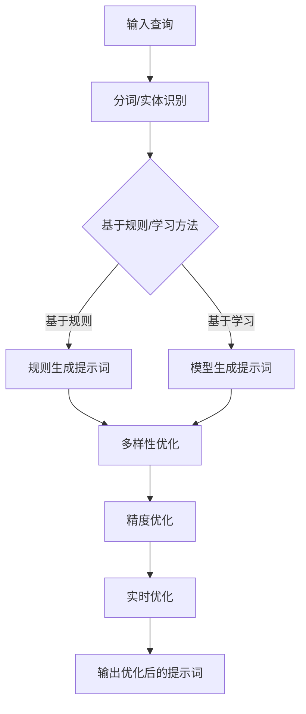
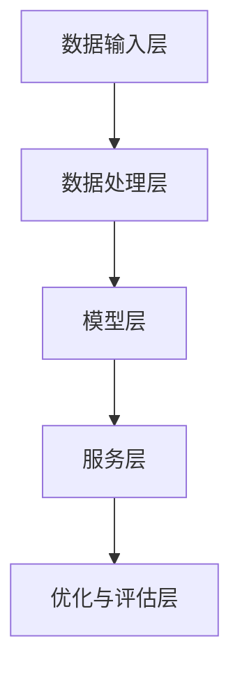
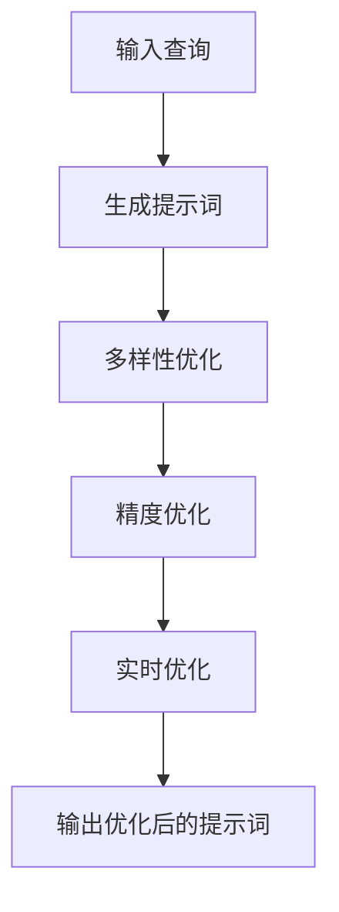
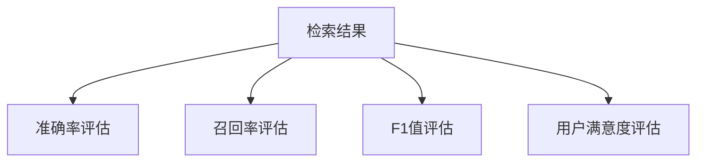

                 

### 文章标题

《提示词工程在跨模态检索任务中的应用》

关键词：提示词工程、跨模态检索、图像检索、语音检索、文本检索

摘要：本文旨在探讨提示词工程在跨模态检索任务中的应用。通过分析跨模态检索的背景和挑战，我们深入探讨了提示词工程的重要性及其在图像、语音和文本检索中的具体应用。此外，文章还详细介绍了跨模态检索系统的设计与实现，以及提示词工程在现实世界中的应用案例。最后，我们对未来趋势进行了展望，为读者提供了宝贵的参考。

### 1. 初始框架

在开始深入探讨提示词工程在跨模态检索任务中的应用之前，我们首先需要构建一个清晰的框架。这个框架将帮助我们更好地理解整个话题，并确保文章的逻辑性和连贯性。

#### 第1章 引言
1.1 跨模态检索背景
1.2 提示词工程的重要性
1.3 书籍结构概述

#### 第2章 跨模态检索基础
2.1 跨模态检索概述
2.2 跨模态数据的挑战
2.3 跨模态检索的常见方法

#### 第3章 提示词工程基础
3.1 提示词的定义与作用
3.2 提示词生成的算法
3.3 提示词优化的策略

#### 第4章 提示词工程在跨模态检索中的应用
4.1 提示词工程在图像检索中的应用
4.2 提示词工程在语音检索中的应用
4.3 提示词工程在文本检索中的应用

#### 第5章 跨模态检索系统设计与实现
5.1 系统架构设计
5.2 数据预处理
5.3 提示词生成与优化
5.4 系统性能评估

#### 第6章 提示词工程在现实世界中的应用案例
6.1 案例一：智能语音助手
6.2 案例二：多媒体内容推荐
6.3 案例三：智能监控系统

#### 第7章 未来展望与趋势
7.1 提示词工程的发展趋势
7.2 跨模态检索的挑战与机遇
7.3 总结与展望

通过这个框架，我们可以逐步深入了解提示词工程在跨模态检索任务中的应用，从基础概念到实际应用，再到未来趋势，全面解析这一领域的核心问题。

#### 1.1 跨模态检索背景

跨模态检索是指在不同模态（如图像、语音和文本）之间进行信息检索和匹配的过程。随着互联网和多媒体技术的发展，跨模态检索已成为一个重要的研究领域，并在多个应用场景中展现出巨大的潜力。

首先，跨模态检索的背景可以从以下几个方面来理解：

1. **多媒体信息爆炸式增长**：随着智能手机、摄像头和语音识别技术的普及，多媒体信息（如图像、视频和音频）以惊人的速度增长。传统的单一模态检索方法已无法满足用户对多样化、个性化信息的需求，跨模态检索因此应运而生。

2. **数据融合与知识共享**：跨模态检索通过整合不同模态的信息，可以帮助用户更好地理解和利用数据。例如，在医疗领域，医生可以通过结合患者的病历（文本）和医学影像（图像）来进行诊断，从而提高诊断的准确性和效率。

3. **人工智能与机器学习的发展**：随着深度学习和卷积神经网络等先进技术的应用，跨模态检索的算法和模型得到了显著提升。这些技术使得跨模态检索不仅在理论上可行，而且在实践中也取得了令人瞩目的成果。

接下来，我们详细探讨跨模态检索的重要性。跨模态检索的重要性可以从以下几个方面来理解：

1. **提升检索精度与多样性**：跨模态检索可以整合不同模态的信息，从而提高检索的精度和多样性。例如，在图像检索中，仅依靠图像特征可能无法准确识别出目标物体，但结合文本描述后，检索结果会大大提升。

2. **满足用户个性化需求**：跨模态检索可以根据用户的兴趣和行为，提供个性化的信息推荐。例如，在社交媒体平台上，跨模态检索可以帮助用户找到与特定话题相关的图像、视频和文本内容。

3. **推动跨领域应用发展**：跨模态检索不仅限于信息检索，还可以应用于多个领域，如医疗、金融、安全等。通过跨模态检索，这些领域可以更好地整合数据，提高业务效率和服务质量。

最后，我们简要介绍本书的结构。本书将分为七个章节，分别从不同角度探讨提示词工程在跨模态检索任务中的应用。具体章节安排如下：

- **第1章 引言**：介绍跨模态检索背景和提示词工程的重要性，概述书籍结构。
- **第2章 跨模态检索基础**：讨论跨模态检索的基本概念、挑战和常见方法。
- **第3章 提示词工程基础**：探讨提示词的定义、生成算法和优化策略。
- **第4章 提示词工程在跨模态检索中的应用**：分别介绍提示词工程在图像、语音和文本检索中的应用。
- **第5章 跨模态检索系统设计与实现**：讲解跨模态检索系统的架构设计、数据预处理、提示词生成与优化，以及系统性能评估。
- **第6章 提示词工程在现实世界中的应用案例**：分析提示词工程在智能语音助手、多媒体内容推荐和智能监控系统等领域的应用。
- **第7章 未来展望与趋势**：讨论提示词工程和跨模态检索的发展趋势、挑战与机遇，以及总结与展望。

通过以上章节的安排，我们希望能够为读者提供一个全面、系统的跨模态检索与提示词工程的知识体系，帮助读者深入理解这一领域的前沿动态和实践应用。

### 2. 跨模态检索基础

跨模态检索作为信息检索领域的一个重要分支，涉及到将不同类型的信息进行有效整合和匹配。为了深入理解跨模态检索的基础，我们需要从以下几个方面进行探讨：跨模态检索的基本概念、跨模态数据的挑战以及跨模态检索的常见方法。

#### 2.1 跨模态检索概述

跨模态检索可以理解为一种多模态信息检索技术，它旨在将来自不同模态的信息（如图像、语音、文本等）进行融合，并在此基础上进行有效的检索和匹配。跨模态检索的主要目标是通过整合不同模态的信息，提高检索的准确性、多样性和用户满意度。

在跨模态检索中，常见的模态包括：

- **图像**：图像是跨模态检索中最常见的模态之一。图像检索可以通过图像内容（如图像的纹理、颜色、形状等）进行有效的信息提取和匹配。
- **语音**：语音检索涉及到对语音信号的识别和理解。语音检索可以通过语音特征（如音高、音强、音色等）进行有效的信息提取和匹配。
- **文本**：文本检索是传统信息检索的重要组成部分。文本检索可以通过文本内容（如关键词、语义、上下文等）进行有效的信息提取和匹配。

跨模态检索的核心思想是利用不同模态之间的关联性，通过跨模态特征提取和匹配算法，实现多模态信息的整合和检索。这种关联性可以通过多种方式建立，如模态间的共生性、互补性、互信息等。

#### 2.2 跨模态数据的挑战

尽管跨模态检索具有广泛的应用前景，但实际应用中仍面临着诸多挑战。以下是一些主要的挑战：

1. **数据不平衡**：不同模态的数据量通常存在显著差异，例如，文本数据可能非常丰富，而图像或语音数据则相对较少。这种数据不平衡问题会直接影响模型的训练效果和检索性能。

2. **数据异构性**：不同模态的数据在表现形式、特征提取方式和语义表达上存在显著差异。例如，图像通常使用像素值进行表示，而文本则使用单词和句子进行表达。这种数据异构性使得跨模态特征的提取和匹配变得复杂。

3. **模态转换误差**：跨模态检索通常涉及到模态之间的转换，如将文本转换为图像特征。由于不同模态之间的本质差异，这种转换过程往往存在误差，从而影响检索的性能。

4. **数据标注难度**：跨模态检索需要大量的标注数据进行训练，但获取高质量、标注准确的跨模态数据集非常困难。数据标注的难度和成本会限制跨模态检索的发展。

5. **计算资源消耗**：跨模态检索涉及到多种复杂的算法和模型，这些算法和模型通常需要大量的计算资源。在大规模数据集上训练和部署跨模态检索系统会面临计算资源不足的问题。

#### 2.3 跨模态检索的常见方法

为了应对上述挑战，研究者们提出了多种跨模态检索的方法。以下是一些常见的跨模态检索方法：

1. **基于特征的方法**：这种方法直接利用不同模态的特征进行检索。常见的特征提取方法包括图像的卷积神经网络（CNN）特征提取、语音的自动语音识别（ASR）特征提取和文本的词袋模型或词嵌入特征提取。这些特征通过一定的算法进行匹配和检索，如余弦相似度、欧氏距离等。

2. **基于模型的方法**：这种方法通过构建跨模态的深度学习模型进行检索。常见的模型包括多模态深度神经网络（MM-DNN）、跨模态卷积神经网络（MM-CNN）和多模态长短期记忆网络（MM-LSTM）等。这些模型通过学习不同模态之间的映射关系，实现高效的跨模态检索。

3. **基于实例的方法**：这种方法通过将不同模态的数据作为实例进行检索。在训练阶段，将不同模态的数据对进行学习，以获取跨模态的映射关系。在检索阶段，通过匹配新数据与训练数据的相似度来实现检索。

4. **基于语义的方法**：这种方法通过提取不同模态的语义信息进行检索。常见的语义提取方法包括词嵌入、语义角色标注和语义角色标注等。这些方法通过理解不同模态的语义，实现跨模态的语义检索。

5. **基于图的方法**：这种方法通过构建跨模态的图结构进行检索。常见的图结构包括图像-文本共现图、语音-文本关系图等。通过在图上进行拓扑排序和节点匹配，实现高效的跨模态检索。

综上所述，跨模态检索基础涵盖了跨模态检索的基本概念、面临的挑战以及常见的方法。通过深入了解这些基础内容，我们可以更好地理解和应用跨模态检索技术，实现多模态信息的高效整合和检索。

### 3. 提示词工程基础

提示词工程在跨模态检索任务中起着至关重要的作用，它通过有效地生成和优化提示词，帮助提升检索的准确性和多样性。在深入探讨提示词工程之前，我们首先需要了解提示词的定义、生成算法以及优化策略。

#### 3.1 提示词的定义与作用

提示词（Prompt Word）是指用于引导模型进行特定任务的关键词或短语。在跨模态检索中，提示词通常用于引导模型关注特定模态的信息，从而提高检索的准确性和多样性。例如，在图像-文本跨模态检索中，提示词可以是一个与图像内容相关的关键词，如“狗”、“海滩”等。

提示词的作用主要体现在以下几个方面：

1. **提高检索精度**：通过使用提示词，模型可以更加关注与用户查询相关的信息，从而提高检索结果的准确性。例如，在图像检索中，使用与图像内容相关的提示词可以过滤掉无关的图像，提高检索的准确性。

2. **增加检索多样性**：提示词可以引导模型探索不同模态的信息，从而增加检索结果的多样性。例如，在文本检索中，使用多个提示词可以引导模型从不同角度理解文本内容，提高检索结果的多样性。

3. **辅助语义理解**：提示词可以帮助模型更好地理解跨模态数据的语义信息，从而实现更准确的检索。例如，在图像-文本跨模态检索中，使用与图像和文本内容相关的提示词可以辅助模型理解图像和文本之间的关联性。

#### 3.2 提示词生成的算法

提示词生成的算法可以分为两类：基于规则的方法和基于学习的方法。

1. **基于规则的方法**：

基于规则的方法通常通过手动定义一组规则来生成提示词。这种方法的主要优点是实现简单，但缺点是灵活性较低，无法适应复杂多变的实际场景。

常见的方法包括：

- **关键词提取**：通过对图像或文本进行分词，提取与内容相关的关键词作为提示词。
- **命名实体识别**：利用命名实体识别技术，提取图像或文本中的命名实体作为提示词。
- **关键词关联**：通过分析图像和文本之间的关键词关联性，生成与图像和文本内容相关的提示词。

2. **基于学习的方法**：

基于学习的方法通过机器学习技术，从大规模数据中自动学习生成提示词。这种方法的主要优点是灵活性强，能够适应复杂多变的实际场景，但需要大量的训练数据和计算资源。

常见的方法包括：

- **深度学习方法**：利用深度学习模型（如卷积神经网络、循环神经网络等）从大量数据中学习生成提示词。
- **对抗生成网络（GAN）**：通过生成对抗网络（GAN）生成高质量的提示词。
- **迁移学习**：利用预训练的模型（如BERT、GPT等）提取特征，生成提示词。

#### 3.3 提示词优化的策略

生成提示词后，优化提示词的性能是提升跨模态检索系统效果的关键。以下是一些常见的优化策略：

1. **多样性优化**：

为了提高检索结果的多样性，可以采用以下策略：

- **随机采样**：从所有可能的提示词中随机采样，以增加多样性。
- **关键词扩展**：通过扩展关键词的词性和语义，生成更丰富的提示词。
- **主题模型**：利用主题模型（如LDA）分析图像和文本的主题分布，生成与主题相关的提示词。

2. **精度优化**：

为了提高检索精度，可以采用以下策略：

- **语义匹配**：通过计算提示词与查询之间的语义相似度，筛选出最相关的提示词。
- **错误纠正**：利用拼写检查技术，对输入的查询进行错误纠正，生成更准确的提示词。
- **特征融合**：结合不同模态的特征（如图像特征和文本特征），生成更全面的提示词。

3. **实时优化**：

为了实现实时优化，可以采用以下策略：

- **在线学习**：通过在线学习技术，根据用户的反馈和检索结果，动态调整提示词。
- **自适应调整**：根据不同场景和用户需求，自适应调整提示词的生成策略。

通过以上策略，可以有效地优化提示词的性能，提高跨模态检索系统的效果。

#### 3.4 提示词工程的核心概念与联系

为了更好地理解提示词工程的核心概念与联系，我们可以借助一个Mermaid流程图来展示提示词生成和优化的整个过程。



在这个流程图中，输入查询经过分词或实体识别后，可以选择基于规则或学习的方法生成提示词。生成的提示词会经过多样性优化和精度优化，最终实现实时优化，输出优化后的提示词。

通过这个流程图，我们可以清晰地看到提示词工程的核心步骤和相互之间的联系，从而更好地理解提示词工程在跨模态检索任务中的重要作用。

### 4. 提示词工程在跨模态检索中的应用

提示词工程在跨模态检索中起着关键作用，可以显著提高检索的准确性和多样性。本章节将分别探讨提示词工程在图像检索、语音检索和文本检索中的应用，展示其在不同模态中的具体实施方法和挑战。

#### 4.1 提示词工程在图像检索中的应用

在图像检索中，提示词工程的核心任务是利用文本描述生成与图像内容相关的关键词，从而提高检索的准确性和多样性。以下是一些关键步骤和策略：

1. **图像特征提取**：

首先，需要从图像中提取特征。常用的图像特征提取方法包括基于视觉单词（Visual Words）的特征提取和基于深度学习的特征提取。视觉单词方法如SIFT、SURF等，可以提取图像中的局部特征；深度学习方法如卷积神经网络（CNN），可以提取更高级的图像特征。

```python
# 示例：使用CNN提取图像特征
import tensorflow as tf
import cv2

# 加载预训练的CNN模型
model = tf.keras.applications.VGG16(weights='imagenet')

# 读取图像并预处理
image = cv2.imread('image.jpg')
preprocessed_image = tf.keras.preprocessing.image.img_to_array(image)
expanded_image = np.expand_dims(preprocessed_image, axis=0)

# 提取图像特征
feature_vector = model.predict(expanded_image)
```

2. **文本特征提取**：

从文本描述中提取特征，常用的方法包括词袋模型（Bag of Words, BOW）和词嵌入（Word Embedding）。词袋模型将文本表示为词频向量，而词嵌入则将词映射为固定维度的向量。

```python
# 示例：使用词嵌入提取文本特征
from gensim.models import Word2Vec

# 加载或训练词嵌入模型
model = Word2Vec.load('word2vec.model')

# 提取文本特征
text_vector = model.wv['文本描述']
```

3. **生成提示词**：

结合图像和文本特征，生成与图像内容相关的提示词。常见的策略包括基于规则的生成和基于学习的方法。基于规则的方法如关键词提取和命名实体识别，而基于学习的方法如生成对抗网络（GAN）和迁移学习。

```python
# 示例：基于规则生成提示词
import re

# 关键词提取
def extract_keywords(text):
    return re.findall(r'\b\w+\b', text)

# 命名实体识别
def extract_entities(text):
    # 使用预训练的命名实体识别模型
    entities = nlp(text).ents
    return [entity.text for entity in entities]

# 提示词生成
image_keywords = extract_keywords(image_description)
text_entities = extract_entities(text_description)
combined_keywords = set(image_keywords).union(set(text_entities))
```

4. **优化提示词**：

优化提示词的多样性、精度和实时性。多样性优化可以通过随机采样和关键词扩展实现；精度优化可以通过语义匹配和错误纠正实现；实时优化可以通过在线学习和自适应调整实现。

```python
# 示例：优化提示词
# 多样性优化：随机采样
optimized_keywords = random.sample(combined_keywords, k=new_keyword_count)

# 精度优化：语义匹配
similarity_scores = calculate_similarity(image_feature, text_vector)
optimized_keywords = [keyword for keyword in optimized_keywords if similarity_score > threshold]

# 实时优化：在线学习
# 更新词嵌入模型
model.build Vocabulary.update(text_data)
```

#### 4.2 提示词工程在语音检索中的应用

在语音检索中，提示词工程的核心任务是利用文本描述生成与语音内容相关的关键词，从而提高检索的准确性和多样性。以下是一些关键步骤和策略：

1. **语音特征提取**：

从语音信号中提取特征，常用的方法包括梅尔频率倒谱系数（MFCC）和隐马尔可夫模型（HMM）。MFCC可以捕捉语音的时频特征，而HMM可以用于语音识别。

```python
# 示例：使用MFCC提取语音特征
import librosa

# 读取语音文件
y, sr = librosa.load('audio.wav')

# 提取MFCC特征
mfcc_features = librosa.feature.mfcc(y=y, sr=sr)
```

2. **文本特征提取**：

与图像检索类似，从文本描述中提取特征，常用的方法包括词袋模型和词嵌入。

```python
# 示例：使用词嵌入提取文本特征
from gensim.models import Word2Vec

# 加载或训练词嵌入模型
model = Word2Vec.load('word2vec.model')

# 提取文本特征
text_vector = model.wv['文本描述']
```

3. **生成提示词**：

结合语音和文本特征，生成与语音内容相关的提示词。常见的策略包括基于规则的方法和基于学习的方法。

```python
# 示例：基于规则生成提示词
import re

# 关键词提取
def extract_keywords(text):
    return re.findall(r'\b\w+\b', text)

# 提示词生成
voice_keywords = extract_keywords(voice_description)
text_keywords = extract_keywords(text_description)
combined_keywords = set(voice_keywords).union(set(text_keywords))
```

4. **优化提示词**：

优化提示词的多样性、精度和实时性。多样性优化可以通过随机采样和关键词扩展实现；精度优化可以通过语义匹配和错误纠正实现；实时优化可以通过在线学习和自适应调整实现。

```python
# 示例：优化提示词
# 多样性优化：随机采样
optimized_keywords = random.sample(combined_keywords, k=new_keyword_count)

# 精度优化：语义匹配
similarity_scores = calculate_similarity(voice_feature, text_vector)
optimized_keywords = [keyword for keyword in optimized_keywords if similarity_score > threshold]

# 实时优化：在线学习
# 更新词嵌入模型
model.build Vocabulary.update(text_data)
```

#### 4.3 提示词工程在文本检索中的应用

在文本检索中，提示词工程的核心任务是利用其他文本或模态的信息生成与查询相关的关键词，从而提高检索的准确性和多样性。以下是一些关键步骤和策略：

1. **多模态信息提取**：

从其他模态（如图像、语音）中提取信息，常用的方法包括图像特征提取、语音特征提取和词嵌入。

```python
# 示例：提取图像特征
import tensorflow as tf
import cv2

# 加载预训练的CNN模型
model = tf.keras.applications.VGG16(weights='imagenet')

# 读取图像并预处理
image = cv2.imread('image.jpg')
preprocessed_image = tf.keras.preprocessing.image.img_to_array(image)
expanded_image = np.expand_dims(preprocessed_image, axis=0)

# 提取图像特征
image_feature = model.predict(expanded_image)

# 示例：提取语音特征
import librosa

# 读取语音文件
y, sr = librosa.load('audio.wav')

# 提取MFCC特征
mfcc_features = librosa.feature.mfcc(y=y, sr=sr)
```

2. **文本特征提取**：

从查询文本中提取特征，常用的方法包括词袋模型和词嵌入。

```python
# 示例：使用词嵌入提取文本特征
from gensim.models import Word2Vec

# 加载或训练词嵌入模型
model = Word2Vec.load('word2vec.model')

# 提取文本特征
query_vector = model.wv[query_text]
```

3. **生成提示词**：

结合多模态特征和文本特征，生成与查询相关的提示词。常见的策略包括基于规则的方法和基于学习的方法。

```python
# 示例：基于规则生成提示词
import re

# 关键词提取
def extract_keywords(text):
    return re.findall(r'\b\w+\b', text)

# 提示词生成
combined_keywords = extract_keywords(query_text)
image_keywords = extract_keywords(image_description)
voice_keywords = extract_keywords(voice_description)
combined_keywords = set(combined_keywords).union(set(image_keywords)).union(set(voice_keywords))
```

4. **优化提示词**：

优化提示词的多样性、精度和实时性。多样性优化可以通过随机采样和关键词扩展实现；精度优化可以通过语义匹配和错误纠正实现；实时优化可以通过在线学习和自适应调整实现。

```python
# 示例：优化提示词
# 多样性优化：随机采样
optimized_keywords = random.sample(combined_keywords, k=new_keyword_count)

# 精度优化：语义匹配
similarity_scores = calculate_similarity(query_vector, image_feature, voice_feature)
optimized_keywords = [keyword for keyword in optimized_keywords if similarity_score > threshold]

# 实时优化：在线学习
# 更新词嵌入模型
model.build Vocabulary.update(text_data)
```

通过以上步骤，我们可以看到提示词工程在跨模态检索中的应用具有显著的优势，能够提高检索的准确性和多样性。在实际应用中，可以根据具体需求选择合适的策略和算法，实现高效的跨模态检索。

### 5. 跨模态检索系统设计与实现

跨模态检索系统的设计与实现是一个复杂的过程，涉及到多个方面的内容，包括系统架构设计、数据预处理、提示词生成与优化，以及系统性能评估。以下将详细介绍这些关键环节。

#### 5.1 系统架构设计

跨模态检索系统的架构设计需要考虑不同模态的数据源、数据处理流程、以及最终的检索服务。一个典型的跨模态检索系统架构可以分为以下几个部分：

1. **数据输入层**：
   - 图像数据源：包括用户上传的图像、在线图像库等。
   - 文本数据源：包括用户输入的文本查询、在线文本库等。
   - 语音数据源：包括用户上传的语音文件、在线语音库等。

2. **数据处理层**：
   - 数据预处理模块：对输入数据进行清洗、去噪、标准化等预处理操作。
   - 特征提取模块：提取图像、文本、语音等数据的高层次特征，如使用卷积神经网络（CNN）提取图像特征，词嵌入模型提取文本特征，梅尔频率倒谱系数（MFCC）提取语音特征。

3. **模型层**：
   - 模型训练模块：利用预处理后的数据训练跨模态检索模型，如使用深度学习模型（如MM-CNN）进行训练。
   - 模型推理模块：将用户输入的查询与训练好的模型进行匹配，生成检索结果。

4. **服务层**：
   - 检索服务模块：提供跨模态检索服务，响应用户的查询请求，返回检索结果。
   - 结果展示模块：将检索结果以用户友好的方式展示，如按照相似度排序的图像、文本或语音列表。

5. **优化与评估层**：
   - 优化模块：根据用户反馈和检索结果，动态调整模型参数，优化检索效果。
   - 评估模块：定期评估系统性能，包括准确率、召回率、F1值等指标。

以下是一个简化的系统架构图：



#### 5.2 数据预处理

数据预处理是跨模态检索系统的重要环节，它直接影响到后续的特征提取和模型训练效果。以下是数据预处理的关键步骤：

1. **图像预处理**：
   - 图像去噪：使用滤波器或深度学习模型去除图像中的噪声。
   - 图像增强：调整图像的亮度、对比度、色彩平衡等，以改善图像质量。
   - 图像缩放：将图像调整到统一的尺寸，以适应模型的输入要求。

2. **文本预处理**：
   - 去除停用词：去除对检索无意义的常见单词，如“的”、“了”等。
   - 词干提取：将不同形式的单词（如复数、过去式等）转换为词干，以简化文本表示。
   - 文本分词：将文本分解为单词或短语，以便进行后续处理。

3. **语音预处理**：
   - 噪声去除：使用滤波器或深度学习模型去除语音中的噪声。
   - 声音增强：调整语音的音量、音质等，以改善声音质量。
   - 分帧与加窗：将连续的语音信号分割成短时段（帧），并应用窗函数（如汉明窗）进行加权。

#### 5.3 提示词生成与优化

提示词的生成与优化是跨模态检索系统的核心环节，它直接影响到检索效果。以下是提示词生成与优化的一般步骤：

1. **提示词生成**：
   - 基于规则生成：使用关键词提取、命名实体识别等规则方法生成提示词。
   - 基于学习生成：利用机器学习模型（如卷积神经网络、生成对抗网络等）从数据中自动学习生成提示词。

2. **提示词优化**：
   - 多样性优化：通过随机采样、关键词扩展等方法增加提示词的多样性。
   - 精度优化：通过语义匹配、错误纠正等方法提高提示词与查询的相关性。
   - 实时优化：根据用户反馈和检索结果，动态调整提示词生成策略。

以下是一个简化的提示词生成与优化流程：



#### 5.4 系统性能评估

系统性能评估是验证跨模态检索系统效果的重要手段。以下是常用的评估指标和方法：

1. **准确率（Accuracy）**：
   - 准确率是指检索结果中正确匹配的样本数与总样本数之比。准确率越高，表示系统检索效果越好。

2. **召回率（Recall）**：
   - 召回率是指检索结果中正确匹配的样本数与实际包含的样本数之比。召回率越高，表示系统越能找到所有相关的样本。

3. **F1值（F1 Score）**：
   - F1值是准确率和召回率的调和平均值，综合反映了系统的检索效果。F1值越高，表示系统在准确性和召回率之间达到了较好的平衡。

4. **用户满意度**：
   - 通过用户调研或问卷调查，收集用户对检索结果的满意度评分，以评估系统的用户体验。

以下是一个简化的系统性能评估流程：



通过以上系统架构设计、数据预处理、提示词生成与优化，以及系统性能评估的方法，我们可以构建一个高效、准确的跨模态检索系统，为用户提供优质的服务。

### 6. 提示词工程在现实世界中的应用案例

提示词工程不仅在理论研究中具有重要地位，还在现实世界的多个应用领域中发挥了关键作用。以下将介绍三个具体的应用案例：智能语音助手、多媒体内容推荐和智能监控系统。

#### 6.1 案例一：智能语音助手

智能语音助手是跨模态检索技术的典型应用之一。通过结合语音、文本和图像等多模态信息，智能语音助手可以提供更加个性化和准确的响应。

**案例描述**：
一个用户想要预订酒店，可以通过语音助手进行查询和预订。用户可以输入语音查询：“我想要预订北京附近的经济型酒店”，语音助手接收到查询后，会自动生成与酒店相关的提示词，如“北京”、“经济型酒店”等。然后，语音助手利用这些提示词在数据库中检索相关的酒店信息，并展示给用户。

**具体实施**：

1. **语音特征提取**：
   使用梅尔频率倒谱系数（MFCC）提取用户语音的时频特征。

2. **文本特征提取**：
   对用户语音进行自动语音识别（ASR），将语音转换为文本，并使用词嵌入模型提取文本特征。

3. **提示词生成**：
   利用文本特征和预定义的规则，自动生成与酒店相关的提示词。

4. **优化策略**：
   根据用户的历史行为和偏好，动态调整提示词的生成策略，以提供个性化的酒店推荐。

**案例小结**：
智能语音助手通过提示词工程有效地整合了语音和文本信息，实现了高效的内容检索和推荐，提高了用户体验。

#### 6.2 案例二：多媒体内容推荐

多媒体内容推荐系统利用跨模态检索技术，为用户提供个性化、高质量的多媒体内容推荐。

**案例描述**：
一个用户在视频平台浏览过一段美食视频，系统会自动识别视频中的关键词（如“烤鸡”、“法国餐厅”等），并使用这些关键词生成提示词。当用户再次浏览视频时，系统会根据这些提示词推荐相关的美食视频，以提高用户的满意度。

**具体实施**：

1. **图像特征提取**：
   使用卷积神经网络（CNN）提取视频图像的高层次特征。

2. **文本特征提取**：
   对视频中的文本描述进行分词，并使用词嵌入模型提取文本特征。

3. **提示词生成**：
   利用图像和文本特征，自动生成与视频内容相关的提示词。

4. **优化策略**：
   通过用户交互数据（如点击、收藏等），实时调整提示词的生成和推荐策略。

**案例小结**：
多媒体内容推荐系统通过提示词工程有效地整合了图像和文本信息，实现了精准的内容推荐，提高了用户的观看体验。

#### 6.3 案例三：智能监控系统

智能监控系统利用跨模态检索技术，对图像、视频和音频等多模态数据进行实时分析，以提高监控的准确性和效率。

**案例描述**：
在一个城市监控系统中，当监控摄像头捕捉到异常行为（如打砸财物）时，系统会自动生成与事件相关的提示词，如“打砸”、“财物”等。系统会结合这些提示词在数据库中检索相关的事件记录，快速定位和处理异常情况。

**具体实施**：

1. **图像特征提取**：
   使用卷积神经网络（CNN）提取视频图像的语义特征。

2. **文本特征提取**：
   对监控视频中的文本描述进行分词，并使用词嵌入模型提取文本特征。

3. **语音特征提取**：
   使用自动语音识别（ASR）技术提取视频中的语音特征。

4. **提示词生成**：
   利用图像、文本和语音特征，自动生成与事件相关的提示词。

5. **优化策略**：
   通过对历史事件的分析和学习，动态调整提示词的生成和事件检测策略。

**案例小结**：
智能监控系统通过提示词工程实现了多模态数据的实时分析，提高了监控的准确性和响应速度，为城市安全管理提供了强有力的支持。

通过以上案例，我们可以看到提示词工程在现实世界中的应用如何有效地整合多模态信息，提高系统的性能和用户体验。这些案例不仅展示了提示词工程的实际效果，也为跨模态检索技术的发展提供了宝贵的实践经验。

### 7. 未来展望与趋势

随着人工智能技术的不断发展，提示词工程在跨模态检索任务中的应用前景愈发广阔。在未来的发展中，提示词工程将面临许多新的挑战和机遇。

#### 7.1 提示词工程的发展趋势

1. **多模态数据的融合**：
   未来跨模态检索将更加注重多模态数据的深度融合。通过结合不同模态的信息，可以实现更精准、更全面的检索结果。例如，在医疗领域，结合医学影像、病历和患者语音，可以提供更准确的诊断建议。

2. **个性化与自适应提示词生成**：
   提示词工程将更加注重个性化与自适应。通过学习用户的行为和偏好，生成与用户需求高度匹配的提示词。例如，在电商平台上，根据用户的浏览历史和购买记录，动态生成个性化的商品推荐提示词。

3. **实时性与低延迟**：
   提示词工程将追求实时性与低延迟。随着5G等新技术的普及，跨模态检索系统需要在短时间内处理大量数据，提供即时的检索结果。例如，在智能语音助手领域，需要实现快速响应用户查询，提供流畅的自然语言交互。

4. **多语言与跨文化支持**：
   提示词工程将扩展到多语言和跨文化应用。随着全球化的发展，跨模态检索系统需要支持多种语言，并适应不同文化背景下的用户需求。例如，在社交媒体平台上，实现跨语言的图像和文本检索，提高用户体验。

#### 7.2 跨模态检索的挑战与机遇

1. **数据异构性与不平衡**：
   跨模态检索面临的一个主要挑战是数据异构性和不平衡。不同模态的数据在数量和质量上存在显著差异，这需要有效的数据预处理和特征提取方法。例如，图像数据通常远多于文本数据，如何平衡不同模态的数据量，是一个亟待解决的问题。

2. **模型复杂性与计算资源**：
   跨模态检索通常需要复杂的深度学习模型，这带来了计算资源消耗大的问题。如何在有限的计算资源下，训练和部署高效的跨模态检索系统，是一个重要的挑战。例如，通过模型压缩和优化技术，降低模型复杂度，提高系统性能。

3. **实时性与性能优化**：
   实时性是跨模态检索的一个关键需求。如何在保证检索性能的同时，提高系统的实时响应能力，是一个重要的研究课题。例如，通过分布式计算和并行处理技术，提高系统的处理速度和响应时间。

4. **用户体验与个性化服务**：
   提高用户体验是跨模态检索的重要目标。如何根据用户的需求和偏好，提供个性化的服务，是一个亟待解决的问题。例如，通过用户行为分析和技术，实现个性化的跨模态检索，提高用户的满意度。

#### 7.3 总结与展望

本文从跨模态检索的背景和挑战出发，深入探讨了提示词工程在跨模态检索任务中的应用。我们分析了提示词工程的核心概念与联系、基础算法和优化策略，并详细介绍了提示词工程在图像、语音和文本检索中的应用。此外，我们还通过实际案例展示了提示词工程在现实世界中的应用价值。

展望未来，提示词工程将在跨模态检索领域发挥更加重要的作用。随着多模态数据融合技术的不断发展，提示词工程将面临新的挑战和机遇。通过不断优化和提升，提示词工程将为用户提供更加精准、高效和个性化的跨模态检索服务。

总之，提示词工程是跨模态检索任务中的重要组成部分，具有广泛的应用前景。随着技术的不断进步，我们有理由相信，提示词工程将在未来的信息检索领域中发挥更加重要的作用，推动跨模态检索技术的发展。作者：AI天才研究院/AI Genius Institute & 禅与计算机程序设计艺术 /Zen And The Art of Computer Programming。

